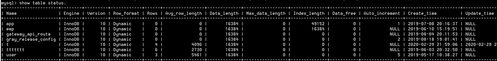

<!-- TOC -->

- [1、查看当前链接数：show processlist](#1查看当前链接数show-processlist)
- [2、查看数据存储位置](#2查看数据存储位置)

<!-- /TOC -->


# 1、查看当前链接数：show processlist

对于Java应用程序来说，一般会把建立好的连接放入数据库连接池中进行复用，只要这个连接不关闭，就会一直在MySQL服务端保持着，可以通过show processlist命令查看，如下：

```sql
mysql> show processlist;
+----+------+-----------------+------+---------+------+----------+------------------+
| Id | User | Host            | db   | Command | Time | State    | Info             |
+----+------+-----------------+------+---------+------+----------+------------------+
|  2 | root | localhost:63664 | NULL | Query   |    0 | starting | show processlist |
+----+------+-----------------+------+---------+------+----------+------------------+
1 row in set (0.14 sec)
```

注意，这里有个Time，表示这个连接多久没有动静了，默认地，如果超过8个小时还没有动静，连接器就会自动断开连接，可以通过`wait_timeout`参数进行控制。


> 字段说明

所产生的列SHOW PROCESSLIST具有以下含义：

- Id:连接标识符，这是同一类型的在所显示的值ID的列INFORMATION_SCHEMA.PROCESSLIST表，该PROCESSLIST_ID性能视图的列threads 表，并且通过返回的 CONNECTION_ID()功能。

- User:发出声明的MySQL用户，如果是system user，它是指由服务器产生的非客户线程，以在内部处理任务。这可能是复制从站或延迟行处理程序使用的I / O或SQL线程。unauthenticated user指的是已经与客户端连接关联但是还没有完成客户机用户的认证的线程。 event_scheduler指的是监视预定事件的线程。如果是system user那么在Host列中不会指定主机 。

- Host:发出该语句的客户端的主机名（system user没有主机除外），以便更容易地确定哪个客户端正在做什么，显示方式：host_name:client_port。

- db:当前执行语句对应的默认数据库，如果选择了；否则为NULL。

- Command:显示这个线程此刻正在执行的命令，一般对应DDL或DML语句。

- Time:表示线程处于当前状态的时间长短，线程当前时间的概念在某些情况下可能会发生改变：线程可以改变时间。对于正在从主机处理事件的从站上运行的线程，线程时间设置为事件中发现的时间，因此反映了主站而不是从站的当前时间。SET TIMESTAMP = value。

- State:对应Command指令，大多数状态对应于非常快速的操作。如果线程在给定状态下保持多秒，则可能存在需要调查的问题。

- Info:包含由线程执行的语句的文本或者NULL，如果它不是执行的话。默认情况下，此值仅包含语句的前100个字符。要查看完整的语句，请使用`SHOW FULL PROCESSLIST`。


> 查看sql进程和杀死进程

如果你执行了一个sql的操作，但是迟迟没有返回，你可以通过查询进程列表看看他的实际执行状况，如果该sql十分耗时，为了避免影响线上可以用kill命令杀死进程，通过查看进程列表也能直观的看下当前sql的执行状态，如果当前数据库负载很高，在进程列表可能会出现，大量的进程夯住，执行时间很长。命令如下：

```sql
--查看进程列表
SHOW PROCESSLIST;
--杀死某个进程
kill 183665
```

如果你使用的sqlyog，那么也有图形化的页面，在菜单栏-工具-显示-进程列表。在进程列表页面可以右键杀死进程。


# 2、查看数据存储位置show global variables like "%datadir%";

```java
mysql> show global variables like "%datadir%";
+---------------+---------------------------------------------+
| Variable_name | Value                                       |
+---------------+---------------------------------------------+
| datadir       | C:\ProgramData\MySQL\MySQL Server 5.7\Data\ |
+---------------+---------------------------------------------+
1 row in set, 1 warning (0.08 sec)
```


# 3、show table status 查看表信息

> 1、使用方法

```
语法:SHOW TABLE STATUS [FROM db_name] [LIKE 'pattern']

参数：[FROM db_name]  可选，表示查询哪个数据库下面的表信息。
　　　[LIKE 'pattern'] 可选，表示查询哪些具体的表名。
```


> 2、输出解释




```sql
mysql> show table status like 'class';
+-------+--------+---------+------------+------+----------------+-------------+-----------------+--------------+-----------+----------------+---------------------+---------------------+------------+-----------------+----------+----------------+---------+
| Name  | Engine | Version | Row_format | Rows | Avg_row_length | Data_length | Max_data_length | Index_length | Data_free | Auto_increment | Create_time         | Update_time         | Check_time | Collation       | Checksum | Create_options | Comment |
+-------+--------+---------+------------+------+----------------+-------------+-----------------+--------------+-----------+----------------+---------------------+---------------------+------------+-----------------+----------+----------------+---------+
| class | InnoDB |      10 | Dynamic    |    6 |           2730 |       16384 |               0 |            0 |         0 |              7 | 2021-03-02 19:45:48 | 2021-03-02 19:49:44 | NULL       | utf8_general_ci |     NULL |                | 课程    |
+-------+--------+---------+------------+------+----------------+-------------+-----------------+--------------+-----------+----------------+---------------------+---------------------+------------+-----------------+----------+----------------+---------+
1 row in set (0.03 sec)
```

```
show table status like 'tableName' \G
show table status
```

- Name:  表名称
- Engine: 表的存储引擎
- Version: 版本
- Row_format: 行格式。对于MyISAM引擎，这可能是Dynamic，Fixed或Compressed。动态行的行长度可变，例如Varchar或Blob类型字段。固定行是指行长度不变，例如Char和Integer类型字段
- Rows:表中的行数。对于MyISAM和其他存储引擎，这个值是精确的，对于innoDB存储引擎，这个值通常是估算的
- Avg_row_length:平均每行包括的字节数 
- Data_length:整个表的数据量(以字节为单位)
- Max_data_length:表可以容纳的最大数据量，该值和存储引擎相关
- Index_length:索引占用磁盘的空间大小(以字节为单位)
- Data_free:对于MyISAM引擎，表示已经分配，但目前没有使用的空间。这部分空间包含之前被删除的行，以及后续可以被insert利用到的空间
- Auto_increment:下一个Auto_increment的值
- Create_time:表的创建时间
- Update_time:表的最近更新时间
- Check_time:使用 check table 或myisamchk工具最后一次检查表的时间
- Collation:表的默认字符集和字符排序规则
- Checksum:如果启用，保存的是整个表的实时校验和
- Create_options:创建表时指定的其他选项
- Comment:包含了其他额外信息，对于MyISAM引擎，保存的是表在创建时带的注释。如果表使用的是innodb引擎 ，保存的是InnoDB表空间的剩余空间。如果是一个视图，注释里面包含了VIEW字样。


# 4、查看 MySQL 数据库中每个表占用的空间大小

如果想知道MySQL数据库中每个表占用的空间、表记录的行数的话，可以打开MySQL的 information_schema 数据库。在该库中有一个 TABLES 表，这个表主要字段分别是：

```
TABLE_SCHEMA : 数据库名
TABLE_NAME：表名
ENGINE：所使用的存储引擎
TABLES_ROWS：记录数
DATA_LENGTH：数据大小
INDEX_LENGTH：索引大小
```

其他字段请参考MySQL的手册，我们只需要了解这几个就足够了。

所以要知道一个表占用空间的大小，那就相当于是 数据大小 + 索引大小 即可。

```sql
SELECT TABLE_NAME,DATA_LENGTH+INDEX_LENGTH,TABLE_ROWS FROM information_schema.TABLES WHERE TABLE_SCHEMA='数据库名' AND TABLE_NAME='表名'
```


# 参考

- [mysql之show table status 查看表信息](https://www.cnblogs.com/pingzhe/p/8059640.html)

- [MySQL SHOW PROCESSLIST协助故障诊断全过程](https://www.jb51.net/article/156313.htm)

