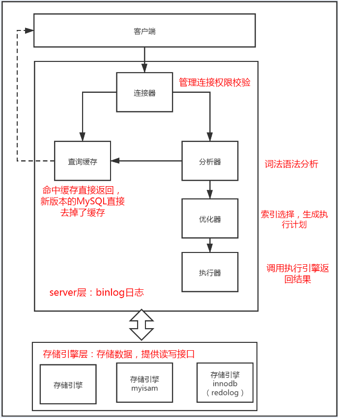

例如：select * from user where id=1

到这里Mysql已经知道你想要做什么了，优化器也帮你优化了知道该怎么做了，那么就开始执行语句吧。
执行语句需要：

- 1、判断你是否有查询权限有就继续执行没有就返回权限错误；

- 2、执行器根据表的引擎定义去调用引擎接口（例：InnoDB）；
    - 2.1、无索引：
        - 1、调用innoDB引擎接口取出这个表的第一行，判断ID是否等于1，如果不是则跳过，如果是则将这行存在结果集中；
        - 2、调用引擎接口取 ‘下一行’ 执行相同判断逻辑，直到取到表的最后一行；
        - 3、执行器将所有满足条件的行 组成的记录作为结果集返回给客户端；
    - 2.2、有索引
        - 与无索引逻辑差不多，第一次调用的是“取满足条件的第一行”这个接口，之后循环的是“满足条件的下一行”这个几口，接口在引擎中已经定义好。

