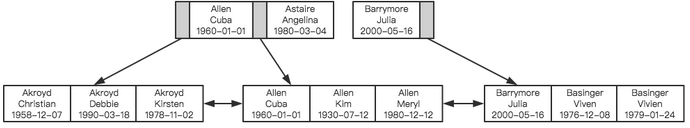
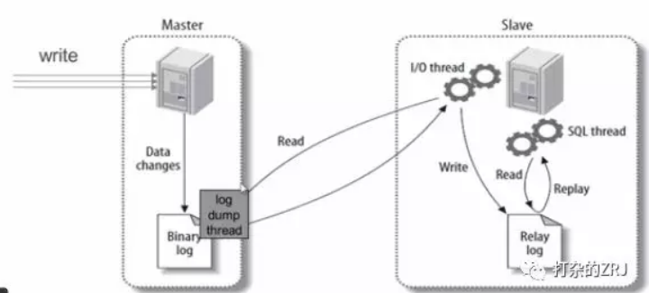

<!-- TOC -->

- [1、优化sql和索引](#1优化sql和索引)
    - [1、Scheme设计与数据类型优化](#1scheme设计与数据类型优化)
    - [2、创建高性能索引](#2创建高性能索引)
        - [1、MySQL不会使用索引的情况：非独立的列](#1mysql不会使用索引的情况非独立的列)
        - [2、前缀索引](#2前缀索引)
        - [3、多列索引和索引顺序](#3多列索引和索引顺序)
        - [4、避免多个范围条件](#4避免多个范围条件)
        - [5、覆盖索引](#5覆盖索引)
        - [6、使用索引扫描来排序](#6使用索引扫描来排序)
        - [7、冗余和重复索引](#7冗余和重复索引)
        - [8、删除长期未使用的索引](#8删除长期未使用的索引)
    - [3、特定类型查询优化](#3特定类型查询优化)
        - [1、优化COUNT()查询](#1优化count查询)
        - [2、优化关联查询](#2优化关联查询)
        - [3、优化LIMIT分页](#3优化limit分页)
        - [4、优化UNION](#4优化union)
- [2、搭建缓存](#2搭建缓存)
- [3、读写分离](#3读写分离)
- [4、利用分区表](#4利用分区表)
- [5、垂直拆分](#5垂直拆分)
- [6、水平拆分](#6水平拆分)
- [参考](#参考)

<!-- /TOC -->


# 1、优化sql和索引

为什么呢？因为这一步成本最低，不需要加什么中间件。你没经过索引优化和SQL优化，就来什么水平拆分，这不是坑人么。大致步骤如下：
- (1)用慢查询日志定位执行效率低的SQL语句
- (2)用explain分析SQL的执行计划
- (3)确定问题，采取相应的优化措施，建立索引啊，等
- (4)进一步可以使用profile分析SQL执行情况；


## 1、Scheme设计与数据类型优化

选择数据类型只要遵循小而简单的原则就好，越小的数据类型通常会更快，占用更少的磁盘、内存，处理时需要的CPU周期也更少。越简单的数据类型在计算时需要更少的CPU周期，比如，整型就比字符操作代价低，因而会使用整型来存储ip地址，使用DATETIME来存储时间，而不是使用字符串。

这里总结几个可能容易理解错误的技巧：

- 1、通常来说把可为NULL的列改为NOT NULL不会对性能提升有多少帮助，只是如果计划在列上创建索引，就应该将该列设置为NOT NULL。

- 2、对整数类型指定宽度，比如INT(11)，没有任何卵用。INT使用32位（4个字节）存储空间，那么它的表示范围已经确定，所以INT(1)和INT(20)对于存储和计算是相同的。

- 3、UNSIGNED表示不允许负值，大致可以使正数的上限提高一倍。比如TINYINT存储范围是-128 ~ 127，而UNSIGNED TINYINT存储的范围却是0 - 255。

- 4、通常来讲，没有太大的必要使用DECIMAL数据类型。即使是在需要存储财务数据时，仍然可以使用BIGINT。比如需要精确到万分之一，那么可以将数据乘以一百万然后使用BIGINT存储。这样可以避免浮点数计算不准确和DECIMAL精确计算代价高的问题。

- 5、TIMESTAMP使用4个字节存储空间，DATETIME使用8个字节存储空间。因而，TIMESTAMP只能表示1970 - 2038年，比DATETIME表示的范围小得多，而且TIMESTAMP的值因时区不同而不同。

- 6、大多数情况下没有使用枚举类型的必要，其中一个缺点是枚举的字符串列表是固定的，添加和删除字符串（枚举选项）必须使用ALTER TABLE（如果只只是在列表末尾追加元素，不需要重建表）。

- 7、schema的列不要太多。原因是存储引擎的API工作时需要在服务器层和存储引擎层之间通过行缓冲格式拷贝数据，然后在服务器层将缓冲内容解码成各个列，这个转换过程的代价是非常高的。如果列太多而实际使用的列又很少的话，有可能会导致CPU占用过高。

- 8、大表ALTER TABLE非常耗时，MySQL执行大部分修改表结果操作的方法是用新的结构创建一个张空表，从旧表中查出所有的数据插入新表，然后再删除旧表。尤其当内存不足而表又很大，而且还有很大索引的情况下，耗时更久。当然有一些奇技淫巧可以解决这个问题，有兴趣可自行查阅。

## 2、创建高性能索引

索引是提高MySQL查询性能的一个重要途径，但过多的索引可能会导致过高的磁盘使用率以及过高的内存占用，从而影响应用程序的整体性能。应当尽量避免事后才想起添加索引，因为事后可能需要监控大量的SQL才能定位到问题所在，而且添加索引的时间肯定是远大于初始添加索引所需要的时间，可见索引的添加也是非常有技术含量的。


但MySQL中索引是如何组织数据的存储呢？以一个简单的示例来说明，假如有如下数据表：
```sql
CREATE TABLE People(
    last_name varchar(50) not null,
    first_name varchar(50) not null,
    dob date not null,
    gender enum(`m`,`f`) not null,
    key(last_name,first_name,dob)
);
```

对于表中每一行数据，索引中包含了last_name、first_name、dob列的值，下图展示了索引是如何组织数据存储的。




可以看到，索引首先根据第一个字段来排列顺序，当名字相同时，则根据第三个字段，即出生日期来排序，正是因为这个原因，才有了索引的“最左原则”。

### 1、MySQL不会使用索引的情况：非独立的列

- [浅谈 MySQL 中优化 SQL 语句查询常用的 30 种方法](https://mp.weixin.qq.com/s/kCzpv6BRZ5WY2EGQrKAMlQ)

- [数据库SQL优化大总结之 百万级数据库优化方案](http://www.cnblogs.com/yunfeifei/p/3850440.html)


“独立的列”是指索引列不能是表达式的一部分，也不能是函数的参数。比如：
select * from where id + 1 = 5

我们很容易看出其等价于 id = 4，但是MySQL无法自动解析这个表达式，使用函数是同样的道理。

索引失效总结：
- 1、is null判断；
- 2、!= 或 <> 操作符；
- 3、in 和not in；
- 4、like %在前；
- 5、where中使用参数；
- 6、字段的表达式运算和函数运算[“=”左边进行函数、算术运算或其他表达式运算]；
- 7、复合索引需要满足左前缀匹配；


下面的测试验证用到的表结构
```sql
CREATE TABLE `sys_user` (
  `user_id` bigint(20) NOT NULL AUTO_INCREMENT,
  `username` varchar(50) NOT NULL COMMENT '用户名',
  `password` varchar(100) DEFAULT NULL COMMENT '密码',
  `salt` varchar(20) DEFAULT NULL COMMENT '盐',
  `email` varchar(100) DEFAULT NULL COMMENT '邮箱',
  `mobile` varchar(100) DEFAULT NULL COMMENT '手机号',
  `status` tinyint(4) DEFAULT NULL COMMENT '状态  0：禁用   1：正常',
  `dept_id` bigint(20) DEFAULT NULL COMMENT '部门ID',
  `create_time` datetime DEFAULT NULL COMMENT '创建时间',
  PRIMARY KEY (`user_id`),
  UNIQUE KEY `username` (`username`),
  KEY `mobile` (`mobile`) USING BTREE
) ENGINE=InnoDB AUTO_INCREMENT=4 DEFAULT CHARSET=utf8 COMMENT='系统用户';
```
- user_id 主键索引
- username 唯一索引
- mobile 普通索引


1.应尽量避免在 where 子句中对字段进行 null 值判断，否则将导致引擎放弃使用索引而进行全表扫描，如：

select id from t where num is null

最好不要给数据库留NULL，尽可能的使用 NOT NULL填充数据库.

备注、描述、评论之类的可以设置为 NULL，其他的，最好不要使用NULL。

不要以为 NULL 不需要空间，比如：char(100) 型，在字段建立时，空间就固定了， 不管是否插入值（NULL也包含在内），都是占用 100个字符的空间的，如果是varchar这样的变长字段， null 不占用空间。


可以在num上设置默认值0，确保表中num列没有null值，然后这样查询：

select id from t where num = 0

```sql
-- 备注：username 为唯一索引

mysql> EXPLAIN SELECT * FROM sys_user   WHERE username is  NULL;
+----+-------------+-------+------------+------+---------------+------+---------+------+------+----------+------------------+
| id | select_type | table | partitions | type | possible_keys | key  | key_len | ref  | rows | filtered | Extra            |
+----+-------------+-------+------------+------+---------------+------+---------+------+------+----------+------------------+
|  1 | SIMPLE      | NULL  | NULL       | NULL | NULL          | NULL | NULL    | NULL | NULL |     NULL | Impossible WHERE |
+----+-------------+-------+------------+------+---------------+------+---------+------+------+----------+------------------+
1 row in set, 1 warning (0.00 sec)

mysql> EXPLAIN SELECT * FROM sys_user   WHERE username is not NULL;
+----+-------------+----------+------------+------+---------------+------+---------+------+------+----------+-------------+
| id | select_type | table    | partitions | type | possible_keys | key  | key_len | ref  | rows | filtered | Extra       |
+----+-------------+----------+------------+------+---------------+------+---------+------+------+----------+-------------+
|  1 | SIMPLE      | sys_user | NULL       | ALL  | username      | NULL | NULL    | NULL |    2 |    50.00 | Using where |


-- is null 的type为null表示可以直接计算获得
-- not NULL type 为all，走的是全表扫描 Using where表示没有走索引

-- 普通索引
mysql> EXPLAIN SELECT * FROM sys_user   WHERE mobile = '1';
+----+-------------+----------+------------+------+---------------+--------+---------+-------+------+----------+-------+
| id | select_type | table    | partitions | type | possible_keys | key    | key_len | ref   | rows | filtered | Extra |
+----+-------------+----------+------------+------+---------------+--------+---------+-------+------+----------+-------+
|  1 | SIMPLE      | sys_user | NULL       | ref  | mobile        | mobile | 303     | const |    1 |   100.00 | NULL  |
+----+-------------+----------+------------+------+---------------+--------+---------+-------+------+----------+-------+
1 row in set, 1 warning (0.00 sec)

mysql> EXPLAIN SELECT * FROM sys_user   WHERE mobile is NULL;
+----+-------------+----------+------------+------+---------------+--------+---------+-------+------+----------+-----------------------+
| id | select_type | table    | partitions | type | possible_keys | key    | key_len | ref   | rows | filtered | Extra                 |
+----+-------------+----------+------------+------+---------------+--------+---------+-------+------+----------+-----------------------+
|  1 | SIMPLE      | sys_user | NULL       | ref  | mobile        | mobile | 303     | const |    1 |   100.00 | Using index condition |
+----+-------------+----------+------------+------+---------------+--------+---------+-------+------+----------+-----------------------+
1 row in set, 1 warning (0.00 sec)

mysql> EXPLAIN SELECT * FROM sys_user   WHERE mobile is NOT NULL;
+----+-------------+----------+------------+------+---------------+------+---------+------+------+----------+-------------+
| id | select_type | table    | partitions | type | possible_keys | key  | key_len | ref  | rows | filtered | Extra       |
+----+-------------+----------+------------+------+---------------+------+---------+------+------+----------+-------------+
|  1 | SIMPLE      | sys_user | NULL       | ALL  | mobile        | NULL | NULL    | NULL |    2 |   100.00 | Using where |
+----+-------------+----------+------------+------+---------------+------+---------+------+------+----------+-------------+

-- 从上面看出 
-- is NULL 普通索引还是走索引了
-- is NOT NULL 没有走索引
-- 结论：不论普通索引还是唯一索引，is null还是走索引了；
```

2.应尽量避免在 where 子句中使用 != 或 <> 操作符，否则将引擎放弃使用索引而进行全表扫描。
[在主键索引走range，唯一索引和普通索引不走索引]
```sql
mysql> EXPLAIN SELECT * FROM sys_user   WHERE user_id != 1;
+----+-------------+----------+------------+-------+---------------+---------+---------+------+------+----------+-------------+
| id | select_type | table    | partitions | type  | possible_keys | key     | key_len | ref  | rows | filtered | Extra       |
+----+-------------+----------+------------+-------+---------------+---------+---------+------+------+----------+-------------+
|  1 | SIMPLE      | sys_user | NULL       | range | PRIMARY       | PRIMARY | 8       | NULL |    3 |   100.00 | Using where |
+----+-------------+----------+------------+-------+---------------+---------+---------+------+------+----------+-------------+
1 row in set, 1 warning (0.00 sec)

mysql> EXPLAIN SELECT * FROM sys_user   WHERE user_id <> 1;
+----+-------------+----------+------------+-------+---------------+---------+---------+------+------+----------+-------------+
| id | select_type | table    | partitions | type  | possible_keys | key     | key_len | ref  | rows | filtered | Extra       |
+----+-------------+----------+------------+-------+---------------+---------+---------+------+------+----------+-------------+
|  1 | SIMPLE      | sys_user | NULL       | range | PRIMARY       | PRIMARY | 8       | NULL |    3 |   100.00 | Using where |
+----+-------------+----------+------------+-------+---------------+---------+---------+------+------+----------+-------------+
1 row in set, 1 warning (0.00 sec)

-- 唯一索引
mysql> EXPLAIN SELECT * FROM sys_user   WHERE username != '1';
+----+-------------+----------+------------+------+---------------+------+---------+------+------+----------+-------------+
| id | select_type | table    | partitions | type | possible_keys | key  | key_len | ref  | rows | filtered | Extra       |
+----+-------------+----------+------------+------+---------------+------+---------+------+------+----------+-------------+
|  1 | SIMPLE      | sys_user | NULL       | ALL  | username      | NULL | NULL    | NULL |    2 |   100.00 | Using where |
+----+-------------+----------+------------+------+---------------+------+---------+------+------+----------+-------------+
1 row in set, 1 warning (0.00 sec)

mysql> EXPLAIN SELECT * FROM sys_user   WHERE username <> '1';
+----+-------------+----------+------------+------+---------------+------+---------+------+------+----------+-------------+
| id | select_type | table    | partitions | type | possible_keys | key  | key_len | ref  | rows | filtered | Extra       |
+----+-------------+----------+------------+------+---------------+------+---------+------+------+----------+-------------+
|  1 | SIMPLE      | sys_user | NULL       | ALL  | username      | NULL | NULL    | NULL |    2 |   100.00 | Using where |
+----+-------------+----------+------------+------+---------------+------+---------+------+------+----------+-------------+
1 row in set, 1 warning (0.00 sec)

-- 普通索引

mysql> EXPLAIN SELECT * FROM sys_user   WHERE mobile != '1';
+----+-------------+----------+------------+------+---------------+------+---------+------+------+----------+-------------+
| id | select_type | table    | partitions | type | possible_keys | key  | key_len | ref  | rows | filtered | Extra       |
+----+-------------+----------+------------+------+---------------+------+---------+------+------+----------+-------------+
|  1 | SIMPLE      | sys_user | NULL       | ALL  | mobile        | NULL | NULL    | NULL |    2 |   100.00 | Using where |
+----+-------------+----------+------------+------+---------------+------+---------+------+------+----------+-------------+
1 row in set, 1 warning (0.00 sec)

mysql> EXPLAIN SELECT * FROM sys_user   WHERE mobile <> '1';
+----+-------------+----------+------------+------+---------------+------+---------+------+------+----------+-------------+
| id | select_type | table    | partitions | type | possible_keys | key  | key_len | ref  | rows | filtered | Extra       |
+----+-------------+----------+------------+------+---------------+------+---------+------+------+----------+-------------+
|  1 | SIMPLE      | sys_user | NULL       | ALL  | mobile        | NULL | NULL    | NULL |    2 |   100.00 | Using where |
+----+-------------+----------+------------+------+---------------+------+---------+------+------+----------+-------------+
1 row in set, 1 warning (0.00 sec)
```


3.应尽量避免在 where 子句中使用 or 来连接条件，如果一个字段有索引，一个字段没有索引，将导致引擎放弃使用索引而进行全表扫描，如：

```sql
select id from t where num=10 or Name = 'admin'

可以这样查询：

select id from t where num = 10
union all
select id from t where Name = 'admin'

```

5.in 和 not in 也要慎用，否则会导致全表扫描，如：

select id from t where num in(1,2,3)

对于连续的数值，能用 between 就不要用 in 了：

select id from t where num between 1 and 3

很多时候用 exists 代替 in 是一个好的选择：

select num from a where num in(select num from b)

用下面的语句替换：

select num from a where exists(select 1 from b where num=a.num)
 

6.下面的查询也将导致全表扫描：

select id from t where name like ‘%abc%’

若要提高效率，可以考虑全文检索。

7.如果在 where 子句中使用参数，也会导致全表扫描。因为SQL只有在运行时才会解析局部变量，但优化程序不能将访问计划的选择推迟到运行时；它必须在编译时进行选择。然 而，如果在编译时建立访问计划，变量的值还是未知的，因而无法作为索引选择的输入项。如下面语句将进行全表扫描：

select id from t where num = @num

可以改为强制查询使用索引：

select id from t with(index(索引名)) where num = @num
.应尽量避免在 where 子句中对字段进行表达式操作，这将导致引擎放弃使用索引而进行全表扫描。如：

select id from t where num/2 = 100
应改为:

select id from t where num = 100*2

9.应尽量避免在where子句中对字段进行函数操作，这将导致引擎放弃使用索引而进行全表扫描。如：

select id from t where substring(name,1,3) = ’abc’       -–name以abc开头的id
select id from t where datediff(day,createdate,’2005-11-30′) = 0    -–‘2005-11-30’    --生成的id
应改为:

select id from t where name like 'abc%'
select id from t where createdate >= '2005-11-30' and createdate < '2005-12-1'

10.不要在 where 子句中的“=”左边进行函数、算术运算或其他表达式运算，否则系统将可能无法正确使用索引。

11.在使用索引字段作为条件时，如果该索引是复合索引，那么必须使用到该索引中的第一个字段作为条件时才能保证系统使用该索引，否则该索引将不会被使用，并且应尽可能的让字段顺序与索引顺序相一致。

12.不要写一些没有意义的查询，如需要生成一个空表结构：

select col1,col2 into #t from t where 1=0
这类代码不会返回任何结果集，但是会消耗系统资源的，应改成这样：
create table #t(…)

13.Update 语句，如果只更改1、2个字段，不要Update全部字段，否则频繁调用会引起明显的性能消耗，同时带来大量日志。

14.对于多张大数据量（这里几百条就算大了）的表JOIN，要先分页再JOIN，否则逻辑读会很高，性能很差。

15.select count(*) from table；这样不带任何条件的count会引起全表扫描，并且没有任何业务意义，是一定要杜绝的。


16.索引并不是越多越好，索引固然可以提高相应的 select 的效率，但同时也降低了 insert 及 update 的效率，因为 insert 或 update 时有可能会重建索引，所以怎样建索引需要慎重考虑，视具体情况而定。一个表的索引数最好不要超过6个，若太多则应考虑一些不常使用到的列上建的索引是否有 必要。

17.应尽可能的避免更新 clustered 索引数据列，因为 clustered 索引数据列的顺序就是表记录的物理存储顺序，一旦该列值改变将导致整个表记录的顺序的调整，会耗费相当大的资源。若应用系统需要频繁更新 clustered 索引数据列，那么需要考虑是否应将该索引建为 clustered 索引。

18.尽量使用数字型字段，若只含数值信息的字段尽量不要设计为字符型，这会降低查询和连接的性能，并会增加存储开销。这是因为引擎在处理查询和连 接时会逐个比较字符串中每一个字符，而对于数字型而言只需要比较一次就够了。

19.尽可能的使用 varchar/nvarchar 代替 char/nchar ，因为首先变长字段存储空间小，可以节省存储空间，其次对于查询来说，在一个相对较小的字段内搜索效率显然要高些。

20.任何地方都不要使用 select * from t ，用具体的字段列表代替“*”，不要返回用不到的任何字段。

21.尽量使用表变量来代替临时表。如果表变量包含大量数据，请注意索引非常有限（只有主键索引）。

22.避免频繁创建和删除临时表，以减少系统表资源的消耗。临时表并不是不可使用，适当地使用它们可以使某些例程更有效，例如，当需要重复引用大型表或常用表中的某个数据集时。但是，对于一次性事件， 最好使用导出表。

23.在新建临时表时，如果一次性插入数据量很大，那么可以使用 select into 代替 create table，避免造成大量 log ，以提高速度；如果数据量不大，为了缓和系统表的资源，应先create table，然后insert。

24.如果使用到了临时表，在存储过程的最后务必将所有的临时表显式删除，先 truncate table ，然后 drop table ，这样可以避免系统表的较长时间锁定。

25.尽量避免使用游标，因为游标的效率较差，如果游标操作的数据超过1万行，那么就应该考虑改写。

26.使用基于游标的方法或临时表方法之前，应先寻找基于集的解决方案来解决问题，基于集的方法通常更有效。

27.与临时表一样，游标并不是不可使用。对小型数据集使用 FAST_FORWARD 游标通常要优于其他逐行处理方法，尤其是在必须引用几个表才能获得所需的数据时。在结果集中包括“合计”的例程通常要比使用游标执行的速度快。如果开发时 间允许，基于游标的方法和基于集的方法都可以尝试一下，看哪一种方法的效果更好。

28.在所有的存储过程和触发器的开始处设置 SET NOCOUNT ON ，在结束时设置 SET NOCOUNT OFF 。无需在执行存储过程和触发器的每个语句后向客户端发送 DONE_IN_PROC 消息。

29.尽量避免大事务操作，提高系统并发能力。

30.尽量避免向客户端返回大数据量，若数据量过大，应该考虑相应需求是否合理。

31、并不是所有索引对查询都有效，SQL是根据表中数据来进行查询优化的，当索引列有大量数据重复时，SQL查询可能不会去利用索引，如一表中有字段sex，male、female几乎各一半，那么即使在sex上建了索引也对查询效率起不了作用。 


实际案例分析：拆分大的 DELETE 或INSERT 语句，批量提交SQL语句
　　如果你需要在一个在线的网站上去执行一个大的 DELETE 或 INSERT 查询，你需要非常小心，要避免你的操作让你的整个网站停止相应。因为这两个操作是会锁表的，表一锁住了，别的操作都进不来了。
　　Apache 会有很多的子进程或线程。所以，其工作起来相当有效率，而我们的服务器也不希望有太多的子进程，线程和数据库链接，这是极大的占服务器资源的事情，尤其是内存。
　　如果你把你的表锁上一段时间，比如30秒钟，那么对于一个有很高访问量的站点来说，这30秒所积累的访问进程/线程，数据库链接，打开的文件数，可能不仅仅会让你的WEB服务崩溃，还可能会让你的整台服务器马上挂了。
　　所以，如果你有一个大的处理，你一定把其拆分，使用 LIMIT oracle(rownum),sqlserver(top)条件是一个好的方法。下面是一个mysql示例：

```
while(1){

 　　//每次只做1000条

　　 mysql_query(“delete from logs where log_date <= ’2012-11-01’ limit 1000”);

 　　if(mysql_affected_rows() == 0){

　　 　　//删除完成，退出！
　　 　　break；
　　}

//每次暂停一段时间，释放表让其他进程/线程访问。
usleep(50000)

}
```
 
[巧用这19条MySQL优化，效率至少提高3倍](https://mp.weixin.qq.com/s/N_MD18LHYxHx4Dhtmcq9hw)

32、SQL语句中IN包含的值不应过多

MySQL对于IN做了相应的优化，即将IN中的常量全部存储在一个数组里面，而且这个数组是排好序的。
但是如果数值较多，产生的消耗也是比较大的。
再例如：select id from t where num in(1,2,3) 对于连续的数值，能用between就不要用in了；再或者使用连接来替换。


33、SELECT语句务必指明字段名称

SELECT*增加很多不必要的消耗（CPU、IO、内存、网络带宽）；
增加了使用覆盖索引的可能性；
当表结构发生改变时，前断也需要更新。所以要求直接在select后面接上字段名。


34、当只需要一条数据的时候，使用limit 1
这是为了使EXPLAIN中type列达到const类型


35、如果排序字段没有用到索引，就尽量少排序

36、如果限制条件中其他字段没有索引，尽量少用or

or两边的字段中，如果有一个不是索引字段，而其他条件也不是索引字段，会造成该查询不走索引的情况。
很多时候使用union all或者是union（必要的时候）的方式来代替“or”会得到更好的效果。

37、尽量用union all代替union

union和union all的差异主要是前者需要将结果集合并后再进行唯一性过滤操作，这就会涉及到排序，增加大量的CPU运算，
加大资源消耗及延迟。当然，union all的前提条件是两个结果集没有重复数据。

38、区分in和exists、not in和not exists

select * from 表A where id in (select id from 表B)
上面SQL语句相当于
select * from 表A where exists(select * from 表B where 表B.id=表A.id)


区分in和exists主要是造成了驱动顺序的改变（这是性能变化的关键），
如果是exists，那么以外层表为驱动表，先被访问，
如果是IN，那么先执行子查询。所以IN适合于外表大而内表小的情况；EXISTS适合于外表小而内表大的情况。

关于not in和not exists，推荐使用not exists，不仅仅是效率问题，not in可能存在逻辑问题。
如何高效的写出一个替代not exists的SQL语句？


原SQL语句：
select colname … from A表 where a.id not in (select b.id from B表)
高效的SQL语句：
select colname … from A表 Left join B表 on where a.id = b.id where b.id is null
取出的结果集如下图表示，A表不在B表中的数据：


39、使用合理的分页方式以提高分页的效率

select id,name from product limit 866613, 20
使用上述SQL语句做分页的时候，可能有人会发现，随着表数据量的增加，直接使用limit分页查询会越来越慢。

优化的方法如下：可以取前一页的最大行数的id，然后根据这个最大的id来限制下一页的起点。
比如此列中，上一页最大的id是866612。SQL可以采用如下的写法：
select id,name from product where id> 866612 limit 20

40、分段查询

在一些用户选择页面中，可能一些用户选择的时间范围过大，造成查询缓慢。主要的原因是扫描行数过多。
这个时候可以通过程序，分段进行查询，循环遍历，将结果合并处理进行展示。

41、不建议使用%前缀模糊查询
例如LIKE“%name”或者LIKE“%name%”，这种查询会导致索引失效而进行全表扫描。但是可以使用LIKE “name%”。

那如何查询%name%？虽然给secret字段添加了索引，但在explain结果并没有使用：
那么如何解决这个问题呢，答案：使用全文索引。

在我们查询中经常会用到select id,fnum,fdst from dynamic_201606 where user_name like '%zhangsan%'; 。
这样的语句，普通索引是无法满足查询需求的。庆幸的是在MySQL中，有全文索引来帮助我们。


创建全文索引的SQL语法是：
ALTER TABLE `dynamic_201606` ADD FULLTEXT INDEX `idx_user_name` (`user_name`);

使用全文索引的SQL语句是：
select id,fnum,fdst from dynamic_201606 where match(user_name) against('zhangsan' in boolean mode);
注意：在需要创建全文索引之前，请联系DBA确定能否创建。同时需要注意的是查询语句的写法与普通索引的区别。

42、关于JOIN优化
LEFT JOIN A表为驱动表，INNER JOIN MySQL会自动找出那个数据少的表作用驱动表，RIGHT JOIN B表为驱动表。

1）MySQL中没有full join，可以用以下方式来解决：
select * from A left join B on B.name = A.name where B.name is null union all select * from B;

2）尽量使用inner join，避免left join：
参与联合查询的表至少为2张表，一般都存在大小之分。
如果连接方式是inner join，在没有其他过滤条件的情况下MySQL会自动选择小表作为驱动表，
但是left join在驱动表的选择上遵循的是左边驱动右边的原则，即left join左边的表名为驱动表。

3）合理利用索引：
被驱动表的索引字段作为on的限制字段。


4）利用小表去驱动大表：

5）巧用STRAIGHT_JOIN：

inner join是由MySQL选择驱动表，但是有些特殊情况需要选择另个表作为驱动表，
比如有group by、order by等「Using filesort」、「Using temporary」时。
STRAIGHT_JOIN来强制连接顺序，在STRAIGHT_JOIN左边的表名就是驱动表，右边则是被驱动表。
在使用STRAIGHT_JOIN有个前提条件是该查询是内连接，也就是inner join。
其他链接不推荐使用STRAIGHT_JOIN，否则可能造成查询结果不准确。


### 2、前缀索引

如果列很长，通常可以索引开始的部分字符，这样可以有效节约索引空间，从而提高索引效率。

### 3、多列索引和索引顺序

在多数情况下，在多个列上建立独立的索引并不能提高查询性能。理由非常简单，MySQL不知道选择哪个索引的查询效率更好，所以在老版本，比如MySQL5.0之前就会随便选择一个列的索引，而新的版本会采用合并索引的策略。

举个简单的例子，在一张电影演员表中，在actor_id和film_id两个列上都建立了独立的索引，然后有如下查询：

select film_id,actor_id from film_actor where actor_id = 1 or film_id = 1

老版本的MySQL会随机选择一个索引，但新版本做如下的优化：

```sql
select film_id,actor_id from film_actor where actor_id = 1  
union all 
select film_id,actor_id from film_actor where film_id = 1 and actor_id <> 1
```

当出现多个索引做相交操作时（多个AND条件），通常来说一个包含所有相关列的索引要优于多个独立索引。

当出现多个索引做联合操作时（多个OR条件），对结果集的合并、排序等操作需要耗费大量的CPU和内存资源，特别是当其中的某些索引的选择性不高，需要返回合并大量数据时，查询成本更高。所以这种情况下还不如走全表扫描。

因此explain时如果发现有索引合并（Extra字段出现Using union），应该好好检查一下查询和表结构是不是已经是最优的，如果查询和表都没有问题，那只能说明索引建的非常糟糕，应当慎重考虑索引是否合适，有可能一个包含所有相关列的多列索引更适合。

前面我们提到过索引如何组织数据存储的，从图中可以看到多列索引时，索引的顺序对于查询是至关重要的，很明显应该把选择性更高的字段放到索引的前面，这样通过第一个字段就可以过滤掉大多数不符合条件的数据。

`索引选择性`是指不重复的索引值和数据表的总记录数的比值，选择性越高查询效率越高，因为选择性越高的索引可以让MySQL在查询时过滤掉更多的行。唯一索引的选择性是1，这是最好的索引选择性，性能也是最好的。

理解索引选择性的概念后，就不难确定哪个字段的选择性较高了，查一下就知道了，比如：

SELECT * FROM payment where staff_id = 2 and customer_id = 584

是应该创建(staff_id,customer_id)的索引还是应该颠倒一下顺序？执行下面的查询，哪个字段的选择性更接近1就把哪个字段索引前面就好。

```sql
select count(distinct staff_id)/count(*) as staff_id_selectivity,
       count(distinct customer_id)/count(*) as customer_id_selectivity,
       count(*) from payment
```

多数情况下使用这个原则没有任何问题，但仍然注意你的数据中是否存在一些特殊情况。举个简单的例子，比如要查询某个用户组下有过交易的用户信息：

select user_id from trade where user_group_id = 1 and trade_amount > 0

MySQL为这个查询选择了索引(user_group_id,trade_amount)，如果不考虑特殊情况，这看起来没有任何问题，但实际情况是这张表的大多数数据都是从老系统中迁移过来的，由于新老系统的数据不兼容，所以就给老系统迁移过来的数据赋予了一个默认的用户组。这种情况下，通过索引扫描的行数跟全表扫描基本没什么区别，索引也就起不到任何作用。推广开来说，经验法则和推论在多数情况下是有用的，可以指导我们开发和设计，但实际情况往往会更复杂，实际业务场景下的某些特殊情况可能会摧毁你的整个设计。

### 4、避免多个范围条件

实际开发中，我们会经常使用多个范围条件，比如想查询某个时间段内登录过的用户：

select user.* from user where login_time > '2017-04-01' and age between 18 and 30;

这个查询有一个问题：它有两个范围条件，login_time列和age列，MySQL可以使用login_time列的索引或者age列的索引，但无法同时使用它们。


### 5、覆盖索引

如果一个索引包含或者说覆盖所有需要查询的字段的值，那么就没有必要再回表查询，这就称为覆盖索引。覆盖索引是非常有用的工具，可以极大的提高性能，因为查询只需要扫描索引会带来许多好处：

索引条目远小于数据行大小，如果只读取索引，极大减少数据访问量.索引是有按照列值顺序存储的，对于I/O密集型的范围查询要比随机从磁盘读取每一行数据的IO要少的多

### 6、使用索引扫描来排序

MySQL有两种方式可以生产有序的结果集，
- 其一是对结果集进行排序的操作，
- 其二是按照索引顺序扫描得出的结果自然是有序的。`如果explain的结果中type列的值为index表示使用了索引扫描来做排序。`

扫描索引本身很快，因为只需要从一条索引记录移动到相邻的下一条记录。但如果索引本身不能覆盖所有需要查询的列，那么就不得不每扫描一条索引记录就回表查询一次对应的行。这个读取操作基本上是随机I/O，因此按照索引顺序读取数据的速度通常要比顺序地全表扫描要慢。

在设计索引时，如果一个索引既能够满足排序，又满足查询，是最好的。只有当索引的列顺序和ORDER BY子句的顺序完全一致，并且所有列的排序方向也一样时，才能够使用索引来对结果做排序。

如果查询需要关联多张表，则只有ORDER BY子句引用的字段全部为第一张表时，才能使用索引做排序。

ORDER BY子句和查询的限制是一样的，都要满足最左前缀的要求（有一种情况例外，就是最左的列被指定为常数，下面是一个简单的示例），其他情况下都需要执行排序操作，而无法利用索引排序。

// 最左列为常数，索引：(date,staff_id,customer_id)
select  staff_id,customer_id from demo where date = '2015-06-01' order by staff_id,customer_id


### 7、冗余和重复索引

冗余索引是指在相同的列上按照相同的顺序创建的相同类型的索引，应当尽量避免这种索引，发现后立即删除。比如有一个索引(A,B)，再创建索引(A)就是冗余索引。冗余索引经常发生在为表添加新索引时，比如有人新建了索引(A,B)，但这个索引不是扩展已有的索引(A)。

大多数情况下都应该尽量扩展已有的索引而不是创建新索引。但有极少情况下出现性能方面的考虑需要冗余索引，比如扩展已有索引而导致其变得过大，从而影响到其他使用该索引的查询。

### 8、删除长期未使用的索引

定期删除一些长时间未使用过的索引是一个非常好的习惯。

关于索引这个话题打算就此打住，最后要说一句，索引并不总是最好的工具，只有当索引帮助提高查询速度带来的好处大于其带来的额外工作时，索引才是有效的。对于非常小的表，简单的全表扫描更高效。对于中到大型的表，索引就非常有效。对于超大型的表，建立和维护索引的代价随之增长，这时候其他技术也许更有效，比如分区表。最后的最后，explain后再提测是一种美德。


## 3、特定类型查询优化

### 1、优化COUNT()查询

COUNT()可能是被大家误解最多的函数了，它有两种不同的作用，`其一是统计某个列值的数量，其二是统计行数。`统计列值时，要求列值是非空的，它不会统计NULL。如果确认括号中的表达式不可能为空时，实际上就是在统计行数。最简单的就是当使用COUNT(*)时，并不是我们所想象的那样扩展成所有的列，实际上，它会忽略所有的列而直接统计行数。

我们最常见的误解也就在这儿，在括号内指定了一列却希望统计结果是行数，而且还常常误以为前者的性能会更好。

但实际并非这样，如果要统计行数，直接使用COUNT(*)，意义清晰，且性能更好。有时候某些业务场景并不需要完全精确的COUNT值，可以用近似值来代替，EXPLAIN出来的行数就是一个不错的近似值，而且执行EXPLAIN并不需要真正地去执行查询，所以成本非常低。通常来说，执行COUNT()都需要扫描大量的行才能获取到精确的数据，因此很难优化，MySQL层面还能做得也就只有覆盖索引了。如果不还能解决问题，只有从架构层面解决了，比如添加汇总表，或者使用redis这样的外部缓存系统。

### 2、优化关联查询

在大数据场景下，表与表之间通过一个冗余字段来关联，要比直接使用JOIN有更好的性能。如果确实需要使用关联查询的情况下，需要特别注意的是：

1、确保ON和USING字句中的列上有索引。在创建索引的时候就要考虑到关联的顺序。当表A和表B用列c关联的时候，如果优化器关联的顺序是A、B，那么就不需要在A表的对应列上创建索引。没有用到的索引会带来额外的负担，一般来说，除非有其他理由，只需要在关联顺序中的第二张表的相应列上创建索引（具体原因下文分析）。

2、确保任何的GROUP BY和ORDER BY中的表达式只涉及到一个表中的列，这样MySQL才有可能使用索引来优化。

要理解优化关联查询的第一个技巧，就需要理解MySQL是如何执行关联查询的。当前MySQL关联执行的策略非常简单，它对任何的关联都执行嵌套循环关联操作，即先在一个表中循环取出单条数据，然后在嵌套循环到下一个表中寻找匹配的行，依次下去，直到找到所有表中匹配的行为为止。然后根据各个表匹配的行，返回查询中需要的各个列。太抽象了？以上面的示例来说明，比如有这样的一个查询：

```sql
SELECT A.xx,B.yy 
FROM A INNER JOIN B USING(c)
WHERE A.xx IN (5,6)
```

假设MySQL按照查询中的关联顺序A、B来进行关联操作，那么可以用下面的伪代码表示MySQL如何完成这个查询：

```sql
outer_iterator = SELECT A.xx,A.c FROM A WHERE A.xx IN (5,6);
outer_row = outer_iterator.next;
while(outer_row) {
    inner_iterator = SELECT B.yy FROM B WHERE B.c = outer_row.c;
    inner_row = inner_iterator.next;
    while(inner_row) {
        output[inner_row.yy,outer_row.xx];
        inner_row = inner_iterator.next;
    }
    outer_row = outer_iterator.next;
}
```

可以看到，最外层的查询是根据A.xx列来查询的，A.c上如果有索引的话，整个关联查询也不会使用。再看内层的查询，很明显B.c上如果有索引的话，能够加速查询，因此只需要在关联顺序中的第二张表的相应列上创建索引即可。

### 3、优化LIMIT分页

当需要分页操作时，通常会使用LIMIT加上偏移量的办法实现，同时加上合适的ORDER BY字句。如果有对应的索引，通常效率会不错，否则，MySQL需要做大量的文件排序操作。

一个常见的问题是当偏移量非常大的时候，比如：LIMIT 10000 20这样的查询，MySQL需要查询10020条记录然后只返回20条记录，前面的10000条都将被抛弃，这样的代价非常高。

优化这种查询一个最简单的办法就是尽可能的使用覆盖索引扫描，而不是查询所有的列。然后根据需要做一次关联查询再返回所有的列。对于偏移量很大时，这样做的效率会提升非常大。考虑下面的查询：

SELECT film_id,description FROM film ORDER BY title LIMIT 50,5;

如果这张表非常大，那么这个查询最好改成下面的样子：

```sql
SELECT film.film_id,film.description
FROM film INNER JOIN (
    SELECT film_id FROM film ORDER BY title LIMIT 50,5
) AS tmp USING(film_id);
```

这里的延迟关联将大大提升查询效率，让MySQL扫描尽可能少的页面，获取需要访问的记录后在根据关联列回原表查询所需要的列。

有时候如果可以使用书签记录上次取数据的位置，那么下次就可以直接从该书签记录的位置开始扫描，这样就可以避免使用OFFSET，比如下面的查询：

SELECT id FROM t LIMIT 10000, 10;

改为：

SELECT id FROM t WHERE id > 10000 LIMIT 10;

其他优化的办法还包括使用预先计算的汇总表，或者关联到一个冗余表，冗余表中只包含主键列和需要做排序的列。

### 4、优化UNION

MySQL处理UNION的策略是先创建临时表，然后再把各个查询结果插入到临时表中，最后再来做查询。因此很多优化策略在UNION查询中都没有办法很好的时候。经常需要手动将WHERE、LIMIT、ORDER BY等字句“下推”到各个子查询中，以便优化器可以充分利用这些条件先优化。


除非确实需要服务器去重，否则就一定要使用UNION ALL，如果没有ALL关键字，MySQL会给临时表加上DISTINCT选项，这会导致整个临时表的数据做唯一性检查，这样做的代价非常高。当然即使使用ALL关键字，MySQL总是将结果放入临时表，然后再读出，再返回给客户端。虽然很多时候没有这个必要，比如有时候可以直接把每个子查询的结果返回给客户端。


理解查询是如何执行以及时间都消耗在哪些地方，再加上一些优化过程的知识，可以帮助大家更好的理解MySQL，理解常见优化技巧背后的原理。


- 1、有非常多的程序员在分享时都会抛出这样一个观点：尽可能不要使用存储过程，存储过程非常不容易维护，也会增加使用成本，应该把业务逻辑放到客户端。既然客户端都能干这些事，那为什么还要存储过程？

- 2、JOIN本身也挺方便的，直接查询就好了，为什么还需要视图呢？


# 2、搭建缓存

在优化sql无法解决问题的情况下，才考虑搭建缓存。毕竟你使用缓存的目的，就是将复杂的、耗时的、不常变的执行结果缓存起来，降低数据库的资源消耗。这里需要注意的是:搭建缓存后，系统的复杂性增加了。你需要考虑很多问题，比如:

- 1、缓存和数据库一致性问题？(比如是更缓存，还是删缓存)
- 2、缓存击穿、缓存穿透、缓存雪崩问题如何解决？是否有做缓存预热的必要。


# 3、读写分离

缓存也搞不定的情况下，搞主从复制，上读写分离。在应用层，区分读写请求。或者利用现成的中间件mycat或者altas等做读写分离。需要注意的是,只要你敢说你用了主从架构，有三个问题，你要准备:

- (1)主从的好处？实现数据库备份，实现数据库负载均衡，提高数据库可用性

- (2)主从的原理?如图所示




主库有一个log dump线程，将binlog传给从库 ，从库有两个线程，一个I/O线程，一个SQL线程，I/O线程读取主库传过来的binlog内容并写入到relay log,SQL线程从relay log里面读取内容，写入从库的数据库。

- (3)如何解决主从一致性?这个问题，我不建议在数据库层面解决该问题。根据CAP定理，主从架构本来就是一种高可用架构，是无法满足一致性的。哪怕你采用同步复制模式或者半同步复制模式，都是弱一致性，并不是强一致性。所以，推荐还是利用缓存，来解决该问题。

步骤如下:
- 1、自己通过测试，计算主从延迟时间，建议mysql版本为5.7以后，因为mysql自5.7开始，多线程复制功能比较完善，一般能保证延迟在1s内。不过话说回来，mysql现在都出到8.x了，还有人用5.x的版本么。
- 2、数据库的写操作，先写数据库，再写cache，但是有效期很短，就比主从延时的时间稍微长一点。
- 3、读请求的时候，先读缓存，缓存存在则直接返回。如果缓存不存在(这时主从同步已经完成)，再读数据库。

# 4、利用分区表

说句实在话，其实可以略过这个阶段。因为很多互联网公司都不建议用分区表，我自己也不太建议用分区表，采用这个分区表，坑太多。

什么是mysql的分区表？所有数据还在一个表中，但物理存储根据一定的规则放在不同的文件中。这个是mysql支持的功能，业务代码不需要改动，
但是sql语句需要改动，sql条件需要带上分区的列。

缺点
- (1)分区键设计不太灵活，如果不走分区键，很容易出现全表锁
- (2)在分区表使用ALTER TABLE … ORDER BY，只能在每个分区内进行order by。
- (3)分区表的分区键创建索引，那么这个索引也将被分区。分区键没有全局索引一说。
- (4)自己分库分表，自己掌控业务场景与访问模式，可控。分区表，研发写了一个sql，都不确定该去哪个分区查，不太可控。

…不列举了，不推荐

# 5、垂直拆分

上面四个阶段都没搞定，就来垂直拆分了。垂直拆分的复杂度还是比水平拆分小的。将你的表，按模块拆分为不同的小表。

如果你有幸能够在什么运营商、银行等公司上班，你会发现他们一个表，几百个字段都是很常见的事情。所以，应该要进行拆分，拆分原则一般是如下三点:
- (1)把不常用的字段单独放在一张表。
- (2)把常用的字段单独放一张表
- (3)经常组合查询的列放在一张表中（联合索引）。

# 6、水平拆分

OK,水平拆分是最麻烦的一个阶段，拆分后会有很多的问题，我再强调一次，水平拆分一定是最最最最后的选择。

从某种意义上，我觉得还不如垂直拆分。因为你用垂直拆分，分成不同模块后，发现单模块的压力过大，你完全可以给该模块单独做优化，例如提高该模块的机器配置等。

如果是水平拆分，拆成两张表，代码需要变动，然后发现两张表还不行，再变代码，再拆成三张表的？水平拆分后，各模块间耦合性太强，成本太大，慎重。

这个阶段一般使用中间件进行，使得代码不进行改动。

# 参考

- [数据库优化的几个阶段](https://mp.weixin.qq.com/s?__biz=MzIwMDgzMjc3NA==&mid=2247483919&idx=1&sn=1770acd65cc326975db7bd1c9a4b6b48&chksm=96f66066a181e970af769b4d408c1d3b2e814c4bf79b50477395f29577d5bc90d8d89db034f6&mpshare=1&scene=1&srcid=1122nwSXJfMG6kxhRR7WZYya#rd)

- [我必须得告诉大家的MySQL优化原理2](https://www.jianshu.com/p/01b9f028d9c7)