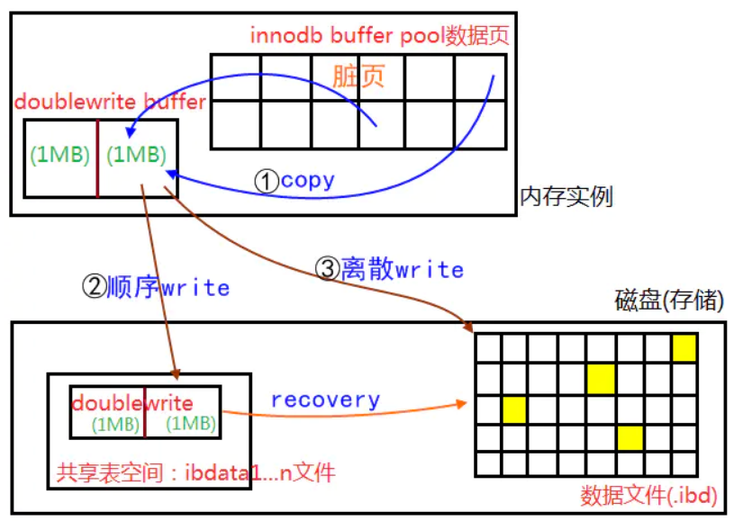

<!-- TOC -->

- [1、LSN（log sequence number）日志序列号](#1lsnlog-sequence-number日志序列号)
    - [1、查看lsn](#1查看lsn)
- [2、CheckPoint](#2checkpoint)
    - [1、当mysql突然挂了，如何做数据一致性呢？](#1当mysql突然挂了如何做数据一致性呢)
- [参考](#参考)

<!-- /TOC -->


`MySQL一次IO写入16K，文件系统block是4k，磁盘IO是512byte`


MySQL Server 有四种类型的日志——Error Log、General Query Log、Binary Log 和 Slow Query Log。

- Error Log:是错误日志，记录 mysqld 的一些错误。

- General Query Log:一般查询日志，记录 mysqld 正在做的事情，比如客户端的连接和断开、来自客户端每条 Sql Statement 记录信息；如果你想准确知道客户端到底传了什么给服务端，这个日志就非常管用了，不过它非常影响性能。

- Binary Log:包含了一些事件，这些事件描述了数据库的改动，如建表、数据改动等，也包括一些潜在改动，比如 DELETE FROM ran WHERE bing = luan，然而一条数据都没被删掉的这种情况。除非使用 Row-based logging，否则会包含所有改动数据的 SQL Statement。那么 Binlog 就有了两个重要的用途——`复制和恢复`。比如主从表的复制，和备份恢复什么的。

- Slow Query Log:慢查询日志，记录一些查询比较慢的 SQL 语句——这种日志非常常用，主要是给开发者调优用的。


# 1、LSN（log sequence number）日志序列号

5.6.3之后占用8字节，LSN主要用于发生crash时对数据进行recovery，LSN是一个一直递增的整型数字，表示事务写入到日志的字节总量。 LSN不仅只存在于重做日志中，在每个数据页头部也会有对应的LSN号，该LSN记录当前页最后一次修改的LSN号，用于在recovery时对比重做日志LSN号决定是否对该页进行恢复数据。前面说的checkpoint也是有LSN号记录的，LSN号串联起一个事务开始到恢复的过程。

## 1、查看lsn

```
show engine innodb status

Log sequence number 2687274848548 
Log flushed up to 2687274848516
Pages flushed up to 2687273963960
Last checkpoint at 2687273963960

```

- Log sequence number: 当前最新的lsn号，最后提交的mtr事务产生的lsn
- log flushed up to:最新刷到redo log文件中的mtr事务产生的lsn号，redo log持久化了 代表着这之前的事务都可以重做。
- pages flushed up to：已经将更改写入脏页的lsn号。buffer pool缓存数据的page已持久化到磁盘 时的lsn号，此时之前的数据都持久到磁盘了，位于检查点之后 和 刷新到redo log之前
- Last checkpoint at就是系统最后一次刷新buffer pool脏中页数据到磁盘的checkpoint。检查点的lsn号，此时之前的事务对应的buffer pool缓存数据的page已持久化到磁盘中，所以当前lsn号之前的redo log文件内容都可以被覆盖掉 不需要用来准备恢复数据了，从Log flushed up to到Last checkpoint at之间的redo log文件的内容才是 用来做crash 时的恢复数据操作


以上4个LSN是递减的，即： LSN1>=LSN2>=LSN3>=LSN4。每个数据页有LSN，重做日志有LSN，checkpoint有LSN。


# 2、CheckPoint

`redo日志里有LSN，页里面也有LSN。checkpoint记录在redo日志里。`

检查点：为了刷新buffer pool的数据page到磁盘中，使得持久化数据page之前相应的redo log可以失效掉 节约出空间可以被覆盖，也同时加快了 crash时redo log恢复的速度。即从检查点恢复即可。

检查点之前的数据已持久化到磁盘中，持久化到磁盘的相应redo log也可以覆盖掉。


> 从缓冲池刷新脏页到磁盘上


```sql
--I/O吞吐量，从缓冲区刷新脏页时，每秒刷新的页的数量为innodb_io_capacity
--每秒刷新的页的数量上限为innodb_io_capacity_max数量，性能不足时 可调整
--默认：200个脏页
mysql> show variables like '%innodb_io%';
+------------------------+-------+
| Variable_name          | Value |
+------------------------+-------+
| innodb_io_capacity     | 200   |
| innodb_io_capacity_max | 2000  |
+------------------------+-------+
2 rows in set (0.00 sec)
 
--脏页占缓冲池75%时，会刷新脏页
--默认：75%
mysql> show variables like 'innodb_max_dirty_pages_pct';
+----------------------------+-----------+
| Variable_name              | Value     |
+----------------------------+-----------+
| innodb_max_dirty_pages_pct | 75.000000 |
+----------------------------+-----------+
1 row in set (0.00 sec)
 
--自适应刷新，无需等innodb_max_dirty_pages_pct的75%到了再刷新脏页，自行根据redo log的产生速度 会优先刷新部分脏页
--默认：开启
mysql> show variables like 'innodb_adaptive_flushing';
+--------------------------+-------+
| Variable_name            | Value |
+--------------------------+-------+
| innodb_adaptive_flushing | ON    |
+--------------------------+-------+
1 row in set (0.00 sec)

```


## 1、当mysql突然挂了，如何做数据一致性呢？

mysql启动之后，会检测redo日志里面的checkpoint，就知道最后写入磁盘的页的LSN都是小于等于这个checkpoint的。就是记录着大于checkpoint的LSN的页，都没及时写入到磁盘，都丢失了。此时内容需要从redo日志获取，利用redo日志进行数据一致性。

doublewrite的过程是，把脏页写入磁盘的过程，先写入内存的doublewrite buffer，然后内存的doublewrite buffer先写一份到共享表空间的double write里。然后再写一份到相对应的表空间里。如果此时突然mysql挂了，mysql重启的时候，这个页的数据从共享表空间那边copy一份过来恢复就行了。




MySQL的数据文件夹

```
|- ib_buffer_pool // 保存缓冲池中页面的表空间ID和页面ID，用于重启恢复缓冲池 
|- ib_logfile0 // redo log 磁盘文件1 
|- ib_logfile1 // redo log 磁盘文件2，默认情况下，重做日志存在磁盘的这两个文件中，循环的方式写入重做日志 
|- ibdata1 // 系统表空间文件 
|- ibtmp1 // 默认临时表空间文件，可通过innodb_temp_data_file_path属性指定文件位置 
|- mysql/ 
|- mysql-bin.000001 // bin log文件 
|- mysql-bin.000001 // bin log文件 ... 
|- mysql-bin.index // bin log文件索引 
|- mysqld.local.err // 错误日志 
|- mysqld.local.pid // mysql进程号 
|- performance_schema/ // performance_schema数据库 
|- sys/ // sys数据库 
|- test/ // 数据库文件夹 
|- db.opt // test数据库配置文件，包含数据库字符集属性 
|- t.frm // 数据表元数据文件，不管是使用独立表空间还是系统表空间，每个表都对应有一个 
|- t.ibd // 数据库表独立表空间文件，如果使用的是独立表空间，则一个表对应一个ibd文件，否则保存在系统表空间文件中

```


# 参考

- [innodb-checkpoints官方文档](https://dev.mysql.com/doc/refman/5.7/en/innodb-checkpoints.html)

- [洞悉MySQL底层架构：游走在缓冲与磁盘之间](https://www.cnblogs.com/arthinking/p/13034126.html)


- [SQL运行内幕：从执行原理看调优的本质](https://www.cnblogs.com/arthinking/p/13205303.html)

- []()