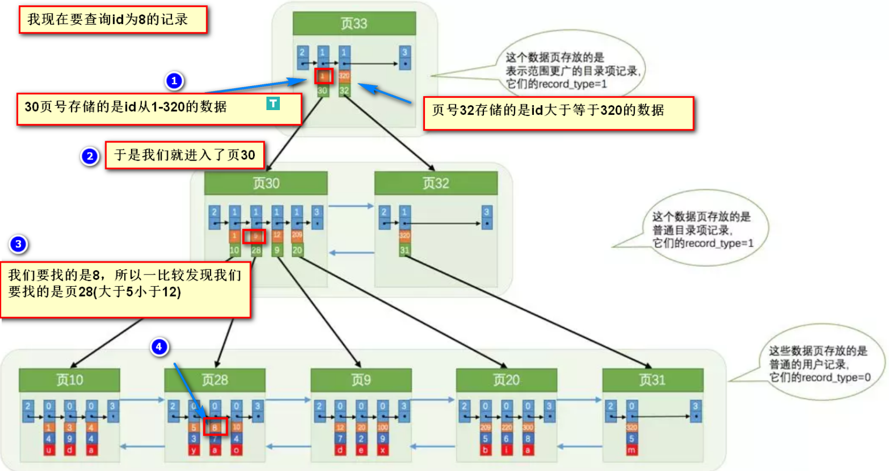

<!-- TOC -->

- [01、MySQL 的索引结构](#01mysql-的索引结构)
    - [0、innodb引擎的主键索引](#0innodb引擎的主键索引)
    - [1、聚族索引的结构](#1聚族索引的结构)
    - [2、非聚族索引的结构](#2非聚族索引的结构)
    - [3、索引覆盖场景](#3索引覆盖场景)
    - [4、MySQL的基本存储结构](#4mysql的基本存储结构)
- [02、索引提高检索速度](#02索引提高检索速度)
- [03、索引降低增删改的速度](#03索引降低增删改的速度)
- [04、哈希索引](#04哈希索引)
- [05、组合索引的最左前缀原则](#05组合索引的最左前缀原则)
    - [1、注意避免冗余索引](#1注意避免冗余索引)
    - [2、为什么是最左原则呢？](#2为什么是最左原则呢)
    - [3、如何创建最优的组合索引例子](#3如何创建最优的组合索引例子)
- [06、聚簇索引和非聚簇索引](#06聚簇索引和非聚簇索引)
- [07、InnoDB与MyISAM索引结构上的区别](#07innodb与myisam索引结构上的区别)
- [08、索引分类](#08索引分类)
    - [1、主键索引 PRIMARY KEY](#1主键索引-primary-key)
    - [2、唯一索引 UNIQUE](#2唯一索引-unique)
    - [3、普通索引 INDEX](#3普通索引-index)
    - [4、组合索引 INDEX](#4组合索引-index)
    - [5、全文索引 FULLTEXT](#5全文索引-fulltext)
- [09、索引设计的原则](#09索引设计的原则)
- [10、索引相关的重要概念](#10索引相关的重要概念)
- [11、索引失效原因](#11索引失效原因)
- [参考](#参考)

<!-- /TOC -->


> 1、对索引的一般认识

- 索引可以加快数据库的检索速度
- 表经常进行INSERT/UPDATE/DELETE操作就不要建立索引了，换言之：索引会降低插入、删除、修改等维护任务的速度。
- 索引需要占物理和数据空间。
- 组合索引最左匹配原则，MySQL会一直向右匹配直到遇到范围查询（>,<,BETWEEN,LIKE）就停止匹配。
- 索引的分类：聚集索引和非聚集索引
- Mysql支持Hash索引和B+树索引两种
- 尽量选择区分度高的列作为索引，区分度的公式是 COUNT(DISTINCT col) / COUNT(*)。表示字段不重复的比率，比率越大我们扫描的记录数就越少。
- 索引列不能参与计算，尽量保持列“干净”。比如，FROM_UNIXTIME(create_time) = '2016-06-06' 就不能使用索引，原因很简单，B+树中存储的都是数据表中的字段值，但是进行检索时，需要把所有元素都应用函数才能比较，显然这样的代价太大。所以语句要写成 ： create_time = UNIX_TIMESTAMP('2016-06-06')。
- 单个多列组合索引和多个单列索引的检索查询效果不同，因为在执行SQL时，MySQL只能使用一个索引，会从多个单列索引中选择一个限制最为严格的索引。


> 2、问题

- 使用索引为什么可以加快数据库的检索速度啊？
- 为什么说索引会降低插入、删除、修改等维护任务的速度。
- 索引的最左匹配原则指的是什么？
- Hash索引和B+树索引有什么区别？主流的使用哪一个比较多？InnoDB存储都支持吗？
- 聚集索引和非聚集索引有什么区别？


# 01、MySQL 的索引结构


> 索引相关的数据结构和算法

通常我们所说的索引是指B-Tree索引，它是目前关系型数据库中查找数据最为常用和有效的索引，大多数存储引擎都支持这种索引。但实际上不同的存储引擎可能使用不同的数据结构，比如InnoDB就是使用的B+Tree。

B+Tree中的B是指balance，意为平衡。需要注意的是，B+树索引并不能找到一个给定键值的具体行，它找到的只是被查找数据行所在的页，接着数据库会把页读入到内存，再在内存中进行查找，最后得到要查找的数据。

在介绍B+Tree前，先了解一下二叉查找树，它是一种经典的数据结构，其左子树的值总是小于根的值，右子树的值总是大于根的值，如下图①。如果要在这课树中查找值为5的记录，其大致流程：先找到根，其值为6，大于5，所以查找左子树，找到3，而5大于3，接着找3的右子树，总共找了3次。同样的方法，如果查找值为8的记录，也需要查找3次。所以二叉查找树的平均查找次数为(3 + 3 + 3 + 2 + 2 + 1) / 6 = 2.3次，而顺序查找的话，查找值为2的记录，仅需要1次，但查找值为8的记录则需要6次，所以顺序查找的平均查找次数为：(1 + 2 + 3 + 4 + 5 + 6) / 6 = 3.3次，因此大多数情况下二叉查找树的平均查找速度比顺序查找要快。

由于二叉查找树可以任意构造，同样的值，可以构造出如图②的二叉查找树，显然这棵二叉树的查询效率和顺序查找差不多。若想二叉查找数的查询性能最高，需要这棵二叉查找树是平衡的，也即平衡二叉树（AVL树）。

平衡二叉树首先需要符合二叉查找树的定义，其次必须满足任何节点的两个子树的高度差不能大于1。显然图②不满足平衡二叉树的定义，而图①是一课平衡二叉树。平衡二叉树的查找性能是比较高的（性能最好的是最优二叉树），查询性能越好，维护的成本就越大。比如图①的平衡二叉树，当用户需要插入一个新的值9的节点时，就需要做出如下变动。


通过一次左旋操作就将插入后的树重新变为平衡二叉树是最简单的情况了，实际应用场景中可能需要旋转多次。至此我们可以考虑一个问题，平衡二叉树的查找效率还不错，实现也非常简单，相应的维护成本还能接受，为什么MySQL索引不直接使用平衡二叉树？

随着数据库中数据的增加，索引本身大小随之增加，不可能全部存储在内存中，因此索引往往以索引文件的形式存储的磁盘上。这样的话，索引查找过程中就要产生磁盘I/O消耗，相对于内存存取，I/O存取的消耗要高几个数量级。可以想象一下一棵几百万节点的二叉树的深度是多少？如果将这么大深度的一颗二叉树放磁盘上，每读取一个节点，需要一次磁盘的I/O读取，整个查找的耗时显然是不能够接受的。那么如何减少查找过程中的I/O存取次数？


一种行之有效的解决方法是减少树的深度，将二叉树变为m叉树（多路搜索树），而B+Tree就是一种多路搜索树。理解B+Tree时，只需要理解其最重要的两个特征即可：
- 第一，所有的关键字（可以理解为数据）都存储在叶子节点（Leaf Page），非叶子节点（Index Page）并不存储真正的数据，所有记录节点都是按键值大小顺序存放在同一层叶子节点上。
- 第二，所有的叶子节点由指针连接。如下图为高度为2的简化了的B+Tree。


怎么理解这两个特征？MySQL将每个节点的大小设置为一个页的整数倍（原因下文会介绍），也就是在节点空间大小一定的情况下，每个节点可以存储更多的内结点，这样每个结点能索引的范围更大更精确。所有的叶子节点使用指针链接的好处是可以进行区间访问，比如上图中，如果查找大于20而小于30的记录，只需要找到节点20，就可以遍历指针依次找到25、30。如果没有链接指针的话，就无法进行区间查找。这也是MySQL使用B+Tree作为索引存储结构的重要原因。

MySQL为何将节点大小设置为页的整数倍，这就需要理解磁盘的存储原理。磁盘本身存取就比主存慢很多，在加上机械运动损耗（特别是普通的机械硬盘），磁盘的存取速度往往是主存的几百万分之一，为了尽量减少磁盘I/O，磁盘往往不是严格按需读取，而是每次都会预读，即使只需要一个字节，磁盘也会从这个位置开始，顺序向后读取一定长度的数据放入内存，预读的长度一般为页的整数倍。

```
页是计算机管理存储器的逻辑块，硬件及OS往往将主存和磁盘存储区分割为连续的大小相等的块，每个存储块称为一页（许多OS中，页的大小通常为4K）。

主存和磁盘以页为单位交换数据。当程序要读取的数据不在主存中时，会触发一个缺页异常，此时系统会向磁盘发出读盘信号，磁盘会找到数据的起始位置并向后连续读取一页或几页载入内存中，然后一起返回，程序继续运行。
```

MySQL巧妙利用了磁盘预读原理，将一个节点的大小设为等于一个页，这样每个节点只需要一次I/O就可以完全载入。为了达到这个目的，每次新建节点时，直接申请一个页的空间，这样就保证一个节点物理上也存储在一个页里，加之计算机存储分配都是按页对齐的，就实现了读取一个节点只需一次I/O。假设B+Tree的高度为h，一次检索最多需要h-1次I/O（根节点常驻内存），复杂度O(h) = O(logmN)。实际应用场景中，M通常较大，常常超过100，因此树的高度一般都比较小，通常不超过3。


最后简单了解下B+Tree节点的操作，在整体上对索引的维护有一个大概的了解，虽然索引可以大大提高查询效率，但维护索引仍要花费很大的代价，因此合理的创建索引也就尤为重要。仍以上面的树为例，我们假设每个节点只能存储4个内节点。首先要插入第一个节点28，如下图所示。

接着插入下一个节点70，在Index Page中查询后得知应该插入到50 - 70之间的叶子节点，但叶子节点已满，这时候就需要进行页分裂的操作，当前的叶子节点起点为50，所以根据中间值来拆分叶子节点，如下图所示。


最后插入一个节点95，这时候Index Page和Leaf Page都满了，就需要做两次拆分，如下图所示。拆分后最终形成了这样一颗树。


B+Tree为了保持平衡，对于新插入的值需要做大量的拆分页操作，而页的拆分需要I/O操作，为了尽可能的减少页的拆分操作，B+Tree也提供了类似于平衡二叉树的旋转功能。当Leaf Page已满但其左右兄弟节点没有满的情况下，B+Tree并不急于去做拆分操作，而是将记录移到当前所在页的兄弟节点上。通常情况下，左兄弟会被先检查用来做旋转操作。就比如上面第二个示例，当插入70的时候，并不会去做页拆分，而是左旋操作。


通过旋转操作可以最大限度的减少页分裂，从而减少索引维护过程中的磁盘的I/O操作，也提高索引维护效率。需要注意的是，删除节点跟插入节点类似，仍然需要旋转和拆分操作，这里就不再说明。


无论是 InnoDb 还是 MyISAM 存储引擎，它们的索引采用的数据结构都是B+ 树，而 B+ 树又是从 B 树演变而来。二叉树虽然查找效率很高，但是也有着一些局限性，特别是当数据存储于外部设备时（如数据库或文件系统），因为这个时候不仅需要考虑算法本身的复杂度，还需要考虑程序与外部设备之间的读写效率。在二叉树中，每一个树节点只保存一条数据，并且最多有两个子节点。程序在查找数据时，读取一条数据，比较，再读取另一条数据，再比较，再读取，如此往复。每读取一次，都涉及到程序和外部设备之间的 IO 开销，而这个开销将大大降低程序的查找效率。于是，便有人提出了增加节点保存的数据条数的想法，譬如 2-3 树（每个节点保存 1 条或 2 条数据）、2-3-4 树（每个节点保存 1 条、2 条或 3 条数据）等，当然也不用限定得这么死，数值范围可以 1 - n 条，`这就是 B 树`。在实际应用中，会根据硬盘上一个 page 的大小来调整 n 的数值，这样可以让一次 IO 操作就读取到 n 条数据，减少了 IO 开销，并且，树的高度显著降低了，查找时只需几次 page 的 IO 即可定位到目标（page 翻译为中文为页，表示 InnoDB 每次从磁盘（data file）到内存（buffer pool）之间传送数据的大小）。一颗典型的 B 树如下图所示


不过在现实场景里几乎没有地方在使用 B 树，这是因为 B 树没有很好的伸缩性，它将多条数据都保存在节点里，如果数据中某个字段太长，一个 page 能容纳的数据量将受到限制，最坏的情况是一个 page 保存一条数据，这个时候 B 树退化成二叉树；另外 B 树无法修改字段最大长度，除非调整 page 大小，重建整个数据库。于是，B+ 树横空出世，在 B+ 树里，内节点（非叶子节点）中不再保存数据，而只保存用于查找的 key，并且所有的叶子节点按顺序使用链表进行连接，这样可以大大的方便范围查询，只要先查到起始位置，然后按链表顺序查找，一直查到结束位置即可。如下图所示


那么在 B+ 树中，数据保存在什么地方呢？关于这一点，InnoDb 和 MyISAM 的实现是不一样的，InnoDb 将数据保存在叶子节点中，而 MyISAM 将数据保存在独立的文件中，MyISAM 有三种类型的文件：*.frm 用于存储表的定义，*.MYI 用于存放表索引，*.MYD 用于存放数据。MYD 文件中的数据是以堆表的形式存储的，所以像 MyISAM 这样以堆形式存储数据的我们通常把它叫做 `堆组织表（Heap organized table，简称 HOT）`，而像 InnoDb 这种将数据保存在叶子节点中，叫做 `索引组织表（Index organized table，简称 IOT）`。

MyISAM 索引结构如下图所示


InnoDb 索引结构如下图所示


可以看到，MyISAM 索引的 B+ 树中，非叶子节点中保存 key，叶子节点中保存着数据的地址，指向数据文件中数据的位置；InnoDb 索引的 B+ 树中，非叶子节点和 MyISAM 一样保存 key，但是叶子节点直接保存数据。所以，MyISAM 在通过索引查找数据时，必须通过两步才能拿到数据（先获取数据的地址，再读取数据文件），InnoDb 在通过索引查找数据时，可以直接读取数据。

注意上面两张图都是对应着 Primary Key 的情况，MySQL 有两种索引类型：主键索引（Primary Index）和非主键索引（Secondary Index，又称为二级索引、辅助索引），MyISAM 存储引擎对两种索引的存储没有区别，InnoDb 存储引擎的数据是保存在主键索引里的，非主键索引里保存着该节点对应的主键。所以 InnoDb 的主键索引有时候又被称为 聚簇索引（Clustered Index），二级索引被称为 非聚簇索引（Nonclustered Index）。如果没有主键，InnoDB 会试着使用一个非空的唯一索引（Unique nonnullable index）代替；如果没有这种索引，会定义一个隐藏的主键。所以 InnoDb 的表一定会有主键索引。关于聚簇索引和二级索引，可以参看这里的 MySQL 文档(https://dev.mysql.com/doc/refman/5.7/en/innodb-index-types.html)。（疑惑：MyISAM 如果没有索引，会怎么样？会定义隐藏的主键吗？）


> 1、为什么使用B+树？

- 1.文件很大，不可能全部存储在内存中，故要存储到磁盘上

- 2.索引的结构组织要尽量减少查找过程中磁盘I/O的存取次数（为什么使用B-/+Tree，还跟磁盘存取原理有关。）

- 3.局部性原理与磁盘预读，预读的长度一般为页（page）的整倍数，（在许多操作系统中，页得大小通常为4k）

- 4.数据库系统巧妙利用了磁盘预读原理，将一个节点的大小设为等于一个页，这样每个节点只需要一次I/O就可以完全载入，(由于节点中有两个数组，所以地址连续)。而红黑树这种结构，h明显要深的多。由于逻辑上很近的节点（父子）物理上可能很远，无法利用局部性


## 0、innodb引擎的主键索引

针对innodb引擎的表存在唯一并且必须的一个聚族索引，并且也是主键索引。这个索引会存在以下三种可能：

- 1、用户创建表的时候设置了主键，这个主键就是聚族索引；
- 2、用户没有设置主键，会用一个唯一且不为空的索引列做为主键，成为此表的聚簇索引；
- 3、如果没有这样的索引，InnoDB会隐式定义一个自增主键来作为聚簇索引；

所以说针对innodb肯定存在一个主键索引，并且根据这个主键构造一个B+树来存储整个表的数据。

创建的非主键索引，如复合索引、前缀索引、唯一索引，都是属于非聚簇索引，又称为辅助索引(secondary index)，其数据结构也是B+树。设置了几个索引就会多存在几个B+树，索引的增多会增加数据插入、更新、删除的维护成本。


InnoDB 表是基于聚簇索引建立的。因此InnoDB 的索引能提供一种非常快速的主键查找性能。不过，它的辅助索引（Secondary Index， 也就是非主键索引）也会包含主键列，所以，如果主键定义的比较大，其他索引也将很大。如果想在表上定义 、很多索引，则争取尽量把主键定义得小一些。InnoDB 不会压缩索引。
文字符的ASCII码作为比较准则。聚集索引这种实现方式使得按主键的搜索十分高效，但是辅助索引搜索需要检索两遍索引：首先检索辅助索引获得主键，然后用主键到主索引中检索获得记录。


不同存储引擎的索引实现方式对于正确使用和优化索引都非常有帮助，例如知道了InnoDB的索引实现后，就很容易明白为什么不建议使用过长的字段作为主键，因为所有辅助索引都引用主索引，过长的主索引会令辅助索引变得过大。再例如，用非单调的字段作为主键在InnoDB中不是个好主意，因为InnoDB数据文件本身是一颗B+Tree，非单调的主键会造成在插入新记录时数据文件为了维持B+Tree的特性而频繁的分裂调整，十分低效，而使用自增字段作为主键则是一个很好的选择。


## 1、聚族索引的结构

先来一张带主键的表，如下所示，pId是主键

```sql
pId	name	birthday
5	zhangsan	2016-10-02
8	lisi	2015-10-04
11	wangwu	2016-09-02
13	zhaoliu	2015-10-07
```


上半部分是由主键形成的B+树，下半部分就是磁盘上真实的数据！

语句执行过程：select * from table where pId='11'


如上图所示，从根开始，经过3次查找，就可以找到真实数据。如果不使用索引，那就要在磁盘上，进行逐行扫描，直到找到数据位置。显然，使用索引速度会快。但是在写入数据的时候，需要维护这颗B+树的结构，因此写入性能会下降！


## 2、非聚族索引的结构

create index index_name on table(name);

在name字段上创建一个非聚族索引


会根据你的索引字段生成一颗新的B+树。因此， 我们每加一个索引，就会增加表的体积， 占用磁盘存储空间。然而，注意看叶子节点，非聚簇索引的叶子节点并不是真实数据，它的叶子节点依然是索引节点，存放的是该索引字段的值以及对应的主键索引(聚簇索引)。

非聚族索引的执行过程：select * from table where name='lisi'


通过上图红线可以看出，先从非聚簇索引树开始查找，然后找到聚簇索引后。根据聚簇索引，在聚簇索引的B+树上，找到完整的数据！这里经历了一次回表查询过程。

注意：`多加一个索引，就会多生成一颗非聚簇索引树。`

## 3、索引覆盖场景

select name from table where name='lisi'

非聚族索引包含我们查找的全部字段


如上图红线所示，如果在非聚簇索引树上找到了想要的值，就不会去聚簇索引树上查询。


## 4、MySQL的基本存储结构

首先Mysql的基本存储结构是页(记录都存在页里边)：


- 各个`数据页`可以组成一个`双向链表`
- 每个数据页中的记录又可以组成一个`单向链表`
    - 每个数据页都会为存储在它里边儿的记录生成一个`页目录`，在通过主键查找某条记录的时候可以在页目录中使用`二分法`快速定位到对应的槽，然后再遍历该槽对应分组中的记录即可快速找到指定的记录
    - 以`其他列(非主键)`作为搜索条件：只能从最小记录开始依次遍历单链表中的每条记录。


所以说，如果我们写select * from user where username = 'zhangsan'这样没有进行任何优化的sql语句，默认会这样做：

- 1、定位到记录所在的页，需要遍历双向链表，找到所在的页；`主键索引查找的时候如何从双向链表中定位到所在的页？`
- 2、从所在的页内中查找相应的记录，由于不是根据主键查询，只能遍历所在页的单链表了；

很明显，在数据量很大的情况下这样查找会很慢！


# 02、索引提高检索速度

索引做了些什么可以让我们查询加快速度呢？其实就是将无序的数据变成有序(相对)


要找到id为8的记录简要步骤：




很明显的是：没有用索引我们是需要遍历双向链表来定位对应的页，现在通过`目录`就可以很快地定位到对应的页上了！

其实底层结构就是B+树，B+树作为树的一种实现，能够让我们很快地查找出对应的记录。


# 03、索引降低增删改的速度

B+树是平衡树的一种。如果我们对这颗树增删改的话，那肯定会破坏它的原有结构。要维持平衡树，就必须做额外的工作。正因为这些额外的工作开销，导致索引会降低增删改的速度

# 04、哈希索引

哈希索引就是采用一定的哈希算法，把键值换算成新的哈希值，检索时不需要类似B+树那样从根节点到叶子节点逐级查找，只需一次哈希算法即可立刻定位到相应的位置，速度非常快。

哈希索引有好几个局限：

- 哈希索引也没办法利用索引完成排序
- 不支持最左匹配原则
- 在有大量重复键值情况下，哈希索引的效率也是极低的---->哈希碰撞问题。
- 不支持范围查询


# 05、组合索引的最左前缀原则

MySQL中的索引可以以一定顺序引用多列，这种索引叫作联合索引。如User表的name和city加联合索引就是(name,city)o而最左前缀原则指的是，如果查询的时候查询条件精确匹配索引的左边连续一列或几列，则此列就可以被用到。如下：        

```                                                                                       
select * from user where name=xx and city=xx ; ／／可以命中索引
select * from user where name=xx ; // 可以命中索引
select * from user where city=xx; // 无法命中索引            
```                                                          
这里需要注意的是，查询的时候如果两个条件都用上了，但是顺序不同，如 `city= xx and name ＝xx`，那么现在的查询引擎会自动优化为匹配联合索引的顺序，这样是能够命中索引的.

由于最左前缀原则，在创建联合索引时，索引字段的顺序需要考虑字段值去重之后的个数，较多的放前面。ORDERBY子句也遵循此规则。

`MySQL会一直向右匹配直到遇到范围查询（>,<,BETWEEN,LIKE）就停止匹配`

## 1、注意避免冗余索引

冗余索引指的是索引的功能相同，能够命中 就肯定能命中 ，那么 就是冗余索引如（name,city ）和（name ）这两个索引就是冗余索引，能够命中后者的查询肯定是能够命中前者的 在大多数情况下，都应该尽量扩展已有的索引而不是创建新索引。

MySQLS.7 版本后，可以通过查询 sys 库的 `schemal_r dundant_indexes` 表来查看冗余索引  

## 2、为什么是最左原则呢？ 

这是一张表格，col1 是主建，col2和col3 是普通字段。 


那么，多列的索引是这样的 


也就是说，联合索引(col1, col2, col3)也是一棵B+树，其非叶子节点存储的是第一个关键字的索引，而叶子节点存储的则是三个关键字col1、col2、col3三个关键字的数据，且按照col1-col2-col3的顺序进行排序。

`问题：上面的描述不是很恰当，中间节点存储多个索引组合的值，如下面`

假设，我们对(a,b)字段建立索引，那么入下图所示：


如图所示他们是按照a来进行排序，在a相等的情况下，才按b来排序。

因此，我们可以看到a是有序的1，1，2，2，3，3。而b是一种全局无序，局部相对有序状态!什么意思呢？

从全局来看，b的值为1，2，1，4，1，2，是无序的，因此直接执行b = 2这种查询条件没有办法利用索引。

从局部来看，当a的值确定的时候，b是有序的。例如a = 1时，b值为1，2是有序的状态。当a=2时候，b的值为1,4也是有序状态。
因此，你执行a = 1 and b = 2是a,b字段能用到索引的。而你执行a > 1 and b = 2时，a字段能用到索引，b字段用不到索引。因为a的值此时是一个范围，不是固定的，在这个范围内b值不是有序的，因此b字段用不上索引。

综上所示，最左匹配原则，在遇到范围查询的时候，就会停止匹配。


## 3、如何创建最优的组合索引例子


> 题型一

如果sql为

SELECT * FROM table WHERE a = 1 and b = 2 and c = 3; 

如何建立索引?

如果此题回答为对(a,b,c)建立索引，那都可以回去等通知了。此题正确答法是，(a,b,c)或者(c,b,a)或者(b,a,c)都可以，`重点要的是将区分度高的字段放在前面，区分度低的字段放后面`。像性别、状态这种字段区分度就很低，我们一般放后面。

例如假设区分度由大到小为b,a,c。那么我们就对(b,a,c)建立索引。在执行sql的时候，优化器会 帮我们调整where后a,b,c的顺序，让我们用上索引。

> 题型二

如果sql为

SELECT * FROM table WHERE a > 1 and b = 2; 

如何建立索引?如果此题回答为对(a,b)建立索引，那都可以回去等通知了。此题正确答法是，对(b,a)建立索引。如果你建立的是(a,b)索引，那么只有a字段能用得上索引，毕竟最左匹配原则遇到范围查询就停止匹配。如果对(b,a)建立索引那么两个字段都能用上，优化器会帮我们调整where后a,b的顺序，让我们用上索引。

> 题型三

如果sql为

SELECT * FROM `table` WHERE a > 1 and b = 2 and c > 3; 

如何建立索引?此题回答也是不一定，(b,a)或者(b,c)都可以，要结合具体情况具体分析。

拓展一下

SELECT * FROM `table` WHERE a = 1 and b = 2 and c > 3; 
怎么建索引？嗯，大家一定都懂了！

> 题型四

SELECT * FROM `table` WHERE a = 1 ORDER BY b;

如何建立索引？这还需要想？一看就是对(a,b)建索引，当a = 1的时候，b相对有序，可以避免再次排序！那么

SELECT * FROM `table` WHERE a > 1 ORDER BY b; 

如何建立索引？对(a)建立索引，因为a的值是一个范围，这个范围内b值是无序的，没有必要对(a,b)建立索引。

拓展一下

SELECT * FROM `table` WHERE a = 1 AND b = 2 AND c > 3 ORDER BY c;

怎么建索引?

> 题型五

SELECT * FROM `table` WHERE a IN (1,2,3) and b > 1; 

如何建立索引？还是对(a，b)建立索引，因为IN在这里可以视为等值引用，不会中止索引匹配，所以还是(a,b)!

拓展一下

SELECT * FROM `table` WHERE a = 1 AND b IN (1,2,3) AND c > 3 ORDER BY c;

如何建立索引？此时c排序是用不到索引的。


# 06、聚簇索引和非聚簇索引

- 聚簇索引：主索引的结构和数据在一起（即主键索引）
- 非聚簇索引：主索引的结构和数据不在一起（辅助索引）

    
创建的索引，如复合索引、前缀索引、唯一索引，都是属于非聚簇索引，在有的书籍中，又将其称为辅助索引(secondary index)。


在Innodb中，Mysql中的数据是按照主键的顺序来存放的。那么聚簇索引就是按照每张表的主键来构造一颗B+树，叶子节点存放的就是整张表的行数据。由于表里的数据只能按照一颗B+树排序，因此一张表只能有一个聚簇索引。在Innodb中，聚簇索引默认就是主键索引。


# 07、InnoDB与MyISAM索引结构上的区别

- 1.MyISAM索引文件和数据文件是分离的，索引文件仅保存数据记录的地址。而在InnoDB中，表数据文件本身就是按B+Tree组织的一个索引结构，这棵树的叶节点data域保存了完整的数据记录。这个索引的key是数据表的主键，因此InnoDB表数据文件本身就是主索引，所以必须有主键，如果没有显示定义，自动为生成一个隐含字段作为主键，这个字段长度为6个字节，类型为长整形

- 2.InnoDB的辅助索引（Secondary Index， 也就是非主键索引）也会包含主键列，比如名字建立索引，内部节点 会包含名字，叶子节点会包含该名字对应的主键的值，如果主键定义的比较大，其他索引也将很大

- 3.MyISAM引擎使用B+Tree作为索引结构，索引文件叶节点的data域存放的是数据记录的地址，指向数据文件中对应的值，每个节点只有该索引列的值

- 4.MyISAM主索引和辅助索引（Secondary key）在结构上没有任何区别，只是主索引要求key是唯一的，辅助索引可以重复，（由于MyISAM辅助索引在叶子节点上存储的是数据记录的地址，和主键索引一样，所以相对于B+的InnoDB可通过辅助索引快速找到所有的数据，而不需要再遍历一边主键索引，所以适用于OLAP）

> 总结

- 主索引的区别，InnoDB的数据文件本身就是索引文件。而MyISAM的索引和数据是分开的。
- 辅助索引的区别：InnoDB的辅助索引data域存储相应记录主键的值而不是地址。而MyISAM的辅助索引和主索引没有多大区别。


# 08、索引分类

## 1、主键索引 PRIMARY KEY 

它是一种特殊的唯一索引，不允许有空值。一般是在建表的时候同时创建主键索引。注意：一个表只能有一个主键

```
ALTER TABLE `table_name` ADD PRIMARY KEY ( `column` ) 
```

## 2、唯一索引 UNIQUE

唯一索引列的值必须唯一，但允许有空值。如果是组合索引，则列值的组合必须唯一。

```
ALTER TABLE `table_name` ADD UNIQUE ( `column` ) 

ALTER TABLE table_name ADD UNIQUE (column1,column2)
```

## 3、普通索引 INDEX

最基本的索引，它没有任何限制。

```
ALTER TABLE `table_name` ADD INDEX index_name ( `column` )
```


## 4、组合索引 INDEX

组合索引，即一个索引包含多个列。多用于避免回表查询。


```
ALTER TABLE `table_name` ADD INDEX index_name ( `column1`, `column2`, `column3` )
```


## 5、全文索引 FULLTEXT

全文索引（也称全文检索）是目前搜索引擎使用的一种关键技术。

```
ALTER TABLE `table_name` ADD FULLTEXT ( `column`) 
```

索引一经创建不能修改，如果要修改索引，只能删除重建。可以使用DROP INDEX index_name ON table_name;删除索引。


# 09、索引设计的原则

- 适合索引的列是出现在where子句中的列，或者连接子句中指定的列

- 基数较小的列，索引效果较差，没有必要在此列建立索引

- 使用短索引，如果对长字符串列进行索引，应该指定一个前缀长度，这样能够节省大量索引空间

- 不要过度索引。索引需要额外的磁盘空间，并降低写操作的性能。在修改表内容的时候，索引会进行更新甚至重构，索引列越多，这个时间就会越长。所以只保持需要的索引有利于查询即可。

- 索引基数：基数是数据列所包含的不同值的数量。例如，某个数据列包含值1、3、7、4、7、3，那么它的基数就是4。索引的基数相对于数据表行数较高（也就是说，列中包含很多不同的值，重复的值很少）的时候，它的工作效果最好。如果某数据列含有很多不同的年龄，索引会很快地分辨数据行。如果某个数据列用于记录性别（只有"M"和"F"两种值），那么索引的用处就不大。如果值出现的几率几乎相等，那么无论搜索哪个值都可能得到一半的数据行。在这些情况下，最好根本不要使用索引，因为查询优化器发现某个值出现在表的数据行中的百分比很高的时候，它一般会忽略索引，进行全表扫描。惯用的百分比界线是"30%"。


# 10、索引相关的重要概念

- 1、基数:单个列唯一键（distict_keys）的数量叫做基数。
SELECT COUNT(DISTINCT name),COUNT(DISTINCT gender) FROM user;

- 2、回表：当对一个列创建索引之后，索引会包含该列的键值及键值对应行所在的rowid。通过索引中记录的rowid访问表中的数据就叫回表。回表会影响性能。EXPLAIN命令结果中的Using Index意味着不会回表，通过索引就可以获得主要的数据。Using Where则意味着需要回表取数据。

- 3、查看索引的使用情况：有些时候虽然数据库有索引，但是并不被优化器选择使用。我们可以通过SHOW STATUS LIKE 'Handler_read%';查看索引的使用情况：

```sql
mysql> SHOW STATUS LIKE 'Handler_read%';
+-----------------------+-------+
| Variable_name         | Value |
+-----------------------+-------+
| Handler_read_first    | 0     |
| Handler_read_key      | 0     |
| Handler_read_last     | 0     |
| Handler_read_next     | 0     |
| Handler_read_prev     | 0     |
| Handler_read_rnd      | 0     |
| Handler_read_rnd_next | 5174  |
+-----------------------+-------+
7 rows in set (0.01 sec)
```

Handler_read_key：如果索引正在工作，Handler_read_key的值将很高。

Handler_read_rnd_next：数据文件中读取下一行的请求数，如果正在进行大量的表扫描，值将较高，则说明索引利用不理想。


# 11、索引失效原因

- 1、对索引列运算，运算包括（+、-、*、/、！、<>、%、like'%_'（%放在前面）
- 2、类型错误，如字段类型为varchar，where条件用number。
- 3、对索引应用内部函数，这种情况下应该建立基于函数的索引。如select * from template t where ROUND(t.logicdb_id) = 1此时应该建ROUND(t.logicdb_id)为索引，mysql8.0开始支持函数索引，5.7可以通过虚拟列的方式来支持，之前只能新建一个ROUND(t.logicdb_id)列然后去维护
- 4、如果条件有or，即使其中有条件带索引也不会使用（这也是为什么建议少使用or的原因），如果想使用or，又想索引有效，只能将or条件中的每个列加上索引
- 5、如果列类型是字符串，那一定要在条件中数据使用引号，否则不使用索引；
- 6、B-tree索引 is null不会走,is not null会走,位图索引 is null,is not null 都会走
- 7、组合索引遵循最左原则

备注：可以结合索引树的特点进行判断。


# 参考

- [MySQL(Innodb)索引的原理](https://www.cnblogs.com/rjzheng/p/9915754.html)

- [数据库两大神器【索引和锁】](https://juejin.cn/post/6844903645125820424)

- [MySQL——索引基础](www.cnblogs.com/kerrycode/p/9484559.html)

- [MySQL——索引优化实战](https://mp.weixin.qq.com/s/1jnwkifOGTYJhCCwu6zwHg)

- [谈谈你对mysql联合索引的认识？](https://www.cnblogs.com/rjzheng/p/12557314.html)

- [mysql基本知识点梳理和查询优化](http://www.cnblogs.com/chenfangzhi/p/9979676.html)


