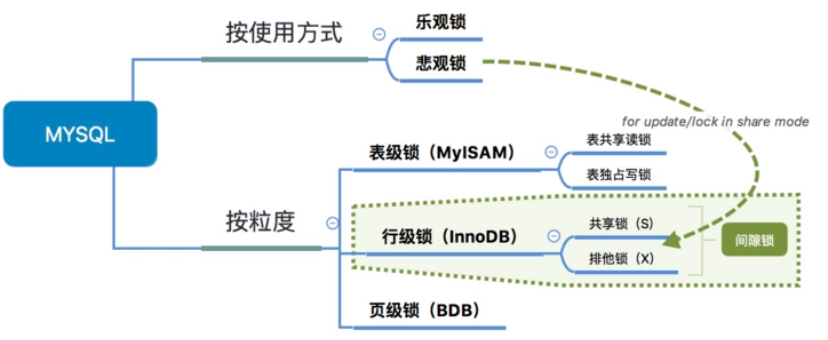
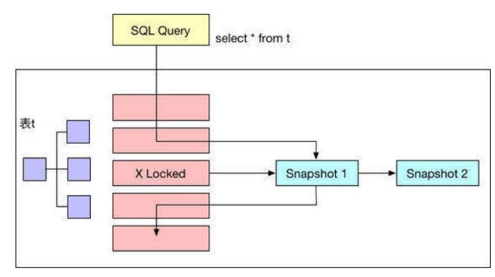
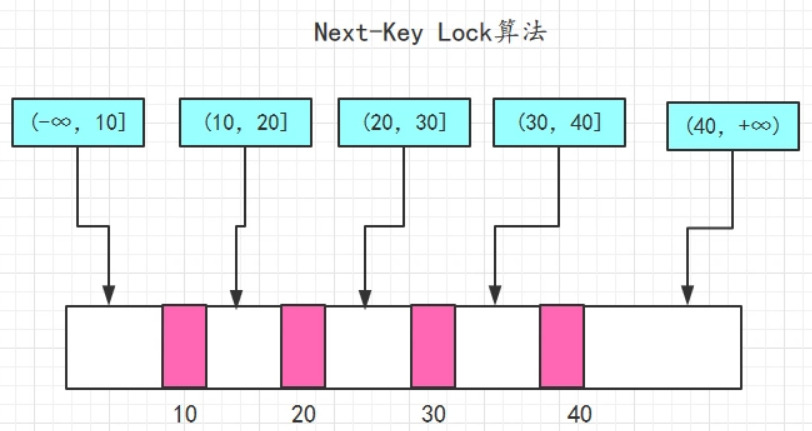
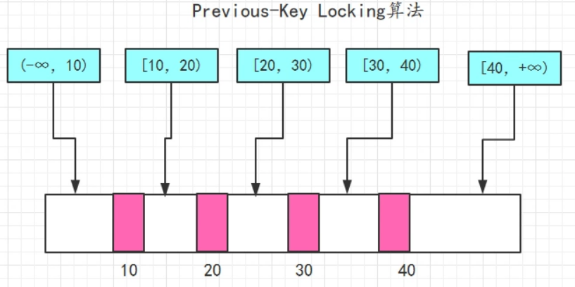

<!-- TOC -->

    - [1、隔离级别](#1隔离级别)
    - [2、索引与锁](#2索引与锁)
    - [3、锁的种类](#3锁的种类)
    - [4、一致性非锁定读和一致性锁定读](#4一致性非锁定读和一致性锁定读)
        - [1、一致性锁定读（Locking Reads）](#1一致性锁定读locking-reads)
        - [2、一致性非锁定读](#2一致性非锁定读)
    - [5、行锁的算法](#5行锁的算法)
    - [6、事务加锁方式](#6事务加锁方式)
    - [6、Innodb的事务隔离](#6innodb的事务隔离)
- [参考](#参考)

<!-- /TOC -->

**行是表管理数据的粒度，存储引擎管理数据的粒度是数据页，一个数据页包含多条记录。**


用一句话去概括事务：将对数据库进行的多个操作封装成单个，只有在所有操作都成功的情况下才真正实现变动，否则数据原封不动。

用一句话概括锁：一个让数据不能被修改的功能。

而他们之间的关系可以定义为：**锁是实现事务其中一个特性的机制**

事务是一个针对数据质量产生的概念。在高并发或者数据库出现突然断电的情况下，事务所包含的特性就能应对可能会出现的差错。事务有4个特性：Atomic + Consistent + Isolated + Durable (ACID)。

- Atomic是原子性也就是之前提到的“要么都成功，要么都原封不动的概念”。它的设定是来保证一个事务在执行上不能被拆分。

- Consistent是一致性，如果出现突然断电，事务的原则能保证没有数据更新会执行到一半而导致和其他数据不统一。

- Isolated是隔离性，其指的是事务之间是否能意识到对方的存在。这也取决于事务隔离的级别。所以隔离性本身是有自己的弹性在的。

- Durable持久性，表示数据保存后会持续存在。

在这4大特性里，数据库的锁只跟事务特性里的隔离性有关。所谓事物之间是否能“意识”到对方的存在就是每个事务是否能对另一事务针对的数据做出更改。所以可不可以更改必然更所有关（锁：一个让数据不能被修改的功能）。


## 1、隔离级别

首先我们来说下数据库的四种事务隔离级别：

- READ UNCOMMITTED（0）: 浏览访问级别，存在脏读、不可重复读、幻读
- READ COMMITTED（1）: 游标稳定级别，存在不可重复度、幻读
- REPEATABLE READ（2）: 存在幻读
- SERIALIZABLE（3）: 隔离级别，保证事务安全，但完全串行，性能低

这四种事务隔离级别是指定的SQL标准，InnoDB默认的隔离级别是REAPEATABLE READ，但与其他数据库不同的时，它同时使用了Next-Key-Lock锁[间隙锁]的算法，能够避免幻读的产生，因此能够完全满足事务的隔离性要求，即达到SERIALIZABLE隔离级别。

隔离级别越低，事务请求的锁越少或持锁时间越短，因此大部分数据库的默认隔离级别为READ COMMITED。但是有相关的分析也指出，隔离级别的性能开销几乎一样，因此用户无须通过调整隔离级别来提高性能。

## 2、索引与锁

MySQL 为我们提供了行锁、表锁、页锁三种级别的锁，其中表锁开销小，加锁快；不会出现死锁；锁定力度大，发生锁冲突概率高，并发度最低。行锁开销大，加锁慢；会出现死锁；锁定粒度小，发生锁冲突的概率低，并发度高；页锁开销和加锁速度介于表锁和行锁之间；会出现死锁；锁定粒度介于表锁和行锁之间，并发度一般。每个存储引擎都可以有自己的锁策略，例如 MyISAM 引擎仅支持表级锁，而 InnoDB 引擎除了支持表级锁外，也支持行级锁（默认）。


`InnoDB 行锁是通过给索引上的索引项加锁来实现的`，这一点 MySQL 与 Oracle 不同，后者是通过在数据块中对相应数据行加锁来实现的。InnoDB 这种行锁实现特点意味着：只有通过索引条件检索数据，InnoDB 才使用行级锁，否则，InnoDB 将使用表锁，同样地，当 for update 的记录不存在会导致锁住全表。当表有多个索引的时候，不同的事务可以使用不同的索引锁定不同的行，另外，不论是使用主键索引、唯一索引或普通索引，InnoDB 都会使用行锁来对数据加锁。

InnoDB 的加锁过程比较复杂，将所有扫描到的记录都加锁，范围查询会加间隙锁，然后加锁过程按照两阶段锁 2PL 来实现，也就是先加锁，然后所有的锁在事物提交的时候释放。加锁的策略会和数据库的隔离级别有关，在默认的可重复读的隔离级别的情况下，加锁的流程还会和查询条件中是否包含索引，是主键索引还是普通索引，是否是唯一索引等有关。

譬如对于 select * from o_order where order_sn = '201912102322' for update; 这条 SQL 语句，在不同的索引情况下其加锁策略也不一致：


- order_sn 是主键索引，这种情况将在主键索引上的 order_sn = 201912102322 这条记录上加排他锁。

- order_sn 是普通索引，并且是唯一索引，将会对普通索引上对应的一条记录加排他锁，对主键索引上对应的记录加排他锁。

- order_sn 是普通索引，并且不是唯一索引，将会对普通索引上 order_sn = 201912102322 一条或者多条记录加锁，并且对这些记录对应的主键索引上的记录加锁。这里除了加上行锁外，还会加上间隙锁，防止其他事务插入 order_sn = 201912102322 的记录，然而如果是唯一索引就不需要间隙锁，行锁就可以。

- order_sn 上没有索引，innoDB 将会在主键索引上全表扫描，这里并没有加表锁，而是将所有的记录都会加上行级排他锁，而实际上 innoDB 内部做了优化，当扫描到一行记录后发现不匹配就会把锁给释放，当然这个违背了 2PL 原则在事务提交的时候释放。这里除了对记录进行加锁，还会对每两个记录之间的间隙加锁，所以最终将会保存所有的间隙锁和 order_sn = 201912102322 的行锁。

- order_sn = 201912102322 这条记录不存在的情况下，如果 order_sn 是主键索引，则会加一个间隙锁，而这个间隙是主键索引中 order_sn 小于 201912102322 的第一条记录到大于 201912102322 的第一条记录。试想一下如果不加间隙锁，如果其他事物插入了一条 order_sn = 201912102322 的记录，由于 select for update 是当前读，即使上面那个事物没有提交，如果在该事物中重新查询一次就会发生幻读。

- 如果没有索引，则对扫描到的所有记录和间隙都加锁，如果不匹配行锁将会释放只剩下间隙锁。回忆一下上面讲的数据页的结果中又一个最大记录和最小记录，Infimum 和 Supremum Record，这两个记录在加间隙锁的时候就会用到。


## 3、锁的种类



MySQL的锁可以按照多种方式进行划分，这里使用最常用的两种方式进行划分：粒度与使用方式。

需要特别说明的是：乐观锁与悲观锁并不是数据库中实现的锁机制，是需要我们自己去实现的。它是一种思想，我们不仅仅可以用在MySQL中，其它地方有需要的也可以用到。而像悲观锁它也是利用数据库现有的机制进行实现的。下面先根据不同分类对说明相关概念。


- 表级锁 是MySQL中锁定粒度最大的一种锁，表示对当前操作的整张表加锁，它实现简单，资源消耗较少，被大部分MySQL引擎支持。最常使用的MyISAM与InnoDB都支持表级锁定。表级锁分为表共享读锁与表独占写锁。

- 行级锁 是Mysql中锁定粒度最细的一种锁，表示只针对当前操作的行进行加锁。行级锁能大大减少数据库操作的冲突。其加锁粒度最小，但加锁的开销也最大。行级锁分为共享锁 和 排他锁。

- 页级锁 是MySQL中锁定粒度介于行级锁和表级锁中间的一种锁。表级锁速度快，但冲突多，行级冲突少，但速度慢。所以取了折衷的页级，一次锁定相邻的一组记录。BDB支持页级锁。

## 4、一致性非锁定读和一致性锁定读

### 1、一致性锁定读（Locking Reads）

在一个事务中查询数据时，普通的SELECT语句不会对查询的数据进行加锁，其他事务仍可以对查询的数据执行更新和删除操作。因此，InnoDB提供了两种类型的锁定读来保证额外的安全性：

- SELECT ... LOCK IN SHARE MODE

- SELECT ... FOR UPDATE

SELECT ... LOCK IN SHARE MODE: 对读取的行添加S锁，其他事物可以对这些行添加S锁，若添加X锁，则会被阻塞。

SELECT ... FOR UPDATE: 会对查询的行及相关联的索引记录加X锁，其他事务请求的S锁或X锁都会被阻塞。 当事务提交或回滚后，通过这两个语句添加的锁都会被释放。 

注意：只有在自动提交被禁用时，SELECT FOR UPDATE才可以锁定行，若开启自动提交，则匹配的行不会被锁定。


### 2、一致性非锁定读

一致性非锁定读(consistent nonlocking read) 是指InnoDB存储引擎通过多版本控制(MVVC)读取当前数据库中行数据的方式。如果读取的行正在执行DELETE或UPDATE操作，这时读取操作不会因此去等待行上锁的释放。相反地，InnoDB会去读取行的一个快照。所以，非锁定读机制大大提高了数据库的并发性。



一致性非锁定读是InnoDB默认的读取方式，即读取不会占用和等待行上的锁。在事务隔离级别READ COMMITTED和REPEATABLE READ下，InnoDB使用一致性非锁定读。

`然而，对于快照数据的定义却不同。在READ COMMITTED事务隔离级别下，一致性非锁定读总是读取被锁定行的最新一份快照数据。而在REPEATABLE READ事务隔离级别下，则读取事务开始时的行数据版本。`


## 5、行锁的算法

InnoDB存储引擎有3种行锁的算法，其分别是：

- Record Lock：单个行记录上的锁。
- Gap Lock：间隙锁，锁定一个范围，但不包含记录本身。
- Next-Key Lock：Gap Lock+Record Lock，锁定一个范围，并且锁定记录本身。

Record Lock：总是会去锁住索引记录，如果InnoDB存储引擎表在建立的时候没有设置任何一个索引，那么这时InnoDB存储引擎会使用隐式的主键来进行锁定。

Next-Key Lock：结合了Gap Lock和Record Lock的一种锁定算法，在Next-Key Lock算法下，InnoDB对于行的查询都是采用这种锁定算法。举个例子10，20，30，那么该索引可能被Next-Key Locking的区间为：



除了Next-Key Locking，还有Previous-Key Locking技术，这种技术跟Next-Key Lock正好相反，锁定的区间是区间范围和前一个值。同样上述的值，使用Previous-Key Locking技术，那么可锁定的区间为：



不是所有索引都会加上Next-key Lock的，这里有一种特殊的情况，在查询的列是唯一索引（包含主键索引）的情况下，Next-key Lock会降级为Record Lock。


接下来，我们来通过一个例子解释一下。

```sql
CREATE TABLE test (
    x INT,
    y INT,
    PRIMARY KEY(x),    // x是主键索引
    KEY(y)    // y是普通索引
);
INSERT INTO test select 3, 2;
INSERT INTO test select 5, 3;
INSERT INTO test select 7, 6;
INSERT INTO test select 10, 8;
```

我们现在会话A中执行如下语句；

SELECT * FROM test WHERE y = 3 FOR UPDATE

我们分析一下这时候的加锁情况。

对于主键x和辅助索引y


用户可以通过以下两种方式来显示的关闭Gap Lock：

- 将事务的隔离级别设为 READ COMMITED。
- 将参数innodb_locks_unsafe_for_binlog设置为1。

Gap Lock的作用：是为了阻止多个事务将记录插入到同一个范围内，设计它的目的是用来解决Phontom Problem（幻读问题）。在MySQL默认的隔离级别（Repeatable Read）下，InnoDB就是使用它来解决幻读问题。

幻读：是指在同一事务下，连续执行两次同样的SQL语句可能导致不同的结果，第二次的SQL可能会返回之前不存在的行，也就是第一次执行和第二次执行期间有其他事务往里插入了新的行。


## 6、事务加锁方式

- 一次性锁协议，事务开始时，即一次性申请所有的锁，之后不会再申请任何锁，如果其中某个锁不可用，则整个申请就不成功，事务就不会执行，在事务尾端，一次性释放所有的锁。一次性锁协议不会产生死锁的问题，但事务的并发度不高。

- 两阶段锁协议，整个事务分为两个阶段，前一个阶段为加锁，后一个阶段为解锁。在加锁阶段，事务只能加锁，也可以操作数据，但不能解锁，直到事务释放第一个锁，就进入解锁阶段，此过程中事务只能解锁，也可以操作数据，不能再加锁。两阶段锁协议使得事务具有较高的并发度，因为解锁不必发生在事务结尾。它的不足是没有解决死锁的问题，因为它在加锁阶段没有顺序要求。如两个事务分别申请了A, B锁，接着又申请对方的锁，此时进入死锁状态。


## 6、Innodb的事务隔离

在MVCC并发控制中，读操作可以分成两类：快照读 (snapshot read)与当前读 (current read)。快照读，读取的是记录的可见版本 (有可能是历史版本)，不用加锁。当前读，读取的是记录的最新版本，并且，当前读返回的记录，都会加上锁，保证其他事务不会再并发修改这条记录。

MySQL/InnoDB定义的4种隔离级别：

- Read Uncommited
可以读取未提交记录。

- Read Committed (RC)
当前读操作RC隔离级别保证对读取到的记录加锁 (记录锁)，存在幻读现象。使用MVCC，但读取数据时读取自身版本和最新版本，以最新为主，可以读已提交记录，存在不可重复读现象。

- Repeatable Read (RR)
当前读操作RR隔离级别保证对读取到的记录加锁 (记录锁)，同时保证对读取的范围加锁，新的满足查询条件的记录不能够插入 (间隙锁)，不存在幻读现象。使用MVCC保存两个事物操作的数据互相隔离，不存在不可重复读现象。

- Serializable
从MVCC并发控制退化为基于锁的并发控制。不区别快照读与当前读，所有的读操作均为当前读，读加读锁 (S锁)，写加写锁 (X锁)。
Serializable隔离级别下，读写冲突，因此并发度急剧下降，在MySQL/InnoDB下不建议使用。


# 参考

- [MySQL的锁和事务隔离级别](https://segmentfault.com/a/1190000019877878?utm_source=tag-newest)

- [MySQL 锁机制和事务](https://www.linuxidc.com/Linux/2019-01/156362.htm)

- [https://www.jb51.net/article/75452.htm](https://www.jb51.net/article/75452.htm)

- [MySQL 索引的原理与应用：索引类型，存储结构与锁](https://segmentfault.com/a/1190000019366328)


- [MySQL性能管理及架构设计（一）：什么影响了数据库查询速度、什么影响了MySQL性能](https://segmentfault.com/a/1190000013672421)


- [MySQL InnoDB引擎锁的总结](https://segmentfault.com/a/1190000015596126)

- [MySQL/InnoDB中，乐观锁、悲观锁、共享锁、排它锁、行锁、表锁、死锁概念的理解](https://segmentfault.com/a/1190000015815061)

- [可能是全网最好的MySQL重要知识点/面试题总结](https://segmentfault.com/a/1190000019619667)

- [为什么开发人员必须要了解数据库锁？](https://segmentfault.com/a/1190000018470235)

- [数据库两个神器【索引和锁】](https://segmentfault.com/a/1190000015738121)

- [MySQL的又一神器-锁，MySQL面试必备](https://segmentfault.com/a/1190000020762791)

- [【MySQL源码分析】浅谈Mysql的锁](https://segmentfault.com/a/1190000017076101)

- [读 MySQL 源码再看 INSERT 加锁流程](https://www.colabug.com/2018/0624/3297937/)
