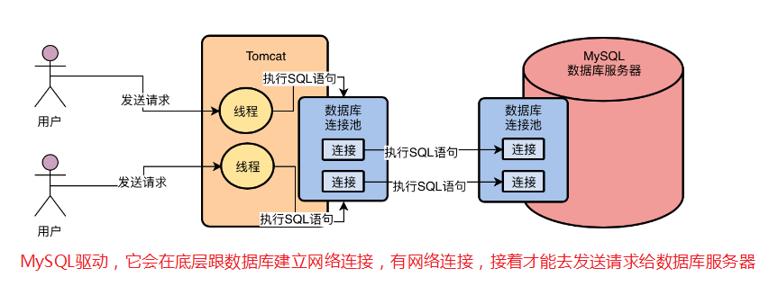
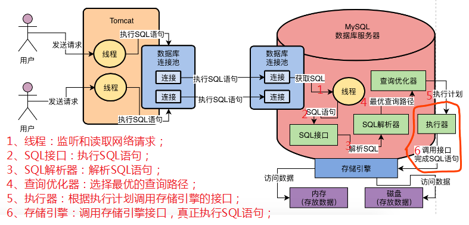

生产经验todo

> 生产环境机器配置选型

一般Java应用系统部署在4核8G的机器上，每秒钟抗下500左右的并发访问量，差不多是比较合适的，这里也不一定，主要看你一个请求耗费时间。

一般8核16G的机器部署的MySQL数据库，每秒抗个一两千并发请求是没问题的，但是如果你的并发量再高一些，假设每秒有几千并发请求，那么可能数据库就会有点危险了，因为数据库的CPU、磁盘、IO、内存的负载都会很高，弄不数据库压力过大就会宕机。

对于16核32G的机器部署的MySQL数据库而言，每秒抗个两三千，甚至三四千的并发请求也都是可以的，但是如果你达到每秒上万请求，那么数据库的CPU、磁盘、IO、内存的负载瞬间都会飙升到很高，数据库也是可能会扛不住宕机的。

另外对于数据库而言，如果可以的话，最好是采用SSD固态硬盘而不是普通的机械硬盘，因为数据库最大的复杂就在于大量的磁盘IO，他需要大量的读写磁盘文件，所以如果能使用SSD固态硬盘，那么你的数据库每秒能抗的并发请求量就会更高一些。

