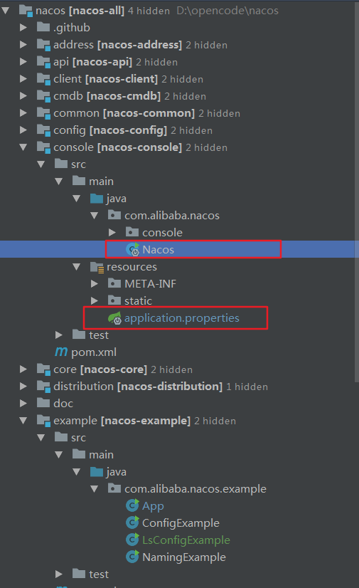
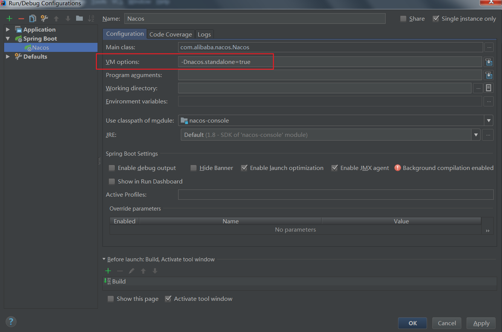

备注：学习github分支，基于1.3.1拉取 https://github.com/lishuai2016/nacos/tree/b_f_1.3.1_20201010






-Dnacos.standalone=true

配置文件新增MySQL数据库配置

```
# 添加数据库配置
spring.datasource.platform=mysql
db.num=1 
db.url.0=jdbc:mysql://127.0.0.1:3306/nacos_config?characterEncoding=utf8&connectTimeout=1000&socketTimeout=3000&autoReconnect=true 
db.user=root
db.password=123456
```

访问地址：http://localhost:8848/nacos

默认账户密码：nacos/nacos


