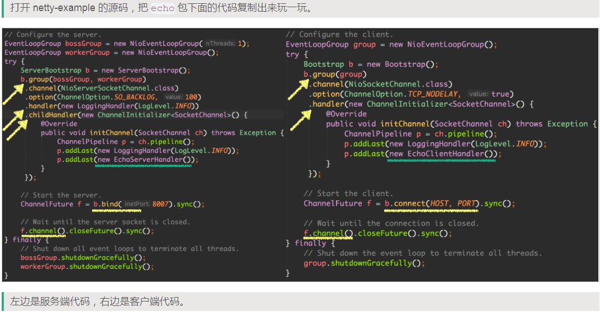

Netty 作为 NIO 的库，自然既可以作为服务端接受请求，也可以作为客户端发起请求。使用 Netty 开发客户端或服务端都是非常简单的，Netty 做了很好的封装，我们通常只要开发一个或多个 handler 用来处理我们的自定义逻辑就可以了。

下面，我们来看一个经常会见到的例子，它叫 Echo，也就是回声，客户端传过去什么值，服务端原样返回什么值。

打开 netty-example 的源码，把 echo 包下面的代码复制出来玩一玩。

上面的代码基本就是模板代码，每次使用都是这一个套路，唯一需要我们开发的部分是 handler(…) 和 childHandler(…) 方法中指定的各个 handler，如 EchoServerHandler 和 EchoClientHandler，当然 Netty 源码也给我们提供了很多的 handler，比如上面的 LoggingHandler，它就是 Netty 源码中为我们提供的，需要的时候直接拿过来用就好了。

我们先来看一下上述代码中涉及到的一些内容：

- ServerBootstrap 类用于创建服务端实例，Bootstrap 用于创建客户端实例。

- 两个 EventLoopGroup：bossGroup 和 workerGroup，它们涉及的是 Netty 的线程模型，可以看到服务端有两个 group，而客户端只有一个，它们就是 Netty 中的线程池。

- Netty 中的 Channel，没有直接使用 Java 原生的 ServerSocketChannel 和 SocketChannel，而是包装了 NioServerSocketChannel 和 NioSocketChannel 与之对应。当然，也有对其他协议的支持，如支持 UDP 协议的 NioDatagramChannel，本文只关心 TCP 相关的。

- 左边 handler(…) 方法指定了一个 handler（LoggingHandler），这个 handler 是给服务端收到新的请求的时候处理用的。右边 handler(...) 方法指定了客户端处理请求过程中需要使用的 handlers。(如果你想在 EchoServer 中也指定多个 handler，也可以像右边的 EchoClient 一样使用 ChannelInitializer)

- 左边 childHandler(…) 指定了 childHandler，这边的 handlers 是给新创建的连接用的，我们知道服务端 ServerSocketChannel 在 accept 一个连接以后，需要创建 SocketChannel 的实例，childHandler(…) 中设置的 handler 就是用于处理新创建的 SocketChannel 的，而不是用来处理 ServerSocketChannel 实例的。

- pipeline：handler 可以指定多个（需要上面的 ChannelInitializer 类辅助），它们会组成了一个 pipeline，它们其实就类似拦截器的概念，现在只要记住一点，每个 NioSocketChannel 或 NioServerSocketChannel 实例内部都会有一个 pipeline 实例。pipeline 中还涉及到 handler 的执行顺序。

- ChannelFuture：这个涉及到 Netty 中的异步编程，和 JDK 中的 Future 接口类似。

# 参考

- [认真的 Netty 源码解析（一）](https://www.javadoop.com/post/netty-1)