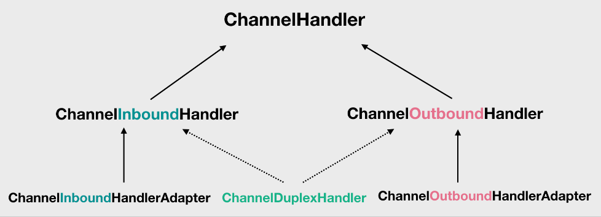
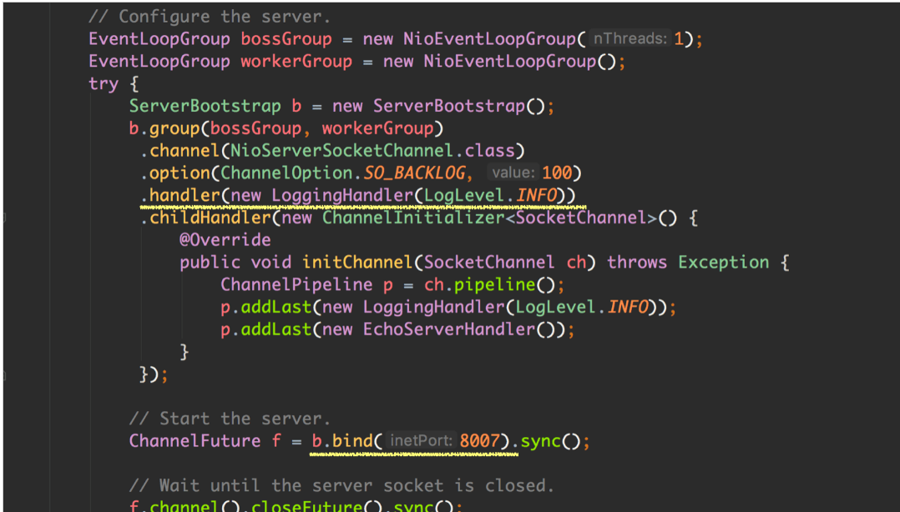
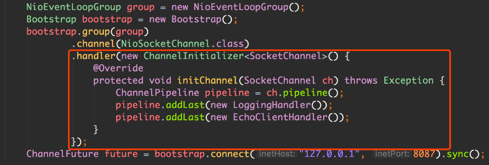

> ChannelPipeline，和 Inbound、Outbound


使用 Netty 的时候，我们通常就只要写一些自定义的 handler 就可以了，我们定义的这些 handler 会组成一个 pipeline，用于处理 IO 事件，这个和我们平时接触的 Filter 或 Interceptor 表达的差不多是一个意思。

每个 Channel 内部都有一个 pipeline，pipeline 由多个 handler 组成，handler 之间的顺序是很重要的，因为 IO 事件将按照顺序顺次经过 pipeline 上的 handler，这样每个 handler 可以专注于做一点点小事，由多个 handler 组合来完成一些复杂的逻辑。


从图中，我们知道这是一个双向链表。

首先，我们看两个重要的概念：`Inbound 和 Outbound`。在 Netty 中，IO 事件被分为 Inbound 事件和 Outbound 事件。

Outbound 的 out 指的是 出去，有哪些 IO 事件属于此类呢？比如 connect、write、flush 这些 IO 操作是往外部方向进行的，它们就属于 Outbound 事件。

其他的，诸如 accept、read 这种就属于 Inbound 事件。

比如客户端在发起请求的时候，需要 1️connect 到服务器，然后 2️write 数据传到服务器，再然后 3️read 服务器返回的数据，前面的 connect 和 write 就是 out 事件，后面的 read 就是 in 事件。

比如很多初学者看不懂下面的这段代码，这段代码用于服务端的 childHandler 中：

- 1.pipeline.addLast(new StringDecoder());
- 2.pipeline.addLast(new StringEncoder());
- 3.pipeline.addLast(new BizHandler());

初学者肯定都纳闷，以为这个顺序写错了，应该是先 decode 客户端过来的数据，然后用 BizHandler 处理业务逻辑，最后再 encode 数据然后返回给客户端，所以添加的顺序应该是 1 -> 3 -> 2 才对。

其实这里的三个 handler 是分组的，分为 Inbound（1 和 3） 和 Outbound（2）：

- 客户端连接进来的时候，读取（read）客户端请求数据的操作是 Inbound 的，所以会先使用 1，然后是 3 对处理进行处理；

- 处理完数据后，返回给客户端数据的 write 操作是 Outbound 的，此时使用的是 2。

所以虽然添加顺序有点怪，但是执行顺序其实是按照 1 -> 3 -> 2 进行的。

如果我们在上面的基础上，加上下面的第四行，这是一个 OutboundHandler：

4.pipeline.addLast(new OutboundHandlerA());

那么执行顺序是不是就是 1 -> 3 -> 2 -> 4 呢？答案是：不是的。

对于 Inbound 操作，按照添加顺序执行每个 Inbound 类型的 handler；而对于 Outbound 操作，是反着来的，从后往前，顺次执行 Outbound 类型的 handler。

所以，上面的顺序应该是先 1 后 3，它们是 Inbound 的，然后是 4，最后才是 2，它们两个是 Outbound 的。说实话，这种组织方式对新手应该很是头疼。

那我们在开发的时候怎么写呢？其实也很简单，从最外层开始写，一步步写到业务处理层，把 Inbound 和 Outbound 混写在一起。比如 encode 和 decode 是属于最外层的处理逻辑，先写它们。假设 decode 以后是字符串，那再进来一层应该可以写进来和出去的日志。再进来一层可以写 字符串 <=> 对象 的相互转换。然后就应该写业务层了。

到这里，我想大家应该都知道 Inbound 和 Outbound 了吧？下面我们来介绍它们的接口使用。



定义处理 Inbound 事件的 handler 需要实现 ChannelInboundHandler，定义处理 Outbound 事件的 handler 需要实现 ChannelOutboundHandler。最下面的三个类，是 Netty 提供的适配器，特别的，如果我们希望定义一个 handler 能同时处理 Inbound 和 Outbound 事件，可以通过继承中间的 ChannelDuplexHandler 的方式，比如 LoggingHandler 这种既可以用来处理 Inbound 也可以用来处理 Outbound 事件的 handler。

有了 Inbound 和 Outbound 的概念以后，我们来开始介绍 Pipeline 的源码。


我们说过，一个 Channel 关联一个 pipeline，NioSocketChannel 和 NioServerSocketChannel 在执行构造方法的时候，都会走到它们的父类 AbstractChannel 的构造方法中：

```java
protected AbstractChannel(Channel parent) {
    this.parent = parent;
    // 给每个 channel 分配一个唯一 id
    id = newId();
    // 每个 channel 内部需要一个 Unsafe 的实例
    unsafe = newUnsafe();
    // 每个 channel 内部都会创建一个 pipeline
    pipeline = newChannelPipeline();
}
```

上面的三行代码中，id 比较不重要，Netty 中的 Unsafe 实例其实挺重要的，这里简单介绍一下。

在 JDK 的源码中，sun.misc.Unsafe 类提供了一些底层操作的能力，它设计出来是给 JDK 中的源码使用的，比如 AQS、ConcurrentHashMap 等，我们在之前的并发包的源码分析中也看到了很多它们使用 Unsafe 的场景，这个 Unsafe 类不是给我们的代码使用的，是给 JDK 源码使用的（需要的话，我们也是可以获取它的实例的）。

Unsafe 类的构造方法是 private 的，但是它提供了 getUnsafe() 这个静态方法：

Unsafe unsafe = Unsafe.getUnsafe();

大家可以试一下，上面这行代码编译没有问题，但是执行的时候会抛 java.lang.SecurityException 异常，因为它就不是给我们的代码用的。

但是如果你就是想获取 Unsafe 的实例，可以通过下面这个代码获取到:

```java
Field f = Unsafe.class.getDeclaredField("theUnsafe");
f.setAccessible(true);
Unsafe unsafe = (Unsafe) f.get(null);
```

Netty 中的 Unsafe 也是同样的意思，它封装了 Netty 中会使用到的 JDK 提供的 NIO 接口，比如将 channel 注册到 selector 上，比如 bind 操作，比如 connect 操作等，这些操作都是稍微偏底层一些。Netty 同样也是不希望我们的业务代码使用 Unsafe 的实例，它是提供给 Netty 中的源码使用的。

不过，对于我们源码分析来说，我们还是会有很多时候需要分析 Unsafe 中的源码的.

关于 Unsafe，我们后面用到了再说，这里只要知道，它封装了大部分需要访问 JDK 的 NIO 接口的操作就好了。这里我们继续将焦点放在实例化 pipeline 上：

```java
protected DefaultChannelPipeline newChannelPipeline() {
    return new DefaultChannelPipeline(this);
}
```

这里开始调用 DefaultChannelPipeline 的构造方法，并把当前 `channel` 的引用传入：

```java
protected DefaultChannelPipeline(Channel channel) {
    this.channel = ObjectUtil.checkNotNull(channel, "channel");
    succeededFuture = new SucceededChannelFuture(channel, null);
    voidPromise =  new VoidChannelPromise(channel, true);

    tail = new TailContext(this);
    head = new HeadContext(this);

    head.next = tail;
    tail.prev = head;
}
```

这里实例化了 tail 和 head 这两个 handler。tail 实现了 ChannelInboundHandler 接口，而 head 实现了 ChannelOutboundHandler 和 ChannelInboundHandler 两个接口，并且最后两行代码将 tail 和 head 连接起来:


注意，在不同的版本中，源码也略有差异，head 不一定是 in + out，大家知道这点就好了。

还有，从上面的 head 和 tail 我们也可以看到，其实 pipeline 中的每个元素是 ChannelHandlerContext 的实例，而不是 ChannelHandler 的实例，context 包装了一下 handler，但是，后面我们都会用 handler 来描述一个 pipeline 上的节点，而不是使用 context，希望读者知道这一点。

这里只是构造了 pipeline，并且添加了两个固定的 handler 到其中（head + tail），还不涉及到自定义的 handler 代码执行。我们回过头来看下面这段代码：



我们说过 childHandler 中指定的 handler 不是给 NioServerSocketChannel 使用的，是给 NioSocketChannel 使用的，所以这里我们不看它。

这里调用 handler(…) 方法指定了一个 LoggingHandler 的实例，然后我们再进去下面的 bind(…) 方法中看看这个 LoggingHandler 实例是怎么进入到我们之前构造的 pipeline 内的。

顺着 bind() 一直往前走，bind() -> doBind() -> initAndRegister()：

```java
final ChannelFuture initAndRegister() {
    Channel channel = null;
    try {
        // 1. 构造 channel 实例，同时会构造 pipeline 实例，
        // 现在 pipeline 中有 head 和 tail 两个 handler 了
        channel = channelFactory.newChannel();
        // 2. 看这里
        init(channel);
    } catch (Throwable t) {
    ......
}
```

上面的两行代码，第一行实现了构造 channel 和 channel 内部的 pipeline，我们来看第二行 init 代码：

```java
// ServerBootstrap：
@Override
void init(Channel channel) throws Exception {
    ......
    // 拿到刚刚创建的 channel 内部的 pipeline 实例
    ChannelPipeline p = channel.pipeline();
    ...
    // 开始往 pipeline 中添加一个 handler，这个 handler 是 ChannelInitializer 的实例
    p.addLast(new ChannelInitializer<Channel>() {

        // 我们以后会看到，下面这个 initChannel 方法何时会被调用
        @Override
        public void initChannel(final Channel ch) throws Exception {
            final ChannelPipeline pipeline = ch.pipeline();
            // 这个方法返回我们最开始指定的 LoggingHandler 实例
            ChannelHandler handler = config.handler();
            if (handler != null) {
                // 添加 LoggingHandler
                pipeline.addLast(handler);
            }

            // 先不用管这里的 eventLoop
            ch.eventLoop().execute(new Runnable() {
                @Override
                public void run() {
                    // 添加一个 handler 到 pipeline 中：ServerBootstrapAcceptor
                    // 从名字可以看到，这个 handler 的目的是用于接收客户端请求
                    pipeline.addLast(new ServerBootstrapAcceptor(
                            ch, currentChildGroup, currentChildHandler, currentChildOptions, currentChildAttrs));
                }
            });
        }
    });
}
```

这里涉及到 pipeline 中的辅助类 ChannelInitializer，我们看到，它本身是一个 handler（Inbound 类型），但是它的作用和普通 handler 有点不一样，它纯碎是用来辅助将其他的 handler 加入到 pipeline 中的。

大家可以稍微看一下 ChannelInitializer 的 initChannel 方法，有个简单的认识就好，此时的 pipeline 应该是这样的：


ChannelInitializer 的 initChannel(channel) 方法被调用的时候，会往 pipeline 中添加我们最开始指定的 LoggingHandler 和添加一个 ServerBootstrapAcceptor。但是我们现在还不知道这个 initChannel 方法何时会被调用。

上面我们说的是作为服务端的 NioServerSocketChannel 的 pipeline，NioSocketChannel 也是差不多的，我们可以看一下 Bootstrap 类的 init(channel) 方法：

```java
void init(Channel channel) throws Exception {
    ChannelPipeline p = channel.pipeline();
    p.addLast(config.handler());
    ...
}
```



它和服务端 ServerBootstrap 要添加 ServerBootstrapAcceptor 不一样，它只需要将 EchoClient 类中的 ChannelInitializer 实例加进来就可以了，它的 ChannelInitializer 中添加了两个 handler，LoggingHandler 和 EchoClientHandler：


很显然，我们需要的是像 LoggingHandler 和 EchoClientHandler 这样的 handler，但是，它们现在还不在 pipeline 中，那么它们什么时候会真正进入到 pipeline 中呢？以后我们再揭晓。

还有，为什么 Server 端我们指定的是一个 handler 实例，而 Client 指定的是一个 ChannelInitializer 实例？其实它们是可以随意搭配使用的，你甚至可以在 ChannelInitializer 实例中添加 ChannelInitializer 的实例。

非常抱歉，这里又要断了，下面要先介绍线程池了，`大家要记住 pipeline 现在的样子，head + channelInitializer + tail。`

本节没有介绍 handler 的向后传播，就是一个 handler 处理完了以后，怎么传递给下一个 handler 来处理？比如我们熟悉的 JavaEE 中的 Filter 是采用在一个 Filter 实例中调用 chain.doFilter(request, response) 来传递给下一个 Filter 这种方式的。

我们用下面这张图结束本节。下图展示了传播的方法，但我其实是更想让大家看一下，哪些事件是 Inbound 类型的，哪些是 Outbound 类型的：


Outbound 类型的几个事件大家应该比较好认，注意 bind 也是 Outbound 类型的。

# 参考

- https://www.javadoop.com/post/netty-part-4