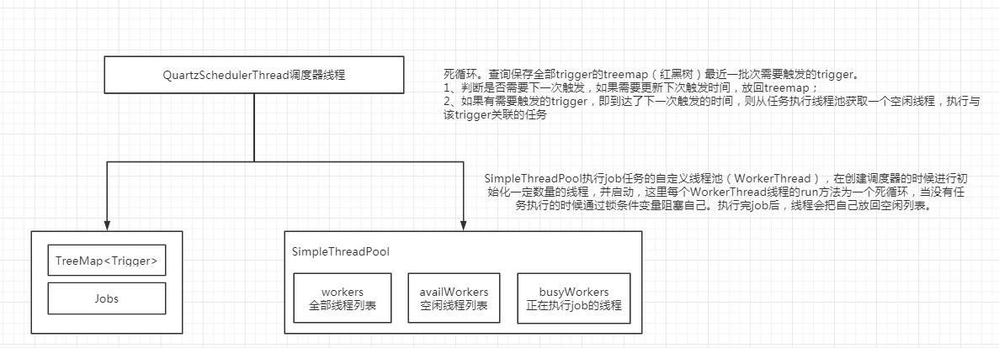
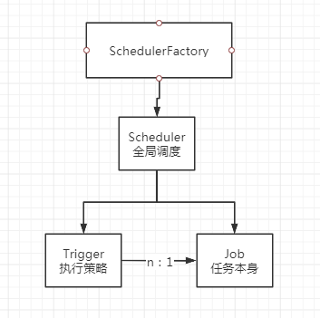
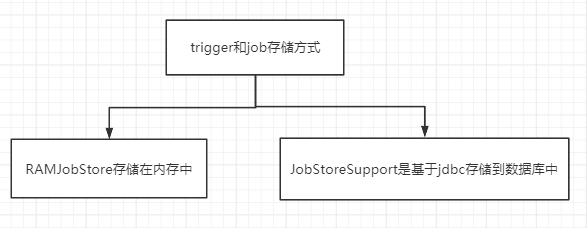
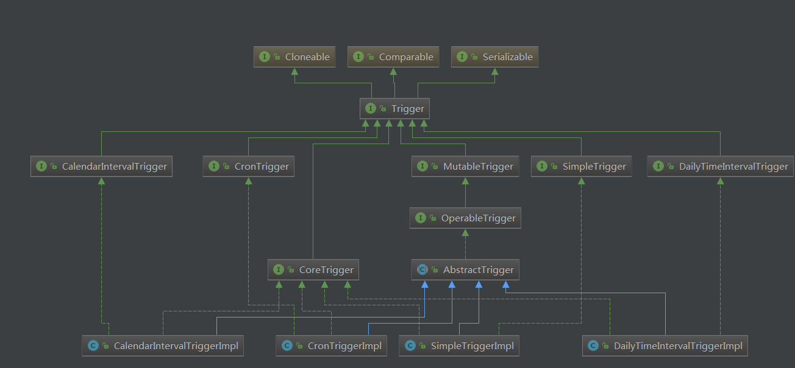
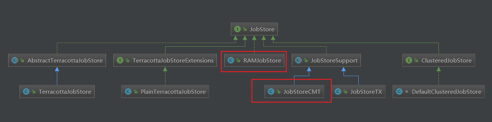
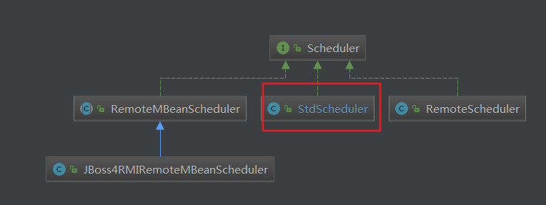
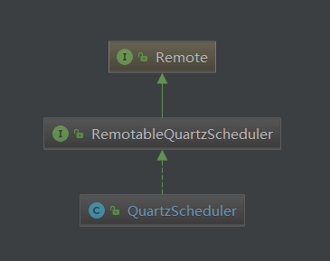
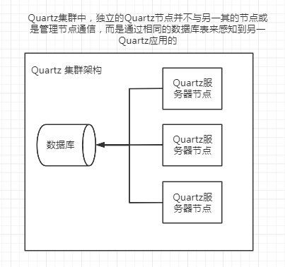

> 数据结构

- 1、如何基于触发时间进行调度？基于TreeSet<TriggerWrapper>，通过treemap的红黑树实现排序（先基于时间，时间相同基于优先级，前两个判断都相同再基于TriggerKey）触发调度，保证timeTriggers.first()返回的是最近要触发的调度。




整体分为三部分：1、有个调度线程，负责轮询到那个trigger该执行了；2、有个数据结构存储需要调度的trigger，这个数据结构支持获取一个最近的trigger或者几个最近的trigger，常见的有最小堆或者红黑树；3、需要有一个或者一组线程来执行任务；


Quartz最重要的3个基本要素：

- 1、Scheduler：调度器。所有的调度都是由它控制。

- 2、Trigger： 定义触发的条件。例子中，它的类型是SimpleTrigger，每隔1秒中执行一次（什么是SimpleTrigger下面会有详述）。

- 3、JobDetail & Job： JobDetail 定义的是任务数据，而真正的执行逻辑是在Job中，例子中是HelloQuartz。 为什么设计成JobDetail + Job，不直接使用Job？这是因为任务是有可能并发执行，如果Scheduler直接使用Job，就会存在对同一个Job实例并发访问的问题。而JobDetail & Job 方式，sheduler每次执行，都会根据JobDetail创建一个新的Job实例，这样就可以规避并发访问的问题。`JobDetail是任务的定义，而Job是任务的执行逻辑`





要定义一个任务，需要干几件事：

- 1、创建一个org.quartz.Job的实现类，并实现实现自己的业务逻辑。
- 2、定义一个JobDetail，引用这个实现类
- 2、加入scheduleJob

Quartz调度一次任务，会干如下的事：

- 1、JobClass jobClass=JobDetail.getJobClass()
- 2、Job jobInstance=jobClass.newInstance()。所以Job实现类，必须有一个public的无参构建方法。
- 3、jobInstance.execute(JobExecutionContext context)。JobExecutionContext是Job运行的上下文，可以获得Trigger、Scheduler、JobDetail的信息。

也就是说，每次调度都会创建一个新的Job实例，这样的好处是有些任务并发执行的时候，不存在对临界资源的访问问题——当然，如果需要共享JobDataMap的时候，还是存在临界资源的并发访问的问题。




















# 样例

```java
public class QuartzTest {

    public static void main(String[] args) {
        try {
            //创建scheduler
            Scheduler scheduler = StdSchedulerFactory.getDefaultScheduler();

            //定义一个Trigger
            Trigger trigger = newTrigger().withIdentity("trigger1", "group1") //定义name/group
                    .startNow()//一旦加入scheduler，立即生效
                    .withSchedule(simpleSchedule() //使用SimpleTrigger
                            .withIntervalInSeconds(1) //每隔一秒执行一次
                            .repeatForever()) //一直执行，奔腾到老不停歇
                    .build();

            //定义一个JobDetail
            JobDetail job = newJob(HelloQuartz.class) //定义Job类为HelloQuartz类，这是真正的执行逻辑所在
                    .withIdentity("job1", "group1") //定义name/group
                    .usingJobData("name", "quartz") //定义属性
                    .build();

            //加入这个调度
            scheduler.scheduleJob(job, trigger);

            //启动之
            scheduler.start();

            //运行一段时间后关闭
            Thread.sleep(10000);
            scheduler.shutdown(true);
        } catch (Exception e) {
            e.printStackTrace();
        }
    }
}


//业务逻辑任务
public class HelloQuartz implements Job {
    public void execute(JobExecutionContext context) throws JobExecutionException {
        JobDetail detail = context.getJobDetail();
        String name = detail.getJobDataMap().getString("name");
        System.out.println("say hello to " + name + " at " + new Date());
    }
}

```


# 参考

- [Quartz任务调度的基本实现原理](https://www.cnblogs.com/zhenyuyaodidiao/p/4755649.html)
- [Quartz使用总结-这个不错](https://www.cnblogs.com/drift-ice/p/3817269.html)
- [quartz原理揭秘和源码解读](https://www.jianshu.com/p/bab8e4e32952)

