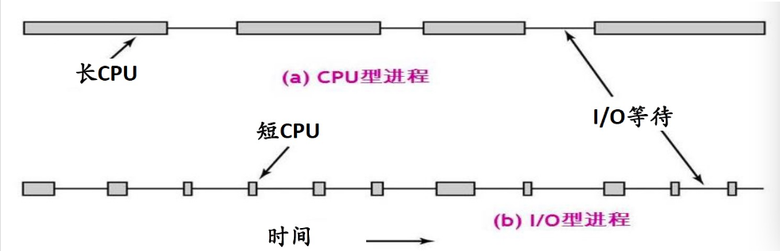
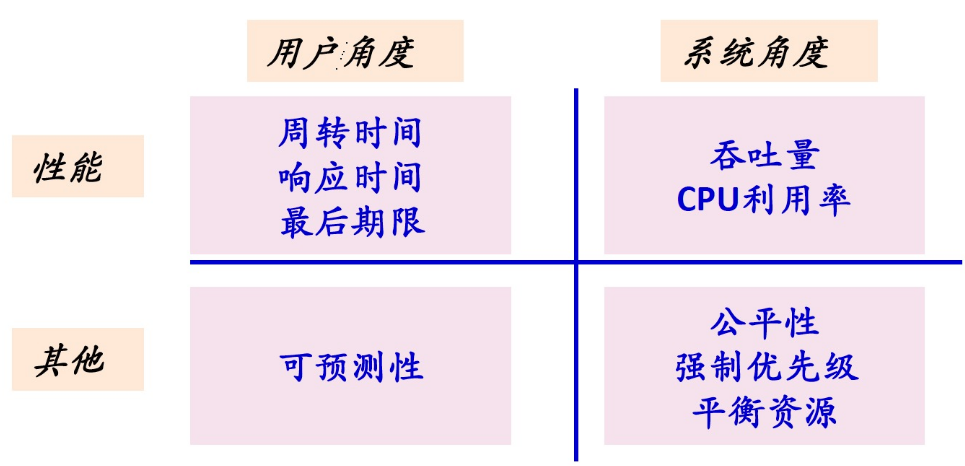
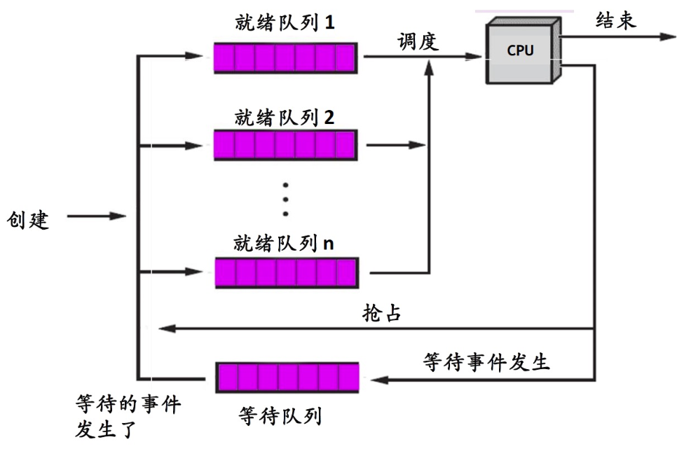
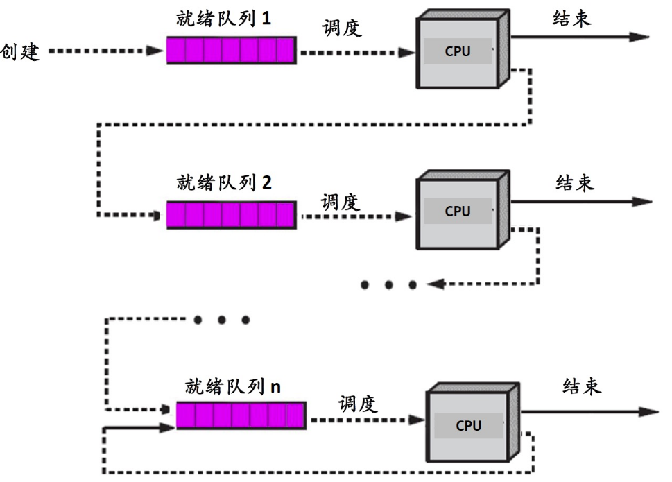

<!-- TOC -->

- [1、基本概念](#1基本概念)
    - [1、多任务与调度基本概念](#1多任务与调度基本概念)
    - [2、IO 密集型和 CPU 密集型](#2io-密集型和-cpu-密集型)
    - [3、抢占式与非抢占式](#3抢占式与非抢占式)
    - [4、时间片](#4时间片)
- [2、CPU调度算法](#2cpu调度算法)
    - [1、批处理系统中可用的调度算法有](#1批处理系统中可用的调度算法有)
        - [1、FCFS（先来先服务）的调度方式](#1fcfs先来先服务的调度方式)
        - [2、短作业优先(SJF)调度算法](#2短作业优先sjf调度算法)
        - [3、最短剩余时间优先（SRTN-Shortest Remaining Time Next）](#3最短剩余时间优先srtn-shortest-remaining-time-next)
        - [4、最高响应比优先（HRRN)](#4最高响应比优先hrrn)
    - [2、交互式系统的调度算法](#2交互式系统的调度算法)
        - [3、时间片轮转调度算法](#3时间片轮转调度算法)
    - [4、优先级调度算法](#4优先级调度算法)
- [3、调度时机](#3调度时机)
- [4、调度过程](#4调度过程)
- [参考](#参考)

<!-- /TOC -->


> CPU调度——其任务是控制、协调进程对CPU的竞争

- 即按一定的调度算法从就绪队列中选择一个进程，把CPU的使用权交给被选中的进程
- 如果没有就绪进程，系统会安排一个系统空闲进程或idle进程


> CPU调度要解决的三个问题

- WHAT：按什么原则选择下一个要执行的进程（调度算法）
- WHEN：何时选择（调度时机）
- HOW：如何让被选中的进程上CPU运行---调度过程（进程的上下文切换）

# 1、基本概念

## 1、多任务与调度基本概念

Linux 能同时并发的交互执行多个进程的多任务操作系统。在多核处理器机器上，多任务操作系统能使多个进程在不同处理器上真正的并行执行，而在单核处理器机器上，只是产生多个进程同时执行的幻觉。无论是单核还是多核，操作系统都能使得多个进程处于阻塞或者睡眠状态，只将适合执行的进程交给处理器执行。

多任务系统一般分为 `非抢占式多任务` 和 `抢占式多任务`。而 Linux 属于后者，也就是 由调度程序来决定什么时候停止一个进程的运行，以便其他进程能够得到执行机会 。其中，这个强制挂起的动作，即是抢占（preemption），而进程在被抢占之前能够运行的时间是预先设置好的，而且有一个专门的名字，叫`进程的时间片（timeslice）`。

时间片是实际分给每个 可运行进程 的处理器时间段，很多操作系统都采用了`动态时间片计算方式`，也就是说分给进程的时间片具体是多少绝对时间是根据机器的负载动态计算的，而不是指定完就不再变化的。不过，Linux 的调度程序本身并没有通过分配时间片来达到公平的调度。


## 2、IO 密集型和 CPU 密集型

进程可以被分为 IO 密集型和 CPU 密集型。前者的大部分时间用来提交 IO 请求或者等待 IO 请求，这样的进程经常处于运行的状态，但是通常每次都会运行短短的一会儿，因为它在等待更多的 IO 请求时最后总会阻塞。相反，CPU 密集型把时间大多用在执行代码上，除非被抢占，否则会一直执行下去，因为它们没有太大的 IO 请求或者没有太多可能被阻塞。而操作系统为了响应速度的考虑，调度器并不会让它们经常运行。

因为系统需要考虑到响应速度，调度器只需要保证不让 CPU 密集型长时间运行就可以，但有些程序不完全符合这两种分类，比如 Word 之类的办公软件，经常等待键盘输入（等待 IO），而在任意时刻，又可能粘住处理器疯狂的处理拼写检查和宏计算。

怎么让调度策略在两个矛盾的目标中间寻找平衡：响应迅速和最大系统利用率。不同的系统有不同的解决策略，但通常是一套复杂的算法，但大部分算法都无法保证低优先级的进程能被公平对待，而 Linux 的 CFS 基本解决这个问题（进程数量不会巨大的情况下）。


- I/O密集型或I/O型(I/O-bound)：频繁的进行I/O，通常会花费很多时间等待I/O操作的完成
- CPU密集型或CPU型或计算密集型(CPU-bound)：需要大量的CPU时间进行计算




## 3、抢占式与非抢占式

- 可抢占式Preemptive（可剥夺式）：当有比正在运行的进程优先级更高的进程就绪时，系统可强行剥夺正在运行进程的CPU，提供给具有更高优先级的进程使用

- 不可抢占式Non-preemptive（不可剥夺式）：某一进程被调度运行后，除非由于它自身的原因不能运行，否则一直运行下去


## 4、时间片

时间片：一个时间段，分配给调度上CPU的进程，确定了允许该进程运行的时间长度

设计时间片大小时，考虑因素：

- 进程切换的开销
- 对响应时间的要求
- 就绪进程个数
- CPU能力
- 进程的行为


# 2、CPU调度算法




调度算法衡量指标：
- 吞吐量Throughput：每单位时间完成的进程数目
- 周转时间TT(Turnaround Time)：每个进程从提出请求到运行完成的时间
- 响应时间RT(Response Time)：从提出请求到第一次回应的时间
- CPU 利用率(CPU Utilization)：CPU做有效工作的时间比例
- 等待时间(Waiting time)：每个进程在就绪队列(ready queue)中等待的时间


设计调度算法时要考虑以下几个问题：
- 进程控制块PCB中，需要记录哪些与CPU调度有关的信息
- 进程优先级及就绪队列的组织
- 抢占式调度与非抢占式调度
- I/O密集型与CPU密集型进程
- 时间片


> 进程就绪队列组织






## 1、批处理系统中可用的调度算法有

- 先来先服务（FCFS-First Come First Serve）
- 最短作业优先（SJF-Shortest Job First）
- 最短剩余时间优先（SRTN-Shortest Remaining Time Next）
- 最高响应比优先（HRRN-Highest Response Ratio Next）


### 1、FCFS（先来先服务）的调度方式

很容易想到，一个排队的方式，先来的人先办理业务，后面的人排队，这就是最简单的FCFS（先来先服务）的调度方式。可是这就带来一个问题，如果前面来的那哥们是来谈理财的，谈个三四个小时，这哥们是很高兴，后面的人不是得等到死？这就是FCFS的弊端了，他对于长作业来说是很好，但是不利于短作业。对于CPU繁忙型的比较占优势，而对于耗时的IO繁忙型作业不利。


特点：
- 先进先出 First In First Out (FIFO)
- 按照进程就绪的先后顺序使用CPU
- 非抢占

优缺点：
- 公平
- 实现简单
- 长进程后面的短进程需要等很长时间，不利于用户体验


### 2、短作业优先(SJF)调度算法

那么就很容易想到一个方法，我让那些很快就能搞定的人先来办业务不就行了，这就是短作业优先(SJF)调度算法，听起来是不错，可是你又让那些长作业的人怎么办呢？有这么一种可能，一直来短作业的人，导致这个长作业的人一直没人来服务，也就是我们说的饥饿状态。这也明显不合理啊。

短作业优先的特点：
- 具有最短完成时间的进程优先执行
- 非抢占式

### 3、最短剩余时间优先（SRTN-Shortest Remaining Time Next）

特点：SJF抢占式版本，即当一个新就绪的进程比当前运行进程具有更短的完成时间时，系统抢占当前进程，选择新就绪的进程执行

优缺点：
- 最短的平均周转时间
- 不公平，源源不断的短任务到来，可能使长的任务长时间得不到运行 → 产生 “饥饿”现象(starvation)


### 4、最高响应比优先（HRRN)

特点：
- 是一个综合的算法
- 调度时，首先计算每个进程的响应比R；之后，总是选择R最高的进程执行

```
响应比R = 周转时间 / 处理时间
       =（处理时间 + 等待时间）/ 处理时间 
       = 1 +（等待时间 / 处理时间）
```

## 2、交互式系统的调度算法

交互式系统中可用的调度算法有

- 轮转调度（RR-Round Robin）
- 最高优先级调度（HPF—Highest Priority First）
- 多级反馈队列（Multiple feedback queue）
- 最短进程优先（Shortest Process Next）


### 3、时间片轮转调度算法

那么干脆简单粗暴，雨露均沾，平均分配，和你聊10分钟，和另一个顾客聊10分钟，也就是时间片轮转调度算法。绝对公平，可是问题又来了，切换是需要花费的，如果你的时间片很长，比如你设定每位顾客聊一个小时，可是大家基本都是还没一小时就结束，那这不就退化成FCFS算法了吗! 而时间片设短了，你又在频繁切换，徒耗资源，结果可能一件事都没干好。

## 4、优先级调度算法

那么既然公平做不到，我就抓大放小，会员，大顾客或者有急事的优先，这就是优先级调度算法。很明显的好处，设置优先级让优先度高的进程先执行，非常人性化，而且还可以动态的根据等待时间等来改变优先级，听起来很不错。可是同样的，和(SJF)调度算法一样，它也可能造成饥饿问题。


# 3、调度时机

事件发生 → 当前运行的进程暂停运行 → 硬件机制响应后 → 进入操作系统，处理相应的事件 → 结束处理后：某些进程的状态会发生变化，也可能又创建了一些新的进程 → 就绪队列有调整 → 需要进程调度根据预设的调度算法从就绪队列选一个进程

典型的事件举例：

- 创建、唤醒、退出等进程控制操作
- 进程等待I/O、I/O中断
- 时钟中断，如：时间片用完、计时器到时
- 进程执行过程中出现abort异常


CPU调度可能发生在以下几个时刻（其本质是：内核对中断/异常/系统调用处理后返回到用户态时）

- 进程正常终止或由于某种错误而终止
- 新进程创建或一个等待进程变成就绪
- 当一个进程从运行态进入阻塞态
- 当一个进程从运行态变为就绪态


# 4、调度过程

进程调度程序从就绪队列选择了要运行的进程：这个进程可以是刚刚被暂停执行的进程，也可能是另一个新的进程。

进程切换：是指一个进程让出处理器，由另一个进程占用处理器的过程

进程切换主要包括两部分工作：

- 切换全局页目录以加载一个新的地址空间
- 切换内核栈和硬件上下文，其中硬件上下文包括了内核执行新进程需要的全部信息，如CPU相关寄存器


切换过程包括了对原来运行进程各种状态的保存和对新的进程各种状态的恢复

上下文切换的具体步骤（进程A下CPU，进程B上CPU）

- 1、保存进程A的上下文环境（程序计数器、程序状态字、其他寄存器…）
- 2、用新状态和其他相关信息更新进程A的PCB
- 3、把进程A移至合适的队列（就绪、阻塞…）
- 4、将进程B的状态设置为运行态
- 5、从进程B的PCB中恢复上下文（程序计数器、程序状态字、其他寄存器…）


上下文切换的开销

- 直接开销：内核完成切换所用的CPU时间---保存和恢复寄存器、切换地址空间（相关指令比较昂贵）
- 间接开销：缓存失效---高速缓存(Cache)、缓冲区缓存(Buffer Cache)和TLB(Translation Look-aside Buffer)失效


# 参考

- [操作系统原理-处理器调度](https://liuyehcf.github.io/2017/09/25/%E6%93%8D%E4%BD%9C%E7%B3%BB%E7%BB%9F%E5%8E%9F%E7%90%86-%E5%A4%84%E7%90%86%E5%99%A8%E8%B0%83%E5%BA%A6/)

- [Linux 进程调度的工作原理](https://juejin.im/post/6844903965574823950)

- [操作系统博客](https://liuyehcf.github.io/categories/Operating-System/)


https://blog.csdn.net/qq_37174526/article/details/92594453
https://www.jianshu.com/p/41eb3b129157
https://www.cnblogs.com/jalja/p/11432035.html
https://juejin.im/post/6844903965574823950
https://www.cnblogs.com/RDaneelOlivaw/p/9559910.html
https://cloud.tencent.com/developer/article/1124488
https://cloud.tencent.com/developer/article/1472672
https://zhuanlan.zhihu.com/p/60228885
https://zhuanlan.zhihu.com/p/56322152
https://www.jianshu.com/p/65360b500ad9
https://blog.csdn.net/u013616945/article/details/69569267
https://blog.csdn.net/second60/article/details/81335697