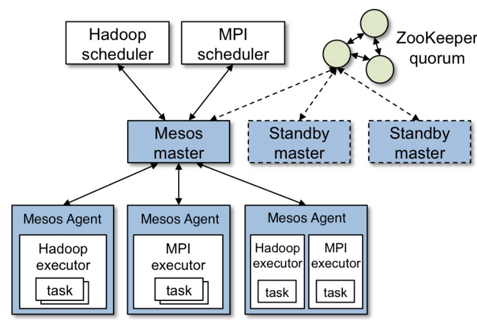
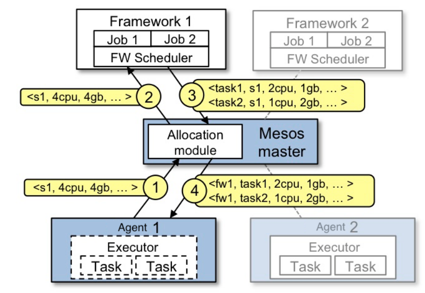
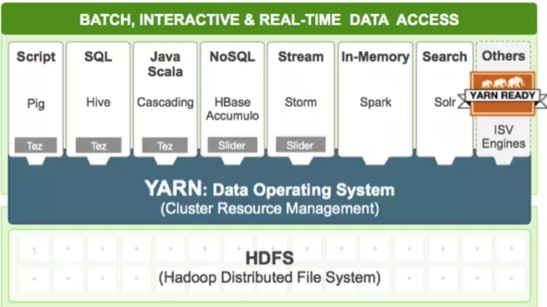
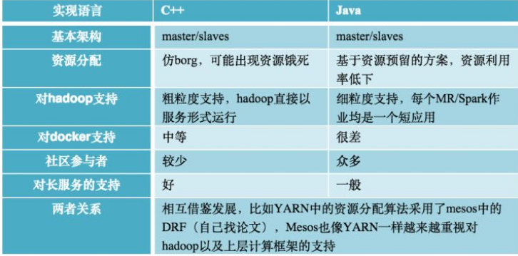

<!-- TOC -->

- [1、概念](#1概念)
- [2、架构](#2架构)
- [Mesos和yarn对比](#mesos和yarn对比)
- [参考](#参考)

<!-- /TOC -->

# 1、概念

Mesos是Apache下的开源分布式资源管理框架，它被称为是分布式系统的内核。Mesos最初是由加州大学伯克利分校的AMPLab开发的，后在Twitter得到广泛使用。 ---百度百科

Apache Mesos is a cluster manager that provides efficient resource isolation and sharing across distributed applications, or frameworks. It can run Hadoop, Jenkins, Spark, Aurora, and other frameworks on a dynamically shared pool of nodes.

# 2、架构

上图显示了 Mesos 的主要组成部分。 Mesos 由一个 master daemon 来管理 slave daemon（即mesos agent节点） 在每个集群节点上的运行, mesos applications （ 也称为 frameworks ）在这些 slaves 上运行 tasks。

Master 使用 Resource Offers 实现跨应用细粒度资源共享，如 cpu、内存、磁盘、网络等。 master 根据指定的策略来决定分配多少资源给 framework ，如公平共享策略，或优先级策略。 为了支持更多样性的策略，master 采用模块化结构，这样就可以方便的通过插件形式来添加新的分配模块。

在 Mesos 上运行的 framework 由两部分组成：一个是 scheduler ，通过注册到　master 来获取集群资源。另一个是在 slave 节点上运行的 executor 进程，它可以执行 framework 的 task 。 Master 决定为每个　framework 提供多少资源， framework 的 scheduler 来选择其中提供的资源。当 framework 同意了提供的资源，它通过 master 将 task发送到提供资源的　slaves 上运行。

> 资源供给的一个例子

下图描述了一个 Framework 如何通过调度来运行一个 Task

事件流程:
- 1、Slave1 向 Master 报告，有4个CPU和4 GB内存可用
- 2、Master 发送一个 Resource Offer 给 Framework1 来描述 Slave1 有多少可用资源
- 3、FrameWork1 中的 FW Scheduler会答复 Master，我有两个 Task 需要运行在 Slave1，一个 Task 需要<2个cpu，1 gb内存="">，另外一个Task需要<1个cpu，2 gb内存="">
- 4、最后，Master 发送这些 Tasks 给 Slave1。然后，Slave1还有1个CPU和1 GB内存没有使用，所以分配模块可以把这些资源提供给 Framework2

当 Tasks 完成和有新的空闲资源时，Resource Offer 会不断重复这一个过程。 当 Mesos 提供的瘦接口允许其来扩展和允许 frameworks 相对独立的参与进来，一个问题将会出现： 一个 framwork 的限制如何被满足在不被 Mesos 对这些限制所知晓的情况下？ 例如， 一个 framework 如何得到数据本地化在不被 Mesos所知晓哪个节点存储着被该 framwork 所需要的数据？Mesos 通过简单的寄予 frameworks 能够拒绝 offers 的能力来回答了这个问题。 一个 framework 将拒绝 不满足其限制要求的 offers 并接受满足其限制要求的 offers. 特殊情况下，我们找到一个简单的策略 delay scheduling， 在该 frameworks 等待 一个限制时间来获取存储输入数据的节点， 并生成接近的优化过得数据点。

# Mesos和yarn对比

Mesos是一个开源的资源管理系统，可以对集群中的资源做弹性管理，目前twitter, apple等公司在大量使用mesos管理集群资源，大家记得apple的siri吗，它的后端便是采用的mesos进行资源管理（自行在网上查找文章：“新一代Siri后端将采用开放源代码平台Mesos”）。国内也有零零散散的公司在使用mesos，比如豆瓣。

Mesos是高仿google内部的资源管理系统borg（论文已经发表）实现的，随着近期它对docker容器支持的越来越好，将备受关注。（注：Mesosphere，一家试图围绕 Apache Mesos 项目开展商业活动的公司，不久前从 Andreessen Horowitz 那里获得了 1000 万美元投资。他做的事情就是用开源方案实现一个borg，选用的技术栈是：mesos+docker）。

谈到资源管理系统，更多人一下子想到的是Hadoop生态系统中的YARN，如何看待它与mesos的关系。

目前看来，Hadoop YARN要比Mesos更主流，前景更广阔。YARN在实现资源管理的系统前提下，能够跟hadoop生态系统完美结合，在YARN的东家hortonworks看来，YARN定位为大数据中的数据操作系统，能够更好地为上层各类应用程序（MapReduce/Spark）提供资源管理和调度功能。另外，非常重要的一点，YARN的社区力量要比Mesos强大的多，它的参与人员众多，周边系统的建设非常完善（包括最新诞生的apache二级项目Twill，http://twill.incubator.apache.org/，cloudera的Kitten，均是方便大家使用YARN而诞生的项目）。

YARN是从MapReduce中演化而来的，因而在大数据处理中扮演重要角色，但这也使得它受限：它现在还不能看做是一个通用的资源管理系统，太多的内部实现过于狭隘，比如资源申请和分配模型，对长服务的支持等。不过，YARN自己仍把它定位在通用资源管理系统上，因而在不断改进，比如最近的版本中，增加了对长服务和docker的支持。

目前Mesos和YARN的优势还是稍有不同的，YARN更多地是用在大数据平台中，对上层计算框架支持的非常好；而Mesos更多是定位在资源的抽象和管理上，以便支持各种应用，不仅仅是计算框架。不过，随着两者的不断完善，他们之间的界限越来越模糊。

# 参考

- [mesos github主页](https://github.com/apache/mesos)

- [Mesos中文网 - Mesos最新官方中文文档和Mesos实践分享](https://docs.huihoo.com/apache/mesos/mesos-cn/index.html)

- [国内哪些互联网公司在用mesos，哪些互联网公司在用yarn，两者前景如何？](https://www.zhihu.com/question/23642987/answer/136361068)

