<!-- TOC -->

- [1、概念](#1概念)
    - [1、弹性调度](#1弹性调度)
        - [1、分片](#1分片)
            - [1、分片项与业务处理解耦](#1分片项与业务处理解耦)
            - [2、个性化参数](#2个性化参数)
        - [2、分布式调度](#2分布式调度)
        - [2、高可用](#2高可用)
        - [3、最大限度利用资源](#3最大限度利用资源)
    - [2、失效转移](#2失效转移)
    - [3、错过任务重执行](#3错过任务重执行)
    - [4、作业开放生态](#4作业开放生态)
- [2、用户手册](#2用户手册)
    - [1、作业 API](#1作业-api)
        - [1.作业开发](#1作业开发)
            - [1、Simple类型作业](#1simple类型作业)
            - [2、Dataflow类型作业](#2dataflow类型作业)
            - [3、Script类型作业](#3script类型作业)
        - [2.作业配置](#2作业配置)
            - [1、使用Java代码配置](#1使用java代码配置)
            - [2、Spring命名空间配置](#2spring命名空间配置)
        - [3.作业启动](#3作业启动)
            - [1、Java 启动方式](#1java-启动方式)
            - [2、Spring 启动方式](#2spring-启动方式)
    - [2、作业配置](#2作业配置)
    - [3、作业分片策略](#3作业分片策略)
        - [1、框架提供的分片策略](#1框架提供的分片策略)
            - [1、AverageAllocationJobShardingStrategy默认](#1averageallocationjobshardingstrategy默认)
            - [2、OdevitySortByNameJobShardingStrategy](#2odevitysortbynamejobshardingstrategy)
            - [3、RotateServerByNameJobShardingStrategy](#3rotateserverbynamejobshardingstrategy)
        - [2、自定义分片策略](#2自定义分片策略)
        - [3、配置分片策略](#3配置分片策略)
    - [4、作业监听器](#4作业监听器)
        - [1.每台作业节点均执行的监听](#1每台作业节点均执行的监听)
        - [2.分布式场景中仅单一节点执行的监听](#2分布式场景中仅单一节点执行的监听)
    - [5、自诊断修复（保证和zk一致）](#5自诊断修复保证和zk一致)
    - [6、事件追踪](#6事件追踪)
    - [7、定制化处理](#7定制化处理)
    - [8、Dump 作业运行信息](#8dump-作业运行信息)
    - [9、作业运行状态监控](#9作业运行状态监控)
- [3、原理](#3原理)
    - [1、弹性分布式实现](#1弹性分布式实现)
    - [2、注册中心数据结构](#2注册中心数据结构)
        - [1、config节点](#1config节点)
        - [2、instances节点(临时节点)](#2instances节点临时节点)
        - [3、sharding节点](#3sharding节点)
        - [4、servers节点](#4servers节点)
        - [5、leader节点](#5leader节点)
- [源码分析](#源码分析)
- [JobScheduler](#jobscheduler)
- [参考](#参考)

<!-- /TOC -->

问题：

- 1、zookeeper扮演的角色？
- 2、如何触发调度的？基于quartz的内存调度RAMJobStore触发
- 3、quartz又是如何和zookeeper结合的？
- 4、如果一份程序部署在多个节点，在指定的时间点会全部触发，只不过数通过分片参数，让当前节点决定后面的处理逻辑？
- 5、分片逻辑和集群节点值如何分配的？
- 6、新增一个节点。如何执行重新分片的？


> 总结

感觉他的思路是服务启动的时候会注册到zookeeper中指定的节点上，其中会存在一个节点被作为leader节点负责给不同的分片分配指定的服务器去执行，在触发执行的时候，服务节点会去zookeeper中查询当前IP需要执行的分片参数，如果没有给当前IP分配分片的话，就会跳过不执行了。


# 1、概念

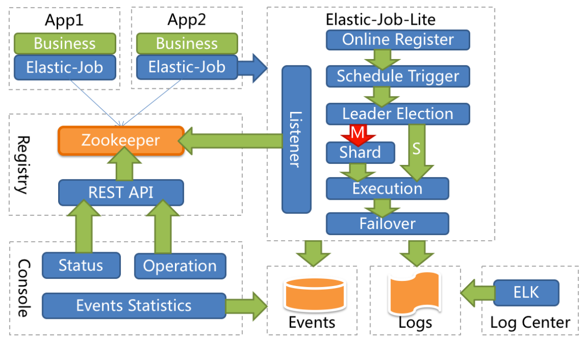

## 1、弹性调度

### 1、分片

任务的分布式执行，需要将一个任务拆分为多个独立的任务项，然后由分布式的服务器分别执行某一个或几个分片项。

例如：有一个遍历数据库某张表的作业，现有 2 台服务器。为了快速的执行作业，那么每台服务器应执行作业的 50%。 为满足此需求，可将作业分成 2 片，每台服务器执行 1 片。作业遍历数据的逻辑应为：服务器 A 遍历 ID 以奇数结尾的数据；服务器 B 遍历 ID 以偶数结尾的数据。 如果分成 10 片，则作业遍历数据的逻辑应为：每片分到的分片项应为 ID % 10，而服务器A被分配到分片项 0,1,2,3,4；服务器B被分配到分片项 5,6,7,8,9，直接的结果就是服务器A遍历 ID 以 0-4 结尾的数据；服务器 B 遍历 ID 以 5-9 结尾的数据。`这里的逻辑是不是有问题？`

#### 1、分片项与业务处理解耦

ElasticJob 并不直接提供数据处理的功能，框架只会将分片项分配至各个运行中的作业服务器，开发者需要自行处理分片项与真实数据的对应关系。

#### 2、个性化参数

个性化参数即 shardingItemParameter，可以和分片项匹配对应关系，用于将分片项的数字转换为更加可读的业务代码。

例如：按照地区水平拆分数据库，数据库A是北京的数据；数据库 B 是上海的数据；数据库 C 是广州的数据。 如果仅按照分片项配置，开发者需要了解 0 表示北京；1 表示上海；2 表示广州。 合理使用个性化参数可以让代码更可读，如果配置为 0=北京,1=上海,2=广州，那么代码中直接使用北京，上海，广州的枚举值即可完成分片项和业务逻辑的对应关系。

### 2、分布式调度

ElasticJob Lite 并无作业调度中心节点，而是基于部署作业框架的程序在到达相应时间点时各自触发调度。

`注册中心仅用于作业注册和监控信息存储。而主作业节点仅用于处理分片和清理等功能。`

### 2、高可用

ElasticJob Lite 提供最安全的方式执行作业。将分片总数设置为 1，并使用多于 1 台的服务器执行作业，作业将会以 1 主 n 从的方式执行。

一旦执行作业的服务器崩溃，等待执行的服务器将会在下次作业启动时替补执行。开启失效转移功能效果更好，可以保证在本次作业执行时崩溃，备机立即启动替补执行。

### 3、最大限度利用资源

ElasticJob Lite 也提供最灵活的方式，最大限度的提高执行作业的吞吐量。将分片项设置为大于服务器的数量，最好是大于服务器倍数的数量，作业将会合理的利用分布式资源，动态的分配分片项。

例如：3 台服务器，分成 10 片，则分片项分配结果为服务器 A=0,1,2;服务器 B=3,4,5;服务器 C=6,7,8,9。 如果服务器 C 崩溃，则分片项分配结果为服务器 A=0,1,2,3,4;服务器 B=5,6,7,8,9。在不丢失分片项的情况下，最大限度的利用现有资源提高吞吐量。

## 2、失效转移

## 3、错过任务重执行

## 4、作业开放生态


# 2、用户手册

## 1、作业 API


### 1.作业开发

ElasticJob Lite 和 ElasticJob Cloud 提供统一作业接口，开发者仅需对业务作业进行一次开发，之后可根据不同的配置以及部署至不同的Lite或Cloud环境。

ElasticJob 提供 Simple、Dataflow 和 Script 3 种作业类型。 方法参数shardingContext包含作业配置、片和运行时信息。可通过getShardingTotalCount(), getShardingItem()等方法分别获取分片总数，运行在本作业服务器的分片序列号等。

#### 1、Simple类型作业

意为简单实现，未经任何封装的类型。需实现SimpleJob接口。该接口仅提供单一方法用于覆盖，此方法将定时执行。与Quartz原生接口相似，但提供了弹性扩缩容和分片等功能。

```java
public class MyElasticJob implements SimpleJob {
    
    @Override
    public void execute(ShardingContext context) {
        switch (context.getShardingItem()) {
            case 0: 
                // do something by sharding item 0
                break;
            case 1: 
                // do something by sharding item 1
                break;
            case 2: 
                // do something by sharding item 2
                break;
            // case n: ...
        }
    }
}
```

#### 2、Dataflow类型作业

Dataflow类型用于处理数据流，需实现DataflowJob接口。该接口提供2个方法可供覆盖，分别用于抓取(fetchData)和处理(processData)数据。

```java
public class MyElasticJob implements DataflowJob<Foo> {
    
    @Override
    public List<Foo> fetchData(ShardingContext context) {
        switch (context.getShardingItem()) {
            case 0: 
                List<Foo> data = // get data from database by sharding item 0
                return data;
            case 1: 
                List<Foo> data = // get data from database by sharding item 1
                return data;
            case 2: 
                List<Foo> data = // get data from database by sharding item 2
                return data;
            // case n: ...
        }
    }
    
    @Override
    public void processData(ShardingContext shardingContext, List<Foo> data) {
        // process data
        // ...
    }
}
```

流式处理

可通过DataflowJobConfiguration配置是否流式处理。

流式处理数据只有fetchData方法的返回值为null或集合长度为空时，作业才停止抓取，否则作业将一直运行下去； 非流式处理数据则只会在每次作业执行过程中执行一次fetchData方法和processData方法，随即完成本次作业。

如果采用流式作业处理方式，建议processData处理数据后更新其状态，避免fetchData再次抓取到，从而使得作业永不停止。 流式数据处理参照TbSchedule设计，适用于不间歇的数据处理。

#### 3、Script类型作业

Script类型作业意为脚本类型作业，支持shell，python，perl等所有类型脚本。只需通过控制台或代码配置scriptCommandLine即可，无需编码。执行脚本路径可包含参数，参数传递完毕后，作业框架会自动追加最后一个参数为作业运行时信息。


```sh
#!/bin/bash
echo sharding execution context is $*
```

作业运行时输出

sharding execution context is {“jobName”:“scriptElasticDemoJob”,“shardingTotalCount”:10,“jobParameter”:"",“shardingItem”:0,“shardingParameter”:“A”}

### 2.作业配置

#### 1、使用Java代码配置

ElasticJob 配置分为3个层级，分别是Core, Type和Root。每个层级使用相似于装饰者模式的方式装配。

Core 对应 JobCoreConfiguration，用于提供作业核心配置信息，如：作业名称、分片总数、CRON表达式等。

Type 对应 JobTypeConfiguration，有3个子类分别对应SIMPLE, DATAFLOW和SCRIPT类型作业，提供3种作业需要的不同配置，如：DATAFLOW类型是否流式处理或SCRIPT类型的命令行等。

Root 对应 JobConfiguration，有2个子类分别对应Lite和Cloud部署类型，提供不同部署类型所需的配置，如：Lite类型的是否需要覆盖本地配置或Cloud占用CPU或Memory数量等。


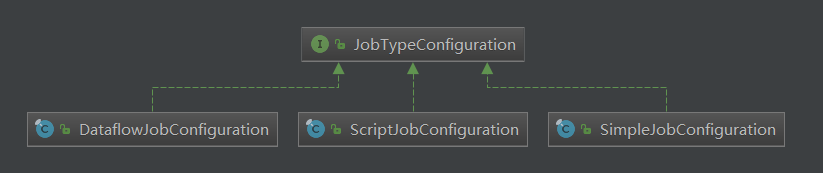

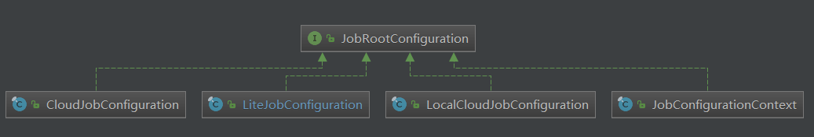

```java
 // 定义作业核心配置
    JobCoreConfiguration simpleCoreConfig = JobCoreConfiguration.newBuilder("demoSimpleJob", "0/15 * * * * ?", 10).build();
    // 定义 SIMPLE 类型配置
    SimpleJobConfiguration simpleJobConfig = new SimpleJobConfiguration(simpleCoreConfig, SimpleDemoJob.class.getCanonicalName());
    // 定义作业根配置
    JobConfiguration simpleJJobRootConfig = JobConfiguration.newBuilder(simpleJobConfig).build();
    


    // 定义作业核心配置
    JobCoreConfiguration dataflowCoreConfig = JobCoreConfiguration.newBuilder("demoDataflowJob", "0/30 * * * * ?", 10).build();
    // 定义 DATAFLOW 类型配置
    DataflowJobConfiguration dataflowJobConfig = new DataflowJobConfiguration(dataflowCoreConfig, DataflowDemoJob.class.getCanonicalName(), true);
    // 定义Lite作业根配置
    JobConfiguration dataflowJobRootConfig = JobConfiguration.newBuilder(dataflowJobConfig).build();
    


    // 定义作业核心配置配置
    JobCoreConfiguration scriptCoreConfig = JobCoreConfiguration.newBuilder("demoScriptJob", "0/45 * * * * ?", 10).build();
    // 定义 SCRIPT 类型配置
    ScriptJobConfiguration scriptJobConfig = new ScriptJobConfiguration(scriptCoreConfig, "test.sh");
    // 定义作业根配置
    JobConfiguration scriptJobRootConfig = JobConfiguration.newBuilder(scriptCoreConfig).build();

```


#### 2、Spring命名空间配置


与Spring容器配合使用作业，可将作业Bean配置为Spring Bean，并在作业中通过依赖注入使用Spring容器管理的数据源等对象。可用placeholder占位符从属性文件中取值。Lite可考虑使用Spring命名空间方式简化配置。


```xml
<?xml version="1.0" encoding="UTF-8"?>
<beans xmlns="http://www.springframework.org/schema/beans"
    xmlns:xsi="http://www.w3.org/2001/XMLSchema-instance"
    xmlns:elasticjob="http://shardingsphere.apache.org/schema/elasticjob"
    xsi:schemaLocation="http://www.springframework.org/schema/beans 
                        http://www.springframework.org/schema/beans/spring-beans.xsd 
                        http://shardingsphere.apache.org/schema/elasticjob
                        http://shardingsphere.apache.org/schema/elasticjob/elasticjob.xsd
                        ">
    <!--配置作业注册中心 -->
    <elasticjob:zookeeper id="regCenter" server-lists="yourhost:2181" namespace="dd-job" base-sleep-time-milliseconds="1000" max-sleep-time-milliseconds="3000" max-retries="3" />
    
    <!-- 配置简单作业-->
    <elasticjob:job id="simpleElasticJob" class="xxx.MySimpleElasticJob" registry-center-ref="regCenter" cron="0/10 * * * * ?" sharding-total-count="3" sharding-item-parameters="0=A,1=B,2=C" />
    
    <bean id="yourRefJobBeanId" class="xxx.MySimpleRefElasticJob">
        <property name="fooService" ref="xxx.FooService"/>
    </bean>
    
    <!-- 配置关联Bean作业-->
    <elasticjob:job id="simpleRefElasticJob" job-ref="yourRefJobBeanId" registry-center-ref="regCenter" cron="0/10 * * * * ?" sharding-total-count="3" sharding-item-parameters="0=A,1=B,2=C" />
    
    <!-- 配置数据流作业-->
    <elasticjob:job id="throughputDataflow" class="xxx.MyThroughputDataflowElasticJob" registry-center-ref="regCenter" cron="0/10 * * * * ?" sharding-total-count="3" sharding-item-parameters="0=A,1=B,2=C" />
    
    <!-- 配置脚本作业-->
    <elasticjob:job id="scriptElasticJob" registry-center-ref="regCenter" cron="0/10 * * * * ?" sharding-total-count="3" sharding-item-parameters="0=A,1=B,2=C" script-command-line="/your/file/path/demo.sh" />
    
    <!-- 配置带监听的简单作业-->
    <elasticjob:job id="listenerElasticJob" class="xxx.MySimpleListenerElasticJob" registry-center-ref="regCenter" cron="0/10 * * * * ?" sharding-total-count="3" sharding-item-parameters="0=A,1=B,2=C">
        <elasticjob:listener class="xx.MySimpleJobListener"/>
        <elasticjob:distributed-listener class="xx.MyOnceSimpleJobListener" started-timeout-milliseconds="1000" completed-timeout-milliseconds="2000" />
    </elasticjob:job>
    
    <!-- 配置带作业数据库事件追踪的简单作业-->
    <elasticjob:job id="eventTraceElasticJob" class="xxx.MySimpleListenerElasticJob" registry-center-ref="regCenter" tracing-ref="yourDataSource" cron="0/10 * * * * ?" sharding-total-count="3" sharding-item-parameters="0=A,1=B,2=C" />
</beans>
```


### 3.作业启动


#### 1、Java 启动方式

```java
public class JobDemo {
    
    public static void main(String[] args) {
        new JobScheduler(createRegistryCenter(), createJobConfiguration()).init();
    }
    
    private static CoordinatorRegistryCenter createRegistryCenter() {
        CoordinatorRegistryCenter regCenter = new ZookeeperRegistryCenter(new ZookeeperConfiguration("zk_host:2181", "elastic-job-demo"));
        regCenter.init();
        return regCenter;
    }
    
    private static JobConfiguration createJobConfiguration() {
        // 创建作业配置
        ...
    }
}
```

#### 2、Spring 启动方式

将配置 Spring 命名空间的 xml 通过 Spring 启动，作业将自动加载。


## 2、作业配置


## 3、作业分片策略


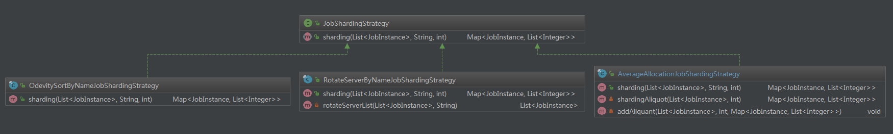

### 1、框架提供的分片策略


#### 1、AverageAllocationJobShardingStrategy默认

策略说明：

基于平均分配算法的分片策略，也是默认的分片策略。

如果分片不能整除，则不能整除的多余分片将依次追加到序号小的服务器。如：

如果有3台服务器，分成9片，则每台服务器分到的分片是：1=[0,1,2], 2=[3,4,5], 3=[6,7,8]

如果有3台服务器，分成8片，则每台服务器分到的分片是：1=[0,1,6], 2=[2,3,7], 3=[4,5]

如果有3台服务器，分成10片，则每台服务器分到的分片是：1=[0,1,2,9], 2=[3,4,5], 3=[6,7,8]


#### 2、OdevitySortByNameJobShardingStrategy

策略说明：

根据作业名的哈希值奇偶数决定IP升降序算法的分片策略。

作业名的哈希值为奇数则IP升序。

作业名的哈希值为偶数则IP降序。

用于不同的作业平均分配负载至不同的服务器。

AverageAllocationJobShardingStrategy的缺点是，一旦分片数小于作业服务器数，作业将永远分配至IP地址靠前的服务器，导致IP地址靠后的服务器空闲。而OdevitySortByNameJobShardingStrategy则可以根据作业名称重新分配服务器负载。如：

如果有3台服务器，分成2片，作业名称的哈希值为奇数，则每台服务器分到的分片是：1=[0], 2=[1], 3=[]

如果有3台服务器，分成2片，作业名称的哈希值为偶数，则每台服务器分到的分片是：3=[0], 2=[1], 1=[]

`正序保证前面的IP得到执行，逆序保证后面的IP得到执行`

#### 3、RotateServerByNameJobShardingStrategy

策略说明：

根据作业名的哈希值对服务器列表进行轮转的分片策略。


### 2、自定义分片策略

实现JobShardingStrategy接口并实现sharding方法，接口方法参数为作业服务器IP列表和分片策略选项，分片策略选项包括作业名称，分片总数以及分片序列号和个性化参数对照表，可以根据需求定制化自己的分片策略。


### 3、配置分片策略

与配置通常的作业属性相同，在spring命名空间或者JobConfiguration中配置jobShardingStrategyType属性，属性值是作业分片策略类的全路径。


## 4、作业监听器

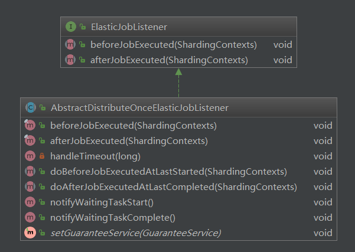


可通过配置多个任务监听器，在任务执行前和执行后执行监听的方法。监听器分为每台作业节点均执行和分布式场景中仅单一节点执行2种。

### 1.每台作业节点均执行的监听

若作业处理作业服务器的文件，处理完成后删除文件，可考虑使用每个节点均执行清理任务。此类型任务实现简单，且无需考虑全局分布式任务是否完成，请尽量使用此类型监听器。


步骤：

1、定义监听器

```java
public class MyElasticJobListener implements ElasticJobListener {
    
    @Override
    public void beforeJobExecuted(ShardingContexts shardingContexts) {
        // do something ...
    }
    
    @Override
    public void afterJobExecuted(ShardingContexts shardingContexts) {
        // do something ...
    }
}
```

2、将监听器作为参数传入JobScheduler

```java
public class JobMain {
    
    public static void main(String[] args) {
        new JobScheduler(createRegistryCenter(), createJobConfiguration(), new MyElasticJobListener()).init();
    }
    
    private static CoordinatorRegistryCenter createRegistryCenter() {
        CoordinatorRegistryCenter regCenter = new ZookeeperRegistryCenter(new ZookeeperConfiguration("zk_host:2181", "elastic-job-demo"));
        regCenter.init();
        return regCenter;
    }
    
    private static JobConfiguration createJobConfiguration() {
        // 创建作业配置
        ...
    }
}
```


### 2.分布式场景中仅单一节点执行的监听

若作业处理数据库数据，处理完成后只需一个节点完成数据清理任务即可。此类型任务处理复杂，需同步分布式环境下作业的状态同步，提供了超时设置来避免作业不同步导致的死锁，请谨慎使用。

步骤：

1、定义监听器

```java
public class TestDistributeOnceElasticJobListener extends AbstractDistributeOnceElasticJobListener {
    
    public TestDistributeOnceElasticJobListener(long startTimeoutMills, long completeTimeoutMills) {
        super(startTimeoutMills, completeTimeoutMills);
    }
    
    @Override
    public void doBeforeJobExecutedAtLastStarted(ShardingContexts shardingContexts) {
        // do something ...
    }
    
    @Override
    public void doAfterJobExecutedAtLastCompleted(ShardingContexts shardingContexts) {
        // do something ...
    }
}
```

2、将监听器作为参数传入JobScheduler

```java
public class JobMain {
    
    public static void main(String[] args) {
        long startTimeoutMills = 5000L;
        long completeTimeoutMills = 10000L;
        new JobScheduler(createRegistryCenter(), createJobConfiguration(), new MyDistributeOnceElasticJobListener(startTimeoutMills, completeTimeoutMills)).init();
    }
    
    private static CoordinatorRegistryCenter createRegistryCenter() {
        CoordinatorRegistryCenter regCenter = new ZookeeperRegistryCenter(new ZookeeperConfiguration("zk_host:2181", "elastic-job-demo"));
        regCenter.init();
        return regCenter;
    }
    
    private static JobConfiguration createJobConfiguration() {
        // 创建作业配置
        ...
    }
}
```


## 5、自诊断修复（保证和zk一致）

在分布式的场景下由于网络、时钟等原因，可能导致 ZooKeeper 的数据与真实运行的作业产生不一致，这种不一致通过正向的校验无法完全避免。 需要另外启动一个线程定时校验注册中心数据与真实作业状态的一致性，即维持 ElasticJob 的最终一致性。

在 2.0.6 之前的版本中，网络不稳定的环境下 ElasticJob 有可能有的作业分片并未执行，重启一下就能修复。 在2.0.6，版本中 ElasticJob 在提供 reconcileIntervalMinutes 设置修复状态服务执行间隔分钟数，用于修复作业服务器不一致状态，默认每 10 分钟检测并修复一次。

支持两种配置方式

Spring 方式

```xml
<?xml version="1.0" encoding="UTF-8"?>
<beans xmlns="http://www.springframework.org/schema/beans"
       xmlns:xsi="http://www.w3.org/2001/XMLSchema-instance"
       xmlns:elasticjob="http://shardingsphere.apache.org/schema/elasticjob"
       xsi:schemaLocation="http://www.springframework.org/schema/beans
                           http://www.springframework.org/schema/beans/spring-beans.xsd
                           http://shardingsphere.apache.org/schema/elasticjob
                           http://shardingsphere.apache.org/schema/elasticjob/elasticjob.xsd
                          ">
    <!--配置作业注册中心 -->
    <elasticjob:zookeeper id="regCenter" server-lists="yourhost:2181" namespace="elastic-job" base-sleep-time-milliseconds="1000" max-sleep-time-milliseconds="3000" max-retries="3" />
    
    <!--配置作业类 -->
    <bean id="simpleJob" class="xxx.MyElasticJob" />
    
    <!--配置作业 -->
    <elasticjob:simple id="oneOffElasticJob" job-ref="simpleJob" registry-center-ref="regCenter" reconcile-interval-minutes="10" cron="0/10 * * * * ?" sharding-total-count="3" sharding-item-parameters="0=A,1=B,2=C" />
</beans>
```


Java 方式

```java
public class JobMain {
    public static void main(final String[] args) {
        // ...
        JobConfiguration.newBuilder(simpleJobConfig).reconcileIntervalMinutes(10).build();
        // ...
    }
}
```


## 6、事件追踪


ElasticJob 提供了事件追踪功能，可通过事件订阅的方式处理调度过程的重要事件，用于查询、统计和监控。 ElasticJob 目前提供了基于关系型数据库两种事件订阅方式记录事件。

通过代码配置开启事件追踪

ElasticJob Lite 在配置中提供了 TracingConfiguration，目前支持数据库方式配置。


```java
 // 初始化数据源
    DataSource dataSource = ...;
    // 定义日志数据库事件溯源配置
    TracingConfiguration tracingConfig = new TracingConfiguration<>("RDB", dataSource);
    // 初始化注册中心
    CoordinatorRegistryCenter regCenter = ...;
    // 初始化作业配置
    JobConfiguration jobConfig = ...;
    new JobScheduler(regCenter, jobConfig, tracingConfig).init(); 
```

事件追踪的 event_trace_rdb_url 属性对应库自动创建 JOB_EXECUTION_LOG 和 JOB_STATUS_TRACE_LOG 两张表以及若干索引。

JOB_EXECUTION_LOG 记录每次作业的执行历史。分为两个步骤：

- 1、作业开始执行时向数据库插入数据，除 failure_cause 和 complete_time 外的其他字段均不为空。

- 2、作业完成执行时向数据库更新数据，更新 is_success, complete_time 和 failure_cause(如果作业执行失败)。


JOB_STATUS_TRACE_LOG 记录作业状态变更痕迹表。可通过每次作业运行的 task_id 查询作业状态变化的生命周期和运行轨迹。


## 7、定制化处理

ElasticJob 在配置中提供了 JobHandler，用于定制化处理，目前支持自定义异常处理及作业处理线程池。

1、异常处理

可扩展 JobErrorHandler 接口，默认实现是记录日志但不抛出异常。

2、作业处理线程池

可扩展 JobExecutorServiceHandler 接口，定制线程池。

## 8、Dump 作业运行信息


## 9、作业运行状态监控

通过监听 ElasticJob Lite 的 ZooKeeper 注册中心的几个关键节点即可完成作业运行状态监控功能。

1、监听作业服务器存活

监听 job_name\instances\job_instance_id 节点是否存在。该节点为临时节点，如果作业服务器下线，该节点将删除。


# 3、原理


## 1、弹性分布式实现

第一台服务器上线触发主服务器选举。主服务器一旦下线，则重新触发选举，选举过程中阻塞，只有主服务器选举完成，才会执行其他任务。

某作业服务器上线时会自动将服务器信息注册到注册中心，下线时会自动更新服务器状态。

`主节点选举，服务器上下线，分片总数变更均更新重新分片标记。`

定时任务触发时，如需重新分片，则通过主服务器分片，分片过程中阻塞，分片结束后才可执行任务。如分片过程中主服务器下线，则先选举主服务器，再分片。

通过上一项说明可知，为了维持作业运行时的稳定性，运行过程中只会标记分片状态，不会重新分片。分片仅可能发生在下次任务触发前。

每次分片都会按服务器IP排序，保证分片结果不会产生较大波动。

实现失效转移功能，在某台服务器执行完毕后主动抓取未分配的分片，并且在某台服务器下线后主动寻找可用的服务器执行任务。

## 2、注册中心数据结构

注册中心在定义的命名空间下，创建作业名称节点，用于区分不同作业，所以作业一旦创建则不能修改作业名称，如果修改名称将视为新的作业。作业名称节点下又包含4个数据子节点，分别是config, instances, sharding, servers和leader。

### 1、config节点

作业配置信息，以JSON格式存储

### 2、instances节点(临时节点)

作业运行实例信息，子节点是当前作业运行实例的主键。作业运行实例主键由作业运行服务器的IP地址和PID构成。作业运行实例主键均为临时节点，当作业实例上线时注册，下线时自动清理。注册中心监控这些节点的变化来协调分布式作业的分片以及高可用。 可在作业运行实例节点写入TRIGGER表示该实例立即执行一次。

### 3、sharding节点

作业分片信息，子节点是分片项序号，从零开始，至分片总数减一。分片项序号的子节点存储详细信息。每个分片项下的子节点用于控制和记录分片运行状态。节点详细信息说明：

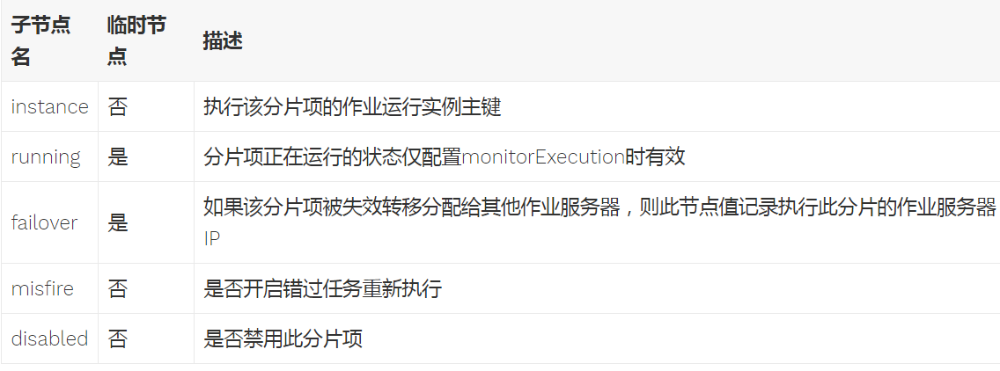


备注：instance节点的值是上面instances下面的一个。比如100.124.0.68@-@19680，类似于。把这个分片交给谁去执行，各个IP根据分配去领取分配给自己的任务，然后执行。


### 4、servers节点


作业服务器信息，子节点是作业服务器的IP地址。可在IP地址节点写入DISABLED表示该服务器禁用。 在新的cloud native架构下，servers节点大幅弱化，仅包含控制服务器是否可以禁用这一功能。为了更加纯粹的实现job核心，servers功能未来可能删除，控制服务器是否禁用的能力应该下放至自动化部署系统。


### 5、leader节点

作业服务器主节点信息，分为election，sharding和failover三个子节点。分别用于主节点选举，分片和失效转移处理。

leader节点是内部使用的节点，如果对作业框架原理不感兴趣，可不关注此节点。

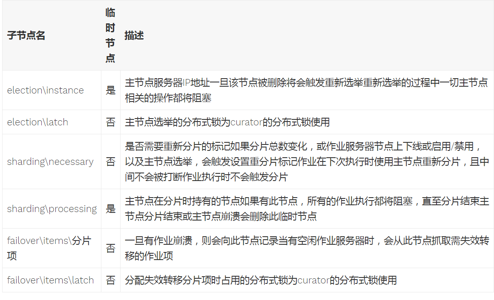


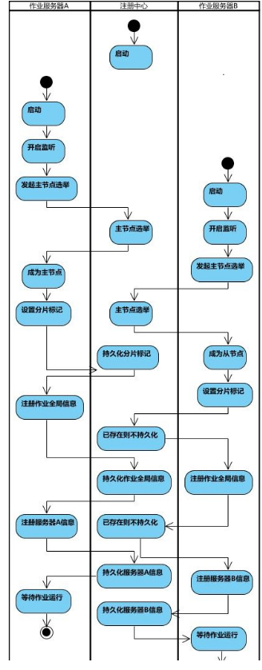


启动过程步骤：

- 1、节点选举，称为leader或者follower；（需要和zk交互）
- 2、设置分片标记；
- 3、持久化分片信息；（需要和zk交互）（follower节点判断已经存在则不持久化）
- 4、注册作业全局信息；
- 5、持久化作业全局信息；（需要和zk交互）（follower节点判断已经存在则不持久化）
- 6、注册服务器节点信息；
- 7、持久化服务器节点信息；（需要和zk交互）
- 8、等待作业运行；


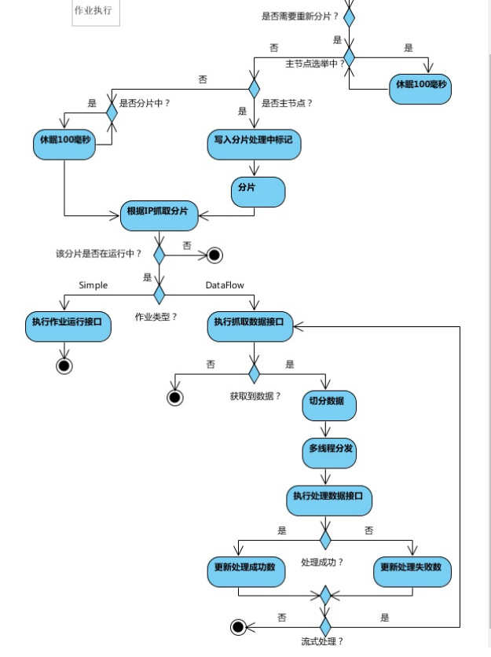


# 源码分析

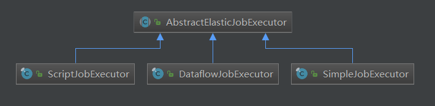


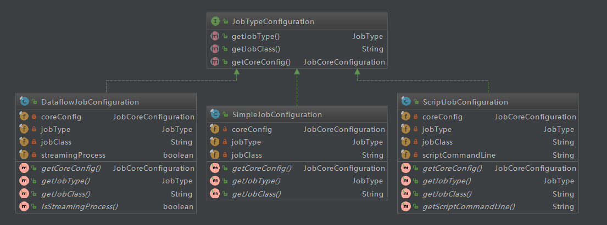


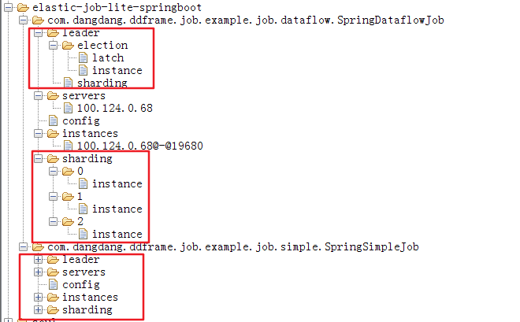


config节点的数据格式(以样例中的SpringSimpleJob为例)

json化LiteJobConfiguration对象的数据

```json
{
"jobName": "com.dangdang.ddframe.job.example.job.simple.SpringSimpleJob",
"jobClass": "com.dangdang.ddframe.job.example.job.simple.SpringSimpleJob",
"jobType": "SIMPLE",
"cron": "0/5 * * * * ?",
"shardingTotalCount": 3,
"shardingItemParameters": "0=Beijing,1=Shanghai,2=Guangzhou",
"jobParameter": "",
"failover": false,
"misfire": true,
"description": "",
"jobProperties": {
"job_exception_handler": "com.dangdang.ddframe.job.executor.handler.impl.DefaultJobExceptionHandler",
"executor_service_handler": "com.dangdang.ddframe.job.executor.handler.impl.DefaultExecutorServiceHandler"
},
"monitorExecution": true,
"maxTimeDiffSeconds": -1,
"monitorPort": -1,
"jobShardingStrategyClass": "",
"reconcileIntervalMinutes": 10,
"disabled": false,
"overwrite": true
}

```


# JobScheduler

作业调度器,作为入口


# 参考

- [elastic-job的原理简介和使用](https://blog.csdn.net/fanfan_v5/article/details/61310045)

- [elastic-job 新手指南](https://www.cnblogs.com/yjmyzz/p/elastic-job-tutorial.html)

- [shardingsphere-elasticjob-lite](https://github.com/apache/shardingsphere-elasticjob-lite)

- [官方文档](http://shardingsphere.apache.org/elasticjob/current/index_zh.html)

- [相关博客](https://shardingsphere.apache.org/elasticjob/lite/cn/blog/)