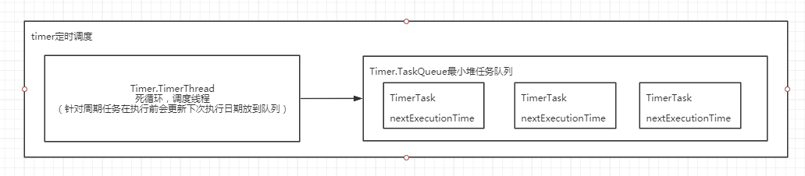
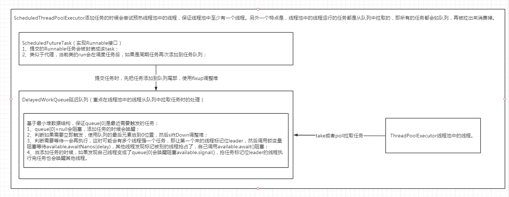

<!-- TOC -->

- [1、timer（单线程执行）](#1timer单线程执行)
    - [思考1：如果time/firstTime指定的时间，在当前时间之前，会发生什么呢？](#思考1如果timefirsttime指定的时间在当前时间之前会发生什么呢)
    - [思考2：schedule和scheduleAtFixedRate有什么区别？](#思考2schedule和scheduleatfixedrate有什么区别)
    - [思考3：如果执行task发生异常，是否会影响其他task的定时调度？](#思考3如果执行task发生异常是否会影响其他task的定时调度)
    - [思考4：Timer的一些缺陷？](#思考4timer的一些缺陷)
    - [8、源码解析](#8源码解析)
        - [1、Timer](#1timer)
        - [2、Timer.TaskQueue](#2timertaskqueue)
        - [3、Timer.TimerThread](#3timertimerthread)
        - [4、TimerTask实现了Runnable的抽象类](#4timertask实现了runnable的抽象类)
    - [9、使用示例](#9使用示例)
- [2、ScheduledThreadPoolExecutor](#2scheduledthreadpoolexecutor)
    - [ScheduledFutureTask](#scheduledfuturetask)
    - [DelayedWorkQueue](#delayedworkqueue)
    - [9、使用样例](#9使用样例)
- [3、Quartz](#3quartz)
- [参考](#参考)

<!-- /TOC -->

# 1、timer（单线程执行）

> 总结

Timer内部包含两个内部类，TimerThread和TaskQueue，前者为一个后台线程用来判断哪个任务到时间了需要执行，后者为保存任务的一个最小堆实现。





Timer位于java.util包下，其内部包含且仅包含一个后台线程（TimeThread）对多个业务任务（TimeTask）进行定时定频率的调度。

schedule的四种用法和scheduleAtFixedRate的两种用法


参数说明：

- task：所要执行的任务，需要extends TimeTask override run()

- time/firstTime：首次执行任务的时间

- period：周期性执行Task的时间间隔，单位是毫秒

- delay：执行task任务前的延时时间，单位是毫秒

很显然，通过上述的描述，我们可以实现：

- 延迟多久后执行一次任务；
- 指定时间执行一次任务；
- 延迟一段时间，并周期性执行任务；
- 指定时间，并周期性执行任务；


Timer其他需要关注的方法

- cancel()：终止Timer计时器，丢弃所有当前已安排的任务（TimeTask也存在cancel()方法，不过终止的是TimeTask）

- purge()：从计时器的任务队列中移除已取消的任务，并返回个数


## 思考1：如果time/firstTime指定的时间，在当前时间之前，会发生什么呢？

在时间等于或者超过time/firstTime的时候，会执行task！也就是说，如果time/firstTime指定的时间在当前时间之前，就会立即得到执行。

## 思考2：schedule和scheduleAtFixedRate有什么区别？

scheduleAtFixedRate：每次执行时间为上一次任务开始起向后推一个period间隔，也就是说下次执行时间相对于上一次任务开始的时间点，因此执行时间不会延后，但是存在任务并发执行的问题。

schedule：每次执行时间为上一次任务结束后推一个period间隔，也就是说下次执行时间相对于上一次任务结束的时间点，因此执行时间会不断延后。

## 思考3：如果执行task发生异常，是否会影响其他task的定时调度？

如果TimeTask抛出RuntimeException，那么Timer会停止所有任务的运行！

## 思考4：Timer的一些缺陷？

前面已经提及到Timer背后是一个单线程，因此Timer存在管理并发任务的缺陷：所有任务都是由同一个线程来调度，所有任务都是串行执行，意味着同一时间只能有一个任务得到执行，而前一个任务的延迟或者异常会影响到之后的任务。

其次，Timer的一些调度方式还算比较简单，无法适应实际项目中任务定时调度的复杂度。


## 8、源码解析


### 1、Timer

```java
public class Timer {
   
    private final TaskQueue queue = new TaskQueue();//任务优先级队列，按照执行时间进行排序

    private final TimerThread thread = new TimerThread(queue);//后台线程，用来执行任务

    
    private final Object threadReaper = new Object() {
        protected void finalize() throws Throwable {
            synchronized(queue) {
                thread.newTasksMayBeScheduled = false;
                queue.notify(); // In case queue is empty.
            }
        }
    };

    //用于生成线程的名字
    private final static AtomicInteger nextSerialNumber = new AtomicInteger(0);
    private static int serialNumber() {
        return nextSerialNumber.getAndIncrement();
    }


    public Timer() {
        this("Timer-" + serialNumber());
    }


    public Timer(boolean isDaemon) {
        this("Timer-" + serialNumber(), isDaemon);
    }


    public Timer(String name) {
        thread.setName(name);
        thread.start();
    }

    public Timer(String name, boolean isDaemon) {
        thread.setName(name);
        thread.setDaemon(isDaemon);
        thread.start();
    }


    public void schedule(TimerTask task, long delay) {
        if (delay < 0)
            throw new IllegalArgumentException("Negative delay.");
        sched(task, System.currentTimeMillis()+delay, 0);
    }

    public void schedule(TimerTask task, Date time) {
        sched(task, time.getTime(), 0);
    }

    
    public void schedule(TimerTask task, long delay, long period) {
        if (delay < 0)
            throw new IllegalArgumentException("Negative delay.");
        if (period <= 0)
            throw new IllegalArgumentException("Non-positive period.");
        sched(task, System.currentTimeMillis()+delay, -period);
    }

    
    public void schedule(TimerTask task, Date firstTime, long period) {
        if (period <= 0)
            throw new IllegalArgumentException("Non-positive period.");
        sched(task, firstTime.getTime(), -period);
    }

    public void scheduleAtFixedRate(TimerTask task, long delay, long period) {
        if (delay < 0)
            throw new IllegalArgumentException("Negative delay.");
        if (period <= 0)
            throw new IllegalArgumentException("Non-positive period.");
        sched(task, System.currentTimeMillis()+delay, period);
    }

    public void scheduleAtFixedRate(TimerTask task, Date firstTime,
                                    long period) {
        if (period <= 0)
            throw new IllegalArgumentException("Non-positive period.");
        sched(task, firstTime.getTime(), period);
    }

    //重载方法的最终入口
    private void sched(TimerTask task, long time, long period) {
        if (time < 0)
            throw new IllegalArgumentException("Illegal execution time.");

        // Constrain value of period sufficiently to prevent numeric
        // overflow while still being effectively infinitely large.
        if (Math.abs(period) > (Long.MAX_VALUE >> 1))
            period >>= 1;

        synchronized(queue) {
            if (!thread.newTasksMayBeScheduled)
                throw new IllegalStateException("Timer already cancelled.");

            synchronized(task.lock) {
                if (task.state != TimerTask.VIRGIN)
                    throw new IllegalStateException(
                        "Task already scheduled or cancelled");
                task.nextExecutionTime = time;//更新任务的执行时间
                task.period = period;//更新任务的执行周期
                task.state = TimerTask.SCHEDULED;//更新任务的状态
            }

            queue.add(task);//添加到任务队列
            if (queue.getMin() == task)//如果最小的是当前任务，需要唤醒阻塞的线程
                queue.notify();
        }
    }

    public void cancel() {//整个timer被取消，需要清空队列
        synchronized(queue) {
            thread.newTasksMayBeScheduled = false;
            queue.clear();
            queue.notify();  // In case queue was already empty.
        }
    }

     //从任务队列中移除全部被取消的任务
     public int purge() {
         int result = 0;

         synchronized(queue) {
             for (int i = queue.size(); i > 0; i--) {
                 if (queue.get(i).state == TimerTask.CANCELLED) {
                     queue.quickRemove(i);
                     result++;
                 }
             }

             if (result != 0)
                 queue.heapify();
         }

         return result;
     }
}

}

```


### 2、Timer.TaskQueue

```java

//优先级任务队列，基于nextExecutionTime排序。通过最小堆实现
class TaskQueue {

    //节点queue[n]的两个孩子为queue[2*n] and queue[2*n+1]，基于nextExecutionTime字段进行排序，最先执行的任务在queue[1]。注意，这里为了计算左右孩子方便，数组的第一个节点没有使用，从1开始的。
    private TimerTask[] queue = new TimerTask[128];

    private int size = 0;

    int size() {
        return size;
    }

    void add(TimerTask task) {//添加一个任务到优先级队列
        // Grow backing store if necessary
        if (size + 1 == queue.length)
            queue = Arrays.copyOf(queue, 2*queue.length);

        queue[++size] = task;//追加到尾部
        fixUp(size);//从尾部上升调整
    }

    //获取堆顶的元素
    TimerTask getMin() {
        return queue[1];
    }

    TimerTask get(int i) {
        return queue[i];
    }

    //移除堆顶元素，把队列尾部的移动到前面来
    void removeMin() {
        queue[1] = queue[size];
        queue[size--] = null;  // Drop extra reference to prevent memory leak
        fixDown(1);//从堆顶朝下调整
    }

    //只考虑移除元素，不保证堆的特性，快速移除元素
    void quickRemove(int i) {
        assert i <= size;

        queue[i] = queue[size];
        queue[size--] = null;  // Drop extra ref to prevent memory leak
    }

    //给堆顶元素重新设置执行时间
    void rescheduleMin(long newTime) {
        queue[1].nextExecutionTime = newTime;
        fixDown(1);
    }

    boolean isEmpty() {
        return size==0;
    }

    void clear() {
        // Null out task references to prevent memory leak
        for (int i=1; i<=size; i++)
            queue[i] = null;

        size = 0;
    }

    //根据当前接口K，找K的父节点，如果父节点比K小结束，否则交换，循环执行。
    private void fixUp(int k) {
        while (k > 1) {
            int j = k >> 1;
            if (queue[j].nextExecutionTime <= queue[k].nextExecutionTime)
                break;
            TimerTask tmp = queue[j];  queue[j] = queue[k]; queue[k] = tmp;
            k = j;
        }
    }

    //朝下找，找K的左右孩子中最小的那个，然后和K比较，如果K小于最小的孩子结束，否则交换，循环执行
    private void fixDown(int k) {
        int j;
        while ((j = k << 1) <= size && j > 0) {
            if (j < size &&
                queue[j].nextExecutionTime > queue[j+1].nextExecutionTime)
                j++; // j indexes smallest kid
            if (queue[k].nextExecutionTime <= queue[j].nextExecutionTime)
                break;
            TimerTask tmp = queue[j];  queue[j] = queue[k]; queue[k] = tmp;
            k = j;
        }
    }

    //堆数据进行堆话处理，从非孩子节点开始，范围[1,size/2]
    void heapify() {
        for (int i = size/2; i >= 1; i--)
            fixDown(i);
    }
```


### 3、Timer.TimerThread

```java
class TimerThread extends Thread {
   
    boolean newTasksMayBeScheduled = true;

    private TaskQueue queue;

    TimerThread(TaskQueue queue) {
        this.queue = queue;
    }

    public void run() {
        try {
            mainLoop();
        } finally {
            // Someone killed this Thread, behave as if Timer cancelled
            synchronized(queue) {
                newTasksMayBeScheduled = false;
                queue.clear();  // Eliminate obsolete references
            }
        }
    }

    /**
     * The main timer loop.  (See class comment.)
     */
    private void mainLoop() {
        while (true) {
            try {
                TimerTask task;
                boolean taskFired;
                synchronized(queue) {
                    // Wait for queue to become non-empty
                    while (queue.isEmpty() && newTasksMayBeScheduled)
                        queue.wait();//队列为空会阻塞在这里
                    if (queue.isEmpty())
                        break; // Queue is empty and will forever remain; die

                    // Queue nonempty; look at first evt and do the right thing
                    long currentTime, executionTime;
                    task = queue.getMin();
                    synchronized(task.lock) {
                        if (task.state == TimerTask.CANCELLED) {
                            queue.removeMin();//移除最小堆
                            continue;  // No action required, poll queue again
                        }
                        currentTime = System.currentTimeMillis();
                        executionTime = task.nextExecutionTime;
                        if (taskFired = (executionTime<=currentTime)) {//执行时间小于当前时间，需要立即被调度
                            if (task.period == 0) { // 非重复调度任务，移除
                                queue.removeMin();
                                task.state = TimerTask.EXECUTED;//更新状态
                            } else { // 重复调度任务，设置下次执行的时间
                                queue.rescheduleMin(
                                  task.period<0 ? currentTime   - task.period//固定延迟执行
                                                : executionTime + task.period);//固定频率执行
                            }
                        }
                    }
                    if (!taskFired) // 时间还没有到的需要等待一段时间再执行
                        queue.wait(executionTime - currentTime);
                }
                if (taskFired)  // Task fired; run it, holding no locks
                    task.run();//触发任务的调度
            } catch(InterruptedException e) {
            }
        }
    }
}
```


### 4、TimerTask实现了Runnable的抽象类


```java
public abstract class TimerTask implements Runnable {
   
    final Object lock = new Object();

    int state = VIRGIN;//任务的状态

    static final int VIRGIN = 0;//构建还没有被调度

    static final int SCHEDULED   = 1;//正在被调度执行

    static final int EXECUTED    = 2;//已经被执行过了

    static final int CANCELLED   = 3;//被取消

    long nextExecutionTime;//下一次被执行的时间

    long period = 0;//重复执行的任务，正数表示固定的频率执行fixed-rate；负数表示固定延迟执行fixed-delay


    protected TimerTask() {
    }

    public abstract void run();//用户实现逻辑

    public boolean cancel() {//取消任务
        synchronized(lock) {
            boolean result = (state == SCHEDULED);
            state = CANCELLED;
            return result;
        }
    }

    //下一次被执行的时间
    public long scheduledExecutionTime() {
        synchronized(lock) {
            return (period < 0 ? nextExecutionTime + period
                               : nextExecutionTime - period);
        }
    }
}

```


## 9、使用示例

```java
public static void test_timer1() {
        //创建定时器对象
        Timer t=new Timer();
        //在3秒后执行MyTask类中的run方法,后面每3秒跑一次
        t.schedule(new MyTask(), 3000,3000);
    }

    static class MyTask extends TimerTask {
        @Override
        public void run() {
            System.out.println("hello world");
        }
    }
```


# 2、ScheduledThreadPoolExecutor




这个线程池和普通线程池的区别：

1、提交到线程的任务，并不能立即被线程池中的线程立即执行，需要等到时间点才执行，如何实现的？

通过自己实现的基于最小堆的延迟队列DelayedWorkQueue，在take\poll的时候，判断当前队列最先需要执行的任务（即堆顶元素），是否到了要执行的时间了，没有则通过lock锁的条件变量阻塞，这里会出现多个线程枪一个任务的情况，这里通过标记第一个来的线程为leader，如果后面来的线程发现leader被占用了，自己会等待在条件变量上被唤醒，否则第一个来的线程会把自己设置为leader，然后等待第一个任务还有多久被执行。当leader线程等待的时间到了，被唤醒，去取最新堆顶任务，并唤醒其他线程，抢新堆顶元素。

2、执行完一次的定时任务如何被周期性的执行？

这里通过内部类ScheduledFutureTask重写run方法，这里采用代理模式，在这个run方法中，调用真正用户写的业务逻辑，执行完后，判断是否为周期性的任务，如果是，则重新计算下一次执行的时间，把这个任务放到延迟队列DelayedWorkQueue中去。

可见核心功能点封装在这两个内部类中。

设计理念：`每一个被调度的任务都会被线程池中的一个线程去执行，因此任务可以并发执行，而且相互之间不受影响。`


> 接口方法


```java
public interface ScheduledExecutorService extends ExecutorService {

//只执行一次
public ScheduledFuture<?> schedule(Runnable command,long delay, TimeUnit unit);

//只执行一次
public <V> ScheduledFuture<V> schedule(Callable<V> callable,long delay, TimeUnit unit);

//固定执行频率：initialDelay/nitialDelay+period/initialDelay + 2 * period。如果上一个任务执行时长超过period，后面的任务被延时，怎么个延时法？？？
public ScheduledFuture<?> scheduleAtFixedRate(Runnable command,long initialDelay, long period, TimeUnit unit);


//以上一次执行结束作为执行周期计算的开始
public ScheduledFuture<?> scheduleWithFixedDelay(Runnable command,long initialDelay,long delay,TimeUnit unit);

}

```


直白地讲，scheduleAtFixedRate()为固定频率，scheduleWithFixedDelay()为固定延迟。固定频率是相对于任务执行的开始时间，而固定延迟是相对于任务执行的结束时间，这就是他们最根本的区别！


```java

 Executors.newScheduledThreadPool(10)

 public ScheduledThreadPoolExecutor(int corePoolSize) {
        super(corePoolSize, Integer.MAX_VALUE, 0, NANOSECONDS,
              new DelayedWorkQueue());//这里对应的调用的是ThreadPoolExecutor，这里的关键点第延迟队列
    }

//以固定的频率提交任务执行
public ScheduledFuture<?> scheduleAtFixedRate(Runnable command,
                                                  long initialDelay,
                                                  long period,
                                                  TimeUnit unit) {
        if (command == null || unit == null)
            throw new NullPointerException();
        if (period <= 0)
            throw new IllegalArgumentException();
        ScheduledFutureTask<Void> sft =
            new ScheduledFutureTask<Void>(command,
                                          null,
                                          triggerTime(initialDelay, unit),
                                          unit.toNanos(period));
        RunnableScheduledFuture<Void> t = decorateTask(command, sft);
        sft.outerTask = t;//内部包含一个变量指向自己
        delayedExecute(t);
        return t;
    }
    //把任务添加到任务队列
    private void delayedExecute(RunnableScheduledFuture<?> task) {
        if (isShutdown())//判断线程池是否关闭了
            reject(task);//拒绝任务
        else {
            super.getQueue().add(task);//添加到任务队列
            if (isShutdown() &&
                !canRunInCurrentRunState(task.isPeriodic()) &&
                remove(task))
                task.cancel(false);
            else
                ensurePrestart();//初始化一些线程池中的线程ThreadPoolExecutor中的方法，确保线程池中至少有一个线程在运行
        }
    }

    //执行过的周期任务再次放入队列
    void reExecutePeriodic(RunnableScheduledFuture<?> task) {
        if (canRunInCurrentRunState(true)) {
            super.getQueue().add(task);//添加到任务队列
            if (!canRunInCurrentRunState(true) && remove(task))
                task.cancel(false);
            else
                ensurePrestart();
        }
    }

```


## ScheduledFutureTask

```java
    private class ScheduledFutureTask<V>
            extends FutureTask<V> implements RunnableScheduledFuture<V> {

        private final long sequenceNumber;//任务生成时的序号，递增的

        private long time;//初始化延迟时间

        //周期调度时间跨度。0表示一次性任务；正数表示固定频率fixed-rate；负数表示固定延迟fixed-delay
        private final long period;

        RunnableScheduledFuture<V> outerTask = this;//内部持有一个自己指向自己的引用

        int heapIndex;//堆数组的索引可以实现快速取消任务

        /**
         * Creates a one-shot action with given nanoTime-based trigger time.
         */
        ScheduledFutureTask(Runnable r, V result, long ns) {
            super(r, result);
            this.time = ns;
            this.period = 0;//周期调度为0说明是一次性的任务
            this.sequenceNumber = sequencer.getAndIncrement();
        }

        /**
         * Creates a periodic action with given nano time and period.
         */
        ScheduledFutureTask(Runnable r, V result, long ns, long period) {
            super(r, result);
            this.time = ns;//初始化延迟
            this.period = period;//周期调度
            this.sequenceNumber = sequencer.getAndIncrement();
        }

        /**
         * Creates a one-shot action with given nanoTime-based trigger time.
         */
        ScheduledFutureTask(Callable<V> callable, long ns) {
            super(callable);
            this.time = ns;
            this.period = 0;
            this.sequenceNumber = sequencer.getAndIncrement();
        }

        //计算还需要延迟多久才能开始执行
        public long getDelay(TimeUnit unit) {
            return unit.convert(time - now(), NANOSECONDS);
        }

        public int compareTo(Delayed other) {
            if (other == this) // compare zero if same object
                return 0;
            if (other instanceof ScheduledFutureTask) {
                ScheduledFutureTask<?> x = (ScheduledFutureTask<?>)other;
                long diff = time - x.time;
                if (diff < 0)
                    return -1;
                else if (diff > 0)
                    return 1;
                else if (sequenceNumber < x.sequenceNumber)
                    return -1;
                else
                    return 1;
            }
            long diff = getDelay(NANOSECONDS) - other.getDelay(NANOSECONDS);
            return (diff < 0) ? -1 : (diff > 0) ? 1 : 0;
        }

        /**
         * Returns {@code true} if this is a periodic (not a one-shot) action.
         *
         * @return {@code true} if periodic
         */
        public boolean isPeriodic() {
            return period != 0;
        }

        /**
         * Sets the next time to run for a periodic task.
         */
        private void setNextRunTime() {//设置周期执行任务下一次执行的时间
            long p = period;
            if (p > 0)
                time += p;//固定频率执行
            else
                time = triggerTime(-p);//固定延迟执行，以任务执行完成后的时间+延迟时间
        }

        public boolean cancel(boolean mayInterruptIfRunning) {
            boolean cancelled = super.cancel(mayInterruptIfRunning);
            if (cancelled && removeOnCancel && heapIndex >= 0)
                remove(this);
            return cancelled;
        }

        /**
         * Overrides FutureTask version so as to reset/requeue if periodic.
         */
        //会调用这个方法进行执行任务，针对周期性的任务会执行成功后，设置下一次执行的时间并重新加入队列
        public void run() {
            boolean periodic = isPeriodic();//判断是不是周期性任务
            if (!canRunInCurrentRunState(periodic))
                cancel(false);
            else if (!periodic)//一次性任务
                ScheduledFutureTask.super.run();//直接执行了FutureTask.run()
            else if (ScheduledFutureTask.super.runAndReset()) {//FutureTask..runAndReset()应该是执行成功了
                setNextRunTime();//更新任务的下一次执行时间
                reExecutePeriodic(outerTask);//重新加入任务队列
            }
        }
    }
```

RunnableScheduledFuture接口：

```java
public interface RunnableScheduledFuture<V> extends RunnableFuture<V>, ScheduledFuture<V> {
    boolean isPeriodic();//判断任务是周期执行还是只一次性的任务
}

```


## DelayedWorkQueue

```java
    //通过堆实现延迟队列
    static class DelayedWorkQueue extends AbstractQueue<Runnable>
        implements BlockingQueue<Runnable> {

        private static final int INITIAL_CAPACITY = 16;
        private RunnableScheduledFuture<?>[] queue =
            new RunnableScheduledFuture<?>[INITIAL_CAPACITY];
        private final ReentrantLock lock = new ReentrantLock();
        private int size = 0;

        //Leader-Follower模式
        private Thread leader = null;

        //队列的头结点任务变成可用或者一个新线程变成了leader
        private final Condition available = lock.newCondition();

        //设置堆数组的索引
        private void setIndex(RunnableScheduledFuture<?> f, int idx) {
            if (f instanceof ScheduledFutureTask)
                ((ScheduledFutureTask)f).heapIndex = idx;
        }

        /**
         * Sifts element added at bottom up to its heap-ordered spot.
         * Call only when holding lock.
         */
        //
        private void siftUp(int k, RunnableScheduledFuture<?> key) {
            while (k > 0) {
                int parent = (k - 1) >>> 1;//找父节点
                RunnableScheduledFuture<?> e = queue[parent];
                if (key.compareTo(e) >= 0)//父节点比我小则结束
                    break;
                queue[k] = e;
                setIndex(e, k);
                k = parent;//更新K的值
            }
            queue[k] = key;
            setIndex(key, k);
        }

        /**
         * Sifts element added at top down to its heap-ordered spot.
         * Call only when holding lock.
         */
        //比如这里的key为队列尾部的元素,k=0,这里的逻辑就是给key找个合适的位置放进去
        private void siftDown(int k, RunnableScheduledFuture<?> key) {
            int half = size >>> 1;
            while (k < half) {//调整一半数据即可，因为后面的没有左右孩子，为叶子节点了
                int child = (k << 1) + 1;//左孩子2n+1
                RunnableScheduledFuture<?> c = queue[child];
                int right = child + 1;//右孩子2n+2
                if (right < size && c.compareTo(queue[right]) > 0)
                    c = queue[child = right];//取左右孩子节点中的比较小的那个
                if (key.compareTo(c) <= 0)//比较当前值比左右孩子小，这里放入即可
                    break;
                queue[k] = c;
                setIndex(c, k);
                k = child;
            }
            queue[k] = key;
            setIndex(key, k);
        }

        /**
         * Resizes the heap array.  Call only when holding lock.
         */
        //堆数组扩展一半
        private void grow() {
            int oldCapacity = queue.length;
            int newCapacity = oldCapacity + (oldCapacity >> 1); // grow 50%
            if (newCapacity < 0) // overflow
                newCapacity = Integer.MAX_VALUE;
            queue = Arrays.copyOf(queue, newCapacity);
        }

        /**
         * Finds index of given object, or -1 if absent.
         */
        private int indexOf(Object x) {
            if (x != null) {
                if (x instanceof ScheduledFutureTask) {
                    int i = ((ScheduledFutureTask) x).heapIndex;
                    // Sanity check; x could conceivably be a
                    // ScheduledFutureTask from some other pool.
                    if (i >= 0 && i < size && queue[i] == x)
                        return i;
                } else {
                    for (int i = 0; i < size; i++)
                        if (x.equals(queue[i]))
                            return i;
                }
            }
            return -1;
        }

        public boolean contains(Object x) {
            final ReentrantLock lock = this.lock;
            lock.lock();
            try {
                return indexOf(x) != -1;
            } finally {
                lock.unlock();
            }
        }

        public boolean remove(Object x) {
            final ReentrantLock lock = this.lock;
            lock.lock();
            try {
                int i = indexOf(x);
                if (i < 0)
                    return false;

                setIndex(queue[i], -1);
                int s = --size;
                RunnableScheduledFuture<?> replacement = queue[s];
                queue[s] = null;
                if (s != i) {
                    siftDown(i, replacement);
                    if (queue[i] == replacement)
                        siftUp(i, replacement);
                }
                return true;
            } finally {
                lock.unlock();
            }
        }

        public int size() {
            final ReentrantLock lock = this.lock;
            lock.lock();
            try {
                return size;
            } finally {
                lock.unlock();
            }
        }

        public boolean isEmpty() {
            return size() == 0;
        }

        public int remainingCapacity() {
            return Integer.MAX_VALUE;
        }

        public RunnableScheduledFuture<?> peek() {
            final ReentrantLock lock = this.lock;
            lock.lock();
            try {
                return queue[0];
            } finally {
                lock.unlock();
            }
        }

        public boolean offer(Runnable x) {//任务入队列
            if (x == null)
                throw new NullPointerException();
            RunnableScheduledFuture<?> e = (RunnableScheduledFuture<?>)x;
            final ReentrantLock lock = this.lock;
            lock.lock();
            try {
                int i = size;
                if (i >= queue.length)
                    grow();//扩容
                size = i + 1;
                if (i == 0) {//第一次添加
                    queue[0] = e;//当前节点放到队列的头部
                    setIndex(e, 0);
                } else {
                    siftUp(i, e);//插入i位置即数组的尾部，然后调整堆
                }
                if (queue[0] == e) {
                    leader = null;
                    available.signal();
                }
            } finally {
                lock.unlock();
            }
            return true;
        }

        public void put(Runnable e) {
            offer(e);
        }

        public boolean add(Runnable e) {//添加任务
            return offer(e);
        }

        public boolean offer(Runnable e, long timeout, TimeUnit unit) {
            return offer(e);
        }

        /**
         * Performs common bookkeeping for poll and take: Replaces
         * first element with last and sifts it down.  Call only when
         * holding lock.
         * @param f the task to remove and return
         */
        //使用最后一个元素替换第一个元素
        private RunnableScheduledFuture<?> finishPoll(RunnableScheduledFuture<?> f) {
            int s = --size;
            RunnableScheduledFuture<?> x = queue[s];//最后一个元素
            queue[s] = null;
            if (s != 0)
                siftDown(0, x);//
            setIndex(f, -1);//设置这样的为-1
            return f;
        }

        public RunnableScheduledFuture<?> poll() {
            final ReentrantLock lock = this.lock;
            lock.lock();
            try {
                RunnableScheduledFuture<?> first = queue[0];
                if (first == null || first.getDelay(NANOSECONDS) > 0)
                    return null;
                else
                    return finishPoll(first);
            } finally {
                lock.unlock();
            }
        }
        //从队列拉取任务
        public RunnableScheduledFuture<?> take() throws InterruptedException {
            final ReentrantLock lock = this.lock;
            lock.lockInterruptibly();
            try {
                for (;;) {
                    RunnableScheduledFuture<?> first = queue[0];
                    if (first == null)
                        available.await();//队列为空会阻塞在这里
                    else {
                        long delay = first.getDelay(NANOSECONDS);//需要延迟多久开始执行
                        if (delay <= 0)//可以立即执行
                            return finishPoll(first);//这里是唯一的出口返回queue[0]
                        //延迟大于0
                        first = null; // don't retain ref while waiting
                        if (leader != null) //别的线程已经设置了占用，那当前线程会阻塞等待唤醒
                            available.await();
                        else {//针对一任务也只有一个线程可以设置自己为leader，类似于多个线程抢一个任务，先来的那个线程标记位leader，其他的为follower，只有leader线程释放了，其他的线程线程才会被唤醒
                            Thread thisThread = Thread.currentThread();
                            leader = thisThread;//设置为当前线程
                            try {
                                available.awaitNanos(delay);//延迟一段时间开始执行
                            } finally {
                                if (leader == thisThread)//正好是等待这个任务的线程，再把它设置为null
                                    leader = null;
                            }
                        }
                    }
                }
            } finally {
                if (leader == null && queue[0] != null)//其实这里的 queue[0]可能已经不是线程进来时的那个任务了，而是队列中的下一个，被放到 queue[0]的位置上
                    available.signal();
                lock.unlock();
            }
        }

        public RunnableScheduledFuture<?> poll(long timeout, TimeUnit unit)
            throws InterruptedException {
            long nanos = unit.toNanos(timeout);
            final ReentrantLock lock = this.lock;
            lock.lockInterruptibly();
            try {
                for (;;) {
                    RunnableScheduledFuture<?> first = queue[0];
                    if (first == null) {
                        if (nanos <= 0)
                            return null;
                        else
                            nanos = available.awaitNanos(nanos);
                    } else {
                        long delay = first.getDelay(NANOSECONDS);
                        if (delay <= 0)
                            return finishPoll(first);
                        if (nanos <= 0)
                            return null;
                        first = null; // don't retain ref while waiting
                        if (nanos < delay || leader != null)
                            nanos = available.awaitNanos(nanos);
                        else {
                            Thread thisThread = Thread.currentThread();
                            leader = thisThread;
                            try {
                                long timeLeft = available.awaitNanos(delay);
                                nanos -= delay - timeLeft;
                            } finally {
                                if (leader == thisThread)
                                    leader = null;
                            }
                        }
                    }
                }
            } finally {
                if (leader == null && queue[0] != null)
                    available.signal();
                lock.unlock();
            }
        }

        public void clear() {
            final ReentrantLock lock = this.lock;
            lock.lock();
            try {
                for (int i = 0; i < size; i++) {
                    RunnableScheduledFuture<?> t = queue[i];
                    if (t != null) {
                        queue[i] = null;
                        setIndex(t, -1);
                    }
                }
                size = 0;
            } finally {
                lock.unlock();
            }
        }

        /**
         * Returns first element only if it is expired.
         * Used only by drainTo.  Call only when holding lock.
         */
        private RunnableScheduledFuture<?> peekExpired() {
            // assert lock.isHeldByCurrentThread();
            RunnableScheduledFuture<?> first = queue[0];
            return (first == null || first.getDelay(NANOSECONDS) > 0) ?
                null : first;
        }

        public int drainTo(Collection<? super Runnable> c) {
            if (c == null)
                throw new NullPointerException();
            if (c == this)
                throw new IllegalArgumentException();
            final ReentrantLock lock = this.lock;
            lock.lock();
            try {
                RunnableScheduledFuture<?> first;
                int n = 0;
                while ((first = peekExpired()) != null) {
                    c.add(first);   // In this order, in case add() throws.
                    finishPoll(first);
                    ++n;
                }
                return n;
            } finally {
                lock.unlock();
            }
        }

        public int drainTo(Collection<? super Runnable> c, int maxElements) {
            if (c == null)
                throw new NullPointerException();
            if (c == this)
                throw new IllegalArgumentException();
            if (maxElements <= 0)
                return 0;
            final ReentrantLock lock = this.lock;
            lock.lock();
            try {
                RunnableScheduledFuture<?> first;
                int n = 0;
                while (n < maxElements && (first = peekExpired()) != null) {
                    c.add(first);   // In this order, in case add() throws.
                    finishPoll(first);
                    ++n;
                }
                return n;
            } finally {
                lock.unlock();
            }
        }

        public Object[] toArray() {
            final ReentrantLock lock = this.lock;
            lock.lock();
            try {
                return Arrays.copyOf(queue, size, Object[].class);
            } finally {
                lock.unlock();
            }
        }

        @SuppressWarnings("unchecked")
        public <T> T[] toArray(T[] a) {
            final ReentrantLock lock = this.lock;
            lock.lock();
            try {
                if (a.length < size)
                    return (T[]) Arrays.copyOf(queue, size, a.getClass());
                System.arraycopy(queue, 0, a, 0, size);
                if (a.length > size)
                    a[size] = null;
                return a;
            } finally {
                lock.unlock();
            }
        }

        public Iterator<Runnable> iterator() {
            return new Itr(Arrays.copyOf(queue, size));
        }

        /**
         * Snapshot iterator that works off copy of underlying q array.
         */
        private class Itr implements Iterator<Runnable> {
            final RunnableScheduledFuture<?>[] array;
            int cursor = 0;     // index of next element to return
            int lastRet = -1;   // index of last element, or -1 if no such

            Itr(RunnableScheduledFuture<?>[] array) {
                this.array = array;
            }

            public boolean hasNext() {
                return cursor < array.length;
            }

            public Runnable next() {
                if (cursor >= array.length)
                    throw new NoSuchElementException();
                lastRet = cursor;
                return array[cursor++];
            }

            public void remove() {
                if (lastRet < 0)
                    throw new IllegalStateException();
                DelayedWorkQueue.this.remove(array[lastRet]);
                lastRet = -1;
            }
        }
    }
```


## 9、使用样例


```java
public static void test_ScheduledExecutorService() {
        ScheduledExecutorService executorService = Executors.newScheduledThreadPool(10);
        //延迟1秒执行，执行周期是2秒
        executorService.scheduleAtFixedRate(new ScheduledExecutorServiceDemo(),1000,2000, TimeUnit.MILLISECONDS);
    }
    
    static class ScheduledExecutorServiceDemo implements Runnable{
        @Override
        public void run() {
            System.out.println("now:"+new Date());
        }
    }

```


> 问题:

- 1、怎么保证worker不会马上就从任务队列中获取任务然后直接执行呢(这样我们设定的延迟执行就没有效果了)？

其实就是修改任务队列的实现，通过将任务队列变成延迟队列，worker不会马上获取到任务队列中的任务了。只有任务的时间到了，worker线程才能从延迟队列中获取到任务并执行。在ScheduledThreadPoolExecutor中，定义了DelayedWorkQueue类来实现延迟队列。DelayedWorkQueue内部使用了最小堆的数据结构，当任务插入到队列中时，会根据执行的时间自动调整在堆中的位置，最后执行时间最近的那个会放在堆顶。当worker要去队列获取任务时，如果堆顶的执行时间还没到，那么worker就会阻塞一定时间后才能获取到那个任务，这样就实现了任务的延迟执行。


- 2、怎么保证任务执行完下一次在一定周期后还会再执行呢，也就是怎么保证任务的延迟执行和周期执行？

当任务执行完后，会检查自己是否是一个周期性执行的任务。如果是的话，就会重新计算下一次执行的时间，然后重新将自己放入任务队列中。


> Timer和ScheduledThreadPoolExecutor的区别

由于Timer是单线程的,如果一次执行多个定时任务，会导致某些任务被其他任务所阻塞。比如A任务每秒执行一次，B任务10秒执行一次，但是一次执行5秒，就会导致A任务在长达5秒都不会得到执行机会。而ScheduledThreadPoolExecutor是基于线程池的，可以动态的调整线程的数量，所以不会有这个问题

如果执行多个任务，在Timer中一个任务的崩溃会导致所有任务崩溃，从而所有任务都停止执行。而ScheduledThreadPoolExecutor则不会。

Timer的执行周期时间依赖于系统时间，timer中，获取到堆顶任务执行时间后，如果执行时间还没到，会计算出需要休眠的时间=(执行时间-系统时间),如果系统时间被调整，就会导致休眠时间无限拉长，后面就算改回来了任务也因为在休眠中而得不到执行的机会。ScheduledThreadPoolExecutor由于用是了nanoTime来计算执行周期的,所以和系统时间是无关的,无论系统时间怎么调整都不会影响到任务调度。


# 3、Quartz


# 参考

- [Java 定时任务实现原理详解](https://www.jianshu.com/p/25eea3863d14)
- [Java定时任务调度详解](https://www.jianshu.com/p/d732707ff194)


