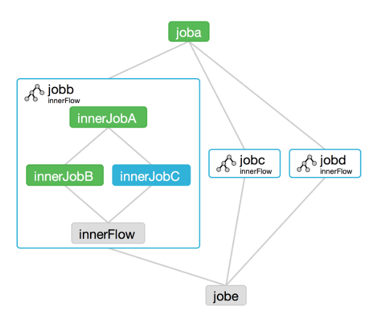
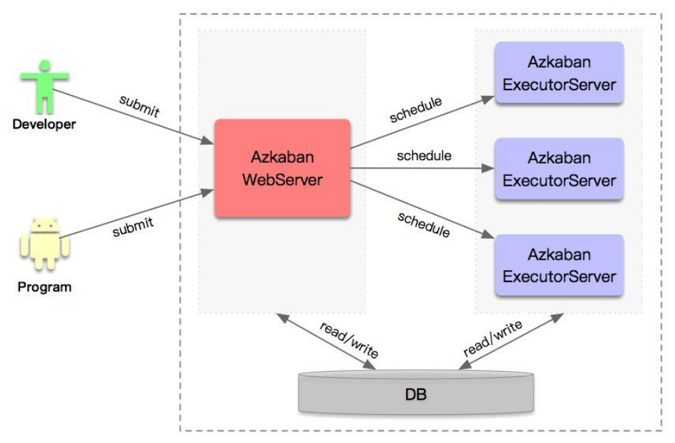

<!-- TOC -->

- [1、概念](#1概念)
- [2、工作原理](#2工作原理)
- [Azkaban和 Oozie对比](#azkaban和-oozie对比)
    - [1、Oozie](#1oozie)
    - [2、Azkaban](#2azkaban)
- [参考](#参考)

<!-- /TOC -->

`Azkaban工作流任务调度器`

# 1、概念

起源：Linkedin开源的一个批量工作流调度器

特征：一个工作流内，多个作业可以按照特定的顺序执行

依赖关系：作业之间的顺序关系依靠key-value的形式来建立依赖关系

可视界面：提供可视化web界面

> 什么是工作流任务调度器？

很多时候，单一的任务并没有办法满足我们的业务需求，任务直接有关联性，这时候工作流就诞生了！

# 2、工作原理

Azkaban集群部署模式，主要有3个核心的组件：

- Azkaban WebServer，是整个调度集群的核心，负责所有作业的管理和调度。

- Azkaban ExecutorServer，整个调度集群中实际运行作业的节点

- DB，是集群中所有节点运行共用的数据存储，包含作业信息、各种调度元数据等

# Azkaban和 Oozie对比

市面上最流行的工作流任务调度器大致有以下这两种：ooize和azkaban

- ooize 偏重量级，功能全面，但是配置却更加复杂
- azkaban 偏轻量级，功能稍微缺少一些, 但是配置简单

> 功能方面：

- 均可调度mapreduce,pig,java,脚本工作流任务
- 均可定时执行工作流任务

> 工作流传参

- Azkaban支持直接传参，例如inputOozie支持参数和EL表达式

> 定时执行

- Azkaban的定时执行任务是基于时间的
- Oozie的定时执行任务基于时间和输入数据

> 资源控制

- Azkaban有较严格的权限控制，如用户对工作流进行读/写/执行等操作
- Oozie暂无严格的权限控制

## 1、Oozie

- 描述语言：xml
- 依赖机制：explicit
- 需要web容器
- 不支持hadoop作业调度
- 运行模式：daemon
- 事件通知：不支持
- 需要安装

## 2、Azkaban

- 描述语言：text file with key/value pairs
- 依赖机制：explicit
- 需要web容器
- 支持Hadoop 作业调度
- 运行模式daemon
- 事件通知：不支持
- 需要安装

# 参考

- [azkaban](https://azkaban.github.io/)

- [Azkaban 看这一篇就够了！任务调度平台的搭建，使用，以及API开发](http://www.itongji.cn/detail?type=99992923)