<!-- TOC -->

- [第01讲： MapReduce：计算框架和编程模型](#第01讲-mapreduce计算框架和编程模型)
    - [1、MapReduce 编程模型与 MapReduce 计算框架](#1mapreduce-编程模型与-mapreduce-计算框架)
    - [2、并发与并行](#2并发与并行)
    - [3、如何理解分布式计算框架的编程接口与背后的工程实现](#3如何理解分布式计算框架的编程接口与背后的工程实现)
- [第02讲：Hadoop：集群的操作系统](#第02讲hadoop集群的操作系统)
    - [1、Hadoop 1.0](#1hadoop-10)
    - [2、Hadoop 2.0](#2hadoop-20)
- [第03讲：如何设计与实现统一资源管理与调度系统](#第03讲如何设计与实现统一资源管理与调度系统)
    - [1、统一资源管理与调度系统的设计](#1统一资源管理与调度系统的设计)
        - [1、统一（资源）](#1统一资源)
        - [2、资源管理（CPU 和内存）](#2资源管理cpu-和内存)
        - [3、调度](#3调度)
            - [1、集中式调度器（Monolithic Scheduler）](#1集中式调度器monolithic-scheduler)
            - [2、双层调度器（Two-Level Scheduler）](#2双层调度器two-level-scheduler)
            - [3、状态共享调度器](#3状态共享调度器)
    - [2、统一资源管理与调度系统的实现——YARN](#2统一资源管理与调度系统的实现yarn)
- [第04讲：解析 Spark 数据处理与分析场景](#第04讲解析-spark-数据处理与分析场景)
- [第05讲：如何选择 Spark 编程语言以及部署 Spark](#第05讲如何选择-spark-编程语言以及部署-spark)
    - [1、Spark 的编程语言](#1spark-的编程语言)
    - [2、部署 Spark](#2部署-spark)
        - [1、选择统一资源管理与调度系统](#1选择统一资源管理与调度系统)
        - [2、提交 Spark 作业](#2提交-spark-作业)
    - [3、如何安装Spark的学习环境](#3如何安装spark的学习环境)
- [第06讲：Spark 抽象、架构与运行环境](#第06讲spark-抽象架构与运行环境)
    - [1、Spark 架构](#1spark-架构)
    - [2、Spark 抽象](#2spark-抽象)
    - [3、Spark 运行环境](#3spark-运行环境)
- [第07讲：Spark 核心数据结构：弹性分布式数据集 RDD](#第07讲spark-核心数据结构弹性分布式数据集-rdd)
    - [1、RDD 的核心概念](#1rdd-的核心概念)
    - [2、实践环节：创建 RDD](#2实践环节创建-rdd)
        - [1、并行化集合](#1并行化集合)
        - [2、从 HDFS 中读取](#2从-hdfs-中读取)
        - [3、从外部数据源读取](#3从外部数据源读取)
        - [4、PairRDD](#4pairrdd)
- [第08讲：算子：如何构建你的数据管道？](#第08讲算子如何构建你的数据管道)
    - [1、通用类](#1通用类)
        - [1、map](#1map)
        - [2、filter](#2filter)
        - [3、reduceByKey](#3reducebykey)
        - [4、groupByKey](#4groupbykey)
        - [5、flatMap](#5flatmap)
    - [2、数学/统计类](#2数学统计类)
    - [3、集合论与关系类](#3集合论与关系类)
    - [4、数据结构类](#4数据结构类)
    - [5、行动算子](#5行动算子)
    - [练习题](#练习题)
- [第09讲：函数式编程思想：你用什么声明，你在声明什么？](#第09讲函数式编程思想你用什么声明你在声明什么)
    - [1、函数式编程与声明式编程](#1函数式编程与声明式编程)
    - [2、你用什么声明？](#2你用什么声明)
    - [3、你在声明什么？用运算符定义一种新运算](#3你在声明什么用运算符定义一种新运算)
    - [4、函数式编程语言的特点](#4函数式编程语言的特点)
        - [1、低阶函数与核心数据结构](#1低阶函数与核心数据结构)
        - [2、惰性求值](#2惰性求值)
        - [3、函数记忆](#3函数记忆)
- [第10讲：共享变量：如何在数据管道中使用中间结果？](#第10讲共享变量如何在数据管道中使用中间结果)
    - [1、广播变量](#1广播变量)
    - [2、累加器](#2累加器)
- [第11讲：计算框架的分布式实现：剖析 Spark Shuffle 原理](#第11讲计算框架的分布式实现剖析-spark-shuffle-原理)
    - [1、RDD 血统与 Spark 容错](#1rdd-血统与-spark-容错)
    - [2、Spark Shuffle](#2spark-shuffle)
        - [1、Hash Shuffle](#1hash-shuffle)
        - [2、Sort-based Shuffle](#2sort-based-shuffle)
    - [习题讲解](#习题讲解)
- [第12讲：如何处理结构化数据：DataFrame 、Dataset和Spark SQL](#第12讲如何处理结构化数据dataframe-dataset和spark-sql)
    - [1、DataFrame、Dataset 的起源与演变](#1dataframedataset-的起源与演变)
    - [2、DataFrame API](#2dataframe-api)
        - [1、创建DataFrame](#1创建dataframe)
    - [3、Dataset API](#3dataset-api)
    - [4、Spark SQL](#4spark-sql)
- [第13讲：如何使用用户自定义函数？](#第13讲如何使用用户自定义函数)
- [第14讲：列式存储：针对查询场景的极致优化](#第14讲列式存储针对查询场景的极致优化)
- [第15讲：如何对 Spark 进行全方位性能调优？](#第15讲如何对-spark-进行全方位性能调优)
- [第16讲：Tungsten 和 Hydrogen：Spark 性能提升与优化计划](#第16讲tungsten-和-hydrogenspark-性能提升与优化计划)
- [第17讲：实战：探索葡萄牙银行电话调查的结果](#第17讲实战探索葡萄牙银行电话调查的结果)
- [第18讲：流处理：什么是流处理？以及你必须考虑的消息送达保证问题](#第18讲流处理什么是流处理以及你必须考虑的消息送达保证问题)
- [第19讲：批处理还是流处理：Spark Streaming 抽象、架构与使用方法](#第19讲批处理还是流处理spark-streaming-抽象架构与使用方法)
- [第20讲：如何在生产环境中使用 Spark Streaming](#第20讲如何在生产环境中使用-spark-streaming)
- [第21讲：统一批处理与流处理：Dataflow](#第21讲统一批处理与流处理dataflow)
- [第22讲：新一代流式计算框架：Structured Streaming](#第22讲新一代流式计算框架structured-streaming)
- [第23讲：如何对 Spark 流处理进行性能调优？](#第23讲如何对-spark-流处理进行性能调优)
- [第24讲：实战：如何对股票交易实时价格进行分析？](#第24讲实战如何对股票交易实时价格进行分析)
- [第25讲： 什么是图：图模式，图相关技术与使用场景](#第25讲-什么是图图模式图相关技术与使用场景)
- [第26讲：数据并行：Spark 如何抽象图，如何切分图，如何处理图](#第26讲数据并行spark-如何抽象图如何切分图如何处理图)
- [第27讲：像顶点一样思考：大规模并行图挖掘引擎 GraphX](#第27讲像顶点一样思考大规模并行图挖掘引擎-graphx)
- [第28讲：Pregel 还是 MapReduce：一个有趣的算子 AggregateMessage](#第28讲pregel-还是-mapreduce一个有趣的算子-aggregatemessage)
- [第29讲：实战 1：用 GraphX 实现 PageRank 算法](#第29讲实战-1用-graphx-实现-pagerank-算法)
- [第30讲：实战 2：用 GraphX 求得顶点的 n 度邻居](#第30讲实战-2用-graphx-求得顶点的-n-度邻居)
- [第31讲：机器学习是什么： 机器学习与机器学习工作流](#第31讲机器学习是什么-机器学习与机器学习工作流)
- [第32讲：标准化机器学习流程：ML pipeline](#第32讲标准化机器学习流程ml-pipeline)
- [第33讲：如何对数据进行预处理？](#第33讲如何对数据进行预处理)
- [第34讲：少数服从多数：随机森林分类器](#第34讲少数服从多数随机森林分类器)
- [第35讲：物以类聚：Kmeans 聚类算法](#第35讲物以类聚kmeans-聚类算法)
- [第36讲：推荐引擎：协同过滤](#第36讲推荐引擎协同过滤)
- [第37讲：如何对模型性能进行评估并调优？](#第37讲如何对模型性能进行评估并调优)
- [第38讲：数据仓库与商业智能系统架构剖析](#第38讲数据仓库与商业智能系统架构剖析)
- [第39讲：作为 Yelp 运营负责人，如何根据数据进行决策？](#第39讲作为-yelp-运营负责人如何根据数据进行决策)
- [第40讲：如何获取业务数据库的数据](#第40讲如何获取业务数据库的数据)
- [第41讲：如何构建数据立方体](#第41讲如何构建数据立方体)
- [第42讲：如何通过 OLAP 与报表呈现结果](#第42讲如何通过-olap-与报表呈现结果)
- [第43讲：两个简化了的重要问题：数据更新和数据实时性](#第43讲两个简化了的重要问题数据更新和数据实时性)
- [第44讲：另一种并行：Lambda 架构与 Kappa 架构](#第44讲另一种并行lambda-架构与-kappa-架构)

<!-- /TOC -->


> 模块一：基础预习

# 第01讲： MapReduce：计算框架和编程模型

Google 的三驾马车:
- The Google File System(分布式文件系统)
- MapReduce: Simplifed Data Processing on Large Clusters(分布式计算框架)
- Bigtable: A Distributed Storage System for Structured Data(分布式数据存储)


## 1、MapReduce 编程模型与 MapReduce 计算框架

MapReduce第一层含义是一种编程模型，另外一层则是分布式计算框架（其他基于计算框架有spark、flink）。

MapReduce 模型将数据处理方式抽象为 map 和 reduce，其中 map 也叫映射，顾名思义，它表现的是数据的一对一映射，通常完成数据转换的工作。reduce 被称为归约，它表示另外一种映射方式，通常完成聚合的工作。

运用 MapReduce 编程思想，我们可以实现以下内容：
- 1、将数据集（输入数据）抽象成集合；
- 2、将数据处理过程用 map 与 reduce 进行表示；
- 3、在自定义函数中实现自己的逻辑。

这样就可以实现从输入数据到结果数据的处理流程（映射）了。


## 2、并发与并行

对于 MapReduce 编程模型来说，map 与 reduce 的组合加上用户定义函数，对于业务的表现力是非常强的。这里举一个分组聚合的例子，如下图所示：

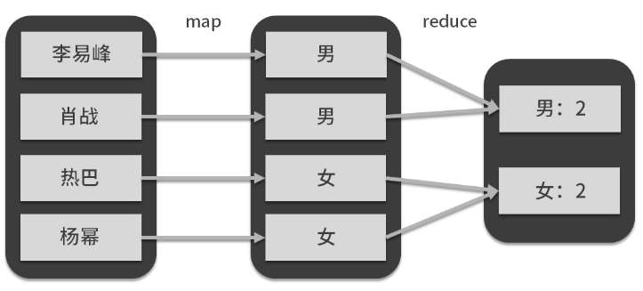

map 端的用户自定义函数与 map 算子对原始数据人名进行了转换，生成了组标签：性别，reduce 端的自定义函数与 reduce 算子对数据按照标签进行了聚合（汇总）。


MapReduce 认为，再复杂的数据处理流程也无非是这两种映射方式的组合，例如 map + map + reduce，或者 reduce 后面接 map，等等，在我展示出的这张图里你可以看到相对复杂的一种组合形式：

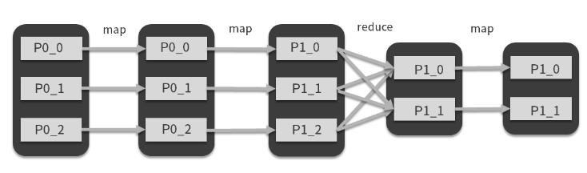

很多支持函数式编程的语言，对于语言本身自带的集合数据结构，都会提供 map、reduce 算子。现在，我们可以很容易的将第一个圆角方框想象成一个数十条数据的集合，它是内存中的集合变量，那么要实现上图中的变换，对于计算机来说，难度并不大，就算数据量再大些，我们也可以考虑将不同方框和计算流程交给同一台计算机的 CPU 不同的核心进行计算，这就是我们说的并行和并发。

## 3、如何理解分布式计算框架的编程接口与背后的工程实现

在你可以想象下，随着数据集继续增大，要处理的数据（上图中开始的集合）超过了计算内存的大小，那么就算是逻辑非常简单的流程，也要考虑中间结果的存储。比如计算过程涉及到硬盘和内存之前的数据交换等等之类的工程实现的问题，虽然在这个过程中上面 3 步并没有发生变化，但是背后实现的系统复杂度大大提高了。


我们可以再发挥想象，将上图中的圆角框想象成一个极其巨大的数据集，而方框想象成大数据集的一部分，我们会发现，对于从输入数据到结果数据的映射需求来说，前面 3 步仍然适用，只是这个集合变得非常大。


但是由于数据量的急剧扩大，相比于刚才的第 2 种情况，背后工程实现的复杂度会成倍增加，当整个数据集的容量和计算量达到 1 台计算机能处理的极限的时候，我们就会想办法把图中方框所代表的数据集分别交给不同的计算机来完成，那么如何调度计算机，如何实现 reduce 过程中不同计算机之间的数据传输等问题，就是 Spark 基于 MapReduce 编程模型的分布式实现，这也是我们常常所说的分布式计算。


从上图可以看出，在 reduce 过程中，会涉及到数据在不同计算机之间进行传输，这也是 MapReduce 模型下的分布式实现的一个关键点，后面我们会讲到 Spark 是如何做的。


# 第02讲：Hadoop：集群的操作系统


Hadoop 可以理解为是一个计算机集群的操作系统，而 Spark、MapReduce 只是这个操作系统支持的编程语言而已，HDFS 是基于所有计算机文件系统之上的文件系统抽象。同理，YARN 是基于所有计算机资源管理与调度系统之上的资源管理与调度系统抽象，Hadoop 是基于所有计算机的操作系统之上的操作系统抽象。所以如果你一定要进行比较的话，Hadoop 应该和操作系统相比较。


## 1、Hadoop 1.0

Hadoop 从问世至今一共经历了 3 个大版本，分别是 1.0、2.0 与最新的 3.0，其中最有代表性的是 1.0 与 2.0，3.0 相比于 2.0 变化不大。Hadoop 1.0 的架构也比较简单，基本就是按照论文中的框架实现，其架构如下图所示：


其中，下层是 GFS 的开源实现 HDFS（Hadoop 分布式文件系统），上层则是分布式计算框架 MapReduce，这样一来，分布式计算框架基于分布式文件系统，看似非常合理。但是，在使用的过程中，这个架构还是会出现不少问题，主要有 3 点：

- 1、主节点可靠性差，没有热备；
- 2、提交 MapReduce 作业过多的情况下，调度将成为整个分布式计算的瓶颈；
- 3、资源利用率低，并且不能支持其他类型的分布式计算框架。


第 1 点是小问题，涉及到对系统可用性方面的改造，但是第 2 点与第 3 点提到的问题就比较犀利了。


第 2 个问题在于，Hadoop 1.0 的分布式计算框架 MapReduce 并没有将资源管理和作业调度这两个组件分开，造成当同时有多个作业提交的时候，资源调度器会不堪重负，导致资源利用率过低；第 3 个问题则是不支持异构的计算框架，这是什么意思呢？其实当时 Spark 已经问世了，但是如果这个集群部署了 Hadoop 1.0，那么想要运行 Spark 作业就必须另外再部署一个集群，这样无疑是对资源的浪费，很不合理，不过这也没办法，因为这属于直接套用论文造成的历史遗留问题。


## 2、Hadoop 2.0

基于这些问题，社区开始着手 Hadoop 2.0 的开发，Hadoop 2.0 最大的改动就是引入了资源管理与调度系统 YARN，代替了原有的计算框架，而计算框架则变成了类似于 YARN 的用户，如下图：

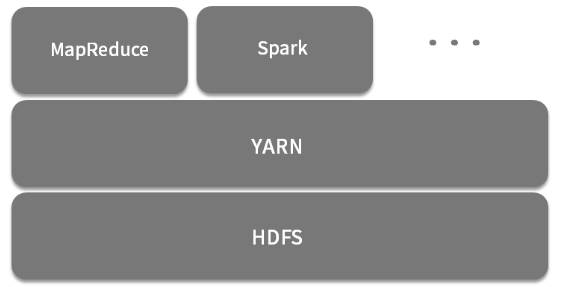

YARN 将集群内的所有计算资源抽象成一个资源池，资源池的维度有两个：CPU 和内存。同样是基于 HDFS，我们可以认为 YARN 管理计算资源，HDFS 管理存储资源。上层的计算框架地位也大大降低，变成了 YARN 的一个用户，另外，YARN 采取了双层调度的设计，大大减轻了调度器的负担。

Hadoop 2.0 基本上改进了 Hadoop 的重大缺陷，此外 YARN 可以兼容多个计算框架，如 Spark、Storm、MapReduce 等，HDFS 也变成了很多系统底层存储，Hadoop 以一种兼收并蓄的态度网罗了一大批大数据开源技术组件，逐渐形成了一个庞大的生态圈，如下图所示（该图只展示了一部分组件）。在当时，如果你要想搭建一个大数据平台，绝对无法绕过 Hadoop。

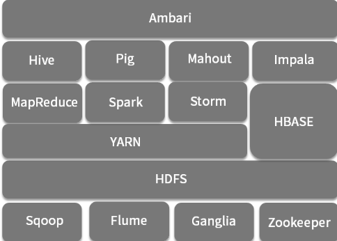


- 计算层，如支持 SQL 的 Hive、Impala， Pig、Spark、Storm 等
- 负责批量数据抽取的 Sqoop，
- 负责流式数据传输的 Flume，
- 负责分布式一致性的 Zookeeper
- 运维类组件，例如负责部署的 Ambari、集群监控的 ganglia 


# 第03讲：如何设计与实现统一资源管理与调度系统

## 1、统一资源管理与调度系统的设计

YARN 的全称是 Yet Another Resource Negotiator，直译过来是：另一种资源协调者，但是它的标准名称是统一资源管理与调度系统，这个名称比较抽象，当遇到这种抽象的名词时，我喜欢把概念拆开来看，那么这个名称一共包含 3 个词：统一、资源管理、调度。

### 1、统一（资源）

对于大数据计算框架来说，统一指的是资源并不会与计算框架绑定，对于所有计算框架来说，所有资源都是无差别的，也就是说这个系统可以支持多种计算框架，但这是狭义的统一，我们理解到这里就可以了。而广义上的统一，是指资源针对所有应用来说都是无差别的，包括长应用、短应用、数据库、后端服务，等等。


### 2、资源管理（CPU 和内存）

对于资源管理来说，最重要的是了解对于这个系统，什么才是它的资源，或者说是资源的维度，常见的有 CPU、内存、磁盘、网络带宽等，对于 YARN 来说，资源的维度有两个：CPU 和内存。这也是大数据计算框架最需要的资源。


### 3、调度

说到调度，就没那么简单了。目前的宏观调度机制一共有 3 种：集中式调度器（Monolithic Scheduler）、双层调度器（Two-Level Scheduler）和状态共享调度器（Shared-State Scheduler），我们一个一个来说：


#### 1、集中式调度器（Monolithic Scheduler）

集中式调度器全局只有一个中央调度器，计算框架的资源申请全部提交给中央调度器来满足，所有的调度逻辑都由中央调度器来实现。所以调度系统在高并发作业的情况下，容易出现性能瓶颈，如下图所示，红色的方块是集群资源信息，调度器拥有全部的集群资源信息（蓝色方块），集中式调度器的实现就是 Hadoop MapReduce 的 JobTracker，实际的资源利用率只有 70% 左右，甚至更低。Jobtracker 有多不受欢迎呢，从 Hadoop 2.0 中 YARN 的名字就可以看出：另一种资源协调器，你细品。这种在多个计算作业同时申请资源的时候，中央调度器实际上是没有并发的，完全是顺序执行。

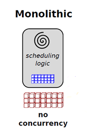

#### 2、双层调度器（Two-Level Scheduler）

顾名思义，双层调度器将整个调度工作划分为两层：`中央调度器和框架调度器`。中央调度器管理集群中所有资源的状态，它拥有集群所有的资源信息，按照一定策略（例如 FIFO、Fair、Capacity、Dominant Resource Fair）将资源粗粒度地分配给框架调度器，各个框架调度器收到资源后再根据应用申请细粒度将资源分配给容器执行具体的计算任务。在这种双层架构中，每个框架调度器看不到整个集群的资源，只能看到中央调度器给自己的资源，如图所示：

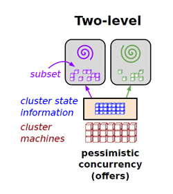

紫色和绿色的圆圈所在的方框是框架调度器，可以看到中央调度器把全部资源的两个子集分别交给了两个框架调度器，注意看，`这两个子集是没有重合的`，这种机制类似于并发中的悲观并发。

#### 3、状态共享调度器

状态共享调度器是由 Google 的 Omega 调度系统所提出的一种新范型，与谷歌的其他论文不同，Omega 这篇论文对详细设计语焉不详，只简单说了下大体原理和与其他调度范型的比较。

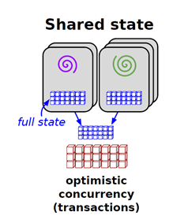

状态共享式调度大大弱化了中央调度器，它只需保存一份集群使用信息，就是图中间的蓝色方块，取而代之的是各个框架调度器，每个调度器都能获取集群的全部信息，并采用乐观锁控制并发。Omega 与双层调度器的不同在于严重弱化了中央调度器，每个框架内部会不断地从主调度器更新集群信息并保存一份，而框架对资源的申请则会在该份信息上进行，一旦框架做出决策，就会将该信息同步到主调度。资源竞争过程是通过事务进行的，从而保证了操作的原子性。由于决策是在自己的私有数据上做出的，并通过原子事务提交，系统保证只有一个胜出者，这是一种类似于 MVCC 的乐观并发机制，可以增加系统的整体并发性能，但是调度公平性有所不足。对于这种调度范式你可以不用深究，这里介绍主要是为了知识的完整性。


## 2、统一资源管理与调度系统的实现——YARN

简单来看看 YARN 的架构图，YARN 的架构是典型的主从架构，主节点是 ResourceManger，也是我们前面说的主调度器，所有的资源的空闲和使用情况都由 ResourceManager 管理。ResourceManager 也负责监控任务的执行，从节点是 NodeManager，主要负责管理 Container 生命周期，监控资源使用情况等 ，Container 是 YARN 的资源表示模型，Task 是计算框架的计算任务，会运行在 Container 中，ApplicationMaster 可以暂时认为是二级调度器，比较特殊的是它同样运行在 Container 中。

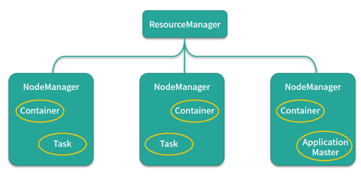

我们来看看 YARN 启动一个 MapReduce 作业的流程，如图所示：

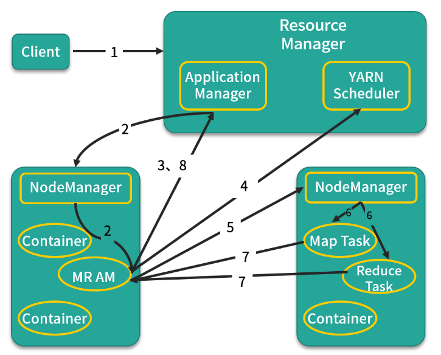

第 1 步：客户端向 ResourceManager 提交自己的应用，这里的应用就是指 MapReduce 作业。

第 2 步：ResourceManager 向 NodeManager 发出指令，为该应用启动第一个 Container，并在其中启动 ApplicationMaster。

第 3 步：ApplicationMaster 向 ResourceManager 注册。

第 4 步：ApplicationMaster 采用轮询的方式向 ResourceManager 的 YARN Scheduler 申领资源。

第 5 步：当 ApplicationMaster 申领到资源后（其实是获取到了空闲节点的信息），便会与对应 NodeManager 通信，请求启动计算任务。

第 6 步：NodeManager 会根据资源量大小、所需的运行环境，在 Container 中启动任务。

第 7 步：各个任务向 ApplicationMaster 汇报自己的状态和进度，以便让 ApplicationMaster 掌握各个任务的执行情况。

第 8 步：应用程序运行完成后，ApplicationMaster 向 ResourceManager 注销并关闭自己。


好了，到现在为止，我都没有说明 YARN 到底属于哪一种调度范式，现在绝大多数资料与网上的文章都将 YARN 归为双层调度，这个说法准确吗？ApplicationMaster 与前面讲的框架调度器（二级调度器）很像，回答这个问题有点复杂，涉及到对调度范式得深刻理解，我简单讲下，你可以看看前面那种双层调度的范式图：


首先可以看到最下面的一个单词是 offers，还有蓝色和绿色的箭头方向，这说明什么问题呢？主调度器拥有整个集群资源的的状态，通过 Offer（主动提供，而不是被动请求）方式通知每个二级调度器有哪些可用的资源。每个二级调度器根据自己的需求决定是否占有提供的资源，决定占有后，该分区内的资源由二级调度器全权负责。


这句话怎么理解呢？如果你将集群资源看成一个整体，那么这种方式可以认为是预先将整个资源进行动态分区。作业则向二级调度器申请资源，可以多个作业共用一个二级调度器，此外，每个二级调度器和主调器都可以配置不同的调度算法模块。那么从这个点上来说，YARN 离真正的双层调度还有些差距，但和前面讲的 JobTracker 相比，已经是很大的进步了，并显著提升了调度性能，某度程度上，也可以说是一种双层调度，或者更准确地说，两次调度。所以如果在面试中，遇到这个问题，除非你和面试官都真的完全理解了 YARN 和双层调度的距离，否则还是回答 `YARN 是双层调度`吧。


由于 Spark 与 MapReduce 相比，是一种 DAG 计算框架，包含一系列的计算任务，比较特殊，所以 Spark 自己实现了一个`集中式调度器  Driver`，用来调用作业内部的计算任务。申请到的资源可以看成是申请分区资源，在该分区内，所有资源由 Driver 全权使用，以客户端方式提交的 Spark on Yarn 这种方式可以看成是 Driver 首先在资源管理和调度系统中注册为框架调度器（二级调度器），接收到需要得资源后，再开始进行作业调度。那么这种方式可以认为是一种曲线救国的双层调度实现方式，这个我们后面会讲到。


# 第04讲：解析 Spark 数据处理与分析场景

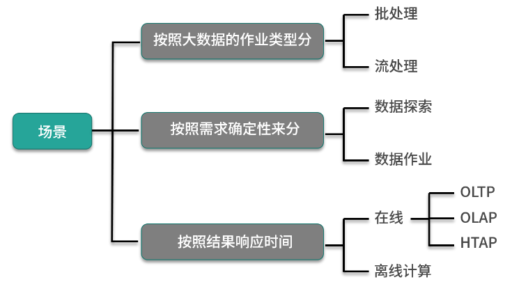


# 第05讲：如何选择 Spark 编程语言以及部署 Spark

## 1、Spark 的编程语言

Spark 在诞生之初就提供了多种编程语言接口：Scala、Java、Python 和 SQL，在后面的版本中又加入了 R 语言编程接口。对于 Spark 来说，虽然其内核是由 Scala 编写而成，但编程语言从来就不是它的重点，从 Spark 提供这么多的编程接口来说，Spark 鼓励不同背景的人去使用它完成自己的数据探索工作。尽管如此，不同编程语言在开发效率、执行效率等方面还是有些不同，我将目前 Spark 各种编程语言优缺点罗列如下：

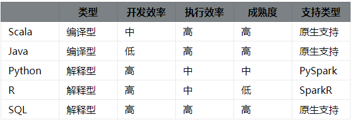

现在我们对每个语言的优缺点进行详细的分析：

- Scala 作为 Spark 的开发语言当然得到了原生支持，也非常成熟，它简洁的语法也能显著提高开发效率；

- Java 也是 Spark 原生支持的开发语言，但是 Java 语法冗长且不支持函数式编程（1.8 以后支持），导致它的 API 设计得冗余且不合理，再加上需要编译执行，Java 开发效率无疑是最低的，但 Java 程序员基数特别大，Java API 对于这些用户来说无疑很友好；

- Python 与 R 语言都是解释型脚本语言，不用编译直接运行，尤其是 Python 更以简洁著称，开发效率自不必说，此外 Python 与 R 语言本身也支持函数式编程，这两种语言在开发 Spark 作业时也是非常自然，但由于其执行原理是计算任务在每个节点安装的 Python 或 R 的环境中执行，结果通过管道输出给 Spark执行者，所以效率要比 Scala 与 Java 低；

- SQL 是 Spark 原生支持的开发语言，从各个维度上来说都是最优的，所以一般情况下，`用 Spark SQL 解决问题是最优选择`。

## 2、部署 Spark

### 1、选择统一资源管理与调度系统

Spark 也需要运行在某个统一资源管理与调度系统，目前 Spark 支持的统一资源管理与调度系统有：
- Spark standalone
- YARN
- Mesos
- Kubernetes
- 本地操作系统

Spark standalone 这种模式类似于前面讲的 Hadoop 1.0 的 MapReduce，由于缺点不少，基本不太适合在生产环境使用；Kubernetes 则是直到最新的 Spark 2.4.5 版本才支持；如果 Spark 运行在本地操作系统上，那么这就是我们说的伪分布模式，特别适合学习以及分析师用来处理中等数据量的数据，性能也还不错，当然这里指的是对单机性能而言。那么目前虽然支持 Spark on YARN 模式是目前最普遍的，但是 Mesos 才是 Spark 最先支持的平台，这里简单讲讲 Spark 是如何运行在 Mesos 上，你可以借此复习下前面的知识：

主要分 5 步：

- 1、SparkContext 在 Mesos master 中注册为框架调度器。
- 2、Mesos slave 持续同步以向 Mesos master 发送资源信息。
- 3、一个或者多个资源供给将信息发送给 SparkContext（下发资源）。
- 4、SparkContext 接收资源供给。
- 5、在 Mesos slave 上启动计算任务。

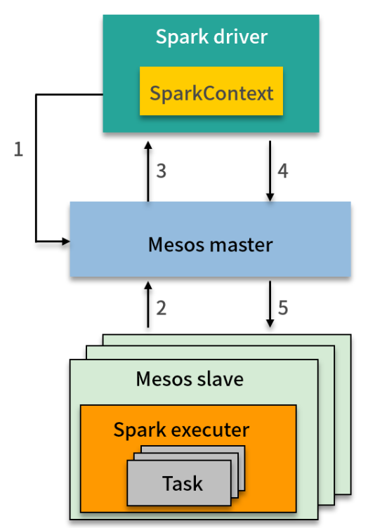

一般来说，无论你基于公司的大数据平台进行开发还是分析，底层的统一资源管理与调度系统是什么对于工程师和分析师来说是无需关心的，对于代码来说没有任何不同，`区别只体现在一些提交参数上`。


### 2、提交 Spark 作业

前面提到，如果大数据平台使用了统一资源管理与调度系统，那么上层的计算框架就变成了这个资源系统的用户。这样做的结果是直接简化了计算框架的部署。对于部署计算框架这个问题，你可以用客户端/服务端，也就是 C/S 这种模式来理解。

我们把大数据平台看成是一个服务端，那么相应的就会有一些客户端，也就是一些节点，比如在 Hadoop 中，我们把这些客户端称为 Hadoop 客户端，你可以通过客户端访问 HDFS 或者提交作业。

所以，这些客户端也会有一份相应的安装包，按照客户端进行配置，Spark 也不例外，我们只需在客户端节点部署一份 Spark 安装包，并且正确配置，以YARN为例，需要你将YARN的配置文件复制到Spark客户端的配置文件夹下，就可以从该节点向大数据平台提交作业。提交的作业就会在集群中被调度为计算任务。

## 3、如何安装Spark的学习环境

1、sacla使用pom文件引入依赖即可；

2、python环境

这里将其总结为 5 步：
- 1、安装 Anaconda
- 2、用 Anaconda 安装 Jupyter notebook
- 3、用 Anaconda 安装 PySpark
- 4、运行 Jupyter notebook
- 5、运行测试代码

1、安装 Anaconda

安装之前可以先卸载以前安装的 Python，这样统一由 Anaconda 进行管理。Anaconda 是包管理器和环境管理器，对于 Python 数据分析师来说是必备软件之一，我们可以在官网根据不同的操作系统下载对应版本（都选择 Python 3.7）：安装完成后，我们就可以在控制台使用 pip 命令了。


2、安装 Jupyter

Jupyter notebook 是一个交互式的 Web 笔记本应用，可以支持多种编程语言，事实上 Anaconda+Jupyter notebook 已成为数据分析的标准环境。那么 Jupyter notebook 还有一个非常适合的场景，就是教育，它的笔记本特性可以非常好地将学习过程固化。由于前面我们已经安装好了 Anaconda，所以安装 Jupyter notebook 只需要执行下面这两条命令即可：

```
pip install --upgrade pip
pip install jupyter
```

3、安装 PySpark

现在通过 Anaconda 安装 PySpark 已经很方便了，只需要在控制台执行如下命令：

pip3 install pyspark

或者

pip install -U -i https://pypi.tuna.tsinghua.edu.cn/simple pyspark


4、启动 Jupyter notebook

前面几步完成后，我们就可启动 Jupyter notebook。在控制台执行以下命令：

jupyter notebook  --notebook-dir='d:\\JupyterWorkspace'


5、运行测试代码

为了测试安装的结果，我们新建一个笔记本，在单元格中写入如下代码：

```python
from pyspark.sql import SparkSession
from pyspark.sql.functions import col
 
##初始化
spark = SparkSession.builder.master("local[*]").appName("Test").getOrCreate()
## 0 + 1 + 2 + 3 + 4 
spark.range(0, 5).select(col("id").cast("double")).agg({'id': 'sum'}).show()
## 关闭
spark.stop()

```

代码的作用是 Spark 对元素为 0~4 的数组进行求和处理，运行代码，Jupyter notebook 会展示运行结果。

这里特别说明的是，代码中的参数 local[*] 指明了 Spark 基于本地操作系统运行，如果基于 YARN、Mesos 或者 Kubernetes，只需要对应修改该参数即可。


> 模块二：Spark 编程

# 第06讲：Spark 抽象、架构与运行环境

## 1、Spark 架构

前面讲过，在生产环境中，Spark 往往作为统一资源管理平台的用户，向统一资源管理平台提交作业，作业提交成功后，Spark 的作业会被调度成计算任务，在资源管理系统的容器中运行。在集群运行中的 Spark 架构是典型的主从架构，如下面这张图所示。这里稍微插一句，所有分布式架构无外乎两种，一种是主从架构（master/slave），另一种是点对点架构（p2p）。

我们先来看看 Spark 架构，在运行时，Driver 无疑是主节点，而 Executor 是从节点，当然，这 3 个 Executor 分别运行在资源管理系统中的 3 个容器中。

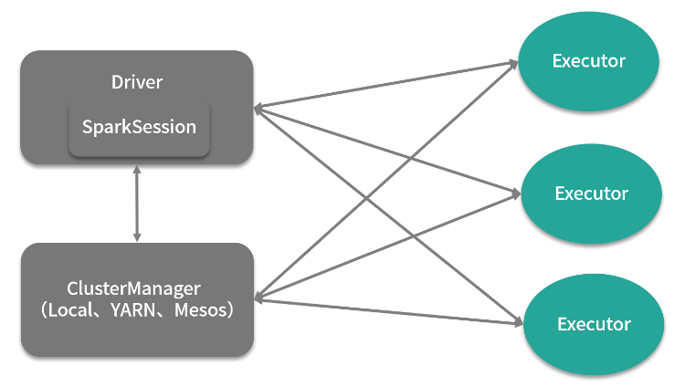


在 Spark 的架构中，Driver 主要负责作业调度工作，Executor 主要负责执行具体的作业计算任务，Driver 中的 SparkSession 组件，是 Spark 2.0 引入的一个新的组件，曾经我们熟悉的 SparkContext、SqlContext、HiveContext 都是 SparkSession 的成员变量。


因此，用户编写的 Spark 代码是从新建 SparkSession 开始的。其中 SparkContext 的作用是连接用户编写的代码与运行作业调度以及任务分发的代码。当用户提交作业启动一个 Driver 时，会通过 SparkContext 向集群发送命令，Executor 会遵照指令执行任务。一旦整个执行过程完成，Driver 就会结束整个作业。这么说稍微有点抽象，你可以通过下面这张图更细致的感受这个过程。

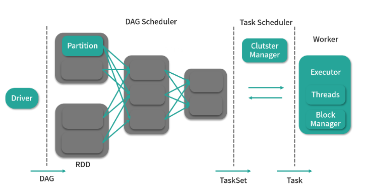

比起前面那张图，该图更像是调大了放大镜倍数的展示结果，能让我们将 Driver 与 Executor 之间的运行过程看得更加清楚。

- 首先，Driver 会根据用户编写的代码生成一个计算任务的有向无环图（Directed Acyclic Graph，DAG），这个有向无环图是 Spark 区别 Hadoop MapReduce 的重要特征；

- 接着，DAG 会根据 RDD（弹性分布式数据集，图中第 1 根虚线和第 2 根虚线中间的圆角方框）之间的依赖关系被 DAG Scheduler 切分成由 Task 组成的 Stage，这里的 Task 就是我们所说的计算任务，注意这个 Stage 不要翻译为阶段，这是一个专有名词，它表示的是一个计算任务的集合；

- 最后 TaskScheduler 会通过 ClusterManager 将 Task 调度到 Executor 上执行。


可以看到，Spark 并不会直接执行用户编写的代码，而用户代码的作用只是告诉 Spark 要做什么，也就是一种“声明”。


## 2、Spark 抽象

当用户编写好代码向集群提交时，一个作业就产生了，作业的英文是 job，在 YARN 中，则喜欢把作业叫 application，它们是一个意思。Driver 会根据用户的代码生成一个有向无环图，下面这张图就是根据用户逻辑生成的一个有向无环图。

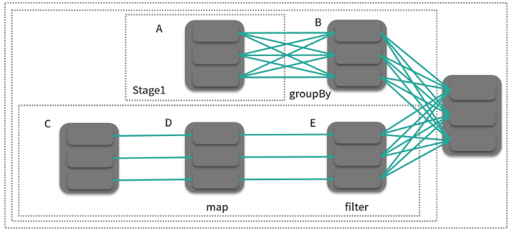

仔细看这张图，可以大概反推出计算逻辑：A 和 C 都是两张表，在分别进行分组聚合和筛选的操作后，做了一次 join 操作。


在上图中，灰色的方框就是我们所说的分区（partition），它和计算任务是一一对应的，也就是说，有多少个分区，就有多少个计算任务，显然的，一个作业，会有多个计算任务，这也是分布式计算的意义所在，我们可以通过设置分区数量来控制每个计算任务的计算量。在 DAG 中，每个计算任务的输入就是一个分区，一些相关的计算任务所构成的任务集合可以被看成一个 Stage，这里"相关"指的是某个标准，我们后面会讲到。RDD 则是分区的集合（图中 A、B、C、D、E），用户只需要操作 RDD 就可以构建出整个 DAG，从某种意义上来说，它就是为了掩盖上面的概念而存在的。

在明白上面的概念后，我们来看看 Executor，一个 Executor 同时只能执行一个计算任务，但一个 Worker（物理节点）上可以同时运行多个 Executor。Executor 的数量决定了同时处理任务的数量，一般来说，分区数远大于 Executor 数量才是合理的。

所以同一个作业，在计算逻辑不变的情况下，分区数和 Executor 的数量很大程度上决定了作业运行的时间。


## 3、Spark 运行环境

先来看看 Scala 版本，我们在前面准备好的 Scala 项目中，写下如下代码：

```scala
import org.apache.spark.sql.SparkSession

val spark = SparkSession
.builder()
.master("yarn-client")
.appName("New SS")
.config("spark.executor.instances", "10")
.config("spark.executor.memory", "10g")
.getOrCreate()

import spark.implicits._

```

执行到这里，SparkSession 就初始化完成了，后面用户就可以开始实现自己的数据处理逻辑，不过你可能已经注意到了，在代码中，我们通过配置指明了 Spark 运行环境时的 YARN，并且是以 yarn-client 的方式提交作业（YARN 还支持 yarn-cluster 的方式，区别在与前者 Driver 运行在客户端，后者 Driver 运行在 YARN 的 Container 中）。

另外值得注意的一点是，我们一共申请了 10 个 Executor，每个 10g，不难算出一共 100g。按照前面的结论，是不是改成 100 个 Executor，每个 1g，作业执行速度会大大提升呢？这个问题的答案是不确定。因为在总量不变的情况下，每个 Executor 的资源减少为原来的十分之一，那么 Executor 有可能无法胜任单个计算任务的计算量（或许能，但是完成速度大大降低），这样你就不得不提升分区数来降低每个计算任务的计算量，所以完成作业的总时间有可能保持不变，也有可能还会增加，当然，也有可能降低。

看到这里，你可能已经对作业的性能调参有点感觉了，其实和机器学习的调参类似，都是在一定约束下（这里就是资源），通过超参数的改变，来实现某个目标（作业执行时间）的最优化。当然，这里要特别说明的是，此处为了简化，只考虑了 Executor 的资源，没有考虑 Driver 所需的资源，另外资源也简化为一个维度：内存，而没有考虑另一个维度 CPU。

最后来看看 Python 版代码：

```python
from pyspark.sql import SparkSession

spark = SparkSession \
.builder \
.master("yarn-client") \
.appName("New SS") \
.config("spark.executor.instances", "10") \
.config("spark.executor.memory", "10g") \
.getOrCreate()
```


# 第07讲：Spark 核心数据结构：弹性分布式数据集 RDD

## 1、RDD 的核心概念

RDD 是 Spark 最核心的数据结构，RDD（Resilient Distributed Dataset）全称为弹性分布式数据集，是 Spark 对数据的核心抽象，也是最关键的抽象，它实质上是一组分布式的 JVM 不可变对象集合，不可变决定了它是只读的，所以 RDD 在经过变换产生新的 RDD 时，（如下图中 A-B），原有 RDD 不会改变。

弹性主要表现在两个方面：

- 在面对出错情况（例如任意一台节点宕机）时，Spark 能通过 RDD 之间的依赖关系恢复任意出错的 RDD（如 B 和 D 可以算出最后的 RDD），RDD 就像一块海绵一样，无论怎么挤压，都像海绵一样完整；

- 在经过转换算子处理时，RDD 中的分区数以及分区所在的位置随时都有可能改变。


每个 RDD 都有如下几个成员：

- 分区的集合；
- 用来基于分区进行计算的函数（算子）；
- 依赖（与其他 RDD）的集合；
- 对于键-值型的 RDD 的散列分区器（可选）；
- 对于用来计算出每个分区的地址集合（可选，如 HDFS 上的块存储的地址）


如下图所示，RDD_0 根据 HDFS 上的块地址生成，块地址集合是 RDD_0 的成员变量，RDD_1由 RDD_0 与转换（transform）函数（算子）转换而成，该算子其实是 RDD_0 内部成员。从这个角度上来说，RDD_1 依赖于 RDD_0，这种依赖关系集合也作为 RDD_1 的成员变量而保存。

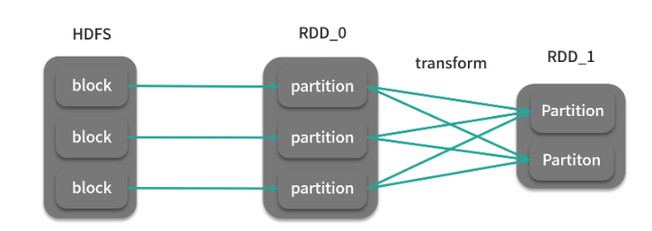

在 Spark 源码中，RDD 是一个抽象类，根据具体的情况有不同的实现，比如 RDD_0 可以是 MapPartitionRDD，而 RDD_1 由于产生了 Shuffle（数据混洗，后面的课时会讲到），则是 ShuffledRDD。

下面我们来看一下 RDD 的源码，你也可以和前面对着看看：

```java
// 表示RDD之间的依赖关系的成员变量
@transient private var deps: Seq[Dependency[_]]
// 分区器成员变量
@transient val partitioner: Option[Partitioner] = None
// 该RDD所引用的分区集合成员变量
@transient private var partitions_ : Array[Partition] = null
// 得到该RDD与其他RDD之间的依赖关系
protected def getDependencies: Seq[Dependency[_]] = deps
// 得到该RDD所引用的分区
protected def getPartitions: Array[Partition]
// 得到每个分区地址
protected def getPreferredLocations(split: Partition): Seq[String] = Nil
// distinct算子
def distinct(numPartitions: Int)(implicit ord: Ordering[T] = null): RDD[T] = 
withScope  {
    map(x => (x, null)).reduceByKey((x, y) => x, numPartitions).map(_._1)
}

```

其中，你需要特别注意这一行代码：

@transient private var partitions_ : Array[Partition] = null

它说明了一个重要的问题，RDD 是分区的集合，本质上还是一个集合，所以在理解时，你可以用分区之类的概念去理解，但是在使用时，就可以忘记这些，把其当做是一个普通的集合。为了再加深你的印象，我们来理解下模块 1 中 01 课时的 4 行代码：

```java
val list: List[Int] = List(1,2,3,4,5)
println(list.map(x => x + 1).filter { x => x > 1}.reduce(_ + _))
......
val list: List[Int] = spark.sparkContext.parallelize(List(1,2,3,4,5))
println(list.map(x => x + 1).filter { x => x > 1}.reduce(_ + _))

```


## 2、实践环节：创建 RDD

可以通过已有的 SparkSession 直接创建 RDD。在创建 RDD 之前，我们可以将 RDD 的类型分为以下几类：
- 并行集合；
- 从 HDFS 中读取；
- 从外部数据源读取；
- PairRDD。

### 1、并行化集合

这种 RDD 纯粹是为了学习，将内存中的集合变量转换为 RDD，没太大实际意义。

```java
//val spark: SparkSession = .......
val rdd = spark.sparkcontext.parallelize(Seq(1, 2, 3))
```


### 2、从 HDFS 中读取

这种生成 RDD 的方式是非常常用的，

```java
//val spark: SparkSession = .......
val rdd = spark.sparkcontext.textFile("hdfs://namenode:8020/user/me/wiki.txt")
```


### 3、从外部数据源读取

Spark 从 MySQL 中读取数据返回的 RDD 类型是 JdbcRDD，顾名思义，是基于 JDBC 读取数据的，这点与 Sqoop 是相似的，但不同的是 JdbcRDD 必须手动指定数据的上下界，也就是以 MySQL 表某一列的最值作为切分分区的依据。

```java
//val spark: SparkSession = .......
val lowerBound = 1
val upperBound = 1000
val numPartition = 10
val rdd = new JdbcRDD(spark.sparkcontext,() => {
       Class.forName("com.mysql.jdbc.Driver").newInstance()
       DriverManager.getConnection("jdbc:mysql://localhost:3306/db", "root", "123456")
   },
   "SELECT content FROM mysqltable WHERE ID >= ? AND ID <= ?",
   lowerBound, 
   upperBound, 
   numPartition,
   r => r.getString(1)
)

```


既然是基于 JDBC 进行读取，那么所有支持 JDBC 的数据库都可以通过这种方式进行读取，也包括支持 JDBC 的分布式数据库，但是你需要注意的是，从代码可以看出，这种方式的原理是利用多个 Executor 同时查询互不交叉的数据范围，从而达到并行抽取的目的。但是这种方式的抽取性能受限于 MySQL 的并发读性能，单纯提高 Executor 的数量到某一阈值后，再提升对性能影响不大。

上面介绍的是通过 JDBC 读取数据库的方式，对于 HBase 这种分布式数据库来说，情况有些不同，HBase 这种分布式数据库，在数据存储时也采用了分区的思想，HBase 的分区名为 Region，那么基于 Region 进行导入这种方式的性能就会比上面那种方式快很多，是真正的并行导入。

```java
//val spark: SparkSession = .......
val sc = spark.sparkcontext
val tablename = "your_hbasetable"
val conf = HBaseConfiguration.create()
conf.set("hbase.zookeeper.quorum", "zk1,zk2,zk3")
conf.set("hbase.zookeeper.property.clientPort", "2181")
conf.set(TableInputFormat.INPUT_TABLE, tablename)
val rdd= sc.newAPIHadoopRDD(conf, classOf[TableInputFormat],
classOf[org.apache.hadoop.hbase.io.ImmutableBytesWritable],
classOf[org.apache.hadoop.hbase.client.Result]) 
// 利用HBase API解析出行键与列值
rdd_three.foreach{case (_,result) => {
    val rowkey = Bytes.toString(result.getRow)
    val value1 = Bytes.toString(result.getValue("cf".getBytes,"c1".getBytes))
}

```
值得一提的是 HBase 有一个第三方组件叫 Phoenix，可以让 HBase 支持 SQL 和 JDBC，在这个组件的配合下，第一种方式也可以用来抽取 HBase 的数据，此外，Spark 也可以读取 HBase 的底层文件 HFile，从而直接绕过 HBase 读取数据。说这么多，无非是想告诉你，读取数据的方法有很多，可以根据自己的需求进行选择。

通过第三方库的支持，Spark 几乎能够读取所有的数据源，例如 Elasticsearch，所以你如果要尝试的话，尽量选用 Maven 来管理依赖。


### 4、PairRDD

PairRDD 与其他 RDD 并无不同，只不过它的数据类型是 Tuple2[K,V]，表示键值对，因此这种 RDD 也被称为 PairRDD，泛型为 RDD[(K,V)]，而普通 RDD 的数据类型为 Int、String 等。这种数据结构决定了 PairRDD 可以使用某些基于键的算子，如分组、汇总等。PairRDD 可以由普通 RDD 转换得到：

```java
//val spark: SparkSession = .......
val a = spark.sparkcontext.textFile("/user/me/wiki").map(x => (x,x))
```


# 第08讲：算子：如何构建你的数据管道？

Spark 编程风格主要有函数式，核心是基于数据处理的需求，用算子与 RDD 构建出一个数据管道，管道的开始是输入，管道的末尾是输出。而管道就是声明的处理逻辑，可以说是描述了一种映射方式。

RDD 算子主要分为两类，一类为`转换（transform）算子`，一类为`行动（action）算子`，转换算子主要负责改变 RDD 中数据、切分 RDD 中数据、过滤掉某些数据等，并按照一定顺序组合。Spark 会将转换算子放入一个计算的有向无环图中，并不立刻执行，当 Driver 请求某些数据时，才会真正提交作业并触发计算，而`行动算子就会触发 Driver 请求数据`。这种机制与函数式编程思想的惰性求值类似。这样设计的原因首先是避免无谓的计算开销，更重要的是 Spark 可以了解所有执行的算子，从而设定并优化执行计划。


RDD 转换算子大概有 20~30 多个，按照 DAG 中分区与分区之间的映射关系来分组，有如下 3 类：

- 一对一，如 map；

- 多对一，如 union；

- 多对多，如 groupByKey。

而按照 RDD 的结构可以分为两种：

- Value 型 RDD；

- Key-Value 型 RDD（PairRDD）。

按照转换算子的用途，我将其分为以下 4 类：

- 通用类；

- 数学/统计类；

- 集合论与关系类；

- 数据结构类。

在介绍算子时，并没有刻意区分 RDD 和 Pair RDD，你可以根据 RDD 的泛型来做判断，此外，通常两个功能相似的算子，如 groupBy 与 groupByKey，底层都是先将 Value 型 RDD 转换成 Key Value 型 RDD，再直接利用 Key Value 型 RDD 完成转换功能，故不重复介绍。

在学习算子的时候，你千万不要觉得这是一个多么高深的东西，首先，对于声明式编程来说，编程本身难度不会太大。其次，我在这里给你交个底，`几乎所有的算子，都可以用 map、reduce、filter 这三个算子通过组合进行实现`，你在学习完本课时之后，可以试着自己做做。下面，我们就选取这 4 类中有代表性、常用的算子进行介绍。


## 1、通用类

### 1、map

这一类可以满足绝大多数需要，特别适合通用分析型需求。

```java
def map[U: ClassTag](f: T => U): RDD[U]
def map(self, f, preservesPartitioning=False)

```

这里第 1 行为算子的 Scala 版，第 2 行为算子的 Python 版，后面同理，不再做特别说明。

map 算子是最常用的转换算子，它的作用是将原 RDD 分区中 T 类型的数据元素转换成 U 类型，并返回为一个新 RDD。map 算子会作用于分区内的每个元素

当然 T 和 U 也可以是同一个类型，具体的转换逻辑由自定义函数 f 完成，可能你会不太适应这种函数直接作为算子的参数，下面以 map 算子为例：

```python
>>> rdd = sc.parallelize(["b", "a", "c"])
>>> sorted(rdd.map(lambda x: (x, 1)).collect())
[('a', 1), ('b', 1), ('c', 1)]

```

这是 Python 版的，逻辑很简单，对单词进行处理，注意看这里不光是用函数作为参数，而且是用 Python 的匿名函数 lambda 表达式的写法，这种匿名声明的方式是比较常用的。如果是 Scala 版的，匿名函数的写法则更为简单：

rdd.map { x => (x,1) }.collect()

Scala 还有种更简单的写法：rdd.map ((_,1)).collect()

### 2、filter

```java
def filter(f: T => Boolean): RDD[T]
def filter(self, f)

```
filter算子可以通过用户自定义规则过滤掉某些数据，f 返回值为 true 则保留，false 则丢弃

该算子作用之后，可能会造成大量零碎分区，不利于后面计算过程，需要在这之前进行合并。


### 3、reduceByKey

```java
def reduceByKey(func: (V, V) => V): RDD[(K, V)]
def reduceByKey(self, func, numPartitions=None, partitionFunc=portable_hash)

```
reduceByKey 算子执行的是归约操作，针对相同键的数据元素两两进行合并。在合并之前，reduceByKey 算子需要将相同键的元素分发到一个分区中去，分发规则可以自定义，分发的分区数量也可以自定义，所以该算子还可以接收分区器或者分区数作为参数，分区器在没有指定时，采用的是 RDD 内部的哈希分区器


### 4、groupByKey


```java
def groupByKey(): RDD[(K, Iterable[V])]
def groupByKey(self, numPartitions=None, partitionFunc=portable_hash)

```
groupByKey 在统计分析中很常用到，是分组计算的前提，它默认按照哈希分区器进行分发，将同一个键的数据元素放入到一个迭代器中供后面的汇总操作做准备，它的可选参数分区数、分区器


### 5、flatMap

```java
def flatMap[U: ClassTag](f: T => TraversableOnce[U]): RDD[U]
def flatMap(self, f, preservesPartitioning=False)
```

flatMap 算子的字面意思是“展平”，flatMap 算子的函数 f 的作用是将 T 类型的数据元素转换为元素类型为 U 的集合，如果处理过程到此为止，我们将 RDD_1 的一个分区看成一个集合的话，分区数据结构相当于集合的集合，由于集合的集合是有层次的 你可以理解为一个年级有多个班级，而这种数据结构就不是“平”的，所以 flatMap 算子还做了一个操作：将集合的集合合并为一个集合


## 2、数学/统计类

这类算子实现的是某些常用的数学或者统计功能，如分层抽样等。

```java
def sampleByKey(withReplacement: Boolean, fractions: Map[K, Double], seed: Long = Utils.random.nextLong): RDD[(K, V)]
def sampleByKey(self, withReplacement, fractions, seed=None)

```


分层抽样是将数据元素按照不同特征分成不同的组，然后从这些组中分别抽样数据元素。Spark 内置了实现这一功能的算子 sampleByKey，withReplacement 参数表示此次抽样是重置抽样还是不重置抽样，所谓重置抽样就是“有放回的抽样”，单次抽样后会放回。fractions 是每个键的抽样比例，以 Map 的形式提供。seed 为随机数种子，一般设置为当前时间戳。


## 3、集合论与关系类

这类算子主要实现的是像连接数据集这种功能和其他关系代数的功能，如交集、差集、并集、笛卡儿积等。

```java
def cogroup[W](other: RDD[(K, W)]): RDD[(K, (Iterable[V], Iterable[W]))]
def cogroup(self, other, numPartitions=None)

```

cogroup 算子是很多算子的基础，如 intersection、join 等。简单来说，cogroup 算子相当于多个数据集一起做 groupByKey 操作，生成的 Pair RDD 的数据元素类型为 (K, (Iterable[V], Iterable[W]))，其中第 1 个迭代器为当前键在 RDD_0 中的分组结果，第 2 个迭代器为 RDD_1 的结果，如下图：

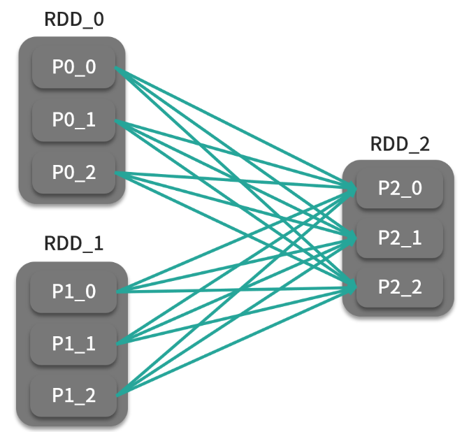


```java
def union(other: RDD[T]): RDD[T]
def union(self, other)

```

union 算子将两个同类型的 RDD 合并为一个 RDD，类似于求并集的操作。如下图：

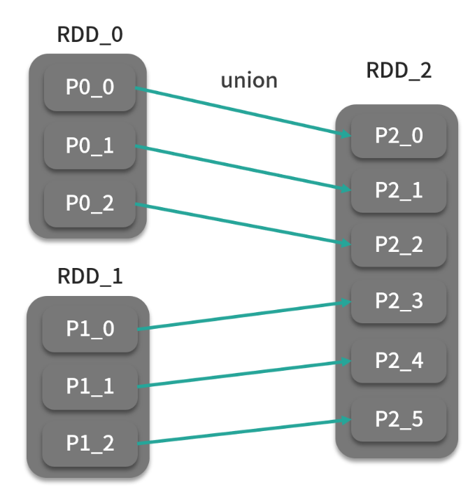


## 4、数据结构类

这类算子主要改变的是 RDD 中底层的数据结构，即 RDD 中的分区。在这些算子中，你可以直接操作分区而不需要访问这些分区中的元素。在 Spark 应用中，当你需要更高效地控制集群中的分区和分区的分发时，这些算子会非常有用。通常，我们会根据集群状态、数据规模和使用方式有针对性地对数据进行重分区，这样可以显著提升性能。默认情况下，RDD 使用散列分区器对集群中的数据进行分区。一般情况下，集群中的单个节点会有多个数据分区。数据分区数一般取决于数据量和集群节点数。如果作业中的某个计算任务地输入在本地，我们将其称为数据的本地性，计算任务会尽可能地根据本地性优先选择本地数据。

```java
def partitionBy(partitioner: Partitioner): RDD[(K, V)]：
def partitionBy(self, numPartitions, partitionFunc=portable_hash)

```

partitionBy 会按照传入的分发规则对 RDD 进行重分区，分发规则由自定义分区器实现。

```java
def coalesce(numPartitions: Int, shuffle: Boolean = false, partitionCoalescer: Option [Partition Coalescer] = Option.empty)(implicit ord: Ordering[T] = null): RDD[T]
def repartition(num Partitions: Int)(implicit ord: Ordering[T] = null): RDD[T]

```

oalesce 会试图将 RDD 中分区数变为用户设定的分区数（numPartitions），从而调整作业的并行程度。如果用户设定的分区数（100）小于 RDD 原有分区数（1000），则会进行本地合并，而不会进行 Shuffle；如果用户设定的分区数大于 RDD 原有分区数，则不会触发操作。如果需要增大分区数，则需要将 shuffle 参数设定为 true，这样数据就会通过散列分区器将数据进行分发，以达到增加分区的效果。

还有一种情况，当用户设置分区数为 1 时，如果 shuffle 参数为 false，会对某些节点造成极大的性能负担，用户可以设置 shuffle 参数为 true 来汇总分区的上游计算过程并行执行。repartition 是 coalesce 默认开启 shuffle 的简单封装。另外，你应该能够注意到，大部分转换算子，都提供了 numPartitions 这个可选参数，意味着在作业流程的每一步，你都可以细粒度地控制作业的并行度，从而提高执行时的性能，但这里你需要注意，提交作业后 Executor 的数量是一定的。


## 5、行动算子

行动算子从功能上来说作为一个触发器，会触发提交整个作业并开始执行。从代码上来说，它与转换算子的最大不同之处在于：转换算子返回的还是 RDD，行动算子返回的是非 RDD 类型的值，如整数，或者根本没有返回值。

行动算子可以分为 Driver 和分布式两类。

- Driver：这种算子返回值通常为 Driver 内部的内存变量，如 collect、count、countByKey 等。这种算子会在远端 Executor 执行计算完成后将结果数据传回 Driver。这种算子的缺点是，如果返回的数据太大，很容易会突破 Driver 内存限制，因此使用这种算子作为作业结束需要谨慎，主要还是用于调试与开发场景。

- 分布式：与前一类算子将结果回传到 Driver 不同，这类算子会在集群中的节点上“就地”分布式执行，如 saveAsTextFile。这是一种最常用的分布式行动算子。


我们先来看看第一种：

```java
def reduce(f: (T, T) => T): T
def reduce(self, f)

```

与转换算子 reduce 类似，会用函数参数两两进行归约，直到最后一个值，返回值类型与 RDD 元素相同。

```java
def foreach(f: T => Unit): Unit
def foreach(self, f)

```

foreach 算子迭代 RDD 中的每个元素，并且可以自定义输出操作，通过用户传入的函数，可以实现打印、插入到外部存储、修改累加器等迭代所带来的副作用。

还有一些算子类型如 count、reduce、max 等，从字面意思也很好理解，就不逐个介绍了。


以下算子为分布式类型的行动算子：

```java
def saveAsTextFile(path: String): Unit
def saveAsTextFile(self, path, compressionCodecClass=None)

```

下面来看看几个比较特殊的行动算子，在计算过程中，用户可能会经常使用到同一份数据，此时就可以用到 Spark 缓存技术，也就是利用缓存算子将 RDD 进行缓存，从而加速 Spark 作业的执行速度。Spark 缓存算子也属于行动算子，也就是说会触发整个作业开始计算，想要缓存数据，你可以使用 cache 或者 persist 算子，它们是行动算子中仅有的两个返回值为 RDD 的算子。事实上，Spark 缓存技术是加速 Spark 作业执行的关键技术之一，尤其是在迭代计算的场景，效果非常好。

缓存需要尽可能地将数据放入内存。如果没有足够的内存，那么驻留在内存的当前数据就有可能被移除，例如 LRU 策略；如果数据量本身已经超过可用内存容量，这时由于磁盘会代替内存存储数据，性能会下降。

```java
def persist(newLevel: StorageLevel): this.type 
def cache(): this.type
def unpersist(blocking: Boolean = true): this.type

```
其中，cache() = persist(MEMORY_ONLY)，Spark 在作业执行过程中会采用 LRU 策略来更新缓存，如果用户想要手动移除缓存的话，也可以采用 unpersist 算子手动释放缓存。其中 persist 可以选择存储级别，选项如下：

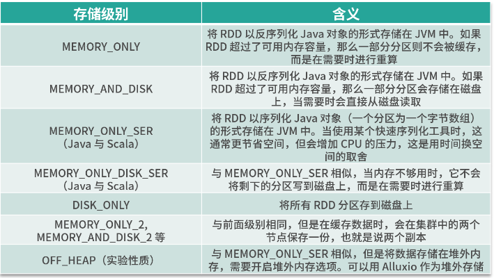


如果内存足够大，使用 MEMORY_ONLY 无疑是性能最好的选择，想要节省点空间的话，可以采取 MEMORY_ONLY_SER，可以序列化对象使其所占空间减少一点。DISK是在重算的代价特别昂贵时的不得已的选择。MEMORY_ONLY_2 与 MEMORY_AND_DISK_2 拥有最佳的可用性，但是会消耗额外的存储空间。

## 练习题

练习题 1：join 算子其实是 cogroup 和 flatMap 算子组合实现的，现在你自己能实现 join 算子吗？当然你也可以阅读 Spark 源码找到 join 算子的实现方法，也算你对！

练习题 2：用 Spark 算子实现对 1TB 的数据进行排序？这个问题，在第 11 课时，会揭晓答案，但现在还是需要你进行编码。

练习题 3：SELECT a,  COUNT(b)  FROM t WHERE c > 100 GROUP BY b 这是一句很简单的 SQL，你能用算子将它实现吗？


# 第09讲：函数式编程思想：你用什么声明，你在声明什么？

## 1、函数式编程与声明式编程

`函数式编程属于声明式编程的一种，与声明式编程相对的是命令式编程，命令式编程是按照“程序是一系列改变状态的命令”来建模的一种建模风格，而函数式编程思想是“程序是表达式和变换，以数学方程的形式建立模型，并且尽可能避免可变状态”`

函数式编程会有一些类别的操作（算子），如映射、过滤或者归约，每一种都有不同的函数作为代表，如 filter、map、reduce。这些函数实现的是低阶变换（这里就是前面讲的算子），而用户定义的函数将作为这些函数的参数（这里可以理解为高阶变换）来实现整个方程。

`命令式编程将计算机程序看成动作的序列，程序运行的过程就是求解的过程`，这就好比，阅读一段命令式编程风格的代码，如果不阅读到最后一行，一般来说无法确定程序的目的，这和题目求解过程有异曲同工之妙，在命令式编程中，解题过程由状态的转换来完成，而状态就是我们经常说的变量。而函数式编程则是从结果入手，用户通过函数定义了从最初输入到最终输出的映射关系，从这个角度上来说，用户编写代码描述了用户的最终结果（我想要什么），而并不关心（或者说不需要关心）求解过程，所以函数式编程绝对不会去操作某个具体的值，也就无所谓变量了。

举一个声明式编程的例子，这是用户编写的代码：

SELECT class_no, COUNT(*) FROM student_info GROUP BY class_no


由于 SQL 是很典型的声明式编程，用户只需要告诉 SQL 引擎统计每个班的人数，至于底层是怎么执行的，用户不需要关心。在《数据库系统概论》（第五版）提到：数据库会把用户提交的 SQL 查询转化为等价的扩展关系代数表达式，用户用函数式编程的思想进行编码，其实就是直接描述这个关系代数表达式。

说了这么多函数式与声明式，让我们来看个例子，有一个数据清洗的任务，需要将姓氏集合中的单字符姓名（脏数据）去掉，并将首字母大写，最后再拼成一个逗号分隔的字符串，先来看看命令式的实现（Python 版）：

```python
family_names = ["ann","bob","c","david"]
clean_family_names = []
for i in range(len(family_names)):
    family_name = family_names[i]
    if (len(family_name) > 1):
        clean_family_names.append(family_name.capitalize())
print clean_family_names

```
再来看看函数式（Scala 版）的实现：

```java
val familyNames = List("ann","bob","c","david")
println(
        familyNames.filter(p => p.length() > 1).
        map(f => f.capitalize).
        reduce((a,b) => a + "," + b).toString()
)

```
从这个例子中我们可以看出，在命令式编程的版本中，只执行了一次循环，在函数式编程的版本里，循环执行了 3 次（filter、map、reduce），每一次只完成一种逻辑（用户编写的匿名函数），从性能上来说，当然前者更为优秀，这说明了在硬件性能羸弱时，函数式的缺点会被放大，但我们也看到了，在函数式编程的版本中不用维护外部状态 i，这种方式对于并行计算场景非常友好。


## 2、你用什么声明？

你用什么声明？很显然，函数式就是用`函数进行声明`的一种编程风格。这里的函数指的是数学含义上的函数（比如f(x)）。

## 3、你在声明什么？用运算符定义一种新运算


## 4、函数式编程语言的特点

### 1、低阶函数与核心数据结构

如果使用低阶函数与高阶函数来完成我们的程序，这时其实就是将程序控制权让位于语言，而我们专注于业务逻辑。这样做的好处还在于，有利于程序优化，享受免费的性能提升午餐。比如语言开发者专注于优化低阶函数，而应用开发者则专注于优化高阶函数。低阶函数是复用的，因此当低阶函数性能提升时，程序不需要改一行代码就能免费获得性能提升。此外，函数式编程语言通常只提供几种核心数据结构，供开发者选择，它希望开发者能基于这些简单的数据结构组合出复杂的数据结构，这与低阶函数的思想是一致的，很多函数式编程语言的特性会着重优化低阶函数与核心数据结构。但这与面向对象的命令式编程是不一样的，在 OOP 中，面向对象编程的语言鼓励开发者针对具体问题建立专门的数据结构。

通过前几个课时的内容可以看到，Spark 的核心数据结构只有一个，就是 RDD，而其他函数式编程语言，如 Scala，核心数据结构也非常少。

### 2、惰性求值

惰性求值（lazy evaluation）是函数式编程语言常见的一种特性，通常指尽量延后求解表达式的值，这样可以对开销大的计算按需计算，利用惰性求值的特性可以构建无限大的集合。惰性求值可以用闭包来实现。Spark 也是采用了惰性求值来触发计算。

### 3、函数记忆

由于在函数式编程中，函数本身是无状态的，因此给定入参，一定能得到一定的结果。基于此，函数式语言会对函数进行记忆或者缓存，以斐波那契数列举例，首先用尾递归来实现对斐波那契数列求和，Python 代码如下：

```python
def Fibonacci ( n ):
   if n == 0 :
      res = 0
   elif num == 1:
      res = 1
   else:
      res = Fibonacci ( n - 1 ) + Fibonacci ( n - 2 )
return res
```

当 n 等于 4 时，程序执行过程是：

```
Fibonacci (4)
Fibonacci (3)
Fibonacci (2)
Fibonacci (1)
Fibonacci (0)
Fibonacci (1)
Fibonacci (2)
Fibonacci (1)
Fibonacci (0)
```

为了求 Fibonacci (4)，我们执行了 1 次 Fibonacci(3)，2 次 Fibonacci(2)，3 次 Fibonacci(1)，2 次 Fibonacci(0)，一共 8 次计算，在函数式编程语言中，执行过程是这样的：

```
Fibonacci (4)
Fibonacci (3)
Fibonacci (2)
Fibonacci (1)
Fibonacci (0)
```

一共只用 4 次计算就可求得 Fibonacci(4)，后面执行的 Fibonacci(0)、Fibonacci(1) 由于函数式编程语言已经缓存了结果，因此不会重复计算。

在这里，你可以与 cache 算子代表的缓存机制联系起来，Spark 允许用户主动缓存。


思考题：用函数式风格的代码实现 a - b 的逻辑，逻辑非常简单，难点在于用函数式风格来表达。考虑这道题的特殊性，可能大多数不习惯这么表达，所以我把答案附在下面。

List(5).zip(List(4)).map(f => {f._1 - f._2}).foreach(println(_))
 


# 第10讲：共享变量：如何在数据管道中使用中间结果？

共享变量是 Spark 中进阶特性之一，一共有两种：广播变量和累加器。

这两种变量可以认为是在用算子定义的数据管道外的两个全局变量，供所有计算任务使用。在 Spark 作业中，用户编写的高阶函数会在集群中的 Executor 里执行，这些 Executor 可能会用到相同的变量，这些变量被复制到每个 Executor 中，而 Executor 对变量的更新不会传回 Driver。

在计算任务中支持通用的可读写变量一般是低效的，即便如此，Spark 还是提供了两类共享变量：广播变量（broadcast variable）与累加器（accumulator）。当然，对于分布式变量，如果不加限制会出现一致性的问题，所以共享变量是两种非常特殊的变量。

- 广播变量：只读；
- 累加器：只能增加。

## 1、广播变量

广播变量类似于 MapReduce 中的 DistributeFile，通常来说是一份不大的数据集，一旦广播变量在 Driver 中被创建，整个数据集就会在集群中进行广播，能让所有正在运行的计算任务以只读方式访问。广播变量支持一些简单的数据类型，如整型、集合类型等，也支持很多复杂数据类型，如一些自定义的数据类型。

广播变量为了保证数据被广播到所有节点，使用了很多办法。这其实是一个很重要的问题，我们不能期望 100 个或者 1000 个 Executor 去连接 Driver，并拉取数据，这会让 Driver 不堪重负。Executor 采用的是通过 HTTP 连接去拉取数据，类似于 BitTorrent 点对点传输。这样的方式更具扩展性，避免了所有 Executor 都去向 Driver 请求数据而造成 Driver 故障。

Spark 广播机制运作方式是这样的：Driver 将已序列化的数据切分成小块，然后将其存储在自己的块管理器 BlockManager 中，当 Executor 开始运行时，每个 Executor 首先从自己的内部块管理器中试图获取广播变量，如果以前广播过，那么直接使用；如果没有，Executor 就会从 Driver 或者其他可用的 Executor 去拉取数据块。一旦拿到数据块，就会放到自己的块管理器中。供自己和其他需要拉取的 Executor 使用。这就很好地防止了 Driver 单点的性能瓶颈，如下图所示。

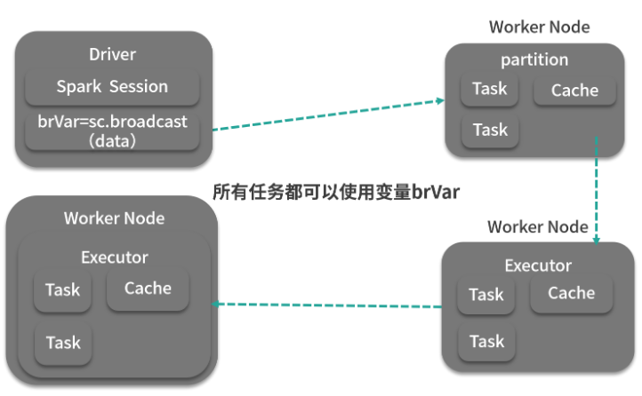


下面来看看如何在 Spark 作业中创建、使用广播变量。代码如下：

```java

scala> val rdd_one = sc.parallelize(Seq(1,2,3))
rdd_one: org.apache.spark.rdd.RDD[Int] = ParallelCollectionRDD[101] at
parallelize at <console>:25
    scala> val i = 5
    i: Int = 5
scala> val bi = sc.broadcast(i)
bi: org.apache.spark.broadcast.Broadcast[Int] = Broadcast(147)
scala> bi.value
res166: Int = 5
scala> rdd_one.take(5)
res164: Array[Int] = Array(1, 2, 3)
scala> rdd_one.map(j => j + bi.value).take(5)
res165: Array[Int] = Array(6, 7, 8)

```
在用户定义的高阶函数中，可以直接使用广播变量的引用。下面看一个集合类型的广播变量：

```java
scala> val rdd_one = sc.parallelize(Seq(1,2,3))
    rdd_one: org.apache.spark.rdd.RDD[Int] = ParallelCollectionRDD[109] at
parallelize at <console>:25
scala> val m = scala.collection.mutable.HashMap(1 -> 2, 2 -> 3, 3 -> 4)
    m: scala.collection.mutable.HashMap[Int,Int] = Map(2 -> 3, 1 -> 2, 3 -> 4)
scala> val bm = sc.broadcast(m)
bm:
org.apache.spark.broadcast.Broadcast[scala.collection.mutable.HashMap[Int,I
nt]] = Broadcast(178)
scala> rdd_one.map(j => j * bm.value(j)).take(5)
res191: Array[Int] = Array(2, 6, 12)

```

该例中，元素乘以元素对应值得到最后结果。广播变量会持续占用内存，当我们不需要的时候，可以用 unpersist 算子将其移除，这时，如果计算任务又用到广播变量，那么就会重新拉取数据，如下：

```java
    ...
scala> val rdd_one = sc.parallelize(Seq(1,2,3))
rdd_one: org.apache.spark.rdd.RDD[Int] = ParallelCollectionRDD[101] at
parallelize at <console>:25
scala> val k = 5
k: Int = 5
scala> val bk = sc.broadcast(k)
bk: org.apache.spark.broadcast.Broadcast[Int] = Broadcast(163)
scala> rdd_one.map(j => j + bk.value).take(5)
res184: Array[Int] = Array(6, 7, 8)
scala> bk.unpersist
scala> rdd_one.map(j => j + bk.value).take(5)
res186: Array[Int] = Array(6, 7, 8)

```

你还可以使用 destroy 方法彻底销毁广播变量，调用该方法后，如果计算任务中又用到广播变量，则会抛出异常：

```java
scala> val rdd_one = sc.parallelize(Seq(1,2,3))
rdd_one: org.apache.spark.rdd.RDD[Int] = ParallelCollectionRDD[101] at
parallelize at <console>:25
scala> val k = 5
k: Int = 5
scala> val bk = sc.broadcast(k)
bk: org.apache.spark.broadcast.Broadcast[Int] = Broadcast(163)
scala> rdd_one.map(j => j + bk.value).take(5)
res184: Array[Int] = Array(6, 7, 8)
scala> bk.destroy
scala> rdd_one.map(j => j + bk.value).take(5)
17/05/27 14:07:28 ERROR Utils: Exception encountered
org.apache.spark.SparkException: Attempted to use Broadcast(163) after it
was destroyed (destroy at <console>:30)
at org.apache.spark.broadcast.Broadcast.assertValid(Broadcast.scala:144)
at
org.apache.spark.broadcast.TorrentBroadcast$$anonfun$writeObject$1.apply$mc
V$sp(TorrentBroadcast.scala:202)
at org.apache.spark.broadcast.TorrentBroadcast$$anonfun$wri

```

`广播变量在一定数据量范围内可以有效地使作业避免 Shuffle，使计算尽可能本地运行，Spark 的 Map 端连接操作就是用广播变量实现的。`


为了让你更好地理解上面那句话的意思，我再举一个比较典型的场景，我们希望对海量的日志进行校验，日志可以简单认为是如下的格式：
表 A：校验码，内容

也就是说，我们需要根据校验码的不同，对内容采取不同规则的校验，而检验码与校验规则的映射则存储在另外一个数据库：
表 B：校验码，规则

这样，情况就比较清楚了，如果不考虑广播变量，我们有这么两种做法：

- 1、直接使用 map 算子，在 map 算子中的自定义函数中去查询数据库，那么有多少行，就要查询多少次数据库，这样性能非常差。
- 2、先将表 B 查出来转化为 RDD，使用 join 算子进行连接操作后，再使用 map 算子进行处理，这样做性能会比前一种方式好很多，但是会引起大量的 Shuffle 操作，对资源消耗不小。
当考虑广播变量后，我们有了这样一种做法（Python 风格伪代码）：

```java
###表A
tableA = spark.sparkcontext.textFrom('/path')
###广播表B
validateTable = spark.sparkcontext.broadcast(queryTable())
###验证函数，在验证函数中会取得对应的校验规则进行校验
def validate(validateNo,validateTable ):
......
##统计校验结果
validateResult = tableA.map(validate).reduceByKey((lambda x , y: x + y))
....

```

这样，相当于先将小表进行广播，广播到每个 Executor 的内存中，供 map 函数使用，这就避免了 Shuffle，虽然语义上还是 join（小表放内存），但无论是资源消耗还是执行时间，都要远优于前面两种方式。


## 2、累加器
与广播变量只读不同，累加器是一种只能进行增加操作的共享变量。如果你想知道记录中有多少错误数据，一种方法是针对这种错误数据编写额外逻辑，另一种方式是使用累加器。用法如下：

```java
    ...
scala> val acc1 = sc.longAccumulator("acc1")
acc1: org.apache.spark.util.LongAccumulator = LongAccumulator(id: 10355,
name: Some(acc1), value: 0)
scala> val someRDD = tableRDD.map(x => {acc1.add(1); x})
someRDD: org.apache.spark.rdd.RDD[String] = MapPartitionsRDD[99] at map at
<console>:29
scala> acc1.value
res156: Long = 0 /*there has been no action on the RDD so accumulator did
not get incremented*/
scala> someRDD.count
res157: Long = 351
scala> acc1.value
res158: Long = 351
scala> acc1
res145: org.apache.spark.util.LongAccumulator = LongAccumulator(id: 10355,
name: Some(acc1), value: 351)
```

上面这个例子用 SparkContext 初始化了一个长整型的累加器。LongAccumulator 方法会将累加器变量置为 0。行动算子 count 触发计算后，累加器在 map 函数中被调用，其值会一直增加，最后定格为 351。Spark 内置的累加器有如下几种。

LongAccumulator：长整型累加器，用于求和、计数、求均值的 64 位整数。
DoubleAccumulator：双精度型累加器，用于求和、计数、求均值的双精度浮点数。
CollectionAccumulator[T]：集合型累加器，可以用来收集所需信息的集合。
所有这些累加器都是继承自 AccumulatorV2，如果这些累加器还是不能满足用户的需求，Spark 允许自定义累加器。如果需要某两列进行汇总，无疑自定义累加器比直接编写逻辑要方便很多，例如：


这个表只有两列，需要统计 A 列与 B 列的汇总值。下面来看看根据上面的逻辑如何实现一个自定义累加器。代码如下：


```java
import org.apache.spark.util.AccumulatorV2
import org.apache.spark.SparkConf
import org.apache.spark.SparkContext
import org.apache.spark.SparkConf
    
// 构造一个保存累加结果的类
case class SumAandB(A: Long, B: Long)
    
class FieldAccumulator extends AccumulatorV2[SumAandB,SumAandB] {

private var A:Long = 0L
private var B:Long = 0L
    // 如果A和B同时为0，则累加器值为0
    override def isZero: Boolean = A == 0 && B == 0L
    // 复制一个累加器
    override def copy(): FieldAccumulator = {
        val newAcc = new FieldAccumulator
        newAcc.A = this.A
        newAcc.B = this.B
        newAcc
    }
    // 重置累加器为0
    override def reset(): Unit = { A = 0 ; B = 0L }
    // 用累加器记录汇总结果
    override def add(v: SumAandB): Unit = {
        A += v.A
        B += v.B
    }
    // 合并两个累加器
    override def merge(other: AccumulatorV2[SumAandB, SumAandB]): Unit = {
        other match {
        case o: FieldAccumulator => {
            A += o.A
            B += o.B}
        case _ =>
        }
    }
    // 当Spark调用时返回结果
    override def value: SumAandB = SumAandB(A,B)
}
```

凡是有关键字 override 的方法，均是重载实现自己逻辑的方法。累加器调用方式如下：

```java
package com.spark.examples.rdd
 
import org.apache.spark.SparkConf
import org.apache.spark.SparkContext
 
class Driver extends App{

  val conf = new SparkConf
  val sc = new SparkContext(conf)
  val filedAcc = new FieldAccumulator
  sc.register(filedAcc, " filedAcc ")
  // 过滤掉表头
  val tableRDD = sc.textFile("table.csv").filter(_.split(",")(0) != "A")
  tableRDD.map(x => {
     val fields = x.split(",")
     val a = fields(1).toInt
     val b = fields(2).toLong
     filedAcc.add(SumAandB (a, b))
     x
  }).count
}
```

最后计数器的结果为（3100, 31）。


本课时主要介绍了 Spark 的两种共享变量，注意体会广播变量最后介绍的 map 端 join 的场景，这在实际使用中非常普遍。另外广播变量的大小，按照我的经验，要根据 Executor 和 Worker 资源来确定，几十兆、一个 G 的广播变量在大多数情况不会有什么问题，如果资源充足，那么1G~10G 以内问题也不大。

最后我要给你留一个思考题，请你对数据集进行空行统计。你可以先用普通算子完成后，再用累加器的方式完成，并比较两者的执行效率 ，如果有条件的，可以在生产环境中用真实数据集比较下两者之间的差异，差异会更明显。


# 第11讲：计算框架的分布式实现：剖析 Spark Shuffle 原理

Shuffle，主要分为：逻辑层面和物理层面。

逻辑层面主要从 RDD 的血统机制出发，从 DAG 的角度来讲解 Shuffle，另外也会讲解 Spark 容错机制，而物理层面是从执行角度来剖析 Shuffle 是如何发生的。


## 1、RDD 血统与 Spark 容错

在 DAG 中，最初的 RDD 被称为基础 RDD，后续生成的 RDD 都是由算子以及依赖关系生成的，也就是说，无论哪个 RDD 出现问题，都可以由这种依赖关系重新计算而成。这种依赖关系被称为 RDD 血统（lineage）。血统的表现形式主要分为宽依赖（wide dependency）与窄依赖（narrow dependency），如下图所示：

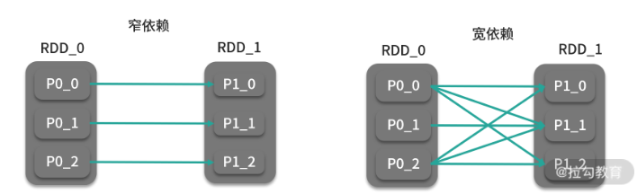


窄依赖的准确定义是：子 RDD 中的分区与父 RDD 中的分区只存在一对一的映射关系，而宽依赖则是子 RDD 中的分区与父 RDD 中的分区存在一对多的映射关系，那么从这个角度来说，map、 filter、 union 等就是窄依赖，而 groupByKey、 coGroup 就是典型的宽依赖，如下图所示：

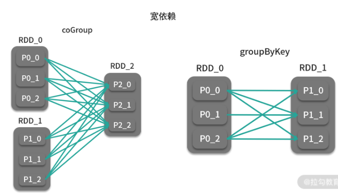

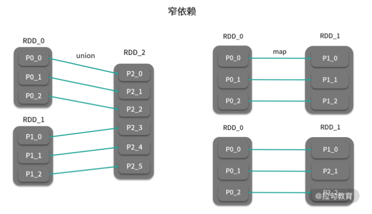

`宽依赖还有个名字，叫 Shuffle 依赖，也就是说宽依赖必然会发生 Shuffle 操作，在前面也提到过 Shuffle 也是划分 Stage 的依据`。而窄依赖由于不需要发生 Shuffle，所有计算都是在分区所在节点完成，它类似于 MapReduce 中的 ChainMapper。所以说，在你自己的 DAG 中，如果你选取的算子形成了宽依赖，那么就一定会触发 Shuffle。

当 RDD 中的某个分区出现故障，那么只需要按照这种依赖关系重新计算即可，窄依赖最简单，只涉及某个节点内的计算，而宽依赖，则会按照依赖关系由父分区计算而得到，如下图所示：

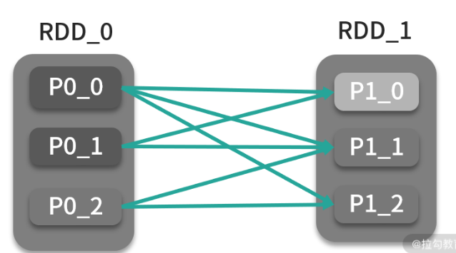

如果 P1_0 分区发生故障，那么按照依赖关系，则需要 P0_0 与 P0_1 的分区重算，如果 P0_0与 P0_1 没有持久化，就会不断回溯，直到找到存在的父分区为止。当计算逻辑复杂时，就会引起依赖链过长，这样重算的代价会极其高昂，所以用户可以在计算过程中，适时调用 RDD 的 checkpoint 方法，保存当前算好的中间结果，这样依赖链就会大大缩短。RDD 的血统机制就是 RDD 的容错机制。

Spark 的容错主要分为资源管理平台的容错和 Spark 应用的容错， Spark 应用是基于资源管理平台运行，所以资源管理平台的容错也是 Spark 容错的一部分，如 YARN 的 ResourceManager HA 机制。在 Spark 应用执行的过程中，可能会遇到以下几种失败的情况：

- Driver 报错；
- Executor 报错；
- Task 执行失败。

Driver 执行失败是 Spark 应用最严重的一种情况，标志整个作业彻底执行失败，需要开发人员手动重启 Driver；Executor 报错通常是因为 Executor 所在的机器故障导致，这时 Driver 会将执行失败的 Task 调度到另一个 Executor 继续执行，重新执行的 Task 会根据 RDD 的依赖关系继续计算，并将报错的 Executor 从可用 Executor 的列表中去掉；Spark 会对执行失败的 Task 进行重试，重试 3 次后若仍然失败会导致整个作业失败。在这个过程中，Task 的数据恢复和重新执行都用到了 RDD 的血统机制。


## 2、Spark Shuffle

中间文件数的优化：`M * R--->C（CPU 核数，每个核可以执行1到N个map任务）* R--->2(1个索引+1个数据文件)*M`


很多算子都会引起 RDD 中的数据进行重分区，新的分区被创建，旧的分区被合并或者被打碎，`在重分区的过程中，如果数据发生了跨节点移动，就被称为 Shuffle`，在 Spark 中， Shuffle 负责将 Map 端（这里的 Map 端可以理解为宽依赖的左侧）的处理的中间结果传输到 Reduce 端供 Reduce 端聚合（这里的 Reduce 端可以理解为宽依赖的右侧），它是 MapReduce 类型计算框架中最重要的概念，同时也是很消耗性能的步骤。Shuffle 体现了从函数式编程接口到分布式计算框架的实现。与 MapReduce 的 Sort-based Shuffle 不同，Spark 对 Shuffle 的实现方式有两种：`Hash Shuffle 与 Sort-based Shuffle`，这其实是一个优化的过程。在较老的版本中，Spark Shuffle 的方式可以通过 spark.shuffle.manager 配置项进行配置，而在最新的 Spark 版本中，已经去掉了该配置，统一称为 Sort-based Shuffle。

### 1、Hash Shuffle

在 Spark 1.6.3 之前， Hash Shuffle 都是 Spark Shuffle 的解决方案之一。 Shuffle 的过程一般分为两个部分：Shuffle Write 和 Shuffle Fetch，前者是 Map 任务划分分区、输出中间结果，而后者则是 Reduce 任务获取到的这些中间结果。Hash Shuffle 的过程如下图所示：

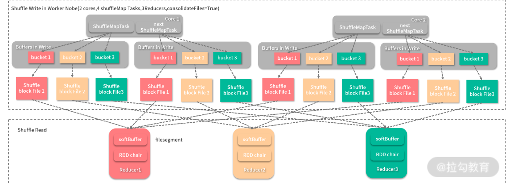

在图中，Shuffle Write 发生在一个节点上，该节点用来执行 Shuffle 任务的 CPU 核数为 2，每个核可以同时执行两个任务，每个任务输出的分区数与 Reducer（这里的 Reducer 指的是 Reduce 端的 Executor）数相同，即为 3，每个分区都有一个缓冲区（bucket）用来接收结果，每个缓冲区的大小由配置 spark.shuffle.file.buffer.kb 决定。这样每个缓冲区写满后，就会输出到一个文件段（filesegment），而 Reducer 就会去相应的节点拉取文件。这样的实现很简单，但是问题也很明显。主要有两个：

- 1、生成的中间结果文件数太大。理论上，每个 Shuffle 任务输出会产生 R 个文件（ R为Reducer 的个数），而 Shuffle 任务的个数往往由 Map 任务个数 M 决定，所以总共会生成 M * R 个中间结果文件，而往往在一个作业中 M 和 R 都是很大的数字，在大型作业中，经常会出现文件句柄数突破操作系统限制。

- 2、缓冲区占用内存空间过大。单节点在执行 Shuffle 任务时缓存区大小消耗为 m * R * spark.shuffle.file.buffer.kb，m 为该节点运行的 Shuffle 任务数，如果一个核可以执行一个任务，m 就与 CPU 核数相等。这对于动辄有 32、64 物理核的服务器来说，是比不小的内存开销。

为了解决第一个问题， Spark 推出过 File Consolidation 机制，旨在通过共用输出文件以降低文件数，如下图所示：

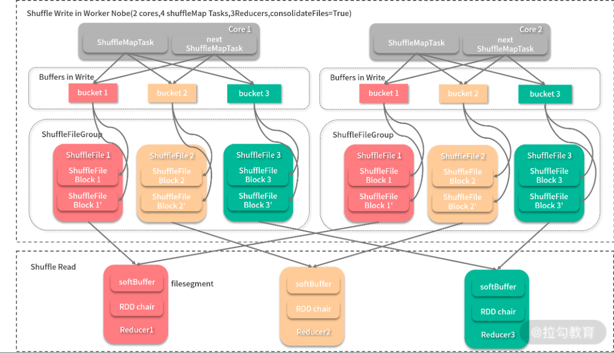

每当 Shuffle 任务输出时，同一个 CPU 核心处理的 Map 任务的中间结果会输出到同分区的一个文件中，然后 Reducer 只需一次性将整个文件拿到即可。这样，Shuffle 产生的文件数为 C（CPU 核数）* R。 Spark 的 FileConsolidation 机制默认开启，可以通过 spark.shuffle.consolidateFiles 配置项进行配置。

### 2、Sort-based Shuffle

在 Spark 先后引入了 Hash Shuffle 与 FileConsolidation 后，还是无法根本解决中间文件数太大的问题，所以 Spark 在 1.2 之后又推出了与 MapReduce 一样（你可以参照《Hadoop 海量数据处理》（第 2 版）的 Shuffle 相关章节）的 Shuffle 机制： Sort-based Shuffle，才真正解决了 Shuffle 的问题，再加上 Tungsten 计划的优化， Spark 的 Sort-based Shuffle 比 MapReduce 的 Sort-based Shuffle 青出于蓝。如下图所示：

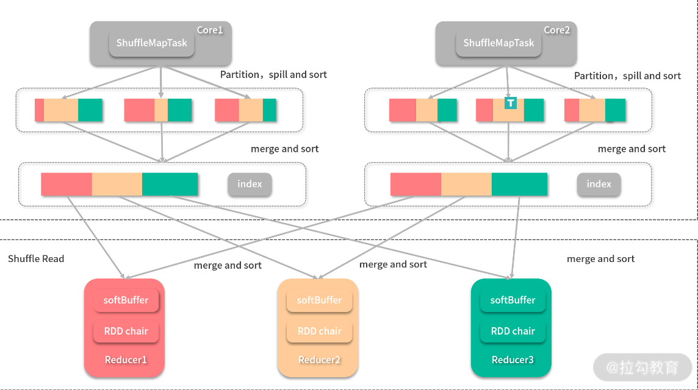

每个 Map 任务会最后只会输出两个文件（其中一个是索引文件），其中间过程采用的是与 MapReduce 一样的归并排序，但是会用索引文件记录每个分区的偏移量，输出完成后，Reducer 会根据索引文件得到属于自己的分区，在这种情况下，Shuffle 产生的中间结果文件数为 2 * M（M 为 Map 任务数）。

在基于排序的 Shuffle 中， Spark 还提供了一种折中方案——Bypass Sort-based Shuffle，当 Reduce 任务小于 spark.shuffle.sort.bypassMergeThreshold 配置（默认 200）时，Spark Shuffle 开始按照 Hash Shuffle 的方式处理数据，而不用进行归并排序，只是在 Shuffle Write 步骤的最后，将其合并为 1 个文件，并生成索引文件。这样实际上还是会生成大量的中间文件，只是最后合并为 1 个文件并省去排序所带来的开销，该方案的准确说法是 Hash Shuffle 的Shuffle Fetch 优化版。

Spark 在1.5 版本时开始了 Tungsten 计划，也在 1.5.0、 1.5.1、 1.5.2 的时候推出了一种 tungsten-sort 的选项，这是一种成果应用，类似于一种实验，该类型 Shuffle 本质上还是给予排序的 Shuffle，只是用 UnsafeShuffleWriter 进行 Map 任务输出，并采用了要在后面介绍的 BytesToBytesMap 相似的数据结构，把对数据的排序转化为对指针数组的排序，能够基于二进制数据进行操作，对 GC 有了很大提升。但是该方案对数据量有一些限制，随着 Tungsten 计划的逐渐成熟，该方案在 1.6 就消失不见了。

从上面整个过程的变化来看， Spark Shuffle 也是经过了一段时间才趋于成熟和稳定，这也正像学习的过程，不用一蹴而就，贵在坚持。

## 习题讲解

练习题 2：用 Spark 算子实现对 1TB 的数据进行排序？

关于这道题的解法，你可能很自然地想到了归并排序的原理，首先每个分区对自己分区进行排序，最后汇总到一个分区内进行全排序。

可想而知，最后 1TB 的数据都会汇总到 1 个 Executor，就算这个 Executor 分配到的资源再充足，面对这种情况，无疑也是以失败告终。所以这道题的解法应该是另一种方案，首先数据会按照键的区间进行分发，也就是 Shuffle，如 [0，100000]、 [100000，200000）和 [200000，300000]，每个分区没有交集。照此规则分发后，分区内再进行排序，就可以在满足性能要求的前提下完成全排序，如下图：

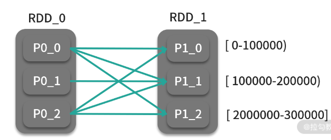

这种方式的全排序无疑实现了计算的并行化，很多测试性能的场景也用这种方式对 1TB 的数据进行排序，目前世界纪录是腾讯在 2016 年达到的 98.8 秒。对于这种排序方式，Spark 也将其封装为 sortByKey 算子，它采用的分区器则是 RangePartitioner。


> 小结

Spark Shuffle 是 Spark 最重要的机制，作为大数据工程师的你，有必要深入了解，Shuffle机制也是面试喜欢问到的一个问题，前面三张关于Shuffle的图大家一定要吃透。另外， Spark 作业的性能问题往往出现在 Shuffle 上，在上个课时中，我们也是通过广播变量而避免了 Shuffle，从而得到性能的提升，所以掌握了 Spark Shuffle 能帮助你有针对性地进行调优。

最后给你出一个思考题：还是在 08 课时第 2 道思考题的基础上，如果数据并没有均匀分布，那么很可能某个分区的数据会异常多，同样会导致作业失败，对于这种数据倾斜的情况，你认为有没有办法避免呢？


模块三：Spark 高级编程

# 第12讲：如何处理结构化数据：DataFrame 、Dataset和Spark SQL

> 模块回顾

在第 2 模块里，我们学习了 Spark 核心数据结构 RDD 和算子，以及 Spark 相关的一些底层原理。可以看到 RDD 将大数据集抽象为集合，这掩盖了分布式数据集的复杂性，而函数式编程风格的算子也能满足不同的数据处理逻辑。但是，RDD + 算子的组合，对于普通分析师来说还是不太友好，他们习惯于“表”的概念而非“集合”，而使用基于集合完成数据处理的逻辑更像是程序员们的思维方式。对于数据处理逻辑，分析师们更习惯用 SQL 而非算子来表达。所以，Spark 借鉴了 Python 数据分析库 pandas 中 DataFrame 的概念，推出了 DataFrame、Dataset 与 Spark SQL。


在数据科学领域中，`DataFrame 抽象了矩阵`，如 R、pandas 中的 DataFrame；在数据工程领域，如 Spark SQL 中，`DataFrame 更多地代表了关系型数据库中的表`，这样就可以利用简单易学的 SQL 来进行数据分析；在 Spark 中，我们既可以用 Spark SQL + DataFrame 的组合实现海量数据分析，也可用 DataFrame + MLlib（Spark 机器学习库）的组合实现海量数据挖掘。

在计算机领域中，高级往往意味着简单、封装程度高，而与之对应的通常是复杂、底层。对于 Spark 编程来说，RDD + 算子的组合无疑是比较底层的，而 `DataFrame + Spark SQL` 的组合无论从学习成本，还是从性能开销上来说，都显著优于前者组合，所以无论是分析师还是程序员，这种方式才是使用 Spark 的首选。 此外，对于分析师来说，DataFrame 对他们来说并不陌生，熟悉的概念也能让他们快速上手。

这里特别说明的是，由于 DataFrame API 的 Scala 版本与 Python 版本大同小异，差异极小，所以本课时的代码以 Scala 版本为主。


## 1、DataFrame、Dataset 的起源与演变

DataFrame 在 Spark 1.3 被引入，它的出现取代了 SchemaRDD，Dataset 最开始在 Spark 1.6 被引入，当时还属于实验性质，在 2.0 版本时正式成为 Spark 的一部分，并且在 Spark 2.0 中，DataFrame API 与 Dataset API 在形式上得到了统一。

Dataset API 提供了类型安全的面向对象编程接口。Dataset 可以通过将表达式和数据字段暴露给查询计划程序和 Tungsten 的快速内存编码，从而利用 Catalyst 优化器。但是，现在 DataFrame 和 Dataset 都作为 Apache Spark 2.0 的一部分，其实 DataFrame 现在是 Dataset Untyped API 的特殊情况。更具体地说：

DataFrame = Dataset[Row]

下面这张图比较清楚地表示了 DataFrame 与 Dataset 的变迁与关系。

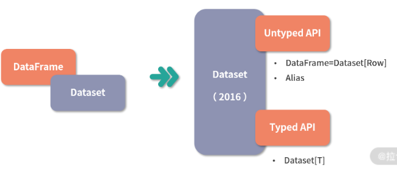

由于 Python 不是类型安全的语言，所以 Spark Python API 没有 Dataset API，而只提供了 DataFrame API。当然，Java 和 Scala 就没有这种问题。

## 2、DataFrame API

DataFrame 与 Dataset API 提供了简单的、统一的并且更富表达力的 API ，简言之，与 RDD 与算子的组合相比，DataFrame 与 Dataset API 更加高级，所以这也是为什么我将这个模块命名为 Spark 高级编程。

DataFrame 不仅可以使用 SQL 进行查询，其自身也具有灵活的 API 可以对数据进行查询，与 RDD API 相比，DataFrame API 包含了更多的应用语义，所谓应用语义，就是能让计算框架知道你的目标的信息，这样计算框架就能更有针对性地对作业进行优化，本课时主要介绍如何创建DataFrame 以及如何利用 DataFrame 进行查询。

### 1、创建DataFrame

DataFrame 目前支持多种数据源、文件格式，如 Json、CSV 等，也支持由外部数据库直接读取数据生成，此外还支持由 RDD 通过类型反射生成，甚至还可以通过流式数据源生成，这在下个模块会详细介绍。DataFrame API 非常标准，创建 DataFrame 都通过 read 读取器进行读取。下面列举了如何读取几种常见格式的文件。

- 读取 Json 文件。Json 文件如下：

```
{"name":"Michael"}
{"name":"Andy", "age":30}
{"name":"Justin", "age":19}
......
val df = spark.read.json("examples/src/main/resources/people.json")
```

我们可以利用初始化好的 SparkSession（spark）读取 Json 格式文件。

- 读取 CSV 文件：

val df = spark.read.csv("examples/src/main/resources/people.csv")

- 从 Parquet 格式文件中生成：

val df = spark.read.parquet("examples/src/main/resources/people.csv")

- 从 ORC 格式文件中生成：

val df = spark.read.orc("examples/src/main/resources/people.csv")

- 从文本中生成：

val df = spark.read.text("examples/src/main/resources/people.csv")

- 通过 JDBC 连接外部数据库读取数据生成

```java
val df = spark.read
.format("jdbc")
.option("url", "jdbc:postgresql:dbserver")
.option("dbtable", "schema.tablename")
.option("user", "username")
.option("password", "password")
.load()
```

上面的代码表示通过 JDBC 相关配置，读取数据。

- 通过 RDD 反射生成。此种方法是字符串反射为 DataFrame 的 Schema，再和已经存在的 RDD 一起生成 DataFrame，代码如下所示：

```java
import spark.implicits._
val schemaString = "id f1 f2 f3 f4"
// 通过字符串转换和类型反射生成schema
val fields = schemaString.split(" ").map(fieldName => StructField(fieldName, StringType, nullable = true))
val schema = StructType(fields)
// 需要将RDD转化为RDD[Row]类型
val rowRDD = spark.sparkContext.textFile(textFilePath).map(_.split(",")).map(attributes => 
Row(attributes(0), 
attributes(1),
attributes(2),
attributes(3),
attributes(4).trim)
)
// 生成DataFrame
val df = spark.createDataFrame(rowRDD, schema)
```

注意这种方式需要隐式转换，需在转换前写上第一行：

import spark.implicits._

DataFrame 初始化完成后，可以通过 show 方法来查看数据，Json、Parquet、ORC 等数据源是自带 Schema 的，而那些无 Schema 的数据源，DataFrame 会自己生成 Schema。


## 3、Dataset API


## 4、Spark SQL


# 第13讲：如何使用用户自定义函数？
# 第14讲：列式存储：针对查询场景的极致优化
# 第15讲：如何对 Spark 进行全方位性能调优？
# 第16讲：Tungsten 和 Hydrogen：Spark 性能提升与优化计划
# 第17讲：实战：探索葡萄牙银行电话调查的结果


模块四：Spark 流处理
# 第18讲：流处理：什么是流处理？以及你必须考虑的消息送达保证问题
# 第19讲：批处理还是流处理：Spark Streaming 抽象、架构与使用方法
# 第20讲：如何在生产环境中使用 Spark Streaming
# 第21讲：统一批处理与流处理：Dataflow
# 第22讲：新一代流式计算框架：Structured Streaming
# 第23讲：如何对 Spark 流处理进行性能调优？
# 第24讲：实战：如何对股票交易实时价格进行分析？


模块五：Spark 图挖掘
# 第25讲： 什么是图：图模式，图相关技术与使用场景
# 第26讲：数据并行：Spark 如何抽象图，如何切分图，如何处理图
# 第27讲：像顶点一样思考：大规模并行图挖掘引擎 GraphX
# 第28讲：Pregel 还是 MapReduce：一个有趣的算子 AggregateMessage
# 第29讲：实战 1：用 GraphX 实现 PageRank 算法
# 第30讲：实战 2：用 GraphX 求得顶点的 n 度邻居


模块六：Spark 机器学习
# 第31讲：机器学习是什么： 机器学习与机器学习工作流
# 第32讲：标准化机器学习流程：ML pipeline
# 第33讲：如何对数据进行预处理？

# 第34讲：少数服从多数：随机森林分类器

# 第35讲：物以类聚：Kmeans 聚类算法

# 第36讲：推荐引擎：协同过滤

# 第37讲：如何对模型性能进行评估并调优？

模块七：商业智能系统实战
# 第38讲：数据仓库与商业智能系统架构剖析

# 第39讲：作为 Yelp 运营负责人，如何根据数据进行决策？

# 第40讲：如何获取业务数据库的数据

# 第41讲：如何构建数据立方体

# 第42讲：如何通过 OLAP 与报表呈现结果

# 第43讲：两个简化了的重要问题：数据更新和数据实时性

# 第44讲：另一种并行：Lambda 架构与 Kappa 架构

