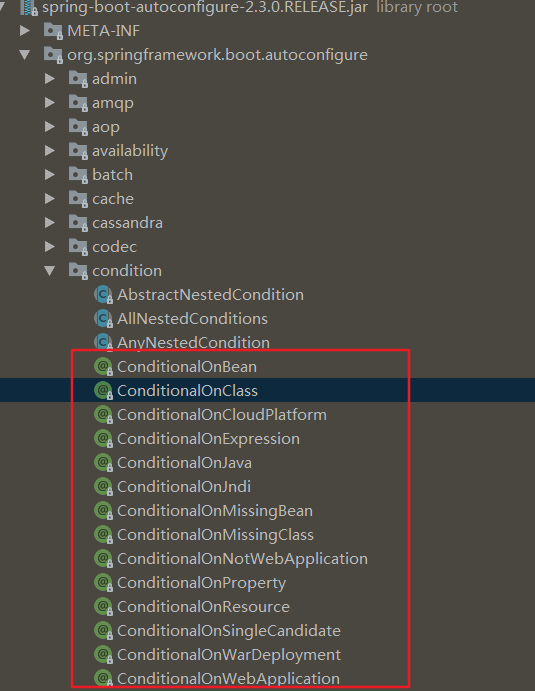

- ConditionalOnBean
- ConditionalOnClass
- ConditionalOnCloudPlatform
- ConditionalOnExpression
- ConditionalOnJava
- ConditionalOnJndi
- ConditionalOnMissingBean 加载类和方法上，当容器中没有该类型的对象是执行；
- ConditionalOnMissingClass
- ConditionalOnNotWebApplication
- ConditionalOnProperty
- ConditionalOnResource
- ConditionalOnSingleCandidate
- ConditionalOnWarDeployment
- ConditionalOnWebApplication


# 0、ConditionalOnxxx系列

## 0、原理

当我们构建一个 Spring 应用的时候，有时我们想在满足指定条件的时候才将某个 bean 加载到应用上下文中， 在Spring 4.0 时代，我们可以通过 @Conditional 注解来实现这类操作

### 1、Conditional

```java
@Target({ElementType.TYPE, ElementType.METHOD})
@Retention(RetentionPolicy.RUNTIME)
@Documented
public @interface Conditional {
    Class<? extends Condition>[] value();
}
```

我们看到  @Conditional 注解接收的参数是 extends Condition 接口的泛型类，也就是说，我们要使用 @Conditional 注解，只需要实现 Condition 接口并重写其方法即可

### 2、Condition

```java
@FunctionalInterface
public interface Condition {
    boolean matches(ConditionContext var1, AnnotatedTypeMetadata var2);
}
```

看到接口的 matches 方法返回的是 boolean 类型，是不是和我们自定义 validation annotation 有些类似，都是用来判断是否满足指定条件。另外注意看，以上注解和接口都在 org.springframework.context.annotation package 中。

终于到了 Spring Boot 时代，在这个全新的时代，Spring Boot 在 @Conditional 注解的基础上进行了细化，无需出示复杂的介绍信 (实现 Condition 接口)，只需要手持预定义好的 @ConditionalOnXxxx 注解印章的门票，如果验证通过，就会走进 Application Context 大厅。

Spring Boot 对 @Conditional 注解为我们做了细化，这些注解都定义在 org.springframework.boot.autoconfigure.condition package 下



逐个打开这 13 个注解，我们发现这些注解上有基本相同的元注解：

- @Target({ElementType.TYPE, ElementType.METHOD}) ：都可以应用在 TYPE 上，也就是说，Spring 自动扫描的一切类 (@Configuration, @Component, @Service, @Repository, or @Controller) 都可以通过添加相应的 @ConditionalOnXxxx 来判断是否加载；都可以应用在 METHOD 上，所以有 @Bean 标记的方法也可以应用这些注解

- 都是用了 @Conditional 注解来标记，OnBeanCondition 等自定义 Condition 还是实现了 Condition 接口的，换汤不换药，没什么神秘的，只不过做了更具象的封装罢了，来看类依赖图:


## 1、@ConditionalOnSingleCandidate

只有指定类已存在于 BeanFactory 中，并且可以确定单个候选项才会匹配成功 BeanFactory 存在多个 bean 实例，但是有一个 primary 候选项被指定(通常在类上使用 @Primary 注解)，也会匹配成功。实质上，如果自动连接具有定义类型的 bean 匹配就会成功 目前，条件只是匹配已经被应用上下文处理的 bean 定义，本身来讲，强烈建议仅仅在 auto-configuration 类中使用这个条件，如果候选 bean 被另外一个 auto-configuration 创建，确保使用该条件的要在其后面运行


# 1、@EnableConfigurationProperties(类上)\@ConfigurationProperties(类和方法)

参考：https://www.jianshu.com/p/7f54da1cb2eb

@EnableConfigurationProperties注解的作用是：使 @ConfigurationProperties 注解的类生效。否则，仅仅添加@ConfigurationProperties注解的类不会实例化注入到spring容器中。

如果一个配置类只配置@ConfigurationProperties注解，而没有使用@Component，那么在IOC容器中是获取不到properties 配置文件转化的bean。说白了 @EnableConfigurationProperties 相当于把使用 @ConfigurationProperties 的类进行了一次注入。


# 2、@AutoConfigureAfter （添加在类上）保证那些配置类可以先加载


# 参考

- [@ConditionalOn...注解，条件组合你知道吗？](https://cloud.tencent.com/developer/article/1490442)
