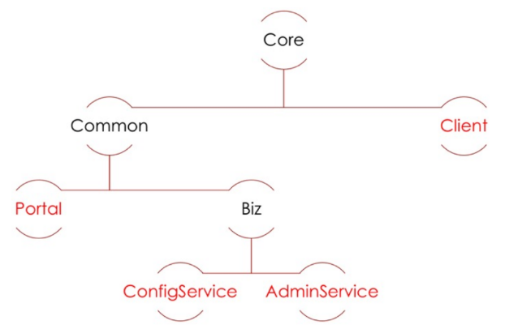
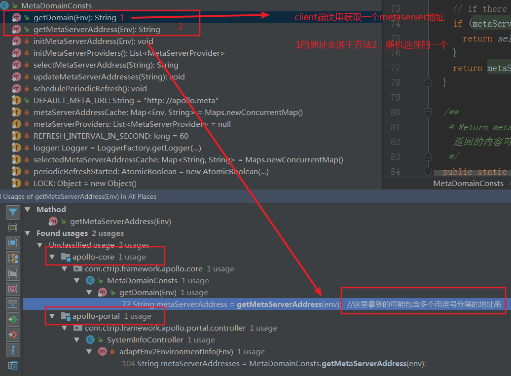
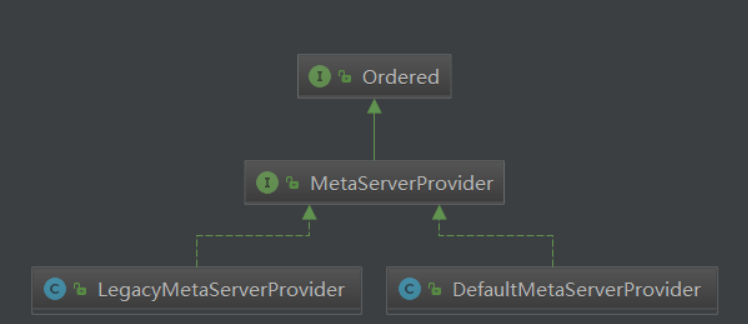
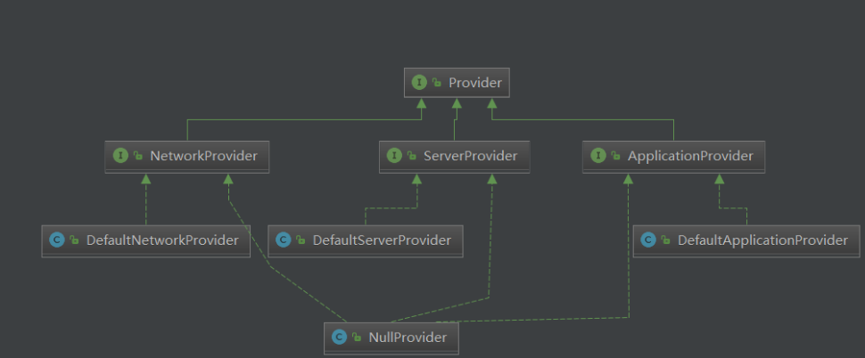
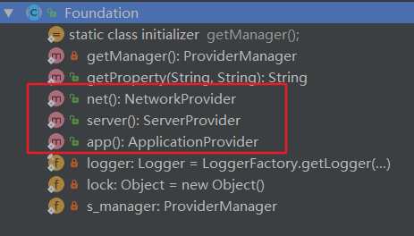
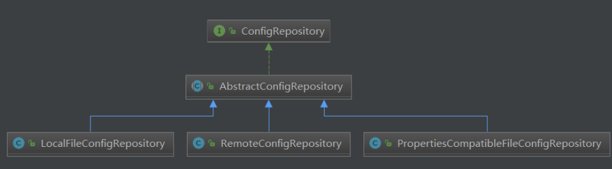
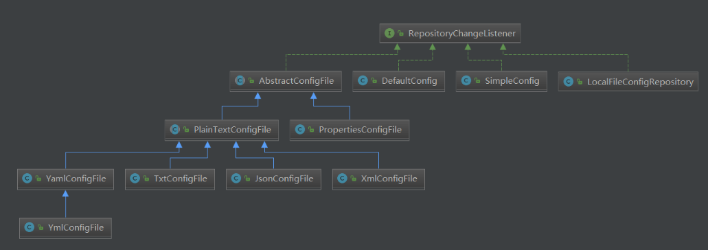
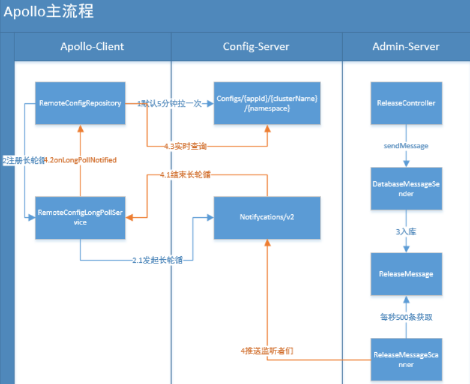

<!-- TOC -->

- [1、core包核心类[包含读取appid和metaserver地址]](#1core包核心类包含读取appid和metaserver地址)
    - [1、MetaDomainConsts提供了获取用户配置的metaserver地址](#1metadomainconsts提供了获取用户配置的metaserver地址)
    - [2、MetaServerProvider](#2metaserverprovider)
    - [3、jdk的spi加载类](#3jdk的spi加载类)
    - [4、Foundation抽象类](#4foundation抽象类)
- [2、metaserver服务](#2metaserver服务)
- [3、client](#3client)
    - [1、读取appid和metaserver配置信息](#1读取appid和metaserver配置信息)
    - [2、ConfigService使用配置服务的入口](#2configservice使用配置服务的入口)
    - [3、ConfigManager](#3configmanager)
    - [4、ConfigFactory](#4configfactory)
    - [5、ConfigRepository](#5configrepository)
        - [1、RemoteConfigRepository](#1remoteconfigrepository)
        - [2、LocalFileConfigRepository](#2localfileconfigrepository)
        - [3、PropertiesCompatibleFileConfigRepository](#3propertiescompatiblefileconfigrepository)
    - [6、RepositoryChangeListener仓库监听器](#6repositorychangelistener仓库监听器)
- [通过使用流程分析源码](#通过使用流程分析源码)
    - [RemoteConfigRepository初始化](#remoteconfigrepository初始化)
    - [LocalFileConfigRepository](#localfileconfigrepository)
- [todo](#todo)

<!-- /TOC -->


> 模块依赖图




# 1、core包核心类[包含读取appid和metaserver地址]

## 1、MetaDomainConsts提供了获取用户配置的metaserver地址



具体的解析过程交给MetaServerProvider接口的实现类去实现具体的加载，该接口采用spi机制，可以有多个实现类。同时该接口实现了order接口，可以自定义多个实现类加载顺序，order值越小，优先级越高，当从高优先级的实现类加载到地址后就不再使用低优先级实现类去加载了。

## 2、MetaServerProvider

```java
public interface MetaServerProvider extends Ordered {
//metaserver地址返回值建议是个域名，也可以使用逗号分隔多个IP
String getMetaServerAddress(Env targetEnv);
}
```

```java
public interface Ordered {
int HIGHEST_PRECEDENCE = Integer.MIN_VALUE;//最高优先级
int LOWEST_PRECEDENCE = Integer.MAX_VALUE;//最低优先级
int getOrder();//自定义优先级，越小优先级越高
}
```





有两个实现类：

- 1、DefaultMetaServerProvider：order=0，默认高优先级，在core包，portal service服务会使用metaserver找到可以使用的admin服务；[请求：metaserver域名/services/admin获取]

- 2、LegacyMetaServerProvider：order=Integer.MAX_VALUE-1，，在client包，使用client包时候按照加载这个实现类，我们接入的应该通过这个metaserver找config service服务地址；[请求：metaserver域名/services/config获取]

备注：order的值越小优先级越高，在获取的时候如果通过spi获取发现有多个实现类，只有前面高优先级的类有返回值了，后面低优先级的类就得不到执行。`因为client包继承core包，所以使用了client包会有上面两个实现类，优先从DefaultMetaServerProvider获取，如果获取不到才会继续尝试从LegacyMetaServerProvider获取`

## 3、jdk的spi加载类

原理：通过jdk的类ServiceLoader.load(xxx接口)


```java
public class ServiceBootstrap {
  //获得这个接口的第一个实现类
  public static <S> S loadFirst(Class<S> clazz) {
    Iterator<S> iterator = loadAll(clazz);
    if (!iterator.hasNext()) {
      throw new IllegalStateException(String.format(
          "No implementation defined in /META-INF/services/%s, please check whether the file exists and has the right implementation class!",
          clazz.getName()));
    }
    return iterator.next();
  }

 //核心方法:根据jdk的spi机制，加载一个接口的全部实现类
  public static <S> Iterator<S> loadAll(Class<S> clazz) {
    ServiceLoader<S> loader = ServiceLoader.load(clazz);

    return loader.iterator();
  }
  //先加载然后按照order排序
  public static <S extends Ordered> List<S> loadAllOrdered(Class<S> clazz) {
    Iterator<S> iterator = loadAll(clazz);

    if (!iterator.hasNext()) {
      throw new IllegalStateException(String.format(
          "No implementation defined in /META-INF/services/%s, please check whether the file exists and has the right implementation class!",
          clazz.getName()));
    }

    List<S> candidates = Lists.newArrayList(iterator);
    Collections.sort(candidates, new Comparator<S>() {
      @Override
      public int compare(S o1, S o2) {
        // the smaller order has higher priority
        return Integer.compare(o1.getOrder(), o2.getOrder());
      }
    });

    return candidates;
  }
  //这个是加载排序后的第一个
  public static <S extends Ordered> S loadPrimary(Class<S> clazz) {
    List<S> candidates = loadAllOrdered(clazz);

    return candidates.get(0);
  }
}

```

> 当前包下的spi接口以及默认实现


- 1、MetaServerProvider：提供如何找到配置的metaserver地址，默认实现为LegacyMetaServerProvider

- 2、MessageProducerManager：默认实现DefaultMessageProducerManager

- 3、ProviderManager：默认实现DefaultProviderManager，统一管理接口Provider的实现类



这里主要用来加载一些配置文件信息

```java
public interface ProviderManager {
  public String getProperty(String name, String defaultValue);

  public <T extends Provider> T provider(Class<T> clazz);
}
```


## 4、Foundation抽象类

全部为静态方法和属性，可以直接引用并使用，不需要实例化。这个类的功能主要用来暴露ProviderManager接口的中的方法的

对外提供如下的3个方法：



- 1、DefaultApplicationProvider：Load per-application configuration, like app id, from classpath://META-INF/app.properties[核心：加载应用的唯一标识]

- 2、DefaultNetworkProvider：Load network parameters[本机的HostAddress和HostName]

- 3、DefaultServerProvider：Load environment (fat, fws, uat, prod ...) and dc, from /opt/settings/server.properties, JVM property and/or OS environment variables.[获取环境变量env、idc等信息]


# 2、metaserver服务

在apollo-configservice包下

主要逻辑在DiscoveryService类中


有三个方法：

- 1、getConfigServiceInstances：对应client中的/services/config返回configservice服务列表，让客户端拉取配置信息以及维持http长轮询；

- 2、getAdminServiceInstances：对应portal服务中的/services/admin请求返回adminservice服务列表，让portal服务进行调用；

- 3、getMetaServiceInstances：咱们貌似没有；

实现原理：configservice和adminservice都是注册到eureka，这里直接通过eureka的客户端从注册中心获取。调用eurekaClient.getApplication（服务名），服务名包含在ServiceNameConsts类中。


```java

public interface ServiceNameConsts {

  String APOLLO_METASERVICE = "apollo-metaservice";

  String APOLLO_CONFIGSERVICE = "apollo-configservice";

  String APOLLO_ADMINSERVICE = "apollo-adminservice";

  String APOLLO_PORTAL = "apollo-portal";
}
```


# 3、client

## 1、读取appid和metaserver配置信息

client端启动读取核心配置的两个类：

- apollo-core包的类DefaultApplicationProvider读取设置的唯一标识appid

- apollo-core包的类LegacyMetaServerProvider读取meta server地址

备注：上面两个类加载配置文件均是采用spi机制实现。因此可以添加自己的类继承对应的接口来扩展自己的逻辑。


## 2、ConfigService使用配置服务的入口


内部包含两个类：

- 1、ConfigManager

- 2、ConfigRegistry

## 3、ConfigManager

```java
public interface ConfigManager {
  //根据文件名获取配置信息
  public Config getConfig(String namespace);
  //根据配置文件名称和格式获取一个对象
  public ConfigFile getConfigFile(String namespace, ConfigFileFormat configFileFormat);
}
```

默认实现类DefaultConfigManager，内部通过ConfigFactoryManager委托给接口ConfigFactory创建Config/ConfigFile对象


## 4、ConfigFactory

对应ConfigManager接口的两个方法

```java
public interface ConfigFactory {
  public Config create(String namespace);

  public ConfigFile createConfigFile(String namespace, ConfigFileFormat configFileFormat);
}

```

默认的实现类DefaultConfigFactory，包含一个ConfigUtil对象


## 5、ConfigRepository



```java
public interface ConfigRepository {
  //从仓库中获取配置
  public Properties getConfig();

  //Set the fallback repo for this repository.
  public void setUpstreamRepository(ConfigRepository upstreamConfigRepository);

  //添加监听器
  public void addChangeListener(RepositoryChangeListener listener);

  //移除监听器
  public void removeChangeListener(RepositoryChangeListener listener);

  //Return the config's source type, i.e. where is the config loaded from
  public ConfigSourceType getSourceType();
}

```

AbstractConfigRepository实现监听器的添加、移除、触发，已经定于一个抽象的数据同步方法，让子类去实现。


### 1、RemoteConfigRepository


### 2、LocalFileConfigRepository

这里会把RemoteConfigRepository仓库的内容作为自己的上游数据源，把仓库的内容同步到本地磁盘文件一份


### 3、PropertiesCompatibleFileConfigRepository


## 6、RepositoryChangeListener仓库监听器



```java
public interface RepositoryChangeListener {
  //Invoked when config repository changes.
  public void onRepositoryChange(String namespace, Properties newProperties);
}

```


ConfigUtil


ConfigServiceLocator

LocalFileConfigRepository

RemoteConfigLongPollService

RemoteConfigRepository


com.ctrip.framework.apollo.ConfigService#getAppConfig
com.ctrip.framework.apollo.internals.DefaultConfigManager#getConfig
com.ctrip.framework.apollo.spi.DefaultConfigFactory#create
com.ctrip.framework.apollo.spi.DefaultConfigFactory#createRemoteConfigRepository

RemoteConfigRepository包含核心类：

- ConfigUtil
- HttpUtil：客户端通过这个http请求从meta server获得config service服务等；
- ConfigServiceLocator：封装怎么找到meta server，然后发生请求；


1、client端如何通过配置的meta server地址找到服务的？


# 通过使用流程分析源码


```java
interface ConfigFactory {//创建配置对象和配置文件对象接口，默认实现DefaultConfigFactory
Config create(String namespace);//默认实现DefaultConfig
//基于文件格式不同构建Properties\xml\json\yaml\yam\txt对应的对象
ConfigFile createConfigFile(String namespace, ConfigFileFormat configFileFormat);
}
```

ConfigFile和Config构建的必须参数namespace（名称）和ConfigRepository（数据来源）


- 1、ConfigService.getConfig(namesapce)
- 2、DefaultConfigManager#getConfig(namesapce)创建configFile\Config并缓存（维护namespace和configFile\Config映射）
  - 2.1、获取配置工厂：DefaultConfigFactoryManager#getFactory(namesapce)（从ConfigRegistry注册管理或者本地缓存创建的DefaultConfigFactory）
  - 2.2、ConfigFactory功能：创建configFile\Config（ConfigFactoryManager维护namespace和ConfigFactory映射）
  - 2.3、通过ConfigFactory创建Config对象，获取ConfigFile类似；（在这里实例化仓库对象，比如new RemoteConfigRepository(namespace)）

备注：

- 1、每一个namespace一一对应一个configFile\Config、一个ConfigFactory、一个RemoteConfigRepository；
- 2、设计方面：工厂模式创建对象、每一层都有一个对应的manager缓存


> 问题

- 1、如何从远端拉取数据并更新的流程；
- 2、本地缓存文件；
- 3、长轮训机制；
- 4、spring整合时数据属性更新问题；
- 5、直接HTTP方式访问的区别；

## RemoteConfigRepository初始化


在初始化构造函数的时候会去远端拉取配置信息并更新到本地；


this.trySync(); //抽象类中的方法，对应模板方法sync()--->loadApolloConfig()
this.schedulePeriodicRefresh();//定时刷新，也是调用trySync()
this.scheduleLongPollingRefresh();//长轮询刷新，最后还是调用trySync()


配置内容的统一抽象：
```java
public class ApolloConfig {
  private String appId;//唯一标识
  private String cluster;//默认default
  private String namespaceName;//配置文件的名称
  private Map<String, String> configurations;//key-value键值对，如果是文本文件则会存在一个content的key，value是文本对应的字符串
  private String releaseKey;//版本
```


url格式：

http://10.181.163.3:80/configs/apollo-test/default/application.yaml?ip=10.12.223.239&messages=%7B%22details%22%3A%7B%22apollo-test%2Bdefault%2Bapplication.yaml%22%3A413%7D%7D&releaseKey=20200923105324-0d93bc58cc899b0a


http://10.181.163.3:80/configs/apollo-test/default/application?ip=10.12.223.239


当仓库从远端通过HTTP拉取过了的信息会封装成ApolloConfig对象。后面会把ApolloConfig中的Map<String, String> configurations转换为Properties向下传递。

在仓库层通过原子引用AtomicReference<ApolloConfig>缓存，在配置对象config层通过原子引用AtomicReference<Properties>缓存，每一层都会把本地缓存和通过HTTP拉下下来最新的数据对比，只有发现不一致的时候才会下发数据（调用对应的监听器实现）


数据流向：

ConfigRepository中数据有更新会触发注册到其上的监听器RepositoryChangeListener，一般这个监听器的实现类是config/cofigfile的实现类，完成第一层数据的下发（仓库到配置对象）；在config/cofigfile中也可以添加对应配置对象变化的监听器，这里的监听器是开放给用户来使用的，如果有数据跟新会在这里进行第二层的数据下发（配置对象到用户的代码）


## LocalFileConfigRepository


- this.setLocalCacheDir(findLocalCacheDir(), false);
- this.setUpstreamRepository(upstream);
- this.trySync();


# todo

client启动过程

1、加载client端的配置，获得meta server的地址缓存到对象MetaDomainConsts中，并获取configservice的地址缓存到对象ConfigServiceLocator中。

ConfigServiceLocator的加载流程。

com.ctrip.framework.apollo.internals.ConfigServiceLocator#ConfigServiceLocator 构造函数，在构造函数，包含下面两步
	1、com.ctrip.framework.apollo.internals.ConfigServiceLocator#m_configUtil 初始化ConfigUtil实例

	2、com.ctrip.framework.apollo.internals.ConfigServiceLocator#initConfigServices
		2.1、com.ctrip.framework.apollo.internals.ConfigServiceLocator#getCustomizedConfigService  本地直接设置configservice地址
		2.2、com.ctrip.framework.apollo.internals.ConfigServiceLocator#tryUpdateConfigServices    上一步失败，从meta中获得地址
			2.2.1、com.ctrip.framework.apollo.internals.ConfigServiceLocator#updateConfigServices
				2.2.1.1、com.ctrip.framework.apollo.internals.ConfigServiceLocator#assembleMetaServiceUrl  获得meta service地址【client端的配置中】
					（1）com.ctrip.framework.apollo.util.ConfigUtil#getMetaServerDomainName
						com.ctrip.framework.apollo.core.MetaDomainConsts#getDomain
						com.ctrip.framework.apollo.core.MetaDomainConsts#getMetaServerAddress
						com.ctrip.framework.apollo.core.MetaDomainConsts#initMetaServerAddress
						com.ctrip.framework.apollo.core.MetaDomainConsts#initMetaServerProviders
							com.ctrip.framework.apollo.core.spi.MetaServerProvider 通过spi机制加载接口的实现类
								com.ctrip.framework.apollo.internals.DefaultMetaServerProvider 【默认实现】
									com.ctrip.framework.apollo.internals.DefaultMetaServerProvider#DefaultMetaServerProvider 构造函数包含initMetaServerAddress，加载meta server配置。
					（2）com.ctrip.framework.apollo.util.ConfigUtil#getAppId   获得配置的唯一标识appid
							com.ctrip.framework.foundation.Foundation#app  通过spi机制加载接口com.ctrip.framework.foundation.spi.provider.ApplicationProvider的实现类，唯一实现为DefaultApplicationProvider	 【说明：在类com.ctrip.framework.foundation.Foundation被第一次使用的时候，会调用这个抽象类的静态代码块，调用getManager()方法，其中会根据spi机制加载com.ctrip.framework.foundation.spi.ProviderManager的默认实现com.ctrip.framework.foundation.internals.DefaultProviderManager方法，在DefaultProviderManager的构造函数中，实例化接口com.ctrip.framework.foundation.spi.provider.Provider的三个实现类:DefaultApplicationProvider[com.ctrip.framework.foundation.spi.provider.ApplicationProvider]\DefaultNetworkProvider[com.ctrip.framework.foundation.spi.provider.NetworkProvider]\DefaultServerProvider[com.ctrip.framework.foundation.spi.provider.ServerProvider]】	
								com.ctrip.framework.foundation.internals.provider.DefaultApplicationProvider#getAppId 	获得appid	
				2.2.1.2、发送请求到 Meta Service获取configservice服务列表的地址封装成ServiceDTO对象，存入本地缓存
				2.2.1.3、com.ctrip.framework.apollo.internals.ConfigServiceLocator#logConfigService的作用？？？


		2.3、com.ctrip.framework.apollo.internals.ConfigServiceLocator#schedulePeriodicRefresh   创建定时任务，调用2.2


client端获得config对象的过程：

com.ctrip.framework.apollo.ConfigService#getAppConfig
com.ctrip.framework.apollo.ConfigService#getConfig
com.ctrip.framework.apollo.ConfigService#getManager 
	1、com.ctrip.framework.apollo.build.ApolloInjector#getInstance(java.lang.Class<T>)   返回DefaultConfigManager对象
		com.ctrip.framework.apollo.internals.DefaultInjector#getInstance(java.lang.Class<T>)
			com.ctrip.framework.apollo.internals.DefaultInjector#DefaultInjector  构造函数构建了一个Google的Guice容器存放bean对象。
	2、com.ctrip.framework.apollo.internals.DefaultConfigManager#getConfig 根据配置文件的名称namespace获得config对象
		如果第一次调用需要进行初始化
			2.1、com.ctrip.framework.apollo.spi.DefaultConfigFactoryManager#getFactory  返回的是类ConfigFactory
					com.ctrip.framework.apollo.spi.DefaultConfigFactory获得默认的配置
			2.2、com.ctrip.framework.apollo.spi.DefaultConfigFactory#create   返回值config对象
					2.2.0、create函数需要参数ConfigRepository，调用下面的函数进行构造
						com.ctrip.framework.apollo.spi.DefaultConfigFactory#createLocalConfigRepository
							com.ctrip.framework.apollo.internals.LocalFileConfigRepository#LocalFileConfigRepository(java.lang.String, com.ctrip.framework.apollo.internals.ConfigRepository)
								第二个参数通过函数com.ctrip.framework.apollo.spi.DefaultConfigFactory#createRemoteConfigRepository来进行创建
									com.ctrip.framework.apollo.internals.RemoteConfigRepository#RemoteConfigRepository构造函数进行创建，在这个构造函中会初始化几个变量：ConfigUtil，HttpUtil，ConfigServiceLocator，RemoteConfigLongPollService，几个函数
									trySync()，schedulePeriodicRefresh()、scheduleLongPollingRefresh()
									2.2.0.1、com.ctrip.framework.apollo.internals.AbstractConfigRepository#trySync
										com.ctrip.framework.apollo.internals.RemoteConfigRepository#sync   拉取远端的配置同步到本地
											com.ctrip.framework.apollo.internals.RemoteConfigRepository#loadApolloConfig 拉取远程的配置服务
												com.ctrip.framework.apollo.internals.AbstractConfigRepository#fireRepositoryChange 触发监听器RepositoryChangeListener列表


					2.2.1、com.ctrip.framework.apollo.internals.DefaultConfig#DefaultConfig   构建DefaultConfig对象
					在构造函数调用 ，加载本地配置文件


DefaultConfigManager实例化的过程

com.ctrip.framework.apollo.internals.DefaultConfigManager#DefaultConfigManager 构造函数
	com.ctrip.framework.apollo.build.ApolloInjector#getInstance(java.lang.Class<T>)  根据ConfigFactoryManager类型获得默认的实现com.ctrip.framework.apollo.spi.DefaultConfigFactoryManager   在ApolloInjector中配置了默认实现
		com.ctrip.framework.apollo.spi.DefaultConfigFactoryManager#DefaultConfigFactoryManager  在这个默认的实现的构造函数内调用ApolloInjector.getInstance(ConfigRegistry.class) 获得默认私下com.ctrip.framework.apollo.spi.DefaultConfigRegistry


核心类：
com.ctrip.framework.apollo.internals.RemoteConfigRepository


问题：

从远端获取到的配置如何更新到内存中去的？


com.ctrip.framework.apollo.core.spi.MetaServerProvider接口：

com.ctrip.framework.apollo.core.internals.LegacyMetaServerProvider类为core包下spi实现
com.ctrip.framework.apollo.internals.DefaultMetaServerProvider是client包下的spi实现
默认两个类都会进行实例化。


长轮询的机制？原理？


1、在apollo配置中心新建了appid但是没有发布application，这个时候client端会出现remote获取不到，多次尝试，依旧失败后会从本地缓存文件拉取。
默认的application必须发布。


这个是spring项目，通过在bean上添加${}来实现，属性值的自动更新。

属性的自动更新【com.ctrip.framework.apollo.spring.config.PropertySourcesProcessor】

com.ctrip.framework.apollo.spring.config.PropertySourcesProcessor#postProcessBeanFactory
	1、com.ctrip.framework.apollo.spring.config.PropertySourcesProcessor#initializePropertySources 读取到配置的多个文件名称，调用Config config = ConfigService.getConfig(namespace)获得各个文件对应配置信息。
	2、com.ctrip.framework.apollo.spring.config.PropertySourcesProcessor#initializeAutoUpdatePropertiesFeature 自动更新功能,实现 Spring Placeholder 的自动更新功能
		构建对象com.ctrip.framework.apollo.spring.property.AutoUpdateConfigChangeListener，添加到com.ctrip.framework.apollo.spring.config.ConfigPropertySource#addChangeListener中，然后再属性更新的时候，会调用com.ctrip.framework.apollo.spring.property.AutoUpdateConfigChangeListener#onChange，然后调用com.ctrip.framework.apollo.spring.property.AutoUpdateConfigChangeListener#updateSpringValue
		【日志:Auto update apollo changed value successfully, new value: 800, key: timeout, beanName: annotatedBean, method: com.ctrip.framework.apollo.demo.spring.common.bean.AnnotatedBean.setTimeout】


com.ctrip.framework.apollo.spring.spi.DefaultApolloConfigRegistrarHelper 在这里解析注解指定的各个配置文件的名称，然后设置到com.ctrip.framework.apollo.spring.config.PropertySourcesProcessor#NAMESPACE_NAMES中


然后通过BeanDefinitionRegistry注册bean

PropertySourcesPlaceholderConfigurer
PropertySourcesProcessor      		
ApolloAnnotationProcessor			ApolloConfig注解
SpringValueProcessor                带有 @Value 注解的 Field 和 Method和XML 配置的 Bean 的 PlaceHolder 们
SpringValueDefinitionProcessor		处理 Spring XML PlaceHolder ，解析成 StringValueDefinition 集合
ApolloJsonValueProcessor      		对应注解ApolloJsonValue的解析


@Retention(RetentionPolicy.RUNTIME)
@Target(ElementType.TYPE)
@Documented
@Import(ApolloConfigRegistrar.class)
public @interface EnableApolloConfig {
	
} 


com.ctrip.framework.apollo.spring.annotation.ApolloConfigRegistrar实现org.springframework.context.annotation.ImportBeanDefinitionRegistrar，可以实现动态注入bean对象。这里注入的bean就是上面哪几类注解bean【自定义的apollo注解】


【todo   spring属性的加载顺序】
在这个类中把环境设置的配置属性
com.ctrip.framework.apollo.spring.boot.ApolloApplicationContextInitializer


System.setProperty(propertyName, propertyValue);


springboot的应用可以开启

apollo.bootstrap.enabled=true


架构原理


https://blog.csdn.net/shang_xs/article/details/88966455


ReleaseMessageScanner   类在启动的时候开启了定时扫描，根据用户发布信息的时候把数据存入MySQL来实现和数据库解耦，configserver通过定期扫描一个表来实现通知客户端的。


SpringBoot 发布ApplicationEventPublisher和监听ApplicationEvent事件

com.ctrip.framework.apollo.portal.listener.AppCreationEvent

借助于spring的事件发布的代码。





简要流程说明：一个 Namespace 对应一个 RemoteConfigRepository 。多个 RemoteConfigRepository ，注册到全局唯一的 RemoteConfigLongPollService 中


- 1、Client初始化后每5分钟定时向Config-Service同步配置；

- 2、同时向RemoteConfigLongPollService 注册长轮循，向Config-Service发起长轮循（长轮循参考）

- 3、用户更新发布配置后通知Admin-Service（入库）

- 4、Admin-Service每秒500条获取更新配置，推送Config-Serivce（监听者们），监听者设置第2步的返回值结束长轮循，Client接收到通知实时查询Config-Serivce变更的配置，放入内存


> 各个部分的角色


- RemoteConfigRepository：远程Repository，实现从ConfigService拉取配置，并缓存，支持实时，定时

- ConfigController：configs/{appId}/{clusterName}/{namespace}：提供配置读取功能

- RemoteConfigLongPollService：远程配置长轮循服务，负责长轮循ConfigServer变更通知，当有更新时立即轮循触发更新

- NotificationControllerV2：notifications/v2：实现长轮循，监听配置变更、返回，结束长轮循

- DatabaseMessageSender：变更配置入库，清理

- ReleaseMessageScanner：扫描变更配置，触发监听者们
