<!-- TOC -->

- [1、Features](#1features)
- [2、总体设计](#2总体设计)
    - [1、基础模型](#1基础模型)
    - [2、架构模块](#2架构模块)
    - [3、E-R Diagram](#3e-r-diagram)
        - [1、主体E-R Diagram](#1主体e-r-diagram)
        - [2、权限相关E-R Diagram](#2权限相关e-r-diagram)
- [3、服务端设计](#3服务端设计)
        - [1、发送ReleaseMessage的实现方式](#1发送releasemessage的实现方式)
        - [2、Config Service通知客户端的实现方式](#2config-service通知客户端的实现方式)
- [4、客户端设计](#4客户端设计)
- [5、可用性考虑](#5可用性考虑)
- [6、基础概念](#6基础概念)
    - [1、Namespace](#1namespace)
- [9、apollo架构迭代](#9apollo架构迭代)
    - [v1](#v1)
    - [V2](#v2)
    - [V3](#v3)
    - [V4](#v4)
- [参考](#参考)

<!-- /TOC -->


# 1、Features

- 1、统一管理不同环境、不同集群的配置
- 2、配置修改实时生效（热发布）
- 3、版本发布管理
- 4、灰度发布
- 5、权限管理、发布审核、操作审计
- 6、客户端配置信息监控
- 7、部署简单


# 2、总体设计

部署的时候需要依次启动三个服务：Config Service（包含meta service服务和eureka服务）、Admin Service、Portal服务。

## 1、基础模型

> 流程

- 1、用户在配置中心对配置进行修改并发布
- 2、配置中心通知Apollo客户端有配置更新
- 3、Apollo客户端从配置中心拉取最新的配置、更新本地配置并通知到应用

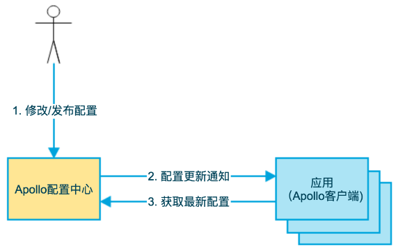

## 2、架构模块

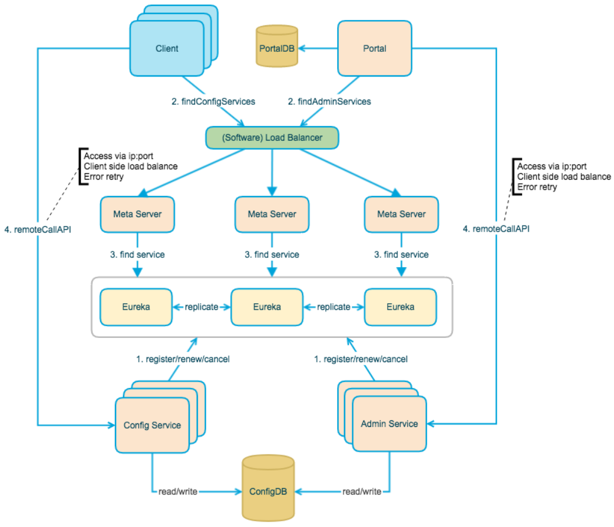


上图简要描述了Apollo的总体设计，我们可以从下往上看（`四个核心模块`）：

- Config Service提供配置的读取、推送（基于Http long polling）等功能，服务对象是Apollo客户端

- Admin Service提供配置的修改、发布等功能，服务对象是Apollo Portal（管理界面）

- Client通过域名访问Meta Server获取Config Service服务列表（IP+Port），而后直接通过IP+Port访问服务，同时在Client侧会做load balance、错误重试

- Portal通过域名访问Meta Server获取Admin Service服务列表（IP+Port），而后直接通过IP+Port访问服务，同时在Portal侧会做load balance、错误重试


> 备注：

- Config Service和Admin Service都是多实例、无状态部署，所以需要将自己注册到Eureka中并保持心跳

- 在Eureka之上我们架了一层Meta Server用于封装Eureka的服务发现接口

- 为了简化部署，我们实际上会把Config Service、Eureka和Meta Server三个逻辑角色部署在同一个JVM进程中

- Meta Server从Eureka获取Config Service和Admin Service的服务信息，相当于是一个Eureka Client，Meta Server只是一个逻辑角色，在部署时和Config Service是在一个JVM进程中的，所以IP、端口和Config Service一致

- 增设一个Meta Server的角色主要是为了封装服务发现的细节，对Portal和Client而言，永远通过一个Http接口获取Admin Service和Config Service的服务信息，而不需要关心背后实际的服务注册和发现组件


## 3、E-R Diagram

### 1、主体E-R Diagram

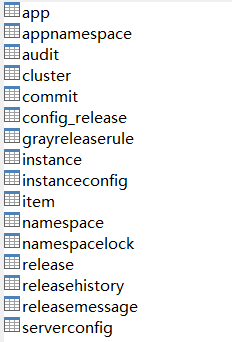

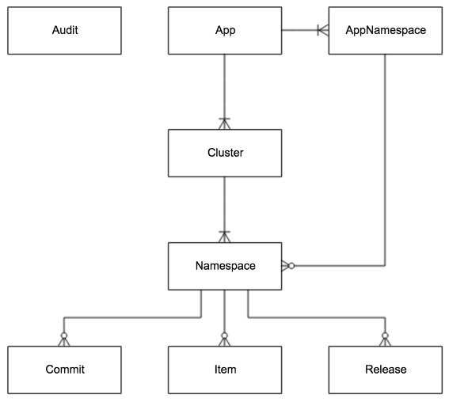

- App：App信息

- AppNamespace：App下Namespace的元信息

- Cluster：集群信息

- Namespace：集群下的namespace

- Item：Namespace的配置，每个Item是一个key, value组合

- Release：Namespace发布的配置，每个发布包含发布时该Namespace的所有配置

- Commit：Namespace下的配置更改记录

- Audit：审计信息，记录用户在何时使用何种方式操作了哪个实体。


### 2、权限相关E-R Diagram

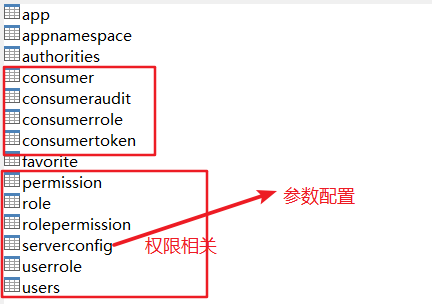

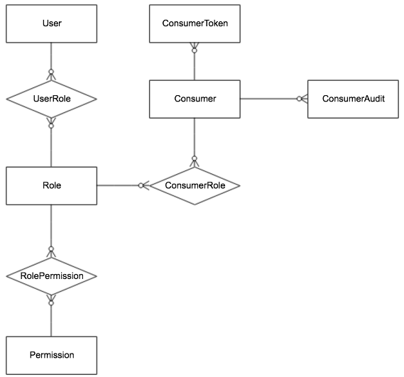

- User：Apollo portal用户

- UserRole：用户和角色的关系

- Role：角色

- RolePermission：角色和权限的关系

- Permission：权限；对应到具体的实体资源和操作，如修改NamespaceA的配置，发布NamespaceB的配置等。

- Consumer：第三方应用

- ConsumerToken：发给第三方应用的token

- ConsumerRole：第三方应用和角色的关系

- ConsumerAudit：第三方应用访问审计


# 3、服务端设计


> 配置发布后的实时推送设计

在配置中心中，一个重要的功能就是配置发布后实时推送到客户端。下面我们简要看一下这块是怎么设计实现的。

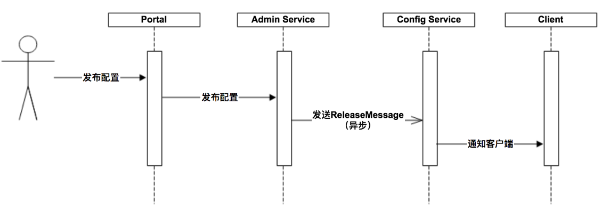

上图简要描述了配置发布的大致过程：

- 1、用户在Portal操作配置发布
- 2、Portal调用Admin Service的接口操作发布
- 3、Admin Service发布配置后，发送ReleaseMessage（通过公用数据库实现）给各个Config Service
- 4、Config Service收到ReleaseMessage后，通知对应的客户端

备注：`Config Service是如何接收Admin Service发布ReleaseMessage变化的？定时扫描表`

### 1、发送ReleaseMessage的实现方式

Admin Service在配置发布后，需要通知所有的Config Service有配置发布，从而Config Service可以通知对应的客户端来拉取最新的配置。

从概念上来看，这是一个典型的消息使用场景，Admin Service作为producer发出消息，各个Config Service作为consumer消费消息。通过一个消息组件（Message Queue）就能很好的实现Admin Service和Config Service的解耦。

在实现上，考虑到Apollo的实际使用场景，以及为了尽可能减少外部依赖，我们没有采用外部的消息中间件，而是`通过数据库实现了一个简单的消息队列`。

实现方式如下：

- 1、Admin Service在配置发布后会往ReleaseMessage表插入一条消息记录，消息内容就是配置发布的AppId+Cluster+Namespace，参见DatabaseMessageSender

- 2、Config Service有一个线程会每秒扫描一次ReleaseMessage表，看看是否有新的消息记录，参见ReleaseMessageScanner

- 3、Config Service如果发现有新的消息记录，那么就会通知到所有的消息监听器（ReleaseMessageListener），如NotificationControllerV2，消息监听器的注册过程参见ConfigServiceAutoConfiguration

- 4、NotificationControllerV2得到配置发布的AppId+Cluster+Namespace后，会通知对应的客户端

示意图如下：

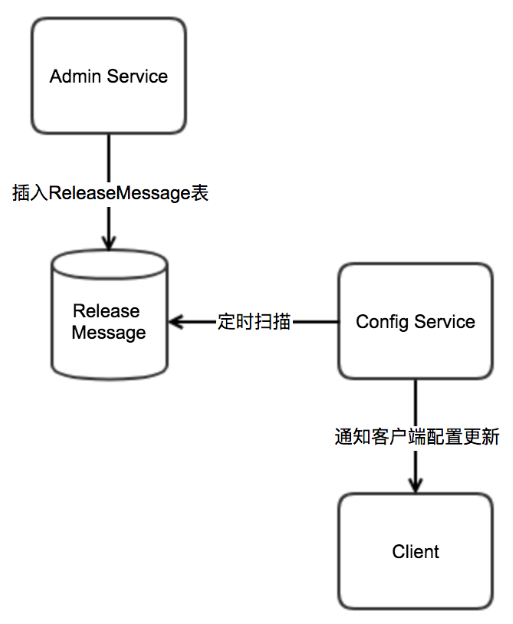


[问题：如果启动多个configservice如何保证只有一个实例在处理？多个实例同时处理不会影响]

```sql
CREATE TABLE `releasemessage` (
  `Id` int(11) unsigned NOT NULL AUTO_INCREMENT COMMENT '自增主键',
  `Message` varchar(1024) NOT NULL DEFAULT '' COMMENT '发布的消息内容',
  `DataChange_LastTime` timestamp NOT NULL DEFAULT CURRENT_TIMESTAMP ON UPDATE CURRENT_TIMESTAMP COMMENT '最后修改时间',
  PRIMARY KEY (`Id`),
  KEY `DataChange_LastTime` (`DataChange_LastTime`),
  KEY `IX_Message` (`Message`(191))
) ENGINE=InnoDB AUTO_INCREMENT=13 DEFAULT CHARSET=utf8mb4 COMMENT='发布消息';

```

每个configservice处理一个批次后记录已经处理的最大id。每一个客户端实例在启动的时候会链接到configservice集群中的某一个，并注册自己的监听事件，当有配置变更的时候每configservice就可以分别通知client了。


### 2、Config Service通知客户端的实现方式

上简要描述了NotificationControllerV2是如何得知有配置发布的，那NotificationControllerV2在得知有配置发布后是如何通知到客户端的呢？

实现方式如下：

- 1、客户端会发起一个Http请求到Config Service的notifications/v2接口，也就是NotificationControllerV2，参见RemoteConfigLongPollService

- 2、NotificationControllerV2不会立即返回结果，而是通过Spring DeferredResult把请求挂起

- 3、如果在60秒内没有该客户端关心的配置发布，那么会返回Http状态码304给客户端

- 4、如果有该客户端关心的配置发布，NotificationControllerV2会调用DeferredResult的setResult方法，传入有配置变化的namespace信息，同时该请求会立即返回。客户端从返回的结果中获取到配置变化的namespace后，会立即请求Config Service获取该namespace的最新配置。


# 4、客户端设计

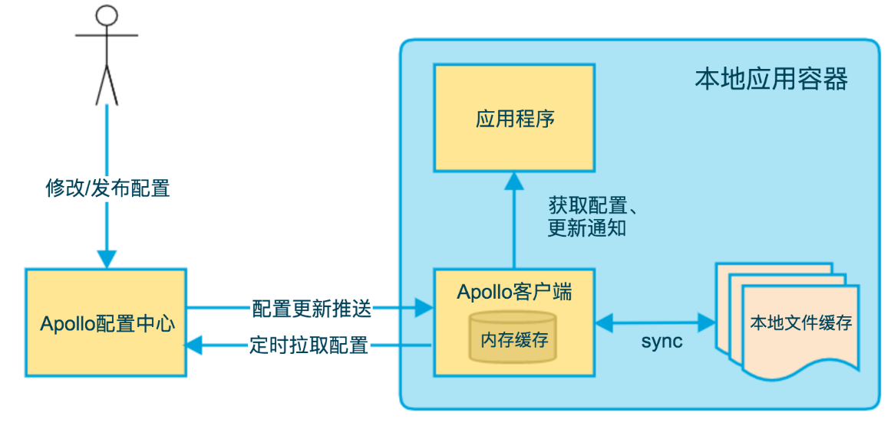

上图简要描述了Apollo客户端的实现原理：

- 1、客户端和服务端保持了一个长连接，从而能第一时间获得配置更新的推送。（通过Http Long Polling实现）

- 2、客户端还会定时从Apollo配置中心服务端拉取应用的最新配置。
    - 1、这是一个fallback机制，为了防止推送机制失效导致配置不更新
    - 2、客户端定时拉取会上报本地版本，所以一般情况下，对于定时拉取的操作，服务端都会返回304 - Not Modified
    - 3、定时频率默认为每5分钟拉取一次，客户端也可以通过在运行时指定System Property: apollo.refreshInterval来覆盖，单位为分钟。

- 3、客户端从Apollo配置中心服务端获取到应用的最新配置后，会保存在内存中

- 4、客户端会把从服务端获取到的配置在本地文件系统缓存一份，在遇到服务不可用，或网络不通的时候，依然能从本地恢复配置

- 5、应用程序可以从Apollo客户端获取最新的配置、订阅配置更新通知


> 和Spring集成的原理

Apollo除了支持API方式获取配置，也支持和Spring/Spring Boot集成，集成原理简述如下。

Spring从3.1版本开始增加了ConfigurableEnvironment和PropertySource：

- ConfigurableEnvironment:Spring的ApplicationContext会包含一个Environment（实现ConfigurableEnvironment接口）;ConfigurableEnvironment自身包含了很多个PropertySource

- PropertySource:属性源。可以理解为很多个Key - Value的属性配置

在运行时的结构形如：

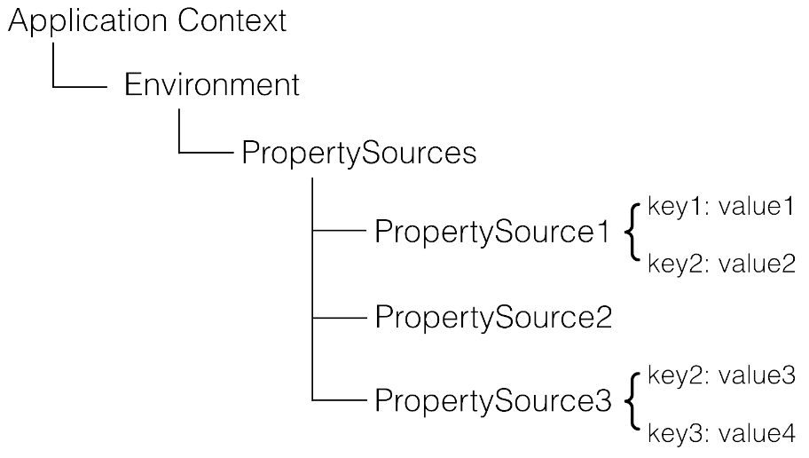


需要注意的是，PropertySource之间是有优先级顺序的，如果有一个Key在多个property source中都存在，那么在前面的property source优先。

所以对上图的例子：

- env.getProperty(“key1”) -> value1
- env.getProperty(“key2”) -> value2
- env.getProperty(“key3”) -> value4

在理解了上述原理后，Apollo和Spring/Spring Boot集成的手段就呼之欲出了：在应用启动阶段，Apollo从远端获取配置，然后组装成PropertySource并插入到第一个即可，如下图所示：

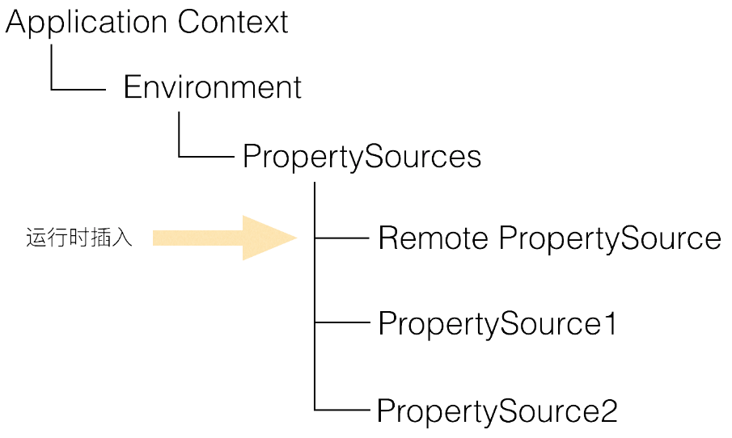

相关代码可以参考

[PropertySourcesProcessor](https://github.com/ctripcorp/apollo/blob/master/apollo-client/src/main/java/com/ctrip/framework/apollo/spring/config/PropertySourcesProcessor.java)


# 5、可用性考虑

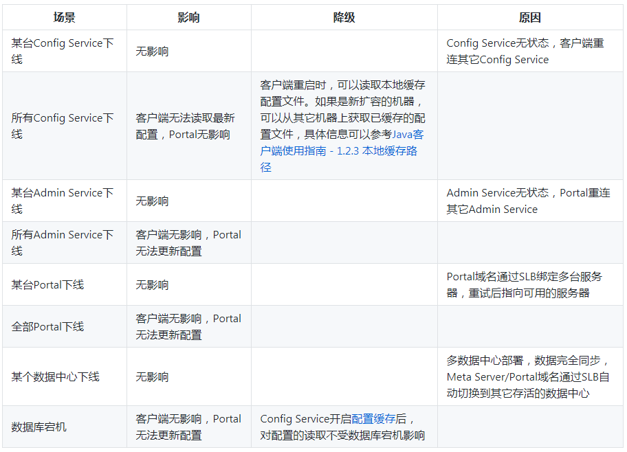

# 6、基础概念

## 1、Namespace

> 1.什么是Namespace?

Namespace是配置项的集合，类似于一个配置文件的概念。

> 2.什么是“application”的Namespace？

Apollo在创建项目的时候，都会默认创建一个“application”的Namespace。顾名思义，“application”是给应用自身使用的，熟悉Spring Boot的同学都知道，Spring Boot项目都有一个默认配置文件application.yml。在这里application.yml就等同于“application”的Namespace。对于90%的应用来说，“application”的Namespace已经满足日常配置使用场景了。

客户端获取“application” Namespace的代码如下：Config config = ConfigService.getAppConfig();

客户端获取非“application” Namespace的代码如下：Config config = ConfigService.getConfig(namespaceName);

> 3.Namespace的格式有哪些？

配置文件有多种格式，例如：properties、xml、yml、yaml、json等。同样Namespace也具有这些格式。在Portal UI中可以看到“application”的Namespace上有一个“properties”标签，表明“application”是properties格式的。

注1：非properties格式的namespace，在客户端使用时需要调用ConfigService.getConfigFile(String namespace, ConfigFileFormat configFileFormat)来获取，如果使用Http接口直接调用时，对应的namespace参数需要传入namespace的名字加上后缀名，如datasources.json。

注2：apollo-client 1.3.0版本开始对yaml/yml做了更好的支持，使用起来和properties格式一致：Config config = ConfigService.getConfig("application.yml");，Spring的注入方式也和properties一致。


> 4、Namespace的类型

Namespace类型有三种：

- 1、私有类型
- 2、公共类型
- 3、关联类型（继承类型）


# 9、apollo架构迭代

## v1

如果不考虑分布式微服务架构中的服务发现问题，Apollo的最简架构如下图所示：

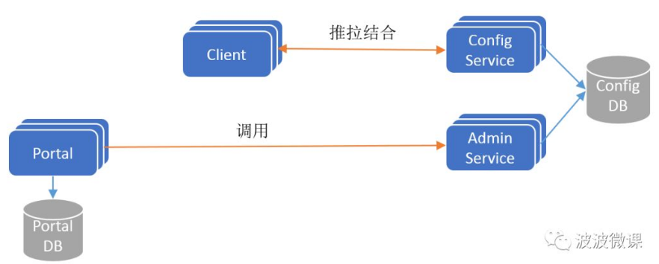

要点：

- ConfigService是一个独立的微服务，服务于Client进行配置获取。

- Client和ConfigService保持长连接，通过一种推拉结合(push & pull)的模式，在实现配置实时更新的同时，保证配置更新不丢失。

- AdminService是一个独立的微服务，服务于Portal进行配置管理。Portal通过调用AdminService进行配置管理和发布。

- ConfigService和AdminService共享ConfigDB，ConfigDB中存放项目在某个环境中的配置信息。ConfigService/AdminService/ConfigDB三者在每个环境(DEV/FAT/UAT/PRO)中都要部署一份。

- Protal有一个独立的PortalDB，存放用户权限、项目和配置的元数据信息。Protal只需部署一份，它可以管理多套环境。


## V2

为了保证高可用，ConfigService和AdminService都是无状态以集群方式部署的，这个时候就存在一个服务发现问题：Client怎么找到ConfigService？Portal怎么找到AdminService？为了解决这个问题，Apollo在其架构中引入了Eureka服务注册中心组件，实现微服务间的服务注册和发现，更新后的架构如下图所示：

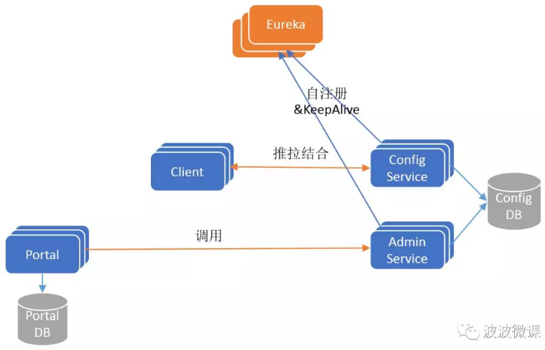

我们知道Eureka是自带服务发现的Java客户端的，如果Apollo只支持Java客户端接入，不支持其它语言客户端接入的话，那么Client和Portal只需要引入Eureka的Java客户端，就可以实现服务发现功能。发现目标服务后，通过客户端软负载(SLB，例如Ribbon)就可以路由到目标服务实例。这是一个经典的微服务架构，基于Eureka实现服务注册发现+客户端Ribbon配合实现软路由，如下图所示：

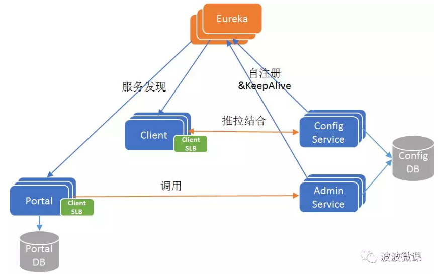

要点：

- Config/AdminService启动后都会注册到Eureka服务注册中心，并定期发送保活心跳。

- Eureka采用集群方式部署，使用分布式一致性协议保证每个实例的状态最终一致。

## V3

在携程，应用场景不仅有Java，还有很多遗留的.Net应用。Apollo的作者也考虑到开源到社区以后，很多客户应用是非Java的。但是Eureka(包括Ribbon软负载)原生仅支持Java客户端，如果要为多语言开发Eureka/Ribbon客户端，这个工作量很大也不可控。为此，Apollo的作者引入了MetaServer这个角色，它其实是一个Eureka的Proxy，将Eureka的服务发现接口以更简单明确的HTTP接口的形式暴露出来，方便Client/Protal通过简单的HTTPClient就可以查询到Config/AdminService的地址列表。获取到服务实例地址列表之后，再以简单的客户端软负载(Client SLB)策略路由定位到目标实例，并发起调用。

现在还有一个问题，MetaServer本身也是无状态以集群方式部署的，那么Client/Protal该如何发现MetaServer呢？一种传统的做法是借助硬件或者软件负载均衡器，例如在携程采用的是扩展后的NginxLB（也称Software Load Balancer），由运维为MetaServer集群配置一个域名，指向NginxLB集群，NginxLB再对MetaServer进行负载均衡和流量转发。Client/Portal通过域名+NginxLB间接访问MetaServer集群。

引入MetaServer和NginxLB之后的架构如下图所示：

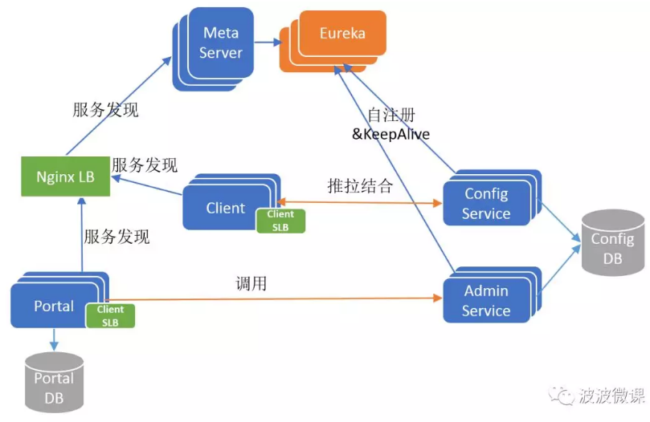


## V4

V3版本已经是比较完整的Apollo架构全貌，现在还剩下最后一个环节：Portal也是无状态以集群方式部署的，用户如何发现和访问Portal？答案也是简单的传统做法，用户通过域名+NginxLB间接访问Portal集群。

包括用户端的最终的Apollo架构全貌，如下图所示：


> 总结

ConfgService/AdminService/Client/Portal是Apollo的四个核心微服务模块，相互协作完成配置中心业务功能，Eureka/MetaServer/NginxLB是辅助微服务之间进行服务发现的模块。

Apollo采用微服务架构设计，架构和部署都有一些复杂，但是每个服务职责单一，易于扩展。另外，Apollo只需要一套Portal就可以集中管理多套环境(DEV/FAT/UAT/PRO)中的配置，这个是它的架构的一大亮点。

服务发现是微服务架构的基础，在Apollo的微服务架构中，既采用Eureka注册中心式的服务发现，也采用NginxLB集中Proxy式的服务发现。


# 参考

- [apollo源码](https://github.com/ctripcorp/apollo)

- [携程Apollo配置中心架构剖析](https://mp.weixin.qq.com/s/-hUaQPzfsl9Lm3IqQW3VDQ)

- [Apollo核心概念之“Namespace”](https://github.com/ctripcorp/apollo/wiki/Apollo%E6%A0%B8%E5%BF%83%E6%A6%82%E5%BF%B5%E4%B9%8B%E2%80%9CNamespace%E2%80%9D)

- [Apollo使用指南](https://github.com/ctripcorp/apollo/wiki/Apollo%E4%BD%BF%E7%94%A8%E6%8C%87%E5%8D%97)


