<!-- TOC -->

- [1、服务注册与服务发现解决的问题](#1服务注册与服务发现解决的问题)
    - [1、架构剖析](#1架构剖析)
    - [2、部署](#2部署)
        - [1、Eureka 集群部署](#1eureka-集群部署)
- [2、Eureka Server设计精妙的注册表存储结构](#2eureka-server设计精妙的注册表存储结构)
    - [1、注册](#1注册)
    - [2、Eureka集群各节点的数据同步](#2eureka集群各节点的数据同步)
    - [3、Eureka自我保护机制](#3eureka自我保护机制)
    - [4、Eureka健康检查](#4eureka健康检查)
- [3、Eureka Server端优秀的多级缓存机制](#3eureka-server端优秀的多级缓存机制)
    - [3.1、在拉取注册表的时候](#31在拉取注册表的时候)
    - [3.2、在注册表发生变更的时候](#32在注册表发生变更的时候)
    - [3.3、多级缓存机制的优点是什么？](#33多级缓存机制的优点是什么)
- [4、微服务注册中心的读写锁优化](#4微服务注册中心的读写锁优化)
- [5、总结](#5总结)

<!-- /TOC -->

服务注册与服务发现是微服务架构的核心功能，Eureka 则是 Spring Cloud 中负责服务注册与服务发现的组件，在学习 Eureka 之前，你需要了解什么是服务注册？什么是服务发现？只有了解了服务注册与服务发现的原理才能更好地理解 Eureka 的使用和设计原理。

服务注册与服务发现并不仅仅只有注册和拉取这两个动作，还有一些其他相关的动作。

无论是服务提供者还是服务消费者，都会将信息注册到注册中心中进行统一管理。

服务消费者需要知道服务提供者的信息，比如 IP、 端口等信息，才能发起远程调用，所以需要通过拉取的动作从注册中心拉取对应服务的信息，然后发起调用。

当服务提供者出现故障后，这时是无法提供服务的，如果此时服务提供者留在注册中心的状态还是正常就会导致服务消费者调用服务失败。

那么注册中心如何知道其他服务是否健康呢，这时就需要有一个心跳的动作，心跳就是健康汇报，定时跟注册中心汇报服务健康状态。

当一定时间内无心跳产生，则证明服务可能出现故障，无法汇报健康状态，注册中心就会剔除无效的服务信息。

总结，如果需要实现完整的服务注册与服务发现的功能，我们需要有注册中心来统一存储和管理服务信息，应用程序需要将自身的信息注册到注册中心，也就是服务提供者和服务消费者的信息。整个过程包含的操作有注册、拉取、心跳、剔除等动作。

# 1、服务注册与服务发现解决的问题

在没有引入服务注册和服务发现之前，当需要和其他服务进行交互时，必须提前知道这个服务的地址信息，最开始采用硬编码的方式。当我需要调用 http://192.168.10.11:8081/blog/user/1 这个接口时，192.168.10.11:8081 这个 IP 和端口就是我们需要关心的地址信息，而且仅有一个。这种方式的问题在于一旦端口出现故障或者 IP 发生变化，服务消费者就会调用失败。

这时我们会引入负载均衡来解决这个问题，比如通过 Nginx 配置多个节点，通过域名的方式访问接口，当某个节点出问题后，还有其他节点可以提供服务，用来保证服务高可用性。当提供方的节点增加或减少后，消费方也不用修改地址，域名是固定的，非常方便。

虽然通过 Nginx 的方式能解够决故障问题，但不方便的点在于需要手动维护节点列表，当增加一个新节点时，需要修改 Nginx 的配置文件，节点量少的情况下还行，一旦节点数量上来后，维护工作会变得非常麻烦，那么有没有一种方式能够解决这一系列问题呢？

答案是肯定有的，也就是我们的服务注册与服务发现机制，就可以完美的解决上面这些问题。

当我们有一百个服务，每个服务部署 10 个节点，总不能为这 100 个服务的每个服务都配置一个域名，每个域名下面配置 10 个节点吧，如果我们引入服务注册和服务发现机制，就会变得很简单。所有服务启动后会将自己的信息注册到注册中心，消费方会从注册中心拉取提供方的地址信息，然后再发起调用。如果提供方的数量减少，消费方会定时从注册中心拉取最新的信息，无效的服务信息会自动剔除，整个流程都是自动化的，不需要人工维护节点信息、修改配置文件。

Netflix Eureka 是一款由 Netflix 开源的基于 REST 服务的注册中心，用于提供服务发现功能。Spring Cloud Eureka 是 Spring Cloud Netflix 微服务套件的一部分，基于 Netflix Eureka 进行了二次封装，主要负责完成微服务架构中的服务治理功能。

 
Spring Cloud Eureka 是一个基于 REST 的服务，并提供了基于 Java 的客户端组件，能够非常方便的将服务注册到 Spring Cloud Eureka 中进行统一管理。 

## 1、架构剖析

如下图所示，Eureka 的架构主要分为 Eureka Server 和 Eureka Client 两部分，Eureka Client 又分为 Applicaton Service 和 Application Client，Applicaton Service 就是服务提供者，Application Client 就是服务消费者。

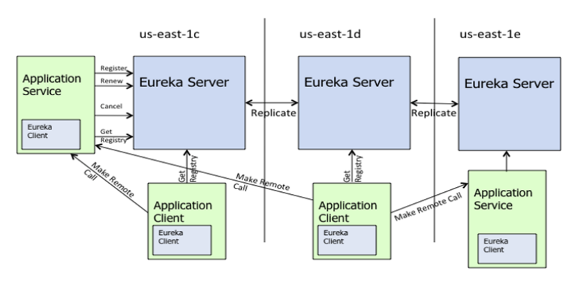

我们首先会在应用程序中依赖 Eureka Client，项目启动后 Eureka Client 会向 Eureka Server 发送请求，进行注册，并将自己的一些信息发送给 Eureka Server。

注册成功后，每隔一定的时间，Eureka Client 会向 Eureka Server 发送心跳来续约服务，也就是汇报健康状态。 如果客户端长时间没有续约，那么 Eureka Server 大约将在 90 秒内从服务器注册表中删除客户端的信息。

Eureka Client 还会定期从 Eureka Server 拉取注册表信息，然后根据负载均衡算法得到一个目标，并发起远程调用，关于负载均衡在后面的课时会详细介绍，也就是 Ribbon 组件。

应用停止时也会通知 Eureka Server 移除相关信息，信息成功移除后，对应的客户端会更新服务的信息，这样就不会调用已经下线的服务了，当然这个会有延迟，有可能会调用到已经失效的服务，所以在客户端会开启失败重试功能来避免这个问题。

Eureka Server 会有多个节点组成一个集群，保证高可用。`Eureka Server 没有集成其他第三方存储，而是存储在内存中。`所以 Eureka Server 之间会将注册信息复制到集群中的 Eureka Server 的所有节点。 这样数据才是共享状态，任何的 Eureka Client 都可以在任何一个 Eureka Server 节点查找注册表信息。

## 2、部署

### 1、Eureka 集群部署

在前面架构剖析时，我们有提到 Eureka Server 之间会将注册信息复制到集群中的 Eureka Server 的所有节点中，也就是说可以在任意一个 Eureka Server 的节点上进行注册，也可以在任意一个节点上进行读取。

假设我们需要搭建一个由两个节点组成的集群，核心思想就是 A 节点会将自己的信息复制到 B 节点，B 节点会将自己的信息复制到 A 节点。那么 A 节点和 B 节点肯定得知道对方的地址才可以进行复制操作，这就是集群搭建的关键点所在，只需要在每个节点启动时指定集群中其他节点的地址信息即可。

可以为每个节点创建一个配置文件，通过 spring.profiles.active 的方式激活，这样就不用创建多个 Eureka Server 的项目了，代码本质上没有任何区别，只是配置内容不一样而已。

创建一个 master 配置文件，defaultZone 指向 8762 端口，随后创建一个 slave 配置文件，defaultZone 指向 8761 的端口，先激活 master 配置，启动项目，然后再激活 slave 配置，启动项目。然后在浏览器中分别查看 8761 和 8762 的管理页面，可以看到两边的信息是一致的。

> 实际案例问题分析

不少初学Spring Cloud的朋友在落地公司生产环境部署时，经常会问：

- Eureka Server到底要部署几台机器？
- 我们的系统那么多服务，到底会对Eureka Server产生多大的访问压力？
- Eureka Server能不能抗住一个大型系统的访问压力？

如果你也有这些疑问，别着急！咱们这就一起去看看，Eureka作为微服务注册中心的核心原理

下面这些问题，大家先看看，有个大概印象。带着这些问题，来看后面的内容，效果更佳

- Eureka注册中心使用什么样的方式来储存各个服务注册时发送过来的机器地址和端口号？
- 各个服务找Eureka Server拉取注册表的时候，是什么样的频率？
- 各个服务是如何拉取注册表的？
- 一个几百服务，部署上千台机器的大型分布式系统，会对Eureka Server造成多大的访问压力？
- Eureka Server从技术层面是如何抗住日千万级访问量的？

先给大家说一个基本的知识点，各个服务内的Eureka Client组件，默认情况下，`每隔30秒会发送一个请求到Eureka Server`，来拉取最近有变化的服务信息

问题：这个30秒是消费者拉取间隔？还是生产者心跳间隔？

举个例子：
- 库存服务原本部署在1台机器上，现在扩容了，部署到了3台机器，并且均注册到了Eureka Server上；
- 然后订单服务的Eureka Client会每隔30秒去找Eureka Server拉取最近注册表的变化，看看其他服务的地址有没有变化；

除此之外，Eureka还有一个心跳机制，各个Eureka Client每隔30秒会发送一次心跳到Eureka Server，通知人家说，哥们，我这个服务实例还活着！如果某个Eureka Client很长时间没有发送心跳给Eureka Server，那么就说明这个服务实例已经挂了。

通过一张图，一起来直观的感受一下这个过程。

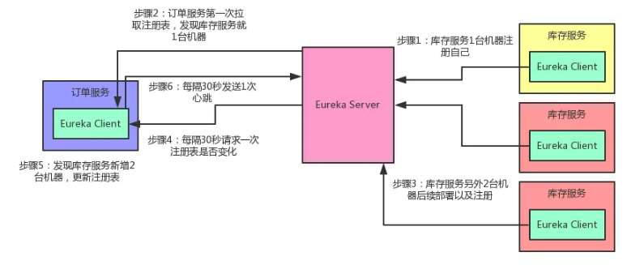

# 2、Eureka Server设计精妙的注册表存储结构

现在咱们假设手头有一套大型的分布式系统，一共100个服务，每个服务部署在20台机器上，机器是4核8G的标准配置。也就是说，相当于你一共部署了100 * 20 = 2000个服务实例，有2000台机器。每台机器上的服务实例内部都有一个Eureka Client组件，它会每隔30秒请求一次Eureka Server，拉取变化的注册表。

此外，每个服务实例上的Eureka Client都会每隔30秒发送一次心跳请求给Eureka Server。

那么大家算算，Eureka Server作为一个微服务注册中心，每秒钟要被请求多少次？一天要被请求多少次？

按标准的算法，每个服务实例每分钟请求2次拉取注册表，每分钟请求2次发送心跳这样一个服务实例每分钟会请求4次，2000个服务实例每分钟请求8000次换算到每秒，则是8000 / 60 = 133次左右，我们就大概估算为Eureka Server每秒会被请求150次。那一天的话，就是8000 * 60 * 24 = 1152万，也就是每天千万级访问量

好！经过这么一个测算，大家是否发现这里的奥秘了？

首先，对于微服务注册中心这种组件，在一开始设计它的拉取频率以及心跳发送频率时，就已经考虑到了一个大型系统的各个服务请求时的压力，每秒会承载多大的请求量。

所以各服务实例每隔30秒发起请求拉取变化的注册表，以及每隔30秒发送心跳给Eureka Server，其实这个时间安排是有其用意的。

按照我们的测算，一个上百个服务，几千台机器的系统，按照这样的频率请求Eureka Server，日请求量在千万级，每秒的访问量在150次左右。即使算上其他一些额外操作，我们姑且就算每秒钟请求Eureka Server在200次~300次吧。所以通过设置一个适当的拉取注册表以及发送心跳的频率，可以保证大规模系统里对Eureka Server的请求压力不会太大。

关键问题来了，Eureka Server是如何保证轻松抗住这每秒数百次请求，每天千万级请求的呢？要搞清楚这个，首先得清楚Eureka Server到底是用什么来存储注册表的？三个字，看源码。接下来咱们就一起进入Eureka源码里一探究竟：

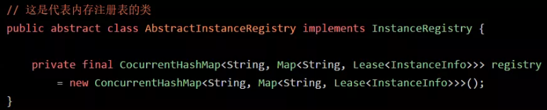

如上图所示，图中的这个名字叫做registry的CocurrentHashMap，就是注册表的核心结构。

从代码中可以看到，Eureka Server的注册表直接基于纯内存，即在内存里维护了一个数据结构。

各个服务的注册、服务下线、服务故障，全部会在内存里维护和更新这个注册表。各个服务每隔30秒拉取注册表的时候，Eureka Server就是直接提供内存里存储的有变化的注册表数据给他们就可以了。同样，每隔30秒发起心跳时，也是在这个纯内存的Map数据结构里更新心跳时间。

一句话概括：维护注册表、拉取注册表、更新心跳时间，全部发生在内存里！这是Eureka Server非常核心的一个点。

搞清楚了这个，咱们再来分析一下registry这个东西的数据结构。

首先，这个ConcurrentHashMap的key就是服务名称，比如“inventory-service”，就是一个服务名称。value则代表了一个服务的多个服务实例。

举例：比如“inventory-service”是可以有3个服务实例的，每个服务实例部署在一台机器上。再来看看作为value的这个Map：Map<String, Lease<InstanceInfo>>这个Map的key就是服务实例的id（比如inventory-service:192.168.31.244:2012），value是一个叫做Lease的类，它的泛型是一个叫做InstanceInfo的东东，你可能会问，这俩又是什么鬼？首先说下InstanceInfo，其实啊，我们见名知义，这个InstanceInfo就代表了服务实例的具体信息，比如机器的ip地址、hostname以及端口号。而这个Lease，里面则会维护每个服务最近一次发送心跳的时间。

`那么 Eureka 将注册的服务信息存储在内存中原因是什么呢?`

存在内存中的优势在于性能高。然后就是对使用者来说，部署简单，不需要依赖于第三方存储。

有优势那么肯定也有劣势，内存存储的劣势在于对存储容量的扩容难度高，每个 Eureka Server 都是全量的存储一份注册表，假如存储空间不够了，需要扩容，那么所有的 Eureka Server 节点都必须扩容，必须采用相同的内存配置。

Eureka 核心操作主要有注册、续约、下线、移除，接口是com.netflix.eureka.lease.LeaseManager，说简单点这些操作都是针对注册表的操作，也就是对 Map 的操作，听上去好像很简单，实际上在每个操作背后，都有它自己的业务逻辑，不是简单的增、删、改、查。

## 1、注册

打开 LeaseManager 接口，找到 register 的实现，进入 AbstractInstanceRegistry 这个类的 register 方法。看下具体的代码实现，刚开始会获取一把读锁，然后通过服务名称从注册表中获取对应的信息，如果不存在则创建一个，然后添加进去。

再获取 Lease 信息，如果存在则用现有的 InstanceInfo，如果不存在，则认为是新的注册，会计算跟续约相关的值，该值在自我保护的逻辑中会用到。

后面就是往一些变更队列里添加数据，会有对应的消费者去消费，最后将注册表的缓存进行清空，Eureka Client 在获取服务信息时，Eureka Server 为了提高读取性能，增加了缓存操作。所以当实例信息发生变化时需要将之前的缓存移除掉，最后释放锁。

## 2、Eureka集群各节点的数据同步

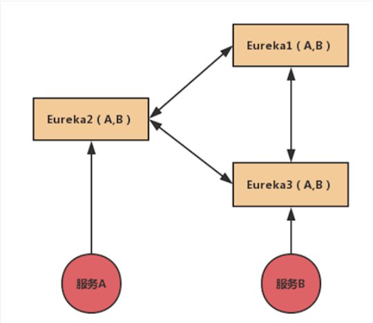

如上图所示，Eureka 集群采用相互注册的方式实现高可用集群，任何一台注册中心故障都不会影响服务的注册与发现。前面也介绍了 Eureka 的注册表是存储在内存中的，当服务 A 注册到 Eureka Server 2 的节点上后，会去 Eureka Server 1 的节点拉取信息，正常情况下是拉取不到信息的，为了能够正常的拉取信息，Eureka Server 内部采用了复制的方式向各个节点进行数据同步操作。

我们简单的来看下当服务注册后，信息是如何同步的，代码在com.netflix.eureka.registry.PeerAwareInstanceRegistryImpl.register(InstanceInfo, boolean)中，复制的方法是 `replicateToPeers`，主要参数是 Action，Action 表示操作的类型，有心跳、注册、取消等操作。还有服务名称和实例 ID。

通过 peerEurekaNodes.getPeerEurekaNodes() 得到 Eureka Server 的所有节点信息，在当前节点中循环进行复制操作，需要排除自己，不需要将信息同步给自己。复制操作会根据 Action 来进行对应的操作，通过 node 对象的方法构建复制的任务，任务本质还是通过调用 Eureka 的 Rest API 来进行操作的。

## 3、Eureka自我保护机制

自我保护机制是为了避免因网络分区故障而导致服务不可用的问题。具体现象为当网络故障后，所有的服务与 Eureka Server 之间无法进行正常通信，一定时间后，Eureka Server 没有收到续约的信息，将会移除没有续约的实例，这个时候正常的服务也会被移除掉，所以需要引入自我保护机制来解决这种问题。

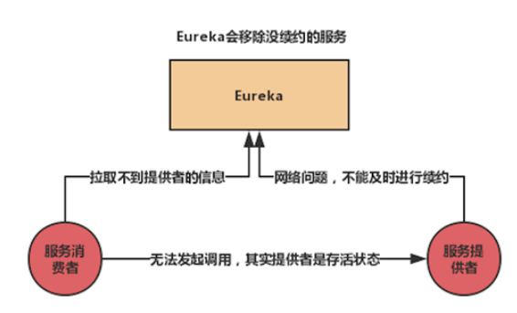

如上图所示，当服务提供者出现网络故障，无法与 Eureka Server 进行续约，Eureka Server 会将该实例移除，此时服务消费者从 Eureka Server 拉取不到对应的信息，实际上服务提供者处于可用的状态，问题就是这样产生的

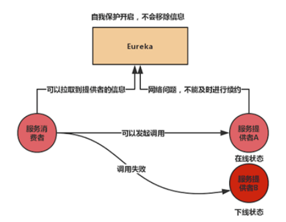

如上图所示，再来看已开启自我保护，当服务提供者 A 出现网络故障，无法与 Eureka Server 进行续约时，虽然 Eureka Server 开启了自我保护模式，但没有将该实例移除，服务消费者还是可以正常拉取服务提供者的信息，正常发起调用。

 
这就是自我保护机制的作用，但是自我保护机制也有不好的地方，我们继续看上图，如果这个时候，服务提供者 B 真的下线了，由于 Eureka Server 自我保护还处于打开状态，不会移除任务信息，当服务消费者对服务提供者 B 进行调用时，就会出错。自我保护模式有利也有弊，但我们建议在生产环境中还是开启该功能，就算出现某些有问题的实例没能及时移除掉的情况，服务消费者也可以通过 Ribbon 来进行重试，保证调用能够成功。

自我保护不是某个实例没正常续约就会开启，它需要满足一定的条件才会开启，我们来详细的分析自我保护开启的条件。

在 AbstractInstanceRegistry 中有两个字段。

- numberOfRenewsPerMinThreshold ：期望最小每分钟能够续租的次数；

- expectedNumberOfClientsSendingRenews ：期望的服务实例数量。

numberOfRenewsPerMinThreshold = expectedNumberOfClientsSendingRenews * 每个实例每分钟续约的次数，默认是 60/30=2，也就是一个实例每分钟最多续约 2 次，然后就是续租的比例，默认是 0.85，假如有 10 个实例，每个实例每分钟续约 2 次，那么就是 10*2*0.85=17，也就是每分钟至少要有 17 次续约才是正常的，否则就是不正常的。

在 evict 方法的 isLeaseExpirationEnabled 判断中是否能够进行实例的移除，如果返回 true 表示可以进行移除操作，如果返回 false 则直接 return 返回，不进行移除操作。

isLeaseExpirationEnabled 方法里首先会判断是否关闭了自我保护，如果关闭了直接返回 true，如果开启了自我保护，那么需要进行下一步的处理。具体的处理逻辑是期望每分钟续约的次数至少有一次，并且小于实际最后一分钟续约的次数，如果满足这 2 个条件返回 true，表示续约正常。如果不满足，那么意味着续约不正常，返回 false，不移除实例操作。

因为是按照每分钟来计算的，等到网络恢复，续约的次数正常后，自我保护模式就会自动关闭。

## 4、Eureka健康检查

在前面我们讲过 Eureka 的心跳机制，Eureka Client 会定时发送心跳给 Eureka Server 来证明自己处于健康的状态，如下图所示。

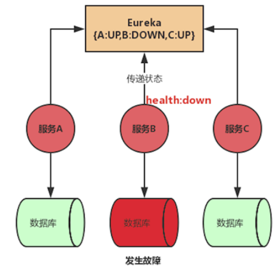

但在某些场景下，服务仍处于存活状态，却已经不能对外提供服务了，比如数据库出问题了，这时，Eureka Client 还是会定时发送心跳，由于心跳正常，客户端在请求时还是会请求到这个出了问题的服务实例。

在第一课时我们已经讲过 Spring Boot 应用的健康状态监控，通过 Actuator 来管理健康状态，同时支持使用者扩展 /health 端点，常用的框架中都扩展了 /health 端点，比如 Mongodb、ElasticSearch 等。

我们只要在项目中集成 Actuator，就可以统一管理应用的健康状态，那么我们可以将这个状态反馈给 Eureka Server，这样当应用处于不健康的状态，Eureka Server 就能知道这个应用不健康了，然后将其进行下线操作，这样客户端就不会调用这个不健康的服务实例了，这就是 Eureka 的健康检查。

# 3、Eureka Server端优秀的多级缓存机制

假设Eureka Server部署在4核8G的普通机器上，那么基于内存来承载各个服务的请求，每秒钟最多可以处理多少请求呢？根据之前的测试，单台4核8G的机器，处理纯内存操作，哪怕加上一些网络的开销，每秒处理几百请求也是轻松加愉快的。而且Eureka Server为了避免同时读写内存数据结构造成的并发冲突问题，还采用了多级缓存机制来进一步提升服务请求的响应速度。

## 3.1、在拉取注册表的时候

- 首先从ReadOnlyCacheMap里查缓存的注册表。
- 若没有，就找ReadWriteCacheMap里缓存的注册表。
- 如果还没有，就从内存中获取实际的注册表数据。

## 3.2、在注册表发生变更的时候

- 会在内存中更新变更的注册表数据，同时过期掉ReadWriteCacheMap。
- 此过程不会影响ReadOnlyCacheMap提供人家查询注册表。
- 一段时间内（默认30秒），各服务拉取注册表会直接读ReadOnlyCacheMap
- 30秒过后，Eureka Server的后台线程发现ReadWriteCacheMap已经清空了，也会清空ReadOnlyCacheMap中的缓存
- 下次有服务拉取注册表，又会从内存中获取最新的数据了，同时填充各个缓存。

## 3.3、多级缓存机制的优点是什么？

- 尽可能保证了内存注册表数据不会出现频繁的读写冲突问题。
- 并且进一步保证对Eureka Server的大量请求，都是快速从纯内存走，性能极高。

为方便大家更好的理解，同样来一张图，大家跟着图再来回顾一下这整个过程：

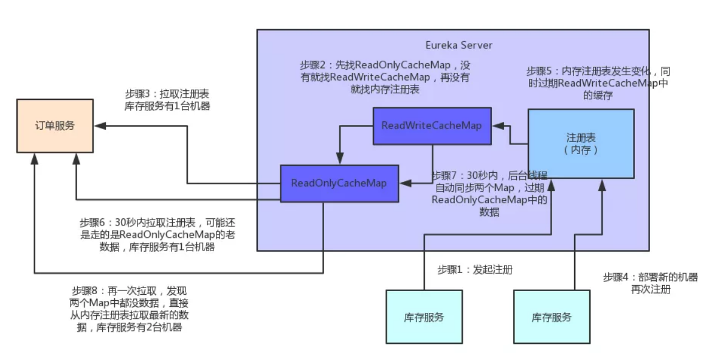

# 4、微服务注册中心的读写锁优化

先来看看下面的图，现在我们知道一个微服务注册中心（可以是Eureka或者Consul或者你自己写的一个微服务注册中心），他肯定会在内存中有一个服务注册表的概念。

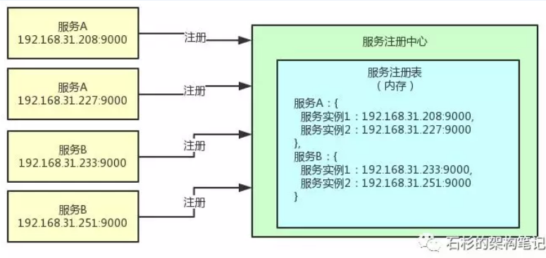

这个服务注册表中就是存放了各个微服务注册时发送过来的自己的地址信息，里面保存了每个服务有多少个服务实例，每个服务实例部署在哪台机器上监听哪个端口号，主要是这样的一些信息。OK，那现在问题来了，这个服务注册表的数据，其实是有人读也有人写的。

举个例子，比如有的服务启动的时候会来注册，此时就会修改服务注册表的数据，这个就是写的过程。

接着，别的服务也会来读这个服务注册表的数据，因为每个服务都需要感知到其他服务在哪些机器上部署。

所以，这个内存里的服务注册表数据，天然就是有读写并发问题的！可能会有多个线程来写，也可能会有多个线程来读！如果你对同一份内存中的注册表数据不加任何保护措施，那么可能会有多线程并发修改共享数据的问题，可能导致数据错乱，对吧？上述过程，大家看看下面的图，就明白了。

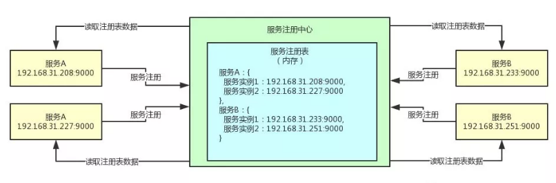

此时，如果对服务注册表的服务注册和读取服务注册表的方法，都加一个synchronized关键字，是不是就可以了呢？或许你会想，加上synchronized，直接让所有线程对服务注册表的读写操作，全部串行化。那不就可以保证内存中的服务注册表数据安全了吗？下面是一段伪代码，大家来感受一下：

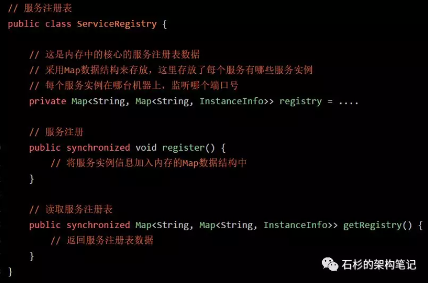

在上面的代码中直接给写（服务注册）和读（读取服务注册表）两个方法，都暴力的加上了synchronized关键字，确实是可以保证服务注册表的数据不错乱，但是这样肯定是不太合适的。因为这么搞的话，相当于是所有的线程读写服务注册表数据，全部串行化了。

大家思考一下，我们想要的效果是什么？其实不就是在有人往服务注册表里写数据的时候，就不让其他人写了，同时也不让其他人读！然后，有人在读服务注册表的数据的时候，其他人都可以随便同时读，但是此时不允许别人写服务注册表数据了！对吧，我们想要的，其实不就是这个效果吗？想清楚了这点，我们就不应该暴力的加一个synchronized，让所有读写线程全部串行化，那样会导致并发性非常的低。大家看看下面的图，我们想要的第一个效果：一旦有人在写服务注册表数据，我们加个写锁，此时别人不能写，也不能读。

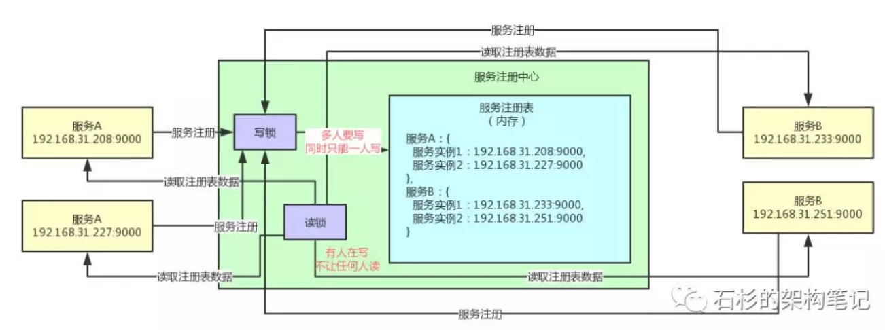

那么如果有人在读数据呢？此时就可以让别人都可以读，但是不允许任何人写。大家看下面的图。

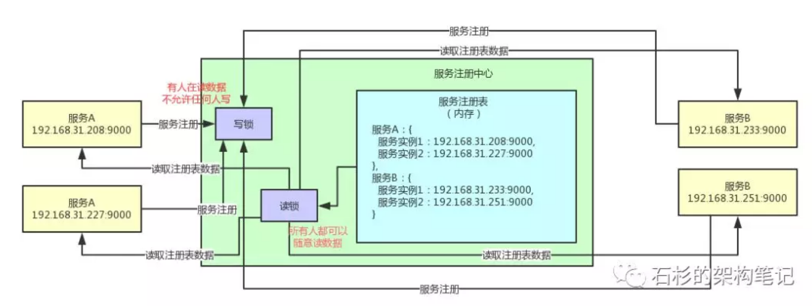

关键点来了，这样做有什么好处呢？其实大部分时候都是读操作，所以使用读锁可以让大量的线程同时来读数据，不需要阻塞不需要排队，保证高并发读的性能是比较高的。然后少量的时候是有服务上线要注册数据，写数据的场景是比较少的，此时写数据的时候，只能一个一个的加写锁然后写数据，同时写数据的时候就不允许别人来读数据了。所以读写锁是非常适合这种读多写少的场景的。

`问题：心跳也是需要写的吧？写并发量并不少？`

另外，我们能不能尽量在写数据的期间还保证可以继续读数据呢？大量加读锁的时候，会阻塞人家写数据加写锁过长时间，这种情况能否避免呢？

可以的，采用多级缓存的机制，也就是上面的第三点。

最后看下上面那段伪代码如果用读写锁来优化是怎么样的？

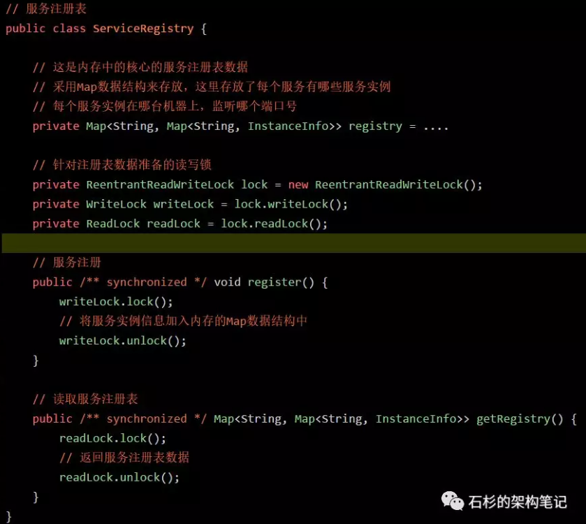

# 5、总结

- 通过上面的分析可以看到，Eureka通过设置适当的请求频率（拉取注册表30秒间隔，发送心跳30秒间隔），可以保证一个大规模的系统每秒请求Eureka Server的次数在几百次。
- 同时通过纯内存的注册表，保证了所有的请求都可以在内存处理，确保了极高的性能
- 另外,多级缓存机制，确保了不会针对内存数据结构发生频繁的读写并发冲突操作，进一步提升性能。

上述就是Spring Cloud架构中，Eureka作为微服务注册中心可以承载大规模系统每天千万级访问量的原理。

https://github.com/lishuai2016/ls-springcloud-learn/tree/master/new/eureka

http://www.saily.top/2020/03/28/springcloud/eureka05/