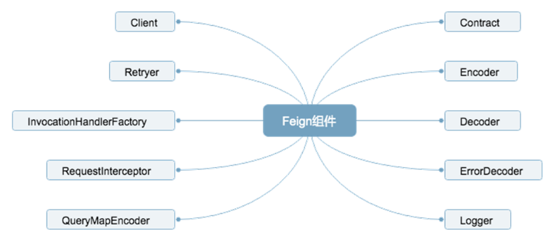
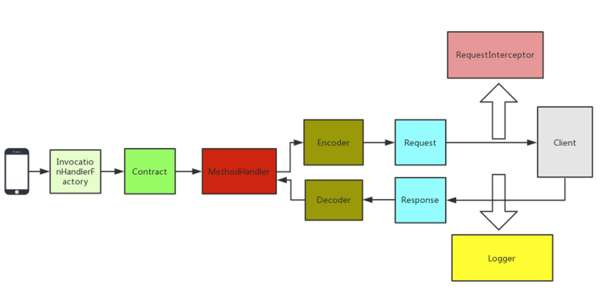
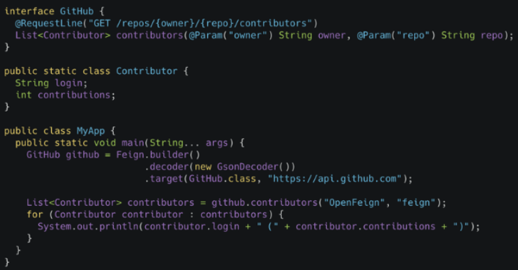
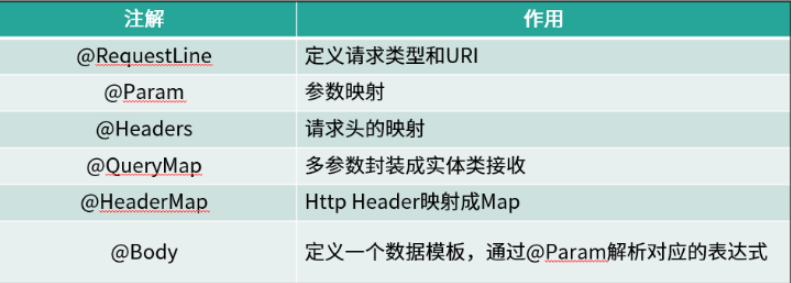
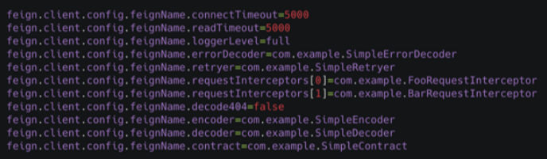
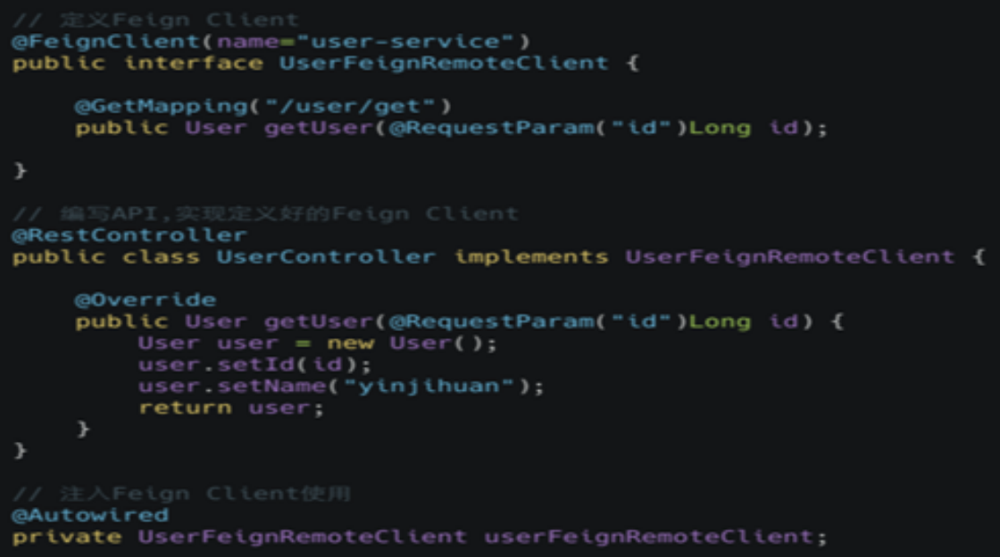
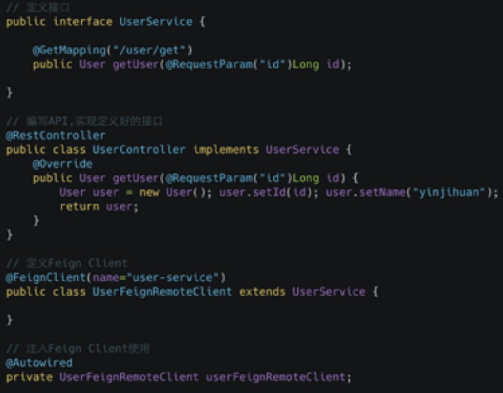
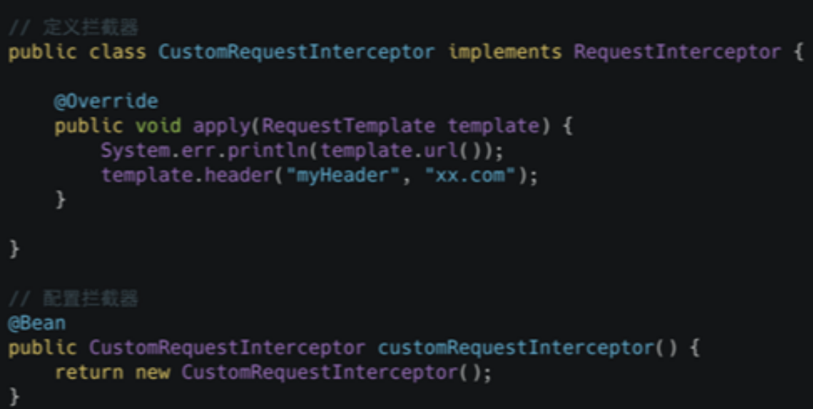
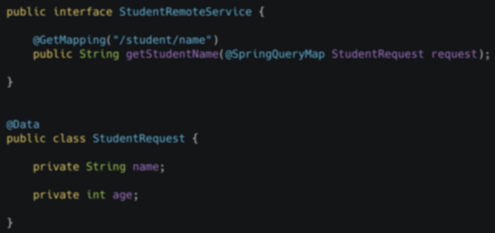
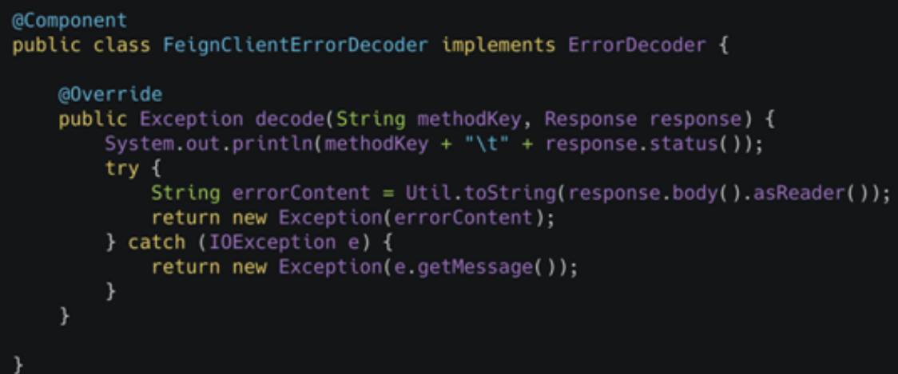

<!-- TOC -->

- [1、Feign 基础知识](#1feign-基础知识)
    - [1、Feign 重要组件](#1feign-重要组件)
    - [2、Feign 执行过程](#2feign-执行过程)
    - [3、Feign 的使用](#3feign-的使用)
        - [1、原生 API](#1原生-api)
        - [2、自带注解](#2自带注解)
        - [3、Spring Cloud（@FeignClient+@EnableFeignClients）](#3spring-cloudfeignclientenablefeignclients)
        - [4、Feign 整合 Hystrix](#4feign-整合-hystrix)
        - [5、Feign 的配置](#5feign-的配置)
            - [1、代码方式](#1代码方式)
            - [2、配置文件方式](#2配置文件方式)
- [2、@FeignClient工作原理](#2feignclient工作原理)
    - [1、EnableFeignClients](#1enablefeignclients)
    - [2、FeignClientsRegistrar](#2feignclientsregistrar)
- [3、Feign 的最佳使用技巧](#3feign-的最佳使用技巧)
    - [1、继承特性](#1继承特性)
    - [2、拦截器](#2拦截器)
    - [3、GET 请求多参数传递](#3get-请求多参数传递)
    - [4、日志配置](#4日志配置)
    - [5、异常解码器](#5异常解码器)
- [4、Feign-源码分析](#4feign-源码分析)
- [参考](#参考)

<!-- /TOC -->


在日常工作中，我们经常会遇到需要调用内部 API 或者第三方 API 的情况，主要有以下方式：

- HttpURLConnection
- HttpClient
- OKHttp
- RestTemplate

以上这四种是我们最常见的 API 调用方式，在调用 API 之前，我们首先需要知道 API 的地址，其次是 API 对应的参数，然后发起调用，本质上调用 API 的过程就是一个 HTTP 请求过程。

如果你用过 Dubbo 框架，就会知道在 Dubbo 中发起远程调用是不需要使用者去关注服务提供者信息的，直接注入一个接口，然后调用接口中的方法，就像调用本地方法一样。这样的好处是开发效率高，代码优雅。


# 1、Feign 基础知识

Feign 是一个声明式的 REST 客户端，它的目的就是让 REST 调用更加简单。Feign 提供了 HTTP 请求的模板，通过编写简单的接口和插入注解，就可以定义好 HTTP 请求的参数、格式、地址等信息。


而且 Feign 会完全代理 HTTP 请求，我们只需要像调用方法一样调用它就可以完成服务请求及相关处理。Spring Cloud 对 Feign 进行了封装，使其支持 SpringMVC 标准注解和 HttpMessageConverters。Feign 可以与 Eureka 和 Ribbon 组合使用以支持负载均衡，与 Hystrix 组合使用，支持熔断回退。


如果你没有使用 Spring Cloud，那么可以直接用原生的 Feign 来调用 API，如果你使用了 Spring Cloud，可以直接用 Spring Cloud OpenFeign 来调用 API。


## 1、Feign 重要组件

Feign 有如此强大的功能，离不开内部众多组件的支持，这些组件同时也为 Feign 提供了非常灵活的扩展机制，我们可以根据自身的需求去扩展这些组件，下面我们讲解 Feign 中的重要组件。



- Contract 契约组件

在 Feign 中可以通过定义 API 接口的方式来调用远程的 Http API，在定义调用 Client 的时候需要增加一些注解来描述这个调用 API 的基本信息，比如请求类型是 GET 还是 POST，请求的 URI 是什么。Contract 允许用户自定义契约去解析注解信息，最典型的应用场景就是在 Spring Cloud 中使用 Feign，我们可以使用 Spring MVC 的注解来定义 Feign 的客户端，这是因为 Spring Cloud OpenFeign 中实现了自己的 SpringMvcContract。

- Encoder 编码组件

通过该组件我们可以将请求信息采用指定的编码方式进行编码后传输。

- Decoder 解码组件

Decoder 将相应数据解码成对象。

- ErrorDecoder 异常解码器

当被调用方发生异常后，我们可以在 ErrorDecoder 中将响应的数据转换成具体的异常返回给调用方，适合内部服务之间调用，但不想通过指定的字段来判断是否成功的场景，直接用自定义异常代替。

- Logger 日志记录

Logger 组件是负责 Feign 中记录日志的，可以指定 Logger 的级别以及自定义日志的输出。

- Client 请求执行组件

Client 是负责 HTTP 请求执行的组件，Feign 将请求信息封装好后会交由 Client 来执行，Feign 中默认的 Client 是通过 JDK 的 HttpURLConnection 来发起请求的，在每次发送请求的时候，都会创建新的 HttpURLConnection 链接，使用默认的方式，Feign 的性能会很差，原因就是使用了 HttpURLConnection。你可以通过扩展该接口，使用 Apache HttpClient 等基于连接池的高性能 HTTP 客户端。

- Retryer 重试组件

Retryer 是负责重试的组件，Feign 内置了重试器，当 HTTP 请求出现 IO 异常时，Feign 会限定一个最大重试次数来进行重试操作。

- InvocationHandlerFactory 代理

InvocationHandlerFactory 采用 JDK 的动态代理方式生成代理对象，我们定义的 Feign Client 是接口，当我们调用这个接口中定义的方法时，实际上是要去调用远程的 HTTP API，这里用了动态代理方式，当调用某个方法时，会进入代理中真正的去调用远程 HTTP API。

- RequestInterceptor 请求拦截器

可以为 Feign 添加多个拦截器，在请求执行前设置一些扩展的参数信息。

- QueryMapEncoder 参数查询

QueryMapEncoder 是针对实体类参数查询的编码器，可以基于 QueryMapEncoder 将实体类生成对应的查询参数。


## 2、Feign 执行过程



在使用 feign 时，我们会定义对应的接口类，在接口类上使用 Feign 自带的注解来标识 HTTP 的请求参数信息，当调用接口对应的方法时，Feign 内部会基于面向接口的动态代理方式生成实现类，将请求调用委托到动态代理实现类，负责动态代理的组件是 InvocationHandlerFactory。

根据 Contract 规则，解析接口类的注解信息，翻译成 Feign 内部能识别的信息。Feign 默认有一套自己的协议规范，我们也可以自定义其他的规范来进行扩展，在 Spring Cloud OpenFeign中就扩展了 SpringMvcContract，这样做的目的是为了降低学习和使用成本，客户端和服务端使用同一个接口定义，发布成 SDK 给调用方使用。

MethodHandler 在执行的时候会生成 Request 对象，在构建 Request 对象的时候会为其设置拦截器，交由 Client 执行前记录一些日志，Client 执行完成后也记录一些日志，然后使 Decoder 进行相应结果的解码操作，并返回结果。

## 3、Feign 的使用

### 1、原生 API



这段代码是我从 Feign 的 GitHub 主页上摘下来的，通过这个简单的示列我们可以感受到 Feign调用 API 的简便性。

这是一个 GET 请求的示列，定义了一个 GitHub 的接口，接口中定义了一个查询的方法和参数。在方法上有 @RequestLine 注解，定义了请求类型和请求的 URI，URI 中有对应的参数占位符，返回值是集合，集合中是对应的返回结构对象。


我们通过 Feign 的 builder 模式构建了 GitHub 接口对象后，就可以直接通过 GiuHub 接口对象调用里面的 contributors 方法，然后可以得到返回结果。Feign 的这种方式就跟 Dubbo 中的调用方式是一样的，就像调用本地方法一样。


使用原生的 Feign 来调用 API，只需要通过特定的注解来描述调用的 API 信息，这些信息的请求方式可以是 GET 或者 POST 等，请求参数是什么？请求的地址是什么? 把这些信息定义好后就可以直接使用这个定好了的接口来调用对应的远程 API。

### 2、自带注解



通过前面的示列我们感受到了 Feign 的简便性，通过定义接口，加几个注解就可以轻松完成 API的远程调用，Feign 中自带的注解跟我们平时使用 Spring MVC 的注解不一样，除了前面我们提到的 @RequestLine 注解，Feign 中还有很多其他内置的注解，我整理了一个表格，表格中就是Feign 中内置的注解以及它们的作用。


RequestLine 前面已经讲过了，用来定义请求类型和请求的 URI，Param 是用来做参数映射的，Headers 是用来做请求头映射的，QueryMap 是用来接收多个参数的，最常见的就是将多个参数封装在一个实体类中，然后就可以用 QueryMap 来修饰。HeaderMap 可以将请求头映射成一个 Map 对象，Body 可以定义一个数据模板，通过 @Param 解析对应的表达式，最终替换成完成的请求体。

### 3、Spring Cloud（@FeignClient+@EnableFeignClients）

原生的 Feign 在使用层面已经很方便了，但是在 Spring Cloud 体系中却不那么适用，所以官方团队在 Feign 的基础上进行扩展，推出了 spring-cloud-openfeign，目的是能够让广大的开发者在 Spring Cloud 体系中使用 Feign 变得更加简单。


首先我们开发的 API 都用的是 Spring MVC 的注解，比如 RequestMapping 等，Feign 的注解是单独的一套，所以我们编写调用 Client 接口时，需要根据已有的接口来编写，在 spring-cloud-openfeign 中，实现了 Spring MVC 的一套注解，调用方 Client 接口中的注解和 API 方可以一致，非常方便。

下面我们来体验下 Spring Cloud 中 Feign 的简便性，在 Spring Cloud 中使用 Feign 主要有三步。

- 1、需要在启动类加 @EnableFeignClients 启用 Feign。

- 2、可以定义 Feign 的调用客户端了，需要在接口上增加 @FeignClient 注解。

- 3、可以直接通过客户端访问接口。


### 4、Feign 整合 Hystrix

在 pom 中增加 spring-cloud-starter-netflix-hystrix 的依赖，然后在配置文件中开启 Feign 对 Hystrix 的支持，配置 `feign.hystrix.enabled=true`。


然后为我们的 Feign Client 增加 Fallback，新建一个 UserRemoteClientFallbackFactory，实现 FallbackFactory 接口，泛型传入我们的 Feign Client。在 create 方法中创建 UserRemoteClient 并编写回退逻辑。


最后需要在 @FeignClient 注解中指定我们的 FallbackFactory 类，这样才能让这个 Feign Client应用我们的回退逻辑。

FallbackFactory 回退需要知道异常信息，还有一种回退方式是不知道异常信息，创建一个 UserRemoteClientFallback 实现我们的 UserRemoteClient，重写 getUser 方法，然后在 @FeignClient 注解中指定 fallback 即可。


### 5、Feign 的配置


#### 1、代码方式

Feign 的配置在代码中可以指定，我们可以为每个 Feign Client 创建一个单独的配置类，在类中配置对应的信息，比如我们要改变日志的级别，可以配置一个 Logger.Level 的 Bean、访问对应的接口，可以在控制台看见详细的调用日志输出。前提是日志的级别必须为 Debug。还需要在 @FeignClient 注解中进行配置类的指定。


#### 2、配置文件方式

更灵活的配置方式应该是放入配置文件中，建议你在工作中将配置都放入配置文件中，那么 Feign 在配置文件中如何进行配置呢？




当然也是有统一的格式的，而且格式也比较简单，前缀都是固定的 feign.client.config，后面接的是 Feign Client 的名称，也就是我们 @FeignClient 注解中的 value。然后是对应的配置项，这样的配置就可以为不同的 Feign Client 配置不同的值。


# 2、@FeignClient工作原理

feign是一个伪客户端，即它不做任何的请求处理。Feign通过处理注解生成request，从而实现简化HTTP API开发的目的，即开发人员可以使用注解的方式定制request api模板，在发送http request请求之前，feign通过处理注解的方式替换掉request模板中的参数，这种实现方式显得更为直接、可理解。

> 总结

Feign的源码实现的过程如下：

- 1、首先通过@EnableFeignCleints注解开启FeignCleint

- 2、根据Feign的规则实现接口，并加@FeignCleint注解

- 3、程序启动后，会进行包扫描，扫描所有的@FeignCleint的注解的类，并将这些信息注入到ioc容器中。

- 4、当接口的方法被调用，通过jdk的代理，来生成具体的RequesTemplate

- 5、RequesTemplate在生成Request

- 6、Request交给Client去处理，其中Client可以是HttpUrlConnection、HttpClient也可以是Okhttp

- 7、最后Client被封装到LoadBalanceClient类，这个类结合类Ribbon做到了负载均衡。


## 1、EnableFeignClients
```java
@Retention(RetentionPolicy.RUNTIME)
@Target({ElementType.TYPE})
@Documented
@Import({FeignClientsRegistrar.class})
public @interface EnableFeignClients {
    String[] value() default {};

    String[] basePackages() default {};

    Class<?>[] basePackageClasses() default {};

    Class<?>[] defaultConfiguration() default {};

    Class<?>[] clients() default {};
}
```

注解@EnableFeignClients告诉框架扫描所有使用注解@FeignClient定义的feign客户端。它又通过注解@Import导入了类FeignClientsRegistrar( feign客户端注册器)


## 2、FeignClientsRegistrar


# 3、Feign 的最佳使用技巧

在使用 Feign 的过程中，我也总结了一些比较实用的技巧，主要有下面几点：

- 继承特性
- 拦截器
- GET 请求多参数传递
- 日志配置
- 异常解码器

## 1、继承特性

1、继承特性-方式一



因为 Spring Cloud Open Feign 中支持继承的特性，我们可以将 API 的定义提取出来封装成一个单独的接口，给 API 的实现方和调用方共用，在一定程度上简化了重复的代码。

我们定义了一个 UserFeignRemoteClient 的接口，加了 @FeignClient 注解，这个接口就变成了一个 Feign 的 Client。接口中我们定义了 getUser 方法，指定了访问的 URI。

再创建一个 UserController，增加 RestController 注解，并且实现了上面定义的 UserFeignRemoteClient 接口，实现了 getUser 方法。

使用的地方只要注入 UserFeignRemoteClient 就可以使用 getUser 方法，UserController 中也不用重复定义 API 的 URI 等信息，当接口的 URI 发生变化时，提供方和使用方用的都是一个共用的接口，两边不会出现不一致的情况，这就是继承特性带来的好处。

2、继承特性-方式二



上面的继承方式是我简化之后的，其实在 Spring Cloud Open Feign 的文档中，给出的继承示列还要多一个类，第一步是抽出一个公共的接口，比如我们这边的 UserService，UserService 中定义了要实现的 API 的方法。


在 UserController 中还是一样，需要实现 UserService，然后创建一个UserFeignRemoteClient，UserFeignRemoteClient 中需要继承 UserService，不同点在于之前是将 API 的方法定义在 UserFeignRemoteClient 中，然后 Controller 中实现UserFeignRemoteClient。现在 API 方法的定义是一个独立的 UserService 接口，Controller 和 Feign Client 都是需要实现或者继承 UserService 的接口，使用方式是一样的。

## 2、拦截器



Feign 中提供了拦截器机制，我们可以添加自己的拦截器来实现某些场景下的需求。BasicAuth 在 Feign 中默认提供了拦截器，我们只需要配置一下就可以使用，如果我们需要自定义拦截器，可以参考 BasicAuth 的代码，只要实现 RequestInterceptor 接口，在 apply 方法中编写你自己的逻辑就可以了，通过 RequestTemplate 可以进行很多操作，比如添加指定的请求头信息，这个可以用在服务间传递某些信息的时候。

## 3、GET 请求多参数传递



Feign 中对于 GET 请求传递多个参数，我们可以用多个 @RequestParam 来接收，参数多了对代码的可读性不友好，一般超过 3 个以上的参数我们都会将参数封装在一个实体类中，在 Spring Cloud Open Feign 中要支持对象接收多个参数，但需要增加 @SpringQueryMap 注解才可以。


## 4、日志配置

当 API 调用失败后，需要有详细的请求信息来分析失败原因，我们可以设置 Feign 的日志级别来输出详细的请求信息，Feign 的日志级别有四种：

- NONE 表示不输出日志。

- BASIC 表示只输出请求方法的 URL 和响应的状态码以及执行的时间。

- HEADERS 将 BASIC 信息和请求头信息输出。

- FULL 会输出全部完整的请求信息。

了解了日志级别后，我们就可以为 Feign Client 设置不同的级别了，级别不同输出的请求信息的详细程度也不一样，后面的课时我会介绍动态的去调整日志级别，这样在平时是不输出日志的，一旦需要排查问题的时候就可以动态的将日志打开，非常方便。

## 5、异常解码器



Feign 中提供了异常的解码器，但我们也可以自定义异常解码器，自定义异常解码器可以用于内部服务之间调用的异常传递。比如说 A 服务调用 B 服务，B 服务中出现异常后，会由 B 服务中的全局异常处理器进行处理，然后返回给 A 服务的数据格式是固定的 code 是多少，message 是什么。

 
在 A 服务中，我们就可以通过 B 服务返回的 code 码来做对应的判断，调用是成功了，还是失败了。一般内部服务之间为了简便性，希望跟调用本地方法一样，当被调用方抛出异常后，调用方也能感知到对应的异常，这个时候可以在异常解码器中获取异常信息，然后转换成对应的异常对象返回。


# 4、Feign-源码分析


首先来看下 Feign 执行请求的源码，从 Feign 这个类开始，通过 Feign 类提供的 Builder 模式，我们可以构建出一个 Feign Client，通过这个 Client 就可以调用远程的 API，看下 Builder 类中的参数信息，如 Logger、Client。


接下来看下 target 方法，target 是最终生成代理类的方法，首先会进入 build 方法，在 build 中创建了 ReflectiveFeign 对象，最终调用的是 newInstance 方法，解析出 MethodHandler，然后创建 InvocationHandler 生成代理类，接着查看 SynchronousMethodHandler 类，在 invoke 方法中就是调用远程 API 的逻辑，创建一个 RequestTemplate，然后根据 RequestTemplate 获取对应的Request 记录日志，然后交由 client 执行，得到 response、decode 进行解码。这就是一个大致的整体流程，想要仔细的了解内部的实现细节，课后可以深入的去了解这段代码。


然后看下 Feign 中是如何集成 Hystrix，打开源码 FeignClientsConfiguration 类，在HystrixFeignConfiguration 对 Feign.Builder 进行了重新定义，返回的是 HystrixFeign.builder()

进入 HystrixFeign.builder 中可以看到继承了 Feign 的 Builder，增加了 Hystrix的SetterFactory，看下 build 方法里，对 invocationHandlerFactory 进行了重写，在 create 的时候返回的是 HystrixInvocationHandler，HystrixInvocationHandler 中在 invoke 的时候会将请求包装成 HystrixCommand 去执行，这里就自然的集成了 Hystrix。


# 参考

- [feign源码地址](https://github.com/OpenFeign/feign)

- [spring-cloud-openfeign官方文档](https://cloud.spring.io/spring-cloud-openfeign/reference/html/)

- [spring-cloud官方主页](https://spring.io/projects/spring-cloud)

- [深入理解Feign之源码解析](https://cloud.tencent.com/developer/article/1009212)

- [注解 @EnableFeignClients 工作原理](https://blog.csdn.net/andy_zhang2007/article/details/86680622)

- [Feign原理 （图解）](https://www.cnblogs.com/crazymakercircle/p/11965726.html)


- [简单谈谈什么是Hystrix，以及SpringCloud的各种超时时间配置效果，和简单谈谈微服务优化](https://blog.csdn.net/zzzgd_666/article/details/83314833)

- [FeignClient超时配置](https://my.oschina.net/u/3647713/blog/2988447)

- [springboot2.x之hystrix配置](https://blog.csdn.net/shuangyueliao/article/details/88119885)