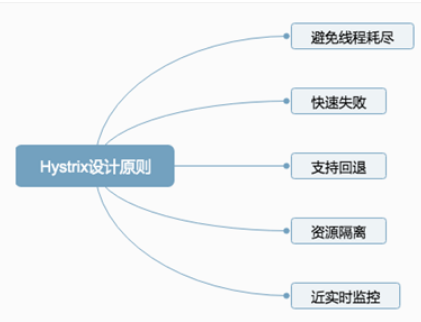
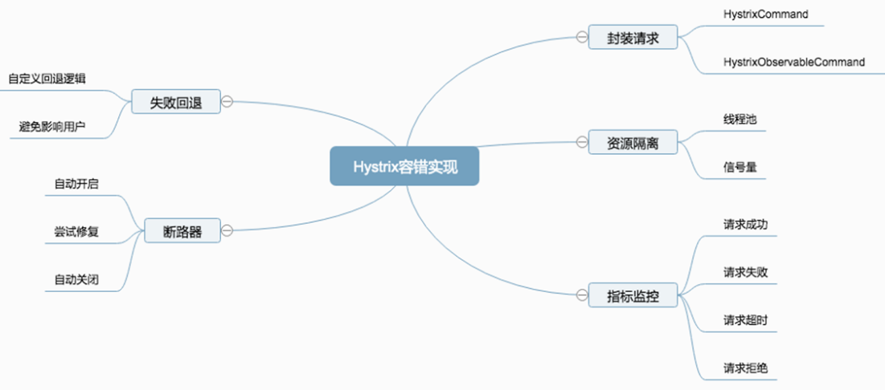
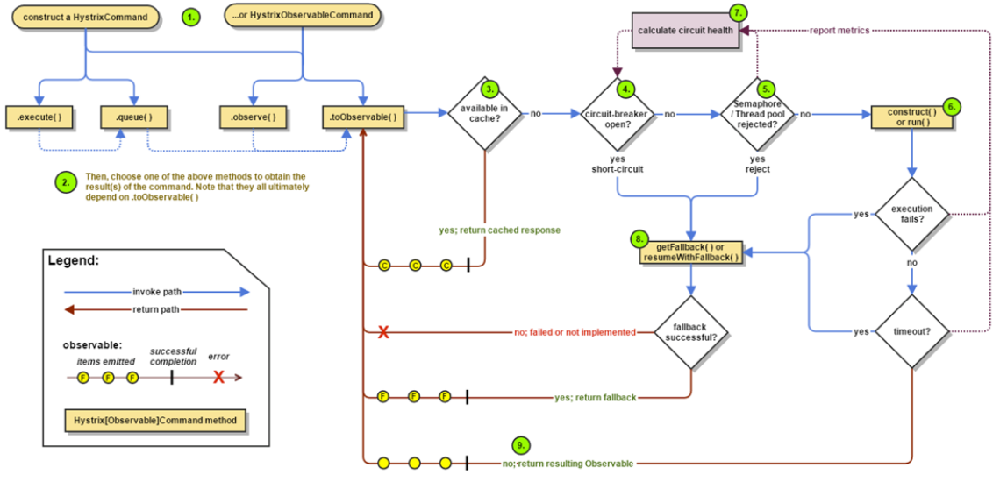
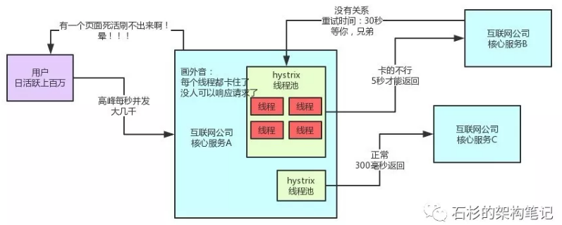
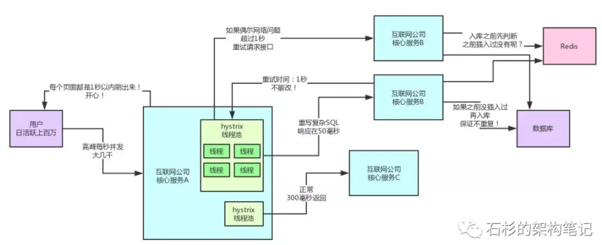
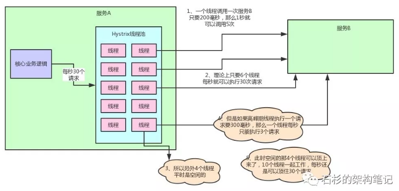
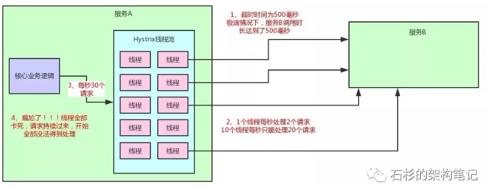
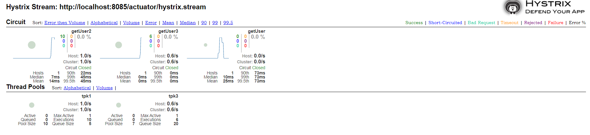
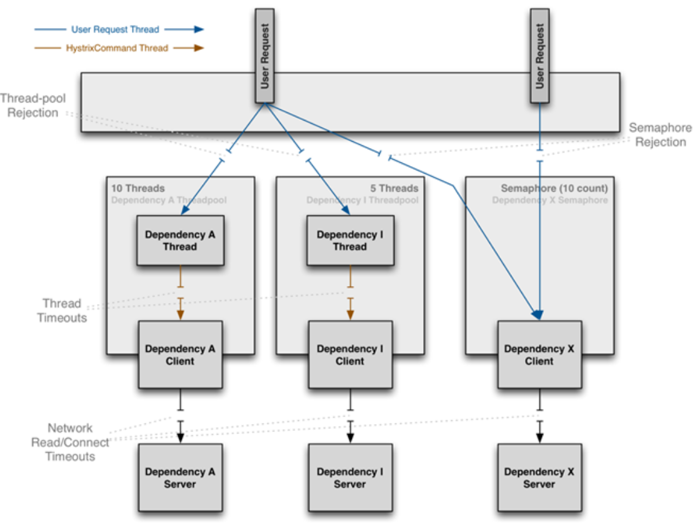

<!-- TOC -->

- [1、为什么需要熔断降级](#1为什么需要熔断降级)
- [2、Hystrix 中基于自反馈调节熔断状态的算法原理](#2hystrix-中基于自反馈调节熔断状态的算法原理)
- [3、实现高可用原理](#3实现高可用原理)
    - [1、线上经验—如何设置Hystrix线程池大小](#1线上经验如何设置hystrix线程池大小)
    - [2、线上经验—如何设置请求超时时间](#2线上经验如何设置请求超时时间)
    - [3、服务降级](#3服务降级)
- [4、Hystrix 使用](#4hystrix-使用)
- [5、Hystrix 配置](#5hystrix-配置)
- [6、Hystrix 监控](#6hystrix-监控)
- [7、@HystrixCommand原理](#7hystrixcommand原理)
- [8、Hystrix 使用小经验](#8hystrix-使用小经验)
    - [1、配置可以对接配置中心进行动态调整](#1配置可以对接配置中心进行动态调整)
    - [2、回退逻辑中可以手动埋点或者通过输出日志进行告警](#2回退逻辑中可以手动埋点或者通过输出日志进行告警)
    - [3、用了线程池隔离模式再用 ThreadLocal 会有坑](#3用了线程池隔离模式再用-threadlocal-会有坑)
    - [4、网关中尽量用信号量隔离](#4网关中尽量用信号量隔离)
    - [5、插件机制可以实现很多扩展](#5插件机制可以实现很多扩展)
    - [6、Hystrix 各种超时配置方式](#6hystrix-各种超时配置方式)
    - [7、commandKey、groupKey、threadPoolKey 的使用。](#7commandkeygroupkeythreadpoolkey-的使用)
- [参考](#参考)

<!-- /TOC -->

`功能：提供系统的高可用。系统设计时候要使用一定的降级策略，来保证当服务提供方服务不可用时候，服务调用方可以切换到降级后的策略进行执行，Hystrix作为熔断器组件使用范围还是很广泛的.`


在微服务架构下，很多服务都相互依赖，如果不能对依赖的服务进行隔离，那么服务本身也有可能发生故障，Hystrix 通过 HystrixCommand 对调用进行隔离，这样可以阻止故障的连锁反应，能够快速失败并迅速恢复服务或者进行回退并优雅降级。

Spring Cloud 将原生 Hystrix 整合进来，提供了最简洁的使用方式，并且跟 Feign、Zuul 等组件做了集成，极大的降低了使用的难度。



这里总结了 Hystrix 的 5 条设计原则，首先我们看看第一条设计原则避免线程耗尽，由于被调用方出现问题，调用方无法及时获取响应结果，而一直在发送请求，最终会耗尽所有线程的资源。

快速失败指的是当被调用方出现问题后，调用方发起的请求可以快速失败并返回，这样就不用一直阻塞住，同时也释放了线程资源。

支持回退指的是在失败后，我们可以让用户有回退的逻辑，比如获取备用数据，从缓存中获取数据，记录日志等操作。

资源隔离是设计原则里最重要的，当你的服务依赖了 A、B、C 三个服务，当只有 C 服务出问题的时候，如果没做隔离，最终也会发生雪崩效应，导致整个服务不可用，如果我们进行了资源隔离，A、B、C 三个服务都是相互隔离的，即使 C 服务出问题了，那也不影响 A 和 B。这其实就跟不要把所有的鸡蛋放进一个篮子里是一样的道理。

近实时监控也非常重要，它能帮助我们了解整个系统目前的状态，有哪些服务有问题，当前流量有多大，出问题后及时告警等。




封装请求会将用户的操作进行统一封装，统一封装的目的在于进行统一控制。

资源隔离会将对应的资源按照指定的类型进行隔离，比如线程池和信号量，详细的隔离机制会在后面进行讲解。

失败回退其实是一个备用的方案，就是说当请求失败后，有没有备用方案来满足这个请求的需求。Hystrix 中会让用户去自定义备用方案。

断路器这个是最核心的，断路器决定了请求是否需要真正的执行，如果断路器处于打开的状态，那么所有请求都将失败，执行回退逻辑。如果断路器处于关闭状态，那么请求将会被正常执行，断路器的原理后面会进行讲解。

指标监控会对请求的生命周期进行监控，请求是成功了，还是失败了，是超时了，还是被拒绝了，都会被监控起来。




这张图是 Hystrix 在 GitHub 主页上提供的，详细的展示了 Hystrix 的工作原理。通过此图可以看出，整个工作流程分为 9 个主要步骤。

第 1 步是构建一个 HystrixCommand 或者 HystrixObservableCommand 对象，将请求包装到 Command 对象中。第 2 步就是执行构建好的命令。第 3 步是判断当前请求是否有缓存，如果在缓存中就直接返回缓存的内容。

第 4 步是判断断路器是否处于打开的状态，如果是打开状态，那么 Hystrix 就不再会去执行命令，直接跳到第 8 步，获取 fallback 方法，执行 fallback 逻辑，也就是前面我们的讲的回退逻辑。
 
如果断路器没有打开，那么继续执行第 5 步，判断是否能够执行该命令，如果是线程池隔离模式，会判断线程池队列的容量，如果是信号量隔离模式，会判断信号量的值是否已经被使用完。

如果线程池和信号量都已经满了，那么同样请求不会再执行，会直接跳到第 8 步。

如果容量满足执行条件，那么继续第 6 步，执行 HystrixObservableCommand.construct() 或者  HystrixCommand.run() 方法，正在执行的请求逻辑就封装在 construct() 或者 run() 方法中。

在执行过程中，如果出现异常或超时，会直接到第 8 步，执行成功就返回结果，需要注意的是执行的结果会将数据上报给断路器，断路器会根据上报的数据来判断断路器是否打开。到此为止，整个 Hystrix 的工作便完成了。

# 1、为什么需要熔断降级

在分布式系统架构中多个系统之间通常是通过远程RPC调用进行通信，也就是 A 系统调用 B 系统服务，B 系统调用 C 系统的服务。当尾部应用 C 发生故障而系统 B 没有服务降级时候可能会导致 B，甚至系统 A 瘫痪，这种现象被称为`雪崩现象`。所以在系统设计时候要使用一定的降级策略，来保证当服务提供方服务不可用时候，服务调用方可以切换到降级后的策略进行执行。

# 2、Hystrix 中基于自反馈调节熔断状态的算法原理

我们可以把熔断器想象为一个保险丝，在电路系统中，一般在所有的家电系统连接外部供电的线路中间都会加一个保险丝，当外部电压过高，达到保险丝的熔点时候，保险丝就会被熔断，从而可以切断家电系统与外部电路的联通，进而保障家电系统不会因为电压过高而损坏。

Hystrix提供的熔断器就有类似功能，当在一定时间段内服务调用方调用服务提供方的服务的次数达到设定的阈值，并且出错的次数也达到设置的出错阈值，就会进行服务降级，让服务调用方之间执行本地设置的降级策略，而不再发起远程调用。但是Hystrix提供的熔断器具有自我反馈，自我恢复的功能，Hystrix会根据调用接口的情况，让熔断器在closed,open,half-open三种状态之间自动切换。

- open状态说明打开熔断，也就是服务调用方执行本地降级策略，不进行远程调用。
- closed状态说明关闭了熔断，这时候服务调用方直接发起远程调用。
- half-open状态，则是一个中间状态，当熔断器处于这种状态时候，直接发起远程调用。

三种状态的转换：

- closed->open:正常情况下熔断器为closed状态，当访问同一个接口次数超过设定阈值并且错误比例超过设置错误阈值时候，就会打开熔断机制，这时候熔断器状态从closed->open。

- open->half-open:当服务接口对应的熔断器状态为open状态时候，所有服务调用方调用该服务方法时候都是执行本地降级方法，那么什么时候才会恢复到远程调用那？Hystrix提供了一种测试策略，也就是设置了一个时间窗口，从熔断器状态变为open状态开始的一个时间窗口内，调用该服务接口时候都委托服务降级方法进行执行。如果时间超过了时间窗口，则把熔断状态从open->half-open,这时候服务调用方调用服务接口时候，就可以发起远程调用而不再使用本地降级接口，如果发起远程调用还是失败，则重新设置熔断器状态为open状态，从新记录时间窗口开始时间。

- half-open->closed: 当熔断器状态为half-open,这时候服务调用方调用服务接口时候，就可以发起远程调用而不再使用本地降级接口，如果发起远程调用成功，则重新设置熔断器状态为closed状态。那么有一个问题，用来判断熔断器从closed->open转换的数据是哪里来的那？其实这个是HystrixCommandMetrics对象来做的，该对象用来存在HystrixCommand的一些指标数据，比如接口调用次数，调用接口失败的次数等等，后面我们会讲解。

# 3、实现高可用原理


> 业务场景介绍




如上图，核心服务A调用了核心服务B和C，在核心服务B响应过慢时，会导致核心服务A的某个线程池全部卡死。但是此时因为你用了hystrix做了资源隔离，所以核心服务A是可以正常调用服务C的，那么就可以保证用户起码是可以使用APP的部分功能的，只不过跟服务B关联的页面刷不出来，功能无法使用罢了。当然这种情况在生产系统中，是绝对不被允许的，所以大家不要让上述情况发生。系统优化成了下图这样：



要保证一个hystrix线程池可以轻松处理每秒钟的请求.同时还有合理的超时时间设置，避免请求太慢卡死线程。


## 1、线上经验—如何设置Hystrix线程池大小

好，现在问题来了，在生产环境中，我们到底应该如何设置服务中每个hystrix线程池的大小？

下面是我们在线上经过了大量系统优化后的生产经验总结：

假设你的服务A，每秒钟会接收30个请求，同时会向服务B发起30个请求，然后每个请求的响应时长经验值大概在200ms，那么你的hystrix线程池需要多少个线程呢？

计算公式是：30（每秒请求数量） * 0.2（每个请求的处理秒数） + 4（给点缓冲buffer） = 10（线程数量）。

如果对上述公式存在疑问，不妨反过来推算一下，为什么10个线程可以轻松抗住每秒30个请求？

一个线程200毫秒可以执行完一个请求，那么一个线程1秒可以执行5个请求，理论上，只要6个线程，每秒就可以执行30个请求。也就是说，线程里的10个线程中，就6个线程足以抗住每秒30个请求了。剩下4个线程都在玩儿，空闲着。那为啥要多搞4个线程呢？很简单，因为你要留一点buffer空间。万一在系统高峰期，系统性能略有下降，此时不少请求都耗费了300多毫秒才执行完，那么一个线程每秒只能处理3个请求了，10个线程刚刚好勉强可以hold住每秒30个请求。所以你必须多考虑留几个线程。
老规矩，给大家来一张图，直观的感受一下整个过程。



## 2、线上经验—如何设置请求超时时间

线程数量OK了，那么请求的超时时间设置为多少？答案是300毫秒。

为啥呢？很简单啊，如果你的超时时间设置成了500毫秒，想想可能会有什么后果？考虑极端情况，如果服务B响应变慢，要500毫秒才响应，你一个线程每秒最多只能处理2个请求了，10个线程只能处理20个请求。而每秒是30个请求过来，结局会如何？咱们回看一下第一张图就知道了，大量的线程会全部卡死，来不及处理那么多请求，最后用户会刷不出来页面。还是有点不理解？再给你一张图，让你感受一下这个不合理的超时时间导致的问题！



如果你的线程池大小和超时时间没有配合着设置好，很可能会导致服务B短暂的性能波动，瞬间导致服务A的线程池卡死，里面的线程要卡顿一段时间才能继续执行下一个请求。

哪怕一段时间后，服务B的接口性能恢复到200毫秒以内了，服务A的线程池里卡死的状况也要好一会儿才能恢复过来。

你的超时时间设置的越不合理，比如设置的越长，设置到了1秒、2秒，那么这种卡死的情况就需要越长的时间来恢复。

所以说，此时你的超时时间得设置成300毫秒，保证一个请求300毫秒内执行不完，立马超时返回。

这样线程池里的线程不会长时间卡死，可以有条不紊的处理多出来的请求，大不了就是300毫秒内处理不完立即超时返回，但是线程始终保持可以运行的状态。

这样当服务B的接口性能恢复到200毫秒以内后，服务A的线程池里的线程很快就可以恢复。

这就是生产系统上的hystrix参数设置优化经验，你需要考虑到各种参数应该如何设置。

否则的话，很可能会出现上文那样的情况，用了高大上的Spring Cloud架构，结果跟黑盒子一样，莫名其妙系统故障，各种卡死，宕机什么的。

好了，我们继续。如果现在这套系统每秒有6000请求，然后核心服务A一共部署了60台机器，每台机器就是每秒会收到100个请求，那么此时你的线程池需要多少个线程？

很简单，10个线程抗30个请求，30个线程抗100请求，差不多了吧。这个时候，你应该知道服务A的线程池调用服务B的线程池分配多少线程了吧？超时时间如何设置应该也知道了！其实这个东西不是固定死的，但是你要知道他的计算方法。根据服务的响应时间、系统高峰QPS、有多少台机器，来计算出来，线程池的大小以及超时时间！


## 3、服务降级

设置完这些后，就应该要考虑服务降级的事了。如果你的某个服务挂了，那么你的hystrix会走熔断器，然后就会降级，你需要考虑到各个服务的降级逻辑。

举一些常见的例子：
- 如果查询数据的服务挂了，你可以查本地的缓存

- 如果写入数据的服务挂了，你可以先把这个写入操作记录日志到比如mysql里，或者写入MQ里，后面再慢慢恢复

- 如果redis挂了，你可以查mysql

- 如果mysql挂了，你可以把操作日志记录到es里去，后面再慢慢恢复数据。

具体用什么降级策略，要根据业务来定，不是一成不变的。

> 总结

最后总结一下，排除那些基础设施的故障，你要玩儿微服务架构的话，需要保证两点：

- 首先你的hystrix资源隔离以及超时这块，必须设置合理的参数，避免高峰期，频繁的hystrix线程卡死

- 其次，针对个别的服务故障，要设置合理的降级策略，保证各个服务挂了，可以合理的降级，系统整体可用！


# 4、Hystrix 使用

Hystrix 的使用主要有三种方式，分别是 HystrixCommand 注解方式，在 Feign 中使用，以及在 Zuul 中使用，本课时主要讲解 HystrixCommand 注解方式的使用，Feign 和 Zuul 的集成使用会在后面对应的课时中进行讲解。


首先我们需要在 pom 中增加 spring-cloud-starter-netflix-hystrix 的依赖，然后在启动类上增加 @EnableHystrix 注解，HystrixCommand 注解作用于方法上，哪个方法想要使用 Hystrix 来进行保护，就在这个方法上增加 HystrixCommand 注解。

HystrixCommand 都有默认的配置，我们可以手动指定配置信息，比如 commandKey、groupKey、fallbackMethod 等。

最简便的配置方式还是统一将配置信息放入配置文件中进行管理，我们可以为 HystrixCommand 设置一个 commandKey，然后在配置文件中为这个 commandKey 指定对应的配置信息。比如我们配置 getUser 这个 commandKey 的超时时间和隔离方式，在配置文件中增加

hystrix.command.getUser.execution.isolation.thread.timeoutInMilliseconds = 3000

hystrix.command.getUser.execution.isolation.strategy = SEMAPHORE

这 2 行代码即可。

我们来调用下 user-service 的接口，将 user-service 接口稍微改造下，休眠 10 秒钟后再返回，这样的话我们在调用的时候需要等待 10 秒钟才能得到返回结果，如果在高并发场景下，很多请求就会阻塞在这里，这种场景下我们需要超时、快速失败等机制来避免资源耗尽的问题，所以我们使用了 Hystrix 来解决这个问题，我们在 get 方法上增加了 HystrixCommand 注解，设置了超时时间为 3 秒钟，如果 3 秒钟还没返回结果，那么该请求就会超时，执行 fallback 方法中的逻辑返回给调用方。

```java
@HystrixCommand(commandKey="getUser", groupKey="user", fallbackMethod = "fallback", threadPoolKey ="tpk1",
			commandProperties = {
					@HystrixProperty(name = "execution.isolation.thread.timeoutInMilliseconds", value = "3000") 
			}
	)
	@GetMapping("/get")
	public Object get() {
		System.err.println(Thread.currentThread().getName());
		User user = restTemplate.getForEntity("http://user-service/user/get?id=1", User.class).getBody();
		return user;
	}
```

# 5、Hystrix 配置


Hystrix 的配置项比较多，在这里整理了几个比较常用的配置，所有的配置基本上都有默认值，如果我们需要调整这些配置，可以参考 PPT 中给出的链接。

隔离策略，我们需要根据不同的场景来选择合适的策略，可选择的策略有线程和信号量。命令执行的超时时间，这个只对线程隔离有效，信号量隔离不支持超时，当命令执行的时间超过了我们设定的时间，那么就会超时。


信号量隔离需要给信号量设定一个值，这个值表示最大的并发请求数量，超出这个数量就会拒绝请求，很多人在做压力测试的时候没有去调整该配置，压测时发现性能上不去，这就是没仔细看文档的后果。


断路器开关的控制这个也挺常用的，在某些场景下，我们可能需要手动进行降级，这个时候就可以将断路器强制打开，这样就会拒绝所有请求。

如果使用线程隔离方式，需要调整好线程池的参数，否则跟信号量一样，并发量大的时候性能上不去。设置最大的线程数，默认为 10，然后就是队列的大小，这决定了能够堆积多少个请求。但请求也不能一直堆积，所以我们还需要设置一个阈值来进行拒绝。

# 6、Hystrix 监控

搭建一个 Hystrix 的 Dashboard，首先需要创建一个单独的 hystrix-dashboard 的项目，加入 spring-cloud-starter-netflix-hystrix-dashboard 的依赖，启动类上增加 @EnableHystrixDashboard 注解。

启动项目，在浏览器中访问，就可以看到 Dashboard 的主页了。需要对项目进行监控，首先要有对应的 Stream 地址，Stream 产生数据源，我们在被监控的项目中加入 spring-boot-starter-actuator，只有加入了 actuator 才能暴露出 hystrix.stream 端点，访问下 hystrix.stream 端点，可以看到一直在输出内容 ping:，这个时候证明没有监控数据产生，我们访问下之前添加了 HystrixCommand 的方法，这样就会产生监控数据了，然后再看下 hystrix.stream 你会发现，已经有数据在不断输出了。

 

然后我们将这个 hystrix.steam 的地址输入到 Dashboard 的主页中，点击 monitor 按钮，就可以看到对应的图形化页面了。

http://localhost:8888/hystrix


在 Hystrix 的设计原则中我们提到了近实时监控，Hystrix 会实时记录所有 HystrixCommand 的执行信息，其中有每秒执行了多少次请求，多少次是成功的，多少次是失败的等信息。

这些信息我们可以通过 Hystrix Dashboard 来进行图形化的展示，能够更直观的看出系统当前的运行状态。

在 Hystrix Dashboard 主页面，我们可以输入需要监控的 Stream 地址，Stream 地址会输出监控的原始数据，Dashboard 就是将这些数据图形化展示。      



通过 Dashboard 将请求的情况展示出来，每一块都是一个Command，Command 区域背景色的圆圈越大表示流量越大，绿色的数字表示请求成功的短路的计数，当断路器处于打开状态时，被拦截的请求就是短路的数量。黄色的数字表示超时的请求数，紫色数字表示请求被拒绝的数量。红色的数字表示请求失败的数量。


# 7、@HystrixCommand原理

使用 HystrixCommand 注解确实比较方便，这样我们就不用自己去将请求包装成 Command 执行，将这个包装的过程交给框架内部处理，这也是框架存在的价值。

HystrixCommand 注解的原理其实很简单，在 Hystrix 中有一个 HystrixCommandAspect 专门负责将加了 HystrixCommand 的方法在执行时进行包装。我们打开 HystrixCommandAspect 的源码，可以看到加入了 HystrixCommand 和 HystrixCollapser 两个注解，内部就是获取 Method、判断、包装，最后执行。



Hystrix 支持线程池和信号量两种隔离方式，线程池隔离是当用户请求到 A 服务后，A 服务需要调用其他服务，这个时候可以为不同的服务创建独立的线程池，假如 A 需要调用 B 和 C，那么可以创建 2 个独立的线程池，将调用 B 服务的线程丢入到一个线程池，将调用 C 服务的线程丢入到另一个线程池，这样就起到隔离效果，就算其中某个线程池请求满了，无法处理请求了，对另一个线程池也没有影响。

信号量隔离就比较简单了，信号量就是一个计数器，比如初始化值是 100，那么每次请求过来的时候就会减 1，当信号量计数为 0 的时候，请求就会被拒绝，等之前的请求处理完成后，信号量会加 1，同时也起到了限流的作用，这就是信号量隔离，信号量隔离是在请求主线程中执行的。


线程池隔离的特点是 Command 运行在独立的线程池中，可以支持超时，是单独的线程，支持异步。信号量隔离运行在调用的主线程中，不支持超时，只能同步调用。


# 8、Hystrix 使用小经验

Hystrix 的使用还是比较简单的，很多工作框架都已经帮我们实现好了，但在实际使用中，我们还是会遇到很多问题，我总结了一些 Hystrix 使用中的小经验，在这边分享给你，这些对你在面试中也很有帮助，如果你只说用了 HystrixCommand 注解，却说不出其他经验，面试效果可想而知，如果你能说出最基本的使用，还能说自己在工作中遇到了一些什么样的问题，然后怎么去解决的，总结了以下几点经验，详细的讲给面试官听，强势扭转面试局势。


## 1、配置可以对接配置中心进行动态调整

Hystrix 的配置项非常多，在前面我建议大家只设置一个 CommandKey，其他的都在配置中进行指定，不要在注解中写上所有的配置，这种方式可行，但是不是最好的，因为它只能在代码中修改。像很多配置，我们都会根据当时的流量情况来进行调整，如果不对接配置中心，这个工作太难了。其实 Hystrix 内部默认使用 Archaius 来实现的动态配置， Archaius 是 Netflix 的配置框架，也可以直接用 Archaius 来动态管理 Hystrix 的配置信息。

 

## 2、回退逻辑中可以手动埋点或者通过输出日志进行告警

当请求失败或者超时，会执行回退逻辑，如果有大量的回退，则证明某些服务出问题了，这个时候我们可以在回退的逻辑中进行埋点操作，上报数据给监控系统，也可以输出回退的日志，统一由日志收集的程序去进行处理，这些方式都可以将问题暴露出去，然后通过实时数据分析进行告警操作，当然这只是一个入口，对 Hystrix 进行监控的方式有很多种，我们可以扩展 Hystrix 的插件进行数据收集，也可以分析 Hystrix.stream 端点的数据来进行告警。

 
## 3、用了线程池隔离模式再用 ThreadLocal 会有坑

一个请求进来，这时是容器的线程在负责执行，对于同一个线程传递上下文 ThreadLocal 是没有问题的，当我们用了线程池隔离模式的时候，被隔离的方法会包装成一个 Command 丢入到独立的线程池中进行执行，这个时候就是从 A 线程切换到了 B 线程，ThreadLocal 的数据就会丢失，这个问题的解决方案也有多种，可以参考 PPT 中我给的博客链接，这是我之前写的解决方案。

 

## 4、网关中尽量用信号量隔离

之所以建议在网关中用信号量隔离，是因为网关是所有请求的入口，路由的服务数量会很多，几十个到上百个都有可能，如果用线程池隔离，那么需要创建上百个独立的线程池，开销太大了。用信号量隔离开销就小很多，还能起到限流的作用。

 

## 5、插件机制可以实现很多扩展

Hystrix 提供了插件机制，可以通过插件来改变 Hystrix 的行为，比如我们可以使用事件通知的插件来做一些数据收集和告警的工作，可以使用配置插件来改变配置的默认行为，目前默认是 Archaius，我们可以将其改变成其他的配置组件。可以使用并发插件来改变线程池的行为，可以对 Callable 进行装饰，来解决 ThreadLocal 跨线程传递的问题。

 

## 6、Hystrix 各种超时配置方式

Hystrix 中用的最多的配置可能就是超时时间，可以配置全局的默认超时时间，那么在 HystrixCommand、Feign 以及 Zuul  中超时时间怎么配置呢？最核心的点在于你需要知道Hystrix CommandKey 是怎么生成的，知道了 CommandKey，就可以对 CommandKey 进行超时的配置，由于时间关系，就不具体展开讲解了，我之前写了一篇详细的文章，大家可以参考下，链接在 PPT 中。

 

## 7、commandKey、groupKey、threadPoolKey 的使用。

在使用 HystrixCommand 注解的时候，我们会配置 commandKey、groupKey、threadPoolKey，当然这些也可以不用配置，因为有默认值。commandKey 表示这个请求被封装成了 Command 去执行，commandKey 就是这个 command 的名称，我们可以给指定的 commandKey 进行参数的配置。比如 commandKey1 的超时时间我们设置成 3 秒，commandKey2 的超时时间我们可以设置成 10 秒。

 
groupKey 是将一组 command 进行分组，groupKey 就是组的名称，同时如果没有设置 threadPoolKey 的话，那么线程池的名称会用 groupKey。


threadPoolKey 是线程池的名称，多个 command的threadPoolKey 相同，那么会使用同一个线程池。建议大家手动配置一个简短的、友好的 threadPoolKey，同时使用 threadPoolKey 来对 command 进行线程池隔离的划分。


# 参考


- [Hystrix熔断机制原理剖析](http://ifeve.com/hystrix/)

