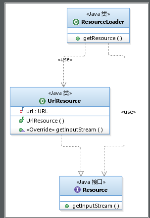
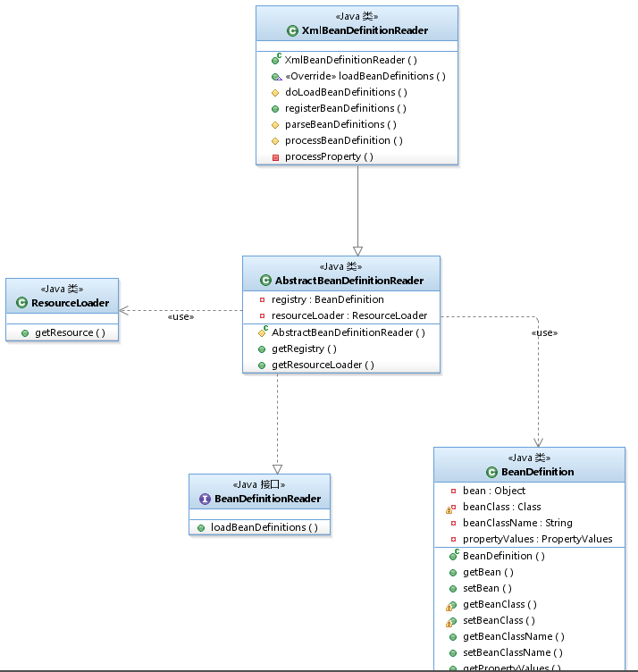
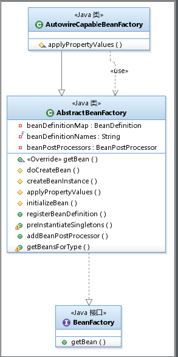
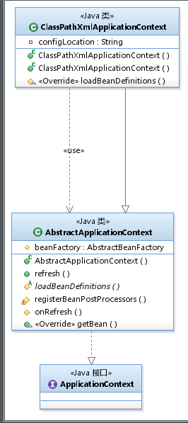
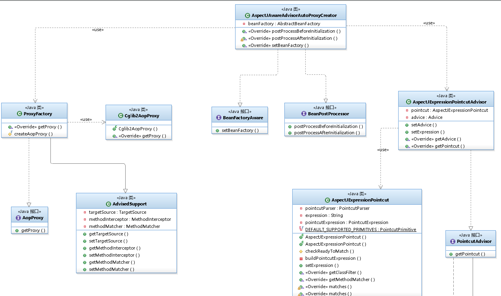
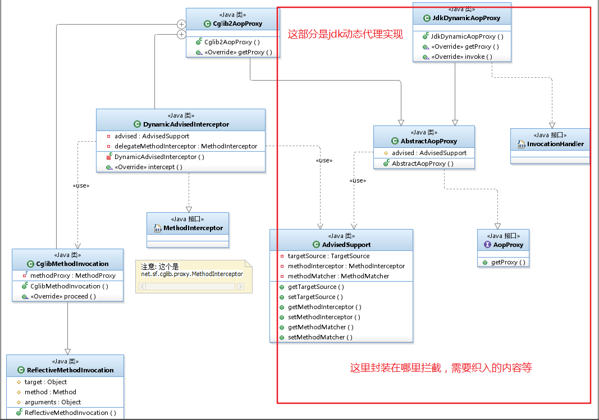
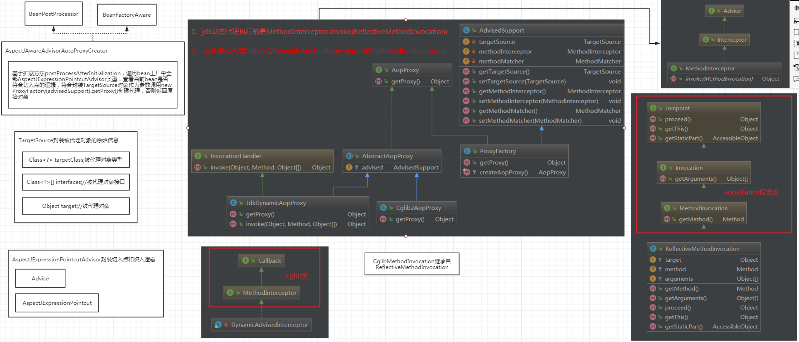
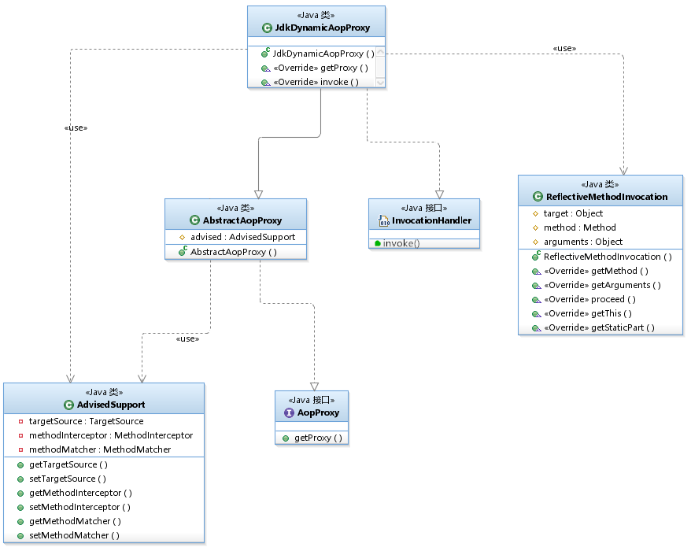
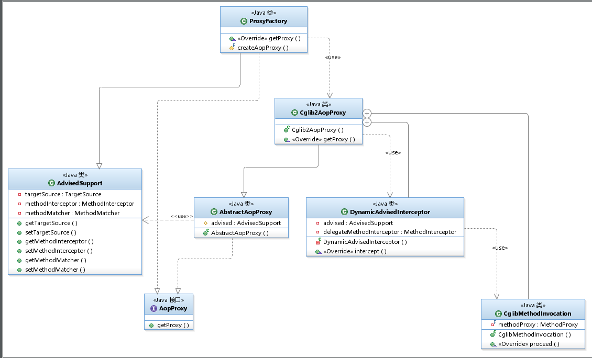

<!-- TOC -->

- [v1:container-register-and-get](#v1container-register-and-get)
- [v2:abstract-beanfactory-and-do-bean-initilizing-in-it](#v2abstract-beanfactory-and-do-bean-initilizing-in-it)
- [v3:inject-bean-with-property](#v3inject-bean-with-property)
- [v4:config-beanfactory-with-xml](#v4config-beanfactory-with-xml)
- [v5:inject-bean-to-bean](#v5inject-bean-to-bean)
- [v6:invite-application-context](#v6invite-application-context)
- [v7:method-interceptor-by-jdk-dynamic-proxy](#v7method-interceptor-by-jdk-dynamic-proxy)
- [v8:invite-pointcut-and-aspectj](#v8invite-pointcut-and-aspectj)
- [v9:auto-create-aop-proxy && invite-cglib-and-aopproxy-factory](#v9auto-create-aop-proxy--invite-cglib-and-aopproxy-factory)
- [v10、支持通过注解来实现aop](#v10支持通过注解来实现aop)
- [IOC容器的实现](#ioc容器的实现)
    - [1、Resource](#1resource)
    - [2、BeanDefinition](#2beandefinition)
    - [3、BeanFactory](#3beanfactory)
    - [4、ApplicationContext](#4applicationcontext)
    - [5、设计模式](#5设计模式)
        - [1、模板方法模式](#1模板方法模式)
        - [2、代理模式](#2代理模式)
- [AOP的实现](#aop的实现)
    - [1、BeanFactory 的构造与执行](#1beanfactory-的构造与执行)
    - [2、ApplicationContext 的构造和执行](#2applicationcontext-的构造和执行)
    - [3、IoC 实现的一些思考与分析](#3ioc-实现的一些思考与分析)
        - [分析 1：AOP 可以在何处被嵌入到 IoC 容器中去？](#分析-1aop-可以在何处被嵌入到-ioc-容器中去)
        - [分析 2：BeanFactory 和 ApplicationContext 设计上的耦合](#分析-2beanfactory-和-applicationcontext-设计上的耦合)
        - [分析 3：tiny-spring 总体流程的分析](#分析-3tiny-spring-总体流程的分析)
    - [4、JDK 对动态代理的支持](#4jdk-对动态代理的支持)
    - [5、AOP 的植入与实现细节](#5aop-的植入与实现细节)
        - [1、在 Bean 初始化过程中完成 AOP 的植入](#1在-bean-初始化过程中完成-aop-的植入)
        - [2、AOP 中动态代理的实现步骤](#2aop-中动态代理的实现步骤)
        - [3、jdk动态代理](#3jdk动态代理)
        - [4、Cglib动态代理](#4cglib动态代理)
    - [6、设计模式](#6设计模式)
        - [1、代理模式](#1代理模式)
        - [2、策略模式](#2策略模式)
    - [7、为 tiny-spring 添加拦截器链](#7为-tiny-spring-添加拦截器链)
    - [一些总结](#一些总结)
- [参考](#参考)

<!-- /TOC -->


`模拟spring IOC和aop的简单实现，学习spring的设计思路。`


> 版本说明

- 第一部分 IoC 容器的实现 对应了 tiny-spring 的 v1 到 v5 部分，这 5 个 step 实现了基本的 IoC 容器，支持singleton类型的bean，包括初始化、属性注入、以及依赖 Bean 注入，可从 XML 中读取配置，XML 读取方式没有具体深入。


- 第二部分 AOP 容器的实现 对应了 tiny-spring 的 step-6 到 step-9 部分。step-10 中对 cglib 的支持没有分析。这 4 个 step 可以使用 AspectJ 的语法进行 AOP 编写，支持接口代理。考虑到 AspectJ 语法仅用于实现 execution("***") 部分的解析，不是主要内容，也可以使用 Java 的正则表达式粗略地完成，因此没有关注这些细节。

# v1:container-register-and-get

需求：提供一个可以实现bean注册和获取的工厂。

新增：简单模拟通过容器注册和获得bean的过程

定义了两个基本类BeanDefinition和BeanFactory，BeanDefinition为生成一个对象bean的元数据抽象。而BeanFactory通过一个Map<String,BeanDefinition> 来实现bean的注册和获取。

IoC最基本的角色有两个：容器(`BeanFactory`)和Bean本身。这里使用`BeanDefinition`来封装了bean对象，这样可以保存一些额外的元信息。


```java
public class BeanFactoryTest {
    @Test
    public void test() {
        // 1.初始化beanfactory
        BeanFactory beanFactory = new BeanFactory();

        // 2.注入bean
        BeanDefinition beanDefinition = new BeanDefinition(new HelloWorldService());
        beanFactory.registerBeanDefinition("helloWorldService", beanDefinition);

        // 3.获取bean
        HelloWorldService helloWorldService = (HelloWorldService) beanFactory.getBean("helloWorldService");
        helloWorldService.helloWorld();
    }
}
```


# v2:abstract-beanfactory-and-do-bean-initilizing-in-it

需求：使得工厂具有通过一个类的元数据生产bean对象的能力。

v1中的bean是初始化好之后再set进去的，实际使用中，我们希望容器来管理bean的创建。于是我们将bean的初始化放入BeanFactory中。为了保证扩展性，我们使用Extract Interface的方法，将`BeanFactory`替换成接口，而使用`AbstractBeanFactory`和`AutowireCapableBeanFactory`作为其实现。"AutowireCapable"的意思是“可自动装配的”，为我们后面注入属性做准备。


新增：模拟抽象spring的工厂类

- 定义了工厂接口BeanFactory：`抽象的工厂接口，定义了通过工厂获得bean和注册bean的方法`

- 一个抽象类AbstractBeanFactory：`实现了获得bean和注册bean的逻辑，通过一个map来维护bean信息,使用模板方法，定义一个抽象如何基于BeanDefinition创建bean的抽象方法doCreateBean`

- 一个工厂的默认实现自动装配工厂AutowireCapableBeanFactory: `实现了模板方法doCreateBean，根据beanDefinition中的类对象，构建一个实例对象beanDefinition.getBeanClass().newInstance()`


```java
public class BeanFactoryTest {
    @Test
    public void test() {
        // 1.初始化beanfactory
        BeanFactory beanFactory = new AutowireCapableBeanFactory();

        // 2.注入bean
        BeanDefinition beanDefinition = new BeanDefinition();
        beanDefinition.setBeanClassName("com.ls.mini.spring.ioc.HelloWorldService");//指定类的全限定名即可，通过反射机制
        beanFactory.registerBeanDefinition("helloWorldService", beanDefinition);

        // 3.获取bean
        HelloWorldService helloWorldService = (HelloWorldService) beanFactory.getBean("helloWorldService");
        helloWorldService.helloWorld();

    }
}
```


# v3:inject-bean-with-property


这一步，我们想要为bean注入属性。我们选择将属性注入信息保存成`PropertyValue`对象，并且保存到`BeanDefinition`中。这样在初始化bean的时候，我们就可以根据PropertyValue来进行bean属性的注入。Spring本身使用了setter来进行注入，这里为了代码简洁，我们使用Field的形式来注入。


需求:使得工厂生成的bean对象可以通过元数据的形式设置字段属性。

新增：在BeanDefinition中新增PropertyValues字段，封装了构建bean的一些属性，用于bean的初始化。在com.ls.mini.spring.ioc.factory.AutowireCapableBeanFactory.doCreateBean中，把实例化bean，分为两步：

- 1、创建对象；createBeanInstance（通过类的反射构建对象）；
- 2、设置bean的属性:applyPropertyValues，属性值的来源是从BeanDefinition，即bean定义的元数据信息中获取；`借助于字段Field的反射`


`这里需要注意的是，对于对象中的每一个属性抽象封装为一个对象PropertyValue（类似于key-value封装的一个元素），一个对象的全部属性字段抽象为一个PropertyValues（通过list封装）`

```java
public class BeanFactoryTest {
    @Test
    public void test() throws Exception {
        // 1.初始化beanfactory
        BeanFactory beanFactory = new AutowireCapableBeanFactory();

        // 2.bean定义
        BeanDefinition beanDefinition = new BeanDefinition();
        beanDefinition.setBeanClassName("com.ls.mini.spring.ioc.HelloWorldService");

        // 3.设置属性
        PropertyValues propertyValues = new PropertyValues();
        propertyValues.addPropertyValue(new PropertyValue("text", "Hello World!"));
        beanDefinition.setPropertyValues(propertyValues);

        // 4.生成bean
        beanFactory.registerBeanDefinition("helloWorldService", beanDefinition);

        // 5.获取bean
        HelloWorldService helloWorldService = (HelloWorldService) beanFactory.getBean("helloWorldService");
        helloWorldService.helloWorld();

    }
}
```

# v4:config-beanfactory-with-xml


这么大一坨初始化代码让人心烦。这里的`BeanDefinition`只是一些配置，我们还是用xml来初始化吧。我们定义了`BeanDefinitionReader`初始化bean，它有一个实现是`XmlBeanDefinitionReader`。


需求：通过xml配置一个bean对象，然后对其进行解析，注册到工厂中。


新增：

- 1、Resource解决从哪里获取bean定义的资源文件，即解决数据从哪里来的问题。一个是资源定位Resource（返回输入流对象InputStream）接口以及对应的实现类UrlResource,通过工具类ResourceLoader实现在指定位置location获取到xml文件的InputStream。

- 2、需要解析如何解析配置文件的问题。需要定义一个接口BeanDefinitionReader解析出这个xml文件流配置了那些bean对象（可能不止一个），因此解析配置文件的接口需要定义一个地方暂存解析到的bean，而且可能存在多种方式获取配置信息，因此这里提供一个抽象类进行隔离AbstractBeanDefinitionReader，具体从哪里加载，如何解析，交给子类实现XmlBeanDefinitionReader。


主要实现了从xml配置文件解析配置的bean信息，生成BeanDefinition并注册到bean的容器中。


```java
public class BeanFactoryTest {
    @Test
    public void test() throws Exception {
        // 1.读取配置
        XmlBeanDefinitionReader xmlBeanDefinitionReader = new XmlBeanDefinitionReader(new ResourceLoader());
        xmlBeanDefinitionReader.loadBeanDefinitions("tinyioc.xml");

        // 2.初始化BeanFactory并注册bean，把解Registry中解析到的BeanDefinition遍历注册到工厂
        BeanFactory beanFactory = new AutowireCapableBeanFactory();
        for (Map.Entry<String, BeanDefinition> beanDefinitionEntry : xmlBeanDefinitionReader.getRegistry().entrySet()) {
            beanFactory.registerBeanDefinition(beanDefinitionEntry.getKey(), beanDefinitionEntry.getValue());
        }

        // 3.获取bean
        HelloWorldService helloWorldService = (HelloWorldService) beanFactory.getBean("helloWorldService");
        helloWorldService.helloWorld();

    }
}

```


# v5:inject-bean-to-bean


使用xml配置之后，似乎距离我们熟知的Spring更近了一步！但是现在有一个大问题没有解决：我们无法处理bean之间的依赖，无法将bean注入到bean中，所以它无法称之为完整的IoC容器！如何实现呢？我们定义一个`BeanReference`，来表示这个属性是对另一个bean的引用。这个在读取xml的时候初始化，并在初始化bean的时候，进行解析和真实bean的注入。同时为了解决循环依赖的问题，我们使用lazy-init的方式，将createBean的事情放到`getBean`的时候才执行，是不是一下子方便很多？这样在注入bean的时候，如果该属性对应的bean找不到，那么就先创建！因为总是先创建后注入，所以不会存在两个循环依赖的bean创建死锁的问题。


需要：懒加载机制-即注册的时候并不实例化对象，在公共getbean获取的时候再进行实例化。


新增：

- 1、容器bean的懒加载机制，在初始化的时候仅仅是解析配置文件的信息到BeanDefinition然后注册到map中，此时，并没有实例化BeanDefinition中的bean，在使用getbean的时候，会首先判断BeanDefinition是否注册，没有的话报错；假如注册过的话，在检测BeanDefinition.getbean是否已经实例化了，没有的话进行实例化；
- 2、容器中新增一个list用来保存当前注册过的beanname，在需要的时候通过遍历这个list可以实现预实例化全部的bean对象。


`这里针对属性也是一个对象时，封装这样的属性对象为BeanReference`


这里面也出现了循环引用的问题。比如下面这样的配置：

```xml

    <bean name="outputService" class="com.ls.mini.spring.ioc.OutputService">
        <property name="helloWorldService" ref="helloWorldService"></property>
    </bean>

    <bean name="helloWorldService" class="com.ls.mini.spring.ioc.HelloWorldService">
        <property name="text" value="Hello World!"></property>
        <property name="outputService" ref="outputService"></property>
    </bean>
```

这里的解决方式是，在解析xml配置文件的时候，如果遇到ref标签是把当前属性的value包裹成一个引用对象BeanReference，放在对象的属性列表propertyValues中，这时并没有初始化ref引用的对象。当在通过getbean获取的时候，比如这里获取helloWorldService，先对当前对象反射实例化，然后需要检查当前对象是否有BeanReference这种类型的属性值，有的话调用getbean（）获取outputService；同样在处理outputService中的ref属性也是会调用getbean（）获取helloWorldService，但是此时可以获取到helloWorldService实例化对象。


```java
public class BeanFactoryTest {
    @Test
    public void testLazy() throws Exception {
        // 1.读取配置
        XmlBeanDefinitionReader xmlBeanDefinitionReader = new XmlBeanDefinitionReader(new ResourceLoader());
        xmlBeanDefinitionReader.loadBeanDefinitions("tinyioc.xml");

        // 2.初始化BeanFactory并注册bean
        AbstractBeanFactory beanFactory = new AutowireCapableBeanFactory();
        for (Map.Entry<String, BeanDefinition> beanDefinitionEntry : xmlBeanDefinitionReader.getRegistry().entrySet()) {
            beanFactory.registerBeanDefinition(beanDefinitionEntry.getKey(), beanDefinitionEntry.getValue());
        }

        // 3.获取bean
        HelloWorldService helloWorldService = (HelloWorldService) beanFactory.getBean("helloWorldService");
        helloWorldService.helloWorld();
    }

    @Test
    public void testPreInstantiate() throws Exception {
        // 1.读取配置
        XmlBeanDefinitionReader xmlBeanDefinitionReader = new XmlBeanDefinitionReader(new ResourceLoader());
        xmlBeanDefinitionReader.loadBeanDefinitions("tinyioc.xml");

        // 2.初始化BeanFactory并注册bean
        AbstractBeanFactory beanFactory = new AutowireCapableBeanFactory();
        for (Map.Entry<String, BeanDefinition> beanDefinitionEntry : xmlBeanDefinitionReader.getRegistry().entrySet()) {
            beanFactory.registerBeanDefinition(beanDefinitionEntry.getKey(), beanDefinitionEntry.getValue());
        }

        // 3.初始化bean
        beanFactory.preInstantiateSingletons();

        // 4.获取bean
        HelloWorldService helloWorldService = (HelloWorldService) beanFactory.getBean("helloWorldService");
        helloWorldService.helloWorld();
    }
}

```


# v6:invite-application-context

现在BeanFactory的功能齐全了，但是使用起来有点麻烦。于是我们引入熟悉的`ApplicationContext`接口，并在`AbstractApplicationContext`的`refresh()`方法中进行bean的初始化工作。是不是非常熟悉？至此为止，我们的tiny-spring的IoC部分可说完工了。这部分的类、方法命名和作用，都是对应Spring中相应的组件。虽然代码量只有400多行，但是已经有了基本的IoC功能！


需求：设计一个和spring的ClassPathXmlApplicationContext类似的工厂

新增接口ApplicationContext、AbstractApplicationContext、ClassPathXmlApplicationContext

定义一个接口空接口ApplicationContext实现工厂接口BeanFactory，然后定义一个抽象类AbstractApplicationContext实现ApplicationContext，内部通过代理AbstractBeanFactory实例，来间接实现了BeanFactory`可见这里使用组合模式，通过代理使得AbstractApplicationContext基于工厂接口的功能`，并且定义一个空接口refresh()来实现注册bean的功能。

ClassPathXmlApplicationContext（继承AbstractApplicationContext）类接收一个配置文件位置location，然后内部实例化一个自动装配工厂AutowireCapableBeanFactory，并在构造函数中调用refresh()，即构造时完成容器的初始化。

```java
public class ApplicationContextTest {

    @Test
    public void test() throws Exception {
        ApplicationContext applicationContext = new ClassPathXmlApplicationContext("tinyioc.xml");
        HelloWorldService helloWorldService = (HelloWorldService) applicationContext.getBean("helloWorldService");
        helloWorldService.helloWorld();
    }
}
```

> AOP部分

AOP分为配置(Pointcut，Advice)，织入(Weave)两部分工作，当然还有一部分是将AOP整合到整个容器的生命周期中。


# v7:method-interceptor-by-jdk-dynamic-proxy


织入（weave）相对简单，我们先从它开始。Spring AOP的织入点是`AopProxy`，它包含一个方法`Object getProxy()`来获取代理后的对象。

在Spring AOP中，我觉得最重要的两个角色，就是我们熟悉的`MethodInterceptor`和`MethodInvocation`（这两个角色都是AOP联盟的标准），它们分别对应AOP中两个基本角色：`Advice`和`Joinpoint`。Advice定义了在切点指定的逻辑，而Joinpoint则代表切点。

```java
public interface MethodInterceptor extends Interceptor {
	
    Object invoke(MethodInvocation invocation) throws Throwable;
}
```

Spring的AOP只支持方法级别的调用，所以其实在AopProxy里，我们只需要将MethodInterceptor放入对象的方法调用即可。

我们称被代理对象为`TargetSource`，而`AdvisedSupport`就是保存TargetSource和MethodInterceptor的元数据对象。这一步我们先实现一个基于JDK动态代理的`JdkDynamicAopProxy`，它可以对接口进行代理。于是我们就有了基本的织入功能。


需求：引入jdk动态代理

引入了jar包：aopalliance

```xml
<dependency>
    <groupId>aopalliance</groupId>
    <artifactId>aopalliance</artifactId>
    <version>1.0</version>
</dependency>
```

编写项目中aop包下的jdk动态代理，依赖于下面的两个接口

- org.aopalliance.intercept.MethodInterceptor

- org.aopalliance.intercept.MethodInvocation


核心逻辑是借助于MethodInterceptor调用invoke(MethodInvocation），引入的切面逻辑定义在接口MethodInterceptor的实现类中。

```java
public interface MethodInterceptor extends Interceptor {
    Object invoke(MethodInvocation var1) throws Throwable;
}
```

测试代码

```java
public class JdkDynamicAopProxyTest {
    @Test
    public void testInterceptor() throws Exception {
        // --------- helloWorldService without AOP
        ApplicationContext applicationContext = new ClassPathXmlApplicationContext("tinyioc.xml");
        HelloWorldService helloWorldService = (HelloWorldService) applicationContext.getBean("helloWorldService");
        helloWorldService.helloWorld();

        // --------- helloWorldService with AOP
        // 1. 设置被代理对象(Joinpoint)
        AdvisedSupport advisedSupport = new AdvisedSupport();
        TargetSource targetSource = new TargetSource(helloWorldService, HelloWorldService.class);
        advisedSupport.setTargetSource(targetSource);

        // 2. 设置拦截器(Advice)
        TimerInterceptor timerInterceptor = new TimerInterceptor();
        advisedSupport.setMethodInterceptor(timerInterceptor);

        // 3. 创建代理(Proxy)
        JdkDynamicAopProxy jdkDynamicAopProxy = new JdkDynamicAopProxy(advisedSupport);
        HelloWorldService helloWorldServiceProxy = (HelloWorldService) jdkDynamicAopProxy.getProxy();

        // 4. 基于AOP的调用
        helloWorldServiceProxy.helloWorld();

    }
}


//方法执行耗时统计拦截器
public class TimerInterceptor implements MethodInterceptor {

    @Override
    public Object invoke(MethodInvocation invocation) throws Throwable {
        long time = System.nanoTime();
        System.out.println("Invocation of Method " + invocation.getMethod().getName() + " start!");
        Object proceed = invocation.proceed();
        System.out.println("Invocation of Method " + invocation.getMethod().getName() + " end! takes " + (System.nanoTime() - time)
                + " nanoseconds.");
        return proceed;
    }
}
```


输出

```
Hello World!
Invocation of Method helloWorld start!
Hello World!
Invocation of Method helloWorld end! takes 139324 nanoseconds.
```


# v8:invite-pointcut-and-aspectj


完成了织入之后，我们要考虑另外一个问题：对什么类以及什么方法进行AOP？对于“在哪切”这一问题的定义，我们又叫做“Pointcut”。Spring中关于Pointcut包含两个角色：`ClassFilter`和`MethodMatcher`，分别是对类和方法做匹配。Pointcut有很多种定义方法，例如类名匹配、正则匹配等，但是应用比较广泛的应该是和`AspectJ`表达式的方式。

`AspectJ`是一个“对Java的AOP增强”。它最早是其实是一门语言，我们跟写Java代码一样写它，然后静态编译之后，就有了AOP的功能。下面是一段AspectJ代码：

```java
aspect PointObserving {
    private Vector Point.observers = new Vector();

    public static void addObserver(Point p, Screen s) {
        p.observers.add(s);
    }
    public static void removeObserver(Point p, Screen s) {
        p.observers.remove(s);
    }
    ...
}
```

这种方式无疑太重了，为了AOP，还要适应一种语言？所以现在使用也不多，但是它的`Pointcut`表达式被Spring借鉴了过来。于是我们实现了一个`AspectJExpressionPointcut`：

需求：解决如何定义切入点的问题

引入jar：aspectjweaver

```xml
<dependency>
    <groupId>org.aspectj</groupId>
    <artifactId>aspectjweaver</artifactId>
    <version>1.6.11</version>
</dependency>
```

接入BeanPostProcessor 初始化扩展接口以及通过expressin表达式匹配类或者方法的joinpoint

在AbstractBeanFactory定义一个list用来存放全部的BeanPostProcessor`留给用户在bean的初始化过程中扩展点，对bean做增强处理`，在bean注册之后识别出BeanPostProcessor接口的实现类放到list中，在对bean实例化的时候进行调用

```java
public abstract class AbstractApplicationContext implements ApplicationContext {
     //子类在初始化的时候调用这个方法，这里定义了实例化的模板方法
    public void refresh() throws Exception {
        loadBeanDefinitions(beanFactory);//注册bean信息
        registerBeanPostProcessors(beanFactory);//注册bean留下的扩展BeanPostProcessor的实现，对实例初始化进行额外的操作
        onRefresh();//实例化单例bean对象
    }
}
```

```java
public abstract class AbstractBeanFactory implements BeanFactory{
    @Override
    public Object getBean(String name) throws Exception {
        BeanDefinition beanDefinition = beanDefinitionMap.get(name);
        if (beanDefinition == null) {
            throw new IllegalArgumentException("No bean named " + name + " is defined");
        }
        Object bean = beanDefinition.getBean();//在这里没有实力话，再进行实例的创建
        if (bean == null) {
            bean = doCreateBean(beanDefinition);//创建一个bean实例，并设置bean的属性字段
            initializeBean(bean,name);//对bean进行初始化处理,BeanPostProcessor接口的扩展点
        }
        return bean;
    }
}
```


切入点测试

```java
public class AspectJExpressionPointcutTest {

    @Test
    public void testClassFilter() throws Exception {
        String expression = "execution(* com.ls.mini.spring.ioc.*.*(..))";
        AspectJExpressionPointcut aspectJExpressionPointcut = new AspectJExpressionPointcut();
        aspectJExpressionPointcut.setExpression(expression);
        boolean matches = aspectJExpressionPointcut.getClassFilter().matches(HelloWorldService.class);
        Assert.assertTrue(matches);
    }

    @Test
    public void testMethodInterceptor() throws Exception {
        String expression = "execution(* com.ls.mini.spring.ioc.*.*(..))";
        AspectJExpressionPointcut aspectJExpressionPointcut = new AspectJExpressionPointcut();
        aspectJExpressionPointcut.setExpression(expression);
        boolean matches = aspectJExpressionPointcut.getMethodMatcher().matches(HelloWorldServiceImpl.class.getDeclaredMethod("helloWorld"),HelloWorldServiceImpl.class);
        Assert.assertTrue(matches);
    }

}

```


# v9:auto-create-aop-proxy && invite-cglib-and-aopproxy-factory

引入jar包

```xml
<dependency>
    <groupId>cglib</groupId>
    <artifactId>cglib-nodep</artifactId>
    <version>2.1_3</version>
</dependency>
```


实现了通过xml配置【类似于spring配置aop切面】方式，实现自动创建aop逻辑，包含jdk动态代理和cglib动态代理


万事俱备，只欠东风！现在我们有了Pointcut和Weave技术，一个AOP已经算是完成了，但是它还没有结合到Spring中去。怎么进行结合呢？Spring给了一个巧妙的答案：使用`BeanPostProcessor`。

BeanPostProcessor是BeanFactory提供的，在Bean初始化过程中进行扩展的接口。只要你的Bean实现了`BeanPostProcessor`接口，那么Spring在初始化时，会优先找到它们，并且在Bean的初始化过程中，调用这个接口，从而实现对BeanFactory核心无侵入的扩展。

那么我们的AOP是怎么实现的呢？我们知道，在AOP的xml配置中，我们会写这样一句话：

```xml
<aop:aspectj-autoproxy/>
```

它其实相当于：

```xml
<bean id="autoProxyCreator" class="org.springframework.aop.aspectj.autoproxy.AspectJAwareAdvisorAutoProxyCreator"></bean>
```

`AspectJAwareAdvisorAutoProxyCreator`就是AspectJ方式实现织入的核心。它其实是一个BeanPostProcessor。在这里它会扫描所有Pointcut，并对bean做织入。

为了简化xml配置，我在tiny-spring中直接使用Bean的方式，而不是用aop前缀进行配置：

```xml
    <bean id="outputService" class="com.ls.mini.spring.ioc.OutputServiceImpl">
    </bean>

    <bean id="helloWorldService" class="com.ls.mini.spring.ioc.HelloWorldServiceImpl">
        <property name="text" value="Hello World!"></property>
        <property name="outputService" ref="outputService"></property>
    </bean>

    <!-- 实现BeanPostProcessor接口 -->
    <bean id="autoProxyCreator" class="com.ls.mini.spring.ioc.aop.AspectJAwareAdvisorAutoProxyCreator"></bean>

    <!-- 定义切入点逻辑 -->
    <bean id="timeInterceptor" class="com.ls.mini.spring.ioc.aop.TimerInterceptor"></bean>
    <!-- 封装切入点和切入点逻辑 -->
    <bean id="aspectjAspect" class="com.ls.mini.spring.ioc.aop.AspectJExpressionPointcutAdvisor">
        <property name="advice" ref="timeInterceptor"></property>
        <property name="expression" value="execution(* com.ls.mini.spring.ioc.*.*(..))"></property>
    </bean>
```

`TimerInterceptor`实现了`MethodInterceptor`（实际上Spring中还有`Advice`这样一个角色，为了简单，就直接用MethodInterceptor了）。

至此，一个AOP基本完工。


前面的JDK动态代理只能对接口进行代理，对于类则无能为力。这里我们需要一些字节码操作技术。这方面大概有几种选择：`ASM`，`CGLib`和`javassist`，后两者是对`ASM`的封装。Spring中使用了CGLib。

在这一步，我们还要定义一个工厂类`ProxyFactory`，用于根据TargetSource类型自动创建代理，这样就需要在调用者代码中去进行判断。

另外我们实现了`Cglib2AopProxy`，使用方式和`JdkDynamicAopProxy`是完全相同的。

*有一个细节是CGLib创建的代理是没有注入属性的，Spring的解决方式是：CGLib仅作代理，任何属性都保存在TargetSource中，使用MethodInterceptor=>TargetSource的方式进行调用。*

至此，AOP部分完工。


# v10、支持通过注解来实现aop

//todo


# IOC容器的实现






## 1、Resource

以 Resource 接口为核心发散出的几个类，都是用于解决 IoC 容器中的内容从哪里来的问题，也就是 配置文件从哪里读取、配置文件如何读取 的问题。


- Resource	接口，标识一个外部资源。通过 getInputStream() 方法 获取资源的输入流 。
- UrlResource	实现 Resource 接口的资源类，通过 URL 获取资源。
- ResourceLoader	资源加载类。通过 getResource(String) 方法获取一个 Resouce 对象，是 获取 Resouce 的主要途径 。

注： 这里在设计上有一定的问题，ResourceLoader 直接返回了一个 UrlResource，更好的方法是声明一个 ResourceLoader 接口，再实现一个 UrlResourceLoader 类用于加载 UrlResource。

## 2、BeanDefinition

以 BeanDefinition 类为核心发散出的几个类，都是用于解决 Bean 的具体定义问题，包括 Bean 的名字是什么、它的类型是什么，它的属性赋予了哪些值或者引用，也就是 如何在 IoC 容器中定义一个 Bean，使得 IoC 容器可以根据这个定义来生成实例 的问题。


- BeanDefinition：该类保存了 Bean 定义。包括 Bean 的 名字 String beanClassName、类型 Class beanClass、属性 PropertyValues propertyValues。根据其 类型 可以生成一个类实例，然后可以把 属性 注入进去。propertyValues 里面包含了一个个 PropertyValue 条目，每个条目都是键值对 String - Object，分别对应要生成实例的属性的名字与类型。在 Spring 的 XML 中的 property 中，键是 key ，值是 value 或者 ref。对于 value 只要直接注入属性就行了，但是 ref 要先进行解析。Object 如果是 BeanReference 类型，则说明其是一个引用，其中保存了引用的名字，需要用先进行解析，转化为对应的实际 Object。

- BeanDefinitionReader：解析 生成BeanDefinition 的接口。通过 loadBeanDefinitions(String) 来从一个地址加载类定义。

- AbstractBeanDefinitionReader：实现 BeanDefinitionReader 接口的抽象类（未具体实现 loadBeanDefinitions，而是规范了 BeanDefinitionReader 的基本结构）。内置一个 HashMap rigistry，用于保存 String - beanDefinition 的键值对。内置一个 ResourceLoader resourceLoader，用于保存类加载器。用意在于，使用时，只需要向其 loadBeanDefinitions() 传入一个资源地址，就可以自动调用其类加载器，并把解析到的 BeanDefinition 保存到 registry 中去。

- XmlBeanDefinitionReader：具体实现了 loadBeanDefinitions() 方法，从 XML 文件中读取类定义。


## 3、BeanFactory



以 BeanFactory 接口为核心发散出的几个类，都是用于解决 IoC 容器在 已经获取 Bean 的定义的情况下，如何装配、获取 Bean 实例 的问题。


- BeanFactory接口，标识一个 IoC 容器。通过 getBean(String) 方法来 获取一个对象。

- AbstractBeanFactory：BeanFactory 的一种抽象类实现，规范了 IoC 容器的基本结构，但是把生成 Bean 的具体实现方式留给子类实现。IoC 容器的结构：AbstractBeanFactory 维护一个 beanDefinitionMap 哈希表用于保存类的定义信息（BeanDefinition）。获取 Bean 时，如果 Bean 已经存在于容器中，则返回之，否则则调用 doCreateBean 方法装配一个 Bean。（所谓存在于容器中，是指容器可以通过 beanDefinitionMap 获取 BeanDefinition 进而通过其 getBean() 方法获取 Bean。）

- AutowireCapableBeanFactory：可以实现自动装配的 BeanFactory。在这个工厂中，实现了 doCreateBean 方法，该方法分三步：1，通过 BeanDefinition 中保存的类信息实例化一个对象；2，把对象保存在 BeanDefinition 中，以备下次获取；3，为其装配属性。装配属性时，通过 BeanDefinition 中维护的 PropertyValues 集合类，把 String - Value 键值对注入到 Bean 的属性中去。如果 Value 的类型是 BeanReference 则说明其是一个引用（对应于 XML 中的 ref），通过 getBean 对其进行获取，然后注入到属性中。

## 4、ApplicationContext



以 ApplicationContext 接口为核心发散出的几个类，主要是对前面 Resouce 、 BeanFactory、BeanDefinition 进行了功能的封装，解决 根据地址获取 IoC 容器并使用 的问题。

- ApplicationContext：标记接口，继承了 BeanFactory。通常，要实现一个 IoC 容器时，需要先通过 ResourceLoader 获取一个 Resource，其中包括了容器的配置、Bean 的定义信息。接着，使用 BeanDefinitionReader 读取该 Resource 中的 BeanDefinition 信息。最后，把 BeanDefinition 保存在 BeanFactory 中，容器配置完毕可以使用。注意到 BeanFactory 只实现了 Bean 的 装配、获取，并未说明 Bean 的 来源 也就是 BeanDefinition 是如何 加载 的。该接口把 BeanFactory 和 BeanDefinitionReader 结合在了一起。

- AbstractApplicationContext：ApplicationContext 的抽象实现，内部包含一个 BeanFactory 类。主要方法有 getBean() 和 refresh() 方法。getBean() 直接调用了内置 BeanFactory 的 getBean() 方法，refresh() 则用于实现 BeanFactory 的刷新，也就是告诉 BeanFactory 该使用哪个资源（Resource）加载类定义（BeanDefinition）信息，该方法留给子类实现，用以实现 从不同来源的不同类型的资源加载类定义 的效果。

- ClassPathXmlApplicationContext：从类路径加载资源的具体实现类。内部通过 XmlBeanDefinitionReader 解析 UrlResourceLoader 读取到的 Resource，获取 BeanDefinition 信息，然后将其保存到内置的 BeanFactory 中。

注 1：在 Spring 的实现中，对 ApplicatinoContext 的分层更为细致。AbstractApplicationContext 中为了实现 不同来源 的 不同类型 的资源加载类定义，把这两步分层实现。以“从类路径读取 XML 定义”为例，首先使用 AbstractXmlApplicationContext 来实现 不同类型 的资源解析，接着，通过 ClassPathXmlApplicationContext 来实现 不同来源 的资源解析。

注 2：在 tiny-spring 的实现中，先用 BeanDefinitionReader 读取 BeanDefiniton 后，保存在内置的 registry （键值对为 String - BeanDefinition 的哈希表，通过 getRigistry() 获取）中，然后由 ApplicationContext 把 BeanDefinitionReader 中 registry 的键值对一个个赋值给 BeanFactory 中保存的 beanDefinitionMap。而在 Spring 的实现中，BeanDefinitionReader 直接操作 BeanDefinition ，它的 getRegistry() 获取的不是内置的 registry，而是 BeanFactory 的实例。如何实现呢？以 DefaultListableBeanFactory 为例，它实现了一个 BeanDefinitonRigistry 接口，该接口把 BeanDefinition 的 注册 、获取 等方法都暴露了出来，这样，BeanDefinitionReader 可以直接通过这些方法把 BeanDefiniton 直接加载到 BeanFactory 中去。

## 5、设计模式

注：此处的设计模式分析不限于 tiny-spring，也包括 Spring 本身的内容

### 1、模板方法模式

该模式大量使用，例如在 BeanFactory 中，把 getBean() 交给子类实现，不同的子类 **BeanFactory 对其可以采取不同的实现。

### 2、代理模式

在 tiny-spring 中（Spring 中也有类似但不完全相同的实现方式），ApplicationContext 继承了 BeanFactory 接口，具备了 getBean() 功能，但是又内置了一个 BeanFactory 实例，getBean() 直接调用 BeanFactory 的 getBean() 。但是ApplicationContext 加强了 BeanFactory，它把类定义的加载也包含进去了。


# AOP的实现


重新分析 IoC 容器

注：以下所说的 BeanFactory 和 ApplicationContext 不是指的那几个最基本的接口类（例如 BeanFactory 接口，它除了 getBean 空方法之外，什么都没有，无法用来分析。），而是指这一类对象总体的表现，比如 ClasspathXmlApplicationContext、FileSystemXmlApplicationContext 都算是 ApplicationContext。

## 1、BeanFactory 的构造与执行

BeanFactory 的核心方法是 getBean(String) 方法，用于从工厂中取出所需要的 Bean 。AbstractBeanFactory 规定了基本的构造和执行流程。

getBean 的流程：包括实例化和初始化，也就是生成 Bean，再执行一些初始化操作。

- 1、doCreateBean ：实例化 Bean。
    - a. createInstance ：生成一个新的实例。
    - b. applyProperties ：注入属性，包括依赖注入的过程。在依赖注入的过程中，如果 Bean 实现了 BeanFactoryAware 接口，则将容器的引用传入到 Bean 中去，这样，Bean 将获取对容器操作的权限，也就允许了 编写扩展 IoC 容器的功能的 Bean。

- 2、initializeBean(bean) ： 初始化 Bean。
    - a. 从 BeanPostProcessor 列表中，依次取出 BeanPostProcessor 执行 bean = postProcessBeforeInitialization(bean,beanName) 。（为什么调用 BeanPostProceesor 中提供方法时，不是直接 post...(bean,beanName) 而是 bean = post...(bean,beanName) 呢？见分析1 。另外，BeanPostProcessor 列表的获取有问题，见分析2。）
    - b. 初始化方法（tiny-spring 未实现对初始化方法的支持）。
    - c. 从 BeanPostProcessor 列表中， 依次取出 BeanPostProcessor 执行其 bean = postProcessAfterInitialization(bean,beanName)。

## 2、ApplicationContext 的构造和执行


ApplicationContext 的核心方法是 refresh() 方法，用于从资源文件加载类定义、扩展容器的功能。

refresh 的流程：

- 1、loadBeanDefinitions(BeanFactory) ：加载类定义，并注入到内置的 BeanFactory 中，这里的可扩展性在于，未对加载方法进行要求，也就是可以从不同来源的不同类型的资源进行加载。

- 2、registerBeanPostProcessors(BeanFactory) ：获取所有的 BeanPostProcessor，并注册到 BeanFactory 维护的 BeanPostProcessor 列表去。

- 3、onRefresh ：preInstantiateSingletons ：以单例的方式，初始化所有 Bean。tiny-spring 只支持 singleton 模式。


## 3、IoC 实现的一些思考与分析

### 分析 1：AOP 可以在何处被嵌入到 IoC 容器中去？

在 Bean 的初始化过程中，会调用 BeanPostProcessor 对其进行一些处理。在它的 postProcess...Initialization 方法中返回了一个 Bean，这个返回的 Bean 可能已经不是原来传入的 Bean 了，这为实现 AOP 的代理提供了可能！以 JDK 提供的动态代理为例，假设方法要求传入的对象实现了 IObj 接口，实际传入的对象是 Obj，那么在方法中，通过动态代理，可以 生成一个实现了 IObj 接口并把 Obj 作为内置对象的代理类 Proxy 返回，此时 Bean 已经被偷偷换成了它的代理类。

### 分析 2：BeanFactory 和 ApplicationContext 设计上的耦合

BeanFactory 中的 BeanPostProcessor 的列表是哪里生成的呢？是在 ApplicationContext 中的 refresh 方法的第二步，这里设计上应该有些问题，按理说 ApplicationContext 是基于 BeanFactory 的，BeanFactory 的属性的获取，怎么能依赖于 ApplicationContext 的调用呢？

### 分析 3：tiny-spring 总体流程的分析

总体来说，tiny-spring 的 ApplicaitonContext 使用流程是这样的：

- 1.ApplicationContext 完成了类定义的读取和加载，并注册到 BeanFactory 中去。
- 2.ApplicationContext 从 BeanFactory 中寻找 BeanPostProcessor，注册到 BeanFactory
维护的 BeanPostProcessor 列表中去。
- 3.ApplicationContext 以单例的模式，通过主动调用 getBean 实例化、注入属性、然后初始化 BeanFactory 中所有的 Bean。由于所有的 BeanPostProcessor 都已经在第 2 步中完成实例化了，因此接下来实例化的是普通 Bean，因此普通 Bean 的初始化过程可以正常执行。
- 4.调用 getBean 时，委托给 BeanFactory，此时只是简单的返回每个 Bean 单例，因为所有的 Bean 实例在第三步都已经生成了。

## 4、JDK 对动态代理的支持

JDK 中几个关键的类：

- Proxy	来自 JDK API。提供生成对象的动态代理的功能，通过 Object newProxyInstance(ClassLoader loader, - Class<?>[] interfaces, InvocationHandler h) 方法返回一个代理对象。
- InvocationHandler	来自 JDK API。通过 Object invoke(Object proxy, Method method,Object[] args) 方法实现代理对象中方法的调用和其他处理。

假设以下的情况：

- 对象 obj 实现了 IObj 接口，接口中有一个方法 func(Object[] args)。
- 对象 handler 是 InvocationHandler 的实例。

那么，通过 Proxy 的 newProxyInstance(obj.getClassLoader(), obj.getClass().getInterfaces(), handler)，可以返回 obj 的代理对象 proxy。

当调用 proxy.func(args) 时，对象内部将委托给 handler.invoke(proxy, func, args) 函数实现。

因此，在 handler 的 invoke 中，可以完成对方法拦截的处理。可以先判断是不是要拦截的方法，如果是，进行拦截（比如先做一些操作，再调用原来的方法，对应了 Spring 中的前置通知）；如果不是，则直接调用原来的方法。

## 5、AOP 的植入与实现细节

### 1、在 Bean 初始化过程中完成 AOP 的植入

解决 AOP 的植入问题，首先要解决 在 IoC 容器的何处植入 AOP 的问题，其次要解决 为哪些对象提供 AOP 的植入 的问题。

tiny-spring 中 AspectJAwareAdvisorAutoProxyCreator 类（以下简称 AutoProxyCreator）是实现 AOP 植入的关键类，它实现了两个接口：

- BeanPostProcessor ：在 postProcessorAfterInitialization 方法中，使用动态代理的方式，返回一个对象的代理对象。解决了 在 IoC 容器的何处植入 AOP 的问题。

- BeanFactoryAware ：这个接口提供了对 BeanFactory 的感知，这样，尽管它是容器中的一个 Bean，却可以获取容器的引用，进而获取容器中所有的切点对象，决定对哪些对象的哪些方法进行代理。解决了 为哪些对象提供 AOP 的植入 的问题。


### 2、AOP 中动态代理的实现步骤

> 1、动态代理的内容

首先，要知道动态代理的内容（拦截哪个对象、在哪个方法拦截、拦截具体内容），下面是几个关键的类：

- 1、PointcutAdvisor：切点通知器，用于提供对哪个对象的哪个方法进行什么样的拦截的具体内容。通过它可以获取一个切点对象 Pointcut 和一个通知器对象 Advice。

- 2、Pointcut：切点对象可以获取一个 ClassFilter 对象和一个 MethodMatcher 对象。前者用于判断是否对某个对象进行拦截（用于 筛选要代理的目标对象），后者用于判断是否对某个方法进行拦截（用于 在代理对象中对不同的方法进行不同的操作）。

- 3、Advice：`自己扩展的业务逻辑`就是用于实现具体的方法拦截，需要使用者编写，也就对应了 Spring 中的前置通知、后置通知、环切通知等。


> 2、接着要知道动态代理的步骤：

- 1、AutoProxyCreator（实现了 BeanPostProcessor 接口）在实例化所有的 Bean 前，最先被实例化。

- 2、其他普通 Bean 被实例化、初始化，在初始化的过程中，AutoProxyCreator 加载 BeanFactory 中所有的 PointcutAdvisor（这也保证了 PointcutAdvisor 的实例化顺序优于普通 Bean。），然后依次使用 PointcutAdvisor 内置的 ClassFilter，判断当前对象是不是要拦截的类。

- 3、如果是，则生成一个 TargetSource（要拦截的对象和其类型），并取出 AutoProxyCreator 的 MethodMatcher（对哪些方法进行拦截）、Advice（拦截的具体操作），再，交给 AopProxy 去生成代理对象。

- 4、AopProxy 生成一个 InvocationHandler，在它的 invoke 函数中，首先使用 MethodMatcher 判断是不是要拦截的方法，如果是则交给 Advice 来执行（Advice 由用户来编写，其中也要手动/自动调用原始对象的方法），如果不是，则直接交给 TargetSource 的原始对象来执行。










### 3、jdk动态代理



```java
public class JdkDynamicAopProxy extends AbstractAopProxy implements InvocationHandler {

    public JdkDynamicAopProxy(AdvisedSupport advised) {
        super(advised);
    }

	@Override
	public Object getProxy() {
		return Proxy.newProxyInstance(getClass().getClassLoader(), advised.getTargetSource().getInterfaces(), this);
	}

	@Override
	public Object invoke(final Object proxy, final Method method, final Object[] args) throws Throwable {
		MethodInterceptor methodInterceptor = advised.getMethodInterceptor();
		if (advised.getMethodMatcher() != null
				&& advised.getMethodMatcher().matches(method, advised.getTargetSource().getTarget().getClass())) {
			return methodInterceptor.invoke(new ReflectiveMethodInvocation(advised.getTargetSource().getTarget(),
					method, args));
		} else {
			return method.invoke(advised.getTargetSource().getTarget(), args);
		}
	}

}


public class ReflectiveMethodInvocation implements MethodInvocation {

	protected Object target;

    protected Method method;

    protected Object[] arguments;

	public ReflectiveMethodInvocation(Object target, Method method, Object[] arguments) {
		this.target = target;
		this.method = method;
		this.arguments = arguments;
	}

	@Override
	public Method getMethod() {
		return method;
	}

	@Override
	public Object[] getArguments() {
		return arguments;
	}

	@Override
	public Object proceed() throws Throwable {
		return method.invoke(target, arguments);
	}

	@Override
	public Object getThis() {
		return target;
	}

	@Override
	public AccessibleObject getStaticPart() {
		return method;
	}
}

```
### 4、Cglib动态代理



```java
public class Cglib2AopProxy extends AbstractAopProxy {

	public Cglib2AopProxy(AdvisedSupport advised) {
		super(advised);
	}

	@Override
	public Object getProxy() {
		Enhancer enhancer = new Enhancer();
		enhancer.setSuperclass(advised.getTargetSource().getTargetClass());
		enhancer.setInterfaces(advised.getTargetSource().getInterfaces());
		enhancer.setCallback(new DynamicAdvisedInterceptor(advised));//织入的逻辑
		Object enhanced = enhancer.create();
		return enhanced;
	}

	private static class DynamicAdvisedInterceptor implements MethodInterceptor {

		private AdvisedSupport advised;//

		private org.aopalliance.intercept.MethodInterceptor delegateMethodInterceptor;

		private DynamicAdvisedInterceptor(AdvisedSupport advised) {
			this.advised = advised;
			this.delegateMethodInterceptor = advised.getMethodInterceptor();
		}

		@Override
		public Object intercept(Object obj, Method method, Object[] args, MethodProxy proxy) throws Throwable {
			if (advised.getMethodMatcher() == null
					|| advised.getMethodMatcher().matches(method, advised.getTargetSource().getTargetClass())) {
				return delegateMethodInterceptor.invoke(new CglibMethodInvocation(advised.getTargetSource().getTarget(), method, args, proxy));
			}
			return new CglibMethodInvocation(advised.getTargetSource().getTarget(), method, args, proxy).proceed();
		}
	}

	private static class CglibMethodInvocation extends ReflectiveMethodInvocation {

		private final MethodProxy methodProxy;

		public CglibMethodInvocation(Object target, Method method, Object[] args, MethodProxy methodProxy) {
			super(target, method, args);
			this.methodProxy = methodProxy;
		}

		@Override
		public Object proceed() throws Throwable {
			return this.methodProxy.invoke(this.target, this.arguments);
		}
	}

}

```


## 6、设计模式

### 1、代理模式

通过动态代理实现，见分析1中的内容，不再赘述。

### 2、策略模式

生成代理对象时，可以使用 JDK 的动态代理和 Cglib 的动态代理，对于不同的需求可以委托给不同的类实现。

## 7、为 tiny-spring 添加拦截器链

tiny-spring 不支持拦截器链，可以模仿 Spring 中拦截器链的实现，实现对多拦截器的支持。

tiny-spring 中的 proceed() 方法是调用原始对象的方法 method.invoke(object,args)。（参见 ReflectiveMethodInvocation 类)

为了支持多拦截器，做出以下修改：

将 proceed() 方法修改为调用代理对象的方法 method.invoke(proxy,args)。在代理对象的 InvocationHandler 的 invoke 函数中，查看拦截器列表，如果有拦截器，则调用第一个拦截器并返回，否则调用原始对象的方法。


## 一些总结

- 一层一层的封装，合理运用组合、继承类或接口来赋予、增强类的相应功能

- **接口的运用**：
	- 通过暴露接口方法来进行非侵入式嵌入(例如：暴露BeanPostProcessor接口，实现该接口的类会优先于普通bean的实例化并可在bean实例化前对bean做一些初始化操作,例：aop织入)
	- BeanFactoryAware接口暴露了获取beanFactory的能力，继承该接口的类拥有操作beanFactory的能力，也就能具体的操作bean了。

- **模板方法模式以及hook方法的应用**：
    - 例如: 在AbstractBeanFactory中规范了bean的加载，实例化，初始化，获取的过程。AutowireCapableBeanFactory里实现了hook方法(applyPropertyValues方法)，该方法在AbstractBeanFactory#doCreateBean方法中调用，AbstractBeanFactory中有默认的hook方法空实现。

- **工厂方法模式的应用**：例如：BeanFactory#getBean，由子类决定怎样去获取bean并在获取时进行相关操作。工厂方法把实例化推迟到子类。

- **外观(门面)模式的运用**：ClassPathXmlApplicationContext对 Resouce 、 BeanFactory、BeanDefinition 
进行了功能的封装，解决 根据地址获取资源通过 IoC 容器注册bean定义并实例化，初始化bean的问题，并提供简单运用他们的方法。

- **代理模式的运用**：
	- 通过jdk的动态代理：jdk的动态代理是基于接口的，必须实现了某一个或多个任意接口才可以被代理，并且只有这些接口中的方法会被代理。
	- 通过cglib动态代理：cglib是针对类来实现代理的，他的原理是对指定的目标类生成一个子类，并覆盖其中的方法实现增强，但因为采用的是继承，所以不能对final修饰的类进行代理。

- **单例模式的运用**：
	- tiny-spring默认是单例bean，在AbstractApplicationContext#refresh里注册bean定义，初始化后，默认用单例形式实例化bean：preInstantiateSingletons方法里获取beanDefinition的name后通过getBean(name)方法实例化bean，下次再getBean(name)时会先检查该name的beanDefinition里的bean是否已经实例化，如果已经实例化了，则返回那个bean的引用而不是再实例化一个新的bean返回
	- 标准单例模式中一般的实现方式是：第一次通过getInstance(双重检查)实例化该类的对象并保存，下次再getInstance时返回该对象。

- **策略模式**：
    - 这里有个想法，看ClassPathXMLApplicationContext构造方法可以知道是默认用自动装配的策略，在这里可以另外自己写个类继承AbstractBeanFactory，重写applyPropertyValues方法实现装配策略，在初始化的时候就可以选择不同的装配策略了。


# 参考

- [tiny-spring](https://github.com/lishuai2016/tiny-spring)

- [tiny-spring 分析](https://www.zybuluo.com/dugu9sword/note/382745)


