<!-- TOC -->

- [1、spring核心点](#1spring核心点)
    - [1、bean的生命周期](#1bean的生命周期)
        - [1、设置对象属性（循环依赖问题）](#1设置对象属性循环依赖问题)
        - [2、BeanPostProcessor扩展点](#2beanpostprocessor扩展点)
    - [2、容器初始化流程AbstractApplicationContext#refresh()](#2容器初始化流程abstractapplicationcontextrefresh)
        - [1、Bean的循环依赖是如何解决的](#1bean的循环依赖是如何解决的)
    - [3、AOP设计原理](#3aop设计原理)
        - [1、连接点 - Joinpoint](#1连接点---joinpoint)
        - [2、切点 - Pointcut](#2切点---pointcut)
        - [3、通知 - Advice逻辑](#3通知---advice逻辑)
            - [1、AspectJMethodBeforeAdvice](#1aspectjmethodbeforeadvice)
            - [2、AspectJAfterAdvice](#2aspectjafteradvice)
            - [3、AspectJAfterReturningAdvice](#3aspectjafterreturningadvice)
            - [4、AspectJAfterThrowingAdvice](#4aspectjafterthrowingadvice)
            - [5、AspectJAroundAdvice](#5aspectjaroundadvice)
            - [6、Advice接口原理](#6advice接口原理)
                - [1、Advice空接口](#1advice空接口)
                - [2、Interceptor空接口](#2interceptor空接口)
                - [3、MethodInterceptor](#3methodinterceptor)
            - [7、MethodInvocation原理](#7methodinvocation原理)
                - [1、Joinpoint](#1joinpoint)
                - [2、Invocation](#2invocation)
                - [3、MethodInvocation](#3methodinvocation)
                - [4、ProxyMethodInvocation](#4proxymethodinvocation)
                - [5、ReflectiveMethodInvocation](#5reflectivemethodinvocation)
        - [4、切面 - Aspect(Advisor接口)](#4切面---aspectadvisor接口)
            - [1、AspectJPointcutAdvisor](#1aspectjpointcutadvisor)
            - [2、AspectJExpressionPointcutAdvisor](#2aspectjexpressionpointcutadvisor)
        - [5、织入---借助于接口BeanPostProcessor](#5织入---借助于接口beanpostprocessor)
            - [0、InstantiationAwareBeanPostProcessor和BeanPostProcessor的区别](#0instantiationawarebeanpostprocessor和beanpostprocessor的区别)
            - [1、AbstractAutoProxyCreator代理类创建的入口](#1abstractautoproxycreator代理类创建的入口)
            - [2、AbstractAdvisorAutoProxyCreator匹配容器中切面Advisor的实现类](#2abstractadvisorautoproxycreator匹配容器中切面advisor的实现类)
            - [3、AspectJAwareAdvisorAutoProxyCreator](#3aspectjawareadvisorautoproxycreator)
            - [4、AnnotationAwareAspectJAutoProxyCreator](#4annotationawareaspectjautoproxycreator)
            - [5、AopConfigUtils把Creator放入spring容器的入口](#5aopconfigutils把creator放入spring容器的入口)
            - [6、AopNamespaceUtils](#6aopnamespaceutils)
        - [6、ProxyFactory(这里生成AOP的代理对象)](#6proxyfactory这里生成aop的代理对象)
            - [2、ProxyCreatorSupport](#2proxycreatorsupport)
            - [1、AopProxyFactory生成AopProxy工厂](#1aopproxyfactory生成aopproxy工厂)
            - [3、DefaultAopProxyFactory唯一默认实现(JDK/cglib代理)](#3defaultaopproxyfactory唯一默认实现jdkcglib代理)
                - [1、JdkDynamicAopProxy](#1jdkdynamicaopproxy)
                - [2、ObjenesisCglibAopProxy](#2objenesiscglibaopproxy)
    - [4、springMVC](#4springmvc)
- [2、ApplicationContext](#2applicationcontext)
- [3、BeanFactory工厂](#3beanfactory工厂)
    - [1、AbstractBeanFactory](#1abstractbeanfactory)
    - [2、DefaultListableBeanFactory工厂的实现类](#2defaultlistablebeanfactory工厂的实现类)
    - [3、BeanDefinitionRegistry](#3beandefinitionregistry)
    - [4、SingletonBeanRegistry](#4singletonbeanregistry)
    - [5、BeanDefinition](#5beandefinition)
        - [1、AbstractBeanDefinition](#1abstractbeandefinition)
    - [6、对象属性的封装PropertyValue和MutablePropertyValues](#6对象属性的封装propertyvalue和mutablepropertyvalues)
    - [7、Resource 体系](#7resource-体系)
    - [8、ResourceLoader 体系](#8resourceloader-体系)
    - [9、BeanDefinitionReader 体系](#9beandefinitionreader-体系)
- [4、BeanDefinitionParser](#4beandefinitionparser)
    - [0、NamespaceHandlerSupport基于配置文件解析](#0namespacehandlersupport基于配置文件解析)
        - [1、ContextNamespaceHandler](#1contextnamespacehandler)
            - [1、AnnotationConfigBeanDefinitionParser](#1annotationconfigbeandefinitionparser)
            - [2、ComponentScanBeanDefinitionParser](#2componentscanbeandefinitionparser)
                - [1、ClassPathBeanDefinitionScanner](#1classpathbeandefinitionscanner)
        - [2、AopNamespaceHandler](#2aopnamespacehandler)
            - [1、ConfigBeanDefinitionParser识别AOP配置标签](#1configbeandefinitionparser识别aop配置标签)
            - [2、AspectJAutoProxyBeanDefinitionParser](#2aspectjautoproxybeandefinitionparser)
    - [1、AnnotatedBeanDefinitionReader基于注解解析](#1annotatedbeandefinitionreader基于注解解析)
- [5、spring注解工作原理](#5spring注解工作原理)
    - [0、AnnotationConfigUtils](#0annotationconfigutils)
    - [1、BeanPostProcessor](#1beanpostprocessor)
        - [1、AutowiredAnnotationBeanPostProcessor](#1autowiredannotationbeanpostprocessor)
        - [2、RequiredAnnotationBeanPostProcessor](#2requiredannotationbeanpostprocessor)
        - [3、CommonAnnotationBeanPostProcessor](#3commonannotationbeanpostprocessor)
        - [4、PersistenceAnnotationBeanPostProcessor](#4persistenceannotationbeanpostprocessor)
    - [2、BeanFactoryPostProcessor](#2beanfactorypostprocessor)
        - [1、ConfigurationClassPostProcessor](#1configurationclasspostprocessor)
            - [1、ImportAwareBeanPostProcessor](#1importawarebeanpostprocessor)
        - [2、PropertyPlaceholderConfigurer](#2propertyplaceholderconfigurer)
    - [3、EventListenerMethodProcessor和DefaultEventListenerFactory](#3eventlistenermethodprocessor和defaulteventlistenerfactory)
- [6、FactoryBean：可以让我们自定义Bean的创建过程](#6factorybean可以让我们自定义bean的创建过程)
    - [1、使用场景](#1使用场景)
    - [2、BeanFactory和FactoryBean区别](#2beanfactory和factorybean区别)
- [参考](#参考)

<!-- /TOC -->


# 1、spring核心点

## 1、bean的生命周期

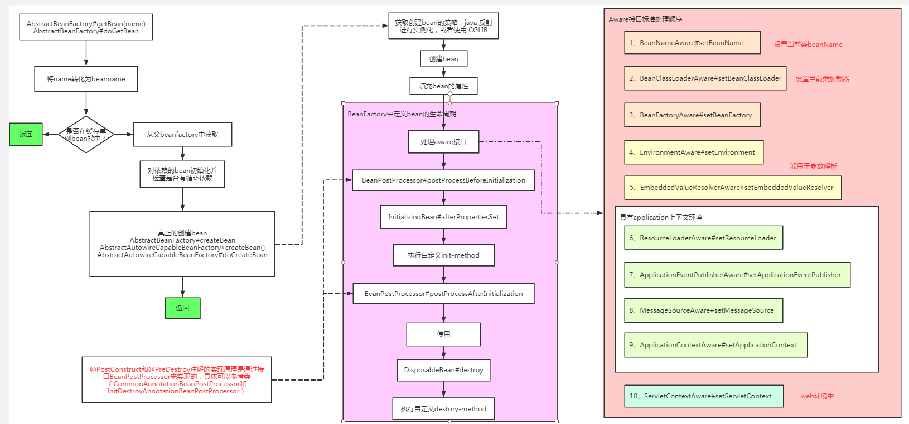

https://www.processon.com/diagraming/5efb32db07912929cb67f7be


接下来对照上图，一步一步对 singleton 类型 bean 的生命周期进行解析：

- 1、实例化创建 bean 对象，类似于 new XXObject()；

- 2、将配置文件中配置的属性填充到刚刚创建的 bean 对象中。

- 3、检查 bean 对象是否实现了 Aware 一类的接口，如果实现了则把相应的依赖设置到 bean 对象中。比如如果 bean 实现了 BeanFactoryAware 接口，Spring 容器在实例化bean的过程中，会将 BeanFactory 容器注入到 bean 中。

- 4、调用 BeanPostProcessor 前置处理方法，即 postProcessBeforeInitialization(Object bean, String beanName)。

- 5、检查 bean 对象是否实现了 InitializingBean 接口，如果实现，则调用 afterPropertiesSet 方法。

- 6、配置文件中是否配置了 init-method 属性，如果配置了，则去调用 init-method 属性配置的方法。

- 7、调用 BeanPostProcessor 后置处理方法，即 postProcessAfterInitialization(Object bean, String beanName)。`我们所熟知的 AOP 就是在这里将 Adivce 逻辑织入到 bean 中的。`

- 8、bean 对象处于就绪状态，可以使用了。

- 9、应用上下文被销毁。如果 bean 实现了 DispostbleBean 接口，Spring 容器会调用 destroy 方法。如果在配置文件中配置了 destroy 属性，Spring 容器则会调用 destroy 属性对应的方法。

- 10、调用自定义destory-method;


上述流程从宏观上对 Spring 中 singleton 类型 bean 的生命周期进行了描述，接下来说说所上面流程中的一些细节问题。


### 1、设置对象属性（循环依赖问题）

在这一步中，对于普通类型的属性，例如 String，Integer等，比较容易处理，直接设置即可。但是如果某个 bean 对象依赖另一个 bean 对象，此时就不能直接设置了。Spring 容器首先要先去实例化 bean 依赖的对象，实例化好后才能设置到当前 bean 中。

现在考虑这样一种情况，BeanA 依赖 BeanB，BeanB 依赖 BeanC，BeanC 又依赖 BeanA。三者形成了循环依赖。

对于这样的循环依赖，根据依赖注入方式的不同，Spring 处理方式也不同。如果依赖靠构造器方式注入，则无法处理，Spring 直接会报循环依赖异常。这个理解起来也不复杂，构造 BeanA 时需要 BeanB 作为构造器参数，此时 Spring 容器会先实例化 BeanB。构造 BeanB 时，BeanB 又需要 BeanC 作为构造器参数，Spring 容器又不得不先去构造 BeanC。最后构造 BeanC 时，BeanC 又依赖 BeanA 才能完成构造。此时，BeanA 还没构造完成，BeanA 要等 BeanB 实例化好才能完成构造，BeanB 又要等 BeanC，BeanC 等 BeanA。这样就形成了死循环，所以对于以构造器注入方式的循环依赖是无解的，Spring 容器会直接报异常。对于 setter 类型注入的循环依赖则可以顺利完成实例化并依次注入。


### 2、BeanPostProcessor扩展点

BeanPostProcessor 接口中包含了两个方法，其定义如下：

```java
public interface BeanPostProcessor {

    Object postProcessBeforeInitialization(Object bean, String beanName) throws Exception;

    Object postProcessAfterInitialization(Object bean, String beanName) throws Exception;
}
```

BeanPostProcessor 是一个很有用的接口，通过实现接口我们就可以插手 bean 的实例化过程，为拓展提供了可能。我们所熟知的 AOP 就是在这里进行织如入，具体点说是在 postProcessAfterInitialization(Object bean, String beanName) 执行织入逻辑的。

简述Spring AOP 织入的流程，以及 AOP 是怎样和 IOC 整合的。先说 Spring AOP 织入流程，大致如下：

- 1、查找实现了 PointcutAdvisor 类型的切面类，切面类包含了 Pointcut 和 Advice 实现类对象。

- 2、检查 Pointcut 中的表达式是否能匹配当前 bean 对象。

- 3、如果匹配到了，表明应该对此对象织入 Advice。

- 4、将 bean，bean class对象，bean实现的interface的数组，Advice对象传给代理工厂 ProxyFactory。代理工厂创建出 AopProxy 实现类，最后由 AopProxy 实现类创建 bean 的代理类，并将这个代理类返回。此时从 postProcessAfterInitialization(Object bean, String beanName) 返回的 bean 此时就不是原来的 bean 了，而是 bean 的代理类。原 bean 就这样被无感的替换掉了，是不是有点偷天换柱的感觉。


大家现在应该知道 AOP 是怎样作用在 bean 上的了，那么 AOP 是怎样和 IOC 整合起来并协同工作的呢？下面就来简单说一下。

Spring AOP 生成代理类的逻辑是在 AbstractAutoProxyCreator 相关子类中实现的，比如 DefaultAdvisorAutoProxyCreator、AspectJAwareAdvisorAutoProxyCreator 等。上面说了 BeanPostProcessor 为拓展留下了可能，这里 AbstractAutoProxyCreator 就将可能变为了现实。AbstractAutoProxyCreator 实现了 BeanPostProcessor 接口，这样 AbstractAutoProxyCreator 可以在 bean 初始化时做一些事情。光继承这个接口还不够，继承这个接口只能获取 bean，要想让 AOP 生效，还需要拿到切面对象（包含 Pointcut 和 Advice）才行。所以 AbstractAutoProxyCreator 同时继承了 BeanFactoryAware 接口，通过实现该接口，AbstractAutoProxyCreator 子类就可拿到 BeanFactory，有了 BeanFactory，就可以获取 BeanFactory 中所有的切面对象了。有了目标对象 bean，所有的切面类，此时就可以为 bean 生成代理对象了。


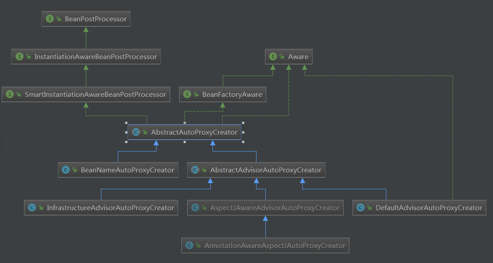

备注：删掉了一些不关心的继承分支

[AbstractAutoProxyCreator实现aop的关键类]


## 2、容器初始化流程AbstractApplicationContext#refresh()

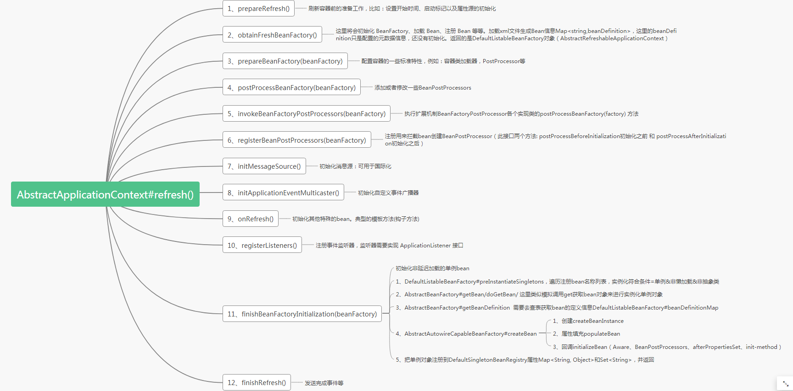

https://www.processon.com/mindmap/5efc33cb1e085326374ff625


在AbstractApplicationContext中有一个refresh方法定义了容器如何进行刷新:

```java
@Override
	public void refresh() throws BeansException, IllegalStateException {
		synchronized (this.startupShutdownMonitor) {
			// 1、刷新容器前的准备工作，比如：设置开始时间、启动标记以及属性源的初始化
			prepareRefresh();
			// 2、重要。这里将会初始化 BeanFactory、加载 Bean、注册 Bean 等等。加载xml文件生成Bean信息Map<string,beanDefinition>，
			// 这里的beanDefinition只是配置的元数据信息，还没有初始化
			ConfigurableListableBeanFactory beanFactory = obtainFreshBeanFactory();
			// 3、配置容器的一些标准特性，例如：容器类加载器，PostProcessor等；
			prepareBeanFactory(beanFactory);
			try {
				// 4、添加或者修改一些BeanPostProcessors
				postProcessBeanFactory(beanFactory);
				// 5、执行扩展机制BeanFactoryPostProcessor各个实现类的postProcessBeanFactory(factory) 方法
				invokeBeanFactoryPostProcessors(beanFactory);
				// 6、注册用来拦截bean创建BeanPostProcessor（此接口两个方法: postProcessBeforeInitialization初始化之前 和 postProcessAfterInitialization初始化之后）
				registerBeanPostProcessors(beanFactory);
				// 7、初始化消息源：可用于国际化
				initMessageSource();
				// 8、初始化自定义事件广播器
				initApplicationEventMulticaster();
				// 9、初始化其他特殊的bean。典型的模板方法(钩子方法)
				onRefresh();
				// 10、注册事件监听器，监听器需要实现 ApplicationListener 接口
				registerListeners();
				// 11、初始化非延迟加载的单例bean
				finishBeanFactoryInitialization(beanFactory);
				// 12、最后，发送完成事件等，ApplicationContext 初始化完成
				finishRefresh();
			}

			catch (BeansException ex) {
				if (logger.isWarnEnabled()) {
					logger.warn("Exception encountered during context initialization - " +
							"cancelling refresh attempt: " + ex);
				}
				// 销毁已经初始化的 singleton 的 Beans，以免有些 bean 会一直占用资源
				destroyBeans();
				// Reset 'active' flag. 重置
				cancelRefresh(ex);

				// Propagate exception to caller.
				throw ex;
			}

			finally {
				// Reset common introspection caches in Spring's core, since we
				// might not ever need metadata for singleton beans anymore...
				resetCommonCaches();
			}
		}
	}
```

控制反转（Inversion of Control） 就是依赖倒置原则的一种代码设计的思路。具体采用的方法就是所谓的依赖注入（Dependency Injection）。其实这些概念初次接触都会感到云里雾里的。说穿了，这几种概念的关系大概如下：


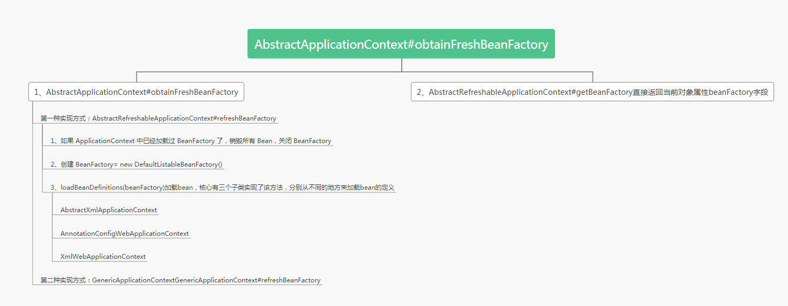

https://www.processon.com/mindmap/5efc5bd97d9c084420422deb


### 1、Bean的循环依赖是如何解决的

不是所有的循环依赖Spring都能够解决的。

- 1、对于最简单的情况，bean为单例,且使用Autowired或者setter注入，Spring是可以解决这样的循环依赖的。在一个Bean实例化后,会调用addSingletonFactory方法，在IOC容器中通过一个ObjectFactory暴露出可以获取还未完全初始化完毕的bean引用。若存在循环依赖，则依赖的bean可以在调用getBean时通过getSingleton方法获取到循环依赖的bean。

- 2、但是Spring是不允许出现原型环的，举例来说,BeanA和BeanB循环依赖且scope都为prototype。因为prototype的bean，不会触发addSingletonFactory，即每次get这样的bean都会新创建一个。所以创建BeanA需要注入一个BeanB，而这个BeanB又需要注入一个新的BeanA，这样的循环依赖是没办法解决的。Spring会判断当前bean是否是prototype并且已经在创建中，然后抛出异常。

- 3、对于构造器依赖，可以作一下讨论，下面讨论的bean的scope都为单例

	- 如果BeanA构造器中依赖BeanB，并且BeanA先创建，则无论BeanB以哪种形式依赖BeanA，都没办法解决这样的循环依赖。因为实例化BeanA需要先得到BeanB（此时还未提前暴露引用），BeanB依赖BeanA，但是拿不到BeanA提前暴露的引用，这就形成了无限循环。这种情况会在BeanB试图获取BeanA时在beforeSingletonCreation方法抛出异常。

	- 如果BeanA非构造器依赖BeanB，并且BeanA先创建，BeanB即使构造器依赖BeanA，也可以进行解决循环依赖。 因为这种情况BeanB可以拿到BeanA提前暴露的引用。


## 3、AOP设计原理

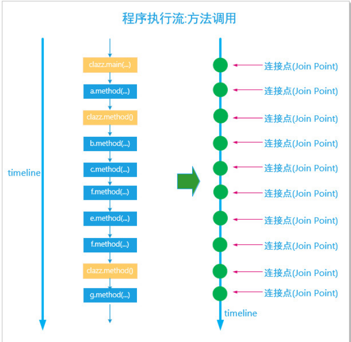

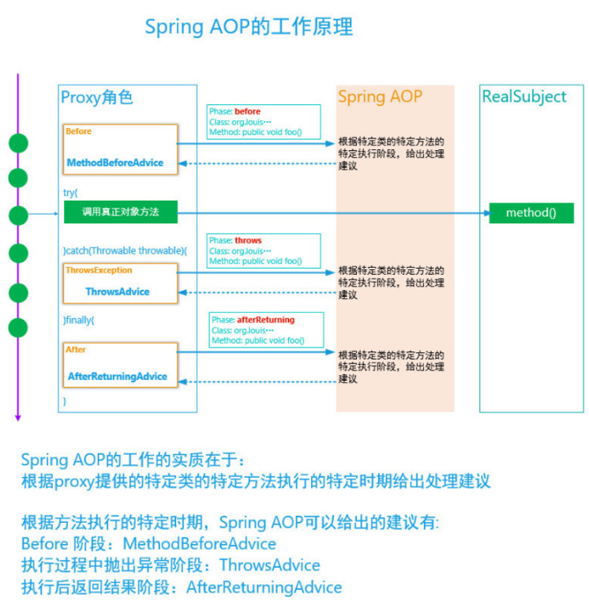

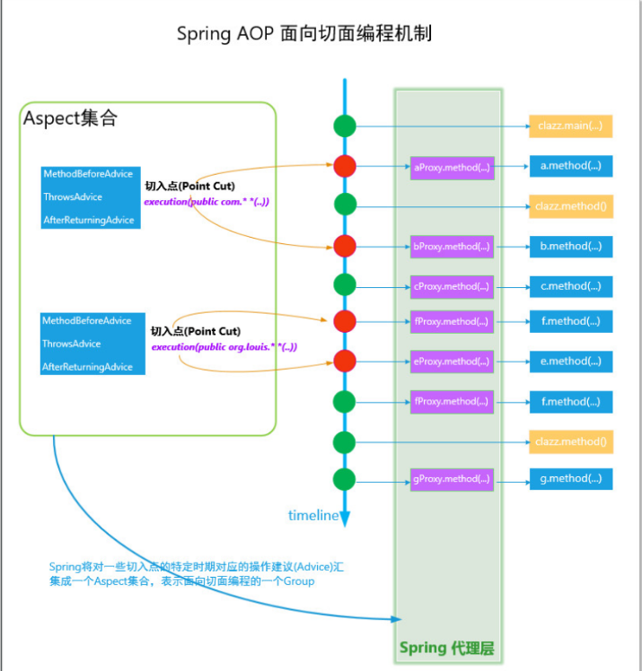

备注：`其实我们的程序可以看成由主函数开启的一个个方法调用的时间链条，链条的每一个节点对应一个方法。AOP的思路是定义一个切入点，即匹配一个方法，在调用这个方法的时候构建一个代理，在代理中扩展需要织入的逻辑`

如果从虚拟机线程栈的角度考虑Java程序执行的话，那么，你会发现，真个程序运行的过程就是方法调用的过程。我们按照方法执行的顺序，将方法调用排成一串，这样就构成了Java程序流。

基于时间序列，我们可以将方法调用排成一条线。而每个方法调用则可以看成Java执行流中的一个节点。这个节点在AOP的术语中，被称为Join Point，即连接点。 一个Java程序的运行的过程，就是若干个连接点连接起来依次执行的过程。

在我们正常的面向对象的思维中， 我们考虑的是如何按照时间序列通过方法调用来实现我们的业务逻辑。那么，什么是AOP（即面向切面的编程）呢？

通常面向对象的程序，代码都是按照时间序列纵向展开的，而他们都有一个共性：即都是已方法调用作为基本执行单位展开的。 将方法调用当做一个连接点，那么由连接点串起来的程序执行流就是整个程序的执行过程。

AOP(Aspect Oriented Programming)则是从另外一个角度来考虑整个程序的，AOP将每一个方法调用，即连接点作为编程的入口，针对方法调用进行编程。从执行的逻辑上来看，相当于在之前纵向的按照时间轴执行的程序横向切入。相当于将之前的程序横向切割成若干的面，即Aspect.每个面被称为切面。

所以，`AOP本质上是针对方法调用的编程思路`。


既然AOP是针对切面进行的编程的，那么，你需要选择哪些切面(即 连接点Joint Point)作为你的编程对象呢？

因为切面本质上是每一个方法调用，选择切面的过程实际上就是选择方法的过程。那么，被选择的切面(Aspect)在AOP术语里被称为切入点(Point Cut).  切入点实际上也是从所有的连接点(Join point)挑选自己感兴趣的连接点的过程。


既然AOP是针对方法调用(连接点)的编程， 现在又选取了你感兴趣的自己感兴趣的链接点---切入点（Point Cut）了，那么，AOP能对它做什么类型的编程呢？AOP能做什么呢？


`关于 AOP 的原理，无非是通过代理模式为目标对象生产代理对象，并将横切逻辑插入到目标方法执行的前后。`

### 1、连接点 - Joinpoint

连接点是指程序执行过程中的一些点，比如方法调用，异常处理等。在 Spring AOP 中，仅支持方法级别的连接点。

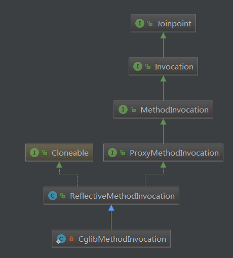

备注：ReflectiveMethodInvocation是在jdk生成动态代理时候用到，而CglibMethodInvocation则是在生成cglib动态代理的时候用到。


### 2、切点 - Pointcut

切点是用于选择连接点的

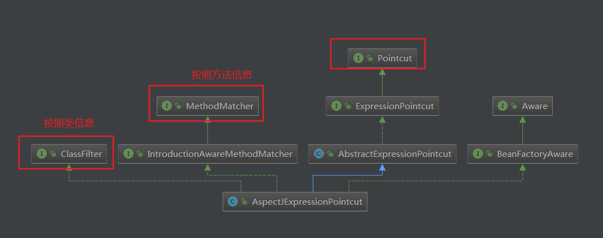


### 3、通知 - Advice逻辑

通知 Advice 即我们定义的横切逻辑，比如我们可以定义一个用于监控方法性能的通知，也可以定义一个安全检查的通知等。如果说切点解决了通知在哪里调用的问题，那么现在还需要考虑了一个问题，即通知在何时被调用？是在目标方法前被调用，还是在目标方法返回后被调用，还在两者兼备呢？Spring 帮我们解答了这个问题，Spring 中定义了以下几种Advice的主要类型:

- @Before：该注解标注的方法在业务模块代码执行之前执行，其不能阻止业务模块的执行，除非抛出异常；（AspectJMethodBeforeAdvice）

- @AfterReturning：该注解标注的方法在业务模块代码执行之后执行；（AspectJAfterReturningAdvice）

- @AfterThrowing：该注解标注的方法在业务模块抛出指定异常后执行；（AspectJAfterThrowingAdvice）

- @After：该注解标注的方法在所有的Advice执行完成后执行，无论业务模块是否抛出异常，类似于finally的作用；（AspectJAfterAdvice）

- @Around：该注解功能最为强大，其所标注的方法用于编写包裹业务模块执行的代码，其可以传入一个ProceedingJoinPoint用于调用业务模块的代码，无论是调用前逻辑还是调用后逻辑，都可以在该方法中编写，甚至其可以根据一定的条件而阻断业务模块的调用；（AspectJAroundAdvice）

- @DeclareParents：其是一种Introduction类型的模型，在属性声明上使用，主要用于为指定的业务模块添加新的接口和相应的实现。

- @Aspect：严格来说，其不属于一种Advice，该注解主要用在类声明上，指明当前类是一个组织了切面逻辑的类，并且该注解中可以指定当前类是何种实例化方式，主要有三种：singleton、perthis和pertarget。

这里需要说明的是，@Before是业务逻辑执行前执行，与其对应的是@AfterReturning，而不是@After，@After是所有的切面逻辑执行完之后才会执行，无论是否抛出异常。


#### 1、AspectJMethodBeforeAdvice

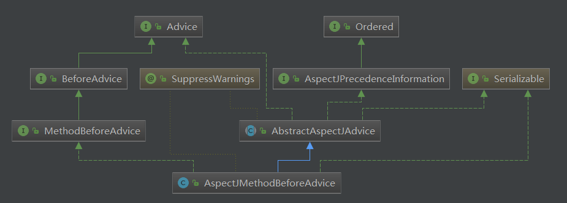


#### 2、AspectJAfterAdvice

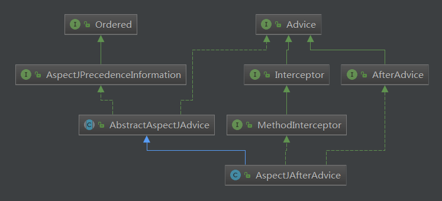


#### 3、AspectJAfterReturningAdvice

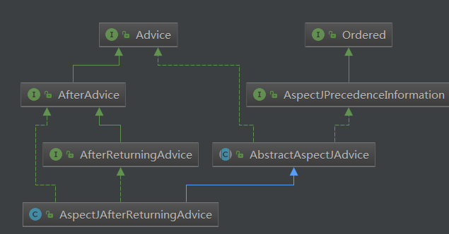


#### 4、AspectJAfterThrowingAdvice

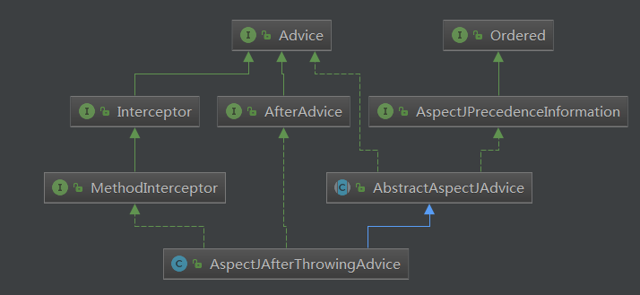

#### 5、AspectJAroundAdvice

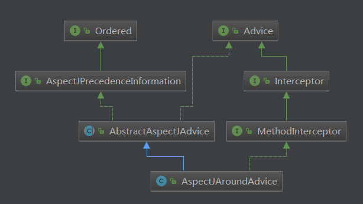


#### 6、Advice接口原理

##### 1、Advice空接口

```java
public interface Advice {}
```
##### 2、Interceptor空接口

```java
public interface Interceptor extends Advice {}
```

##### 3、MethodInterceptor

```java
@FunctionalInterface
public interface MethodInterceptor extends Interceptor {
    Object invoke(MethodInvocation invocation) throws Throwable;
}
```

备注：`通过invocation.proceed()进行调用`

使用示例：

```java
class TracingInterceptor implements MethodInterceptor {
   Object invoke(MethodInvocation i) throws Throwable {
     System.out.println("method "+i.getMethod()+" is called on "+
                       i.getThis()+" with args "+i.getArguments());
     Object ret=i.proceed();
     System.out.println("method "+i.getMethod()+" returns "+ret);
     return ret;
   }
```

#### 7、MethodInvocation原理

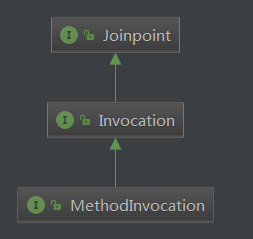


##### 1、Joinpoint

```java
public interface Joinpoint {
	Object proceed() throws Throwable;//传递给拦截器链中的下一个
	Object getThis();//返回当前对象
	AccessibleObject getStaticPart();
}
```
##### 2、Invocation

```java
public interface Invocation extends Joinpoint {
	Object[] getArguments();//参数数组
}
```

##### 3、MethodInvocation

```java
public interface MethodInvocation extends Invocation {
	Method getMethod();//返回方法对象
}
```


##### 4、ProxyMethodInvocation

```java
public interface ProxyMethodInvocation extends MethodInvocation {

Object getProxy();
MethodInvocation invocableClone();
MethodInvocation invocableClone(Object... arguments);
void setArguments(Object... arguments);
void setUserAttribute(String key, @Nullable Object value);
Object getUserAttribute(String key);

}
```


##### 5、ReflectiveMethodInvocation


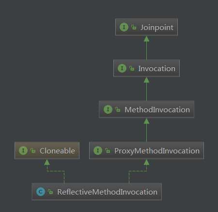

```java
public class ReflectiveMethodInvocation implements ProxyMethodInvocation, Cloneable {

	protected final Object proxy;

	@Nullable
	protected final Object target;

	protected final Method method;

	protected Object[] arguments = new Object[0];

	@Nullable
	private final Class<?> targetClass;

	private Map<String, Object> userAttributes;
	protected final List<?> interceptorsAndDynamicMethodMatchers;//拦截器链
	private int currentInterceptorIndex = -1;

	public Object proceed() throws Throwable {}//重点方法，先处理拦截器，然后一般是反射的方式执行method.invoke(target, arguments)

}
```


### 4、切面 - Aspect(Advisor接口)

切面 Aspect 整合了切点和通知两个模块，切点解决了 where 问题，通知解决了 when 和 how 问题。切面把两者整合起来，就可以解决 对什么方法（where）在何时（when - 前置还是后置，或者环绕）执行什么样的横切逻辑（how）的三连发问题


Aop在进行解析的时候，最终会生成一个Adivsor对象，这个Advisor对象中封装了切面织入所需要的所有信息，其中就包括最重要的两个部分就是Pointcut和Adivce属性。这里Pointcut用于判断目标bean是否需要织入当前切面逻辑；Advice则封装了需要织入的切面逻辑。如下是这三个部分的简要关系图：


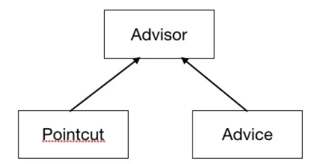


#### 1、AspectJPointcutAdvisor

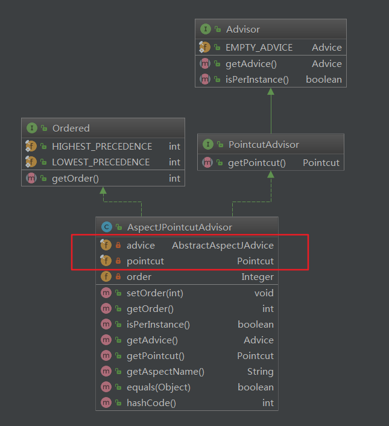


#### 2、AspectJExpressionPointcutAdvisor

支持表达式格式的切面

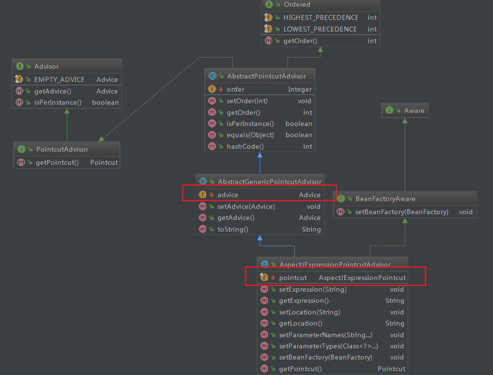


### 5、织入---借助于接口BeanPostProcessor

现在我们有了连接点、切点、通知，以及切面等，可谓万事俱备，但是还差了一股东风。这股东风是什么呢？没错，就是织入。所谓织入就是在切点的引导下，将通知逻辑插入到方法调用上，使得我们的通知逻辑在方法调用时得以执行。说完织入的概念，现在来说说 Spring 是通过何种方式将通知织入到目标方法上的。先来说说以何种方式进行织入，这个方式就是通过实现后置处理器 BeanPostProcessor 接口。该接口是 Spring 提供的一个拓展接口，通过实现该接口，用户可在 bean 初始化前后做一些自定义操作。那 Spring 是在何时进行织入操作的呢？答案是在 bean 初始化完成后，即 bean 执行完初始化方法（init-method）。Spring通过切点对 bean 类中的方法进行匹配。若匹配成功，则会为该 bean 生成代理对象，并将代理对象返回给容器。容器向后置处理器输入 bean 对象，得到 bean 对象的代理，这样就完成了织入过程。

备注：`会在AbstractAutoProxyCreator中查找当前容器内全部的Advisor接口的实现，判断当前bean是否符合切面逻辑生成代理，符合的话生成代理，不符合的话返回原始bean`


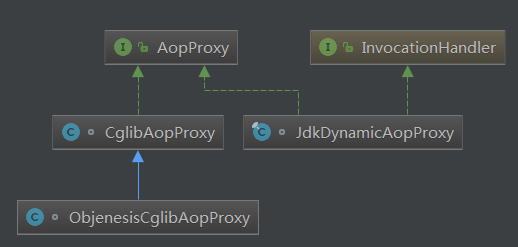


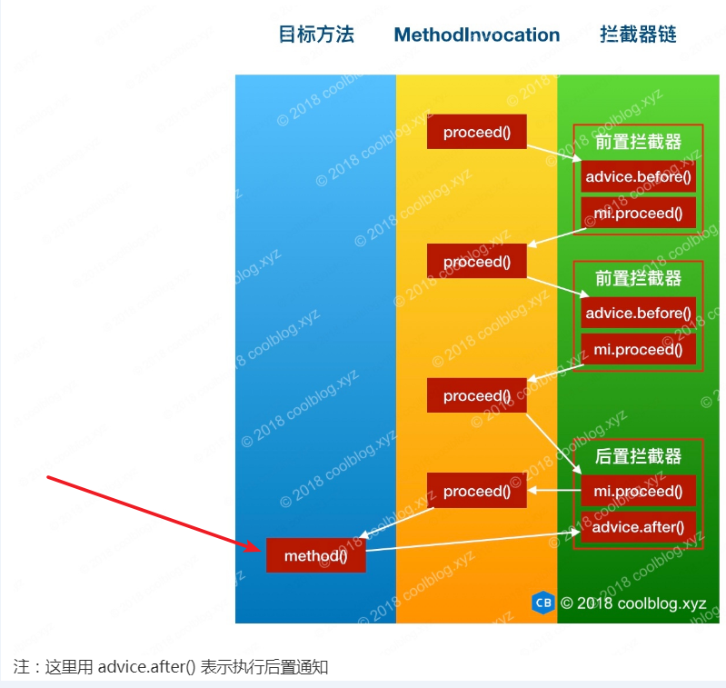


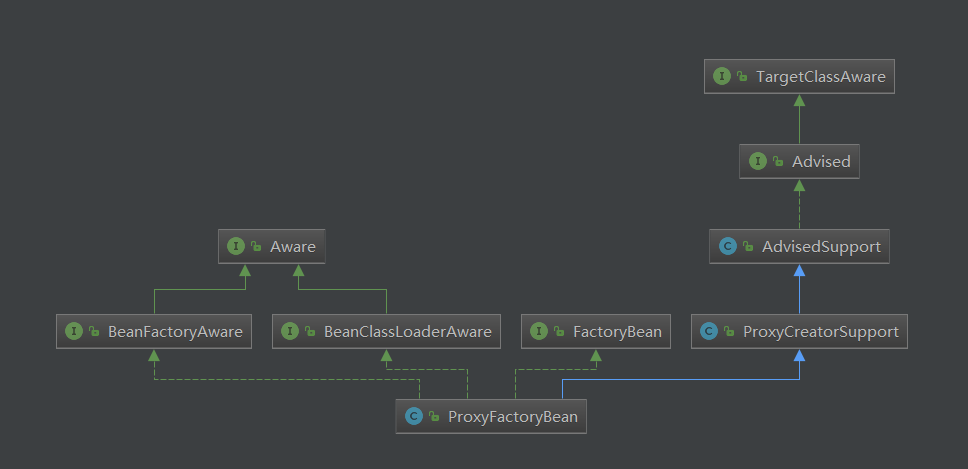

备注：`spring的AOP切面逻辑通过AspectJAwareAdvisorAutoProxyCreator和AnnotationAwareAspectJAutoProxyCreator实现`


#### 0、InstantiationAwareBeanPostProcessor和BeanPostProcessor的区别


```java
public interface BeanPostProcessor {


	default Object postProcessBeforeInitialization(Object bean, String beanName) throws BeansException {
		return bean;
	}

	default Object postProcessAfterInitialization(Object bean, String beanName) throws BeansException {
		return bean;
	}
}
```


```java
public interface InstantiationAwareBeanPostProcessor extends BeanPostProcessor {

	default Object postProcessBeforeInstantiation(Class<?> beanClass, String beanName) throws BeansException {
		return null;
	}

	default boolean postProcessAfterInstantiation(Object bean, String beanName) throws BeansException {
		return true;
	}

	default PropertyValues postProcessPropertyValues(
			PropertyValues pvs, PropertyDescriptor[] pds, Object bean, String beanName) throws BeansException {

		return pvs;
	}
}

```

Bean创建过程中的“实例化”与“初始化”名词

- 1、实例化(Instantiation): 要生成对象, 对象还未生成.
- 2、初始化(Initialization): 对象已经生成.，赋值操作。

BeanPostProcessor :发生在 BeanDefiniton 加工Bean 阶段. 具有拦截器的含义. 可以拦截BeanDefinition创建Bean的过程, 然后插入拦截方法,做扩展工作.

- 1、postProcessBeforeInitialization初始化前置处理 （对象已经生成）
- 2、postProcessAfterInitialization初始化后置处理 （对象已经生成）


InstantiationAwareBeanPostProcessor: 继承于BeanPostProcessor ,所以他也是一种参与BeanDefinition加工Bean过程的BeanPostProcessor拦截器, 并且丰富了BeanPostProcessor的拦截.

- 1、postProcessBeforeInstantiation 实例化前置处理 （对象未生成）
- 2、postProcessAfterInstantiation 实例化后置处理 （对象已经生成）
- 3、postProcessPropertyValues 修改属性值。（对象已经生成）


> 总的来说：

- 1、BeanPostProcessor定义的方法是在对象初始化过程中做处理。
- 2、InstantiationAwareBeanPostProcessor定义的方法是在对象实例化过程中做处理

会形成两种执行流程完成BeanDefinition 创建Bean.

- 1、postProcessBeforeInstantiation()--自定义对象-->postProcessAfterInitialization();

- 2、postProcessBeforeInstantiation() -->postProcessAfterInstantiation-->postProcessBeforeInitialization()-->postProcessAfterInitialization()


#### 1、AbstractAutoProxyCreator代理类创建的入口

AbstractAutoProxyCreator是Spring AOP实现的一个很重要的抽象类。下面是它的继承层次

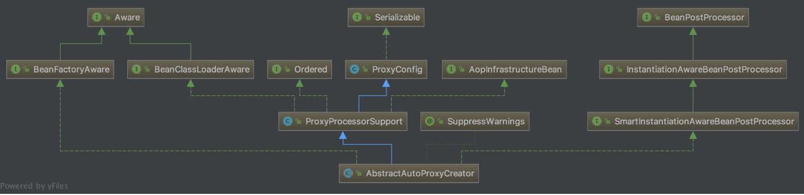

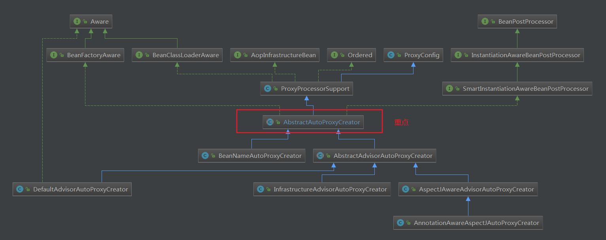

它其实是一个BeanPostProcessor。我们需要重点关注的方法是其中的wrapIfNecessary方法，可以说这是Spring实现Bean代理的核心方法。
wrapIfNecessary在两处会被调用，一处是getEarlyBeanReference，另一处是postProcessAfterInitialization。


#### 2、AbstractAdvisorAutoProxyCreator匹配容器中切面Advisor的实现类

会在这里为bean查找全部的

org.springframework.aop.framework.autoproxy.AbstractAdvisorAutoProxyCreator#getAdvicesAndAdvisorsForBean


```java

	@Override
	@Nullable
	protected Object[] getAdvicesAndAdvisorsForBean(
			Class<?> beanClass, String beanName, @Nullable TargetSource targetSource) {
		// 查找合适的通知器
		List<Advisor> advisors = findEligibleAdvisors(beanClass, beanName);
		if (advisors.isEmpty()) {
			return DO_NOT_PROXY;
		}
		return advisors.toArray();
	}
```


因此，你只要这里注册了一个Advisor的实现类，都会匹配到。


#### 3、AspectJAwareAdvisorAutoProxyCreator

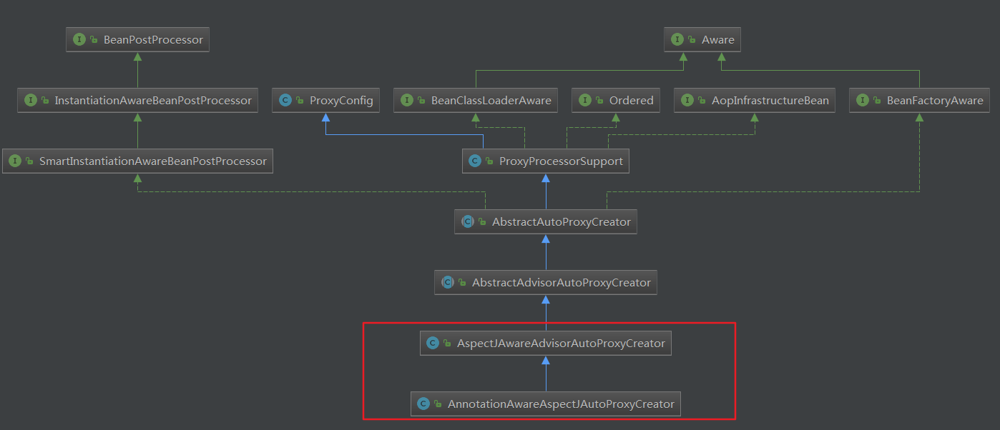


在抽象类`AbstractAutoProxyCreator`定义了动态代理的生成逻辑。

在AbstractAutoProxyCreator#createProxy()方法中通过调用new ProxyFactory().getProxy(getProxyClassLoader())方式创建动态代理。接着会调用到ProxyCreatorSupport#createAopProxy，最后DefaultAopProxyFactory#createAopProxy。

`可见整体思路是把创建AopProxy对象委托给AopProxyFactory来创建。`


#### 4、AnnotationAwareAspectJAutoProxyCreator

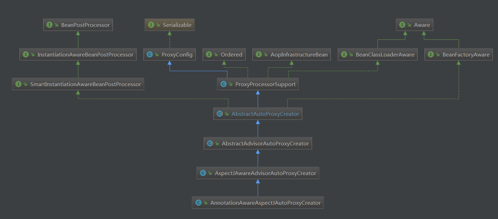


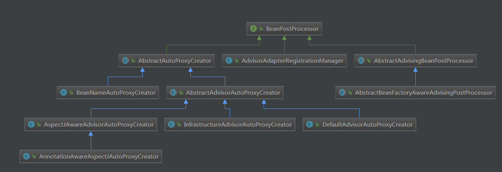


>问题：`这些xxxAutoProxyCreator是如何引入到spring容器中的？`


#### 5、AopConfigUtils把Creator放入spring容器的入口

```java
public abstract class AopConfigUtils {

	private static final List<Class<?>> APC_PRIORITY_LIST = new ArrayList<>(3);

	static {
		// Set up the escalation list...
		APC_PRIORITY_LIST.add(InfrastructureAdvisorAutoProxyCreator.class);
		APC_PRIORITY_LIST.add(AspectJAwareAdvisorAutoProxyCreator.class);
		APC_PRIORITY_LIST.add(AnnotationAwareAspectJAutoProxyCreator.class);
	}
}


@Nullable
public static BeanDefinition registerAutoProxyCreatorIfNecessary(
		BeanDefinitionRegistry registry, @Nullable Object source) {

	return registerOrEscalateApcAsRequired(InfrastructureAdvisorAutoProxyCreator.class, registry, source);
}

@Nullable
public static BeanDefinition registerAspectJAutoProxyCreatorIfNecessary(
		BeanDefinitionRegistry registry, @Nullable Object source) {

	return registerOrEscalateApcAsRequired(AspectJAwareAdvisorAutoProxyCreator.class, registry, source);
}

@Nullable
public static BeanDefinition registerAspectJAnnotationAutoProxyCreatorIfNecessary(
		BeanDefinitionRegistry registry, @Nullable Object source) {

	return registerOrEscalateApcAsRequired(AnnotationAwareAspectJAutoProxyCreator.class, registry, source);
}

```

AopConfigUtils使用一个list存储3个类型对象，并且提供了3个静态方法把他们注入到spring容器中，因此，只需要找到谁调用这些方法即可


#### 6、AopNamespaceUtils

```java
public abstract class AopNamespaceUtils {
}
```

为一个静态的抽象类，包裹了一层对AopConfigUtils方法的调用。


### 6、ProxyFactory(这里生成AOP的代理对象)

封装创建动态代理所需要的信息

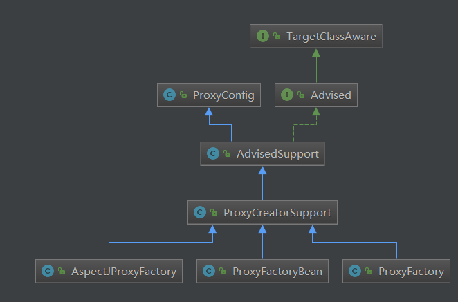


```java
public class ProxyFactory extends ProxyCreatorSupport {
	public Object getProxy() {
		return createAopProxy().getProxy();
	}

	public Object getProxy(@Nullable ClassLoader classLoader) {
		// 先创建 AopProxy 实现类对象，然后再调用 getProxy 为目标 bean 创建代理对象
		return createAopProxy().getProxy(classLoader);
	}
}
```


#### 2、ProxyCreatorSupport


备注：实现类ProxyCreatorSupport扩展了功能，可以实现生产一个AopProxyFactory工厂。默认为一个DefaultAopProxyFactory实例

```java
public class ProxyCreatorSupport extends AdvisedSupport {

	private AopProxyFactory aopProxyFactory;

	public ProxyCreatorSupport() {
		this.aopProxyFactory = new DefaultAopProxyFactory();
	}
}
```

#### 1、AopProxyFactory生成AopProxy工厂

```java
public interface AopProxyFactory {
	AopProxy createAopProxy(AdvisedSupport config) throws AopConfigException;
}
```

#### 3、DefaultAopProxyFactory唯一默认实现(JDK/cglib代理)

DefaultAopProxyFactory是AopProxyFactory接口的默认实现，下面来看一下其中createAopProxy方法的实现。Spring就是在这里判断是使用JDK动态代理还是cglib代理的

```java
public class DefaultAopProxyFactory implements AopProxyFactory, Serializable {
	
public AopProxy createAopProxy(AdvisedSupport config) throws AopConfigException {
		if (config.isOptimize() || config.isProxyTargetClass() || hasNoUserSuppliedProxyInterfaces(config)) {
			Class<?> targetClass = config.getTargetClass();
			if (targetClass == null) {
				throw new AopConfigException("TargetSource cannot determine target class: " +
						"Either an interface or a target is required for proxy creation.");
			}
			// 如果targetClass本身是个接口或者targetClass是JDK Proxy生成的,则使用JDK动态代理
			if (targetClass.isInterface() || Proxy.isProxyClass(targetClass)) {
				return new JdkDynamicAopProxy(config);
			}
			// 创建 CGLIB 代理，ObjenesisCglibAopProxy 继承自 CglibAopProxy
			return new ObjenesisCglibAopProxy(config);
		}
		else {
			// 创建 JDK 动态代理
			return new JdkDynamicAopProxy(config);
		}
	}

	}
```

##### 1、JdkDynamicAopProxy

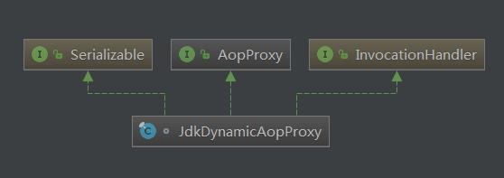

本质上JdkDynamicAopProxy对于AopProxy的getProxy方法的实现本质上是调用我们熟悉的Proxy.newProxyInstance来生成代理bean。
而JdkDynamicAopProxy本身也实现了InvocationHandler接口

```java
final class JdkDynamicAopProxy implements AopProxy, InvocationHandler, Serializable {
	@Override
	public Object getProxy() {
		return getProxy(ClassUtils.getDefaultClassLoader());
	}

	@Override
	public Object getProxy(@Nullable ClassLoader classLoader) {
		if (logger.isDebugEnabled()) {
			logger.debug("Creating JDK dynamic proxy: target source is " + this.advised.getTargetSource());
		}
		//提取出接口
		Class<?>[] proxiedInterfaces = AopProxyUtils.completeProxiedInterfaces(this.advised, true);
		findDefinedEqualsAndHashCodeMethods(proxiedInterfaces);
		return Proxy.newProxyInstance(classLoader, proxiedInterfaces, this);
	}

//核心流程
public Object invoke(Object proxy, Method method, Object[] args) throws Throwable {
		Object oldProxy = null;
		boolean setProxyContext = false;

		TargetSource targetSource = this.advised.targetSource;//被代理的对象
		Object target = null;

		try {
			
			Object retVal;

			target = targetSource.getTarget();
			Class<?> targetClass = (target != null ? target.getClass() : null);

			// 获取适合当前方法的拦截器链
			List<Object> chain = this.advised.getInterceptorsAndDynamicInterceptionAdvice(method, targetClass);

			if (chain.isEmpty()) {// 如果拦截器链为空，则反射执行目标方法
				Object[] argsToUse = AopProxyUtils.adaptArgumentsIfNecessary(method, args);
				retVal = AopUtils.invokeJoinpointUsingReflection(target, method, argsToUse);
			}
			else {
				// 创建一个方法调用器，并将拦截器链传入其中
				MethodInvocation invocation =
						new ReflectiveMethodInvocation(proxy, target, method, args, targetClass, chain);
				// Proceed to the joinpoint through the interceptor chain.
				retVal = invocation.proceed(); // 执行拦截器链
			}

			Class<?> returnType = method.getReturnType(); // 获取方法返回值类型
			if (retVal != null && retVal == target &&
					returnType != Object.class && returnType.isInstance(proxy) &&
					!RawTargetAccess.class.isAssignableFrom(method.getDeclaringClass())) {
				retVal = proxy;// 如果方法返回值为 this，即 return this; 则将代理对象 proxy 赋值给 retVal
			}
			// 如果返回值类型为基础类型，比如 int，long 等，当返回值为 null，抛出异常
			else if (retVal == null && returnType != Void.TYPE && returnType.isPrimitive()) {
				throw new AopInvocationException(
						"Null return value from advice does not match primitive return type for: " + method);
			}
			return retVal;
		}
		finally {
			//...
		}
	}

}

```


##### 2、ObjenesisCglibAopProxy

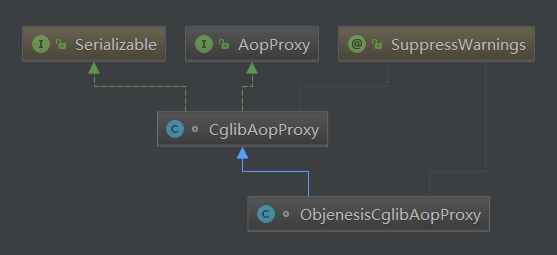

Spring对于cglib创建代理，内部默认使用ObjenesisCglibAopProxy来创建代理bean，它是CglibAopProxy的子类，并且重写了createProxyClassAndInstance方法。Objenesis是一个类库，可以绕过构造器创建对象。

cglib使用Enhancer来生成代理类，生成的类实质上是被代理类的子类。


## 4、springMVC


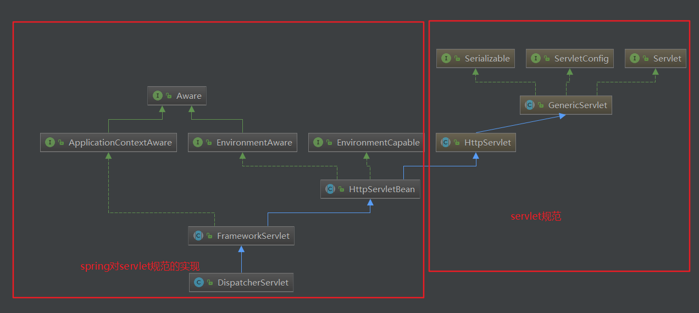

备注：`DispatcherServlet只是spring对servlet提供的一种实现`。


springmvc中的两个容器

一般情况下，我们会在一个 Web 应用中配置两个容器。一个容器用于加载 Web 层的类，比如我们的接口 Controller、HandlerMapping、ViewResolver 等。在本文中，我们把这个容器叫做 web 容器。另一个容器用于加载业务逻辑相关的类，比如 service、dao 层的一些类。在本文中，我们把这个容器叫做业务容器。在容器初始化的过程中，业务容器会先于 web 容器进行初始化。web 容器初始化时，会将业务容器作为父容器。这样做的原因是，web 容器中的一些 bean 会依赖于业务容器中的 bean。比如我们的 controller 层接口通常会依赖 service 层的业务逻辑类。


业务容器入口：ContextLoaderListener

web容器创建入口：org.springframework.web.servlet.HttpServletBean#init

org.springframework.web.servlet.FrameworkServlet#initServletBean


# 2、ApplicationContext

org.springframework.context.ApplicationContext是Spring上下文的底层接口，位于spring-context模块。它可以视作是Spring IOC容器的一种高级形式，也是我们用Spring企业开发时必然会用到的接口，它含有许多面向框架的特性，也对应用环境作了适配。

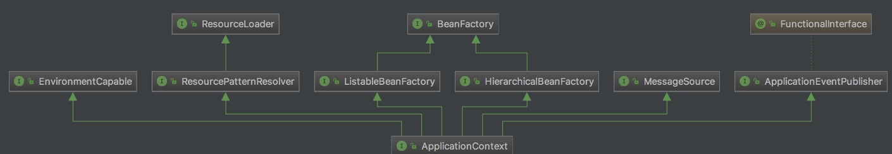


从上面的图中，我们可以看到ApplicationContext作为BeanFactory的子接口，与BeanFactory之间也是通过HierarchicalBeanFactory与ListableBeanFactory桥接的。

ApplicationContext接口，继承了MessageSource, ResourceLoader, ApplicationEventPublisher接口，以BeanFactory为主线添加了许多高级容器特性。


- 继承 org.springframework.context.MessageSource 接口，提供国际化的标准访问策略。

- 继承 org.springframework.context.ApplicationEventPublisher 接口，提供强大的事件机制。

- 扩展 ResourceLoader ，可以用来加载多种 Resource ，可以灵活访问不同的资源。

- 对 Web 应用的支持。


```java
public interface ApplicationContext extends EnvironmentCapable, ListableBeanFactory, HierarchicalBeanFactory,
		MessageSource, ApplicationEventPublisher, ResourcePatternResolver {
```


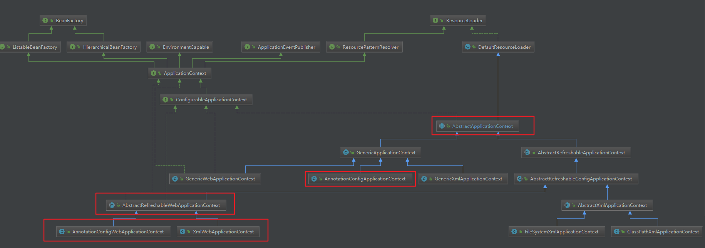


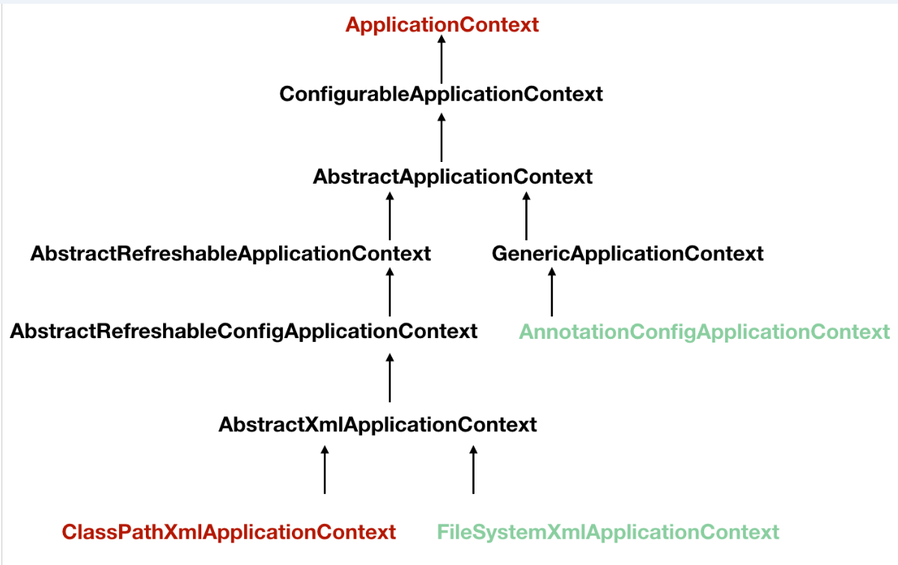


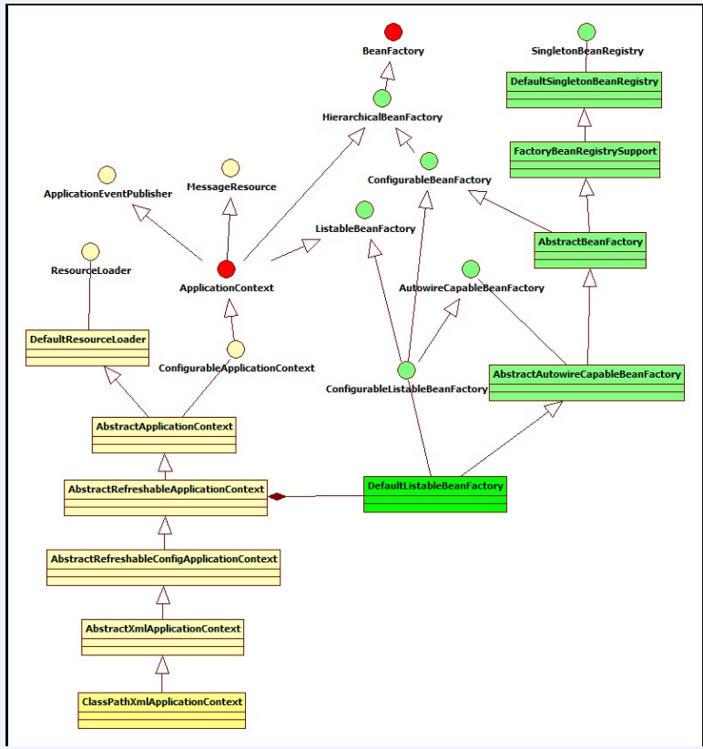

```java
public abstract class AbstractRefreshableApplicationContext extends AbstractApplicationContext {
    @Nullable
    private DefaultListableBeanFactory beanFactory;//持有一个对象工厂
}
```

备注：对象bean注册map在DefaultListableBeanFactory中实现的。ApplicationContext 继承自 BeanFactory，但是它不应该被理解为 BeanFactory 的实现类，而是说其内部持有一个实例化的 BeanFactory（DefaultListableBeanFactory）。


> 比较经常使用的几种ApplicationContext实现类：

- 1、AnnotationConfigApplicationContext
- 2、ClassPathXmlApplicationContext
- 3、AnnotationConfigWebApplicationContext
- 4、XmlWebApplicationContext


通过上面的继承类图可知，除了AnnotationConfigApplicationContext其余三个实现类就有一个共同的父类AbstractRefreshableApplicationContext，DefaultListableBeanFactory beanFactory工厂就是其中的一个属性；而AnnotationConfigApplicationContext继承自GenericApplicationContext，DefaultListableBeanFactory beanFactory工厂也是其中的一个属性。


```java
 //基于xml
ApplicationContext applicationContext = new ClassPathXmlApplicationContext("spring.xml");
//基于注解方式
AnnotationConfigApplicationContext annotationConfigApplicationContext=new AnnotationConfigApplicationContext(TestStyle3.class);
```

备注：上面两种创建容器的方式最后都会调用AbstractApplicationContext.refresh()，因此，这里就是初始化的关键。


# 3、BeanFactory工厂

org.springframework.beans.factory.BeanFactory是Spring的Bean容器的一个非常基本的接口，位于spring-beans模块。它包括了各种getBean方法，如通过名称、类型、参数等，试图从Bean容器中返回一个Bean实例。还包括诸如containsBean, isSingleton, isPrototype等方法判断Bean容器中是否存在某个Bean或是判断Bean是否为单例/原型等等。


可以看到BeanFactory向下主要有三条继承路线

- 1、ListableBeanFactory

在BeanFactory基础上，支持对Bean容器中Bean的枚举。

- 2、HierarchicalBeanFactory -> ConfigurableBeanFactory

HierarchicalBeanFactory有个getParentBeanFactory方法，使得Bean容器具有亲缘关系。而ConfigurableBeanFactory则是对BeanFactory的一系列配置功能提供了支持。

- 3、AutowireCapableBeanFactory

提供了一系列用于自动装配Bean的方法，用户代码比较少用到，更多是作为Spring内部使用。


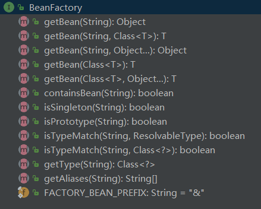

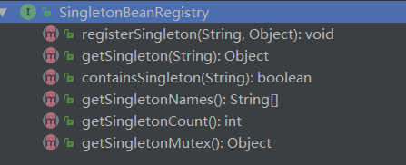

备注:DefaultSingletonBeanRegistry实现了SingletonBeanRegistry接口，通过一Map<String, Object>记录注册的bean，同时提供了一个set,string>记录已经注册了那些bean的name。

## 1、AbstractBeanFactory

功能：实现了


## 2、DefaultListableBeanFactory工厂的实现类

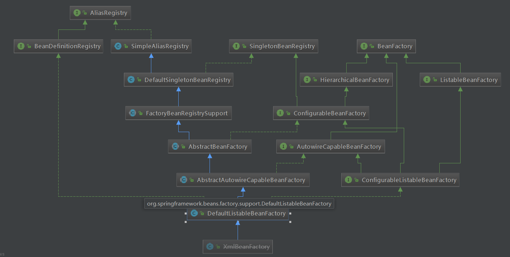

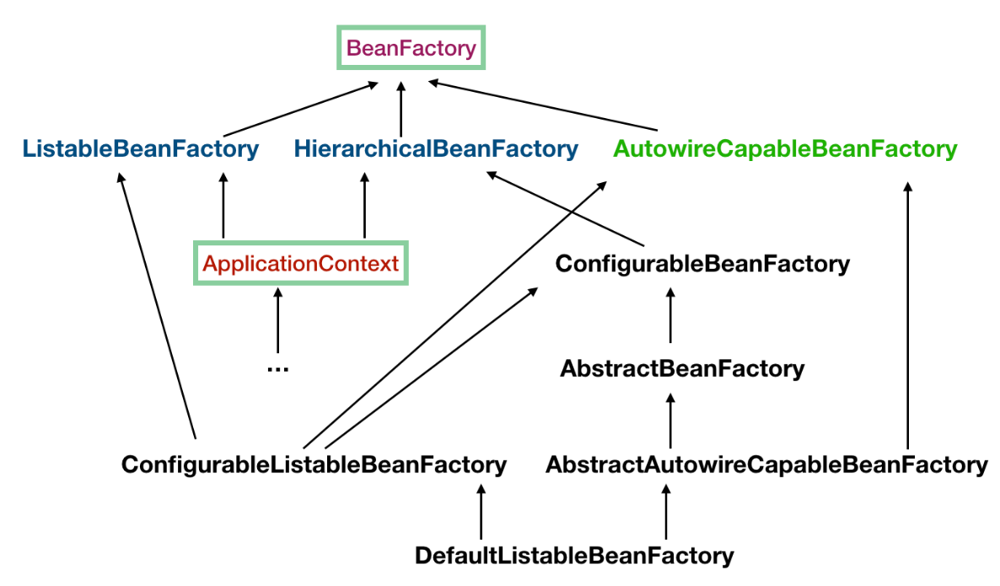

功能：默认实现了ListableBeanFactory和BeanDefinitionRegistry接口，基于bean definition对象，是一个成熟的bean factroy。最典型的应用是：在访问bean前，先注册所有的definition（可能从bean definition配置文件中）。使用预先建立的bean定义元数据对象，从本地的bean definition表中查询bean definition因而将不会花费太多成本。DefaultListableBeanFactory既可以作为一个单独的beanFactory，也可以作为自定义beanFactory的父类。注意：特定格式bean definition的解析器可以自己实现，也可以使用原有的解析器，如：PropertiesBeanDefinitionReader和XmLBeanDefinitionReader。


```java
public class DefaultListableBeanFactory extends AbstractAutowireCapableBeanFactory
		implements ConfigurableListableBeanFactory, BeanDefinitionRegistry, Serializable {

private final Map<String, BeanDefinition> beanDefinitionMap = new ConcurrentHashMap<>(256);//bean的注册中心，这里的BeanDefinition只是包含生成bean对象的元数据信息，并没有实例化

        }
```


单例对象实例化后存在DefaultSingletonBeanRegistry中

```java
public class DefaultSingletonBeanRegistry extends SimpleAliasRegistry implements SingletonBeanRegistry {

	/** Cache of singleton objects: bean name --> bean instance */ //单例缓存池
	private final Map<String, Object> singletonObjects = new ConcurrentHashMap<>(256);
    
    }
```


## 3、BeanDefinitionRegistry

```java

//注册
public interface BeanDefinitionRegistry extends AliasRegistry {

	void registerBeanDefinition(String beanName, BeanDefinition beanDefinition)
			throws BeanDefinitionStoreException;

	void removeBeanDefinition(String beanName) throws NoSuchBeanDefinitionException;

	BeanDefinition getBeanDefinition(String beanName) throws NoSuchBeanDefinitionException;

	boolean containsBeanDefinition(String beanName);

	String[] getBeanDefinitionNames();

	int getBeanDefinitionCount();

	boolean isBeanNameInUse(String beanName);
}

```

## 4、SingletonBeanRegistry

单例bean注册接口

```java
public interface SingletonBeanRegistry {
    //注册的bean对象应该是初始化完成的。
	void registerSingleton(String beanName, Object singletonObject);

	@Nullable
	Object getSingleton(String beanName);

	boolean containsSingleton(String beanName);

	String[] getSingletonNames();

	int getSingletonCount();

	Object getSingletonMutex();
}

```


## 5、BeanDefinition


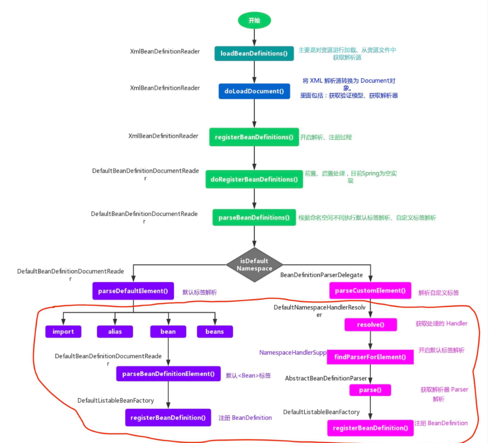


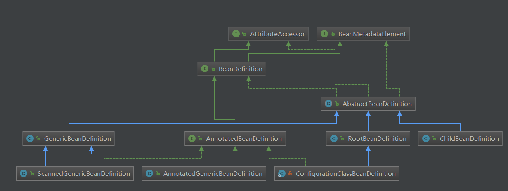

BeanDefinition 就是我们所说的 Spring 的 Bean，我们自己定义的各个 Bean其实会转换成一个个 BeanDefinition 存在于 Spring 的 BeanFactory 中。Bean 在代码层面上可以认为是 BeanDefinition 的实例。BeanDefinition 中保存了我们的 Bean 信息，比如这个 Bean 指向的是哪个类、是否是单例的、是否懒加载、这个 Bean 依赖了哪些 Bean 等等。

```java
public interface BeanDefinition extends AttributeAccessor, BeanMetadataElement {

String SCOPE_SINGLETON = ConfigurableBeanFactory.SCOPE_SINGLETON;//单例

String SCOPE_PROTOTYPE = ConfigurableBeanFactory.SCOPE_PROTOTYPE;//原型


}
```

我们可以看到，默认只提供 sington 和 prototype 两种，其实还有 request, session, globalSession, application, websocket 这几种，不过，它们属于基于 web 的扩展。

### 1、AbstractBeanDefinition


```java
public abstract class AbstractBeanDefinition extends BeanMetadataAttributeAccessor
		implements BeanDefinition, Cloneable {

	private volatile Object beanClass;//类名称

	private String scope = SCOPE_DEFAULT;//默认单例

    private boolean abstractFlag = false;//抽象类标识

    private boolean lazyInit = false;//懒加载

    private String initMethodName;

    private String destroyMethodName;
        
    private MutablePropertyValues propertyValues;//全部属性封装，内部通过一个list<PropertyValue>
        
}
```


## 6、对象属性的封装PropertyValue和MutablePropertyValues

单个属性

```java
public class PropertyValue extends BeanMetadataAttributeAccessor implements Serializable {

	private final String name;//名称

	@Nullable
	private final Object value;//对应的值

	private boolean optional = false;//是否必须

	private boolean converted = false;
}
```


一个对象的全部属性封装

```java
public class MutablePropertyValues implements PropertyValues, Serializable {

	private final List<PropertyValue> propertyValueList;//封装一组属性值

	@Nullable
	private Set<String> processedProperties;//记录全部的属性名称

	private volatile boolean converted = false;

}
```


## 7、Resource 体系

org.springframework.core.io.Resource，对资源的抽象，定义了bean从哪里来的问题。它的每一个实现类都代表了一种资源的访问策略，如 ClassPathResource、RLResource、FileSystemResource 等。


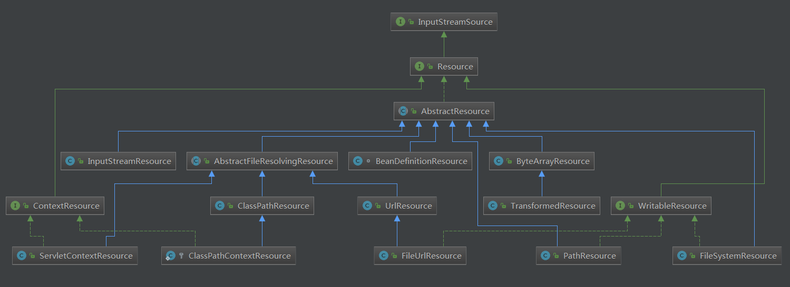

## 8、ResourceLoader 体系

有了资源，就应该有资源加载，Spring 利用 org.springframework.core.io.ResourceLoader 来进行统一资源加载，类图如下：

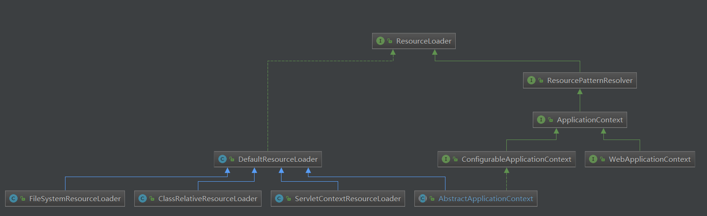

## 9、BeanDefinitionReader 体系

org.springframework.beans.factory.support.BeanDefinitionReader 的作用是读取 Spring 的配置文件的内容，并将其转换成 Ioc 容器内部的数据结构 ：BeanDefinition 。


# 4、BeanDefinitionParser

bean解析器，感觉这里根据解析bean的定义可以发现很多信息，基于这些信息做不同的处理，比如自定义注解标签等；

```java
public interface BeanDefinitionParser {
	BeanDefinition parse(Element element, ParserContext parserContext);
}
```

## 0、NamespaceHandlerSupport基于配置文件解析

该接口定义了如何基于xml配置文件的namespace进行标签的解析；

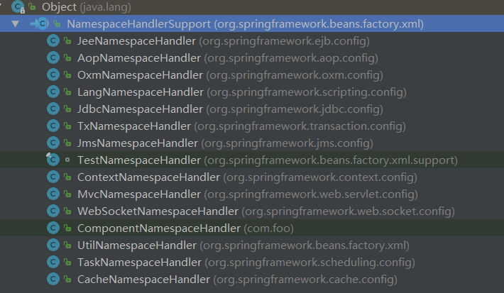


### 1、ContextNamespaceHandler

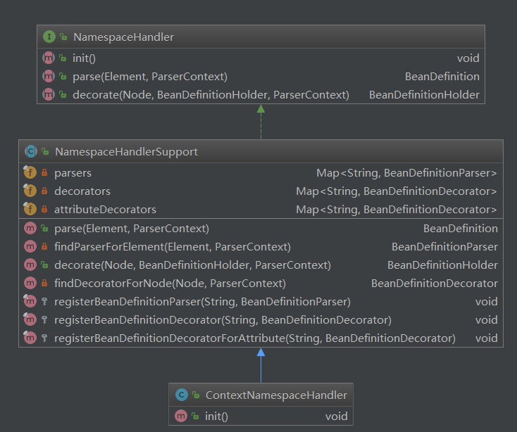

```java
public class ContextNamespaceHandler extends NamespaceHandlerSupport {

	@Override
	public void init() {
		registerBeanDefinitionParser("property-placeholder", new PropertyPlaceholderBeanDefinitionParser());
		registerBeanDefinitionParser("property-override", new PropertyOverrideBeanDefinitionParser());
		registerBeanDefinitionParser("annotation-config", new AnnotationConfigBeanDefinitionParser());
		registerBeanDefinitionParser("component-scan", new ComponentScanBeanDefinitionParser());
		registerBeanDefinitionParser("load-time-weaver", new LoadTimeWeaverBeanDefinitionParser());
		registerBeanDefinitionParser("spring-configured", new SpringConfiguredBeanDefinitionParser());
		registerBeanDefinitionParser("mbean-export", new MBeanExportBeanDefinitionParser());
		registerBeanDefinitionParser("mbean-server", new MBeanServerBeanDefinitionParser());
	}

}

```
对应解析的标签和类之前的映射规则：annotation-config对应<context:annotation-config> 其他的类推


#### 1、AnnotationConfigBeanDefinitionParser

解析:<context:annotation-config> 

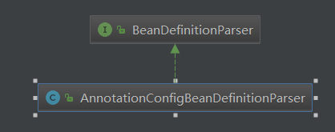


#### 2、ComponentScanBeanDefinitionParser

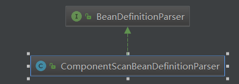

对应解析 <context:component-scan/> 标签

- 1、创建了一个 ClassPathBeanDefinitionScanner 扫描器;


##### 1、ClassPathBeanDefinitionScanner

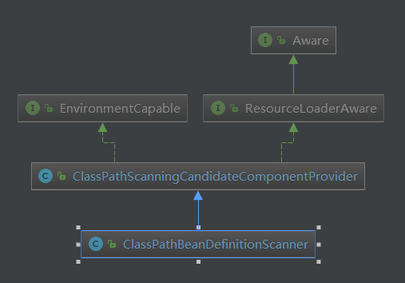


AnnotationConfigUtils.registerAnnotationConfigProcessors(parserContext.getRegistry(), source)

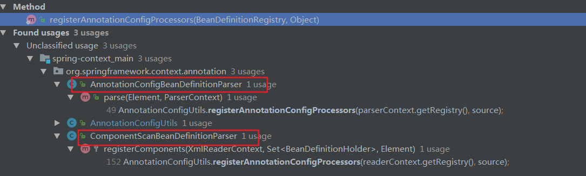


### 2、AopNamespaceHandler

```java
public class AopNamespaceHandler extends NamespaceHandlerSupport {

	@Override
	public void init() {
		// In 2.0 XSD as well as in 2.1 XSD.
		registerBeanDefinitionParser("config", new ConfigBeanDefinitionParser());
		registerBeanDefinitionParser("aspectj-autoproxy", new AspectJAutoProxyBeanDefinitionParser());
		registerBeanDefinitionDecorator("scoped-proxy", new ScopedProxyBeanDefinitionDecorator());

		// Only in 2.0 XSD: moved to context namespace as of 2.1
		registerBeanDefinitionParser("spring-configured", new SpringConfiguredBeanDefinitionParser());
	}

}
```


#### 1、ConfigBeanDefinitionParser识别AOP配置标签


```java
class ConfigBeanDefinitionParser implements BeanDefinitionParser {

	private static final String ASPECT = "aspect";
	private static final String EXPRESSION = "expression";
	private static final String ID = "id";
	private static final String POINTCUT = "pointcut";
	private static final String ADVICE_BEAN_NAME = "adviceBeanName";
	private static final String ADVISOR = "advisor";
	private static final String ADVICE_REF = "advice-ref";
	private static final String POINTCUT_REF = "pointcut-ref";
	private static final String REF = "ref";
	private static final String BEFORE = "before";
	private static final String DECLARE_PARENTS = "declare-parents";
	private static final String TYPE_PATTERN = "types-matching";
	private static final String DEFAULT_IMPL = "default-impl";
	private static final String DELEGATE_REF = "delegate-ref";
	private static final String IMPLEMENT_INTERFACE = "implement-interface";
	private static final String AFTER = "after";
	private static final String AFTER_RETURNING_ELEMENT = "after-returning";
	private static final String AFTER_THROWING_ELEMENT = "after-throwing";
	private static final String AROUND = "around";
	private static final String RETURNING = "returning";
	private static final String RETURNING_PROPERTY = "returningName";
	private static final String THROWING = "throwing";
	private static final String THROWING_PROPERTY = "throwingName";
	private static final String ARG_NAMES = "arg-names";
	private static final String ARG_NAMES_PROPERTY = "argumentNames";
	private static final String ASPECT_NAME_PROPERTY = "aspectName";
	private static final String DECLARATION_ORDER_PROPERTY = "declarationOrder";
	private static final String ORDER_PROPERTY = "order";
	private static final int METHOD_INDEX = 0;
	private static final int POINTCUT_INDEX = 1;
	private static final int ASPECT_INSTANCE_FACTORY_INDEX = 2;
	}
```

#### 2、AspectJAutoProxyBeanDefinitionParser

处理aspectj-autoproxy这样的标签


## 1、AnnotatedBeanDefinitionReader基于注解解析

和注解相关：AnnotationConfigUtils.registerAnnotationConfigProcessors(this.registry);

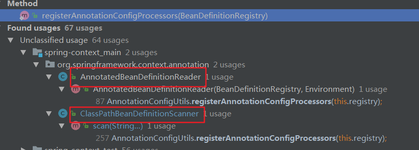


AnnotationConfigApplicationContext 的无参构造函数，其内部创建了一个 AnnotatedBeanDefinitionReader 对象，该对象构造函数内部调用 AnnotationConfigUtil.registerAnnotationConfigProcessors 方法注册了注解处理器（其作用等价于在 XML 里面配置 <context:annotation-config />)，其中就注册了 ConfigurationClassPostProcessor 处理器，该处理器就是专门用来处理 @Configuration 注解的。

ConfigurationClassPostProcessor 实现了 Spring 框架的 BeanDefinitionRegistryPostProcessor 接口所以具有 postProcessBeanDefinitionRegistry 方法 。遍历应用程序上下文中的 Bean 查找标注 @Configuration 的 Bean 定义，具体是使用 ConfigurationClassUtils.checkConfigurationClassCandidate 方法检测，代码如下

```java

abstract class ConfigurationClassUtils {
	static {
		candidateIndicators.add(Component.class.getName());
		candidateIndicators.add(ComponentScan.class.getName());
		candidateIndicators.add(Import.class.getName());
		candidateIndicators.add(ImportResource.class.getName());
	}


	public static boolean checkConfigurationClassCandidate(BeanDefinition beanDef, MetadataReaderFactory metadataReaderFactory) {
        ...
        //该类上是否标注了@Configuration注解
        if (isFullConfigurationCandidate(metadata)) {
            beanDef.setAttribute(CONFIGURATION_CLASS_ATTRIBUTE, CONFIGURATION_CLASS_FULL);
        }
        //该类上是否标注了@Component，@ComponentScan，@Import注解
        else if (isLiteConfigurationCandidate(metadata)) {
            beanDef.setAttribute(CONFIGURATION_CLASS_ATTRIBUTE, CONFIGURATION_CLASS_LITE);
        }
        else {
            return false;
        }
        ...
        return true;
}
}


```


# 5、spring注解工作原理


> 参考


- [从Controller注解切入了解spring注解原理](https://blog.csdn.net/jack_wang001/article/details/78781588)

- [Spring 中常用注解原理剖析](https://www.cnblogs.com/kaleidoscope/p/9766720.html)


> 原理概述


备注：`Repository\Service\Controller均是符合注解，三者都包含了Component注解，所有“继承”了component注解接口的注解修饰用户的类会被spring中的注解处理器获取,判定存在component注解后，注解处理器会在spring容器框架中根据用户类的全限定名通过java的反射机制创建这个用户类的对象，并放到spring容器框架中进行管理`


那spring是如何找到这些bean的类文件的呢？

我们在spring的配置文件中，有这样一个标签节点<context:component-scan>，在这个标签的属性base-package中设置要扫描的包。那么可以推断，spring框架中肯定有根据base-package属性扫描得到所有需要管理的bean对象，这个节点中的所有属性会被放入扫描模块对象工具中去，结果就是将所有的bean对象放到spring的容器中去。

注意：spring容器框架的注解都会在running状态下的，所以运行时加载的文件都是已经编译后的class文件.所以使用的是asm技术读取class文件的字节码转化成MetadataReader中的AnnotationMetadataReadingVisitor结构.

标签<context:component-scan>的解析总结如下：

- 1、根据配置利用asm技术扫描.class文件，并将包含@Component及元注解为@Component的注解@Controller、@Service、@Repository或者还支持Java EE 6的@link javax.annotation.ManagedBean和jsr - 330的 @link javax.inject.Named，如果可用把bean注册到beanFactory中；

- 2、注册注解后置处理器，主要是处理属性或方法中的注解，包含：

	- 1、注册@Configuration处理器ConfigurationClassPostProcessor，

	- 2、注册@Autowired、@Value、@Inject处理器AutowiredAnnotationBeanPostProcessor；

	- 3、注册@Required处理器RequiredAnnotationBeanPostProcessor；在支持JSR-250条件下注册javax.annotation包下注解处理器CommonAnnotationBeanPostProcessor，包括@PostConstruct、@PreDestroy、@Resource注解等；支持jpa的条件下，注册org.springframework.orm.jpa.support.PersistenceAnnotationBeanPostProcessor处理器，处理jpa相关注解；注册@EventListener处理器EventListenerMethodProcessor

注解处理器的的实例化和处理器的注册时同步的，实例化后放入到beanFactory的beanProcessors列表中去。

Spring框架的核心就是IOC,通过controller一类注解的bean的实例化过程可以大体总结spring注解的工作原理：

- 1、利用asm技术扫描class文件，转化成Springbean结构，把符合扫描规则的（主要是是否有相关的注解标注，例如@Component）bean注册到Spring 容器中beanFactory

- 2、注册处理器，包括注解处理器

- 3、实例化处理器（包括注解处理器），并将其注册到容器的beanPostProcessors列表中

- 4、创建bean的过程中，属性注入或者初始化bean时会调用对应的注解处理器进行处理。

 
举例注解@Autowired 。对于这个注解，您需要在xml中配置这个注解的处理器AutowiredAnnotationBeanPostProcessor，这个处理器会扫描容器中所有的bean对象，发现bean中拥有@Autowired注解的时候会自动去找到容器中和这个注解修饰类型匹配的bean对象，并注入到对应的地方去。那为什么AutowiredAnnotationBeanPostProcessor这个处理器对象我怎么在配置文件中没有看到设置呢？    那是因为在spring解析<context:component>标签的时候默认这个注解被隐示配置了，还有其他的注解处理器，如CommonAnnoationBeanPostProcessor。


## 0、AnnotationConfigUtils

配置一下注解解析启动到spring请求中，用来处理注解，对应下面三个接口:

- BeanPostProcessor
- BeanFactoryPostProcessor
- AutowireCandidateResolver

工具类的方法registerAnnotationConfigProcessors被调用会往spring容器中注册下面七个类：

- 1、ConfigurationClassPostProcessor
- 2、AutowiredAnnotationBeanPostProcessor
- 3、RequiredAnnotationBeanPostProcessor
- 4、CommonAnnotationBeanPostProcessor
- 5、PersistenceAnnotationBeanPostProcessor
- 6、EventListenerMethodProcessor
- 7、DefaultEventListenerFactory

这些类对应处理不同类型的注解。

## 1、BeanPostProcessor

在bean的实例化过程增加逻辑，比如AOP代理等。

### 1、AutowiredAnnotationBeanPostProcessor

功能：处理@Autowired、@Value、@Inject注解

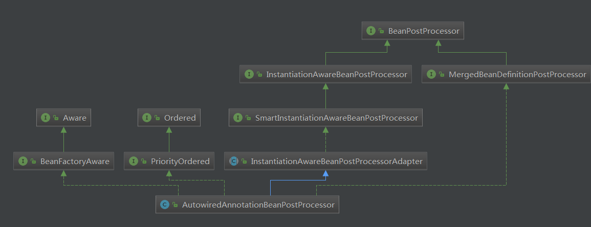


### 2、RequiredAnnotationBeanPostProcessor

功能：处理@Required注解

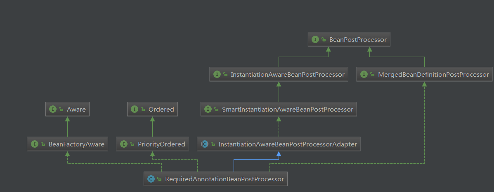


### 3、CommonAnnotationBeanPostProcessor

功能：处理@PostConstruct、@PreDestroy、@Resource注解

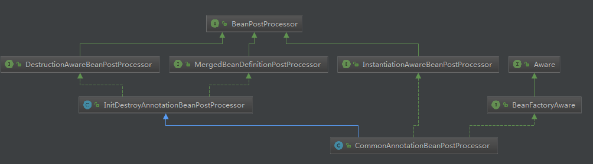


备注：`@PostConstruct和@PreDestroy注解的实现原理是通过接口BeanPostProcessor来实现的，具体可以参考类（CommonAnnotationBeanPostProcessor和InitDestroyAnnotationBeanPostProcessor）`


### 4、PersistenceAnnotationBeanPostProcessor

备注：和JPA操作相关

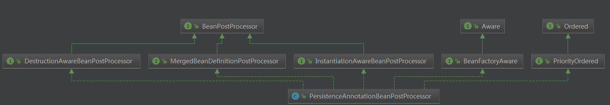


## 2、BeanFactoryPostProcessor

`Spring注解驱动开发扩展原理:BeanFactoryPostProcessor`

BeanFactoryPostProcessor: beanFactory的后置处理器,在 BeanFactory 标准初始化之后调用,所有的bean定义已经保存加载到beanFactory,但是bean的实例还未创建。

ioc容器创建对象。invokeBeanFactoryPostProcessors(beanFactory)执行beanBeanFactoryPostProcessors。如何找到所有的BeanFactoryPostProcessor并执行它们的方法?直接在BeanFactory中找到所有类型是BeanFactoryPostProcessor的组件,并执行它们的方法,在初始化创建其他组件前面执行。


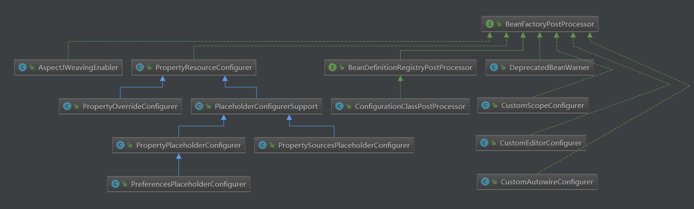

接口BeanDefinitionRegistryPostProcessor重要。


```java
public interface BeanFactoryPostProcessor {
	void postProcessBeanFactory(ConfigurableListableBeanFactory beanFactory) throws BeansException;
}
```


```java
public interface BeanDefinitionRegistryPostProcessor extends BeanFactoryPostProcessor {
void postProcessBeanDefinitionRegistry(BeanDefinitionRegistry registry) throws BeansException;

}
```


### 1、ConfigurationClassPostProcessor

说明：当前类和@Configuration注解有关。

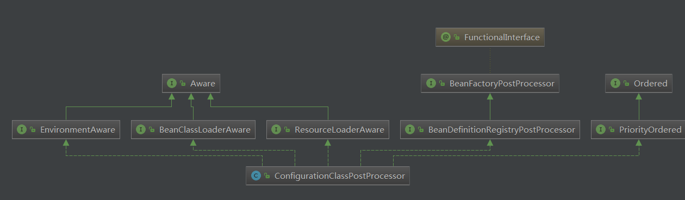


#### 1、ImportAwareBeanPostProcessor

ImportAwareBeanPostProcessor为内部类实现了BeanPostProcessor接口

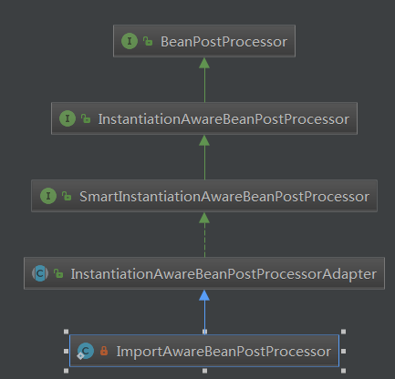


ClassPathBeanDefinitionScanner注解扫描工具

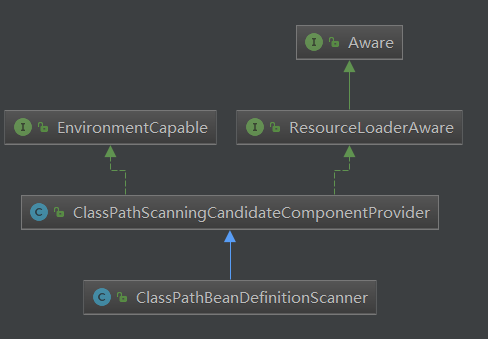


### 2、PropertyPlaceholderConfigurer

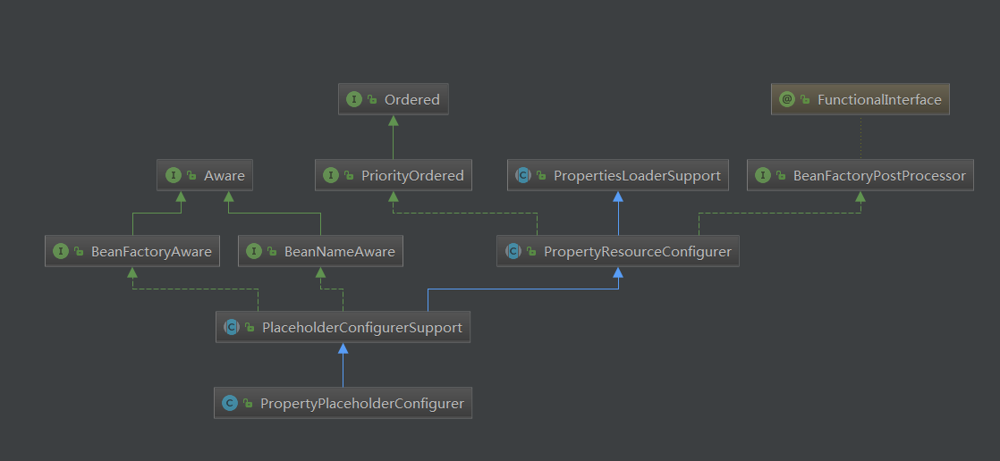

我们一般在配置数据库的dataSource时使用到的占位符的值，就是它注入进去的：

```java
public abstract class PropertyResourceConfigurer extends PropertiesLoaderSupport
        implements BeanFactoryPostProcessor, PriorityOrdered {
    @Override
    public void postProcessBeanFactory(ConfigurableListableBeanFactory beanFactory) throws BeansException {
        try {
            Properties mergedProps = mergeProperties();
            // Convert the merged properties, if necessary.
            convertProperties(mergedProps);
            // Let the subclass process the properties.
            processProperties(beanFactory, mergedProps);
        }
        catch (IOException ex) {
            throw new BeanInitializationException("Could not load properties", ex);
        }
    }
```
processProperties(beanFactory, mergedProps);在子类中实现的，功能就是将${jdbc_username}等等这些替换成实际值。


```xml
<bean name="dataSource" class="com.alibaba.druid.pool.DruidDataSource" init-method="init" destroy-method="close">
        <property name="url" value="${jdbc_url}" />
        <property name="username" value="${jdbc_username}" />
        <property name="password" value="${jdbc_password}" />
```


## 3、EventListenerMethodProcessor和DefaultEventListenerFactory

功能：处理@EventListener注解

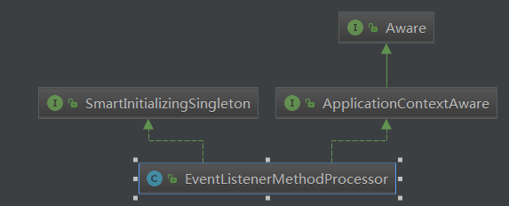


# 6、FactoryBean：可以让我们自定义Bean的创建过程

- [Spring系列之FactoryBean（一）](https://blog.csdn.net/zknxx/article/details/79572387)

工厂bean支持创建单例或者原型bean对象，同时支持懒加载。

```java
public interface FactoryBean<T> {

	@Nullable
	T getObject() throws Exception;//返回的对象实例

	@Nullable
	Class<?> getObjectType();//Bean的类型

//true是单例，false是非单例  在Spring5.0中此方法利用了JDK1.8的新特性变成了default方法，返回true
	default boolean isSingleton() {
		return true;
	}
}

```

从它定义的接口可以看出，FactoryBean表现的是一个工厂的职责。 即一个Bean A如果实现了FactoryBean接口，那么A就变成了一个工厂，根据A的名称获取到的实际上是工厂调用getObject()返回的对象，而不是A本身，如果要获取工厂A自身的实例，那么需要在名称前面加上'&'符号。

- getObject('name')返回工厂中的实例
- getObject('&name')返回工厂本身的实例

通常情况下，bean 无须自己实现工厂模式，Spring 容器担任了工厂的 角色；但少数情况下，容器中的 bean 本身就是工厂，作用是产生其他 bean 实例。由工厂 bean 产生的其他 bean 实例，不再由 Spring 容器产生，因此与普通 bean 的配置不同，不再需要提供 class 元素。


## 1、使用场景

为什么要有FactoryBean这个东西呢，有什么具体的作用吗？

FactoryBean在Spring中最为典型的一个应用就是用来创建AOP的代理对象。

我们知道AOP实际上是Spring在运行时创建了一个代理对象，也就是说这个对象，是我们在运行时创建的，而不是一开始就定义好的，这很符合工厂方法模式。更形象地说，AOP代理对象通过Java的反射机制，在运行时创建了一个代理对象，在代理对象的目标方法中根据业务要求织入了相应的方法。这个对象在Spring中就是——`ProxyFactoryBean(生成CglibAopProxy或者JdkDynamicAopProxy)`。

所以，FactoryBean为我们实例化Bean提供了一个更为灵活的方式，我们可以通过FactoryBean创建出更为复杂的Bean实例。

## 2、BeanFactory和FactoryBean区别

- 他们两个都是个工厂，但FactoryBean本质上还是一个Bean，也归BeanFactory管理
- BeanFactory是Spring容器的顶层接口，FactoryBean更类似于用户自定义的工厂接口。


# 参考

- [聊聊spring的那些扩展机制](https://juejin.im/post/5ba45a94f265da0aa94a0d71)
- [Spring IoC有什么好处呢？](https://www.zhihu.com/question/23277575)
- [深入剖析 Spring 框架的 BeanFactory](https://www.cnblogs.com/digdeep/p/4518571.html)
- [Spring AOP的实现研究](https://www.cnblogs.com/micrari/p/7552571.html)
- [spring源码系列7：Spring中的InstantiationAwareBeanPostProcessor和BeanPostProcessor的区别](https://www.cnblogs.com/smallstudent/p/11724142.html)
- [Spring AOP切点表达式详解](https://my.oschina.net/zhangxufeng/blog/1824275)