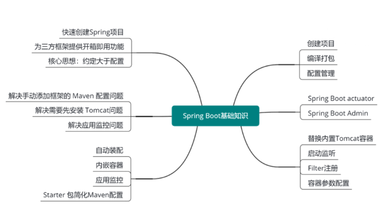
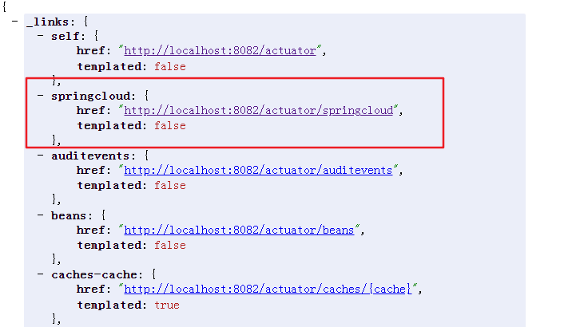
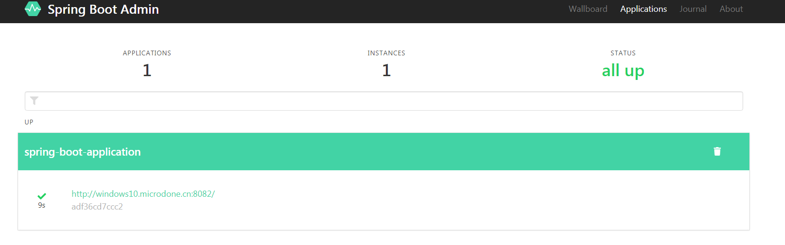

<!-- TOC -->

- [1、Spring Boot 亮点](#1spring-boot-亮点)
- [2、 Spring Boot 中读取配置内容有以下三种方式](#2-spring-boot-中读取配置内容有以下三种方式)
    - [1、Environment](#1environment)
    - [2、@Value](#2value)
    - [3、@ConfigurationProperties](#3configurationproperties)
- [3、Spring Boot Starter 自定义](#3spring-boot-starter-自定义)
- [4、Spring Boot actuator](#4spring-boot-actuator)
- [5、Spring Boot Admin](#5spring-boot-admin)
- [6、Spring Boot常用功能点](#6spring-boot常用功能点)
    - [1、替换内置 Tomcat 容器](#1替换内置-tomcat-容器)
    - [2、容器的参数配置](#2容器的参数配置)
    - [3、启动监听](#3启动监听)
    - [4、Filter 的注册](#4filter-的注册)
- [参考](#参考)

<!-- /TOC -->



# 1、Spring Boot 亮点

随着 Spring Boot 的出现，轻松解决了上面的这些问题，我们下面来看看为什么 Spring Boot 可以解决这些问题。

主要是因为 Spring Boot 的 4 个亮点，分别是自动装配、内嵌容器、应用监控、Starter 包简化框架集成难度。

- 自动装配：Spring Boot 会根据某些规则对所有配置的 Bean 进行初始化。可以减少了很多重复性的工作。比如使用 MongoDB 时，只需要在 pom.xml 中加入 MongoDB 的 Starter 包，然后配置 MongoDB 的连接信息，就可以直接使用 MongoTemplate 自动装配来操作数据库了。

- 内嵌容器：Spring Boot 应用程序可以不用部署到外部容器中，比如 Tomcat。Spring Boot 应用程序可以直接通过 Maven 命令编译成可执行的 jar 包，通过 java-jar 命令启动即可，非常方便。

- 应用监控：Spring Boot 中自带监控功能 Actuator，可以实现对程序内部运行情况进行监控，比如 Bean 加载情况、环境变量、日志信息、线程信息等。当然也可以自定义跟业务相关的监控，通过Actuator 的端点信息进行暴露。

- Starter 包简化框架集成难度：将 Bean 的自动装配逻辑封装在 Starter 包内部，同时也简化了 Maven Jar 包的依赖，对框架的集成只需要加入一个 Starter 包的配置，降低了烦琐配置的出错几率。

> Spring Boot 常用 Starter 包

Spring Boot 的 Starter 包有很多，几乎覆盖了 Java 领域的大部分框架，这里列举几个常用的 Starter 包。

- spring-boot-starter-web：用于快速构建基于 Spring MVC 的 Web 项目。

- spring-boot-starter-data-redis：用于快速整合并操作 Redis。

- spring-boot-starter-data-mongodb：用于对 MongoDB 的集成。

- spring-boot-starter-data-jpa：用于操作 MySQL。

- spring-boot-starter-activemq：用于操作 ActiveMQ。


# 2、 Spring Boot 中读取配置内容有以下三种方式

- Environment
- @Value
- @ConfigurationProperties


## 1、Environment 

Environment 用于管理当前的应用环境信息，定义了获取 Profile 的方法，同时继承了 PropertyResolver，PropertyResolver 提供了属性访问的相关方法。

所以我们通过 Environment 的 getProperty() 方法读取指定配置 Key 的内容。

在 Controller 中注入 Environment 的实例，通过 getProperty 就可以获取对应的 Key 的属性值。


## 2、@Value

在注解中指定配置 Key，直接可以将属性值注入到该字段中。

在 Controller 中定义一个 port 字段，在 port 上使用 @Value 注入当前项目的端口值，冒号后面是在无值的情况下给的默认值，避免没配置值的报错问题。

## 3、@ConfigurationProperties

前面我们讲解了通过 Environment 和 @Value 注解的方式来读取配置文件中的属性值，这两种方式都是对单独的属性进行读取，使用的时候也都是散落在各个类中，然后很多场景下，我们需要有一组配置，都是服务于某个功能或者业务的，比如数据源的配置：spring.datasource.url、spring.datasource.username，这些配置我们希望能够集中管理和使用，这个时候可以使用 @ConfigurationProperties 注解将属性值注入到实体类中。

```java
@Configuration
@ConfigurationProperties(prefix="spring")
public class User {

	private String name;

	public String getName() {
		return name;
	}

	public void setName(String name) {
		this.name = name;
	}
	
}
```


这里定义了一个 User 的实体类，并定义了 name 字段和对应的 get、set 方法，在类上添加 @Configuration 和 @ConfigurationProperties(prefix="spring")  注解，并指定前缀为 spring。

然后在配置文件中填加 spring.name 的配置，spring.name 将会自动注入 User 实体中，由于 User 类添加了 @Configuration 注解，我们在使用时可以直接通过 @Autowired 进行注入，然后就可以访问 User 类的 getName 方法获取 name 的值了。


# 3、Spring Boot Starter 自定义

Starter 包可以说是 Spring Boot 中的核心功能，Starter 的出现，简化了很多工作，在Spring Cloud 中我们也会接触到各种的 Starter，除了使用官方提供的 Starter 包之外，我们也会遇到需要自定义 Starter 的场景。所以需要了解 Starter 的构建原理，以及能够自己动手构建一个 Starter，这样在集成的 Starter 包报错时，能够去分析错误，以及解决错误，正所谓知己知彼，才能百战百胜。

 

这里总结了自定义一个 Starter 需要的6个步骤：

- 1、创建 Starter 项目；

- 2、项目创建完后定义 Starter 需要的配置（Properties）类，比如数据库的连接信息；

- 3、编写自动配置类，自动配置类就是获取配置，根据配置来自动装配 Bean；

- 4、编写 spring.factories 文件加载自动配置类，Spring 启动的时候会扫描 spring.factories 文件，指定文件中配置的类；

- 5、编写配置提示文件 spring-configuration-metadata.json（不是必须的），在添加配置的时候，我们想要知道具体的配置项是什么作用，可以通过编写提示文件来提示；

- 6、最后就是使用，在项目中引入自定义 Starter 的 Maven 依赖，增加配置值后即可使用。

以上是我总结出来定义 Starter 包需要执行的步骤，接下来我们根据上面的步骤来看下实际的代码部分怎么编写。


在某些场景下，我们的 Starter 不需要被依赖就开启自动装配，而是需要使用者进行手动的开启，为了满足这个需求，我们需要去掉 spring.factories，大部分手动开启都是通过在启动类上加一个注解来开启某个功能，我们同样也可以定义一个开启 UserClient 的注解 @EnableUserClient。


最核心的点在于使用了 @Import 注解来导入我们的自动配置类，这样只有使用者在启动类上增加了 @EnableUserClient 注解，然后通过 @Import 导入自动配置类，开启自动装配工作。

需求总是多样化的，假如你的 Starter 自动装配，需要装配很多内容，但里面的某些内容需要进一步的满足某些条件才进行初始化，这个时候我们往往会通过配置的方式来指定需不需要开启装配。

可以使用 @ConditionalOnProperty 注解来实现，作用是当配置中某个属性的值满足条件才开启装配，我们定义一个 spring.user.enabled=true 的配置项，如果配置中没有 spring.user.enabled 配置或者没有等于 true, 那么 UserClient 将不会进行装配。将配置中的 spring.user.enabled 去掉，你会发现启动的时候报错了，项目中注入了 UserClient，但是 UserClient 并没有创建。


# 4、Spring Boot actuator 


Spring Boot 中提供了一个用于监控和管理自身应用信息的模块，它就是 spring-boot-starter-actuator。

通过集成 actuator 可以将 Spring Boot 应用本身的一些信息通过 HTTP 或 JMX 的方式暴露出去，可以让第三方的监控工具拉取这些信息，进行信息的管理，查看，监控和告警。

将 actuator 整合到 Spring Boot 中，整合的过程非常简单，这就是 Spring Boot 自带的魅力，只需要在项目的 pom.xml 文件中增加 spring-boot-starter-actuator 的依赖就可以将 actuator 整合到 Spring Boot 项目中。


配置信息

```
# 暴露所有端点
management.endpoints.web.exposure.include=*
# 展示health详情
management.endpoint.health.show-details=ALWAYS
```

访问路径：http://localhost:8082/actuator/health

返回信息

```json
{
status: "UP",
    details: {
        custom: {
            status: "UP",
                details: {
                customInfo: "自定义信息"
                }
            },
        diskSpace: {
            status: "UP",
            details: {
                total: 1000202039296,
                free: 574185967616,
                threshold: 10485760
            }
        }
    }
}
```

然后我们启动下项目, 访问 actuator/health 这个端点，可以看到返回了 status为UP，证明当前健康状态是正常的，如果 status 为 DOWN 那就是不健康的状态。

Spring Boot actuator 中内置了很多 Endpoint，也就是端点信息，刚刚访问的 health 就是一个端点。这里列举了几个常用的端点信息：


/actuator/health 查看应用健康指标，health 端点能够及时反馈出当前应用的监控状态，health的值默认是当前磁盘的使用情况，同时也支持对很对框架的健康状态反馈。

讲到这里想必大家都应该清楚了 health 端点的原理，当我们需要在自己的项目中结合业务本身做一些健康监控时，可以实现自己的 HealthIndicator。


Spring Boot 中集成的框架基本上都有自己的 HealthIndicator，在这些框架出问题后，/health 能够及时反馈健康信息。

如果我们需要加入一些其他的判断来决定应用的监控状态时，可以继承 AbstractHealthIndicator 类，实现自己的 HealthIndicator。具体需要实现 doHealthCheck 方法，在 doHealthCheck 中进行健康状态的判断，健康状态使用 builder.up() 表示，不健康使用 builder.down() 方法表示，未知的状态使用 builder.unknown() 方法表示，应用已停止服务使用 builder.outOfService() 方法表示。

如果需要展示详细的信息，可以使用 withDetail 方法来添加详细信息，这样在访问 /health 端点时就可以显示这些详细信息了，前提是需要打开这个详情展示的功能，默认是关闭的，我们可以通过配置`management.endpoint.health.show-details=ALWAYS` 开启。

```java
@Component
public class CustomHealthIndicator extends AbstractHealthIndicator {
	
	@Override
	protected void doHealthCheck(Health.Builder builder) throws Exception {
		builder.up().withDetail("customInfo", "自定义信息");
	}

}
```

备注：上面的custom项就是自定的监控信息


这里是 Spring Boot2 的版本，所有开放的端点的路径都以 /actuator 开头，默认很多端点是不开放的，我们可以通过配置 `management.endpoints.web.exposure.include=* ` 暴露全部的端点。

 

上面这些端点都是actuator中内置的，在实际工作中，你会有自定义端点的需求，比如说你封装了某个框架，这个时候你需要有检查这个框架健康的端点，健康检查我们可以扩展已有的 /health 端点来实现。除了健康检查，你可能还需要一个能够展示框架内部一些信息的端点。


自定义端点也是非常简单的，只需要一个 @Endpoint 注解就可以实现，我们来实现一个名称为 springcloud 的端点，创建一个类，增加 @Endpoint(id = "springcloud") 注解，指定 id 为 springcloud，这个类需要被 Spring 管理，我们加上 @Component 注解，然后定义一个用于展示信息的方法，返回类型可以自定义，这里定义一个 Map 返回，Map 中增加一个 title 的 Key，value 为 springcloud，最后一步需要在方法上增加 @ReadOperation 注解，大功告成。

 
启动项目，访问actuator/springcloud，就这么简单的几步，轻松的自定义了一个端点。




```java
@Component
@Endpoint(id = "springcloud")
public class SpringCloudEndPoint {
	
	@ReadOperation
	public Map<String, Object> showData() {
		Map<String, Object> data = new HashMap<String, Object>();
		data.put("title", "springcloud");
		return data;
	}
	
}

```


# 5、Spring Boot Admin

目前所有的端点信息都是通过 HTTP 访问的，数据也是 Json 格式的，如果直接通过这些数据来查看某些指标不是很直观，这时我们可以通过 Spring Boot Admin 来对 actuator 信息进行管理。

 
Spring Boot Admin 是一个开源的 Web 项目，用于管理和监控 Spring Boot 应用程序的运行状态。在 Spring Boot 项目中可以通过集成 Spring Boot Admin Client 向 Spring Boot Admin Server 进行注册，这样我们就可以在Spring Boot Admin Server 统一管理 Spring Boot 应用。


```xml
<dependency>
    <groupId>de.codecentric</groupId>
    <artifactId>spring-boot-admin-starter-client</artifactId>
    <version>2.1.6</version>
</dependency>
```


Spring Boot Admin 主要功能点：

- 显示应用程序的监控状态

- 应用程序上下线监控  

- 查看 JVM 和线程信息

- 可视化的查看日志及下载日志文件

- 动态切换日志级别

- HTTP 请求信息跟踪等实用功能

- 将 actuator 提供的数据进行可视化


接下来体验一下 Spring Boot Admin，首先我们需要创建一个 Spring Boot 项目，我这里创建了一个 Spring Boot Admin 的项目，然后在 pom 中加入 spring-boot-admin-starter-server

的依赖。然后创建一个启动类，在启动类上增加 @EnableAdminServer 的注解，启用 Spring Boot Admin Server。

启动项目后，访问 http://localhost:8080，这就是 Spring Boot Admin 的主页面




Spring Boot 项目需要集成 Spring Boot Admin Client 向 Spring Boot Admin Server 进行注册，那我们就在项目中增加 spring-boot-admin-starter-client 的依赖，光增加依赖可不行，需要用户必须得知道注册到哪里去了，所以我们需要在配置文件中指定 Spring Boot Admin Server 的地址才行，配置为 spring.boot.admin.client.url=http://localhost:8080


启动 Spring Boot 项目后，可以看到 Spring Boot Admin Server 中已经有服务注册上来了，可以清楚的知道应用的名称和 IP 端口信息，应用名称是默认的，可以在配置文件中通过 spring.application.name 来自定义名称。

点击服务信息进去查看详情，左边是对应的功能菜单，右边是数据展示的页面。Detail 中有健康信息、线程信息、JVM 内存等信息，都通过图形的方式展示，一目了然。除了这些还有 Log、Web、Cache 等管理功能


# 6、Spring Boot常用功能点 


## 1、替换内置 Tomcat 容器

第一个是怎么去替换内置的 Tomcat 容器

spring-boot-starter-web 中默认自带的容器是 Tomcat，如果想要替换成 Jetty 也是非常简单的。

首先需要排除 spring-boot-starter-web 包中的 Tomcat，然后单独增加对应容器的依赖，比如我们加入 Jetty，就需要增加 spring-boot-starter-jetty 的配置。然后重启项目，可以看到控制台输出的是 Jetty started on port 的内容，证明内置容器已经被成功替换成了 Jetty。替换成其他容器步骤也是一样。

```xml
<dependency>
    <groupId>org.springframework.boot</groupId>
    <artifactId>spring-boot-starter-web</artifactId>
    <exclusions>
        <exclusion>
            <groupId>org.springframework.boot</groupId>
            <artifactId>spring-boot-starter-tomcat</artifactId>
        </exclusion>
    </exclusions>
</dependency>

<dependency>
    <groupId>org.springframework.boot</groupId>
    <artifactId>spring-boot-starter-jetty</artifactId>
</dependency>
```


## 2、容器的参数配置

第二个是容器的参数如何配置

 
以前使用外部的 Tomcat，参数的调整都是在 Tomcat 的 server.xml 中进行配置，在 Spring Boot 中，内置容器的参数可以在 application 配置文件中进行指定，不同容器的参数配置有对应的前缀，server.tomcat 就是配置 Tomcat 的参数，server.jetty 就是配置 Jetty 的参数。

## 3、启动监听

第三个是启动监听


很多时候，我们需要在程序启动后，回调一些方法来处理某些事情，比如初始化本地缓存。这种场景我们可以使用 CommandLineRunner 和 ApplicationRunner 两个监听接口来实现。

CommandLineRunner 和 ApplicationRunner 本质上是一样的，不同的就是 ApplicationRunner 对方法的参数进行了封装。


```java
@Component
public class CustomApplicationRunner implements ApplicationRunner {

	@Override
	public void run(ApplicationArguments args) throws Exception {
		System.out.println("ApplicationRunner 启动了。。。");
	}

}


@Component
public class CustomCommandLineRunner implements CommandLineRunner {

	@Override
	public void run(String... args) throws Exception {
		System.out.println("CommandLineRunner 启动了。。。");
	}

}
```


## 4、Filter 的注册

第四个是Filter的注册

Filter的注册有两种方式，一种是直接用 @WebFilter 注解，另一种是通过 FilterRegistrationBean 进行注册。

```java
public class CustomFilter implements Filter {

	@Override
	public void doFilter(ServletRequest request, ServletResponse response, FilterChain chain)
			throws IOException, ServletException {
		System.out.println("Filter ...");
		chain.doFilter(request, response);
	}

}


// 注册过滤器
@Bean
public FilterRegistrationBean<CustomFilter> registration() {
    CustomFilter filter = new CustomFilter();
    FilterRegistrationBean<CustomFilter> registration = new FilterRegistrationBean<CustomFilter>(filter);
    registration.addUrlPatterns("/*");
    return registration;
}
```


# 参考

代码示例：https://github.com/lishuai2016/ls-springcloud-learn/tree/master/new/springboot


