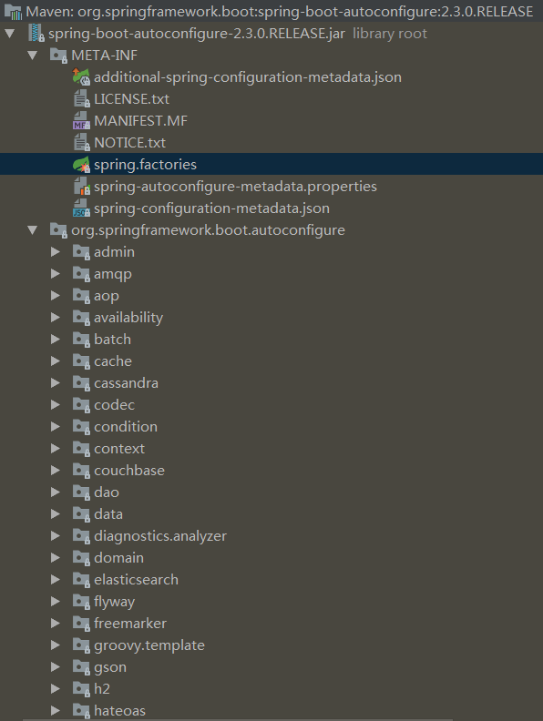
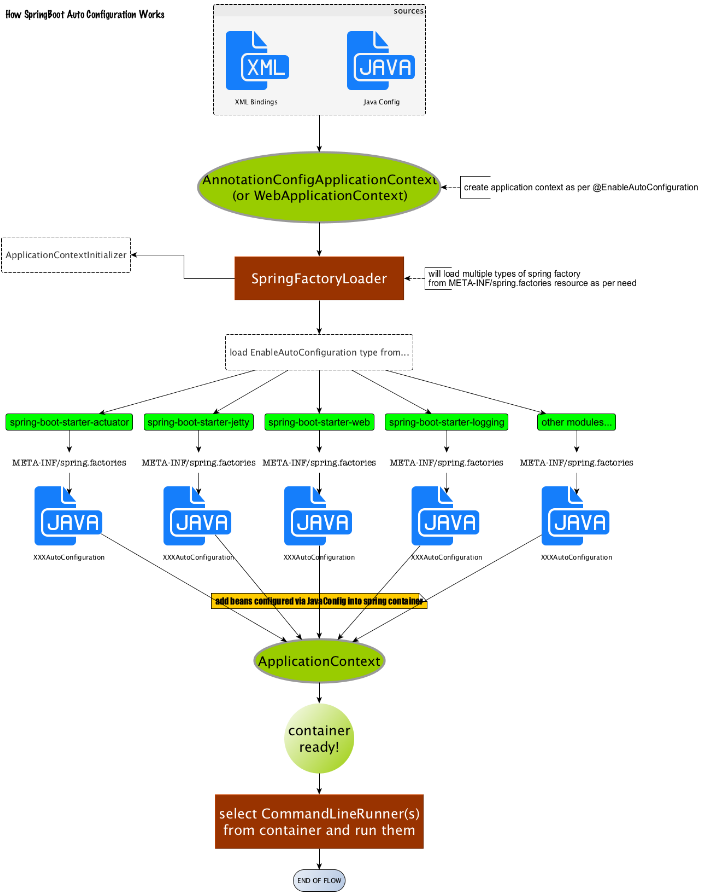
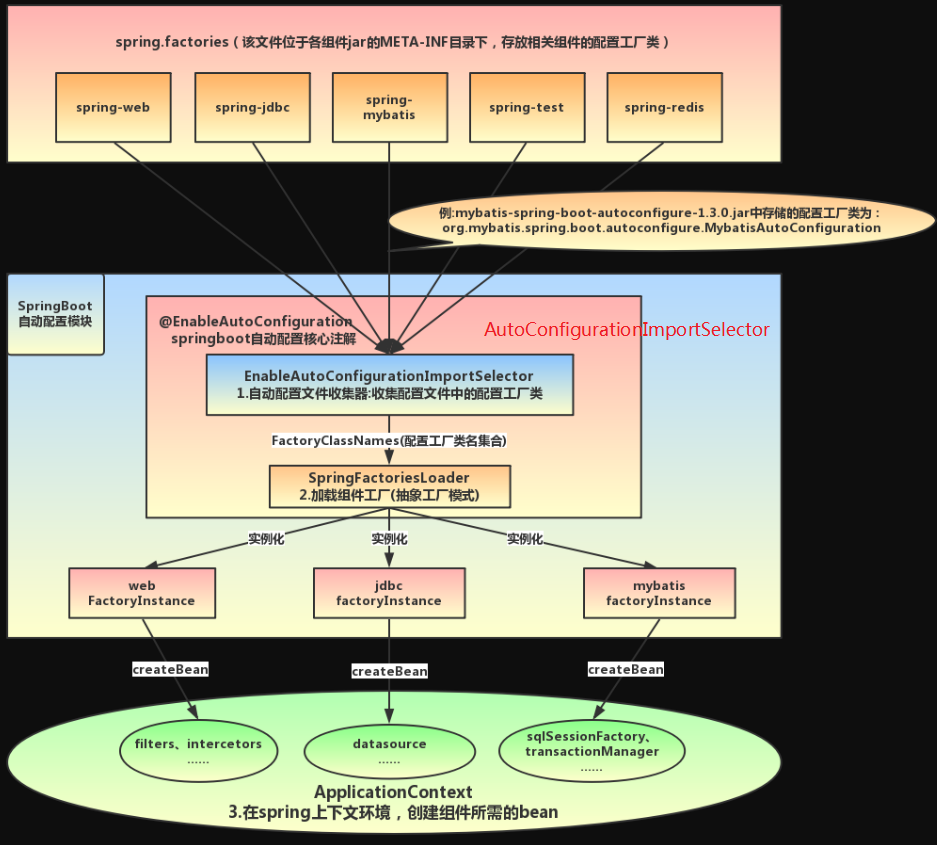
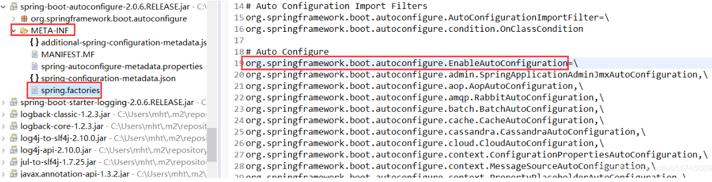
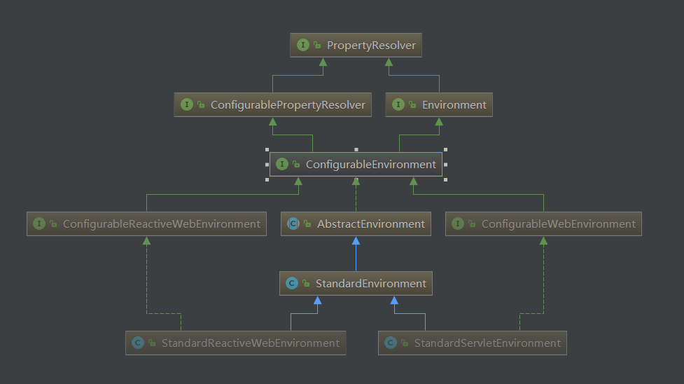
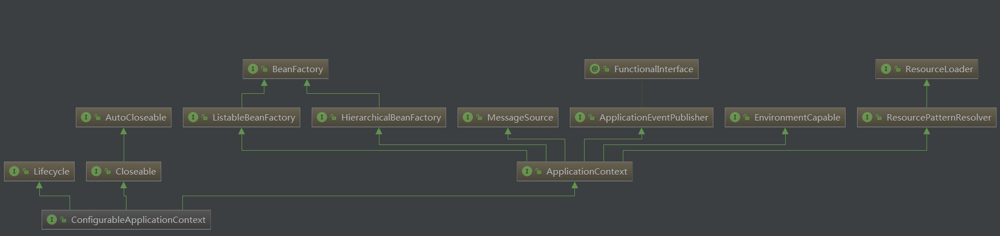

<!-- TOC -->

- [0、配置自动生效机制](#0配置自动生效机制)
- [1、@SpringBootApplication](#1springbootapplication)
- [2、@EnableAutoConfiguration](#2enableautoconfiguration)
    - [1、AutoConfigurationImportSelector](#1autoconfigurationimportselector)
    - [2、SpringFactoriesLoader](#2springfactoriesloader)
- [3、SpringApplication的执行流程](#3springapplication的执行流程)
- [1、源码解析](#1源码解析)
- [参考](#参考)

<!-- /TOC -->


> 总结

Spring Boot启动的时候会通过@EnableAutoConfiguration注解找到META-INF/spring.factories配置文件中的所有自动配置类，并对其进行加载，而这些自动配置类都是以AutoConfiguration结尾来命名的，它实际上就是一个JavaConfig形式的Spring容器配置类，它能通过以Properties结尾命名的类中取得在全局配置文件中配置的属性如：server.port，而XxxxProperties类是通过@ConfigurationProperties注解与全局配置文件中对应的属性进行绑定的。一定要记得XxxxProperties类的含义是：封装配置文件中相关属性；XxxxAutoConfiguration类的含义是：自动配置类，目的是给容器中添加组件。

springboot的设计理念：约定优先配置，快速开发，快速启动。


Spring Boot关于自动配置的源码在spring-boot-autoconfigure-x.x.x.x.jar中。



Spring Boot的启动类上有一个@SpringBootApplication注解，这个注解是Spring Boot项目必不可少的注解。那么自动配置原理一定和这个注解有着千丝万缕的联系！因此，把它当做入口开始学习。


# 0、配置自动生效机制

每一个XxxxAutoConfiguration自动配置类都是在某些条件之下才会生效的，这些条件的限制在Spring Boot中以注解的形式体现，常见的条件注解有如下几项：

- @ConditionalOnBean：当容器里有指定的bean的条件下。

- @ConditionalOnMissingBean：当容器里不存在指定bean的条件下。

- @ConditionalOnClass：当类路径下有指定类的条件下。

- @ConditionalOnMissingClass：当类路径下不存在指定类的条件下。

- @ConditionalOnProperty：指定的属性是否有指定的值，比如@ConditionalOnProperties(prefix=”xxx.xxx”, value=”enable”, matchIfMissing=true)，代表当xxx.xxx为enable时条件的布尔值为true，如果没有设置的情况下也为true。


以ServletWebServerFactoryAutoConfiguration配置类为例，解释一下全局配置文件中的属性如何生效，比如：server.port=8081，是如何生效的（当然不配置也会有默认值，这个默认值来自于org.apache.catalina.startup.Tomcat）。

```java
@Configuration(
    proxyBeanMethods = false
)
@AutoConfigureOrder(-2147483648)
@ConditionalOnClass({ServletRequest.class})
@ConditionalOnWebApplication(
    type = Type.SERVLET
)
@EnableConfigurationProperties({ServerProperties.class})
@Import({ServletWebServerFactoryAutoConfiguration.BeanPostProcessorsRegistrar.class, EmbeddedTomcat.class, EmbeddedJetty.class, EmbeddedUndertow.class})
public class ServletWebServerFactoryAutoConfiguration {}
```

在ServletWebServerFactoryAutoConfiguration类上，有一个@EnableConfigurationProperties注解：开启配置属性，而它后面的参数是一个ServerProperties类，这就是习惯优于配置的最终落地点。

```java
@ConfigurationProperties(
    prefix = "server",
    ignoreUnknownFields = true
)
public class ServerProperties {
    private Integer port;
    private InetAddress address;
    //...
}
```

在这个类上，我们看到了一个非常熟悉的注解：@ConfigurationProperties，它的作用就是从配置文件中绑定属性到对应的bean上，而@EnableConfigurationProperties负责导入这个已经绑定了属性的bean到spring容器中）。那么所有其他的和这个类相关的属性都可以在全局配置文件中定义，也就是说，真正“限制”我们可以在全局配置文件中配置哪些属性的类就是这些XxxxProperties类，它与配置文件中定义的prefix关键字开头的一组属性是唯一对应的。

至此，我们大致可以了解。在全局配置的属性如：server.port等，通过@ConfigurationProperties注解，绑定到对应的XxxxProperties配置实体类上封装为一个bean，然后再通过@EnableConfigurationProperties注解导入到Spring容器中。

而诸多的XxxxAutoConfiguration自动配置类，就是Spring容器的JavaConfig形式，作用就是为Spring 容器导入bean，而所有导入的bean所需要的属性都通过xxxxProperties的bean来获得。

可能到目前为止还是有所疑惑，但面试的时候，其实远远不需要回答的这么具体，你只需要这样回答：

`Spring Boot启动的时候会通过@EnableAutoConfiguration注解找到META-INF/spring.factories配置文件中的所有自动配置类，并对其进行加载，而这些自动配置类都是以AutoConfiguration结尾来命名的，它实际上就是一个JavaConfig形式的Spring容器配置类，它能通过以Properties结尾命名的类中取得在全局配置文件中配置的属性如：server.port，而XxxxProperties类是通过@ConfigurationProperties注解与全局配置文件中对应的属性进行绑定的。`

通过一张图标来理解一下这一繁复的流程：




# 1、@SpringBootApplication

```java
@Target(ElementType.TYPE)
@Retention(RetentionPolicy.RUNTIME)
@Documented
@Inherited
@SpringBootConfiguration 
@EnableAutoConfiguration
@ComponentScan(excludeFilters = {
        @Filter(type = FilterType.CUSTOM, classes = TypeExcludeFilter.class),
        @Filter(type = FilterType.CUSTOM, classes = AutoConfigurationExcludeFilter.class) })
public @interface SpringBootApplication {
                                ···
}
```

@SpringBootApplication是一个复合注解或派生注解，在@SpringBootApplication中有一个注解@EnableAutoConfiguration，意思是开启自动配置。


@SpringBootConfiguration(内部为@Configuration)：被标注的类等于在spring的XML配置文件中(applicationContext.xml)，装配所有bean事务，提供了一个spring的上下文环境；

@ComponentScan：组件扫描，可自动发现和装配Bean，默认扫描SpringApplication的run方法里的Booter.class所在的包路径下文件，所以最好将该启动类放到根包路径下。

# 2、@EnableAutoConfiguration





```java
@Target({ElementType.TYPE})
@Retention(RetentionPolicy.RUNTIME)
@Documented
@Inherited
@AutoConfigurationPackage
@Import({AutoConfigurationImportSelector.class})
public @interface EnableAutoConfiguration {
    String ENABLED_OVERRIDE_PROPERTY = "spring.boot.enableautoconfiguration";

    Class<?>[] exclude() default {};

    String[] excludeName() default {};
}
```

而这个注解也是一个派生注解，其中的关键功能由@Import提供，其导入的AutoConfigurationImportSelector的selectImports()方法通过SpringFactoriesLoader.loadFactoryNames()扫描所有具有META-INF/spring.factories的jar包。spring-boot-autoconfigure-x.x.x.x.jar里就有一个这样的spring.factories文件。

这个spring.factories文件也是一组一组的key=value的形式，其中一个key是EnableAutoConfiguration类的全类名，而它的value是一个xxxxAutoConfiguration的类名的列表，这些类名以逗号分隔，如下图所示：



这个@EnableAutoConfiguration注解通过@SpringBootApplication被间接的标记在了Spring Boot的启动类上。在SpringApplication.run(...)的内部就会执行selectImports()方法，找到所有JavaConfig自动配置类的全限定名对应的class，然后将所有自动配置类加载到Spring容器中。


> SpringBoot如何实现启动引入依赖组件？

mybatis-spring-boot-starter、spring-boot-starter-web等组件的META-INF文件下均含有spring.factories文件，自动配置模块中，SpringFactoriesLoader收集到文件中的类全名并返回一个类全名的数组，返回的类全名通过反射被实例化，就形成了具体的工厂实例，工厂实例来生成组件具体需要的bean。


## 1、AutoConfigurationImportSelector


备注：AutoConfigurationImportSelector通过DeferredImportSelector实现了ImportSelector接口，因此通过@Import注解功能可知，会把selectImports方法的返回值全部注入到spring容器中，因此实现了自动配置效果。


```java
public class AutoConfigurationImportSelector implements DeferredImportSelector, BeanClassLoaderAware, ResourceLoaderAware, BeanFactoryAware, EnvironmentAware, Ordered {
    private static final AutoConfigurationImportSelector.AutoConfigurationEntry EMPTY_ENTRY = new AutoConfigurationImportSelector.AutoConfigurationEntry();
    private static final String[] NO_IMPORTS = new String[0];
    private static final Log logger = LogFactory.getLog(AutoConfigurationImportSelector.class);
    private static final String PROPERTY_NAME_AUTOCONFIGURE_EXCLUDE = "spring.autoconfigure.exclude";
    private ConfigurableListableBeanFactory beanFactory;
    private Environment environment;
    private ClassLoader beanClassLoader;
    private ResourceLoader resourceLoader;
    private AutoConfigurationImportSelector.ConfigurationClassFilter configurationClassFilter;

    public AutoConfigurationImportSelector() {
    }
    //核心，这里返回所有需要注入到spring容器类的全限定名称
    public String[] selectImports(AnnotationMetadata annotationMetadata) {
        if (!this.isEnabled(annotationMetadata)) {
            return NO_IMPORTS;
        } else {
            AutoConfigurationImportSelector.AutoConfigurationEntry autoConfigurationEntry = this.getAutoConfigurationEntry(annotationMetadata);
            return StringUtils.toStringArray(autoConfigurationEntry.getConfigurations());
        }
    }

    //因为是在EnableAutoConfiguration注解上添加的@import，annotationMetadata应该提供的是EnableAutoConfiguration的信息
    protected AutoConfigurationImportSelector.AutoConfigurationEntry getAutoConfigurationEntry(AnnotationMetadata annotationMetadata) {
        if (!this.isEnabled(annotationMetadata)) {
            return EMPTY_ENTRY;
        } else {
            AnnotationAttributes attributes = this.getAttributes(annotationMetadata);
            //重点，
            List<String> configurations = this.getCandidateConfigurations(annotationMetadata, attributes);
            configurations = this.removeDuplicates(configurations);
            Set<String> exclusions = this.getExclusions(annotationMetadata, attributes);
            this.checkExcludedClasses(configurations, exclusions);
            configurations.removeAll(exclusions);
            configurations = this.getConfigurationClassFilter().filter(configurations);
            this.fireAutoConfigurationImportEvents(configurations, exclusions);
            return new AutoConfigurationImportSelector.AutoConfigurationEntry(configurations, exclusions);
        }
    }

   //这里加载SpringBoot应用下META-INF/spring.factories配置文件，返回需要自动加载类的全限定名
    protected List<String> getCandidateConfigurations(AnnotationMetadata metadata, AnnotationAttributes attributes) {
        List<String> configurations = SpringFactoriesLoader.loadFactoryNames(this.getSpringFactoriesLoaderFactoryClass(), this.getBeanClassLoader());
        Assert.notEmpty(configurations, "No auto configuration classes found in META-INF/spring.factories. If you are using a custom packaging, make sure that file is correct.");
        return configurations;
    }
    //里面配置有很多key-value，这个方法的作用是指定我只要这个org.springframework.boot.autoconfigure.EnableAutoConfiguration对应的value列表
    protected Class<?> getSpringFactoriesLoaderFactoryClass() {
        return EnableAutoConfiguration.class;
    }

}

```

备注：selectImports方法在springboot启动流程——bean实例化前被执行，返回要实例化的类信息列表。我们知道，如果获取到类信息，spring自然可以通过类加载器将类加载到jvm中，现在我们已经通过spring-boot的starter依赖方式依赖了我们需要的组件，那么这些组建的类信息在select方法中也是可以被获取到的。


## 2、SpringFactoriesLoader


> META-INF/spring.factories文件中对应的工厂类

```java
# Initializers
org.springframework.context.ApplicationContextInitializer

# Application Listeners
org.springframework.context.ApplicationListener

# Auto Configuration Import Listeners
org.springframework.boot.autoconfigure.AutoConfigurationImportListener

# Auto Configuration Import Filters
org.springframework.boot.autoconfigure.AutoConfigurationImportFilter


# Auto Configure
org.springframework.boot.autoconfigure.EnableAutoConfiguration

# Failure analyzers
org.springframework.boot.diagnostics.FailureAnalyzer


# Template availability providers
org.springframework.boot.autoconfigure.template.TemplateAvailabilityProvider


```


即Spring工厂加载器，该对象提供了loadFactoryNames方法，入参为factoryClass和classLoader，即需要传工厂类名称和对应的类加载器，方法会根据指定的classLoader，加载该类加器搜索路径下的指定文件，即spring.factories文件，传入的工厂类为接口，而文件中对应的类则是接口的实现类，或最终作为实现类，所以文件中一般为一对多的类名集合，获取到这些实现类的类名后，loadFactoryNames方法返回类名集合，方法调用方得到这些集合后，再通过反射获取这些类的类对象、构造方法，最终生成实例


工具类定义为final，作用是解析spring-boot-autoconfigure这个包下META-INF/spring.factories文件为一个Map<String, List<String>>，并提供方法，可以根据key来获取对应的配置列表，比如这里的key=org.springframework.boot.autoconfigure.EnableAutoConfiguration，实现全部需要自动装配的配置类。

```java

public final class SpringFactoriesLoader {
    public static final String FACTORIES_RESOURCE_LOCATION = "META-INF/spring.factories";
    private static final Map<ClassLoader, MultiValueMap<String, String>> cache = new ConcurrentReferenceHashMap();//基于类加载器的不同进行隔离缓存

    private SpringFactoriesLoader() {
    }
   
    //外部访问的入口
    public static List<String> loadFactoryNames(Class<?> factoryType, @Nullable ClassLoader classLoader) {
        String factoryTypeName = factoryType.getName();//这里为org.springframework.boot.autoconfigure.EnableAutoConfiguration
        return (List)loadSpringFactories(classLoader).getOrDefault(factoryTypeName, Collections.emptyList());
    }
    //把文件内容解析为一个Map<String, List<String>>
    private static Map<String, List<String>> loadSpringFactories(@Nullable ClassLoader classLoader) {
        MultiValueMap<String, String> result = (MultiValueMap)cache.get(classLoader);
        if (result != null) {
            return result;
        } else {
            try {
                Enumeration<URL> urls = classLoader != null ? classLoader.getResources("META-INF/spring.factories") : ClassLoader.getSystemResources("META-INF/spring.factories");
                LinkedMultiValueMap result = new LinkedMultiValueMap();

                while(urls.hasMoreElements()) {
                    URL url = (URL)urls.nextElement();
                    UrlResource resource = new UrlResource(url);
                    Properties properties = PropertiesLoaderUtils.loadProperties(resource);
                    Iterator var6 = properties.entrySet().iterator();

                    while(var6.hasNext()) {
                        Entry<?, ?> entry = (Entry)var6.next();
                        String factoryTypeName = ((String)entry.getKey()).trim();
                        String[] var9 = StringUtils.commaDelimitedListToStringArray((String)entry.getValue());
                        int var10 = var9.length;

                        for(int var11 = 0; var11 < var10; ++var11) {
                            String factoryImplementationName = var9[var11];
                            result.add(factoryTypeName, factoryImplementationName.trim());
                        }
                    }
                }

                cache.put(classLoader, result);
                return result;
            } catch (IOException var13) {
                throw new IllegalArgumentException("Unable to load factories from location [META-INF/spring.factories]", var13);
            }
        }
    }

    //...
}

```


# 3、SpringApplication的执行流程

参考：

https://segmentfault.com/a/1190000014106430

https://www.cnblogs.com/trgl/p/7353782.html

https://www.cnblogs.com/yanfeiLiu/p/9303999.html

https://www.processon.com/view/link/59812124e4b0de2518b32b6e


> 1、SpringApplication在实例化之前
- 1、SpringApplication在实例化之前会根据你的应用决定创建web类型或者是标准的ApllicationContext
- 2、使用SpringFactoriesLoader在classpath下查找并加载所有可用的ApplicationContextInitializer
- 3、使用SpringFactoriesLoader在classpath下查找并加载所有可用的ApplicationListener

> 2、SpringApplication实例化完成并设置之后

- 1、通过SpringFactoriesLoader加载SpringApplicationRunListener（创建监听器）
- 2、创建应用需要的Environment（创建应用所需环境）
- 3、Environment创建完毕，SpringApplicationRunListner调用environmentPrepared()。（通知完毕）
- 4、根据当前应用创建ApplicationContext
- 5、调用ApplicationContextInitialzer，对ApplicationContext进一步处理（进一步处理）
- 6、处理完毕，SpringApplicationRunListner调用contextPrepared().（通知完毕）
- 7、将之前通过@EnableAutoConfiguration获取的所有配置以及其他形式的IoC容器配置加载到已经准备完毕的ApplicationContex
- 8、SpringApplicationRunListener调用contextLoader()。（通知完毕）
- 9、调用ApplicationContext的refresh()。完成IoC容器可以的最后一道程序
- 10、调用SpringApplicationRunListener的finish()。（通知完成）


> 3、SpringApplication的扩展点

1、SpringApplicationRunListner（事件通知的监听者）

实现请参考-->默认实现类--EventPublishingRunListener

2、ApplicationListener(监听某类事件的发生)

```java
public class Listener implements ApplicationListener<ContextRefreshEvent> {
     @Override
    public void onApplicationEvent(ContextRefreshedEvent contextRefreshedEvent) {
    }
}
```

3、ApplicationContextInitializer（进一步处理ApplicationContext）

```java
public class Demo implements ApplicationContextInitializer {
    @Override
    public void initialize(ConfigurableApplictionContext application)
}
```

4、CommandLineRunner

CommandLineRunner的执行点在main方法执行完成之前最后一步，SpringBoot中的所有CommandLineRunner都会被加载执行。CommandLinerRunner 最好使用@Ordered注解标注顺序


# 1、源码解析

main里面调用SpringApplication.run()启动整个spring-boot程序.

```java
@SpringBootApplication
public class WebApplication extends SpringBootServletInitializer {

    public static void main(String[] args) {
        SpringApplication.run(WebApplication.class, args);
        System.out.println("启动成功");
    }
    @Override
    protected SpringApplicationBuilder configure(SpringApplicationBuilder application) {
        return application.sources(WebApplication.class);
    }

}
```

run方法中去创建了一个SpringApplication实例，在该构造方法内对一些属性字段进行初始化；然后调用SpringApplication的run()方法，核心逻辑在这个run方法内完成。

```java
public ConfigurableApplicationContext run(String... args) {
        StopWatch stopWatch = new StopWatch();
        stopWatch.start();
        ConfigurableApplicationContext context = null;
        Collection<SpringBootExceptionReporter> exceptionReporters = new ArrayList();
        this.configureHeadlessProperty();
        //1、创建应用监听器
        SpringApplicationRunListeners listeners = this.getRunListeners(args);
        listeners.starting();

        Collection exceptionReporters;
        try {
            ApplicationArguments applicationArguments = new DefaultApplicationArguments(args);
            //2、加载SpringBoot配置环境(ConfigurableEnvironment)，并且配置环境(Environment)加入到监听器对象中(SpringApplicationRunListeners)
            ConfigurableEnvironment environment = this.prepareEnvironment(listeners, applicationArguments);
            this.configureIgnoreBeanInfo(environment);
            Banner printedBanner = this.printBanner(environment);
            //3、创建run方法的返回对象ConfigurableApplicationContext（spring的容器）
            context = this.createApplicationContext();
            exceptionReporters = this.getSpringFactoriesInstances(SpringBootExceptionReporter.class, new Class[]{ConfigurableApplicationContext.class}, context);
            //4、prepareContext方法将listeners、environment、applicationArguments、banner等重要组件与上下文对象关联
            this.prepareContext(context, environment, listeners, applicationArguments, printedBanner);
            //5、将是实现spring-boot-starter-*(mybatis、redis等)自动化配置的关键，包括spring.factories的加载，bean的实例化等核心工作。
            this.refreshContext(context);
            this.afterRefresh(context, applicationArguments);
            stopWatch.stop();
            if (this.logStartupInfo) {
                (new StartupInfoLogger(this.mainApplicationClass)).logStarted(this.getApplicationLog(), stopWatch);
            }

            listeners.started(context);
            this.callRunners(context, applicationArguments);
        } catch (Throwable var10) {
            this.handleRunFailure(context, var10, exceptionReporters, listeners);
            throw new IllegalStateException(var10);
        }

        try {
            listeners.running(context);
            return context;
        } catch (Throwable var9) {
            this.handleRunFailure(context, var9, exceptionReporters, (SpringApplicationRunListeners)null);
            throw new IllegalStateException(var9);
        }
    }
```


1.创建了应用的监听器SpringApplicationRunListeners并开始监听

2.加载SpringBoot配置环境(ConfigurableEnvironment)，并且配置环境(Environment)加入到监听器对象中(SpringApplicationRunListeners)。如果是通过web容器发布，会加载StandardEnvironment，其最终也是继承了ConfigurableEnvironment，类图如下



 
可以看出，*Environment最终都实现了PropertyResolver接口，我们平时通过environment对象获取配置文件中指定Key对应的value方法时，就是调用了propertyResolver接口的getProperty方法


3.创建run方法的返回对象：ConfigurableApplicationContext(应用配置上下文)。方法会先获取显式设置的应用上下文(applicationContextClass)，如果不存在，再加载默认的环境配置（通过是否是web environment判断），默认选择AnnotationConfigApplicationContext注解上下文（通过扫描所有注解类来加载bean），最后通过BeanUtils实例化上下文对象，并返回，ConfigurableApplicationContext类图如下：

```java
 protected ConfigurableApplicationContext createApplicationContext() {
        Class<?> contextClass = this.applicationContextClass;
        if (contextClass == null) {
            try {
                switch(this.webApplicationType) {
                case SERVLET:
                    contextClass = Class.forName("org.springframework.boot.web.servlet.context.AnnotationConfigServletWebServerApplicationContext");
                    break;
                case REACTIVE:
                    contextClass = Class.forName("org.springframework.boot.web.reactive.context.AnnotationConfigReactiveWebServerApplicationContext");
                    break;
                default:
                    contextClass = Class.forName("org.springframework.context.annotation.AnnotationConfigApplicationContext");
                }
            } catch (ClassNotFoundException var3) {
                throw new IllegalStateException("Unable create a default ApplicationContext, please specify an ApplicationContextClass", var3);
            }
        }

        return (ConfigurableApplicationContext)BeanUtils.instantiateClass(contextClass);
    }
```


 
主要看其继承的两个方向：

- 1、LifeCycle：生命周期类，定义了start启动、stop结束、isRunning是否运行中等生命周期空值方法

- 2、ApplicationContext：应用上下文类，其主要继承了beanFactory(bean的工厂类)

4.回到run方法内，prepareContext方法将listeners、environment、applicationArguments、banner等重要组件与上下文对象关联

5.接下来的refreshContext(context)方法(初始化方法如下)将是实现spring-boot-starter-*(mybatis、redis等)自动化配置的关键，包括spring.factories的加载，bean的实例化等核心工作。（SpringApplication#refreshContext--->SpringApplication#refresh--->AbstractApplicationContext#refresh--->AbstractApplicationContext#finishBeanFactoryInitialization）


# 参考

- [Spring Boot自动配置原理](https://blog.csdn.net/u014745069/article/details/83820511)
- [SpringBoot自动配置原理](https://www.cnblogs.com/jiadp/p/9276826.html)
- [SpringBoot的application.properties或application.yml官方配置说明](https://docs.spring.io/spring-boot/docs/2.1.0.RELEASE/reference/htmlsingle/#common-application-properties)
- [SpringBoot启动流程解析](https://www.cnblogs.com/trgl/p/7353782.html)


