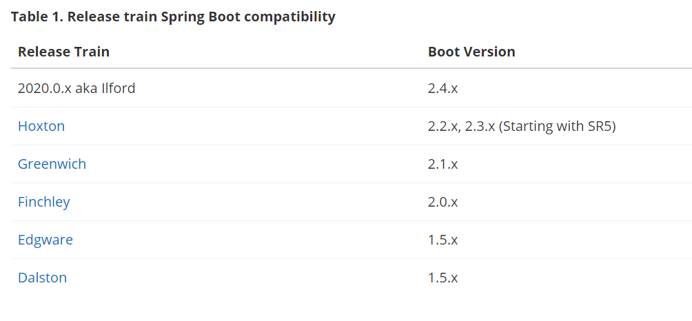

官网： https://spring.io/projects/spring-cloud




当我们使用SpringCloud时候，需要引入依赖管理，如下图,以下内容就总结下 version的问题

```xml
<dependencyManagement>
    <dependencies>
        <dependency>
            <groupId>org.springframework.cloud</groupId>
            <artifactId>spring-cloud-dependencies</artifactId>
            <version>Finchley.SR2</version>
            <type>pom</type>
            <scope>import</scope>
        </dependency>
    </dependencies>
</dependencyManagement>
```


- spring-cloud-dependencies 版本列表可查看：
https://mvnrepository.com/artifact/org.springframework.cloud/spring-cloud-dependencies

- spring-boot-starter-parent 版本列表可查看：
https://mvnrepository.com/artifact/org.springframework.boot/spring-boot-starter-parent


大版本对应

```
Spring Cloud	            Spring Boot
Angel版本	                兼容Spring Boot 1.2.x
Brixton版本	                兼容Spring Boot 1.3.x，也兼容Spring Boot 1.4.x
Camden版本	                兼容Spring Boot 1.4.x，也兼容Spring Boot 1.5.x
Dalston版本、Edgware版本	    兼容Spring Boot 1.5.x，不兼容Spring Boot 2.0.x
Finchley版本	            兼容Spring Boot 2.0.x，不兼容Spring Boot 1.5.x
Greenwich版本	            兼容Spring Boot 2.1.x
Hoxtonl版本	                兼容Spring Boot 2.2.x
```

在实际开发过程中，我们需要更详细的版本对应：

```
Spring Boot	                    Spring Cloud
1.5.2.RELEASE	                Dalston.RC1
1.5.9.RELEASE	                Edgware.RELEASE
2.0.2.RELEASE	                Finchley.BUILD-SNAPSHOT
2.0.3.RELEASE	                Finchley.RELEASE
2.1.0.RELEASE-2.1.14.RELEASE	Greenwich.SR5
2.2.0.M4	                    Hoxton.SR4

```


# 参考

- [SpringBoot与SpringCloud的版本对应详细版](https://blog.csdn.net/qq32933432/article/details/89375630)

- [Springcloud的版本依赖问题（最全，包含springCloud所有的版本)](https://blog.csdn.net/qq_42105629/article/details/102798282)
