<!-- TOC -->

- [1、什么是事务？](#1什么是事务)
- [2、Spring事务管理接口介绍](#2spring事务管理接口介绍)
    - [1、PlatformTransactionManager接口介绍](#1platformtransactionmanager接口介绍)
        - [1、DataSourceTransactionManager](#1datasourcetransactionmanager)
    - [2、TransactionDefinition接口](#2transactiondefinition接口)
        - [1、事务隔离级别（定义了一个事务可能受其他并发事务影响的程度）](#1事务隔离级别定义了一个事务可能受其他并发事务影响的程度)
        - [2、事务传播行为（为了解决业务层方法之间互相调用的事务问题）](#2事务传播行为为了解决业务层方法之间互相调用的事务问题)
        - [3、事务超时属性(一个事务允许执行的最长时间)](#3事务超时属性一个事务允许执行的最长时间)
        - [4、事务只读属性（对事物资源是否执行只读操作）](#4事务只读属性对事物资源是否执行只读操作)
        - [5、回滚规则（定义事务回滚规则）](#5回滚规则定义事务回滚规则)
    - [3、TransactionStatus接口](#3transactionstatus接口)
- [3、Spring编程式和声明式事务实例讲解](#3spring编程式和声明式事务实例讲解)
    - [1、编程式事务管理[很繁琐]](#1编程式事务管理很繁琐)
    - [2、基于AspectJ的声明式事务管理](#2基于aspectj的声明式事务管理)
    - [3、基于注解的方式](#3基于注解的方式)
- [4、工作原理](#4工作原理)
    - [1、PlatformTransactionManager](#1platformtransactionmanager)
    - [2、ResourceTransactionManager](#2resourcetransactionmanager)
    - [3、AbstractPlatformTransactionManager](#3abstractplatformtransactionmanager)
        - [几个重要参数](#几个重要参数)
            - [1、transactionSynchronization](#1transactionsynchronization)
            - [2、nestedTransactionAllowed](#2nestedtransactionallowed)
            - [3、validateExistingTransaction](#3validateexistingtransaction)
            - [4、globalRollbackOnParticipationFailure](#4globalrollbackonparticipationfailure)
            - [5、failEarlyOnGlobalRollbackOnly](#5failearlyonglobalrollbackonly)
            - [6、rollbackOnCommitFailure](#6rollbackoncommitfailure)
            - [7、shouldCommitOnGlobalRollbackOnly()](#7shouldcommitonglobalrollbackonly)
    - [4、DataSourceTransactionManager](#4datasourcetransactionmanager)
    - [9、DataSourceUtils数据库连接事务被spring管理的入口](#9datasourceutils数据库连接事务被spring管理的入口)
        - [0、ConnectionSynchronization静态内部类](#0connectionsynchronization静态内部类)
        - [1、TransactionSynchronizationManager(ThreadLocal)](#1transactionsynchronizationmanagerthreadlocal)
        - [2、TransactionSynchronizationUtils](#2transactionsynchronizationutils)
    - [5、事务是如何整合进AOP](#5事务是如何整合进aop)
        - [0、Transactional注解](#0transactional注解)
            - [整个事务切面的流程](#整个事务切面的流程)
        - [1、SpringTransactionAnnotationParser解析@Transactional注解类](#1springtransactionannotationparser解析transactional注解类)
        - [2、TransactionAttribute](#2transactionattribute)
        - [3、AnnotationTransactionAttributeSource](#3annotationtransactionattributesource)
        - [4、TransactionAttributeSourcePointcut](#4transactionattributesourcepointcut)
        - [5、TransactionInterceptor](#5transactioninterceptor)
            - [1、Advice空接口](#1advice空接口)
            - [2、Interceptor空接口](#2interceptor空接口)
            - [3、MethodInterceptor](#3methodinterceptor)
            - [4、TransactionAspectSupport](#4transactionaspectsupport)
            - [5、TransactionInterceptor事务拦截处理逻辑的入口](#5transactioninterceptor事务拦截处理逻辑的入口)
                - [TransactionAspectSupport事务逻辑处理切面（重要）](#transactionaspectsupport事务逻辑处理切面重要)
        - [6、BeanFactoryTransactionAttributeSourceAdvisor（切面=切入点+增强逻辑advice）](#6beanfactorytransactionattributesourceadvisor切面切入点增强逻辑advice)
        - [7、ProxyTransactionManagementConfiguration（把切入点+增强逻辑advice+切面注入spring容器）](#7proxytransactionmanagementconfiguration把切入点增强逻辑advice切面注入spring容器)
- [参考](#参考)

<!-- /TOC -->


> 问题

- 1、spring对没有添加@Transactionl的事务处理逻辑？


# 1、什么是事务？

事物是逻辑上的一组操作，要么都执行，要么都不执行.

事物的特性（ACID）：

- 原子性： 事物是最小的执行单位，不允许分割。事务的原子性确保动作要么全部完成，要么完全不起作用；

- 一致性： 执行事物前后，数据保持一致；

- 隔离性： 并发访问数据库时，一个用户的事物不被其他事物所干扰，各并发事物之间数据库是独立的；

- 持久性: 一个事物被提交之后。它对数据库中数据的改变是持久的，即使数据库发生故障也不应该对其有任何影响。

# 2、Spring事务管理接口介绍

- PlatformTransactionManager： （平台）事务管理器

- TransactionDefinition： 事务定义信息(事务隔离级别、传播行为、超时、只读、回滚规则)

- TransactionStatus： 事务运行状态

`所谓事务管理，其实就是“按照给定的事务规则来执行提交或者回滚操作”。`

## 1、PlatformTransactionManager接口介绍

Spring并不直接管理事务，而是提供了多种事务管理器 ，他们将事务管理的职责委托给Hibernate或者JTA等持久化机制所提供的相关平台框架的事务来实现。 Spring事务管理器的接口是： org.springframework.transaction.PlatformTransactionManager，通过这个接口，Spring为各个平台如JDBC、Hibernate等都提供了对应的事务管理器，但是具体的实现就是各个平台自己的事情了。

PlatformTransactionManager接口代码如下,PlatformTransactionManager接口中定义了三个方法：


```java

public interface PlatformTransactionManager {
  
// 根据指定的传播行为，返回当前活动的事务或创建一个新事务
TransactionStatus getTransaction(@Nullable TransactionDefinition definition) throws TransactionException;

//使用事务目前的状态提交事务
void commit(TransactionStatus status) throws TransactionException;
    
//对执行的事务进行回滚
void rollback(TransactionStatus status) throws TransactionException;
 
```
 
Spring中PlatformTransactionManager根据不同持久层框架所对应的接口实现类,几个比较常见的如下：


- 1、org.springframework.jdbc.datasource.DataSourceTransactionManager：使用springjdbc或者mybatis进行持久化数据时使用（重点）；

- 2、org.springframework.orm.jpa.JpaTransactionManager

- 3、org.springframework.orm.hibernate5.HibernateTransactionManager


### 1、DataSourceTransactionManager


比如我们在使用JDBC或者iBatis（就是Mybatis）进行数据持久化操作时,我们的xml配置通常如下：

```xml
<!-- 事务管理器 -->
 <bean id="masterTransactionManager"
          class="org.springframework.jdbc.datasource.DataSourceTransactionManager">
          <!-- 数据源 -->
        <property name="dataSource" ref="masterDataSource"/>
    </bean>
```


## 2、TransactionDefinition接口

事务管理器接口 PlatformTransactionManager 通过 getTransaction(TransactionDefinition definition) 方法来得到一个事务，这个方法里面的参数是 TransactionDefinition类 ，这个类就定义了一些基本的事务属性。

> 那么什么是事务属性呢？

事务属性可以理解成事务的一些基本配置，描述了事务策略如何应用到方法上。事务属性包含了5个方面。

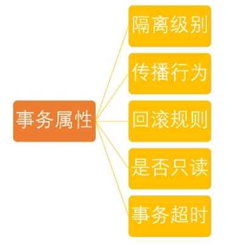

> TransactionDefinition接口中的方法如下：

TransactionDefinition接口中定义了5个方法以及一些表示事务属性的常量比如隔离级别、传播行为等等的常量。

我下面只是列出了TransactionDefinition接口中的方法而没有给出接口中定义的常量，该接口中的常量信息会在后面依次介绍到。

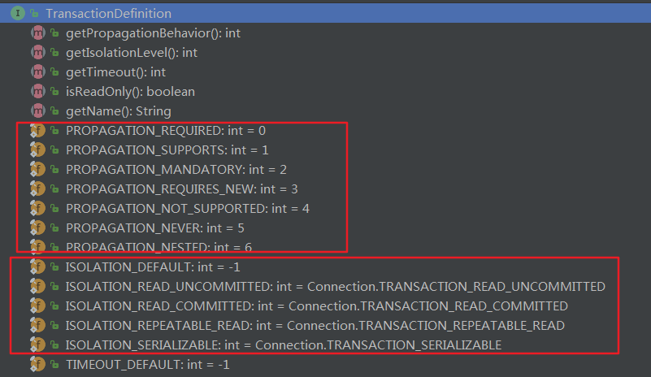

```java
public interface TransactionDefinition {

// 返回事务的传播行为
int getPropagationBehavior();
    
// 返回事务的隔离级别，事务管理器根据它来控制另外一个事务可以看到本事务内的哪些数据
int getIsolationLevel();
    
// 返回事务必须在多少秒内完成
int getTimeout();
    
//返回事务的名字
@Nullable
String getName();
    
// 返回是否优化为只读事务。
boolean isReadOnly();


}
```

### 1、事务隔离级别（定义了一个事务可能受其他并发事务影响的程度）

我们先来看一下 并发事务带来的问题 ，然后再来介绍一下 TransactionDefinition 接口中定义了五个表示隔离级别的常量。

> 并发事务带来的问题


在典型的应用程序中，多个事务并发运行，经常会操作相同的数据来完成各自的任务（多个用户对统一数据进行操作）。并发虽然是必须的，但可能会导致一下的问题。

- 脏读（Dirty read）: 当一个事务正在访问数据并且对数据进行了修改，而这种修改还没有提交到数据库中，这时另外一个事务也访问了这个数据，然后使用了这个数据。因为这个数据是还没有提交的数据，那么另外一个事务读到的这个数据是“脏数据”，依据“脏数据”所做的操作可能是不正确的。

- 丢失修改（Lost to modify）: 指在一个事务读取一个数据时，另外一个事务也访问了该数据，那么在第一个事务中修改了这个数据后，第二个事务也修改了这个数据。这样第一个事务内的修改结果就被丢失，因此称为丢失修改。例如：事务1读取某表中的数据A=20，事务2也读取A=20，事务1修改A=A-1，事务2也修改A=A-1，最终结果A=19，事务1的修改被丢失。

- 不可重复读（Unrepeatableread）: 指在一个事务内多次读同一数据。在这个事务还没有结束时，另一个事务也访问该数据。那么，在第一个事务中的两次读数据之间，由于第二个事务的修改导致第一个事务两次读取的数据可能不太一样。这就发生了在一个事务内两次读到的数据是不一样的情况，因此称为不可重复读。

- 幻读（Phantom read）: 幻读与不可重复读类似。它发生在一个事务（T1）读取了几行数据，接着另一个并发事务（T2）插入了一些数据时。在随后的查询中，第一个事务（T1）就会发现多了一些原本不存在的记录，就好像发生了幻觉一样，所以称为幻读。

> 不可重复度和幻读区别：

`不可重复读的重点是修改，幻读的重点在于新增或者删除。`

例1（同样的条件, 你读取过的数据, 再次读取出来发现值不一样了 ）：事务1中的A先生读取自己的工资为 1000的操作还没完成，事务2中的B先生就修改了A的工资为2000，导 致A再读自己的工资时工资变为 2000；这就是不可重复读。

例2（同样的条件, 第1次和第2次读出来的记录数不一样 ）：假某工资单表中工资大于3000的有4人，事务1读取了所有工资大于3000的人，共查到4条记录，这时事务2 又插入了一条工资大于3000的记录，事务1再次读取时查到的记录就变为了5条，这样就导致了幻读。

>  隔离级别

TransactionDefinition 接口中定义了五个表示隔离级别的常量：

- TransactionDefinition.ISOLATION_DEFAULT: 使用后端数据库默认的隔离级别，Mysql 默认采用的 REPEATABLE_READ隔离级别 Oracle 默认采用的 READ_COMMITTED隔离级别.

- TransactionDefinition.ISOLATION_READ_UNCOMMITTED: 最低的隔离级别，允许读取尚未提交的数据变更，可能会导致脏读、幻读或不可重复读

- TransactionDefinition.ISOLATION_READ_COMMITTED: 允许读取并发事务已经提交的数据，可以阻止脏读，但是幻读或不可重复读仍有可能发生

- TransactionDefinition.ISOLATION_REPEATABLE_READ: 对同一字段的多次读取结果都是一致的，除非数据是被本身事务自己所修改，可以阻止脏读和不可重复读，但幻读仍有可能发生。

- TransactionDefinition.ISOLATION_SERIALIZABLE: 最高的隔离级别，完全服从ACID的隔离级别。所有的事务依次逐个执行，这样事务之间就完全不可能产生干扰，也就是说，该级别可以防止脏读、不可重复读以及幻读。但是这将严重影响程序的性能。通常情况下也不会用到该级别。


### 2、事务传播行为（为了解决业务层方法之间互相调用的事务问题）

当事务方法被另一个事务方法调用时，必须指定事务应该如何传播。例如：方法可能继续在现有事务中运行，也可能开启一个新事务，并在自己的事务中运行。在TransactionDefinition定义中包括了如下几个表示传播行为的常量：

> 支持当前事务的情况：

- TransactionDefinition.PROPAGATION_REQUIRED： 如果当前存在事务，则加入该事务；如果当前没有事务，则创建一个新的事务。

- TransactionDefinition.PROPAGATION_SUPPORTS： 如果当前存在事务，则加入该事务；如果当前没有事务，则以非事务的方式继续运行。

- TransactionDefinition.PROPAGATION_MANDATORY： 如果当前存在事务，则加入该事务；如果当前没有事务，则抛出异常。

> 不支持当前事务的情况：

- TransactionDefinition.PROPAGATION_REQUIRES_NEW： 创建一个新的事务，如果当前存在事务，则把当前事务挂起。

- TransactionDefinition.PROPAGATION_NOT_SUPPORTED： 以非事务方式运行，如果当前存在事务，则把当前事务挂起。

- TransactionDefinition.PROPAGATION_NEVER： 以非事务方式运行，如果当前存在事务，则抛出异常。

> 其他情况：

TransactionDefinition.PROPAGATION_NESTED： 如果当前存在事务，则创建一个事务作为当前事务的嵌套事务来运行；如果当前没有事务，则该取值等价于TransactionDefinition.PROPAGATION_REQUIRED。

这里需要指出的是，前面的六种事务传播行为是 Spring 从 EJB 中引入的，他们共享相同的概念。而 PROPAGATION_NESTED 是 Spring 所特有的。以 PROPAGATION_NESTED 启动的事务内嵌于外部事务中（如果存在外部事务的话），此时，内嵌事务并不是一个独立的事务，它依赖于外部事务的存在，只有通过外部的事务提交，才能引起内部事务的提交，嵌套的子事务不能单独提交。如果熟悉 JDBC 中的保存点（SavePoint）的概念，那嵌套事务就很容易理解了，其实嵌套的子事务就是保存点的一个应用，一个事务中可以包括多个保存点，每一个嵌套子事务。另外，外部事务的回滚也会导致嵌套子事务的回滚。

### 3、事务超时属性(一个事务允许执行的最长时间)

所谓事务超时，就是指一个事务所允许执行的最长时间，如果超过该时间限制但事务还没有完成，则自动回滚事务。在 TransactionDefinition 中以 int 的值来表示超时时间，其单位是秒。

### 4、事务只读属性（对事物资源是否执行只读操作）

事务的只读属性是指，对事务性资源进行只读操作或者是读写操作。所谓事务性资源就是指那些被事务管理的资源，比如数据源、 JMS 资源，以及自定义的事务性资源等等。如果确定只对事务性资源进行只读操作，那么我们可以将事务标志为只读的，以提高事务处理的性能。在 TransactionDefinition 中以 boolean 类型来表示该事务是否只读。

### 5、回滚规则（定义事务回滚规则）

这些规则定义了哪些异常会导致事务回滚而哪些不会。默认情况下，事务只有遇到运行期异常时才会回滚，而在遇到检查型异常时不会回滚（这一行为与EJB的回滚行为是一致的）。

但是你可以声明事务在遇到特定的检查型异常时像遇到运行期异常那样回滚。同样，你还可以声明事务遇到特定的异常不回滚，即使这些异常是运行期异常。


## 3、TransactionStatus接口


TransactionStatus接口用来记录事务的状态 该接口定义了一组方法,用来获取或判断事务的相应状态信息.

PlatformTransactionManager.getTransaction(…) 方法返回一个 TransactionStatus 对象。返回的TransactionStatus 对象可能代表一个新的或已经存在的事务（如果在当前调用堆栈有一个符合条件的事务）。

TransactionStatus接口接口内容如下：

```java
public interface TransactionStatus{
    boolean isNewTransaction(); // 是否是新的事物
    boolean hasSavepoint(); // 是否有恢复点
    void setRollbackOnly();  // 设置为只回滚
    boolean isRollbackOnly(); // 是否为只回滚
    boolean isCompleted; // 是否已完成
} 
```

# 3、Spring编程式和声明式事务实例讲解

Spring支持两种方式的事务管理：

- 1、编程式事务管理： 通过Transaction Template手动管理事务，实际应用中很少使用，

- 2、使用XML配置声明式事务： 推荐使用（代码侵入性最小），实际是通过AOP实现


实现声明式事务的四种方式：[推荐后面两种方式]

- 1、基于 TransactionInterceptor 的声明式事务: Spring 声明式事务的基础，通常也不建议使用这种方式，但是与前面一样，了解这种方式对理解 Spring 声明式事务有很大作用。

- 2、基于 TransactionProxyFactoryBean 的声明式事务: 第一种方式的改进版本，简化的配置文件的书写，这是 Spring 早期推荐的声明式事务管理方式，但是在 Spring 2.0 中已经不推荐了。

- 3、基于< tx> 和< aop>命名空间的声明式事务管理： 目前推荐的方式，其最大特点是与 Spring AOP 结合紧密，可以充分利用切点表达式的强大支持，使得管理事务更加灵活。

- 4、基于 @Transactional 的全注解方式： 将声明式事务管理简化到了极致。开发人员只需在配置文件中加上一行启用相关后处理 Bean 的配置，然后在需要实施事务管理的方法或者类上使用 @Transactional 指定事务规则即可实现事务管理，而且功能也不必其他方式逊色。


我们今天要将的是使用编程式以及基于AspectJ的声明式和基于注解的事务方式，实现烂大街的转账业务。

再来说一下这个案例的思想吧，我们在两次转账之间添加一个错误语句（对应银行断电等意外情况），如果这个时候两次转账不能成功，则说明事务配置正确，否则，事务配置不正确。


你需要完成的任务：

- 使用编程式事务管理完成转账业务

- 使用基于AspectJ的声明式事务管理完成转账业务

- 使用基于 @Transactional 的全注解方式事务管理完成转账业务


> sql

```sql
create table `account` (
    `username` varchar (99),
    `salary` int (11)
); 
insert into `account` (`username`, `salary`) values('小王','3000');
insert into `account` (`username`, `salary`) values('小马','3000');
```


## 1、编程式事务管理[很繁琐]

注意： 通过添加/删除accountMoney() 方法中int i = 10 / 0这个语句便可验证事务管理是否配置正确。


OrdersDao.java(Dao层)

```java
public class OrdersDao {
    // 注入jdbcTemplate模板对象
    private JdbcTemplate jdbcTemplate;

    public void setJdbcTemplate(JdbcTemplate jdbcTemplate) {
        this.jdbcTemplate = jdbcTemplate;
    }

    // 对数据操作的方法不包含业务操作
    /**
     * 小王少钱的方法
     */
    public void reduceMoney() {
        String sql = "update account set salary=salary-? where username=?";
        jdbcTemplate.update(sql, 1000, "小王");
    }

    /**
     * 小马多钱的方法
     */
    public void addMoney() {
        String sql = "update account set salary=salary+? where username=?";
        jdbcTemplate.update(sql, 1000, "小马");
    }
}
```


OrdersService.java（业务逻辑层）

```java
public class OrdersService {
    // 注入Dao层对象
    private OrdersDao ordersDao;

    public void setOrdersDao(OrdersDao ordersDao) {
        this.ordersDao = ordersDao;
    }

    // 注入TransactionTemplate对象
    private TransactionTemplate transactionTemplate;

    public void setTransactionTemplate(TransactionTemplate transactionTemplate) {
        this.transactionTemplate = transactionTemplate;
    }

    // 调用dao的方法
    // 业务逻辑，写转账业务
    public void accountMoney() {
        transactionTemplate.execute(new TransactionCallback<Object>() {

            @Override
            public Object doInTransaction(TransactionStatus status) {
                Object result = null;
                try {
                    // 小马多1000
                    ordersDao.addMoney();
                    // 加入出现异常如下面int
                    // i=10/0（银行中可能为突然停电等。。。）；结果：小马账户多了1000而小王账户没有少钱
                    // 解决办法是出现异常后进行事务回滚
                    int i = 10 / 0;// 事务管理配置后异常已经解决
                    // 小王 少1000
                    ordersDao.reduceMoney();
                } catch (Exception e) {
                    status.setRollbackOnly();
                    result = false;
                    System.out.println("Transfer Error!");
                }

                return result;
            }
        });

    }
}
```


TestService.java（测试方法）

```java
public class TestService {
    @Test
    public void testAdd() {
        ApplicationContext context = new ClassPathXmlApplicationContext(
                "beans.xml");
        OrdersService userService = (OrdersService) context
                .getBean("ordersService");
        userService.accountMoney();
    }
}
```


配置文件：

```xml
<?xml version="1.0" encoding="UTF-8"?>
<beans xmlns="http://www.springframework.org/schema/beans"
    xmlns:xsi="http://www.w3.org/2001/XMLSchema-instance" xmlns:context="http://www.springframework.org/schema/context"
    xmlns:aop="http://www.springframework.org/schema/aop" xmlns:tx="http://www.springframework.org/schema/tx"
    xsi:schemaLocation="http://www.springframework.org/schema/beans http://www.springframework.org/schema/beans/spring-beans-2.5.xsd  
http://www.springframework.org/schema/context http://www.springframework.org/schema/context/spring-context-2.5.xsd  
http://www.springframework.org/schema/aop http://www.springframework.org/schema/aop/spring-aop-2.5.xsd  
http://www.springframework.org/schema/tx http://www.springframework.org/schema/tx/spring-tx-2.5.xsd">
    <!-- 配置c3po连接池 -->
    <bean id="dataSource" class="com.mchange.v2.c3p0.ComboPooledDataSource">
        <!-- 注入属性值 -->
        <property name="driverClass" value="com.mysql.jdbc.Driver"></property>
        <property name="jdbcUrl" value="jdbc:mysql://localhost:3306/wangyiyun"></property>
        <property name="user" value="root"></property>
        <property name="password" value="153963"></property>
    </bean>
    <!-- 编程式事务管理 -->
    <!-- 配置事务管理器 -->
    <bean id="dataSourceTransactionManager"
        class="org.springframework.jdbc.datasource.DataSourceTransactionManager">
        <!-- 注入dataSource -->
        <property name="dataSource" ref="dataSource"></property>
    </bean>

    <!-- 配置事务管理器模板 -->
    <bean id="transactionTemplate"
        class="org.springframework.transaction.support.TransactionTemplate">
        <!-- 注入真正进行事务管理的事务管理器,name必须为 transactionManager否则无法注入 -->
        <property name="transactionManager" ref="dataSourceTransactionManager"></property>
    </bean>

    <!-- 对象生成及属性注入 -->
    <bean id="ordersService" class="cn.itcast.service.OrdersService">
        <property name="ordersDao" ref="ordersDao"></property>
        <!-- 注入事务管理的模板 -->
        <property name="transactionTemplate" ref="transactionTemplate"></property>
    </bean>

    <bean id="ordersDao" class="cn.itcast.dao.OrdersDao">
        <property name="jdbcTemplate" ref="jdbcTemplate"></property>
    </bean>
    <!-- JDBC模板对象 -->
    <bean id="jdbcTemplate" class="org.springframework.jdbc.core.JdbcTemplate">
        <property name="dataSource" ref="dataSource"></property>
    </bean>
</beans> 
```


## 2、基于AspectJ的声明式事务管理

OrdersService.java（业务逻辑层）

```java
public class OrdersService {
    private OrdersDao ordersDao;

    public void setOrdersDao(OrdersDao ordersDao) {
        this.ordersDao = ordersDao;
    }

    // 调用dao的方法
    // 业务逻辑，写转账业务
    public void accountMoney() {
        // 小马多1000
        ordersDao.addMoney();
        // 加入出现异常如下面int i=10/0（银行中可能为突然停电等。。。）；结果：小马账户多了1000而小王账户没有少钱
        // 解决办法是出现异常后进行事务回滚
        int i = 10 / 0;// 事务管理配置后异常已经解决
        // 小王 少1000
        ordersDao.reduceMoney();
    }
}
```

配置文件：

```xml
 <!-- 配置c3po连接池 -->
    <bean id="dataSource" class="com.mchange.v2.c3p0.ComboPooledDataSource">
        <!-- 注入属性值 -->
        <property name="driverClass" value="com.mysql.jdbc.Driver"></property>
        <property name="jdbcUrl" value="jdbc:mysql://localhost:3306/wangyiyun"></property>
        <property name="user" value="root"></property>
        <property name="password" value="153963"></property>
    </bean>
    <!-- 第一步：配置事务管理器 -->
    <bean id="dataSourceTransactionManager"
        class="org.springframework.jdbc.datasource.DataSourceTransactionManager">
        <!-- 注入dataSource -->
        <property name="dataSource" ref="dataSource"></property>
    </bean>

    <!-- 第二步：配置事务增强 -->
    <tx:advice id="txadvice" transaction-manager="dataSourceTransactionManager">
        <!-- 做事务操作 -->
        <tx:attributes>
            <!-- 设置进行事务操作的方法匹配规则 -->
            <!-- account开头的所有方法 -->
            <!--
              propagation:事务传播行为； 
              isolation：事务隔离级别；
              read-only：是否只读；
              rollback-for：发生那些异常时回滚 
              timeout:事务过期时间
             -->
            <tx:method name="account*" propagation="REQUIRED"
                isolation="DEFAULT" read-only="false" rollback-for="" timeout="-1" />
        </tx:attributes>
    </tx:advice>

    <!-- 第三步：配置切面 切面即把增强用在方法的过程 -->
    <aop:config>
        <!-- 切入点 -->
        <aop:pointcut expression="execution(* cn.itcast.service.OrdersService.*(..))"
            id="pointcut1" />
        <!-- 切面 -->
        <aop:advisor advice-ref="txadvice" pointcut-ref="pointcut1" />
    </aop:config>


    <!-- 对象生成及属性注入 -->
    <bean id="ordersService" class="cn.itcast.service.OrdersService">
        <property name="ordersDao" ref="ordersDao"></property>
    </bean>
    <bean id="ordersDao" class="cn.itcast.dao.OrdersDao">
        <property name="jdbcTemplate" ref="jdbcTemplate"></property>
    </bean>
    <bean id="jdbcTemplate" class="org.springframework.jdbc.core.JdbcTemplate">
        <property name="dataSource" ref="dataSource"></property>
    </bean>
```


## 3、基于注解的方式
OrdersService.java（业务逻辑层）

```java
@Transactional(propagation = Propagation.REQUIRED, isolation = Isolation.DEFAULT, readOnly = false, timeout = -1)
public class OrdersService {
    private OrdersDao ordersDao;

    public void setOrdersDao(OrdersDao ordersDao) {
        this.ordersDao = ordersDao;
    }

    // 调用dao的方法
    // 业务逻辑，写转账业务
    public void accountMoney() {
        // 小马多1000
        ordersDao.addMoney();
        // 加入出现异常如下面int i=10/0（银行中可能为突然停电等。。。）；结果：小马账户多了1000而小王账户没有少钱
        // 解决办法是出现异常后进行事务回滚
        // int i = 10 / 0;// 事务管理配置后异常已经解决
        // 小王 少1000
        ordersDao.reduceMoney();
    }
}
```


配置文件：


```xml
<!-- 配置c3po连接池 -->
    <bean id="dataSource" class="com.mchange.v2.c3p0.ComboPooledDataSource">
        <!-- 注入属性值 -->
        <property name="driverClass" value="com.mysql.jdbc.Driver"></property>
        <property name="jdbcUrl" value="jdbc:mysql://localhost:3306/wangyiyun"></property>
        <property name="user" value="root"></property>
        <property name="password" value="153963"></property>
    </bean>
    <!-- 第一步：配置事务管理器 (和配置文件方式一样)-->
    <bean id="dataSourceTransactionManager"
        class="org.springframework.jdbc.datasource.DataSourceTransactionManager">
        <!-- 注入dataSource -->
        <property name="dataSource" ref="dataSource"></property>
    </bean>
    <!-- 第二步： 开启事务注解 -->
    <tx:annotation-driven transaction-manager="dataSourceTransactionManager" />
    <!-- 第三步 在方法所在类上加注解 -->


    <!-- 对象生成及属性注入 -->
    <bean id="ordersService" class="cn.itcast.service.OrdersService">
        <property name="ordersDao" ref="ordersDao"></property>
    </bean>
    <bean id="ordersDao" class="cn.itcast.dao.OrdersDao">
        <property name="jdbcTemplate" ref="jdbcTemplate"></property>
    </bean>
    <bean id="jdbcTemplate" class="org.springframework.jdbc.core.JdbcTemplate">
        <property name="dataSource" ref="dataSource"></property>
    </bean>
```


# 4、工作原理

基本名词解释

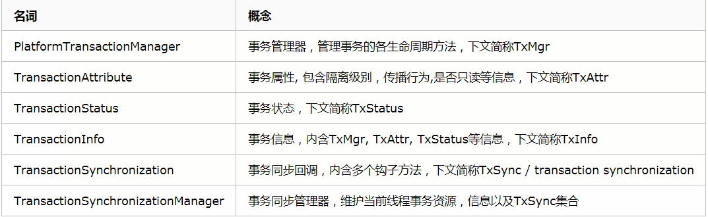

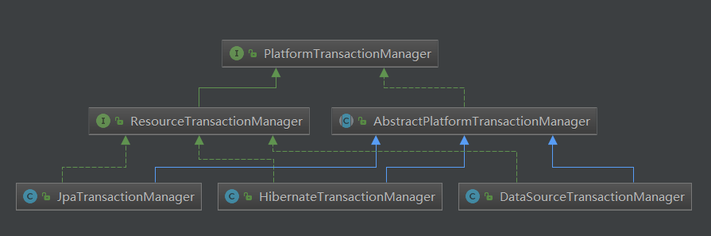


## 1、PlatformTransactionManager

```java

public interface PlatformTransactionManager {
  
// 根据指定的传播行为，返回当前活动的事务或创建一个新事务
TransactionStatus getTransaction(@Nullable TransactionDefinition definition) throws TransactionException;

//使用事务目前的状态提交事务
void commit(TransactionStatus status) throws TransactionException;
    
//对执行的事务进行回滚
void rollback(TransactionStatus status) throws TransactionException;
}
```

## 2、ResourceTransactionManager

```java
public interface ResourceTransactionManager extends PlatformTransactionManager {
    Object getResourceFactory();//资源对象，比如数据库连接池对象DataSource
}
```


## 3、AbstractPlatformTransactionManager

AbstractPlatformTransactionManager是各种事务管理器的抽象基类，也可以说是骨架。它封装了很多事务管理的流程代码，子类需要实现一些模板方法。下面列出一些主要的模板方法。

- doGetTransaction：用于从子类中拿一个事务对象，事务对象具体什么类型AbstractPlatformTransactionManager并不care。如果当前已经有事务的话，返回的对象应该是要包含当前事务信息的。

- isExistingTransaction：用于判断一个事务对象是否对应于一个已经存在的事务。Spring会根据这个方法的返回值来分类讨论事务该如何传播。

- doBegin：物理开启事务。

- doSuspend：将当前事务资源挂起。对于我们常用的DataSourceTransactionManager，它的资源就是ConnectionHolder。会将ConnectionHolder与当前线程脱钩并取出来。

- doResume：恢复当前事务资源。对于我们常用的DataSourceTransactionManager，它会将ConnectionHolder重新绑定到线程上。

- doCommit：物理提交事务。

- doRollback：物理回滚事务。

- doSetRollbackOnly：给事务标记为回滚。对于我们常用的DataSourceTransactionManager，它的实现是拿出事务对象中的ConnectionHolder打上回滚标记。这个标记是一种“全局的标记”，因为隶属于同一个物理事务都能读到同一个ConnectionHolder。


commit与rollback两个方法是PlatformTransactionManager接口两个关键方法。
一般在事务切面增强的方法成功情况下会调用commit方法。在事务发生异常后，completeTransactionAfterThrowing方法会根据异常与事务规则是否匹配来决定是否需要回滚。如果需要回滚则调用rollback方法。

需要注意的是commit/rollback方法只是尝试，Spring会根据事务状态信息来具体处理,不代表一定会物理提交/回滚，Spring会在事务最外层边界才可能触发物理提交/回滚，甚至也有可能调用commit后发现需要rollback。


### 几个重要参数

Spring事务在控制提交和回滚中用了不少判断条件，了解其中一些关键参数的含义对debug问题很有帮助。下文描述的一些控制参数的默认是指在AbstractPlatformTransactionManager中的默认值。

#### 1、transactionSynchronization

在Spring事务的源码实现中，将synchronization与transaction的边界划分分离开来。可以在DefaultTransactionStatus类中看到newTransaction和newSynchronization是两个独立的边界控制参数。它有三种取值:

- 1、SYNCHRONIZATION_ALWAYS(0)

这是默认取值。在默认取值的情况下，在任何情况下都会开启资源与信息的同步维护。举个例子：这样的话即便我们进入了NOT_SUPPORTED传播行为的方法，通过TransactionSynchronizationManager.getCurrentTransactionName()也能拿到当前的事务名(为此NOT_SUPPORTED事务方法名)。同理，在没有事务的情况下进入SUPPORTS传播行为的方法也能够读到当前事务名currentTransactionName。

- 2、SYNCHRONIZATION_ON_ACTUAL_TRANSACTION(1)

此取值保证只维护存在实际物理事务的事务方法的信息与资源。举个例子：在没有事务情况下进入SUPPORTS传播行为的方法，通过TransactionSynchronizationManager拿到的currentTransactionName一定是null。但如果取值为SYNCHRONIZATION_ALWAYS就会不同，如果不存在实际物理事务则拿到的事务名是SUPPORTS方法名，如果存在实际物理事务则能够拿到创建该实际物理事务的方法名。

- 3、SYNCHRONIZATION_NEVER(2)

这个取值会导致在任何情况下TxStats的isNewSynchronization方法永远返回false。这样的话像currentTransactionName, currentTransactionIsolationLevel以及transaction synchronization都是没办法与事务生命周期同步维护的。

#### 2、nestedTransactionAllowed

默认为false。这个和具体TxMgr子类实现有关。这个开关的作用是是否允许嵌套事务，如果不允许的话如果有NESTED传播行为事务试图加入已有事务会抛出NestedTransactionNotSupportedException。

#### 3、validateExistingTransaction

默认为false。也就是在内层事务(比如REQUIRED/SUPPORTS传播行为)加入外层事务的时候不会做校验。如果开启的话会去校验内外层事务隔离级别，是否只读等。如果有冲突会抛出IllegalTransactionStateException。

#### 4、globalRollbackOnParticipationFailure

默认为true。在内层事务(比如REQUIRED/SUPPORTS传播行为)加入外层事务后，如果内层事务挂了，会给事务打上回滚的全局标记，这个事务最终只能被回滚而不能被提交。

如果把开关置为false的话，我们在应用层捕捉到内层事务的异常后，可以自己决定到底要不要回滚(要回滚的话具体实现可以继续抛异常或者给事务状态setRollbackOnly手动标记回滚)。

#### 5、failEarlyOnGlobalRollbackOnly

默认为false。也就是在最外层事务边界尝试提交时发现事务需要回滚，在物理回滚完后，会抛出UnexpectedRollbackException，而内层事务发现事务需要回滚时，仅仅只会调用processRollback给事务标记回滚。

如果这个开关打开的话，在某个内层事务尝试提交时发现事务需要回滚后，在调用processRollback给事务打上回滚的全局标记后，就会直接立刻抛出UnexpectedRollbackException。外层事务代码只要没捕获到异常，后续代码就不会继续执行，退栈到事务切面中进行物理回滚。

这个开关打开的一个好处是可以避免内层事务挂了，外层捕获异常，但我们期望整个事务最终还是需要回滚的情况下，避免外层事务继续执行语句，否则可能会执行了一大堆的sql最终还是回滚。

#### 6、rollbackOnCommitFailure

默认为false。如果开启的话在事务真正物理提交doCommit失败后会进行回滚。


#### 7、shouldCommitOnGlobalRollbackOnly()

与其他参数不同, shouldCommitOnGlobalRollbackOnly是作为一个boolean方法可以被TxMgr具体实现类覆盖的。默认为false。它用于控制一个事务对象被打上需要回滚的全局标记后，是否需要回滚。如果置为true的话，会去尝试提交事务。需要注意的是即便如此，如果TxMgr子类的doCommit方法实现中没有一些对这种被打上回滚标记的事务的处理逻辑，例如抛出异常之类的，Spring最终还是会抛出UnexpectedRollbackException。我们常见使用的DataSourceTransactionManager一般不会去把这个参数改为true。


## 4、DataSourceTransactionManager


## 9、DataSourceUtils数据库连接事务被spring管理的入口

功能：通过参数DataSource获取数据库连接，并且数据库连接的事务交给spring来进行处理了。

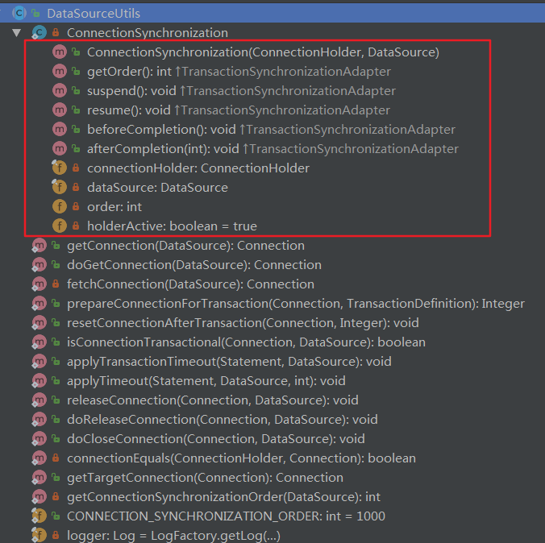

抽象类通过静态方法被外界调用

```java
public static Connection getConnection(DataSource dataSource) throws CannotGetJdbcConnectionException {
		return doGetConnection(dataSource);
}

```
### 0、ConnectionSynchronization静态内部类

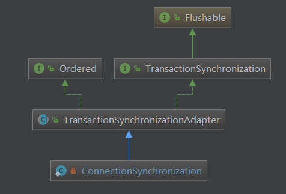


### 1、TransactionSynchronizationManager(ThreadLocal)

`Spring事务代码中用ThreadLocal来进行资源与事务的生命周期的同步管理。`

功能：抽象工具类，通过静态方法被外部访问。内部包含多个ThreadLocal，用来保存当前线程对应的事务变量信息。

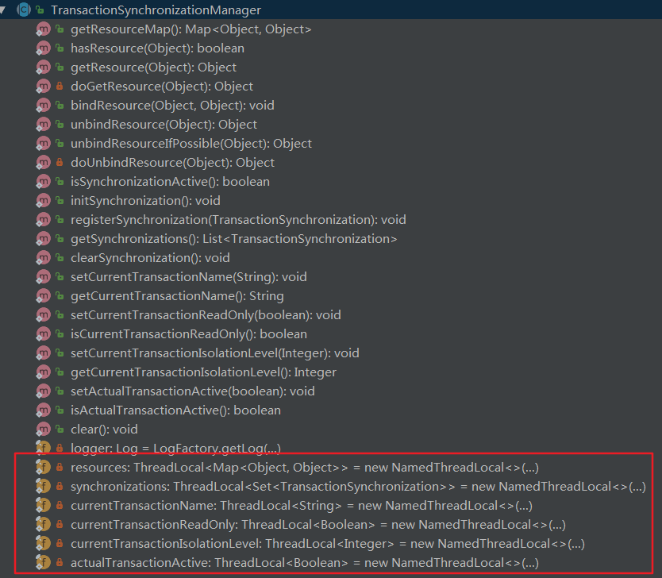


- resources类型为Map<Object, Object>用于保存事务相关资源，比如我们常用的DataSourceTransactionManager会在开启物理事务的时候把<DataSource, ConnectionHolder>绑定到线程。这样在事务作用的业务代码中可以通过Spring的DataSourceUtils拿到绑定到线程的ConnectionHolder中的Connection。事实上对于MyBatis来说与Spring集成时就是这样拿的。


- synchronizations类型为Set<TransactionSynchronization>用于保存transaction synchronization，这个可以理解为是回调钩子对象,内部含有beforeCommit, afterCommit, beforeCompletion等钩子方法。我们自己如果需要的话也可以在业务方法或者切面中注册一些transaction synchronization对象用于追踪事务生命周期做一些自定义的事情。

- currentTransactionName:当前事务名

- currentTransactionReadOnly:当前事务是否只读

- currentTransactionIsolationLevel:当前事务隔离级别

- actualTransactionActive:是否存在物理事务，比如传播行为为NOT_SUPPORTED时就会是false。


### 2、TransactionSynchronizationUtils

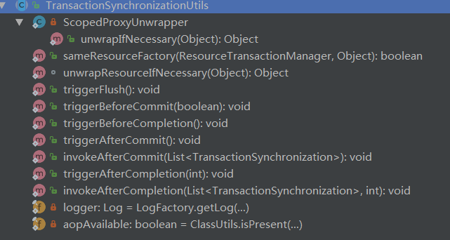


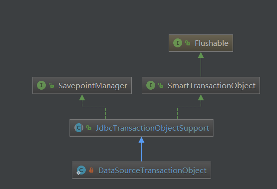


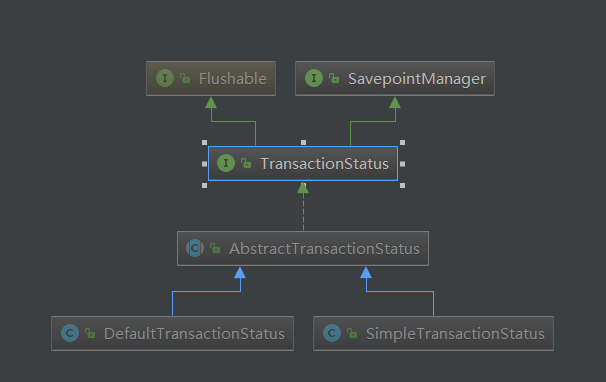


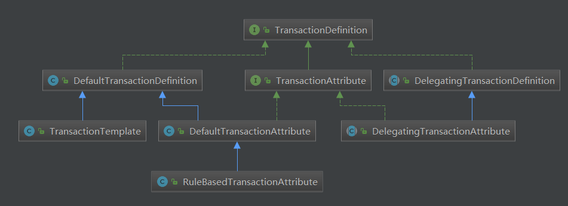


TransactionStatus


## 5、事务是如何整合进AOP

先来看下官方的事务简图：

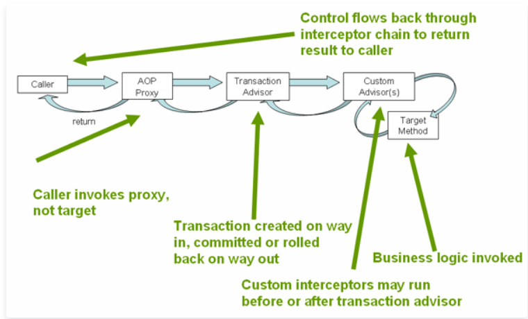

备注：`这里的事务切面逻辑在BeanFactoryTransactionAttributeSourceAdvisor中实现的，具体事务的处理在拦截器TransactionInterceptor中实现的`


### 0、Transactional注解

```java
@Target({ElementType.TYPE, ElementType.METHOD})
@Retention(RetentionPolicy.RUNTIME)
@Inherited
@Documented
public @interface Transactional {

	@AliasFor("transactionManager")
	String value() default "";//事务管理器

	@AliasFor("value")
	String transactionManager() default "";

    //事务的传播特性
	Propagation propagation() default Propagation.REQUIRED;

	//事务的隔离界别
	Isolation isolation() default Isolation.DEFAULT;

	//事务超时
	int timeout() default TransactionDefinition.TIMEOUT_DEFAULT;

	//事务只读
	boolean readOnly() default false;

	//指定事务回滚类
	Class<? extends Throwable>[] rollbackFor() default {};
	String[] rollbackForClassName() default {};

	Class<? extends Throwable>[] noRollbackFor() default {};
	String[] noRollbackForClassName() default {};

}

```

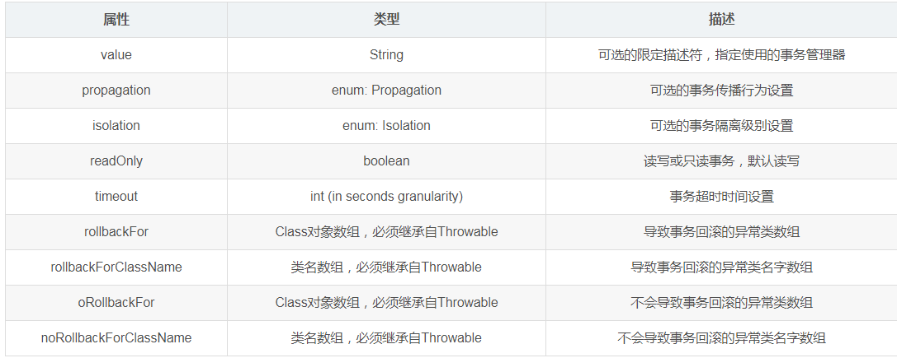


> 核心：

- 1、@Transactional 实质是使用了 JDBC 的事务来进行事务控制的；
- 2、@Transactional 基于 Spring 的动态代理AOP的机制；

> 注意点

- 1、Spring默认情况下会对(RuntimeException)及其子类来进行回滚，在遇见Exception及其子类的时候则不会进行回滚操作。

- 2、@Transactional既可以作用于接口，接口方法上以及类、类的方法上。但是Spring官方不建议接口或者接口方法上使用该注解，因为这只有在使用基于接口的代理时它才会生效。另外， @Transactional 注解应该只被应用到 public 方法上，这是由 Spring AOP 的本质决定的。如果你在 protected、private 或者默认可见性的方法上使用 @Transactional 注解，这将被忽略，也不会抛出任何异常。 Spring默认使用的是jdk自带的基于接口的代理，而没有使用基于类的代理CGLIB。

- 3、@Transactional注解底层使用的是动态代理来进行实现的，如果在调用本类中的方法，此时不添加@Transactional注解，而是在调用类中使用this调用本类中的另外一个添加了@Transactional注解，此时this调用的方法上的@Transactional注解是不起作用的。


#### 整个事务切面的流程

- 1、调用被事务增强的方法，进入事务切面。

- 2、解析事务属性，调用具体的TxMgr负责生成TxStatus。

- 3、如果当前已经有事务，进入step 5。

- 4、根据事务传播行为，校验是否需要抛出异常(如MANDATORY)，或者挂起事务信息(由于没有真正的物理事务，所以没有需要挂起的事务资源)并创建事务(REQUIRED, REQUIREDS_NEW, NESTED等)，又或者创建一个空事务(SUPPORTS, NOT_SUPPORTED, NEVER等)。进入step 6。

- 5、根据事务传播行为，抛出异常(NEVER)，或者挂起事务资源与信息并根据情况决定是否创建事务(NOT_SUPPORTED, REQUIRES_NEW等)，或者根据情况处理嵌套事务(NESTED)或者加入已有事务(SUPPORTS, REQUIRED, MANDATORY等)。

- 6、生成TxInfo并绑定到线程。

- 7、回调MethodInterceptor`业务逻辑执行`，事务切面前置工作至此完成。

- 8、如果发生异常进入step 10。

- 9、根据TxStatus是否被标记回滚，事务本身是否被标记回滚等决定是否要进入处理回滚的逻辑。只有在某事务最外层边界，才可能进行物理提交/回滚，否则最多就在需要回滚的情况下给事务打标需要回滚，不会有真正的动作。并且一般情况下，如果在事务最外边界发现事务需要回滚，会抛出UnexpectedRollbackException。其余情况进入step 11。

- 10、根据异常情况与事务属性判断异常是否需要进入处理回滚的逻辑还是进入处理提交的逻辑。如果需要回滚则根据是否到了某事务最外层边界决定是否进行物理回滚，否则给事务打标需要回滚。如果进入处理提交逻辑则同样只有在事务最外层边界才可能有真正的物理提交动作。

- 11、无论是否发生异常，都会恢复TxInfo为前一个事务的TxInfo（类似于弹栈）。


### 1、SpringTransactionAnnotationParser解析@Transactional注解类

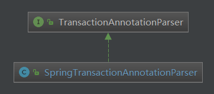


```java
public class SpringTransactionAnnotationParser implements TransactionAnnotationParser, Serializable {

	@Override
	@Nullable
	public TransactionAttribute parseTransactionAnnotation(AnnotatedElement element) {//事务注解解析
		AnnotationAttributes attributes = AnnotatedElementUtils.findMergedAnnotationAttributes(
				element, Transactional.class, false, false);
		if (attributes != null) {
			return parseTransactionAnnotation(attributes);//解析注解封装成一个属性对象TransactionAttribute
		}
		else {
			return null;
		}
	}

    //解析注解上属性设置
	protected TransactionAttribute parseTransactionAnnotation(AnnotationAttributes attributes) {
		RuleBasedTransactionAttribute rbta = new RuleBasedTransactionAttribute();//创建一个实例对象

		Propagation propagation = attributes.getEnum("propagation");//事务的传播特性
		rbta.setPropagationBehavior(propagation.value());
		Isolation isolation = attributes.getEnum("isolation");//隔离级别
		rbta.setIsolationLevel(isolation.value());
		rbta.setTimeout(attributes.getNumber("timeout").intValue());
		rbta.setReadOnly(attributes.getBoolean("readOnly"));
		rbta.setQualifier(attributes.getString("value"));

		List<RollbackRuleAttribute> rollbackRules = new ArrayList<>();
		for (Class<?> rbRule : attributes.getClassArray("rollbackFor")) {
			rollbackRules.add(new RollbackRuleAttribute(rbRule));
		}
		for (String rbRule : attributes.getStringArray("rollbackForClassName")) {
			rollbackRules.add(new RollbackRuleAttribute(rbRule));
		}
		for (Class<?> rbRule : attributes.getClassArray("noRollbackFor")) {
			rollbackRules.add(new NoRollbackRuleAttribute(rbRule));
		}
		for (String rbRule : attributes.getStringArray("noRollbackForClassName")) {
			rollbackRules.add(new NoRollbackRuleAttribute(rbRule));
		}
		rbta.setRollbackRules(rollbackRules);

		return rbta;
	}


}


```


### 2、TransactionAttribute

这里的核心逻辑对应@Transactional注解的各个字段

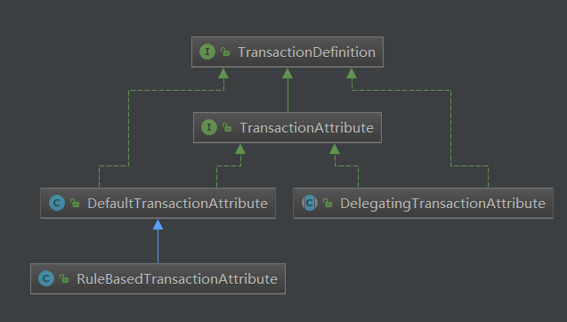


```java
public interface TransactionAttribute extends TransactionDefinition {

    String getQualifier();
    boolean rollbackOn(Throwable ex);//指定的异常进行回滚
}

```


### 3、AnnotationTransactionAttributeSource

这个类的作用是把多种事务注解解析进行封装，根据需要选择合适的解析器。比如@Transactionl是SpringTransactionAnnotationParser。

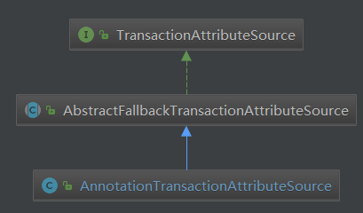

```java
public class AnnotationTransactionAttributeSource extends AbstractFallbackTransactionAttributeSource
		implements Serializable {//这个类是注解事务属性集的源

        private final Set<TransactionAnnotationParser> annotationParsers;//注解解析器集合

        public AnnotationTransactionAttributeSource(boolean publicMethodsOnly) {
		this.publicMethodsOnly = publicMethodsOnly;
		if (jta12Present || ejb3Present) {
			this.annotationParsers = new LinkedHashSet<>(4);
			this.annotationParsers.add(new SpringTransactionAnnotationParser());//用于发现@Transactiona注解的方法
			if (jta12Present) {
				this.annotationParsers.add(new JtaTransactionAnnotationParser());
			}
			if (ejb3Present) {
				this.annotationParsers.add(new Ejb3TransactionAnnotationParser());
			}
		}
		else {
			this.annotationParsers = Collections.singleton(new SpringTransactionAnnotationParser());
		}
	}


    @Override
	@Nullable
	protected TransactionAttribute findTransactionAttribute(Class<?> clazz) {
		return determineTransactionAttribute(clazz);
	}

	@Override
	@Nullable
	protected TransactionAttribute findTransactionAttribute(Method method) {
		return determineTransactionAttribute(method);
	}

    @Nullable
	protected TransactionAttribute determineTransactionAttribute(AnnotatedElement element) {
		for (TransactionAnnotationParser annotationParser : this.annotationParsers) {
			TransactionAttribute attr = annotationParser.parseTransactionAnnotation(element);//解析获取属性对象
			if (attr != null) {
				return attr;
			}
		}
		return null;
	}

}
```

### 4、TransactionAttributeSourcePointcut

这是一个切入点抽象类，可以在切面中，自定义一个解析逻辑，比如这里通过getTransactionAttributeSource()返回AnnotationTransactionAttributeSource，来实现对@Transactional注解进行拦截。

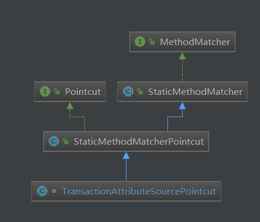

```java
@SuppressWarnings("serial")//这个就是@Transactional注解的切点，AnnotationTransactionAttributeSource作用于此，用于寻找@Transactiona注解的方法
abstract class TransactionAttributeSourcePointcut extends StaticMethodMatcherPointcut implements Serializable {

	@Override
	public boolean matches(Method method, @Nullable Class<?> targetClass) {
		if (targetClass != null && TransactionalProxy.class.isAssignableFrom(targetClass)) {
			return false;
		}
		TransactionAttributeSource tas = getTransactionAttributeSource();//返回AnnotationTransactionAttributeSource
		return (tas == null || tas.getTransactionAttribute(method, targetClass) != null);
	}

    @Nullable
	protected abstract TransactionAttributeSource getTransactionAttributeSource();//抽象方法，让子类去实现
}
```

### 5、TransactionInterceptor

事务拦截器，这里的作用是做增强逻辑处理，即advice


#### 1、Advice空接口

```java
public interface Advice {}
```
#### 2、Interceptor空接口

```java
public interface Interceptor extends Advice {}
```

#### 3、MethodInterceptor

```java
@FunctionalInterface
public interface MethodInterceptor extends Interceptor {
    Object invoke(MethodInvocation invocation) throws Throwable;
}
```

#### 4、TransactionAspectSupport


#### 5、TransactionInterceptor事务拦截处理逻辑的入口


我们给一个bean的方法加上@Transactional注解后，Spring容器给我们的是一个代理的bean。当我们对事务方法调用时，会进入Spring的ReflectiveMethodInvocation#proceed方法。这是AOP的主要实现，在进入业务方法前会调用各种方法拦截器，我们需要关注的拦截器是org.springframework.transaction.interceptor.TransactionInterceptor。
TransactionInterceptor的职责类似于一个“环绕切面”，在业务方法调用前根据情况开启事务，在业务方法调用完回到拦截器后进行善后清理。


事务切面在源码中具体的实现方法是TransactionAspectSupport#invokeWithinTransaction。事务切面关注的是TransactionInfo(TxInfo),因此事务切面会调用createTransactionIfNecessary方法来创建事务并拿到一个TxInfo（无论是否真的物理创建了一个事务）。如果事务块内的代码发生了异常，则会根据TxInfo里面的TxAttr配置的rollback规则看看这个异常是不是需要回滚，不需要回滚就尝试提交，否则就尝试回滚。如果未发生异常，则尝试提交。


```java
@SuppressWarnings("serial")//事务拦截器，我们熟悉的spring aop里有前置、后置、环绕、异常等通知类型，TransactionInterceptor属于自定义通知模型实现，实现自Advice接口，类似于环绕通知
public class TransactionInterceptor extends TransactionAspectSupport implements MethodInterceptor, Serializable {

    @Override
	@Nullable
	public Object invoke(MethodInvocation invocation) throws Throwable {//执行这里的逻辑
		// Work out the target class: may be {@code null}.
		// The TransactionAttributeSource should be passed the target class
		// as well as the method, which may be from an interface.
		Class<?> targetClass = (invocation.getThis() != null ? AopUtils.getTargetClass(invocation.getThis()) : null);

		// Adapt to TransactionAspectSupport's invokeWithinTransaction...
		return invokeWithinTransaction(invocation.getMethod(), targetClass, invocation::proceed);//对要执行的方法包裹上事务处理逻辑
	}
    
}
```

备注：`MethodInvocation可以理解为对执行方法的抽象，可以获取这个方法连接点的方法、参数、对象等信息`

##### TransactionAspectSupport事务逻辑处理切面（重要）


简单来说就是在在方法执行前判断是否开始事务，执行后判断是否需要提交事务。


```java
public abstract class TransactionAspectSupport implements BeanFactoryAware, InitializingBean {

@Nullable
	protected Object invokeWithinTransaction(Method method, @Nullable Class<?> targetClass,
			final InvocationCallback invocation) throws Throwable {

		// If the transaction attribute is null, the method is non-transactional.
		TransactionAttributeSource tas = getTransactionAttributeSource();//如果当事务注解属性源为空，说明当前方法不是一个事务方法
		final TransactionAttribute txAttr = (tas != null ? tas.getTransactionAttribute(method, targetClass) : null);
		final PlatformTransactionManager tm = determineTransactionManager(txAttr);//根据事务注解属性选择一个事务管理器
		final String joinpointIdentification = methodIdentification(method, targetClass, txAttr);

		if (txAttr == null || !(tm instanceof CallbackPreferringPlatformTransactionManager)) {//正常情况应该走这里
			// Standard transaction demarcation with getTransaction and commit/rollback calls.
			TransactionInfo txInfo = createTransactionIfNecessary(tm, txAttr, joinpointIdentification);//重点

			Object retVal;
			try {
				// This is an around advice: Invoke the next interceptor in the chain.
				// This will normally result in a target object being invoked.
				retVal = invocation.proceedWithInvocation();// 执行回调,如果没有后续拦截器的话,就进入事务方法了
			}
			catch (Throwable ex) {
				// target invocation exception
				completeTransactionAfterThrowing(txInfo, ex);// 事务发生异常
				throw ex;
			}
			finally {
				cleanupTransactionInfo(txInfo);// 把上一层事务的TxInfo重新绑到ThreadLocal中
			}
			commitTransactionAfterReturning(txInfo);//正常情况提交一个事务
			return retVal;
		}

		else {
			final ThrowableHolder throwableHolder = new ThrowableHolder();

			// It's a CallbackPreferringPlatformTransactionManager: pass a TransactionCallback in.
			try {
				Object result = ((CallbackPreferringPlatformTransactionManager) tm).execute(txAttr, status -> {
					TransactionInfo txInfo = prepareTransactionInfo(tm, txAttr, joinpointIdentification, status);
					try {
						return invocation.proceedWithInvocation();
					}
					catch (Throwable ex) {
						if (txAttr.rollbackOn(ex)) {
							// A RuntimeException: will lead to a rollback.
							if (ex instanceof RuntimeException) {
								throw (RuntimeException) ex;
							}
							else {
								throw new ThrowableHolderException(ex);
							}
						}
						else {
							// A normal return value: will lead to a commit.
							throwableHolder.throwable = ex;
							return null;
						}
					}
					finally {
						cleanupTransactionInfo(txInfo);
					}
				});

				// Check result state: It might indicate a Throwable to rethrow.
				if (throwableHolder.throwable != null) {
					throw throwableHolder.throwable;
				}
				return result;
			}
			catch (ThrowableHolderException ex) {
				throw ex.getCause();
			}
			catch (TransactionSystemException ex2) {
				if (throwableHolder.throwable != null) {
					logger.error("Application exception overridden by commit exception", throwableHolder.throwable);
					ex2.initApplicationException(throwableHolder.throwable);
				}
				throw ex2;
			}
			catch (Throwable ex2) {
				if (throwableHolder.throwable != null) {
					logger.error("Application exception overridden by commit exception", throwableHolder.throwable);
				}
				throw ex2;
			}
		}
	}

}
```


### 6、BeanFactoryTransactionAttributeSourceAdvisor（切面=切入点+增强逻辑advice）


们这里我们只看到了注册的Advisor和Advice（即BeanFactoryTransactionAttributeSourceAdvisor和TransactionInterceptor），那么Pointcut在哪里呢？这里我们查看BeanFactoryTransactionAttributeSourceAdvisor的源码可以发现，其内部声明了一个TransactionAttributeSourcePointcut类型的属性，并且直接在内部进行了实现，这就是我们需要找的Pointcut。这里这三个对象对应的关系如下：


这样，用于实现Spring事务的Advisor，Pointcut以及Advice都已经找到了。关于这三个类的具体作用，我们这里进行整体的上的讲解，后面我们将会深入其内部讲解其是如何进行bean的过滤以及事务逻辑的织入的。

- BeanFactoryTransactionAttributeSourceAdvisor：封装了实现事务所需的所有属性，包括Pointcut，Advice，TransactionManager以及一些其他的在Transactional注解中声明的属性；

- TransactionAttributeSourcePointcut：用于判断哪些bean需要织入当前的事务逻辑。这里可想而知，其判断的基本逻辑就是判断其方法或类声明上有没有使用@Transactional注解，如果使用了就是需要织入事务逻辑的bean;

- TransactionInterceptor：这个bean本质上是一个Advice，其封装了当前需要织入目标bean的切面逻辑，也就是Spring事务是如果借助于数据库事务来实现对目标方法的环绕的。


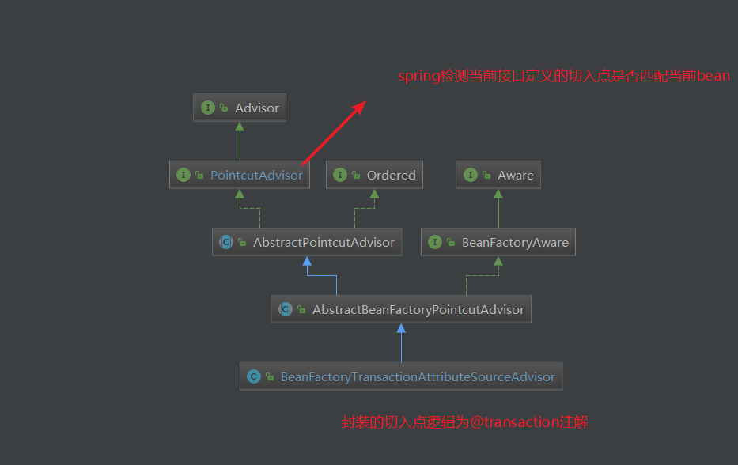


```java
@SuppressWarnings("serial")//事务增强器，用于增强添加了@Transactional注解的方法
public class BeanFactoryTransactionAttributeSourceAdvisor extends AbstractBeanFactoryPointcutAdvisor {

	@Nullable
	private TransactionAttributeSource transactionAttributeSource;
	//切入点，通过注解@Transactional来进行匹配
	private final TransactionAttributeSourcePointcut pointcut = new TransactionAttributeSourcePointcut() {
		@Override
		@Nullable
		protected TransactionAttributeSource getTransactionAttributeSource() {
			return transactionAttributeSource;
		}
	};


	public void setTransactionAttributeSource(TransactionAttributeSource transactionAttributeSource) {
		this.transactionAttributeSource = transactionAttributeSource;
	}

	public void setClassFilter(ClassFilter classFilter) {
		this.pointcut.setClassFilter(classFilter);
	}

	@Override
	public Pointcut getPointcut() {
		return this.pointcut;
	}

}

```

`备注：spring AOP会检测全部接口PointAdvisor即可的实现类，对其进行动态代理生成处理逻辑`


### 7、ProxyTransactionManagementConfiguration（把切入点+增强逻辑advice+切面注入spring容器）

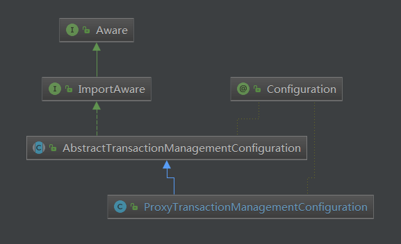

```java
@Configuration//代理事务管理的配置类，事务aop编程相关的在这个里面组合配置生效的
public class ProxyTransactionManagementConfiguration extends AbstractTransactionManagementConfiguration {

	@Bean(name = TransactionManagementConfigUtils.TRANSACTION_ADVISOR_BEAN_NAME)
	@Role(BeanDefinition.ROLE_INFRASTRUCTURE)
	public BeanFactoryTransactionAttributeSourceAdvisor transactionAdvisor() {
		BeanFactoryTransactionAttributeSourceAdvisor advisor = new BeanFactoryTransactionAttributeSourceAdvisor();
		advisor.setTransactionAttributeSource(transactionAttributeSource());//切入点的问题
		advisor.setAdvice(transactionInterceptor());//需要进行增强的逻辑
		if (this.enableTx != null) {
			advisor.setOrder(this.enableTx.<Integer>getNumber("order"));
		}
		return advisor;
	}

	@Bean
	@Role(BeanDefinition.ROLE_INFRASTRUCTURE)
	public TransactionAttributeSource transactionAttributeSource() {//初始化属性源对象
		return new AnnotationTransactionAttributeSource();
	}

	@Bean
	@Role(BeanDefinition.ROLE_INFRASTRUCTURE)
	public TransactionInterceptor transactionInterceptor() {
		TransactionInterceptor interceptor = new TransactionInterceptor();
		interceptor.setTransactionAttributeSource(transactionAttributeSource());//设置注解属性源
		if (this.txManager != null) {
			interceptor.setTransactionManager(this.txManager);//设置事务管理器
		}
		return interceptor;
	}

}

```


# 参考

- [可能是最漂亮的Spring事务管理详解](https://segmentfault.com/a/1190000014957011)
- [Spring编程式和声明式事务实例讲解](https://www.cnblogs.com/snailclimb/p/9086330.html)

- [Spring3.1.0实现原理分析(二十二).Dao事务分析之事务管理器DataSourceTransactionManager](https://blog.csdn.net/roberts939299/article/details/77587425)

- [深入理解@Transactional的工作原理](https://cloud.tencent.com/developer/article/1644003)

- [@Transactional 详解](https://blog.csdn.net/jiangyu1013/article/details/84397366)

- [Spring事务源码阅读笔记](https://www.cnblogs.com/micrari/p/7612962.html)

- [Spring事务用法示例与实现原理 ](https://my.oschina.net/zhangxufeng/blog/1935556)
- [Spring事务之切点解析详解](https://my.oschina.net/zhangxufeng/blog/1943983)
- [Spring事务实现原理详解](https://my.oschina.net/zhangxufeng/blog/1973493)