redis图解

<!-- TOC -->

- [1、底层数据结构](#1底层数据结构)
    - [1、SDS简单动态字符串](#1sds简单动态字符串)
    - [2、list链表](#2list链表)
    - [3、hash字典](#3hash字典)
    - [4、skiplist跳跃表](#4skiplist跳跃表)
    - [5、intset整数集合](#5intset整数集合)
    - [6、ziplist压缩列表](#6ziplist压缩列表)
- [2、对象的类型与编码](#2对象的类型与编码)
    - [1、类型](#1类型)
    - [2、编码和底层实现](#2编码和底层实现)
- [3、redis常用对象](#3redis常用对象)
    - [1、字符串对象](#1字符串对象)
    - [2、列表对象](#2列表对象)
    - [3、哈希对象](#3哈希对象)
    - [4、集合对象](#4集合对象)
    - [5、有序集合对象](#5有序集合对象)
- [9、核心点梳理](#9核心点梳理)
    - [1、为什么Redis这么快？](#1为什么redis这么快)
    - [2、Redis为什么是单线程的？](#2redis为什么是单线程的)
- [参考](#参考)

<!-- /TOC -->


Redis是典型的Key-Value类型数据库，Key为字符类型，Value的类型常用的为五种类型：String、Hash 、List 、 Set 、 Zset。


其实之所以会出现多种数据类型，存的目的是为了高效的取出来。


# 1、底层数据结构


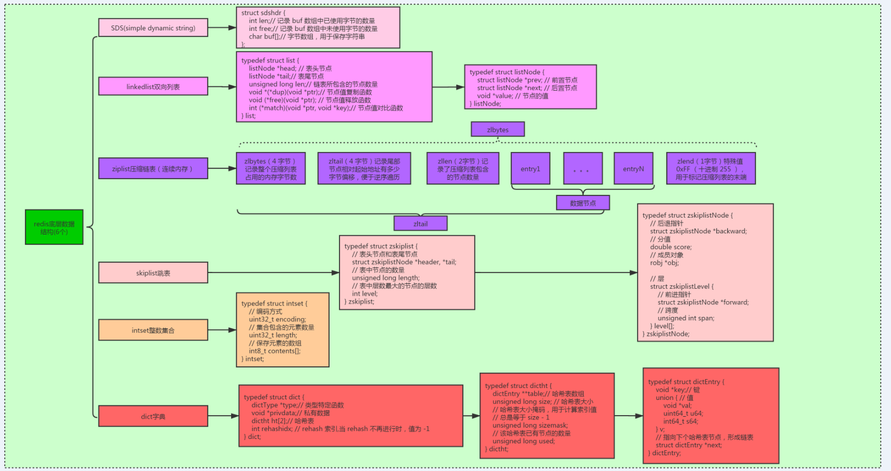


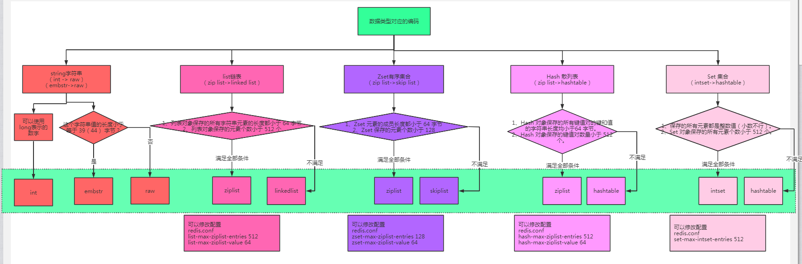


## 1、SDS简单动态字符串

备注：3.2之前和之后sds格式不一样

3.2之前的格式：

```c
struct sdshdr {
    int len;//4字节
    int free;//4字节
    char buf[];//以'\0'结尾占用一个字节
};
```
sds占用的空间 = （4+4+1）+容量

64 - （16+9） = 39


3.2之后的格式：

```c
struct sdshdr {
    int8 capacity;//1byte 数组容量
    int8 len;//1byte 实际的数组长度
    int8 flags;//1byte 特殊标记位
    byte[] content;//数组，长度为capacity。以null结尾，占用一个字节。
};
```

sds占用的空间=4+capacity

64 - （16+4）=44

embstr 编码是专门用于保存短字符串的一种优化编码方式， 这种编码和 raw 编码一样， 都使用 redisObject 结构和 sdshdr 结构来表示字符串对象， 但 raw 编码会调用两次内存分配函数来分别创建 redisObject 结构和 sdshdr 结构， 而 embstr 编码则通过调用一次内存分配函数来分配一块连续的空间， 空间中依次包含 redisObject 和 sdshdr 两个结构， 如图所示。

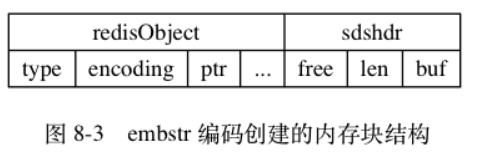

embstr 编码的字符串对象在执行命令时， 产生的效果和 raw 编码的字符串对象执行命令时产生的效果是相同的， 但使用 embstr 编码的字符串对象来保存短字符串值有以下好处：

- 1、embstr 编码将创建字符串对象所需的内存分配次数从 raw 编码的两次降低为一次。
- 2、释放 embstr 编码的字符串对象只需要调用一次内存释放函数， 而释放 raw 编码的字符串对象需要调用两次内存释放函数。
- 3、因为 embstr 编码的字符串对象的所有数据都保存在一块连续的内存里面， 所以这种编码的字符串对象比起 raw 编码的字符串对象能够更好地利用缓存带来的优势。

可以用 long double 类型表示的浮点数在 Redis 中也是作为字符串值来保存的： 如果我们要保存一个浮点数到字符串对象里面， 那么程序会先将这个浮点数转换成字符串值， 然后再保存起转换所得的字符串值。

在有需要的时候， 程序会将保存在字符串对象里面的字符串值转换回浮点数值， 执行某些操作， 然后再将执行操作所得的浮点数值转换回字符串值， 并继续保存在字符串对象里面。

字符串对象保存各类型值的编码方式

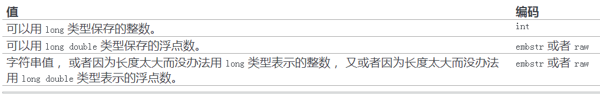


因为 Redis 没有为 embstr 编码的字符串对象编写任何相应的修改程序 （只有 int 编码的字符串对象和 raw 编码的字符串对象有这些程序）， 所以 embstr 编码的字符串对象实际上是只读的： 当我们对 embstr 编码的字符串对象执行任何修改命令时， 程序会先将对象的编码从 embstr 转换成 raw ， 然后再执行修改命令； 因为这个原因， embstr 编码的字符串对象在执行修改命令之后， 总会变成一个 raw 编码的字符串对象。


> 总结

1、Redis 只会使用 C 字符串作为字面量， 在大多数情况下， Redis 使用 SDS （Simple Dynamic String，简单动态字符串）作为字符串表示。

2、比起 C 字符串， SDS 具有以下优点：
- 常数复杂度获取字符串长度。
- 杜绝缓冲区溢出。
- 减少修改字符串长度时所需的内存重分配次数。
- 二进制安全。
- 兼容部分 C 字符串函数。

## 2、list链表

- 链表被广泛用于实现 Redis 的各种功能， 比如列表键， 发布与订阅， 慢查询， 监视器， 等等。

- 每个链表节点由一个 listNode 结构来表示， 每个节点都有一个指向前置节点和后置节点的指针， 所以 Redis 的链表实现是双端链表。

- 每个链表使用一个 list 结构来表示， 这个结构带有表头节点指针、表尾节点指针、以及链表长度等信息。

- 因为链表表头节点的前置节点和表尾节点的后置节点都指向 NULL ， 所以 Redis 的链表实现是无环链表。

- 通过为链表设置不同的类型特定函数， Redis 的链表可以用于保存各种不同类型的值。


## 3、hash字典

- 字典被广泛用于实现 Redis 的各种功能， 其中包括数据库和哈希键。

- Redis 中的字典使用哈希表作为底层实现， 每个字典带有两个哈希表， 一个用于平时使用， 另一个仅在进行 rehash 时使用。

- 当字典被用作数据库的底层实现， 或者哈希键的底层实现时， Redis 使用 MurmurHash2 算法来计算键的哈希值。

- 哈希表使用链地址法来解决键冲突， 被分配到同一个索引上的多个键值对会连接成一个单向链表。

- 在对哈希表进行扩展或者收缩操作时， 程序需要将现有哈希表包含的所有键值对 rehash 到新哈希表里面， 并且这个 rehash 过程并不是一次性地完成的， 而是渐进式地完成的。


## 4、skiplist跳跃表

- 跳跃表是有序集合的底层实现之一， 除此之外它在 Redis 中没有其他应用。

- Redis 的跳跃表实现由 zskiplist 和 zskiplistNode 两个结构组成， 其中 zskiplist 用于保存跳跃表信息（比如表头节点、表尾节点、长度）， 而 zskiplistNode 则用于表示跳跃表节点。

- 每个跳跃表节点的层高都是 1 至 32 之间的随机数。

- 在同一个跳跃表中， 多个节点可以包含相同的分值， 但每个节点的成员对象必须是唯一的。

- 跳跃表中的节点按照分值大小进行排序， 当分值相同时， 节点按照成员对象的大小进行排序。

## 5、intset整数集合

- 整数集合是集合键的底层实现之一。

- 整数集合的底层实现为数组， 这个数组以有序、无重复的方式保存集合元素， 在有需要时， 程序会根据新添加元素的类型， 改变这个数组的类型。

- 升级操作为整数集合带来了操作上的灵活性， 并且尽可能地节约了内存。

- 整数集合只支持升级操作， 不支持降级操作。

## 6、ziplist压缩列表

- 压缩列表是一种为节约内存而开发的顺序型数据结构。

- 压缩列表被用作列表键和哈希键的底层实现之一。

- 压缩列表可以包含多个节点，每个节点可以保存一个字节数组或者整数值。

- 添加新节点到压缩列表， 或者从压缩列表中删除节点， 可能会引发连锁更新操作， 但这种操作出现的几率并不高。


zipList最大的特点就是，它根本不是hash结构，而是一个比较长的字符串，将key-value都按顺序依次摆放到一个长长的字符串里来存储。如果要找某个key的话，就直接遍历整个长字符串就好了。[这里是不是变成数组了？]


压缩列表 ziplist 是为 Redis 节约内存而开发的，是列表键和字典键的底层实现之一。
当元素个数较少时，Redis 用 ziplist 来存储数据，当元素个数超过某个值时，链表键中会把 ziplist 转化为 linkedlist，字典键中会把 ziplist 转化为 hashtable。
ziplist 是由一系列特殊编码的连续内存块组成的顺序型的数据结构，ziplist 中可以包含多个 entry 节点，每个节点可以存放整数或者字符串。


# 2、对象的类型与编码

Redis 使用对象来表示数据库中的键和值， 每次当我们在 Redis 的数据库中新创建一个键值对时， 我们至少会创建两个对象， 一个对象用作键值对的键（键对象）， 另一个对象用作键值对的值（值对象）。

举个例子， 以下 SET 命令在数据库中创建了一个新的键值对， 其中键值对的键是一个包含了字符串值 "msg" 的对象， 而键值对的值则是一个包含了字符串值 "hello world" 的对象：

SET msg "hello world"

Redis 中的每个对象都由一个 redisObject 结构表示， 该结构中和保存数据有关的三个属性分别是 type 属性、 encoding 属性和 ptr 属性：

```c
typedef struct redisObject {
    int4 type;       // 类型 4bit
    int4 encoding:4; // 编码 4bit
    int24 lru;       //24bits
    int32 refcount;  //4bytes  引用计数，当引用计数为0时对象就会被销毁，内存回收 
    void *ptr;       //8bytes 指向底层实现数据结构的指针
} robj;//一个对象头占用16个字节
```


## 1、类型

对象的 type 属性记录了对象的类型， 这个属性的值可以是表列出的常量的其中一个。

```
对象	        对象 type 属性的值	TYPE 命令的输出
字符串对象	    REDIS_STRING	    "string"
列表对象	            REDIS_LIST	            "list"
哈希对象	            REDIS_HASH	            "hash"
集合对象	            REDIS_SET	            "set"
有序集合对象	    REDIS_ZSET	            "zset"
```

对于 Redis 数据库保存的键值对来说， 键总是一个字符串对象， 而值则可以是字符串对象、列表对象、哈希对象、集合对象或者有序集合对象的其中一种， 因此：

- 当我们称呼一个数据库键为“字符串键”时， 我们指的是“这个数据库键所对应的值为字符串对象”；
- 当我们称呼一个键为“列表键”时， 我们指的是“这个数据库键所对应的值为列表对象”，

诸如此类。

TYPE 命令的实现方式也与此类似， 当我们对一个数据库键执行 TYPE 命令时， 命令返回的结果为数据库键对应的值对象的类型， 而不是键对象的类型.（type  key）


## 2、编码和底层实现

对象的 ptr 指针指向对象的底层实现数据结构， 而这些数据结构由对象的 encoding 属性决定。

encoding 属性记录了对象所使用的编码， 也即是说这个对象使用了什么数据结构作为对象的底层实现， 这个属性的值可以是下图列出的常量的其中一个。

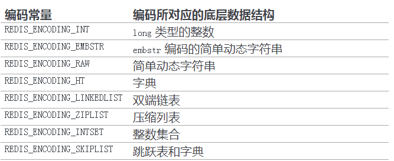

每种类型的对象都至少使用了两种不同的编码， 下图列出了每种类型的对象可以使用的编码。

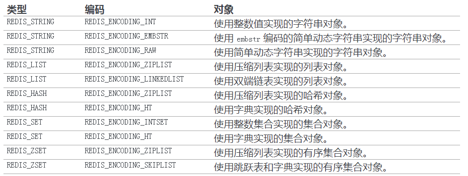

使用 OBJECT ENCODING 命令可以查看一个数据库键的值对象的编码(OBJECT ENCODING key)


列出了不同编码的对象所对应的 OBJECT ENCODING 命令输出。

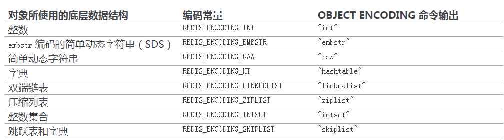


通过 encoding 属性来设定对象所使用的编码， 而不是为特定类型的对象关联一种固定的编码， 极大地提升了 Redis 的灵活性和效率， 因为 Redis 可以根据不同的使用场景来为一个对象设置不同的编码， 从而优化对象在某一场景下的效率。

举个例子， 在列表对象包含的元素比较少时， Redis 使用压缩列表作为列表对象的底层实现：

因为压缩列表比双端链表更节约内存， 并且在元素数量较少时， 在内存中以连续块方式保存的压缩列表比起双端链表可以更快被载入到缓存中；

随着列表对象包含的元素越来越多， 使用压缩列表来保存元素的优势逐渐消失时， 对象就会将底层实现从压缩列表转向功能更强、也更适合保存大量元素的双端链表上面；

其他类型的对象也会通过使用多种不同的编码来进行类似的优化。


# 3、redis常用对象


## 1、字符串对象

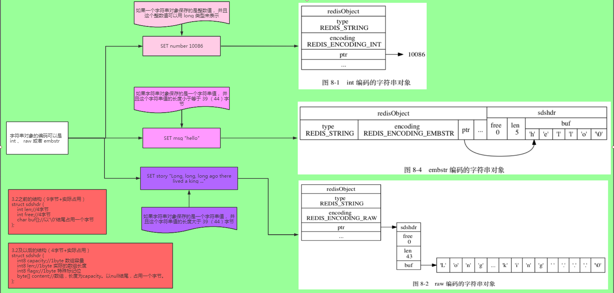


> 1、字符串命令的实现

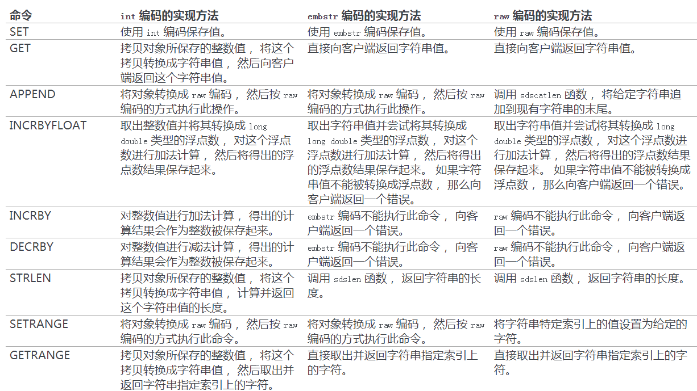


> 2、应用实例


## 2、列表对象

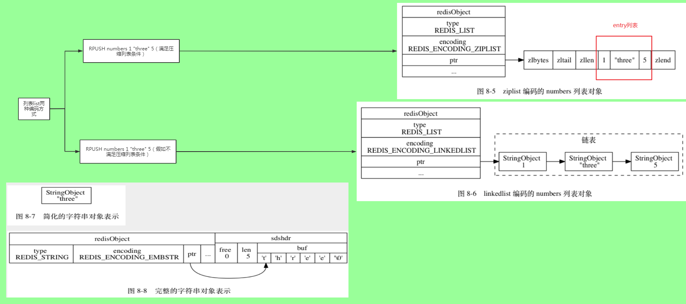


> 1、列表命令的实现

因为列表键的值为列表对象， 所以用于列表键的所有命令都是针对列表对象来构建的， 下图列出了其中一部分列表键命令， 以及这些命令在不同编码的列表对象下的实现方法。

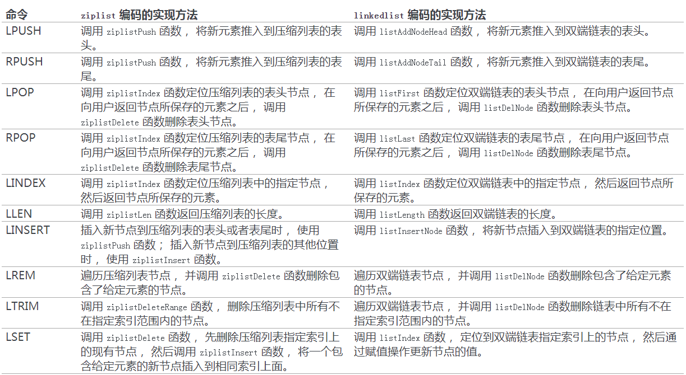


## 3、哈希对象

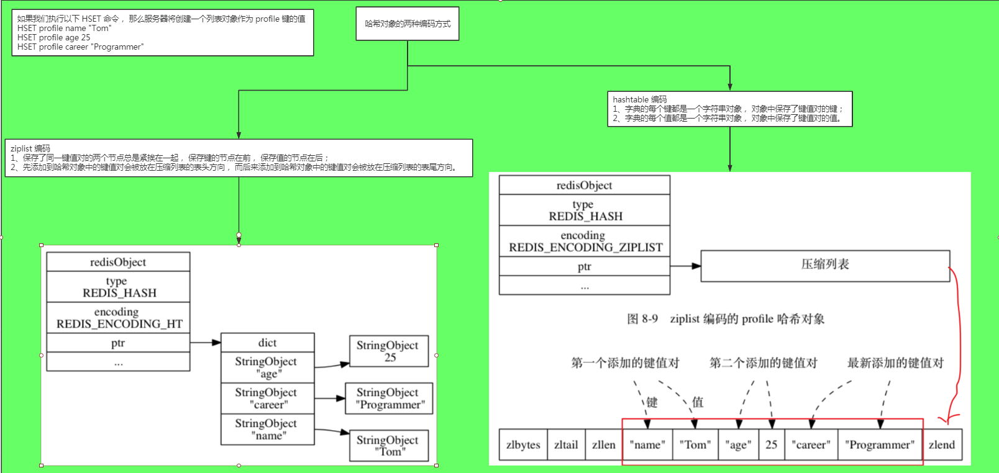


> 哈希命令的实现

因为哈希键的值为哈希对象， 所以用于哈希键的所有命令都是针对哈希对象来构建的， 下面出了其中一部分哈希键命令， 以及这些命令在不同编码的哈希对象下的实现方法。

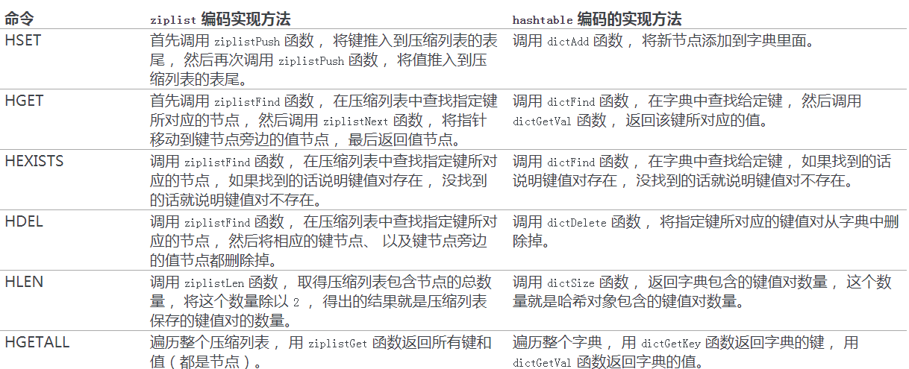


## 4、集合对象

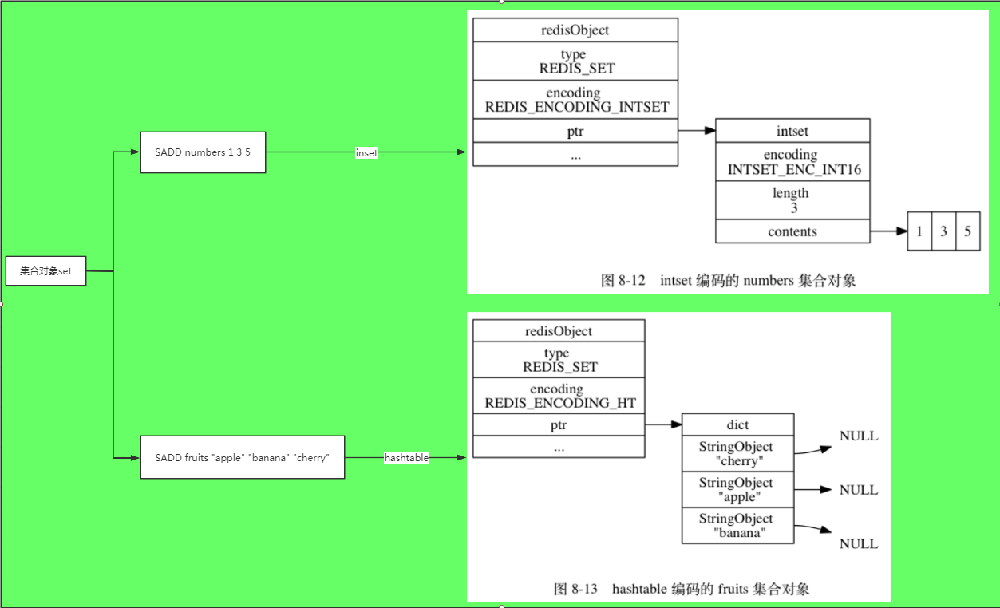


> 集合命令的实现

因为集合键的值为集合对象， 所以用于集合键的所有命令都是针对集合对象来构建的， 下面 列出了其中一部分集合键命令， 以及这些命令在不同编码的集合对象下的实现方法。

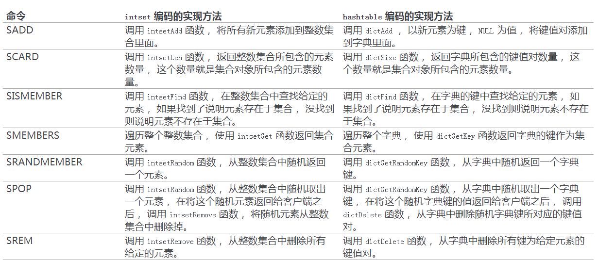


## 5、有序集合对象

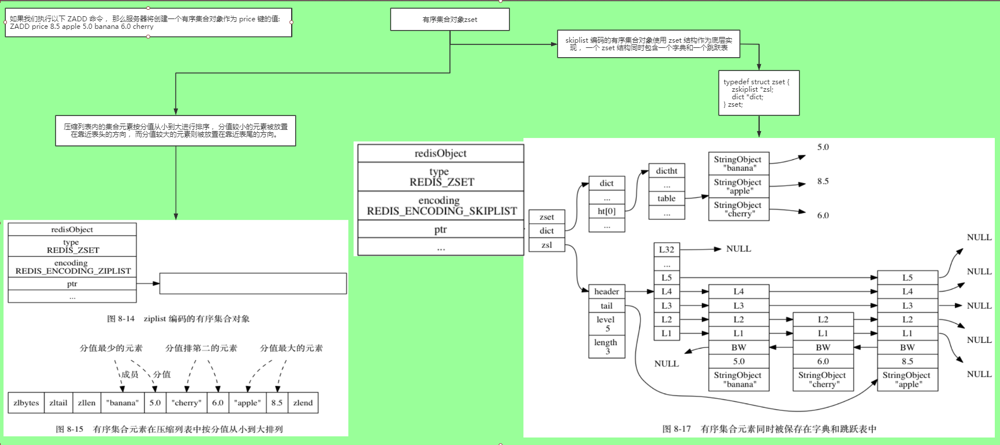


> 有序集合命令的实现

因为有序集合键的值为有序集合对象， 所以用于有序集合键的所有命令都是针对有序集合对象来构建的， 下面列出了其中一部分有序集合键命令， 以及这些命令在不同编码的有序集合对象下的实现方法。

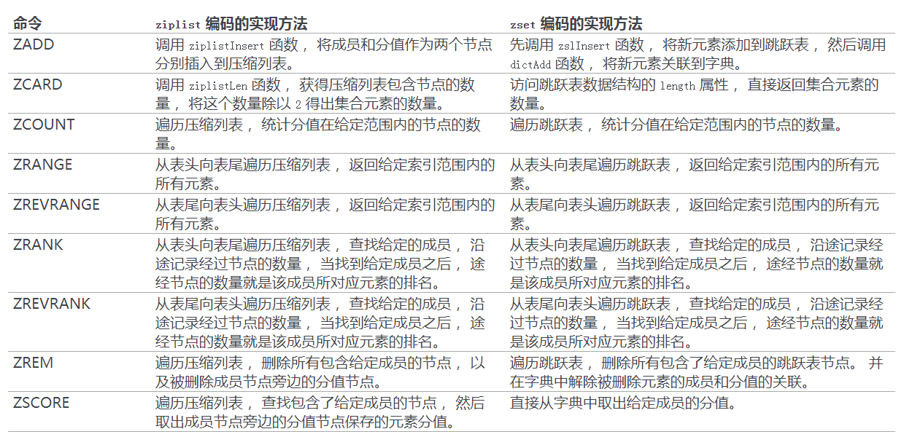


# 9、核心点梳理

## 1、为什么Redis这么快？

- 首先，采用了多路复用io阻塞机制
- 然后，数据结构简单，操作节省时间
- 最后，运行在内存中，自然速度快


## 2、Redis为什么是单线程的？

因为Redis的瓶颈不是cpu的运行速度，而往往是网络带宽和机器的内存大小。再说了，单线程切换开销小，容易实现既然单线程容易实现，而且CPU不会成为瓶颈，那就顺理成章地采用单线程的方案了。

这里的单线程，只是在处理我们的网络请求的时候只有一个线程来处理，一个正式的Redis Server运行的时候肯定是不止一个线程的，这里需要大家明确的注意一下！


而且需要区分并发和并行的概念，并发并不是并行。即redis的单线程依旧可以处理高并发请求。
（相关概念：并发性I/O流，意味着能够让一个计算单元来处理来自多个客户端的流请求。并行性，意味着服务器能够同时执行几个事情，具有多个计算单元）


# 参考

- [Redis 设计与实现](http://redisbook.com/)
- [在线测试redis命令网站](http://try.redis.io/)
- [为什么要用Redis？Redis为什么这么快？](https://zhuanlan.zhihu.com/p/81195864)
- [选择合适Redis数据结构，减少80%的内存占用](https://zhuanlan.zhihu.com/p/98033960)
- [为什么我们做分布式使用 Redis ？](https://zhuanlan.zhihu.com/p/50392209)
- [既生 Redis 何生 LevelDB ？](https://zhuanlan.zhihu.com/p/53299778)
- [一文揭秘单线程的Redis为什么这么快?](https://zhuanlan.zhihu.com/p/57089960)
- [Redis简明教程](https://zhuanlan.zhihu.com/p/37055648)

- [redis原理](https://zhuanlan.zhihu.com/p/73733011)
- [深入学习Redis（1）：Redis内存模型](https://www.cnblogs.com/kismetv/p/8654978.html)
- [聊聊redis的数据结构的应用](https://segmentfault.com/a/1190000016472058)
- [Redis 概念以及底层数据结构](https://segmentfault.com/a/1190000018887256)
- [Redis专题(2)：Redis数据结构底层探秘](https://segmentfault.com/a/1190000019441134)


