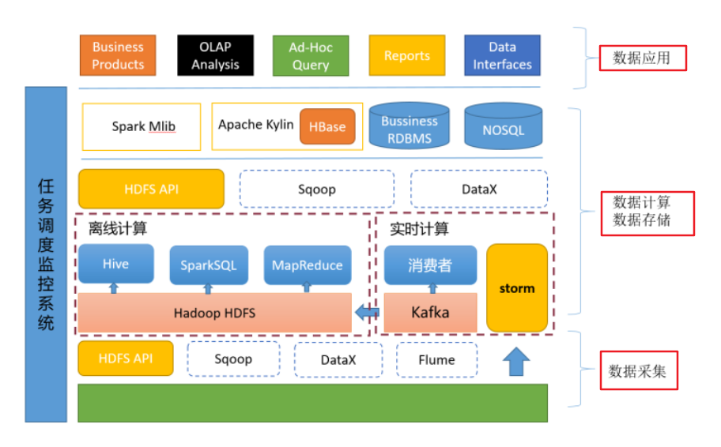
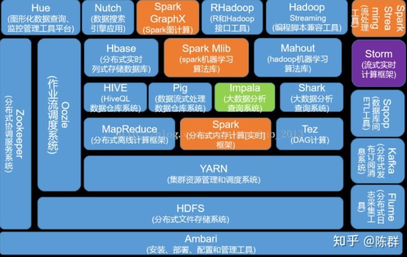

> 核心技术

- 文件存储：Hadoop HDFS、Tachyon、KFS

- K-V、NOSQL数据库：HBase、Redis、MongoDB

- 关系型数据库：MySQL、Oceasebase

- 列存储：clickhouse

- 离线计算：Hadoop MapReduce、Spark、Flink

- 流式、实时计算：Storm、Spark Streaming、S4、Heron

- rpc通信：Dubbo、Motan、Xxl-rpc、Soft-rpc

- 消息系统：Rocketmq、Kafka、StormMQ、ZeroMQ、RabbitMQ

- 资源管理：YARN、Mesos

- 日志收集：Flume、Scribe、Logstash、Kibana

- 查询分析：Hive、Impala、Pig、Presto、Phoenix、SparkSQL、Drill、Flink、Kylin、Druid

- 分布式协调服务：Zookeeper

- 集群管理与监控：Ambari、Ganglia、Nagios、Cloudera Manager

- 数据挖掘、机器学习：Mahout、Spark MLLib

- 数据同步：Sqoop、dataX

- 任务调度：Oozie、Quartz、Xxl-job、Azkaban

- 搜索：elasticsearch

- 微服务注册中心：Zookeeper、Eureka、Nacos

- 微服务配置中心：Apollo、Zookeeper、Disconf

- 微服务网关：ZUUL、Spring Cloud

- 分布式调用链路追踪：Dapper、Zipkin

HDFS是Hadoop提供的分布式存储框架，它可以用来存储海量数据，MapReduce是Hadoop提供的分布式计算框架，它可以用来统计和分析HDFS上的海量数据，而Hive则是SQL On Hadoop，Hive提供了SQL接口，开发人员只需要编写简单易上手的SQL语句，Hive负责把SQL翻译成MapReduce，提交运行。

# 1、存储相关

## 01、hdfs

http://hadoop.apache.org/

HDFS是一种数据分布式保存机制，数据被保存在计算机集群上。HDFS为HBase等系统提供了基础。

# 2、计算

## 01、MapReduce

# 3、通信

# 4、调度

## 1、Oozie

# Flume

Flume可以从其他应用程序收集日志数据，然后将这些数据送入到Hadoop。官方网站声称：“它功能强大、具有容错性，还拥有可以调整优化的可靠性机制和许多故障切换及恢复机制。”

HBase

HBase是为有数十亿行和数百万列的超大表设计的，这是一种分布式数据库，可以对大数据进行随机性的实时读取/写入访问。它有点类似谷歌的Bigtable，不过基于Hadoop和Hadoop分布式文件系统(HDFS)而建。

# 参考

- [Hadoop、spark、SaaS、PaaS、IaaS、云计算概念区分？](https://www.zhihu.com/question/32326748/answer/57393279)

- [零基础学习 Hadoop 该如何下手？](https://www.zhihu.com/question/19795366/answer/24524910)

- [一文读懂大数据平台——写给大数据开发初学者的话!](https://zhuanlan.zhihu.com/p/26545566)

- [lxw的大数据田地](http://lxw1234.com/)

- [如何进入大数据领域，学习路线是什么？](https://www.zhihu.com/question/35942305/answer/296719142)

- [大数据人推荐：60款顶级大数据开源工具](https://zhuanlan.zhihu.com/p/25033751)

- [三个月大数据工程师学习计划](https://zhuanlan.zhihu.com/p/31651985)

- [大数据学习入门规划？](https://www.zhihu.com/question/273955686/answer/426245468)

- [技术博客](https://www.iteblog.com/)

- [听说你立志要做数据分析？不如先听听老司机的建议](https://zhuanlan.zhihu.com/p/62014418)

- [美国大数据工程师面试攻略有哪些？](https://www.zhihu.com/question/25908682/answer/31637652)

