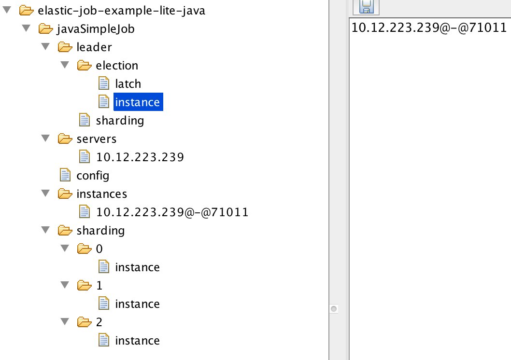
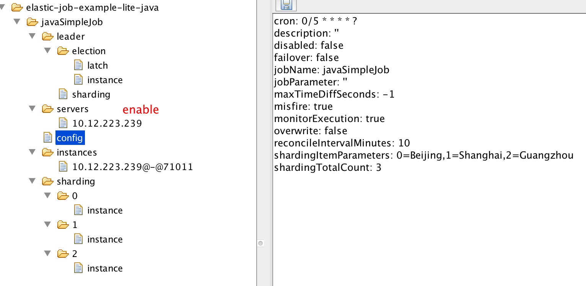
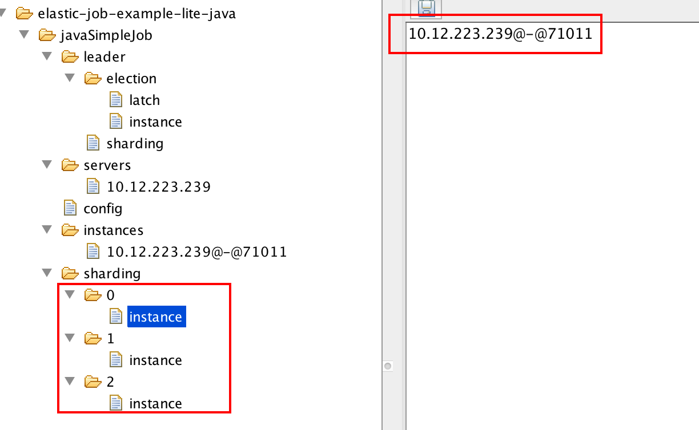
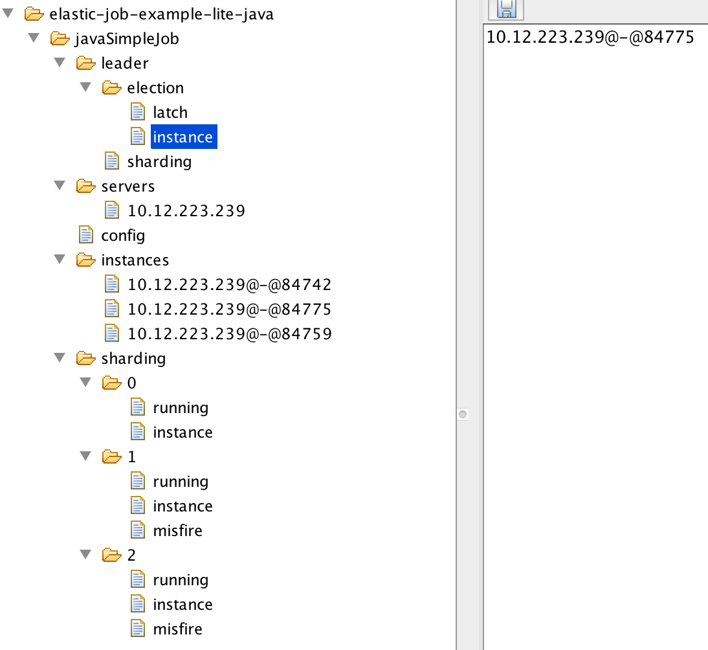
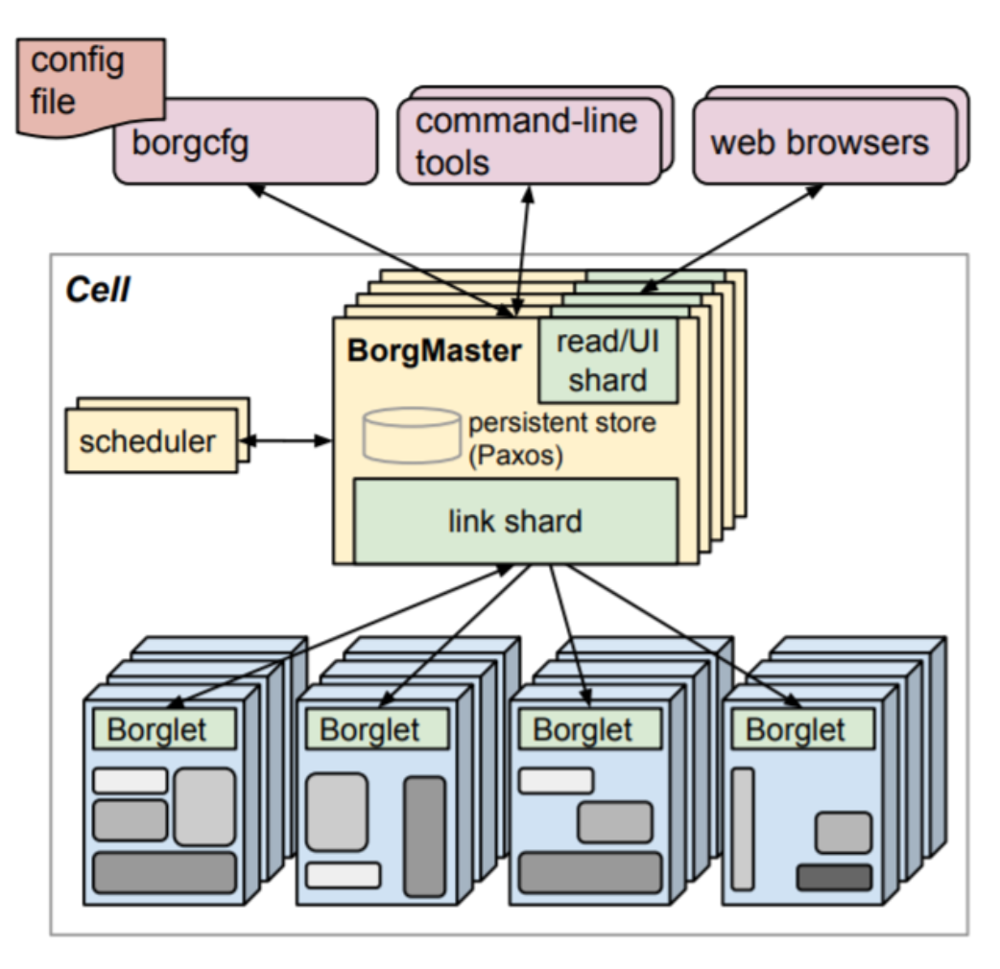
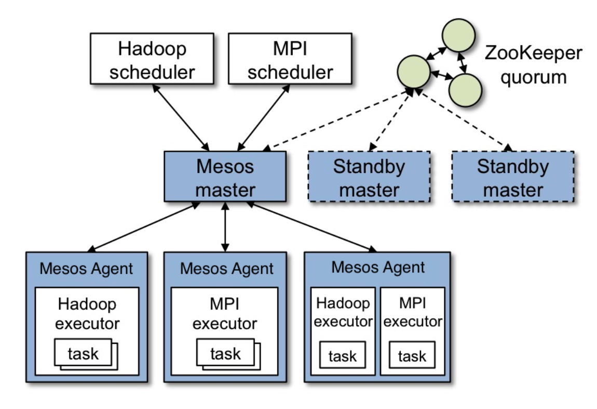
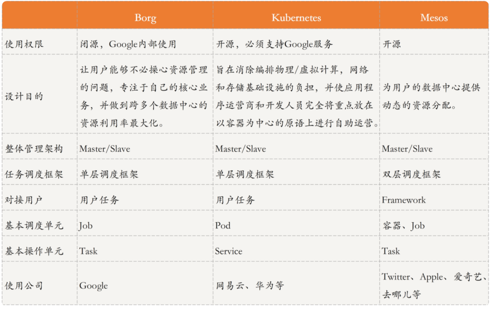

# 1. 、xxl-job


分片调度机制


选择分片广播的时候会通过注册执行器列表获取全部的运行实例，比如3个实例：

循环调用三个实例，传递分片（0，3）、（1，3）、（2，3）


这个分片参数会在用户执行代码中获取到，然后基于分片参数做自己的逻辑处理。


```java
@JobHandler(value="shardingJobHandler")
@Component
public class ShardingJobHandler extends IJobHandler {

	@Override
	public ReturnT<String> execute(String param) throws Exception {

		// 分片参数
		ShardingUtil.ShardingVO shardingVO = ShardingUtil.getShardingVo();
		XxlJobLogger.log("分片参数：当前分片序号 = {}, 总分片数 = {}", shardingVO.getIndex(), shardingVO.getTotal());

		// 业务逻辑
		for (int i = 0; i < shardingVO.getTotal(); i++) {
			if (i == shardingVO.getIndex()) {
				XxlJobLogger.log("第 {} 片, 命中分片开始处理", i);
			} else {
				XxlJobLogger.log("第 {} 片, 忽略", i);
			}
		}

		return SUCCESS;
	}

}
```


# 2、elasticjob










不同版本在zookeeper中的数据不一样




资源调度


Google Borg、Kubernetes 和 Apache Mesos 三个经典的集群管理系统。后面两个设计思想借鉴前者。


# Borg



Borg 是 Google 内部使用的集群管理系统，采用了典型的集中式结构，负责提交、调度、开始、重启和管理 Google 运行在其上的所有应用。

在 Borg 中，一个集群称为一个 Cell，每个 Cell 里面有一个 Leader，称为 BorgMaster，即为中央服务器；其他服务器为节点服务器或从服务器，被称为 Borglet。

首先，我们一起看看 BorgMaster。它由两个进程组成，一个是 Borgmaster 主进程，一个是独立的 scheduler 进程：

- 主进程处理客户端的 RPC 请求，比如任务的执行状态更新或者查询等；同时，管理系统中所有实体的状态（比如，服务器、任务等），并负责和 Borglet 通信。

- scheduler 进程负责任务调度，通过任务对资源的需求以及当前 Borglet 所在服务器的资源情况进行匹配，为任务寻找一个合适的节点服务器执行。

接下来，我们一起看看 Borglet。它是运行在每个节点机器的一个 agent，负责任务的拉起、停止、重启等，并管理和收集本服务器资源，将任务的状态、服务器状态等信息上报给 BorgMaster。而 BorgMaster 会周期性地轮询每个 Borglet，以获取节点服务器的状态和资源信息等。


# Mesos

Mesos 的开发受到了 Borg 系统的启发，也是采用的典型的集中式架构。Mesos 与 Borg 不同之处在于，Borg 的 Master 直接对接用户应用，也就是说用户可以向 Borg 的 Master 直接请求任务。但 Mesos 不可以，Mesos 只负责底层资源的管理和分配，并不涉及存储、 任务调度等功能，因此 Mesos Master 对接的是 Spark、Hadoop、Marathon 等框架，用户的任务需要提交到这些框架上。也正因为此，Mesos 的任务调度框架是双层结构。


在 Mesos 中，一个集群包括 Mesos Master 和多个 Mesos Agent。其中，Mesos Master 运行在中央服务器，Mesos Agent 运行在节点服务器上。Mesos Master 负责收集和管理所有 Agent 所在服务器的资源和状态，并且对接 Spark、Hadoop 等框架，将集群中服务器的资源信息告知给这些框架，以便这些框架进行任务资源匹配和调度。Mesos Agent 负责任务的拉起、停止、重启等，并负责收集所在服务器的资源 (比如 CPU、内存等) 信息和状态，上报给 Mesos Master。Mesos Master 通常采用一主两备的方式，以方便故障处理和恢复。




Mesos优势：

- 效率。Mesos 对物理资源进行了逻辑抽象，在应用层而不是物理层分配资源，通过容器而不是虚拟机（VM）分配任务。因为应用程序的调度器知道如何最有效地利用资源，所以在应用层分配资源能够为每个应用程序的特殊需求做考量 ; 而通过容器分配任务则能更好地进行“装箱”。

- 可扩展性。Mesos 可扩展设计的关键是两级调度架构，其中 Framework 进行任务调度，Mesos Master 进行资源分配。由于 Master 不必知道每种类型的应用程序背后复杂的调度逻辑，不必为每个任务做调度，因此可以用非常轻量级的代码实现，更易于扩展集群规模。

- 模块化。每接入一种新的框架，Master 无需增加新的代码，并且 Agent 模块可以复用，为此开发者可以专注于应用和框架的选择。这，就使得 Mesos 可以支持多种框架，适应不同的应用场景。随着分布式应用程序和微服务的流行，越来越多的用户正在寻找一种技术，来帮助他们管理这些复杂的应用程序。而 Mesos 为数据中心带来的这些好处，就使得越来越多的人关注 Mesos 及其相关项目。





# yarn

YARN定位为大数据中的数据操作系统，能够更好地为上层各类应用程序（MapReduce/Spark）提供资源管理和调度功能。


