<!-- TOC -->

- [第01讲：ZooKeeper 数据模型：节点的特性与应用](#第01讲zookeeper-数据模型节点的特性与应用)
    - [1、znode 节点类型与特性](#1znode-节点类型与特性)
    - [2、节点的状态结构](#2节点的状态结构)
    - [3、数据节点的版本](#3数据节点的版本)
        - [1、悲观锁](#1悲观锁)
        - [2、乐观锁](#2乐观锁)
    - [4、问题：为什么 ZooKeeper 不能采用相对路径查找节点呢？](#4问题为什么-zookeeper-不能采用相对路径查找节点呢)
- [第02讲：发布订阅模式：如何使用 Watch 机制实现分布式通知](#第02讲发布订阅模式如何使用-watch-机制实现分布式通知)
    - [1、Watch 机制是如何实现的](#1watch-机制是如何实现的)
    - [2、Watch 机制的底层原理](#2watch-机制的底层原理)
        - [1、客户端 Watch 注册实现过程](#1客户端-watch-注册实现过程)
        - [2、服务端 Watch 注册实现过程](#2服务端-watch-注册实现过程)
    - [3、服务端 Watch 事件的触发过程](#3服务端-watch-事件的触发过程)
    - [4、客户端回调的处理过程](#4客户端回调的处理过程)
    - [5、订阅发布场景实现](#5订阅发布场景实现)
    - [6、问题](#6问题)
- [第03讲：ACL 权限控制：如何避免未经授权的访问？](#第03讲acl-权限控制如何避免未经授权的访问)
    - [1、权限模式：Scheme](#1权限模式scheme)
    - [2、授权对象（ID）](#2授权对象id)
    - [3、权限信息（Permission）](#3权限信息permission)
    - [4、实现自己的权限口控制](#4实现自己的权限口控制)
    - [5、ACL 内部实现原理](#5acl-内部实现原理)
        - [1、客户端处理过程](#1客户端处理过程)
        - [2、服务端实现过程](#2服务端实现过程)
    - [6、问题](#6问题-1)
- [第04讲：ZooKeeper 如何进行序列化？](#第04讲zookeeper-如何进行序列化)
    - [1、什么是序列化，为什么要进行序列化操作](#1什么是序列化为什么要进行序列化操作)
    - [2、ZooKeeper 中的序列化方案](#2zookeeper-中的序列化方案)
    - [3、Jute 在 ZooKeeper 中的底层实现](#3jute-在-zookeeper-中的底层实现)
    - [4、问题](#4问题)
- [第05讲：深入分析 Jute 的底层实现原理](#第05讲深入分析-jute-的底层实现原理)
    - [1、简述 Jute 序列化](#1简述-jute-序列化)
    - [2、Jute 内部核心算法](#2jute-内部核心算法)
        - [1、Binary 方式的序列化](#1binary-方式的序列化)
        - [2、XMl 方式的序列化](#2xml-方式的序列化)
        - [3、Csv 方式的序列化](#3csv-方式的序列化)
- [第06讲：ZooKeeper 的网络通信协议详解](#第06讲zookeeper-的网络通信协议详解)
    - [1、请求协议](#1请求协议)
        - [1、客户端请求头底层解析](#1客户端请求头底层解析)
        - [2、客户端请求体底层解析](#2客户端请求体底层解析)
            - [1、会话创建ConnectRequest](#1会话创建connectrequest)
            - [2、节点查询GetDataRequest](#2节点查询getdatarequest)
            - [3、节点更新SetDataRequest](#3节点更新setdatarequest)
    - [2、响应协议](#2响应协议)
        - [1、服务端请求头解析](#1服务端请求头解析)
        - [2、服务端请求体解析](#2服务端请求体解析)
            - [1、响应会话创建ConnectResponse](#1响应会话创建connectresponse)
            - [2、响应节点查询GetDataResponse](#2响应节点查询getdataresponse)
            - [3、响应节点更新SetDataResponse](#3响应节点更新setdataresponse)
- [第07讲：单机模式：服务器如何从初始化到对外提供服务？](#第07讲单机模式服务器如何从初始化到对外提供服务)
    - [1、QuorumPeerMain启动程序入口](#1quorumpeermain启动程序入口)
    - [2、解析配置文件](#2解析配置文件)
    - [3、创建文件清理器DatadirCleanupManager](#3创建文件清理器datadircleanupmanager)
    - [4、服务初始化](#4服务初始化)
        - [1、ServerStats创建](#1serverstats创建)
        - [2、FileTxnSnapLog 类](#2filetxnsnaplog-类)
        - [3、ServerCnxnFactory 类创建](#3servercnxnfactory-类创建)
        - [4、初始化请求处理链](#4初始化请求处理链)
- [第08讲：集群模式：服务器如何从初始化到对外提供服务？](#第08讲集群模式服务器如何从初始化到对外提供服务)
    - [1、ZooKeeper 集群模式的特点](#1zookeeper-集群模式的特点)
    - [2、底层实现原理](#2底层实现原理)
        - [1、程序启动](#1程序启动)
        - [2、QuorumPeer 类](#2quorumpeer-类)
    - [3、Leader 服务器启动过程](#3leader-服务器启动过程)
    - [4、Follow 服务器启动过程](#4follow-服务器启动过程)
- [第09讲：创建会话：避开日常开发的那些“坑”](#第09讲创建会话避开日常开发的那些坑)
    - [1、会话状态](#1会话状态)
    - [2、会话底层实现](#2会话底层实现)
    - [3、会话异常](#3会话异常)
- [第10讲：ClientCnxn：客户端核心工作类工作原理解析](#第10讲clientcnxn客户端核心工作类工作原理解析)
    - [1、客户端核心类ClientCnxn](#1客户端核心类clientcnxn)
    - [2、请求队列](#2请求队列)
    - [3、SendThread](#3sendthread)
    - [4、EventThread](#4eventthread)
- [第11讲：分桶策略：如何实现高效的会话管理？](#第11讲分桶策略如何实现高效的会话管理)
    - [1、会话管理策略](#1会话管理策略)
    - [2、底层实现](#2底层实现)
- [第12讲：服务端是如何处理一次会话请求的？](#第12讲服务端是如何处理一次会话请求的)
    - [1、请求预处理器PrepRequestProcessor](#1请求预处理器preprequestprocessor)
    - [2、事物处理器ProposalRequestProcessor](#2事物处理器proposalrequestprocessor)
        - [1、Sync流程SyncRequestProcess](#1sync流程syncrequestprocess)
        - [2、Proposal 流程](#2proposal-流程)
        - [3、Commit 流程CommitProcessor](#3commit-流程commitprocessor)
    - [3、最终处理器FinalRequestProcessor](#3最终处理器finalrequestprocessor)
- [第13讲：Curator：如何降低 ZooKeeper 使用的复杂性？](#第13讲curator如何降低-zookeeper-使用的复杂性)
    - [1、什么是 Curator](#1什么是-curator)
    - [2、会话创建](#2会话创建)
    - [3、创建节点](#3创建节点)
    - [4、更新节点](#4更新节点)
    - [5、删除节点](#5删除节点)
    - [6、高级应用](#6高级应用)
        - [1、异常处理](#1异常处理)
        - [2、Leader 选举](#2leader-选举)
- [第14讲：Leader 选举：如何保证分布式数据的一致性？](#第14讲leader-选举如何保证分布式数据的一致性)
    - [1、Leader 的协调过程](#1leader-的协调过程)
    - [2、广播模式](#2广播模式)
    - [3、恢复模式](#3恢复模式)
    - [4、LearnerHandler](#4learnerhandler)
- [第15讲：ZooKeeper 究竟是怎么选中 Leader 的？](#第15讲zookeeper-究竟是怎么选中-leader-的)
    - [1、服务启动时的 Leader 选举](#1服务启动时的-leader-选举)
        - [1、发起投票](#1发起投票)
        - [2、接收投票](#2接收投票)
        - [3、统计投票](#3统计投票)
    - [2、服务运行时的 Leader 选举](#2服务运行时的-leader-选举)
        - [1、变更状态](#1变更状态)
        - [2、发起投票](#2发起投票)
    - [3、底层实现QuorumCnxManager](#3底层实现quorumcnxmanager)
- [第16讲：ZooKeeper 集群中 Leader 与 Follower 的数据同步策略](#第16讲zookeeper-集群中-leader-与-follower-的数据同步策略)
    - [1、为什么要进行同步](#1为什么要进行同步)
    - [2、同步方法](#2同步方法)
        - [1、同步条件](#1同步条件)
        - [2、同步过程](#2同步过程)
            - [1、DIFF 同步](#1diff-同步)
            - [2、TRUNC+DIFF 同步](#2truncdiff-同步)
            - [3、TRUNC 同步](#3trunc-同步)
            - [4、SNAP 同步](#4snap-同步)
        - [3、同步后的处理](#3同步后的处理)
- [第17讲：集群中 Leader 的作用：事务的请求处理与调度分析](#第17讲集群中-leader-的作用事务的请求处理与调度分析)
    - [1、事务性请求处理](#1事务性请求处理)
    - [2、Leader 事务处理分析](#2leader-事务处理分析)
        - [1、预处理阶段](#1预处理阶段)
        - [2、事务处理阶段](#2事务处理阶段)
        - [3、事务执行阶段](#3事务执行阶段)
        - [4、响应客户端：](#4响应客户端)
    - [3、事务处理底层实现](#3事务处理底层实现)
- [第18讲：集群中 Follow 的作用：非事务请求的处理与 Leader 的选举分析](#第18讲集群中-follow-的作用非事务请求的处理与-leader-的选举分析)
    - [1、非事务性请求处理过程](#1非事务性请求处理过程)
    - [2、底层实现](#2底层实现-1)
    - [3、选举过程](#3选举过程)
        - [1、Leader 失效发现](#1leader-失效发现)
        - [2、Leader 重新选举](#2leader-重新选举)
        - [3、Follow 角色变更](#3follow-角色变更)
        - [4、集群同步数据](#4集群同步数据)
    - [4、底层实现](#4底层实现)
- [第19讲：Observer 的作用与 Follow 有哪些不同？](#第19讲observer-的作用与-follow-有哪些不同)
    - [1、Observer 介绍](#1observer-介绍)
    - [2、底层实现](#2底层实现-2)
        - [1、INFORM 消息](#1inform-消息)
        - [2、Observer 处理链](#2observer-处理链)
- [第20讲：一个运行中的 ZooKeeper 服务会产生哪些数据和文件？](#第20讲一个运行中的-zookeeper-服务会产生哪些数据和文件)
    - [1、内存数据](#1内存数据)
    - [2、事务日志](#2事务日志)
    - [3、数据快照](#3数据快照)
- [第21讲：ZooKeeper 分布式锁：实现和原理解析](#第21讲zookeeper-分布式锁实现和原理解析)
    - [1、什么是分布式锁](#1什么是分布式锁)
    - [2、分布式死锁](#2分布式死锁)
    - [3、锁的实现](#3锁的实现)
        - [1、创建锁](#1创建锁)
        - [2、获取锁](#2获取锁)
        - [3、释放锁](#3释放锁)
- [第22讲：基于 ZooKeeper 命名服务的应用：分布式 ID 生成器](#第22讲基于-zookeeper-命名服务的应用分布式-id-生成器)
    - [1、什么是 ID 生成器](#1什么是-id-生成器)
    - [2、生成策略](#2生成策略)
        - [1、UUID 方式](#1uuid-方式)
        - [2、数据库序列方式](#2数据库序列方式)
        - [3、基于zookeeper的ID 生成器](#3基于zookeeper的id-生成器)
        - [4、snowflake 算法](#4snowflake-算法)
- [第23讲：使用 ZooKeeper 实现负载均衡服务器功能](#第23讲使用-zookeeper-实现负载均衡服务器功能)
    - [1、什么是负载均衡](#1什么是负载均衡)
        - [1、轮询法](#1轮询法)
        - [2、随机法](#2随机法)
        - [3、原地址哈希法](#3原地址哈希法)
        - [4、加权轮询法](#4加权轮询法)
        - [5、加权随机法](#5加权随机法)
        - [6、最小连接数法](#6最小连接数法)
    - [2、利用 ZooKeeper 实现](#2利用-zookeeper-实现)
        - [1、状态收集](#1状态收集)
        - [2、负载算法](#2负载算法)
- [第24讲：ZooKeeper 在 Kafka 和 Dubbo 中的工业级实现案例分析](#第24讲zookeeper-在-kafka-和-dubbo-中的工业级实现案例分析)
    - [1、Dubbo 与 ZooKeeper](#1dubbo-与-zookeeper)
    - [2、Kafka 与 ZooKeeper](#2kafka-与-zookeeper)
    - [3、整合 ZooKeeper 到自己的系统](#3整合-zookeeper-到自己的系统)
        - [1、java中使用](#1java中使用)
        - [2、在 Python 中使用 ZooKeeper](#2在-python-中使用-zookeeper)
- [第25讲：如何搭建一个高可用的 ZooKeeper 生产环境？](#第25讲如何搭建一个高可用的-zookeeper-生产环境)
    - [1、单机模式配置](#1单机模式配置)
    - [2、伪集群模式配置](#2伪集群模式配置)
    - [3、集群模式配置](#3集群模式配置)
    - [4、容器化部署](#4容器化部署)
- [第26讲：JConsole 与四字母命令：如何监控服务器上 ZooKeeper 的运行状态？](#第26讲jconsole-与四字母命令如何监控服务器上-zookeeper-的运行状态)
    - [1、JConsole 介绍](#1jconsole-介绍)
    - [2、四字母命令](#2四字母命令)
        - [1、stat](#1stat)
        - [2、srvr](#2srvr)
        - [3、cons](#3cons)
        - [4、ruok](#4ruok)
    - [3、监控集群信息](#3监控集群信息)
- [第27讲：crontab 与 PurgeTxnLog：线上系统日志清理的最佳时间和方式](#第27讲crontab-与-purgetxnlog线上系统日志清理的最佳时间和方式)
    - [1、corntab](#1corntab)
    - [2、PurgeTxnLog](#2purgetxnlog)
- [第28讲：彻底掌握二阶段提交/三阶段提交算法原理](#第28讲彻底掌握二阶段提交三阶段提交算法原理)
    - [1、二阶段提交](#1二阶段提交)
        - [1、性能问题](#1性能问题)
        - [2、单点问题](#2单点问题)
        - [3、异常中断](#3异常中断)
    - [2、三阶段提交](#2三阶段提交)
        - [1、预提交阶段](#1预提交阶段)
        - [2、提交阶段](#2提交阶段)
- [第29讲：ZAB 协议算法：崩溃恢复和消息广播](#第29讲zab-协议算法崩溃恢复和消息广播)
    - [1、ZAB 协议算法](#1zab-协议算法)
    - [2、崩溃恢复](#2崩溃恢复)
    - [3、选票结构](#3选票结构)
    - [4、选票筛选](#4选票筛选)
    - [5、消息广播](#5消息广播)
- [第30讲：ZAB 与 Paxos 算法的联系与区别](#第30讲zab-与-paxos-算法的联系与区别)
    - [1、Paxos 算法](#1paxos-算法)
    - [2、Paxos PK ZAB](#2paxos-pk-zab)
- [第31讲：ZooKeeper 中二阶段提交算法的实现分析](#第31讲zookeeper-中二阶段提交算法的实现分析)
    - [1、提交请求](#1提交请求)
    - [2、执行请求](#2执行请求)
- [第32讲：ZooKeeper 数据存储底层实现解析](#第32讲zookeeper-数据存储底层实现解析)
    - [1、数据日志](#1数据日志)
        - [1、搜集日志](#1搜集日志)
        - [2、存储日志](#2存储日志)
    - [2、快照文件](#2快照文件)
        - [1、快照创建](#1快照创建)
        - [2、快照存储](#2快照存储)

<!-- /TOC -->


开篇词
开篇词：选择 ZooKeeper，一步到位掌握分布式开发
> 模块一：基础篇
# 第01讲：ZooKeeper 数据模型：节点的特性与应用

ZooKeeper 基础知识基本分为三大模块：

- 数据模型
- ACL 权限控制
- Watch 监控

数据模型就是 ZooKeeper 用来存储和处理数据的一种逻辑结构。就像我们用 MySQL 数据库一样，要想处理复杂业务。前提是先学会如何往里边新增数据。ZooKeeper 数据模型最根本的功能就像一个数据库。

ZooKeeper 中的数据模型是一种树形结构，非常像电脑中的文件系统，有一个根文件夹，下面还有很多子文件夹。ZooKeeper 的数据模型也具有一个固定的根节点（/），我们可以在根节点下创建子节点，并在子节点下继续创建下一级节点。ZooKeeper 树中的每一层级用斜杠（/）分隔开，且只能用`绝对路径`（如“get /work/task1”）的方式查询 ZooKeeper 节点，而不能使用相对路径。具体的结构你可以看看下面这张图：

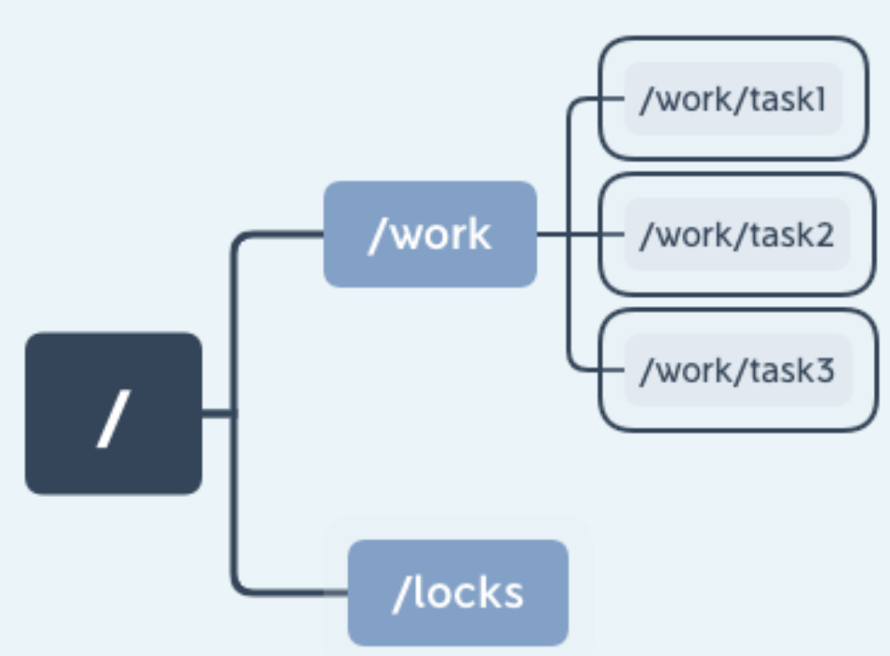

## 1、znode 节点类型与特性

ZooKeeper 中的数据是由多个数据节点最终构成的一个层级的树状结构，ZooKeeper 中的数据节点也分为持久节点、临时节点、有序节点、无序节点四种类型：

- 持久节点是因为一旦将节点创建为持久节点，该数据节点会一直存储在 ZooKeeper 服务器上，即使创建该节点的客户端与服务端的会话关闭了，该节点依然不会被删除。如果我们想删除持久节点，就要显式调用 delete 函数进行删除操作。


- 临时性是指，如果将节点创建为临时节点，那么该节点数据不会一直存储在 ZooKeeper 服务器上。当创建该临时节点的客户端会话因超时或发生异常而关闭时，该节点也相应在 ZooKeeper 服务器上被删除。同样，我们可以像删除持久节点一样主动删除临时节点。在平时的开发中，我们可以利用临时节点的这一特性来做服务器集群内机器运行情况的统计，将集群设置为“/servers”节点，并为集群下的每台服务器创建一个临时节点“/servers/host”，当服务器下线时该节点自动被删除，最后统计临时节点个数就可以知道集群中的运行情况。


- 有序节点，其实有序节点并不算是一种单独种类的节点，而是在之前提到的持久节点和临时节点特性的基础上，增加了一个节点有序的性质。所谓节点有序是说在我们创建有序节点的时候，ZooKeeper 服务器会自动使用一个单调递增的数字作为后缀，追加到我们创建节点的后边。例如一个客户端创建了一个路径为 works/task- 的有序节点，那么 ZooKeeper 将会生成一个序号并追加到该节点的路径后，最后该节点的路径为 works/task-1。通过这种方式我们可以直观的查看到节点的创建顺序。


上述这几种数据节点虽然类型不同，但 ZooKeeper 中的每个节点都维护有这些内容：一个二进制数组（byte data[]），用来存储节点的数据；ACL 访问控制信息；子节点数据（因为临时节点不允许有子节点，所以其子节点字段为 null），除此之外每个数据节点还有一个记录自身状态信息的字段 stat。


## 2、节点的状态结构

每一个节点都有一个自己的状态属性，记录了节点本身的一些信息，这些属性包括的内容我列在了下面这个表格里：

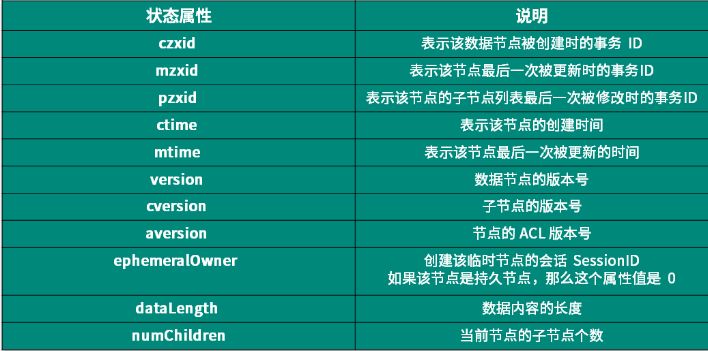

```
[zk: localhost:2181(CONNECTED) 2] stat /lishuai-test
cZxid = 0x2d57
ctime = Thu Jul 09 20:38:50 CST 2020
mZxid = 0x2d57
mtime = Thu Jul 09 20:38:50 CST 2020
pZxid = 0x2d57
cversion = 0
dataVersion = 0
aclVersion = 0
ephemeralOwner = 0x0
dataLength = 0
numChildren = 0
```


## 3、数据节点的版本

在 ZooKeeper 中为数据节点引入了版本的概念，每个数据节点有 3 种类型的版本信息，对数据节点的任何更新操作都会引起版本号的变化。ZooKeeper 的版本信息表示的是对节点数据内容、子节点信息或者是 ACL 信息的修改次数。


使用 ZooKeeper 实现锁

实现锁的方式有很多中，这里我们主要介绍两种：悲观锁、乐观锁。

### 1、悲观锁

悲观锁认为进程对临界区的竞争总是会出现，为了保证进程在操作数据时，该条数据不被其他进程修改。数据会一直处于被锁定的状态。

我们假设一个具有 n 个进程的应用，同时访问临界区资源，我们通过进程创建 ZooKeeper 节点 /locks 的方式获取锁。

线程 a 通过成功创建 ZooKeeper 节点“/locks”的方式获取锁后继续执行。这时进程 b 也要访问临界区资源，于是进程 b 也尝试创建“/locks”节点来获取锁，因为之前进程 a 已经创建该节点，所以进程 b 创建节点失败无法获得锁。

这样就实现了一个简单的悲观锁，不过这也有一个隐含的问题，就是当进程 a 因为异常中断导致 /locks 节点始终存在，其他线程因为无法再次创建节点而无法获取锁，这就产生了一个死锁问题。针对这种情况我们可以通过将节点设置为临时节点的方式避免。并通过在服务器端添加监听事件来通知其他进程重新获取锁。

### 2、乐观锁

乐观锁认为，进程对临界区资源的竞争不会总是出现，所以相对悲观锁而言。加锁方式没有那么激烈，不会全程的锁定资源，而是在数据进行提交更新的时候，对数据的冲突与否进行检测，如果发现冲突了，则拒绝操作。

**乐观锁基本可以分为读取、校验、写入三个步骤。**CAS（Compare-And-Swap），即比较并替换，就是一个乐观锁的实现。CAS 有 3 个操作数，内存值 V，旧的预期值 A，要修改的新值 B。当且仅当预期值 A 和内存值 V 相同时，将内存值 V 修改为 B，否则什么都不做。

在 ZooKeeper 中的 version 属性就是用来实现乐观锁机制中的“校验”的，ZooKeeper 每个节点都有数据版本的概念，在调用更新操作的时候，假如有一个客户端试图进行更新操作，它会携带上次获取到的 version 值进行更新。而如果在这段时间内，ZooKeeper 服务器上该节点的数值恰好已经被其他客户端更新了，那么其数据版本一定也会发生变化，因此肯定与客户端携带的 version 无法匹配，便无法成功更新，因此可以有效地避免一些分布式更新的并发问题。

在 ZooKeeper 的底层实现中，当服务端处理 setDataRequest 请求时，首先会调用 checkAndIncVersion 方法进行数据版本校验。ZooKeeper 会从 setDataRequest 请求中获取当前请求的版本 version，同时通过 getRecordForPath 方法获取服务器数据记录 nodeRecord， 从中得到当前服务器上的版本信息 currentversion。如果 version 为 -1，表示该请求操作不使用乐观锁，可以忽略版本对比；如果 version 不是 -1，那么就对比 version 和 currentversion，如果相等，则进行更新操作，否则就会抛出 BadVersionException 异常中断操作。


```java
//PrepRequestProcessor
private static int checkAndIncVersion(int currentVersion, int expectedVersion, String path) throws KeeperException.BadVersionException {
        if (expectedVersion != -1 && expectedVersion != currentVersion) {
            throw new KeeperException.BadVersionException(path);
        }
        return currentVersion + 1;
    }
```


## 4、问题：为什么 ZooKeeper 不能采用相对路径查找节点呢？

这是因为 ZooKeeper 大多是应用场景是定位数据模型上的节点，并在相关节点上进行操作。像这种查找与给定值相等的记录问题最适合用散列来解决。因此 ZooKeeper 在底层实现的时候，使用了一个 hashtable，即 hashtableConcurrentHashMap<String, DataNode> nodes ，用节点的完整路径来作为 key 存储节点数据。这样就大大提高了 ZooKeeper 的性能。


# 第02讲：发布订阅模式：如何使用 Watch 机制实现分布式通知

## 1、Watch 机制是如何实现的

ZooKeeper 的客户端可以通过 Watch 机制来订阅当服务器上某一节点的数据或状态发生变化时收到相应的通知，我们可以通过向 ZooKeeper 客户端的构造方法中传递 Watcher 参数的方式实现：

new ZooKeeper(String connectString, int sessionTimeout, Watcher watcher)


上面代码的意思是定义了一个了 ZooKeeper 客户端对象实例，并传入三个参数：

- connectString 服务端地址
- sessionTimeout：超时时间
- Watcher：监控事件

这个 Watcher 将作为整个 ZooKeeper 会话期间的上下文 ，一直被保存在客户端 ZKWatchManager 的 defaultWatcher 中。

除此之外，ZooKeeper 客户端也可以通过 getData、exists 和 getChildren 三个接口来向 ZooKeeper 服务器注册 Watcher，从而方便地在不同的情况下添加 Watch 事件：

getData(String path, Watcher watcher, Stat stat)

知道了 ZooKeeper 添加服务器监控事件的方式，下面我们来讲解一下触发通知的条件。


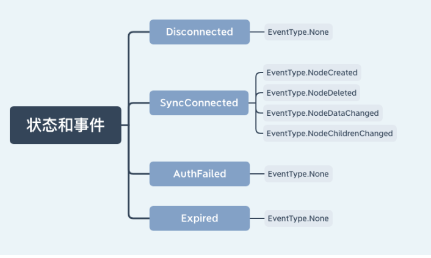

上图中列出了客户端在不同会话状态下，相应的在服务器节点所能支持的事件类型。例如在客户端连接服务端的时候，可以对数据节点的创建、删除、数据变更、子节点的更新等操作进行监控。


## 2、Watch 机制的底层原理

从设计模式角度出发来分析其底层实现：

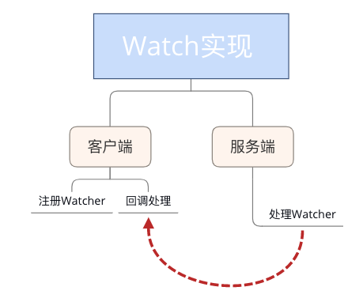

最初我在开始学习 Watch 机制的时候，它给我的第一印象是，其结构很像设计模式中的”观察者模式“，一个对象或者数据节点可能会被多个客户端监控，当对应事件被触发时，会通知这些对象或客户端。我们可以将 Watch 机制理解为是分布式环境下的观察者模式。所以接下来我们就以观察者模式的角度点来看看 ZooKeeper 底层 Watch 是如何实现的。

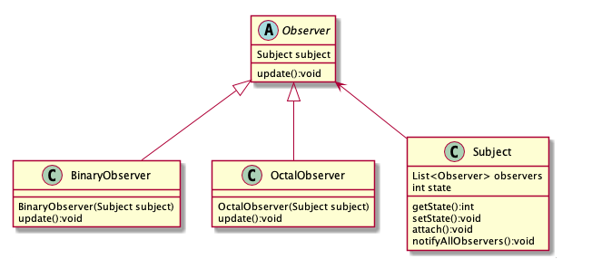

通常我们在实现观察者模式时，最核心或者说关键的代码就是创建一个列表来存放观察者。而在 ZooKeeper 中则是在客户端和服务器端分别实现两个存放观察者列表，即：ZKWatchManager 和 WatchManager。其核心操作就是围绕着这两个展开的。


### 1、客户端 Watch 注册实现过程

我们先看一下客户端的实现过程，在发送一个 Watch 监控事件的会话请求时，ZooKeeper 客户端主要做了两个工作：

- 标记该会话是一个带有 Watch 事件的请求
- 将 Watch 事件存储到 ZKWatchManager

我们以 getData 接口为例。当发送一个带有 Watch 事件的请求时，客户端首先会把该会话标记为带有 Watch 监控的事件请求，之后通过 DataWatchRegistration 类来保存 watcher 事件和节点的对应关系：

```java
//zookeeper.java
public byte[] getData(final String path, Watcher watcher, Stat stat){
  ...
  WatchRegistration wcb = null;
  if (watcher != null) {
    wcb = new DataWatchRegistration(watcher, clientPath);
  }
  RequestHeader h = new RequestHeader();
  request.setWatch(watcher != null);
  ...
  GetDataResponse response = new GetDataResponse();
  ReplyHeader r = cnxn.submitRequest(h, request, response, wcb);
  }

```
之后客户端向服务器发送请求时，是将请求封装成一个 Packet 对象，并添加到一个等待发送队列 outgoingQueue 中：


```java
//org.apache.zookeeper.ClientCnxn#queuePacket
public Packet queuePacket(RequestHeader h, ReplyHeader r，...) {
    Packet packet = null;
    ...
    packet = new Packet(h, r, request, response, watchRegistration);
    ...
    outgoingQueue.add(packet); 
    ...
    return packet;
}
```
最后，ZooKeeper 客户端就会向服务器端发送这个请求，完成请求发送后。调用负责处理服务器响应的 SendThread 线程类中的 readResponse 方法接收服务端的回调，并在最后执行 finishPacket（）方法将 Watch 注册到 ZKWatchManager 中：

```java
private void finishPacket(Packet p) {
        int err = p.replyHeader.getErr();
        if (p.watchRegistration != null) {
            p.watchRegistration.register(err);
        }
       ...
}

```


### 2、服务端 Watch 注册实现过程


Zookeeper 服务端处理 Watch 事件基本有 2 个过程：

- 解析收到的请求是否带有 Watch 注册事件
- 将对应的 Watch 事件存储到 WatchManager

当 ZooKeeper 服务器接收到一个客户端请求后，首先会对请求进行解析，判断该请求是否包含 Watch 事件。这在 ZooKeeper 底层是通过 FinalRequestProcessor 类中的 processRequest 函数实现的。当 getDataRequest.getWatch() 值为 True 时，表明该请求需要进行 Watch 监控注册。并通过 zks.getZKDatabase().getData 函数将 Watch 事件注册到服务端的 WatchManager 中。

```java
public void processRequest(Request request) {
...
byte b[] =                zks.getZKDatabase().getData(getDataRequest.getPath(), stat,
        getDataRequest.getWatch() ? cnxn : null);
rsp = new GetDataResponse(b, stat);
..
}

```

## 3、服务端 Watch 事件的触发过程

在客户端和服务端都对 watch 注册完成后，我们接下来看一下在 ZooKeeper 中触发一个 Watch 事件的底层实现过程：

我们以 setData 接口即“节点数据内容发生变更”事件为例。在 setData 方法内部执行完对节点数据的变更后，会调用 WatchManager.triggerWatch 方法触发数据变更事件。

```java
public Stat setData(String path, byte data[], ...){
        Stat s = new Stat();
        DataNode n = nodes.get(path);
        ...
        dataWatches.triggerWatch(path, EventType.NodeDataChanged);
        return s;
    }

```

下面我们进入 triggerWatch 函数内部来看看他究竟做了哪些工作。首先，封装了一个具有会话状态、事件类型、数据节点 3 种属性的 WatchedEvent 对象。之后查询该节点注册的 Watch 事件，如果为空说明该节点没有注册过 Watch 事件。如果存在 Watch 事件则添加到定义的 Wathcers 集合中，并在 WatchManager 管理中删除。最后，通过调用 process 方法向客户端发送通知。

```java
 Set<Watcher> triggerWatch(String path, EventType type...) {
        WatchedEvent e = new WatchedEvent(type,
                KeeperState.SyncConnected, path);
        Set<Watcher> watchers;
        synchronized (this) {
            watchers = watchTable.remove(path);
            ...
            for (Watcher w : watchers) {
                Set<String> paths = watch2Paths.get(w);
                if (paths != null) {
                    paths.remove(path);
                }
            }
        }
        for (Watcher w : watchers) {
            if (supress != null && supress.contains(w)) {
                continue;
            }
            w.process(e);
        }
        return watchers;
    }

```


## 4、客户端回调的处理过程

客户端使用 SendThread.readResponse() 方法来统一处理服务端的相应。首先反序列化服务器发送请求头信息 replyHdr.deserialize(bbia, "header")，并判断相属性字段 xid 的值为 -1，表示该请求响应为通知类型。在处理通知类型时，首先将己收到的字节流反序列化转换成 WatcherEvent 对象。接着判断客户端是否配置了 chrootPath 属性，如果为 True 说明客户端配置了 chrootPath 属性。需要对接收到的节点路径进行 chrootPath 处理。最后调用 eventThread.queueEvent( ）方法将接收到的事件交给 EventThread 线程进行处理

```java

if (replyHdr.getXid() == -1) {
    ...
    WatcherEvent event = new WatcherEvent();
    event.deserialize(bbia, "response");
    ...
    if (chrootPath != null) {
        String serverPath = event.getPath();
        if(serverPath.compareTo(chrootPath)==0)
            event.setPath("/");
            ...
            event.setPath(serverPath.substring(chrootPath.length()));
            ...
    }
    WatchedEvent we = new WatchedEvent(event);
    ...
    eventThread.queueEvent( we );
}

```
接下来我们来看一下 EventThread.queueEvent() 方法内部的执行逻辑。其主要工作分为 2 点：
第 1 步按照通知的事件类型，从 ZKWatchManager 中查询注册过的客户端 Watch 信息。客户端在查询到对应的 Watch 信息后，会将其从 ZKWatchManager 的管理中删除。因此这里也请你多注意，客户端的 Watcher 机制是一次性的，触发后就会被删除。

```java
public Set<Watcher> materialize(...)
{
	Set<Watcher> result = new HashSet<Watcher>();
	...
	switch (type) {
    ...
	case NodeDataChanged:
	case NodeCreated:
	    synchronized (dataWatches) {
	        addTo(dataWatches.remove(clientPath), result);
	    }
	    synchronized (existWatches) {
	        addTo(existWatches.remove(clientPath), result);
	    }
	    break;
    ....
	}
	return result;
}

```

完成了第 1 步工作获取到对应的 Watcher 信息后，将查询到的 Watcher 存储到 waitingEvents 队列中，调用 EventThread 类中的 run 方法会循环取出在 waitingEvents 队列中等待的 Watcher 事件进行处理。

```java
public void run() {
	try {
	  isRunning = true;
	  while (true) {
	     Object event = waitingEvents.take();
	     if (event == eventOfDeath) {
	        wasKilled = true;
	     } else {
	        processEvent(event);
	     }
	     if (wasKilled)
	        synchronized (waitingEvents) {
	           if (waitingEvents.isEmpty()) {
	              isRunning = false;
	              break;
	           }
	        }
	  }
     ...
}

```

最后调用 processEvent(event) 方法来最终执行实现了 Watcher 接口的 process（）方法。

```java
private void processEvent(Object event) {
  ...
  if (event instanceof WatcherSetEventPair) {
      
      WatcherSetEventPair pair = (WatcherSetEventPair) event;
      for (Watcher watcher : pair.watchers) {
          try {
              watcher.process(pair.event);
          } catch (Throwable t) {
              LOG.error("Error while calling watcher ", t);
          }
      }
  }
}

```

ZooKeeper 实现的方式是通过客服端和服务端分别创建有观察者的信息列表。客户端调用 getData、exist 等接口时，首先将对应的 Watch 事件放到本地的 ZKWatchManager 中进行管理。服务端在接收到客户端的请求后根据请求类型判断是否含有 Watch 事件，并将对应事件放到 WatchManager 中进行管理。

在事件触发的时候服务端通过节点的路径信息查询相应的 Watch 事件通知给客户端，客户端在接收到通知后，首先查询本地的 ZKWatchManager 获得对应的 Watch 信息处理回调操作。这种设计不但实现了一个分布式环境下的观察者模式，而且通过将客户端和服务端各自处理 Watch 事件所需要的额外信息分别保存在两端，减少彼此通信的内容。大大提升了服务的处理性能。


## 5、订阅发布场景实现

下面我们来分析一个具体案例：

在系统开发的过程中会用到各种各样的配置信息，如数据库配置项、第三方接口、服务地址等，这些配置操作在我们开发过程中很容易完成，但是放到一个大规模的集群中配置起来就比较麻烦了。通常这种集群中，我们可以用配置管理功能自动完成服务器配置信息的维护，利用ZooKeeper 的发布订阅功能就能解决这个问题。

我们可以把诸如数据库配置项这样的信息存储在 ZooKeeper 数据节点中。如图中的 /confs/data_item1。服务器集群客户端对该节点添加 Watch 事件监控，当集群中的服务启动时，会读取该节点数据获取数据配置信息。而当该节点数据发生变化时，ZooKeeper 服务器会发送 Watch 事件给各个客户端，集群中的客户端在接收到该通知后，重新读取节点的数据库配置信息。

我们使用 Watch 机制实现了一个分布式环境下的配置管理功能，通过对 ZooKeeper 服务器节点添加数据变更事件，实现当数据库配置项信息变更后，集群中的各个客户端能接收到该变更事件的通知，并获取最新的配置信息。要注意一点是，我们提到 Watch 具有一次性，所以当我们获得服务器通知后要再次添加 Watch 事件。


## 6、问题

思考题留给你：“当服务端某一节点发生数据变更操作时，所有曾经设置了该节点监控事件的客户端都会收到服务器的通知吗？答案是否定的，通过本课时对 ZooKeeper 内部实现机制的解析可以知道，Watch 事件的触发机制取决于会话的连接状态和客户端注册事件的类型，所以当客户端会话状态或数据节点发生改变时，都会触发对应的 Watch 事件。


# 第03讲：ACL 权限控制：如何避免未经授权的访问？


一个 ACL 权限设置通常可以分为 3 部分，分别是：权限模式（Scheme）、授权对象（ID）、权限信息（Permission）。最终组成一条例如“scheme:id:permission”格式的 ACL 请求信息。下面我们具体看一下这 3 部分代表什么意思：

## 1、权限模式：Scheme

权限模式就是用来设置 ZooKeeper 服务器进行权限验证的方式。ZooKeeper 的权限验证方式大体分为两种类型，一种是范围验证，另外一种是口令验证。所谓的范围验证就是说 ZooKeeper 可以针对一个 IP 或者一段 IP 地址授予某种权限。比如我们可以让一个 IP 地址为“ip：192.168.0.11”的机器对服务器上的某个数据节点具有写入的权限。或者也可以通过“ip:192.168.0.11/22”给一段 IP 地址的机器赋权。

另一种权限模式就是口令验证，也可以理解为用户名密码的方式，这是我们最熟悉也是日常生活中经常使用的模式，比如我们打开自己的电脑或者去银行取钱都需要提供相应的密码。在 ZooKeeper 中这种验证方式是 Digest 认证，我们知道通过网络传输相对来说并不安全，所以“绝不通过明文在网络发送密码”也是程序设计中很重要的原则之一，而 Digest 这种认证方式首先在客户端传送“username:password”这种形式的权限表示符后，ZooKeeper 服务端会对密码 部分使用 SHA-1 和 BASE64 算法进行加密，以保证安全性。另一种权限模式 Super 可以认为是一种特殊的 Digest 认证。具有 Super 权限的客户端可以对 ZooKeeper 上的任意数据节点进行任意操作。下面这段代码给出了 Digest 模式下客户端的调用方式。

```
//创建节点
create /digest_node1
//设置digest权限验证
setAcl /digest_node1 digest:用户名:base64格式密码:rwadc 
//查询节点Acl权限
getAcl /digest_node1 
//授权操作
addauth digest user:passwd

```
最后一种授权模式是 world 模式，其实这种授权模式对应于系统中的所有用户，本质上起不到任何作用。设置了 world 权限模式系统中的所有用户操作都可以不进行权限验证。

## 2、授权对象（ID）

接下来我们再看一下授权对象部分，其实这个很好理解，所谓的授权对象就是说我们要把权限赋予谁，而对应于 4 种不同的权限模式来说，如果我们选择采用 IP 方式，使用的授权对象可以是一个 IP 地址或 IP 地址段；而如果使用 Digest 或 Super 方式，则对应于一个用户名。如果是 World 模式，是授权系统中所有的用户。

## 3、权限信息（Permission）

介绍完授权方式以及授权对象，下面我们学习 ACL 请求信息中的最后一项：权限（Permission）。权限就是指我们可以在数据节点上执行的操作种类，如下图所示：在 ZooKeeper 中已经定义好的权限有 5 种：

- 数据节点（create）创建权限，授予权限的对象可以在数据节点下创建子节点；
- 数据节点（wirte）更新权限，授予权限的对象可以更新该数据节点；
- 数据节点（read）读取权限，授予权限的对象可以读取该节点的内容以及子节点的信息；
- 数据节点（delete）删除权限，授予权限的对象可以删除该数据节点的子节点；
- 数据节点（admin）管理者权限，授予权限的对象可以对该数据节点体进行 ACL 权限设置。

需要注意的一点是，每个节点都有维护自身的 ACL 权限数据，即使是该节点的子节点也是有自己的 ACL 权限而不是直接继承其父节点的权限。如下中“172.168.11.1”服务器有“/Config”节点的读取权限，但是没有其子节点的“/Config/dataBase_Config1”权限。


## 4、实现自己的权限口控制

通过上边的介绍我们了解了 ZooKeeper 中的权限相关知识，虽然 ZooKeeper 自身的权限控制机制已经做得很细，但是它还是提供了一种权限扩展机制来让用户实现自己的权限控制方式。官方文档中对这种机制的定义是 “Pluggable ZooKeeper Authenication”，意思是可插拔的授权机制，从名称上我们可以看出它的灵活性。那么这种机制是如何实现的呢？

首先，要想实现自定义的权限控制机制，最核心的一点是实现 ZooKeeper 提供的权限控制器接口 AuthenticationProvider。下面这张图片展示了接口的内部结构，用户通过该接口实现自定义的权限控制。

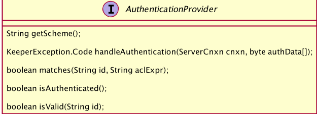

实现了自定义权限后，如何才能让 ZooKeeper 服务端使用自定义的权限验证方式呢？接下来就需要将自定义的权限控制注册到 ZooKeeper 服务器中，而注册的方式通常有两种。

第一种是通过设置系统属性来注册自定义的权限控制器：

-Dzookeeper.authProvider.x=CustomAuthenticationProvider

另一种是在配置文件 zoo.cfg 中进行配置：

authProvider.x=CustomAuthenticationProvider


## 5、ACL 内部实现原理

### 1、客户端处理过程

我们先看一下客户端是如何操作的，我们以节点授权 addAuth 接口为例，首先客户端通过 ClientCnxn 类中的 addAuthInfo 方法向服务端发送 ACL 权限信息变更请求，该方法首先将 scheme 和 auth 封装成 AuthPacket 类，并通过 RequestHeader 方法表示该请求是权限操作请求，最后将这些数据统一封装到 packet 中，并添加到 outgoingQueue 队列中发送给服务端。

```java
public void addAuthInfo(String scheme, byte auth[]) {
    if (!state.isAlive()) {
        return;
    }
    authInfo.add(new AuthData(scheme, auth));
    queuePacket(new RequestHeader(-4, OpCode.auth), null,
            new AuthPacket(0, scheme, auth), null, null, null, null,
            null, null);
}
```

ACL 权限控制机制的客户端实现相对简单，只是封装请求类型为权限请求，方便服务器识别处理，而发送到服务器的信息包括我们之前提到的权限校验信息。

### 2、服务端实现过程

相比于客户端的处理过程，服务器端对 ACL 内部实现就比较复杂，当节点授权请求发送到服务端后，在服务器的处理中首先调用 readRequest（）方法作为服务器处理的入口，其内部只是调用 processPacket 方法。

```java
private void readRequest() throws IOException {

    zkServer.processPacket(this, incomingBuffer);
}
```

而在 processPacket 方法的内部，首先反序列化客户端的请求信息并封装到 AuthPacket 对象中。之后通过 getServerProvider 方法根据不同的 scheme 判断具体的实现类，这里我们使用 Digest 模式为例，因此该实现类是 DigestAuthenticationProvider 。之后调用其 handleAuthentication() 方法进行权限验证。如果返 KeeperException.Code.OK 则表示该请求已经通过了权限验证，如果返回的状态是其他或者抛出异常则表示权限验证失败。

```java
public void processPacket(ServerCnxn cnxn, ByteBuffer incomingBuffer) throws IOException {
       ...
 ServerAuthenticationProvider         ap=ProviderRegistry.getServerProvider(scheme);
if(ap != null) {
authReturn = ap.handleAuthentication(new                          ServerAuthenticationProvider.ServerObjs(this, cnxn), authPacket.getAuth());
}
       ...
    }
```
现在我们知道了权限认证的最终实现函数是 handleAuthentication 函数，而这个函数内部实现的逻辑就很清晰简单了，主要的工作就是解析客户端传递的权限验证类型，并通过 addAuthInfo 函数将权限信息添加到 authInfo 集合属性中。

```java
public KeeperException.Code 
        handleAuthentication(ServerCnxn cnxn, byte[] authData)
    {
        String id = new String(authData);
        try {
            String digest = generateDigest(id);
            if (digest.equals(superDigest)) {
                cnxn.addAuthInfo(new Id("super", ""));
            }
            cnxn.addAuthInfo(new Id(getScheme(), digest));
            return KeeperException.Code.OK;
       	...

    }
```
这里我们重点讲解一下 addAuthInfo 函数，其作用是将解析到的权限信息存储到 ZooKeeper 服务器的内存中，该信息在整个会话存活期间一直会保存在服务器上，如果会话关闭，该信息则会被删，这个特性很像我们之前学过的数据节点中的临时节点。

经过上面的步骤，服务器已经将客户端 ACL 请求解析并将对应的会话权限信息存储在服务器上，下面我们再看一下服务器是如何进行权限验证的。首先，在处理一次权限请求时，先通过 PrepRequestProcessor 中的 checkAcl 函数检查对应的请求权限，如果该节点没有任何权限设置则直接返回，如果该节点有权限设置则循环遍历节点信息进行检查，如果具有相应的权限则直接返回表明权限认证成功，否则最后抛出 NoAuthException 异常中断操作表明权限认证失败。

```java
static void checkACL(...){
  ...
  for (ACL a : acl) {
    if(authId.getScheme().equals(id.getScheme()..){
      return;
    }
  }
  throw new KeeperException.NoAuthException();

}
```
到目前为止我们对 ACL 权限在 ZooKeeper 服务器客户端和服务端的底层实现过程进行了深度的分析。总体来说，客户端在 ACL 权限请求发送过程的步骤比较简单：首先是封装该请求的类型，之后将权限信息封装到 request 中并发送给服务端。而服务器的实现比较复杂，首先分析请求类型是否是权限相关操作，之后根据不同的权限模式（scheme）调用不同的实现类验证权限最后存储权限信息。本课时的例子采用了授权接口 addAuth 而没有采用权限设置接口 setAcl，是因为权限设置接口相对简单，其核心功能点已经包括在授权接口实现中。而在授权接口中，值得注意的是会话的授权信息存储在 ZooKeeper 服务端的内存中，如果客户端会话关闭，授权信息会被删除。下次连接服务器后，需要重新调用授权接口进行授权。

## 6、问题

这里，我们思考一个问题，如果一个客户端对服务器上的一个节点设置了只有它自己才能操作的权限，那么等这个客户端下线或被删除后。对其创建的节点要想进行修改应该怎么做呢？通过本课时的学习，我们可以通过“super 模式”即超级管理员的方式删除该节点或变更该节点的权限验证方式。正因为“super 模式”有如此大的权限，我们在平时使用时也应该更加谨慎。


# 第04讲：ZooKeeper 如何进行序列化？

什么是序列化以及为什么要进行序列化，简单来说，就是将对象编译成字节码的形式，方便将对象信息存储到本地或通过网络传输。

## 1、什么是序列化，为什么要进行序列化操作

序列化是指将我们定义好的 Java 类型转化成数据流的形式。之所以这么做是因为在网络传输过程中，TCP 协议采用“流通信”的方式，提供了可以读写的字节流。而这种设计的好处在于避免了在网络传输过程中经常出现的问题：比如消息丢失、消息重复和排序等问题。那么什么时候需要序列化呢？如果我们需要通过网络传递对象或将对象信息进行持久化的时候，就需要将该对象进行序列化。

我们较为熟悉的序列化操作是在 Java中，当我们要序列化一个对象的时候，首先要实现一个 Serializable 接口。

```java
public class User implements Serializable{
  private static final long serialVersionUID = 1L;
  private Long ids;
  private String name;
  ...
}
```
实现了 Serializable 接口后其实没有做什么实际的工作，它是一个没有任何内容的空接口，起到的作用就是标识该类是需要进行序列化的，这个就与我们后边要重点讲解的 ZooKeeper 序列化实现方法有很大的不同，这里请你先记住当前的写法，后边我们会展开讲解。

```java
public interface Serializable {
}
```
定义好序列化接口后，我们再看一下如何进行序列化和反序列化的操作。Java 中进行序列化和反序列化的过程中，主要用到了 ObjectInputStream 和 ObjectOutputStream 两个 IO 类。

ObjectOutputStream 负责将对象进行序列化并存储到本地。而 ObjectInputStream 从本地存储中读取对象信息反序列化对象。

```java
//序列化
ObjectOutputStream oo = new ObjectOutputStream()
oo.writeObject(user);
//反序列化
ObjectInputStream ois = new ObjectInputStream();
User user = (User) ois.readObject();
```

## 2、ZooKeeper 中的序列化方案

在 ZooKeeper 中并没有采用和 Java 一样的序列化方式，而是采用了一个 Jute 的序列解决方案作为 ZooKeeper 框架自身的序列化方式，说到 Jute 框架，它最早作为 Hadoop 中的序列化组件。之后 Jute 从 Hadoop 中独立出来，成为一个独立的序列化解决方案。ZooKeeper 从最开始就采用 Jute 作为其序列化解决方案，直到其最新的版本依然没有更改。

虽然 ZooKeeper 一直将 Jute 框架作为序列化解决方案，但这并不意味着 Jute 相对其他框架性能更好，反倒是 Apache Avro、Thrift 等框架在性能上优于前者。之所以 ZooKeeper 一直采用 Jute 作为序列化解决方案，主要是新老版本的兼容等问题，这里也请你注意，也许在之后的版本中，ZooKeeper 会选择更加高效的序列化解决方案。


简单介绍了 Jute 框架的发展过程，下面我们来看一下如何使用 Jute 在 ZooKeeper 中实现序列化。如果我们要想将某个定义的类进行序列化，首先需要该类实现 Record 接口的 serilize 和 deserialize 方法，这两个方法分别是序列化和反序列化方法。下边这段代码给出了我们一般在 ZooKeeper 中进行序列化的具体实现：首先，我们定义了一个 test_jute 类，为了能够对它进行序列化，需要该 test_jute 类实现 Record 接口，并在对应的 serialize 序列化方法和 deserialize 反序列化方法中编辑具体的实现逻辑。

```java
class test_jute implements Record{
  private long ids；
  private String name;
  ...
  public void serialize(OutpurArchive a_,String tag){
    ...
  }
  public void deserialize(INputArchive a_,String tag){
    ...
  }
}
```

而在序列化方法 serialize 中，我们要实现的逻辑是，首先通过字符类型参数 tag 传递标记序列化标识符，之后使用 writeLong 和 writeString 等方法分别将对象属性字段进行序列化。

```java
public void serialize(OutpurArchive a_,String tag) throws ...{
  a_.startRecord(this.tag);
  a_.writeLong(ids,"ids");
  a_.writeString(type,"name");
  a_.endRecord(this,tag);
}
```
而调用 derseralize 在实现反序列化的过程则与我们上边说的序列化过程正好相反。

```java
public void deserialize(INputArchive a_,String tag) throws {
  a_.startRecord(tag);
  ids = a_.readLong("ids");
  name = a_.readString("name");
  a_.endRecord(tag);
}
```

到这里我们就介绍完了如何在 ZooKeeper 中使用 Jute 实现序列化，需要注意的是，在实现了Record 接口后，具体的序列化和反序列化逻辑要我们自己在 serialize 和 deserialize 函数中完成。

序列化和反序列化的实现逻辑编码方式相对固定，首先通过 startRecord 开启一段序列化操作，之后通过 writeLong、writeString 或 readLong、 readString 等方法执行序列化或反序列化。本例中只是实现了长整型和字符型的序列化和反序列化操作，除此之外 ZooKeeper 中的 Jute 框架还支持 整数类型（Int）、布尔类型（Bool）、双精度类型（Double）以及 Byte/Buffer 类型。

## 3、Jute 在 ZooKeeper 中的底层实现

正因为 ZooKeeper 的设计目的是将复杂的底层操作封装成简单易用的接口，从而方便用户调用，也使得我们在使用 ZooKeeper 实现序列化的时候能够更加容易。

学会了利用 Jute 实现序列化和反序列化后，我们深入底层，看一下 ZooKeeper 框架具体是如何实现序列化操作的。正如上边我们提到的，通过简单的实现 Record 接口就可以实现序列化，那么我们接下来就以这个接口作为入口，详细分析其底层原理。

Record 接口可以理解为 ZooKeeper 中专门用来进行网络传输或本地存储时使用的数据类型。因此所有我们实现的类要想传输或者存储到本地都要实现该 Record 接口。

```java
public interface Record{
  public void serialize(OutputArchive archive, String tag)
    throws IOException;
public void deserialize(InputArchive archive, String tag)
    throws IOException;
}
```

Record 接口的内部实现逻辑非常简单，只是定义了一个 序列化方法 serialize 和一个反序列化方法 deserialize 。而在 Record 起到关键作用的则是两个重要的类：OutputArchive 和 InputArchive ，其实这两个类才是真正的序列化和反序列化工具类。

在 OutputArchive 中定义了可进行序列化的参数类型，根据不同的序列化方式调用不同的实现类进行序列化操作。如下图所示，Jute 可以通过 Binary 、 Csv 、Xml 等方式进行序列化操作。

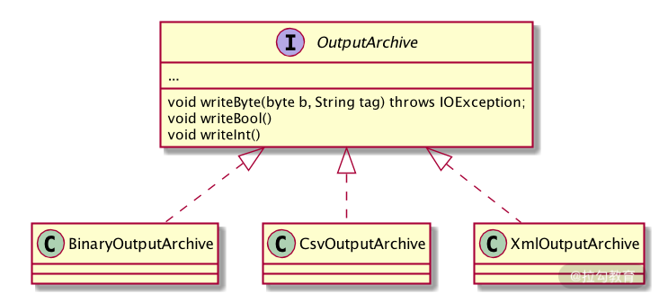

而对应于序列化操作，在反序列化时也会相应调用不同的实现类，来进行反序列化操作。如下图所示：

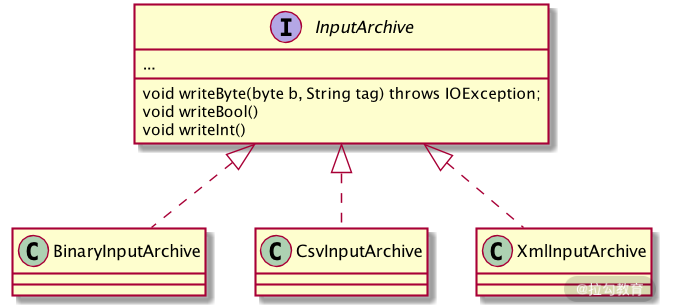

注意：无论是序列化还是反序列化，都可以对多个对象进行操作，所以当我们在定义序列化和反序列化方法时，需要字符类型参数 tag 表示要序列化或反序列化哪个对象。


## 4、问题

到现在我们已经对 ZooKeeper 中的序列化知识有了一个全面的掌握，请你思考一个问题：如果说序列化就是将对象转化成字节流的格式，那么为什么 ZooKeeper 的 Jute 序列化框架还提供了对 Byte/Buffer 这两种类型的序列化操作呢？

其实这其中最关键的作用就是在不同操作系统中存在大端和小端的问题，为了避免不同操作系统环境的差异，在传输字节类型时也要进行序列化和反序列化。这里你需要在日常使用中多注意。


# 第05讲：深入分析 Jute 的底层实现原理


## 1、简述 Jute 序列化

Jute 框架给出了 3 种序列化方式，分别是 Binary 方式、Csv 方式、XML 方式。序列化方式可以通俗地理解成我们将 Java 对象通过转化成特定的格式，从而更加方便在网络中传输和本地化存储。之所以采用这 3 种方式的格式化文件，也是因为这 3 种方式具有跨平台和普遍的规约特性，后面我将会对这三种方法的特性进行具体讲解。接下来我将深入 Jute 的底层，看一下这 3 种实现方式的底层实现过程。

## 2、Jute 内部核心算法

ZooKeeper 在实现序列化的时候要实现 Record 接口，而在 Record 接口的内部，真正起作用的是两个工具类，分别是 OutPutArchive 和 InputArchive。下边我们分别来看一下它们在 Jute 内部是如何实现的。

OutPutArchive 是一个接口，规定了一系列序列化相关的操作。而要实现具体的相关操作，Jute 是通过三个具体实现类分别实现了 Binary、Csv、XML 三种方式的序列化操作。而这三种方式有什么不同？

### 1、Binary 方式的序列化

首先我们来看一下 Jute 中的第 1 种序列化方式：Binary 序列化方式，即二进制的序列化方式。正如我们前边所提到的，采用这种方式的序列化就是将 Java 对象信息转化成二进制的文件格式。

在 Jute 中实现 Binary 序列化方式的类是 BinaryOutputArchive。该 BinaryOutputArchive 类通过实现 OutPutArchive 接口，在 Jute 框架采用二进制的方式实现序列化的时候，采用其作为具体的实现类。

在这里我们通过调用 Record 接口中的 writeString 方法为例，该方法是将 Java 对象的 String 字符类型进行序列化。当调用 writeString 方法后，首先判断所要进行序列化的字符串是否为空。如果是空字符串则采用 writeInt 方法，将空字符串当作值为 -1 的数字类型进行序列化；如果不为空，则调用 stringtoByteBuffer 方法对字符串进行序列化操作。

```java
void writeString (String s, Sring tag){
  if(s==null){
    writeInt(-1,"len");
    return 
  }
  ByteBuffer bb = stringtoByteBuffer(s);
  ...
}
```

而 stringToByteBuffer 方法也是 BinaryOutputArchive 类的内部核心方法，除了 writeString 序列化方法外，其他的比如 writeInt、wirteDoule 等序列化方法则是调用 DataOutPut 接口中的相关方法来实现具体的序列化操作。

在调用 BinaryOutputArchive 类的 stringToByteBuffer 方法时，在将字符串转化成二进制字节流的过程中，首选将字符串转化成字符数组 CharSequence 对象，并根据 ascii 编码判断字符类型，如果是字母等则使用1个 byte 进行存储。如果是诸如 “¥” 等符号则采用两个 byte 进程存储。如果是汉字则采用3个 byte 进行存储。

```java
...
private ByteBuffer bb = ByteBuffer.allocate(1024);
...
ByteBuffer stringToByteBuffer(CharSeuquece s){
    if (c < 0x80) {
                bb.put((byte) c);
    } else if (c < 0x800) {
      bb.put((byte) (0xc0 | (c >> 6)));
      bb.put((byte) (0x80 | (c & 0x3f)));
    } else {
      bb.put((byte) (0xe0 | (c >> 12)));
      bb.put((byte) (0x80 | ((c >> 6) & 0x3f)));
      bb.put((byte) (0x80 | (c & 0x3f)));
    }
 }
```

Binary 二进制序列化方式的底层实现相对简单，只是采用将对应的 Java 对象转化成二进制字节流的方式。Binary 方式序列化的优点有很多：无论是 Windows 操作系统、还是 Linux 操作系统或者是苹果的 macOS 操作系统，其底层都是对二进制文件进行操作，而且所有的系统对二进制文件的编译与解析也是一样的，所有操作系统都能对二进制文件进行操作，跨平台的支持性更好。而缺点则是会存在不同操作系统下，产生大端小端的问题。

### 2、XMl 方式的序列化

说完了 Binary 的序列化方式，我们再来看看 Jute 中的另一种序列化方式 XML 方式。XML 是一种可扩展的标记语言。当初设计的目的就是用来传输和存储数据，很像我们都很熟悉的 HTML 语言，而与 HTML 语言不同的是我们需要自己定义标签。在 XML 文件中每个标签都是我们自己定义的，而每个标签就对应一项内容。一个简单的 XML 的格式如下面这段代码所示：

```xml
<note>
<to>学生</to>
<from>老师</form>
<heading>上课提醒</heading>
<body>记得9:00来上课</body>
</note>
```

大概了解了 XML 文件，接下来我们看一下 Jute 框架中是如何采用 XML 方式进行序列化操作的。在 Jute 中使用 XmlOutPutArchive 类作用 XML 方式序列化的具体实现类。与上面讲解二进制的序列化实现一样 ，这里我们还是以 writeString 方法的 XML 序列化方式的实现为例。

首先，当采用XML 方式进行序列化时，调用 writeString 方法将 Java 中的 String 字符串对象进行序列化时，在 writeString 内部首先调用 printBeginEnvelope 方法并传入 tag 参数，标记我们要序列化的字段名称。之后采用“”和“”作用自定义标签，封装好传入的 Java 字符串。

```java
void writeString(String s, String tag){
   printBeginEnvelope(tag);
   stream.print("<string>");
   stream.print(Utils.toXMLString(s));
   stream.print("</string>");
   printEndEnvelope(tag);
}
```

而在 printBeginEnvelope 方法中，其主要作用就是添加该字段的名称、字段值等信息，用于之后反序列化的过程中。

```java
void printBeginEnvelope (String tag){
  ...
  if ("struct".equals(s)) {
        putIndent();
        stream.print("<member>\n");
        addIndent();
        putIndent();
        stream.print("<name>"+tag+"</name>\n");
        putIndent();
        stream.print("<value>");
    } else if ("vector".equals(s)) {
        stream.print("<value>");
    } else if ("map".equals(s)) {
        stream.print("<value>");
    }
} else {
    stream.print("<value>");
}
}
```

通过上面在 Jute 框架中，对采用 XML 方式序列化的实现类：XmlOutPutArchive 中的底层实现过程分析，我们可以了解到其实现的基本原理，也就是根据 XML 格式的要求，解析传入的序列化参数，并将参数按照 Jute 定义好的格式，采用设定好的默认标签封装成对应的序列化文件。

而采用 XML 方式进行序列化的优点则是，通过可扩展标记协议，不同平台或操作系统对序列化和反序列化的方式都是一样的，不存在因为平台不同而产生的差异性，也不会出现如 Binary 二进制序列化方法中产生的大小端的问题。而缺点则是序列化和反序列化的性能不如二进制方式。在序列化后产生的文件相比与二进制方式，同样的信息所产生的文件更大。

### 3、Csv 方式的序列化

最后我们来学习一下 Jute 序列化框架的最后一种序列化方式：Csv，它和 XML 方式很像，只是所采用的转化格式不同，Csv 格式采用逗号将文本进行分割，我们日常使用中最常用的 Csv 格式文件就是 Excel 文件。

在 Jute 框架中实现 Csv 序列化的类是 CsvOutputArchive，我们还是以 String 字符对象序列化为例，在调用 CsvOutputArchive 的 writeString 方法时，writeString 方法首先调用 printCommaUnlessFirst 方法生成一个逗号分隔符，之后将要序列化的字符串值转换成 CSV 编码格式追加到字节数组中。

```java
void writeString(String s, String tag){
  printCommaUnlessFirst();
  stream.print(Utils.toCSVString(s));
  throwExceptionOnError(tag);
}
```

到这里我们已经对 Jute 框架的 3 种序列化方式的底层实现有了一个整体了解，这 3 种方式相比，二进制底层的实现方式最为简单，性能也最好。而 XML 作为可扩展的标记语言跨平台性更强。而 CSV 方式介于两者之间实现起来也相比 XML 格式更加简单。

接下来请你思考这样一个问题，在 ZooKeeper 中，默认的序列化实现方式是哪种？

在 ZooKeeper 中默认的序列化实现方式是 Binary 二进制方式。这是因为二进制具有更好的性能，以及大多数平台对二进制的实现都不尽相同。


# 第06讲：ZooKeeper 的网络通信协议详解


说到网络通信协议我们最为熟悉的应该就是 TCP/IP 协议。而 ZooKeeper 则是在 TCP/IP 协议的基础上实现了自己特有的通信协议格式。在 ZooKeeper 中一次客户端的请求协议由请求头、请求体组成。而在一次服务端的响应协议中由响应头和响应体组成。

接下来我们看一下在 ZooKeeper 中的内部对于网络通信协议的底层是怎么样实现的。

## 1、请求协议

请求协议就是客户端向服务端发送的协议。比如我们经常用到的会话创建、数据节点查询等操作。都是客户端通过网络向 ZooKeeper 服务端发送请求协议完成的。

### 1、客户端请求头底层解析

首先，我们先看一下请求头的内部的实现原理。在 ZooKeeper 中请求头是通过 RequestHeader 类实现的。首先 RequestHeader 类实现了 Record 接口，用于之后在网络传输中进行序列化操作。

我们可以看到 RequestHeader 类中只有两个属性字段分别是 xid 和 type。这两个字段在我们第一节课 ZooKeeper 的数据模型中介绍过，分别代表客户端序号用于记录客户端请求的发起顺序以及请求操作的类型。

```java

class RequestHeader implements Record{
  private int xid;
  private int type;
}
```

### 2、客户端请求体底层解析

协议的请求体包括了协议处理逻辑的全部内容，一次会话请求的所有操作内容都涵盖在请求体中。在 ZooKeeper 的内部实现中，根据不同的请求操作类型，会采用不同的结构封装请求体。接下来我们就以最常用的创建一次会话和数据节点的查询和更新这三种操作来介绍，深入底层看看 ZooKeeper 在内部是如何实现的。

#### 1、会话创建ConnectRequest

我们知道在 ZooKeeper 客户端发起会话时，会向服务端发送一个会话创建请求，该请求的作用就是通知 ZooKeeper 服务端需要处理一个来自客户端的访问链接。

而服务端处理会话创建请求时所需要的所有信息都包括在请求体内。在 ZooKeeper 中该请求体是通过 ConnectRequest 类实现的，其内部一共包括了五种属性字段。分别是 protocolVersion 表示该请求协议的版本信息、lastZxidSeen 最后一次接收到的服务器的 zxid 序号、timeOut 会话的超时时间、会话标识符 sessionId 以及会话的密码 password。有了这些信息 ZooKeeper 服务端在接收一个请求时，就可以根据请求体的信息进行相关的操作了。

```java
ConnectRequest implements Record {
  private int protocolVersion;
  private long lastZxidSeen;
  private int timeOut;
  private long sessionId;
  private byte[] passwd;
 }
```

#### 2、节点查询GetDataRequest

在我们通过客户端 API 查询 ZooKeeper 服务器上的数据节点时，客户端会向服务端发送 GetDataRequest 会话请求。与上面介绍的会话请求不同。ZooKeeper 在处理获取数据节点会话请求时，选择了另一种结构作为该协议的请求体。而具体的实现类则是 GetDataRequest 。在 GetDataRequest 类中首先实现了 Record 接口用于序列化操作。其具有两个属性分别是字符类型 path 表示要请求的数据节点路径以及布尔类型 watch 表示该节点是否注册了 Watch 监控。

节点路径如下：

```java
public class GetDataRequest implements Record {
  private String path;
  private boolean watch;
}
```
#### 3、节点更新SetDataRequest

最后，我们来看一下最后一种会话操作类型即节点的更新操作，同样的在客户端向服务端发送一个数据节点更新操作时，其在网络上实际发送的是更新操作的请求协议。而在 ZooKeeper 中对于协议内部的请求体，ZooKeeper 通过 SetDataRequest 类进行了封装。在 SetDataRequest 内部也包含了三种属性，分别是 path 表示节点的路径、data 表示节点数据信息以及 version 表示节点期望的版本号用于锁的验证。

```java
public class SetDataRequest implements Record {
  private String path;
  private byte[] data;
  private int version;
 }
```

到目前为止我们就对 ZooKeeper 客户端在一次网络会话请求中所发送的请求协议的内部结构和底层实现都做了介绍，然而这些都是客户端向服务器端的请求协议，接下来我们就继续分析 ZooKeeper 服务端向客户端发送的响应协议是如何实现的。

## 2、响应协议

响应协议可以理解为服务端在处理客户端的请求后，返回相关信息给客户端。而服务端所采用的响应协议类型则要根据客户端的请求协议类型来选择。

### 1、服务端请求头解析

在服务端接收到客户端的请求后，执行相关操作将结果通知给客户端。而在 ZooKeeper 服务端向客户单发送的响应协议中，也是包括了请求头和请求体。而与客户端的请求头不同的是在 ZooKeeper 服务端的请求头多了一个错误状态字段。具体的实现类是 ReplyHeader。

```java
public class ReplyHeader implements Record {
  private int xid;
  private long zxid;
  private int err;
}
```

### 2、服务端请求体解析

下面我们再看一下响应协议的请求体部分，服务端的请求体可以理解为对客户端所请求内容的封装，一个服务端的请求体包含了客户端所要查询的数据而对于不同的请求类型，在 ZooKeeper 的服务端也是采用了不同的结构进行处理的。与上面我们讲解客户端请求体的方法一样，我们还是通过会话的创建、数据节点的查询和修改这三种请求操作来介绍，看看 ZooKeeper 服务端是如何响应客户端请求的。

#### 1、响应会话创建ConnectResponse

对于客户端发起的一次会话连接操作，ZooKeeper 服务端在处理后，会返回给客户端一个 Response 响应。而在底层代码中 ZooKeeper 是通过 ConnectRespose 类来实现的。在该类中有四个属性，分别是 protocolVersion 请求协议的版本信息、timeOut 会话超时时间、sessionId 会话标识符以及 passwd 会话密码。

```java
public class ConnectResponse implements Record {
  private int protocolVersion;
  private int timeOut;
  private long sessionId;
  private byte[] passwd;
}
```

#### 2、响应节点查询GetDataResponse

在客户端发起查询节点数据的请求时，服务端根据客户端发送的节点路径，并验证客户端具有相应的权限后，会将节点数据返回给客户端。而 ZooKeeper 服务端通过 GetDataResponse 类来封装查询到的节点相关信息到响应协议的请求体中。在 GetDataResponse 内部有两种属性字段分别是 data 属性表示节点数据的内容和 stat 属性表示节点的状态信息。

```java

public class GetDataResponse implements Record {
  private byte[] data;
  private org.apache.zookeeper.data.Stat stat;
  }
```

#### 3、响应节点更新SetDataResponse

在客户端发送一个节点变更操作后， ZooKeeper 服务端在处理完相关逻辑后，会发送一个响应给客户端。而在 ZooKeeper 中更新完节点后会将操作结果返回给客户端，节点更新操作的响应协议请求体通过 SetDataResponse 类来实现。而在该类的内部只有一个属性就是 stat 字段，表示该节点数据更新后的最新状态信息。

```java
public class SetDataResponse implements Record {
  private org.apache.zookeeper.data.Stat stat;
}
```

那么我们思考这样一个问题。如果一个会话的超时时间是在服务器端实现的。会话超时服务器端会主动关闭会话。所以在会话请求的请求体中包括了设置会话超时的属性字段，而我们经常会遇到一个问题就是明明通过客户端将超时时间设置了一个值，而在实际执行的时候会话超时的时间可能远远小于我们设置的时间。这是因为在 ZooKeeper 处理会话超时时间的时候不只是简单地使用客户端传来的超时时间还会根据 minSessionTimeout 和 maxSessionTimeout 这两个参数来调整时间的设置。这里请大家在日常设置中多注意。


> 模块二：进阶篇

# 第07讲：单机模式：服务器如何从初始化到对外提供服务？


在 ZooKeeper 服务的初始化之前，首先要对配置文件等信息进行解析和载入。也就是在真正开始服务的初始化之前需要对服务的相关参数进行准备，而 ZooKeeper 服务的准备阶段大体上可分为:
- 1、启动程序入口
- 2、zoo.cfg 配置文件解析
- 3、创建历史文件清理器等

## 1、QuorumPeerMain启动程序入口

QuorumPeerMain 类是 ZooKeeper 服务的启动接口，可以理解为 Java 中的 main 函数。 通常我们在控制台启动 ZooKeeper 服务的时候，输入 zkServer.cm 或 zkServer.sh 命令就是用来启动这个 Java 类的。如下代码所示，QuorumPeerMain 类函数只有一个 initializeAndRun 方法，是作用为所有 ZooKeeper 服务启动逻辑的入口。

```java
package org.apache.zookeeper.server.quorum
public class QuorumPeerMain {
  ...
  public static void main(String[] args) {
  ...
    main.initializeAndRun(args);
  ...
  }
}
```


## 2、解析配置文件

知道了 ZooKeeper 服务的程序启动入口，那么我们现在就分析 ZooKeeper 的启动过程。在 ZooKeeper 启动过程中，首先要做的事情就是解析配置文件 zoo.cfg。在之前的课程中我们提到过，zoo.cfg 是服务端的配置文件，在这个文件中我们可以配置数据目录、端口号等信息。所以解析 zoo.cfg 配置文件是 ZooKeeper 服务启动的关键步骤。zoo.cfg 文件的具体解析过程会在后边的课程中专门展开讲解，这里我们只需要知道在服务启动的过程中会进行配置文件的解析。

## 3、创建文件清理器DatadirCleanupManager

文件清理器在我们日常的使用中非常重要，我们都知道面对大流量的网络访问，ZooKeeper 会因此产生海量的数据，如果磁盘数据过多或者磁盘空间不足，则会导致 ZooKeeper 服务器不能正常运行，进而影响整个分布式系统。所以面对这种问题，ZooKeeper 采用了 DatadirCleanupManager 类作为历史文件的清理工具类。在 3.4.0 版本后的 ZooKeeper 中更是增加了自动清理历史数据的功能以尽量避免磁盘空间的浪费。如下代码所示，DatadirCleanupManager 类有 5 个属性，其中 snapDir 和 dataLogDir 分别表示数据快照地址以及日志数据的存放地址。而我们在日常工作中可以通过在 zoo.cfg 文件中配置 autopurge.snapRetainCount 和 autopurge.purgeInterval 这两个参数实现数据文件的定时清理功能，autopurge.purgeInterval 这个参数指定了清理频率，以小时为单位，需要填写一个 1 或更大的整数，默认是 0，表示不开启自己清理功能。autopurge.snapRetainCount 这个参数和上面的参数搭配使用，这个参数指定了需要保留的文件数目，默认是保留 3 个。

```java
public class DatadirCleanupManager {
    private final File snapDir;
    private final File dataLogDir;
    private final int snapRetainCount;
    private final int purgeInterval;
    private Timer timer;
}
```

## 4、服务初始化

经过了上面的配置文件解析等准备阶段后， ZooKeeper 开始服务的初始化阶段。初始化阶段可以理解为根据解析准备阶段的配置信息，实例化服务对象。服务初始化阶段的主要工作是创建用于服务统计的工具类，如下所示主要有以下几种：

- ServerStats 类，它可以用于服务运行信息统计；
- FileTxnSnapLog 类，可以用于数据管理。
- 会话管理类，设置服务器 TickTime 和会话超时时间、创建启动会话管理器等操作。


下面我们就分别分析一下这几个关键步骤在 ZooKeeper 中的底层实现过程。

### 1、ServerStats创建

首先，我们来看一下统计工具类 ServerStats。ServerStats 类用于统计 ZooKeeper 服务运行时的状态信息统计。主要统计的数据有服务端向客户端发送的响应包次数、接收到的客户端发送的请求包次数、服务端处理请求的延迟情况以及处理客户端的请求次数。在日常运维工作中，监控服务器的性能以及运行状态等参数很多都是这个类负责收集的。

```java
public class ServerStats {
    private long packetsSent;
    private long packetsReceived;
    private long maxLatency;
    private long minLatency = Long.MAX_VALUE;
    private long totalLatency = 0;
    private long count = 0;
}
```

### 2、FileTxnSnapLog 类

现在，我们再看一下另一个工具类 FileTxnSnapLog 类，该类的作用是用来管理 ZooKeeper 的数据存储等相关操作，可以看作为 ZooKeeper 服务层提供底层持久化的接口。在 ZooKeeper 服务启动过程中，它会根据 zoo.cfg 配置文件中的 dataDir 数据快照目录和 dataLogDir 事物日志目录来创建 FileTxnSnapLog 类。

```java

package org.apache.zookeeper.server.persistence;
public class FileTxnSnapLog {
  private final File dataDir;
  private final File snapDir;
  private TxnLog txnLog;
  private SnapShot snapLog;
  private final boolean autoCreateDB
}
```


### 3、ServerCnxnFactory 类创建

ZooKeeper 中客户端和服务端通过网络通信，其本质是通过 Java 的 IO 数据流的方式进行通信，但是传统的 IO 方式具有阻塞等待的问题，而 NIO 框架作为传统的 Java IO 框架的替代方案，在性能上大大优于前者。也正因如此，NIO 框架也被广泛应用于网络传输的解决方案中。而 ZooKeeper 最早也是使用自己实现的 NIO 框架，但是从 3.4.0 版本后，引入了第三方 Netty 等框架来满足不同使用情况的需求，而我们可以通过 ServerCnxnFactory 类来设置 ZooKeeper 服务器，从而在运行的时候使用我们指定的 NIO 框架。如代码中 ServerCnxnFactory 类通过

setServerCnxnFactory 函数来创建对应的工厂类。

```java
package org.apache.zookeeper.server;
public abstract class ServerCnxnFactory {
final public void setZooKeeperServer(ZooKeeperServer zks) {
    this.zkServer = zks;
    if (zks != null) {
        if (secure) {
            zks.setSecureServerCnxnFactory(this);
        } else {
            zks.setServerCnxnFactory(this);
        }
    }
}
```


在通过 ServerCnxnFactory 类制定了具体的 NIO 框架类后。ZooKeeper 首先会创建一个线程
Thread 类作为 ServerCnxnFactory 类的启动主线程。之后 ZooKeeper 服务再初始化具体的 NIO 类。这里请你注意的是，虽然初始化完相关的 NIO 类 ，比如已经设置好了服务端的对外端口，客户端也能通过诸如 2181 端口等访问到服务端，但是此时 ZooKeeper 服务器还是无法处理客户端的请求操作。这是因为 ZooKeeper 启动后，还需要从本地的快照数据文件和事务日志文件中恢复数据。这之后才真正完成了 ZooKeeper 服务的启动。

### 4、初始化请求处理链

在完成了 ZooKeeper 服务的启动后，ZooKeeper 会初始化一个请求处理逻辑上的相关类。这个操作就是初始化请求处理链。所谓的请求处理链是一种责任链模式的实现方式，根据不同的客户端请求，在 ZooKeeper 服务器上会采用不同的处理逻辑。而为了更好地实现这种业务场景，ZooKeeper 中采用多个请求处理器类一次处理客户端请求中的不同逻辑部分。这种处理请求的逻辑方式就是责任链模式。而本课时主要说的是单机版服务器的处理逻辑，主要分为PrepRequestProcessor、SyncRequestProcessor、FinalRequestProcessor 3 个请求处理器，而在一个请求到达 ZooKeeper 服务端进行处理的过程，则是严格按照这个顺序分别调用这 3 个类处理请求中的对应逻辑，如下图所示。具体的内容，我们会在后面的课程中详细讲解。

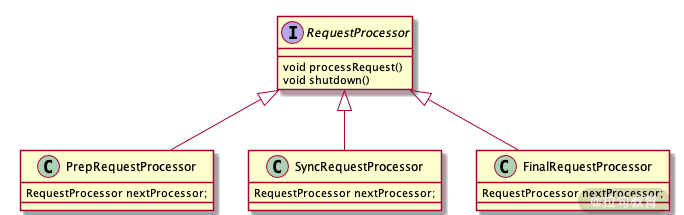


通过本课时的学习我们知道了 ZooKeeper 服务单机版启动的关键步骤，下面我们来思考这个问题：在我们启动单机版服务器的时候，如果 ZooKeeper 服务通过 zoo.cfg 配置文件的相关参数，利用 FileTxnSnapLog 类来实现相关数据的本地化存储。那么我们在日常的开发维护中，如何才能知道当前存储 ZooKeeper 相关数据的磁盘容量应该设置多大的空间才能满足当前业务的发展？如何才能尽量减少磁盘空间的浪费？

我们可以通过 DatadirCleanupManager 类来对历史文件进行清理以避免太多的历史数据占据磁盘空间造成不必要的浪费。


# 第08讲：集群模式：服务器如何从初始化到对外提供服务？


那什么是集群模式呢？集群模式可以简单理解为将单机系统复制成几份，部署在不同主机或网络节点上，最终构成了一个由多台计算机组成的系统“集群”。而组成集群中的每个服务器叫作集群中的网络节点。

那么你可能会产生一个问题：我们应该如何使用集群？当客户端发送一个请求到集群服务器的时候，究竟是哪个机器为我们提供服务呢？为了解决这个问题，我们先介绍一个概念名词“调度者”。调度者的工作职责就是在集群收到客户端请求后，根据当前集群中机器的使用情况，决定将此次客户端请求交给哪一台服务器或网络节点进行处理，例如我们都很熟悉的负载均衡服务器就是一种调度者的实现方式。

## 1、ZooKeeper 集群模式的特点

通过上面的介绍，我们知道了集群是由网络中不同机器组成的一个系统，集群工作是通过集群中调度者服务器来协同工作的。那么现在我们来看一下 ZooKeeper 中的集群模式，在 ZooKeeper 集群模式中，相比上面说到的集群架构方式，在 ZooKeeper 集群中将服务器分成 Leader 、Follow 、Observer 三种角色服务器，在集群运行期间这三种服务器所负责的工作各不相同：

- Leader 角色服务器负责管理集群中其他的服务器，是集群中工作的分配和调度者。
- Follow 服务器的主要工作是选举出 Leader 服务器，在发生 Leader 服务器选举的时候，系统会从 Follow 服务器之间根据多数投票原则，选举出一个 Follow 服务器作为新的 Leader 服务器。
- Observer 服务器则主要负责处理来自客户端的获取数据等请求，并不参与 Leader 服务器的选举操作，也不会作为候选者被选举为 Leader 服务器。

接下来我们看看在 ZooKeeper 中集群是如何架构和实现的。

## 2、底层实现原理

我们已经对 ZooKeeper 单机版服务的启动过程做了详细的介绍。而集群中的启动过程和单机版的启动过程有很多地方是一样的。所以本次我们只对 ZooKeeper 集群中的特有实现方式做重点介绍。

### 1、程序启动

首先，在 ZooKeeper 服务启动后，系统会调用入口 QuorumPeerMain 类中的 main 函数。在 main 函数中的 initializeAndRun 方法中根据 zoo.cfg 配置文件，判断服务启动方式是集群模式还是单机模式。在函数中首先根据 arg 参数和 config.isDistributed() 来判断，如果配置参数中配置了相关的配置项，并且已经指定了集群模式运行，那么在服务启动的时候就会跳转到 runFromConfig 函数完成之后的集群模式的初始化工作。


```java
protected void initializeAndRun(String[] args){
  ...
  if (args.length == 1 && config.isDistributed()) {
            runFromConfig(config);
        } else {
            
            ZooKeeperServerMain.main(args);
        }
}
```

### 2、QuorumPeer 类

在 ZooKeeper 服务的集群模式启动过程中，一个最主要的核心类是 QuorumPeer 类。我们可以将每个 QuorumPeer 类的实例看作集群中的一台服务器。在 ZooKeeper 集群模式的运行中，一个 QuorumPeer 类的实例通常具有 3 种状态，分别是参与 Leader 节点的选举、作为 Follow 节点同步 Leader 节点的数据，以及作为 Leader 节点管理集群中的 Follow 节点。

介绍完 QuorumPeer 类后，下面我们看一下在 ZooKeeper 服务的启动过程中，针对 QuorumPeer 类都做了哪些工作。如下面的代码所示，在一个 ZooKeeper 服务的启动过程中，首先调用 runFromConfig 函数将服务运行过程中需要的核心工具类注册到 QuorumPeer 实例中去。

这些核心工具就是我们在上一节课单机版服务的启动中介绍的诸如 FileTxnSnapLog 数据持久化类、ServerCnxnFactory 类 NIO 工厂方法等。这之后还需要配置服务器地址列表、Leader 选举算法、会话超时时间等参数到 QuorumPeer 实例中。

```java
public void runFromConfig(QuorumPeerConfig config){
  ServerCnxnFactory cnxnFactory = null;
  ServerCnxnFactory secureCnxnFactory = null;
  ...
  quorumPeer = getQuorumPeer()
  quorumPeer.setElectionType(config.getElectionAlg());
  quorumPeer.setCnxnFactory(cnxnFactory);
  ...
}
```

与开篇中提到的一般构建集群的方式不同，ZooKeeper 将集群中的机器分为 Leader 、 Follow 、Obervser 三种角色，每种角色服务器在集群中起到的作用都各不相同。比如 Leader 角色服务器主要负责处理客户端发送的数据变更等事务性请求操作，并管理协调集群中的 Follow 角色服务器。而 Follow 服务器则主要处理客户端的获取数据等非事务性请求操作。Observer 角色服务器的功能和 Follow 服务器相似，唯一的不同就是不参与 Leader 头节点服务器的选举工作。

在 ZooKeeper 中的这三种角色服务器，在服务启动过程中也有各自的不同，下面我们就以 Leader 角色服务器的启动和 Follow 服务器服务的启动过程来看一下各自的底层实现原理。

## 3、Leader 服务器启动过程

在 ZooKeeper 集群中，Leader 服务器负责管理集群中其他角色服务器，以及处理客户端的数据变更请求。因此，在整个 ZooKeeper 服务器中，Leader 服务器非常重要。所以在整个 ZooKeeper 集群启动过程中，首先要先选举出集群中的 Leader 服务器。

在 ZooKeeper 集群选举 Leader 节点的过程中，首先会根据服务器自身的服务器 ID（SID）、最新的 ZXID、和当前的服务器 epoch （currentEpoch）这三个参数来生成一个选举标准。之后，ZooKeeper 服务会根据 zoo.cfg 配置文件中的参数，选择参数文件中规定的 Leader 选举算法，进行 Leader 头节点的选举操作。而在 ZooKeeper 中提供了三种 Leader 选举算法，分别是 LeaderElection 、AuthFastLeaderElection、FastLeaderElection。在我们日常开发过程中，可以通过在 zoo.cfg 配置文件中使用 electionAlg 参数属性来制定具体要使用的算法类型。

这里我们只需要知道，在 ZooKeeper 集群模式下服务启动后。首先会创建用来选举 Leader 节点的工具类 QuorumCnxManager 。下面这段代码给出了 QuorumCnxManager 在创建实例的时候首先要实例化 Listener 对象用于监听 Leader 选举端口。

```java
package org.apache.zookeeper.server.quorum;
public class QuorumCnxManager {
...
  public QuorumCnxManager(QuorumPeer self) {
    String cnxToValue = System.getProperty("zookeeper.cnxTimeout")
    listener = new Listener();
    listener.setName("QuorumPeerListener");
  }
 ...
}
```

而在 ZooKeeper 中，Leader 选举的大概过程，总体说来就是在集群中的所有机器中直接进行一次选举投票，选举出一个最适合的机器作为 Leader 节点。而具体的评价标准就是我们上面提到的三种选举算法。而从 3.4.0 版本开始，ZooKeeper 只支持 FastLeaderElection 这一种选举算法。同时没有被选举为 Leader 节点的机器则作为 Follow 或 Observer 节点机器存在。

## 4、Follow 服务器启动过程

现在，我们已经选举出 ZooKeeper 集群模式下的 Leader 节点机器了。我们再看一下 Follow 节点机器在 ZooKeeper 集群模式下服务器的启动过程。

在服务器的启动过程中，Follow 机器的主要工作就是和 Leader 节点进行数据同步和交互。当 Leader 机器启动成功后，Follow 节点的机器会收到来自 Leader 节点的启动通知。而该通知则是通过 LearnerCnxAcceptor 类来实现的。该类就相当于一个接收器。专门用来接收来自集群中 Leader 节点的通知信息。下面这段代码中 LearnerCnxAcceptor 类首先初始化要监听的 Leader 服务器地址和设置收到监听的处理执行方法等操作 。


```java
class LearnerCnxAcceptor extends ZooKeeperCriticalThread {
    private volatile boolean stop = false;
    public LearnerCnxAcceptor() {
        super("LearnerCnxAcceptor-" + ss.getLocalSocketAddress(), zk
                .getZooKeeperServerListener());
    }
 }  
```

在接收到来自 Leader 服务器的通知后，Follow 服务器会创建一个 LearnerHandler 类的实例，用来处理与 Leader 服务器的数据同步等操作。

```java
package org.apache.zookeeper.server.quorum;
public class LearnerHandler extends ZooKeeperThread {
  protected final Socket sock;
  final Leader leader;
  ...
}
```

在完成数据同步后，一个 ZooKeeper 服务的集群模式下启动的关键步骤就完成了，整个服务就处于运行状态，可以对外提供服务了。


现在，我们思考这样一个问题。在我们日常使用 ZooKeeper 集群服务器的时候，集群中的机器个数应该如何选择？

答案是最好使用奇数原则，最小的集群配置应该是三个服务器或者节点。而如果采用偶数，在 Leader 节点选举投票的过程中就不满足大多数原则，这时就产生“脑裂”这个问题。请你多注意。


# 第09讲：创建会话：避开日常开发的那些“坑”


ZooKeeper 的工作方式一般是通过客户端向服务端发送请求而实现的。而在一个请求的发送过程中，首先，客户端要与服务端进行连接，而一个连接就是一个会话。在 ZooKeeper 中，一个会话可以看作是一个用于表示客户端与服务器端连接的数据结构 Session。而这个数据结构由三个部分组成：分别是会话 ID（sessionID）、会话超时时间（TimeOut）、会话关闭状态（isClosing）。下面我们来分别介绍一下这三个部分：

- 会话 ID：会话 ID 作为一个会话的标识符，当我们创建一次会话的时候，ZooKeeper 会自动为其分配一个唯一的 ID 编码。

- 会话超时时间：一般来说，一个会话的超时时间就是指一次会话从发起后到被服务器关闭的时长。而设置会话超时时间后，服务器会参考设置的超时时间，最终计算一个服务端自己的超时时间。而这个超时时间则是最终真正用于 ZooKeeper 中服务端用户会话管理的超时时间。

- 会话关闭状态：会话关闭 isClosing 状态属性字段表示一个会话是否已经关闭。如果服务器检查到一个会话已经因为超时等原因失效时， ZooKeeper 会在该会话的 isClosing 属性值标记为关闭，再之后就不对该会话进行操作了。

## 1、会话状态

通过上面的学习，我们知道了 ZooKeeper 中一次会话的内部结构。下面我们就从系统运行的角度去分析，一次会话从创建到关闭的生命周期中都经历了哪些阶段。

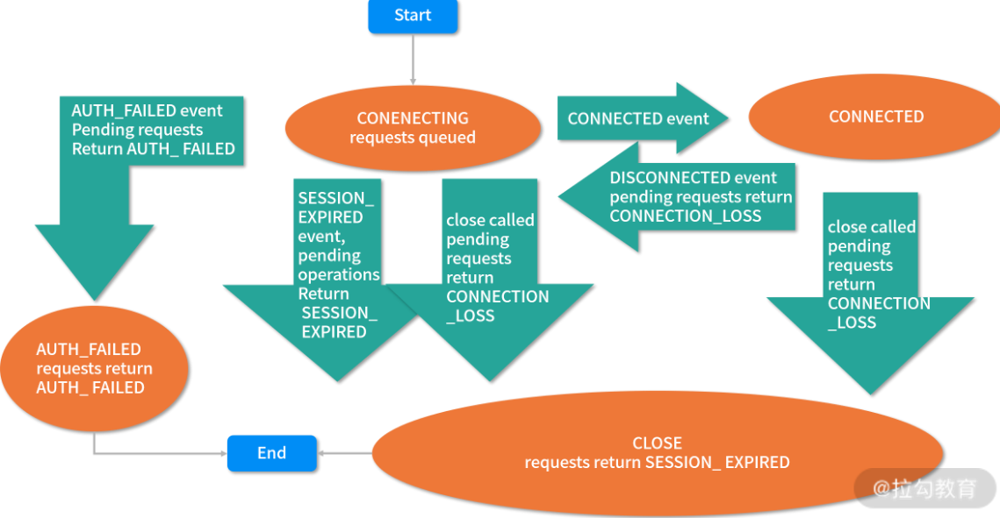

上面是来自 ZooKeeper 官网的一张图片。该图片详细完整地描述了一次会话的完整生命周期。而通过该图片我们可以知道，在 ZooKeeper 服务的运行过程中，会话会经历不同的状态变化。而这些状态包括：正在连接（CONNECTING）、已经连接（CONNECTIED）、正在重新连接（RECONNECTING）、已经重新连接（RECONNECTED）、会话关闭（CLOSE）等。

当客户端开始创建一个与服务端的会话操作时，它的会话状态就会变成 CONNECTING，之后客户端会根据服务器地址列表中的服务器 IP 地址分别尝试进行连接。如果遇到一个 IP 地址可以连接到服务器，那么客户端会话状态将变为 CONNECTIED。

而如果因为网络原因造成已经连接的客户端会话断开时，客户端会重新尝试连接服务端。而对应的客户端会话状态又变成 CONNECTING ，直到该会话连接到服务端最终又变成 CONNECTIED。

在 ZooKeeper 服务的整个运行过程中，会话状态经常会在 CONNECTING 与 CONNECTIED 之间进行切换。最后，当出现超时或者客户端主动退出程序等情况时，客户端会话状态则会变为 CLOSE 状态。

## 2、会话底层实现

一个会话可以看作是由四种不同的属性字段组成的一种数据结构。而在整个 ZooKeeper 服务的运行过程中，会话管理的本质就是围绕这个数据结构进行操作。

说到 ZooKeeper 中会话的底层实现，就不得不说 SessionTracker 类，该类可以说是 ZooKeeper 实现会话的核心类，用来实现会话管理和维护等相关操作。可以说，在 ZooKeeper 会话的整个生命周期中都离不开 SessionTracker 类的参与。

SessionTracker 是一个接口类型，其规定了 ZooKeeper 中会话管理的相关操作行为。而具体的实现方式则是通过 SessionTrackerImpl 类来完成的。

```java
class SessionTrackerImpl implements SessionTracker{
 ConcurrentHashMap<Long, SessionImpl> sessionsById；
 ConcurrentMap<Long, Integer> sessionsWithTimeout;
}
```

如上面的代码所示，SessionTrackerImpl 类实现了 SessionTracker 接口。在其中有两个属性字段，分别是：

- sessionsById，用于根据会话 ID 来管理具体的会话实体。
- sessionsWithTimeout，根据不同的会话 ID 管理每个会话的超时时间。

而在 SessionTrackerImpl 类初始化的时候，首先会调用 initializeNextSession 方法来生成一个会话 ID ，该会话 ID 会作为一个唯一的标识符，在 ZooKeeper 服务之后的运行中用来标记一个特定的会话。

```java
public static long initializeNextSession(long id) {
    long nextSid;
    nextSid = (Time.currentElapsedTime() << 24) >>> 8;
    nextSid =  nextSid | (id <<56);
    return nextSid;
 }
```


通过上面的代码，我们可以了解到生成会话 ID 的过程，首先以毫秒为单位获取系统的当前时间，之后将该值通过位运算方式向左移动 24 位，再向右移动 8 位。最后根据服务器的 SID 进行或运算，得到的最终结果就作为该会话的 ID 编码。

有了会话 ID 和超时时间等信息后，一个会话相关的所有数据就基本具备了，也就完成了一个会话的创建工作。接下来就是服务器接收到会话请求后的处理等操作了。

## 3、会话异常

在平时的开发工作中，我们最常遇到和处理的场景就是会话超时异常。在 ZooKeeper 中，会话的超时异常包括客户端 readtimeout 异常和服务器端 sessionTimeout 异常。在我们平时的开发中，要明确这两个异常的不同之处在于一个是发生在客户端，而另一个是发生在服务端。

而对于那些对 ZooKeeper 接触不深的开发人员来说，他们常常踩坑的地方在于，虽然设置了超时间，但是在实际服务运行的时候 ZooKeeper 并没有按照设置的超时时间来管理会话。

这是因为 ZooKeeper 实际起作用的超时时间是通过客户端和服务端协商决定。 ZooKeeper 客户端在和服务端建立连接的时候，会提交一个客户端设置的会话超时时间，而该超时时间会和服务端设置的最大超时时间和最小超时时间进行比对，如果正好在其允许的范围内，则采用客户端的超时时间管理会话。如果大于或者小于服务端设置的超时时间，则采用服务端设置的值管理会话。

下面我们看一下这个问题：ZooKeeper 生成会话 ID 编码的算法看起来比较复杂，那么这个算法是否严谨呢？

该算法实现上看起比较复杂，但是其实并不完美。其最主要的问题在于其算法的基础是通过Java 语言获取系统的当前时间作为算法的基本参数。而在一些情况下，在位运算的过程中会产生负数等问题，不过这个问题在 3.4.6 版本后得到了解决，这里请你注意，在使用 ZooKeeper 的时候，如果是在维护旧有系统时要考虑这个问题。


# 第10讲：ClientCnxn：客户端核心工作类工作原理解析

我们知道会话是在 ZooKeeper 的客户端发起的，而在会话超异常等事件发生时，服务端也会通知给客户端。而我们之所以能够接收到服务端的通知，并向服务端发送请求等操作，是通过 ZooKeeper 客户端实现的。下面我们就深入学习一下客户端核心工作类的实现过程和底层原理。

## 1、客户端核心类ClientCnxn

在 ZooKeeper 客户端的底层实现中，ClientCnxn 类是其核心类，所有的客户端操作都是围绕这个类进行的。ClientCnxn 类主要负责维护客户端与服务端的网络连接和信息交互。

在前面的课程中介绍过，向服务端发送创建数据节点或者添加 Watch 监控等操作时，都会先将请求信息封装成 Packet 对象。那么 Packet 是什么呢？其实 **Packet 可以看作是一个 ZooKeeper 定义的，用来进行网络通信的数据结构**，其主要作用是封装了网络通信协议层的数据。而 Packet 内部的数据结构如下图所示：

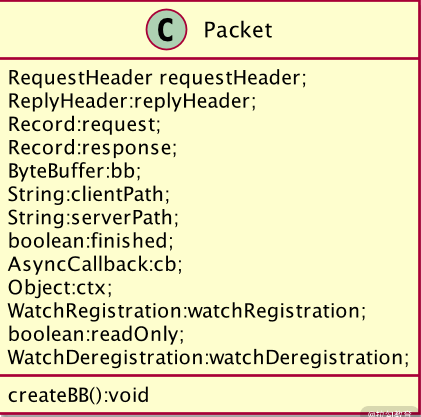

在 Packet 类中具有一些请求协议的相关属性字段，这些请求字段中分别包括：

- 请求头信息（RequestHeader）
- 响应头信息 （ReplyHeader）
- 请求信息体（Request）
- 响应信息体（Response）
- 节点路径（clientPath ServerPath）
- Watch 监控信息等

而在 Packet 类中有一个 createBB 方法函数，该函数的作用主要是将 Packet 对象的数据进行序列化，以便之后用于网络传输。具体过程如下面这段代码所示：

```java
public void createBB() {
 ByteArrayOutputStream baos = new ByteArrayOutputStream();
 BinaryOutputArchive boa = BinaryOutputArchive.getArchive(baos);
...
 if (requestHeader != null) {
     requestHeader.serialize(boa, "header");
 }
 if (request instanceof ConnectRequest) {
    request.serialize(boa, "connect");
    // append "am-I-allowed-to-be-readonly" flag
    boa.writeBool(readOnly, "readOnly");
 } else if (request != null) {
    request.serialize(boa, "request");
 }
 baos.close();
}
```


从代码中我们可以知道，在 createBB 进行序列化的时候，并不是将 Packet 类中的所有属性字段进行序列化。而是只对请求头信息（requestHeader）、请求体信息（request）、只读（readOnly）这三个属性字段进行序列化。而其余的属性字段则只是存储在客户端，用于之后的相关操作。

## 2、请求队列

在我们对请求信息进行封装和序列化后，ZooKeeper 不会立刻就将一个请求信息通过网络直接发送给服务端。而是通过将请求信息添加到队列中，之后通过 sendThread 线程类来处理相关的请求发送等操作。这种方式很像生产者和消费者模式，我们将请求信息准备好，并添加到队列中的操作相当于生成者，而 sendThread 线程从队列中取出要发送的请求信息，并发送给服务端相当于消费者操作。

而在 ZooKeeper 中，作为消费者的队列有两种，一种是客户端发送给服务端的发送队列 outgoingQueue 以及服务端响应客户端操作的响应队列 pendingQueue。如下面这段代码：

```java
 List<Packet> pendingQueue;//响应队列
 LinkedBlockingDeque<Packet> outgoingQueue;//发送队列
```

## 3、SendThread

下面我们再看一下 SendThread 的底层实现，SendThread 类是一个线程类，其本质是一个 I/O 调度线程，它的作用就是用来管理操作客户端和服务端的网络 I/O 等。在 ZooKeeper 服务的运行过程中，SendThread 类的作用除了上面提到的负责将客户端的请求发送给服务端外，另一个作用是发送客户端是否存活的心跳检查，SendThread 类负责定期向服务端发送 PING 包来实现心跳检查。

```java
private void sendPing() {
    lastPingSentNs = System.nanoTime();
    RequestHeader h = new RequestHeader(-2, OpCode.ping);
    queuePacket(h, null, null, null, null, null, null, null, null);
}
```

如上面的代码所示，SendThread 类中通过 sendPing 函数向 ZooKeeper 服务端发送心跳检查。而在 sendPing 函数的内部，首先以纳秒为单位获取系统当前时间 lastPingSentNs，之后设置请求头的操作类型为心跳检查操作 OpCode.ping，最后将请求信息封装成 Packet 对象发送给 ZooKeeper 服务端。

## 4、EventThread

SendThread 类的主要工作可以简单地理解为负责客户端向服务端发送请求等操作。而像我们之前学到的 Watch 监控机制，在事件触发后 ZooKeeper 服务端会发送通知给相关的客户端，那么在这个过程中，客户端是如何接收服务端的请求的呢？

ZooKeeper 是通过 EventThread 类来实现的，EventThread 类也是一个线程类，主要负责客户端的事件处理，比如在客户端接收 Watch 通知时，触发客户端的相关方法。在 EventThread 类中，如下面的代码所示，通过将要触发的事件对象存放在 waitingEvents 队列中，之后在接收到相应的事件通知时，会从该队列中取出对应的事件信息，之后调用 process 函数进行处理。

```java
class EventThread extends ZooKeeperThread {
  private final LinkedBlockingQueue<Object> waitingEvents
  ...
  process();
  ...
}
```

客户端核心类的工作原理，在客户端的底层实现中，ClientCnxn 类作为其最核心的实现类，当客户端要向服务端发送请求操作的时候，首先会将请求信息封装成 Packet 对象并加入请求队列中，之后通过 SendThread 网络 I/O 线将请求发送给服务端。

而在接收服务端响应时，客户端使用 EventThread 类处理接收响应事件以及触发客户端的回调方法。

这里留给你一道思考题：我们知道为了向服务端证明客户端是存活的，需要 ZooKeeper 客户端周期性的发送 Ping 操作给 ZooKeeper 服务端。而在 ZooKeeper 服务端收到 Ping 操作后，又做了什么操作呢？

答案是在 ZooKeeper 服务端收到 Ping 操作的请求时，会根据服务端的当前时间重置与客户端的 Session 时间，更新该会话的请求延迟时间等。进而保持客户端与服务端连接状态。


# 第11讲：分桶策略：如何实现高效的会话管理？


我们知道 ZooKeeper 作为分布式系统的核心组件，在一个分布式系统运行环境中经常要处理大量的会话请求，而 ZooKeeper 之所以能够快速响应客户端操作，这与它自身的会话管理策略密不可分。

## 1、会话管理策略

通过前面的学习，我们知道在 ZooKeeper 中为了保证一个会话的存活状态，客户端需要向服务器周期性地发送心跳信息。而客户端所发送的心跳信息可以是一个 ping 请求，也可以是一个普通的业务请求。ZooKeeper 服务端接收请求后，会更新会话的过期时间，来保证会话的存活状态。从中也能看出，在 ZooKeeper 的会话管理中，最主要的工作就是管理会话的过期时间。

ZooKeeper 中采用了独特的会话管理方式来管理会话的过期时间，网络上也给这种方式起了一个比较形象的名字：“分桶策略”。我将结合下图给你讲解“分桶策略”的原理。如下图所示，在 ZooKeeper 中，会话将按照不同的时间间隔进行划分，超时时间相近的会话将被放在同一个间隔区间中，这种方式避免了 ZooKeeper 对每一个会话进行检查，而是采用分批次的方式管理会话。这就降低了会话管理的难度，因为每次小批量的处理会话过期也提高了会话处理的效率。

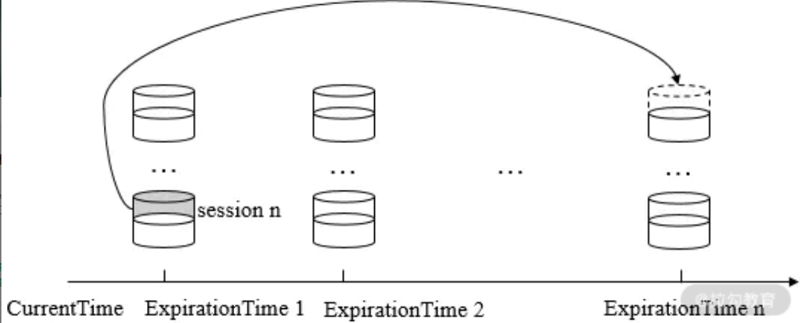

通过上面的介绍，我们对 ZooKeeper 中的会话管理策略有了一个比较形象的理解。而为了能够在日常开发中使用好 ZooKeeper，面对高并发的客户端请求能够开发出更加高效稳定的服务，根据服务器日志判断客户端与服务端的会话异常等。下面我们从技术角度去说明 ZooKeeper 会话管理的策略，进一步加强对会话管理的理解。

## 2、底层实现

说到 ZooKeeper 底层实现的原理，核心的一点就是过期队列这个数据结构。所有会话过期的相关操作都是围绕这个队列进行的。可以说 ZooKeeper 底层就是采用这个队列结构来管理会话过期的。

而在讲解会话过期队列之前，我们首先要知道什么是 bucket。简单来说，一个会话过期队列是由若干个 bucket 组成的。而 bucket 是一个按照时间划分的区间。在 ZooKeeper 中，通常以 expirationInterval 为单位进行时间区间的划分，它是 ZooKeeper 分桶策略中用于划分时间区间的最小单位。

在 ZooKeeper 中，一个过期队列由不同的 bucket 组成。每个 bucket 中存放了在某一时间内过期的会话。将会话按照不同的过期时间段分别维护到过期队列之后，在 ZooKeeper 服务运行的过程中，具体的执行过程如下图所示。首先，ZooKeeper 服务会开启一个线程专门用来检索过期队列，找出要过期的 bucket，而 ZooKeeper 每次只会让一个 bucket 的会话过期，每当要进行会话过期操作时，ZooKeeper 会唤醒一个处于休眠状态的线程进行会话过期操作，之后会按照上面介绍的操作检索过期队列，取出过期的会话后会执行过期操作。

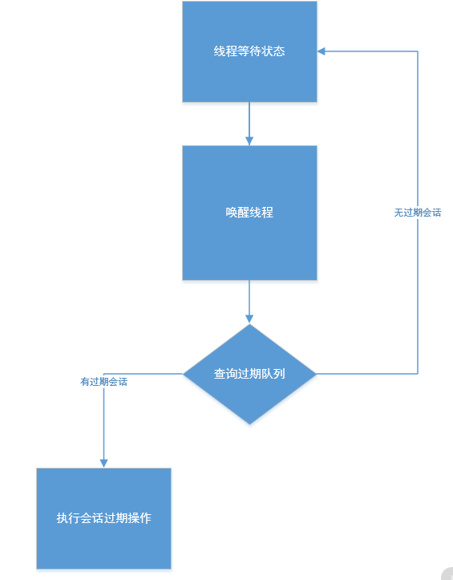

下面我们再来看一下 ZooKeeper 底层代码是如何实现会话过期队列的，在 ZooKeeper 底层中，使用 ExpiryQueue 类来实现一个会话过期策略。如下面的代码所示，在 ExpiryQueue 类中具有一个 elemMap 属性字段。它是一个线程安全的 HaspMap 列表，用来根据不同的过期时间区间存储会话。而 ExpiryQueue 类中也实现了诸如 remove 删除、update 更新以及 poll 等队列的常规操作方法。

```java
public class ExpiryQueue<E> {
    private final ConcurrentHashMap<E, Long> elemMap;
    public Long remove(E elem) {...}
    public Long update(E elem, int timeout) {...}
    public Set<E> poll() {...}
}
```

通过 ExpiryQueue 类实现一个用于管理 ZooKeeper 会话的过期队列之后，ZooKeeper 会将所有会话都加入 ExpiryQueue 列表中进行管理。接下来最主要的工作就是何时去检查该列表中的会话，并取出其中的过期会话进行操作了。一般来说，当一个会话即将过期时，就要对列表进行操作。而一个会话的过期时间 = 系统创建会话的时间 + 会话超时时间。而每个会话的创建时间又各不相同，ZooKeeper 服务没有时刻去监控每一个会话是否过期。而是通过 roundToNextInterval 函数将会话过期时间转化成心跳时间的整数倍，根据不同的过期时间段管理会话。

```java
private long roundToNextInterval(long time) {
        return (time / expirationInterval + 1) * expirationInterval;
}
```

如上面的代码所示，roundToNextInterval 函数的主要作用就是以向上取正的方式计算出每个会话的时间间隔，当会话的过期时间发生更新时，会根据函数计算的结果来决定它属于哪一个时间间隔。计算时间间隔公式是（time / ExpirationInterval + 1） ExpirationInterval，比如我们取 expirationInterval 的值为 2，会话的超时 time 为10，那么最终我们计算的 bucket 时间区间就是 12。

现在我们已经介绍了 ZooKeeper 会话管理的所有前期准备工作，当 ZooKeeper 服务进行会话超时检查的时候，会调用 SessionTrackerImpl 类专门负责此工作。在前面的课程中，我们介绍过 SessionTrackerImpl 是一个线程类。如下面的代码所示，在 run 方法中会首先获取会话过期的下一个时间点，之后通过 setSessionClosing 函数设置会话的关闭状态。最后调用 expire 方法进行会话清理工作。

```java
public void run() {
    try {
        while (running) {
            long waitTime = sessionExpiryQueue.getWaitTime();
            if (waitTime > 0) {
                Thread.sleep(waitTime);
                continue;
            }
            for (SessionImpl s : sessionExpiryQueue.poll()) {
                setSessionClosing(s.sessionId);
                expirer.expire(s);
            }
        }
 ...
}
```

接下来我们再深入到 expire 方法内部来看看 ZooKeeper 一次会话管理中的最后一步：会话的过期清理工作。 如下面的代码所示，在 expire 函数的内部，主要工作就是发起一次会话过期的请求操作。首先通过 close 函数向整个 ZooKeeper 服务器发起一次会话过期的请求操作。接收到请求后，ZooKeeper 就会执行诸如删除该会话的临时节点、发起 Watch 通知等操作。

```java
private void close(long sessionId) {
  Request si = new Request(null,sessionId,0,OpCode.closeSession, null, null);
    setLocalSessionFlag(si);
    submitRequest(si);
    }
```

在完成了上面的会话相关操作后， ZooKeeper 最终会将过期会话从 SessionTracker 中删除最后关闭该条会话的连接。

ZooKeeper 这种会话管理的好处，在实际生产中为什么它能提高服务的效率？

答案是 ZooKeeper 这种分段的会话管理策略大大提高了计算会话过期的效率，如果是在一个实际生产环境中，一个大型的分布式系统往往具有很高的访问量。而 ZooKeeper 作为其中的组件，对外提供服务往往要承担数千个客户端的访问，这其中就要对这几千个会话进行管理。在这种场景下，要想通过对每一个会话进行管理和检查并不合适，所以采用将同一个时间段的会话进行统一管理，这样就大大提高了服务的运行效率。

# 第12讲：服务端是如何处理一次会话请求的？

当客户端需要和 ZooKeeper 服务端进行相互协调通信时，首先要建立该客户端与服务端的连接会话，在会话成功创建后，ZooKeeper 服务端就可以接收来自客户端的请求操作了。

ZooKeeper 服务端在处理一次客户端发起的会话请求时，所采用的处理过程很像是一条工厂中的流水生产线。比如在一个毛绒玩具加工厂中，一条生产线上的工人可能只负责给玩具上色这一个具体的工作。

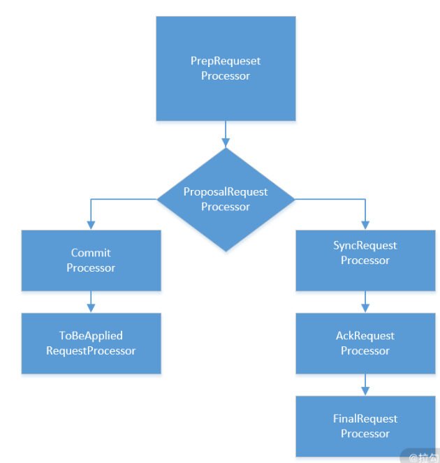

ZooKeeper 处理会话请求的方式也像是一条流水线，在这条流水线上，主要参与工作的是三个“工人”，分别是 PrepRequestProcessor 、ProposalRequestProcessor 以及 FinalRequestProcessor。这三个“工人”会协同工作，最终完成一次会话的处理工作，而它的实现方式就是我们之前提到的责任链模式。

下面我将分别对这三个部分进行讲解：作为第一个处理会话请求的“工人”，PrepRequestProcessor 类主要负责请求处理的准备工作，比如判断请求是否是事务性相关的请求操作。在 PrepRequestProcessor 完成工作后，ProposalRequestProcessor 类承接接下来的工作，对会话请求是否执行询问 ZooKeeper 服务中的所有服务器之后，执行相关的会话请求操作，变更 ZooKeeper 数据库数据。最后所有请求就会走到 FinalRequestProcessor 类中完成踢出重复会话的操作。


通过上面的介绍，我们对 ZooKeeper 服务端在处理一次会话请求的方法过程会有比较具体的了解。接下来我们再从底层实现的角度分析一下在代码层面的实现中，ZooKeeper 有哪些值得我们注意和学习的地方。

## 1、请求预处理器PrepRequestProcessor

在 ZooKeeper 服务端，第一个负责处理请求会话的类是 PrepRequestProcessor。它是 ZooKeeper 责任链处理模式上的第一个处理器。PrepRequestProcessor 实现了 RequestProcessor 接口，并继承了线程类 Thread，说明其可以通过多线程的方式调用。在 PrepRequestProcessor 类内部有一个 RequestProcessor 类型的 nextProcessor 属性字段，从名称上就可以看出该属性字段的作用是指向下一个处理器。

```java
public class PrepRequestProcessor extends Thread implements RequestProcessor {
  RequestProcessor nextProcessor;
}
```

PrepRequestProcessor 类的主要作用是分辨要处理的请求是否是事务性请求，比如创建节点、更新数据、删除节点、创建会话等，这些请求操作都是事务性请求，在执行成功后会对服务器上的数据造成影响。当 PrepRequestProcessor 类收到请求后，如果判断出该条请求操作是事务性请求，就会针对该条请求创建请求事务头、事务体、会话检查、ACL 检查和版本检查等一系列的预处理工作。如下面的代码所示，上述所有操作的逻辑都是在 PrepRequestProcessor 类中的 pRequest 函数实现的。

```java
protected void pRequest(Request request) throws RequestProcessorException {
 switch (request.type) {
    case OpCode.create:
     CreateRequest createRequest = new CreateRequest();
     pRequest2Txn(request.type, zks.getNextZxid(), request,createRequest, true);
     break;
    case OpCode.delete:
 }
}
```

在 pRequest 函数的内部，首先根据 OpCode.create 等字段值来判断请求操作的类型是否是事务操作，如果是事务操作，就调用 pRequest2Txn 函数进行预处理，这之后将该条请求交给 nextProcessor 字段指向的处理器进行处理。

## 2、事物处理器ProposalRequestProcessor

PrepRequestProcessor 预处理器执行完工作后，就轮到 ProposalRequestProcessor 事物处理器上场了，ProposalRequestProcessor 是继 PrepRequestProcessor 后，责任链模式上的第二个处理器。其主要作用就是对事务性的请求操作进行处理，而从 PrepRequestProcessor 处理器的名字中就能大概猜出，其具体的工作就是“提议”。所谓的“提议”是说，当处理一个事务性请求的时候，ZooKeeper 首先会在服务端发起一次投票流程，该投票的主要作用就是通知 ZooKeeper 服务端的各个机器进行事务性的操作了，避免因为某个机器出现问题而造成事物不一致等问题。在 ProposalRequestProcessor 处理器阶段，其内部又分成了三个子流程，分别是：Sync 流程、Proposal 流程、Commit 流程，下面我将分别对这几个流程进行讲解。


### 1、Sync流程SyncRequestProcess

首先我们看一下 Sync 流程，该流程的底层实现类是 SyncRequestProcess 类。SyncRequestProces 类的作用就是在处理事务性请求时，ZooKeeper 服务中的每台机器都将该条请求的操作日志记录下来，完成这个操作后，每一台机器都会向 ZooKeeper 服务中的 Leader 机器发送事物日志记录完成的通知。

### 2、Proposal 流程

在处理事务性请求的过程中，ZooKeeper 需要取得在集群中过半数机器的投票，只有在这种情况下才能真正地将数据改变。而 Proposal 流程的主要工作就是投票和统计投票结果。投票的方式大体上遵循多数原则，更详细的内容在之后的课程中会展开讲解。

### 3、Commit 流程CommitProcessor

请你注意，在完成 Proposal 流程后，ZooKeeper 服务器上的数据不会进行任何改变，成功通过 Proposal 流程只是说明 ZooKeeper 服务可以执行事务性的请求操作了，而要真正执行具体数据变更，需要在 Commit 流程中实现，这种实现方式很像是 MySQL 等数据库的操作方式。在 Commit 流程中，它的主要作用就是完成请求的执行。其底层实现是通过 CommitProcessor 实现的。如下面的代码所示，CommitProcessor 类的内部有一个 LinkedList 类型的 queuedRequests 队列，queuedRequests 队列的作用是，当 CommitProcessor 收到请求后，并不会立刻对该条请求进行处理，而是将其放在 queuedRequests 队列中。

```java
class CommitProcessor {
  LinkedList queuedRequests
}
```

之后再调用 commit 方法取出 queuedRequests 队列中等待的请求进行处理，如下面的代码所示：

```java
synchronized public void commit(Request request) {
  committedRequests.add(request);
  notifyAll();
}
```
到目前为止，我们就对 ProposalRequestProcessor 处理器的三个流程做了一个大体介绍

## 3、最终处理器FinalRequestProcessor

在经过了上面一系列的处理过程后，请求最终会到达责任链上的最后一个处理器：FinalRequestProcessor。该处理器的作用是检查请求的有效性。而所谓的有效性就是指当前 ZooKeeper 服务所处理的请求是否已经处理过了，如果处理过了，FinalRequestProcessor 处理器就会将该条请求删除；如果不这样操作，就会重复处理会话请求，这样就造成不必要的资源浪费。


# 第13讲：Curator：如何降低 ZooKeeper 使用的复杂性？

日常可以提高开发 ZooKeeper 服务效率和质量的开源框架 Curator 。

## 1、什么是 Curator

首先我们来介绍一下什么是 Curator，Curator 是一套开源的，Java 语言编程的 ZooKeeper 客户端框架，Curator 把我们平时常用的很多 ZooKeeper 服务开发功能做了封装，例如 Leader 选举、分布式计数器、分布式锁。这就减少了技术人员在使用 ZooKeeper 时的大部分底层细节开发工作。在会话重新连接、Watch 反复注册、多种异常处理等使用场景中，用原生的 ZooKeeper 实现起来就比较复杂。而在使用 Curator 时，由于其对这些功能都做了高度的封装，使用起来更加简单，不但减少了开发时间，而且增强了程序的可靠性。


如果想在我们开发的工程中使用 Curator 框架，首先要引入相关的开发包。这里我们以 Maven 工程为例，如下面的代码所示，我们通过将 Curator 相关的引用包配置到 Maven 工程的 pom 文件中，将 Curaotr 框架引用到工程项目里，在配置文件中分别引用了两个 Curator 相关的包，第一个是 curator-framework 包，该包是对 ZooKeeper 底层 API 的一些封装。另一个是 curator-recipes 包，该包封装了一些 ZooKeeper 服务的高级特性，如：Cache 事件监听、选举、分布式锁、分布式 Barrier。

```xml
<dependency>
 <groupId>org.apache.curator</groupId>
 <artifactId>curator-framework</artifactId>
 <version>2.12.0</version>
</dependency>
<dependency>
 <groupId>org.apache.curator</groupId>
 <artifactId>curator-recipes</artifactId>
 <version>2.12.0</version>
</dependency>
```


部署好工程的开发环境后，接下来我们就可以利用 Curator 开发 ZooKeeper 服务了。首先，我们先看一下 Curator 框架提供的 API 编码风格。Curator 的编码采用“Fluent Style”流式，而所谓的流式编码风格在 Scala 等编程语言中也广泛被采用。如下面的代码所示，流式编程风格与传统的编码方式有很大不同，传统的代码风格会尽量把功能拆分成不同的函数，并分行书写。而流式编程功能函数则是按照逻辑的先后顺序，采用调用的方式，从而在代码书写上更加连贯，逻辑衔接也更加清晰。

下面这段代码的作用就是创建一个“/my/path”路径的节点到 ZooKeeper 服务端，之后将 myData 变量的数据作为该节点的数据。

client.create().forPath("/my/path", myData)

## 2、会话创建

了解了 Curator 的编码风格和函数的调用规则后。我们来创建一个会话。

通过前几节课的学习，我们知道一个 ZooKeeper 服务中，客户端与服务端要想相互通信，完成特定的功能，首先要做的就是创建一个会话连接。那么如何利用 Curator 来创建一个会话连接呢？我们来看下面的这段代码：

```java
RetryPolicy retryPolicy = new ExponentialBackoffRetry(1000, 3);
CuratorFramework client = CuratorFrameworkFactory.builder()
                .connectString("192.168.128.129:2181")
                .sessionTimeoutMs(5000)  // 会话超时时间
                .connectionTimeoutMs(5000) // 连接超时时间
                .retryPolicy(retryPolicy)
                .namespace("base") // 包含隔离名称
                .build();
client.start();
```

这段代码的编码风格采用了流式方式，最核心的类是 CuratorFramework 类，该类的作用是定义一个 ZooKeeper 客户端对象，并在之后的上下文中使用。在定义 CuratorFramework 对象实例的时候，我们使用了 CuratorFrameworkFactory 工厂方法，并指定了 connectionString 服务器地址列表、retryPolicy 重试策略 、sessionTimeoutMs 会话超时时间、connectionTimeoutMs 会话创建超时时间。下面我们分别对这几个参数进行讲解：

- connectionString：服务器地址列表，服务器地址列表参数的格式是 host1:port1,host2:port2。在指定服务器地址列表的时候可以是一个地址，也可以是多个地址。如果是多个地址，那么每个服务器地址列表用逗号分隔。

- retryPolicy：重试策略，当客户端异常退出或者与服务端失去连接的时候，可以通过设置客户端重新连接 ZooKeeper 服务端。而 Curator 提供了 一次重试、多次重试等不同种类的实现方式。在 Curator 内部，可以通过判断服务器返回的 keeperException 的状态代码来判断是否进行重试处理，如果返回的是 OK 表示一切操作都没有问题，而 SYSTEMERROR 表示系统或服务端错误。

- 超时时间：在 Curator 客户端创建过程中，有两个超时时间的设置。这也是平时你容易混淆的地方。一个是 sessionTimeoutMs 会话超时时间，用来设置该条会话在 ZooKeeper 服务端的失效时间。另一个是 connectionTimeoutMs 客户端创建会话的超时时间，用来限制客户端发起一个会话连接到接收 ZooKeeper 服务端应答的时间。sessionTimeoutMs 作用在服务端，而 connectionTimeoutMs 作用在客户端，请你在平时的开发中多注意。

在完成了客户端的创建和实例后，接下来我们就来看一看如何使用 Curator 对节点进行创建、删除、更新等基础操作。

## 3、创建节点

创建节点的方式如下面的代码所示，回顾我们之前课程中讲到的内容，描述一个节点要包括节点的类型，即临时节点还是持久节点、节点的数据信息、节点是否是有序节点等属性和性质。

client.create().withMode(CreateMode.EPHEMERAL).forPath("path","init".getBytes());

在 Curator 中，使用 create 函数创建数据节点，并通过 withMode 函数指定节点是临时节点还是持久节点，之后调用 forPath 函数来指定节点的路径和数据信息。

## 4、更新节点

说完了节点的创建，接下来我们再看一下节点的更新操作，如下面的代码所示，我们通过客户端实例的 setData() 方法更新 ZooKeeper 服务上的数据节点，在setData 方法的后边，通过 forPath 函数来指定更新的数据节点路径以及要更新的数据。


client.setData().forPath("path","data".getBytes());

## 5、删除节点

如果我们想删除 ZooKeeper 服务器上的节点，可以使用 Curator 中的 client.delete()。如下面的代码所示，在流式调用中有几个功能函数：


client.delete().guaranteed().deletingChildrenIfNeeded().withVersion(10086).forPath("path");
下面我将为你分别讲解这几个函数的功能：

- guaranteed：该函数的功能如字面意思一样，主要起到一个保障删除成功的作用，其底层工作方式是：只要该客户端的会话有效，就会在后台持续发起删除请求，直到该数据节点在 ZooKeeper 服务端被删除。

- deletingChildrenIfNeeded：指定了该函数后，系统在删除该数据节点的时候会以递归的方式直接删除其子节点，以及子节点的子节点。

- withVersion：该函数的作用是指定要删除的数据节点版本。

- forPath：该函数的作用是指定要删除的数据节点的路径，也就是我们要删除的节点。

## 6、高级应用

在上面的工程部署中，我们提到使用 Curator 需要引用两个包，而其中的 curator-recipes 包如它的名字一样，即“Curator 菜谱”，它提供了很多丰富的功能，很多高级特性都是在这个包中实现的。

### 1、异常处理

无论使用什么开发语言和框架，程序都会出现错误与异常等情况，而 ZooKeeper 服务使客户端与服务端通过网络进行通信的方式协同工作，由于网络不稳定和不可靠等原因，使得网络中断或高延迟异常情况出现得更加频繁，所以处理好异常是决定 ZooKeeper 服务质量的关键。

在 Curator 中，客户端与服务端建立会话连接后会一直监控该连接的运行情况。在底层实现中通过ConnectionStateListener 来监控会话的连接状态，当连接状态改变的时候，根据参数设置 ZooKeeper 服务会采取不同的处理方式，而一个会话基本有六种状态，下面我来为你详细讲解这六种状态的作用：

- CONNECTED（已连接状态）：当客户端发起的会话成功连接到服务端后，该条会话的状态变为 CONNECTED 已连接状态。

- READONLY（只读状态）：当一个客户端会话调用CuratorFrameworkFactory.Builder.canBeReadOnly() 的时候，该会话会一直处于只读模式，直到重新设置该条会话的状态类型。

- SUSPENDED（会话连接挂起状态）：当进行 Leader 选举和 lock 锁等操作时，需要先挂起客户端的连接。注意这里的会话挂起并不等于关闭会话，也不会触发诸如删除临时节点等操作。

- RECONNECTED（重新连接状态）：当已经与服务端成功连接的客户端断开后，尝试再次连接服务端后，该条会话的状态为 RECONNECTED，也就是重新连接。重新连接的会话会作为一条新会话在服务端运行，之前的临时节点等信息不会被保留。

- LOST（会话丢失状态）：这个比较好理解，当客户端与服务器端因为异常或超时，导致会话关闭时，该条会话的状态就变为 LOST。

在这里，我们以 Curator 捕捉到的会话关闭后重新发起的与服务器端的连接为例，介绍 Curator 是如何进行处理的。

首先，要想处理一个会话关闭的异常，必须要捕获这条异常事件。如下面的代码所示，我们创建了一个 sessionConnectionListener 类，用来监听事件的异常关闭操作。该类实现了 ConnectionStateListener 接口，这个接口是 Curator 的内部接口，负责监控会话的状态变化。当会话状态发生改变时，系统就会调用 stateChanged 函数，我们可以在 stateChanged 函数中编写会话状态的处理逻辑，这里我设置了当会话改变的时候，客户端会一直尝试连接服务端直到接连成功。


```java
class sessionConnectionListener implements ConnectionStateListener {
  public void stateChanged(CuratorFramework curatorFramework, ConnectionState connectionState){
  while(true){
  ...
    reConnectZKServer(..);
  }
  }
}
```

总体来说，使用 Curator 处理会话异常非常简单，只要实现 ConnectionStateListener 接口并在对应的状态变更函数中实现自己的处理逻辑即可。

### 2、Leader 选举

除了异常处理，接下来我们再介绍一个在日常工作中经常要解决的问题，即开发 ZooKeeper 集群的相关功能。

在分布式环境中，ZooKeeper 集群起到了关键作用。在之前的课程中我们讲过，Leader 选举是保证 ZooKeeper 集群可用性的解决方案，可以避免在集群使用中出现单点失效等问题。在 ZooKeeper 服务开始运行的时候，首先会选举出 Leader 节点服务器，之后在服务运行过程中，Leader 节点服务器失效时，又会重新在集群中进行 Leader 节点的选举操作。

而在日常开发中，使用 ZooKeeper 原生的 API 开发 Leader 选举相关的功能相对比较复杂。Curator 框架中的 recipe 包为我们提供了高效的，方便易用的工具函数，分别是 LeaderSelector 和 LeaderLatch。

LeaderSelector 函数的功能是选举 ZooKeeper 中的 Leader 服务器，其具体实现如下面的代码所示，通过构造函数的方式实例化。在一个构造方法中，第一个参数为会话的客户端实例 CuratorFramework，第二个参数是 LeaderSelectorListener 对象，它是在被选举成 Leader 服务器的事件触发时执行的回调函数。


public LeaderSelector(CuratorFramework client, String mutexPath,LeaderSelectorListener listener)

第二个工具函数是 LeaderLatch，它也是实现 Leader 服务器功能的函数。与 LeaderSelector 函数不同的是，LeaderLatch 函数将 ZooKeeper 服务中的所有机器都作为 Leader 候选机器，在服务运行期间，集群中的机器轮流作为 Leader 机器参与集群工作。具体方式如下面的代码所示：

public LeaderLatch(CuratorFramework client, String latchPath)

LeaderLatch 方法也是通过构造函数的方式实现 LeaderLatch 实例对象，并传入会话客户端对象 CuratorFramework，而构造函数的第二个参数 latchPath 是一个字符类型字段。在服务启动后， 调用了 LeaderLatch 的客户端会和其他使用相同 latch path 的服务器交涉，然后选择其中一个作为 Leader 服务器。

Curator 是一个功能丰富的框架，除了上述功能外，还可以实现诸如分布式锁、分布式计数器、分布式队列等功能。本课时主要起到引导作用，希望你在这节课的基础上进一步学习相关的技术知识，在日常开发中多使用 Curator 提高代码的开发效率和工程服务的质量。


> 模块三：高级篇

# 第14讲：Leader 选举：如何保证分布式数据的一致性？


可以这样认为，Leader 选举是一个过程，在这个过程中 ZooKeeper 主要做了两个重要工作，一个是数据同步，另一个是选举出新的 Leader 服务器。今天我们主要先介绍第一个工作，ZooKeeper 集群中的数据同步问题。

## 1、Leader 的协调过程

在分布式系统中有一个著名的 CAP 定理，是说一个分布式系统不能同时满足一致性、可用性，以及分区容错性。今天我们要讲的就是一致性。其实 ZooKeeper 中实现的一致性也不是强一致性，即集群中各个服务器上的数据每时每刻都是保持一致的特性。在 ZooKeeper 中，采用的是最终一致的特性，即经过一段时间后，ZooKeeper 集群服务器上的数据最终保持一致的特性。

在 ZooKeeper 集群中，Leader 服务器主要负责处理事物性的请求，而在接收到一个客户端的事务性请求操作时，Leader 服务器会先向集群中的各个机器针对该条会话发起投票询问。

要想实现 ZooKeeper 集群中的最终一致性，我们先要确定什么情况下会对 ZooKeeper 集群服务产生不一致的情况。

在集群初始化启动的时候，首先要同步集群中各个服务器上的数据。而在集群中 Leader 服务器崩溃时，需要选举出新的 Leader 而在这一过程中会导致各个服务器上数据的不一致，所以当选举出新的 Leader 服务器后需要进行数据的同步操作。


与上面介绍的一样，我们的底层实现讲解主要围绕 ZooKeeper 集群中数据一致性的底层实现。ZooKeeper 在集群中采用的是多数原则方式，即当一个事务性的请求导致服务器上的数据发生改变时，ZooKeeper 只要保证集群上的多数机器的数据都正确变更了，就可以保证系统数据的一致性。 这是因为在一个 ZooKeeper 集群中，每一个 Follower 服务器都可以看作是 Leader 服务器的数据副本，需要保证集群中大多数机器数据是一致的，这样在集群中出现个别机器故障的时候，ZooKeeper 集群依然能够保证稳定运行。

在 ZooKeeper 集群服务的运行过程中，数据同步的过程如下图所示。当执行完数据变更的会话请求时，需要对集群中的服务器进行数据同步。

leader发起事务性投票--->投票通过--->执行事务性请求--->进行数据一致性操作


## 2、广播模式

ZooKeeper 在代码层的实现中定义了一个 HashSet 类型的变量，用来管理在集群中的 Follower 服务器，之后调用getForwardingFollowers 函数获取在集群中的 Follower 服务器，如下面这段代码所示：

```java
public class Leader(){
 HashSet<LearnerHandler> forwardingFollowers;
 public List<LearnerHandler> getForwardingFollowers() {
   synchronized (forwardingFollowers) {
       return new ArrayList<LearnerHandler>(forwardingFollowers);
 }
}
```

在 ZooKeeper 集群服务器对一个事物性的请求操作进行投票并通过后，Leader 服务器执行
isQuorumSynced 方法判断该 ZooKeeper 集群中的 Follower 节点的连接状态，由于 isQuorumSynced 方法可以被多个线程进行调用，所以在进行操作的时候要通过forwardingFollowers 字段进行加锁操作。之后遍历集群中的 Follower 服务器，根据服务器 zxid、以及数据同步状态等条件判断服务器的执行逻辑是否成功。之后统计 Follower 服务器的 sid 并返回。

```java
public boolean isQuorumSynced(QuorumVerifier qv) {
  synchronized (forwardingFollowers) {
   for (LearnerHandler learnerHandler: forwardingFollowers){
       if(learnerHandler.synced()){
         ids.add(learnerHandler.getSid());
       }
   }
  }
}
```

通过上面的介绍，Leader 服务器在集群中已经完成确定 Follower 服务器状态等同步数据前的准备工作，接下来 Leader 服务器会通过 request.setTxn 方法向集群中的 Follower 服务器发送数据变更的会话请求。这个过程中，我们可以把 Leader 服务器看作是 ZooKeeper 服务中的客户端，而其向集群中 Follower 服务器发送数据更新请求，集群中的 Follower 服务器收到请求后会处理该会话，之后进行数据变更操作。如下面的代码所示，在底层实现中，通过调用 request 请求对象的 setTxn 方法向 Follower 服务器发送请求，在 setTxn 函数中我们传入的参数有操作类型字段 CONFIG_NODE，表明该操作是数据同步操作。


request.setTxn(new SetDataTxn(ZooDefs.CONFIG_NODE, request.qv.toString().getBytes(), -1));    
## 3、恢复模式

介绍完 Leader 节点如何管理 Follower 服务器进行数据同步后，接下来我们看一下当 Leader 服务器崩溃后 ZooKeeper 集群又是如何进行数据的恢复和同步的。

在前面的课程中我们介绍过，当 ZooKeeper 集群中一个 Leader 服务器失效时，会重新在 Follower 服务器中选举出一个新的服务器作为 Leader 服务器。而 ZooKeeper 服务往往处在高并发的使用场景中，如果在这个过程中有新的事务性请求操作，应该如何处理呢？ 由于此时集群中不存在 Leader 服务器了，理论上 ZooKeeper 会直接丢失该条请求，会话不进行处理，但是这样做在实际的生产中显然是不行的，那么 ZooKeeper 具体是怎么做的呢？

在 ZooKeeper 中，重新选举 Leader 服务器会经历一段时间，因此理论上在 ZooKeeper 集群中会短暂的没有 Leader 服务器，在这种情况下接收到事务性请求操作的时候，ZooKeeper 服务会先将这个会话进行挂起操作，挂起的会话不会计算会话的超时时间，之后在 Leader 服务器产生后系统会同步执行这些会话操作。

到这里我们就对 ZooKeeper 中数据一致性的解决原理和底层实现都做了较为详细的介绍。我们总结一下，ZooKeeper 集群在处理一致性问题的时候基本采用了两种方式来协调集群中的服务器工作，分别是恢复模式和广播模式。

- 恢复模式：当 ZooKeeper 集群中的 Leader 服务器崩溃后，ZooKeeper 集群就采用恢复模式的方式进行工作，在这个工程中，ZooKeeper 集群会首先进行 Leader 节点服务器的重新选择，之后在选举出 Leader 服务器后对系统中所有的服务器进行数据同步进而保证集群中服务器上的数据的一致性。

- 广播模式：当 ZooKeeper 集群中具有 Leader 服务器，并且可以正常工作时，集群中又有新的 Follower 服务器加入 ZooKeeper 中参与工作，这种情况常常发生在系统性能到达瓶颈，进而对系统进行动态扩容的使用场景。在这种情况下，如果不做任何操作，那么新加入的服务器作为 Follower 服务器，其上的数据与 ZooKeeper 集群中其他服务器上的数据不一致。当有新的查询会话请求发送到 ZooKeeper 集群进行处理，而恰巧该请求实际被分发给这台新加入的 Follower 机器进行处理，就会导致明明在集群中存在的数据，在这台服务器上却查询不到，导致数据查询不一致的情况。因此，在当有新的 Follower 服务器加入 ZooKeeper 集群中的时候，该台服务器会在`恢复模式下启动`，并找到集群中的 Leader 节点服务器，并同该 Leader 服务器进行数据同步。

## 4、LearnerHandler

介绍完 ZooKeeper 集群中数据同步的理论方法，我们再来分析一下在代码层面是如何实现的。记得在前面的课程中，我们提到过一个 LearnerHandler 类， 当时我们只是简单地从服务器之间的通信和协同工作的角度去分析了该类的作用。而 LearnerHandler 类其实可以看作是所有 Learner 服务器内部工作的处理者，它所负责的工作有：进行 Follower、Observer 服务器与 Leader 服务器的数据同步、事务性会话请求的转发以及 Proposal 提议投票等功能。

LearnerHandler 是一个多线程的类，在 ZooKeeper 集群服务运行过程中，一个 Follower 或 Observer 服务器就对应一个 LearnerHandler 。在集群服务器彼此协调工作的过程中，Leader 服务器会与每一个 Learner 服务器维持一个长连接，并启动一个单独的 LearnerHandler 线程进行处理。

如下面的代码所示，在 LearnerHandler 线程类中，最核心的方法就是 run 方法，处理数据同步等功能都在该方法中进行调用。首先通过 syncFollower 函数判断数据同步的方式是否是快照方式。如果是快照方式，就将 Leader 服务器上的数据操作日志 dump 出来发送给 Follower 等服务器，在 Follower 等服务器接收到数据操作日志后，在本地执行该日志，最终完成数据的同步操作。

```java
public void run() {
  boolean needSnap = syncFollower(peerLastZxid, leader.zk.getZKDatabase(), leader);
  if(needSnap){
    leader.zk.getZKDatabase().serializeSnapshot(oa);
    oa.writeString("BenWasHere", "signature");
    bufferedOutput.flush();
  }
}
```

通过操作日志的方式进行数据同步或备份的操作已经是行业中普遍采用的方式，比如我们都熟悉的 MySQL 、Redis 等数据库也是采用操作日志的方式。


请你注意，在本课时的介绍中，为了更好地讲解 Leader 服务器在管理集群服务器中数据一致性的作用，我介绍了当集群中 Leader 服务器崩溃时，如何处理事务性会话请求的过程。现在我们知道了在这种情况下，ZooKeeper 会把事务性请求会话挂起，暂时不进行操作。可能有些同学会产生这样的问题：如果会话挂起过多，会不会对系统产生压力，当 Leader 服务器产生后，一下子要处理大量的会话请求，这样不会造成服务器高负荷吗？

这里请你放心，Leader 选举的过程非常快速，在这期间不会造成大量事务性请求的会话操作积压，并不会对集群性能产生大的影响。


# 第15讲：ZooKeeper 究竟是怎么选中 Leader 的？


Leader 服务器的作用是管理 ZooKeeper 集群中的其他服务器。因此，如果是单独一台服务器，不构成集群规模。在 ZooKeeper 服务的运行中不会选举 Leader 服务器，也不会作为 Leader 服务器运行。在前面的课程中我们介绍过，一个 ZooKeeper 服务要想满足集群方式运行，至少需要三台服务器。

Leader 服务器的选举操作主要发生在两种情况下。第一种就是 ZooKeeper 集群服务启动的时候，第二种就是在 ZooKeeper 集群中旧的 Leader 服务器失效时，这时 ZooKeeper 集群需要选举出新的 Leader 服务器。

## 1、服务启动时的 Leader 选举

我们先来介绍在 ZooKeeper 集群服务最初启动的时候，Leader 服务器是如何选举的。在 ZooKeeper 集群启动时，需要在集群中的服务器之间确定一台 Leader 服务器。当 ZooKeeper 集群中的三台服务器启动之后，首先会进行通信检查，如果集群中的服务器之间能够进行通信。集群中的三台机器开始尝试寻找集群中的 Leader 服务器并进行数据同步等操作。如果这时没有搜索到 Leader 服务器，说明集群中不存在 Leader 服务器。这时 ZooKeeper 集群开始发起 Leader 服务器选举。在整个 ZooKeeper 集群中 Leader 选举主要可以分为三大步骤分别是：发起投票、接收投票、统计投票。

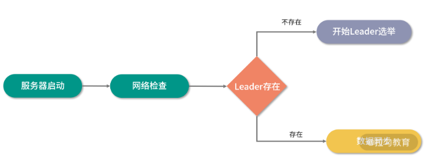

### 1、发起投票

我们先来看一下发起投票的流程，在 ZooKeeper 服务器集群初始化启动的时候，集群中的每一台服务器都会将自己作为 Leader 服务器进行投票。也就是每次投票时，发送的服务器的 myid（服务器标识符）和 ZXID (集群投票信息标识符)等选票信息字段都指向本机服务器。 而一个投票信息就是通过这两个字段组成的。以集群中三个服务器 Serverhost1、Serverhost2、Serverhost3 为例，三个服务器的投票内容分别是：Severhost1 的投票是（1，0）、Serverhost2 服务器的投票是（2，0）、Serverhost3 服务器的投票是（3，0）。

### 2、接收投票

集群中各个服务器在发起投票的同时，也通过网络接收来自集群中其他服务器的投票信息。

在接收到网络中的投票信息后，服务器内部首先会判断该条投票信息的有效性。检查该条投票信息的时效性，是否是本轮最新的投票，并检查该条投票信息是否是处于 LOOKING 状态的服务器发出的。

### 3、统计投票

在接收到投票后，ZooKeeper 集群就该处理和统计投票结果了。对于每条接收到的投票信息，集群中的每一台服务器都会将自己的投票信息与其接收到的 ZooKeeper 集群中的其他投票信息进行对比。主要进行对比的内容是 ZXID，ZXID 数值比较大的投票信息优先作为 Leader 服务器。如果每个投票信息中的 ZXID 相同，就会接着比对投票信息中的 myid 信息字段，选举出 myid 较大的服务器作为 Leader 服务器。

拿上面列举的三个服务器组成的集群例子来说，对于 Serverhost1，服务器的投票信息是（1，0），该服务器接收到的 Serverhost2 服务器的投票信息是（2，0）。在 ZooKeeper 集群服务运行的过程中，首先会对比 ZXID，发现结果相同之后，对比 myid，发现 Serverhost2 服务器的 myid 比较大，于是更新自己的投票信息为（2，0），并重新向 ZooKeeper 集群中的服务器发送新的投票信息。而 Serverhost2 服务器则保留自身的投票信息，并重新向 ZooKeeper 集群服务器中发送投票信息。

而当每轮投票过后，ZooKeeper 服务都会统计集群中服务器的投票结果，判断是否有过半数的机器投出一样的信息。如果存在过半数投票信息指向的服务器，那么该台服务器就被选举为 Leader 服务器。比如上面我们举的例子中，ZooKeeper 集群会选举 Severhost2 服务器作为 Leader 服务器。


当 ZooKeeper 集群选举出 Leader 服务器后，ZooKeeper 集群中的服务器就开始更新自己的角色信息，除被选举成 Leader 的服务器之外，其他集群中的服务器角色变更为 Following。

## 2、服务运行时的 Leader 选举

上面我们介绍了 ZooKeeper 集群启动时 Leader 服务器的选举方法。接下来我们再看一下在 ZooKeeper 集群服务的运行过程中，Leader 服务器是如果进行选举的。

在 ZooKeeper 集群服务的运行过程中，Leader 服务器作为处理事物性请求以及管理其他角色服务器，在 ZooKeeper 集群中起到关键的作用。在前面的课程中我们提到过，当 ZooKeeper 集群中的 Leader 服务器发生崩溃时，集群会暂停处理事务性的会话请求，直到 ZooKeeper 集群中选举出新的 Leader 服务器。而整个 ZooKeeper 集群在重新选举 Leader 时也经过了四个过程，分别是变更服务器状态、发起投票、接收投票、统计投票。其中，与初始化启动时 Leader 服务器的选举过程相比，变更状态和发起投票这两个阶段的实现是不同的。下面我们来分别看看这两个阶段。

### 1、变更状态

与上面介绍的 ZooKeeper 集群服务器初始化阶段不同。在 ZooKeeper 集群服务运行的过程中，集群中每台服务器的角色已经确定了，当 Leader 服务器崩溃后 ，ZooKeeper 集群中的其他服务器会首先将自身的状态信息变为 LOOKING 状态，该状态表示服务器已经做好选举新 Leader 服务器的准备了，这之后整个 ZooKeeper 集群开始进入选举新的 Leader 服务器过程。

### 2、发起投票

ZooKeeper 集群重新选举 Leader 服务器的过程中发起投票的过程与初始化启动时发起投票的过程基本相同。首先每个集群中的服务器都会投票给自己，将投票信息中的 Zxid 和 myid 分别指向本机服务器。

## 3、底层实现QuorumCnxManager

到目前为止，我们已经对 ZooKeeper 集群中 Leader 服务器的选举过程做了详细的介绍。接下来我们再深入 ZooKeeper 底层，来看一下底层实现的关键步骤。

之前我们介绍过，ZooKeeper 中实现的选举算法有三种，而在目前的 ZooKeeper 3.6 版本后，只支持 “快速选举” 这一种算法。而在代码层面的实现中，QuorumCnxManager 作为核心的实现类，用来管理 Leader 服务器与 Follow 服务器的 TCP 通信，以及消息的接收与发送等功能。在 QuorumCnxManager 中，主要定义了 ConcurrentHashMap<Long, SendWorker> 类型的 senderWorkerMap 数据字段，用来管理每一个通信的服务器。

```java
public class QuorumCnxManager {
  final ConcurrentHashMap<Long, SendWorker> senderWorkerMap;
final ConcurrentHashMap<Long, ArrayBlockingQueue<ByteBuffer>> queueSendMap;
final ConcurrentHashMap<Long, ByteBuffer> lastMessageSent;
}
```

而在 QuorumCnxManager 类的内部，定义了 RecvWorker 内部类。该类继承了一个 ZooKeeperThread 类的多线程类。主要负责消息接收。在 ZooKeeper 的实现中，为每一个集群中的通信服务器都分配一个 RecvWorker，负责接收来自其他服务器发送的信息。在 RecvWorker 的 run 函数中，不断通过 queueSendMap 队列读取信息。

```java
class RecvWorker extends ZooKeeperThread {
  Long sid;
  Socket sock;
  volatile boolean running = true;
  DataInputStream din;
  final SendWorker sw;
  public void run() {
  threadCnt.incrementAndGet();
  while (running && !shutdown && sock != null) {
    int length = din.readInt();
    if (length <= 0 || length > PACKETMAXSIZE) {
        throw new IOException(
                "Received packet with invalid packet: "
                        + length);
    }
    
    byte[] msgArray = new byte[length];
    din.readFully(msgArray, 0, length);
    ByteBuffer message = ByteBuffer.wrap(msgArray);
    addToRecvQueue(new Message(message.duplicate(), sid));
  }
  
  }
}
```

除了接收信息的功能外，QuorumCnxManager 内还定义了一个 SendWorker 内部类用来向集群中的其他服务器发送投票信息。如下面的代码所示。在 SendWorker 类中，不会立刻将投票信息发送到 ZooKeeper 集群中，而是将投票信息首先插入到 pollSendQueue 队列，之后通过 send 函数进行发送。

```java
class SendWorker extends ZooKeeperThread {
  Long sid;
  Socket sock;
  RecvWorker recvWorker;
  volatile boolean running = true;
  DataOutputStream dout;
  public void run() {
    while (running && !shutdown && sock != null) {
    ByteBuffer b = null;
    try {
        ArrayBlockingQueue<ByteBuffer> bq = queueSendMap
                .get(sid);
        if (bq != null) {
            b = pollSendQueue(bq, 1000, TimeUnit.MILLISECONDS);
        } else {
            LOG.error("No queue of incoming messages for " +
                      "server " + sid);
            break;
        }
        if(b != null){
            lastMessageSent.put(sid, b);
            send(b);
        }
    } catch (InterruptedException e) {
        LOG.warn("Interrupted while waiting for message on queue",
                e);
    }
}
  }
}
```

实现了投票信息的发送与接收后，接下来我们就来看看如何处理投票结果。在 ZooKeeper 的底层，是通过 FastLeaderElection 类实现的。如下面的代码所示，在 FastLeaderElection 的内部，定义了最大通信间隔 maxNotificationInterval、服务器等待时间 finalizeWait 等属性配置。

```java
public class FastLeaderElection implements Election {
  final static int maxNotificationInterval = 60000;
  final static int IGNOREVALUE = -1
  QuorumCnxManager manager;
}
```

在 ZooKeeper 底层通过 getVote 函数来设置本机的投票内容，如下图面的代码所示，在 getVote 中通过 proposedLeader 服务器信息、proposedZxid 服务器 ZXID、proposedEpoch 投票轮次等信息封装投票信息。

```java
synchronized public Vote getVote(){
    return new Vote(proposedLeader, proposedZxid, proposedEpoch);
 }
```

在完成投票信息的封装以及投票信息的接收和发送后。一个 ZooKeeper 集群中，Leader 服务器选举底层实现的关键步骤就已经介绍完了。 Leader 节点的底层实现过程的逻辑相对来说比较简单，基本分为封装投票信息、发送投票、接收投票等。


在这个过程中我们思考一个问题，那就是之前崩溃的 Leader 服务器是否会参与本次投票，以及是否能被重新选举为 Leader 服务器。这主要取决于在选举过程中旧的 Leader 服务器的运行状态。如果该服务器可以正常运行且可以和集群中其他服务器通信，那么该服务器也会参与新的 Leader 服务器的选举，在满足条件的情况下该台服务器也会再次被选举为新的 Leader 服务器。

# 第16讲：ZooKeeper 集群中 Leader 与 Follower 的数据同步策略


## 1、为什么要进行同步

接着上面介绍的内容，在我们介绍 ZooKeeper 集群数据同步之前，先要清楚为什么要进行数据同步。在 ZooKeeper 集群服务运行过程中，主要负责处理发送到 ZooKeeper 集群服务端的客户端会话请求。这些客户端的会话请求基本可以分为事务性的会话请求和非事务性的会话请求，而这两种会话的本质区别在于，执行会话请求后，ZooKeeper 集群服务器状态是否发生改变。

事物性会话请求最常用的操作类型有节点的创建、删除、更新等操作。而查询数据节点等会话请求操作就是非事务性的，因为查询不会造成 ZooKeeper 集群中服务器上数据状态的变更 。

我们之前介绍过，分布式环境下经常会出现 CAP 定义中的一致性问题。比如当一个 ZooKeeper 集群服务器中，Leader 节点处理了一个节点的创建会话操作后，该 Leader 服务器上就新增了一个数据节点。而如果不在 ZooKeeper 集群中进行数据同步，那么其他服务器上的数据则保持旧有的状态，新增加的节点在服务器上不存在。当 ZooKeeper 集群收到来自客户端的查询请求时，会出现该数据节点查询不到的情况，这就是典型的集群中服务器数据不一致的情况。为了避免这种情况的发生，在进行事务性请求的操作后，ZooKeeper 集群中的服务器要进行数据同步，而主要的数据同步是从 Learnning 服务器同步 Leader 服务器上的数据。

## 2、同步方法

在介绍了 ZooKeeper 集群服务器的同步作用后，接下来我们再学习一下 ZooKeeper 集群中数据同步的方法。我们主要通过三个方面来讲解 ZooKeeper 集群中的同步方法，分别是同步条件、同步过程、同步后的处理。

### 1、同步条件

同步条件是指在 ZooKeeper 集群中何时触发数据同步的机制。与上一课时中 Leader 选举首先要判断集群中 Leader 服务器是否存在不同，要想进行集群中的数据同步，首先需要 ZooKeeper 集群中存在用来进行数据同步的 Learning 服务器。 也就是说，当 ZooKeeper 集群中选举出 Leader 节点后，除了被选举为 Leader 的服务器，其他服务器都作为 Learnning 服务器，并向 Leader 服务器注册。之后系统就进入到数据同步的过程中。

### 2、同步过程

在数据同步的过程中，ZooKeeper 集群的主要工作就是将那些没有在 Learnning 服务器上执行过的事务性请求同步到 Learning 服务器上。这里请你注意，事务性的会话请求会被同步，而像数据节点的查询等非事务性请求则不在数据同步的操作范围内。 而在具体实现数据同步的时候，ZooKeeper 集群又提供四种同步方式，如下图所示：


#### 1、DIFF 同步

DIFF 同步即差异化同步的方式，在 ZooKeeper 集群中，Leader 服务器探测到 Learnning 服务器的存在后，首先会向该 Learnning 服务器发送一个 DIFF 不同指令。在收到该条指令后，Learnning 服务器会进行差异化方式的数据同步操作。在这个过程中，Leader 服务器会将一些 Proposal 发送给 Learnning 服务器。之后 Learnning 服务器在接收到来自 Leader 服务器的 commit 命令后执行数据持久化的操作。

#### 2、TRUNC+DIFF 同步

TRUNC+DIFF 同步代表先回滚再执行差异化的同步，这种方式一般发生在 Learnning 服务器上存在一条事务性的操作日志，但在集群中的 Leader 服务器上并不存在的情况 。发生这种情况的原因可能是 Leader 服务器已经将事务记录到本地事务日志中，但没有成功发起 Proposal 流程。当这种问题产生的时候，ZooKeeper 集群会首先进行回滚操作，在 Learning 服务器上的数据回滚到与 Leader 服务器上的数据一致的状态后，再进行 DIFF 方式的数据同步操作。

#### 3、TRUNC 同步

TRUNC 同步是指仅回滚操作，就是将 Learnning 服务器上的操作日志数据回滚到与 Leader 服务器上的操作日志数据一致的状态下。之后并不进行 DIFF 方式的数据同步操作。

#### 4、SNAP 同步

SNAP 同步的意思是全量同步，是将 Leader 服务器内存中的数据全部同步给 Learnning 服务器。在进行全量同步的过程中，Leader 服务器首先会向 ZooKeeper 集群中的 Learning 服务器发送一个 SNAP 命令，在接收到 SNAP 命令后， ZooKeeper 集群中的 Learning 服务器开始进行全量同步的操作。随后，Leader 服务器会从内存数据库中获取到全量数据节点和会话超时时间记录器，将他们序列化后传输给 Learnning 服务器。Learnning 服务器接收到该全量数据后，会对其反序列化后载入到内存数据库中。

### 3、同步后的处理

数据同步的本质就是比对 Leader 服务器与 Learning 服务器，将 Leader 服务器上的数据增加到 Learnning 服务器，再将 Learnning 服务器上多余的事物日志回滚。前面的介绍已经完成了数据的对比与传递操作，接下来就在 Learning 服务器上执行接收到的事物日志，进行本地化的操作。


到现在为止，我们已经学习了 ZooKeeper 集群中数据同步的方法，下面我们深入到代码层面来看一下 ZooKeeper 的底层是如何实现的。首先我们来看看 Learnning 服务器是如何接收和判断同步方式的。如下面的代码所示，ZooKeeper 底层实现了一个 Learner 类，该类可以看作是集群中 Learnning 服务器的实例对象，与集群中的 Learning 服务器是一一对应的。


public class Learner {}

而在 Learner 类的内部，主要通过 syncWithLeader 函数来处理来自 Leader 服务器的命令。在接收到来自 Leader 服务器的命令后，通过 qp.getType() 方法判断数据同步的方式。

```java
protected void syncWithLeader(long newLeaderZxid) throws Exception{
 if (qp.getType() == Leader.DIFF) {
    snapshotNeeded = false;
  }else if (qp.getType() == Leader.TRUNC) {

  }
}
```

在确定了数据同步的方式后，再调用 packetsCommitted.add(qp.getZxid()) 方法将事物操作同步到处理队列中，之后调用事物操作线程进行处理。

```java
if (pif.hdr.getZxid() == qp.getZxid() && qp.getType() == Leader.COMMITANDACTIVATE) {
    QuorumVerifier qv = self.configFromString(new String(((SetDataTxn) pif.rec).getData()));
    boolean majorChange = self.processReconfig(qv, ByteBuffer.wrap(qp.getData()).getLong(),
            qp.getZxid(), true);
    if (majorChange) {
        throw new Exception("changes proposed in reconfig");
    }
}
if (!writeToTxnLog) {
    if (pif.hdr.getZxid() != qp.getZxid()) {
        LOG.warn("Committing " + qp.getZxid() + ", but next proposal is " + pif.hdr.getZxid());
    } else {
        zk.processTxn(pif.hdr, pif.rec);
        packetsNotCommitted.remove();
    }
} else {
    packetsCommitted.add(qp.getZxid());
```

而在 ZooKeeper 集群数据同步的过程中，一般采用四种同步方式，这里我们要注意的是 TRUNC+DIFF 这种同步方式，我们上面讲到过，这种同步方式是先回滚数据再同步数据。而回滚到的状态可以看作是删除在 Leader 服务器上不存在的事务性操作记录。


# 第17讲：集群中 Leader 的作用：事务的请求处理与调度分析

探究 Leader 服务器在 ZooKeeper 中的作用，即处理事务性的会话请求以及管理 ZooKeeper 集群中的其他角色服务器。而在接收到来自客户端的事务性会话请求后，ZooKeeper 集群内部又是如何判断会话的请求类型，以及转发处理事务性请求的呢？带着这些问题我们继续本节课的学习。

## 1、事务性请求处理

在 ZooKeeper 集群接收到来自客户端的会话请求操作后，首先会判断该条请求是否是事务性的会话请求。对于事务性的会话请求，ZooKeeper 集群服务端会将该请求统一转发给 Leader 服务器进行操作。通过前面我们讲过的，Leader 服务器内部执行该条事务性的会话请求后，再将数据同步给其他角色服务器，从而保证事务性会话请求的执行顺序，进而保证整个 ZooKeeper 集群的数据一致性。

在 ZooKeeper 集群的内部实现中，是通过什么方法保证所有 ZooKeeper 集群接收到的事务性会话请求都能交给 Leader 服务器进行处理的呢？下面我们就带着这个问题继续学习。

在 ZooKeeper 集群内部，集群中除 Leader 服务器外的其他角色服务器接收到来自客户端的事务性会话请求后，必须将该条会话请求转发给 Leader 服务器进行处理。 ZooKeeper 集群中的 Follow 和 Observer 服务器，都会检查当前接收到的会话请求是否是事务性的请求，如果是事务性的请求，那么就将该请求以 REQUEST 消息类型转发给 Leader 服务器。

在 ZooKeeper集群中的服务器接收到该条消息后，会对该条消息进行解析。分析出该条消息所包含的原始客户端会话请求。之后将该条消息提交到自己的 Leader 服务器请求处理链中，开始进行事务性的会话请求操作。如果不是事务性请求，ZooKeeper 集群则交由 Follow 和 Observer 角色服务器处理该条会话请求，如查询数据节点信息。

## 2、Leader 事务处理分析

上面我们介绍了 ZooKeeper 集群在处理事务性会话请求时的内部原理。接下来我们就以客户端发起的创建节点请求 setData 为例，具体看看 ZooKeeper 集群的底层处理过程。

在 ZooKeeper 集群接收到来自客户端的一个 setData 会话请求后，其内部的处理逻辑基本可以分成四个部分。如下图所示，分别是预处理阶段、事务处理阶段、事务执行阶段、响应客户端。


### 1、预处理阶段

在预处理阶段，主要工作是通过网络 I/O 接收来自客户端的会话请求。判断该条会话请求的类型是否是事务性的会话请求，之后将该请求提交给PrepRequestProcessor 处理器进行处理。封装请求事务头并检查会话是否过期，最后反序列化事务请求信息创建 setDataRequest 请求，在 setDataRequest 记录中包含了要创建数据的节点的路径、数据节点的内容信息以及数据节点的版本信息。最后将该请求存放在 outstandingChanges 队列中等待之后的处理。


### 2、事务处理阶段

在事务处理阶段，ZooKeeper 集群内部会将该条会话请求提交给 ProposalRequestProcessor 处理器进行处理。本阶段内部又分为提交、同步、统计三个步骤。其具体的处理过程我们在之前的课程中已经介绍过了，这里不再赘述。

### 3、事务执行阶段

在经过预处理阶段和事务会话的投票发起等操作后，一个事务性的会话请求都已经准备好了，接下来就是在 ZooKeeper 的数据库中执行该条会话的数据变更操作。

在处理数据变更的过程中，ZooKeeper 内部会将该请求会话的事务头和事务体信息直接交给内存数据库 ZKDatabase 进行事务性的持久化操作。之后返回 ProcessTxnResult 对象表明操作结果是否成功。


### 4、响应客户端：

在 ZooKeeper 集群处理完客户端 setData 方法发送的数据节点创建请求后，会将处理结果发送给客户端。而在响应客户端的过程中，ZooKeeper 内部首先会创建一个 setDataResponse 响应体类型，该对象主要包括当前会话请求所创建的数据节点，以及其最新状态字段信息 stat。之后创建请求响应头信息，响应头作为客户端请求响应的重要信息，客户端在接收到 ZooKeeper 集群的响应后，通过解析响应头信息中的事务 ZXID 和请求结果标识符 err 来判断该条会话请求是否成功执行。


## 3、事务处理底层实现

介绍完 ZooKeeper 集群处理事务性会话请求的理论方法和内部过程后。接下来我们从代码层面来进一步分析 ZooKeeper 在处理事务性请求时的底层核心代码实现。

首先，ZooKeeper 集群在收到客户端发送的事务性会话请求后，会对该请求进行预处理。在代码层面，ZooKeeper 通过调用 PrepRequestProcessor 类来实现预处理阶段的全部逻辑。可以这样理解：在处理客户端会话请求的时候，首先调用的就是 PrepRequestProcessor 类。而在 PrepRequestProcessor 内部，是通过 pRequest 方法判断客户端发送的会话请求类型。如果是诸如 setData 数据节点创建等事务性的会话请求，就调用 pRequest2Txn 方法进一步处理。

```java
protected void pRequest(Request request){
...
  switch (request.type) {
  case OpCode.setData:
    SetDataRequest setDataRequest = new SetDataRequest();                
    pRequest2Txn(request.type, zks.getNextZxid(), request, setDataRequest, true);
    break;
   }
}
```

而在 pRequest2Txn 方法的内部，就实现了预处理阶段的主要逻辑。如下面的代码所示，首先通过 checkSession 方法检查该条会话请求是否有效（比如会话是否过期等），之后调用 checkACL 检查发起会话操作的客户端在 ZooKeeper 服务端是否具有相关操作的权限。最后将该条会话创建的相关信息，诸如 path 节点路径、data 节点数据信息、version 节点版本信息等字段封装成
setDataRequest 类型并传入到 setTxn 方法中，最后加入处理链中进行处理。

```java
case OpCode.setData:
    zks.sessionTracker.checkSession(request.sessionId, request.getOwner());
    SetDataRequest setDataRequest = (SetDataRequest)record;
    if(deserialize)
        ByteBufferInputStream.byteBuffer2Record(request.request, setDataRequest);
    path = setDataRequest.getPath();
    validatePath(path, request.sessionId);
    nodeRecord = getRecordForPath(path);
    checkACL(zks, request.cnxn, nodeRecord.acl, ZooDefs.Perms.WRITE, request.authInfo, path, null);
    int newVersion = checkAndIncVersion(nodeRecord.stat.getVersion(), setDataRequest.getVersion(), path);
    request.setTxn(new SetDataTxn(path, setDataRequest.getData(), newVersion));
    nodeRecord = nodeRecord.duplicate(request.getHdr().getZxid());
    nodeRecord.stat.setVersion(newVersion);
    addChangeRecord(nodeRecord);
```


在本课时中，我们主要学习了 ZooKeeper 集群中 Leader 服务器是如何处理事务性的会话请求的，并且在处理完事务性的会话请求后，是如何通知其他角色服务器进行同步操作的。

可以说在 ZooKeeper 集群处理事务性的请过程中，Follow 和 Observer 服务器主要负责接收客户端的会话请求，并转发给 Leader 服务器。而真正处理该条会话请求的是 Leader 服务器。

这就会引发一个问题：当一个业务场景在查询操作多而创建删除等事务性操作少的情况下，ZooKeeper 集群的性能表现的就会很好。而如果是在极端情况下，ZooKeeper 集群只有事务性的会话请求而没有查询操作，那么 Follow 和 Observer 服务器就只能充当一个请求转发服务器的角色， 所有的会话的处理压力都在 Leader 服务器。在处理性能上整个集群服务器的瓶颈取决于 Leader 服务器的性能。ZooKeeper 集群的作用只能保证在 Leader 节点崩溃的时候，重新选举出 Leader 服务器保证系统的稳定性。这也是 ZooKeeper 设计的一个缺点。


# 第18讲：集群中 Follow 的作用：非事务请求的处理与 Leader 的选举分析


## 1、非事务性请求处理过程

在 ZooKeeper 集群接收到来自客户端的请求后，会首先判断该会话请求的类型，如是否是事务性请求。所谓事务性请求，是指 ZooKeeper 服务器执行完该条会话请求后，是否会导致执行该条会话请求的服务器的数据或状态发生改变，进而导致与其他集群中的服务器出现数据不一致的情况。

这里我们以客户端发起的数据节点查询请求为例，分析一下 ZooKeeper 在处理非事务性请求时的实现过程。

当 ZooKeeper 集群接收到来自客户端发送的查询会话请求后，会将该客户端请求分配给 Follow 服务器进行处理。而在 Follow 服务器的内部，也采用了责任链的处理模式来处理来自客户端的每一个会话请求。

在第 12 课时中，我们学习了 Leader 服务器的处理链过程，分别包含预处理器阶段、Proposal 提交处理器阶段以及 final 处理器阶段。与 Leader 处理流程不同的是，在 Follow 角色服务器的处理链执行过程中，FollowerRequestProcessor 作为第一个处理器，主要负责筛选该条会话请求是否是事务性的会话请求。如果是事务性的会话请求，则转发给 Leader 服务器进行操作。如果不是事务性的会话请求，则交由 Follow 服务器处理链上的下一个处理器进行处理。

而下一个处理器是 CommitProcessor ，该处理器的作用是对来自集群中其他服务器的事务性请求和本地服务器的提交请求操作进行匹配。匹配的方式是，将本地执行的 sumbit 提交请求，与集群中其他服务器接收到的 Commit 会话请求进行匹配，匹配完成后再交由 Follow 处理链上的下一个处理器进行处理。最终，当一个客户端会话经过 Final 处理器操作后，就完成了整个 Follow 服务器的会话处理过程，并将结果响应给客户端。

## 2、底层实现

简单介绍完 ZooKeeper 集群中 Follow 服务器在处理非事务性请求的过程后，接下来我们再从代码层面分析一下底层的逻辑实现是怎样的。

从代码实现的角度讲，ZooKeeper 集群在接收到来自客户端的请求后，会将请求交给 Follow 服务器进行处理。而 Follow 服务器内部首先调用的是 FollowerZooKeeperServer 类，该类的作用是封装 Follow 服务器的属性和行为，你可以把该类当作一台 Follow 服务器的代码抽象。

如下图所示，该 FollowerZooKeeperServer 类继承了 LearnerZooKeeperServer 。在一个 FollowerZooKeeperServer 类内部，定义了一个核心的 ConcurrentLinkedQueue 类型的队列字段，用于存放接收到的会话请求。

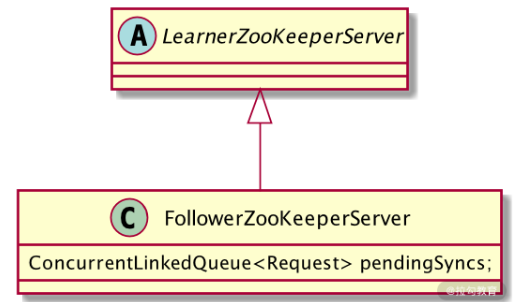

在定义了 FollowerZooKeeperServer 类之后，在该类的 setupRequestProcessors 函数中，定义了我们之前一直反复提到的处理责任链，指定了该处理链上的各个处理器。如下面的代码所示，分别按顺序定义了起始处理器 FollowerRequestProcessor 、提交处理器 CommitProcessor、同步处理器 SendAckRequestProcessor 以及最终处理器 FinalProcessor。

```java

protected void setupRequestProcessors() {
    RequestProcessor finalProcessor = new FinalRequestProcessor(this);
    commitProcessor = new CommitProcessor(finalProcessor,
            Long.toString(getServerId()), true, getZooKeeperServerListener());
    commitProcessor.start();
    firstProcessor = new FollowerRequestProcessor(this, commitProcessor);
    ((FollowerRequestProcessor) firstProcessor).start();
    syncProcessor = new SyncRequestProcessor(this,
            new SendAckRequestProcessor((Learner)getFollower()));
    syncProcessor.start();
```

## 3、选举过程

介绍完 Follow 服务器处理非事务性请求的过程后，接下来我们再学习一下 Follow 服务器的另一个主要的功能：在 Leader 服务器崩溃的时候，重新选举出 Leader 服务器。

ZooKeeper 集群重新选举 Leader 的过程本质上只有 Follow 服务器参与工作。而在 ZooKeeper 集群重新选举 Leader 节点的过程中，如下图所示。主要可以分为 Leader 失效发现、重新选举 Leader 、Follow 服务器角色变更、集群同步这几个步骤。

### 1、Leader 失效发现

通过之前的介绍我们知道，在 ZooKeeper 集群中，当 Leader 服务器失效时，ZooKeeper 集群会重新选举出新的 Leader 服务器。也就是说，Leader 服务器的失效会触发 ZooKeeper 开始新 Leader 服务器的选举，那么在 ZooKeeper 集群中，又是如何发现 Leader 服务器失效的呢？

这里就要介绍到 Leader 失效发现。和我们之前介绍的保持客户端活跃性的方法，它是通过客户端定期向服务器发送 Ping 请求来实现的。在 ZooKeeper 集群中，探测 Leader 服务器是否存活的方式与保持客户端活跃性的方法非常相似。首先，Follow 服务器会定期向 Leader 服务器发送网络请求，在接收到请求后，Leader 服务器会返回响应数据包给 Follow 服务器，而在 Follow 服务器接收到 Leader 服务器的响应后，如果判断 Leader 服务器运行正常，则继续进行数据同步和服务转发等工作，反之，则进行 Leader 服务器的重新选举操作。

### 2、Leader 重新选举

当 Follow 服务器向 Leader 服务器发送状态请求包后，如果没有得到 Leader 服务器的返回信息，这时，如果是集群中个别的 Follow 服务器发现返回错误，并不会导致 ZooKeeper 集群立刻重新选举 Leader 服务器，而是将该 Follow 服务器的状态变更为 LOOKING 状态，并向网络中发起投票，当 ZooKeeper 集群中有更多的机器发起投票，最后当投票结果满足多数原则的情况下。ZooKeeper 会重新选举出 Leader 服务器。

### 3、Follow 角色变更

在 ZooKeeper 集群中，Follow 服务器作为 Leader 服务器的候选者，当被选举为 Leader 服务器之后，其在 ZooKeeper 集群中的 Follow 角色，也随之发生改变。也就是要转变为 Leader 服务器，并作为 ZooKeeper 集群中的 Leader 角色服务器对外提供服务。

### 4、集群同步数据

在 ZooKeeper 集群成功选举 Leader 服务器，并且候选 Follow 服务器的角色变更后。为避免在这期间导致的数据不一致问题，ZooKeeper 集群在对外提供服务之前，会通过 Leader 角色服务器管理同步其他角色服务器，具体的数据同步方法，我们在第14课时中已经详细的讲解过了，这里不再赘述。

## 4、底层实现

介绍完 ZooKeeper 集群重新选举 Leader 服务器的理论方法后，接下来我们再来分析代码层面上 ZooKeeper 的核心实现。

首先，ZooKeeper 集群会先判断 Leader 服务器是否失效，而判断的方式就是 Follow 服务器向 Leader 服务器发送请求包，之后 Follow 服务器接收到响应数据后，进行解析，如下面的代码所示，Follow 服务器会根据返回的数据，判断 Leader 服务器的运行状态，如果返回的是 LOOKING 关键字，表明与集群中 Leader 服务器无法正常通信。

```java
switch (rstate) {
case 0:
    ackstate = QuorumPeer.ServerState.LOOKING;
    break;
case 1:
    ackstate = QuorumPeer.ServerState.FOLLOWING;
    break;
case 2:
    ackstate = QuorumPeer.ServerState.LEADING;
    break;
case 3:
    ackstate = QuorumPeer.ServerState.OBSERVING;
    break;
default:
    continue;

```

之后，在 ZooKeeper 集群选举 Leader 服务器时，是通过 FastLeaderElection 类实现的。该类实现了 TCP 方式的通信连接，用于在 ZooKeeper 集群中与其他 Follow 服务器进行协调沟通。

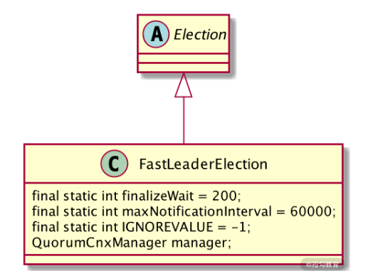

如上图所示，FastLeaderElection 类继承了 Election 接口，定义其是用来进行选举的实现类。而在其内部，又定义了选举通信相关的一些配置参数，比如 finalizeWait 最终等待时间、最大通知间隔时间 maxNotificationInterval 等。

在选举的过程中，首先调用 ToSend 函数向 ZooKeeper 集群中的其他角色服务器发送本机的投票信息，其他服务器在接收投票信息后，会对投票信息进行有效性验证等操作，之后 ZooKeeper 集群统计投票信息，如果过半数的机器投票信息一致，则集群就重新选出新的 Leader 服务器。

```java
static public class ToSend {
    static enum mType {crequest, challenge, notification, ack}
    ToSend(mType type,
            long leader,
            long zxid,
            long electionEpoch,
            ServerState state,
            long sid,
            long peerEpoch,
            byte[] configData) {
        this.leader = leader;
        this.zxid = zxid;
        this.electionEpoch = electionEpoch;
        this.state = state;
        this.sid = sid;
        this.peerEpoch = peerEpoch;
        this.configData = configData;
    }
```

通过本课时的学习，我们知道在 ZooKeeper 集群中 Follow 服务器的功能和作用。Follow 服务器在 ZooKeeper 集群服务运行的过程中，负责处理来自客户端的查询等非事务性的请求操作。当 ZooKeeper 集群中旧的 Leader 服务器失效时，作为投票者重新选举出新的 Leader 服务器。

这里我们要注意一个问题，那就是在重新选举 Leader 服务器的过程中，ZooKeeper 集群理论上是无法进行事务性的请求处理的。因此，发送到 ZooKeeper 集群中的事务性会话会被挂起，暂时不执行，等到选举出新的 Leader 服务器后再进行操作。

# 第19讲：Observer 的作用与 Follow 有哪些不同？

在 ZooKeeper 集群服务运行的过程中，Follow 服务器主要负责处理来自客户端的非事务性请求，其中大部分是处理客户端发起的查询会话等请求。而在 ZooKeeper 集群中，Leader 服务器失效时，会在 Follow 集群服务器之间发起投票，最终选举出一个 Follow 服务器作为新的 Leader 服务器。

除了 Leader 和 Follow 服务器，ZooKeeper 集群中还有一个 Observer 服务器。在 ZooKeeper 集群中，Observer 服务器对于提升整个 ZooKeeper 集群运行的性能具有至关重要的作用。

## 1、Observer 介绍

在 ZooKeeper 集群服务运行的过程中，Observer 服务器与 Follow 服务器具有一个相同的功能，那就是负责处理来自客户端的诸如查询数据节点等非事务性的会话请求操作。但与 Follow 服务器不同的是，Observer 不参与 Leader 服务器的选举工作，也不会被选举为 Leader 服务器。

在前面的课程中，我们或多或少有涉及 Observer 服务器，当时我们把 Follow 服务器和 Observer 服务器统称为 Learner 服务器。你可能会觉得疑惑，Observer 服务器做的事情几乎和 Follow 服务器一样，那么为什么 ZooKeeper 还要创建一个 Observer 角色服务器呢？

要想解释这个问题，就要从 ZooKeeper 技术的发展过程说起，最早的 ZooKeeper 框架是不存在 Observer 服务器的。


在早期的 ZooKeeper 集群服务运行过程中，只有 Leader 服务器和 Follow 服务器。不过随着 ZooKeeper 在分布式环境下的广泛应用，早期模式的设计缺点也随之产生，主要带来的问题有如下几点：

- 1、随着集群规模的变大，集群处理写入的性能反而下降。

- 2、ZooKeeper 集群无法做到跨域部署

其中最主要的问题在于，当 ZooKeeper 集群的规模变大，集群中 Follow 服务器数量逐渐增多的时候，ZooKeeper 处理创建数据节点等事务性请求操作的性能就会逐渐下降。这是因为 ZooKeeper 集群在处理事务性请求操作时，要在 ZooKeeper 集群中对该事务性的请求发起投票，只有超过半数的 Follow 服务器投票一致，才会执行该条写入操作。

正因如此，随着集群中 Follow 服务器的数量越来越多，一次写入等相关操作的投票也就变得越来越复杂，并且 Follow 服务器之间彼此的网络通信也变得越来越耗时，导致随着 Follow 服务器数量的逐步增加，事务性的处理性能反而变得越来越低。

为了解决这一问题，在 ZooKeeper 3.6 版本后，ZooKeeper 集群中创建了一种新的服务器角色，即 Observer——观察者角色服务器。Observer 可以处理 ZooKeeper 集群中的非事务性请求，并且不参与 Leader 节点等投票相关的操作。这样既保证了 ZooKeeper 集群性能的扩展性，又避免了因为过多的服务器参与投票相关的操作而影响 ZooKeeper 集群处理事务性会话请求的能力。


在实际部署的时候，因为 Observer 不参与 Leader 节点等操作，并不会像 Follow 服务器那样频繁的与 Leader 服务器进行通信。因此，可以将 Observer 服务器部署在不同的网络区间中，这样也不会影响整个 ZooKeeper 集群的性能，也就是所谓的跨域部署。

## 2、底层实现

介绍完 Observer 的作用和原理后，接下来我们再从底层代码的角度去分析一下 ZooKeeper 是如何实现一个 Observer 服务器的。

首先，在我们平时开发 ZooKeeper 服务的时候，如果想让某个服务器以 Observer 角色运行，需要在该服务器的运行配置文件 zoo.cfg 文件中添加 peerType 属性。如下面的代码所示，将该服务器的 peerType 属性设置为 observer 。

peerType=observer 

而当 ZooKeeper 集群服务开始运行的时候，首先调用 ObserverZooKeeperServer 类，来实例化 ZooKeeper 集群中每个 Observer 服务器，并初始化调用链等相关操作。如下面的代码所示：

```java
ObserverZooKeeperServer(FileTxnSnapLog logFactory, QuorumPeer self, ZKDatabase zkDb) throws IOException {
    super(logFactory, self.tickTime, self.minSessionTimeout, self.maxSessionTimeout, zkDb, self);
    LOG.info("syncEnabled =" + syncRequestProcessorEnabled);
```

而在 ObserverZooKeeperServer 类的 commitRequest 函数中，就设置了与 Follow 角色不同的实现方式。如下面的代码所示，Observer 不会接收网络中的 Proposal 请求，不会像 Follow 一样，在 Proposal 阶段就获得 Leader 服务器发送的变更数据。Observer 服务器是从 INFORM 数据包中获得变更的数据，在 commitRequest 函数的内部实现中，提交执行来自 INFORM 数据包中的事务操作。

```java
public void commitRequest(Request request) {     
    if (syncRequestProcessorEnabled) {
        // Write to txnlog and take periodic snapshot
        syncProcessor.processRequest(request);
    }
    commitProcessor.commit(request);     
```

   
### 1、INFORM 消息

了解 Observer 服务器的底层实现过程后，我们再来介绍一下 INFORM 消息。Observer 不会接收来自 Leader 服务器提交的投票请求，且不会接收网络中的 Proposal 请求信息，只会从网络中接收 INFORM 类型的信息包。

而 INFORM 信息的内部只包含已经被 Cmmit 操作过的投票信息，因为 Observer 服务器只接收已经被提交处理的 Proposal 请求，不会接收未被提交的会话请求。这样就从底层信息的角度隔离了 Observer 参与投票操作，进而使 Observer 只负责查询等相关非事务性操作，保证扩展多个 Observer 服务器时不会对 ZooKeeper 集群写入操作的性能产生影响。

### 2、Observer 处理链

接下来，我们再来看一下 Observer 服务器处理一次会话请求的底层实现过程。与 Leader 和 Follow 服务器一样，在处理一条来自客户单的会话请求时， Observer 同样采用的是处理链的设计方式。在这个 Observer 处理链上，主要定义了三个处理器，处理器的执行顺序分别是 ObserverRequestProcessor 处理器、CommitProcessor 处理器以及 FinalRequestProcessor 处理器。

在 ObserverRequestProcessor 处理器中，首先判断客户端请求的会话类型，将所有事务性的会话请求交给 Leader 服务器处理，如下面的代码所示。

```java
public void run() {
        try {
            while (!finished) {
                Request request = queuedRequests.take();
               	...
                switch (request.type) {
                case OpCode.sync:
                    zks.pendingSyncs.add(request);
                    zks.getObserver().request(request);
                    break;
                case OpCode.create:
                case OpCode.create2:
                case OpCode.createTTL:
                case OpCode.createContainer:
                case OpCode.delete:
                case OpCode.deleteContainer:
                case OpCode.setData:
                case OpCode.reconfig:
                case OpCode.setACL:
                case OpCode.multi:
                case OpCode.check:
                    zks.getObserver().request(request);
                    break;
               	...
            }
        } 
        ...
    }
}
```

之后调用 CommitProcessor 处理器，将该条会话放入到 queuedRequests 请求等待队列中。并唤醒相关线程进行会话处理。queuedRequests 队列实现了 BlockingQueue 阻塞队列：当 queuedRequests 队列容器已满，生产者线程会被阻塞，直到队列未满；当队列容器为空时，消费者线程会被阻塞，直至队列非空时为止。 这就形成了一个消费者—生产者模式的处理方式。

```java
public void processRequest(Request request) {
    if (stopped) {
        return;
    }
    if (LOG.isDebugEnabled()) {
        LOG.debug("Processing request:: " + request);
    }
    queuedRequests.add(request);
    wakeup();
}
```

在将会话请求放入到等待处理队列后，CommitProcessor 处理器的 run 方法从该队列中取出要处理的会话请求，然后解析会话请求中的请求服务器 zxid、请求事务信息 txn、请求头信息 hdr 等，并封装成 requeset 对象，然后传递给下一个处理器 FinalRequestProcessor。FinalRequestProcessor 处理器中会根据请求的类型，最终执行相关的操作。


这里给你留一个思考题：利用 Observer 服务器的这一特性，在平时的生产环境中，我们可以采用什么样的方式，来提高 ZooKeeper 集群服务的性能呢？所谓的跨域部署最常见的就是将 ZooKeeper 集群中的物理机器部署在不同的地域或机房中。

# 第20讲：一个运行中的 ZooKeeper 服务会产生哪些数据和文件？

之前的课程我们都在介绍 ZooKeeper 框架能够实现的功能，而无论是什么程序，其本质就是对数据的操作。比如 MySQl 数据库操作的是数据表，Redis 数据库操作的是存储在内存中的 Key-Value 值。不同的数据格式和存储方式对系统运行的效率和处理能力都有很大影响。本课时就来学习，在 ZooKeeper 程序运行期间，都会处理哪些数据，以及他们的存储格式和存储位置。

ZooKeeper 服务提供了创建节点、添加 Watcher 监控机制、集群服务等丰富的功能。这些功能服务的实现，离不开底层数据的支持。从数据存储地点角度讲，ZooKeeper 服务产生的数据可以分为内存数据和磁盘数据。而从数据的种类和作用上来说，又可以分为事务日志数据和数据快照数据。

## 1、内存数据

首先，我们介绍一下什么是内存数据。在专栏的基础篇中，主要讲解了通过 ZooKeeper 数据节点的特性，来实现一些像发布订阅这样的功能。而这些数据节点实际上就是 ZooKeeper 在服务运行过程中所操作的数据。

我在基础篇中提到过，ZooKeeper 的数据模型可以看作一棵树形结构，而数据节点就是这棵树上的叶子节点。从数据存储的角度看，ZooKeeper 的数据模型是存储在内存中的。我们可以把 ZooKeeper 的数据模型看作是存储在内存中的数据库，而这个数据库不但存储数据的节点信息，还存储每个数据节点的 ACL 权限信息以及 stat 状态信息等。

而在底层实现中，ZooKeeper 数据模型是通过 DataTree 类来定义的。如下面的代码所示，DataTree 类定义了一个 ZooKeeper 数据的内存结构。DataTree 的内部定义类 nodes 节点类型、root 根节点信息、子节点的 WatchManager 监控信息等数据模型中的相关信息。可以说，一个 DataTree 类定义了 ZooKeeper 内存数据的逻辑结构。

```java
public class DataTree {
  private DataNode root
  private final WatchManager dataWatches
  private final WatchManager childWatches
  private static final String rootZookeeper = "/";
}
```

## 2、事务日志

在介绍 ZooKeeper 集群服务的时候，我们介绍过，为了整个 ZooKeeper 集群中数据的一致性，Leader 服务器会向 ZooKeeper 集群中的其他角色服务发送数据同步信息，在接收到数据同步信息后， ZooKeeper 集群中的 Follow 和 Observer 服务器就会进行数据同步。而这两种角色服务器所接收到的信息就是 Leader 服务器的事务日志。在接收到事务日志后，并在本地服务器上执行。这种数据同步的方式，避免了直接使用实际的业务数据，减少了网络传输的开销，提升了整个 ZooKeeper 集群的执行性能。

在我们启动一个 ZooKeeper 服务器之前，首先要创建一个 zoo.cfg 文件并进行相关配置，其中有一项配置就是 dataLogDir 。在这项配置中，我们会指定该台 ZooKeeper 服务器事务日志的存放位置。

在 ZooKeeper 服务的底层实现中，是通过 FileTxnLog 类来实现事务日志的底层操作的。如下图代码所示，在 FileTxnLog 类中定义了一些属性字段，分别是：

- preAllocSize：可存储的日志文件大小。如用户不进行特殊设置，默认的大小为 65536*1024 字节。

- TXNLOG_MAGIC：设置日志文件的魔数信息为ZKLG。

- VERSION：设置日志文件的版本信息。

- lastZxidSeen：最后一次更新日志得到的 ZXID。

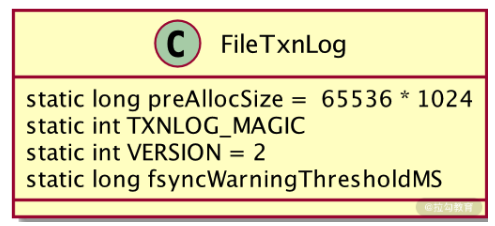

定义了事务日志操作的相关指标参数后，在 FileTxnLog 类中调用 static 静态代码块，来将这些配置参数进行初始化。比如读取 preAllocSize 参数分配给日志文件的空间大小等操作。

```java

static {
    LOG = LoggerFactory.getLogger(FileTxnLog.class);
    String size = System.getProperty("zookeeper.preAllocSize");
    if (size != null) {
        try {
            preAllocSize = Long.parseLong(size) * 1024;
        } catch (NumberFormatException e) {
            LOG.warn(size + " is not a valid value for preAllocSize");
        }
    }
    Long fsyncWarningThreshold;
    if ((fsyncWarningThreshold = Long.getLong("zookeeper.fsync.warningthresholdms")) == null)
        fsyncWarningThreshold = Long.getLong("fsync.warningthresholdms", 1000);
    fsyncWarningThresholdMS = fsyncWarningThreshold;
```

经过参数定义和日志文件的初始化创建后，在 ZooKeeper 服务器的 dataDir 路径下就生成了一个用于存储事务性操作的日志文件。我们知道在 ZooKeeper 服务运行过程中，会不断地接收和处理来自客户端的事务性会话请求，这就要求每次在处理事务性请求的时候，都要记录这些信息到事务日志中。

如下面的代码所示，在 FileTxnLog 类中，实现记录事务操作的核心方法是 append。从方法的命名中可以看出，ZooKeeper 采用末尾追加的方式来维护新的事务日志数据到日志文件中。append 方法首先会解析事务请求的头信息，并根据解析出来的 zxid 字段作为事务日志的文件名，之后设置日志的文件头信息 magic、version、dbid 以及日志文件的大小 。

```java
public synchronized boolean append(TxnHeader hdr, Record txn)
    throws IOException
{
    if (hdr == null) {
        return false;
    }
    if (hdr.getZxid() <= lastZxidSeen) {
        LOG.warn("Current zxid " + hdr.getZxid()
                + " is <= " + lastZxidSeen + " for "
                + hdr.getType());
    } else {
        lastZxidSeen = hdr.getZxid();
    }
    if (logStream==null) {
       if(LOG.isInfoEnabled()){
            LOG.info("Creating new log file: log." +
                    Long.toHexString(hdr.getZxid()));
       }
       logFileWrite = new File(logDir, ("log." +
               Long.toHexString(hdr.getZxid())));
       fos = new FileOutputStream(logFileWrite);
       logStream=new BufferedOutputStream(fos);
       oa = BinaryOutputArchive.getArchive(logStream);
       FileHeader fhdr = new FileHeader(TXNLOG_MAGIC,VERSION, dbId);
       fhdr.serialize(oa, "fileheader");
       // Make sure that the magic number is written before padding.
       logStream.flush();
       currentSize = fos.getChannel().position();
       streamsToFlush.add(fos);
    }
    padFile(fos);
    byte[] buf = Util.marshallTxnEntry(hdr, txn);
    if (buf == null || buf.length == 0) {
        throw new IOException("Faulty serialization for header " +
                "and txn");
    }
    Checksum crc = makeChecksumAlgorithm();
    crc.update(buf, 0, buf.length);
    oa.writeLong(crc.getValue(), "txnEntryCRC");
    Util.writeTxnBytes(oa, buf);
    return true;
    }
```

从对事务日志的底底层代码分析中可以看出，在 datadir 配置参数路径下存放着 ZooKeeper 服务器所有的事务日志，所有事务日志的命名方法都是“log.+ 该条事务会话的 zxid”。

## 3、数据快照

最后，我们来介绍 ZooKeeper 服务运行过程中产生的最后一个数据文件，即事务快照。

说到快照，可能很多技术人员都不陌生。一个快照可以看作是当前系统或软件服务运行状态和数据的副本。在 ZooKeeper 中，数据快照的作用是将内存数据结构存储到本地磁盘中。因此，从设计的角度说，数据快照与内存数据的逻辑结构一样，都使用 DataTree 结构。在 ZooKeeper 服务运行的过程中，数据快照每间隔一段时间，就会把 ZooKeeper 内存中的数据存储到磁盘中，快照文件是间隔一段时间后对内存数据的备份。

因此，与内存数据相比，快照文件的数据具有滞后性。而与上面介绍的事务日志文件一样，在创建数据快照文件时，也是使用 zxid 作为文件名称。

在代码层面，ZooKeeper 通过 FileTxnSnapLog 类来实现数据快照的相关功能。如下图所示，在FileTxnSnapLog 类的内部，最核心的方法是 save 方法，在 save 方法的内部，首先会创建数据快照文件，之后调用 FileSnap 类对内存数据进行序列化，并写入到快照文件中。

```java
public void save(DataTree dataTree,
                 ConcurrentHashMap<Long, Integer> sessionsWithTimeouts,
                 boolean syncSnap)
    throws IOException {
    long lastZxid = dataTree.lastProcessedZxid;
    File snapshotFile = new File(snapDir, Util.makeSnapshotName(lastZxid));
    LOG.info("Snapshotting: 0x{} to {}", Long.toHexString(lastZxid),
            snapshotFile);
    snapLog.serialize(dataTree, sessionsWithTimeouts, snapshotFile, syncSnap);
}
```

> 总结

通过本课时的学习，我们知道在 ZooKeeper 服务的运行过程中，会涉及内存数据、事务日志、数据快照这三种数据文件。从存储位置上来说，事务日志和数据快照一样，都存储在本地磁盘上；而从业务角度来讲，内存数据就是我们创建数据节点、添加监控等请求时直接操作的数据。事务日志数据主要用于记录本地事务性会话操作，用于 ZooKeeper 集群服务器之间的数据同步。事务快照则是将内存数据持久化到本地磁盘。

这里要注意的一点是，数据快照是每间隔一段时间才把内存数据存储到本地磁盘，因此数据并不会一直与内存数据保持一致。在单台 ZooKeeper 服务器运行过程中因为异常而关闭时，可能会出现数据丢失等情况。


> 模块四：实战篇

# 第21讲：ZooKeeper 分布式锁：实现和原理解析


在基础篇第 2 课时介绍 Watch 监控机制时，我为你介绍了一个利用 ZooKeeper 中的 Watch 机制实现一个简单的分布式锁的例子。这个例子当时是为了说明 Watch 机制的主要特点和作用。但在实际生产开发的过程中，这种分布式锁作为商业系统分布式锁的解决方案，直接利用之前介绍的实现分布式锁的方式，显然过于简单，且其中也有不少缺陷。那么今天这节课就结合这段时间学习到的知识，开发一个商业级别的分布式锁。

## 1、什么是分布式锁

在开始着手开发商业级的分布式锁之前，我们首先要弄清楚什么是分布式锁，以及分布式锁在日常工作的使用场景。明确了这些，我们才能设计出一个安全稳定的分布式锁。

在日常开发中，我们最熟悉也常用的分布式锁场景是在开发多线程的时候。为了协调本地应用上多个线程对某一资源的访问，就要对该资源或数值变量进行加锁，以保证在多线程环境下系统能够正确地运行。在一台服务器上的程序内部，线程可以通过系统进行线程之间的通信，实现加锁等操作。而在分布式环境下，执行事务的线程存在于不同的网络服务器中，要想实现在分布式网络下的线程协同操作，就要用到分布式锁。

## 2、分布式死锁

在单机环境下，多线程之间会产生死锁问题。同样，在分布式系统环境下，也会产生分布式死锁的问题。

当死锁发生时，系统资源会一直被某一个线程占用，从而导致其他线程无法访问到该资源，最终使整个系统的业务处理或运行性能受到影响，严重的甚至可能导致服务器无法对外提供服务。

所以当我们在设计开发分布式系统的时候，要准备一些方案来面对可能会出现的死锁问题，当问题发生时，系统会根据我们预先设计的方案，避免死锁对整个系统的影响。常用的解决死锁问题的方法有超时方法和死锁检测。

- 超时方法：在解决死锁问题时，超时方法可能是最简单的处理方式了。超时方式是在创建分布式线程的时候，对每个线程都设置一个超时时间。当该线程的超时时间到期后，无论该线程是否执行完毕，都要关闭该线程并释放该线程所占用的系统资源。之后其他线程就可以访问该线程释放的资源，这样就不会造成分布式死锁问题。但是这种设置超时时间的方法也有很多缺点，最主要的就是很难设置一个合适的超时时间。如果时间设置过短，可能造成线程未执行完相关的处理逻辑，就因为超时时间到期就被迫关闭，最终导致程序执行出错。

- 死锁检测：死锁检测是处理死锁问题的另一种方法，它解决了超时方法的缺陷。与超时方法相比，死锁检测方法主动检测发现线程死锁，在控制死锁问题上更加灵活准确。你可以把死锁检测理解为一个运行在各个服务器系统上的线程或方法，该方法专门用来探索发现应用服务上的线程是否发生了死锁。如果发生死锁，就会触发相应的预设处理方案。

## 3、锁的实现

在介绍完分布式锁的基本性质和潜在问题后，接下来我们就通过 ZooKeeper 来实现两种比较常用的分布式锁。


- 排他锁也叫作独占锁，从名字上就可以看出它的实现原理。当我们给某一个数据对象设置了排他锁后，只有具有该锁的事务线程可以访问该条数据对象，直到该条事务主动释放锁。否则，在这期间其他事务不能对该数据对象进行任何操作。在第二课时我们已经学习了利用 ZooKeeper 实现排他锁，这里不再赘述。

- 共享锁。它在性能上要优于排他锁，这是因为在共享锁的实现中，只对数据对象的写操作加锁，而不为对象的读操作进行加锁。这样既保证了数据对象的完整性，也兼顾了多事务情况下的读取操作。可以说，共享锁是写入排他，而读取操作则没有限制。

接下来我就通过 ZooKeeper 来实现一个排他锁。

### 1、创建锁

首先，我们通过在 ZooKeeper 服务器上创建数据节点的方式来创建一个共享锁。其实无论是共享锁还是排他锁，在锁的实现方式上都是一样的。唯一的区别在于，共享锁为一个数据事务创建两个数据节点，来区分是写入操作还是读取操作。如下图所示，在 ZooKeeper 数据模型上的 Locks_shared 节点下创建临时顺序节点，临时顺序节点的名称中带有请求的操作类型分别是 R 读取操作、W 写入操作。

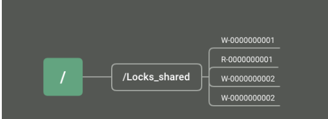

### 2、获取锁

当某一个事务在访问共享数据时，首先需要获取锁。ZooKeeper 中的所有客户端会在 Locks_shared 节点下创建一个临时顺序节点。根据对数据对象的操作类型创建不同的数据节点，如果是读操作，就创建名称中带有 R 标志的顺序节点，如果是写入操作就创建带有 W 标志的顺序节点。

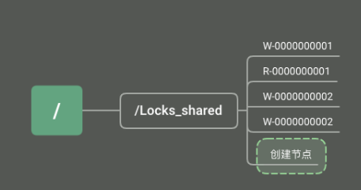

### 3、释放锁

事务逻辑执行完毕后，需要对事物线程占有的共享锁进行释放。我们可以利用 ZooKeeper 中数据节点的性质来实现主动释放锁和被动释放锁两种方式。

主动释放锁是当客户端的逻辑执行完毕，主动调用 delete 函数删除ZooKeeper 服务上的数据节点。而被动释放锁则利用临时节点的性质，在客户端因异常而退出时，ZooKeeper 服务端会直接删除该临时节点，即释放该共享锁。

这种实现方式正好和上面介绍的死锁的两种处理方式相对应。到目前为止，我们就利用 ZooKeeper 实现了一个比较完整的共享锁。如下图所示，在这个实现逻辑中，首先通过创建数据临时数据节点的方式实现获取锁的操作。创建数据节点分为两种，分别是读操作的数据节点和写操作的数据节点。当锁节点删除时，注册了该 Watch 监控的其他客户端也会收到通知，重新发起创建临时节点尝试获取锁。当事务逻辑执行完成，客户端会主动删除该临时节点释放锁。


在具体实现的过程中，我们利用 ZooKeeper 数据模型的临时顺序节点和 Watch 监控机制，在客户端通过创建数据节点的方式来获取锁，通过删除数据节点来释放锁。

这里我给你留一个问题，作为我们课后的作业：在分布式共享锁的实现中，获得锁的线程执行完释放锁后，其他等待资源的线程客户端收到 Watch 通知机制，会尝试获取锁。但是如果等待线程过多，那么频繁的 Watch 通知也会占用系统的网络资源和内存，有没有什么好的办法可以优化呢？在保证共享锁的实现下，减少 Watch 通知次数，这里留给你在本地进行优化。


# 第22讲：基于 ZooKeeper 命名服务的应用：分布式 ID 生成器


无论是单机环境还是分布式环境，都有使用唯一标识符标记某一资源的使用场景。比如在淘宝、京东等购物网站下单时，系统会自动生成订单编号，这个订单编号就是一个分布式 ID 的使用。

## 1、什么是 ID 生成器

我们先来介绍一下什么是 ID 生成器。分布式 ID 生成器就是通过分布式的方式，实现自动生成分配 ID 编码的程序或服务。在日常开发中，Java 语言中的 UUID 就是生成一个 32 位的 ID 编码生成器。根据日常使用场景，我们生成的 ID 编码一般具有唯一性、递增性、安全性、扩展性这几个特性。

- 唯一性：ID 编码作为标记分布式系统重要资源的标识符，在整个分布式系统环境下，生成的 ID 编码应该具有全局唯一的特性。如果产生两个重复的 ID 编码，就无法通过 ID 编码准确找到对应的资源，这也是一个 ID 编码最基本的要求。

- 递增性：递增性也可以说是 ID 编码的有序特性，它指一般的 ID 编码具有一定的顺序规则。比如 MySQL 数据表主键 ID，一般是一个递增的整数数字，按逐条加一的方式顺序增大。我们现在学习的 ZooKeeper 系统的 zxID 也具有递增的特性，这样在投票阶段就可以根据 zxID 的有序特性，对投票信息进行比对。

- 安全性：有的业务场景对 ID 的安全性有很高的要求，但这里说的安全性是指，如果按照递增的方式生成 ID 编码，那么这种规律很容易被发现。比如淘宝的订单编码，如果被恶意的生成或使用，会严重影响系统的安全性，所以 ID 编码必须保证其安全性。

- 扩展性：该特性是指 ID 编码规则要有一定的扩展性，按照规则生成的编码资源应该满足业务的要求。还是拿淘宝订单编码为例，假设淘宝订单的 ID 生成规则是：随机产生 4 位有效的整数组成编码，那么最多可以生成 6561 个订单编码，这显然是无法满足淘宝系统需求的。所以在设计 ID 编码的时候，要充分考虑扩展的需要，比如编码规则能够生成足够多的 ID，从而满足业务的要求，或者能够通过不同的前缀区分不同的产品或业务线 。

## 2、生成策略

介绍完 ID 编码在整个应用系统的重要作用和 ID 编码自身的特性后。接下来我们看看几种在日常开发中常见的生成策略。

### 1、UUID 方式

开发人员，尤其是 Java 程序员最为熟悉的编码生成方式就是 UUID。它是一种包含 16 个字节的数字编码。 UUID 会根据运行应用的计算机网卡 MAC 地址、时间戳、命令空间等元素，通过一定的随机算法产生。正因为 UUID 算法元素的复杂性，保证了 UUID 在一定范围内的随机性。

UUID 在本地应用中生成，速度比较快，不依赖于其他服务，网络的好坏对其没有任何影响。但从实现上来讲，使用 UUID 策略生成的代码耦合度大，不能作为单独的 ID 生成器使用。而且生成的编码不能满足递增的特性，没有任何有序性可言，在很多业务场景中都不合适。

### 2、数据库序列方式

生成 ID 编码的另一种方式是数据库序列。比如 MySQL 的自增主键就是一种有序的 ID 生成方式。随着数据变得越来越多，为了提升数据库的性能，就要对数据库进行分库分表等操作。在这种情况下，自增主键的方式不能满足系统处理海量数据的要求。

这里我给你介绍另一种性能更好的数据库序列生成方式：TDDL 中的序列化实现。TDDL 是 Taobao Distributed Data Layer 的缩写。是淘宝根据自己的业务特点开发的数据库中间件。主要应用于数据库分库分表的应用场景中。

TDDL 生成 ID 编码的大致过程如下图所示。首先，作为 ID 生成器的机器，数据库中会存在一张sequence 序列化表，用于记录当前已经被占用的 ID 最大值。之后每个需要 ID 编码的客户端在请求 ID 编码生成器后，编码服务器会返回给该客户端一段 ID 地址区间。并更新 sequence 表中的信息。

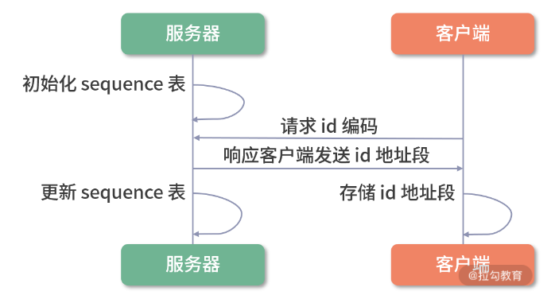

在接收一段 ID 编码后，客户端会将该编码存储在内存中。在本机需要使用 ID 编码时，会首先使用内存中的 ID 编码。如果内存中的 ID 编码已经完全被占用，则再重新向编码服务器获取。

在 TDDL 框架的内部实现中，通过分批获取 ID 编码的方式，减少了客户端访问服务器的频率，避免了网络波动所造成的影响，并减轻了服务器的内存压力。不过 TDDL 是高度依赖底层数据库的实现方式，不能作为一个独立的分布式 ID 生成器对外提供服务。

### 3、基于zookeeper的ID 生成器

上面介绍的几种策略，有的和底层编码耦合比较大，有的又局限在某一具体的使用场景下，并不满足作为分布式环境下一个公共 ID 生成器的要求。接下来我们就利用目前学到的 ZooKeeper 知识，动手实现一个真正的分布式 ID 生成器。

首先，我们通过 ZooKeeper 自身的客户端和服务器运行模式，来实现一个分布式网络环境下的 ID 请求和分发过程。每个需要 ID 编码的业务服务器可以看作是 ZooKeeper 的客户端。ID 编码生成器可以作为 ZooKeeper 的服务端。客户端通过发送请求到 ZooKeeper 服务器，来获取编码信息，服务端接收到请求后，发送 ID 编码给客户端。

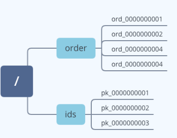

在代码层面的实现中，如上图所示。我们可以利用 ZooKeeper 数据模型中的顺序节点作为 ID 编码。客户端通过调用 create 函数创建顺序节点。服务器成功创建节点后，会响应客户端请求，把创建好的节点信息发送给客户端。客户端用数据节点名称作为 ID 编码，进行之后的本地业务操作。

通过上面的介绍，我们发现，使用 ZooKeeper 实现一个分布式环境下的公用 ID 编码生成器很容易。利用 ZooKeeper 中的顺序节点特性，很容易使我们创建的 ID 编码具有有序的特性。并且我们也可以通过客户端传递节点的名称，根据不同的业务编码区分不同的业务系统，从而使编码的扩展能力更强。

虽然使用 ZooKeeper 的实现方式有这么多优点，但也会有一些潜在的问题。其中最主要的是，在定义编码的规则上还是强烈依赖于程序员自身的能力和对业务的深入理解。很容易出现因为考虑不周，造成设置的规则在运行一段时间后，无法满足业务要求或者安全性不够等问题。为了解决这个问题，我们继续学习一个比较常用的编码算法——snowflake 算法。

### 4、snowflake 算法

snowflake 算法是 Twitter 公司开源的一种用来生成分布式 ID 编码的算法。如下图所示，通过 snowflake 算法生成的编码是一个 64 位的长整型值。在 snowflake 算法中，是通过毫秒数、机器 ID毫秒流水号、符号位这几个元素生成最终的编码。

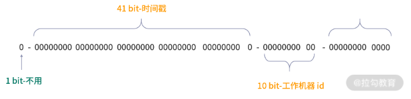

在计算编码的过程中，首先获取机器的毫秒数，并存储为 41 位，之后查询机器的工作 ID，存储在后面的 10 位字节中。剩余的 12 字节就用来存储毫秒内的流水号和表示位符号值 0。

从图中可以看出，snowflake 算法最主要的实现手段就是对二进制数位的操作。从性能上说，这个算法理论上每秒可以生成 400 多万个 ID 编码，完全满足分布式环境下，对系统高并发的要求。因此，在平时的开发过程中，也尽量使用诸如 snowflake 这种业界普遍采用的分布式 ID 生成算法，避免自己闭门造车导致的性能或安全风险。

> 总结

通过本课时的学习，我们掌握了什么是分布式的 ID 生成器，以及如何利用 ZooKeeper 实现一个 ID 生成器。ID 编码作为一个标识符，具有全局唯一的特性。利用这种特性，我们可以在分布式系统下实现很多功能，比如数据库的分区符号以及商城订单编号等。注意，在分布式等复杂的应用环境中，要设计一个编码生成器，我们需要考虑生成编码的唯一性、安全性、递增性以及扩展性。

在本节课中，我们通过 ZooKeeper 实现了一个编码生成器，其主要原理是利用数据模型中顺序节点的特性。在具体的实现中也比较简单，并没有使用特定的算法实现 ID 编码。

这里给你留一个作业：结合上面介绍的 snowflake 算法，实现一个更加高效的编码服务器。


# 第23讲：使用 ZooKeeper 实现负载均衡服务器功能

## 1、什么是负载均衡


负载均衡可以理解为运行在网络中的服务器或软件，其主要作用是扩展网络服务器的带宽、提高服务器处理数据的吞吐量，提高网络的可用性。比如我们经常用到的网络服务器、邮件服务器以及很多商业系统的服务器，都采用负载均衡的方式来协调工作。

这些系统一般会采用集群的方式进行部署，由于这些服务器彼此所处的网络环境各不相同，在某一段时间内所接收并处理的数据有多有少，如果整个集群没有一个专门进行管理和协调的角色，随着网络请求越来越多，就会出现某一台服务器比较忙，而网络中其他服务器没有什么任务要处理的情况。

负载均衡通过监控网络中各个服务器的运行情况，对整个集群的计算资源进行合理地分配和调整，避免由于请求处理的无序性导致的短板，从而限制整个集群性能。

了解了负载均衡服务器在集群服务中的作用后，接下来再来介绍一下实现负载均衡的常用算法。

在我们平时的工作和面试中，也常被问及一些负载均衡的算法问题。常用的有轮询法、随机法、原地址哈希法、加权轮询法、加权随机法、最小连接数法，下面我来分别为你进行讲解。

### 1、轮询法

轮询法是最为简单的负载均衡算法，当接收到来自网络中的客户端请求后，负载均衡服务器会按顺序逐个分配给后端服务。比如集群中有 3 台服务器，分别是 server1、server2、server3，轮询法会按照 sever1、server2、server3 这个顺序依次分发会话请求给每个服务器。当第一次轮询结束后，会重新开始下一轮的循环。

### 2、随机法

随机算法是指负载均衡服务器在接收到来自客户端的请求后，会根据一定的随机算法选中后台集群中的一台服务器来处理这次会话请求。不过，当集群中备选机器变的越来越多时，通过统计学我们可以知道每台机器被抽中的概率基本相等，因此随机算法的实际效果越来越趋近轮询算法。

### 3、原地址哈希法

原地址哈希算法的核心思想是根据客户端的 IP 地址进行哈希计算，用计算结果进行取模后，根据最终结果选择服务器地址列表中的一台机器，处理该条会话请求。采用这种算法后，当同一 IP 的客户端再次访问服务端后，负载均衡服务器最终选举的还是上次处理该台机器会话请求的服务器，也就是每次都会分配同一台服务器给客户端。

### 4、加权轮询法

在实际的生成环境中，一个分布式或集群系统中的机器可能部署在不同的网络环境中，每台机器的配置性能也有优劣之分。因此，它们处理和响应客户端请求的能力也各不相同。采用上面几种负载均衡算法，都不太合适，这会造成能力强的服务器在处理完业务后过早进入限制状态，而性能差或网络环境不好的服务器，一直忙于处理请求，造成任务积压。

为了解决这个问题，我们可以采用加权轮询法，加权轮询的方式与轮询算法的方式很相似，唯一的不同在于选择机器的时候，不只是单纯按照顺序的方式选择，还根据机器的配置和性能高低有所侧重，配置性能好的机器往往首先分配。

### 5、加权随机法

加权随机法和我们上面提到的随机算法一样，在采用随机算法选举服务器的时候，会考虑系统性能作为权值条件。

### 6、最小连接数法

最小连接数算法是指，根据后台处理客户端的连接会话条数，计算应该把新会话分配给哪一台服务器。一般认为，连接数越少的机器，在网络带宽和计算性能上都有很大优势，会作为最优先分配的对象。

## 2、利用 ZooKeeper 实现

介绍完负载均衡的常用算法后，接下来我们利用 ZooKeeper 来实现一个分布式系统下的负载均衡服务器。从上面介绍的几种负载均衡算法中不难看出。一个负载均衡服务器的底层实现，关键在于找到网络集群中最适合处理该条会话请求的机器，并将该条会话请求分配给该台机器。因此探测和发现后台服务器的运行状态变得最为关键。

### 1、状态收集

首先我们来实现网络中服务器运行状态的收集功能，利用 ZooKeeper 中的临时节点作为标记网络中服务器的状态点位。在网络中服务器上线运行的时候，通过在 ZooKeeper 服务器中创建临时节点，向 ZooKeeper 的服务列表进行注册，表示本台服务器已经上线可以正常工作。通过删除临时节点或者在与 ZooKeeper 服务器断开连接后，删除该临时节点。

最后，通过统计临时节点的数量，来了解网络中服务器的运行情况。如下图所示，建立的 ZooKeeper 数据模型中 Severs 节点可以作为存储服务器列表的父节点。用于之后通过负载均衡算法在该列表中选择服务器。在它下面创建 servers_host1、servers_host2、servers_host3等临时节点来存储集群中的服务器运行状态信息。

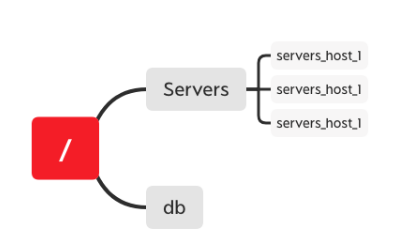

在代码层面的实现中，我们首先定义一个 BlanceSever 接口类。该类规定在 ZooKeeper 服务器启动后，向服务器地址列表中，注册或注销信息以及根据接收到的会话请求，动态更新负载均衡情况等功能。如下面的代码所示：

```java
public class BlanceSever{
  public void register()
  public void unregister()
  public void addBlanceCount()
  public void takeBlanceCount()
  
}
```

之后我们创建 BlanceSever 接口的实现类 BlanceSeverImpl，在 BlanceSeverImpl 类中首先定义服务器运行的 Session 超时时间、会话连接超时时间、ZooKeeper 客户端地址、服务器地址列表节点 ‘/Severs’ 等基本参数。并通过构造函数，在类被引用时进行初始化 ZooKeeper 客户端对象实例。

```java
public class BlanceSeverImpl implements BlanceSever{
  private static final Integer SESSION_TIME_OUT
  private static final Integer CONNECTION_TIME_OUT
  private final ZkClient zkclient
  private static final SERVER_PATH="/Severs"
  public BlanceSeverImpl(){
    init...
  }
  
}
```

接下来，在定义当服务器启动时，向服务器地址列表注册信息的 register 函数。在函数的内部，通过在 SERVER_PATH 路径下创建临时子节点的方式来注册服务器信息。如下面的代码所示，首先获取服务器的 ip 地址，利用 ip 地址作为临时节点的 path 来创建临时节点。

```java
public register() throws Exception{
  InetAddress address = InetAddress.getLocalHost();
  String serverIp=address.getHostAddress()
  zkclient.createEphemeral(SERVER_PATH+serverIp)
}
```

register 函数在服务器启动并注册服务器信息后，我们再来定义 unregister 方法，该方法是当服务器关机或由于其他原因不再对外提供服务时，通过调用 unregister 方法，注销该台服务器在服务器列表中的信息。

注销后的机器不会被负载均衡服务器分发处理会话。如下面的代码所示，在 unregister 函数的内部，我们主要通过删除 SERVER_PATH 路径下临时节点的方式注销服务器。

```java
public unregister() throws Exception{
  zkclient.delete(SERVER_PATH+serverIp)
}
```

### 2、负载算法

实现服务器列表后，接下来我们就进入负载均衡最核心的内容：如何选择服务器。这里我们通过采用“最小连接数”算法，来确定究竟如何均衡地分配网络会话请求给后台客户端。

整个实现的过程如下图所示。首先，在接收到客户端的请求后，通过 getData 方法获取服务端 Severs 节点下的服务器列表，其中每个节点信息都存储有当前服务器的连接数。通过判断选择最少的连接数作为当前会话的处理服务器，并通过 setData 方法将该节点连接数加 1。最后，当客户端执行完毕，再调用 setData 方法将该节点信息减 1。


首先，我们定义当服务器接收到会话请求后。在 ZooKeeper 服务端增加连接数的 addBlance 方法。如下面的代码所示，首先我们通过 readData 方法获取服务器最新的连接数，之后将该连接数加 1，再通过 writeData 方法将新的连接数信息写入到服务端对应节点信息中。

```java
public void addBlance() throws Exception{
  InetAddress address = InetAddress.getLocalHost();
  String serverIp=address.getHostAddress()
  Integer con_count=zkClient.readData(SERVER_PATH+serverIp)
  ++con_count
  zkClient.writeData(SERVER_PATH+serverIp,con_count)
}
```

当服务器处理完该会话请求后，需要更新服务端相关节点的连接数。具体的操作与 addBlance 方法基本一样，只是对获取的连接信息进行减一操作，这里不再赘述。


本课时我们介绍了如何利用 ZooKeeper 实现一个负载均衡服务器，了解了随机、轮询、哈希等常用的负载均衡算法，并在本课的结尾利用 ZooKeeper 来创建一个负载均衡服务器的具体实现过程。

这里请你注意：我们日常用到的负载均衡器主要是选择后台处理的服务器，并给其分发请求。而通过 ZooKeeper 实现的服务器，只提供了服务器的筛选工作。在请求分发的过程中，还是通过负载算法计算出要访问的服务器，之后客户端自己连接该服务器，完成请求操作。


# 第24讲：ZooKeeper 在 Kafka 和 Dubbo 中的工业级实现案例分析


## 1、Dubbo 与 ZooKeeper

Dubbo 是阿里巴巴开发的一套开源的技术框架，是一款高性能、轻量级的开源 Java RPC 框架。它提供了三大核心能力：

- 面向接口的远程方法调用

- 智能容错和负载均衡

- 服务自动注册和发现

其中，远程方法调用是 Dubbo 最为核心的功能点。因为一个分布式系统是由分布在不同网络区间或节点上的计算机或服务，通过彼此之间的信息传递进行协调工作的系统。因此跨机器或网络区间的通信是实现分布式系统的核心。而 Dubbo 框架可以让我们像调用本地方法一样，调用不同机器或网络服务上的线程方法。

下图展示了整个 Dubbo 服务的连通过程。整个服务的调用过程主要分为服务的消费端和服务的提供方。首先，服务的提供方向 Registry 注册中心注册所能提供的服务信息，接着服务的消费端会向 Registry 注册中心订阅该服务，注册中心再将服务提供者地址列表返回给消费者。如果有变更，注册中心将基于长连接将变更数据推送给消费者，从而通过服务的注册机制实现远程过程调用。

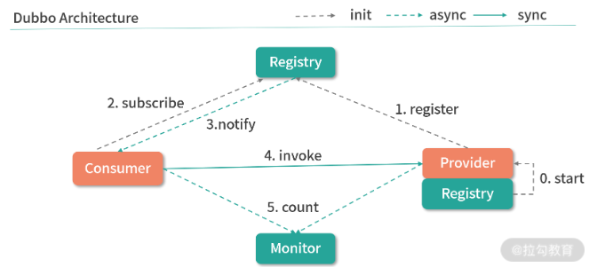


通过上面的介绍，我们不难发现在整个 Dubbo 框架的实现过程中，注册中心是其中最为关键的一点，它保证了整个 PRC 过程中服务对外的透明性。而 Dubbo 的注册中心也是通过 ZooKeeper 来实现的。

如下图所示，在整个 Dubbo 服务的启动过程中，服务提供者会在启动时向 /dubbo/com.foo.BarService/providers 目录写入自己的 URL 地址，这个操作可以看作是一个 ZooKeeper 客户端在 ZooKeeper 服务器的数据模型上创建一个数据节点。服务消费者在启动时订阅 /dubbo/com.foo.BarService/providers 目录下的提供者 URL 地址，并向 /dubbo/com.foo.BarService/consumers 目录写入自己的 URL 地址。该操作是通过 ZooKeeper 服务器在 /consumers 节点路径下创建一个子数据节点，然后再在请求会话中发起对 /providers 节点的 watch 监控。

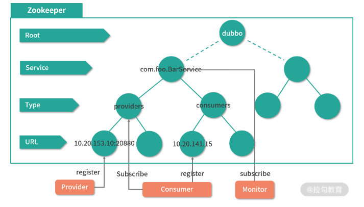

## 2、Kafka 与 ZooKeeper

接下来我们再看一下 ZooKeeper 在另一个开源框架 Kafka 中的应用。Kafka 是一种高吞吐量的分布式发布订阅消息系统，它可以处理消费者在网站中的所有动作流数据，经常用来解决大量数据日志的实时收集以及 Web 网站上用户 PV 数统计和访问记录等。我们可以把 Kafka 看作是一个数据的高速公路，利用这条公路，数据可以低延迟、高效地从一个地点到达另一个地点。


在介绍 ZooKeeper 在 Kafka 中如何使用之前，我们先来简单地了解一下 Kafka 的一些关键概念，以便之后的学习。如下图所示，整个 Kafka 的系统架构主要由 Broker、Topic、Partition、Producer、Consumer、Consumer Group 这几个核心概念组成，下面我们来分别进行介绍。

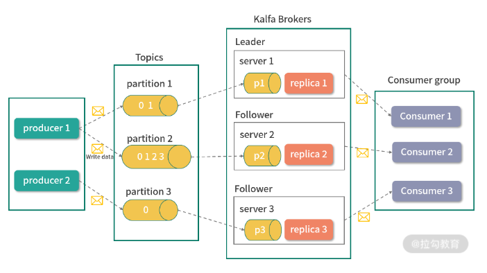

- Broker：Kafka 也是一个分布式的系统架构，因此在整个系统中存在多台机器，它将每台机器定义为一个 Broker。

- Topic：Kafka 的主要功能是发送和接收消息，作为一个高效的消息管道，它存在于不同的系统中。Kafka 内部，将接收到的无论何种类型的消息统一定义为 Topic 类，可以将 Topic 看作是消息的容器。

- Partition 是分区的意思，与 Topic 概念相似，它也是存放消息的容器。不过 Partition 主要是物理上的分区，而 Topic 表示消息的逻辑分区。

- Producer 是消息的生产者，整个 Kafka 系统遵循的是生产者和消费者模式，消息会从生产者流通到接收者。

- Consumer 和 Consumer Group：Consumer 即消费者，是 Kafka 框架内部对信息对接收方的定义。Consumer Group 会将消费者分组，然后按照不同的种类进行管理。

在整个 Kafka 服务的运行过程中，信息首先通过 producer 生产者提交给 Kafka 服务器上的 Topics 消息容器。在消息容器的内部，又会根据当前系统磁盘情况选择对应的物理分区进行存储，而每台服务分区可能对应一台或多台 Broker 服务器，之后 Broker 服务器再将信息推送给 Consumer。


介绍完 Kafka 的相关概念和服务运行原理后，接下来我们学习 ZooKeeper 在 Kafka 框架下的应用。在 Kafka 中 ZooKeeper 几乎存在于每个方面，如下图所示，Kafka 会将我们上面介绍的流程架构存储为一个 ZooKeeper 上的数据模型。

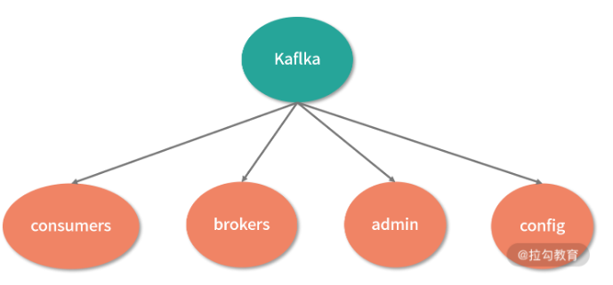

由于 Broker 服务器采用分布式集群的方式工作，那么在服务的运行过程中，难免出现某台机器因异常而关闭的状况。为了保证整个 Kafka 集群的可用性，需要在系统中监控整个机器的运行情况。而 Kafka 可以通过 ZooKeeper 中的数据节点，将网络中机器的运行统计存储在数据模型中的 brokers 节点下。

在 Kafka 的 Topic 信息注册中也需要使用到 ZooKeeper ，在 Kafka 中同一个Topic 消息容器可以分成多个不同片，而这些分区既可以存在于一台 Broker 服务器中，也可以存在于不同的 Broker 服务器中。

而在 Kafka 集群中，每台 Broker 服务器又相对独立。为了能够读取这些以分布式方式存储的分区信息，Kafka 会将这些分区信息在 Broker 服务器中的对应关系存储在 ZooKeeper 数据模型的 topic 节点上，每一个 topic 在 ZooKeeper 数据节点上都会以 /brokers/topics/[topic] 的形式存在。当 Broker 服务器启动的时候，会首先在 /brokers/topics 节点下创建自己的 Broker_id 节点，并将该服务器上的分区数量存储在该数据节点的信息中。之后 ，在系统运行的过程中，通过统计 /brokers/topics 下的节点信息，就能知道对应的 Broker 分区情况。

## 3、整合 ZooKeeper 到自己的系统

### 1、java中使用

通过上面的介绍，我们大致了解了比较流行的开源框架是如何利用 ZooKeeper 解决自身问题的。接下来我们学习如何在自己的项目中使用 ZooKeeper。这里我们以比较流行的 springboot 框架为例。如下面代码所示，要想在 SpringBoot 框架中使用 ZooKeeper，首先要在工程的 pom 文件中引入对应的包。

我们在 dependency 引用配置中添加了版本为 3.6.1 的 org.apache.zookeeper 开发包。通过这个配置，我们的工程就可以使用 ZooKeeper 的相关功能了。

```xml
<dependency> 
  <groupId>org.apache.zookeeper</groupId> 
  <artifactId>zookeeper</artifactId>   
  <version>3.6.1</version> 
</dependency>  
```

在项目开发 ZooKeeper 服务的时候，往往都会编写大量 ZooKeeper 客户端代码，去请求 ZooKeeper 服务端来完成相关的业务处理。而 ZooKeeper 自带的客户端使用起来不是很便利。之前我们学习过 Curator 框架，该框架被誉为 ZooKeeper 客户端中的瑞士军刀。利用该框架可以大大提高我们开发 ZooKeeper 服务的效率，因此，在项目开发中也推荐你来使用。

与上面介绍的相同，要想在项目中使用 Curator，首先需要将 Curator 引入到项目中，如下图所示，我们通过在 pom 文件中添加 dependency 来完成。首先，在配置中添加 4.0.0 版本的 org.apache.curator 包，其中包含了 Curator 的基础功能。之后添加的 curator-recipes 包，其中包括了重入锁、读写锁、Leader 选举设置等高级操作功能。把这三个包引用到工程后，整个 springboot 工程就可以利用 ZooKeeper 进行开发了。

```xml
 <dependency> 
   <groupId>org.apache.curator</groupId> 
   <artifactId>curator-framework</artifactId> 
   <version>4.0.0</version> 
   </dependency> 
 <dependency> 
 <dependency> 
    <groupId>org.apache.curator</groupId> 
    <artifactId>curator-recipes</artifactId> 
     <version>4.0.0</version> 
 </dependency> 
```

### 2、在 Python 中使用 ZooKeeper

Python 作为一门跨平台开发语言，在数据科学、微服务、服务端开发中都有很广泛的应用。可能很多开发者是使用 Python 来进行业务开发的，下面我们介绍一下在 Python 项目中如何使用 ZooKeeper 服务。要想在 Python 中使用 ZooKeeper 服务，我们首先要在 Python 的运行环境中安装 kazoo 包。

pip install kazoo 

安装完 kazoo 包后，我们可以着手在 Python 项目中使用 ZooKeeper 服务了。首先连接 ZooKeeper 服务器，如下面的代码所示，在代码中引入 KazooClient 包，它的作用和上面介绍的 Curator 一样，主要提供 ZooKeeper 客户端的操作功能。之后调用 KazooClient 函数并传入服务器地址来创建服务器连接会话，再调用 create 函数来创建数据节点。

```python
from kazoo.client import KazooClient 
zk = KazooClient(hosts='127.0.0.1:2181') 
zk.start() 
zk.create("/pyzk/study/node", b"a value") 
```

在日常开发工作中，无论是在 SpringBoot 框架下使用 Java 语言开发项目，还是使用 Pyhton 语言进行开发，使用 ZooKeeper 服务的方式基本一样，都是先要引入相关的 ZooKeeper 包，之后调用相关的客户端函数来完成业务相关的创建工作。


# 第25讲：如何搭建一个高可用的 ZooKeeper 生产环境？


首先，我们来介绍一下 ZooKeeper 服务的几种运行模式，ZooKeeper 的运行模式一般分为单机模式、伪集群模式、集群模式。其中单机模式和伪集群模式，在我们的日常开发中经常用到。

## 1、单机模式配置

在 ZooKeeper 的单机模式下，整个 ZooKeeper 服务只运行在一台服务器节点下。在 zoo.cfg 配置文件中，我们只定义了基本的 dataDir 目录和 clientPort 端口号等信息。

```
tickTime=2000 
dataDir=/var/lib/zookeeper 
clientPort=2181 
```

## 2、伪集群模式配置

与单机模式相比，伪集群模式的意思是：虽然 ZooKeeper 服务配置有多台服务器节点，但是这些集群服务器都运行在同一台机器上。 通常伪集群服务器在配置的时候，每台服务器间采用不同的端口号进行区分，多用在本地开发或测试中。

如下面的代码所示，在配置伪集群的时候，我们将每台服务器的 IP 地址都指向 127.0.0.1，即本机地址，每台 ZooKeeper 对外提供服务的端口分别是 2223、3334、4445。

```
tickTime=2000 
dataDir=/var/lib/zookeeper 
clientPort=2181 
sever.1=127.0.0.1:2222:2223 
sever.1=127.0.0.1:3333:3334 
sever.1=127.0.0.1:4444:4445 
```

## 3、集群模式配置

集群模式在配置上与伪集群模式基本相同。不同之处在于配置服务器地址列表的时候，组成 ZooKeeper 集群的各个服务器 IP 地址列表分别指向每台服务在网络中的实际 IP 地址。

```
tickTime=2000 
dataDir=/var/lib/zookeeper 
clientPort=2181 
sever.1=192.168.1.101:2222:2223 
sever.1=192.168.1.102:3333:3334 
sever.1=192.168.1.103:4444:4445 
```

在 ZooKeeper 集群的三种模式中，单机模式和伪集群模式经常用于开发和测试中。而分别利用不同网络上的物理机器组成的 ZooKeeper 集群经常被我们作为生成系统的环境配置方式。

## 4、容器化部署

介绍完 ZooKeeper 服务器三种模式的配置方法后，接下来我们学习如何利用容器化技术来部署 ZooKeeper 集群。

首先，我们来了解一下什么是容器化技术。在我们前面的课程中，无论是在单机模式下在 ZooKeeper 数据模型中创建数据节点，还是在集群模式中，ZooKeeper 集群进行 Leader 节点选举，它们的实现都依赖于 ZooKeeper 服务部署在真实的物理机器上运行。

随着 IT 技术的发展，人们开始设想能否通过软件的方式，在一台机器上模拟出多台机器，突破单体物理机器的限制，利用一台物理机器的计算资源模拟出多台机器，为技术开发提供更加灵活和高效的环境。因此，有了我们比较熟悉的 VMware Workstation 等虚拟化技术软件。

利用该软件，我们可以在单一的桌面系统上，同时运行多个不同的操作系统。每个操作系统都可以看作独立的计算机。可以在不同的系统上进行程序开发、测试、服务部署等工作。虽然 VMware Workstation 为我们解决了系统资源虚拟化的问题，但是这种实现方式也有自身的缺点，比如每个虚拟机实例都需要运行客户端操作系统的完整副本以及其中包含的大量应用程序。从实际运行的角度来说，这会对物理机资源产生较大占用，也不利于整个虚拟系统的扩展和维护。

接下来我们要介绍的另一种容器化解决方式叫作 Docker，在实现容器化部署的同时，避免了 VMware Workstation 的上述问题。Docker 是一个开源的应用容器引擎，基于 Go 语言并遵从 Apache2.0 协议开源。与 VMware Workstation 相比，Docker 容器更加轻量化。在 Web 网站自动化部署、持续集成与发布等使用场景中具有广泛的应用。

本课时中，我们也使用 Docker 容器化技术来实现一个生产环境中的 ZooKeeper 集群部署案例。


为了使用 Docker 容器技术部署我们的应用服务，首先，我们要在服务器上安装 Docker 软件。以 Linux 系统中的 CentOS 7 64 位版本为例。如下面的代码所示，通过 curl 命令使用官方安装脚本自动安装。curl 通过资源地址获取资源到本地进行安装。而国内服务器由于网络等原因可能无法访问默认的 Docker 资源服务器，因此这里采用的是国内阿里云的镜像资源服务器。


curl -fsSL https://get.docker.com | bash -s docker --mirror Aliyun 


安装完 Docker 后，接下来我们就开始部署 ZooKeeper 的集群环境。这里的集群环境仍然由三台 Linux 服务器组成。而与上面我们介绍的利用网络中三台实体机器不同，这三台服务器可以通过 Docker 的方式来创建。

如下面的代码所示，首先打开系统终端，输入 docker pull 获取需要的系统镜像文件，这里选择的是 3.6 版本的 ZooKeeper，当然我们也可以不指定具体版本号，系统会默认拉取最新版本的 ZooKeeper 。之后我们通过 docker run 命令来启动 ZooKeeper 镜像服务器。执行完这两个步骤，我们就拥有一台运行 ZooKeeper 服务的服务器了。

```
docker pull zookeeper:3.6 
docker run -d --name=zookeeper1 --net=host zookeeper 
```

创建完 ZooKeeper 服务器，接下来就要通过 zoo.cfg 文件来配置 ZooKeeper 服务。与部署在物理机器上不同，我们通过 docker exec 命令进入 Docker 创建的 ZooKeeper 服务器中，之后通过 vim 命令打开 zoo.cfg 文件进行相关配置。

```
docker exec -it zookeeper1 /bin/bash 
vim /conf/zoo.cfg 
```


按照上面介绍的方法，如果我们想搭建三台服务器规模的 ZooKeeper 集群服务，就需要重复上面的步骤三次，并分别在创建的三台 ZooKeeper 服务器进行配置。

不过在实际生产环境中，我们需要的 ZooKeeper 规模可能远远大于三台，而且这种逐一部署的方式不但浪费时间，在配置过程中出错率也较高。因此，这里介绍另一种配置方式，通过 Docker Compose 的方式来部署 ZooKeeper 集群。

Docker Compose 是用于定义和运行多容器 Docker 应用程序的工具。通过 Compose，你可以使用 YML 文件来配置应用程序需要的所有服务。然后，使用一个命令，就可以从 YML 文件配置中创建并启动所有服务。如下面的代码所示，我们创建了一个名为 docker-compose.yml 的配置文件。

```yml

version: '3.6'  
services:  
	zk1:  
		image: zookeeper:3.6 
		restart: always  
		hostname: zk1  
		container_name: zk1 
		ports: - 2181:2181  
		environment:  
		 ZOO_MY_ID: 1  
		 ZOO_SERVERS: server.1=zk1:2888:3888 server.2=zk2:2888:3888 server.3=zk3:2888:3888  
	zk2:  
		image: zookeeper:3.6 
		restart: always  
		hostname: zk2  
		container_name: zk2  
		ports: - 2182:2181  
		environment:  
		 ZOO_MY_ID: 1  
		 ZOO_SERVERS: server.1=zk1:2888:3888 server.2=zk2:2888:3888 server.3=zk3:2888:3888 
	zk3:  
		image: zookeeper:3.6 
		restart: always  
		hostname: zk3  
		container_name: zk3  
		ports: - 2183:2181  
		environment:  
		 ZOO_MY_ID: 1  
		 ZOO_SERVERS: server.1=zk1:2888:3888 server.2=zk2:2888:3888 server.3=zk3:2888:3888 
```

在这个文件中，我们将需要手工逐一创建的 ZooKeeper 服务器的创建过程，通过 docker-compose.yml 配置文件的方式进行了描述。在这个配置文件中，我们告诉 Docker 服务分别创建并运行三个 ZooKeeper 服务器，并分别将本地的 2181, 2182, 2183 端口绑定到对应容器的 2181 端口上。

Docker 容器化方式部署的服务默认情况下对外界隔离，默认的 Docker 容器内服务无法被外界访问，因此需要进行端口映射，将外部物理机器的端口映射到对应的 Docker 服务器端口，这样外界在对物理机器进行访问后，系统会自动映射该端口到对应的 Docker 服务上。

在 environment 节点下，我们配置了 ZooKeeper 集群需要的两个配置参数，分别是 ZOO_MY_ID 以及 ZooKeeper 集群的服务器列表 ZOO_SERVERS。ZOO_MY_ID 是 1-255 之间的整数，必须在集群中唯一。


在编写完 docker-compose.yml 配置文件的相关信息后，接下来我们就启动 docker 创建 ZooKeeper 集群服务。如下面的代码所示，首先，我们打开系统终端，输入 docker-compose up 命令来启动服务器。之后终端会显示我们配置的三台服务器都成功启动。

```
docker-compose up 
Name              Command               State           Ports 
---------------------------------------------------------------------- 
zk1   /docker-entrypoint.sh zkSe ...   Up      0.0.0.0:2181->2181/tcp 
zk2   /docker-entrypoint.sh zkSe ...   Up      0.0.0.0:2182->2181/tcp 
zk3   /docker-entrypoint.sh zkSe ...   Up      0.0.0.0:2183->2181/tcp 
```


ZooKeeper 集群配置完成并成功启动后，我们可以通过客户端命令来访问集群服务。如下面的代码所示，通过 zkCli.sh -server 客户端命令来访问集群服务器。


zkCli.sh -server localhost:2181,localhost:2182,localhost:2183 


# 第26讲：JConsole 与四字母命令：如何监控服务器上 ZooKeeper 的运行状态？


## 1、JConsole 介绍

通常使用 Java 语言进行开发的技术人员对 JConsole 并不陌生。JConsole 是 JDK 自带的工具，用来监控程序运行的状态信息。如下图所示，我们打开系统的控制终端，输入 JConsole 就会弹出一个这样的监控界面。


介绍完 JConsole 的基本信息后，接下来我们来了解如何利用 JConsole 对远程 ZooKeeper 集群服务进行监控。之所以能够通过 JConsole 连接 ZooKeeper 服务进行监控，是因为 ZooKeeper 支持 JMX（Java Management Extensions），即 Java 管理扩展，它是一个为应用程序、设备、系统等植入管理功能的框架。

JMX 可以跨越一系列异构操作系统平台、系统体系结构和网络传输协议，灵活地开发无缝集成的系统、网络和服务管理应用。我们可以通过 JMX 来访问和管理 ZooKeeper 服务集群。接下来我们就来介绍一下监控 ZooKeeper 集群服务的相关配置操作。

在 JConsole 配置信息中，连接我们要进行监控的 ZooKeeper 集群服务器。如下面的流程所示，在配置文件中输入 ZooKeeper 服务器的地址端口等相关信息。


首先，我们先开启 ZooKeeper 的 JMX 功能。在 ZooKeeper 安装目录下找到 bin 文件夹，在 bin 文件夹中 ，通过 vim 命令来编辑 zkServer.sh 文件。如下代码所示，输入 JMX 服务的端口号并禁止身份认证等配置。

```
-Dcom.sun.management.jmxremote.port=50000 
-Dcom.sun.management.jmxremote.ssl=false 
-Dcom.sun.management.jmxremote.authenticate=false 
```

配置完 JMX 的开启功能后，接下来我们通过系统终端启动 JConsole ，再在弹出的对话框中选择远程连接，然后在远程连接的地址中输入要监控的 ZooKeeper 服务器地址，之后就可以通过 JConsole 监控 ZooKeeper 服务器了。

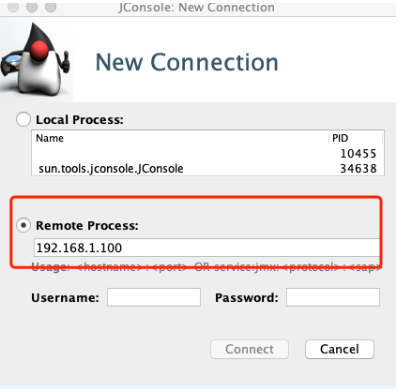

## 2、四字母命令

除了上面介绍的 JConsole 监控控制台之外，ZooKeeper 还提供了一些命令，可使我们更加灵活地统计监控 ZooKeeper 服务的状态信息。 ZooKeeper 提供的这些命令也叫作四字母命令，如它们的名字一样，每一个命令都是由四个字母组成的。如下代码所示，在操作时，我们会打开系统的控制台，并输入相关的命令来查询 ZooKeeper 服务，比如我们可以输入 stat 命令来查看数据节点等信息。

echo {command} | nc 127.0.0.1 2181 

介绍完四字母命令的调用方式和执行格式后，接下来我们介绍几种常见的四字母命令，分别是 stat 、srvr，以及 cons 等。

### 1、stat

stat 命令的作用是监控 ZooKeeper 服务器的状态，我们通过 stat 命令统计 ZooKeeper 服务器的 ZooKeeper 版本信息、集群数节点等信息，如下面的代码所示，我们在操作时会输入 echo stat 命令来输出查询到的服务状态信息到控制台。


```
$ echo stat | nc localhost 2181 
Zookeeper version: 3.4.13- built on 06/29/2018 04:05 GMT 
Clients: 
 /0:0:0:0:0:0:0:1:40598[0](queued=0,recved=1,sent=0) 
Latency min/avg/max: 0/0/0 
Received: 17 
Sent: 16 
Connections: 1 
Outstanding: 0 
Zxid: 0x0 
Mode: follower 
Node count: 4 
```

### 2、srvr

srvr 命令与 stat 命令的功能十分相似，唯一不同的地方是 srvr 命令不会将与客户端的连接情况输出，通过 srvr 命令只会查询服务器的自身信息。

```
$ echo srvr | nc localhost 2181 
Zookeeper version: 3.4.13- built on 06/29/2018 04:05 GMT 
Latency min/avg/max: 0/0/0 
Received: 26 
Sent: 25 
Connections: 1 
Outstanding: 0 
Zxid: 0x0 
Mode: follower 
Node count: 4 
```

### 3、cons

cons 命令用于输出当前这台服务器上所有客户端连接的详细信息，包括每个客户端的客户端 IP 、会话 ID 和最后一次与服务器交互的操作类型等。

```
$ echo cons | nc localhost 2181 
 /0:0:0:0:0:0:0:1:31569[0](queued=0,recved=1,sent=0) 
```


### 4、ruok

ruok 命令的主要作用是查询 ZooKeeper 服务器是否正常运行。如果 ZooKeeper 服务器正常运行，执行完 ruok 命令后，会得到 “imok” 返回值。如果 ZooKeeper 服务没有正常运行，则不会有任何返回值。在使用 ruok 命令的时候，在这里我们要注意的一点是，有些时候即使返回了 “imok” 字段，ZooKeeper 服务也可能没有正常运行，唯一能确定的是该台服务器的 2181 端口是打开的，如下代码所示。

$ echo ruok | nc localhost 2181 

## 3、监控集群信息

介绍完系统监控工具 JConsole 以及常用的命令后，接下来我们就从实际的生产角度出发，来看一下在 ZooKeeper 集群生产环境中如何监控系统集群运行情况，以及如何利用我们监控的数据诊断 ZooKeeper 服务的运行问题并解决问题。

虽然 ZooKeeper 服务提供了丰富的四字母命令，让我们可以通过命令来获得 ZooKeeper 服务相关的运行信息，但是在实际的生产环境中， ZooKeeper 集群的规模可能很大，逐一通过命令的方式监控 ZooKeeper 服务显然不可行。因此，这里我们会介绍一种自动的监控 ZooKeeper 集群运行服务的方式。

为了编写自动化监控 ZooKeeper 集群服务，首先我们要明确需要监控哪些数据类型，在这里我们主要对最小会话超时、最大会话超时、最大连接数、发送的数据包、接收的数据包进行监控，而具体的我们则会通过 Zabbix 来实现。


Zabbix 是一个性能监控的管理工具，它基于 Web 界面提供分布式系统监视，以及网络监视功能的企业级开源解决方案。


我们可以通过 Maven 或 Gradle 项目管理工具下载 Zabbix，这里我们主要以 Maven 工程为例，如下代码所示，需要在 pom 文件中引入相关的配置信息。

```xml
<dependency> 
    <groupId>io.github.cgi</groupId> 
    <artifactId>zabbix-api</artifactId> 
    <version>0.0.5</version> 
</dependency> 
```


将 Zabbix 引入到我们的工程项目后，接下来，就可以编写一个程序来自动化地获取 ZooKeeper 服务的相关信息。这里我们创建一个 ZooKeeperInfo 脚本，如下代码所示，在脚本文件中我们创建了一个 mntr 数组变量用来设置我们想要监控的服务参数，比如 minSessionTimeout 最小超时时间、maxSessionTimeout 最大超时时间等。

```java
public class ZooKeepInfo(){ 
	Static Final String ZookeeperServer = '127.0.0.1' 
	Static Final String ZookeeperPort = 2181 
	Static Final String ZookeeperCommand = 'mntr' 
	Static Final String ZookeeperKey = 'zk_version 
	 
	CommandKey={ 
	'conf':['clientPort','dataDir','dataLogDir','tickTime','maxClientCnxns','minSessionTimeout','maxSessionTimeout','serverId','initLimit','syncLimit','electionAlg','electionPort','quorumPort','peerType'], 
	'ruok':['state'], 
	'mntr':['zk_version','zk_avg_latency','zk_max_latency','zk_min_latency','zk_packets_received','zk_packets_sent','zk_num_alive_connections','zk_outstanding_requests','zk_server_state','zk_znode_count','zk_watch_count','zk_ephemerals_count','zk_approximate_data_size','zk_open_file_descriptor_count','zk_max_file_descriptor_count','zk_followers','zk_synced_followers','zk_pending_syncs'] 
	} 
	 
	class ZooKeeperCommands(object): 
	    def ZooKeeperCommands(self,server,port,zkCommand,zkKey): 
	        self._server = server 
	        self._port = port 
	        self._zkCommand = zkCommand 
	        self._zkKey = zkKey 
	        self._value_raw = None 
	        self._value = None  
	 
	    void zkExec(this): 
	        self._exec_command() 
	        self._parse_value() 
	        return self._value 
	     
	    void _exec_command(this): 
	        Telnet tn = Telnet(self._server, self._port, timeout=30) 
	        tn.read_until('login: ') 
	        tn.write(username + '\n') 
	        tn.read_until('password: ') 
	        tn.write(password + '\n') 
	        tn.read_until(finish) 
	} 
```


本节课我们主要学习了 ZooKeeper 集群在日常生产环境中的维护问题。首先介绍了 ZooKeeper 集群通过 JMX 方式进行远程监控的方法，然后学习了 JConsole 以及四字母命令的使用方式，最后介绍了在实际工作中，面对大规模的 ZooKeeper 集群时，我们如何做到自动化的获取监控数据。

本节课在实现自动化的数据获取时，利用了一个开源的性能监控工具 Zabbix 。除了课中提到的一些性能监控参数外，我们也可以利用 Zabbix 监控一些和自身业务相关的数据信息，比如在对数据节点的创建数量有严格要求的情况下，我们可以编写相关的脚本对某一个数据节点下子节点的创建个数进行监控，当该子节点个数大于我们设置的某一个临界值时，会给出报警或禁止该节点再进行创建操作。


# 第27讲：crontab 与 PurgeTxnLog：线上系统日志清理的最佳时间和方式


本节课，我们主要学习对线上 ZooKeeper 服务器日志进行维护的操作，主要维护方式是备份和清理。几乎所有的生产系统都会产生日志文件，用来记录服务的运行状态，在服务发生异常的时候，可以用来作为分析问题原因的依据。ZooKeeper 作为分布式系统下的重要组件，在分布式网络中会处理大量的客户端请求，因此也会产生大量的日志文件，对这些问题的维护关系到整个 ZooKeeper 服务的运行质量。接下来我们就来学习如何维护这些日志文件。


首先，我们先来介绍线上生产环境中的 ZooKeeper 集群在对外提供服务的过程中，都会产生哪些日志类型。我们在之前的课程中也介绍过了，在 ZooKeeper 服务运行的时候，一般会产生数据快照和日志文件，数据快照用于集群服务中的数据同步，而数据日志则记录了 ZooKeeper 服务运行的相关状态信息。其中，数据日志是我们在生产环境中需要定期维护和管理的文件。


如上面所介绍的，面对生产系统中产生的日志，一般的维护操作是备份和清理。备份是为了之后对系统的运行情况进行排查和优化，而清理主要因为随着系统日志的增加，日志会逐渐占用系统的存储空间，如果一直不进行清理，可能耗尽系统的磁盘存储空间，并最终影响服务的运行。但在实际工作中，我们不能 24 小时监控系统日志情况，因此这里我们介绍一种定时任务，可以自动清理和备份 ZooKeeper 服务运行产生的相关日志。


## 1、corntab

首先，我们介绍的是 Linux corntab ，它是 Linux 系统下的软件，可以自动地按照我们设定的时间，周期性地执行我们编写的相关脚本。下面我们就用它来写一个定时任务，实现每周定期清理 ZooKeeper 服务日志。


我们通过 Linux 系统下的 Vim 文本编辑器，来创建一个叫作 “ logsCleanWeek ” 的定时脚本，该脚本是一个 shell 格式的可执行文件。如下面的代码所示，我们在 usr/bin/ 文件夹下创建该文件，该脚本的主要内容是设定 ZooKeeper 快照和数据日志的对应文件夹路径，并通过 shell 脚本和管道和 find 命令 查询对应的日志下的日志文件，这里我们保留最新的 10 条数据日志，其余的全部清理。

```shell
#!/bin/bash 
dataDir=/home/zk/zk_data/version-2 
dataLogDir=/home/zk/zk_log/version-2 
ls -t $dataLogDir/log.* | tail -n +$count | xargs rm -f 
ls -t $dataDir/snapshot.* | tail -n +$count | xargs rm -f 
ls -t $logDir/zookeeper.log.* | tail -n +$count | xargs rm -f  
find /home/home/zk/zk_data/version-2 -name "snap*" -mtime +1 | xargs rm -f                              
find /home/home/zk/zk_data/version-2 -name "snap*" -mtime +1 | xargs rm -f               
find /home/home/zk/zk_data/logs/ -name "zookeeper.log.*" -mtime +1 | xargs rm –f
```

创建完定时脚本后，我们接下来就利用 corntab 来设置脚本的启动时间，如下面的代码所示。corntab 命令的语法比较简单，其中 -u 表示设定指定的用户，因为 Linux 系统是一个多用户操作系统，而 crontab 的本质就是根据使用系统的用户来设定程序执行的时间计划表。因此当命令的执行者具有管理员 root 账号的权限时，可以通过 -u 为特定用户设定某一个程序的具体执行时间。

crontab [ -u user ] { -l | -r | -e } 

接下来我们打开系统的控制台，并输入 crontab -e 命令，开启定时任务的编辑功能。如下图所示，系统会显示出当前已有的定时任务列表。整个 crontab 界面的操作逻辑和 Vim 相同，为了新建一个定时任务，我们首先将光标移动到文件的最后一行，并敲击 i 键来开启编辑模式。

这个 crontab 定时脚本由两部分组成，第一部分是定时时间，第二部分是要执行的脚本。如下代码所示，脚本的执行时间是按照 f1 分、 f2 小时、f3 日、f4 月、f5 一个星期中的第几天这种固定顺序格式编写的。

f1 f2 f3 f4 f5 program 

当对应的时间位上为 * 时，表示每间隔一段时间都要执行。例如，当 f1 分上设定的是 * 时，表示每分钟都要执行对应的脚本。而如果我们想在每天的特定时间执行对应的脚本，则可以通过在对应的时间位置设定一个时间段实现，以下代码所演示的就是将脚本清理时间设定为每天早上的 6 点到 8 点。

0 6-8 * * * /usr/bin/logsCleanWeek.sh>/dev/null 2>&1 

当我们设定完定时任务后，就可以打开控制台，并输入 crontab -l 命令查询系统当前的定时任务。


到目前为止我们就完成了用 crontab 创建定时任务来自动清理和维护 ZooKeeper 服务产生的相关日志和数据的过程。

crontab 定时脚本的方式相对灵活，可以按照我们的业务需求来设置处理日志的维护方式，比如这里我们希望定期清除 ZooKeeper 服务运行的日志，而不想清除数据快照的文件，则可以通过脚本设置，达到只对数据日志文件进行清理的目的。

## 2、PurgeTxnLog

除了上面所介绍的，通过编写 crontab 脚本定时清理 ZooKeeper 服务的相关日志外， ZooKeeper 自身还提供了 PurgeTxnLog 工具类，用来清理 snapshot 数据快照文件和系统日志。

PurgeTxnLog 清理方式和我们上面介绍的方式十分相似，也是通过定时脚本执行任务，唯一的不同是，上面提到在编写日志清除 logsCleanWeek 的时候 ，我们使用的是原生 shell 脚本自己手动编写的数据日志清理逻辑，而使用 PurgeTxnLog 则可以在编写清除脚本的时候调用 ZooKeeper 为我们提供的工具类完成日志清理工作。

如下面的代码所示，首先，我们在 /usr/bin 目录下创建一个 PurgeLogsClean 脚本。注意这里的脚本也是一个 shell 文件。在脚本中我们只需要编写 PurgeTxnLog 类的调用程序，系统就会自动通过 PurgeTxnLog 工具类为我们完成对应日志文件的清理工作。

```shell
#!/bin/sh  
java -cp "$CLASSPATH" org.apache.zookeeper.server.PurgeTxnLog 
echo "清理完成" 
```

PurgeTxnLog 方式与 crontab 相比，使用起来更加容易而且也更加稳定安全，不过 crontab 方式更加灵活，我们可以根据不同的业务需求编写自己的清理逻辑。

本节课我们介绍了线上 ZooKeeper 服务日志和数据快照的清理和维护工作，可以通过 crontab 和 PurgeTxnLog 两种方式实现。这两种方式唯一的不同在清理日志脚本的实现方式上，crontab 是通过我们自己手动编写的 shell 脚本实现的，在执行上需要考虑脚本权限相关的问题，而 PurgeTxnLog 则是 ZooKeeper 提供的专门用来处理日志清除相关的工具类，使用起来更加容易，开发人员不用考虑底层的实现细节。这里希望你结合自身工作中的生产环境来选择一种适合自己的 ZooKeeper 数据维护方式。


> 模块五：原理篇

# 第28讲：彻底掌握二阶段提交/三阶段提交算法原理

在本节课的开篇中，我们已经提到过 ZooKeeper 在分布式系统环境中主要解决的是分布式一致性问题。而为什么会发生数据不一致的问题呢？是因为当网络集群处理来自客户端的请求时，其中的事务性会导致服务器上数据状态的变更。

为了保证数据变更请求在整个分布式环境下正确地执行，不会发生异常中断，从而导致请求在某一台服务器执行失败而在集群中其他服务器上执行成功，在整个分布式系统处理数据变更请求的过程中，引入了分布式事务的概念。


对于事务操作我们并不陌生，最为熟悉的就是数据库事务操作。当多个线程对数据库中的同一个信息进行修改的时候，为保证数据的原子性、一致性、隔离性、持久性，需要进行本地事务性操作。而在分布式的网络环境下，也会面临多个客户端的数据请求服务。在处理数据变更的时候，需要保证在分布式环境下的数据的正确完整，因此在分布式环境下也引入了分布式事务。

## 1、二阶段提交

二阶段提交（Two-phase Commit）简称 2PC ，它是一种实现分布式事务的算法。二阶段提交算法可以保证分布在不同网络节点上的程序或服务按照事务性的方式进行调用。

正如算法的名字一样，二阶段提交的底层实现主要分成两个阶段，分别是询问阶段和提交阶段。具体过程如下图所示：

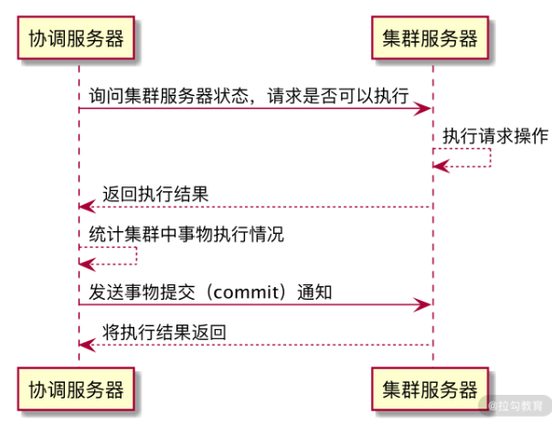

整个集群服务器被分成一台协调服务器，集群中的其他服务器是被协调的服务器。在二阶段算法的询问阶段，分布式集群服务在接收到来自客户端的请求的时候，首先会通过协调者服务器，针对本次请求能否正常执行向集群中参与处理的服务器发起询问请求。集群服务器在接收到请求的时候，会在本地机器上执行会话操作，并记录执行的相关日志信息，最后将结果返回给协调服务器。


在协调服务器接收到来自集群中其他服务器的反馈信息后，会对信息进行统计。如果集群中的全部机器都能正确执行客户端发送的会话请求，那么协调者服务器就会再次向这些服务器发送提交命令。在集群服务器接收到协调服务器的提交指令后，会根据之前处理该条会话操作的日志记录在本地提交操作，并最终完成数据的修改。

虽然二阶段提交可以有效地保证客户端会话在分布式集群中的事务性，但是该算法自身也有很多问题，主要可以归纳为以下几点：效率问题、单点故障、异常中断。

### 1、性能问题

首先，我们先来介绍一下性能问题。如我们上面介绍的二阶段算法，在数据提交的过程中，所有参与处理的服务器都处于阻塞状态，如果其他线程想访问临界区的资源，需要等待该条会话请求在本地执行完成后释放临界区资源。因此，采用二阶段提交算法也会降低程序并发执行的效率。

### 2、单点问题

此外，还会发生单点问题。单点问题也叫作单点服务器故障问题，它指的是当作为分布式集群系统的调度服务器发生故障时，整个集群因为缺少协调者而无法进行二阶段提交算法。单点问题也是二阶段提交最大的缺点，因此使用二阶段提交算法的时候通常都会进行一些改良，以满足对系统稳定性的要求。

### 3、异常中断

异常中断问题指的是当统计集群中的服务器可以进行事务操作时，协调服务器会向这些处理事务操作的服务器发送 commit 提交请求。如果在这个过程中，其中的一台或几台服务器发生网络故障，无法接收到来自协调服务器的提交请求，导致这些服务器无法完成最终的数据变更，就会造成整个分布式集群出现数据不一致的情况。

由于以上种种问题，在实际操作中，我更推荐使用另一种分布式事务的算法——三阶段提交算法。

## 2、三阶段提交

三阶段提交（Three-phase commit）简称 3PC ， 其实是在二阶段算法的基础上进行了优化和改进。如下图所示，在整个三阶段提交的过程中，相比二阶段提交，增加了预提交阶段。

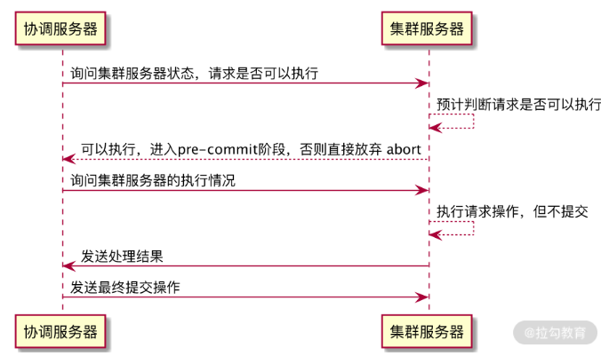


### 1、预提交阶段

为了保证事务性操作的稳定性，同时避免二阶段提交中因为网络原因造成数据不一致等问题，完成提交准备阶段后，集群中的服务器已经为请求操作做好了准备，协调服务器会向参与的服务器发送预提交请求。集群服务器在接收到预提交请求后，在本地执行事务操作，并将执行结果存储到本地事务日志中，并对该条事务日志进行锁定处理。

### 2、提交阶段

在处理完预提交阶段后，集群服务器会返回执行结果到协调服务器，最终，协调服务器会根据返回的结果来判断是否继续执行操作。如果所有参与者服务器返回的都是可以执行事务操作，协调者服务器就会再次发送提交请求到参与者服务器。参与者服务器在接收到来自协调者服务器的提交请求后，在本地正式提交该条事务操作，并在完成事务操作后关闭该条会话处理线程、释放系统资源。当参与者服务器执行完相关的操作时，会再次向协调服务器发送执行结果信息。

协调者服务器在接收到返回的状态信息后会进行处理，如果全部参与者服务器都正确执行，并返回 yes 等状态信息，整个事务性会话请求在服务端的操作就结束了。如果在接收到的信息中，有参与者服务器没有正确执行，则协调者服务器会再次向参与者服务器发送 rollback 回滚事务操作请求，整个集群就退回到之前的状态，这样就避免了数据不一致的问题。


为了保证数据的有一致性，我们引入了二阶段提交和三阶段提交算法。这两种算法都会将整个事务处理过程分成准备、执行、确认提交这几个阶段。不同的是，二阶段提交会因为网络原因造成数据不一致的问题，而三阶段提交通过增加预加载阶段将执行的事务数据保存到本地，当整个网络中的参与者服务器都能进行事务操作后，协调服务器会发送最终提交请求给参与者服务器，并最终完成事务操作的数据的修改。


# 第29讲：ZAB 协议算法：崩溃恢复和消息广播

在之前的课程中我们曾谈到当 Leader 节点发生崩溃的时候，在 ZooKeeper 集群中会重新选举出新的 Leader 节点服务器，以保证 ZooKeeper 集群的可用性。那么从 Leader 节点发生崩溃到重新恢复中间经历了哪些过程，又是采用什么算法恢复集群服务的？带着这些问题我们来学习本节课的内容。

## 1、ZAB 协议算法

ZooKeeper 最核心的作用就是保证分布式系统的数据一致性，而无论是处理来自客户端的会话请求时，还是集群 Leader 节点发生重新选举时，都会产生数据不一致的情况。为了解决这个问题，ZooKeeper 采用了 ZAB 协议算法。

ZAB 协议算法（Zookeeper Atomic Broadcast  ，Zookeeper 原子广播协议）是 ZooKeeper 专门设计用来解决集群最终一致性问题的算法，它的两个核心功能点是崩溃恢复和原子广播协议。

在整个 ZAB 协议的底层实现中，ZooKeeper 集群主要采用主从模式的系统架构方式来保证 ZooKeeper 集群系统的一致性。整个实现过程如下图所示，当接收到来自客户端的事务性会话请求后，系统集群采用主服务器来处理该条会话请求，经过主服务器处理的结果会通过网络发送给集群中其他从节点服务器进行数据同步操作。


以 ZooKeeper 集群为例，这个操作过程可以概括为：当 ZooKeeper 集群接收到来自客户端的事务性的会话请求后，集群中的其他 Follow 角色服务器会将该请求转发给 Leader 角色服务器进行处理。当 Leader 节点服务器在处理完该条会话请求后，会将结果通过操作日志的方式同步给集群中的 Follow 角色服务器。然后 Follow 角色服务器根据接收到的操作日志，在本地执行相关的数据处理操作，最终完成整个 ZooKeeper 集群对客户端会话的处理工作。

## 2、崩溃恢复

在介绍完 ZAB 协议在架构层面的实现逻辑后，我们不难看出整个 ZooKeeper 集群处理客户端会话的核心点在一台 Leader 服务器上。所有的业务处理和数据同步操作都要靠 Leader 服务器完成。目前介绍的 ZooKeeper 架构方式而言，极易产生单点问题，即当集群中的 Leader 发生故障的时候，整个集群就会因为缺少 Leader 服务器而无法处理来自客户端的事务性的会话请求。因此，为了解决这个问题。在 ZAB 协议中也设置了处理该问题的崩溃恢复机制。

崩溃恢复机制是保证 ZooKeeper 集群服务高可用的关键。触发 ZooKeeper 集群执行崩溃恢复的事件是集群中的 Leader 节点服务器发生了异常而无法工作，于是 Follow 服务器会通过投票来决定是否选出新的 Leader 节点服务器。

投票过程如下：当崩溃恢复机制开始的时候，整个 ZooKeeper 集群的每台 Follow 服务器会发起投票，并同步给集群中的其他 Follow 服务器。在接收到来自集群中的其他 Follow 服务器的投票信息后，集群中的每个 Follow 服务器都会与自身的投票信息进行对比，如果判断新的投票信息更合适，则采用新的投票信息作为自己的投票信息。在集群中的投票信息还没有达到超过半数原则的情况下，再进行新一轮的投票，最终当整个 ZooKeeper 集群中的 Follow 服务器超过半数投出的结果相同的时候，就会产生新的 Leader 服务器。

## 3、选票结构

介绍完整个选举 Leader 节点的过程后，我们来看一下整个投票阶段中的投票信息具有怎样的结构。以 Fast Leader Election 选举的实现方式来讲，如下图所示，一个选票的整体结果可以分为一下六个部分：

- 1、logicClock：用来记录服务器的投票轮次。logicClock 会从 1 开始计数，每当该台服务经过一轮投票后，logicClock 的数值就会加 1 。

- 2、state：用来标记当前服务器的状态。在 ZooKeeper 集群中一台服务器具有 LOOKING、FOLLOWING、LEADERING、OBSERVING 这四种状态。

- 3、self_id：用来表示当前服务器的 ID 信息，该字段在 ZooKeeper 集群中主要用来作为服务器的身份标识符。

- 4、self_zxid： 当前服务器上所保存的数据的最大事务 ID ，从 0 开始计数。

- 5、vote_id：投票要被推举的服务器的唯一 ID 。

- 6、vote_zxid：被推举的服务器上所保存的数据的最大事务 ID ，从 0 开始计数。

当 ZooKeeper 集群需要重新选举出新的 Leader 服务器的时候，就会根据上面介绍的投票信息内容进行对比，以找出最适合的服务器。

## 4、选票筛选

接下来我们再来看一下，当一台 Follow 服务器接收到网络中的其他 Follow 服务器的投票信息后，是如何进行对比来更新自己的投票信息的。Follow 服务器进行选票对比的过程。

首先，会对比 logicClock 服务器的投票轮次，当 logicClock 相同时，表明两张选票处于相同的投票阶段，并进入下一阶段，否则跳过。接下来再对比 vote_zxid 被选举的服务器 ID 信息，若接收到的外部投票信息中的 vote_zxid 字段较大，则将自己的票中的 vote_zxid 与 vote_myid 更新为收到的票中的 vote_zxid 与 vote_myid ，并广播出去。要是对比的结果相同，则继续对比 vote_myid 被选举服务器上所保存的最大事务 ID ，若外部投票的 vote_myid 比较大，则将自己的票中的 vote_myid 更新为收到的票中的 vote_myid 。 经过这些对比和替换后，最终该台 Follow 服务器会产生新的投票信息，并在下一轮的投票中发送到 ZooKeeper 集群中。

## 5、消息广播

在 Leader 节点服务器处理请求后，需要通知集群中的其他角色服务器进行数据同步。ZooKeeper 集群采用消息广播的方式发送通知。

ZooKeeper 集群使用原子广播协议进行消息发送，该协议的底层实现过程与我们在“ 28 | 彻底掌握二阶段提交/三阶段提交算法原理” 的二阶段提交过程非常相似。


当要在集群中的其他角色服务器进行数据同步的时候，Leader 服务器将该操作过程封装成一个 Proposal 提交事务，并将其发送给集群中其他需要进行数据同步的服务器。当这些服务器接收到 Leader 服务器的数据同步事务后，会将该条事务能否在本地正常执行的结果反馈给 Leader 服务器，Leader 服务器在接收到其他 Follow 服务器的反馈信息后进行统计，判断是否在集群中执行本次事务操作。

这里请大家注意 ，与我们“ 28 | 彻底掌握二阶段提交/三阶段提交算法原理” 中提到的二阶段提交过程不同（即需要集群中所有服务器都反馈可以执行事务操作后，主服务器再次发送 commit 提交请求执行数据变更） ，ZAB 协议算法省去了中断的逻辑，当 ZooKeeper 集群中有超过一般的 Follow 服务器能够正常执行事务操作后，整个 ZooKeeper 集群就可以提交 Proposal 事务了。

> 总结

本节课我们主要介绍了 ZooKeeper 中的 ZAB 协议算法。 ZAB 协议算法能够保证 ZooKeeper 集群服务在处理事务性请求后的数据一致性 ，当集群中的 Leader 服务器发生崩溃的时候，ZAB 协议算法可以在 ZooKeeper 集群中重新选举 Leader 并进行数据的同步恢复。其中值得注意的是消息广播的底层实现过程虽然与二阶段提交非常相似，但是与二阶段提交相比，并没有事务丢弃的过程。在 ZooKeeper 集群的消息广播中，只要满足整个集群中超过半数的 Follow 服务器可以执行本次事务操作，Leader 就可以向集群中发送提交事务操作，最终完成数据的变更。

# 第30讲：ZAB 与 Paxos 算法的联系与区别


## 1、Paxos 算法

在分布式一致性问题的解决方案中，Paxos 算法可以说是目前最为优秀的。很多方案，包括我们学习的 ZooKeeper 的 ZAB 协议算法都是在其基础上改进和演变过来的。

Paxos 算法是基于消息传递的分布式一致性算法，很多大型的网络技术公司和开源框架都采用 Paxos 算法作为其各自的底层解决方案，比如 Chubby 、 Megastore 以及 MySQL Group Replication 。 Paxos 算法运行在服务器发生宕机故障的时候，能够保证数据的完整性，不要求可靠的消息传递，可容忍消息丢失、延迟、乱序以及重复，保证服务的高可用性。


介绍完 Paxos 算法能够解决哪些问题后，接下来我们继续学习 Paxos 算法的底层实现过程。保证分布式系统下数据的一致性操作，本质是协调运行在不同的网络服务器上的线程服务，使这些服务就某一个特定的数据执行一致性的变更操作。在整个 Paxos 算法的实现过程中，将参与算法的集群中的全部服务器，分成三种角色：提议者（Proposer）、决策者（Acceptor）、决策学习者（Learner）。

先来看看三种角色的具体分工。

- 提议者（Proposer）：提出提案（Proposal）。Proposal 信息包括提案编号（Proposal ID）和提议的值（Value）。

- 决策者（Acceptor）：参与决策，回应 Proposers 的提案。收到 Proposal 后可以接受提案，若 Proposal 获得超过半数 Acceptors 的许可，则称该 Proposal 被批准。

- 决策学习者：不参与决策，从 Proposers/Acceptors 学习最新达成一致的提案（Value）。

经过我们之前对 ZooKeeper 的学习，相信对 Paxos 算法的集群角色划分并不陌生。而与 ZAB 协议算法不同的是，在 Paxos 算法中，当处理来自客户端的事务性会话请求的过程时，首先会触发一个或多个服务器进程，就本次会话的处理发起提案。当该提案通过网络发送到集群中的其他角色服务器后，这些服务器会就该会话在本地的执行情况反馈给发起提案的服务器。发起提案的服务器会在接收到这些反馈信息后进行统计，当集群中超过半数的服务器认可该条事务性的客户端会话操作后，认为该客户端会话可以在本地执行操作。

上面介绍的 Paxos 算法针对事务性会话的处理投票过程与 ZAB 协议十分相似，但不同的是，对于采用 ZAB 协议的 ZooKeeper 集群中发起投票的机器，所采用的是在集群中运行的一台 Leader 角色服务器。而 Paxos 算法则采用多副本的处理方式，即存在多个副本，每个副本分别包含提案者、决策者以及学习者。下图演示了三种角色的服务器之间的关系。

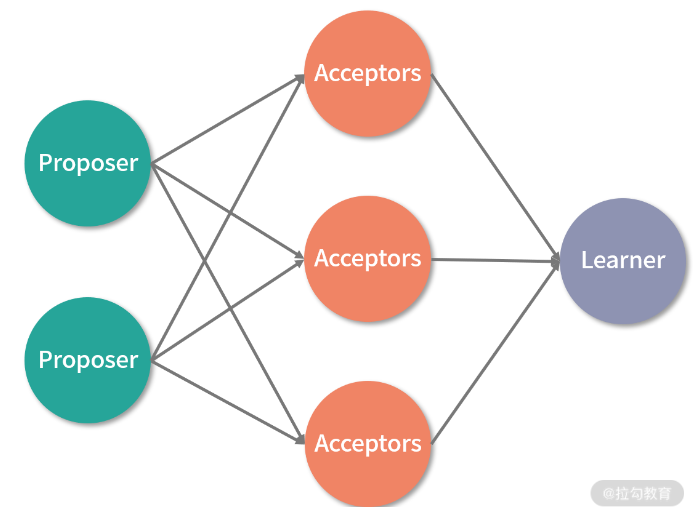


介绍完 Paxos 算法中的服务器角色和投票的处理过程后，接下来我们再来看一下 Paxos 针对一次提案是如何处理的。如下图所示，整个提案的处理过程可以分为三个阶段，分别是提案准备阶段、事务处理阶段、数据同步阶段。我们分别介绍一下这三个阶段的底层处理逻辑。

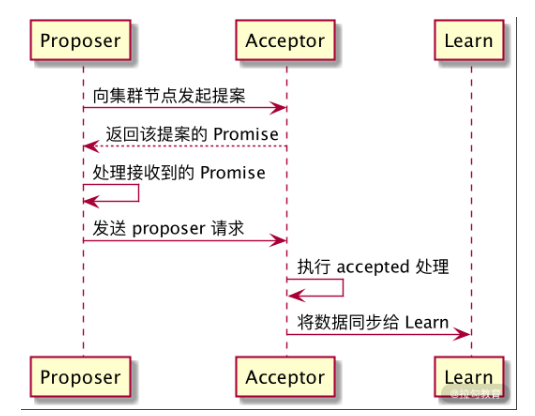

- 提案准备阶段：该阶段是整个 Paxos 算法的最初阶段，所有接收到的来自客户端的事务性会话在执行之前，整个集群中的 Proposer 角色服务器或者节点，需要将会话发送给 Acceptor 决策者服务器。在 Acceptor 服务器接收到该条询问信息后，需要返回 Promise ，承诺可以执行操作信息给 Proposer 角色服务器。

- 事务处理阶段：在经过提案准备阶段，确认该条事务性的会话操作可以在集群中正常执行后，Proposer 提案服务器会再次向 Acceptor 决策者服务器发送 propose 提交请求。Acceptor 决策者服务器在接收到该 propose 请求后，在本地执行该条事务性的会话操作。

- 数据同步阶段：在完成了事务处理阶段的操作后，整个集群中对该条事务性会话的数据变更已经在 Acceptor 决策者服务器上执行完成，当整个集群中有超过半数的 Acceptor 决策者服务器都成功执行后，Paxos 算法将针对本次执行结果形成一个决议，并发送给 Learner 服务器。当 Learner 服务器接收到该条决议信息后，会同步 Acceptor 决策者服务器上的数据信息，最终完成该条事务性会话在整个集群中的处理。

## 2、Paxos PK ZAB

经过上面的介绍我们对 Paxos 算法所能解决的问题，以及底层的实现原理都有了一个详细的了解。现在结合我们之前学习的 ZooKeeper 相关知识，来看看 Paxos 算法与 ZAB 算法的相同及不同之处。

相同之处是，在执行事务行会话的处理中，两种算法最开始都需要一台服务器或者线程针对该会话，在集群中发起提案或是投票。只有当集群中的过半数服务器对该提案投票通过后，才能执行接下来的处理。

而 Paxos 算法与 ZAB 协议不同的是，Paxos 算法的发起者可以是一个或多个。当集群中的 Acceptor 服务器中的大多数可以执行会话请求后，提议者服务器只负责发送提交指令，事务的执行实际发生在 Acceptor 服务器。这与 ZooKeeper 服务器上事务的执行发生在 Leader 服务器上不同。Paxos 算法在数据同步阶段，是多台 Acceptor 服务器作为数据源同步给集群中的多台 Learner 服务器，而 ZooKeeper 则是单台 Leader 服务器作为数据源同步给集群中的其他角色服务器。

> 总结

本节课我们主要介绍了 Paxos 算法，该算法在解决分布式一致性问题上被广泛采用。Paxos 算法将集群中的服务器或网络节点分为提议者（Proposer）、决策者（Acceptor）、决策学习者（Learner），在处理事务性会话请求的时候，会针对该会话操作在集群中通过提议者（Proposer）服务器发起询问操作，之后由决策者（Acceptor）服务器决定是否执行。在集群中多数服务器都正确执行会话操作后，决策学习者（Learner）会同步（Acceptor）服务器上的数据，并完成最终的操作。


# 第31讲：ZooKeeper 中二阶段提交算法的实现分析


在学习 ZAB 协议和 Paxos 算法的过程中，我们曾提到在处理来自客户端的事务性请求时，为了保证整个集群的数据一致性，其各自的底层实现与二阶段算法都有相似之处。但我们知道，二阶段提交算法自身有一些缺点，比如容易发生单点故障，比如在并发性能上有一些瓶颈，那么今天就深入 ZooKeeper 的底层，来看一下 ZooKeeper 是如何克服这些问题，并实现自己特有的二阶段提交算法的。希望通过本节课的学习，帮助你进一步提高解决分布式一致性问题的能力。

## 1、提交请求

前面我们学到，二阶段提交的本质是协调和处理 ZooKeeper 集群中的服务器，使它们在处理事务性会话请求的过程中能保证数据一致性。如果把执行在 ZooKeeper 集群中各个服务器上的事务会话处理操作分别看作不同的函数，那么整个一致性的处理逻辑就相当于包裹这些函数的事务。而在单机环境中处理事务的逻辑是，包含在事务中的所有函数要么全部成功执行，要么全部都不执行。


不同的是，在分布式环境中，处理事务请求的各个函数是分布在不同的网络服务器上的线程，无法像在单机环境下一样，做到当事务中的某一个环节发生异常的时候，回滚包裹在整个事务中的操作。因此，分布式环境中处理事务操作的时候，一般的算法不会要求全部集群中的机器都成功执行操作，如果有其中一个函数执行异常，那么整个事务就会把所有函数的执行结果回滚到执行前的状态，也就是无论是正确执行的函数，还是执行异常的函数，各自所做的对数据和程序状态的变更都将被删除。

## 2、执行请求

看完提交请求的处理过程后，我们再来看一下在执行请求时 ZooKeeper 的底层实现过程。

ZooKeeper 集群中的 Leader 服务器对该条事务性会话操作是否能够在 Follow 服务器上执行，向集群中的 Follow 服务器发起 Proposal 请求。

这里请你注意，与我们之前介绍的二阶段提交不同的是，在 ZooKeeper 的实现中并没有中断提交的逻辑。集群中的 Follow 服务器在接收到上述 Proposal 请求后，只有两种处理情况：

- 第一种情况：ZooKeeper 集群中的 Follow 服务器能够正确执行操作，并向 ZooKeeper 集群中的 Leader 反馈执行结果。

- 第二种情况：无法正确执行该条 Proposal 操作，直接抛弃该条请求。

ZooKeeper 集群的这种执行逻辑，最终导致无须等待所有服务器都执行完成并反馈，集群中的 Leader 服务器只需要接收到集群中过半数的 Follow 服务器成功执行的反馈信息， ZooKeeper 集群中的 Leader 服务器最终会统计 Follow 服务器反馈的信息，当超过半数以上服务器可以正确执行操作后，整个 ZooKeeper 集群就可以进入执行事务提交操作。


介绍完 ZooKeeper 实现二阶段提交算法的原理后，接下来我们深入代码层面看看 ZooKeeper 是如何设计架构的。

从源码层面来讲，ZooKeeper 在实现整个二阶段提交算法的过程中，可以分为 Leader 服务器端的发起 Proposal 操作和 Follow 服务器端的执行反馈操作。

我们先来看看，在 ZooKeeper 集群中的 Leader 是如何向其他 Follow 服务器发送 Proposal 请求的呢？

如下面的代码所示， ZooKeeper 通过 SendAckRequestProcessor 类发送 Proposal 来提交请求。这个类首先继承了 RequestProcessor 类，但是它不是处理来自客户端的请求信息，而是用来处理向 Follow 服务器发送的 Proposal 请求信息。它在内部通过 processRequest 函数来判断，责任链中传递请求操作是否是数据同步操作：如果判断是 OpCode.sync 操作（也就是数据同步操作），就通过 learner.writePacket 方法把 Proposal 请求向集群中的所有 Follow 服务器进行发送。

```java
public class SendAckRequestProcessor implements RequestProcessor, Flushable { 
  public void processRequest(Request si) { 
    if(si.type != OpCode.sync){ 
        QuorumPacket qp = new QuorumPacket(Leader.ACK, si.getHdr().getZxid(), null, 
            null); 
        try { 
            learner.writePacket(qp, false); 
        } catch (IOException e) { 
            LOG.warn("Closing connection to leader, exception during packet send", e); 
            try { 
                if (!learner.sock.isClosed()) { 
                    learner.sock.close(); 
                } 
            } catch (IOException e1) { 
                // Nothing to do, we are shutting things down, so an exception here is irrelevant 
                LOG.debug("Ignoring error closing the connection", e1); 
            } 
        } 
    } 
} 
} 
```

在介绍完 ZooKeeper 集群中的 Leader 服务器发送 Proposal 的底层实现过程后，接下来我们再来学习一下 Follow 服务端在接收到 Leader 服务器发送的 Proposal 后的整个处理逻辑。

如下面的代码所示，这在 Follow 服务器端是通过 ProposalRequestProcessor 来完成处理的。ProposalRequestProcessor 构造函数中首先初始化了 Leader 服务器、下一个请求处理器，以及负责反馈执行结果给 Leader 服务器的 AckRequestProcessor 处理器。

```java
public ProposalRequestProcessor(LeaderZooKeeperServer zks, 
        RequestProcessor nextProcessor) { 
    this.zks = zks; 
    this.nextProcessor = nextProcessor; 
    AckRequestProcessor ackProcessor = new AckRequestProcessor(zks.getLeader()); 
    syncProcessor = new SyncRequestProcessor(zks, ackProcessor); 
} 
```

接下来，我们进入到 AckRequestProcessor 函数的内部，来看一下 Follow 服务器是如何反馈处理结果给 Leader 服务器的。

如下面的代码所示， AckRequestProcessor 类同样也继承了 RequestProcessor，从中可以看出在 ZooKeeper 中处理 Leader 服务器的 Proposal 时，是将该 Proposal 请求当作网络中的一条会话请求来处理的。整个处理的逻辑实现也是按照处理链模式设计实现的，在 AckRequestProcessor 类的内部通过 processRequest 函数，来向集群中的 Leader 服务器发送 ack 反馈信息。

```java
class AckRequestProcessor implements RequestProcessor { 
public void processRequest(Request request) { 
    QuorumPeer self = leader.self; 
    if(self != null) 
        leader.processAck(self.getId(), request.zxid, null); 
    else 
        LOG.error("Null QuorumPeer"); 
}} 
```

> 总结

本节课我们主要介绍了，二阶段提交算法在 ZooKeeper 中的应用，并深入底层分析了 ZooKeeper 实现二阶段提交的具体过程。虽然二阶段提交自身有一些问题，不过还是一个比较好的解决分布式环境下一致性问题的算法，因此 ZooKeeper 在实现的过程中也借鉴了它，并通过自身的崩溃恢复机制来解决二阶段提交算法中的单点故障等问题。

从前几个课时到现在可以发现，无论是 Paxos 算法还是 ZAB 协议，都在原始的二阶段提交算法的基础上针对自身要解决的问题进行了修改和优化。面对复杂的网络环境，再优秀的算法也不是万能的。我们在学习算法的同时，更应该深入掌握其中的核心原理以及算法设计的目的，以便在日常工作中更好地解决遇到的问题。

这里给大家一道思考题：在二阶段提交算法中，不可缺少的一个环节就是，向集群中的服务器发送提案询问操作，当收到提案操作后，需要集群中的服务器给予反馈，这本质上就是一次客户端和服务器端的会话处理过程。而当会话的超时时间过长，虽然能够保证服务器的响应，但又会降低整个集群的处理性能。可是过短的超时时间，又可能会因为网络延迟或事务处理耗时，导致本可以正常执行的反馈信息并没有发送回提案服务器。那么如果是你，应该如何设置这个会话的超时时间呢？

# 第32讲：ZooKeeper 数据存储底层实现解析


在之前的“27 课| crontab 与 PurgeTxnLog：线上系统日志清理的最佳时间和方式”中，我们介绍了线上日志的清理方式，并讲解了 ZooKeeper 服务在运行的过程中产生的数据日志等文件。本节课我们将继续学习 ZooKeeper 文件存储和管理的相关知识，深入分析 ZooKeeper 文件系统的布局方式和不同文件的内部结构格式。


无论是 ZooKeeper 服务在运行时候产生的数据日志，还是在集群中进行数据同步的时候所用到的数据快照，都可以被看作一种文件系统。而文件系统的两个功能就是对文件的存储和对不同文件格式的解析。ZooKeeper 中的数据存储，可以分为两种类型：数据日志文件和快照文件，接下来我们就分别介绍这两种文件的结构信息和底层实现。

## 1、数据日志

在 ZooKeeper 服务运行的过程中，数据日志是用来记录 ZooKeeper 服务运行状态的数据文件。通过这个文件我们不但能统计 ZooKeeper 服务的运行情况，更可以在 ZooKeeper 服务发生异常的情况下，根据日志文件记录的内容来进行分析，定位问题产生的原因并找到解决异常错误的方法。

如何找到日志文件呢？在 ZooKeeper 的 zoo.cfg 配置文件中的 dataLogDir 属性字段，所指定的文件地址就是当前 ZooKeeper 服务的日志文件的存储地址。

在了解了 ZooKeeper 服务在运行的过程中所产生的日志文件的存放位置，以及日志文件的格式结构后，接下来我们就深入到 ZooKeeper 服务的底层，来看一下它是如何实现日志的搜集以及存储的。

### 1、搜集日志

我们先来看一下 ，ZooKeeper 是如何搜集程序的运行信息的。在统计操作情况的日志信息中，ZooKeeper 通过第三方开源日志服务框架 SLF4J 来实现的。

SLF4J 是一个采用门面设计模式（Facade） 的日志框架。如下图所示，门面模式也叫作外观模式，采用这种设计模式的主要作用是，对外隐藏系统内部的复杂性，并向外部调用的客户端或程序提供统一的接口。门面模式通常以接口的方式实现，可以被程序中的方法引用。

在下图中，我们用门面模式创建了一个绘制几何图形的小功能。首先，定义了一个 Shape 接口类，并分别创建了三个类 Circle、Square、Rectangle ，以继承 Shape 接口。其次，我们再来创建一个画笔类 ShapeMaker ，在该类中我定义了 shape 形状字段以及绘画函数 drawCircle等。

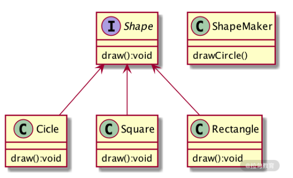

之后，当我们在本地项目中需要调用实现的会话功能时，直接调用 ShapeMaker 类，并传入我们要绘制的图形信息，就可以实现图形的绘制功能了。它使用起来非常简单，不必关心其底层是如何实现绘制操作的，只要将我们需要绘制的图形信息传入到接口函数中即可。

而在 ZooKeeper 中使用 SLF4J 日志框架也同样简单，如下面的代码所示，首先在类中通过工厂函数创建日志工具类 LOG，然后在需要搜集的操作流程处引入日志搜集函数 LOG.info 即可。

```java
protected static final Logger LOG = LoggerFactory.getLogger(Learner.class);
LOG.info("Revalidating client: 0x" + Long.toHexString(clientId));
LOG.warn("Couldn't find the leader with id = "
        + current.getId());
```

### 2、存储日志

接下来我们看一下搜集完的日志是什么样子的。在开头我们已经说过，系统日志的存放位置，在 zoo.cfg 文件中。假设我们的日志路径为dataDir=/var/lib/zookeeper，打开系统命令行，进入到该文件夹，就会看到如下图所示的样子，所有系统日志文件都放在了该文件夹下。


## 2、快照文件

除了上面介绍的记录系统操作日志的文件外，ZooKeeper 中另一种十分重要的文件数据是快照日志文件。快照日志文件主要用来存储 ZooKeeper 服务中的事务性操作日志，并通过数据快照文件实现集群之间服务器的数据同步功能。

### 1、快照创建

接下来我们来介绍，在 ZooKeeper 的底层实现中，一个快照文件是如何创建的。

如下面的代码所示，在 ZooKeeper 的源码中定义了一个 SnapShot 接口类，在该接口中描述了 ZooKeeper 服务的相关属性和方法。其中 serialize 函数是用来将内存中的快照文件转存到本地磁盘中时的序列化操作。而 deserialize 的作用正好与其相反，是把快照文件从本地磁盘中加载到内存中时的反序列化操作。无论是序列化还是反序列化，整个快照所操作的数据对象是 ZooKeeper 数据模型，也就是由 Znode 组成的结构树。

```java
public interface SnapShot {
  long deserialize(DataTree dt, Map<Long, Integer> sessions) 
    throws IOException;
    void serialize(DataTree dt, Map<Long, Integer> sessions,
               File name, boolean fsync)
    throws IOException;
    File findMostRecentSnapshot() throws IOException;
    void close() throws IOException;
}
```

### 2、快照存储

创建完 ZooKeeper 服务的数据快照文件后，接下来就要对数据文件进行持久化的存储操作了。其实在整个 ZooKeeper 中，随着服务的不同阶段变化，数据快照存放文件的位置也随之变化。存储位置的变化，主要是内存和本地磁盘之间的转变。当 ZooKeeper 集群处理来自客户端的事务性的会话请求的时候，会首先在服务器内存中针对本次会话生成数据快照。当整个集群可以执行该条事务会话请求后，提交该请求操作，就会将数据快照持久化到本地磁盘中，如下图所示。

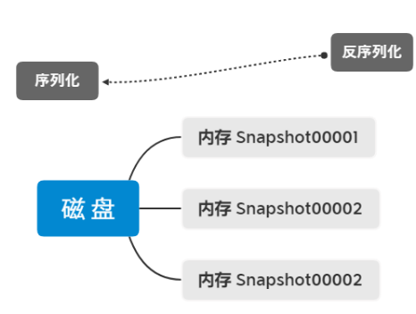

存储到本地磁盘中的数据快照文件，是经过 ZooKeeper 序列化后的二进制格式文件，通常我们无法直接查看，但如果想要查看，也可以通过 ZooKeeper 自带的 SnapshotFormatter 类来实现。如下图所示，在 SnapshotFormatter 类的内部用来查看快照文件的几种函数分别是： printDetails 函数，用来打印日志中的数据节点和 Session 会话信息；printZnodeDetails 函数，用来查看日志文件中节点的详细信息，包括节点 id 编码、state 状态信息、version 节点版本信息等。

```java
public class SnapshotFormatter {
  private void printDetails(DataTree dataTree, Map<Long, Integer> sessions) 
  private void printZnodeDetails(DataTree dataTree) 
  private void printZnode(DataTree dataTree, String name)
  private void printSessionDetails(DataTree dataTree, Map<Long, Integer> sessions) 
  private void printStat(StatPersisted stat)
  private void printHex(String prefix, long value) 
}
```

虽然 ZooKeeper 提供了 SnapshotFormatter 类，但其实现的查询功能比较单一，我们可以通过本节课的学习，按照自己的业务需求，编写自己的快照文件查看器。

到目前位置，我们对 ZooKeeper 服务相关的数据文件都做了讲解。无论是数据日志文件，还是数据快照文件，最终都会存储在本地磁盘中。而从文件的生成方式来看，两种日志文件的不同是：数据日志文件实施性更高，相对的产生的日志文件也不断变化，只要 ZooKeeper 服务一直运行，就会产生新的操作日志数据；而数据快照并非实时产生，它是当集群中数据发生变化后，先在内存中生成数据快照文件，经过序列化后再存储到本地磁盘中。

> 总结

本节课我们讲解了在 ZooKeeper 服务运行过程中所产生的两种主要数据文件：数据日志文件和数据快照文件的结构信息和底层实现，以便加强你对它们的理解。而数据日志文件如何监控并解决异常情况，数据快照文件如何实现数据同步等内容，我们在之前的课程中已经提到，希望你回顾之前的内容.
 
