<!-- TOC -->

- [1、ZooKeeper基础](#1zookeeper基础)
    - [1、ZooKeeper实现 Master-Worker 协同](#1zookeeper实现-master-worker-协同)
        - [1、HBase](#1hbase)
        - [2、Kafka](#2kafka)
        - [3、HDFS](#3hdfs)
    - [2、如何使用ZooKeeper 实现 master-worker](#2如何使用zookeeper-实现-master-worker)
    - [3、ZooKeeper数据模型](#3zookeeper数据模型)
    - [4、znode分类](#4znode分类)
    - [5、ZooKeeper 总体架构](#5zookeeper-总体架构)
- [2、ZooKeeper 开发介绍](#2zookeeper-开发介绍)
    - [1、ZooKeeper API简介](#1zookeeper-api简介)
    - [2、ZooKeeper Recipes-分布式队列](#2zookeeper-recipes-分布式队列)
    - [3、ZooKeeper Recipes-分布式锁](#3zookeeper-recipes-分布式锁)
    - [4、ZooKeeper Recipes-选举](#4zookeeper-recipes-选举)
    - [5、使用Apache Curator 简化ZooKeeper 开发](#5使用apache-curator-简化zookeeper-开发)
- [3、zookeeper运维](#3zookeeper运维)
    - [1、配置](#1配置)
    - [2、通过动态配置实现不中断服务的集群成员变更](#2通过动态配置实现不中断服务的集群成员变更)
    - [3、ZooKeeper 内部数据文件介绍](#3zookeeper-内部数据文件介绍)
- [4、进阶](#4进阶)
    - [1、服务发现](#1服务发现)
    - [2、Kafka 是如何使用ZooKeeper 的](#2kafka-是如何使用zookeeper-的)
- [5、对比Chubby、etcd和ZooKeeper](#5对比chubbyetcd和zookeeper)
    - [1、什么是Paxos 协议](#1什么是paxos-协议)
    - [2、MultiPaxos](#2multipaxos)
    - [3、比较Chubby 和ZooKeeper](#3比较chubby-和zookeeper)
    - [4、什么是Raft](#4什么是raft)
- [6、源码](#6源码)
    - [01、B-tree和b+tree](#01b-tree和btree)
    - [02、LSM（Log Structured Merge-tree）](#02lsmlog-structured-merge-tree)
        - [1、LSM 写操作](#1lsm-写操作)
        - [2、LSM读操作](#2lsm读操作)
        - [3、Bloom Filter](#3bloom-filter)
        - [4、Compaction](#4compaction)
        - [5、基于LSM 的存储引擎](#5基于lsm-的存储引擎)
        - [6、存储引擎的放大指标（Amplification Factors）](#6存储引擎的放大指标amplification-factors)
        - [7、比较B-tree和LSM](#7比较b-tree和lsm)
    - [03、本地存储技术总结](#03本地存储技术总结)
        - [1、文件系统基础知识](#1文件系统基础知识)
        - [2、数据序列化](#2数据序列化)
    - [04、ZooKeeper本地存储源码解析](#04zookeeper本地存储源码解析)
        - [1、本地存储架构](#1本地存储架构)
        - [2、DataTree](#2datatree)
        - [3、快照](#3快照)
    - [05、网络编程基础](#05网络编程基础)
    - [06、事件驱动的网络编程](#06事件驱动的网络编程)
        - [1、阻塞IO 的服务架构](#1阻塞io-的服务架构)
        - [2、事件驱动的网络编程架构](#2事件驱动的网络编程架构)
        - [3、Java的事件驱动网络编程](#3java的事件驱动网络编程)
        - [4、Netty事件驱动网络编程Netty](#4netty事件驱动网络编程netty)
    - [07、ZooKeeper的客户端 网络通信源码 解读](#07zookeeper的客户端-网络通信源码-解读)
    - [08、ZooKeeper的服务器网络通信源码解读](#08zookeeper的服务器网络通信源码解读)
    - [09、ZooKeeper的 Request Processor 源码解读](#09zookeeper的-request-processor-源码解读)
    - [10、Standalone的 ZooKeeper 是如何处理客户端请求的？](#10standalone的-zookeeper-是如何处理客户端请求的)
    - [11、Quorum模式下 ZooKeeper 节点的 Request Processor Pipeline](#11quorum模式下-zookeeper-节点的-request-processor-pipeline)

<!-- /TOC -->


备注：基于极客时间课件整理https://github.com/geektime-geekbang/geekbang-zk-course


> 目录

- 1.ZooKeeper 基础:ZooKeeper 的安装配置 ZooKeeper 的基本概念和 zkCli.sh 的使用 为后面的学习打好基础 。

- 2.ZooKeeper 开发介绍：ZooKeeper API 的使用 。 首先会 对 ZooKeeper 核心 API 做一个讲解 然后结合具体 事例 讲解如何使用 ZooKeeper API 进行协同服务的开发 。

- 3.ZooKeeper 运维：介绍ZooKeeper 生产环境的安装配置和 ZooKeeper 的监控 。 监控部分除了介绍 ZooKeeper 自带的监控工具 还会介绍和其他监控系统的集成 。

- 4.ZooKeeper 进阶开发：这一章分成两部分。第一部分讲解一个使用 ZooKeeper 来实现服务发现的实战项目 会使用Apache Curator 的代码来讲 。 第二部分讲解 Apache Kafka 是如何使用 ZooKeeper 的 。

- 5.比较 ZooKeeper 、 etcd 和 Chubby：etcd和 Chubby 是和 ZooKeeper 类似的系统 。 这一章会对 e tcd 和 Chubby 做一个简单的介绍 并把他们和 ZooKeeper 做一个比较 帮助大家在一个更广的视角来理解 ZooKeeper 。


- 6.ZooKeeper 实现原理和源码解读：结合ZooKeeper 的 Paper 讲一下 ZooKeeper 的设计实现 原理， 并带着大家把 ZooKeeper 的核心模块的代码阅读一下 。 在讲解 ZooKeeper 原理的时候会把相关的计算机理论知识点讲一下 。


# 1、ZooKeeper基础

什么是ZooKeeper？

ZooKeeper是一个分布式的，开放源码的分布式应用程序 协同 服务。ZooKeeper 的设计目标是将那些复杂且容易出错的分布式一致性服务封装起来，构成一个高效可靠的原语集，并以一系列简单易用的接口提供给用户使用。

下面列出了 3 个著名开源项目是如何使用 ZooKeeper：

- Hadoop 使用 ZooKeeper 做 Namenode 的高可用 。

- HBase 保证集群中只有一个 master 保存 hbase:meta 表 的位置 保存集群中的RegionServer 列表 。

- Kafka 集群成员管理 controller 节点选举 。

ZooKeeper应用场景

- 配置管理 configuration management

- DNS 服务

- 组成员管理 group membership

- 各种 分布式 锁

备注：ZooKeeper适用于存储和协同相关的关键数据 不适合用于大数据量存储 。


## 1、ZooKeeper实现 Master-Worker 协同

master-work 是一个广泛使用的分布式架构。 master-work 架构中有一个 master 负责监控 worker 的状态，并为worker 分配任务。

- 1.在任何时刻，系统中最多只能有一个 master ，不可以出现两个 master 的情况，多个 master 共存会导致脑裂。

- 2.系统中除了处于 active 状态的 master 还有一个 bakcup master ，如果 active master 失败了， backup master 可以很快的进入 active 状态。

- 3.master 实时监控 worker 的状态，能够及时收到 worker 成员变化的通知。 master 在收到 worker 成员变化的时候，通常重新进行任务的重新分配。

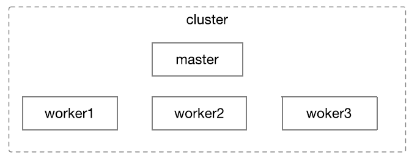


### 1、HBase

HBase采用的是 master worker 的架构。 HMBase 是系统中的 master， HRegionServer 是系统中的 worker 。HMBase 监控 HBase Cluster 中 worker 的成员变化，把 region 分配给各个 HRegionServer 。系统中有一个 HMaster处于 active 状态，其他 HMaster 处于备用状态。


### 2、Kafka

一个Kafka 集群由多个 broker 组成，这些 borker 是系统中的 worker 。 Kafkai 会从这些 worker 选举出一个controller ，这个 controlle 是系统中的 master ，负责把 topic partition 分配给各个 broker 。

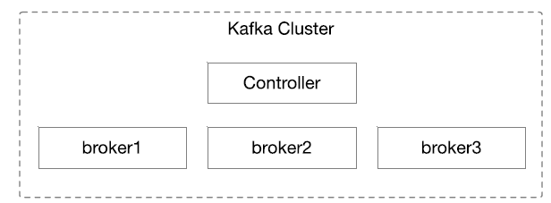

### 3、HDFS

HDFS采用的也是一个 master worker 的架构， NameNode 是系统中的 master DataNode 是系统中的 worker 。NameNode 用来保存整个分布式文件系统的 metadata ，并把数据块分配给 cluster 中的 DataNode 进行保存。

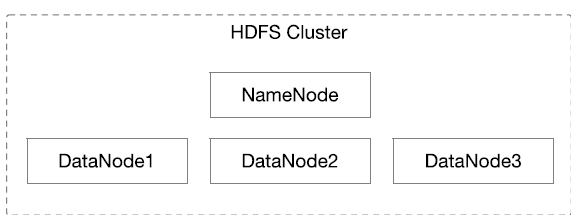

## 2、如何使用ZooKeeper 实现 master-worker

- 1.使用一个临时节点 /master 表示 master 。 master 在行使 master 的职能之前，首先要创建这个 znode 。如果能创建成功，进入 active 状态，开始行使 master 职能。否则的话，进入 backup 状态，使用 watch 机制监控/master 。假设系统中有一个 active master 和一个 backup master 。如果 active master 失败，它创建的 /master就会被 ZooKeeper 自动删除。这时 backup master 就会收到通知，通过再次创建 /master 节点成为新的 activemaster 。

- 2.worker 通过在 /workers 下面创建临时节点来加入集群。

- 3.处于 active 状态的 master 会通过 watch 机制监控 /workers 下面 znode 列表来实时获取 worker 成员的变化。

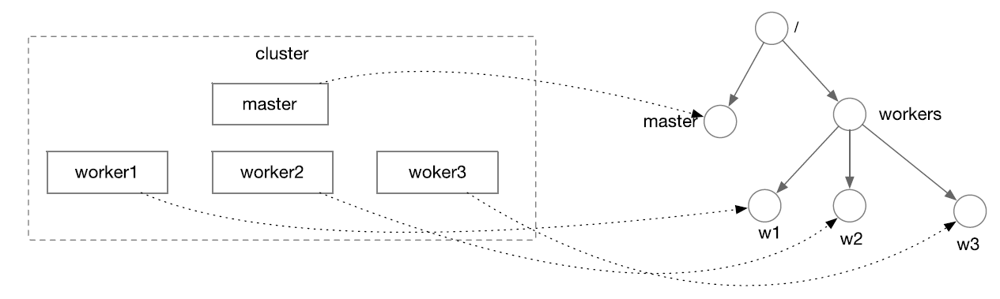


## 3、ZooKeeper数据模型

ZooKeeper的数据模型是层次模型 （GoogleChubby 也是这么做的 ）。 层次模型常见于文件系统 。 层次模型和 key value 模型是两种主流的数据模型 。 ZooKeeper 使用文件系统模型主要基于以下两点考虑：

- 1.文件系统的树形结构便于表达数据之间的层次关系 。
- 2.文件系统的树形结构便于为不同的应用分配独立的命名空间 namespace ）。

ZooKeeper的层次模型称作 data tree 。 Data tree的每个节点叫作 znode 。 不同于文件系统 ，zookeeper的每个节点都可以保存数据 。 每个节点都有一个版本(version）。 版本从 0 开始计数 。

## 4、znode分类

一个znode 可以使持久性的 也可以是临时性的
- 1.持久性的 znode ( ZooKeeper 宕机，或者 client 宕机，这个 znode 一旦创建就不会丢失 。

- 2.临时性的 znode ( ZooKeeper 宕机了，或者 client 在指定的 timeout 时间内没有连接server ，都会被认为丢失 。

znode节点也可以是顺序性的 。 每一个顺序性的 znode 关联一个唯一的单调递增整数 。 这个单调递增整数是 znode 名字的后缀 。 如果上面两种 znode 如果具备顺序性 又有以下两种 znode

- 3.持久顺序性的 znode PERSISTENT_SEQUENTIAL znode 除了具备持久性 znode 的特点之外 znode 的名字具备顺序性。

- 4.临时顺序性的 znode EPHEMERAL_SEQUENTIAL ): znode 除了具备临时性 znode 的特点之外 znode的名字具备顺序性。

ZooKeeper主要有以上 4 种 znode 。


## 5、ZooKeeper 总体架构

应用使用ZooKeeper 客户端库使用ZooKeeper 服务。ZooKeeper 客户端负责和ZooKeeper集群的交互。ZooKeeper 集群可以有两种模式：standalone 模式和quorum模式。处于standalone 模式的ZooKeeper只有一个独立运行的ZooKeeper 节点。处于quorum模式的ZooKeeper 集群包括多个ZooKeeper 节点。

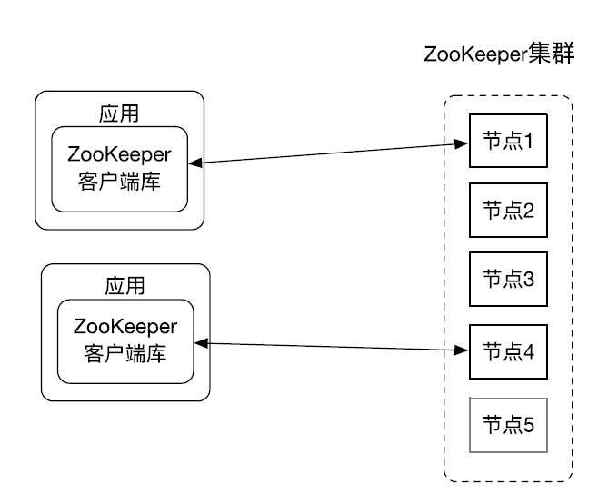


> Session

ZooKeeper客户端库和 ZooKeeper 集群中的节点创建一个 session 。 客户端可以主动关闭 session 。 另外如果 ZooKeeper节点没有在 session 关联的 timeout 时间内收到客户端的数据的话， ZooKeeper 节点也会关闭 session 。 另外 ZooKeeper客户端库如果发现连接的 ZooKeeper 出错会自动的和其他 ZooKeeper 节点建立连接。

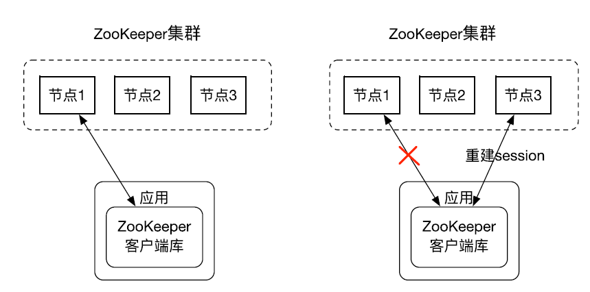

> Quorum模式

处于Quorum 模式的 ZooKeeper 集群包含多个 ZooKeeper 节点 。 下图的 ZooKeeper 集群有 3 个节点 其中节点 1 是 leader 节点 节点 2 和节点 3 是 follower 节点 。 leader 节点可以处理读写请求 follower 只可以处理读请求 。 follower 在接到写请求时会把写请求转发给 leader 来处理 。

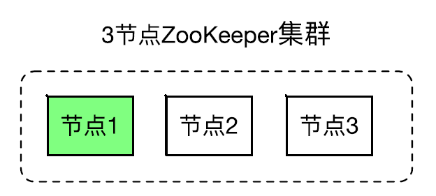


> 数据一致性

- 可线性化（ Linearizable ）写入 先到达 leader 的写请求会被先处理 leader 决定写请求的执
行顺序 。

- 客户端 FIFO 顺序：来自给定客户端的请求按照发送顺序执行。


# 2、ZooKeeper 开发介绍

## 1、ZooKeeper API简介

> ZooKeeper 类

ZooKeeper Java 代码主要使用org.apache.zookeeper.ZooKeeper 这个类使用ZooKeeper 服务。

ZooKeeper(connectString, sessionTimeout, watcher)

- connectString：使用逗号分隔的列表，每个ZooKeeper 节点是一个host:port 对，host 是机器名或者IP地址，port 是ZooKeeper 节点使用的端口号。会任意选取connectString 中的一个节点建立连接。
- sessionTimeout：session timeout 时间。
- watcher: 用于接收到来自ZooKeeper 集群的所有事件。

> ZooKeeper 主要方法

- create(path, data, flags): 创建一个给定路径的znode，并在znode 保存data[]的
数据，flags 指定znode 的类型。

- delete(path, version):如果给定path 上的znode 的版本和给定的version 匹配，
删除znode。

- exists(path, watch):判断给定path 上的znode 是否存在，并在znode 设置一个
watch。

- getData(path, watch):返回给定path 上的znode 数据，并在znode 设置一个watch。

- setData(path, data, version):如果给定path 上的znode 的版本和给定的version
匹配，设置znode 数据。

- getChildren(path, watch):返回给定path 上的znode 的孩子znode 名字，并在
znode 设置一个watch。

- sync(path):把客户端session 连接节点和leader 节点进行同步。

方法说明

- 所有获取znode 数据的API 都可以设置一个watch 用来监控znode 的变化。

- 所有更新znode 数据的API 都有两个版本: 无条件更新版本和条件更新版本。如果version
为-1，更新为无条件更新。否则只有给定的version 和znode 当前的version 一样，才会
进行更新，这样的更新是条件更新。

- 所有的方法都有同步和异步两个版本。同步版本的方法发送请求给ZooKeeper 并等待服务器的响应。异步版本把请求放入客户端的请求队列，然后马上返回。异步版本通过callback 来接受来
自服务端的响应。


> ZooKeeper 代码异常处理

所有同步执行的API 方法都有可能抛出以下两个异常：

- KeeperException: 表示ZooKeeper 服务端出错。KeeperException 的子类ConnectionLossException 表示客户端和当前连接的ZooKeeper 节点断开了连接。网络分区和ZooKeeper 节点失败都会导致这个异常出现。发生此异常的时机可能是在ZooKeeper 节点处理客户端请求之前，也可能是在ZooKeeper 节点处理客户端请求之后。出现ConnectionLossException 异常之后，客户端会进行自动重新连接，但是我们必须要检查我们以前的客户端请求是否被成功执行。

- InterruptedException：表示方法被中断了。我们可以使用Thread.interrupt() 来中断
API 的执行。


> 数据读取API 示例-getData,有以下三个获取znode 数据的方法：

- 1.byte[] getData(String path, boolean watch, Stat stat)同步方法。如果watch 为true，该znode 的状态变化会发送给构建ZooKeeper 是指定的watcher。

- 2.void getData(String path, boolean watch, DataCallback cb, Object ctx)异步方法。cb 是一个callback，用来接收服务端的响应。ctx 是提供给cb 的context。watch 参数的含义和方法1 相同。

- 3.void getData(String path, Watcher watcher, DataCallback cb, Object ctx)异步方法。watcher 用来接收该znode 的状态变化。


> 数据写入API 示例-setData

- 1.Stat setData(String path, byte[] data, int version)同步版本。如果version 是-1，做无条件更新。如果version 是非0 整数，做条件更新。

- 2.void setData(String path,byte[] data,int version,StatCallback cb,Object ctx)异步版本。

> watch

watch 提供一个让客户端获取最新数据的机制。如果没有watch 机制，客户端需要不断的轮询ZooKeeper 来查看是否有数据更新，这在分布式环境中是非常耗时的。客户端可以在读取数据的时候设置一个watcher，这样在数据更新时，客户端就会收到通知。

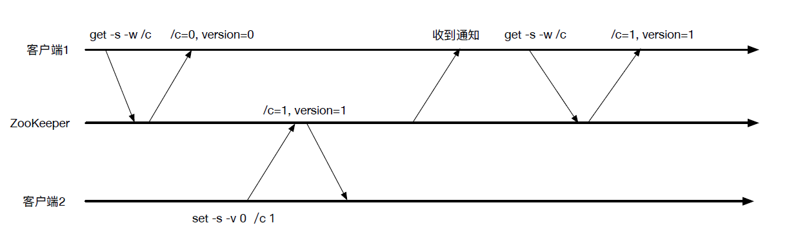


> 条件更新

设想用znode /c 实现一个counter，使用set 命令来实现自增1 操作。条件更新场景：

- 1.客户端1 把/c 更新到版本1，实现/c 的自增1 。
- 2.客户端2 把/c 更新到版本2，实现/c 的自增1 。
- 3.客户端1 不知道/c 已经被客户端2 更新过了，还用过时的版本1 是去更新/c，更新失败。如果客户端1使用的是无条件更新，/c 就会更新为2，没有实现自增1 。

使用条件更新可以避免对数据基于过期的数据进行数据更新操作。

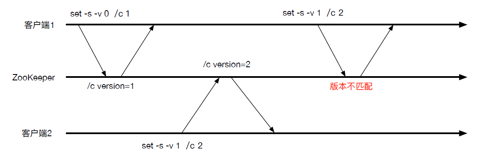


## 2、ZooKeeper Recipes-分布式队列

> 设计

使用路径为/queue 的znode 下的节点表示队列中的元素。/queue 下的节点都是顺序持久化znode。这些znode 名字的后缀数字表示了对应队列元素在队列中的位置。Znode 名字后缀数字越小，对应队列元素在队列中的位置越靠前

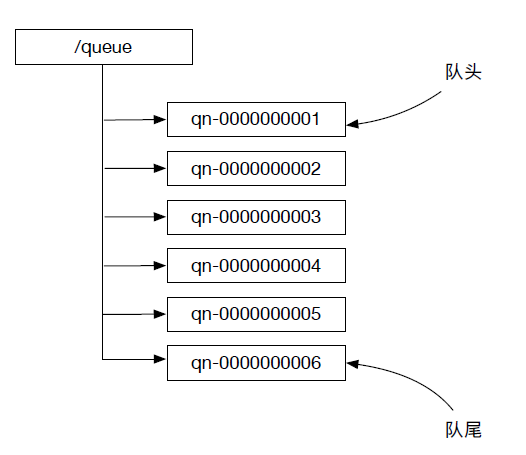


offer 方法在/queue 下面创建一个顺序znode。因为znode 的后缀数字是/queue下面现有znode 最大后缀数字加1，所以该znode 对应的队列元素处于队尾。

element 方法有以下两种返回的方式，我们下面说明这两种方式都是正确的。

1.throw new NoSuchElementException()：因为element 方法读取到了队列为空的状态，所以抛出NoSuchElementException 是正确的。

2.return zookeeper.getData(dir+“/”+headNode, false, null)： childNames保存的是队列内容的一个快照。这个return 语句返回快照中还没出队。如果队列快照的元素都出队了，重试。

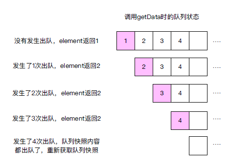

remove 方法和element 方法类似。值得注意的是getData的成功执行不意味着出队成功，原因是该队列元素可能会被其他用户出队。

byte[] data = zookeeper.getData(path, false, null);

zookeeper.delete(path, -1);


## 3、ZooKeeper Recipes-分布式锁

> 设计

使用临时顺序znode 来表示获取锁的请求，创建最小后缀数字znode 的用户成功拿到锁。

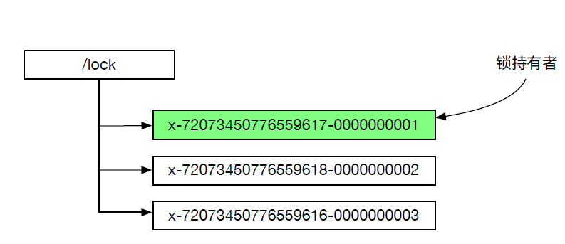

> 避免羊群效应（herd effect）

把锁请求者按照后缀数字进行排队，后缀数字小的锁请求者先获取锁。如果所有的锁请求者都watch锁持有者，当代表锁请求者的znode 被删除以后，所有的锁请求者都会通知到，但是只有一个锁请求者能拿到锁。这就是羊群效应。

为了避免羊群效应，每个锁请求者watch 它前面的锁请求者。每次锁被释放，只会有一个锁请求者会被通知到。这样做还让锁的分配具有公平性，锁定的分配遵循先到先得的原则。

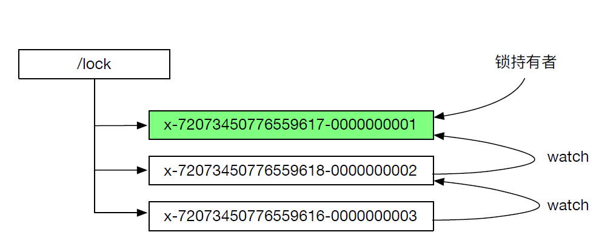


## 4、ZooKeeper Recipes-选举

> 设计

使用临时顺序znode 来表示选举请求，创建最小后缀数字znode 的选举请求成功。在协同设计上和分布式锁是一样的，不同之处在于具体实现。不同于分布式锁，选举的具体实现对选举的各个阶段做了监控。

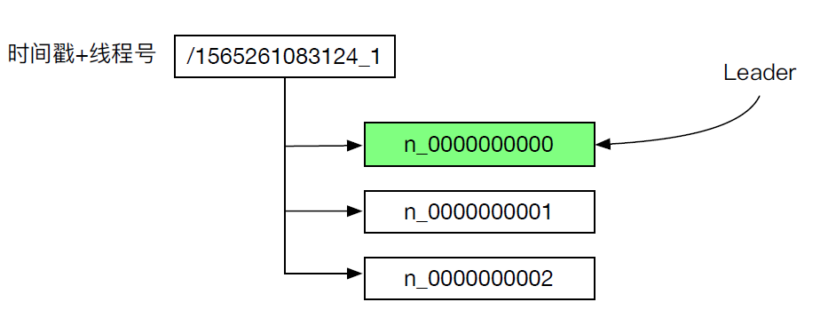


## 5、使用Apache Curator 简化ZooKeeper 开发

http://curator.apache.org/

Apache Curator 是Apache ZooKeeper 的Java 客户端库。Curator 项目的目标是简化ZooKeeper 客户端的使用。例如，在以前的代码展示中，我们都要自己处理ConnectionLossException 。

另外Curator 为常见的分布式协同服务提供了高质量的实现。

Apache Curator 最初是Netflix 研发的，后来捐献给了Apache 基金会，目前是Apache 的
顶级项目。


> Curator 技术栈

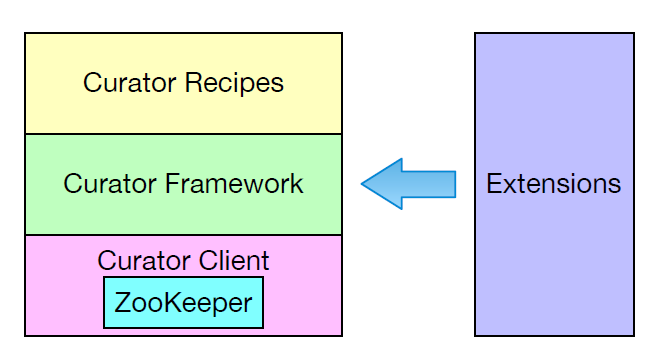

- Client：封装了ZooKeeper 类，管理和ZooKeeper 集群的连接，并提供了重建连接机制。
- Framework：为所有的ZooKeeper 操作提供了重试机制，对外提供了一个Fluent 风格的API 。
- Recipes：使用framework 实现了大量的ZooKeeper 协同服务。
- Extensions：扩展模块。


# 3、zookeeper运维

## 1、配置

ZooKeeper 的配置项在zoo.cfg 配置文件中配置, 另外有些配置项可以通过Java 系统属性来进行配置。

- clientPort : ZooKeeper 对客户端提供服务的端口。
- dataDir ：来保存快照文件的目录。如果没有设置dataLogDir ，事务日志文件也会保存到这
个目录。
- dataLogDir ：用来保存事务日志文件的目录。因为ZooKeeper 在提交一个事务之前，需要保
证事务日志记录的落盘，所以需要为dataLogDir 分配一个独占的存储设备。


> ZooKeeper 节点硬件要求

给ZooKeeper 分配独占的服务器，要给ZooKeeper 的事务日志分配独立的存储设备。

- 1.内存：ZooKeeper 需要在内存中保存data tree 。对于一般的ZooKeeper 应用场景，8G的内存足够了。
- 2.CPU：ZooKeeper 对CPU 的消耗不高，只要保证ZooKeeper 能够有一个独占的CPU 核即可，所以使用一个双核的CPU 。
- 3.存储：因为存储设备的写延迟会直接影响事务提交的效率，建议为dataLogDir 分配一个独占的SSD 盘。


> ZooKeeper 处理写请求时序

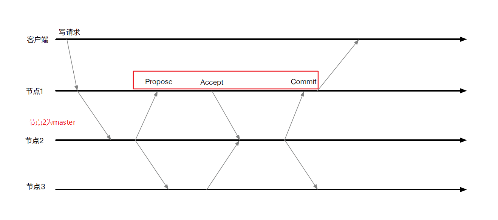


Observer 和ZooKeeper 机器其他节点唯一的交互是接收来自leader 的inform 消息，更新自己的本地存储，不参与提交和选举的投票过程。因此可以通过往集群里面添加Observer 节点来提高整个集群的读性能。

> Observer 应用场景- 跨数据中心部署

我们需要部署一个北京和香港两地都可以使用的ZooKeeper 服务。我们要求北京和香港的客户端的读请求的延迟都低。因此，我们需要在北京和香港都部署ZooKeeper 节点。我们假设leader 节点在北京。那么每个写请求要涉及leader 和每个香港follower 节点之间的propose 、ack 和commit 三个跨区域消息。解决的方案是把香港的节点都设置成observer 。上面提的propose 、ack 和commit 消息三个消息就变成了inform 一个跨区域消息消息。

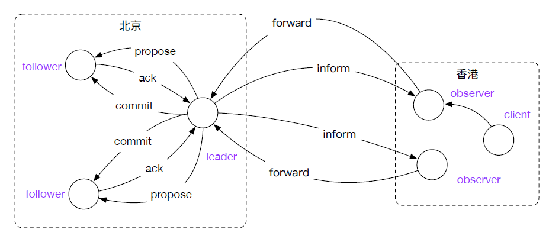


## 2、通过动态配置实现不中断服务的集群成员变更

手动集群成员调整问题：

问题1：需要停止ZooKeeper 服务。

- 1.停止整个ZooKeeper 现有集群。
- 2.更改配置文件zoo.cfg 的server.n 项。
- 3.启动新集群的ZooKeeper 节点。

问题2：可能会导致已经提交的数据写入被覆盖。

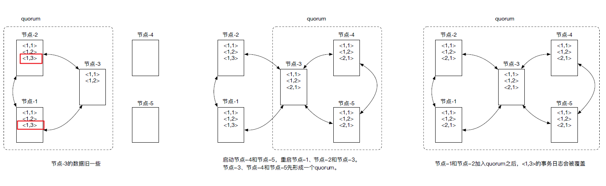


3.5.0 新特性- dynamic reconfiguration 可以在不停止ZooKeeper 服务的前提下，调整集群成员。

## 3、ZooKeeper 内部数据文件介绍

ZooKeeper 节点本地存储架构

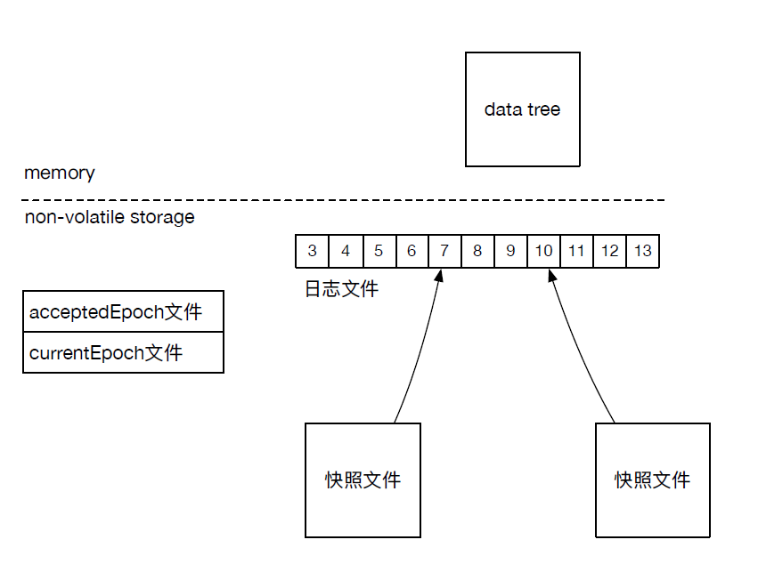


每一个对ZooKeeper data tree 都会作为一个事务执行。每一个事务都有一个zxid。zxid 是一个64 位的整数（Java long 类型）。zxid 有两个组成部分，高4 个字节保存的是epoch ，低4 个字节保存的是counter 。


事务日志（Transaction Logs）

快照（Snapshots）

Epoch 文件


# 4、进阶

## 1、服务发现

服务发现主要应用于微服务架构和分布式架构场景下。在这些场景下，一个服务通常需要松耦合的多个组件的协同才能完成。服务发现就是让组件发现相关的组件。服务发现要提供的功能有以下3点：
- 服务注册。
- 服务实例的获取。
- 服务变化的通知机制。

Curator 有一个扩展叫作curator-x-discovery 。curator-x-discovery 基于ZooKeeper 实现了服务发现。

> curator-x-discovery 设计

使用一个base path 作为整个服务发现的根目录。在这个根目录下是各个服务的的目录。服务目录下面是服务实例。实例是服务实例的JSON 序列化数据。服务实例对应的znode 节点可以根据需要设置成持久性、临时性和顺序性。

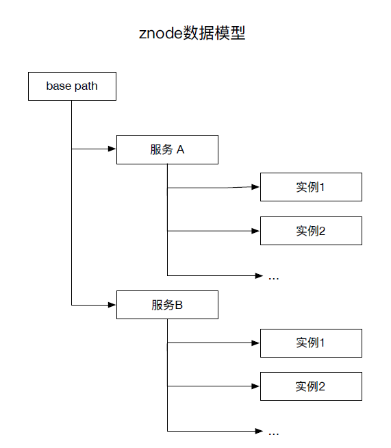


> 核心接口

左图列出了服务发现用户代码要使用的curator-x-discovery 接口。最主要的有以下三个接口：

- ServiceProvider :在服务cache 之上支持服务发现操作，封装了一些服务发现策略。
- ServiceDiscovery :服务注册，也支持直接访问ZooKeeper 的服务发现操作。
- ServiceCache :服务cache 。

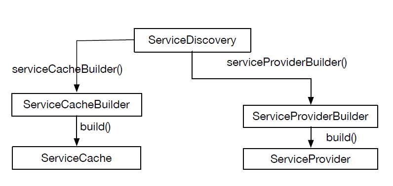


> ServiceInstance

用来表示服务实例的POJO，除了包含一些服务实例常用的成员之外，还提供一个payload 成员让用户存自定义的信息。

> ServiceDiscovery

从一个ServiceDiscovery ，可以创建多个ServiceProvider 和多个ServiceCache


> 总结

curator-x-discovery 在系统质量和影响力和ZooKeeper 相比还是有很大差距的，但是提供的服务发现的功能还是很完备的。如果我们的服务发现场景和curator-x-discovery 匹配，就可以直接用它或者扩展它。curator-x-discovery-server 本身实现的功能很少，不建议使用，完全可以自己实现类似的功能。

进行ZooKeeper API 开发，我个人建议以下的SDK 使用优先顺序：curator recipes -> curator framework -> ZooKeeper API 。


## 2、Kafka 是如何使用ZooKeeper 的

Kafka 使用ZooKeeper 实现了大量的协同服务。如果我们检查一个Kafka 使用的ZooKeeper ，会发现大量的znode。


ZooKeeper 的multi 方法提供了一次执行多个ZooKeeper 操作的机制。多个ZooKeeper 操作作为一个整体执行，要么全部成功，要么全部失败。另外ZooKeeper 还提供了一个builder 风格的API 来使用multi API 。


> 总结

Kafka 在逐渐减少对ZooKeeper 的依赖：

- 在老的版本中，committed offsets 是保存在Kafka 中的。
- 未来Kafka 还有计划完全移除对ZooKeeper 的依赖。

Kafka 使用ZooKeeper 的方式值得我们依赖。在我们刚开始一个分布式系统的时候，我们可以把协同数据都给ZooKeeper 来管理，迅速让系统上线。如果在系统的后续使用中要对协同数据进行定制化处理，我们可以研发自己的协同数据机制来代替ZooKeeper 。


# 5、对比Chubby、etcd和ZooKeeper

## 1、什么是Paxos 协议

Paxos 算法是一个一致性算法，作用是让Asynchronous non-Byzantine Model 的分布式环境中的各个agent 达成一致。

我打一个比方，7 个朋友要决定晚上去哪里吃饭。一致性算法就是保证要么这7 个朋友达成一致选定一个地方去吃饭，要么因为各种异常情况达不成一致，但是不能出现一些朋友选定一个地方，另外一些朋友选定另外一个地方的情况。

> Asynchronous non-Byzantine Model

一个分布式环境由若干个agent 组成，agent 之间通过传递消息进行通讯：

- agent 以任意的速度速度运行，agent 可能失败和重启。但是agent 不会出Byzantine fault 。
- 消息需要任意长的时间进行传递，消息可能丢失，消息可能会重复。但是消息不会corrupt 。

> Paxos 算法中的agent 角色

- client :发送请求给Paxos 算法服务。
- proposer :发送prepare 请求和accept 请求。
- acceptor :处理prepare 请求和accept 请求。
- learner :获取一个Paxos 算法实例决定的结果。


> Paxos 算法描述

一个Paxos 算法实例正常运行的前提是大多数acceptor 正常运行。换句话说就是Paxos 提供允许少数accepter 失败的容错能力。

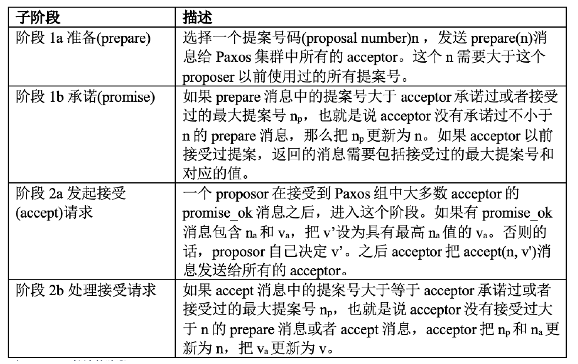


> Paxos 算法的消息流

以下是一个Paxos 算法实例的完成的消息流：

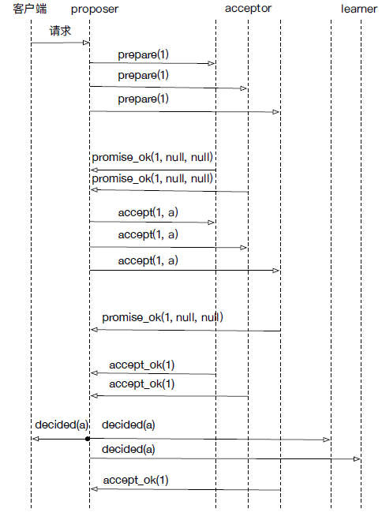

> 复制状态机（ Replicated State Machine ）

Paxos 算法可以用来实现复制状态机的一致性算法模块。

这里面的状态机是一个KV 系统。通过复制状态机可以把它变成一个容错的3 节点分布式KV 系统。下面是处理z=6 这个写操作的过程：

- 1.客户端3 发送一个z=6 请求给节点3 的一致性算法模块。
- 2.节点3 的一致性算法发起一个算法实例。
- 3.如果各个节点的一致性算法模块能一起达成一致，节点3 把z=6 应用到它的状态机，并把结果返回给客户端3。

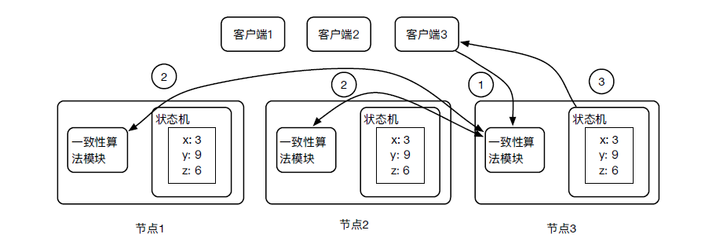


## 2、MultiPaxos

基本的Paxos 算法在决定一个值的时候需要的执行两个阶段，这涉及大量消息交换。MultiPaxos 算法的提出就是为了解决这个问题。MultiPaxos 保持一个长期的leader ，这样决定一个值只需要执行第二阶段。一个典型的Paxos 部署通常包括奇数个服务器，每个服务器都有一个proposer ，一个acceptor 和一个learner 。


## 3、比较Chubby 和ZooKeeper

Chubby 是一个分布式锁系统，广泛应用于Google 的基础架构中，例如知名的GFS 和Bigtable都用Chubby 来做协同服务。

ZooKeeper 借鉴了很多Chubby 的设计思想，所以它们之间有很多相似之处。

> Chubby 系统架构

- 一个Chubby 的集群叫作一个cell ，由多个replica 实例组成，其中一个replica 是整个cell 的master 。所有的读写请求只能通过master 来处理。

- 应用通过引入Chubby 客户端库来使用Chubby 服务。Chubby 客户端在和master 建立session 之后，通过发RPC给master 来访问Chubby 数据。

-  每个客户端维护一个保证数据一致性的cache 。

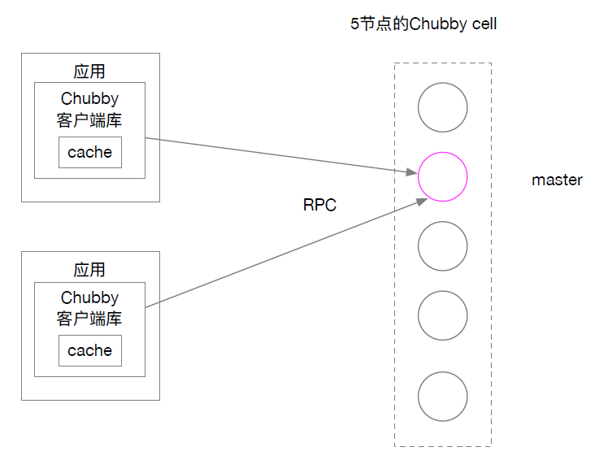


> 数据模型

Chubby 使用的是层次数据模型，可以看做一个简化的UNIX 文件系统：

- Chubby 不支持部分内容的读写。
- Chubby 不支持link 。
- Chubby 不支持依赖路径的文件权限。

不同于ZooKeeper ，Chubby 的命名空间是由多个Chubby cell 构成的。

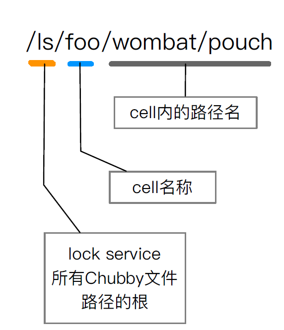


## 4、什么是Raft

Raft 是目前使用最为广泛的一致性算法。例如新的协同服务平台etcd 和Consul 都是使用的Raft 算法。

在Raft 出现之间，广泛使用的一致性算法是Paxos 。Paxos 的基本算法解决的是如何保证单一客户端操作的一致性，完成每个操作需要至少两轮的消息交换。和Paxos 不同，Raft 有leader的概念。Raft 在处理任何客户端操作之前必须选举一个leader ，选举一个leader 需要至少一轮的消息交换。但是在选取了leader 之后，处理每个客户端操作只需要一轮消息交换。

Raft 论文描述了一个基于Raft 的复制状态机的整体方案，例如Raft 论文描述了日志复制、选举机制和成员变更等这些复制状态机的各个方面。相反Paxos 论文只是给了一个一致性算法，基于Paxos 的系统都要自己实现这些机制。


> 基于Raft 的复制状态机系统架构

右图展示了执行一条客户端写命令的过程（ z←6 表示把6 写入z ）：

- 1.客户端3 发送一个状态机命令z←6 给服务器C 的一致性算法模块。

- 2.一致性算法模块把状态机命令写入服务器C 的日志，同时发送日志复制请求给服务器A 和服务器B 的一致性算法模块。服务器A 和服务器B 的一致性算法模块在接收到日志复制请求之后，分别在给子的服务器上写入日志，然后回复服务器C 的一致性算法模块。

- 3.服务器C 的一致性算法模块在收到服务器A 和B 对日志复制请求的回复之后，让状态机执行来自客户端的命令。

- 4.服务器C 的状态机把命令执行结果返回给客户端3 。


> Raft 日志复制

一个Raft 集群包括若干服务器。服务器可以处于以下三种状态：leader 、follower 和candidate 。只有leader 处理来自客户端的请求。follower 不会主动发起任何操作，只会被动的接收来自leader 和candidate 的请求。在正常情况下，Raft 集群中有一个leader ，其他的都是follower 。leader 在接受到一个写命令之后，为这个命令生成一个日志条目，然后进行日志复制。

leader 通过发送AppendEntries RPC 把日志条目发送给follower ，让follower 把接收到的日志条目写入自己的日志文件。另外leader 也会把日志条目写入自己的日志文件。日志复制保证Raft 集群中所有的服务器的日志最终都处于同样的状态。

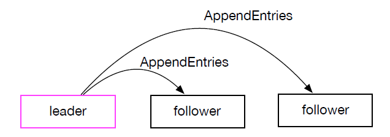

Raft 的日志复制对应的就是Paxos 的accept 阶段，它们是很相似的。


> 日志条目的提交

leader 只有在客户端请求被提交以后，才可以在状态机执行客户端请求。提交意味着集群中多数服务器完成了客户端请求的日志写入，这样做是为了保证以下两点：

- 容错：在数量少于Raft 服务器总数一半的follower 失败的情况下，Raft 集群仍然可以正常处
理来自客户端的请求。

- 确保重叠:一旦Raft leader 响应了一个客户端请求，即使出现Raft 集群中少数服务器的失败，
也会有一个服务器包含所有以前提交的日志条目。


> Raft 日志复制示例

右图表示的是一个包括5 个服务器的Raft 集群的日志格式，S1 处于leader状态，其他的服务器处于follower 状态。每个日志条目由一条状态机命令和创建这条日志条目的leader 的term 。每个日志条目有对应的日志索引，日志索引表示这条日志在日志中的位置。Raft 集群中提交的日志条目是S5 上面的所有日志条目，因为这些日志条目被复制到了集群中的大多数服务器。

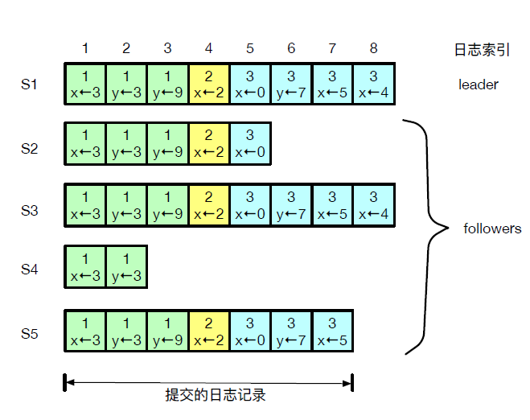


> Raft选举算法

Raft 使用心跳机制来触发leader 选取。一个follower 只要能收到来自leader 或者candidate 的有效RPC ，就会一直处于follower 状态。leader 在每一个election timeout 向所有follower 发送心跳消息来保持自己的leader 状态。如果follower 在一个election timeout 周期内没有收到心跳信息，就认为目前集群中没有leader 。此时follower 会对自己的currentTerm 进行加一操作，并进入candidate 状态，发起一轮投票。它会给自己投票并向其他所有的服务器发送RequestVote RPC ，然后会一直处于candidate 状态，直到下列三种情形之一发生：

- 1.这个candidate 赢得了选举。
- 2.另外一台服务器成为了leader 。
- 3.一段时间之内没有服务器赢得选举。在这种情况下，candidate 会再次发起选举。

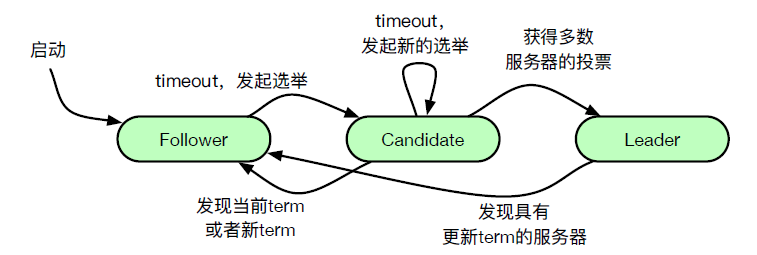

Raft 的选举对应的就是Paxos 的prepare 阶段，它们是很相似的。


# 6、源码

## 01、B-tree和b+tree

B-tree 的应用十分广泛，尤其是在关系型数据库领域，下面列出了一些知名的 B tree 存储引擎：

- 关系型数据库系统 Oracle 、 SQL Server 、 MySQL 和 PostgreSQL 都支持 B tree 。

- WiredTiger 是 MongoDB 的默认存储引擎，开发语言是 C ，支持 B tree 。

- BoltDB Go 语言开发的 B tree 存储引擎， etcd 使用 BoltDB 的 fork bbolt 。

存储引擎一般用的都是B+tree ，但是存储引擎界不太区分 B tree 和 B+tree ，说 B tree 的时候其实一般指的是 B+tree 。


> 平衡二叉搜索树

平衡二叉搜索树是用来快速查找key-value 的有序数据结构。平衡二叉搜索树适用于内存场景，但是不试用于于外部存储。原因在于每访问一个节点都要访问一次外部存储，而访问外部存储是非常耗时的。要减少访问外部存储的次数，就要减少树的高度，要减少树的高度就要增加一个节点保存key 的个数。B-tree 就是用增加节点中key 个数的方案来减少对外部存储的访问。

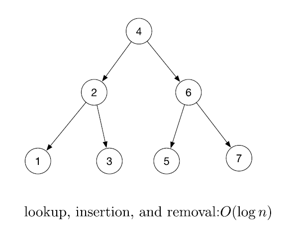


> B-tree

B-tree 是一种平衡搜索树。每一个B-tree 有一个参数t，叫做minimum degree。每一个节点的degree 在t 和2t 之间。下图是一个每个节点的degree 都为t 的B-tree。如果t 为1024 的话，下面的B-tree 可以保存1G 多的key 值。因为B-tree 的内部节点通常可以缓存在内存中，访问一个key 只需要访问一次外部存储。

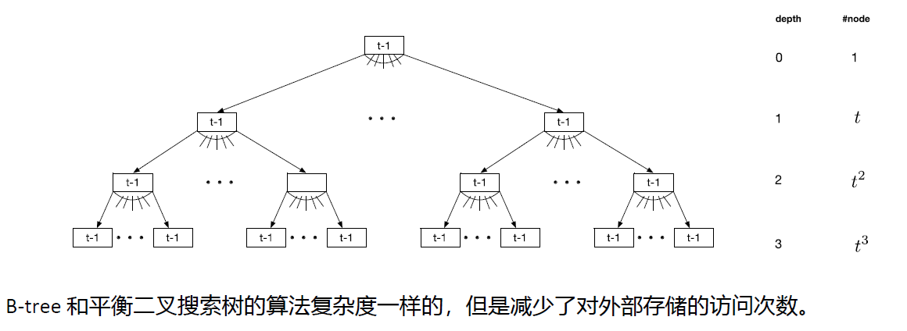


B-tree 特点

- 所有的节点添加都是通过节点分裂完成的。

- 所有的节点删除都是通过节点合并完成。

- 所有的插入都发生在叶子节点。

- B tree 的节点的大小通常是文件系统 block 大小的倍数，例如 4k 8k 和 16k


为了让B-tree 的内部节点可以具有更大的 degree ，可以规定内部节点只保存 key ，不保存 value 。这样的 B-tree 叫作 B+tree 。另外通常会把叶子节点连成一个双向链表，方便 key value 升序和降序扫描。

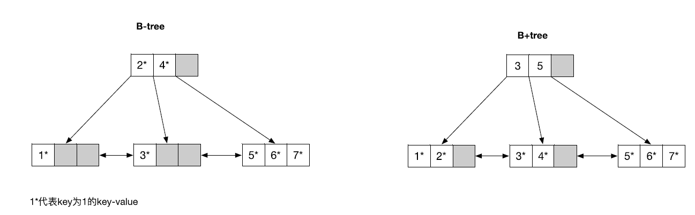

大部分关系型数据库表的主索引都是用的B+tree 。 B+tree 的叶子节点叫作 data page ，内部节点叫作 index page 。

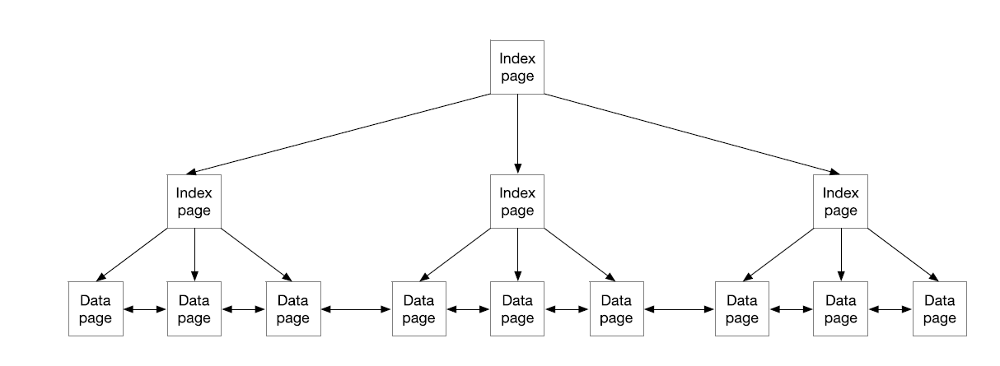


## 02、LSM（Log Structured Merge-tree）

LSM是另外一种广泛使用的存储引擎数据结构。 LSM 是在 1996 发明的，但是到了2006 年从 Bigtable 开始才受到关注。


一个基于LSM 的存储引擎有以下 3 部分组成：

- Memtable ：保存有序 KV 对的内存缓冲区。

- 多个 SSTable ：保存有序 KV 对的只读文件。

- 日志：事务日志。

LSM存储 MVCC 的 key-value 。每次更新一个key-value 都会生成一个新版本，删除一个 key-value 会生成一个 tombstone 的新版本。

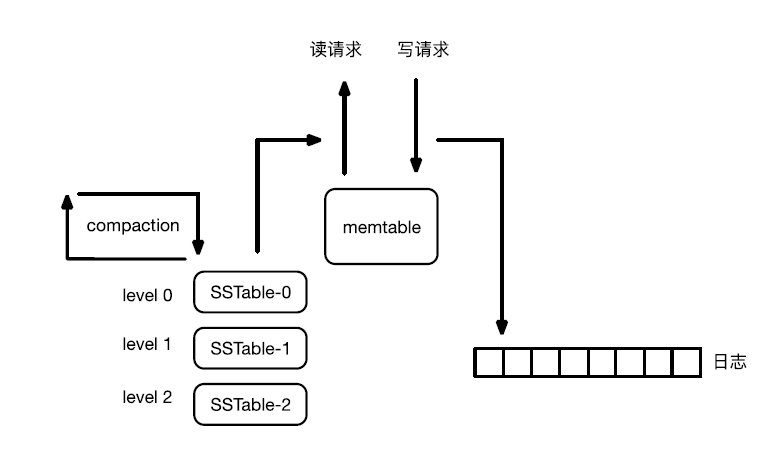


### 1、LSM 写操作

一个写操作首先在日志中追加事务日志，然后把新的key-value 更新到Memtable。LSM 的事务是WAL日志。

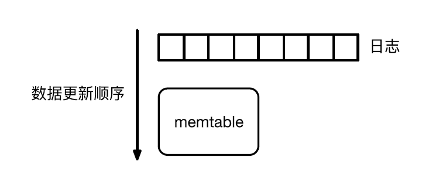


### 2、LSM读操作

在由Memtable 和 SSTable 合并成的一个有序KV 视图上进行 Key 值的查找。例如在右图所示的 LSM 中，要查找一个 key a

- 1.在 memtable 中查找，如果查找到，返回。否则继续。

- 2.在 SSTable 0 中查找，如果查找到，返回。否则继续。

- 3.在 SSTable 1 中查找，如果查找到，返回。否则继续。

- 4.在 SSTable 2 中查找，如果查找到，返回。否则返回空值。


### 3、Bloom Filter

使用Bloom filter 来提升LSM 数据读取的性能。Bloom filter 是一种随机数据结构，可以在O(1) 时间内判断一个给定的元素是否在集合中。False positive 是可能的，既Bloom filter 判断在集合中的元素有可能实际不在集合中，但是false negative 是不可能的。Bloom filter 由一个m 位的位向量和k个相互独立的哈希函数h1，h2，…，hk 构成。这些hash函数的值范围是{1，…，m}。初始化Bloom filter 的时候把位向量的所有的位都置为0。添加元素a 到集合的时候，把维向量h1(a)， h2(a)， hk(a) 位置上的位置为1。判断一个元素b 是否在集合中的时候，检查把维向量h1(b)， h2(b)， … ，hk(a) 位置上的位是否都为1。如果这些位都为1，那么认为b 在集合中；否则认为b 不在集合之中。下图所示的是一个m 为14，k 为3 的Bloom filter。下面是计算False positive 概率的公式（n 是添加过的元素数量）：

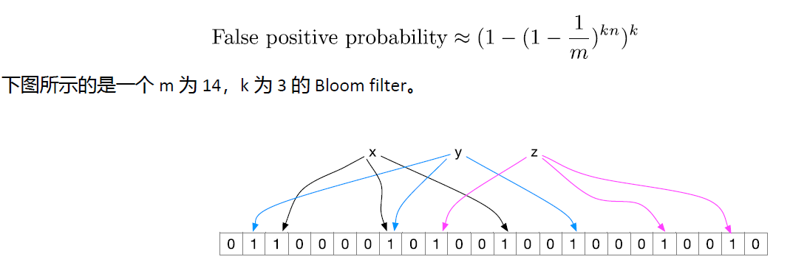

备注：判断一个元素存在可能不存在，误判（hash存储造成的）；如果判断一个元素不存储在，那肯定不存在；


### 4、Compaction

如果我们一直对memtable 进行写入，memtable 就会一直增大直到超出服务器的内部限制。所以我们需要把memtable 的内存数据放到durable storage 上去，生成SSTable 文件，这叫做minor compaction。

- Minor compaction：把memtable 的内容写到一个SSTable。目的是减少内存消耗，另外减少数据恢复时需要从日志读取的数据量。

- Merge compaction：把几个连续level 的SSTable 和memtable 合并成一个SSTable。目的是减少读操作要读取的SSTable 数量。

- Major compaction：合并所有level 上的SSTable 的merge compaction。目的在于彻底删除tombstone 数据，并释放存储空间。

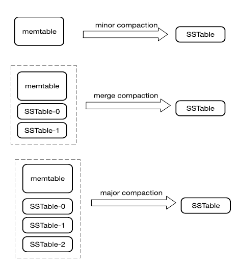


### 5、基于LSM 的存储引擎

下面列出了几个知名的基于LSM 的存储引擎：

- LevelDB ：开发语言是 C++ Chrome 的 IndexedDB 使用的是 LevelDB 。

- RocksDB ：开发语言是 C++ RocksDB 功能丰富，应用十分广泛，例如 CockroachDB 、 TiKV 和 Kafka Streams 都使用了它。

- Pebble ：开发语言是 Go ，应用于 CockroachDB 。

- BadgerDB ：一种分离存储 key 和 value 的 LSM 存储引擎。

- WiredTiger WiredTiger 除了支持 B tree 以外，还支持 LSM 。


### 6、存储引擎的放大指标（Amplification Factors）

- 读放大（ read amplification ）：一个查询涉及的外部存储读操作次数。如果我们查询一个数据需要做 3 次外部存储读取，那么读放大就是 3 。

- 写放大（ write amplification ）：写入外部存储设备的数据量和写入数据库的数据量的比率。如果我们对数据库写入了 10MB 数据，但是对外部存储设备写入了 20BM 数据，写放大就是 2 。

- 空间放大（ space amplification ）：数据库占用的外部存储量和数据库本身的数据量的比率。如果一个 10MB 的数据库占用了 100MB ，那么空间放大就是 10 。

### 7、比较B-tree和LSM

LSM和 B-tree 在 Read amplification （读放大 Write amplification （写放大）和 Space amplification （空间放大）这个三个指标上的区别：

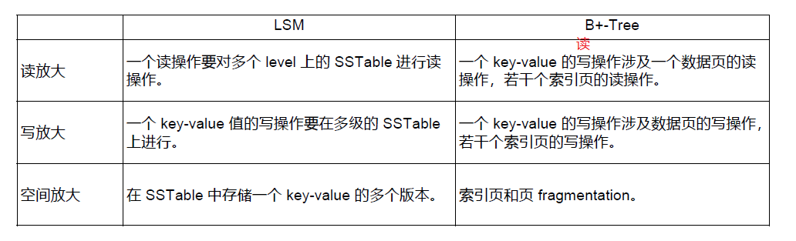


LSM和 B+ Tree 在性能上的比较：

- 写操作： LSM 上的一个写操作涉及对日志的追加操作和对 memtable 的更新。但是在 B+ Tree 上面，一个写操作对若干个索引页和一个数据页进行读写操作，可能导致多次的随机 IO 。 所以 LSM 的写操作性能一般要比 B+ Tree 的写操作性能好。

- 读操作： LSM 上的一个读操作需要对所有 SSTable 的内容和 memtable 的内容进行合并 。但是在 B+ Tree 上面，一个读操作对若干个索引页和一个数据页进行读操作 。 所以 B+ Tree 的读操作性能一般要比 LSM 的读操作性能好 。


## 03、本地存储技术总结

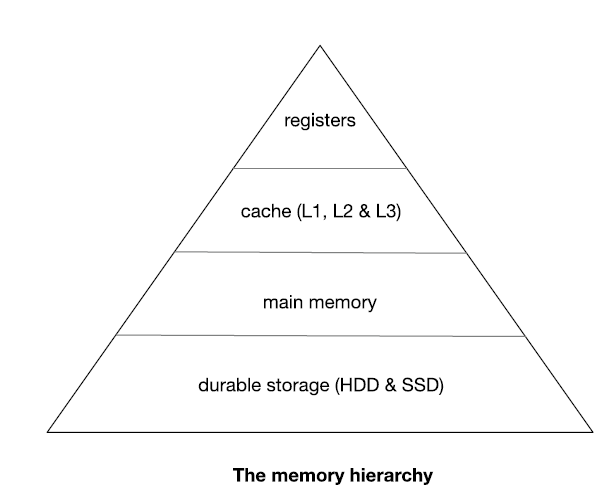

数据的随机读写 vs 顺序读写

在图中的memory hierarchy ，越往下的存储方式容量越大延迟越大，越往上容量越小延迟越小。对 mainmemory 和 durable storage 的数据访问，顺序读写的效率都要比随机读写高。例如 HDD 的 seek time 通常在 3到 9ms 之前，所以一个 HDD 一秒最多支持 300 多次随机读写。虽然 SSD 和 main memory 的随机读写效率要比 HDD 好的多，顺序读写的效率仍然要比随机读写高。所以我们设计存储系统的时候，要尽量避免随机读写多使用顺序读写。

### 1、文件系统基础知识

> ext4文件系统

ext4是 Linux 系统上广泛使用的文件系统。下图列的是 ext4 文件系统 inode 的结构。其中 information 包括文件的 size last access time 和 last modification time 等。文件的 inode 和 data block 存储在存储设备的不同位置。

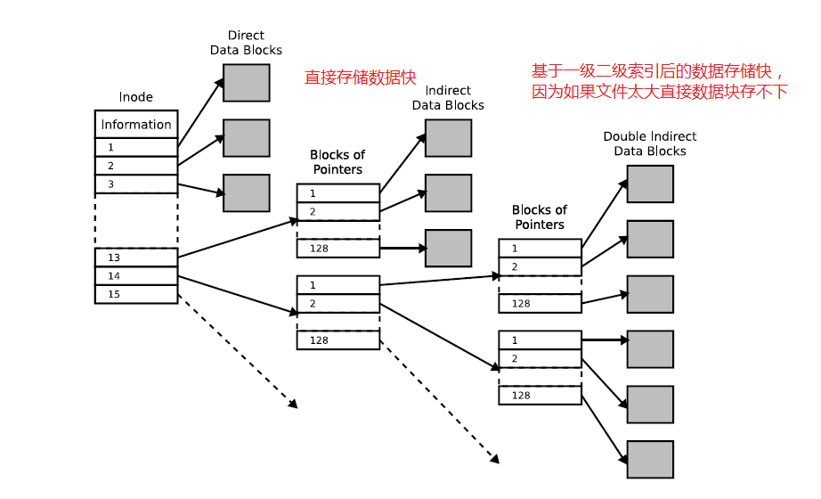


> 文件系统API


访问文件内容是read 和write 两个系统调用。除非使用了O_DIRECT 选项，read 和write 操作的都是block 的buffer cache，Linux OS 会定期把dirty block 刷新到durable storage 上去。

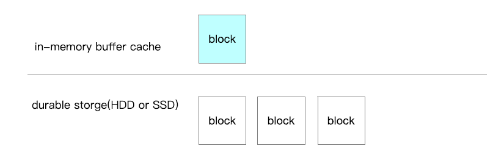


设计可靠的存储系统要求把内容实际写到durable storage 上去。下面的这两个系统调用提供了把buffercache 的内容手动刷新到durable storage 的机制：

- fsync：把文件的数据block 和inode 的metadata 刷新到durable storage。
- fdatasync：把把文件的数据block 刷新到durable storage。只有修改过的metadata 影响后面的操作才把metadata 也刷新到durable storage。


> 如何保证durable storage 写入的原子性

我们在write 调用之后调用 fsync /fdatasync ，文件系统通常可以保证对一个 block 写入的原子性。如果我们的一个数据写入包含对多个 block 的写入。要保证这样整个写入的原子性，就需要另外的机制。

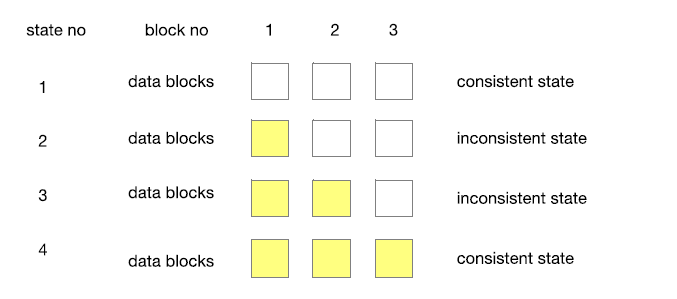


例如在上图中，我们要对3 个 data block 进行写入。如果我们依次对这些 block 写入，如果在写入 block1 之后发生crash ，数据就会处于状态 2 。在状态 2 中， block1 保存新数据、 block2 和 block3 保存旧数据，数据是不一致的。

> Write Ahead Logging WAL

WAL是广泛使用的保证多 block 数据写入原子性的技术。 WAL 就是在对 block 进行写入之前，先把新的数据写到一个日志。只有在写入 END 日志并调用 sync API ，才开始对 block 进行写入。如果在对 block 进行写入的任何时候发生 crash ，都可以在重启的使用 WAL 里面的数据完成 block 的写入。

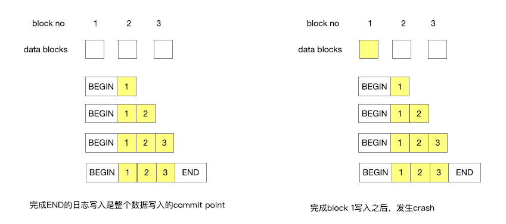

另外通过使用WAL ，我们在提交一个操作之前只需要进行文件的顺序写入，从而减少了包含多 block 文件操作的数据写入时延。


>> WAL 优化1：Group Commit

上面的WAL 方案中每次写入完END 日志都要调用一次耗时的sync API，会影响系统的性能。为了解决这个问题，我们可以使用group commit。group commit 就是一次提交多个数据写入，只有在写入最后一个数据写入的END日志之后，才调用一次sync API。

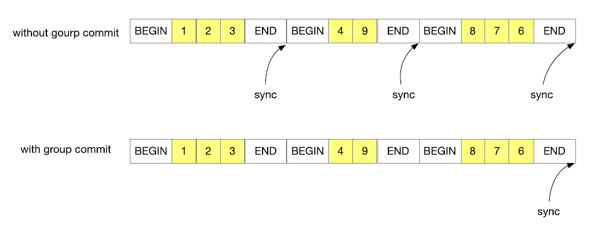

>> WAL 优化 2 File Padding

在往WAL 里面追加日志的时候，如果当前的文件 block 不能保存新添加的日志，就要为文件分配新的block ，这要更新文件 inode 里面的信息（例如 size ）。如果我们使用的是 HHD 的话，就要先 seek 到inode 所在的位置，然后回到新添加 block 的位置进行日志追加。为了减少这些 seek ，我们可以预先为WAL 分配 block 。例如 ZooKeeper 就是每次为 WAL 分配 64MB 的 block 。

>> WAL 优化3：快照


如果我们使用一个内存数据结构加WAL 的存储方案，WAL 就会一直增长。这样在存储系统启动的时候，就要读取大量的WAL 日志数据来重建内存数据。快照可以解决这个问题。快照是应用WAL 中从头到某一个日志条目产生的内存数据结构的序列化，例如下图中的快照就是应用从1 到7 日志条目产生的。

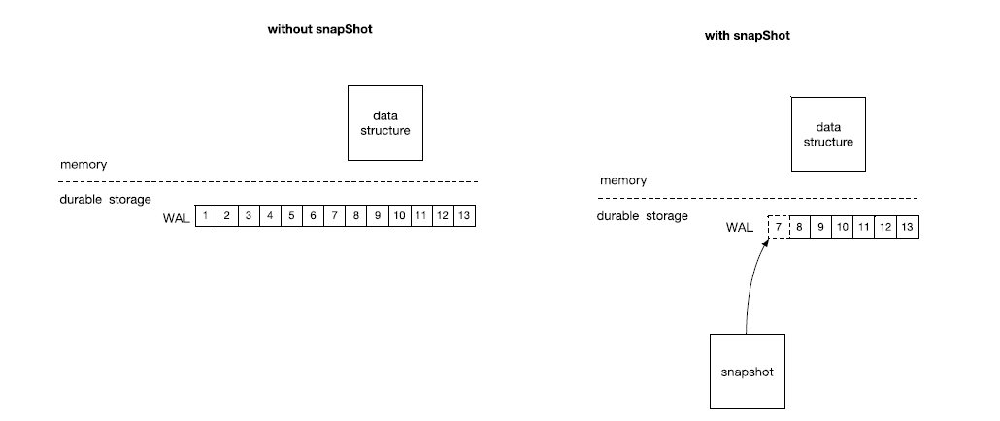


除了解决启动时间过长的问题之外，快照还可以减少存储空间的使用。WAL 的多个日志条目有可能是对同一个数据的改动，通过快照，就可以只保留最新的数据改动。


### 2、数据序列化

现在有众多的数据序列化方案，下面列出一些比较有影响力的序列化方案：

- JSON ：基于文本的序列化方案，方便易用，没有 schema ，但是序列化的效率低，广泛应用于HTTP API 中。

- BSON ：二进制的 JSON 序列化方案，应用于 MongoDB 。

- Protobuf Google 研发的二进制的序列化方案，有 schema ，广泛应用于 Google 内部，在开源
界也有广泛的应用（例如 gRPC ）。

- Thrift Facebook 研发的和 Protobuf 类似的一种二进制序列化方案，是 Apache 的项目。

- Avro ：二进制的序列化方案 Apache 项目，在大数据领域用的比较多。


## 04、ZooKeeper本地存储源码解析

> 序列化

ZooKeeper使用的序列化方案是 Apache Jute 。 ZooKeeper.jute 包含所有数据的 schema Jute 编译器通过编译 jute 文件生成 Java 代码 。生成的所有 Java 类实现 Record 接口。下面列出了序列化的核心接口和类。 Jute 的序列化底层使用的是 Java DataInput 的编码方案。

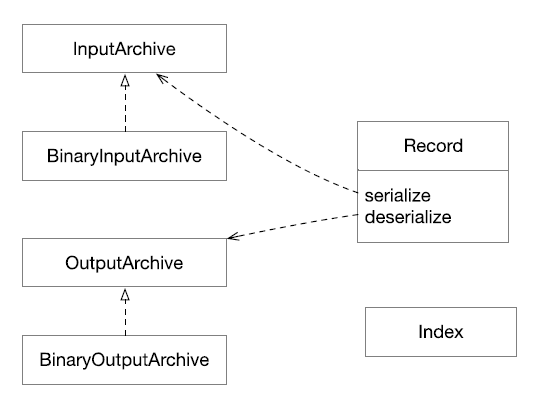


### 1、本地存储架构

ZooKeeper的本地存储采用的是内存数据结构加 WAL 的方案。 ZooKeeper 的 WAL 叫作事务日志(transaction log).


> 核心接口和类

- TxnLog: 接口类型，提供读写事务日志的API。
- FileTxnLog: 基于文件的TxnLog 实现。

- Snapshot: 快照接口类型，提供序列化、反序列化、访问快照的API。
- FileSnap: 基于文件的Snapsho 实现。

- FileTxnSnapLog: TxnLog和SnapSho t的封装。

- DataTree: ZooKeeper 的内存数据结构，是有所有znode 构成的树。
- DataNode: 表示一个znode。


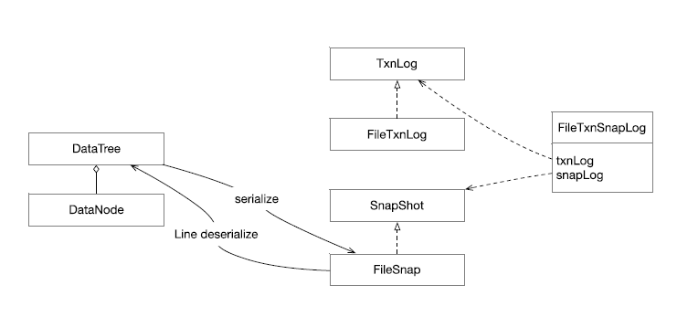


> File Padding

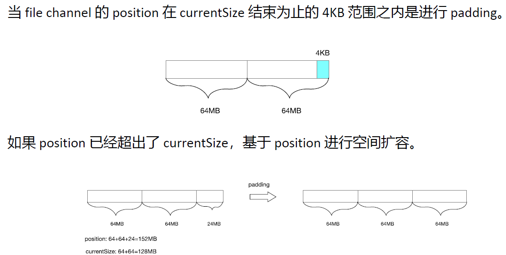

备注：这里感觉应该是大于2*64时扩展为3*64

### 2、DataTree

DataNode有一个成员叫作 children children 保存该 DataNode 的子节点名字，可以从根节点开始通过 children 遍历所有的节点。只有在序列化 DataTree 的时候才会通过 children 进行 DataTree 的遍历。其他对 DataNode 的访问都是通过 DataTree 的成员 nodes 来进行的。 nodes 是一个ConcurrentHashMap ，保存的是 DataNode 的 path 到 DataNode 的映射。

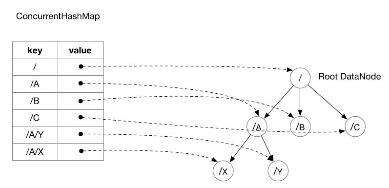


### 3、快照

- 序列化：从根 DataNode 开始做前序遍历，依次把 DataNode 写入到快照文件中。

- 反序列化：从头开始顺序读取快照文件的内容，建立 DataTree 。因为在序列化的时候使用的是前序遍历，会先反序列化到父亲节点再反序列化孩子节点。因此，在创建新的 DataNode 的同时，可以把新的 DataNode 加到它的父亲节点的 children 中去。

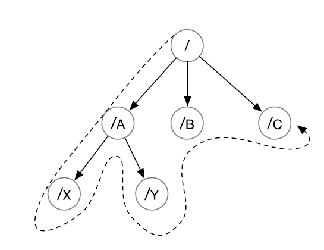


## 05、网络编程基础

> TCP socket和connection

- socket：用来表示网络中接收和发送数据的一个endpoint，由IP 地址和TCP 端口号组成。
- connection：表示两个endpoint 之间进行数据转述的一个通道，由代表两个endpoint 的socket 组成。


> Socket编程 API

发送和接受数据API

- ssize_t write(int fd , const void * buf , size_t count)

- ssize_t read(int fd , void buf , size_t count)

返回值大于等于 0 ，表示发送和接收的字节数；返回值 1 表示 API 调用失败， errno 里面会保存相应的错误码。perror API 可以用来输出 errno 表示的错误。

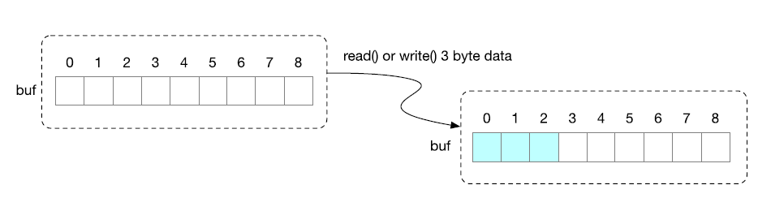


> client端 socket 编程

- socket(): 创建一个数据传输 socket 。

- getsockopt()/setsockopt(): 获取和设置socket 的选项。

- connect()connect()：建立 TCP 连接。

- close()close()：关闭 socket ，释放资源。

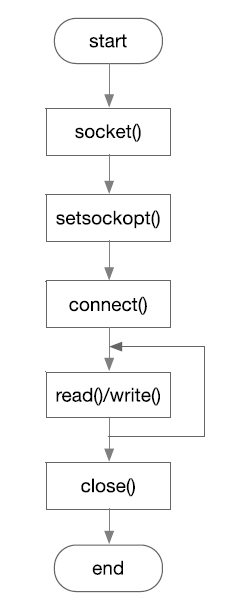


> server端 socket 编程

- socket(): 创建一 个用于监听的socket 。

- bind(): 把 socket 和一个网络地址关联起来。

- listen()：开始监听连接请求。

- accept()：接受一个连接，返回一个用于数据传输的 socket 。

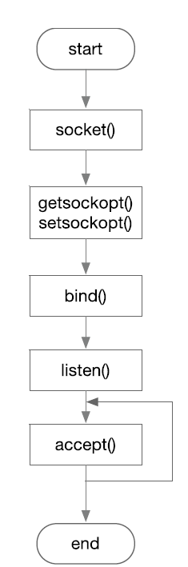


> Java Socket编程

Java区分用于数据传输的 socket 和监听的 socket ，用 Socket 这个类表示前者，用 ServerSocket 这个类表示后者。

Socket的 getOutputStream 返回的 OutputStream 用于发送数据， Socket 的 getInputStream 返回的InputStream 用于接收数据。

ServerSocket没有 listen 方法， listen 是自动被执行的。


## 06、事件驱动的网络编程

### 1、阻塞IO 的服务架构

这种架构使用一个进程处理一个connection Apache HTTP server 的 Prefork MPM 就是采用的这种架构。这种架构的问题在于进程和 connection 的不匹配， connection 是一种 lightweight 的 OS 资源，而 process 是一种 heavyweight 的 OS 资源。

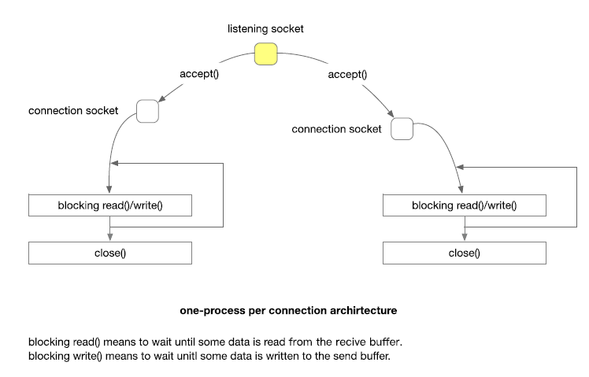

### 2、事件驱动的网络编程架构

> epoll API

epoll提供以下 3 个 API

- epoll_create1 ：创建 epoll 文件描述符。

- epoll_wait ：等待和 epoll 文件描述符关联的 I/O 事件。

- epoll_ctl ：设置 epoll 文件描述符的属性，更新文件描述符和 epoll 文件描述符的关联。

EPOLL事件的两种模型： Level Triggered (LT) 水平触发和 Edge Triggered (ET) 边沿触发 。默认是水平触发。


使用一个event loop 进行网络数据的发送和接收。

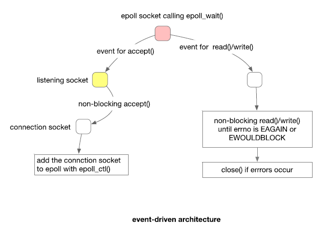

优点：

- 1.避免了大量创建 process 的 OS 资源消耗。 
- 2.减少了耗时的 context switch 。

缺点：事件驱动的编程麻烦一些。


### 3、Java的事件驱动网络编程


Java NIO事件驱动网络编程主要由以下 3 部分组成：

- Buffer: 数据缓冲区，对应 epoll 模型的数组。

- Channel: I/O 操作的数据通道，对应 epoll 模型的 socket 文件描述符。

- Selector 和 selection key: 对应 epoll 模型的 epoll 文件描述符。

以上三者构成了对底层事件驱动网络编程的封装。在Linux 平台上， Java NIO 最初支持的事件驱动网络编程模型是 select/poll 。从 JDK 8 开始， JDK 开始支持 epoll 。

Java NIO 的事件驱动网络编程和 epoll 的一样也是要在一个 event loop 上面加数据处理的 handler 。


> ByteBuffer状态图

一个ByteBuffer除了数据缓存区本身之外，有position、limit，capacity着3个属性。下图列出了ByteBuffer的方法是如何更新position和limit这两个属性。

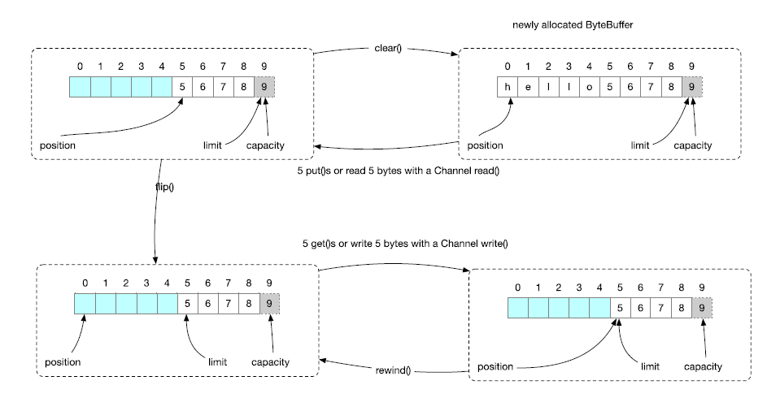


Direct ByteBuffer: 内存缓冲区存在于 JVM 之外，不受 Java GC 的控制。

Nondirect ByteBuffer: 内存缓冲区存在于 JVM 的 heap 中，受 Java GC 的控制。


### 4、Netty事件驱动网络编程Netty

Netty是在 Java NIO 基础之上封装的一个事件驱动网络编程。 Netty 在 Java 得到了广泛的应用，很多知名的 Java项目都使用了 Netty ，例如 gRPC 和 Apache Spark 。

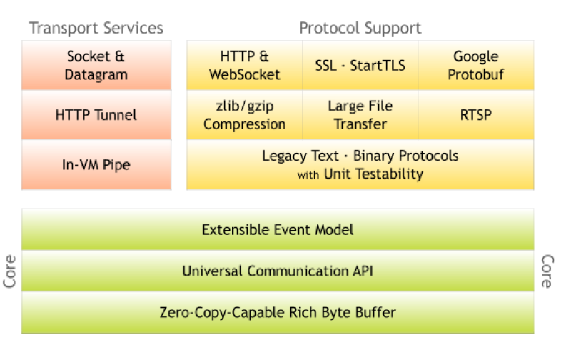


> Netty事件驱动网络编程核心类和接口

Netty事件驱动网络编程主要由以下 4 部分组成：

- Buffers: 数据缓冲区，对应 Java NIO 的 buffers 。

- Channel: I/O 操作的数据通道，对应 Java NIO 的 Channel 。

- Bootstrap 和 ServerBootstrap : Bootstrap 用来初始化一个 Netty client 端， ServerBootstrap 用来初始化一个 Netty server 端。

- Handler Netty 的用户通过实现 Netty 的各种 handler 的接口方法，来进行数据的处理，不需要在一个 event loop 上面显示的加 handler 。

> Netty ByteBuf

Netty ByteBuf 对应的是 Java NIO 。下图展示了 ByteBuffer 和 ByteBuf 属性的对应关系。

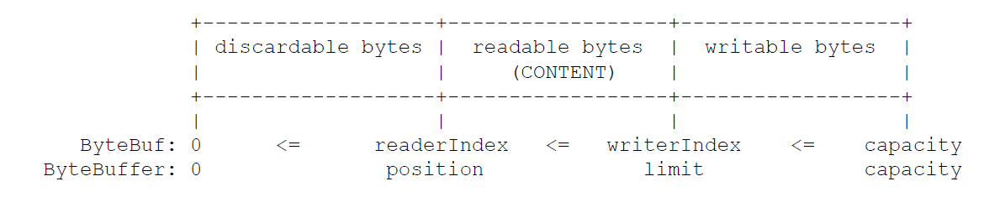

ByteBuf的优点：

- 使用了更准确的属性命名。

- 提供了更丰富的方法：检索 ByteBuf 内容的方法和通过已有 ByteBuf 生成新 ByteBuf 的方法。


## 07、ZooKeeper的客户端 网络通信源码 解读

> RPC网络数据结构

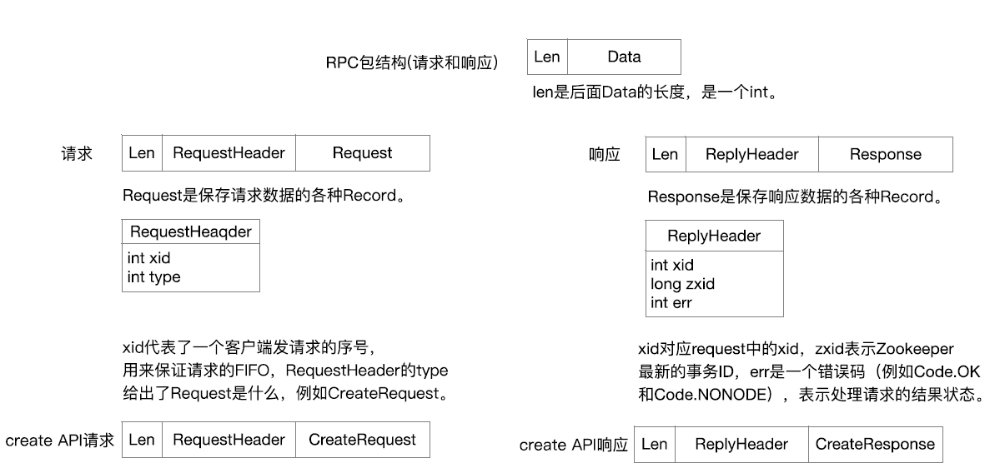


> ZooKeeper网络通信概述

支持两种事件驱动编程模型，一种是Java NIO ，一种是 Netty 。核心接口和类如下：

- ZooKeeper ：用户使用的 ZooKeeper 客户端库核心类。

- ClientCnxn: 负责和多个 ZooKeeper 节点的一个建立网络连接，包含 ZooKeeper RPC 的处理逻辑。

- ClientCnxnSocket: 网络通信的 high level 逻辑。

- ClientCnxnSocketNetty: 实际进行 TCP socket 的网络通信。

- StaticHostProvider: 提供一个 ZooKeeper 节点列表。


> RPC方法流程

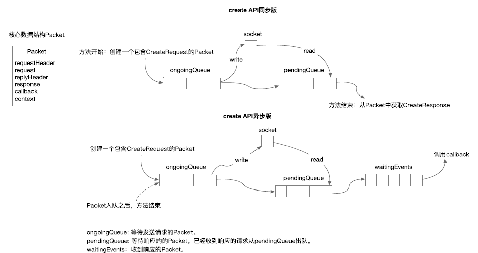


## 08、ZooKeeper的服务器网络通信源码解读

> 服务器端请求处理过程

一个RPC请求在从TCP socket读取之后，经过request processor pipeline的处理，最后把响应写回socket。

## 09、ZooKeeper的 Request Processor 源码解读

> 流水线(pipeline)


流水线是工业界广泛应用的技术，在计算机领域更是在诸多领域发挥了重要作用。

- 在体系结构领域， instruction pipelines 是提升CPU 处理能力的重要手段。

- UNIX pipeline( 例如 ls l | grep key | less) 是 UNIX操作系统经久不衰的经典设计。

流水线的作用：

- 提升系统的吞吐量。

- 把一个复杂任务分解多个阶段，可以减低系统研发的复杂度，另外可以更方便的重用这些独立的阶段。

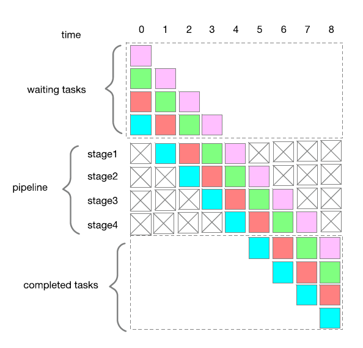


> Request Processor流水线

ZooKeeper requeest processor流水线的核心接口是RequestProcessor。

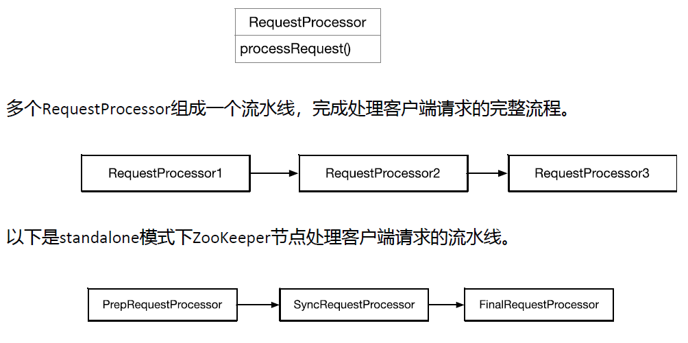


>> PrepRequestProcessor源码解读

PrepRequestProcessor是standalone模式下的第一个request procoessor，主要用来生成写请求的事务记录。它的核心逻辑入下图所示：

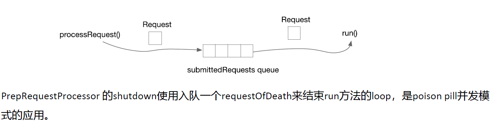

>> SyncRequestProcessor源码解读

SyncRequestProcessor负责把事务记录写到durable storage 上去，做了 Group Commit 的优化。Group Commit 的 commit size 大于 1000 。

```java
loop:
    if toFlush.isEmpty()
        // Wait for a Request since toFlush is empty
        queuedRequests.take()
    else if
        si = queuedRequests.poll()
        if si == null
            // Flush since there is no Request
            flush(toFlush)
        end
    end
    zks.getZKDatabase().append(si)
    toFlush.add(si);
    if toFlush.size() > 1000)
        flush(toFlush)
end
```

>> FinalRequestProcessor源码解读

FinalRequestProcessor使用事务记录操作 ZooKeeper 的 in memory DataTree ，并把操作结果写回到 TCPsocket 。以下是 processRequest 方法的核心逻辑 以处理 Create API 为例

```java
processRequest
    rc = zks.processTxn(request)
    rsp = new CreateResponse(rc.path)
    ServerCnxn.sendResponse(hdr, rsp, "response")
        NettyServerCnxn.sendBuffer(bb)
            channel.writeAndFlush()
```


## 10、Standalone的 ZooKeeper 是如何处理客户端请求的？

> 事务日志


PrepRequestProcessor会为每一个客户端写请求生成一个事务，对 ZooKeeper in memory DataTree 更新的时候应的不是原始的写请求，而是对应的事务记录。事务记录都是幂等的，多次应用一个事务记录不会影响结构的正确性。

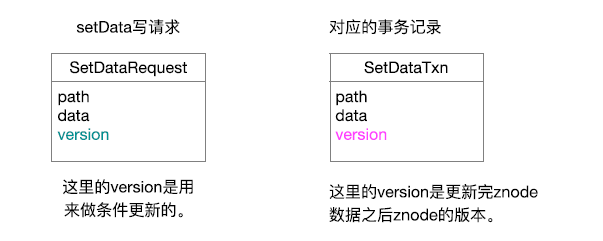

ZooKeeper的事务日志是每个事务包含一条记录的 REDO 日志，日志记录是 physical 的。


> 事务日志源码解读

以setData 为例。

为setData 创建事务

```java
PrepRequestProcessor.run()
    pRequest()
        pRequest2Txn()
```

把setData 事务应用到 DataTree

```java
FinalRequestProcessor.processRequest
    ZooKeeperServer.processTxn()
        ZKDatabase.processTxn(hdr, txn)
            DataTree.processTxn()
                DataTree.setData()
```

> Fuzzy Snapshot

ZooKeeper可以在同时处理客户端请求的时候生成 snapshot 。 snapshot 开始时候 DataTree 上面最新的 zxid 叫作 snapshot 的 TS 。 ZooKeeper 的 snapshot 不是一个数据一致的 DataTree 。但是在 snapshot 上面应用比 TS 新的事务记录之后得到的 DataTree 是数据一致的。

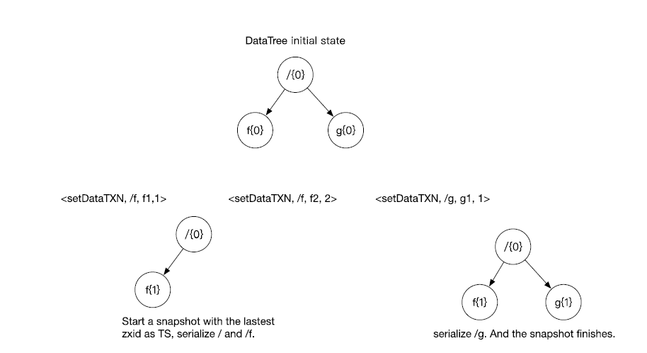


> 写请求源码解读以 create 为例

PrepRequestProcessor的 outstandingChanges 保存的是正在处理的事务要对 in memory DataTree 做的变更。后面的记录在读取数据数据的时候，先要到 outstandingChanges 里面读取。

outstandingChanges使得 ZooKeeper 不必等前面的事务处理完就可以处理处理后面的事务，保证了事务的流水线处理。


## 11、Quorum模式下 ZooKeeper 节点的 Request Processor Pipeline


> Standalone模式下 ZooKeeper 如何保证数据一致性的

ZooKeeper数据一致性

- 1.全局可线性化（ Linearizable ）写入 ZooKeeper 节点决定写请求的执行顺序。

- 2.客户端 FIFO 顺序：来自一个客户端的请求按照发送顺序执行。

Standalone

模式下的以下两点保证了以上的数据一致性：

- 1.TCP 协议保证了请求在网络上进行传输的先后顺序。

- 2.Request processor pipeline 的每个阶段都是单线程的。

第2 点导致 FinalRequestProcessor 对 DataTree 的访问都是串行的，性能不好 。

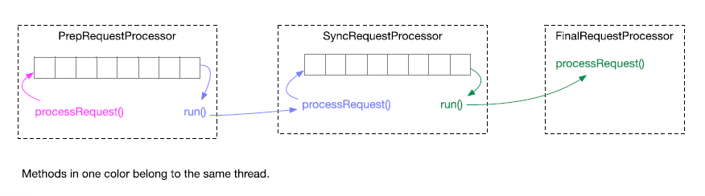


Quorum模式下 ZooKeeper 使用以下 3 点保证数据一致性：

- 1.每一个 ZooKeeper 节点都按照 zxid 的把事务记录应用到 DataTree 上面。

- 2.来自一个 session 的请求按照 FIFO 的顺序执行。

- 3.在处理一个写请求的时候，不能处理任何其他请求。

这样做的好处是允许DatatTree 并行执行读操作。 Quorum 模式下，保证第 2 点和第 3 点的是 CommitProcessor 。


下图是CommitProcessor 处理请求的核心逻辑：

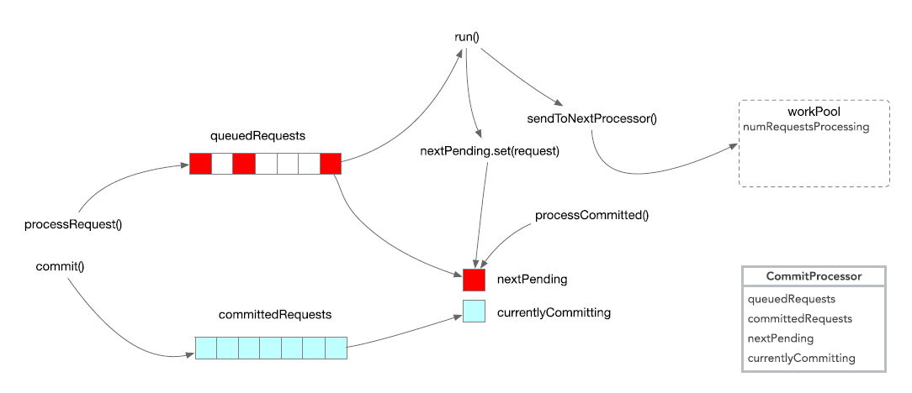


> workPool状态图

workPool处于两个重要状态： 1. 并行处理读请求。 2. 处理一个写请求。

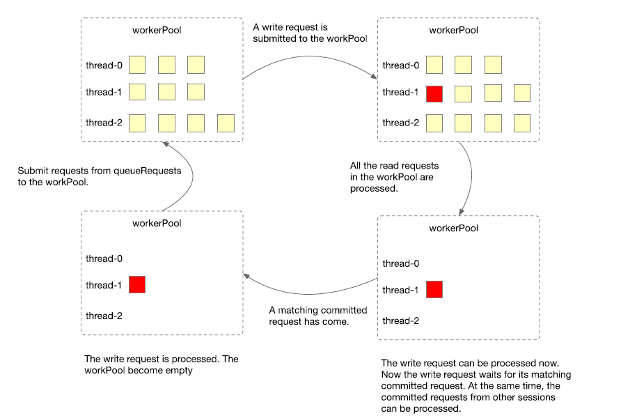

CommitProcessor使用 wait()/notifyAll() 机制控制提交请求给 workPool 。 CommitProcessor 的 run() 方法负责向 workPool 提交请求。

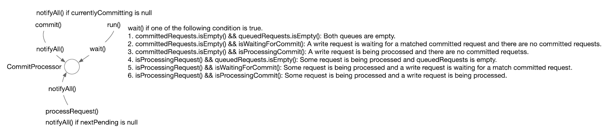


FollowerRequestProcessor处理来自客户端的请求， SyncRequestProcessor 处理来自 Leader 的Leader.PROPOSAL 。 SendAckRequestProcessor 用来向 Leader 发送 Leader.PROPOSAL 的响应。

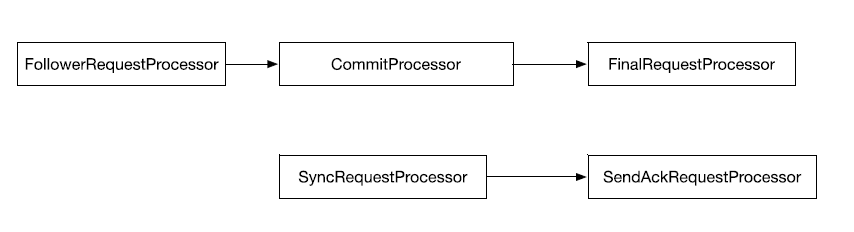


