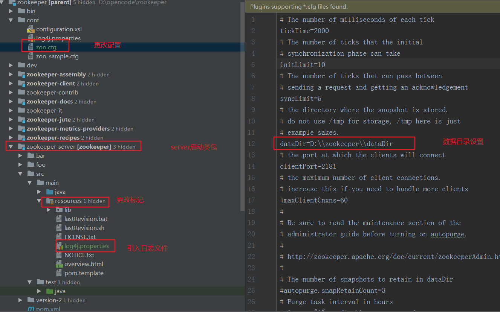
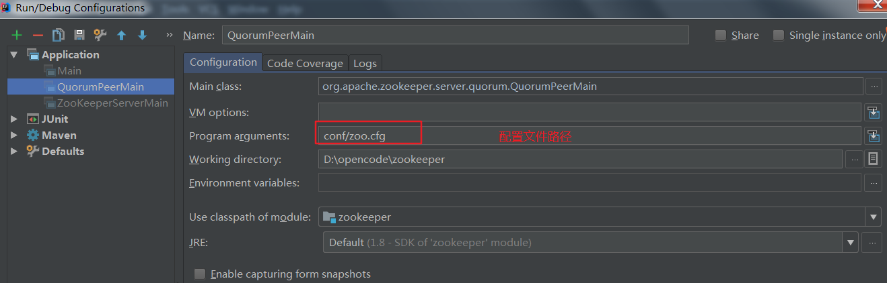

<!-- TOC -->

- [1、下载github下载源码构建](#1下载github下载源码构建)
- [2、idea中启动](#2idea中启动)
- [3、遇到的问题](#3遇到的问题)

<!-- /TOC -->


备注：当前代码基于版本tag3.6.0


# 1、下载github下载源码构建

直接Git clone下来后执行clean install -Dmaven.test.skip=true或者clean package -Dmaven.test.skip=true即可

备注：如果不跳过单元测试构建及其漫长，建议通过参数-Dmaven.test.skip=true跳过


# 2、idea中启动






启动日志：

```
2020-05-30 11:52:25,939 [myid:] - INFO  [main:ZooKeeperServer@128] - zookeeper.enableEagerACLCheck = false
2020-05-30 11:52:25,940 [myid:] - INFO  [main:ZooKeeperServer@136] - zookeeper.digest.enabled = true
2020-05-30 11:52:25,940 [myid:] - INFO  [main:ZooKeeperServer@140] - zookeeper.closeSessionTxn.enabled = true
2020-05-30 11:52:25,940 [myid:] - INFO  [main:ZooKeeperServer@1433] - zookeeper.flushDelay=0
2020-05-30 11:52:25,940 [myid:] - INFO  [main:ZooKeeperServer@1442] - zookeeper.maxWriteQueuePollTime=0
2020-05-30 11:52:25,940 [myid:] - INFO  [main:ZooKeeperServer@1451] - zookeeper.maxBatchSize=1000
2020-05-30 11:52:25,940 [myid:] - INFO  [main:ZooKeeperServer@241] - zookeeper.intBufferStartingSizeBytes = 1024
2020-05-30 11:52:25,974 [myid:] - INFO  [main:BlueThrottle@141] - Weighed connection throttling is disabled
2020-05-30 11:52:26,035 [myid:] - INFO  [main:ZooKeeperServer@1246] - minSessionTimeout set to 4000
2020-05-30 11:52:26,036 [myid:] - INFO  [main:ZooKeeperServer@1255] - maxSessionTimeout set to 40000
2020-05-30 11:52:26,081 [myid:] - INFO  [main:ResponseCache@45] - Response cache size is initialized with value 400.
2020-05-30 11:52:26,081 [myid:] - INFO  [main:ResponseCache@45] - Response cache size is initialized with value 400.
2020-05-30 11:52:26,118 [myid:] - INFO  [main:RequestPathMetricsCollector@111] - zookeeper.pathStats.slotCapacity = 60
2020-05-30 11:52:26,119 [myid:] - INFO  [main:RequestPathMetricsCollector@112] - zookeeper.pathStats.slotDuration = 15
2020-05-30 11:52:26,119 [myid:] - INFO  [main:RequestPathMetricsCollector@113] - zookeeper.pathStats.maxDepth = 6
2020-05-30 11:52:26,119 [myid:] - INFO  [main:RequestPathMetricsCollector@114] - zookeeper.pathStats.initialDelay = 5
2020-05-30 11:52:26,119 [myid:] - INFO  [main:RequestPathMetricsCollector@115] - zookeeper.pathStats.delay = 5
2020-05-30 11:52:26,119 [myid:] - INFO  [main:RequestPathMetricsCollector@116] - zookeeper.pathStats.enabled = false
2020-05-30 11:52:26,202 [myid:] - INFO  [main:ZooKeeperServer@1470] - The max bytes for all large requests are set to 104857600
2020-05-30 11:52:26,203 [myid:] - INFO  [main:ZooKeeperServer@1484] - The large request threshold is set to -1
2020-05-30 11:52:26,203 [myid:] - INFO  [main:ZooKeeperServer@329] - Created server with tickTime 2000 minSessionTimeout 4000 maxSessionTimeout 40000 clientPortListenBacklog -1 datadir D:\zookeeper\dataDir\version-2 snapdir D:\zookeeper\dataDir\version-2
2020-05-30 11:52:26,298 [myid:] - INFO  [main:Log@169] - Logging initialized @3854ms to org.eclipse.jetty.util.log.Slf4jLog
2020-05-30 11:52:26,553 [myid:] - WARN  [main:ContextHandler@1520] - o.e.j.s.ServletContextHandler@35e2d654{/,null,UNAVAILABLE} contextPath ends with /*
2020-05-30 11:52:26,554 [myid:] - WARN  [main:ContextHandler@1531] - Empty contextPath
2020-05-30 11:52:26,652 [myid:] - INFO  [main:Server@359] - jetty-9.4.24.v20191120; built: 2019-11-20T21:37:49.771Z; git: 363d5f2df3a8a28de40604320230664b9c793c16; jvm 1.8.0_181-b13
2020-05-30 11:52:26,756 [myid:] - INFO  [main:DefaultSessionIdManager@333] - DefaultSessionIdManager workerName=node0
2020-05-30 11:52:26,756 [myid:] - INFO  [main:DefaultSessionIdManager@338] - No SessionScavenger set, using defaults
2020-05-30 11:52:26,759 [myid:] - INFO  [main:HouseKeeper@140] - node0 Scavenging every 600000ms
2020-05-30 11:52:26,784 [myid:] - INFO  [main:ContextHandler@825] - Started o.e.j.s.ServletContextHandler@35e2d654{/,null,AVAILABLE}
2020-05-30 11:52:27,247 [myid:] - INFO  [main:AbstractConnector@330] - Started ServerConnector@15c43bd9{HTTP/1.1,[http/1.1]}{0.0.0.0:8080}
2020-05-30 11:52:27,247 [myid:] - INFO  [main:Server@399] - Started @4803ms
2020-05-30 11:52:27,247 [myid:] - INFO  [main:JettyAdminServer@178] - Started AdminServer on address 0.0.0.0, port 8080 and command URL /commands
2020-05-30 11:52:27,464 [myid:] - INFO  [main:ServerCnxnFactory@169] - Using org.apache.zookeeper.server.NIOServerCnxnFactory as server connection factory
2020-05-30 11:52:27,497 [myid:] - WARN  [main:ServerCnxnFactory@309] - maxCnxns is not configured, using default value 0.
2020-05-30 11:52:27,586 [myid:] - INFO  [main:NIOServerCnxnFactory@666] - Configuring NIO connection handler with 10s sessionless connection timeout, 1 selector thread(s), 8 worker threads, and 64 kB direct buffers.
2020-05-30 11:52:27,636 [myid:] - INFO  [main:NIOServerCnxnFactory@674] - binding to port 0.0.0.0/0.0.0.0:2181
2020-05-30 11:52:28,077 [myid:] - INFO  [main:WatchManagerFactory@42] - Using org.apache.zookeeper.server.watch.WatchManager as watch manager
2020-05-30 11:52:28,077 [myid:] - INFO  [main:WatchManagerFactory@42] - Using org.apache.zookeeper.server.watch.WatchManager as watch manager
2020-05-30 11:52:28,077 [myid:] - INFO  [main:ZKDatabase@132] - zookeeper.snapshotSizeFactor = 0.33
2020-05-30 11:52:28,078 [myid:] - INFO  [main:ZKDatabase@152] - zookeeper.commitLogCount=500
2020-05-30 11:52:28,187 [myid:] - INFO  [main:SnapStream@61] - zookeeper.snapshot.compression.method = CHECKED
2020-05-30 11:52:28,211 [myid:] - INFO  [main:FileSnap@85] - Reading snapshot D:\zookeeper\dataDir\version-2\snapshot.2
2020-05-30 11:52:28,291 [myid:] - INFO  [main:DataTree@1730] - The digest in the snapshot has digest version of 2, , with zxid as 0x2, and digest value as 1538168035
2020-05-30 11:52:28,657 [myid:] - INFO  [main:FileTxnSnapLog@363] - 1 txns loaded in 181 ms
2020-05-30 11:52:28,658 [myid:] - INFO  [main:ZKDatabase@289] - Snapshot loaded in 580 ms, highest zxid is 0x3, digest is 1538168035
2020-05-30 11:52:28,674 [myid:] - INFO  [main:FileTxnSnapLog@470] - Snapshotting: 0x3 to D:\zookeeper\dataDir\version-2\snapshot.3
2020-05-30 11:52:28,694 [myid:] - INFO  [main:ZooKeeperServer@519] - Snapshot taken in 20 ms
2020-05-30 11:52:28,979 [myid:] - INFO  [main:RequestThrottler@74] - zookeeper.request_throttler.shutdownTimeout = 10000
2020-05-30 11:52:29,106 [myid:] - INFO  [main:ContainerManager@83] - Using checkIntervalMs=60000 maxPerMinute=10000 maxNeverUsedIntervalMs=0
2020-05-30 11:52:29,156 [myid:] - INFO  [main:ZKAuditProvider@42] - ZooKeeper audit is disabled.
```


# 3、遇到的问题

> 1、运行主类QuorumPeerMain异常Caused by: java.lang.ClassNotFoundException: com.codahale.metrics.Reservoir

```java
D:\soft-install\jdk8\bin\java "-javaagent:D:\idea-2017-new\IntelliJ IDEA 2017.2.2\lib\idea_rt.jar=55969:D:\idea-2017-new\IntelliJ IDEA 2017.2.2\bin" -Dfile.encoding=UTF-8 -classpath D:\soft-install\jdk8\jre\lib\charsets.jar;D:\soft-install\jdk8\jre\lib\deploy.jar;D:\soft-install\jdk8\jre\lib\ext\access-bridge-64.jar;D:\soft-install\jdk8\jre\lib\ext\cldrdata.jar;D:\soft-install\jdk8\jre\lib\ext\dnsns.jar;D:\soft-install\jdk8\jre\lib\ext\jaccess.jar;D:\soft-install\jdk8\jre\lib\ext\jfxrt.jar;D:\soft-install\jdk8\jre\lib\ext\localedata.jar;D:\soft-install\jdk8\jre\lib\ext\nashorn.jar;D:\soft-install\jdk8\jre\lib\ext\sunec.jar;D:\soft-install\jdk8\jre\lib\ext\sunjce_provider.jar;D:\soft-install\jdk8\jre\lib\ext\sunmscapi.jar;D:\soft-install\jdk8\jre\lib\ext\sunpkcs11.jar;D:\soft-install\jdk8\jre\lib\ext\zipfs.jar;D:\soft-install\jdk8\jre\lib\javaws.jar;D:\soft-install\jdk8\jre\lib\jce.jar;D:\soft-install\jdk8\jre\lib\jfr.jar;D:\soft-install\jdk8\jre\lib\jfxswt.jar;D:\soft-install\jdk8\jre\lib\jsse.jar;D:\soft-install\jdk8\jre\lib\management-agent.jar;D:\soft-install\jdk8\jre\lib\plugin.jar;D:\soft-install\jdk8\jre\lib\resources.jar;D:\soft-install\jdk8\jre\lib\rt.jar;D:\opencode\zookeeper\zookeeper-server\target\classes;D:\maven-respo\commons-lang\commons-lang\2.6\commons-lang-2.6.jar;D:\opencode\zookeeper\zookeeper-jute\target\classes;D:\maven-respo\org\apache\yetus\audience-annotations\0.5.0\audience-annotations-0.5.0.jar;D:\maven-respo\io\netty\netty-handler\4.1.48.Final\netty-handler-4.1.48.Final.jar;D:\maven-respo\io\netty\netty-common\4.1.48.Final\netty-common-4.1.48.Final.jar;D:\maven-respo\io\netty\netty-resolver\4.1.48.Final\netty-resolver-4.1.48.Final.jar;D:\maven-respo\io\netty\netty-buffer\4.1.48.Final\netty-buffer-4.1.48.Final.jar;D:\maven-respo\io\netty\netty-transport\4.1.48.Final\netty-transport-4.1.48.Final.jar;D:\maven-respo\io\netty\netty-codec\4.1.48.Final\netty-codec-4.1.48.Final.jar;D:\maven-respo\io\netty\netty-transport-native-epoll\4.1.48.Final\netty-transport-native-epoll-4.1.48.Final.jar;D:\maven-respo\io\netty\netty-transport-native-unix-common\4.1.48.Final\netty-transport-native-unix-common-4.1.48.Final.jar;D:\maven-respo\org\slf4j\slf4j-api\1.7.25\slf4j-api-1.7.25.jar;D:\maven-respo\org\slf4j\slf4j-log4j12\1.7.25\slf4j-log4j12-1.7.25.jar;D:\maven-respo\log4j\log4j\1.2.17\log4j-1.2.17.jar org.apache.zookeeper.server.quorum.QuorumPeerMain conf/zoo.cfg
log4j:WARN No appenders could be found for logger (org.apache.zookeeper.server.quorum.QuorumPeerConfig).
log4j:WARN Please initialize the log4j system properly.
log4j:WARN See http://logging.apache.org/log4j/1.2/faq.html#noconfig for more info.
Exception in thread "main" java.lang.NoClassDefFoundError: com/codahale/metrics/Reservoir
	at org.apache.zookeeper.metrics.impl.DefaultMetricsProvider$DefaultMetricsContext.lambda$getSummary$2(DefaultMetricsProvider.java:126)
	at java.util.concurrent.ConcurrentHashMap.computeIfAbsent(ConcurrentHashMap.java:1660)
	at org.apache.zookeeper.metrics.impl.DefaultMetricsProvider$DefaultMetricsContext.getSummary(DefaultMetricsProvider.java:122)
	at org.apache.zookeeper.server.ServerMetrics.<init>(ServerMetrics.java:74)
	at org.apache.zookeeper.server.ServerMetrics.<clinit>(ServerMetrics.java:44)
	at org.apache.zookeeper.server.ZooKeeperServerMain.runFromConfig(ZooKeeperServerMain.java:132)
	at org.apache.zookeeper.server.ZooKeeperServerMain.initializeAndRun(ZooKeeperServerMain.java:112)
	at org.apache.zookeeper.server.ZooKeeperServerMain.main(ZooKeeperServerMain.java:67)
	at org.apache.zookeeper.server.quorum.QuorumPeerMain.initializeAndRun(QuorumPeerMain.java:140)
	at org.apache.zookeeper.server.quorum.QuorumPeerMain.main(QuorumPeerMain.java:90)
Caused by: java.lang.ClassNotFoundException: com.codahale.metrics.Reservoir
	at java.net.URLClassLoader.findClass(URLClassLoader.java:381)
	at java.lang.ClassLoader.loadClass(ClassLoader.java:424)
	at sun.misc.Launcher$AppClassLoader.loadClass(Launcher.java:349)
	at java.lang.ClassLoader.loadClass(ClassLoader.java:357)
	... 10 more

Process finished with exit code 1

```


解决思路：因为有些类引入是provided，把相关的provided去掉就行了。这里

```xml
<?xml version="1.0" encoding="UTF-8"?>
<project xmlns="http://maven.apache.org/POM/4.0.0" xmlns:xsi="http://www.w3.org/2001/XMLSchema-instance" xsi:schemaLocation="http://maven.apache.org/POM/4.0.0 http://maven.apache.org/maven-v4_0_0.xsd">
  <!--
  /**
   * Licensed to the Apache Software Foundation (ASF) under one
   * or more contributor license agreements.  See the NOTICE file
   * distributed with this work for additional information
   * regarding copyright ownership.  The ASF licenses this file
   * to you under the Apache License, Version 2.0 (the
   * "License"); you may not use this file except in compliance
   * with the License.  You may obtain a copy of the License at
   *
   *     http://www.apache.org/licenses/LICENSE-2.0
   *
   * Unless required by applicable law or agreed to in writing, software
   * distributed under the License is distributed on an "AS IS" BASIS,
   * WITHOUT WARRANTIES OR CONDITIONS OF ANY KIND, either express or implied.
   * See the License for the specific language governing permissions and
   * limitations under the License.
   */
  -->
  <modelVersion>4.0.0</modelVersion>
  <parent>
    <groupId>org.apache.zookeeper</groupId>
    <artifactId>parent</artifactId>
    <version>3.6.0</version>
    <relativePath>..</relativePath>
  </parent>

  <groupId>org.apache.zookeeper</groupId>
  <artifactId>zookeeper</artifactId>
  <packaging>jar</packaging>
  <name>Apache ZooKeeper - Server</name>
  <description>ZooKeeper server</description>

  <dependencies>
    <dependency>
      <groupId>com.github.spotbugs</groupId>
      <artifactId>spotbugs-annotations</artifactId>
      <scope>provided</scope>
      <optional>true</optional>
    </dependency>
    <dependency>
      <groupId>org.hamcrest</groupId>
      <artifactId>hamcrest-all</artifactId>
      <scope>test</scope>
    </dependency>
    <dependency>
      <groupId>commons-collections</groupId>
      <artifactId>commons-collections</artifactId>
      <scope>test</scope>
    </dependency>
    <dependency>
      <groupId>commons-lang</groupId>
      <artifactId>commons-lang</artifactId>
    </dependency>
    <dependency>
      <groupId>org.apache.zookeeper</groupId>
      <artifactId>zookeeper-jute</artifactId>
      <version>${project.version}</version>
    </dependency>
    <dependency>
      <groupId>commons-cli</groupId>
      <artifactId>commons-cli</artifactId>
      <scope>provided</scope>
    </dependency>
    <dependency>
      <groupId>org.apache.yetus</groupId>
      <artifactId>audience-annotations</artifactId>
    </dependency>
    <dependency>
      <groupId>io.netty</groupId>
      <artifactId>netty-handler</artifactId>
    </dependency>
    <dependency>
      <groupId>io.netty</groupId>
      <artifactId>netty-transport-native-epoll</artifactId>
    </dependency>
    <dependency>
      <groupId>org.slf4j</groupId>
      <artifactId>slf4j-api</artifactId>
    </dependency>
    <dependency>
      <groupId>org.slf4j</groupId>
      <artifactId>slf4j-log4j12</artifactId>
    </dependency>
    <dependency>
      <groupId>org.eclipse.jetty</groupId>
      <artifactId>jetty-server</artifactId>
      <!--<scope>provided</scope>-->
    </dependency>
    <dependency>
      <groupId>org.eclipse.jetty</groupId>
      <artifactId>jetty-servlet</artifactId>
      <!--<scope>provided</scope>-->
    </dependency>
    <dependency>
      <groupId>com.fasterxml.jackson.core</groupId>
      <artifactId>jackson-databind</artifactId>
      <!--<scope>provided</scope>-->
    </dependency>
    <dependency>
      <groupId>com.googlecode.json-simple</groupId>
      <artifactId>json-simple</artifactId>
      <!--<scope>provided</scope>-->
    </dependency>
    <dependency>
      <groupId>org.bouncycastle</groupId>
      <artifactId>bcprov-jdk15on</artifactId>
      <scope>test</scope>
    </dependency>
    <dependency>
      <groupId>org.bouncycastle</groupId>
      <artifactId>bcpkix-jdk15on</artifactId>
      <scope>test</scope>
    </dependency>
    <dependency>
      <groupId>jline</groupId>
      <artifactId>jline</artifactId>
      <scope>provided</scope>
    </dependency>
    <dependency>
       <groupId>io.dropwizard.metrics</groupId>
       <artifactId>metrics-core</artifactId>
       <!--<scope>provided</scope>-->
    </dependency>
    <dependency>
      <groupId>log4j</groupId>
      <artifactId>log4j</artifactId>
    </dependency>
    <dependency>
      <groupId>org.apache.kerby</groupId>
      <artifactId>kerb-core</artifactId>
      <scope>test</scope>
    </dependency>
    <dependency>
      <groupId>org.apache.kerby</groupId>
      <artifactId>kerb-simplekdc</artifactId>
      <scope>test</scope>
    </dependency>
    <dependency>
      <groupId>org.apache.kerby</groupId>
      <artifactId>kerby-config</artifactId>
      <scope>test</scope>
    </dependency>
    <dependency>
      <groupId>org.mockito</groupId>
      <artifactId>mockito-core</artifactId>
      <scope>test</scope>
    </dependency>
    <dependency>
      <groupId>org.jmockit</groupId>
      <artifactId>jmockit</artifactId>
      <scope>test</scope>
    </dependency>
    <dependency>
      <groupId>junit</groupId>
      <artifactId>junit</artifactId>
      <scope>test</scope>
    </dependency>
    <dependency>
      <groupId>org.xerial.snappy</groupId>
      <artifactId>snappy-java</artifactId>
      <!--<scope>provided</scope>-->
    </dependency>
  </dependencies>

  <build>
    <plugins>
      <plugin>
        <groupId>org.codehaus.mojo</groupId>
        <artifactId>properties-maven-plugin</artifactId>
        <executions>
          <execution>
            <phase>initialize</phase>
            <goals>
              <goal>read-project-properties</goal>
            </goals>
            <configuration>
              <files>
                <file>${basedir}/src/main/resources/git.properties</file>
              </files>
            </configuration>
          </execution>
        </executions>
      </plugin>
      <plugin> <!-- ${maven.build.timestamp} does not support timezone :( -->
        <groupId>org.codehaus.mojo</groupId>
        <artifactId>build-helper-maven-plugin</artifactId>
        <executions>
          <execution>
            <id>tbuild-time</id>
            <goals>
              <goal>timestamp-property</goal>
            </goals>
            <configuration>
              <name>build.time</name>
              <pattern>MM/dd/yyyy HH:mm zz</pattern>
              <locale>en_US</locale>
              <timeZone>GMT</timeZone>
            </configuration>
          </execution>
          <execution>
            <phase>generate-sources</phase>
            <goals>
              <goal>add-source</goal>
            </goals>
            <configuration>
              <sources>
                <source>${project.build.directory}/generated-sources/java</source>
              </sources>
            </configuration>
          </execution>
        </executions>
      </plugin>
      <plugin>
        <groupId>org.apache.maven.plugins</groupId>
        <artifactId>maven-compiler-plugin</artifactId>
        <executions>
          <execution>
            <id>pre-compile-vergen</id>
            <phase>generate-sources</phase>
            <configuration>
              <includes>
                <include>org/apache/zookeeper/version/**/*.java</include>
              </includes>
            </configuration>
            <goals>
              <goal>compile</goal>
            </goals>
          </execution>
        </executions>
      </plugin>
      <plugin>
        <groupId>org.codehaus.mojo</groupId>
        <artifactId>exec-maven-plugin</artifactId>
        <executions>
          <execution>
            <id>generate-version-info</id>
            <phase>generate-sources</phase>
            <goals>
              <goal>exec</goal>
            </goals>
            <configuration>
              <workingDirectory>${project.basedir}/src/main/java/</workingDirectory>
              <executable>java</executable>
              <arguments>
                <argument>-classpath</argument>
                <classpath />
                <argument>org.apache.zookeeper.version.util.VerGen</argument>
                <argument>${project.version}</argument>
                <argument>${git.commit.id}</argument>
                <argument>${build.time}</argument>
                <argument>${project.basedir}/target/generated-sources/java</argument>
              </arguments>
            </configuration>
          </execution>
        </executions>
      </plugin>
      <plugin>
        <groupId>org.apache.maven.plugins</groupId>
        <artifactId>maven-dependency-plugin</artifactId>
        <executions>
          <execution>
            <id>copy-dependencies</id>
            <phase>package</phase>
            <goals>
              <goal>copy-dependencies</goal>
            </goals>
            <configuration>
              <outputDirectory>${project.build.directory}/lib</outputDirectory>
              <overWriteReleases>false</overWriteReleases>
              <overWriteSnapshots>true</overWriteSnapshots>
              <excludeTransitive>false</excludeTransitive>
            </configuration>
          </execution>
        </executions>
      </plugin>

      <plugin>
        <groupId>org.apache.maven.plugins</groupId>
        <artifactId>maven-surefire-plugin</artifactId>
        <configuration>
          <includes>
            <include>**/*Test.java</include>
          </includes>
          <forkCount>${surefire-forkcount}</forkCount>
          <reuseForks>false</reuseForks>
          <argLine>-Xmx512m -Dtest.junit.threads=${surefire-forkcount} -Dzookeeper.junit.threadid=${surefire.forkNumber} -javaagent:${org.jmockit:jmockit:jar}</argLine>
          <basedir>${project.basedir}</basedir>
          <redirectTestOutputToFile>true</redirectTestOutputToFile>
          <systemPropertyVariables>
            <build.test.dir>${project.build.directory}/surefire</build.test.dir>
            <zookeeper.DigestAuthenticationProvider.superDigest>super:D/InIHSb7yEEbrWz8b9l71RjZJU=</zookeeper.DigestAuthenticationProvider.superDigest>
          </systemPropertyVariables>
        </configuration>
      </plugin>

      <plugin>
        <groupId>org.apache.maven.plugins</groupId>
        <artifactId>maven-jar-plugin</artifactId>
        <executions>
          <execution>
            <id>publish-test-jar</id>
            <goals>
              <goal>test-jar</goal>
            </goals>
          </execution>
        </executions>
      </plugin>
     </plugins>
  </build>

</project>

```

> 2、把conf目录的log4j复制到resources目录发现没有日志输出

不知道为啥，下载下来的源码resources目标没有被Mark resources root，需要手动标记一下


