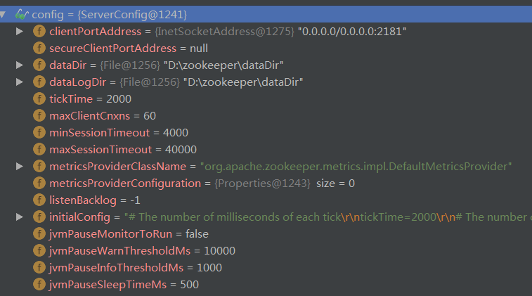

# 1、源码结构

- 1.zookeeper-assembly ：组件描述文档

- 2.zookeeper-client ：客户端，目前只支持c

- 3.zookeeper-contrib ：附加的功能

- 4.zookeeper-doc ： 文档相关

- 5.zookeeper-jute ：zookeeper序列化组件

- 6.zookeeper-metrics-providers:  监控相关，目前支持普罗米修斯 prometheus

- 7.zookeeper-recipes ：zookeeper提供的一些功能例子，包括选举election，lock和queue

- 8.zookeeper-server ：zookeeper服务端（重点）

# 

单机模式启动：默认配置文件内容解析到配置文件类ServerConfig

# 参考

- [zookeeper学习](https://github.com/lishuai2016/zookeeper-1)
- [zookeeper源码](https://github.com/lishuai2016/zookeeper/tree/b_f_master_20200529)

