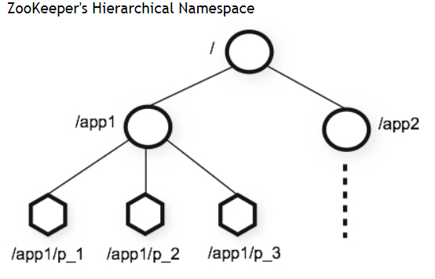
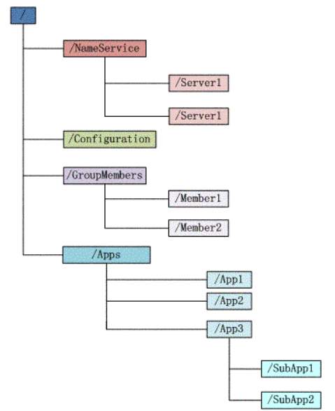
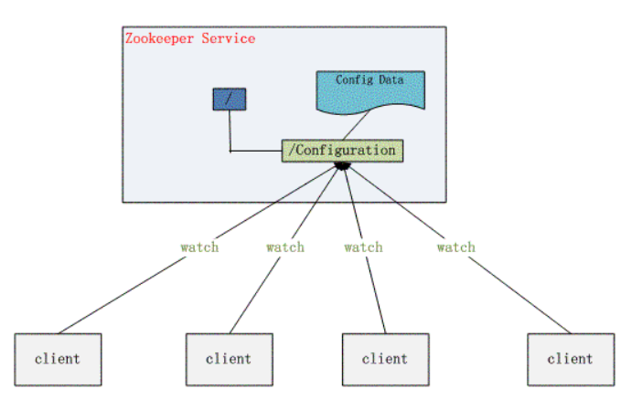
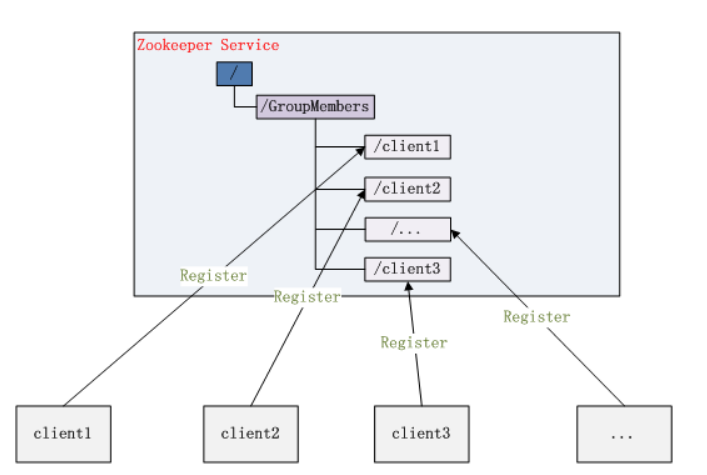

<!-- TOC -->

- [1、zookeeper是什么？](#1zookeeper是什么)
- [2、zookeeper有什么？](#2zookeeper有什么)
    - [1、文件系统](#1文件系统)
    - [2、通知机制](#2通知机制)
- [3、我们能用zookeeper做什么？](#3我们能用zookeeper做什么)
    - [1、命名服务](#1命名服务)
    - [2、配置管理](#2配置管理)
    - [3、集群管理](#3集群管理)
    - [4、分布式锁](#4分布式锁)
    - [5、队列管理](#5队列管理)
- [4、配置文件参数说明](#4配置文件参数说明)
- [参考](#参考)

<!-- /TOC -->


# 1、zookeeper是什么？

官网: https://zookeeper.apache.org/

Apache ZooKeeper is an effort to develop and maintain an open-source server which enables highly reliable distributed coordination.

Apache ZooKeeper致力于开发和维护可实现高度可靠的分布式协调的开源服务;

ZooKeeper is a centralized service for maintaining configuration information, naming, providing distributed synchronization, and providing group services. All of these kinds of services are used in some form or another by distributed applications. Each time they are implemented there is a lot of work that goes into fixing the bugs and race conditions that are inevitable. Because of the difficulty of implementing these kinds of services, applications initially usually skimp on them, which make them brittle in the presence of change and difficult to manage. Even when done correctly, different implementations of these services lead to management complexity when the applications are deployed.

ZooKeeper是用于维护配置信息，命名，提供分布式同步和提供组服务的集中式服务。所有这些类型的服务都以某种形式被分布式应用程序使用。每次实施它们时，都会进行很多工作来修复不可避免的错误和竞争条件。由于难以实现这类服务，因此应用程序通常最初会在其上跳过，从而使它们在存在更改的情况下变得脆弱并且难以管理。即使部署正确，这些服务的不同实现也会导致管理复杂。


Zookeeper 作为一个分布式的服务框架，主要用来解决分布式集群中应用系统的一致性问题，它能提供基于类似于文件系统的目录节点树方式的数据存储，但是 Zookeeper 并不是用来专门存储数据的，它的作用主要是用来维护和监控你存储的数据的状态变化。通过监控这些数据状态的变化，从而可以达到基于数据的集群管理。

Zookeeper 从设计模式角度来看，是一个基于观察者模式设计的分布式服务管理框架，它负责存储和管理大家都关心的数据，然后接受观察者的注册，一旦这些数据的状态发生变化，Zookeeper 就将负责通知已经在 Zookeeper 上注册的那些观察者做出相应的反应，从而实现集群中类似 Master/Slave 管理模式。


# 2、zookeeper有什么？

简单的说，zookeeper=文件系统+通知机制

## 1、文件系统

Zookeeper维护一个类似文件系统的数据结构：



每一个节点如 app1 被称作为 znode，和文件系统一样，我们能够自由的增加、删除node节点，唯一的不同在于znode是可以存储数据的。

有四种类型的znode：

- 1、PERSISTENT-持久化目录节点：客户端与zookeeper断开连接后，该节点依旧存在；

- 2、PERSISTENT_SEQUENTIAL-持久化顺序编号目录节点：客户端与zookeeper断开连接后，该节点依旧存在，只是Zookeeper给该节点名称进行顺序编号；

- 3、EPHEMERAL-临时目录节点：客户端与zookeeper断开连接后，该节点被删除；

- 4、EPHEMERAL_SEQUENTIAL-临时顺序编号目录节点：客户端与zookeeper断开连接后，该节点被删除，只是Zookeeper给该节点名称进行顺序编号；

## 2、通知机制

客户端注册监听它关心的目录节点，当目录节点发生变化（数据改变、被删除、子目录节点增加删除）时，zookeeper会通知客户端。


# 3、我们能用zookeeper做什么？


官方给出的使用用例列表：https://zookeeper.apache.org/doc/current/zookeeperUseCases.html





## 1、命名服务

这个似乎最简单，在zookeeper的文件系统里创建一个目录，即有唯一的path。

备注：在zookeeper中访问一个节点只能使用绝对路径，因为zookeeper内部基于一个map的数据结构存储数据的。


## 2、配置管理

程序总是需要配置的，如果程序分散部署在多台机器上，要逐个改变配置就变得困难。好吧，现在把这些配置全部放到zookeeper上去，保存在 Zookeeper 的某个目录节点中，然后所有相关应用程序对这个目录节点进行监听，一旦配置信息发生变化，每个应用程序就会收到 Zookeeper 的通知，然后从 Zookeeper 获取新的配置信息应用到系统中就好。




备注：Disconf基于zookeeper实现的分布式配置中心，另外比较流行的方式基于http long polling 长轮询的方式实现分布式配置，比如apollo；


## 3、集群管理



所谓集群管理无在乎两点：是否有机器退出和加入、选举master。

- 1、是否有机器退出和加入：所有机器约定在父目录GroupMembers下创建临时目录节点，然后监听父目录节点的子节点变化消息。一旦有机器挂掉，该机器与zookeeper的连接断开，其所创建的临时目录节点被删除，所有其他机器都收到通知：某个兄弟目录被删除，于是，所有人都知道了。新机器加入也是类似，所有机器收到通知：有新兄弟目录加入。

- 2、所有机器创建临时顺序编号目录节点，每次选取编号最小的机器作为master就好。


## 4、分布式锁

有了zookeeper的一致性文件系统，锁的问题变得容易。锁服务可以分为两类，一个是保持独占，另一个是控制时序。

- 对于第一类，我们将zookeeper上的一个znode看作是一把锁，通过createznode的方式来实现。所有客户端都去创建 /distribute_lock 节点，最终成功创建的那个客户端也即拥有了这把锁。用完删除掉自己创建的distribute_lock 节点就释放出锁。

- 对于第二类， /distribute_lock 已经预先存在，所有客户端在它下面创建临时顺序编号目录节点，和选master一样，编号最小的获得锁，用完删除，依次方便。

Zookeeper 却很容易实现这个功能，实现方式也是需要获得锁的 Server 创建一个 EPHEMERAL_SEQUENTIAL 目录节点，然后调用 getChildren方法获取当前的目录节点列表中最小的目录节点是不是就是自己创建的目录节点，如果正是自己创建的，那么它就获得了这个锁，如果不是那么它就调用 exists(String path, boolean watch) 方法并监控 Zookeeper 上目录节点列表的变化，一直到自己创建的节点是列表中最小编号的目录节点，从而获得锁，释放锁很简单，只要删除前面它自己所创建的目录节点就行了。

## 5、队列管理

两种类型的队列：

- 1、同步队列，当一个队列的成员都聚齐时，这个队列才可用，否则一直等待所有成员到达。

- 2、队列按照 FIFO 方式进行入队和出队操作。

第一类，在约定目录下创建临时目录节点，监听节点数目是否是我们要求的数目。

第二类，和分布式锁服务中的控制时序场景基本原理一致，入列有编号，出列按编号。


# 4、配置文件参数说明

默认配置项

```
# The number of milliseconds of each tick
tickTime=2000
# The number of ticks that the initial 
# synchronization phase can take
initLimit=10
# The number of ticks that can pass between 
# sending a request and getting an acknowledgement
syncLimit=5
# the directory where the snapshot is stored.
# do not use /tmp for storage, /tmp here is just 
# example sakes.
dataDir=/tmp/zookeeper
# the port at which the clients will connect
clientPort=2181
# the maximum number of client connections.
# increase this if you need to handle more clients
#maxClientCnxns=60
#
# Be sure to read the maintenance section of the 
# administrator guide before turning on autopurge.
#
# http://zookeeper.apache.org/doc/current/zookeeperAdmin.html#sc_maintenance
#
# The number of snapshots to retain in dataDir
#autopurge.snapRetainCount=3
# Purge task interval in hours
# Set to "0" to disable auto purge feature
#autopurge.purgeInterval=1

## Metrics Providers
#
# https://prometheus.io Metrics Exporter
#metricsProvider.className=org.apache.zookeeper.metrics.prometheus.PrometheusMetricsProvider
#metricsProvider.httpPort=7000
#metricsProvider.exportJvmInfo=true


```


> 单机参数

```
tickTime=2000 
dataDir=D:/devtools/zookeeper-3.2.2/build 
clientPort=2181
```


- tickTime：这个时间是作为 Zookeeper 服务器之间或客户端与服务器之间维持心跳的时间间隔，也就是每个 tickTime 时间就会发送一个心跳。

- dataDir：顾名思义就是 Zookeeper 保存数据的目录，默认情况下，Zookeeper 将写数据的日志文件也保存在这个目录里。

- clientPort：这个端口就是客户端连接 Zookeeper 服务器的端口，Zookeeper 会监听这个端口，接受客户端的访问请求。

> 集群新增参数

```
initLimit=5 
syncLimit=2 
server.1=192.168.211.1:2888:3888 
server.2=192.168.211.2:2888:3888
```

- initLimit：这个配置项是用来配置 Zookeeper 接受客户端（这里所说的客户端不是用户连接 Zookeeper 服务器的客户端，而是 Zookeeper 服务器集群中连接到 Leader 的 Follower 服务器）初始化连接时最长能忍受多少个心跳时间间隔数。当已经超过 10 个心跳的时间（也就是 tickTime）长度后 Zookeeper 服务器还没有收到客户端的返回信息，那么表明这个客户端连接失败。总的时间长度就是 5*2000=10 秒

- syncLimit：这个配置项标识 Leader 与 Follower 之间发送消息，请求和应答时间长度，最长不能超过多少个 tickTime 的时间长度，总的时间长度就是 2*2000=4 秒

- server.A=B：C：D：其中 A 是一个数字，表示这个是第几号服务器；B 是这个服务器的 ip 地址；C 表示的是这个服务器与集群中的 Leader 服务器交换信息的端口；D 表示的是万一集群中的 Leader 服务器挂了，需要一个端口来重新进行选举，选出一个新的 Leader，而这个端口就是用来执行选举时服务器相互通信的端口。如果是伪集群的配置方式，由于 B 都是一样，所以不同的 Zookeeper 实例通信端口号不能一样，所以要给它们分配不同的端口号。

除了修改 zoo.cfg 配置文件，集群模式下还要配置一个文件 myid，这个文件在 dataDir 目录下，这个文件里面就有一个数据就是 A 的值，Zookeeper 启动时会读取这个文件，拿到里面的数据与 zoo.cfg 里面的配置信息比较从而判断到底是那个 server。


# 参考

- [Zookeeper与paxos算法](https://www.iteye.com/blog/ronghao-1461798)
- [分布式服务框架 Zookeeper — 管理分布式环境中的数据](https://www.ibm.com/developerworks/cn/opensource/os-cn-zookeeper/)
