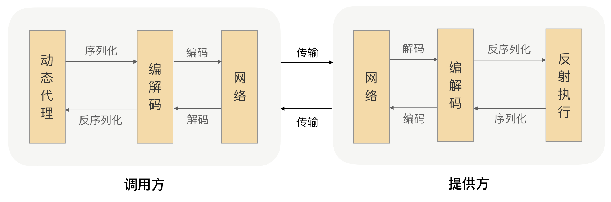
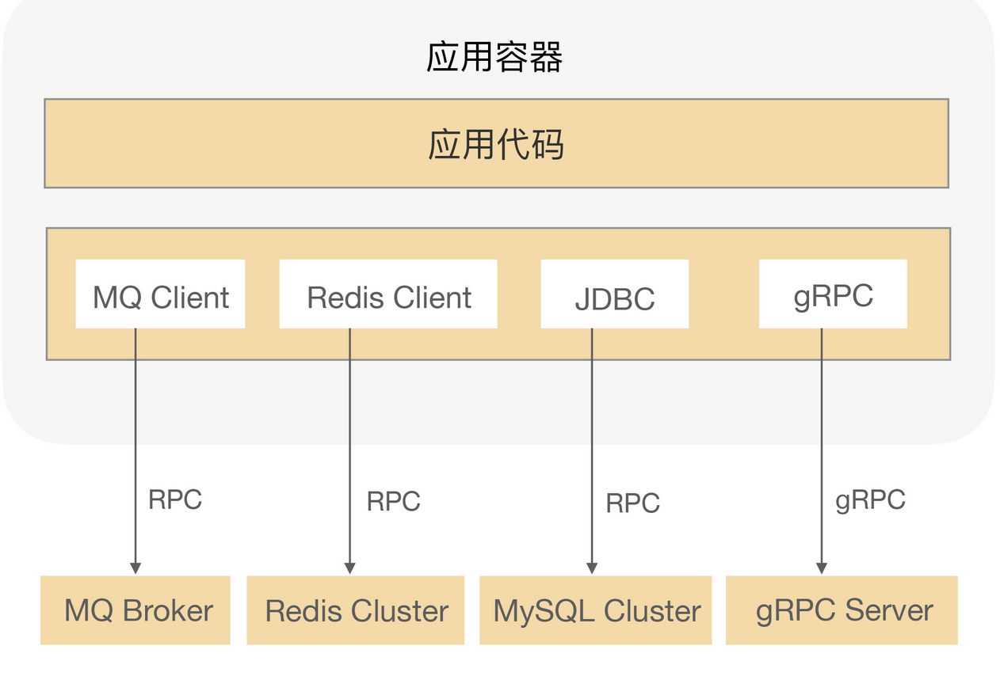

<!-- TOC -->

- [01 | 核心原理：能否画张图解释下RPC的通信流程？](#01--核心原理能否画张图解释下rpc的通信流程)
    - [1、什么是 RPC？](#1什么是-rpc)
    - [2、RPC 通信流程](#2rpc-通信流程)

<!-- /TOC -->

# 01 | 核心原理：能否画张图解释下RPC的通信流程？

## 1、什么是 RPC？

RPC 的全称是 Remote Procedure Call，即远程过程调用

RPC 的作用就是体现在这样两个方面：

- 屏蔽远程调用跟本地调用的区别，让我们感觉就是调用项目内的方法；
- 隐藏底层网络通信的复杂性，让我们更专注于业务逻辑。

## 2、RPC 通信流程

## 3、RPC 在架构中的位置

RPC 框架能够帮助我们解决系统拆分后的通信问题，并且能让我们像调用本地一样去调用远程方法。利用 RPC 我们不仅可以很方便地将应用架构从“单体”演进成“微服务化”，而且还能解决实际开发过程中的效率低下、系统耦合等问题，这样可以使得我们的系统架构整体清晰、健壮，应用可运维度增强。当然 RPC 不仅可以用来解决通信问题，它还被用在了很多其他场景，比如：发 MQ、分布式缓存、数据库等。下图是我之前开发的一个应用架构图：

