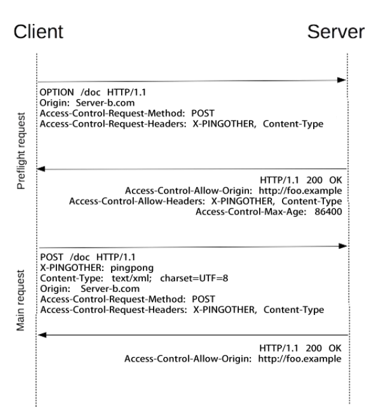
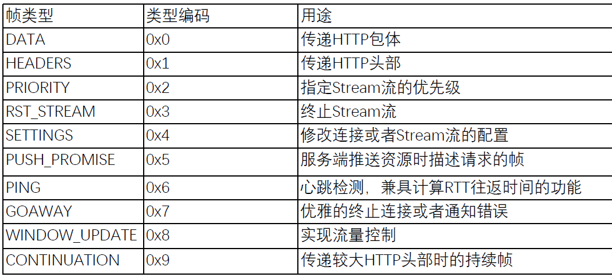
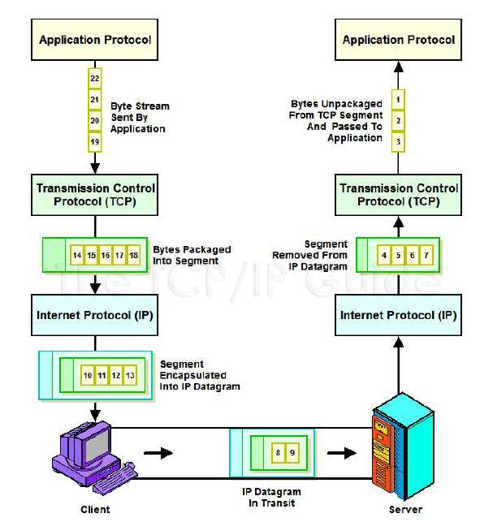
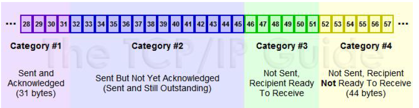

<!-- TOC -->

- [1：HTTP/1.1协议 (38讲)](#1http11协议-38讲)
    - [01 | 课程介绍](#01--课程介绍)
    - [02 | 内容综述](#02--内容综述)
    - [03 | 浏览器发起HTTP请求的典型场景](#03--浏览器发起http请求的典型场景)
    - [04 | 基于ABNF语义定义的HTTP消息格式](#04--基于abnf语义定义的http消息格式)
    - [05 | 网络为什么要分层：OSI模型与TCP/IP模型](#05--网络为什么要分层osi模型与tcpip模型)
    - [06 | HTTP解决了什么问题？](#06--http解决了什么问题)
    - [07 | 评估Web架构的七大关键属性](#07--评估web架构的七大关键属性)
    - [08 | 从五种架构风格推导出HTTP的REST架构](#08--从五种架构风格推导出http的rest架构)
    - [09 | 如何用Chrome的Network面板分析HTTP报文](#09--如何用chrome的network面板分析http报文)
    - [10 | URI的基本格式以及与URL的区别](#10--uri的基本格式以及与url的区别)
    - [11 | 为什么要对URI进行编码？](#11--为什么要对uri进行编码)
    - [12 | 详解HTTP的请求行](#12--详解http的请求行)
    - [13 | HTTP的正确响应码](#13--http的正确响应码)
        - [1、响应码分类：1xx](#1响应码分类1xx)
        - [2、响应码分类：2xx](#2响应码分类2xx)
        - [3、响应码分类：3xx](#3响应码分类3xx)
    - [14 | HTTP的错误响应码](#14--http的错误响应码)
        - [1、响应码分类：4xx](#1响应码分类4xx)
        - [2、响应码分类：5xx](#2响应码分类5xx)
    - [15 | 如何管理跨代理服务器的长短连接？](#15--如何管理跨代理服务器的长短连接)
    - [16 | HTTP消息在服务器端的路由](#16--http消息在服务器端的路由)
    - [17 | 代理服务器转发消息时的相关头部](#17--代理服务器转发消息时的相关头部)
    - [18 | 请求与响应的上下文](#18--请求与响应的上下文)
        - [1、请求的上下文: User-Agent](#1请求的上下文-user-agent)
        - [2、请求的上下文: Referer](#2请求的上下文-referer)
        - [3、请求的上下文: From](#3请求的上下文-from)
        - [4、响应的上下文：Server](#4响应的上下文server)
        - [5、响应的上下文： Allow 与 Accept-Ranges](#5响应的上下文-allow-与-accept-ranges)
    - [19 | 内容协商与资源表述](#19--内容协商与资源表述)
    - [20 | HTTP包体的传输方式（1）：定长包体](#20--http包体的传输方式1定长包体)
    - [21 | HTTP包体的传输方式（2）：不定长包体](#21--http包体的传输方式2不定长包体)
    - [22 | HTML form表单提交时的协议格式](#22--html-form表单提交时的协议格式)
    - [23 | 断点续传与多线程下载是如何做到的？](#23--断点续传与多线程下载是如何做到的)
    - [24 | Cookie的格式与约束](#24--cookie的格式与约束)
    - [25 | Session及第三方Cookie的工作原理](#25--session及第三方cookie的工作原理)
    - [26 | 浏览器为什么要有同源策略？](#26--浏览器为什么要有同源策略)
    - [27 | 如何“合法”地跨域访问？](#27--如何合法地跨域访问)
    - [28 | 条件请求的作用](#28--条件请求的作用)
    - [29 | 缓存的工作原理](#29--缓存的工作原理)
    - [33 | 多种重定向跳转方式的差异](#33--多种重定向跳转方式的差异)
    - [34 | 如何通过HTTP隧道访问被限制的网络](#34--如何通过http隧道访问被限制的网络)
    - [35 | 网络爬虫的工作原理与应对方式](#35--网络爬虫的工作原理与应对方式)
    - [38 | 如何通过DNS协议解析域名？](#38--如何通过dns协议解析域名)
- [2：WebSocket协议 (10讲)](#2websocket协议-10讲)
    - [41 | Websocket解决什么问题](#41--websocket解决什么问题)
- [3：HTTP/2协议 (21讲)](#3http2协议-21讲)
    - [49 | HTTP/1.1发展中遇到的问题](#49--http11发展中遇到的问题)
    - [50 | HTTP/2特性概述](#50--http2特性概述)
    - [51 | 如何使用Wireshark解密TLS/SSL报文？](#51--如何使用wireshark解密tlsssl报文)
    - [52 | h2c：在TCP上从HTTP/1升级到HTTP/2](#52--h2c在tcp上从http1升级到http2)
    - [53 | h2：在TLS上从HTTP/1升级到HTTP/2](#53--h2在tls上从http1升级到http2)
    - [54 | 帧、消息、流的关系](#54--帧消息流的关系)
    - [55 | 帧格式：Stream流ID的作用](#55--帧格式stream流id的作用)
    - [56 | 帧格式：帧类型及设置帧的子类型](#56--帧格式帧类型及设置帧的子类型)
- [4：TLS/SSL协议 (14讲)](#4tlsssl协议-14讲)
    - [70 | TLS协议的工作原理](#70--tls协议的工作原理)
        - [1、对称加密的工作原理](#1对称加密的工作原理)
- [5：TCP协议 (25讲)](#5tcp协议-25讲)
    - [84 | TCP历史及其设计哲学](#84--tcp历史及其设计哲学)
    - [85 | TCP解决了哪些问题](#85--tcp解决了哪些问题)
    - [86 | TCP报文格式](#86--tcp报文格式)
    - [87 | 如何使用tcpdump分析网络报文](#87--如何使用tcpdump分析网络报文)
    - [88 | 三次握手建立连接](#88--三次握手建立连接)
    - [89 | 三次握手过程中的状态变迁](#89--三次握手过程中的状态变迁)
    - [90 | 三次握手中的性能优化与安全问题](#90--三次握手中的性能优化与安全问题)
    - [91 | 数据传输与MSS分段](#91--数据传输与mss分段)
    - [92 | 重传与确认](#92--重传与确认)
    - [93 | RTO重传定时器的计算](#93--rto重传定时器的计算)
    - [94 | 滑动窗口：发送窗口与接收窗口](#94--滑动窗口发送窗口与接收窗口)
    - [95 | 窗口的滑动与流量控制](#95--窗口的滑动与流量控制)
    - [96 | 操作系统缓冲区与滑动窗口的关系](#96--操作系统缓冲区与滑动窗口的关系)
    - [97 | 如何减少小报文提高网络效率](#97--如何减少小报文提高网络效率)
    - [98 | 拥塞控制（1）：慢启动](#98--拥塞控制1慢启动)
    - [99 | 拥塞控制（2）：拥塞避免](#99--拥塞控制2拥塞避免)
    - [100 | 拥塞控制（3）：快速重传与快速恢复](#100--拥塞控制3快速重传与快速恢复)
    - [101 | SACK与选择性重传算法](#101--sack与选择性重传算法)
    - [102 | 从丢包到测量驱动的拥塞控制算法](#102--从丢包到测量驱动的拥塞控制算法)
    - [103 | Google BBR拥塞控制算法原理](#103--google-bbr拥塞控制算法原理)
    - [104 | 关闭连接过程优化](#104--关闭连接过程优化)
    - [105 | 优化关闭连接时的TIME-WAIT状态](#105--优化关闭连接时的time-wait状态)
    - [106 | keepalive 、校验和及带外数据](#106--keepalive-校验和及带外数据)
    - [107 | 面向字节流的TCP连接如何多路复用](#107--面向字节流的tcp连接如何多路复用)
    - [108 | 四层负载均衡可以做什么](#108--四层负载均衡可以做什么)
- [6：IP协议 (13讲)](#6ip协议-13讲)
    - [109 | 网络层与链路层的功能](#109--网络层与链路层的功能)
    - [110 | IPv4分类地址](#110--ipv4分类地址)
    - [111 | CIDR无分类地址](#111--cidr无分类地址)
    - [112 | IP地址与链路地址的转换：ARP与RARP协议](#112--ip地址与链路地址的转换arp与rarp协议)
    - [113 | NAT地址转换与LVS负载均衡](#113--nat地址转换与lvs负载均衡)
    - [114 | IP选路协议](#114--ip选路协议)
    - [115 | MTU与IP报文分片](#115--mtu与ip报文分片)
    - [116 | IP协议的助手：ICMP协议](#116--ip协议的助手icmp协议)
    - [117 | 多播与IGMP协议](#117--多播与igmp协议)
    - [118 | 支持万物互联的IPv6地址](#118--支持万物互联的ipv6地址)
    - [119 | IPv6报文及分片](#119--ipv6报文及分片)
    - [120 | 从wireshark报文统计中找规律](#120--从wireshark报文统计中找规律)
    - [121 | 结课测试&结束语](#121--结课测试结束语)

<!-- /TOC -->


# 1：HTTP/1.1协议 (38讲)

## 01 | 课程介绍

以 TCP/IP 协议栈为依托，由上至下、从应用层至基础设施介绍协议
- 应用层
    - 第 1 部分：HTTP/1.1
    - 第 2 部分：Websocket
    - 第 3 部分：HTTP/2.0
- 应用层的安全基础设施
    - 第 4 部分：TLS/SSL
- 传输层
    - 第 5 部分：TCP
- 网络层及数据链路层
    - 第 6 部分：IP 层和以太网


涉及主要工具
- Chrome 浏览器 Network 面板（Firefox 类似）
- Wireshark
- tcpdump

## 02 | 内容综述


- 1、HTTP/1自顶而下、由业务到逻辑

```
• HTTP/1 协议为什么会如此设计？(网络分层原理、REST 架构)
• 协议的通用规则(协议格式、URI、方法与响应码概览)
• 连接与消息的路由
• 内容协商与传输
• cookie 的设计与问题
• 缓存的控制
```

2、HTTP/1 的协议升级

```
• 支持服务器推送消息的 WebSocket 协议(建立会话\消息传输\心跳\关闭会话)
• 全面优化后的 HTTP/2.0 协议
• HTTP/2.0 必须开启的 TLS/SSL 协议
```
3、TCP 与 IP 协议

```
• 传输层的 TCP 协议(建立连接\传输数据\拥塞控制\关闭连接)
• 网络层的 IP 协议(IP 报文与路由\网络层其他常用协议：ICMP、ARP、RARP\IPv6 的区别)
```


## 03 | 浏览器发起HTTP请求的典型场景


Hypertext Transfer Protocol (HTTP) 协议

一种`无状态的`、应用层的、以`请求/应答方式`运行的协议，它使用可扩展的语义和自描述消息格式，与基于网络的超文本信息系统灵活的互动


## 04 | 基于ABNF语义定义的HTTP消息格式


## 05 | 网络为什么要分层：OSI模型与TCP/IP模型

OSI（Open System Interconnection Reference Model）概念模型
- 应用层
- 表示层
- 会话层
- 传输层
- 网络层
- 数据链路层
- 物理层


## 06 | HTTP解决了什么问题？

- 低门槛
- 可扩展性：巨大的用户群体，超长的寿命
- 分布式系统下的 Hypermedia：大粒度数据的网络传输
- Internet 规模
    - 无法控制的 scalability
        - 不可预测的负载、非法格式的数据、恶意消息
        - 客户端不能保持所有服务器信息，服务器不能保持多个请求间的状态信息
    - 独立的组件部署：新老组件并存
- 向前兼容：自 1993 年起 HTTP0.9\1.0（1996）已经被广泛使用

## 07 | 评估Web架构的七大关键属性

- 1.性能 Performance：影响高可用的关键因素
- 2.可伸缩性 Scalability：支持部署可以互相交互的大量组件
- 3.简单性 Simplicity：易理解、易实现、易验证
- 4.可见性 Visiable：对两个组件间的交互进行监视或者仲裁的能力。如缓存、分层设计等
- 5.可移植性 Portability：在不同的环境下运行的能力
- 6.可靠性 Reliability：出现部分故障时，对整体影响的程度
- 7.可修改性 Modifiability：对系统作出修改的难易程度，由可进化性、可定制性、可扩展性、可配置性、可重用性构成


> 架构属性：性能

- 网络性能 Network Performance
    - Throughput 吞吐量：小于等于带宽 bandwidth
    - Overhead 开销：首次开销，每次开销
- 用户感知到的性能 User-perceived Performance
    - Latency 延迟：发起请求到接收到响应的时间
    - Completion 完成时间：完成一个应用动作所花费的时间
- 网络效率 Network Efficiency
    - 重用缓存、减少交互次数、数据传输距离更近、COD

> 架构属性：可修改性

- 可进化性 Evolvability：一个组件独立升级而不影响其他组件
- 可扩展性 Extensibility ：向系统添加功能，而不会影响到系统的其他部分
- 可定制性 Customizability ：临时性、定制性地更改某一要素来提供服务，
不对常规客户产生影响
- 可配置性 Configurability ：应用部署后可通过修改配置提供新的功能
- 可重用性 Reusabilit ：组件可以不做修改在其他应用在使用


## 08 | 从五种架构风格推导出HTTP的REST架构

- 数据流风格 Data-flow Styles(优点：简单性、可进化性、可扩展性、可配置性、可重用性)
    - 管道与过滤器 Pipe And Filter，PF.每个 Filter 都有输入端和输出端，只能从输入端读取数据，处理后再从输出端产生数据
    - 统一接口的管道与过滤器 Uniform Pipe And Filter，UPF.在 PF 上增加了统一接口的约束，所有 Filter 过滤器必须具备同样的接口


- 复制风格 Replication Styles(优点：用户可察觉的性能、可伸缩性，网络效率、可靠性也可以提到提升)

- 分层风格 Hierarchical Styles(优点：简单性、可进化性、可伸缩性)

- 移动代码风格 Mobile Code Styles(优点：可移植性、可扩展性、网络效率)

- 点对点风格 Peer-to-Peer Styles(优点：可进化性、可重用性、可扩展性、可配置性)


## 09 | 如何用Chrome的Network面板分析HTTP报文

todo wireshark


## 10 | URI的基本格式以及与URL的区别

- URL： RFC1738 （1994.12），Uniform Resource Locator，表示资源的位置，期望提供查找资源的方法

- URN：RFC2141 （1997.5），Uniform Resource Name，期望为资源提供持久的、位置无关的标识方式，并允许简单地将多个命名空间映射到单个URN命名空间.例如磁力链接 magnet:?xt=urn:sha1:YNCKHTQC5C

- URI：RFC1630 （1994.6）、RFC3986 （2005.1，取代 RFC2396 和RFC2732 ），Uniform Resource Identifier，用以区分资源，是 URL 和 URN的超集，用以取代 URL 和 URN 概念

`Uniform Resource Identifier 统一资源标识符`

URI 的组成:schema, user information, host, port, path, query, fragment


例如：https://tools.ietf.org/html/rfc7231?test=1#page-7

- scheme：http, https, ftp,mailto,rtsp,file,telnet


## 11 | 为什么要对URI进行编码？

传递数据中，如果存在用作分隔符的保留字符怎么办？对可能产生歧义性的数据编码：

- 不在 ASCII 码范围内的字符
- ASCII 码中不可显示的字符
- URI 中规定的保留字符
- 不安全字符（传输环节中可能会被不正确处理），如空格、引号、尖括号等


## 12 | 详解HTTP的请求行

request-line = method SP request-target SP HTTP-version CRLF

- GET：主要的获取信息方法，大量的性能优化都针对该方法，幂等方法
- HEAD：类似 GET 方法，但服务器不发送 BODY，用以获取 HEAD 元数据，幂等方法
- POST：常用于提交 HTML FORM 表单、新增资源等
- PUT：更新资源，带条件时是幂等方法
- DELETE：删除资源，幂等方法
- CONNECT：建立 tunnel 隧道
- OPTIONS：显示服务器对访问资源支持的方法，幂等方法
- TRACE：回显服务器收到的请求，用于定位问题。有安全风险

```

• PROPFIND：从 Web 资源中检索以 XML 格式存储的属性。它也被重载，以允
许一个检索远程系统的集合结构（也叫目录层次结构）
• PROPPATCH：在单个原子性动作中更改和删除资源的多个属性
• MKCOL：创建集合或者目录
• COPY：将资源从一个 URI 复制到另一个 URI
• MOVE：将资源从一个 URI 移动到另一个 URI
• LOCK：锁定一个资源。WebDAV 支持共享锁和互斥锁。
• UNLOCK：解除资源的锁定
```


## 13 | HTTP的正确响应码

status-line = HTTP-version SP status-code SP reason-phrase CRLF

### 1、响应码分类：1xx

请求已接收到，需要进一步处理才能完成，HTTP1.0 不支持

- 100 Continue：上传大文件前使用。由客户端发起请求中携带 Expect: 100-continue 头部触发
- 101 Switch Protocols：协议升级使用。由客户端发起请求中携带 Upgrade: 头部触发，如升级 websocket 或者 http/2.0
- 102 Processing：WebDAV 请求可能包含许多涉及文件操作的子请求，需要很长时间才能完成请求。该代码表示 服务器已经收到并正在处理请求，但无响应可用。这样可以防止客户端超时，并假设请求丢失

### 2、响应码分类：2xx

成功处理请求
- 200 OK: 成功返回响应。
- 201 Created: 有新资源在服务器端被成功创建。
- 202 Accepted: 服务器接收并开始处理请求，但请求未处理完成。这样一个模糊的概念是有意如此设计，可以覆盖更多的场景。例如异步、需要长时间处理的任务。
- 203 Non-Authoritative Information：当代理服务器修改了 origin server 的原始响应包体时（例如更换了HTML中的元素值），代理服务器可以通过修改200为203的方式告知客户端这一事实，方便客户端为这一行为作出相应的处理。203响应可以被缓存。

- 204 No Content：成功执行了请求且不携带响应包体，并暗示客户端无需更新当前的页面视图。
- 205 Reset Content：成功执行了请求且不携带响应包体，同时指明客户端需要更新当前页面视图。
- 206 Partial Content：使用 range 协议时返回部分响应内容时的响应码

- 207 Multi-Status：RFC4918 ，在 WEBDAV 协议中以 XML 返回多个资源的状态。

- 208 Already Reported：RFC5842 ，为避免相同集合下资源在207响应码下重复上报，使用 208 可以使用父集合的响应码。

### 3、响应码分类：3xx

3xx：重定向使用 Location 指向的资源或者缓存中的资源。在 RFC2068中规定客户端重定向次数不应超过 5 次，以防止死循环。

- 300 Multiple Choices：资源有多种表述，通过 300 返回给客户端后由其自行选择访问哪一种表述。由于缺乏明确的细节，300 很少使用。
- 301 Moved Permanently：资源永久性的重定向到另一个 URI 中。
- 302 Found：资源临时的重定向到另一个 URI 中。

- 303 See Other：重定向到其他资源，常用于 POST/PUT 等方法的响应中。
- 304 Not Modified：当客户端拥有可能过期的缓存时，会携带缓存的标识etag、时间等信息询问服务器缓存是否仍可复用，而304是告诉客户端可以复用缓存。
- 307 Temporary Redirect：类似302，但明确重定向后请求方法必须与原
请求方法相同，不得改变。
- 308 Permanent Redirect：类似301，但明确重定向后请求方法必须与原请
求方法相同，不得改变。


## 14 | HTTP的错误响应码


### 1、响应码分类：4xx

4xx：客户端出现错误

- 400 Bad Request：服务器认为客户端出现了错误，但不能明确判断为以下哪错误时使用此错误码。例如HTTP请求格式错误。

- 401 Unauthorized：用户认证信息缺失或者不正确，导致服务器无法处理请求。

- 407 Proxy Authentication Required：对需要经由代理的请求，认证信息未通过代理服务器的验证

- 403 Forbidden：服务器理解请求的含义，但没有权限执行此请求

- 404 Not Found：服务器没有找到对应的资源

- 410 Gone：服务器没有找到对应的资源，且明确的知道该位置永久性找不到该资源


- 405 Method Not Allowed：服务器不支持请求行中的 method 方法

- 406 Not Acceptable：对客户端指定的资源表述不存在（例如对语言或者编码有要求），服务器返回表述列表供客户端选择。

- 408 Request Timeout：服务器接收请求超时

- 409 Conflict：资源冲突，例如上传文件时目标位置已经存在版本更新的资源

- 411 Length Required：如果请求含有包体且未携带 Content-Length 头部，且不属于chunk类请求时，返回 411

- 412 Precondition Failed：复用缓存时传递的 If-Unmodified-Since 或 If-None-Match 头部不被满足

- 413 Payload Too Large/Request Entity Too Large：请求的包体超出服务器能处理的最大长度

- 414 URI Too Long：请求的 URI 超出服务器能接受的最大长度

- 415 Unsupported Media Type：上传的文件类型不被服务器支持

- 416 Range Not Satisfiable：无法提供 Range 请求中指定的那段包体

- 417 Expectation Failed：对于 Expect 请求头部期待的情况无法满足时的
响应码

- 421 Misdirected Request：服务器认为这个请求不该发给它，因为它没有能力
处理。

- 426 Upgrade Required：服务器拒绝基于当前 HTTP 协议提供服务，通过Upgrade 头部告知客户端必须升级协议才能继续处理。

- 428 Precondition Required：用户请求中缺失了条件类头部，例如 If-Match

- 429 Too Many Requests：客户端发送请求的速率过快

- 431 Request Header Fields Too Large：请求的 HEADER 头部大小超过限制

- 451 Unavailable For Legal Reasons：RFC7725 ，由于法律原因资源不可访问


### 2、响应码分类：5xx

5xx：服务器端出现错误
- 500 Internal Server Error：服务器内部错误，且不属于以下错误类型
- 501 Not Implemented：服务器不支持实现请求所需要的功能
- 502 Bad Gateway：代理服务器无法获取到合法响应
- 503 Service Unavailable：服务器资源尚未准备好处理当前请求

- 504 Gateway Timeout：代理服务器无法及时的从上游获得响应
- 505 HTTP Version Not Supported：请求使用的 HTTP 协议版本不支持
- 507 Insufficient Storage：服务器没有足够的空间处理请求
- 508 Loop Detected：访问资源时检测到循环
- 511 Network Authentication Required：代理服务器发现客户端需要进行身份验证才能获得网络访问权限


## 15 | 如何管理跨代理服务器的长短连接？


Connection 头部

- Keep-Alive：长连接
    - 客户端请求长连接Connection: Keep-Alive
    - 服务器表示支持长连接Connection: Keep-Alive
    - 客户端复用连接
    - HTTP/1.1 默认支持长连接。Connection: Keep-Alive 无意义
- Close：短连接
- 对代理服务器的要求。不转发 Connection 列出头部，该头部仅与当前连接相关


> Connection 仅针对当前连接有效


> 代理服务器对长连接的支持

问题：各方间错误使用了长连接
- 客户端发起长连接
- 代理服务器陈旧，不能正确的处理请求的 Connection 头部，将客户端请求中的 Connection: Keep-Alive 原样转发给上游服务器
- 上游服务器正确的处理了 Connection 头部，在发送响应后没有关闭连接，而试图保持、复用与不认长连接的代理服务器的连接
- 代理服务器收到响应中 Connection: Keep-Alive 后不认，转发给客户端，同时等待服务器关闭短连接
- 客户端收到了 Connection: Keep-Alive，认为可以复用长连接，继续在该连接上发起请求
- 代理服务器出错，因为短连接上不能发起两次请求

Proxy-Connection
- 陈旧的代理服务器不识别该头部：退化为短连接
- 新版本的代理服务器理解该头部
    - 与客户端建立长连接
    - 与服务器使用 Connection 替代 Proxy-Connect 头部


## 16 | HTTP消息在服务器端的路由

- 1.建立 TCP 连接(确定服务器的 IP 地址)
- 2.接收请求
- 3.寻找虚拟主机(匹配 Host 头部与域名)
- 4.寻找 URI 的处理代码(匹配 URI)
- 5.执行处理请求的代码(访问资源)
- 6.生成 HTTP 响应(各中间件基于 PF 架构串行修改响应)
- 7.发送 HTTP 响应
- 8.记录访问日志

客户端与源服务器间存在多个代理

> 消息的转发

- Max-Forwards 头部
    - 限制 Proxy 代理服务器的最大转发次数，仅对 TRACE/OPTIONS 方法有效
    - Max-Forwards = 1*DIGIT
- Via 头部:指明经过的代理服务器名称及版本

- Cache-Control:no-transform 禁止代理服务器修改响应包体

> 问题：如何传递 IP 地址？

- 1、TCP 连接四元组（src ip,src port, dst ip,dst port）
- 2、HTTP 头部 X-Real-IP 用于传递用户 IP
- 3、HTTP 头部 X-Forwarded-For 用于传递 IP
- 4、网络中存在许多反向代理


## 17 | 代理服务器转发消息时的相关头部


## 18 | 请求与响应的上下文

### 1、请求的上下文: User-Agent

指明客户端的类型信息，服务器可以据此对资源的表述做抉择。

```
例如：
    • User-Agent: Mozilla/5.0 (Windows NT 10.0; WOW64; rv:66.0)
Gecko/20100101 Firefox/66.0
    • User-Agent: Mozilla/5.0 (Windows NT 10.0; Win64; x64) AppleWebKit/537.36
(KHTML, like Gecko) Chrome/73.0.3683.86 Safari/537.36
```

### 2、请求的上下文: Referer

浏览器对来自某一页面的请求自动添加的头部

Referer 不会被添加的场景
- 来源页面采用的协议为表示本地文件的 "file" 或者 "data" URI
- 当前请求页面采用的是 http 协议，而来源页面采用的是 https 协议

服务器端常用于统计分析、缓存优化、防盗链等功能

### 3、请求的上下文: From

主要用于网络爬虫，告诉服务器如何通过邮件联系到爬虫的负责人


### 4、响应的上下文：Server

指明服务器上所用软件的信息，用于帮助客户端定位问题或者统计数据

```
• 例如：
    • Server: nginx
    • Server: openresty/1.13.6.2
```

### 5、响应的上下文： Allow 与 Accept-Ranges


Allow：告诉客户端，服务器上该 URI 对应的资源允许哪些方法的执行。例如：Allow: GET, HEAD, PUT

Accept-Ranges：告诉客户端服务器上该资源是否允许 range 请求。例如：Accept-Ranges: bytes、Accept-Ranges: none


## 19 | 内容协商与资源表述

内容协商：每个 URI 指向的资源可以是任何事物，可以有多种不同的表述，例如一份文档可以有不同语言的翻译、不同的媒体格式、可以针对不同的浏览器提供不同的压缩编码等。


内容协商的两种方式
- Proactive 主动式内容协商：指由客户端先在请求头部中提出需要的表述形式，而服务器根据这些请求头部提供特定的 representation 表述

- Reactive 响应式内容协商：指服务器返回 300 Multiple Choices 或者 406 Not Acceptable，由客户端选择一种表述 URI 使用


常见的协商要素

- 质量因子 q：内容的质量、可接受类型的优先级

- 媒体资源的 MIME 类型及质量因子。
    - Accept: text/html,application/xhtml+xml,application/xml;q=0.9,*/*;q=0.8
    - Accept:text/html,application/xhtml+xml,application/xml;q=0.9,image/webp,image/apng,*/*;q=0.8,application/signed-exchange;v=b3

- 字符编码：由于 UTF-8 格式广为使用， Accept-Charset 已被废弃。Accept-Charset: ISO-8859-1,utf-8;q=0.7,*;q=0.7

- 内容编码：主要指压缩算法。Accept-Encoding: gzip, deflate, br

- 表述语言
    - Accept-Language: zh-CN,zh;q=0.9,en-US;q=0.8,en;q=0.7
    - Accept-Language: zh-CN,zh;q=0.8,zh-TW;q=0.7,zh-HK;q=0.5,en-US;q=0.3,en;q=0.2


> 资源表述的元数据头部

- 媒体类型、编码content-type: text/html; charset=utf-8
- 内容编码content-encoding: gzip
- 语言Content-Language: de-DE, en-CA


## 20 | HTTP包体的传输方式（1）：定长包体

> HTTP 包体：承载的消息内容

- 请求或者响应都可以携带包体.二进制字节流

- 以下消息不能含有包体
    - HEAD 方法请求对应的响应
    - 1xx、204、304 对应的响应
    - CONNECT 方法对应的 2xx 响应

发送 HTTP 消息时已能够确定包体的全部长度

- 使用 Content-Length 头部明确指明包体长度.(用 10 进制（不是 16 进制）表示包体中的字节个数，且必须与实际传输的包体长度一致)
- 优点：接收端处理更简单

## 21 | HTTP包体的传输方式（2）：不定长包体

发送 HTTP 消息时不能确定包体的全部长度

- 使用 Transfer-Encoding 头部指明使用 Chunk 传输方式.含 Transfer-Encoding 头部后 Content-Length 头部应被忽略

- 优点
    - 基于长连接持续推送动态内容
    - 压缩体积较大的包体时，不必完全压缩完（计算出头部）再发送，可以边发送边压缩
    - 传递必须在包体传输完才能计算出的 Trailer 头部


> Content-Disposition 头部

- inline：指定包体是以 inline 内联的方式，作为页面的一部分展示

- attachment：指定浏览器将包体以附件的方式下载
    - 例如： Content-Disposition: attachment
    - 例如： Content-Disposition: attachment; filename=“filename.jpg”

- 在 multipart/form-data 类型应答中，可以用于子消息体部分.如 Content-Disposition: form-data; name="fieldName";filename="filename.jpg"


## 22 | HTML form表单提交时的协议格式

HTML：HyperText Markup Language，结构化的标记语言（非编程语言）.浏览器可以将 HTML 文件渲染为可视化网页


## 23 | 断点续传与多线程下载是如何做到的？

> 多线程、断点续传、随机点播等场景的步骤

- 1.客户端明确任务：从哪开始下载
    - 本地是否已有部分文件
    - 文件已下载部分在服务器端发生改变？
    - 使用几个线程并发下载
- 2.下载文件的指定部分内容
- 3.下载完毕后拼装成统一的文件

> HTTP Range规范

1、允许服务器基于客户端的请求只发送响应包体的一部分给到客户端，而客户端自动将多个片断的包体组合成完整的体积更大的包体
- 支持断点续传
- 支持多线程下载
- 支持视频播放器实时拖动

2、服务器通过 Accept-Range 头部表示是否支持 Range 请求

Accept-Ranges = acceptable-ranges。例如：Accept-Ranges: bytes：支持、Accept-Ranges: none：不支持

3、Range 请求范围的单位

基于字节，设包体总长度为 10000

- 第 1 个 500 字节：bytes=0-499
- 第 2 个 500 字节
    - bytes=500-999
    - bytes=500-600,601-999
    - bytes=500-700,601-999
- 最后 1 个 500 字节：
    - bytes=-500
    - bytes=9500-
- 仅要第 1 个和最后 1 个字节：bytes=0-0,-1

通过Range头部传递请求范围，如：Range: bytes=0-499


4、Range 条件请求

如果客户端已经得到了 Range 响应的一部分，并想在这部分响应未过期的情况下，获取其他部分的响应。常与 If-Unmodified-Since 或者 If-Match 头部共同使用

If-Range = entity-tag / HTTP-date。可以使用 Etag 或者 Last-Modified


> 服务器响应

- 206 Partial Content:(Content-Range 头部：显示当前片断包体在完整包体中的位置)

- 416 Range Not Satisfiable请求范围不满足实际资源的大小，其中 Content-Range 中的 completelength.显示完整响应的长度，例如：Content-Range: bytes */1234

- 200 OK 服务器不支持 Range 请求时，则以 200 返回完整的响应包体


> 多重范围与 multipart

- 请求：Range: bytes=0-50, 100-150
- 响应：Content-Type：multipart/byteranges; boundary=…


## 24 | Cookie的格式与约束

Cookie 是什么？保存在客户端、由浏览器维护、表示应用状态的 HTTP 头部

- 存放在内存或者磁盘中
- 服务器端生成 Cookie 在响应中通过Set-Cookie 头部告知客户端（允许多
个 Set-Cookie 头部传递多个值）
- 客户端得到 Cookie 后，后续请求都会自动将 Cookie 头部携带至请求中


Cookie 头部中可以存放多个 name/value 名值对

Set-Cookie 头部一次只能传递 1 个 name/value 名值对，响应中可以含多个头部

cookie-av = expires-av / max-age-av / domain-av / path-av / secure-av / httponly-av / extension-av

- expires-av = "Expires=" sane-cookie-date  cookie 到日期 sane-cookie-date 后失效
- max-age-av = "Max-Age=" non-zero-digit *DIGIT。cookie 经过 *DIGIT 秒后失效。max-age 优先级高于 expires
- domain-av = "Domain=" domain-value 指定 cookie 可用于哪些域名，默认可以访问当前域名
- path-av = "Path=" path-value 指定 Path 路径下才能使用 cookie
- secure-av = "Secure“ 只有使用 TLS/SSL 协议（https）时才能使用 cookie
- httponly-av = "HttpOnly“  不能使用 JavaScript（Document.cookie 、XMLHttpRequest 、Request APIs）访问到 cookie


> Cookie 使用的限制

- RFC 规范对浏览器使用 Cookie 的要求
    - 每条 Cookie 的长度（包括 name、value 以及描述的属性等总长度）至于要达到 4KB
    - 每个域名下至少支持 50 个 Cookie
    - 至少要支持 3000 个 Cookie
- 代理服务器传递 Cookie 时会有限制

> Cookie 在协议设计上的问题

- Cookie 会被附加在每个 HTTP 请求中，所以无形中增加了流量
- 由于在 HTTP 请求中的 Cookie 是明文传递的，所以安全性成问题（除非用 HTTPS）
- Cookie 的大小不应超过 4KB，故对于复杂的存储需求来说是不够用的


无状态的 REST 架构 VS 状态管理

- 应用状态与资源状态
    - 应用状态：应由客户端管理，不应由服务器管理。如浏览器目前在哪一页，REST 架构要求服务器不应保存应用状态
    - 资源状态：应由服务器管理，不应由客户端管理。如数据库中存放的数据状态，例如用户的登陆信息

- HTTP 请求的状态
    - 有状态的请求：服务器端保存请求的相关信息，每个请求可以使用以前保留的请求相关信息
        - 服务器 session 机制使服务器保存请求的相关信息
        - cookie 使请求可以携带查询信息，与 session 配合完成有状态的请求
    - 无状态的请求：服务器能够处理的所有信息都来自当前请求所携带的信息
    - 服务器不会保存 session 信息
    - 请求可以通过 cookie 携带


## 25 | Session及第三方Cookie的工作原理

第三方 Cookie：浏览器允许对于不安全域下的资源（如广告图片）响应中的 Set-Cookie保存，并在后续访问该域时自动使用 Cookie（用户踪迹信息的搜集）


## 26 | 浏览器为什么要有同源策略？

> 为什么需要同源策略？

同一个浏览器发出的请求，未必都是用户自愿发出的请求。只有 page.html 是用户发出的，其他请求是浏览器自动发出的

站点 domain-b.com 收到的来自同一浏览器的请求，可能来自于站点domain-a.com


没有同源策略下的 Cookie只能保证用户请求来自于同一浏览器，不能确保是用户自愿发出的

- 访问站点 A 后，站点 A 通过 Set-Cookie：Cookie 头部将 Cookie 返回给浏览器
- 浏览器会保存 Cookie，留待下次访问
- 站点 B 的脚本访问站点 A 时，浏览器会自动将 Cookie: cookie 添加到请求的头部访问站点 A ，提升用户体验
- 站点 A 的鉴权策略：取出 Cookie 值与数据库或者缓存中的 token 验证，通过后将数据赋予请求继续处理。


站点 B 的脚本就可以随意修改站点 A 的 DOM 结构

`浏览器的同源策略:限制了从同一个源加载的文档或脚本如何与来自另一个源的资源进行交互`


- 何谓同源？协议、主机、端口必须完全相同
- 例如：http://store.company.com/dir/page.html 检测以下是否同源

```
URL 结果原因
http://store.company.com/dir2/other.html 成功只有路径不同
http://store.company.com/dir/inner/another.html 成功只有路径不同
https://store.company.com/secure.html 失败不同协议 ( https 和 http )
http://store.company.com:81/dir/etc.html 失败不同端口 ( http:// 80是默认的)
http://news.company.com/dir/other.html 失败不同域名 ( news 和 store )
```


## 27 | 如何“合法”地跨域访问？


CORS：Cross-Origin Resource Sharing

- 浏览器同源策略下的跨域访问解决方案：
- 如果站点 A 允许站点 B 的脚本访问其资源，必须在 HTTP 响应中显式的告知浏览器：站点 B 是被允许的
    - 访问站点 A 的请求，浏览器应告知该请求来自站点 B
    - 站点 A 的响应中，应明确哪些跨域请求是被允许的

- 策略 1：何为简单请求？
    - GET/HEAD/POST 方法之一
    - 仅能使用 CORS 安全的头部：Accept、Accept-Language、Content-Language、Content-Type
    - Content-Type 值只能是： text/plain、multipart/form-data、application/x-www-form-urlencoded三者其中之一

- 策略 2：简单请求以外的其他请求
    - 访问资源前，需要先发起 prefilght 预检请求（方法为 OPTIONS）询问何种请求是被允许的


> 简单请求的跨域访问

- 请求中携带 Origin 头部告知来自哪个域
- 响应中携带 Access-Control-Allow-Origin 头部表示允许哪些域
- 浏览器放行


> 预检请求
- 预检请求头部
    - Access-Control-Request-Method
    - Access-Control-Request-Headers
- 预检请求响应
    - Access-Control-Allow-Methods
    - Access-Control-Allow-Headers
    - Access-Control-Max-Age



> 请求头部

- Origin（RFC6454）：一个页面的资源可能来自于多个域名，在 AJAX 等子请求中标明来源于某个域名下的脚本，以通过服务器的安全校验

- Access-Control-Request-Method:在 preflight 预检请求 (OPTIONS) 中，告知服务器接下来的请求会使用哪些方法
- Access-Control-Request-Headers:在 preflight 预检请求 (OPTIONS) 中，告知服务器接下来的请求会传递哪些头部

> 响应头部

- Access-Control-Allow-Methods:在 preflight 预检请求的响应中，告知客户端后续请求允许使用的方法
- Access-Control-Allow-Headers:在 preflight 预检请求的响应中，告知客户端后续请求允许携带的头部
- Access-Control-Max-Age 在 preflight 预检请求的响应中，告知客户端该响应的信息可以缓存多久
- Access-Control-Expose-Headers 告知浏览器哪些响应头部可以供客户端使用，默认情况下只有 Cache-Control、Content-Language、Content-Type、Expires、Last-Modified、Pragma 可供使用
- Access-Control-Allow-Origin 告知浏览器允许哪些域访问当前资源，*表示允许所有域。为避免缓存错乱，响应中需要携带 Vary: Origin
- Access-Control-Allow-Credentials 告知浏览器是否可以将 Credentials 暴露给客户端使用，Credentials 包含 cookie、authorization 类头部、TLS证书等。


## 28 | 条件请求的作用

目的:由客户端携带条件判断信息，而服务器预执行条件验证过程成功后，再返
回资源的表述


常见应用场景
- 使缓存的更新更有效率（如 304 响应码使服务器不用传递包体）
- 断点续传时对之前内容的验证
- 当多个客户端并行修改同一资源时，防止某一客户端的更新被错误丢弃

## 29 | 缓存的工作原理

HTTP 缓存：为当前请求复用前请求的响应.目标：减少时延；降低带宽消耗.可选而又必要

私有缓存：仅供一个用户使用的缓存，通常只存在于如浏览器这样的客户端上

共享缓存：可以供多个用户的缓存，存在于网络中负责转发消息的代理服务器（对热点资源常使用共享缓存，以减轻源服务器的压力，并提升网络效率）


30 | 缓存新鲜度的四种计算方式

31 | 复杂的Cache-Control头部

32 | 什么样的响应才会被缓存

## 33 | 多种重定向跳转方式的差异

为什么需要 URI 重定向？
- 提交 FORM 表单成功后需要显示内容页，怎么办？
- 站点从 HTTP 迁移到 HTTPS，怎么办？
- 站点部分 URI 发生了变化，但搜索引擎或者流量入口站点只收录了老的URI，怎么办？
- 站点正在维护中，需要给用户展示不一样的内容，怎么办？
- 站点更换了新域名，怎么办？


重定向的流程:当浏览器接收到重定向响应码时，需要读取响应头部 Location 头部的值，获取到新的 URI 再跳转访问该页面


原请求：接收到重定向响应码的请求这里称为原请求

重定向请求：浏览器接收到重定向响应码后，会发起新的重定向请求

永久重定向，表示资源永久性变更到新的 URI
- 301（HTTP/1.0）：重定向请求通常（由于历史原因一些浏览器会把 POST 改为GET）会使用 GET 方法，而不管原请求究竟采用的是什么方法
- 308（HTTP/1.1）：重定向请求必须使用原请求的方法和包体发起访问

临时重定向，表示资源只是临时的变更 URI
- 302 （HTTP/1.0）：重定向请求通常会使用 GET 方法，而不管原请求究竟采用的是什么方法
- 303 （HTTP/1.1）：它并不表示资源变迁，而是用新 URI 的响应表述而为原请求服务，重定向请求会使用 GET 方法。例如表单提交后向用户返回新内容（亦可防止重复提交）
- 307 （HTTP/1.1）：重定向请求必须使用原请求的方法和包体发起访问

特殊重定向
- 300：响应式内容协商中，告知客户端有多种资源表述，要求客户端选择一种自认为合适的表述
- 304：服务器端验证过期缓存有效后，要求客户端使用该缓存

服务器端在生成 Location 重定向 URI 时，在同一条路径上使用了之前的
URI，导致无限循环出现

Chrome 浏览器会提示：ERR_TOO_MANY_REDIRECTS


## 34 | 如何通过HTTP隧道访问被限制的网络

用于通过 HTTP 连接传输非 HTTP协议格式的消息，常用于穿越防火墙。建立隧道后，由于传输的并非HTTP 消息，因此不再遵循请求/响应模式，已变为双向传输


## 35 | 网络爬虫的工作原理与应对方式

网络爬虫模拟人类使用浏览器浏览、操作页面的行为，对互联网的站点进行操作。

网络爬虫获取到一个页面后，会分析出页面里的所有 URI，沿着这些 URI 路径递归的遍历所有页面，因此被称为爬虫（ Web crawler ）、蜘蛛（ Spider ）、网络机器人（spiderbot）


SEO（Search Engine Optimization），搜索引擎优化
- “合法”的优化：sitemap、title、keywords、https 等
- “非法”的优化：利用 PageRank 算法漏洞

为了对抗网络爬虫而生的图形验证码

为了对抗图形验证码而生的“打码平台(captcha human bypass)”


爬虫常见的请求头部
- User-Agent：识别是哪类爬虫
- From：提供爬虫机器人管理者的邮箱地址
- Accept：告知服务器爬虫对哪些资源类型感兴趣
- Referer：相当于包含了当前请求的页面 URI


36 | HTTP协议的基本认证

37 | Wireshark的基本用法

## 38 | 如何通过DNS协议解析域名？

什么是 DNS？一个用于将人类可读的“域名”（例如 www.taohui.pub）与服务器的IP地址（例如 116.62.160.193）进行映射的数据库


# 2：WebSocket协议 (10讲)

39 | Wireshark的捕获过滤器
40 | Wireshark的显示过滤器
## 41 | Websocket解决什么问题


长连接的心跳保持
- HTTP 长连接只能基于简单的超时（常见为 65 秒）
- WebSocket 连接基于 ping/pong 心跳机制维持


42 | Websocket的约束
43 | WebSocket协议格式
44 | 如何从HTTP升级到WebSocket
45 | 传递消息时的编码格式
46 | 掩码及其所针对的代理污染攻击
47 | 如何保持会话心跳
48 | 如何关闭会话


# 3：HTTP/2协议 (21讲)

## 49 | HTTP/1.1发展中遇到的问题

- 1、HTTP/1.1 的高延迟问题：高延迟带来页面加载速度的降低（随着带宽的增加，延迟并没有显著下降；并发连接有限；同一连接同时只能在完成一个 HTTP 事务（请求/响应）才能处理下一个事务）
- 2、无状态特性带来的巨大 HTTP 头部：重复传输的体积巨大的 HTTP 头部
- 3、HTTP/1.1 不支持服务器推送消息


HTTP/1.1 为了解决性能问题做过的努力
- Spriting 合并多张小图为一张大图供浏览器 JS 切割使用，不能区别对待
- Inlining 内联，将图片嵌入到 CSS 或者 HTML 文件中，减少网络请求次数
- Concatenation 拼接，将多个体积较小的 JavaScript 使用 webpack 等工具打包成 1个体积更大的 JavaScript 文件
- 1 个文件的改动导致用户重新下载多个文件
- Sharding 分片，将同一页面的资源分散到不同域名下，提升连接上限


## 50 | HTTP/2特性概述

- 在应用层上修改，基于并充分挖掘 TCP 协议性能
- 客户端向 server 发送 request 这种基本模型不会变。
- 老的 scheme 不会变，没有 http2://。
- 使用 http/1.x 的客户端和服务器可以无缝的通过代理方式转接到 http/2 上。
- 不识别 http/2 的代理服务器可以将请求降级到 http/1.x


HTTP/2 主要特性
- 传输数据量的大幅减少。以二进制方式传输、标头压缩
- 多路复用及相关功能。消息优先级
- 服务器消息推送。并行推送


##  51 | 如何使用Wireshark解密TLS/SSL报文？


## 52 | h2c：在TCP上从HTTP/1升级到HTTP/2

HTTP/2 是不是必须基于 TLS/SSL 协议？

- IETF 标准不要求必须基于TLS/SSL协议
- 浏览器要求必须基于TLS/SSL协议
- 在 TLS 层 ALPN (Application Layer Protocol Negotiation)扩展做协商，只认
HTTP/1.x 的代理服务器不会干扰 HTTP/2

- shema：http://和 https:// 默认基于 80 和 443 端口
- h2：基于 TLS 协议运行的 HTTP/2 被称为 h2
- h2c：直接在 TCP 协议之上运行的 HTTP/2 被称为 h2c


## 53 | h2：在TLS上从HTTP/1升级到HTTP/2


## 54 | 帧、消息、流的关系

> HTTP/2 核心概念

- 连接 Connection：1个 TCP 连接，包含一个或者多个 Stream
- 数据流 Stream：一个双向通讯数据流，包含1 条或者多条 Message
- 消息 Message：对应 HTTP/1 中的请求或者响应，包含一条或者多条 Frame
- 数据帧 Frame：最小单位，以二进制压缩格式存放 HTTP/1 中的内容


## 55 | 帧格式：Stream流ID的作用


1、实现多路复用的关键
- 接收端的实现可据此并发组装消息
- 同一 Stream 内的 frame 必须是有序的（无法并发）
- SETTINGS_MAX_CONCURRENT_STREAMS 控制着并发 Stream 数


2、推送依赖性请求的关键
- 由客户端建立的流必须是奇数
- 由服务器建立的流必须是偶数


3、流状态管理的约束性规定
- 新建立的流 ID 必须大于曾经建立过的状态为 opened 或者 reserved 的流 ID
- 在新建立的流上发送帧时，意味着将更小 ID 且为 idle 状态的流置为 closed 状态
- Stream ID 不能复用，长连接耗尽 ID 应创建新连接


4、应用层流控仅影响数据帧。Stream ID 为 0 的流仅用于传输控制帧

5、在HTTP/1 升级到 h2c 中，以 ID 为 1 流返回响应，之后流进入half-closed
(local)状态


## 56 | 帧格式：帧类型及设置帧的子类型

> 帧长度(length24)

- 1、0 至 2^14 (16,384) -1，所有实现必须可以支持 16KB 以下的帧；
- 2、2^14 (16,384) 至 2^24-1 (16,777,215)，传递 16KB 到 16MB 的帧时，必须接收端首先公布自己可以处理此大小，通过 SETTINGS_MAX_FRAME_SIZE 帧（Identifier=5）告知；

> 帧类型 Type(length8)




57 | HPACK如何减少HTTP头部的大小？
58 | HPACK中如何使用Huffman树编码？
59 | HPACK中整型数字的编码
60 | HPACK中头部名称与值的编码格式
61 | 服务器端的主动消息推送
62 | Stream的状态变迁
63 | RST_STREAM帧及常见错误码
64 | 我们需要Stream优先级
65 | 不同于TCP的流量控制
66 | HTTP/2与gRPC框架
67 | HTTP/2的问题及HTTP/3的意义
68 | HTTP/3: QUIC协议格式
69 | 七层负载均衡做了些什么？


# 4：TLS/SSL协议 (14讲)

## 70 | TLS协议的工作原理

TLS 设计目的
- 身份验证
- 保密性
- 完整性

SSL(Secure Sockets Layer)

TLS(Transport Layer Security)


TLS 协议
- Record 记录协议。对称加密
- Handshake 握手协议
    - 验证通讯双方的身份
    - 交换加解密的安全套件
    - 协商加密参数


### 1、对称加密的工作原理


> AES（Advanced Encryption Standard）加密算法

- 为比利时密码学家 Joan Daemen 和 Vincent Rijmen 所设计，又称 Rijndael 加密算法
- 常用填充算法：PKCS7
- 常用分组工作模式：GCM
- AES分组长度是 128 位（16 字节）


> AES 的加密步骤
- 1.把明文按照 128bit（16 字节）拆分成若干个明文块，每个明文块是 4*4 矩阵
- 2.按照选择的填充方式来填充最后一个明文块
- 3.每一个明文块利用 AES 加密器和密钥，加密成密文块
- 4.拼接所有的密文块，成为最终的密文结果


71 | 对称加密的工作原理（1）：XOR与填充
72 | 对称加密的工作原理（2）：工作模式
73 | 详解AES对称加密算法
74 | 非对称密码与RSA算法
75 | 基于openssl实战验证RSA
76 | 非对称密码应用：PKI证书体系
77 | 非对称密码应用：DH密钥交换协议
78 | ECC椭圆曲线的特性
79 | DH协议升级：基于椭圆曲线的ECDH协议
80 | TLS1.2与TLS1.3 中的ECDH协议
81 | 握手的优化：session缓存、ticket票据及TLS1.3的0-RTT
82 | TLS与量子通讯的原理
83 | 量子通讯BB84协议的执行流程

# 5：TCP协议 (25讲)

## 84 | TCP历史及其设计哲学


- TCP：`面向连接的、可靠的、基于字节流`的传输层通信协议
- IP：根据IP地址穿越网络传送数据


## 85 | TCP解决了哪些问题

TCP 协议特点
- 在 IP 协议之上，解决网络通讯可依赖问题
- 点对点（不能广播、多播），面向连接
- 双向传递（全双工）
- 字节流：打包成报文段、保证有序接收、重复报文自动丢弃
    - 缺点：不维护应用报文的边界（对比 HTTP、GRPC）
    - 优点：不强制要求应用必须离散的创建数据块，不限制数据块大小
- 流量缓冲：解决速度不匹配问题
- 可靠的传输服务（保证可达，丢包时通过重发进而增加时延实现可靠性）
- 拥塞控制

## 86 | TCP报文格式


TCP 协议的任务
- 主机内的进程寻址
- 创建、管理、终止连接
- 处理并将字节（8bit）流打包成报文段（如 IP 报文）
- 传输数据
- 保持可靠性与传输质量
- 流控制与拥塞控制

如何标识一个连接？

TCP 四元组（源地址，源端口，目的地址，目的端口）,对于 IPv4 地址，单主机最大 TCP 连接数为 2^(32+16+32+16)


- 控制信息:寻址\滑动窗口\Flags\校验和
- 数据


## 87 | 如何使用tcpdump分析网络报文

捕获及停止条件
- -D 列举所有网卡设备
- -i 选择网卡设备
- -c 抓取多少条报文
- --time-stamp-precision 指定捕获时的时间精度，默认毫秒 micro，可选纳秒 nano
- -s 指定每条报文的最大字节数，默认 262144 字节


## 88 | 三次握手建立连接

握手的目标
- 同步 Sequence 序列号.初始序列号 ISN（Initial Sequence Number）
- 交换 TCP 通讯参数.如 MSS、窗口比例因子、选择性确认、指定校验和算法


## 89 | 三次握手过程中的状态变迁


netstat 命令查看 TCP 状态
- interval: 重新显示选定的统计信息，各个显示间暂停的间隔秒数。
- -a: 显示所有连接和侦听端口。
- -n: 以数字形式（如 IP 地址）显示地址和端口号。
- -r: 显示路由表。
- -s: 显示每个协议的统计信息。
- -o(Windows): 显示拥有的与每个连接关联的进程 ID。
- -b(Windows)/-p(Linux) : 显示对应的可执行程序名字。

两端同时发送SYN：双方使用固定源端口且同时建连接

TCB： Transmission Control Block，保存连接使用的源端口、目的端口、目的 ip、序号、应答序号、对方窗口大小、己方窗口大小、tcp 状态、tcp 输入/输出队列、应用层输出队列、tcp 的重传有关变量等


## 90 | 三次握手中的性能优化与安全问题


超时时间与缓冲队列
- 应用层 connect 超时时间调整
- 操作系统内核限制调整
    - 服务器端 SYN_RCV 状态
        - net.ipv4.tcp_max_syn_backlog：SYN_RCVD 状态连接的最大个数
        - net.ipv4.tcp_synack_retries：被动建立连接时，发SYN/ACK的重试次数
    - 客户端 SYN_SENT 状态
        - net.ipv4.tcp_syn_retries = 6 主动建立连接时，发 SYN 的重试次数
        - net.ipv4.ip_local_port_range = 32768 60999 建立连接时的本地端口可用范围
- ACCEPT队列设置


Linux上打开TCP Fast Open
- net.ipv4.tcp_fastopen：系统开启 TFO 功能
    - 0：关闭
    - 1：作为客户端时可以使用 TFO
    - 2：作为服务器时可以使用 TFO
    - 3：无论作为客户端还是服务器，都可以使用 TFO


> 如何应对 SYN 攻击？
攻击者短时间伪造不同 IP 地址的 SYN 报文，快速占满 backlog 队列，使服务器不能为正常用户服务
- net.core.netdev_max_backlog接收自网卡、但未被内核协议栈处理的报文队列长度
- net.ipv4.tcp_max_syn_backlogSYN_RCVD 状态连接的最大个数
- net.ipv4.tcp_abort_on_overflow超出处理能力时，对新来的 SYN 直接回包 RST，丢弃连接


## 91 | 数据传输与MSS分段



流分段的依据
- MSS：防止 IP 层分段
- 流控：接收端的能力

MSS：Max Segment Size

- 定义：仅指 TCP 承载数据，不包含 TCP 头部的大小，参见 RFC879

- MSS 选择目的
    - 尽量每个 Segment 报文段携带更多的数据，以减少头部空间占用比率
    - 防止 Segment 被某个设备的 IP 层基于 MTU 拆分

- 默认 MSS：536 字节（默认 MTU576 字节，20 字节 IP 头部，20 字节 TCP 头部）

- 握手阶段协商 MSS

- MSS 分类
    - 发送方最大报文段 SMSS：SENDER MAXIMUM SEGMENT SIZE
    - 接收方最大报文段 RMSS：RECEIVER MAXIMUM SEGMENT SIZE


## 92 | 重传与确认

报文有可能丢失


接收缓冲区的管理:Limit 限制发送方

`问题：为啥#3的时候返回limit=1？`

Sequence 序列号/Ack 序列号
- 设计目的：解决应用层字节流的可靠发送
    - 跟踪应用层的发送端数据是否送达
    - 确定接收端有序的接收到字节流
- 序列号的值针对的是字节而不是报文


## 93 | RTO重传定时器的计算


## 94 | 滑动窗口：发送窗口与接收窗口



滑动窗口：发送窗口快照
- 1.已发送并收到 Ack 确认的数据：1-31 字节
- 2.已发送未收到 Ack 确认的数据：32-45 字节
- 3.未发送但总大小在接收方处理范围内：46-51 字节
- 4.未发送但总大小超出接收方处理范围：52-字节


可用窗口：46-51 字节 / 发送窗口：32-51 字节


46-51 字节已发送，可用窗口耗尽


32 到 36 字节已确认，发送窗口移动


## 95 | 窗口的滑动与流量控制


## 96 | 操作系统缓冲区与滑动窗口的关系
## 97 | 如何减少小报文提高网络效率
## 98 | 拥塞控制（1）：慢启动
## 99 | 拥塞控制（2）：拥塞避免
## 100 | 拥塞控制（3）：快速重传与快速恢复
## 101 | SACK与选择性重传算法
## 102 | 从丢包到测量驱动的拥塞控制算法
## 103 | Google BBR拥塞控制算法原理
## 104 | 关闭连接过程优化


## 105 | 优化关闭连接时的TIME-WAIT状态
## 106 | keepalive 、校验和及带外数据
## 107 | 面向字节流的TCP连接如何多路复用
## 108 | 四层负载均衡可以做什么

# 6：IP协议 (13讲)

## 109 | 网络层与链路层的功能

网络层功能：IP 寻址\选路\封装打包\分片;

数据链路层功能
- 逻辑链路控制
- 媒体访问控制
- 封装链路层帧
- MAC 寻址
- 差错检测与处理
- 定义物理层标准

工作在网络层的`路由器`,连接不同网络的设备

工作在数据链路层的`交换机`,同一个网络下连接不同主机的设备


## 110 | IPv4分类地址


## 111 | CIDR无分类地址

Classless Inter-Domain Routing


## 112 | IP地址与链路地址的转换：ARP与RARP协议

链路层地址 MAC（Media Access Control Address）实现本地网络设备间的直接传输

网络层地址 IP（Internet Protocol address）实现大型网络间的传输，

查看 MAC 地址 Windows: ipconfig /all、Linux：ifconfig


2.5 层协议 ARP（Address Resolution Protocol）：从 IP 地址寻找 MAC 地址


## 113 | NAT地址转换与LVS负载均衡
## 114 | IP选路协议
## 115 | MTU与IP报文分片
## 116 | IP协议的助手：ICMP协议
## 117 | 多播与IGMP协议
## 118 | 支持万物互联的IPv6地址
## 119 | IPv6报文及分片
## 120 | 从wireshark报文统计中找规律
## 121 | 结课测试&结束语


