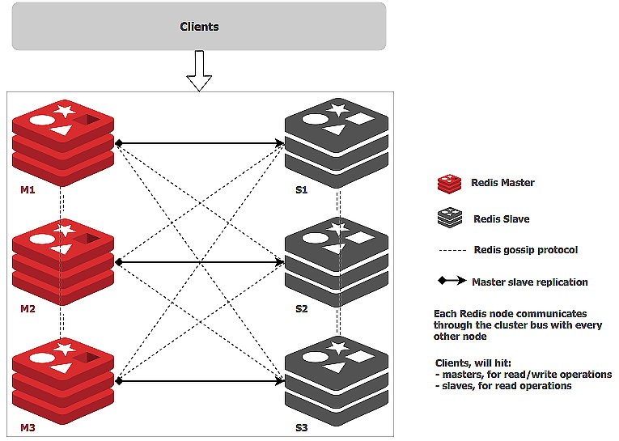
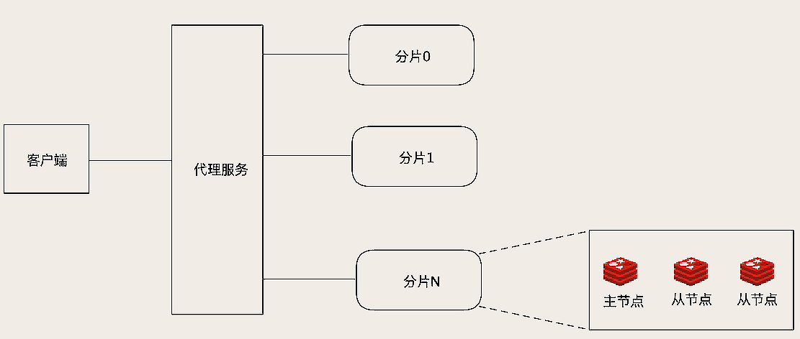
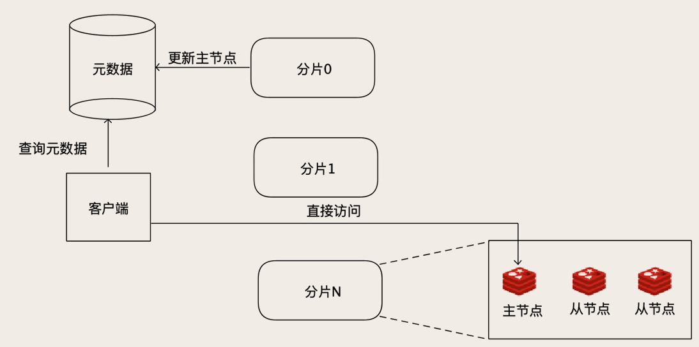
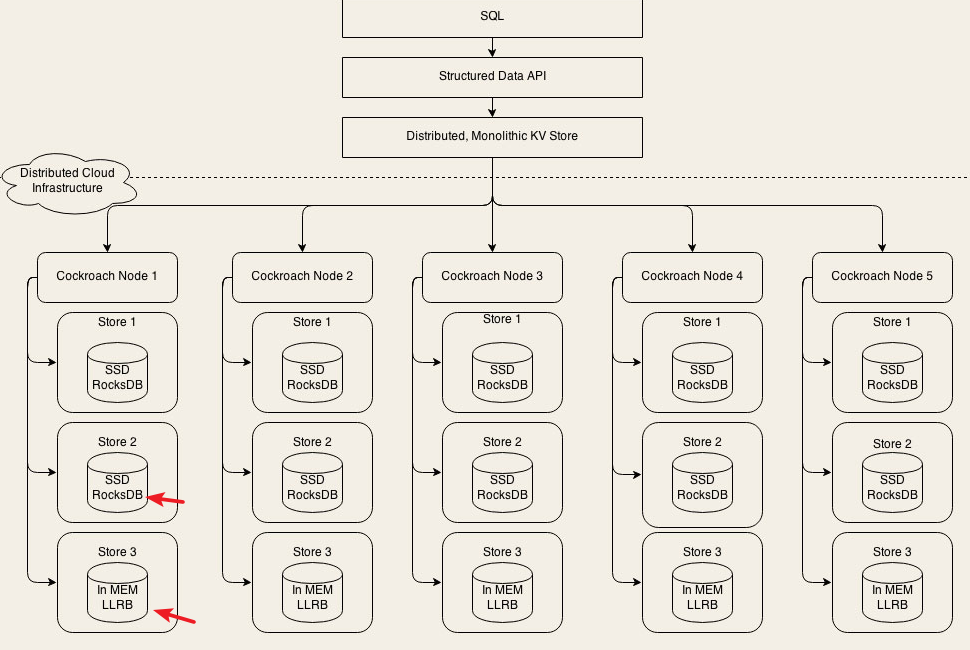
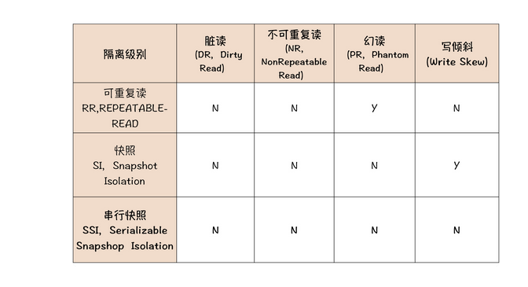
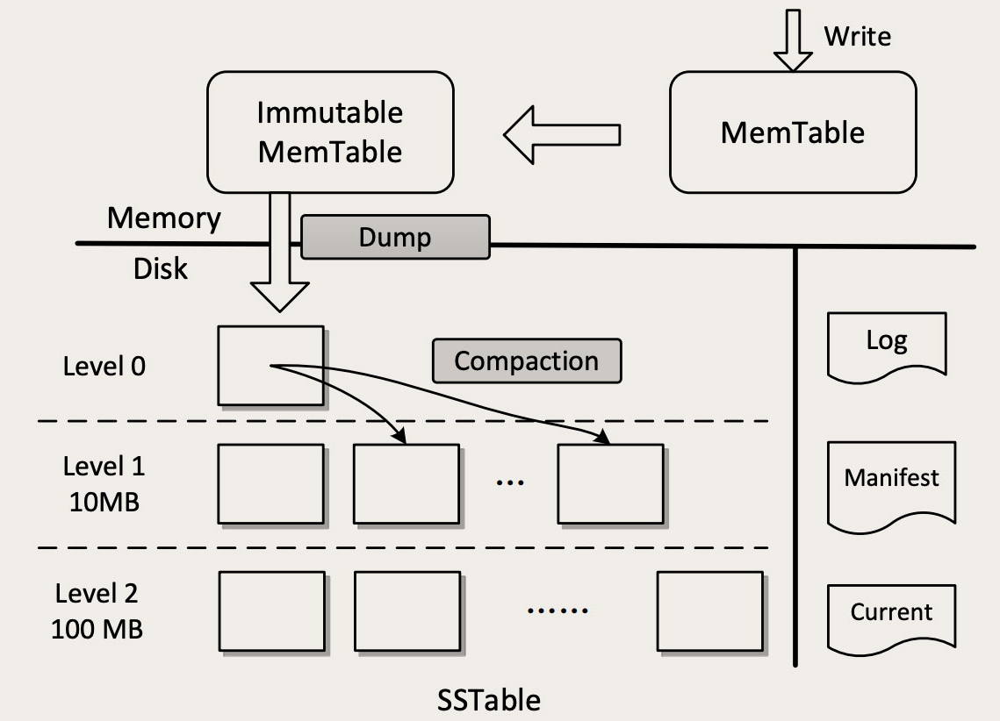

<!-- TOC -->

- [10 | 走进黑盒：SQL是如何在数据库中执行的？](#10--走进黑盒sql是如何在数据库中执行的)
    - [1、SQL 是如何在执行器中执行的？](#1sql-是如何在执行器中执行的)
    - [2、SQL 是如何在存储引擎中执行的？](#2sql-是如何在存储引擎中执行的)
    - [总结](#总结)
- [16 | 用Redis构建缓存集群的最佳实践有哪些？](#16--用redis构建缓存集群的最佳实践有哪些)
    - [1、Redis Cluster 如何解决数据量大、高可用和高并发问题？](#1redis-cluster-如何解决数据量大高可用和高并发问题)
    - [2、为什么 Redis Cluster 不适合超大规模集群？](#2为什么-redis-cluster-不适合超大规模集群)
    - [3、如何用 Redis 构建超大规模集群？](#3如何用-redis-构建超大规模集群)
    - [总结](#总结-1)
- [23 | MySQL经常遇到的高可用、分片问题，NewSQL是如何解决的？（分布式关系数据库）](#23--mysql经常遇到的高可用分片问题newsql是如何解决的分布式关系数据库)
    - [1、什么是 New SQL？](#1什么是-new-sql)
    - [2、CockroachDB 是如何实现数据分片和弹性扩容的？](#2cockroachdb-是如何实现数据分片和弹性扩容的)
    - [3、CockroachDB 能提供金融级的事务隔离性么？](#3cockroachdb-能提供金融级的事务隔离性么)
    - [总结](#总结-2)
- [24 | RocksDB：不丢数据的高性能KV存储](#24--rocksdb不丢数据的高性能kv存储)
    - [1、同样是 KV 存储，RocksDB 有哪些不同？](#1同样是-kv-存储rocksdb-有哪些不同)
    - [2、LSM-Tree 如何兼顾读写性能？](#2lsm-tree-如何兼顾读写性能)
    - [问题](#问题)

<!-- /TOC -->


本课程包括三个模块，分别是创业篇、高速增长篇、海量数据篇。

- 创业篇，带你解决电商系统从0到1过程中遇到的存储问题。比如，如何低成本高质量地快速构建一个小规模的订单存储系统。
    
- 高速增长篇，关注在高速变化的过程中，你的系统一定会遇到的一些共通问题及其应对方式。比如，如何从单机的存储系统逐步演进为分布式存储系统，如何在线平滑地扩容我们的存储系统。
    
- 海量数据篇，重点解决高并发、海量数据情况下的存储系统该如何设计的问题。比如，海量的埋点数据该怎么存储，如何在各种数据库之间实时地迁移和同步海量数据，等等。


# 10 | 走进黑盒：SQL是如何在数据库中执行的？

数据库的服务端，可以划分为执行器 (Execution Engine) 和 存储引擎 (Storage Engine) 两部分。执行器负责解析 SQL 执行查询，存储引擎负责保存数据。

## 1、SQL 是如何在执行器中执行的？

```sql

SELECT u.id AS user_id, u.name AS user_name, o.id AS order_id
FROM users u INNER JOIN orders o ON u.id = o.user_id
WHERE u.id > 50
```

数据库收到查询请求后，需要先解析 SQL 语句，把这一串文本解析成便于程序处理的结构化数据，这就是一个通用的语法解析过程。转换后的结构化数据，就是一棵树，这个树的名字叫抽象语法树（AST，Abstract Syntax Tree）。

执行器解析这个 AST 之后，会生成一个逻辑执行计划。所谓的执行计划，可以简单理解为如何一步一步地执行查询和计算，最终得到执行结果的一个分步骤的计划。

```
LogicalProject(user_id=[$0], user_name=[$1], order_id=[$5])
    LogicalFilter(condition=[$0 > 50])
        LogicalJoin(condition=[$0 == $6], joinType=[inner])
            LogicalTableScan(table=[users])
            LogicalTableScan(table=[orders])
```

和 SQL、AST 不同的是，这个逻辑执行计划已经很像可以执行的程序代码了。你看上面这个执行计划，很像我们编程语言的函数调用栈，外层的方法调用内层的方法。所以，要理解这个执行计划，得从内往外看。

- 1、最内层的 2 个 LogicalTableScan 的含义是，把 USERS 和 ORDERS 这两个表的数据都读出来。

- 2、然后拿这两个表所有数据做一个 LogicalJoin，JOIN 的条件就是第 0 列 (u.id) 等于第 6 列 (o.user_id)。

- 3、然后再执行一个 LogicalFilter 过滤器，过滤条件是第 0 列 (u.id) 大于 50。

- 4、最后，做一个 LogicalProject 投影，只保留第 0(user_id)、1(user_name)、5(order_id) 三列。这里“投影 (Project)”的意思是，把不需要的列过滤掉。

把这个逻辑执行计划翻译成代码，然后按照顺序执行，就可以正确地查询出数据了。但是，按照上面那个执行计划，需要执行 2 个全表扫描，然后再把 2 个表的所有数据做一个 JOIN 操作，这个性能是非常非常差的。

我们可以简单算一下，如果，user 表有 1,000 条数据，订单表里面有 10,000 条数据，这个 JOIN 操作需要遍历的行数就是 1,000 x 10,000 = 10,000,000 行。可见，这种从 SQL 的 AST 直译过来的逻辑执行计划，一般性能都非常差，所以，需要对执行计划进行优化。

如何对执行计划进行优化，不同的数据库有不同的优化方法，这一块儿也是不同数据库性能有差距的主要原因之一。优化的总体思路是，在执行计划中，尽早地减少必须处理的数据量。也就是说，尽量在执行计划的最内层减少需要处理的数据量。看一下简单优化后的逻辑执行计划：


```
LogicalProject(user_id=[$0], user_name=[$1], order_id=[$5])
    LogicalJoin(condition=[$0 == $6], joinType=[inner])
        LogicalProject(id=[$0], name=[$1])              // 尽早执行投影
            LogicalFilter(condition=[$0 > 50])          // 尽早执行过滤
                LogicalTableScan(table=[users])
        LogicalProject(id=[$0], user_id=[$1])           // 尽早执行投影
            LogicalTableScan(table=[orders])
```

对比原始的逻辑执行计划，这里我们做了两点简单的优化：
- 尽早地执行投影，去除不需要的列；
- 尽早地执行数据过滤，去除不需要的行。

这样，就可以在做 JOIN 之前，把需要 JOIN 的数据尽量减少。这个优化后的执行计划，显然会比原始的执行计划快很多。

到这里，执行器只是在逻辑层面分析 SQL，优化查询的执行逻辑，我们执行计划中操作的数据，仍然是表、行和列。在数据库中，表、行、列都是逻辑概念，所以，这个执行计划叫“逻辑执行计划”。执行查询接下来的部分，就需要涉及到数据库的物理存储结构了。


## 2、SQL 是如何在存储引擎中执行的？

数据真正存储的时候，无论在磁盘里，还是在内存中，都没法直接存储这种带有行列的二维表。数据库中的二维表，实际上是怎么存储的呢？这就是存储引擎负责解决的问题，存储引擎主要功能就是把逻辑的表行列，用合适的物理存储结构保存到文件中。不同的数据库，它们的物理存储结构是完全不一样的，这也是各种数据库之间巨大性能差距的根本原因。

我们还是以 MySQL 为例来说一下它的物理存储结构。MySQL 非常牛的一点是，它在设计层面对存储引擎做了抽象，它的存储引擎是可以替换的。它默认的存储引擎是 InnoDB，在 InnoDB 中，数据表的物理存储结构是以主键为关键字的 B+ 树，每一行数据直接就保存在 B+ 树的叶子节点上。

在 InnoDB 中，表的索引也是以 B+ 树的方式来存储的，和存储数据的 B+ 树的区别是，在索引树中，叶子节点保存的不是行数据，而是行的主键值。如果通过索引来检索一条记录，需要先后查询索引树和数据树这两棵树：先在索引树中检索到行记录的主键值，然后再用主键值去数据树中去查找这一行数据。

简单了解了存储引擎的物理存储结构之后，我们回过头来继续看 SQL 是怎么在存储引擎中继续执行的。优化后的逻辑执行计划将会被转换成物理执行计划，物理执行计划是和数据的物理存储结构相关的。还是用 InnoDB 来举例，直接将逻辑执行计划转换为物理执行计划：

```

InnodbProject(user_id=[$0], user_name=[$1], order_id=[$5])
    InnodbJoin(condition=[$0 == $6], joinType=[inner])
        InnodbTreeNodesProject(id=[key], name=[data[1]])
            InnodbFilter(condition=[key > 50])
                InnodbTreeScanAll(tree=[users])
        InnodbTreeNodesProject(id=[key], user_id=[data[1]])
            InnodbTreeScanAll(tree=[orders])
```

物理执行计划同样可以根据数据的物理存储结构、是否存在索引以及数据多少等各种因素进行优化。这一块儿的优化规则同样是非常复杂的，比如，我们可以把对用户树的全树扫描再按照主键过滤这两个步骤，优化为对树的范围查找。

```
PhysicalProject(user_id=[$0], user_name=[$1], order_id=[$5])
    PhysicalJoin(condition=[$0 == $6], joinType=[inner])
        InnodbTreeNodesProject(id=[key], name=[data[1]])
            InnodbTreeRangeScan(tree=[users], range=[key > 50])  // 全树扫描再按照主键过滤，直接可以优化为对树的范围查找
        InnodbTreeNodesProject(id=[key], user_id=[data[1]])
            InnodbTreeScanAll(tree=[orders])
```

最终，按照优化后的物理执行计划，一步一步地去执行查找和计算，就可以得到 SQL 的查询结果了。


## 总结

一条 SQL 在数据库中执行，首先 SQL 经过语法解析成 AST，然后 AST 转换为逻辑执行计划，逻辑执行计划经过优化后，转换为物理执行计划，再经过物理执行计划优化后，按照优化后的物理执行计划执行完成数据的查询。几乎所有的数据库，都是由执行器和存储引擎两部分组成，执行器负责执行计算，存储引擎负责保存数据。


# 16 | 用Redis构建缓存集群的最佳实践有哪些？


MySQL如何应对海量数据，如何应对高并发，如何实现高可用：

- 数据量太大查询慢怎么办？存档历史数据或者分库分表，这是数据分片。

- 并发太高扛不住怎么办？读写分离，这是增加实例数。

- 数据库宕机怎么办？增加从节点，主节点宕机的时候用从节点顶上，这是主从复制。但是这里面要特别注意数据一致性的问题。

这些方法不仅仅是 MySQL 特有的，对于几乎所有的存储系统，都是适用的。

## 1、Redis Cluster 如何解决数据量大、高可用和高并发问题？

Redis 从 3.0 版本开始，提供了官方的集群支持，也就是 Redis Cluser。Redis Cluster 相比于单个节点的 Redis，能保存更多的数据，支持更多的并发，并且可以做到高可用，在单个节点故障的情况下，继续提供服务。

为了能够保存更多的数据，和 MySQL 分库分表的方式类似，Redis Cluster 也是通过分片的方式，把数据分布到集群的多个节点上。

Redis Cluster 是如何来分片的呢？它引入了一个“槽（Slot）”的概念，这个槽就是哈希表中的哈希槽，槽是 Redis 分片的基本单位，每个槽里面包含一些 Key。每个集群的槽数是固定的 16384（16 * 1024）个，每个 Key 落在哪个槽中也是固定的，计算方法是：

HASH_SLOT = CRC16(key) mod 16384

这个算法很简单，先计算 Key 的 CRC 值，然后把这个 CRC 之后的 Key 值直接除以 16384，余数就是 Key 所在的槽。

这些槽又是如何存放到具体的 Redis 节点上的呢？这个映射关系保存在集群的每个 Redis 节点上，集群初始化的时候，Redis 会自动平均分配这 16384 个槽，也可以通过命令来调整。

客户端可以连接集群的任意一个节点来访问集群的数据，当客户端请求一个 Key 的时候，被请求的那个 Redis 实例先通过上面的公式，计算出这个 Key 在哪个槽中，然后再查询槽和节点的映射关系，找到数据所在的真正节点，如果这个节点正好是自己，那就直接执行命令返回结果。如果数据不在当前这个节点上，那就给客户端返回一个重定向的命令，告诉客户端，应该去连哪个节点上请求这个 Key 的数据。然后客户端会再连接正确的节点来访问。

解决分片问题之后，Redis Cluster 就可以通过水平扩容来增加集群的存储容量，但是，每次往集群增加节点的时候，需要从集群的那些老节点中，搬运一些槽到新节点，你可以手动指定哪些槽迁移到新节点上，也可以利用官方提供的redis-trib.rb脚本来自动重新分配槽，自动迁移。

分片可以解决 Redis 保存海量数据的问题，并且客观上提升了 Redis 的并发能力和查询性能。但是并不能解决高可用的问题，每个节点都保存了整个集群数据的一个子集，任何一个节点宕机，都会导致这个宕机节点上的那部分数据无法访问。

那 Redis Cluster 是怎么解决高可用问题的？参见上面我们讲到的方法：增加从节点，做主从复制。

Redis Cluster 支持给每个分片增加一个或多个从节点，每个从节点在连接到主节点上之后，会先给主节点发送一个 SYNC 命令，请求一次全量复制，也就是把主节点上全部的数据都复制到从节点上。全量复制完成之后，进入同步阶段，主节点会把刚刚全量复制期间收到的命令，以及后续收到的命令持续地转发给从节点。

因为 Redis 不支持事务，所以它的复制相比 MySQL 更简单，连 Binlog 都省了，直接就是转发客户端发来的更新数据命令来实现主从同步。如果某个分片的主节点宕机了，集群中的其他节点会在这个分片的从节点中选出一个新的节点作为主节点继续提供服务。新的主节点选举出来后，集群中的所有节点都会感知到，这样，如果客户端的请求 Key 落在故障分片上，就会被重定向到新的主节点上。


最后我们看一下，Redis Cluster 是如何应对高并发的。

一般来说，Redis Cluster 进行了分片之后，每个分片都会承接一部分并发的请求，加上 Redis 本身单节点的性能就非常高，所以大部分情况下不需要再像 MySQL 那样做读写分离来解决高并发的问题。默认情况下，集群的读写请求都是由主节点负责的，从节点只是起一个热备的作用。当然了，Redis Cluster 也支持读写分离，在从节点上读取数据。


以上就是 Redis Cluster 的基本原理，你可以对照下图来加深理解。



具体如何搭建 Redis Cluster 以及相关的操作命令你可以看一下

https://redis.io/topics/cluster-tutorial

## 2、为什么 Redis Cluster 不适合超大规模集群？

Redis Cluster 的优点是易于使用。分片、主从复制、弹性扩容这些功能都可以做到自动化，通过简单的部署就可以获得一个大容量、高可靠、高可用的 Redis 集群，并且对于应用来说，近乎于是透明的。

所以，Redis Cluster 是非常适合构建中小规模 Redis 集群，这里的中小规模指的是，大概几个到几十个节点这样规模的 Redis 集群。

但是 Redis Cluster 不太适合构建超大规模集群，主要原因是，它采用了去中心化的设计。


刚刚我们讲了，Redis 的每个节点上，都保存了所有槽和节点的映射关系表，客户端可以访问任意一个节点，再通过重定向命令，找到数据所在的那个节点。那你有没有想过一个问题，这个映射关系表，它是如何更新的呢？比如说，集群加入了新节点，或者某个主节点宕机了，新的主节点被选举出来，这些情况下，都需要更新集群每一个节点上的映射关系表。


Redis Cluster 采用了一种去中心化的流言 (Gossip) 协议来传播集群配置的变化。一般涉及到协议都比较复杂，这里我们不去深究具体协议和实现算法，我大概给你讲一下这个协议原理。


这个八卦协议它的好处是去中心化，传八卦不需要组织，吃瓜群众自发就传开了。这样部署和维护就更简单，也能避免中心节点的单点故障。八卦协议的缺点就是传播速度慢，并且是集群规模越大，传播的越慢。这个也很好理解，比如说，换成某两个特别出名的明星搞对象，即使是全国人民都很八卦，但要想让全国每一个人都知道这个消息，还是需要很长的时间。在集群规模太大的情况下，数据不同步的问题会被明显放大，还有一定的不确定性，如果出现问题很难排查。


## 3、如何用 Redis 构建超大规模集群？

edis Cluster 不太适合用于大规模集群，所以很多大厂，都选择自己去搭建 Redis 集群。这里面，每一家的解决方案都有自己的特色，但其实总体的架构都是大同小异的。一种是基于代理的方式，在客户端和 Redis 节点之间，还需要增加一层代理服务。这个代理服务有三个作用。

- 第一个作用是，负责在客户端和 Redis 节点之间转发请求和响应。客户端只和代理服务打交道，代理收到客户端的请求之后，再转发到对应的 Redis 节点上，节点返回的响应再经由代理转发返回给客户端。

- 第二个作用是，负责监控集群中所有 Redis 节点状态，如果发现有问题节点，及时进行主从切换。

- 第三个作用就是维护集群的元数据，这个元数据主要就是集群所有节点的主从信息，以及槽和节点关系映射表。这个架构和我在《12 | MySQL 如何应对高并发（二）：读写分离》这节课中给你讲过的，用 HAProxy+Keepalived 来代理 MySQL 请求的架构是类似的，只是多了一个自动路由分片的功能而已。



像开源的 Redis 集群方案twemproxy和Codis，都是这种架构的。


这个架构最大的优点是对客户端透明，在客户端视角来看，整个集群和一个超大容量的单节点 Redis 是一样的。并且，由于分片算法是代理服务控制的，扩容也比较方便，新节点加入集群后，直接修改代理服务中的元数据就可以完成扩容。


不过，这个架构的缺点也很突出，增加了一层代理转发，每次数据访问的链路更长了，必然会带来一定的性能损失。而且，代理服务本身又是集群的一个单点，当然，我们可以把代理服务也做成一个集群来解决单点问题，那样集群就更复杂了。


另外一种方式是，不用这个代理服务，把代理服务的寻址功能前移到客户端中去。客户端在发起请求之前，先去查询元数据，就可以知道要访问的是哪个分片和哪个节点，然后直连对应的 Redis 节点访问数据。

当然，客户端不用每次都去查询元数据，因为这个元数据是不怎么变化的，客户端可以自己缓存元数据，这样访问性能基本上和单机版的 Redis 是一样的。如果某个分片的主节点宕机了，新的主节点被选举出来之后，更新元数据里面的信息。对集群的扩容操作也比较简单，除了迁移数据的工作必须要做以外，更新一下元数据就可以了。




虽然说，这个元数据服务仍然是一个单点，但是它的数据量不大，访问量也不大，相对就比较容易实现。我们可以用 ZooKeeper、etcd 甚至 MySQL 都能满足要求。这个方案应该是最适合超大规模 Redis 集群的方案了，在性能、弹性、高可用几方面表现都非常好，缺点是整个架构比较复杂，客户端不能通用，需要开发定制化的 Redis 客户端，只有规模足够大的企业才负担得起。


## 总结

从小到大三种构建 Redis 集群的方式：

- 小规模的集群建议使用官方的 Redis Cluster，在节点数量不多的情况下，各方面表现都不错。

- 再大一些规模的集群，可以考虑使用 twemproxy 或者 Codis 这类的基于代理的集群架构，虽然是开源方案，但是已经被很多公司在生产环境中验证过。

- 相比于代理方案，使用定制客户端的方案性能更好，很多大厂采用的都是类似的架构。

还有一个小问题需要注意的是，这几种集群方案对一些类似于“KEYS”这类的多 KEY 命令，都没法做到百分百支持。原因很简单，数据被分片了之后，这种多 KEY 的命令很可能需要跨多个分片查询。当你的系统从单个 Redis 库升级到集群时，可能需要考虑一下这方面的兼容性问题。


# 23 | MySQL经常遇到的高可用、分片问题，NewSQL是如何解决的？（分布式关系数据库）

## 1、什么是 New SQL？

简单地说，New SQL 就是兼顾了 Old SQL 和 No SQL 的优点：

- 完整地支持 SQL 和 ACID，提供和 Old SQL 隔离级别相当的事务能力；
- 高性能、高可靠、高可用，支持水平扩容。

像 Google 的 Cloud Spanner、国产的 OceanBase 以及开源的CockroachDB都属于 New SQL 数据库。Cockroach 这个英文单词是蟑螂的意思，所以一般我们都把 CockroachDB 俗称为小强数据库。

## 2、CockroachDB 是如何实现数据分片和弹性扩容的？

首先，我们一起先来简单看一下 CockroachDB 的架构，从架构层面分析一下，它是不是真的像宣传的那么厉害。我们先来看一下它的架构图

https://github.com/cockroachdb/cockroach/blob/master/docs/design.md



这是一个非常典型的分层架构，我们从上往下看。最上层是 SQL 层，SQL 层支持和关系型数据库类似的逻辑数据结构，比如说库、表、行和列这些逻辑概念。SQL 层向下调用的是一个抽象的接口层 Structured Data API，实际实现这个 API 的是下面一层：Distributed, Monolithic KV Store，这就是一个分布式的 KV 存储系统。

你可以看到，这个架构仍然是我们之间讲过的，大部分数据库都采用的二层架构：执行器和存储引擎。它的 SQL 层就是执行器，下面的分布式 KV 存储集群就是它的存储引擎。

那我们知道，MySQL 的存储引擎 InnoDB，实际上是基于文件系统的 B+ 树，像 Hive 和 HBase，它们的存储引擎都是基于 HDFS 构建的。那 CockroachDB 这种，使用分布式 KV 存储来作为存储引擎的设计，理论上也是可行的，并没有什么特别难以逾越的技术壁垒。


它的分片算法采用的是范围分片，范围分片对查询是最友好的，可以很好地支持范围扫描这一类的操作，这样有利于它支撑上层的 SQL 查询。

它采用Raft一致性协议来实现每个分片的高可靠、高可用和强一致。这个 Raft 协议，它的一个理论基础，就是我们之前讲的复制状态机，并且在复制状态机的基础上，Raft 实现了集群自我监控和自我选举来解决高可用的问题。Raft 也是一个被广泛采用的、非常成熟的一致性协议，比如 etcd 也是基于 Raft 来实现的。


CockroachDB 的元数据直接分布在所有的存储节点上，依靠流言协议来传播，这个流言协议，我们在《16 | 用 Redis 构建缓存集群的最佳实践有哪些？》这节课中也讲到过，在 Redis Cluster 中也是用流言协议来传播元数据变化的。

CockroachDB 用上面这些成熟的技术解决了集群问题，在单机的存储引擎上，更是直接使用了 RocksDB 作为它的 KV 存储引擎。


## 3、CockroachDB 能提供金融级的事务隔离性么？

在说 ACID 之前，我们还是要简单说一下 CockroachDB 是怎么解析和执行 SQL 的。我们在《10 | 走进黑盒：SQL 是如何在数据库中执行的？》这节课中讲过 SQL 是如何在 MySQL 中执行的，在 CockroachDB 中，这个执行的流程也是差不多的。同样是先解析 SQL 生成语法树，转换成逻辑执行计划，再转换为物理执行计划，优化后，执行物理执行计划返回查询结果，这样一个流程。

只是在 CockroachDB 中，物理执行计划就更加复杂了，因为它的物理执行计划面对的是一个分布式 KV 存储系统，在涉及到查找、聚合这类操作的时候，有可能需要涉及到多个分片（Range）。大致过程就是类似于 Map-Reduce 的逻辑，先查找元数据确定可能涉及到的分片，然后把物理执行计划转换成每个分片上的物理执行计划，在每个分片上去并行执行，最后，再对这些执行结果做汇总。


常见的四种事务隔离级别，分别是 RU、RC、RR 和 SERIALIZABLE，那 CockroachDB 能提供哪种隔离级别呢？答案是，以上四种都不是。

CockroachDB 提供了另外两种隔离级别，分别是：Snapshot Isolation (SI) 和 Serializable Snapshot Isolation (SSI)，其中 SSI 是 CockroachDB 默认的隔离级别。

这两种隔离级别和之前提到的四种隔离级别是什么关系呢？我们通过下面这张表，和 MySQL 默认的隔离级别 RR 做一个对比。



备注：MySQL的可重复读可以消除幻读。

首先我们看 SI 这一行。我们之前讲到过，RR 这种隔离级别，可以很好地解决脏读和不可重复读的问题，虽然可能会产生幻读，但实际上对绝大多数事务影响不大。SI 不会发生脏读、不可重复读，也不会发生幻读的情况，这个隔离级别似乎比 RR 还要好。

但你要注意一下，我们这个表格比之前那个表格多了一列：写倾斜。可以看到，RR 是不会出现写倾斜问题的，但是 SI 会有写倾斜问题。

什么是写倾斜？我们还是拿账户余额的例子来说明。比如说，我们的账户需要支持主副卡，主卡和副卡都分别有自己的余额，并且这个余额是可以透支的，只要满足主副卡的余额之和大于 0 就行了。如果我们需要给主卡支出 100 元，那 SQL 只要这样写就可以了：

```sql

update account
set balance = balance - 100 -- 在主卡中扣减100元
where id = ? and
  (select balance from account where id = ?) -- 主卡余额
  +
  (select balance from account where id = ?) -- 附卡余额
  >= 100; -- 主副卡余额之和必须大于100元

```
在传统的 RR 隔离级别下，由于更新数据时会对记录加锁，即使更新主副卡的两个 SQL 分别在两个事务中并发执行，也不会出现把主副卡的余额之和扣减成负数的情况。


但是在 SI 级别下，由于它没有加锁，而是采用快照的方式来实现事务的隔离，这个时候，如果并发地去更新主副卡余额，是有可能出现把主副卡余额之和扣减为负数的情况的。这种情况称为写倾斜。这里顺便提一句，写倾斜是普遍的译法，我个人觉得“倾斜”这个词翻译得并不准确，实际上它表达的，就是因为没有检测读写冲突，也没有加锁，导致数据写错了。


SSI 隔离级别在 SI 的基础上，加入了冲突检测的机制，通过检测读写冲突，然后回滚事务的方式来解决写倾斜的问题，当然这种方式付出的代价是降低性能，并且冲突严重的情况下，会频繁地出现事务回滚。


从理论上来说，CockroachDB 支持的 SI 和 SSI 这两种事务隔离级别，能提供的事务隔离性，已经与传统的 RC 和 RR 隔离级别不相上下了，可以满足大多数在线交易类系统对 ACID 的要求。

## 总结

New SQL 是新一代的分布式数据库，它具备原生分布式存储系统高性能、高可靠、高可用和弹性扩容的能力，同时还兼顾了传统关系型数据库的 SQL 支持。更厉害的是，它还提供了和传统关系型数据库不相上下的、真正的事务支持，具备了支撑在线交易类业务的能力。

CockroachDB 是开源的 New SQL 数据库。它的存储引擎是一个分布式 KV 存储集群，执行器则大量借鉴了 PostgreSQL 的一些设计和实现，是一个集很多现有数据库和分布式存储系统技术于一身，这样的一个数据库产品。


# 24 | RocksDB：不丢数据的高性能KV存储

基于RocksDB系统：MyRocks、 MariaDB、MongoDB、Cassandra


RocksDB是 Facebook 开源的一个高性能持久化 KV 存储。目前，你可能很少见到过哪个项目会直接使用 RocksDB 来保存数据，在未来，RocksDB 大概率也不会像 Redis 那样被业务系统直接使用。那我们为什么要关注它呢？因为越来越多的新生代数据库，都不约而同地选择 RocksDB 作为它们的存储引擎。在将来，很有可能出现什么样的情况呢？我们使用的很多不同的数据库，它们背后采用的存储引擎都是 RocksDB。


我来给你举几个例子。我们上节课讲到的 CockroachDB 用到了 RocksDB 作为它的存储引擎。再说几个比较有名的，MyRocks这个开源项目，你看它这个名字就知道它是干什么的了。它在用 RocksDB 给 MySQL 做存储引擎，目的是取代现有的 InnoDB 存储引擎。并且，MySQL 的亲兄弟 MariaDB 已经接纳了 MyRocks，作为它的一个可选的存储引擎。还有大家都经常用的实时计算引擎Flink，用过的同学都知道，Flink 的 State 就是一个 KV 的存储，它使用的也是 RocksDB。还有包括 MongoDB、Cassandra 等等很多的数据库，都在开发基于 RocksDB 的存储引擎。


## 1、同样是 KV 存储，RocksDB 有哪些不同？


我们知道 Redis 是一个内存数据库，它之所以能做到非常好的性能，主要原因就是，它的数据都是保存在内存中的。从 Redis 官方给出的测试数据来看，它的随机读写性能大约在 50 万次 / 秒左右。而 RocksDB 相应的随机读写性能大约在 20 万次 / 秒左右，虽然性能还不如 Redis，但是已经可以算是同一个量级的水平了。这里面你需要注意到的一个重大差异是，Redis 是一个内存数据库，并不是一个可靠的存储。数据写到内存中就算成功了，它并不保证安全地保存到磁盘上。而 RocksDB 它是一个持久化的 KV 存储，它需要保证每条数据都要安全地写到磁盘上，这也是很多数据库产品的基本要求。


RocksDB 为什么能在保证数据持久化的前提下，还能做到这么强的性能呢？我们之前反复讲到过，一个存储系统，它的读写性能主要取决于什么？取决于它的存储结构，也就是数据是如何组织的。RocksDB 采用了一个非常复杂的数据存储结构，并且这个存储结构采用了内存和磁盘混合存储方式，使用磁盘来保证数据的可靠存储，并且利用速度更快的内存来提升读写性能。或者说，RocksDB 的存储结构本身就自带了内存缓存。


RocksDB 究竟使用了什么样的数据结构，在保证数据顺序写入的前提下还能兼顾很好的查询性能呢？这种数据结构就是 LSM-Tree。

## 2、LSM-Tree 如何兼顾读写性能？

LSM-Tree 的全称是：The Log-Structured Merge-Tree，是一种非常复杂的复合数据结构，它包含了 WAL（Write Ahead Log）、跳表（SkipList）和一个分层的有序表（SSTable，Sorted String Table）。下面这张图就是 LSM-Tree 的结构图。

http://ranger.uta.edu/~sjiang/pubs/papers/wang14-LSM-SDF.pdf




这个图上有一个横向的实线，是内存和磁盘的分界线，上面的部分是内存，下面的部分是磁盘。

我们先来看数据是如何写入的。当 LSM-Tree 收到一个写请求，比如说：PUT foo bar，把 Key foo 的值设置为 bar。首先，这条操作命令会被写入到磁盘的 WAL 日志中（图中右侧的 Log），这是一个顺序写磁盘的操作，性能很好。这个日志的唯一作用就是用于故障恢复，一旦系统宕机，可以从日志中把内存中还没有来得及写入磁盘的数据恢复出来。

写完日志之后，数据可靠性的问题就解决了。然后数据会被写入到内存中的 MemTable 中，这个 MemTable 就是一个按照 Key 组织的跳表（SkipList），跳表和平衡树有着类似的查找性能，但实现起来更简单一些。写 MemTable 是个内存操作，速度也非常快。数据写入到 MemTable 之后，就可以返回写入成功了。这里面有一点需要注意的是，LSM-Tree 在处理写入的过程中，直接就往 MemTable 里写，并不去查找这个 Key 是不是已经存在了。

这个内存中 MemTable 不能无限地往里写，一是内存的容量毕竟有限，另外，MemTable 太大了读写性能都会下降。所以，MemTable 有一个固定的上限大小，一般是 32M。MemTable 写满之后，就被转换成 Immutable MemTable，然后再创建一个空的 MemTable 继续写。这个 Immutable MemTable，也就是只读的 MemTable，它和 MemTable 的数据结构完全一样，唯一的区别就是不允许再写入了。

Immutable MemTable 也不能在内存中无限地占地方，会有一个后台线程，不停地把 Immutable MemTable 复制到磁盘文件中，然后释放内存空间。每个 Immutable MemTable 对应一个磁盘文件，MemTable 的数据结构跳表本身就是一个有序表，写入的文件也是一个按照 Key 排序的结构，这些文件就是 SSTable。把 MemTable 写入 SSTable 这个写操作，因为它是把整块内存写入到整个文件中，这同样是一个顺序写操作。


到这里，虽然数据已经保存到磁盘上了，但还没结束，因为这些 SSTable 文件，虽然每个文件中的 Key 是有序的，但是文件之间是完全无序的，还是没法查找。这里 SSTable 采用了一个很巧妙的分层合并机制来解决乱序的问题。

SSTable 被分为很多层，越往上层，文件越少，越往底层，文件越多。每一层的容量都有一个固定的上限，一般来说，下一层的容量是上一层的 10 倍。当某一层写满了，就会触发后台线程往下一层合并，数据合并到下一层之后，本层的 SSTable 文件就可以删除掉了。合并的过程也是排序的过程，除了 Level 0（第 0 层，也就是 MemTable 直接 dump 出来的磁盘文件所在的那一层。）以外，每一层内的文件都是有序的，文件内的 KV 也是有序的，这样就比较便于查找了。

然后我们再来说 LSM-Tree 如何查找数据。查找的过程也是分层查找，先去内存中的 MemTable 和 Immutable MemTable 中找，然后再按照顺序依次在磁盘的每一层 SSTable 文件中去找，只要找到了就直接返回。这样的查找方式其实是很低效的，有可能需要多次查找内存和多个文件才能找到一个 Key，但实际的效果也没那么差，因为这样一个分层的结构，它会天然形成一个非常有利于查找的情况：越是被经常读写的热数据，它在这个分层结构中就越靠上，对这样的 Key 查找就越快。


比如说，最经常读写的 Key 很大概率会在内存中，这样不用读写磁盘就完成了查找。即使内存中查不到，真正能穿透很多层 SStable 一直查到最底层的请求还是很少的。另外，在工程上还会对查找做很多的优化，比如说，在内存中缓存 SSTable 文件的 Key，用布隆过滤器避免无谓的查找等来加速查找过程。这样综合优化下来，可以获得相对还不错的查找性能。


## 问题

> 1、我们刚刚讲了 LSM-Tree 是如何读写数据的，但是并没有提到数据是如何删除的。课后请你去看一下 RocksDB 或者是 LevelDB 相关的文档，总结一下 LSM-Tree 删除数据的过程

应该是标记删除，有墓碑的概念，被删除的条目，如果在memtable里，可以直接通过墓碑标记为删除，如果不在memtable里就插入一条新的删除记录，这两种情况都会在层级合并的时候真正发挥作用，同时WAL里通过一条额外的log记录这个删除操作。

另外感觉WAL里存储的其实就是操作指令流，和raft里面的日志完全一个概念，所以raft协议和leveldb/rocksdb的组合简直是绝配。


