<!-- TOC -->

- [01 | 线性结构检索：从数组和链表的原理初窥检索本质](#01--线性结构检索从数组和链表的原理初窥检索本质)
    - [问题](#问题)
- [02 | 非线性结构检索：数据频繁变化的情况下，如何高效检索？](#02--非线性结构检索数据频繁变化的情况下如何高效检索)
    - [1、树结构是如何进行二分查找的？](#1树结构是如何进行二分查找的)
    - [2、二叉检索树的检索空间平衡方案](#2二叉检索树的检索空间平衡方案)
    - [3、跳表是如何进行二分查找的？](#3跳表是如何进行二分查找的)
    - [4、跳表的检索空间平衡方案](#4跳表的检索空间平衡方案)
    - [总结](#总结)
    - [问题](#问题-1)
- [03 | 哈希检索：如何根据用户ID快速查询用户信息？](#03--哈希检索如何根据用户id快速查询用户信息)
    - [1、使用 Hash 函数将 Key 转换为数组下标](#1使用-hash-函数将-key-转换为数组下标)
    - [2、如何利用开放寻址法解决 Hash 冲突？](#2如何利用开放寻址法解决-hash-冲突)
    - [3、如何利用链表法解决 Hash 冲突？](#3如何利用链表法解决-hash-冲突)
    - [4、哈希表有什么缺点？](#4哈希表有什么缺点)
    - [总结](#总结-1)
    - [问题](#问题-2)
- [04 | 状态检索：如何快速判断一个用户是否存在？](#04--状态检索如何快速判断一个用户是否存在)
    - [1、如何使用数组的随机访问特性提高查询效率？](#1如何使用数组的随机访问特性提高查询效率)
    - [2、如何使用位图来减少存储空间？](#2如何使用位图来减少存储空间)
    - [总结](#总结-2)
    - [问题](#问题-3)
- [05 | 倒排索引：如何从海量数据中查询同时带有“极”和“客”的唐诗？](#05--倒排索引如何从海量数据中查询同时带有极和客的唐诗)
    - [1、什么是倒排索引？](#1什么是倒排索引)
    - [2、如何创建倒排索索引？](#2如何创建倒排索索引)
    - [3、如何查询同时含有“极”字和“客”字两个 key 的文档？](#3如何查询同时含有极字和客字两个-key-的文档)
    - [总结](#总结-3)
    - [问题](#问题-4)
- [05-1 倒排检索加速（一）：工业界如何利用跳表、哈希表、位图进行加速？](#05-1-倒排检索加速一工业界如何利用跳表哈希表位图进行加速)
    - [1、跳表法加速倒排索引（优化posting list原来的链表）](#1跳表法加速倒排索引优化posting-list原来的链表)
    - [2、哈希表法加速倒排索引（优化posting list原来的链表）](#2哈希表法加速倒排索引优化posting-list原来的链表)
    - [3、位图法加速倒排索引（优化posting list原来的链表）](#3位图法加速倒排索引优化posting-list原来的链表)
    - [4、升级版位图：Roaring Bitmap](#4升级版位图roaring-bitmap)
    - [总结](#总结-4)
    - [问题](#问题-5)
- [05-2 倒排检索加速（二）：如何对联合查询进行加速？](#05-2-倒排检索加速二如何对联合查询进行加速)
    - [1、调整次序法](#1调整次序法)
    - [2、快速多路归并法](#2快速多路归并法)
    - [3、预先组合法](#3预先组合法)
    - [4、缓存法加速联合查询](#4缓存法加速联合查询)
    - [总结](#总结-5)
    - [问题](#问题-6)
- [06 | 数据库检索：如何使用B+树对海量磁盘数据建立索引？](#06--数据库检索如何使用b树对海量磁盘数据建立索引)
    - [1、磁盘和内存中数据的读写效率有什么不同？](#1磁盘和内存中数据的读写效率有什么不同)
    - [2、如何将索引和数据分离？](#2如何将索引和数据分离)
    - [3、如何理解 B+ 树的数据结构？](#3如何理解-b-树的数据结构)
    - [4、B+ 树是如何检索的？](#4b-树是如何检索的)
    - [5、B+ 树是如何动态调整的？](#5b-树是如何动态调整的)
    - [总结](#总结-6)
    - [问题](#问题-7)
- [07 | NoSQL检索：为什么日志系统主要用LSM树而非B+树？](#07--nosql检索为什么日志系统主要用lsm树而非b树)
    - [1、如何利用批量写入代替多次随机写入？（数据会暂存内存，宕机会丢失）](#1如何利用批量写入代替多次随机写入数据会暂存内存宕机会丢失)
    - [2、如何保证批量写之前系统崩溃可以恢复？（Write Ahead Log，预写日志技术）](#2如何保证批量写之前系统崩溃可以恢复write-ahead-log预写日志技术)
    - [3、如何将内存数据与磁盘数据合并？（有序链表的归并排序）](#3如何将内存数据与磁盘数据合并有序链表的归并排序)
    - [4、LSM 树是如何检索的？](#4lsm-树是如何检索的)
    - [总结](#总结-7)
    - [问题](#问题-8)
- [08 | 索引构建：搜索引擎如何为万亿级别网站生成索引？](#08--索引构建搜索引擎如何为万亿级别网站生成索引)
    - [1、如何生成大于内存容量的倒排索引？](#1如何生成大于内存容量的倒排索引)
    - [2、如何使用磁盘上的倒排文件进行检索？](#2如何使用磁盘上的倒排文件进行检索)
    - [总结](#总结-8)
    - [问题](#问题-9)
- [09 | 索引更新：刚发布的文章就能被搜到，这是怎么做到的？](#09--索引更新刚发布的文章就能被搜到这是怎么做到的)
- [10 | 索引拆分：大规模检索系统如何使用分布式技术加速检索？](#10--索引拆分大规模检索系统如何使用分布式技术加速检索)
- [11｜精准Top K检索：搜索结果是怎么进行打分排序的？](#11｜精准top-k检索搜索结果是怎么进行打分排序的)
- [12 | 非精准Top K检索：如何给检索结果的排序过程装上“加速器”？](#12--非精准top-k检索如何给检索结果的排序过程装上加速器)
- [13 | 空间检索（上）：如何用Geohash实现“查找附近的人”功能？](#13--空间检索上如何用geohash实现查找附近的人功能)
- [14 | 空间检索（下）：“查找最近的加油站”和“查找附近的人”有何不同？](#14--空间检索下查找最近的加油站和查找附近的人有何不同)
- [15 | 最近邻检索（上）：如何用局部敏感哈希快速过滤相似文章？](#15--最近邻检索上如何用局部敏感哈希快速过滤相似文章)
- [16 | 最近邻检索（下）：如何用乘积量化实现“拍照识花”功能？](#16--最近邻检索下如何用乘积量化实现拍照识花功能)
- [17 | 存储系统：从检索技术角度剖析LevelDB的架构设计思想](#17--存储系统从检索技术角度剖析leveldb的架构设计思想)
    - [1、如何利用读写分离设计将内存数据高效存储到磁盘？](#1如何利用读写分离设计将内存数据高效存储到磁盘)
    - [2、SSTable 的分层管理设计](#2sstable-的分层管理设计)
    - [3、如何查找对应的 SSTable 文件](#3如何查找对应的-sstable-文件)
    - [4、SSTable 文件中的检索加速](#4sstable-文件中的检索加速)
    - [5、利用缓存加速检索 SSTable 文件的过程](#5利用缓存加速检索-sstable-文件的过程)
    - [总结](#总结-9)
    - [问题](#问题-10)
- [18 | 搜索引擎：输入搜索词以后，搜索引擎是怎么工作的？](#18--搜索引擎输入搜索词以后搜索引擎是怎么工作的)
    - [1、搜索引擎的整体架构和工作过程](#1搜索引擎的整体架构和工作过程)
        - [1、首先是爬虫系统](#1首先是爬虫系统)
        - [2、其次是索引系统](#2其次是索引系统)
        - [3、最后是检索系统](#3最后是检索系统)
    - [2、搜索引擎是如何进行查询分析的？](#2搜索引擎是如何进行查询分析的)
    - [3、搜索引擎是如何进行查询纠错的？](#3搜索引擎是如何进行查询纠错的)
    - [4、搜索引擎是如何完成短语检索的？](#4搜索引擎是如何完成短语检索的)
    - [总结](#总结-10)
    - [问题](#问题-11)
- [19 | 广告系统：广告引擎如何做到在0.1s内返回广告信息？](#19--广告系统广告引擎如何做到在01s内返回广告信息)
- [20 | 推荐引擎：没有搜索词，“头条”怎么找到你感兴趣的文章？](#20--推荐引擎没有搜索词头条怎么找到你感兴趣的文章)

<!-- /TOC -->

> 总结

- 1、当我们要在系统中使用数据库来进行存储和检索时，那么是使用关系型数据库好呢？还是选择 NoSQL 好呢？这就需要我们对于数据库的检索技术 B+ 树，和 NoSQL 中的 LSM 树有一定的了解。比如，在数据被频繁写入、较少查找的日志系统和监控系统中，我们更应该使用 NoSQL 型数据库。

- 2、使用lsm树实现的系统有：Druid、clickhouse、HBASE、（leveldb、rocketdb）

> 课程简介

专栏共包含三个模块，分别是基础技术篇、进阶实战篇和系统案例篇。

- 基础技术篇：聚焦5大类核心的数据结构和检索算法，包括线性结构检索、非线性结构检索、哈希检索等，着重讲解它们的存储特点和检索效率，帮你理解检索技术的本质，并且能够在代码级别提升运行效率。

- 进阶实战篇：分析工业界中的高效检索方案，详细讲解其中涉及的高级检索技术，总结一些架构设计思想，比如，读写分离、索引和数据分离、空间检索、Top K搜索。掌握这些设计思想和高级技术能够大幅度提升检索效率，帮你解决实际工作中的检索难题。

- 系统案例篇：剖析当前热门的存储系统、搜索引擎、广告引擎、推荐引擎。学习这些系统是如何应用检索技术架构的、关键环节如何处理，从而帮你扩大知识面，拥有架构师、设计者视角，能够从更高的角度去思考问题、解决问题。

检索技术：它是更底层的通用技术，它研究的是如何将我们所需的数据高效地取出来。

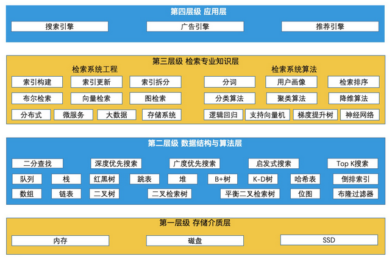

在这张图中，我从基础到实际应用，将需要学习的检索技术分为了四个层级，我们按照从下往上的顺序依次来看。

第一层是存储介质层。因为检索效率的高低和数据存储的方式是紧密联系的，所以，存储介质的特性是我们需要学习的基础知识。

第二层是数据结构与算法层。提到“效率”，自然就离不开数据结构和算法。在遇到实际业务的时候，我们要知道如何利用每个数据结构和算法的特点，来提高检索效率。所以，这块内容我们必须要学得很扎实。

第三层是检索专业知识层。如果我们想实现工业界中的检索引擎，需要掌握这些检索技术。我把它们划分为两部分，分别是工程架构和算法策略。这些内容是我们解决常见业务问题的必备知识。

第四层是检索技术的应用层。检索技术在互联网中有许多应用场景，其中最常见的，有搜索引擎、广告引擎、以及推荐引擎。这些业务系统有相似的工程架构和算法部分，也分别有自己独特的业务处理环节。学习它们的实践方法，我们可以更全面、更深入地掌握检索技术。

> 问题点

1、实时查询统计”的需求到底是怎么样的。如果是简单的一些固定统计，那么elastic search就可以提供；但如果是偏OLAP的灵活分析查询需求，那其实Druid和clickhouse是更合适的选择。

ps:Druid和clickhouse都是基于lsm树实现的。lsm树在进阶实战篇和系统案例篇中我都会介绍。

在日常的工作中经常会遇到一些与查询相关的问题，比如：

- 如何从海量数据中查询同时带有“极”和“客”字的唐诗？
- 为什么很多日志系统使用NoSQL数据库而不是关系型数据库？
- 在爬虫系统抓取网页之前，如何快速判断一个URL是否已经被抓取过？

> 学习攻略

- 1.多思考、多提问，善用“理解记忆法”。比如，“这个知识点要解决什么问题？”“如果不用这个方法还有其他的解决方案吗？”“使用这个方法有副作用或者限制吗？”

- 2、建立自己的知识体系。对比和拆解。

- 3、有耐心、反复学、多交流。

基础技术篇 (8讲)

# 01 | 线性结构检索：从数组和链表的原理初窥检索本质

你可以先思考一个问题：什么是检索？从字面上来理解，检索其实就是将我们所需要的信息，从存储数据的地方高效取出的一种技术。所以，检索效率和数据存储的方式是紧密联系的。具体来说，就是不同的存储方式，会导致不同的检索效率。那么，研究数据结构的存储特点对检索效率的影响就很有必要了。

> 数组和链表有哪些存储特点？

数组和链表分别代表了连续空间和不连续空间的最基础的存储方式，它们是线性表（Linear List）的典型代表。其他所有的数据结构，比如栈、队列、二叉树、B+ 树等，都不外乎是这两者的结合和变化。因此，我们只需要从最基础的数组和链表入手，结合实际应用中遇到的问题去思考解决方案，就能逐步地学习和了解更多的数据结构和检索技术。

检索的核心思路，其实就是通过合理组织数据，尽可能地快速减少查询范围。

> 链表在检索和动态调整上的优缺点

链表的检索能力偏弱，作为弥补，它在动态调整上会更容易。

> 总结

首先，我们学习了具体的检索方法。对于无序数组，我们可以遍历检索。对于有序数组，我们可以用二分查找。链表具有灵活调整能力，适合用在数据频繁修改的场合。其次，你应该也开始体会到了检索的一些核心思想：合理组织数据，尽可能快速减少查询范围，可以提升检索效率。

## 问题

> 1、对于有序数组的高效检索，我们为什么使用二分查找算法，而不是 3-7 分查找算法，或 4-6 分查找算法？

按概率算，二分肯定所需信息量最小阿，log1/2+log1/2小于log0.4+log0.6

二分查找概率均匀

> 2、对于单个查询值 k，我们已经熟悉了如何使用二分查找。那给出两个查询值 x 和 y 作为查询范围，如果要在有序数组中查找出大于 x 和小于 y 之间的所有元素，我们应该怎么做呢？

- 第一步二分确定边界，第二步遍历区间值，这样的时间代价就是log（n）+（y－x）；

- 比如两次二分，那么就是log（n）+log（n）；

- 在第一次二分找到x以后，然后在x和数组尾之间再二分找到y；

对于Redis是怎么实现的范围查找问题（有序链表）:Redis是使用跳表实现的。而跳表是“非连续存储空间”。因此，它不能像数组一样，直接将x到y之间的元素快速复制出来到结果集合中，因此，它只能通过遍历的方式将范围查找的结果写入结果集合中。

因为数组分布未知，所以均匀分布概率最大，也因此二分最优概率最大。如果能够针对有序数组进行分布估计，从而决定每次的最优划分。

补充一个小知识: 如果有了分布信息，比如说，数据是均匀分布的，最小的数是1，最大的数是1000，那么当我们想查询5的时候，我们第一次查询的位置就不是数组中间了，而是在数组前5/1000的位置进行查找。这种基于均匀分布假设的查找方式，叫做“插值查找”。

# 02 | 非线性结构检索：数据频繁变化的情况下，如何高效检索？

在数据频繁更新的场景中，连续存储的有序数组并不是最合适的存储方案。因为数组为了保持有序必须不停地重建和排序，系统检索性能就会急剧下降。但是，非连续存储的有序链表倒是具有高效插入新数据的能力。因此，我们能否结合上面的例子，使用非线性的树状结构来改造有序链表，让链表也具有二分查找的能力呢？

## 1、树结构是如何进行二分查找的？

二叉检索树（Binary Search Tree），或者叫二叉排序树（Binary Sorted Tree）：它的左子树的所有节点的值都小于根节点，同时右子树所有节点的值都大于等于根节点。这样的有序结构，使得它能使用二分查找算法，快速地过滤掉一半的数据。

尽管有序数组和二叉检索树，在数据结构形态上看起来差异很大，但是在提高检索效率上，它们的核心原理都是一致的。那么，它们是如何提高检索效率的呢？核心原理又一致在哪里呢？接下来，我们就从两个主要方面来看。

- 将数据有序化，并且根据数据存储的特点进行不同的组织。对于连续存储空间的数组而言，由于它具有“随机访问”的特性，因此直接存储即可；对于非连续存储空间的有序链表而言，由于它不具备“随机访问”的特性，因此，需要将它改造为可以快速访问到中间节点的树状结构。

- 在进行检索的时候，它们都是通过二分查找的思想从中间节点开始查起。如果不命中，会快速缩小一半的查询空间。这样不停迭代的查询方式，让检索的时间代价能达到 O(log n) 这个级别。

说到这里，你可能会问，二叉检索树的检索时间代价一定是 O(log n) 吗？其实不一定。

## 2、二叉检索树的检索空间平衡方案

假设，一个二叉树的每一个节点的左指针都是空的，右子树的值都大于根节点。那么它满足二叉检索树的特性，是一颗二叉检索树。但是，如果我们把左边的空指针忽略，你会发现它其实就是一个单链表！单链表的检索效率如何呢？其实是 O(n)，而不是 O(log n)。

为什么会出现这样的情况呢？

最根本的原因是，这样的结构造成了检索空间不平衡。在当前节点不满足查询条件的时候，它无法把“一半的数据”过滤掉，而是只能过滤掉当前检索的这个节点。因此无法达到“快速减小查询范围”的目的。

因此，为了提升检索效率，我们应该尽可能地保证二叉检索树的平衡性，让左右子树尽可能差距不要太大。这样无论我们是继续往左边还是右边检索，都可以过滤掉一半左右的数据。也正是为了解决这个问题，有更多的数据结构被发明了出来。比如：AVL 树（平衡二叉树）和红黑树，其实它们本质上都是二叉检索树，但它们都在保证左右子树差距不要太大上做了特殊的处理，保证了检索效率，让二叉检索树可以被广泛地使用。比如，我们常见的 C++ 中的 Set 和 Map 等数据结构，底层就是用红黑树实现的。

## 3、跳表是如何进行二分查找的？

除了二叉检索树，有序链表还有其他快速访问中间节点的改造方案吗？我们知道，链表之所以访问中间节点的效率低，就是因为每个节点只存储了下一个节点的指针，要沿着这个指针遍历每个后续节点才能到达中间节点。那如果我们在节点上增加一个指针，指向更远的节点，比如说跳过后一个节点，直接指向后面第二个节点，那么沿着这个指针遍历，是不是遍历速度就翻倍了呢？同理，如果我们能增加更多的指针，提供不同步长的遍历能力，比如一次跳过 4 个节点，甚至一半的节点，那我们是不是就可以更快速地访问到中间节点了呢？

这当然是可以实现的。我们可以为链表的某些节点增加更多的指针。这些指针都指向不同距离的后续节点。这样一来，链表就具备了更高效的检索能力。这样的数据结构就是跳表（Skip List）。

一个理想的跳表，就是从链表头开始，用多个不同的步长，每隔 2^n 个节点做一次直接链接（n 取值为 0，1，2……）。跳表中的每个节点都拥有多个不同步长的指针，我们可以在每个节点里，用一个数组 next 来记录这些指针。next 数组的大小就是这个节点的层数，next[0]就是第 0 层的步长为 1 的指针，next[1]就是第 1 层的步长为 2 的指针，next[2]就是第 2 层的步长为 4 的指针，依此类推。你会发现，不同步长的指针，在链表中的分布是非常均匀的，这使得整个链表具有非常平衡的检索结构。

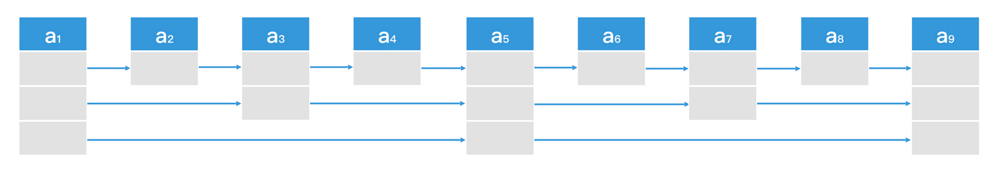

举个例子，当我们要检索 k=a6时，从第一个节点 a1开始，用最大步长的指针开始遍历，直接就可以访问到中间节点 a5。但是，如果沿着这个最大步长指针继续访问下去，下一个节点是大于 k 的 a9，这说明 k 在 a5和 a9之间。那么，我们就在 a5和 a9之间，用小一个级别的步长继续查询。这时候，a5的下一个元素是 a7，a7依然大于 k 的值，因此，我们会继续在 a5和 a7之间，用再小一个级别的步长查找，这样就找到 a6了。这个过程其实就是二分查找。时间代价是 O(log n)。

## 4、跳表的检索空间平衡方案

不知道你有没有注意到，我在前面强调了一个词，那就是“理想的跳表”。为什么要叫它“理想”的跳表呢？难道在实际情况下，跳表不是这样实现的吗？的确不是。当我们要在跳表中插入元素时，节点之间的间隔距离就被改变了。如果要保证理想链表的每隔 2^n 个节点做一次链接的特性，我们就需要重新修改许多节点的后续指针，这会带来很大的开销。

所以，在实际情况下，我们会在检索性能和修改指针代价之间做一个权衡。为了保证检索性能，我们不需要保证跳表是一个“理想”的平衡状态，只需要保证它在大概率上是平衡的就可以了。因此，当新节点插入时，我们不去修改已有的全部指针，而是仅针对新加入的节点为它建立相应的各级别的跳表指针。具体的操作过程，我们一起来看看。

首先，我们需要确认新加入的节点需要具有几层的指针。我们通过随机函数来生成层数，比如说，我们可以写一个函数 RandomLevel()，以 (1/2)^n 的概率决定是否生成第 n 层。这样，通过简单的随机生成指针层数的方式，我们就可以保证指针的分布，在大概率上是平衡的。

在确认了新节点的层数 n 以后，接下来，我们需要将新节点和前后的节点连接起来，也就是为每一层的指针建立前后连接关系。其实每一层的指针链接，你都可以看作是一个独立的单链表的修改，因此我们只需要用单链表插入节点的方式完成指针连接即可。

这么说，可能你理解起来不是很直观，接下来，我通过一个具体的例子进一步给你解释一下。我们要在一个最高有 3 层指针的跳表中插入一个新元素 k，这个跳表的结构如下图所示。

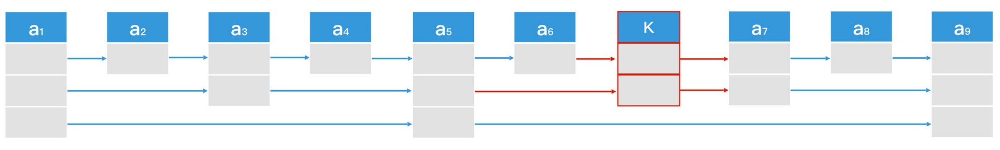

假设我们通过跳表的检索已经确认了，k 应该插入到 a6和 a7两个节点之间。那接下来，我们要先为新节点随机生成一个层数。假设生成的层数为 2，那我们就要修改第 0 层和第 1 层的指针关系。对于第 0 层的链表，k 需要插入到 a6和 a7之间，我们只需要修改 a6和 a7的第 0 层指针；对于第 1 层的链表，k 需要插入到 a5和 a7之间，我们只需要修改 a5和 a7的第 1 层指针。这样，我们就完成了将 k 插入到跳表中的动作。

通过这样一种方式，我们可以大大减少修改指针的代价。当然，由于新加入节点的层数是随机生成的，因此在节点数目较少的情况下，如果指针分布的不合理，检索性能依然可能不高。但是当节点数较多的时候，指针会趋向均匀分布，查找空间会比较平衡，检索性能会趋向于理想跳表的检索效率，接近 O(log n)。

因此，相比于复杂的平衡二叉检索树，如红黑树，跳表用一种更简单的方式实现了检索空间的平衡。并且，由于跳表保持了链表顺序遍历的能力，在需要遍历功能的场景中，跳表会比红黑树用起来更方便。这也就是为什么，在 Redis 这样的系统中，我们经常会利用跳表来代替红黑树作为底层的数据结构。

## 总结

首先，对于数据频繁变化的应用场景，有序数组并不是最适合的解决方案。我们一般要考虑采用非连续存储的数据结构来灵活调整。同时，为了提高检索效率，我们还要采取合理的组织方式，让这些非连续存储的数据结构能够使用二分查找算法。

数据组织的方式有两种，一种是二叉检索树。一个平衡的二叉检索树使用二分查找的检索效率是 O(log n)，但如果我们不做额外的平衡控制的话，二叉检索树的检索性能最差会退化到 O(n)，也就和单链表一样了。所以，AVL 树和红黑树这样平衡性更强的二叉检索树，在实际工作中应用更多。

除了树结构以外，另一种数据组织方式是跳表。跳表也具备二分查找的能力，理想跳表的检索效率是 O(log n)。为了保证跳表的检索空间平衡，跳表为每个节点随机生成层级，这样的实现方式比 AVL 树和红黑树更简单。

无论是二叉检索树还是跳表，它们都是通过将数据进行合理组织，然后尽可能地平衡划分检索空间，使得我们能采用二分查找的思路快速地缩减查找范围，达到 O(log n) 的检索效率。

除此之外，我们还能发现，当我们从实际问题出发，去思考每个数据结构的特点以及解决方案时，我们就会更好地理解一些高级数据结构和算法的来龙去脉，从而达到更深入地理解和吸收知识的目的。并且，这种思考方式，会在不知不觉中提升你的设计能力以及解决问题的能力。

## 问题

> 1、二叉检索树和跳表都能做到 O(log n) 的查询时间代价，还拥有灵活的调整能力，并且调整代价也是 O(log n)（包括了寻找插入位置的时间代价）。而有序数组的查询时间代价也是 O(log n)，调整代价是 O(n)，那这是不是意味着二叉检索树或者跳表可以用来替代有序数组呢？有序数组自己的优势又是什么呢？

由于有内存局部性原理，数组的查询效率是高于树和跳表的。甚至在小数据的情况下，都有可能数组的移动代价也不高（可用内存拷贝）。还有，数组还有范围查找能力更强的特点。

在内存空间之外，你说到了很重要的两点:
- 1.小数据范围下，跳表性能没有数组稳定。
- 2.考虑内存局部性原理，数组实际查询效率更高。

此外还有一点，考虑到范围查找需求，数据的处理效率会更高（内存拷贝+内存局部性原理）

> 2、为何使用一个随机的层级？

随机的层级，是用概率的思路来解决跳表指针平衡分布的问题。我可以换一种角度再描述一下。你可以按我的描述，在纸上将图画出来，看看是否会好理解:

- 假设我们有m个节点，由于随机函数是（1/2）^n，因此，每个节点有第0层的概率是1，也就是说，所有的节点都有一个指向下一个节点的指针。（试着画出来）

- 而节点拥有第1层的概率，变成了1/2，也就是只有一半的随机节点会有第1层，那么这一半的节点就会连起来。（试着画出来）

- 在这一半的节点中，拥有第3层的节点数，又是随机的一半。（试着画出来）

你会看到，通过一个简单的随机函数，就能完成跳表的平衡分布指针的目的。

> 3、K节点插入的细节问题

- 1.跳表本身已经有了许多指针，因此如果用双链表的方式实现的话，指针数会翻倍。不合适。因此，跳表是单向的，没有pre指针。

- 2.对于单链表的插入，我们的具体实现是给单链表加上一个头节点，然后寻找插入位置的“pre节点”来完成操作。跳表也是一样，有一个头节点。头节点的level，是所以节点中level的最大值。从头节点开始，每个level的指针链接，可以看做多个独立的单链表。（你可以画出来看看）

- 3.插入新节点的时候，核心思路是“寻找每个level的pre节点”。以我文章中插入k的例子来说，我们是怎么寻找到它的插入位置的？我们是先用第2层的指针进行遍历，发现k应该在a5到a9之间。于是，k的第2层的pre节点是a5！把a5记下来！（pre_node[2]=a5；）
然后，接下来，我们会用第1层的指针去遍历，这时候，会发现k在a5和a7之间。于是，k的第1层的pre节点是a5！！（pre_node[1]=a5；）
最后，用第0层的指针遍历，发现k在a6和a7之间，于是，k的第0层的pre节点是a6！！（pre_node[0]=a6；）
下一步，就把每一层的pre node和k的对应层连起来就好了。

- 4.一个有意思的场景，k有小概率生成4层指针，甚至5层指针，如果超出了之前所有节点的level，那么头节点就会扩展自己的level，低层level处理不变。新增的高层level直接连到k上。你会发现，随机level这个方法，完全基于概率，不用去考虑当前跳表中有多少个节点，这也是很巧妙的一点。

其实跳表插入新元素有三个步骤，分别是:
- 1.随机生成层数
- 2.寻找插入位置
- 3.将每一层和前后节点连接，完成插入
其中的前两步是独立的，先做哪个都行。但第三步依赖于前两步的完成才能完成，因此“为什么不直接插入”这个问题，其实做完前两步就可以直接插入了。

> 4、就是对于二叉搜索树而言，如果插入的节点重复了怎么办呢？因为我觉得这个问题虽然在例子中很好解决，如果重复的话，直接放弃插入就是了，但是对于真实的场景又该如何解决呢？希望老师解答。

二叉检索树如何处理重复节点?如果你注意看我原文，我写了“右子树所有节点的值都大于等于根节点”。因此，二叉检索树是允许插入重复节点的。它的插入逻辑是“放在以该节点为根，右子树的最左节点的位置”。其实所谓“右子树的最左节点的位置”，其实拉直成链表来看，就是紧邻这个元素的后一个位置。

> 5、skiplist paper 为0.25为最优

你提到了很好的一个补充知识点！在跳表的论文中，有做实验提到，在random level的实际实现中，将1/2改为1/4，会有一定的检索效率提升。而且空间利用率也会更好。

# 03 | 哈希检索：如何根据用户ID快速查询用户信息？

不管是有序数组、二叉检索树还是跳表，它们的检索效率都是 O(log n)。那有没有更高效的检索方案呢？也就是说，有没有能实现 O(1) 级别的查询方案呢？

## 1、使用 Hash 函数将 Key 转换为数组下标

数组具有随机访问的特性。我们能否利用数组的随机访问特性来实现呢？

这种将对象转为有限范围的正整数的表示方法，就叫作 Hash，翻译过来叫散列，也可以直接音译为哈希。而我们常说的 Hash 函数就是指具体转换方法的函数。我们将对象进行 Hash，用得到的 Hash 值作为数组下标，将对应元素存在数组中。这个数组就叫作哈希表。这样我们就可以利用数组的随机访问特性，达到 O(1) 级别的查询性能。

说到这里，你可能会有疑问了，Hash 函数真的这么神奇吗？如果两个对象的哈希值是相同的怎么办？事实上，任何 Hash 函数都有可能造成对象不同，但 Hash 值相同的冲突。而且，数组空间是有限的，只要被 Hash 的元素个数大于数组上限，就一定会产生冲突。

对于哈希冲突这个问题，我们有两类解决方案: 一类是构造尽可能理想的 Hash 函数，使得 Hash 以后得到的数值尽可能平均分布，从而减少冲突发生的概率；另一类是在冲突发生以后，通过“提供冲突解决方案”来完成存储和查找。最常用的两种冲突解决方案是“开放寻址法”和“链表法”。

## 2、如何利用开放寻址法解决 Hash 冲突？

所谓“开放寻址法”，就是在冲突发生以后，最新的元素需要寻找新空闲的数组位置完成插入。那我们该如何寻找新空闲的位置呢？我们可以使用一种叫作“线性探查”（Linear Probing）的方案来进行查找。

“线性探查”的插入逻辑很简单：在当前位置发现有冲突以后，就顺序去查看数组的下一个位置，看看是否空闲。如果有空闲，就插入；如果不是空闲，再顺序去看下一个位置，直到找到空闲位置插入为止。

查询逻辑也和插入逻辑相似。我们先根据 Hash 值去查找相应数组下标的元素，如果该位置不为空，但是存储元素的 Key 和查询的 Key 不一致，那就顺序到数组下一个位置去检索，就这样依次比较 Key。如果访问元素的 Key 和查询 Key 相等，我们就在哈希表中找到了对应元素；如果遍历到空闲处，依然没有元素的 Key 和查询 Key 相等，则说明哈希表中不存在该元素。

假设一个哈希表中已经插入了两个 Key，key1 和 key2。其中 Hash(key1) = 1, Hash(key2) = 2。这时，如果我们要插入一个 Hash 值为 1 的 key3。根据线性探查的插入逻辑，通过 3 步，我们就可以将 key3 插入到哈希表下标为 3 的位置中。插入的过程如下：

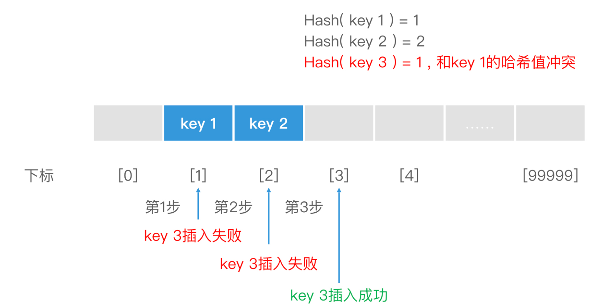

在查找 key3 的时候，因为 Hash（key3）= 1，我们会从哈希表下标为 1 的位置开始顺序查找，经过 3 步找到 key3，查询结束。

讲到这里，你可能已经发现了一个问题：当我们插入一个 Key 时，如果哈希表已经比较满了，这个 Key 就会沿着数组一直顺序遍历，直到遇到空位置才会成功插入。查询的时候也一样。但是，顺序遍历的代价是 O(n)，这样的检索性能很差。更糟糕的是，如果我们在插入 key1 后，先插入 key3 再插入 key2，那 key3 就会抢占 key2 的位置，影响 key2 的插入和查询效率。因此，**“线性探查”会影响哈希表的整体性能，而不只是 Hash 值冲突的 Key**。

为了解决这个问题，我们可以使用“二次探查”（Quadratic Probing）和“双散列”（Double Hash）这两个方法进行优化。下面，我来分别解释一下这两个方法的优化原理。

二次探查就是将线性探查的步长从 i 改为 i^2：第一次探查，位置为 Hash(key) + 1^2；第二次探查，位置为 Hash(key) +2^2；第三次探查，位置为 Hash(key) + 3^2，依此类推。

双散列就是使用多个 Hash 函数来求下标位置，当第一个 Hash 函数求出来的位置冲突时，启用第二个 Hash 函数，算出第二次探查的位置；如果还冲突，则启用第三个 Hash 函数，算出第三次探查的位置，依此类推。

无论是二次探查还是双散列，核心思路其实都是在发生冲突的情况下，将下个位置尽可能地岔开，让数据尽可能地随机分散存储，来降低对不相干 Key 的干扰，从而提高整体的检索效率。

但是，对于开放寻址法来说，无论使用什么优化方案，随着插入的元素越多、哈希表越满，插入和检索的性能也就下降得越厉害。在极端情况下，当哈希表被写满的时候，为了保证能插入新元素，我们只能重新生成一个更大的哈希表，将旧哈希表中的所有数据重新 Hash 一次写入新的哈希表，也就是 Re-Hash，这样会造成非常大的额外开销。因此，在数据动态变化的场景下，使用开放寻址法并不是最合适的方案。

## 3、如何利用链表法解决 Hash 冲突？

相比开放寻址法，还有一种更常见的冲突解决方案，链表法。所谓“链表法”，就是在数组中不存储一个具体元素，而是存储一个链表头。如果一个 Key 经过 Hash 函数计算，得到了对应的数组下标，那么我们就将它加入该位置所存的链表的尾部。这样做的好处是，如果 key3 和 key1 发生了冲突，那么 key3 会通过链表的方式链接在 key1 的后面，而不是去占据 key2 的位置。这样当 key2 插入时，就不会有冲突了。最终效果如下图。

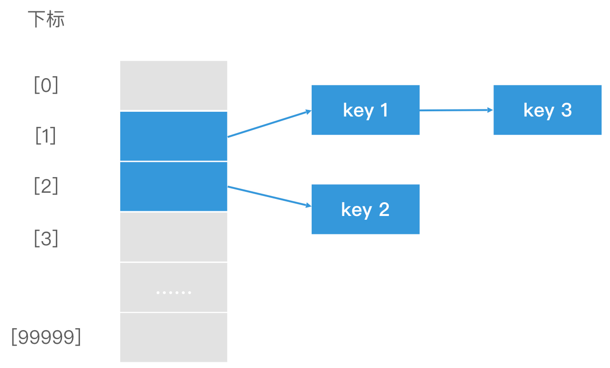

讲到这里，你可能已经发现了，其实链表法就是将我们前面讲过的数组和链表进行结合，既利用了数组的随机访问特性，又利用了链表的动态修改特性，同时提供了快速查询和动态修改的能力。想要查询时，我们会先根据查询 Key 的 Hash 值，去查找相应数组下标的链表。如果链表为空，则表示不存在该元素；如果链表不为空，则遍历链表，直到找到 Key 相等的对应元素为止。

但是，如果链表很长，遍历代价还是会很高。那我们有没有更好的检索方案呢？你可以回想一下，在上一讲中我们就是用二叉检索树或跳表代替链表，来提高检索效率的。

实际上，在 JDK1.8 之后，Java 中 HashMap 的实现就是在链表到了一定的长度时，将它转为红黑树；而当红黑树中的节点低于一定阈值时，就将它退化为链表。

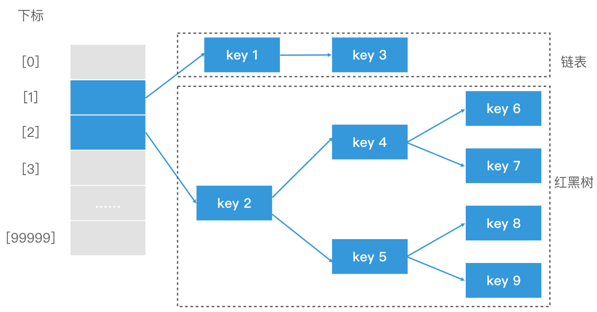

- 第一个阶段，通过 Hash 函数将要查询的 Key 转为数组下标，去查询对应的位置。这个阶段的查询代价是 O(1) 级别。

- 第二阶段，将数组下标所存的链表头或树根取出。如果是链表，就使用遍历的方式查找，这部分查询的时间代价是 O(n)。由于链表长度是有上限的，因此实际开销并不会很大，可以视为常数级别时间。如果是红黑树，则用二分查找的方式去查询，时间代价是 O(log n)。如果哈希表中冲突的元素不多，那么落入红黑树的数据规模也不会太大，红黑树中的检索代价也可以视为常数级别时间。

## 4、哈希表有什么缺点？

哈希表既有接近 O(1) 的检索效率，又能支持动态数据的场景，看起来非常好，那是不是在任何场景下，我们都可以用它来代替有序数组和二叉检索树呢？答案是否定的。前面我们说了这么多哈希表的优点，下面我们就来讲讲它的缺点。

- 首先，哈希表接近 O(1) 的检索效率是有前提条件的，就是哈希表要足够大和有足够的空闲位置，否则就会非常容易发生冲突。我们一般用装载因子（load factor）来表示哈希表的填充率。装载因子 = 哈希表中元素个数 / 哈希表的长度。如果频繁发生冲突，大部分的数据会被持续地添加到链表或二叉检索树中，检索也会发生在链表或者二叉检索树中，这样检索效率就会退化。因此，为了保证哈希表的检索效率，我们需要预估哈希表中的数据量，提前生成足够大的哈希表。按经验来说，我们一般要预留一半以上的空闲位置，哈希表才会有足够优秀的检索效率。这就让哈希表和有序数组、二叉检索树相比，需要的存储空间更多了。

- 另一方面，尽管哈希表使用 Hash 值直接进行下标访问，带来了 O(1) 级别的查询能力，但是也失去了“有序存储”这个特点。因此，如果我们的查询场景需要遍历数据，或者需要进行范围查询，那么哈希表本身是没有什么加速办法的。比如说，如果我们在一个很大的哈希表中存储了少数的几个元素，为了知道存储了哪些元素，我们只能从哈希表的第一个位置开始遍历，直到结尾，这样性能并不好。

备注：简单来说就是不支持范围查询；存储需要更多的空间。

## 总结

哈希表的本质是一个数组，它通过 Hash 函数将查询的 Key 转为数组下标，利用数组的随机访问特性，使得我们能在 O(1) 的时间代价内完成检索。

尽管哈希检索没有使用二分查找，但无论是设计理想的哈希函数，还是保证哈希表有足够的空闲位置，包括解决冲突的“二次探查”和“双散列”方案，本质上都是希望数据插入哈希表的时候，分布能均衡，这样检索才能更高效。从这个角度来看，其实哈希检索提高检索效率的原理，和二叉检索树需要平衡左右子树深度的原理是一样的，也就是说，高效的检索需要均匀划分检索空间。

另一方面，你会看到，复杂的数据结构和检索算法其实都是由最基础的数据结构和算法组成的。比如说 JDK1.8 中哈希表的实现，就是使用了数组、链表、红黑树这三种数据结构和相应的检索算法。因此，对于这些基础的数据结构，我们需要深刻地理解它们的检索原理和适用场景，这也为我们未来学习更复杂的系统打下了扎实的基础。

## 问题

> 1、假设一个哈希表是使用开放寻址法实现的，如果我们需要删除其中一个元素，可以直接删除吗？为什么呢？如果这个哈希表是使用链表法实现的会有不同吗？如果开放寻址法是采用的二次探查或者双重散列解决冲突，可以直接删除嘛？

链表法可以直接删除，开放寻址法不行。开放寻址法在 hash 冲突后会继续往后面看，如果为空，就放到后面，这样会存在连续的几个值的 hash 值都相同的情况，但如果想删除的数据在中间的话，就会影响对后面数据的查询了。可以增加一个删除标识，这种添加删除标识的在数据库中也常用。

不能直接删除的问题在于，直接删除会把探查序列中断。举个例子:有三个元素a，b，c的hash值是冲突的，那么探查序列会把他们放在三个位置上，比如1，2，3（探查序列是123），如果我们把b删了，那么2这个位置就空了。这时候，要查询c，探查序列就会在2的位置中断，查不到c。

Java的ThreadLocal用来存储线程隔离的本地变量，其中有个ThreadLocalMap散列结构，内部解决散列冲突的策略就是开放寻址法。为什么它会这么淡定使用呢，个人理解还是因为它的使用场景相对简单，一般往ThreadLocal中存放的数据量不大，使用开放寻址而不是链表法，节省了链表的指针开销，而且兼顾了效率，ThreadLocalMap的场景非常契合开放寻址的优点。

一般来说，哈希表是不允许插入重复的key的，会覆盖。不过也有改造的支持重复key的哈希表，如multiHashMap。

关于多个哈希函数的问题，其实有两个哈希函数就可以生成多个不相关的哈希函数。假设有两个哈希函数f1和f2，那么f3=f1+2*f2，f4=f1+3*f2，以此类推。因此，双散列的具体公式应该是h(key，i) =( h1(key) + i*h2(key) ) % 数组长度

# 04 | 状态检索：如何快速判断一个用户是否存在？

在实际工作中，我们经常需要判断一个对象是否存在。比如说，在注册新用户时，我们需要先快速判断这个用户 ID 是否被注册过；再比如说，在爬虫系统抓取网页之前，我们要判断一个 URL 是否已经被抓取过，从而避免无谓的、重复的抓取工作。那么，对于这一类是否存在的状态检索需求，如果直接使用我们之前学习过的检索技术，有序数组、二叉检索树以及哈希表来实现的话，它们的检索性能如何呢？是否还有优化的方案呢？

## 1、如何使用数组的随机访问特性提高查询效率？

以注册新用户时查询用户 ID 是否存在为例，我们可以直接使用有序数组、二叉检索树或者哈希表来存储所有的用户 ID。我们知道，无论是有序数组还是二叉检索树，它们都是使用二分查找的思想从中间元素开始查起的。所以，在查询用户 ID 是否存在时，它们的平均检索时间代价都是 O(log n)，而哈希表的平均检索时间代价是 O(1)。因此，如果我们希望能快速查询出元素是否存在，那哈希表无疑是最合适的选择。不过，如果从工程实现的角度来看的话，哈希表的查询过程还是可以优化的。比如说，如果我们要查询的对象 ID 本身是正整数类型，而且 ID 范围有上限的话。我们就可以申请一个足够大的数组，让数组的长度超过 ID 的上限。然后，把数组中所有位置的值都初始化为 0。对于存在的用户，我们直接将用户 ID 的值作为数组下标，将该位置的值从 0 设为 1 就可以了。这种情况下，当我们查询一个用户 ID 是否存在时，会直接以该 ID 为数组下标去访问数组，如果该位置为 1，说明该 ID 存在；如果为 0，就说明该 ID 不存在。和哈希表的查找流程相比，这个流程就节省了计算哈希值得到数组下标的环节，并且直接利用数组随机访问的特性，在 O(1) 的时间内就能判断出元素是否存在，查询效率是最高的。但是，直接使用 ID 作为数组下标会有一个问题：如果 ID 的范围比较广，比如说在 10 万之内，那我们就需要保证数组的长度大于 10 万。所以，这种方案的占用空间会很大。

而且，如果这个数组是一个 int 32 类型的整型数组，那么每个元素就会占据 4 个字节，用 4 个字节来存储 0 和 1 会是一个巨大的空间浪费。那我们该如何优化呢？

## 2、如何使用位图来减少存储空间？

最直观的一个想法就是，使用最少字节的类型来定义数组。比如说，使用 1 个字节的 char 类型数组，或者使用 bool 类型的数组（在许多系统中，一个 bool 类型的元素也是 1 个字节）。它们和 4 个字节的 int 32 数组相比，空间使用效率提升了 4 倍，这已经算是不错的改善了。但是，使用 char 类型的数组，依然是一个非常“浪费空间”的方案。因为表示 0 或者 1，理论上只需要一个 bit。所以，如果我们能以 bit 为单位来构建这个数组，那使用空间就是 int 32 数组的 1/32，从而大幅减少了存储使用的内存空间。这种以 bit 为单位构建数组的方案，就叫作 Bitmap，翻译为位图。

位图的优势非常明显，但许多系统中并没有以 bit 为单位的数据类型。因此，我们往往需要对其他类型的数组进行一些转换设计，使其能对相应的 bit 位的位置进行访问，从而实现位图。

我们以 char 类型的数组为例子。假设我们申请了一个 1000 个元素的 char 类型数组，每个 char 元素有 8 个 bit，如果一个 bit 表示一个用户，那么 1000 个元素的 char 类型数组就能表示 8*1000 = 8000 个用户。如果一个用户的 ID 是 11，那么位图中的第 11 个 bit 就表示这个用户是否存在的信息。

这种情况下，我们怎么才能快速访问到第 11 个 bit 呢？

首先，数组是以 char 类型的元素为一个单位的，因此，我们的第一步，就是要找到第 11 个 bit 在数组的第几个元素里。具体的计算过程：一个元素占 8 个 bit，我们用 11 除以 8，得到的结果是 1，余数是 3。这就代表着，第 11 个 bit 存在于第 2 个元素里，并且在第 2 个元素里的位置是第 3 个。

对于第 2 个元素的访问，我们直接使用数组下标[1]就可以在 O(1) 的时间内访问到。对于第 2 个元素中的第 3 个 bit 的访问，我们可以通过位运算，先构造一个二进制为 00100000 的字节（字节的第 3 位为 1），然后和第 2 个元素做 and 运算，就能得知该元素的第 3 位是 1 还是 0。这也是一个时间代价为 O(1) 的操作。这样一来，通过两次 O(1) 时间代价的查找，我们就可以知道第 11 个 bit 的值是 0 还是 1 了。

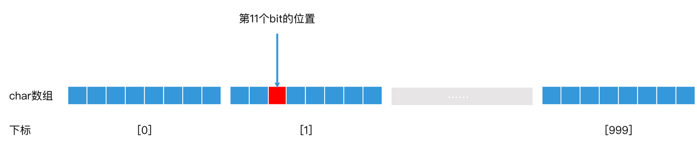

尽管位图相对于原始数组来说，在元素存储上已经有了很大的优化，但如果我们还想进一步优化存储空间，是否还有其他的优化方案呢？我们知道，一个数组所占的空间其实就是“数组元素个数 * 每个元素大小”。我们已经将每个元素大小压缩到了最小单位 1 个 bit，如果还要进行优化，那么自然会想到优化“数组元素个数”。

没错，限制数组的长度是一个可行的方案。不过前面我们也说了，数组长度必须大于 ID 的上限。因此，如果我们希望将数组长度压缩到一个足够小的值之内，我们就需要使用哈希函数将大于数组长度的用户 ID，转换为一个小于数组长度的数值作为下标。除此以外，使用哈希函数也带来了另一个优点，那就是我们不需要把用户 ID 限制为正整数了，它也可以是字符串。这样一来，压缩数组长度，并使用哈希函数，就是一个更加通用的解决方案。但是我们也知道，数组压缩得越小，发生哈希冲突的可能性就会越大，如果两个元素 A 和 B 的哈希值冲突了，映射到了同一个位置。那么，如果我们查询 A 时，该位置的结果为 1，其实并不能说明元素 A 一定存在。因此，如何在数组压缩的情况下缓解哈希冲突，保证一定的查询正确率，是我们面临的主要问题。

在第 3 讲中，我们讲了哈希表解决哈希冲突的两种常用方法：开放寻址法和链表法。开放寻址法中有一个优化方案叫“双散列”，它的原理是使用多个哈希函数来解决冲突问题。我们能否借鉴这个思想，在位图的场景下使用多个哈希函数来降低冲突概率呢？没错，这其实就是布隆过滤器（Bloom Filter）的设计思想。

布隆过滤器最大的特点，就是对一个对象使用多个哈希函数。如果我们使用了 k 个哈希函数，就会得到 k 个哈希值，也就是 k 个下标，我们会把数组中对应下标位置的值都置为 1。布隆过滤器和位图最大的区别就在于，我们不再使用一位来表示一个对象，而是使用 k 位来表示一个对象。这样两个对象的 k 位都相同的概率就会大大降低，从而能够解决哈希冲突的问题了。

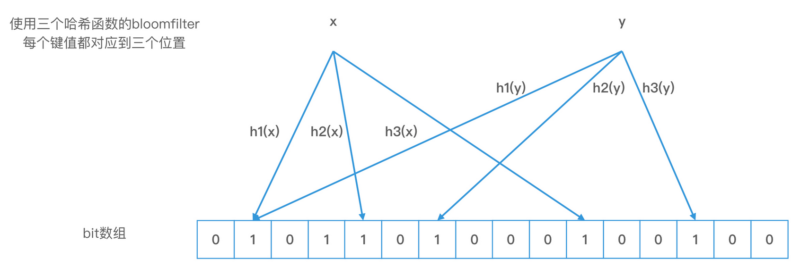

但是，布隆过滤器的查询有一个特点，就是即使任何两个元素的哈希值不冲突，而且我们查询对象的 k 个位置的值都是 1，查询结果为存在，这个结果也可能是错误的。这就叫作布隆过滤器的错误率。

我在下图给出了一个例子。我们可以看到，布隆过滤器中存储了 x 和 y 两个对象，它们对应的 bit 位被置为 1。当我们查询一个不存在的对象 z 时，如果 z 的 k 个哈希值的对应位置的值正好都是 1，z 就会被错误地认定为存在。而且，这个时候，z 和 x，以及 z 和 y，两两之间也并没有发生哈希冲突。

那遇到“可能存在”这样的情况，我们该怎么办呢？不要忘了我们的使用场景：我们希望用更小的代价快速判断 ID 是否已经被注册了。在这个使用场景中，就算我们无法确认 ID 是否已经被注册了，让用户再换一个 ID 注册，这也不会损害新用户的体验。在系统不要求结果 100% 准确的情况下，我们可以直接当作这个用户 ID 已经被注册了就可以了。这样，我们使用布隆过滤器就可以快速完成“是否存在”的检索。

除此之外，对于布隆过滤器而言，如果哈希函数的个数不合理，比如哈希函数特别多，布隆过滤器的错误率就会变大。因此，除了使用多个哈希函数避免哈希冲突以外，我们还要控制布隆过滤器中哈希函数的个数。有这样一个计算最优哈希函数个数的数学公式: 哈希函数个数 k = (m/n) * ln(2)。其中 m 为 bit 数组长度，n 为要存入的对象的个数。实际上，如果哈希函数个数为 1，且数组长度足够，布隆过滤器就可以退化成一个位图。所以，我们可以认为“位图是只有一个特殊的哈希函数，且没有被压缩长度的布隆过滤器”。

## 总结

今天，我们主要解决了快速判断一个对象是否存在的问题。相比于有序数组、二叉检索树和哈希表这三种方案，位图和布隆过滤器其实更适合解决这类状态检索的问题。这是因为，在不要求 100% 判断正确的情况下，使用位图和布隆过滤器可以达到 O(1) 时间代价的检索效率，同时空间使用率也非常高效。

虽然位图和布隆过滤器的原理和实现都非常简单，但是在许多复杂的大型系统中都可以见到它们的身影。比如，存储系统中的数据是存储在磁盘中的，而磁盘中的检索效率非常低，因此，我们往往会先使用内存中的布隆过滤器来快速判断数据是否存在，不存在就直接返回，只有可能存在才会去磁盘检索，这样就避免了为无效数据读取磁盘的额外开销。

再比如，在搜索引擎中，我们也需要使用布隆过滤器快速判断网站是否已经被抓取过，如果一定不存在，我们就直接去抓取；如果可能存在，那我们可以根据需要，直接放弃抓取或者再次确认是否需要抓取。你会发现，这种快速预判断的思想，也是提高应用整体检索性能的一种常见设计思路。

## 问题

> 1、如果位图中一个元素被删除了，我们可以将对应 bit 位置为 0。但如果布隆过滤器中一个元素被删除了，我们直接将对应的 k 个 bit 位置为 0，会产生什么样的问题呢？为什么？

1.对于布隆过滤器的删除问题，的确无法直接删除。但也有带引用计数的布隆过滤器，存的不是0，1，而是一个计数。其实所有的设计都是trade off。应该视具体使用场景而定。比如一个带4个bit位计数器的布隆过滤器，相比于哈希表依然有优势。

2.布隆过滤器是否省空间，要看怎么比较。

布隆过滤器 vs 原始位图:

原始位图要存一个int 32的数，就要先准备好512m（2的32次方=4G，然后除以8=512M）的空间的长数组。布隆过滤器不用这么长的数组，因此比原始位图省空间。

布隆过滤器 vs 哈希表:

假设布隆过滤器数组长度和哈希表一样。但是哈希表存的是一个int 32，而布隆过滤器存的是一个bit，因此比同样长度的哈希表省空间。当然，如果哈希表也改为只存一个bit的数组，那么他们的大小是一样的。这时候就是你说的多个哈希函数的作用场景了。其实，你会发现，只存一个bit的哈希表，其实也可以看做是只有一个哈希函数的布隆过滤器。很多时候，布隆过滤器，哈希表，还有位图，它们的边界是模糊的。我们最重要的是了解清楚他们的特点，知道在什么场景用哪种结构就好了。

3.roaring bitmap是一个优秀的设计。我也说一下它和布隆过滤器的差异:

布隆过滤器 vs roaring bitmap:

所有的设计都是trade off。roaring bitmap尽管压缩率很高，还支持精准查找，但是它放弃的是速度。高16位是采用二分查找，array container也是二分查找。因此，在这一点上布隆过滤器是有优势的。此外，它还不能保证压缩空间，它的空间会随着元素增多而变大，极端情况下恢复回bitmap。而布隆过滤器保持了高效的查找能力和空间控制能力，但是放弃了精准查找能力，精准度会随着元素增多而下降。因此，尽管都是对bitmap进行压缩，但是两者的设计思路不一样，使用场景也不同。在不要求精准，但是要求快速和省空间的场景下，布隆过滤器是不错的选择。

其实哈希表，位图，布隆过滤器的边界很模糊，可以相互转换。

布隆过滤器和和哈希表相比，有两个区别，一个是每个位置存储的是一个bit，不是一个具体value；另一个是同时使用k个哈希函数。

但如果我们将布隆过滤器和哈希表都改一下，比如说布隆过滤器的k取值为1，然后哈希表也不存具体value，而是存一个bit表示元素是否存在，那么它们就是完全一样了。你说这样的数据结构是叫做哈希表好?还是叫做布隆过滤器好?因此，只要你能明白它们各自的特点，能在合适的场景使用合适的方案就好了。

> 2、为什么允许布隆过滤器的错误率，而不能容许允许哈希冲突呢

其实哈希冲突也是一种错误率，而且是大家都很好理解的错误率。你可以这么想:一个只有一个哈希函数的布隆过滤器，由于存在哈希冲突，a和b的hash值相同，那么如果系统中存着a，但是我们查询b的时候，查询到的结果是“存在”。那这不就是错误率了么？

之所以要强调布隆过滤器的“错误率”，是因为即使哈希值不冲突，依然结果会有错，这个是布隆过滤器的特点。我文中x，y，z的例子就是一个说明。

> 3、如何根据用户数量来确定bitmap或者bloomfilter的bit数组的大小呢？

如果是原始位图，假设id是int 32，如果你不清楚数值分布范围，那么只能覆盖所有int 32的取值区间。这时候的位图大小是512m。

如果是布隆过滤器，你需要预估你的用户数量，

此外，还要设置一个你能接受的错误率p，使用这个公式:m =－n ln p / （ln 2）^2 ，可以算出来bit 位数组m的大小。

总结
- bitmap和bloomfilter都是为了判断状态存在的。
- bitmap只有一个位置用来判断状态
- bloomfilter有多个位置用来判断状态
- 针对bloomfilter来说若果不所在一定不存在，存在不一定存在(因为hash冲突，可能是另外的元素状态)

# 05 | 倒排索引：如何从海量数据中查询同时带有“极”和“客”的唐诗？

试想这样一个场景：假设你已经熟读唐诗 300 首了。这个时候，如果我给你一首诗的题目，你可以马上背出这首诗的内容吗？相信你一定可以的。但是如果我问你，有哪些诗中同时包含了“极”字和“客”字？你就不见得能立刻回答出来了。你需要在头脑中一首诗一首诗地回忆，并判断每一首诗的内容是否同时包含了“极”字和“客”字。很显然，第二个问题的难度比第一个问题大得多。那从程序设计的角度来看，这两个问题对应的检索过程又有什么不同呢？今天，我们就一起来聊一聊，两个非常常见又非常重要的检索技术：正排索引和倒排索引。

## 1、什么是倒排索引？

我们先来看比较简单的那个问题：给出一首诗的题目，马上背出内容。这其实就是一个典型的键值查询场景。针对这个场景，我们可以给每首诗一个唯一的编号作为 ID，然后使用哈希表将诗的 ID 作为键（Key），把诗的内容作为键对应的值（Value）。这样，我们就能在 O(1) 的时间代价内，完成对指定 key 的检索。这样一个以对象的唯一 ID 为 key 的哈希索引结构，叫作正排索引（Forward Index）。

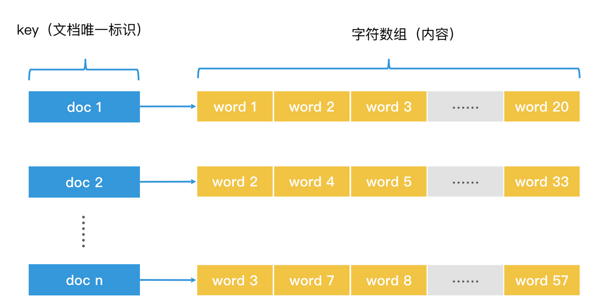

一般来说，我们会遍历哈希表，遍历的时间代价是 O(n)。在遍历过程中，对于遇到的每一个元素也就是每一首诗，我们需要遍历这首诗中的每一个字符，才能判断是否包含“极”字和“客”字。假设每首诗的平均长度是 k，那遍历一首诗的时间代价就是 O(k)。从这个分析中我们可以发现，这个检索过程全部都是遍历，因此时间代价非常高。对此，有什么优化方法吗？

我们先来分析一下这两个场景。我们会发现，“根据题目查找内容”和“根据关键字查找题目”，这两个问题其实是完全相反的。既然完全相反，那我们能否“反着”建立一个哈希表来帮助我们查找呢？也就是说，如果我们以关键字作为 key 建立哈希表，是不是问题就解决了呢？接下来，我们就试着操作一下。

我们将每个关键字当作 key，将包含了这个关键字的诗的列表当作存储的内容。这样，我们就建立了一个哈希表，根据关键字来查询这个哈希表，在 O(1) 的时间内，我们就能得到包含该关键字的文档列表。这种根据具体内容或属性反过来索引文档标题的结构，我们就叫它倒排索引（Inverted Index）。在倒排索引中，key 的集合叫作字典（Dictionary），一个 key 后面对应的记录集合叫作记录列表（Posting List）。

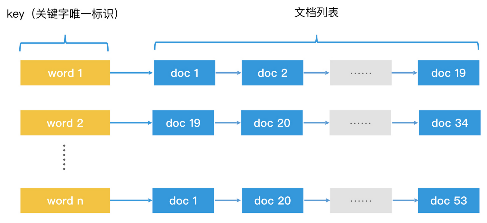

## 2、如何创建倒排索索引？

前面我们介绍了倒排索引的概念，那创建一个倒排索引的过程究竟是怎样的呢？我把这个过程总结成了以下步骤。

- 1、给每个文档编号，作为其唯一的标识，并且排好序，然后开始遍历文档（为什么要先排序，然后再遍历文档呢？你可以先想一下，后面我们会解释）。

- 2、解析当前文档中的每个关键字，生成 < 关键字，文档 ID，关键字位置 > 这样的数据对。为什么要记录关键字位置这个信息呢？因为在许多检索场景中，都需要显示关键字前后的内容，比如，在组合查询时，我们要判断多个关键字之间是否足够近。所以我们需要记录位置信息，以方便提取相应关键字的位置。

- 3、将关键字作为 key 插入哈希表。如果哈希表中已经有这个 key 了，我们就在对应的 posting list 后面追加节点，记录该文档 ID（关键字的位置信息如果需要，也可以一并记录在节点中）；如果哈希表中还没有这个 key，我们就直接插入该 key，并创建 posting list 和对应节点。

- 4、重复第 2 步和第 3 步，处理完所有文档，完成倒排索引的创建。

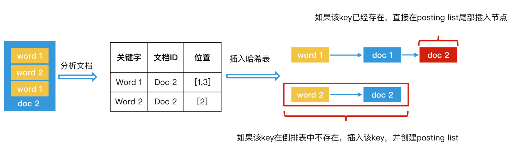

## 3、如何查询同时含有“极”字和“客”字两个 key 的文档？

如果只是查询包含“极”或者“客”这样单个字的文档，我们直接以查询的字作为 key 去倒排索引表中检索，得到的 posting list 就是结果了。但是，如果我们的目的是要查询同时包含“极”和“客”这两个字的文档，那我们该如何操作呢？

我们可以先分别用两个 key 去倒排索引中检索，这样会得到两个不同的 posting list：A 和 B。A 中的文档都包含了“极”字，B 中文档都包含了“客”字。那么，如果一个文档既出现在 A 中，又出现在 B 中，它是不是就同时包含了这两个字呢？按照这个思路，我们只需查找出 A 和 B 的公共元素即可。

那么问题来了，我们该如何在 A 和 B 这两个链表中查找出公共元素呢？如果 A 和 B 都是无序链表，那我们只能将 A 链表和 B 链表中的每个元素分别比对一次，这个时间代价是 O(m*n)。但是，如果两个链表都是有序的，我们就可以用归并排序的方法来遍历 A 和 B 两个链表，时间代价会降低为 O(m + n)，其中 m 是链表 A 的长度，n 是链表 B 的长度。

我把链表归并的过程总结成了 3 个步骤，你可以看一看。

第 1 步，使用指针 p1 和 p2 分别指向有序链表 A 和 B 的第一个元素。

第 2 步，对比 p1 和 p2 指向的节点是否相同，这时会出现 3 种情况：

- 两者的 id 相同，说明该节点为公共元素，直接将该节点加入归并结果。然后，p1 和 p2 要同时后移，指向下一个元素；

- p1 元素的 id 小于 p2 元素的 id，p1 后移，指向 A 链表中下一个元素；

- p1 元素的 id 大于 p2 元素的 id，p2 后移，指向 B 链表中下一个元素。

第 3 步，重复第 2 步，直到 p1 或 p2 移动到链表尾为止。

为了帮助你理解，我把一个链表归并的完整例子画在了一张图中，你可以结合这张图进一步理解上面的 3 个步骤。

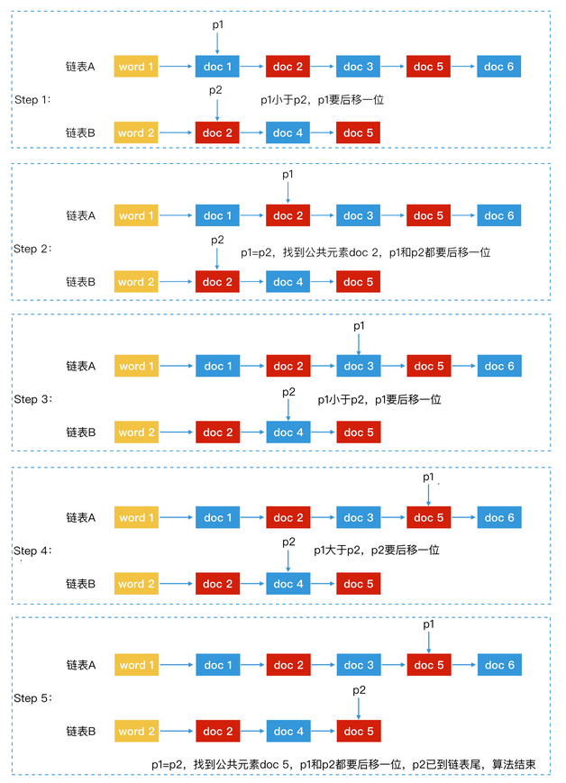

那对于两个 key 的联合查询来说，除了有“同时存在”这样的场景以外，其实还有很多联合查询的实际例子。比如说，我们可以查询包含“极”或“客”字的诗，也可以查询包含“极”且不包含“客”的诗。这些场景分别对应着集合合并中的交集、并集和差集问题。它们的具体实现方法和“同时存在”的实现方法差不多，也是通过遍历链表对比的方式来完成的。如果感兴趣的话，你可以自己来实现看看，这里我就不再多做阐述了。

此外，在实际应用中，我们可能还需要对多个 key 进行联合查询。比如说，要查询同时包含“极”“客”“时”“间”四个字的诗。这个时候，我们利用多路归并的方法，同时遍历这四个关键词对应的 posting list 即可。实现过程如下图所示。

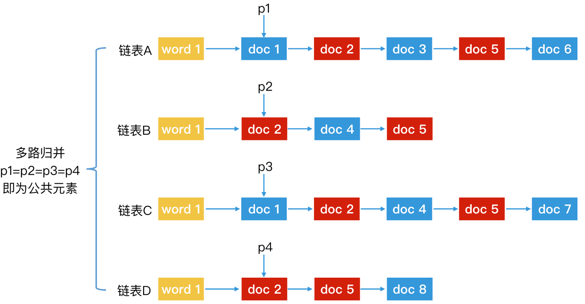

## 总结

你会发现，倒排索引的核心其实并不复杂，它的具体实现其实是哈希表，只是它不是将文档 ID 或者题目作为 key，而是反过来，通过将内容或者属性作为 key 来存储对应的文档列表，使得我们能在 O(1) 的时间代价内完成查询。

尽管原理并不复杂，但是倒排索引是许多检索引擎的核心。比如说，数据库的全文索引功能、搜索引擎的索引、广告引擎和推荐引擎，都使用了倒排索引技术来实现检索功能。

## 问题

> 1、对于一个检索系统而言，除了根据关键字查询文档，还可能有其他的查询需求。比如说，我们希望查询李白都写了哪些诗。也就是说，如何在“根据内容查询”的基础上，同时支持“根据作者查询”，我们该怎么做呢？

在关键字为key所在文档为posting list的基础上，再加以作者名为key，posting list为作者诗集的索引

> 2、老师对于邮件中敏感词检测适不适合用倒排索引那，用的话可能每个邮件都只要检测一次，不用直接搜索可能又找不到近义词

就像你说的，邮件只需要检测一次，因此对邮件做倒排索引并不适用。而且倒排索引也解决不了近义词问题。

邮件敏感词检测一般是这样的思路:
- 1.准备一个敏感词字典。
- 2.遍历邮件，提取关键词，去敏感词字典中查找，找到了就说明邮件有敏感词。

这里的核心问题是如何提取关键词和如何在敏感词字典中查询。

一种方式是用哈希表存敏感词字典，然后用分词工具从邮件中提取关键字，然后去字典中查。

另一种方式是trie树来实现敏感词字典，然后逐字扫描邮件，用当前字符在trie树中查找。
不过，这两种方式都无法解决近义词，或者各种刻意替换字符的场景。要想解决这种问题，要么提供近义词字典，要么得使用大量数据进行训练和学习，用机器学习进行打分，将可疑的高分词找出来。

其实这种近义词处理方案，和搜索引擎解决近义词和查询纠错的过程很像。我在搜索引擎那篇里面会介绍。

> 3、posting list分域有点想不明白？ 

posting list分域，就是一个元素里加上域标识。举个例子，一篇文章有标题，作者，内容三个域，而“李白”这两个字，可能出现在这三个位置。因此，key和posting list可以这么写:key =“李白” －> [id1，标题域:0，作者域:1，内容域:0]，[id2，标题域:1，作者域:0，内容域:1]

> 4、老师，我有个疑问，为了实现根据关键词获取数据的功能，是不是需要在正常的表存储的基础上，再额外维护这样一个倒排索引？那这种在关键词不明确的情况下是不是就不会有这个东西了？

你的思考很好！的确是这样的。你可以回到开头背唐诗的场景。如果只要求给题目背内容，那么是只需要正排索引就好。不需要倒排索引。

倒排索引是用在需要根据部分信息或者属性去反查出数据主体的场景中。搜索引擎就是典型的应用场景，因为我们只知道我们想找什么关键字，而不知道哪些网页有这些关键字，因此需要倒排索引。数据库也一样，很多时候，我们去数据库中查找，也不是直接找id，而是用where去限定一些属性和字段。因此，你会发现，根据我们关心的属性去寻找主体，这种需求其实很常见，这些场景就可以用倒排索引了。

> 5、在创建倒排索引的过程中、作者留下一个小问题: 为什么要先排序文档 ?我想下边的内容: 在查找两个集合公共元素的过程中, 若是无序链表, 需要遍历两个集合, 时间复杂度O(m*n); 若是有序链表, 可以归并, 时间复杂度降为 O(m+n) 就是答案了 ？

你找到答案了，这个就是为什么要提前排序的原因。一个有序的posting list，会加快求交集和并集的过程。包括在后面第十二讲中，你也会看到我们是要如何保证posting list有序来加快检索的。

当然，回到这一讲的这个问题，我也补充一点，要保证posting list有序，我们有许多方法。比如说我们也可以先不对文档排序，而是等所有的posting list都生成了以后，再对每一个posting list都单独排序。只是这样排序代价会比在最开始的时候对文档进行排序要更大。因此我们才使用提前对文档排序的方法。

> 6、老师有个当前业务上的疑问，我们有很多商品，从两个维度建立倒排索引：把商品名进行的分词 和 给商品打很多不同的标签。检索的时候，将用户查询词进行分词去命中商品名分词，用原始查询词去命中不同的标签，这种情况一般如何设计？我的理解每一种标签可以单独建立倒排索引，查询后把多个倒排链做归并，那商品名分词如何建索引？

听你的描述，你们应该是两种查询需求:标签查询和关键词查询。

对于“标签查询”，就如你所说的，以标签为key建立倒排索引即可。查询时是直接查询标签。（不过你的问题中说的是“用原始查询词去命中标签”，我的理解是你们有一个“原始查询词转为标签”的功能?）

而“关键词查询”，就是你说的“商品名分词”了。这种情况，其实就和我们今天文章中介绍的场景很像。你把商品名看做是一首唐诗就好了。具体做法是:将商品名分词，以每个词为key建立倒排索引。查询时，对于查询词分词，然后拿着每个词作为key去查询这个倒排索引，这样就能把对应的商品找出来了。

**测一测 | 检索算法基础，你掌握了多少？**

假设有一个员工管理系统，它存储了用户的 ID、姓名、所属部门等信息。如果我们需要它支持以下查询能力：

- 1.根据员工 ID 查找员工信息，并支持 ID 的范围查询；
- 2.根据姓名查询员工信息；
- 3 根据部门查询部门里有哪些员工。

那使用我们在基础篇中学习到的知识，你会怎么设计和实现这些功能呢？（小提示：你可以先想一下，这个员工管理系统是怎么存储员工信息的，然后再来设计这些功能）

这是一道开放的设计题，并没有标准答案，但是，我会给你一个参考的解答思路。你可以和你自己的方案进行对比，看看有哪些相同或者不同的地方，这些地方是否合理。下面是具体的解答思路。

这道题中其实有一个隐含的问题：员工信息应该如何存储？由于员工名单本身就是一个列表，而且一般来说，员工的ID都是递增且有序的。因此，我们可以使用线性结构来存储员工信息，比如说，使用一个足够大的数组。在这个数组中，每一个元素都是一个结构体，存储了一个员工的所有信息。

当新入职一个员工的时候，我们只需要往数组尾部空闲位置插入一个信息即可。由于新员工ID是递增的，因此数组依然有序。

如果有员工离职，那我们可以借鉴哈希表中删除元素的设计思想，不真正从数组中直接删除该员工信息，而是加上一个“已离职”的标志，这样就避免了要实时挪动数组的代价。我们可以等到系统处于空闲状态时，再做一次统一清理。当然，如果离职的员工不多，我们直接挪动数组也是可以的，这并不是一个需要频繁更改的操作。

以这样的系统为背景，对于第一个问题，根据员工ID查找员工信息，我们可以直接在数组中使用二分查找。而且，因为我们还要对ID的范围进行查找，所以使用数组是合适。

对于第二个问题，根据姓名查询员工信息，我们需要再额外建立一个索引。如果员工的姓名都是独一无二的，那么使用哈希表就可以很好地查找。但如果担心员工姓名有重复，那我们可以将哈希表升级为倒排表，我们以员工的姓名为key，对应的posting list为员工ID列表。这样，这个索引就不需要存储每一个员工的详细信息，而是通过两步查询的方式完成。第一步：以姓名为key，在哈希表中查找到这个姓名对应的ID（或ID列表）；第二步，到存储所有员工的数组中，以ID为key，查找到这个员工的详细信息。

第三个问题是一个典型的倒排索引场景。每个部门都会有多名员工。因此，我们可以以部门ID（或者部门名）为key，建立倒排索引。而posting list中，则存了该部门所有员工的ID。

这样，我们通过建立一个有序数组作为基础，再建立一个哈希（或倒排表）完成姓名查询，一个倒排表完成部门查询，这样就可以同时解决这三个检索问题。你会发现，现实中的系统往往会同时使用多个索引，以解决不同的检索需求。

此外，在留言区中，我也看到了许多很棒的思考，在这里也和大家一起分享一下：

一个很棒的思考是对于姓名查询考虑到了模糊查询的问题。什么是模糊查询呢？就是如果有两个员工，一个叫“张三”，一个叫“张三多”，那么如果我们搜索“张三”时，这两个员工都会被搜索出来。那这样能怎么实现呢？其实我们可以将每个字作为key去建立倒排索引。因此，在“张”这个key对应的posting list中，就会有“张三”和“张三多”；而“三”这个key对应的posting list后面，也会有这两个名字。因此，当我们搜索“张三”时，会以“张”和“三”去查出这两个posting list，然后求交集，这样就会找到“张三”和“张三多”了。当然，如果有另一个员工叫“张多三”，那么他也会被找出来。

另一个很棒的思考是考虑到了内存数据的持久性存储问题。由于这个知识点并不在基础篇的范围内，因此当时设计题目时没有做要求。但是如果你感兴趣的话，可以了解一下数据是如何写入磁盘的。其实数据持久化的核心思想也不复杂，就是将内存数据用一定的格式规范好（比如用空格分隔、用换行分隔、直接序列化等），然后写入文件即可。读出来的时候，也是按相同的规范进行解析，就能恢复到内存的数据结构中。

# 05-1 倒排检索加速（一）：工业界如何利用跳表、哈希表、位图进行加速？

在许多大型系统中，倒排索引是最常用的检索技术，搜索引擎、广告引擎、推荐引擎等都是基于倒排索引技术实现的。而在倒排索引的检索过程中，两个 posting list 求交集是一个最重要、最耗时的操作。所以，今天我们就先来看一看，倒排索引在求交集的过程中，是如何借助跳表、哈希表和位图，这些基础数据结构进行加速的。

## 1、跳表法加速倒排索引（优化posting list原来的链表）

倒排索引中的 posting list 一般是用链表来实现的。当两个 posting list A 和 B 需要合并求交集时，如果我们用归并法来合并的话，时间代价是 O(m+n)。其中，m 为 posting list A 的长度，n 为 posting list B 的长度。

那对于这个归并过程，工业界是如何优化的呢？接下来，我们就通过一个例子来看一下。

假设 posting list A 中的元素为 <1,2,3,4,5,6,7,8……，1000>，这 1000 个元素是按照从 1 到 1000 的顺序递增的。而 posting list B 中的元素，只有 <1,500,1000>3 个。那按照我们之前讲过的归并方法，它们的合并过程就是，在找到相同元素 1 以后，还需要再遍历 498 次链表，才能找到第二个相同元素 500。

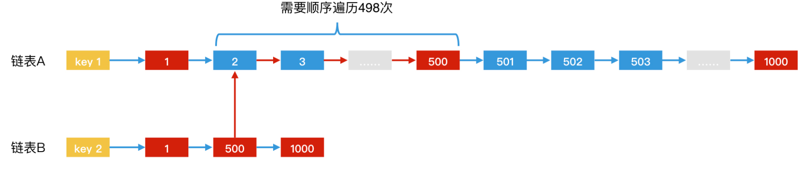

很显然，为了找到一个元素，遍历这么多次是很不划算的。那对于链表遍历，我们可以怎么优化呢？实际上，在许多工业界的实践中，比如搜索引擎，还有 Lucene 和 Elasticsearch 等应用中，都是使用跳表来实现 posting list 的。

在上面这个例子中，我们可以将链表改为跳表。这样，在 posting list A 中，我们从第 2 个元素遍历到第 500 个元素，只需要 log(498) 次的量级，会比链表快得多。

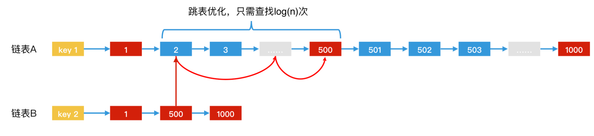

你会发现，在寻找 500 这个公共元素的过程中，我们是拿着链表 B 中的 500 作为 key，在链表 A 中进行跳表二分查找的。但是，在查找 1000 这个公共元素的过程中，我们是拿着链表 A 中的元素 1000，在链表 B 中进行跳表二分查找的。

我们把这种方法定义为相互二分查找。那啥叫相互二分查找呢？

你可以这么理解：如果 A 中的当前元素小于 B 中的当前元素，我们就以 B 中的当前元素为 key，在 A 中快速往前跳；如果 B 中的当前元素小于 A 中的当前元素，我们就以 A 中的当前元素为 key，在 B 中快速往前跳。这样一来，整体的检索效率就提升了。

在实际的系统中，如果 posting list 可以都存储在内存中，并且变化不太频繁的话，那我们还可以利用可变长数组来代替链表。

可变长数组的数组的长度可以随着数据的增加而增加。一种简单的可变长数组实现方案就是当数组被写满时，我们直接重新申请一个 2 倍于原数组的新数组，将原数组数据直接导入新数组中。这样，我们就可以应对数据动态增长的场景。

那对于两个 posting list 求交集，我们同样可以先使用可变长数组，再利用相互二分查找进行归并。而且，由于数组的数据在内存的物理空间中是紧凑的，因此 CPU 还可以利用内存的局部性原理来提高检索效率。

## 2、哈希表法加速倒排索引（优化posting list原来的链表）

说到高效查询，哈希表 O(1) 级别的查找能力令人印象深刻。那我们有没有能利用哈希表来加速的方法呢？别说，还真有。

哈希表加速的思路其实很简单，就是当两个集合要求交集时，如果一个集合特别大，另一个集合相对比较小，那我们就可以用哈希表来存储大集合。这样，我们就可以拿着小集合中的每一个元素去哈希表中对比：如果查找为存在，那查找的元素就是公共元素；否则，就放弃。

我们还是以前面说的 posting list A 和 B 为例，来进一步解释一下这个过程。由于 Posting list A 有 1000 个元素，而 B 中只有 3 个元素，因此，我们可以将 posting list A 中的元素提前存入哈希表。这样，我们利用 B 中的 3 个元素来查询的时候，每次查询代价都是 O(1)。如果 B 有 m 个元素，那查询代价就是 O(m)。

但是，使用哈希表法加速倒排索引有一个前提，就是我们要在查询发生之前，就把 posting list 转为哈希表。这就需要我们提前分析好，哪些 posting list 经常会被拿来求交集，针对这一批 posting list，我们将它们提前存入哈希表。这样，我们就能实现检索加速了。

这里还有一点需要你注意，原始的 posting list 我们也要保留。这是为什么呢？

我们假设有这样一种情况：当我们要给两个 posting list 求交集时，发现这两个 posting list 都已经转为哈希表了。这个时候，由于哈希表没有遍历能力，反而会导致我们无法合并这两个 posting list。因此，在哈希表法的最终改造中，一个 key 后面会有两个指针，一个指向 posting list，另一个指向哈希表（如果哈希表存在）。

除此之外，哈希表法还需要在有很多短 posting list 存在的前提下，才能更好地发挥作用。这是因为哈希表法的查询代价是 O(m)，如果 m 的值很大，那它的性能就不一定会比跳表法更优了。

## 3、位图法加速倒排索引（优化posting list原来的链表）

我们知道，位图其实也可以看作是一种特殊的哈希，所以除了哈希表，我们还可以使用位图法来改造链表。如果我们使用位图法，就需要将所有的 posting list 全部改造为位图，这样才能使用位图的位运算来进行检索加速。那具体应该怎么做呢？我们一起来看一下。

首先，我们需要为每个 key 生成同样长度的位图，表示所有的对象空间。然后，如果一个元素出现在该 posting list 中，我们就将位图中该元素对应的位置置为 1。这样就完成了 posting list 的位图改造。

接下来，我们来看一下位图法的查询过程。

如果要查找 posting list A 和 B 的公共元素，我们可以将 A、B 两个位图中对应的位置直接做 and 位运算（复习一下 and 位运算：0 and 0 = 0； 0 and 1 = 0； 1 and 1 = 1）。由于位图的长度是固定的，因此两个位图的合并运算时间代价也是固定的。并且由于 CPU 执行位运算的效率非常快，因此，在位图总长度不是特别长的情况下，位图法的检索效率还是非常高的。

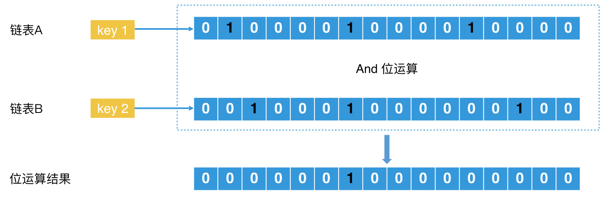

和哈希表法一样，位图法也有自己的局限性。我总结了以下 3 点，你可以感受一下。

- 1、位图法仅适用于只存储 ID 的简单的 posting list。如果 posting list 中需要存储复杂的对象，就不适合用位图来表示 posting list 了。

- 2、位图法仅适用于 posting list 中元素稠密的场景。对于 posting list 中元素稀疏的场景，使用位图的运算和存储开销反而会比使用链表更大。

- 3、位图法会占用大量的空间。尽管位图仅用 1 个 bit 就能表示元素是否存在，但每个 posting list 都需要表示完整的对象空间。如果 ID 范围是用 int32 类型的数组表示的，那一个位图的大小就约为 512M 字节。如果我们有 1 万个 key，每个 key 都存一个这样的位图，那就需要 5120G 的空间了。这是非常可怕的空间开销啊！

在很多成熟的工业界系统中，为了解决位图的空间消耗问题，我们经常会使用一种压缩位图的技术 Roaring Bitmap 来代替位图。在数据库、全文检索 Lucene、数据分析 Druid 等系统中，你都能看到 Roaring Bitmap 的身影。

## 4、升级版位图：Roaring Bitmap

首先，Roaring Bitmap 将一个 32 位的整数分为两部分，一部分是高 16 位，另一部分是低 16 位。对于高 16 位，Roaring Bitmap 将它存储到一个有序数组中，这个有序数组中的每一个值都是一个“桶”；而对于低 16 位，Roaring Bitmap 则将它存储在一个 2^16 的位图中，将相应位置置为 1。这样，每个桶都会对应一个 2^16 的位图。

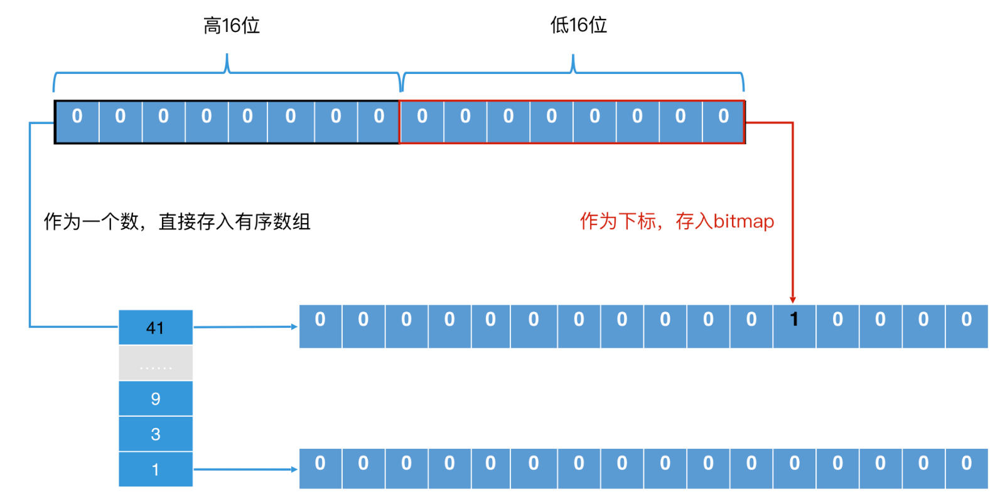

接下来，如果我们要确认一个元素是否在 Roaring Bitmap 中存在，通过两次查找就能确认了。第一步是以高 16 位在有序数组中二分查找，看对应的桶是否存在。如果存在，第二步就是将桶中的位图取出，拿着低 16 位在位图中查找，判断相应位置是否为 1。第一步查找由于是数组二分查找，因此时间代价是 O（log n）；第二步是位图查找，因此时间代价是 O(1)。

所以你看，这种将有序数组和位图用倒排索引结合起来的设计思路，是能够保证高效检索的。那它到底是怎么节省存储空间的呢？

我们来看一个极端的例子。如果一个 posting list 中，所有元素的高 16 位都是相同的，那在有序数组部分，我们只需要一个 2 个字节的桶（注：每个桶都是一个 short 型的整数，因此只有 2 个字节。如果数组提前分配好了 2^16 个桶，那就需要 128K 字节的空间，因此使用可变长数组更节省空间）。在低 16 位部分，因为位图长度是固定的，都是 2^16 个 bit，那所占空间就是 8K 个字节。

同样都是 32 位的整数，这样的空间消耗相比于我们在位图法中计算的 512M 字节来说，大大地节省了空间！

你会发现，相比于位图法，这种设计方案就是通过，将不存在的桶的位图空间全部省去这样的方式，来节省存储空间的。而代价就是将高 16 位的查找，从位图的 O(1) 的查找转为有序数组的 log(n) 查找。

那每个桶对应的位图空间，我们是否还能优化呢？

前面我们说过，当位图中的元素太稀疏时，其实我们还不如使用链表。这个时候，链表的计算更快速，存储空间也更节省。Roaring Bitmap 就基于这个思路，对低 16 位的位图部分进行了优化：如果一个桶中存储的数据少于 4096 个，我们就不使用位图，而是直接使用 short 型的有序数组存储数据。同时，我们使用可变长数组机制，让数组的初始化长度是 4，随着元素的增加再逐步调整数组长度，上限是 4096。这样一来，存储空间就会低于 8K，也就小于使用位图所占用的存储空间了。

总结来说，一个桶对应的存储容器有两种，分别是数组容器和位图容器（其实还有一种压缩的 runContainer，它是对连续元素通过只记录初始元素和后续个数。由于它不是基础类型，需要手动调用 runOptimize() 函数才会启用，这里就不展开说了）。那在实际应用的过程中，数组容器和位图容器是如何转换的呢？这里有三种情况。

- 第一种，在一个桶中刚插入数据时，因为数据量少，所以我们就默认使用数组容器；

- 第二种，随着数据插入，桶中的数据不断增多，当数组容器中的元素个数大于 4096 个时，就从数组容器转为位图容器；

- 第三种，随着数据的删除，如果位图容器中的元素个数小于 4096 个，就退化回数组容器。

这个过程是不是很熟悉？没错，这很像第 3节中的 Hashmap 的处理方法。

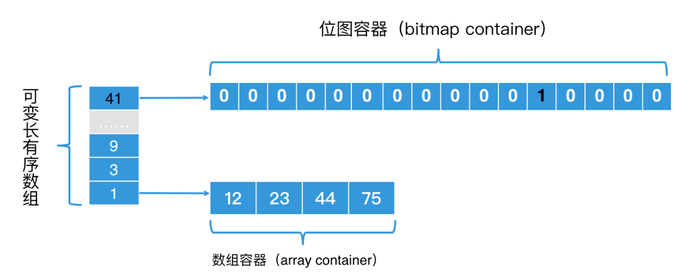

好了，前面我们说了这么多 Roaring Bitmap 的压缩位图空间的设计思路。下面，我们回到两个集合 A 和 B 快速求交集的例子中，一起来看一看 Roaring Bitmap 是怎么做的。假设，这里有 Roaring Bitmap 表示的两个集合 A 和 B，那我们求它们交集的过程可以分为 2 步。

- 第 1 步，比较高 16 位的所有桶，也就是对这两个有序数组求交集，所有相同的桶会被留下来。
- 第 2 步，对相同的桶里面的元素求交集。这个时候会出现 3 种情况，分别是位图和位图求交集、数组和数组求交集、位图和数组求交集。

其中，位图和位图求交集，我们可以直接使用位运算；数组和数组求交集，我们可以使用相互二分查找（类似跳表法）；位图和数组求交集，我们可以通过遍历数组，在位图中查找数组中的每个元素是否存在（类似哈希表法）。这些方法我们前面都讲过了，那知道了方法，具体怎么操作就是很容易的事情了，你可以再自己尝试一下。

## 总结

在工业界，我们会利用跳表法、哈希表法和位图法，对倒排索引进行检索加速。

其中，跳表法是将实现倒排索引中的 posting list 的链表改为了跳表，并且使用相互二分查找来提升检索效率；哈希表法就是在有很多短 posting list 存在的前提下，将大的 posting list 转为哈希表，减少查询的时间代价；位图法是在位图总长度不是特别长的情况下，将所有的 posting list 都转为位图，它们进行合并运算的时间代价由位图的长度决定。

并且我们还介绍了位图的升级版本，Roaring Bitmap。很有趣的是，你会发现 Roaring Bitmap 求交集过程的设计实现，本身就是跳表法、哈希表法和位图法的一个综合应用案例。

## 问题

> 1、在 Roaring Bitmap 的求交集过程中，有位图和位图求交集、数组和数组求交集、位图和数组求交集这 3 种场景。那它们求交集以后的结果，我们是应该用位图来存储，还是用数组来存储呢？

位图和位图 可能最后的结果是数组也可以是位图，可以根据两个位图本身的数量（n1 n2），并假设其均匀分布，n1 * n2/65536 大于等于 4096 则用位图，否则用数组，得到结果发现不是对应的continer，就要转换了。

数组和位图 ，数组和数组 这两个就相对简单了， 结果必然是数组。

先做预判再操作，如果预判错误了，那么就需要多做一次转换。先做预判是计算机系统中经常会涉及的一种设计和实现思想。在第二篇加餐中，是否要做集合分配律拆分也是基于预判的。包括数据库查询时，对SQL语句的优化也是会基于预判

这里解释一下 位图与位图交集的预判的情况，一般是怎么进行预判的：
假设位图1有 n1 个值， 位图1 有 n2 个值，位图的空间位 2 ** 16 = 65536
这里进行预判的时候可以认为是均匀分布的：
那么对于位图1 可以认为间隔 65536 / n1 个位有个值，位图2 可以认为间隔 65536 / n2个位有个值，
那么同时存在 n1和n2 的间隔为 t = （ 65536 / n1 ） * （65536 / n2），那么交集出来的个数为
m = 65536 / t = n1 * n2 / 65536 , 载拿 m 和 4096 进行比较 预判即可

> 不过空间不会无缘无故变出来的，在极端情况下（高16位都有，低16位都是位图），那么roaring bitmap不会比原始位图小。你可以仔细算一下，每个位图是8k，如果高16位每个数都存在，那么就有2^16个位图，2^16*8k = 2^9 M = 512M

> 2、 hash 表不能遍历这个问题，和链表结合不就可以了吗？为什么还要存一份原始的posting list。

哈希表+链表的结构的确可以（类似LinkedHashMap这样的结构）。不过链表的遍历效率不高，在链表较长的情况下，链表和哈希表求交不如用跳表法。因此，保留原始posting list最大的好处，是原始posting list可以是用跳表实现，也可以是用链表实现。有更多的适用性。（当然，如果原posting list是链表实现，其实就是你说的哈希表+链表了）

> 关于roaring bitmap（简写RBM），你其实可以把它看做是一个倒排索引。对于一个32位的数，RBM将这个数的高16位当做key，然后将这个数存入对应的posting list中。posting list用位图表示（长度为2^16）。这样思考，会不会更好理解一些?

这也是我说的学习知识点要多对比，多拆解。

至于如何学好es和lucene的源码，一般来说有两种学习方式:一种是你先学好一个高效检索引擎的各种核心技术，然后这时候你去看es和Lucene的代码，你就会发现，其实这些代码就是为了实现这些设计而写的；另一种方式呢，就是从代码出发，遇到不明白的地方再去查资料，去弄明白为什么要这么实现。

这两种方式，我个人比较倾向先了解了大致原理，再去看代码。这样往往效率会更高。其实就像你自己写代码，先设计好以后再实现会更高效一样。

# 05-2 倒排检索加速（二）：如何对联合查询进行加速？

我们先来看一个例子：在一个系统的倒排索引中，有 4 个不同的 key，分别记录着“北京”“上海”“安卓”“学生”，这些标签分别对应着 4 种人群列表。如果想分析用户的特点，我们需要根据不同的标签来选择不同的人群。这个时候，我们可能会有以下的联合查询方式：

- 在“北京”或在“上海”，并且使用“安卓”的用户集合。抽象成联合查询表达式就是，（“北京”∪“上海”）∩“安卓”；

- 在“北京”使用“安卓”，并且是“学生”的用户集合。抽象成联合查询表达式就是，“北京”∩“安卓”∩“学生”。

这只是 2 个比较有代表性的联合查询方式，实际上，联合查询的组合表达可以更长、更复杂。对于联合查询，在工业界中有许多加速检索的研究和方法，比如，调整次序法、快速多路归并法、预先组合法和缓存法。今天，我们就来聊一聊这四种加速方法。

## 1、调整次序法

首先，我们来看调整次序法。那什么是调整次序法呢？接下来，我们就以三个集合的联合查询为例，来一起分析一下。这里我再多说一句，虽然这次讲的是三个集合，但是对于多个集合，我们也是采用同样的处理方法。假设，这里有 A、B、C 三个集合，集合中的元素个数分别为 2、20、40，而且 A 包含在 B 内，B 包含在 C 内。这里我先补充一点，如果两个集合分别有 m 个元素和 n 个元素，那使用普通的遍历归并合并它们的时间代价为 O(m+n)。接着，如果我们要对 A、B、C 求交集，这个时候，会有几种不同的求交集次序，比如，A∩（B∩C）、（A∩B）∩C 等。那我们该如何选择求交集的次序呢？下面，我们就以这两种求交集次序为例来分析一下，不同的求交集次序对检索效率的影响。当求交集次序是 A∩（B∩C）时，我们要先对 B 和 C 求交集，时间代价就是 20+40 = 60，得到的结果集是 B，然后 B 再和 A 求交集，时间代价是 2 + 20 = 22。因此，最终一共的时间代价就是 60 + 22 = 82。那当求交集次序是（A∩B）∩C 时，我们要先对 A 和 B 求交集，时间代价是 2 + 20 = 22，得到的结果集是 A，然后 A 再和 C 求交集，时间代价是 2 + 40 = 42。因此，最终的时间代价就是 22 + 42 = 64。这比之前的代价要小得多。

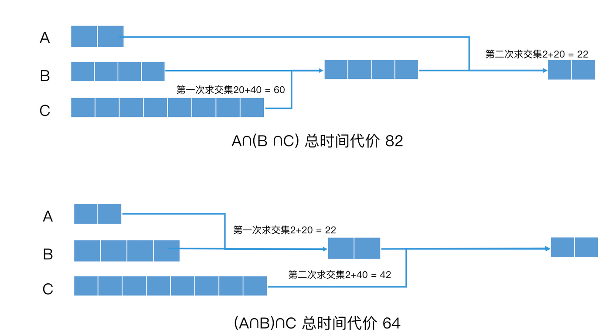

除了对 A、B、C 这三个集合同时取交集以外，还有一种常见的联合查询方式，就是对其中两个集合取并集之后，再和第三个集合取交集，比如 A ∩（B∪C），你可以看我开头举的第一个例子。在这种情况下，如果我们不做任何优化，查询代价是怎么样的呢？让我们一起来看一下。

首先是执行 B∪C 的操作，时间代价是 20 + 40 = 60，结果是 C。然后再和 A 求交集，时间代价是 2+40 = 42。一共是 102。

这样的时间代价非常大，那针对这个查询过程我们还可以怎么优化呢？这种情况下，我们可以尝试使用数学公式，对先求并集再求交集的次序进行改造，我们先来复习一个集合分配律公式：A∩（B∪C）=（A∩B）∪（A∩C）

然后，我们就可以把先求并集再求交集的操作，转为先求交集再求并集的操作了。那这个时候，查询的时间代价是多少呢？我们一起来看一下。首先，我们要执行 A∩B 操作，时间代价是 2+20 = 22，结果是 A。然后，我们执行 A∩C 操作，时间代价是 2+40=42，结果也是 A。最后，我们对两个 A 求并集，时间代价是 2+2=4。因此，最终总的时间代价是 22 + 42 + 4 = 68。这比没有优化前的 102 要低得多。

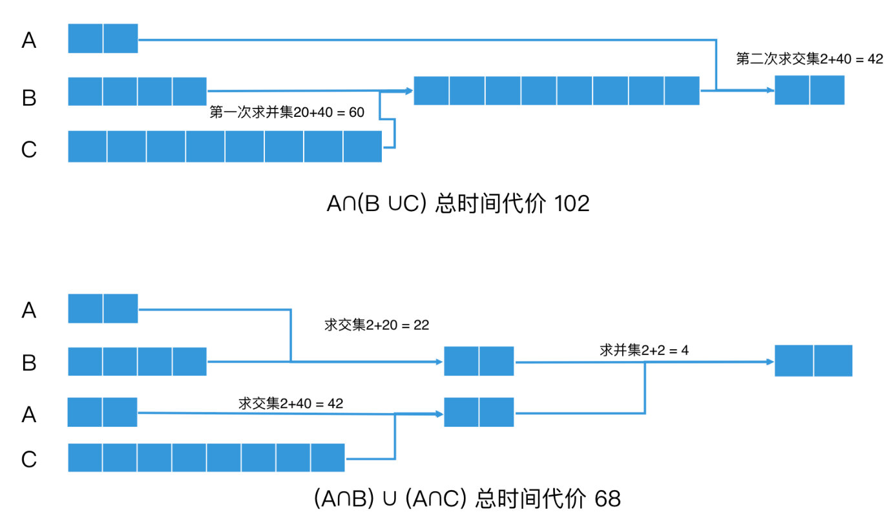

这里有一点需要特别注意，如果求并集的元素很多，比如说（B∪C∪D∪E∪F），那我们用分配律改写的时候，A 就需要分别和 B 到 F 求 5 次交集，再将 5 个结果求并集。这样一来，操作的次数会多很多，性能就有可能下降。因此，我们需要先检查 B 到 F 每个集合的大小，比如说，如果集合中元素个数都明显大于 A，我们预测它们分别和 A 求交集能有提速的效果，那我们就可以使用集合分配律公式来加速检索。

不知道你有没有注意到，在一开始讲这两个例子的时候，我们假设了 A、Ｂ、Ｃ有相互包含的关系，这是为了方便你更好地理解调整操作次序带来的效率差异。那在真实情况中，集合中的关系不会这么理想，但是我们分析得到的结论，依然是有效的。

## 2、快速多路归并法

但是，调整次序法有一个前提，就是集合的大小要有一定的差异，这样的调整效果才会更明显。那如果我们要对多个 posting list 求交集，但是它们的长度差异并不大，这又该如何优化呢？这个时候，我们可以使用跳表法来优化。

在对多个 posting list 求交集的过程中，我们可以利用跳表的性质，快速跳过多个元素，加快多路归并的效率。这种方法，我叫它"快速多路归并法"。在一些搜索引擎和广告引擎中，包括在 Elastic Search 这类框架里，就都使用了这样的技术。那具体是怎么做的呢？我们一起来看一下。其实，快速多路归并法的思路和实现都非常简单，就是将 n 个链表的当前元素看作一个有序循环数组list[n]。并且，对有序循环数组从小到大依次处理，当有序循环数组中的最小值等于最大值，也就是所有元素都相等时，就说明我们找到了公共元素。

这么说可能比较抽象，下面，我们就以 4 个链表 A、B、C、D 求交集为例，来讲一讲具体的实现步骤。

- 第 1 步，将 4 个链表的当前第一个元素取出，让它们按照由小到大的顺序进行排序。然后，将链表也按照由小到大有序排列；

- 第 2 步，用一个变量 max 记录当前 4 个链表头中最大的一个元素的值；

- 第 3 步，从第一个链表开始，判断当前位置的值是否和 max 相等。如果等于 max，则说明此时所有链表的当前元素都相等，该元素为公共元素，那我们就将该元素取出，然后回到第一步；如果当前位置的值小于 max，则用跳表法快速调整到该链表中第一个大于等于 max 的元素位置；如果新位置元素的值大于 max，则更新 max 的值。

- 第 4 步，对下一个链表重复第 3 步，就这样依次处理每个链表（处理完第四个链表后循环回到第一个链表，用循环数组实现），直到链表全部遍历完。

为了帮助你加深理解，我在下面的过程图中加了一个具体的例子，你可以对照前面的文字描述一起消化吸收。

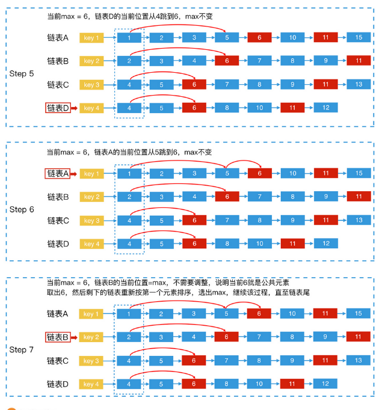

上图的例子中，我们通过以上 4 个步骤，找到了公共元素 6。接下来，你可以试着继续用这个方法，去找下一个公共元素 11。这里，我就不再继续举例了。

## 3、预先组合法

其实预先组合法的核心原理，和我们熟悉的一个系统实现理念一样，就是能提前计算好的，就不要临时计算。换一句话说，对于常见的联合查询，我们可以提前将结果算好，并将该联合查询定义一个 key。那具体该怎么操作呢？

假设，key1、key2 和 key3 分别的查询结果是 A、B、C 三个集合。如果我们经常会计算 A∩B∩C，那我们就可以将 key1+key2+key3 这个查询定义为一个新的组合 key，然后对应的 posting list 就是提前计算好的结果。之后，当我们要计算 A∩B∩C 时，直接去查询这个组合 key，取出对应的 posting list 就可以了。

## 4、缓存法加速联合查询

预先组合的方法非常实用，但是在搜索引擎以及一些具有热搜功能的平台中，经常会出现一些最新的查询组合。这些查询组合请求量也很大，但是由于之前没有出现过，因此我们无法使用预先组合的方案来优化。这个时候，我们会使用缓存技术来优化。

那什么是缓存技术呢？缓存技术就是指将之前的联合查询结果保存下来。这样再出现同样的查询时，我们就不需要重复计算了，而是直接取出之前缓存的结果即可。这里，我们可以借助预先组合法的优化思路，为每一个联合查询定义一个新的 key，将结果作为这个 key 的 posting list 保存下来。

但是，我们还要考虑一个问题：内存空间是有限的，不可能无限缓存所有出现过的查询组合。因此，对于缓存，我们需要进行内容替换管理。一种常用的缓存管理技术是 LRU（Least Recently Used），也叫作最近最少使用替换机制。所谓最近最少使用替换机制，就是如果一个对象长期未被访问，那当缓存满时，它将会被替换。

对于最近最少使用替换机制，一个合适的实现方案是使用双向链表：当一个元素被访问时，将它提到链表头。这个简单的机制能起到的效果是：如果一个元素经常被访问，它就会经常被往前提；如果一个元素长时间未被访问，它渐渐就会被排到链表尾。这样一来，当缓存满时，我们直接删除链表尾的元素即可。

不过，我们希望能快速查询缓存，那链表的访问速度就不满足我们的需求了。因此，我们可以使用 O(1) 查询代价的哈希表来优化。我们向链表中插入元素时，同时向哈希表中插入该元素的 key，然后这个 key 对应的 value 则是链表中这个节点的地址。这样，我们在查询这个 key 的时候，就可以通过查询哈希表，快速找到链表中的对应节点了。因此，使用“双向链表 + 哈希表”是一种常见的实现 LRU 机制的方案。

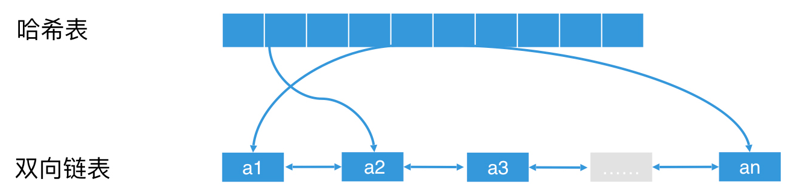

通过使用 LRU 缓存机制，我们就可以将临时的查询组合缓存起来，快速查询出结果，而不需要重复计算了。一旦这个查询组合不是热点了，那它就会被 LRU 机制替换出缓存区，让位给新的热点查询组合。缓存法在许多高并发的查询场景中，会起到相当大的作用。比如说在搜索引擎中，对于一些特定时段的热门查询，缓存命中率能达到 60% 以上甚至更高，会大大加速系统的检索效率。

## 总结

- 第 1 种方法是调整次序法，它是通过从小到大求交集，以及使用集合分配律改写查询，使得检索效率得到提升。

- 第 2 种方法是快速多路归并法，它是利用跳表快速跳过多个元素的能力，结合优化的多路归并方案，提升多个 posting list 归并性能的。

- 第 3 种方法是预先组合法，也就是将热门的查询组合提前处理好，作为一个单独的 key，保存提前计算好的 posting list。

- 第 4 种则是使用缓存法，将临时的热点查询组合进行结果缓存处理，避免重复查询每次都要重复计算。

你会看到，这 4 种方法分别从数学、算法、线下工程和线上工程，这四种不同的方向对联合查询进行了优化。同时使用它们，能让我们从多个维度对联合查询进行加速。

## 问题

> 1、对于今天介绍的四种方案，你觉得哪一种给你的印象最深刻？你会尝试在怎么样的场景中使用它？为什么？

> 2、LinkedHashMap实现的LRU算法

LinkedHashMap 的 accessOrder = true ，它表示遍历的时候按 访问的顺序输出。每访问过一个元素，都要改变它的位置链到双链表的末尾去。

我现在 linkedHashMap map; // accessOrder = true

map put(1，1); // a

map put(2，2); // b

map put(3，3); // c

A处： 此时若遍历，打印的顺序是 1 2 3

map. get(2); // d

B处：此时若遍历，打印的顺序是 1 3 2

备注：当失效的时候先从表头清除元素。

> 3、第四个算法LRU算法，在使用哈希表和链表的实现中，链表的数据结构有必要使用双向链表吗？既然有哈希表的映射关系了，是不是一个简单的链表就可以啦。

你可以想一下，lru把一个元素提到链表头是怎么操作的。步骤如下:
- 1.查询哈希表
- 2.通过哈希表直接访问到链表中的节点k（注意:节点k不是遍历链表得到的！是哈希表直接定位的！因此，我们此时并不知道k的前序节点是哪个）。
- 3.将节点k提到链表头。到这一步的时候，你就会发现，如果链表是单链表的话，那么如何把k节点从链表中摘取出来，然后链表还不能被打断，这就成了一个问题了。因此，我们用双向链表，就可以快速地找到k节点的前序节点，这样就能完成节点k的摘取操作。

进阶实战篇 (13讲)

# 06 | 数据库检索：如何使用B+树对海量磁盘数据建立索引？

在工业界中，我们经常会遇到的一个问题，许多系统要处理的数据量非常庞大，数据无法全部存储在内存中，需要借助磁盘完成存储和检索。我们熟悉的关系型数据库，比如 MySQL 和 Oracle，就是这样的典型系统。数据库中支持多种索引方式，比如，哈希索引、全文索引和 B+ 树索引，其中 B+ 树索引是使用最频繁的类型。因此，今天我们就一起来聊一聊磁盘上的数据检索有什么特点，以及为什么 B+ 树能对磁盘上的大规模数据进行高效索引。

## 1、磁盘和内存中数据的读写效率有什么不同？

内存是半导体元件。对于内存而言，只要给出了内存地址，我们就可以直接访问该地址取出数据。这个过程具有高效的随机访问特性，因此内存也叫随机访问存储器（Random Access Memory，即 RAM）。内存的访问速度很快，但是价格相对较昂贵，因此一般的计算机内存空间都相对较小。

而磁盘是机械器件。磁盘访问数据时，需要等磁盘盘片旋转到磁头下，才能读取相应的数据。尽管磁盘的旋转速度很快，但是和内存的随机访问相比，性能差距非常大。到底有多大呢？一般来说，如果是随机读写，会有 10 万到 100 万倍左右的差距。但如果是顺序访问大批量数据的话，磁盘的性能和内存就是一个数量级的。为什么会这样呢？这和磁盘的读写原理有关。那具体是怎么回事呢？

磁盘的最小读写单位是扇区，较早期的磁盘一个扇区是 512 字节。随着磁盘技术的发展，目前常见的磁盘扇区是 4K 个字节。操作系统一次会读写多个扇区，所以操作系统的最小读写单位是块（Block），也叫作簇（Cluster）。当我们要从磁盘中读取一个数据时，操作系统会一次性将整个块都读出来。因此，对于大批量的顺序读写来说，磁盘的效率会比随机读写高许多。

现在你已经了解磁盘的特点了，那我们就可以来看一下，如果使用之前学过的检索技术来检索磁盘中的数据，检索效率会是怎样的呢？

假设有一个有序数组存储在硬盘中，如果它足够大，那么它会存储在多个块中。当我们要对这个数组使用二分查找时，需要先找到中间元素所在的块，将这个块从磁盘中读到内存里，然后在内存中进行二分查找。如果下一步要读的元素在其他块中，则需要再将相应块从磁盘中读入内存。直到查询结束，这个过程可能会多次访问磁盘。我们可以看到，这样的检索性能非常低。由于磁盘相对于内存而言访问速度实在太慢，因此，对于磁盘上数据的高效检索，我们有一个极其重要的原则：对磁盘的访问次数要尽可能的少！

那问题来了，我们应该如何减少磁盘的访问次数呢？将索引和数据分离就是一种常见的设计思路。

## 2、如何将索引和数据分离？

我们以查询用户信息为例。我们知道，一个系统中的用户信息非常多，除了有唯一标识的 ID 以外，还有名字、邮箱、手机、兴趣爱好以及文章列表等各种信息。一个保存了所有用户信息的数组往往非常大，无法全部放在内存中，因此我们会将它存储在磁盘中。

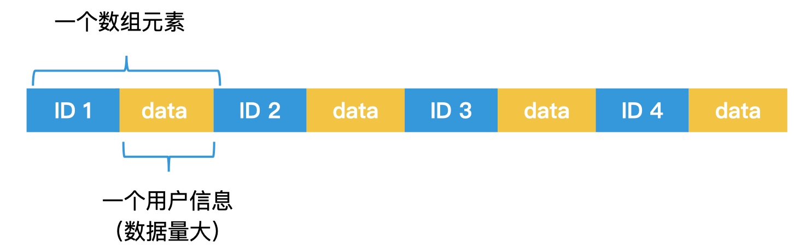

当我们以用户的 ID 进行检索时，这个检索过程其实并不需要读取存储用户的具体信息。因此，我们可以生成一个只用于检索的有序索引数组。数组中的每个元素存两个值，一个是用户 ID，另一个是这个用户信息在磁盘上的位置，那么这个数组的空间就会很小，也就可以放入内存中了。这种用有序数组做索引的方法，叫作线性索引（Linear Index）。

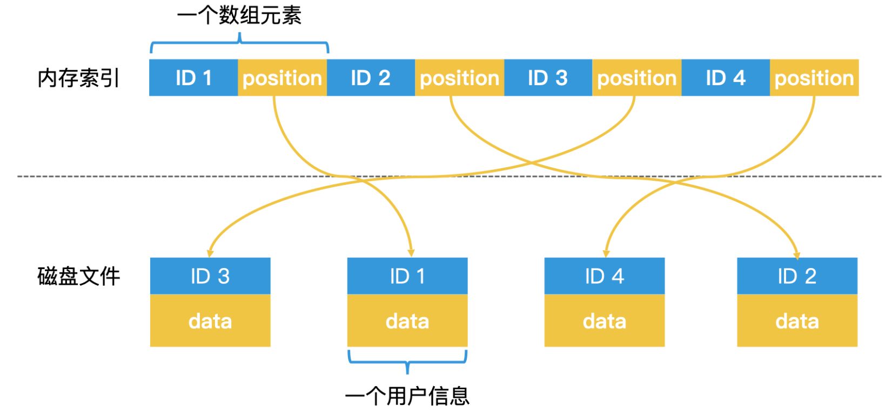

在数据频繁变化的场景中，有序数组并不是一个最好的选择，二叉检索树或者哈希表往往更有普适性。但是，哈希表由于缺乏范围检索的能力，在一些场合也不适用。因此，二叉检索树这种树形结构是许多常见检索系统的实施方案。那么，上图中的线性索引结构，就变成下图这个样子。

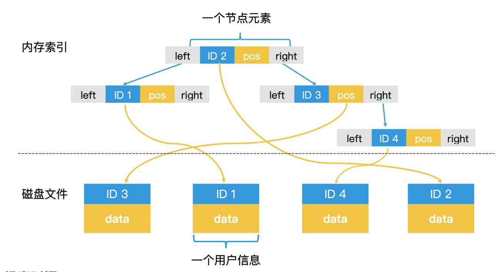

尽管二叉检索树可以解决数据动态修改的问题，但在索引数据很大的情况下，依然会有数据无法完全加载到内存中。这种情况我们应该怎么办呢？一个很自然的思路，就是将索引数据也存在磁盘中。那如果是树形索引，我们应该将哪些节点存入磁盘，又要如何从磁盘中读出这些数据进行检索呢？你可以先想一想，然后我们一起来看看业界常用的解决方案 B+ 树是怎么做的。

## 3、如何理解 B+ 树的数据结构？

B+ 树是检索技术中非常重要的一个部分。这是为什么呢？因为 B+ 树给出了将树形索引的所有节点都存在磁盘上的高效检索方案，使得索引技术摆脱了内存空间的限制，得到了广泛的应用。

前面我们讲了，操作系统对磁盘数据的访问是以块为单位的。因此，如果我们想将树型索引的一个节点从磁盘中读出，即使该节点的数据量很小（比如说只有几个字节），但磁盘依然会将整个块的数据全部读出来，而不是只读这一小部分数据，这会让有效读取效率很低。B+ 树的一个关键设计，就是让一个节点的大小等于一个块的大小。节点内存储的数据，不是一个元素，而是一个可以装 m 个元素的有序数组。这样一来，我们就可以将磁盘一次读取的数据全部利用起来，使得读取效率最大化。

B+ 树还有另一个设计，就是将所有的节点分为内部节点和叶子节点。尽管内部节点和叶子节点的数据结构是一样的，但存储的内容是不同的。

内部节点仅存储 key 和维持树形结构的指针，并不存储 key 对应的数据（无论是具体数据还是文件位置信息）。这样内部节点就能存储更多的索引数据，我们也就可以使用最少的内部节点，将所有数据组织起来了。而叶子节点仅存储 key 和对应数据，不存储维持树形结构的指针。通过这样的设计，B+ 树就能做到节点的空间利用率最大化。

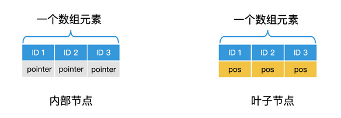

此外，B+ 树还将同一层的所有节点串成了有序的双向链表，这样一来，B+ 树就同时具备了良好的范围查询能力和灵活调整的能力了。因此，B+ 树是一棵完全平衡的 m 阶多叉树。所谓的 m 阶，指的是每个节点最多有 m 个子节点，并且每个节点里都存了一个紧凑的可包含 m 个元素的数组。

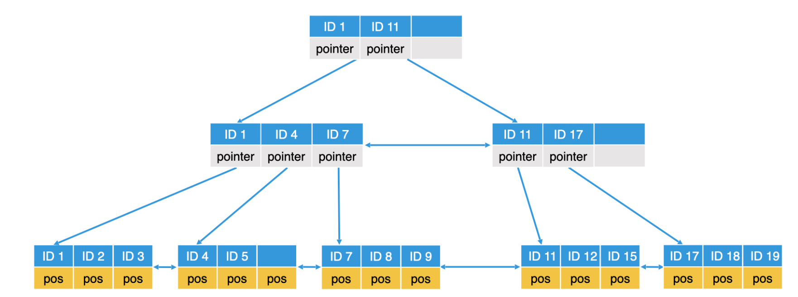

## 4、B+ 树是如何检索的？

这样的结构，使得 B+ 树可以作为一个完整的文件全部存储在磁盘中。当从根节点开始查询时，通过一次磁盘访问，我们就能将文件中的根节点这个数据块读出，然后在根节点的有序数组中进行二分查找。

具体的查找过程是这样的：我们先确认要寻找的查询值，位于数组中哪两个相邻元素中间，然后我们将第一个元素对应的指针读出，获得下一个 block 的位置。读出下一个 block 的节点数据后，我们再对它进行同样处理。这样，B+ 树会逐层访问内部节点，直到读出叶子节点。对于叶子节点中的数组，直接使用二分查找算法，我们就可以判断查找的元素是否存在。如果存在，我们就可以得到该查询值对应的存储数据。如果这个数据是详细信息的位置指针，那我们还需要再访问磁盘一次，将详细信息读出。

我们前面说了，B+ 树是一棵完全平衡的 m 阶多叉树。所以，B+ 树的一个节点就能存储一个包含 m 个元素的数组，这样的话，一个只有 2 到 4 层的 B+ 树，就能索引数量级非常大的数据了，因此 B+ 树的层数往往很矮。比如说，一个 4K 的节点的内部可以存储 400 个元素，那么一个 4 层的 B+ 树最多能存储 400^4，也就是 256 亿个元素。

不过，因为 B+ 树只有 4 层，这就意味着我们最多只需要读取 4 次磁盘就能到达叶子节点。并且，我们还可以通过将上面几层的内部节点全部读入内存的方式，来降低磁盘读取的次数。

比如说，对于一个 4 层的 B+ 树，每个节点大小为 4K，那么第一层根节点就是 4K，第二层最多有 400 个节点，一共就是 1.6M；第三层最多有 400^2，也就是 160000 个节点，一共就是 640M。对于现在常见的计算机来说，前三层的内部节点其实都可以存储在内存中，只有第四层的叶子节点才需要存储在磁盘中。这样一来，我们就只需要读取一次磁盘即可。这也是为什么，B+ 树要将内部节点和叶子节点区分开的原因。通过这种只让内部节点存储索引数据的设计，我们就能更容易地把内部节点全部加载到内存中了。

[问题：]感觉这里计算每一层元素的个数有问题？

## 5、B+ 树是如何动态调整的？

现在，你已经知道 B+ 树的结构和原理了。那 B+ 树在“新增节点”和“删除节点”这样的动态变化场景中，又是怎么操作的呢？接下来，让我们一起来看一下。

首先，我们来看插入数据。由于具体的数据都是存储在叶子节点上的，因此，数据的插入也是从叶子节点开始的。以一个节点有 3 个元素的 B+ 树为例，如果我们要插入一个 ID=6 的节点，首先要查询到对应的叶子节点。如果叶子节点的数组未满，那么直接将该元素插入数组即可。具体过程如下图所示：

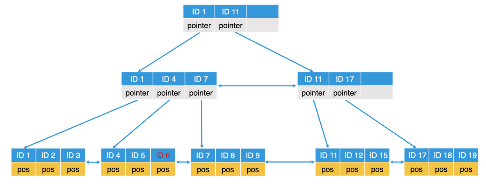

如果我们插入的是 ID=10 的节点呢？按之前的逻辑，我们应该插入到 ID 9 后面，但是 ID 9 所在的这个节点已经存满了 3 个节点，无法继续存入了。因此，我们需要将该叶子节点分裂。分裂的逻辑就是生成一个新节点，并将数据在两个节点中平分。

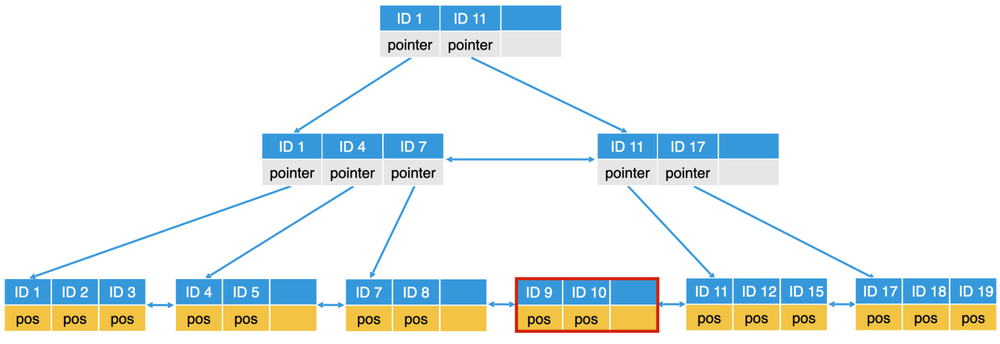

叶子节点分裂完成以后，上一层的内部节点也需要修改。但如果上一层的父节点也是满的，那么上一层的父节点也需要分裂。

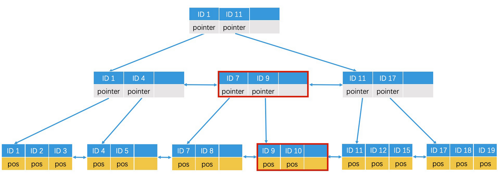

内部节点调整好了，下一步我们就要调整根节点了。由于根节点未满，因此我们不需要分裂，直接修改即可。

删除数据也类似，如果节点数组较满，直接删除；如果删除后数组有一半以上的空间为空，那为了提高节点的空间利用率，该节点需要将左右两边兄弟节点的元素转移过来。可以成功转移的条件是，元素转移后该节点及其兄弟节点的空间必须都能维持在半满以上。如果无法满足这个条件，就说明兄弟节点其实也足够空闲，那我们直接将该节点的元素并入兄弟节点，然后删除该节点即可。

## 总结

你会发现，即使是复杂的 B+ 树，我们将它拆解开来，其实也是由简单的数组、链表和树组成的，而且 B+ 树的检索过程其实也是二分查找。因此，如果 B+ 树完全加载在内存中的话，它的检索效率其实并不会比有序数组或者二叉检索树更高，也还是二分查找的 log(n) 的效率。并且，它还比数组和二叉检索树更加复杂，还会带来额外的开销。但是，B+ 树最大的优点在于，它提供了将索引数据存在磁盘中，以及高效检索的方案。这让检索技术摆脱了内存的限制，得到了更广泛地使用。

另外，这一节还有一个很重要的设计思想需要你掌握，那就是将索引和数据分离。通过这样的方式，我们能将索引的数组大小保持在一个较小的范围内，让它能加载在内存中。在许多大规模系统中，都是使用这个设计思想来精简索引的。而且，B+ 树的内部节点和叶子节点的区分，其实也是索引和数据分离的一次实践。

备注：b+树的每个叶子节点在磁盘上并不是顺序的，它们由于不停分裂和合并，其实在物理空间上是零散的。

## 问题

> 1、B+ 树有一个很大的优势，就是适合做范围查询。如果我们要检索值在 x 到 y 之间的所有元素，你会怎么操作呢？

- 1.通过二分查找找到x，此时，x所在的块是加载在内存中的。
- 2.查找y所在的块。从当前内存中所存的x所在的同一个块找起。我们可以直接判断这个块最后一个元素是否大于y。如果大于y，说明y只会在这个块中，因此不用再去读后续块了；否则继续通过链表读取下一个块，直接判断这个块的最后一个元素是否大于y。从而快速找到y所在的块。
- 3.对于y所在的块，使用二分查找，定位到y，这样，x到y之间的范围查找就完成了。

之所以第二步查找y所在的块采用的是遍历，而不是从树根开始二分查找，原因在于范围查询本来就需要把范围内的数据都读出来，因此，我们可以通过遍历，一边读当前块数据，一边判断y在哪个块，没有冗余操作，效率最高。

> 2、b树、b+树都可以应用于关系数据库，而MongoDB作为非关系数据库，用的就是b树，而非LSM树，这几种树有什么应用场景吗？

b树和b+树相比，有最核心的两个区别:

1.b树没有内部节点和叶子节点的区分，它的每个节点，都是即存key，又存了data。

2.由于没有内部节点和叶子节点的区分，使得b树没有将所有叶子节点用链表串联起来的结构。

这两个区别，会带来b树的两个检索特点:
- 1.进行单个key查询时，b树最快可以在o(1)的时间代价内就查到。而从平均时间代价来看，会比b+树稍快一些。但波动会比较大(因为每个节点即存key又存data，会使得树变高，底层的节点的io次数会变多)。

- 2.进行范围查询时，由于缺乏简单的叶子节点链接，因此只能通过树的遍历来完成范围查询，这会涉及多个节点的io问题，效率不如b+树。

因此，存在大量范围检索的场景，适合使用b+树(比如数据库);而对于大量的单个key查询的场景，可以考虑b树(比如nosql的MongoDB)。

> 3、维护B+树过程中，节点元素过多，导致B+树变成“违规”状态，因此需要分裂，从叶子节点递归向树根分裂，在根节点已满的时候，如何处理根节点? wiki上说会“新建一个根节点”，那是否会改变树的阶数？维护B+树过程中，节点元素过少，会导致B+树变成“违规”状态，因此需要转移或合并，如果合并，删除节点后，应该也要递归向树根检查？是否也会如上一个问题到达根节点，而产生新的根节点？上述讲述维护B+树过程中，都有一个判断元素数量是否“半满”的条件，这个半满是否就是m阶B+树的 m/2, 那么这个值是如何推导出来的，或者说，如何证明半满是对m阶B+树最好的实现?

- 根节点的分裂，的确会生成新的根节点，树的高度会加1。但不是阶数加1。要注意阶数的定义，指的是分叉的个数上限(就是指针数组个数m的值)。举一个简单的例子，比如说一开始就只有一个根节点，同时也是叶子节点。它达到半满状态以后，如果有新元素加入，它就要分裂成两个叶子节点，然后上面会有一个新的根节点，存着这两个叶子节点的指针。这时候，树的高度就加1了。

- 根节点的删除。其实还是同样的分析思路。我们在上一个例子的基础上继续看看，如果现在有一个根节点，下面有两个叶子节点，当叶子节点中的元素被删除以后，这两个叶子节点都无法做到半满状态，它们应该合并。如果根节点的仅有的两个子节点合并了，这时候，我们就应该删除树根。这时候树的高度就减1。

- 首先，半满就是m/2。这个定义很清晰。那么半满是否就是最高效的实现呢？其实不一定。保持半满，对于随机插入操作来说，能最大概率延迟节点再次分裂的时间。但如果不是随机插入，而是有次序的数据插入的话，那么，MySQL的实际实现，并不是半满策略。它会增加新的叶子节点，但是保持前一个叶子节点全满不变。这样顺序插入的新数据就会写入新的叶子节点。这样优化的好处就是可以避免叶子节点频繁分裂的问题。

> 4、 有个疑问: 既然内部节点存储的只是key和维持树形结构的指针, 那么是怎么知道下一个block的位置的呢 ?另外, 在读问答区的时候, 有个回复里说, 联合索引内部节点存储的是多列数组, 这里是每个数组存储一列吗 ?(PS: 假如A、B、C组成联合索引, 内部节点数组会是[[A], [B], [C]]还是 [A, B, C]) ？ 为什么呢 ? 猜想: 因为联合索引可以使用最左前缀, 应该是[[A],[B],[C]]保持多维度(A->B->C)有序 ?

1.其实“维持树形结构的指针”，记录的就是下一个block的地址。因此通过这个指针就可以访问下一个block了。

2.关于联合索引到底长什么样子?其实并不神秘，它依然是保存了key和指针，只是这个key是一个组合key，要同时包含多个列的key的值。

举个例子，假设有两个列col1和col2做联合索引，col1的值是a，b，c，而col2的值是1，2，3。那么组合起来，在叶子节点就会有a1，a2，a3，b1，b2，b3，c1，c2，c3这九个组合key。每个key下面会带一个具体数据的地址，因此，{a1，地址}这就是一个完整的记录。再拆开，其实就是{a，1，地址}。

同理，中间节点也一样。比如说，一个中间节点的key是a1，b2，c2。那么，如果我们查询的组合key是a2，那么它位于a1和b2之间，我们就应该把这个中间节点a1这个key对应的指针取出，读出下一个block。因此，中间节点的结构也是{组合key，地址}，将组合key拆开，其实就是{col1-key，col2-key，地址}。这就是中间节点的数组中的一个元素。

> 5、 b+树的叶子节点存的是什么?是位置还是具体数据？

你如果注意的话，会发现我文中有写“位置或数据”。事实上，两种方案都可以，而且这是两种数据库b+树的实现方案。只存数据的，是innoDB，而存文件位置的，是myIsam。这两种方案的各种特性根源都和b+树叶子节点存什么密切相关。

# 07 | NoSQL检索：为什么日志系统主要用LSM树而非B+树？

B+ 树作为检索引擎中的核心技术得到了广泛的使用，尤其是在关系型数据库中。

但是，在关系型数据库之外，还有许多常见的大数据应用场景，比如，日志系统、监控系统。这些应用场景有一个共同的特点，那就是数据会持续地大量生成，而且相比于检索操作，它们的写入操作会非常频繁。另外，即使是检索操作，往往也不是全范围的随机检索，更多的是针对近期数据的检索。

那对于这些应用场景来说，使用关系型数据库中的 B+ 树是否合适呢？

我们知道，B+ 树的数据都存储在叶子节点中，而叶子节点一般都存储在磁盘中。因此，每次插入的新数据都需要随机写入磁盘，而随机写入的性能非常慢。如果是一个日志系统，每秒钟要写入上千条甚至上万条数据，这样的磁盘操作代价会使得系统性能急剧下降，甚至无法使用。

那么，针对这种频繁写入的场景，是否有更合适的存储结构和检索技术呢？LSM 树（Log Structured Merge Trees）。LSM 树也是近年来许多火热的 NoSQL 数据库中使用的检索技术。

## 1、如何利用批量写入代替多次随机写入？（数据会暂存内存，宕机会丢失）

刚才我们提到 B+ 树随机写入慢的问题，对于这个问题，我们现在来思考一下优化想法。操作系统对磁盘的读写是以块为单位的，我们能否以块为单位写入，而不是每次插入一个数据都要随机写入磁盘呢？这样是不是就可以大幅度减少写入操作了呢？

LSM 树就是根据这个思路设计了这样一个机制：当数据写入时，延迟写磁盘，将数据先存放在内存中的树里，进行常规的存储和查询。当内存中的树持续变大达到阈值时，再批量地以块为单位写入磁盘的树中。因此，LSM 树至少需要由两棵树组成，一棵是存储在内存中较小的 C0 树，另一棵是存储在磁盘中较大的 C1 树。简单起见，接下来我们就假设只有 C0 树和 C1 树。

C1 树存储在磁盘中，因此我们可以直接使用 B+ 树来生成。那对于全部存储在内存中的 C0 树，我们该如何生成呢？在上一讲的重点回顾中我们分析过，在数据都能加载在内存中的时候，B+ 树并不是最合适的选择，它的效率并不会更高。[B+树的设计考虑了通过多叉降低树的高度来减少磁盘的随机IO等情况，在纯内存情况下，有更好的数据结构]因此，C0 树我们可以选择其他的数据结构来实现，比如平衡二叉树甚至跳表等。但是为了让你更简单、清晰地理解 LSM 树的核心理念，我们可以假设 C0 树也是一棵 B+ 树。

那现在 C0 树和 C1 树就都是 B+ 树生成的了，但是相比于普通 B+ 树生成的 C0 树，C1 树有一个特点：所有的叶子节点都是满的。为什么会这样呢？原因就是，C1 树不需要支持随机写入了，我们完全可以等内存中的数据写满一个叶子节点之后，再批量写入磁盘。因此，每个叶子节点都是满的，不需要预留空位来支持新数据的随机写入。

## 2、如何保证批量写之前系统崩溃可以恢复？（Write Ahead Log，预写日志技术）

B+ 树随机写入慢的问题，我们已经知道解决的方案了。现在第二个问题来了：如果机器断电或系统崩溃了，那内存中还未写入磁盘的数据岂不就永远丢失了？这种情况我们该如何解决呢？

为了保证内存中的数据在系统崩溃后能恢复，工业界会使用 WAL 技术（Write Ahead Log，预写日志技术）将数据第一时间高效写入磁盘进行备份。WAL 技术保存和恢复数据的具体步骤，我这里总结了一下。

- 1、内存中的程序在处理数据时，会先将对数据的修改作为一条记录，顺序写入磁盘的 log 文件作为备份。由于磁盘文件的顺序追加写入效率很高，因此许多应用场景都可以接受这种备份处理。

- 2、在数据写入 log 文件后，备份就成功了。接下来，该数据就可以长期驻留在内存中了。

- 3、系统会周期性地检查内存中的数据是否都被处理完了（比如，被删除或者写入磁盘），并且生成对应的检查点（Check Point）记录在磁盘中。然后，我们就可以随时删除被处理完的数据了。这样一来，log 文件就不会无限增长了。

- 4、系统崩溃重启，我们只需要从磁盘中读取检查点，就能知道最后一次成功处理的数据在 log 文件中的位置。接下来，我们就可以把这个位置之后未被处理的数据，从 log 文件中读出，然后重新加载到内存中。

通过这种预先将数据写入 log 文件备份，并在处理完成后生成检查点的机制，我们就可以安心地使用内存来存储和检索数据了。

备注：checkpoint主要目的是定期将数据落盘后用来对log文件进行清理的，使得系统重启时不需要重放过多的log影响性能。

## 3、如何将内存数据与磁盘数据合并？（有序链表的归并排序）

解决了内存中数据备份的问题，我们就可以接着写入数据了。内存中 C0 树的大小是有上限的，那当 C0 树被写满之后，我们要怎么把它转换到磁盘中的 C1 树上呢？这就涉及滚动合并（Rolling Merge）的过程了。

我们可以参考两个有序链表归并排序的过程，将 C0 树和 C1 树的所有叶子节点中存储的数据，看作是两个有序链表，那滚动合并问题就变成了我们熟悉的两个有序链表的归并问题。不过由于涉及磁盘操作，那为了提高写入效率和检索效率，我们还需要针对磁盘的特性，在一些归并细节上进行优化。

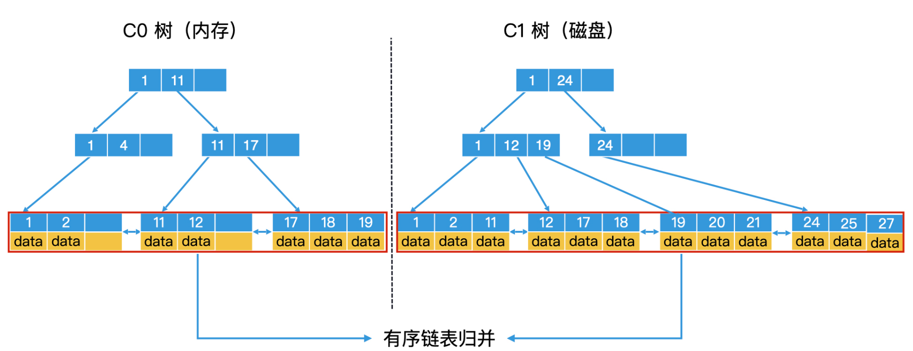

由于磁盘具有顺序读写效率高的特性，因此，为了提高 C1 树中节点的读写性能，除了根节点以外的节点都要尽可能地存放到连续的块中，让它们能作为一个整体单位来读写。这种包含多个节点的块就叫作多页块（Multi-Pages Block）。

下面，我们来讲一下滚动归并的过程。在进行滚动归并的时候，系统会遵循以下几个步骤。

- 第一步，以多页块为单位，将 C1 树的当前叶子节点从前往后读入内存。读入内存的多页块，叫作清空块（Emptying Block），意思是处理完以后会被清空。

- 第二步，将 C0 树的叶子节点和清空块中的数据进行归并排序，把归并的结果写入内存的一个新块中，叫作填充块（Filling Block）。

- 第三步，如果填充块写满了，我们就要将填充块作为新的叶节点集合顺序写入磁盘。这个时候，如果 C0 树的叶子节点和清空块都没有遍历完，我们就继续遍历归并，将数据写入新的填充块。如果清空块遍历完了，我们就去 C1 树中顺序读取新的多页块，加载到清空块中。

- 第四步，重复第三步，直到遍历完 C0 树和 C1 树的所有叶子节点，并将所有的归并结果写入到磁盘。这个时候，我们就可以同时删除 C0 树和 C1 树中被处理过的叶子节点。这样就完成了滚动归并的过程。

备注：这里可以理解为简单的归并排序的过程，先把C1一部分加载到内存的清空块，然后把清空块的数据和内存中的C0进行归并排序，直到有一个遍历完结束，此次归并过程就结束了。

[问题]：C1树如何把合并后结果填充块写入磁盘挂载到C1树对应节点位置的？

## 4、LSM 树是如何检索的？

因为同时存在 C0 和 C1 树，所以要查询一个 key 时，我们会先到 C0 树中查询。如果查询到了则直接返回，不用再去查询 C1 树了。而且，C0 树会存储最新的一批数据，所以 C0 树中的数据一定会比 C1 树中的新。因此，如果一个系统的检索主要是针对近期数据的，那么大部分数据我们都能在内存中查到，检索效率就会非常高。

那如果我们在 C0 树中没有查询到 key 呢？这个时候，系统就会去磁盘中的 C1 树查询。在 C1 树中查到了，我们能直接返回吗？如果没有特殊处理的话，其实并不能。你可以先想想，这是为什么。我们先来考虑一种情况：一个数据已经被写入系统了，并且我们也把它写入 C1 树了。但是，在最新的操作中，这个数据被删除了，那我们自然不会在 C0 树中查询到这个数据。可是它依然存在于 C1 树之中。这种情况下，我们在 C1 树中检索到的就是过期的数据。既然是过期的数据，那为了不影响检索结果，我们能否从 C1 树中将这个数据删除呢？删除的思路没有错，但是不要忘了，我们不希望对 C1 树进行随机访问。这个时候，我们又该怎么处理呢？

我们依然可以采取延迟写入和批量操作的思路。对于被删除的数据，我们会将这些数据的 key 插入到 C0 树中，并且存入删除标志。如果 C0 树中已经存有这些数据，我们就将 C0 树中这些数据对应的 key 都加上删除标志。这样一来，当我们在 C0 树中查询时，如果查到了一个带着删除标志的 key，就直接返回查询失败，我们也就不用去查询 C1 树了。在滚动归并的时候，我们会查看数据在 C0 树中是否带有删除标志。如果有，滚动归并时就将它放弃。这样 C1 树就能批量完成“数据删除”的动作。

[问题]：如果C0树没有这个数据，该如何保存一个key删除标记？

## 总结

在写大于读的应用场景下，尤其是在日志系统和监控系统这类应用中，我们可以选用基于 LSM 树的 NoSQL 数据库，这是比 B+ 树更合适的技术方案。LSM 树具有以下 3 个特点：

- 1、将索引分为内存和磁盘两部分，并在内存达到阈值时启动树合并（Merge Trees）；

- 2、用批量写入代替随机写入，并且用预写日志 WAL 技术保证内存数据，在系统崩溃后可以被恢复；

- 3、数据采取类似日志追加写的方式写入（Log Structured）磁盘，以顺序写的方式提高写入效率。

LSM 树的这些特点，使得它相对于 B+ 树，在写入性能上有大幅提升。所以，许多 NoSQL 系统都使用 LSM 树作为检索引擎，而且还对 LSM 树进行了优化以提升检索性能。

## 问题

> 1、为了方便你理解，文章中我直接用 B+ 树实现的 C0 树。但是，对于纯内存操作，其他的类树结构会更合适。如果让你来设计的话，你会采用怎么样的结构作为 C0 树呢？

取决于使用场景。有的系统的确是使用哈希表的。还有使用红黑树和跳表的都有。leveldb是使用skiplist来实现的。如小而美的 Bitcask 就选择了哈希表作为内存索引。

b+树即使能全部缓存到内存中，但你思考一下它插入删除的效率(分裂合并节点)，它不会比红黑树这些结构效率高。因此，纯内存的环境下，红黑树和跳表这类结构更受欢迎。

> 2、如果wal所在的盘和数据在同一个盘，那怎么保证wal落盘是顺序写呢，我理解也得寻道寻址？

我提炼出来有三个点:

- 1.wal的日志文件能否保证在物理空间上是顺序的?

这个是可以做到的。日志文件都是追加写模式，包括可以提前分配好连续的磁盘空间，不受其他文件干扰。因此是可以保证空间的连续性。

- 2.wal的日志文件和其他数据文件在一个磁盘，那么是否依然会面临磁头来回移动寻道寻址的问题?

这个问题的确存在，如果日志文件和数据文件在同一个盘上，的确可能面临一个磁头来回移动的情况。因此，尽量不要在一个磁盘上同时开太多进程太多文件进行随机写。包括你看lsm的写磁盘，也是采用了顺序写。

- 3.如果第二个问题存在，那么wal依然高效么？

wal依然是高效的。一方面，如果是wal连续写(没有其他进程和文件竞争磁头)，那么效率自然提升；另一方面，往磁盘的日志文件中简单地追加写，总比处理好数据，组织好b+树的索引结构再写磁盘快很多。

> 3、当内存的C0 树满时， 都要 把磁盘的 C1 树的全部数据 加载到内存中合并生成新树吗？ 我感觉这样性能不高啊。还有就是 类型日志系统，都是天然按照时间排序；这样的话 ，就可以直接把 C0 树的叶子节点直接放到 C1 树的叶子节点后面啊，没有必要在进行合并生成新树了

把c1树的全部叶子节点处理一次的确效率不高，因此实际上会有多棵不同大小的磁盘上的树。包括工业界还有其他的优化思路。后面会介绍。此外，直接把c0树的叶子节点放在c1树后面，这样的话叶子节点就不是有序的了，就无法高效检索了。

> 4、有个疑问想请教老师 Lsm树读写性能都优于B+树，那关系型数据库为什么不采取这种数据结构存储呢？

lsm不是没有缺点的，它的读效率会比较差，并且存在写放大问题。这是因为，为了保证内存数据能高效写入磁盘(具体我会在17讲中分析)，其实磁盘上是有多棵树(c1树到ck树)，而不是只有一棵c1树。这会造成一次写操作会被放大n倍的问题。并且在查询的时候，如果查询数据不是最近的数据，那么会多次查询磁盘上的多棵树，使得lsm树的查询性能没有b+树好。这也是为什么它更适合用在写多读少的日志或监控系统中的缘故。

另一方面，其实现在的b+树的工业实现也会借鉴lsm树的一些设计思想来提高效率。比如使用wal+内存来提高检索效率，然后在修改叶子节点的时候也是批量操作。如果两个新数据都是写入同一个叶子节点，那么效率就会比原先的每个数据修改一次叶子节点效率更高。

> 5、填充块写满了，我们就要将填充块作为新的叶节点集合顺序写入磁盘，这个时候 填充快写的磁盘位置会是之前C1 叶子节点 清空块的位置吗？ 还是另外开辟有个新的空间，当新的树生成后，在把旧的C1树 磁盘数据空间在标记为删除？

是新的磁盘空间。因为c1树要保证在磁盘上的连续性，如果是利用原c1树的旧空间的话，可能会放不下(因为合并了c0树的数据)。

[问题]那如何把C1中不需要归并排序的部分和新的磁盘空间连在一起，保证C1在磁盘的连续性呢？

> 6、请问WAL文件有什么特殊之处吗？还是说就是一个以append only方式打开的文件？写入日志后，是否每次都要同步到磁盘呢？如果不同步，那可能只在操作系统页面缓存吧？一断电不就也没了？另外老师说可以提前给日志文件分配空间，这个是具体怎么分配呢？seek过去写一下再seek回去吗？

关于wal技术，我补充一下:

- 1.wal文件自身是个普通的文件。不过在如何处理这个文件上，也有一些特殊的方案。比如说预分配空间，就是为了保证这个文件在物理上是连续的，提高写入效率。预分配空间可以使用fallocate来实现。此外，为了避免不停的删除旧数据，追加新数据造成的文件操作性能问题，wal文件采用的是“循环写”机制。就是讲文件看着是一个循环数组，如果写入到文件尾了，那么就回到文件头继续写(前提是文件前面的数据已经被处理，标为无效)。

- 2.wal文件的写入其实也是批量写，而不是每来一条记录就直接写磁盘。因此的确有可能出现wal文件也是不完整的现象。如果连wal文件都没有记录下来的数据，那么就是会丢失的数据。当然，wal文件会尽可能地完成文件落盘，而不是像c0树会在内存中保存那么久才落盘。

> 7、请问两个关于检查点check point的问题。1.检查点也是要落盘，和WAL一样的位置么？2.在数据删除和同步到硬盘之后会生成检查点，还有其它情况会生成检查点么？

- 1.check point的信息是独立存在的，和wal的日志文件是不同文件。
- 2.check point的触发条件可以有多个，比如说间隔时长达到了预定时间，比如说wal文件增长到一定程度，甚至还可以主动调用check point相关命令强制执行。

> 8、你好，这里还有个问题：如果是ssd，顺序写和随机写的差异不大，那么是否还有必要写wal， 毕竟写wal相当于double写了数据，那直接就写数据是否性能还会更好呢

对于SSD，这些理论和方法是否依然有效?答案是yes。考虑这么两点:
- 1.SSD是以page作为读写单位，以block作为垃圾回收单位，因此，批量顺序写性能依然大幅高于随机写！
- 2.SSD的性能和内存相比依然有差距，因此，先在内存处理好，再批量写入SSD依然是高效的。

# 08 | 索引构建：搜索引擎如何为万亿级别网站生成索引？

对基于内容或者属性的检索场景，我们可以使用倒排索引完成高效的检索。但是，在一些超大规模的数据应用场景中，比如搜索引擎，它会对万亿级别的网站进行索引，生成的倒排索引会非常庞大，根本无法存储在内存中。这种情况下，我们能否像 B+ 树或者 LSM 树那样，将数据存入磁盘呢？今天，我们就来聊一聊这个问题。

## 1、如何生成大于内存容量的倒排索引？

我们先来回顾一下，对于能够在内存中处理的小规模的文档集合，我们是如何生成基于哈希表的倒排索引的。步骤如下：

- 1、给每个文档编号，作为其唯一的标识，并且排好序，然后开始遍历文档（为什么要先排序，然后再遍历文档呢？你可以先想一下，后面我们会解释）。

- 2、解析当前文档中的每个关键字，生成 < 关键字，文档 ID，关键字位置 > 这样的数据对。为什么要记录关键字位置这个信息呢？因为在许多检索场景中，都需要显示关键字前后的内容，比如，在组合查询时，我们要判断多个关键字之间是否足够近。所以我们需要记录位置信息，以方便提取相应关键字的位置。

- 3、将关键字作为 key 插入哈希表。如果哈希表中已经有这个 key 了，我们就在对应的 posting list 后面追加节点，记录该文档 ID（关键字的位置信息如果需要，也可以一并记录在节点中）；如果哈希表中还没有这个 key，我们就直接插入该 key，并创建 posting list 和对应节点。

- 4、重复第 2 步和第 3 步，处理完所有文档，完成倒排索引的创建。

对于大规模的文档集合，如果我们能将它分割成多个小规模文档集合，是不是就可以在内存中建立倒排索引了呢？这些存储在内存中的小规模文档的倒排索引，最终又是怎样变成一个完整的大规模的倒排索引存储在磁盘中的呢？这两个问题，你可以先思考一下，然后我们一起来看工业界是怎么做的。

首先，搜索引擎这种工业级的倒排索引表的实现，会比我们之前学习过的更复杂一些。比如说，如果文档中出现了“极客时间”四个字，那除了这四个字本身可能被作为关键词加入词典以外，“极客”和“时间”还有“极客时间”这三个词也可能会被加入词典。因此，完整的词典中词的数量会非常大，可能会达到几百万甚至是几千万的级别。并且，每个词因为长度不一样，所占据的存储空间也会不同。

所以，为了方便后续的处理，我们不仅会为词典中的每个词编号，还会把每个词对应的字符串存储在词典中。此外，在 posting list 中，除了记录文档 ID，我们还会记录该词在该文档中出现的每个位置、出现次数等信息。因此，posting list 中的每一个节点都是一个复杂的结构体，每个结构体以文档 ID 为唯一标识。完整的倒排索引表结构如下图所示：

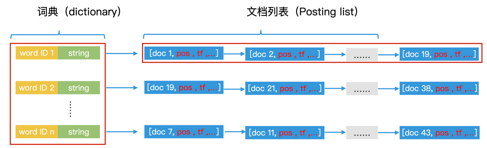

那么，我们怎样才能生成这样一个工业级的倒排索引呢？

首先，我们可以将大规模文档均匀划分为多个小的文档集合，并按照之前的方法，为每个小的文档集合在内存中生成倒排索引。

接下来，我们需要将内存中的倒排索引存入磁盘，生成一个临时倒排文件。我们先将内存中的文档列表按照关键词的字符串大小进行排序，然后从小到大，将关键词以及对应的文档列表作为一条记录写入临时倒排文件。这样一来，临时文件中的每条记录就都是有序的了。

而且，在临时文件中，我们并不需要存储关键词的编号。原因在于每个临时文件的编号都是局部的，并不是全局唯一的，不能作为最终的唯一编号，所以无需保存。

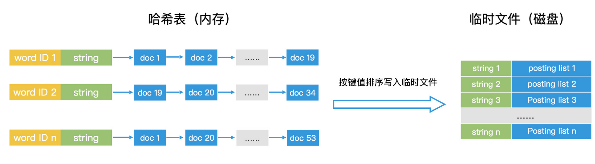

我们依次处理每一批小规模的文档集合，为每一批小规模文档集合生成一份对应的临时文件。等文档全部处理完以后，我们就得到了磁盘上的多个临时文件。

那磁盘上的多个临时文件该如何合并呢？这又要用到我们熟悉的多路归并技术了。每个临时文件里的每一条记录都是根据关键词有序排列的，因此我们在做多路归并的时候，需要先将所有临时文件当前记录的关键词取出。如果关键词相同的，我们就可以将对应的 posting list 读出，并且合并了。

如果 posting list 可以完全读入内存，那我们就可以直接在内存中完成合并，然后把合并结果作为一条完整的记录写入最终的倒排文件中；如果 posting list 过大无法装入内存，但 posting list 里面的元素本身又是有序的，我们也可以将 posting list 从前往后分段读入内存进行处理，直到处理完所有分段。这样我们就完成了一条完整记录的归并。

每完成一条完整记录的归并，我们就可以为这一条记录的关键词赋上一个编号，这样每个关键词就有了全局唯一的编号。重复这个过程，直到多个临时文件归并结束，这样我们就可以得到最终完整的倒排文件。

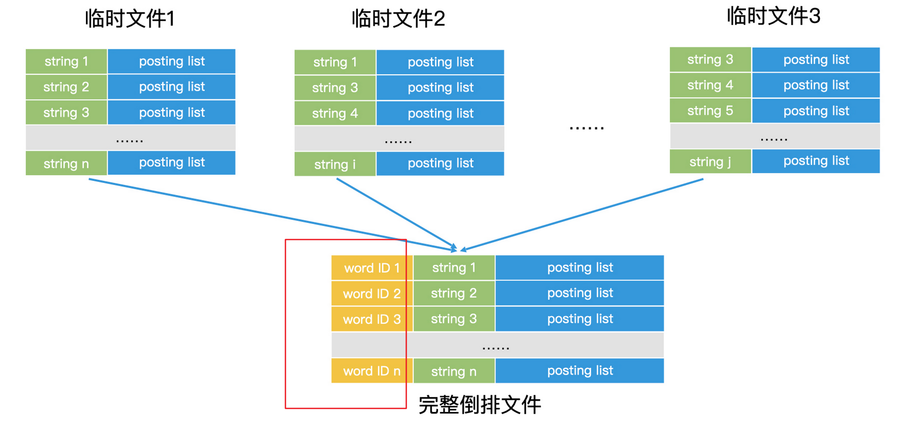

这种将大任务分解为多个小任务，最终根据 key 来归并的思路，其实和分布式计算 Map Reduce 的思路是十分相似的。因此，这种将大规模文档拆分成多个小规模文档集合，再生成倒排文件的方案，可以非常方便地迁移到 Map Reduce 的框架上，在多台机器上同时运行，大幅度提升倒排文件的生成效率。那如果你想了解更多的内容，你可以看看 Google 在 2004 年发表的经典的 map reduce 论文，论文里面就说了使用 map reduce 来构建倒排索引是当时最成功的一个应用。

## 2、如何使用磁盘上的倒排文件进行检索？

那对于这样一个大规模的倒排文件，我们在检索的时候是怎么使用的呢？其实，使用的时候有一条核心原则，那就是内存的检索效率比磁盘高许多，因此，能加载到内存中的数据，我们要尽可能加载到内存中。

我们知道，一个倒排索引由两部分构成，一部分是 key 集合的词典，另一部分是 key 对应的文档列表。在许多应用中，词典这一部分数据量不会很大，可以在内存中加载。因此，我们完全可以将倒排文件中的所有 key 读出，在内存中使用哈希表建立词典。

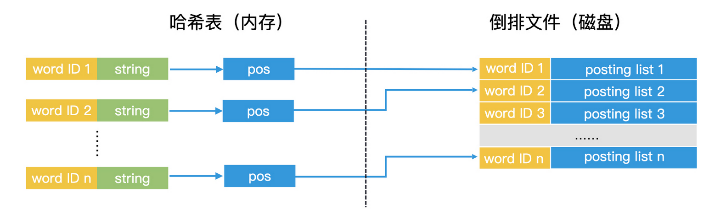

那么，当有查询发生时，通过检索内存中的哈希表，我们就能找到对应的 key，然后将磁盘中 key 对应的 postling list 读到内存中进行处理了。

说到这里，你可能会有疑问，如果词典本身也很大，只能存储在磁盘，无法加载到内存中该怎么办呢？其实，你可以试着将词典看作一个有序的 key 的序列，那这个场景是不是就变得很熟悉了？是的，我们完全可以用 B+ 树来完成词典的检索。

这样一来，我们就可以把检索过程总结成两个步骤。第一步，我们使用 B+ 树或类似的技术，查询到对应的词典中的关键字。第二步，我们将这个关键字对应的 posting list 读出，在内存中进行处理。

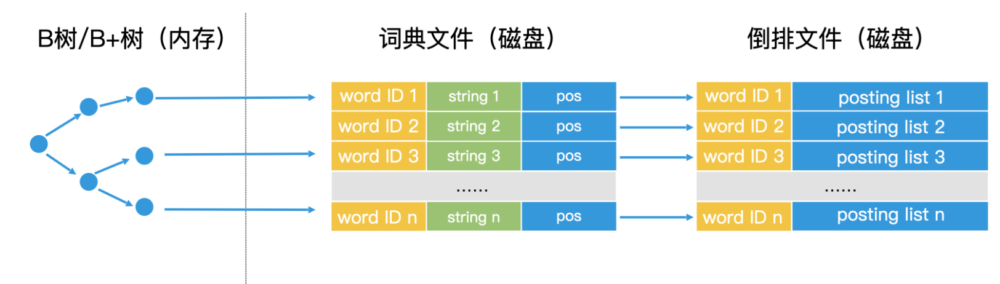

到这里，检索过程我们就说完了。不过，还有一种情况你需要考虑，那就是如果 posting list 非常长，它是很有可能无法加载到内存中进行处理的。比如说，在搜索引擎中，一些热门的关键词可能会出现在上亿个页面中，这些热门关键词对应的 posting list 就会非常大。那这样的情况下，我们该怎么办呢？其实，这个问题在本质上和词典无法加载到内存中是一样的。而且，posting list 中的数据也是有序的。因此，我们完全可以对长度过大的 posting list 也进行类似 B+ 树的索引，只读取有用的数据块到内存中，从而降低磁盘访问次数。包括在 Lucene 中，也是使用类似的思想，用分层跳表来实现 posting list，从而能将 posting list 分层加载到内存中。而对于长度不大的 posting list，我们仍然可以直接加载到内存中。

此外，如果内存空间足够大，我们还能使用缓存技术，比如 LRU 缓存，它会将频繁使用的 posting list 长期保存在内存中。这样一来，当需要频繁使用该 posting list 的时候，我们可以直接从内存中获取，而不需要重复读取磁盘，也就减少了磁盘 IO，从而提升了系统的检索效率。

总之，对于大规模倒排索引文件的使用，本质上还是我们之前学过的检索技术之间的组合应用。因为倒排文件分为词典和文档列表两部分，所以，检索过程其实就是分别对词典和文档列表的访问过程。因此，只要你知道如何对磁盘上的词典和文档列表进行索引和检索，你就能很好地掌握大规模倒排文件的检索过程。

## 总结

## 问题

# 09 | 索引更新：刚发布的文章就能被搜到，这是怎么做到的？

# 10 | 索引拆分：大规模检索系统如何使用分布式技术加速检索？

# 11｜精准Top K检索：搜索结果是怎么进行打分排序的？

# 12 | 非精准Top K检索：如何给检索结果的排序过程装上“加速器”？

# 13 | 空间检索（上）：如何用Geohash实现“查找附近的人”功能？

# 14 | 空间检索（下）：“查找最近的加油站”和“查找附近的人”有何不同？

# 15 | 最近邻检索（上）：如何用局部敏感哈希快速过滤相似文章？

# 16 | 最近邻检索（下）：如何用乘积量化实现“拍照识花”功能？

特别加餐 | 高性能检索系统中的设计漫谈

测一测 | 高性能检索系统的实战知识，你掌握了多少？

系统案例篇 (4讲)

# 17 | 存储系统：从检索技术角度剖析LevelDB的架构设计思想

LevelDB 是由 Google 开源的存储系统的代表，在工业界中被广泛地使用。它的性能非常突出，官方公布的 LevelDB 的随机读性能可以达到 6 万条记录 / 秒。那这是怎么做到的呢？这就和 LevelDB 的具体设计和实现有关了。

LevelDB 是基于 LSM 树优化而来的存储系统。都做了哪些优化呢？我们知道，LSM 树会将索引分为内存和磁盘两部分，并在内存达到阈值时启动树合并。但是，这里面存在着大量的细节问题。比如说，数据在内存中如何高效检索？数据是如何高效地从内存转移到磁盘的？以及我们如何在磁盘中对数据进行组织管理？还有数据是如何从磁盘中高效地检索出来的？

LevelDB 针对这些问题，使用了大量的检索技术进行优化设计。

## 1、如何利用读写分离设计将内存数据高效存储到磁盘？

首先，对内存中索引的高效检索，我们可以用很多检索技术，如红黑树、跳表等，这些数据结构会比 B+ 树更高效。因此，LevelDB 对于 LSM 树的第一个改进，就是使用跳表代替 B+ 树来实现内存中的 C0 树。

好，解决了第一个问题。那接下来的问题就是，内存数据要如何高效存储到磁盘。在第 7 讲中我们说过，我们是将内存中的 C0 树和磁盘上的 C1 树归并来存储的。但如果内存中的数据一边被写入修改，一边被写入磁盘，我们在归并的时候就会遇到数据的一致性管理问题。一般来说，这种情况是需要进行“加锁”处理的，但“加锁”处理又会大幅度降低检索效率。

为此，LevelDB 做了读写分离的设计。它将内存中的数据分为两块，一块叫作 MemTable，它是可读可写的。另一块叫作 Immutable MemTable，它是只读的。这两块数据的数据结构完全一样，都是跳表。那它们是怎么应用的呢？

具体来说就是，当 MemTable 的存储数据达到上限时，我们直接将它切换为只读的 Immutable MemTable，然后重新生成一个新的 MemTable，来支持新数据的写入和查询。这时，将内存索引存储到磁盘的问题，就变成了将 Immutable MemTable 写入磁盘的问题。而且，由于 Immutable MemTable 是只读的，因此，它不需要加锁就可以高效地写入磁盘中。

好了，数据的一致性管理问题解决了，我们接着看 C0 树和 C1 树的归并。在原始 LSM 树的设计中，内存索引写入磁盘时是直接和磁盘中的 C1 树进行归并的。但如果工程中也这么实现的话，会有两个很严重的问题：

- 1、合并代价很高，因为 C1 树很大，而 C0 树很小，这会导致它们在合并时产生大量的磁盘 IO；

- 2、合并频率会很频繁，由于 C0 树很小，很容易被写满，因此系统会频繁进行 C0 树和 C1 树的合并，这样频繁合并会带来的大量磁盘 IO，这更是系统无法承受的。

那针对这两个问题，LevelDB 采用了延迟合并的设计来优化。具体来说就是，先将 Immutable MemTable 顺序快速写入磁盘，直接变成一个个 SSTable（Sorted String Table）文件，之后再对这些 SSTable 文件进行合并。这样就避免了 C0 树和 C1 树昂贵的合并代价。至于 SSTable 文件是什么，以及多个 SSTable 文件怎么合并，我们一会儿再详细分析。

好了，现在你已经知道了，内存数据高效存储到磁盘上的具体方案了。那在这种方案下，数据又是如何检索的呢？在检索一个数据的时候，我们会先在 MemTable 中查找，如果查找不到再去 Immutable MemTable 中查找。如果 Immutable MemTable 也查询不到，我们才会到磁盘中去查找。

因为磁盘中原有的 C1 树被多个较小的 SSTable 文件代替了。那现在我们要解决的问题就变成了，如何快速提高磁盘中多个 SSTable 文件的检索效率。

## 2、SSTable 的分层管理设计

我们知道，SSTable 文件是由 Immutable MemTable 将数据顺序导入生成的。尽管 SSTable 中的数据是有序的，但是每个 SSTable 覆盖的数据范围都是没有规律的，所以 SSTable 之间的数据很可能有重叠。

比如说，第一个 SSTable 中的数据从 1 到 1000，第二个 SSTable 中的数据从 500 到 1500。那么当我们要查询 600 这个数据时，我们并不清楚应该在第一个 SSTable 中查找，还是在第二个 SSTable 中查找。最差的情况是，我们需要查询每一个 SSTable，这会带来非常巨大的磁盘访问开销。

因此，对于 SSTable 文件，我们需要将它整理一下，将 SSTable 文件中存的数据进行重新划分，让每个 SSTable 的覆盖范围不重叠。这样我们就能将 SSTable 按照覆盖范围来排序了。并且，由于每个 SSTable 覆盖范围不重叠，当我们需要查找数据的时候，我们只需要通过二分查找的方式，找到对应的一个 SSTable 文件，就可以在这个 SSTable 中完成查询了。

但是要让所有 SSTable 文件的覆盖范围不重叠，不是一个很简单的事情。为什么这么说呢？我们看一下这个处理过程。系统在最开始时，只会生成一个 SSTable 文件，这时候我们不需要进行任何处理，当系统生成第二个 SSTable 的时候，为了保证覆盖范围不重合，我们需要将这两个 SSTable 用多路归并的方式处理，生成新的 SSTable 文件。

那为了方便查询，我们要保证每个 SSTable 文件不要太大。因此，LevelDB 还控制了每个 SSTable 文件的容量上限（不超过 2M）。这样一来，两个 SSTable 合并就会生成 1 个到 2 个新的 SSTable。

这时，新的 SSTable 文件之间的覆盖范围就不重合了。当系统再新增一个 SSTable 时，我们还用之前的处理方式，来计算这个新的 SSTable 的覆盖范围，然后和已经排好序的 SSTable 比较，找出覆盖范围有重合的所有 SSTable 进行多路归并。这种多个 SSTable 进行多路归并，生成新的多个 SSTable 的过程，也叫作 Compaction。

随着 SSTable 文件的增多，多路归并的对象也会增多。那么，最差的情况会是什么呢？最差的情况是所有的 SSTable 都要进行多路归并。这几乎是一个不可能被接受的时间消耗，系统的读写性能都会受到很严重的影响。

那我们该怎么降低多路归并涉及的 SSTable 个数呢？在第 9 讲中，我们提到过，对于少量索引数据和大规模索引数据的合并，我们可以采用滚动合并法来避免大量数据的无效复制。因此，LevelDB 也采用了这个方法，将 SSTable 进行分层管理，然后逐层滚动合并。这就是 LevelDB 的分层思想，也是 LevelDB 的命名原因。接下来，我们就一起来看看 LevelDB 具体是怎么设计的。

首先，从 Immutable MemTable 转成的 SSTable 会被放在 Level 0 层。Level 0 层最多可以放 4 个 SSTable 文件。当 Level 0 层满了以后，我们就要将它们进行多路归并，生成新的有序的多个 SSTable 文件，这一层有序的 SSTable 文件就是 Level 1 层。

接下来，如果 Level 0 层又存入了新的 4 个 SSTable 文件，那么就需要和 Level 1 层中相关的 SSTable 进行多路归并了。但前面我们也分析过，如果 Level 1 中的 SSTable 数量很多，那么在大规模的文件合并时，磁盘 IO 代价会非常大。因此，LevelDB 的解决方案就是，给 Level 1 中的 SSTable 文件的总容量设定一个上限（默认设置为 10M），这样多路归并时就有了一个代价上限。

当 Level 1 层的 SSTable 文件总容量达到了上限之后，我们就需要选择一个 SSTable 的文件，将它并入下一层（为保证一层中每个 SSTable 文件都有机会并入下一层，我们选择 SSTable 文件的逻辑是轮流选择。也就是说第一次我们选择了文件 A，下一次就选择文件 A 后的一个文件）。下一层会将容量上限翻 10 倍，这样就能容纳更多的 SSTable 了。依此类推，如果下一层也存满了，我们就在该层中选择一个 SSTable，继续并入下一层。这就是 LevelDB 的分层设计了。

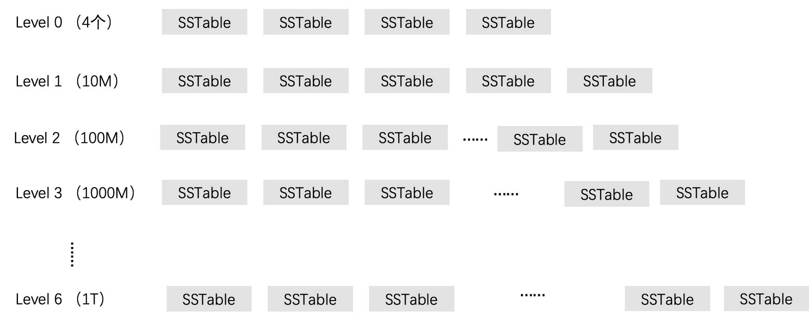

尽管 LevelDB 通过限制每层的文件总容量大小，能保证做多路归并时，会有一个开销上限。但是层数越大，容量上限就越大，那发生在下层的多路归并依然会造成大量的磁盘 IO 开销。这该怎么办呢？

对于这个问题，LevelDB 是通过加入一个限制条件解决的。在多路归并生成第 n 层的 SSTable 文件时，LevelDB 会判断生成的 SSTable 和第 n+1 层的重合覆盖度，如果重合覆盖度超过了 10 个文件，就结束这个 SSTable 的生成，继续生成下一个 SSTable 文件。

通过这个限制，LevelDB 就保证了第 n 层的任何一个 SSTable 要和第 n+1 层做多路归并时，最多不会有超过 10 个 SSTable 参与，从而保证了归并性能。

## 3、如何查找对应的 SSTable 文件

在理解了这样的架构之后，我们再来看看当我们想在磁盘中查找一个元素时，具体是怎么操作的。

首先，我们会在 Level 0 层中进行查找。由于 Level 0 层的 SSTable 没有做过多路归并处理，它们的覆盖范围是有重合的。因此，我们需要检查 Level 0 层中所有符合条件的 SSTable，在其中查找对应的元素。如果 Level 0 没有查到，那么就下沉一层继续查找。

而从 Level 1 开始，每一层的 SSTable 都做过了处理，这能保证覆盖范围不重合的。因此，对于同一层中的 SSTable，我们可以使用二分查找算法快速定位唯一的一个 SSTable 文件。如果查到了，就返回对应的 SSTable 文件；如果没有查到，就继续沉入下一层，直到查到了或查询结束。

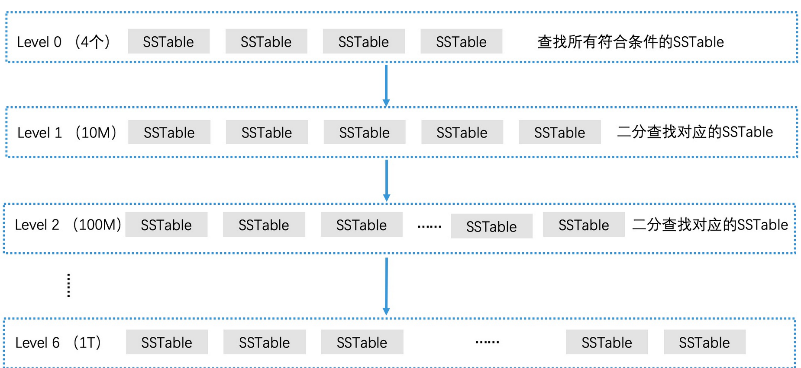

可以看到，通过这样的一种架构设计，我们就将 SSTable 进行了有序的管理，使得查询操作可以快速被限定在有限的 SSTable 中，从而达到了加速检索的目的。

## 4、SSTable 文件中的检索加速

那在定位到了对应的 SSTable 文件后，接下来我们该怎么查询指定的元素呢？这个时候，前面我们学过的一些检索技术，现在就可以派上用场了。

首先，LevelDB 使用索引与数据分离的设计思想，将 SSTable 分为数据存储区和数据索引区两大部分。

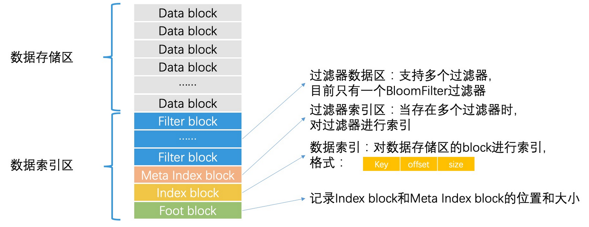

我们在读取 SSTable 文件时，不需要将整个 SSTable 文件全部读入内存，只需要先将数据索引区中的相关数据读入内存就可以了。这样就能大幅减少磁盘 IO 次数。

然后，我们需要快速确定这个 SSTable 是否包含查询的元素。对于这种是否存在的状态查询，我们可以使用前面讲过的 BloomFilter 技术进行高效检索。也就是说，我们可以从数据索引区中读出 BloomFilter 的数据。这样，我们就可以使用 O(1) 的时间代价在 BloomFilter 中查询。如果查询结果是不存在，我们就跳过这个 SSTable 文件。而如果 BloomFilter 中查询的结果是存在，我们就继续进行精确查找。

在进行精确查找时，我们将数据索引区中的 Index Block 读出，Index Block 中的每条记录都记录了每个 Data Block 的最小分隔 key、起始位置，还有 block 的大小。由于所有的记录都是根据 Key 排好序的，因此，我们可以使用二分查找算法，在 Index Block 中找到我们想查询的 Key。

那最后一步，就是将这个 Key 对应的 Data block 从 SSTable 文件中读出来，这样我们就完成了数据的查找和读取。

## 5、利用缓存加速检索 SSTable 文件的过程

在加速检索 SSTable 文件的过程中，你会发现，每次对 SSTable 进行二分查找时，我们都需要将 Index Block 和相应的 Data Block 分别从磁盘读入内存，这样就会造成两次磁盘 I/O 操作。我们知道磁盘 I/O 操作在性能上，和内存相比是非常慢的，这也会影响数据的检索速度。那这个环节我们该如何优化呢？常见的一种解决方案就是使用缓存。LevelDB 具体是怎么做的呢？

针对这两次读磁盘操作，LevelDB 分别设计了 table cache 和 block cache 两个缓存。其中，block cache 是配置可选的，它是将最近使用的 Data Block 加载在内存中。而 table cache 则是将最近使用的 SSTable 的 Index Block 加载在内存中。这两个缓存都使用 LRU 机制进行替换管理。

那么，当我们想读取一个 SSTable 的 Index Block 时，首先要去 table cache 中查找。如果查到了，就可以避免一次磁盘操作，从而提高检索效率。同理，如果接下来要读取对应的 Data Block 数据，那么我们也先去 block cache 中查找。如果未命中，我们才会去真正读磁盘。这样一来，我们就可以省去非常耗时的 I/O 操作，从而加速相关的检索操作了。

## 总结

- 1、首先，在内存中检索数据的环节，LevelDB 使用跳表代替 B+ 树，提高了内存检索效率。

- 2、其次，在将数据从内存写入磁盘的环节，LevelDB 先是使用了读写分离的设计，增加了一个只读的 Immutable MemTable 结构，避免了给内存索引加锁。然后，LevelDB 又采用了延迟合并设计来优化归并。具体来说就是，它先快速将 C0 树落盘生成 SSTable 文件，再使用其他异步进程对这些 SSTable 文件合并处理。

- 3、而在管理多个 SSTable 文件的环节，LevelDB 使用分层和滚动合并的设计来组织多个 SSTable 文件，避免了 C0 树和 C1 树的合并带来的大量数据被复制的问题。

- 4、最后，在磁盘中检索数据的环节，因为 SSTable 文件是有序的，所以我们通过多层二分查找的方式，就能快速定位到需要查询的 SSTable 文件。接着，在 SSTable 文件内查找元素时，LevelDB 先是使用索引与数据分离的设计，减少磁盘 IO，又使用 BloomFilter 和二分查找来完成检索加速。加速检索的过程中，LevelDB 又使用缓存技术，将会被反复读取的数据缓存在内存中，从而避免了磁盘开销。

总的来说，一个高性能的系统会综合使用多种检索技术。而 LevelDB 的实现，就可以看作是我们之前学过的各种检索技术的落地实践。

## 问题

> 1、当我们查询一个 key 时，为什么在某一层的 SSTable 中查到了以后，就可以直接返回，不用再去下一层查找了呢？如果下一层也有 SSTable 存储了这个 key 呢？

上层的数据比下层的数据新。

> 2、为什么从 Level 1 层开始，我们是限制 SSTable 的总容量大小，而不是像在 Level 0 层一样限制 SSTable 的数量？ （提示：SSTable 的生成过程会受到约束，无法保证每一个 SSTable 文件的大小）

因为会限制上一层SSTable数据范围不能和下一层重叠10个文件，这样会造成每个文件大小可能会很小，这样如果限制每一层文件的数量，会造成一层存储的数量量比较小，就失去了分层效果。

“在多路归并生成第 n 层的 SSTable 文件时，LevelDB 会判断生成的 SSTable 和第 n+1 层的重合覆盖度，如果重合覆盖度超过了 10 个文件，就结束这个 SSTable 的生成，继续生成下一个 SSTable 文件。”

因为有着这一条约束规则，可能某一层的sstable在某个时刻数量很多，但是每个文件都很小，如果通过文件数量限制，就使得这一层可能存不了什么数据。因此用总容量进行限制更合理。

> 3、当 MemTable 的存储数据达到上限时，我们直接将它切换为只读的 Immutable MemTable，然后重新生成一个新的 MemTable。这样的一个机制，内存中会出现多个Immutable MemTable 吗？ 上一个Immutable MemTable 没有及时写入到磁盘

这是一个好问题！实际上，这也是levelDB的一个瓶颈。当immutable memtable还没有完全写入磁盘时，memtable如果写满了，就会被阻塞住。因此，Facebook基于Google的levelDB，开源了一个rocksDB，rocksDB允许创建多个memtable，这样就解决了由于写入磁盘速度太慢导致memtable阻塞的问题。

> 4、还是不太理解基于 B+ 树与基于 lsm 的存储系统，两者的优缺点和使用场景有何不同，老师有时间可以解答一下。

lsm树和b+树会有许多不同的特点。但是如果从使用场景来看，最大的区别就是看读和写的需求。
- 在随机读很多，但是写入很少的场合，适合使用b+树。因为b+树能快速二分找到任何数据，并且磁盘io很少；但如果是使用lsm树，对于大量的随机读，它无法在内存中命中，因此会去读磁盘，并且是一层一层地多次读磁盘，会带来很严重的读放大效应。
- 但如果是大量的写操作的场景的话，lsm树进行了大量的批量写操作优化，因此效率会比b+树高许多。b+树每次写入都要去修改叶子节点，这会带来大量的磁盘io，使得效率急剧下降。这也是为什么日志系统，监控系统这类大量生成写入数据的应用会采用lsm树的原因。

> 5、LevelDB 分层的逻辑没有理解

你的问题我重新整理一下，尤其是level 0层怎么处理，这其实是一个很好的问题:

- 问题1:level 0层到level 1层合并的时候，level 0层是有多少个sstable参与合并？回答:按道理来说，我们应该是根据轮流选择的策略，选择一个level 0层的sstable进行和下层的合并，但是由于level 0层中的sstable可能范围是重叠的，因此我们需要检查每一个sstable，将有重叠部分的都加入到合并列表中。[所以level0层的文件都可能参与]

- 问题2:level n层中的一个sstable要和level n+1层中的所有sstable进行合并么？回答:不需要。如果level n层的sstable的最大最小值是begin和end，我们只需要在level n+1层中，找到可能包含begin到end之间的sstable即可。这个数量不会超过10个。因此不会带来太大的io。

- 问题3:为什么level n层的sstable和level n+1层的合并，个数不会超过10个？回答:在level n层的sstable生成的时候，我们会开始判断这个sstable和level n+1层的哪些sstable有重叠。如果发现重叠个数达到十个，就要结束这个sstable文件的生成。举个例子，如果level n+1层的11个sstable的第一个元素分别是[100，200，300，400，……，1000，1100]，即开头都是100的整数倍。那么，如果level n层的sstable文件生成时，准备写入的数据就是[100，200，300，400，……，1000，1100]，那么在要写入1100的时候，系统会发现，如果写入1100，那么这个sstable文件就会和下一层的11个sstable文件有重叠了，会违反规则，因此，这时候会结束这个sstable，也就是说，这个sstable文件中只有100到1000十个数。然后1100会被写入到一个新的sstable中。

> 6、level0层的每个sstable可能会有范围重叠，需要把重叠的部分提取到合并列表，这个合并列表是什么？还有就是提取之后呢，还是要遍及level0层的每个sstable与level1层的sstable进行归并吗？还有个问题就是:当某层的sstable向下层转移的时候，碰巧下层的空间也满了，这时候的处理方案是向下层递归吗？一直往下找，然后在向上处理

- 1.合并列表其实就是记录需要合并的sstable的列表。实际上，每次合并时，系统都会生成两个合并列表。以你提问的level 0层的情况为例，先选定一个要合并的sstable，然后将level 0层中和它范围重叠的sstable都加入到这个列表中;这就是合并列表1。然后，对于合并列表1中所有的sstable，我们能找到整体的范围begin和end。那么我们在下一层中，将和begin和end范围重叠的所有sstable文件加入合并列表2。那么，对于合并列表1和合并列表2中的所有的sstable，我们将它们一起做一次多路归并就可以了。

- 2.如果下层空间满了，没关系，先合并完，这时候，下层空间就超容量了。那么，我们再针对这一层，按之前介绍的规则，选择一个sstable再和下层合并即可。

PS:再补充一下知识点:合并的触发条件。系统会统计每个level的文件容量是否超过限制。超过上限比例最大的，将会被触发合并操作。

> 7、1内存中的C0树，采用跳表替换掉B+树，检索效率会有提升吗？我一直觉得两者是差不多的吧，什么场景下跳表会比B+树性能高很多？2滚动合并应该是后台操作，在合并的过程中，相应的sstable应该是被写锁锁定的吧？此时如果有应用执行读，会不会被阻塞？如果不阻塞，如何保证读写一致性？

- 1.虽然跳表和b+树在时间代价上都是一个量级的，但是跳表的插入删除都很简单，而b+树的插入删除会有节点分裂，节点合并，节点调整等问题，因此从工程效率来看，在纯内存的环境下，b+树并不比跳表和红黑树更合适。

- 2.所有的sstable都是只读的，不可更改。新的sstable生成了以后，老的sstable才会被删除，读操作才会转移到新的sstable上。因此，sstable不会被同时读写，没有读写阻塞的问题。

> 8、1在多路归并生成第 n 层的 SSTable 文件时，如何控制当前层最大容量呢？如果超过当前层的容量是停止计算还是把多余的量挪到下一层？2数据索引区里meta index block，当存在多个过滤器时，对过滤器进行索引。这是涉及到filter block过滤么？

- 1.不用停止计算，而是算完后，判断容量是否达到上限，如果超过，就根据文中介绍的选择文件的方式，将多余的文件和下一层进行合并。
- 2.如果存在多个filter block，而且每个filter都很大的话(比如说bloomfilter就有许多数据)，将所有的filter都读入内存会造成多次磁盘IO,因此需要有metaphor index block，帮助我们只读取我们需要的filter即可。

> 9、老师、我想请教下、levelDB是怎么处理`脏缓存`(eg. 有用户突然访问了别人很久不访问的数据(假设还比较大)、导致本来应该在缓存中的数据被驱逐, Data Block的优化效果就会打折扣)的 ?我是想到了Mysql 处理Buffer Poll的机制(分为Old 和 Young区)、类似的思想在jvm的gc管理中也有用到

- 首先，levelDB并没有“脏缓存”的问题。因为lsm树和b+树不一样。b+树的缓存对应着磁盘上的叶子节点，叶子节点是可以被修改的，因此会出现缓存在内存中的数据被修改，但是磁盘对应的叶子节点还未修改的“脏缓存”问题。而levelDB中，data block存的是sstable的数据，而每个sstable文件是只读的，不可修改的，因此不会出现“脏缓存”问题。

- 另一点，如果缓存数据被大片读入的新数据驱除，是否会有优化方案？这其实就依赖于lru的具体实现了(比如分为old和young区)，levelDB本身并没有做特殊处理。

> 10、MySQL在写数据的时候，是先写到change buffer内存中的，不会立刻写磁盘的，达到一定量再将change buffer落盘。这个和Memtable的设计理念类似，按理说，速度也不会太慢吧？那为啥用change buffer + WAL优化后的MySQL的写性能还是不如LSM类的存储系统啊？原因是啥啊

- 在MySQL的b+树的具体实现中，其实借鉴了许多lsm树的设计思想来提升性能，比如使用wal技术+change buffer，然后批量写叶子节点，而不是每次都随机写。这样就能减少磁盘IO。的确比原始的b+树快。不过在大批量写的应用场景中，这样优化后的b+树性能还是没有lsm树更好。因此日志系统这类场景还是使用lsm树更合适。

- 因为对于b+树，当内存中的change buffer写满的时候，会去更新多个叶子节点，这会带来多次磁盘IO;但lsm当内存中的memtable写满时，只会去写一次sstable文件。因此它们的主要差异，还是在怎么将数据写入磁盘上。当然所有的系统设计都是有利有弊，要做权衡。b+树写入磁盘后，随机读性能比较好;而lsm树写磁盘一时爽，但要随机读的时候就不爽了，它可能得在多层去寻找sstable文件，因此随机读性能比b+树差。

> 11、数据删除的时候是怎么处理的呢？是另外一个删除列表来保存删除的key吗？

数据删除时，是会将记录打上一个删除标记，然后写入sstable中。sstable和下一层合并时，对于带着删除标记的记录，levelDB会判断下层到最后一层是否还有这个key记录，有两种结果:
- 1.如果还有，那么这个删除标记就不能去掉，要一直保留到最后一层遇到相同key的时候才能删除；
- 2.如果没有，那么就可以删除掉这个带删除标记的记录。

> 12、老师，如果是memtable有删除key的情况下，skiplist是不是设置删除标志，刷level 0的时候 sstable也还是有这个删除标记，只有在最下层的sstable合并时候再真的物理删除key啊，感觉不这么做，可能get时候会读出来已经被删除的key

的确是的。sstable中，每一条记录都有一个标志位，表示是否是删除。这样就能避免误查询。对于有删除标志的记录，其实查询流程是一致的，就是查到数据就返回，不再往下查。然后看这个数据的状态位是有效还是删除，决定是否使用。

# 18 | 搜索引擎：输入搜索词以后，搜索引擎是怎么工作的？

## 1、搜索引擎的整体架构和工作过程

我们可以从功能结构上，把搜索引擎的核心系统分为三部分，分别是爬虫系统、索引系统和检索系统。

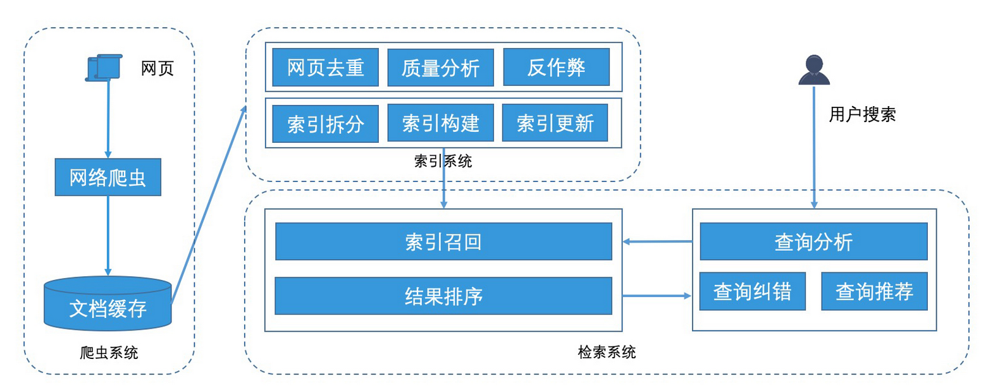

### 1、首先是爬虫系统

一个好的搜索引擎，必须要能采集足够多的网页。因此，我们需要通过高性能的爬虫系统来完成持续的网页抓取，并且将抓取到的网页存入存储平台中。一般来说，我们可以将抓取到的网页存放在基于 LSM 树的 HBase 中，以便支持数据的高效读写。

### 2、其次是索引系统

在爬虫系统抓取到网页之后，我们需要对这些网页进行一系列的处理，它们才可以变成可用的索引。处理可以分为两个阶段，首先是对网页进行预处理，主要的手段包括相似网页去重、网页质量分析、分词处理等工作，然后是对网页进行反作弊的分析工作，来避免一些作弊网页干扰搜索结果。处理好网页之后，我们就要为搜索引擎生成索引，索引的生成过程主要可以分为三步。

- 第一步，索引拆分。由于抓取到的网页量级非常大，把它们全部都生成索引不太现实，因此我们会在离线阶段，根据之前的网页预处理结果，进行计算和筛选，分别分离出高质量和普通质量的网页集合。这样，我们就能进行分层索引了（第 12 讲）。当然，无论是高质量的网页集合还是普通质量的网页集合，数据量都不小。因此，我们还需要进行基于文档的拆分（第 10 讲），以便生成索引。

- 第二步，索引构建。在确认了索引的分片机制以后，我们可以使用 Map Reduce 服务，来为每个索引分片生成对应的任务，然后生成相应的倒排索引文件（第 8 讲）。每个倒排索引文件代表一个索引分片，它们都可以加载到线上的服务器中，来提供检索服务。

- 第三步，索引更新。为了保证能实时更新数据，搜索引擎会使用全量索引结合增量索引的机制来完成索引更新。并且由于搜索引擎的全量索引数据量巨大，因此，我们一般使用滚动合并法来完成索引更新（第 9 讲）。

有了这样创建出来的索引之后，搜索引擎就可以为万亿级别的网页提供高效的检索服务了。

### 3、最后是检索系统

在检索阶段，如果用户搜索了一个关键词，那么搜索引擎首先需要做查询分析，也就是通过分析查询词本身以及用户行为特征，找出用户的真实查询意图。如果发现查询词有误或者结果很少，搜索引擎还会进行拼写纠正或相关查询推荐，然后再以改写后的查询词去检索服务中查询结果。

在检索服务中，搜索引擎会将查询词发送给相应的索引分片，索引分片通过倒排索引的检索机制，将自己所负责的分片结果返回。对于返回的结果，搜索引擎再根据相关性分析和质量分析，使用机器学习进行打分，选出 Top K 个结果（第 11 讲）来完成检索。

以上就是一个搜索引擎的完整的工作机制了。那与广告引擎和推荐引擎相比，搜索引擎最大的特点，就是它有一个很强的检索约束条件，那就是用户输入的查询词。可以说，查询词是搜索引擎进行检索的最核心的信息。但是很多时候，用户输入的查询词是含糊的、不精准的，甚至是带有错误的。还有一种可能是，用户输入的查询词不在倒排索引中。

这些问题也都是搜索引擎要解决的核心问题。因此，接下来，我们就以搜索“极客时间”为例，来讲讲搜索引擎的解决方案。

## 2、搜索引擎是如何进行查询分析的？

一般来说，用户在搜索的时候，搜索词往往会非常简短，很难完全体现用户的实际意图。而如果我们无法准确地理解用户的真实意图，那搜索结果的准确性就无从谈起了。因此，搜索引擎中检索系统的第一步，一定是进行查询分析。具体来说，就是理解用户输入的搜索词，并且对输错的查询词进行查询纠正，以及对意图不明的查询词进行查询推荐。那查询分析具体该怎么做呢？

在查询分析的过程中，我们主要会对搜索词进行分词粒度分析、词的属性分析、用户需求分析等工作。其中，分词粒度分析直接关系到我们以什么 key 去倒排索引中检索，而属性分析和需求分析则可以帮助我们在打分排序时，有更多的因子可以考虑。因此，分词粒度分析是查询分析的基础。那什么是分词粒度分析呢？

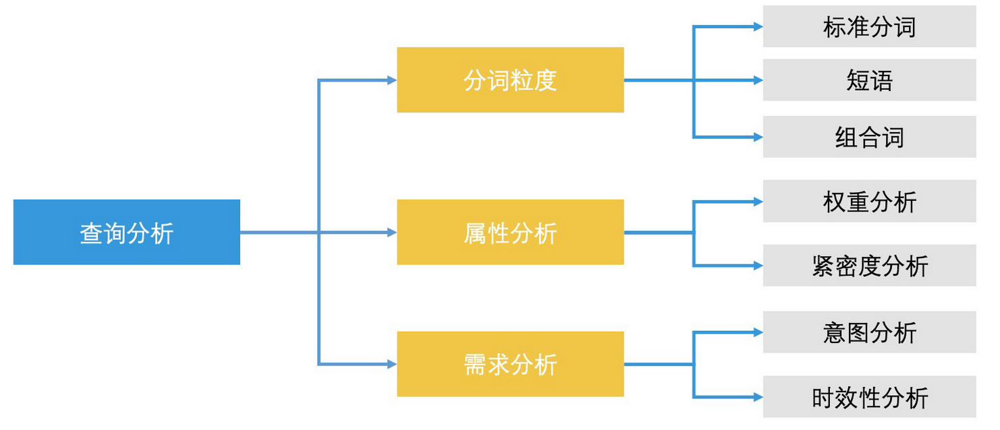

分词粒度分析是中文搜索中特有的一个环节。因为中文词和英文词相比，最大的区别是词与词之间没有明确的分隔标志（空格）。因此，对于中文的搜索输入，我们要做的第一件事情，是使用分词工具进行合理的分词。但分词，就会带来一个分词粒度的问题。

比如说，当用户输入“极客时间”时：如果我们按单字来切分，这个搜索词就会变成“极 / 客 / 时 / 间”这四个检索词；如果是按“极客 / 时间”来切分，就会变成两个检索词的组合；如果是不做任何分词，将“极客时间”当成一个整体，那就是一个搜索短语。切分的方式这么多，到底我们该怎么选择呢？

一般来说，我们会使用默认的标准分词粒度再结合整个短语，作为我们的检索关键词去倒排索引中检索，这就叫作混合粒度的分词方式。那“极客时间”就会被分为【极客、时间、极客时间】这样的检索词组合。如果检索后返回的结果数量不足，那我们还会去查询【极、客、时、间】这样的更细粒度的单字组合。

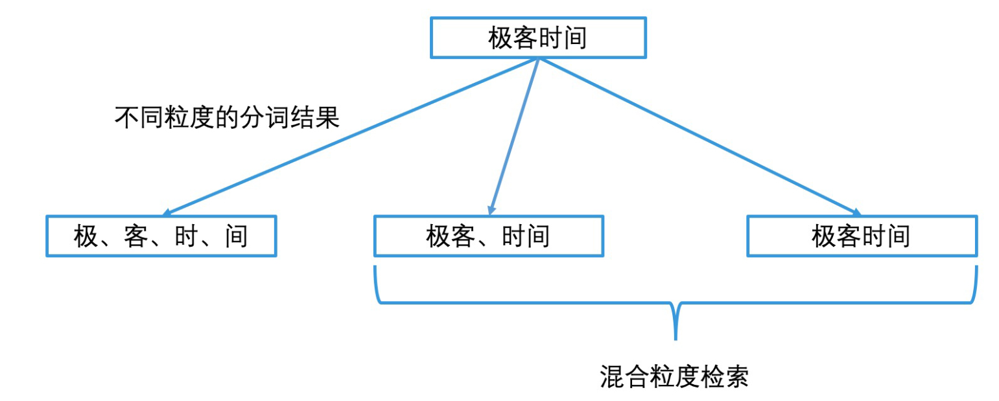

## 3、搜索引擎是如何进行查询纠错的？

以上，都是在用户输入正确搜索词时的查询分析。那如果用户的输入有误，比如说，将“极客时间”输成了“即可时间”，或者是“级可时间”，搜索引擎又会怎么办呢？这个时候，我们就需要用到查询纠错功能和查询推荐功能了。

我们先来说一说查询纠错功能是如何使用的。查询纠错的过程一般会分为三个步骤，分别是错误判断、候选召回和打分排序。

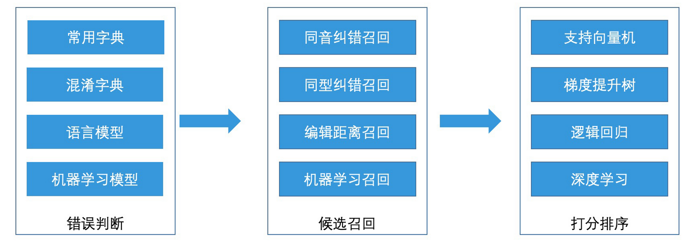

一般来说，在错误判断阶段，我们会根据人工编辑以及对搜索日志进行数据挖掘，得到常见字典和混淆字典。然后，我们使用哈希表或者字典树等结构来对字典进行索引，使得这两个字典具有高效的检索能力。如果某个分词后的检索词，我们无法在常用字典中查询到，或者它出现在了混淆字典中，那就说明这个词很可能是错误的。因此，我们还需要启动后续的候选召回和打分排序步骤。

不过，近年来，基于语言模型和机器学习的错误判断方式被广泛地使用。这种判断方式具体来说就是，我们会在用户输入检索词后，先对其进行置信度判断，如果得分过低，再进入后续的纠错过程。这能帮助我们更好地进行纠错。为什么这么说呢？我们来看一个例子，如果我们将“极客”错误地输入成了“级可”，通过检索常用字典和混淆字典，我们是有可能发现这个错误的。但如果我们错输成“即可”，由于“即可”本身也是一个合理的词，因此我们就需要使用基于语言模型和机器学习的方法，计算“即可”这个词出现在这个上下文中的置信度，才能发现有错。

在错误判断完成之后，就进入候选召回阶段了。在候选召回中，我们会预估查询词出错的每种可能性，提前准备好可能的正确结果。一般情况下，中文输入有 2 种常见的出错情况。

第 1 种，拼音相同但是字不同。这时，我们就要将相同拼音的词作为候选集，以拼音为 Key 进行检索。第 2 种是字形相似，那我们就生成一个相似字型的词典，通过该词典召回候选集。此外，还有根据编辑距离进行相似召回，根据机器学习得到候选集进行召回等。通过这些不同的纠错方式，我们就能得到可能的纠错结果集合了。

最后，我们要对众多的纠错结果进行打分排序。在这个过程中，我们可以使用各种常见的机器学习和深度学习算法进行打分判断（你可以回忆一下 11 讲，我们讲过的那些方法），将得分最高的纠错结果返回。这样就完成了整个查询纠错过程。

好了，到这里，我们就把查询纠错的过程说完了。至于查询推荐，则更多的是分析搜索日志的结果，用“查询会话”“点击图”等技术，来分析哪些检索词之间有相关性。比如说，如果检索“极客时间”和检索“极客邦”的用户都会浏览相同的网页，那么“极客邦”就很有可能出现在“极客时间”的相关推荐中。

因此，查询推荐可以提供出更多的关键词，帮助搜索引擎召回更多的结果。它一般会在关键词不足的场景下被启用，或是作为补充提示出现。所以，关于查询推荐我就不再多说了，你只要记住查询推荐的原理就可以了。

总的来说，通过查询分析、查询纠错、查询推荐的过程，搜索引擎就能对用户的意图有一个更深入的理解。那接下来，我们就通过得到的一系列关键词，也就是【极客、时间、极客时间】，去查询倒排索引了。

## 4、搜索引擎是如何完成短语检索的？

首先，我们可以使用“极客时间”作为一个完整的关键词去倒排索引中查找。如果倒排索引中能查询到这个关键词，并且返回的结果集足够，那这样的检索结果是非常精准的。但是，这依赖于我们在构建索引的时候，必须将“极客时间”作为一个关键词进行处理。可是在构建倒排索引的时候，我们一般是通过分析搜索日志，将一些常见的热门短语作为关键词加入倒排索引中。由于能被直接作为关键词的短语数量不会太多，因此，如果“极客时间”没有被识别为热门短语进行单独处理的话，那我们拿着“极客时间”这个短语作为关键词，直接查询的结果就是空的。在这种情况下，我们就会使用更细粒度的分词结果，也就是使用“极客”和“时间”这两个关键词，去做两次检索，然后将得到的结果求交集合并。不过，这样做就会有一个问题：如果只是简单地将这两个关键词检索出来的文档列表求交集合并，那我们最终得到的结果并不一定会包含带有“极客时间”的文档。这又是为什么呢？

你可以考虑一下这种情况：如果有一个网页中有一句话是“一个极客往往没有时间打游戏”。那我们搜索“极客”“时间”这两个关键词的时候，这个网页就会被检索出来。但这是我们期望的检索结果吗？并不是。因为“极客”和“时间”的位置离得太远了。那如果我们能记录下关键词出现在文档中的位置，并且在合并文档列表的时候，判断两个关键词是否接近，不就可以解决这个问题？没错，这种方法就叫作位置信息索引法。我们会通过两个关键词的位置关系来判断该文档和检索词的相关性。位置越远，相关性就越小，如果位置直接邻接在一起，相关性就最高。

如果是两个以上的关键词联合查询，那我们会将同时包含所有关键词的最小片段称为最小窗口，然后通过衡量查询结果中最小窗口的长度，来判断多个关键词是否接近。这么说比较抽象，我们来举个例子。当我们分别以“极”“客”“时”“间”这四个字作为关键词查询时，如果一个文档中有这么一句话“极多客人，一时之间”，那字符“极”到字符“间”之间就是 9 个字符。也就是说，在这句话中覆盖“极”“客”“时”“间”这四个关键词的最小窗口长度就是 9。有了这个方法，我们就可以将搜索结果按照最小窗口长度排序，然后留下相关性最高的一批结果了。这样，我们就完成“极客时间”的短语检索了。

## 总结

通常的流程是，先对查询词进行查询分析，搜索引擎通过对查询词进行不同粒度的分词，得到多个检索词。在这个过程中，搜索引擎还会通过查询纠错和相似推荐，拓展出更多的检索词候选。然后，搜索引擎会利用得到的检索词在倒排索引中进行短语检索。这个时候，搜索引擎会通过位置信息索引法，来判断检索结果和检索词的相关性。最后，搜索引擎会通过对搜索结果中最小窗口的长度排序，留下相关性最高的结果。

## 问题

> 1、请问老师，我们经常听说的page rank算法在搜索引擎中是怎么具体应用的？

page rank是Google很重要的一个专利，不过它的核心思想其实不复杂。它通过分析不同网页之间的相互链接关系，来判断网页的质量。打个比方，就像论文引用一样，被大量高质量论文引用的论文，应该也是高质量论文。page rank就是通过这样的方式，对每个网页赋予了一个质量分。

那具体会在哪些环节使用page rank质量分呢？

- 1.在进行索引分层时，高质量网页和普通质量网页需要区分，这时候page rank质量分就是一个很重要的参考。
- 2.打分排序阶段，page rank质量分也是很重要的因子。
- 3.在进行锚文本分析时，高质量网页出来的锚文本更重要。
- 4.在爬虫抓取网页时，可以优先抓取高质量的网页链接出来的网页。

以上是我想到的一些场景，供参考

> 2、在使用位置信息索引法中，我们在计算最小窗口的时候需要保证关键词是有序的。如果这个时候有两个关键词的话，我们可以先固定第一个关键词，然后只找它和第二个关键词的距离就可以了。那如果有 3 个关键词，我们又该如何保证次序呢？

先固定第一个词，然后找第二个词的距离。第二个词距离固定以后，找第三个词和第二个词的距离。

这其实是一个贪心算法。局部最优一定是全局最优。
- 首先，第一个词可能会出现在n个位置。我们遍历第一个词的所有位置。
- 然后，当第一个词固定位置时，我们寻找这个位置后面的最近的第二个词的位置。这样就能固定第二个词的位置。
- 接着，在第二个词固定以后，我们再在第二个词后面，找最近的第三个词的位置。那么，这个位置和第一个词的位置结合，就是这次计算得到的最小窗口长度。(之所以说是贪心算法，是因为我们不需要穷举所有第二个词和第三个词的位置组合，而是只需要找最近的就可以了)

- 然后我们把第一个词的这n个位置的最小窗口长度都算出来，取最小的一个，就得到了最终结果。

当然，在求第一个词的n个位置的n个最小窗口的过程中，我们还能利用之前计算的结果。比如说第一个词的第二个位置，其实也在第二个词的前面，那么第二个词的位置不用变，第三个词的位置也不用变了。

整体来说，你会看到，位置信息索引法，计算代价会比较大，因此，对于热门短语，能直接作为key加入倒排索引是更高效的。

> 3、老师有没有爬虫或者搜索方面的书籍推荐的

搜索引擎方面的书籍，其实《信息检索导论》是可以作为基础学习的。因为其中一个作者就是Google的副总裁，书中就以搜索引擎为例子。包括还有《搜索引擎:信息检索实践》。
国内还有《这就是搜索引擎:核心技术详解》这类书籍，都可以看看。
至于网络爬虫，这更偏向于实践和工程。可能要结合你使用的编程语言。比如说Python的scrapy，或者Java相关的网络爬虫书籍。

# 19 | 广告系统：广告引擎如何做到在0.1s内返回广告信息？

# 20 | 推荐引擎：没有搜索词，“头条”怎么找到你感兴趣的文章？

