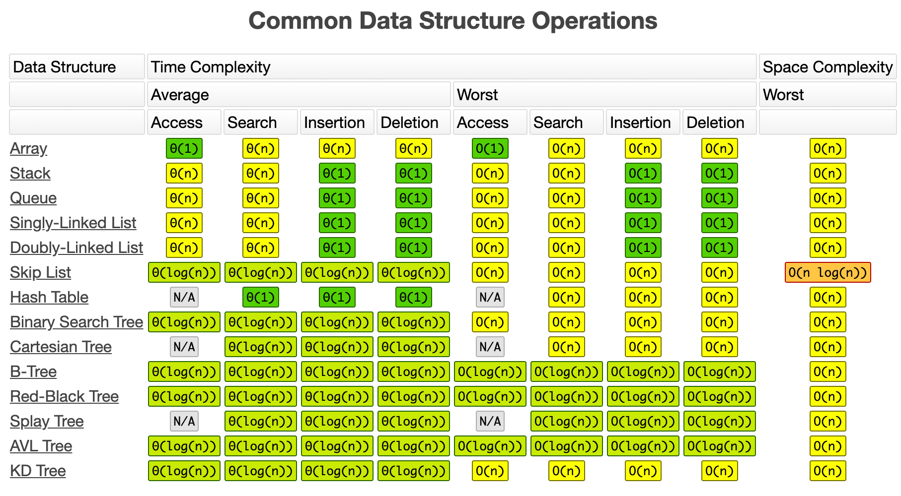
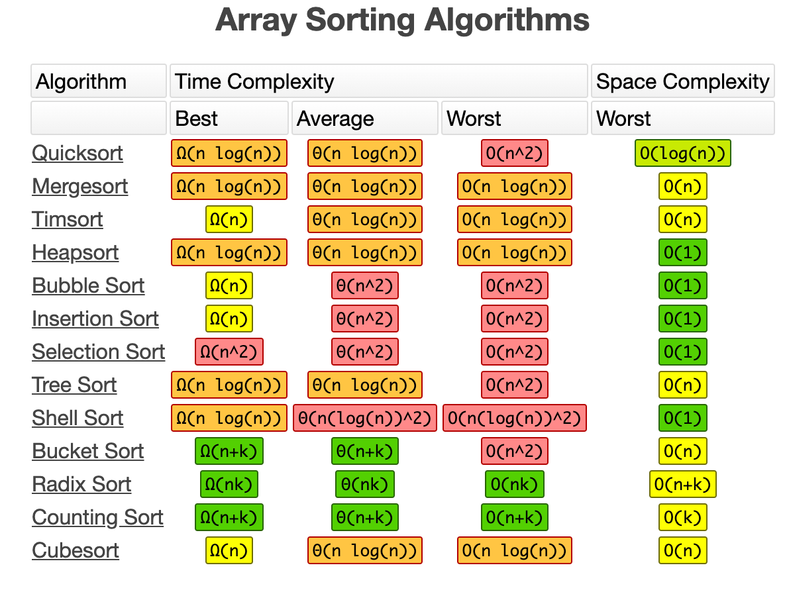
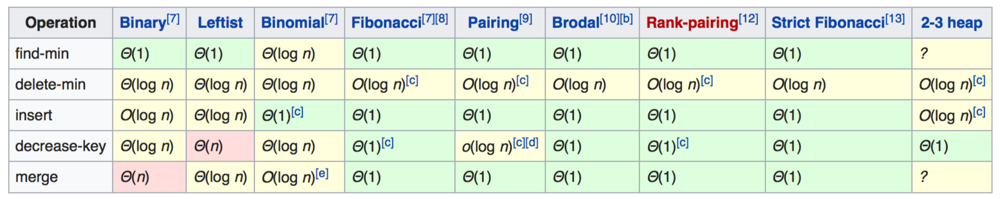
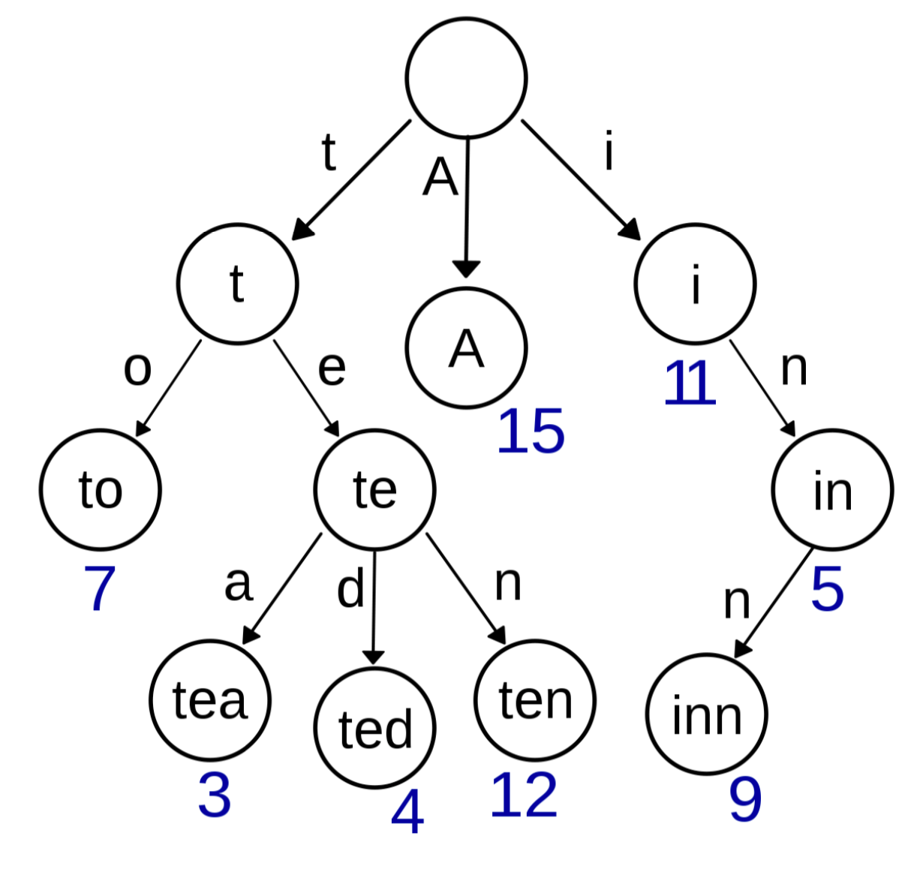
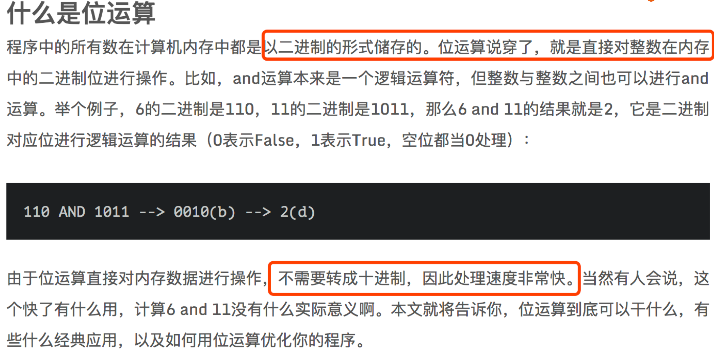

https://leetcode-cn.com/problemset/algorithms/

第一章：课程综述 (4讲)

01 | 合格程序员的第一步：算法与数据结构

02 | 如何事半功倍地学习算法与数据结构

03 | 如何计算算法的复杂度

04 | 如何通过LeetCode来进行算法题目练习

第二章：理论讲解+面试题实战 (53讲)

# 05 | 理论讲解：数组&链表

1. https://leetcode-cn.com/problems/reverse-linked-list/ 

2. https://leetcode-cn.com/problems/linked-list-cycle

3. https://leetcode-cn.com/problems/swap-nodes-in-pairs 

4. https://leetcode-cn.com/problems/linked-list-cycle-ii

5. https://leetcode-cn.com/problems/reverse-nodes-in-k-group/

## 06 | 面试题：反转一个单链表&判断链表是否有环

# 07 | 理论讲解：堆栈&队列

备注： 图片来源 https://www.bigocheatsheet.com/

题目232 https://leetcode-cn.com/problems/implement-queue-using-stacks/solution/

题目225 https://leetcode-cn.com/problems/implement-stack-using-queues/description/ 

题目20 https://leetcode-cn.com/problems/valid-parentheses/description/

## 08 | 面试题：判断括号字符串是否有效

思路：栈。时间复杂度和空间复杂度N

## 09 | 面试题：用队列实现栈&用栈实现队列

# 10 | 理论讲解：优先队列

1. Stack - First In Last Out (FILO)  Array or Linked List

2. Queue - First In First Out (FIFO)  Array or Linked List

3. PriorityQueue - 优先队列列  正常⼊入、按照优先级出

1. Heap (Binary, Binomial, Fibonacci)

2. Binary Search Tree

## 11 | 面试题：返回数据流中的第K大元素

题目703  https://leetcode-cn.com/problems/kth-largest-element-in-a-stream/

https://leetcode-cn.com/problems/kth-largest-element-in-a-stream/discuss/149050/Java-Priority-Queue

## 12 | 面试题：返回滑动窗口中的最大值

题目239 https://leetcode-cn.com/problems/sliding-window-maximum/

大顶堆 NlogK

# 13 | 理论讲解：哈希表

两个核心问题：

- 1. Hash Function 
- 2. Hash Collisions（拉链法）

题目242  https://leetcode-cn.com/problems/valid-anagram/description/ 

题目1  https://leetcode-cn.com/problems/two-sum/description/

题目15  https://leetcode-cn.com/problems/3sum/description/

题目18  https://leetcode-cn.com/problems/4sum/

题目49  https://leetcode-cn.com/problems/group-anagrams/description/

## 14 | 面试题：有效的字母异位词
## 15 | 面试题：两数之和
## 16 | 面试题：三数之和

# 17 | 理论讲解：树&二叉树&二叉搜索树

- 1. Tree, Binary Tree, Binary Search Tree 
- 2. Graph

Linked List 就是特殊化的 Tree， Tree 就是特殊化的 Graph

二叉搜索树(英语:Binary Search Tree)，也称有序二叉树(英语:ordered binary tree)，排序⼆叉树(英语:
sorted binary tree)，是指⼀一棵空树或者具有下列列性质的二叉树:
- 1. 若任意节点的左⼦子树不空，则左⼦树上所有结点的值均小于它的 根结点的值;
- 2. 若任意节点的右⼦子树不空，则右子树上所有结点的值均大于它的 根结点的值;
- 3. 任意节点的左、右⼦子树也分别为二叉查找树。

题目98 https://leetcode-cn.com/problems/validate-binary-search-tree 

题目235 https://leetcode-cn.com/problems/lowest-common-ancestor-of-a-binary-search-tree/

题目236 https://leetcode-cn.com/problems/lowest-common-ancestor-of-a-binary-tree/

## 18 | 面试题：验证二叉搜索树
## 19 | 面试题：二叉树&二叉搜索树的最近公共祖先

# 20 | 理论讲解：二叉树遍历

- 1. 前序(Pre-order):根-左-右 
- 2. 中序(In-order):左-根-右
- 3. 后序(Post-order):左-右-根

# 21 | 理论讲解：递归&分治

- 1.Recursion 
- 2.Divide & Conquer

1. https://leetcode-cn.com/problems/powx-n/description/

2. https://leetcode-cn.com/problems/majority-element/description/

3. https://leetcode-cn.com/problems/maximum-subarray/description/

4. https://leetcode-cn.com/problems/valid-anagram/#/description

5. https://leetcode-cn.com/problems/find-all-anagrams-in-a-string/#/description 

6. https://leetcode-cn.com/problems/anagrams/#/description

## 22 | 面试题：Pow(x,n)
## 23 | 面试题：求众数

# 24 | 理论讲解：贪心算法

贪心法，又称贪⼼心算法、贪婪算法:在对问题求解时，总是做出在当前看来是最好的选择。

适用 Greedy 的场景：简单地说，问题能够分解成⼦子问题来解决，子问题的最优解能递推到最终问题的最优解。这种子问题最优解成为最优⼦结构。

贪⼼算法与动态规划的不同在于它对每个⼦问题的解决方案都做出选择，不能回退。动态规划则会保存以前的运算结果，并根据以前的结果对当前进行选择，有回退功能。

1. https://leetcode-cn.com/problems/best-time-to-buy-and-sell-stock-ii/description/ 

2. https://leetcode-cn.com/problems/lemonade-change/description/

3. https://leetcode-cn.com/problems/assign-cookies/description/

4. https://leetcode-cn.com/problems/walking-robot-simulation/description/

## 25 | 面试题：买卖股票的最佳时机

# 26 | 理论讲解：广度优先搜索
# 27 | 理论讲解：深度优先搜索

1. https://leetcode-cn.com/problems/binary-tree-level-order-traversal/

2. https://leetcode-cn.com/problems/maximum-depth-of-binary-tree/

3. https://leetcode-cn.com/problems/minimum-depth-of-binary-tree/description/ 

4. https://leetcode-cn.com/problems/generate-parentheses/

## 28 | 面试题：二叉树层次遍历
## 29 | 面试题：二叉树的最大和最小深度
## 30 | 面试题：生成有效括号组合

# 31 | 理论讲解：剪枝

1. https://leetcode-cn.com/problems/n-queens/

2. https://leetcode-cn.com/problems/n-queens-ii/

3. https://leetcode-cn.com/problems/valid-sudoku/description/

4. https://leetcode-cn.com/problems/sudoku-solver/#/description

## 32 | 面试题：N皇后问题
## 33 | 面试题：数独问题

# 34 | 理论讲解：二分查找

- 1. Sorted(单调递增或者递减)
- 2. Bounded(存在上下界)
- 3. Accessible by index(能够通过索引访问)

1. https://leetcode-cn.com/problems/sqrtx/

2. https://leetcode-cn.com/problems/valid-perfect-square/

https://www.beyond3d.com/content/articles/8/ (扩展阅读)

## 35 | 面试题：实现一个求解平方根的函数

# 36 | 理论讲解：字典树

Trie树，即字典树，又称单词查找树或键树，是一种树形结构，是⼀种哈希树的变种。典型应⽤用是⽤于统计和排序大量的字符串串(但不不仅限于字符串)，所以经常被搜索引擎系统用于文本词频统计。

它的优点是:最⼤限度地减少⽆谓的字符串比较，查询效率比哈希表⾼。

Trie的核⼼思想是空间换时间。利用字符串的公共前缀来降低查询时间的开销以达到提⾼效率的目的

> 基本性质
- 1. 根节点不包含字符，除根节点外每一个节点都只包含⼀ 个字符。

- 2. 从根节点到某一节点，路径上经过的字符连接起来，为该节点对应的字符串。

- 3. 每个节点的所有子节点包含的字符都不相同。

1. https://leetcode-cn.com/problems/implement-trie-prefix-tree/#/description

2. https://leetcode-cn.com/problems/word-search-ii/

系统设计:search suggestion 搜索建议

## 37 | 面试题：实现一个字典树
## 38 | 面试题：二维网格中的单词搜索问题

# 39 | 理论讲解：位运算

1. https://leetcode-cn.com/problems/number-of-1-bits/

2. https://leetcode-cn.com/problems/power-of-two/

3. https://leetcode-cn.com/problems/counting-bits/description/ 

4. https://leetcode-cn.com/problems/n-queens-ii/description/

## 40 | 面试题：统计位1的个数
## 41 | 面试题：2的幂次方问题&比特位计数问题
## 42 | 面试题：N皇后问题的另一种解法

# 43 | 理论理解：动态规划

- 1. 递归+记忆化 —> 递推
- 2. 状态的定义:opt[n], dp[n], fib[n]
- 3. 状态转移⽅方程:opt[n] = best_of(opt[n-1], opt[n-2], ...) 
- 4. 最优⼦子结构

1. https://leetcode-cn.com/problems/climbing-stairs/description/

2. https://leetcode-cn.com/problems/triangle/description/

3. https://leetcode-cn.com/problems/maximum-product-subarray/description/

4. https://leetcode-cn.com/problems/best-time-to-buy-and-sell-stock/#/description

5. https://leetcode-cn.com/problems/best-time-to-buy-and-sell-stock-ii/

6. https://leetcode-cn.com/problems/best-time-to-buy-and-sell-stock-iii/

7. https://leetcode-cn.com/problems/best-time-to-buy-and-sell-stock-iv/

8. https://leetcode-cn.com/problems/best-time-to-buy-and-sell-stock-with-cooldown/

9. https://leetcode-cn.com/problems/best-time-to-buy-and-sell-stock-with-transaction-fee/ 

10. https://leetcode-cn.com/problems/longest-increasing-subsequence 

11. https://leetcode-cn.com/problems/coin-change/ 

12. https://leetcode-cn.com/problems/edit-distance/

## 45 | 面试题：爬楼梯
## 46 | 面试题：三角形的最小路径和
## 47 | 面试题：乘积最大子序列
## 48 | 面试题：股票买卖系列
## 49 | 面试题：最长上升子序列
## 50 | 面试题：零钱兑换
## 51 | 面试题：编辑距离

# 52 | 理论讲解：并查集

并查集 (union & find) 是⼀种树型的数据结构，用于处理理一些不不交 集(Disjoint Sets)的合并及查询问题。

Find:确定元素属于哪一个⼦子集。它可以被用来确定两个元素是否 属于同一⼦子集。

Union:将两个子集合并成同一个集合。

1. https://leetcode-cn.com/problems/number-of-islands/ 

2. https://leetcode-cn.com/problems/friend-circles/

## 53 | 面试题：岛屿的个数&朋友圈（上）
## 54 | 面试题：岛屿的个数&朋友圈（下）

# 55 | 理论讲解： LRU Cache

- 1. Least Recently Used(最近最少使⽤用)
- 2. Hash Table + Double LinkedList(哈希表+双向链表)
- 3. O(1) get and O(1) set

LFU - least frequently used(最近最不常⽤用⻚页⾯面置换算法)

https://leetcode-cn.com/problems/lru-cache/#/

## 56 | 面试题：设计和实现一个LRU Cache缓存机制

# 57 | 理论讲解：布隆过滤器

一个很长的二进制向量量和一系列随机映射函数。布隆过滤器可以⽤用于检索一个元素是否在一个集合中。它的优点是空间效率和查询时间都远超过一般的算法，缺点是有一定的误识别率和删除困难。

第三章：课程总结 (5讲)

58 | 课程重点回顾
59 | FAQ答疑&面试中切题四件套
60 | 回到起点：斐波拉契数列
61 | 白板实战番外篇：斐波拉契数列
62 | 结课测试&最后的一些经验分享

