<!-- TOC -->

- [入门准备篇](#入门准备篇)
    - [01 | 入学测验：你究竟对Linux操作系统了解多少？](#01--入学测验你究竟对linux操作系统了解多少)
    - [02 | 学习路径：爬过这六个陡坡，你就能对Linux了如指掌](#02--学习路径爬过这六个陡坡你就能对linux了如指掌)
- [第一部分 Linux操作系统综述](#第一部分-linux操作系统综述)
    - [03 | Linux内核中组成部分](#03--linux内核中组成部分)
    - [04 | 快速上手几个Linux命令](#04--快速上手几个linux命令)
    - [05 | 学会几个系统调用](#05--学会几个系统调用)
        - [1、进程管理](#1进程管理)
        - [2、内存管理](#2内存管理)
        - [3、文件管理（Linux里有一个特点：一切皆文件）](#3文件管理linux里有一个特点一切皆文件)
        - [4、进程间通信](#4进程间通信)
        - [5、网络通信](#5网络通信)
        - [6、中介与 Glibc](#6中介与-glibc)
- [第二部分 系统初始化](#第二部分-系统初始化)
    - [06 | x86架构(三大特点，一是标准，二是开放，三是兼容)](#06--x86架构三大特点一是标准二是开放三是兼容)
        - [1、计算机的工作模式是什么样的？](#1计算机的工作模式是什么样的)
        - [2、CPU 和内存是如何配合工作的](#2cpu-和内存是如何配合工作的)
        - [3、从 8086 的原理说起](#3从-8086-的原理说起)
        - [4、32 位处理器](#432-位处理器)
    - [07 | 从BIOS到bootloader](#07--从bios到bootloader)
    - [08 | 内核初始化](#08--内核初始化)
    - [09 | 系统调用](#09--系统调用)
- [第三部分 进程管理](#第三部分-进程管理)
- [第四部分 内存管理](#第四部分-内存管理)
- [第五部分 文件系统](#第五部分-文件系统)
- [第六部分 输入输出系统](#第六部分-输入输出系统)
- [第七部分 进程间通信](#第七部分-进程间通信)
- [第八部分 网络系统](#第八部分-网络系统)
- [第九部分 虚拟化](#第九部分-虚拟化)
- [第十部分 容器化](#第十部分-容器化)
- [实战串讲篇](#实战串讲篇)
    - [67 | 期末测试：这些操作系统问题，你真的掌握了吗？（todo）](#67--期末测试这些操作系统问题你真的掌握了吗todo)

<!-- /TOC -->


# 入门准备篇


## 01 | 入学测验：你究竟对Linux操作系统了解多少？

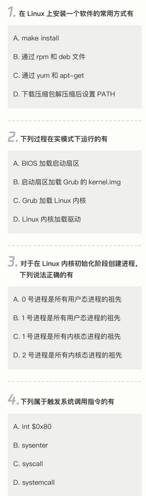

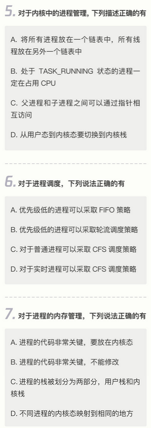

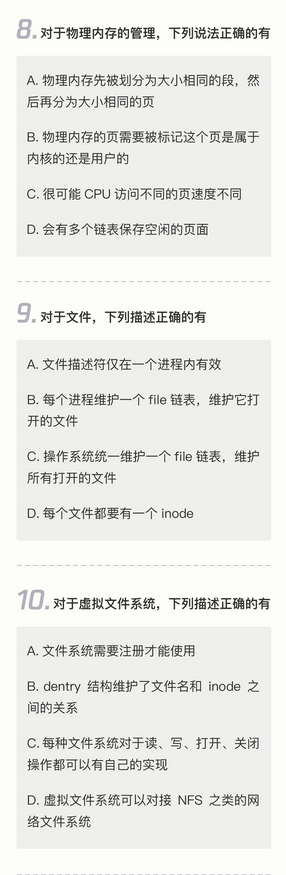

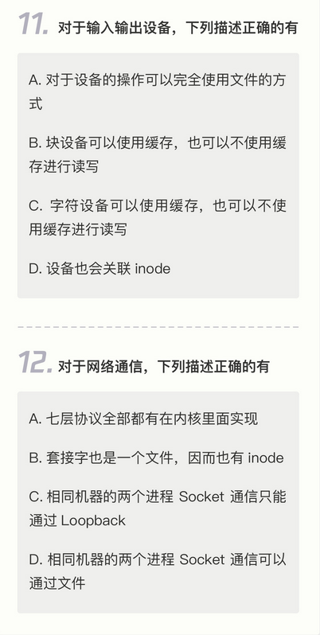


## 02 | 学习路径：爬过这六个陡坡，你就能对Linux了如指掌


> 总结

在整个 Linux 的学习过程中，要爬的坡有六个，分别是：熟练使用 Linux 命令行、使用 Linux 进行程序设计、了解 Linux 内核机制、阅读 Linux 内核代码、实验定制 Linux 组件，以及最后落到生产实践上。

- 第一个坡：熟练使用 Linux 命令行；(Linux里是“命令行 + 文件”模式，即每一二个命令都有对应的配置文件)

《鸟哥的 Linux 私房菜》、《Linux 系统管理技术手册》

- 第二个坡：通过系统调用或者 glibc，学会自己进行程序设计；（命令行其实是使用别人写的程序）

《UNIX 环境高级编程》

- 第三个坡：了解 Linux 内核机制，反复研习重点突破

《深入理解 LINUX 内核》

- 第四个坡：阅读 Linux 内核代码，聚焦核心逻辑和场景

《LINUX 内核源代码情景分析》

- 第五个坡：实验定制化 Linux 组件，已经没人能阻挡你成为内核开发工程师了

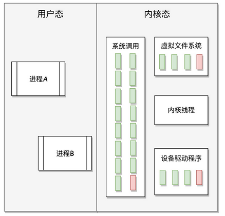


- 最后一个坡：面向真实场景的开发，实践没有终点

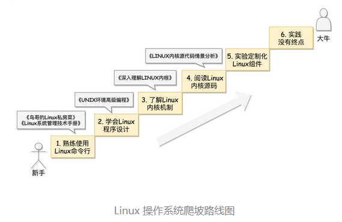


# 第一部分 Linux操作系统综述

## 03 | Linux内核中组成部分


> 计算机的硬件组成

CPU、主板、显卡、网卡、硬盘、鼠标、键盘、显示器；

内存在哪里？在主板上插入内存条？

> 操作系统内部各个子系统的划分以及功能

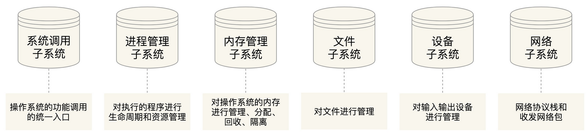

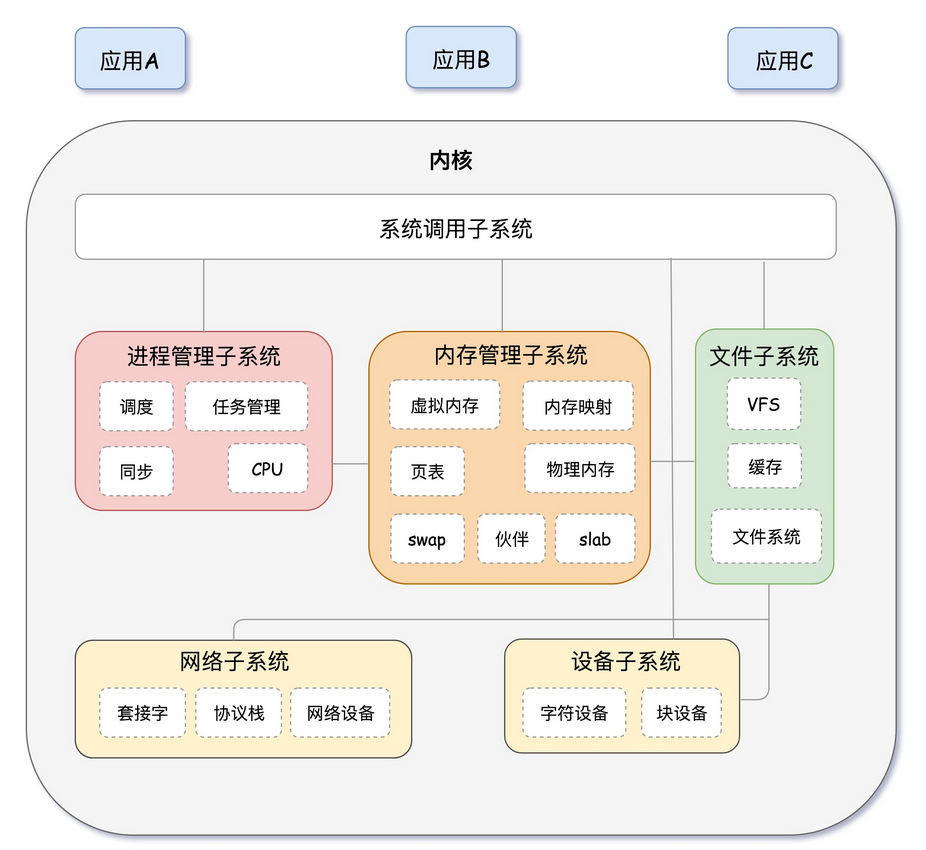


## 04 | 快速上手几个Linux命令

- useradd xxx 添加用户
- passwd xxx 设置密码

- ls -l，也就是用列表的方式列出文件
- chmod 改变文件的读写执行权限
- chown改变所属用户
- chgrp改变所属组


- wget
- yum
- vim

- shutdown -h now是现在就关机
- reboot就是重启


> 安装软件

对于 Linux 来讲，你可以下载 rpm 或者 deb。这个就是 Linux 下面的安装包。为什么有两种呢？因为 Linux 现在常用的有两大体系，一个是 CentOS 体系，一个是 Ubuntu 体系，前者使用 rpm，后者使用 deb。


CentOS 下面使用rpm -i jdk-XXX_linux-x64_bin.rpm进行安装，Ubuntu 下面使用dpkg -i jdk-XXX_linux-x64_bin.deb。其中 -i 就是 install 的意思。


在 Linux 下面，凭借rpm -qa和dpkg -l就可以查看安装的软件列表，-q 就是 query，a 就是 all，-l 的意思就是 list。

如果要删除，可以用rpm -e和dpkg -r。-e 就是 erase，-r 就是 remove。

Linux 也有自己的软件管家，CentOS 下面是 yum，Ubuntu 下面是 apt-get。你可以根据关键词搜索，例如搜索jdk、yum search jdk和apt-cache search jdk，可以搜索出很多很多可以安装的 jdk 版本。如果数目太多，你可以通过管道 grep、more、less 来进行过滤。

选中一个之后，我们就可以进行安装了。你可以用yum install java-11-openjdk.x86_64和apt-get install openjdk-9-jdk来进行安装。

安装以后，如何卸载呢？我们可以使用yum erase java-11-openjdk.x86_64和apt-get purge openjdk-9-jdk。

而 Linux 允许我们配置从哪里下载这些软件的，地点就在配置文件里面。

- 对于 CentOS 来讲，配置文件在/etc/yum.repos.d/CentOS-Base.repo里。
- 对于 Ubuntu 来讲，配置文件在/etc/apt/sources.list里。

备注：其实无论是先下载再安装，还是通过软件管家进行安装，都是下载一些文件，然后将这些文件放在某个路径下，然后在相应的配置文件中配置一下。

配置环境变量，可以通过 export 命令来配置。

export 命令仅在当前命令行的会话中管用，一旦退出重新登录进来，就不管用了，有没有一个地方可以像 Windows 里面可以配置永远管用呢？在当前用户的默认工作目录，例如 /root 或者 /home/user 下面，有一个.bashrc 文件，这个文件是以点开头的，这个文件默认看不到，需要 ls -la 才能看到，a 就是 all。每次登录的时候，这个文件都会运行，因而把它放在这里。这样登录进来就会自动执行。当然也可以通过 source .bashrc 手动执行。


> 运行程序

- 1、可执行文件的目录下./filename即可运行，如果放在 PATH 里设置的路径下面，就不用./ 了，直接输入文件名就可以运行了，Linux 会帮你找。

- 2、后台运行nohup---no hang up（不挂起），最终命令的一般形式为nohup command >out.file 2>&1 &。这里面，“1”表示文件描述符 1，表示标准输出，“2”表示文件描述符 2，意思是标准错误输出，“2>&1”表示标准输出和错误输出合并了。合并到哪里去呢？到 out.file 里。

- 3、那这个进程如何关闭呢？我们假设启动的程序包含某个关键字，那就可以使用下面的命令。ps -ef |grep 关键字 |awk '{print $2}'|xargs kill -9 。这里的 awk '{print $2}'是指第二列的内容，是运行的程序 ID。我们可以通过 xargs 传递给 kill -9，也就是发给这个运行的程序一个信号，让它关闭。如果你已经知道运行的程序 ID，可以直接使用 kill 关闭运行的程序。


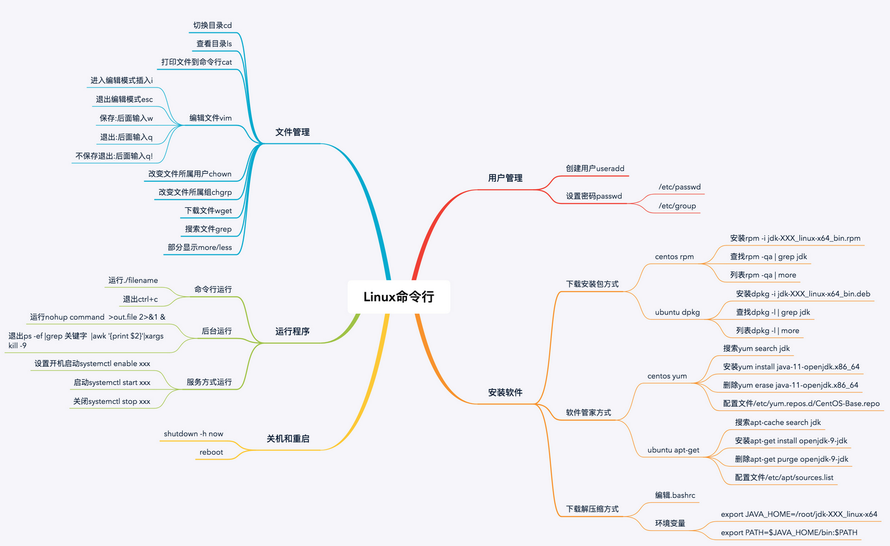


## 05 | 学会几个系统调用

### 1、进程管理

创建进程的系统调用叫fork。这个名字很奇怪，中文叫“分支”。为啥启动一个新进程叫“分支”呢？

在 Linux 里，要创建一个新的进程，需要一个老的进程调用 fork 来实现，其中老的进程叫作父进程（Parent Process），新的进程叫作子进程（Child Process）。

### 2、内存管理

在操作系统中，每个进程都有自己的内存，互相之间不干扰，有独立的进程内存空间。

对于进程的内存空间来讲，放程序代码的这部分，我们称为代码段（Code Segment）。

对于进程的内存空间来讲，放进程运行中产生数据的这部分，我们称为数据段（Data Segment）。其中局部变量的部分，在当前函数执行的时候起作用，当进入另一个函数时，这个变量就释放了；也有动态分配的，会较长时间保存，指明才销毁的，这部分称为堆（Heap）。


这里我们介绍两个在堆里面分配内存的系统调用，brk和mmap。

- 当分配的内存数量比较小的时候，使用 brk，会和原来的堆的数据连在一起；
- 当分配的内存数量比较大的时候，使用 mmap，会重新划分一块区域；

备注：只有进程要去使用部分内存的时候，才会使用内存管理的系统调用来登记，说自己马上就要用了，希望分配一部分内存给它，但是这还不代表真的就对应到了物理内存。只有真的写入数据的时候，发现没有对应物理内存，才会触发一个中断，现分配物理内存。

### 3、文件管理（Linux里有一个特点：一切皆文件）

对于文件的操作，下面这六个系统调用是最重要的：
- 对于已经有的文件，可以使用open打开这个文件，close关闭这个文件；
- 对于没有的文件，可以使用creat创建文件；
- 打开文件以后，可以使用lseek跳到文件的某个位置；
- 可以对文件的内容进行读写，读的系统调用是read，写是write。

每个文件，Linux 都会分配一个文件描述符（File Descriptor），这是一个整数。有了这个文件描述符，我们就可以使用系统调用，查看或者干预进程运行的方方面面。


### 4、进程间通信

- 1、消息队列：这个消息队列是在内核里的，我们可以通过msgget创建一个新的队列，msgsnd将消息发送到消息队列，而消息接收方可以使用msgrcv从队列中取消息。

- 2、共享内存：我们可以通过shmget创建一个共享内存块，通过shmat将共享内存映射到自己的内存空间，然后就可以读写了。如果大家同时修改同一块数据咋办？这就需要有一种方式，让不同的人能够排他地访问，这就是信号量的机制 Semaphore。简单场景：对于只允许一个人访问的需求，我们可以将信号量设为 1。当一个人要访问的时候，先调用sem_wait。如果这时候没有人访问，则占用这个信号量，他就可以开始访问了。如果这个时候另一个人要访问，也会调用 sem_wait。由于前一个人已经在访问了，所以后面这个人就必须等待上一个人访问完之后才能访问。当上一个人访问完毕后，会调用sem_post将信号量释放，于是下一个人等待结束，可以访问这个资源了。


### 5、网络通信

不同机器通过网络相互通信，要遵循相同的网络协议，也即 TCP/IP 网络协议栈。Linux 内核里有对于网络协议栈的实现。如何暴露出服务给项目组使用呢？

网络服务是通过套接字 Socket 来提供服务的。Socket 这个名字很有意思，可以作“插口”或者“插槽”讲。虽然我们是写软件程序，但是你可以想象成弄一根网线，一头插在客户端，一头插在服务端，然后进行通信。因此，在通信之前，双方都要建立一个 Socket。我们可以通过 Socket 系统调用建立一个 Socket。

Socket 也是一个文件，也有一个文件描述符，也可以通过读写函数进行通信。


### 6、中介与 Glibc

Glibc 是 Linux 下使用的开源的标准 C 库，它是 GNU 发布的 libc 库。Glibc 为程序员提供丰富的 API，除了例如字符串处理、数学运算等用户态服务之外，最重要的是封装了操作系统提供的系统服务，即系统调用的封装。

每个特定的系统调用对应了至少一个 Glibc 封装的库函数，比如说，系统提供的打开文件系统调用 sys_open 对应的是 Glibc 中的 open 函数。

有时候，Glibc 一个单独的 API 可能调用多个系统调用，比如说，Glibc 提供的 printf 函数就会调用如 sys_open、sys_mmap、sys_write、sys_close 等等系统调用。

也有时候，多个 API 也可能只对应同一个系统调用，如 Glibc 下实现的 malloc、calloc、free 等函数用来分配和释放内存，都利用了内核的 sys_brk 的系统调用。


> 其他
- 异常处理与信号处理
- 内核源码网站：https://www.kernel.org


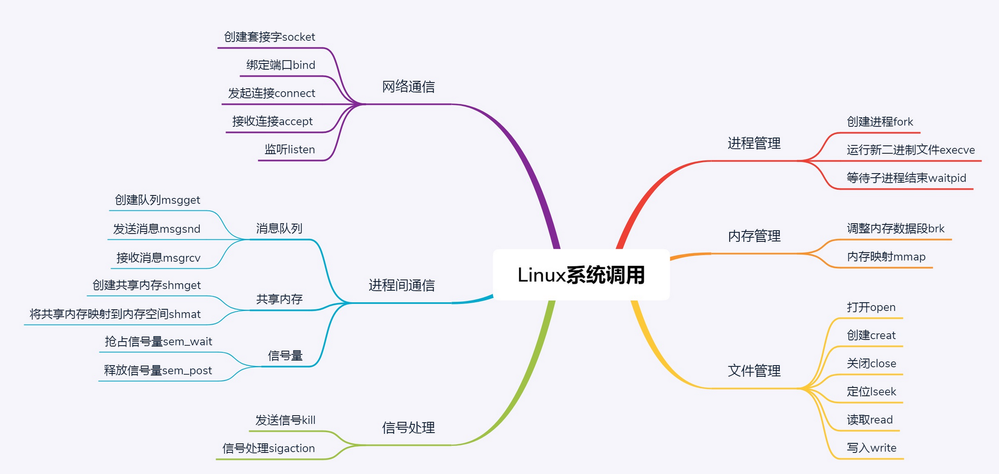


# 第二部分 系统初始化

## 06 | x86架构(三大特点，一是标准，二是开放，三是兼容)

### 1、计算机的工作模式是什么样的？

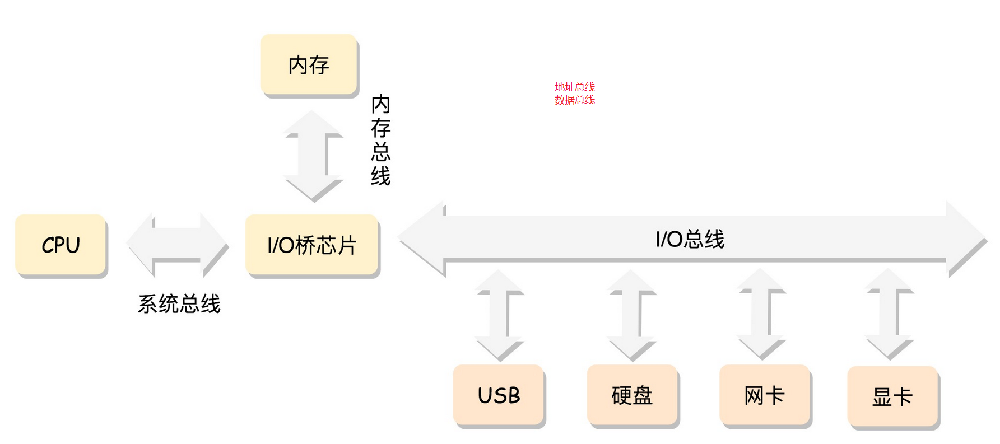

- 最核心的就是 CPU（Central Processing Unit，中央处理器）。这是这台计算机的大脑，所有的设备都围绕它展开。

- CPU 和其他设备连接，要靠一种叫作总线（Bus）的东西，其实就是主板上密密麻麻的集成电路，这些东西组成了 CPU 和其他设备的高速通道。

- 在这些设备中，最重要的是内存（Memory）。因为单靠 CPU 是没办法完成计算任务的，很多复杂的计算任务都需要将中间结果保存下来，然后基于中间结果进行进一步的计算。CPU 本身没办法保存这么多中间结果，这就要依赖内存了。

### 2、CPU 和内存是如何配合工作的

CPU 其实也不是单纯的一块，它包括三个部分，运算单元、数据单元和控制单元。

- 运算单元只管算，例如做加法、做位移等等。但是，它不知道应该算哪些数据，运算结果应该放在哪里。

- 运算单元计算的数据如果每次都要经过总线，到内存里面现拿，这样就太慢了，所以就有了数据单元。数据单元包括 CPU 内部的缓存和寄存器组，空间很小，但是速度飞快，可以暂时存放数据和运算结果。

- 有了放数据的地方，也有了算的地方，还需要有个指挥到底做什么运算的地方，这就是控制单元。控制单元是一个统一的指挥中心，它可以获得下一条指令，然后执行这条指令。这个指令会指导运算单元取出数据单元中的某几个数据，计算出个结果，然后放在数据单元的某个地方。

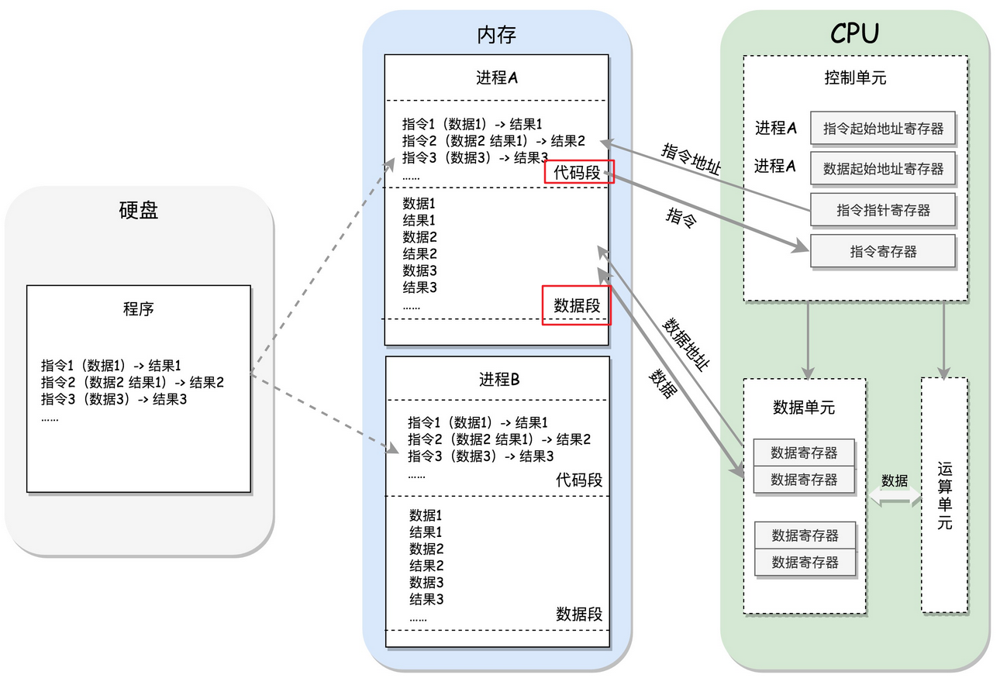

进程一旦运行，比如图中两个进程 A 和 B，会有独立的内存空间，互相隔离，程序会分别加载到进程 A 和进程 B 的内存空间里面，形成各自的代码段。当然真实情况肯定比我说的要复杂的多，进程的内存虽然隔离但不连续，除了简单的区分代码段和数据段，还会分得更细。

程序运行的过程中要操作的数据和产生的计算结果，都会放在数据段里面。那 CPU 怎么执行这些程序，操作这些数据，产生一些结果，并写入回内存呢？

CPU 的控制单元里面，有一个指令指针寄存器，它里面存放的是下一条指令在内存中的地址。控制单元会不停地将代码段的指令拿进来，先放入指令寄存器。

当前的指令分两部分，一部分是做什么操作，例如是加法还是位移；一部分是操作哪些数据。要执行这条指令，就要把第一部分交给运算单元，第二部分交给数据单元。

数据单元根据数据的地址，从数据段里读到数据寄存器里，就可以参与运算了。运算单元做完运算，产生的结果会暂存在数据单元的数据寄存器里。最终，会有指令将数据写回内存中的数据段。

到这里，你会发现，CPU 和内存来来回回传数据，靠的都是总线。其实总线上主要有两类数据，一个是地址数据，也就是我想拿内存中哪个位置的数据，这类总线叫地址总线（Address Bus）；另一类是真正的数据，这类总线叫数据总线（Data Bus）。

所以说，总线其实有点像连接 CPU 和内存这两个设备的高速公路，说总线到底是多少位，就类似说高速公路有几个车道。但是这两种总线的位数意义是不同的。

- 地址总线的位数，决定了能访问的地址范围到底有多广；
- 数据总线的位数，决定了一次能拿多少个数据进来；


### 3、从 8086 的原理说起

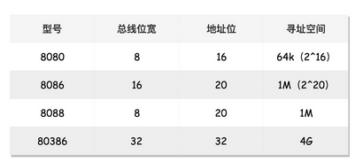

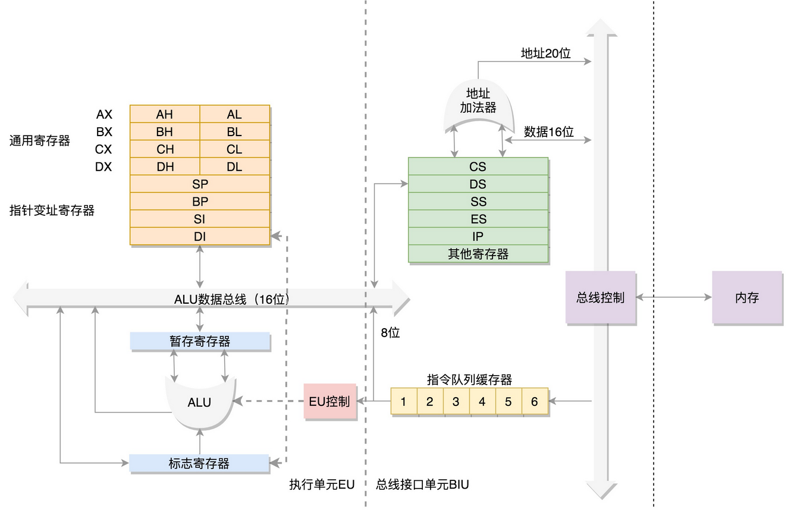


> 数据单元

为了暂存数据，8086 处理器内部有 8 个 16 位的通用寄存器，也就是刚才说的 CPU 内部的数据单元，分别是 AX、BX、CX、DX、SP、BP、SI、DI。这些寄存器主要用于在计算过程中暂存数据。

这些寄存器比较灵活，其中 AX、BX、CX、DX 可以分成两个 8 位的寄存器来使用，分别是 AH、AL、BH、BL、CH、CL、DH、DL，其中 H 就是 High（高位），L 就是 Low（低位）的意思。这样，比较长的数据也能暂存，比较短的数据也能暂存。你可能会说 16 位并不长啊，你可别忘了，那是在计算机刚刚起步的时代。

> 控制单元

IP 寄存器就是指令指针寄存器（Instruction Pointer Register)，指向代码段中下一条指令的位置。CPU 会根据它来不断地将指令从内存的代码段中，加载到 CPU 的指令队列中，然后交给运算单元去执行。

如果需要切换进程呢？每个进程都分代码段和数据段，为了指向不同进程的地址空间，有四个 16 位的段寄存器，分别是 CS、DS、SS、ES。其中，CS 就是代码段寄存器（Code Segment Register），通过它可以找到代码在内存中的位置；DS 是数据段的寄存器，通过它可以找到数据在内存中的位置。

SS 是栈寄存器（Stack Register）。栈是程序运行中一个特殊的数据结构，数据的存取只能从一端进行，秉承后进先出的原则，push 就是入栈，pop 就是出栈。凡是与函数调用相关的操作，都与栈紧密相关。例如，A 调用 B，B 调用 C。当 A 调用 B 的时候，要执行 B 函数的逻辑，因而 A 运行的相关信息就会被 push 到栈里面。当 B 调用 C 的时候，同样，B 运行相关信息会被 push 到栈里面，然后才运行 C 函数的逻辑。当 C 运行完毕的时候，先 pop 出来的是 B，B 就接着调用 C 之后的指令运行下去。B 运行完了，再 pop 出来的就是 A，A 接着运行，直到结束。

如果运算中需要加载内存中的数据，需要通过 DS 找到内存中的数据，加载到通用寄存器中，应该如何加载呢？对于一个段，有一个起始的地址，而段内的具体位置，我们称为偏移量（Offset）。例如 8 号会议室的第三排，8 号会议室就是起始地址，第三排就是偏移量。

在 CS 和 DS 中都存放着一个段的起始地址。代码段的偏移量在 IP 寄存器中，数据段的偏移量会放在通用寄存器中。这时候问题来了，CS 和 DS 都是 16 位的，也就是说，起始地址都是 16 位的，IP 寄存器和通用寄存器都是 16 位的，偏移量也是 16 位的，但是 8086 的地址总线地址是 20 位。怎么凑够这 20 位呢？方法就是“起始地址 *16+ 偏移量”，也就是把 CS 和 DS 中的值左移 4 位，变成 20 位的，加上 16 位的偏移量，这样就可以得到最终 20 位的数据地址。

从这个计算方式可以算出，无论真正的内存多么大，对于只有 20 位地址总线的 8086 来讲，能够区分出的地址也就 2^20=1M，超过这个空间就访问不到了。这又是为啥呢？如果你想访问 1M+X 的地方，这个位置已经超过 20 位了，由于地址总线只有 20 位，在总线上超过 20 位的部分根本是发不出去的，所以发出去的还是 X，最后还是会访问 1M 内的 X 的位置。

那一个段最大能有多大呢？因为偏移量只能是 16 位的，所以一个段最大的大小是 2^16=64k。是不是好可怜？对于 8086CPU，最多只能访问 1M 的内存空间，还要分成多个段，每个段最多 64K。尽管我们现在看来这不可想象的小，根本没法儿用，但是在当时其实够用了。


### 4、32 位处理器

我们下面来说说，在开放架构的基础上，如何保持兼容呢？首先，通用寄存器有扩展，可以将 8 个 16 位的扩展到 8 个 32 位的，但是依然可以保留 16 位的和 8 位的使用方式。你可能会问，为什么高 16 位不分成两个 8 位使用呢？因为这样就不兼容了呀！其中，指向下一条指令的指令指针寄存器 IP，就会扩展成 32 位的，同样也兼容 16 位的。

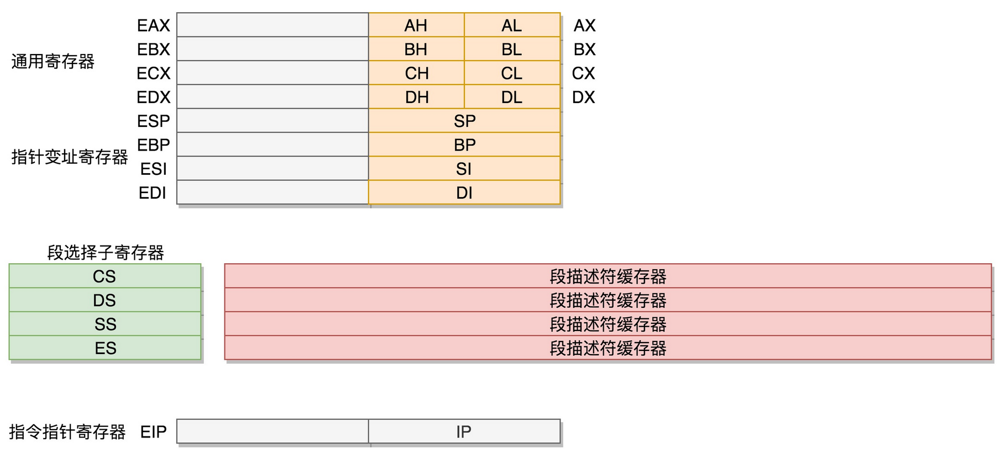

而改动比较大，有点不兼容的就是段寄存器（Segment Register）。

如果新的段寄存器都改成 32 位的，明明 4G 的内存全部都能访问到，还左移不左移四位呢？那我们索性就重新定义一把吧。CS、SS、DS、ES 仍然是 16 位的，但是不再是段的起始地址。段的起始地址放在内存的某个地方。这个地方是一个表格，表格中的一项一项是段描述符（Segment Descriptor）。这里面才是真正的段的起始地址。而段寄存器里面保存的是在这个表格中的哪一项，称为选择子（Selector）。

这样，将一个从段寄存器直接拿到的段起始地址，就变成了先间接地从段寄存器找到表格中的一项，再从表格中的一项中拿到段起始地址。这样段起始地址就会很灵活了。当然为了快速拿到段起始地址，段寄存器会从内存中拿到 CPU 的描述符高速缓存器中。

因而到了 32 位的系统架构下，我们将前一种模式称为实模式（Real Pattern），后一种模式称为保护模式（Protected Pattern）。当系统刚刚启动的时候，CPU 是处于实模式的，这个时候和原来的模式是兼容的。也就是说，哪怕你买了 32 位的 CPU，也支持在原来的模式下运行，只不过快了一点而已。当需要更多内存的时候，你可以遵循一定的规则，进行一系列的操作，然后切换到保护模式，就能够用到 32 位 CPU 更强大的能力。这也就是说，不能无缝兼容，但是通过切换模式兼容，也是可以接受的。

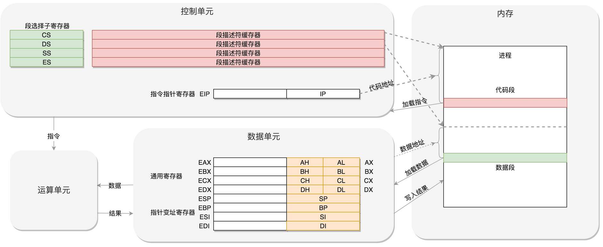


## 07 | 从BIOS到bootloader

> BIOS 时期

在主板上，有一个东西叫 ROM（Read Only Memory，只读存储器）。这和咱们平常说的内存 RAM（Random Access Memory，随机存取存储器）不同。咱们平时买的内存条是可读可写的，这样才能保存计算结果。而 ROM 是只读的，上面早就固化了一些初始化的程序，也就是 BIOS（Basic Input and Output System，基本输入输出系统）。


> bootloader 时期

> 从实模式切换到保护模式


> 总结

BIOS--->引导扇区boot.img--->disboot.img--->lzma_depress.img(实模式切换到保护模式\建立分段分页\打开地址线)--->kernel.img选择一个操作系统--->启动内核


## 08 | 内核初始化

内核的启动从入口函数 start_kernel() 开始。在 init/main.c 文件中，start_kernel 相当于内核的 main 函数。打开这个函数，你会发现，里面是各种各样初始化函数 XXXX_init。


## 09 | 系统调用


# 第三部分 进程管理

10 | 进程：公司接这么多项目，如何管？
11 | 线程：如何让复杂的项目并行执行？
12 | 进程数据结构（上）：项目多了就需要项目管理系统
13 | 进程数据结构（中）：项目多了就需要项目管理系统
14 | 进程数据结构（下）：项目多了就需要项目管理系统
15 | 调度（上）：如何制定项目管理流程？
16 | 调度（中）：主动调度是如何发生的？
17 | 调度（下）：抢占式调度是如何发生的？
18 | 进程的创建：如何发起一个新项目？
19 | 线程的创建：如何执行一个新子项目？

# 第四部分 内存管理

20 | 内存管理（上）：为客户保密，规划进程内存空间布局
21 | 内存管理（下）：为客户保密，项目组独享会议室封闭开发
22 | 进程空间管理：项目组还可以自行布置会议室
23 | 物理内存管理（上）：会议室管理员如何分配会议室？
24 | 物理内存管理（下）：会议室管理员如何分配会议室？
25 | 用户态内存映射：如何找到正确的会议室？
26 | 内核态内存映射：如何找到正确的会议室？

# 第五部分 文件系统

27 | 文件系统：项目成果要归档，我们就需要档案库
28 | 硬盘文件系统：如何最合理地组织档案库的文档？
29 | 虚拟文件系统：文件多了就需要档案管理系统
30 | 文件缓存：常用文档应该放在触手可得的地方

# 第六部分 输入输出系统

31 | 输入与输出：如何建立售前售后生态体系？
32 | 字符设备（上）：如何建立直销模式？
33 | 字符设备（下）：如何建立直销模式？
34 | 块设备（上）：如何建立代理商销售模式？
35 | 块设备（下）：如何建立代理商销售模式？

# 第七部分 进程间通信

36 | 进程间通信：遇到大项目需要项目组之间的合作才行
37 | 信号（上）：项目组A完成了，如何及时通知项目组B？
38 | 信号（下）：项目组A完成了，如何及时通知项目组B？
39 | 管道：项目组A完成了，如何交接给项目组B？
40 | IPC（上）：不同项目组之间抢资源，如何协调？
41 | IPC（中）：不同项目组之间抢资源，如何协调？
42 | IPC（下）：不同项目组之间抢资源，如何协调？

# 第八部分 网络系统

43 预习 | Socket通信之网络协议基本原理
43 | Socket通信：遇上特大项目，要学会和其他公司合作
44 | Socket内核数据结构：如何成立特大项目合作部？
45 | 发送网络包（上）：如何表达我们想让合作伙伴做什么？
46 | 发送网络包（下）：如何表达我们想让合作伙伴做什么？
47 | 接收网络包（上）：如何搞明白合作伙伴让我们做什么？
48 | 接收网络包（下）：如何搞明白合作伙伴让我们做什么？

# 第九部分 虚拟化

49 | 虚拟机：如何成立子公司，让公司变集团？
50 | 计算虚拟化之CPU（上）：如何复用集团的人力资源？
51 | 计算虚拟化之CPU（下）：如何复用集团的人力资源？
52 | 计算虚拟化之内存：如何建立独立的办公室？
53 | 存储虚拟化（上）：如何建立自己保管的单独档案库？
54 | 存储虚拟化（下）：如何建立自己保管的单独档案库？
55 | 网络虚拟化：如何成立独立的合作部？

# 第十部分 容器化

56 | 容器：大公司为保持创新，鼓励内部创业
57 | Namespace技术：内部创业公司应该独立运营
58 | cgroup技术：内部创业公司应该独立核算成本
59 | 数据中心操作系统：上市敲钟

# 实战串讲篇

60 | 搭建操作系统实验环境（上）：授人以鱼不如授人以渔
61 | 搭建操作系统实验环境（下）：授人以鱼不如授人以渔


> 知识串讲


- 62 | 知识串讲：用一个创业故事串起操作系统原理（一）（内核启动初始化）
- 63 | 知识串讲：用一个创业故事串起操作系统原理（二）（CPU：对多个进程进行调度执行）
- 64 | 知识串讲：用一个创业故事串起操作系统原理（三）（内存：虚拟内存和物理内存相关）

（物理内存\虚拟内存\虚拟内存到物理内存的映射）

- 65 | 知识串讲：用一个创业故事串起操作系统原理（四）（文件系统）

规划文件系统的时候，需要考虑以下几点。

第一点，文件系统要有严格的组织形式，使得文件能够以块为单位进行存储。（对于操作系统，硬盘分成相同大小的单元，我们称为块。一块的大小是扇区大小的整数倍，默认是 4K，用来存放文件的数据部分。）

第二点，文件系统中也要有索引区，用来方便查找一个文件分成的多个块都存放在了什么位置。

在 Linux 操作系统里面，每一个文件有一个 Inode，inode 的“i”是 index 的意思，其实就是“索引”。inode 里面有文件的读写权限 i_mode，属于哪个用户 i_uid，哪个组 i_gid，大小是多少 i_size_io，占用多少个块 i_blocks_io。“某个文件分成几块、每一块在哪里”，这些信息也在 inode 里面，保存在 i_block 里面。

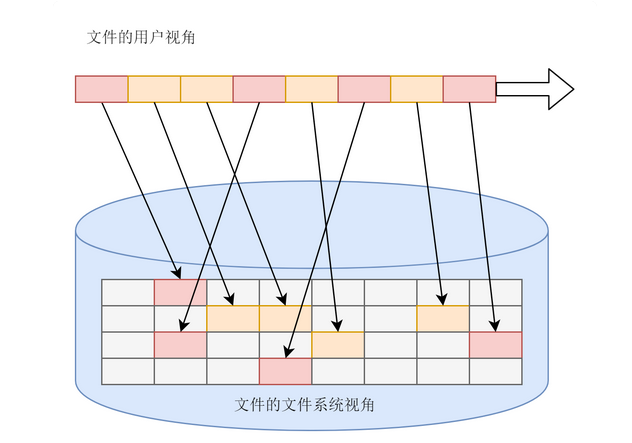


第三点，如果文件系统中有的文件是热点文件，近期经常被读取和写入，文件系统应该有缓存层。

第四点，文件应该用文件夹的形式组织起来，方便管理和查询。

要想把很多的文件有序地组织起来，我们就需要把他们做成目录或者文件夹。这样，一个文件夹里可以包含文件夹，也可以包含文件，这样就形成了一种树形结构。我们可以将不同的用户放在不同的用户目录下，就可以一定程度上避免了命名的冲突问题。

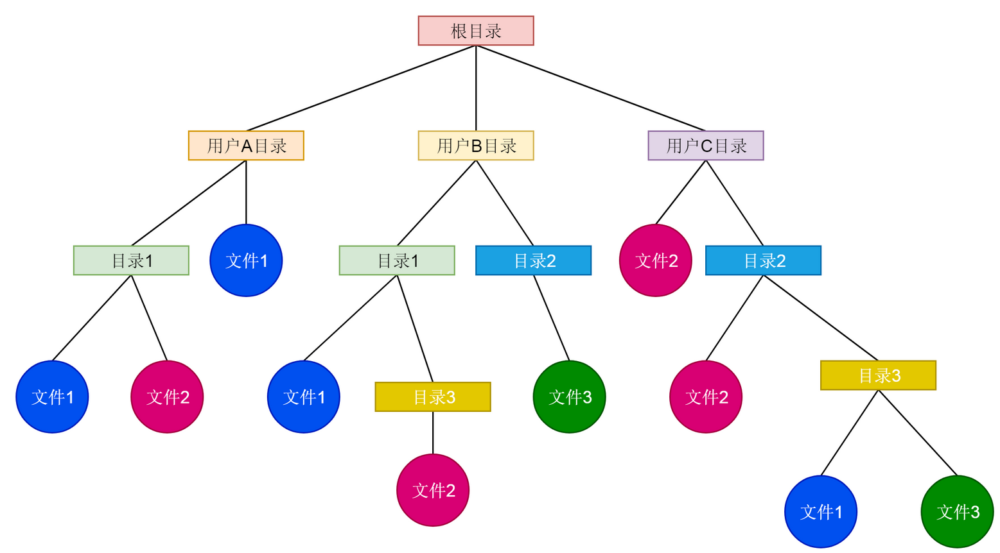

第五点，Linux 内核要在自己的内存里面维护一套数据结构，来保存哪些文件被哪些进程打开和使用。

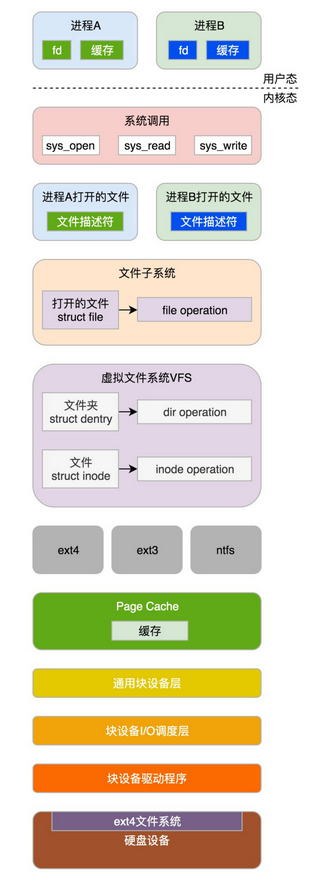

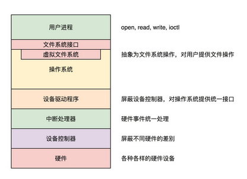


计算机系统的输入和输出系统都有哪些呢？

第一层，用设备控制器屏蔽设备差异。

第二层，用驱动程序屏蔽设备控制器差异。


- 66 | 知识串讲：用一个创业故事串起操作系统原理（五）


备注：


## 67 | 期末测试：这些操作系统问题，你真的掌握了吗？（todo）

> 如何回答？

- 第一，回答尽量体系化。
- 第二，在体系化的阐述过程中，可以加入一些你使用过的相关工具或者技巧的阐述。
- 第三，在体系化的阐述过程中，如果能加入一些项目经验就更好了。


> 题目

- 1.你能说一下操作系统的启动和初始化过程吗？
- 2.请问进程和线程的概念和区别是什么？
- 3.请问函数调用堆栈的原理是什么？
- 4.对内存管理了解吗？请说一下物理内存和虚拟内存的概念。
- 5.请介绍一下虚拟文件系统的机制。
- 6.你了解文件写入的流程吗？
- 7.进程间通信的管道机制了解吗？
- 8.请讲一下信号和中断机制。
- 9.请讲一下 TCP/IP 的分层模型。
- 10.请讲一下三次握手和四次挥手以及状态转换。
- 11.最新的云或者容器的技术了解过吗？


> 作者参考书籍

```

《自己动手写操作系统》
《UNIX 环境高级编程》
《一个操作系统的实现》
《系统虚拟化原理与实现》
《深入理解Linux虚拟内存管理》
《深入理解Linux内核》
《深入Linux内核架构》
《穿越计算机的迷雾》
《程序员的自我修养：链接、装载与库》
《操作系统真象还原》
《操作系统设计与实现》
《x86汇编语言：从实模式到保护模式》
《linux内核设计的艺术图解》
《Linux设备驱动开发详解》
《Linux内核完全注释》
《Linux内核设计与实现》
《Linux多线程服务端编程》
《Linux 内核分析及编程》
《IBM PC汇编语言程序设计》
《深入理解计算机系统》
《性能之巅：洞悉系统、企业与云计算》
《Linux内核协议栈源代码解析》
《UNIX网络编程》
《Linux/UNIX系统编程手册》
《深入Linux设备驱动程序内核机制》
《深入理解Linux驱动程序设计》
《Linux Device Drivers》
《TCP/IP详解卷》
《The TCP/IP Guide》
《深入理解LINUX网络技术内幕》
《Linux内核源代码情景分析》
《UNIX/Linux系统管理技术手册》
```

