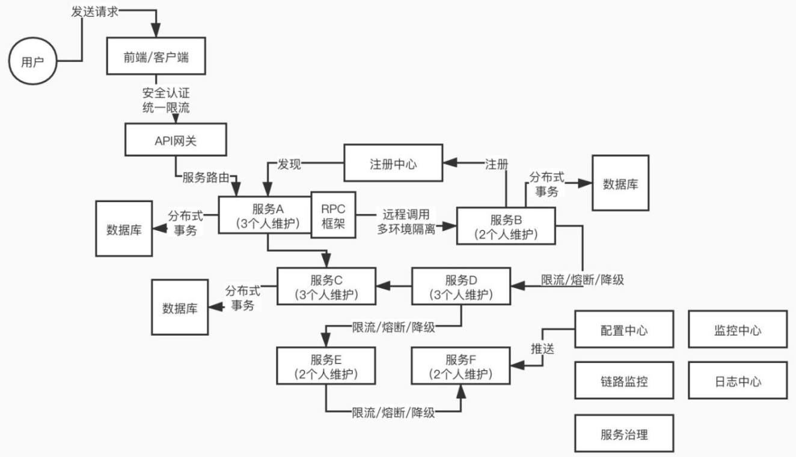
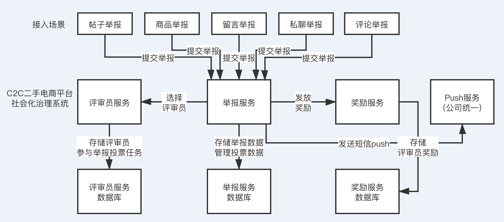
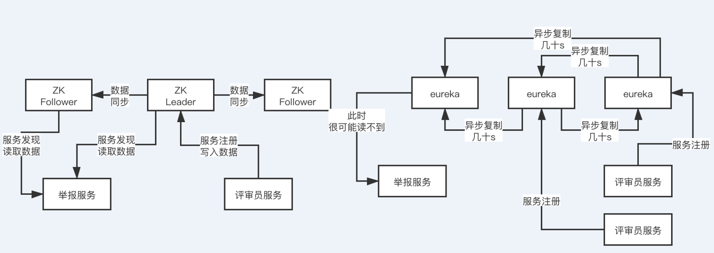
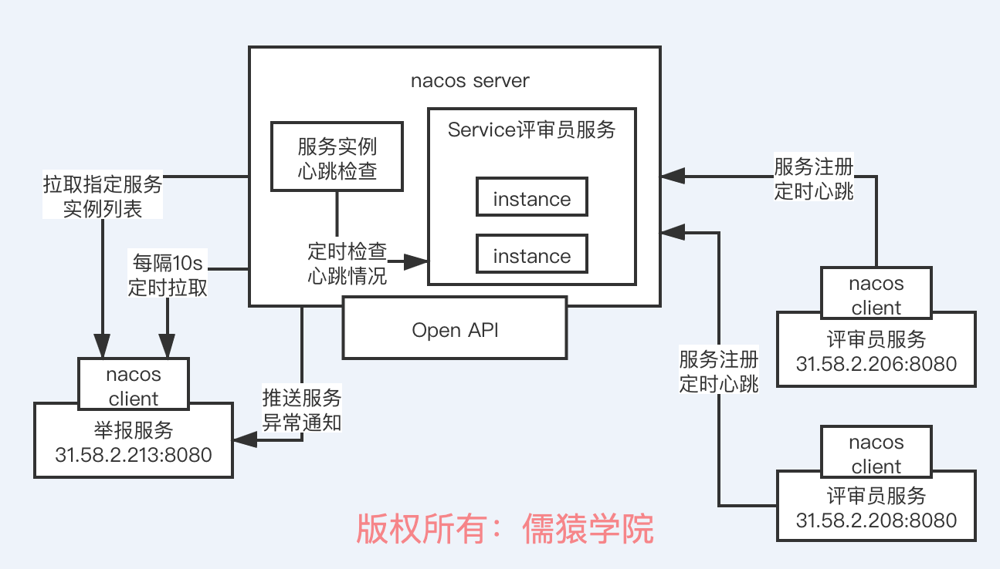
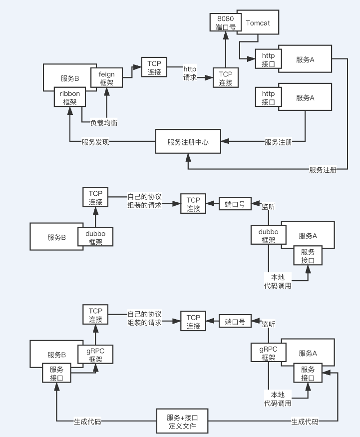
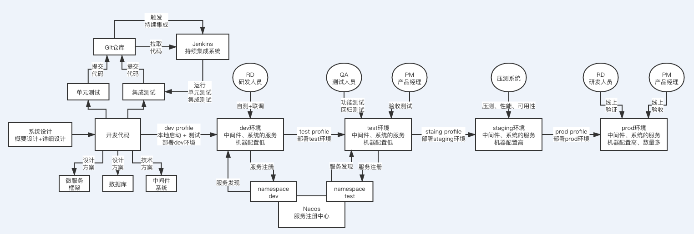

<!-- TOC -->

- [01_我们为什么要使用复杂的微服务架构？](#01_我们为什么要使用复杂的微服务架构)
- [02_国内BAT互联网大厂的微服务架构演进路线](#02_国内bat互联网大厂的微服务架构演进路线)
- [03_海外硅谷互联网大厂的微服务架构演进路线](#03_海外硅谷互联网大厂的微服务架构演进路线)
- [04_目前国内公司的主流微服务技术栈介绍](#04_目前国内公司的主流微服务技术栈介绍)
- [05_C2C电商社会化治理平台项目介绍](#05_c2c电商社会化治理平台项目介绍)
- [06_C2C电商社会化治理平台面向的痛点介绍](#06_c2c电商社会化治理平台面向的痛点介绍)
- [07_C2C电商社会化治理平台的解决方案介绍](#07_c2c电商社会化治理平台的解决方案介绍)
- [08_C2C电商社会化治理平台整体架构设计](#08_c2c电商社会化治理平台整体架构设计)
- [09_C2C电商社会化治理平台的微服务拆分设计](#09_c2c电商社会化治理平台的微服务拆分设计)
- [10、为什么微服务化的系统架构必须要有注册中心？](#10为什么微服务化的系统架构必须要有注册中心)
- [11_ZooKeeper、Eureka、Consul、Nacos的选型对比](#11_zookeepereurekaconsulnacos的选型对比)
- [12_SpringCloudAlibaba之 Nacos 注册中心架构原理](#12_springcloudalibaba之-nacos-注册中心架构原理)
- [13、深入 Nacos 服务注册中心的内核原理](#13深入-nacos-服务注册中心的内核原理)
- [14_01_基于Nacos实现高可用服务注册中心部署](#14_01_基于nacos实现高可用服务注册中心部署)
- [15_为什么微服务化的系统必须通过RPC框架进行通信？](#15_为什么微服务化的系统必须通过rpc框架进行通信)
- [16_Feign+Ribbon、Dubbo、gRPC的选型对比](#16_feignribbondubbogrpc的选型对比)
- [18_Dubbo RPC框架集成 Nacos 注册中心](#18_dubbo-rpc框架集成-nacos-注册中心)
- [19_01_基于Dubbo开发C2C电商社会化治理平台人群服务（上）](#19_01_基于dubbo开发c2c电商社会化治理平台人群服务上)
- [20_基于Dubbo开发C2C电商社会化治理平台任务服务](#20_基于dubbo开发c2c电商社会化治理平台任务服务)
- [21_01_基于Dubbo开发C2C电商社会化治理平台权益服务](#21_01_基于dubbo开发c2c电商社会化治理平台权益服务)
- [22_01、基于Dubbo开发C2C电商社会化治理平台基础服务](#22_01基于dubbo开发c2c电商社会化治理平台基础服务)
- [23_01_微服务化的C2C电商社会化治理平台如何进行全链路测试？](#23_01_微服务化的c2c电商社会化治理平台如何进行全链路测试)
- [24_如何基于Nacos实现多测试环境与生产环境的隔离？](#24_如何基于nacos实现多测试环境与生产环境的隔离)
- [25_C2C电商社会化治理平台的多环境部署隔离](#25_c2c电商社会化治理平台的多环境部署隔离)
- [26_互联网公司部署方案：蓝绿部署、灰度发布以及滚动发布](#26_互联网公司部署方案蓝绿部署灰度发布以及滚动发布)
    - [（1）滚动发布](#1滚动发布)
    - [（2）灰度发布](#2灰度发布)
    - [（3）蓝绿部署](#3蓝绿部署)
- [27_Nacos如何支持蓝绿部署、灰度发布以及滚动发布？](#27_nacos如何支持蓝绿部署灰度发布以及滚动发布)
- [28_C2C电商社会化治理平台的蓝绿部署、灰度发布以及滚动发布](#28_c2c电商社会化治理平台的蓝绿部署灰度发布以及滚动发布)

<!-- /TOC -->


# 01_我们为什么要使用复杂的微服务架构？

协调困难、开发效率低、尝试新技术困难。

# 02_国内BAT互联网大厂的微服务架构演进路线



# 03_海外硅谷互联网大厂的微服务架构演进路线

早期的spring cloud微服务体系的组件，是以eureka、feign+ribbon、zuul、hystrix，用zipkin和sleuth做链路监控，stream做消息中间件集成，contract做契约测试支持，当然gateway也可以做网关，consul也是一种注册中心，还有跟spring security配合的安全认证，跟k8s配合的容器支持


# 04_目前国内公司的主流微服务技术栈介绍

因为阿里的dubbo重启活跃维护，同时阿里把自己的微服务技术栈融入进了spring cloud体系和标准，形成了一个spring cloud alibaba微服务技术组件，也就是以nacos、dubbo、seata、sentinal、rocketmq等技术为核心的一套技术体系

- 注册中心：nacos -> eureka
- RPC框架：dubbo -> feign+ribbon
- 分布式事务：seata -> 无
- 限流/熔断/降级：sentinel -> hystrix
- API网关：无 -> zuul

spring cloud netflix微服务技术组件，开始更新的非常不活跃，netflix公司公开宣布他之前开源的一些微服务组件未来就不会怎么更新了，这就导致spring cloud netflix微服务技术组件的未来有点不太光明


spring cloud alibaba技术栈+国内开源的组件（apollo、CAT）+ Prometheus + ELK + Spring Cloud Gateway（Nginx+lua、Kong、Zuul、API网关自研）


# 05_C2C电商社会化治理平台项目介绍

所谓的C2C二手电商平台，就是用户可以在上面作为卖家发布自己的二手商品，然后等待买家来谈，来购买，平台就是作为中间服务方提供一些列的平台功能支持，其实国内大的二手交易平台还是有几个的，同时还有好一些专注于垂直领域的二手电商交易平台，比如说二手奢侈品电商，二手电子产品电商


社会化治理平台：对用户发布的信息进行审核。

通过一个平台，以技术的手段，将有人举报违规的内容推送给部分用户，让用户参与到平台治理中来，用户投票决定某个商品或者评论等内容是否违规，这样平台仅仅作为一个桥梁，让用户进行社会化自治


# 06_C2C电商社会化治理平台面向的痛点介绍


# 07_C2C电商社会化治理平台的解决方案介绍



核心思路，开发一个系统，很多非法举报进行社会化治理，所谓社会化治理，就是把每个举报都圈定一部分用户作为评审员，让他们进行投票，如果过半数判定举报成立，就成立，同时为了激励用户参与进行评审，可以给他们一些奖励，比如说奖励一些虚拟货币，后续可以在专门的积分兑换商城里兑换一些奖品


在C2C二手电商平台里，一般举报有如下的一些场景：

- （1）	通常这类平台会做一些用于社交的社区/论坛之类的，可以发帖之类的，所以这类帖子内容如果有一些不良言论，可能会被举报
- （2）	有的人挂出的二手商品本身就可能是非法商品，可能会被举报
- （3）	一般有人挂出自己的二手商品之后，别人可以进行留言提问，然后留言交互过程中可能会涉及到侮辱性的语言，此时留言可能会被举报
- （4）	一般这类平台都会提供买卖双方进行私聊的IM功能，这个私聊对话可能涉及不良言论，可能会被举报
- （5）	还有时候商品不光是涉及留言和私聊，对这个卖家售出的历史商品，买家可能是可以进行评论的，这个评论是卖家个人积累的一个信誉评价，但是可能出现不良言论，此时可能会被举报


针对上述场景，全部都可以在有人进行举报的时候，对应的功能模块（比如说商品、论坛、IM、评论，等等），就可以接入和调用社会化治理平台，我们对外提供的应该首先是一个举报服务，作为一个入口

这个举报服务涵盖了：投票制度管理（可以针对不同的举报类型，定义不同的投票制度，比如5人3胜，3人2胜，最大等待时长，替补评审员机制，等等），提交举报接口，调用评审员服务圈定评审员，PUSH管理，举报查询接口，投票生命周期管理（发起投票、过程监控、超时等待、候补评审员管理、投票结果），调用奖励服务

还有一个评审员服务，包含了：评审员管理（根据用户画像的标签，由运营去圈定一波人做评审员，其实核心在于圈定那些每周都至少会来逛一次的活跃用户，这个规则可以自行配置），评审员圈选，评审员状态管理，评审员过滤，疲劳度控制，评审员自动调整，候补评审员选择，评审结果接收

最后是一个奖励服务，包含了：奖励规则配置，奖励发放，奖励兑换


# 08_C2C电商社会化治理平台整体架构设计

# 09_C2C电商社会化治理平台的微服务拆分设计

可以在有人进行举报的时候，对应的功能模块（比如说商品、论坛、IM、评论，等等），就可以接入和调用社会化治理平台，我们对外提供的应该首先是一个`举报服务`，作为一个入口


# 10、为什么微服务化的系统架构必须要有注册中心？


# 11_ZooKeeper、Eureka、Consul、Nacos的选型对比



zookeeper、eureka、consul、nacos

zookeeper和eureka，consul用的没那么多，nacos现在用的越来越多，以后也会是一个大的趋势，但是现在可能还没那么的普及

zookeeper的原理，leader+follower，leader写，同步到follower，follower可以读，保证顺序一致性，就是基本尽量保证到数据一致的，主动推送，典型的CP，leader崩溃的时候，为了保证数据一致性，尽量不要读到不一致的数据，此时要重新选举leader以及做数据同步，此时集群会短暂的不可用，CP

服务注册中心选型对比的时候，其他的分布式系统选型的时候，CP，AP

P简单来说就是任何分布式系统一般都会满足，他就是分区容错性；CP，C，一致性，尽可能的去保证你读取到的数据是一致的，牺牲掉一个A，可用性，一旦leader崩溃，zk可能会有一个短时间内，几十s有可能，集群不可用，此时需要重新选举一个leader，然后再做数据同步，保证数据一致性之后再开放让你来读取 

consistency，availability

关于eureka的一些架构原理，21天互联网Java工程师面试训练营（分布式篇），儒猿技术窝，重点讲解了eureka的一些架构原理

eureka的原理，peer-to-peer，大家都能写也都能读，每个节点都要同步给其他节点，但是是异步复制的，所以随时读任何一个节点，可能读到的数据都不一样，任何一个节点宕机，其他节点正常工作，可用性超高，但是数据一致性不行，AP

Consul也是基于raft算法的CP模型

Nacos也是基于raft算法的CP模型，同时也支持配置成类似eureka的AP

其实CP或者AP也都行，CP就是偶尔可能短时间不可用，AP就是可能数据不一致，两个都有问题，但是在生产环境下，无论CP还是AP其实都用的很多

其实说白了，zk作为注册中心是早期dubbo时代的标配；后续spring cloud进入国内市场，大家就都用eureka了，但是spring cloud也推荐了consul，所以consul也有不少人在用，zk、eureka、consul，其实都有人用

但是未来还是建议大家用nacos，因为nacos的功能最为完善，包括了雪崩保护、自动注销实例、监听支持、多数据中心、跨注册中心同步、spring cloud集成、dubbo集成、k8s集成，这些都支持，其他的几个技术基本都支持部分罢了


# 12_SpringCloudAlibaba之 Nacos 注册中心架构原理




服务通过nacos server内部的open api进行服务注册，nacos server内部有一个sevice服务的概念，里面有多个instance实例的概念，同时对不同的service服务可以划归到不同的namespace命名空间下去

namespace可以是一个技术团队，比如说一个技术团队，业务A的技术团队所有的服务都放在一个namespace命名空间下面，业务B的技术团队所有的服务都放在另外一个namespace命名空间

其实说白了，注册的时候就是在注册表里维护好每个服务的每个实例的服务器地址，包括ip地址和端口号，这是最为关键的

而且一旦注册成功之后，服务就会跟nacos server进行定时的心跳，保持心跳是很关键的，nacos server会定时检查服务各个实例的心跳，如果一定时间没心跳，就认为这个服务实例宕机了，就从注册表里摘除了

其他服务会从nacos server通过open api查询要调用的服务实例列表，而且nacos客户端会启动一个定时任务，每隔10s就重新拉取一次服务实例列表，这样如果调用的服务有上线或者下线，就能很快感知到了

此外还可以对要调用的服务进行监听，如果有异常变动会由nacos server反向通知他


# 13、深入 Nacos 服务注册中心的内核原理


nacos本身的话，其实是完全可以脱离spring cloud自己独立运作的，但是他目前是集成到spring cloud alibaba里去的，也就是在spring cloud的标准之下实现了一些东西，spring cloud自己是有一个接口，叫做ServiceRegistry，也就是服务注册中心的概念

他是一个接口，nacos是实现了一个实现类的，也就是NacosServiceRegistry，实现了register、deregister、close、setStatus、getStatus之类的方法

自动装配是一个spring boot的一个概念，其实就是说系统启动的时候，自动装配机制会运行，实现一些系统的初始化、自动做一些事儿

比如说spring cloud alibaba，假设用dubbo开发服务，本质上是有一个自动装配类的，这个自动装配类会监听spring的ApplicationStartedEvent这个事件，其实简单理解就是服务启动的时候通过spring的一些动作，监听到某个事件就自动运行了

自动运行，就是去调用NacosServiceRegistry的register方法去进行服务注册

而且除了注册之外，还会通过schedule线程池去提交一个定时调度任务，源码如下：

this.exeutorService.schedule(new BeatReactor.BeatTask(beatInfo), beatInfo.getPeriod(), TimeUnit.MILLISECONDS)，这就是一个心跳机制，定时发送心跳给nacos server

接着会进行注册，注册的话是访问nacos server的open api，其实就是http接口，他有一个接口：http://31.208.59.24:8848/nacos/v1/ns/instance?serviceName=xx&ip=xx&port=xx，这么一个东西，也没什么特别的，这里就是访问注册接口罢了

nacos server那里是基于一个ConcurrentHashMap作为注册表来放服务信息的，直接会构造一个Service放到map里，然后对Service去addInstance添加一个实例，本质里面就是在维护信息，同时还会建立定时检查实例心跳的机制

最后还会基于一致性协议，比如说raft协议，去把注册同步给其他节点

服务发现的本质其实也是一个http接口，就是：http://31.208.59.24:8848/nacos/v1/ns/instance/list?serviceName=xx，就这么一个接口，其实也没特别的东西，然后就会启动定时任务，每隔10s拉取一次最新的实例列表，然后服务端还会监听他监听服务的状态，有异常就会基于UDP协议反向通知客户端这次服务异常变动


# 14_01_基于Nacos实现高可用服务注册中心部署


编译nacos：下载nacos-server-1.4版本的源码，接着进行编译

git clone https://github.com/alibaba/nacos.git

windows的git客户端，有一个软件的，装一下，也是一个命令行，就可以在本地执行git之类的命令都是可以的，半小时~1小时，甚至几小时都有可能，看你自己的网速吧，github上下载还是挺慢的

```
cd nacos/
mvn -Prelease-nacos -Dmaven.test.skip=true clean install -U 
ls -al distribution/target/

// change the $version to your actual path
cd distribution/target/nacos-server-$version/nacos/bin
```

然后上传到三台服务器上去，并且分别进行解压缩，需要自己下载一个WinScp一个软件，就可以界面里把你win宿主机上的文件直接拖拉上传到虚拟机的指定目录下去

重命名cluster.conf.example，去掉example，配置三台机器的地址和端口号，默认端口号是8848，使用默认的derby数据库就行了，但是生产环境下，可以部署一个MySQL数据库，执行nacos-mysql.sql初始化数据库里的表之类的东西，然后分别修改他们的application.properties文件，里面修改数据库配置

```
spring.datasource.platform=mysql
db.num=1
db.url.0=xxx
db.user=xx
db.password=xxx
```

分别进入三台机器的bin目录，执行startup.sh，检查logs目录下的start.out启动日志，如果启动成功就可以了，访问任何一个节点的8848端口的/nacos地址，进入nacos控制台，可以看到nacos集群的具体情况


# 15_为什么微服务化的系统必须通过RPC框架进行通信？


HTTP、RPC

假设如果你没有RPC的框架，此时假如说你的每个服务对外暴露的接口，都是一些HTTP接口，http://21.38.254.306:8080/xx/xx?xx=xx，其他服务如果说要调用你的这个服务，就必须使用apache的http的组件，或者是JDK自带的http组件，构建出来一个HTTP请求，包括请求路径，请求头，请求体（JSON串过去）

好不容易构建出来一个完整的HTTP请求，通过http组件发送这个HTTP请求过去，在底层也是得跟那个服务的指定机器的指定端口号，也都是建立TCP连接，在TCP连接之上，发送HTTP协议组装出来的请求过去


接收人家给你的HTTP响应，解析HTTP响应，响应头，状态码（404，500），响应体（JSON串），极为麻烦


划时代的RPC这种东西，比如说你发布一个服务，主要就是定义了一些接口

```java
public interface ServcieA {

	public String hello(String name);

}
```

如果我要调用你的接口，此时我在代码里，不需要care什么HTTP之类的东西

```java
public void service() {
	String result = serviceA.hello(“zhagnsan”);
}
```


# 16_Feign+Ribbon、Dubbo、gRPC的选型对比




手动写一些构造HTTP请求的代码去发送给评审员服务的服务器，去调用他的http接口，总不能这样，RPC框架，举报服务在代码里就调用一个interface的接口，底层直接让RPC框架发送请求到对应的服务器上去


feign+ribbon，spring cloud netflix技术栈，RPC调用，用的就是feign框架+ribbon做负载均衡，暴露出来的服务接口，就是最最稀松平常的基于spring mvc写的controller暴露出来的一些http接口，定义一个http的url地址


通过feign框架进行RPC调用：String result = serviceA.hello(name)，会按照http协议来组装你的请求数据，数据格式都是按照http协议里的请求来做的，http请求还还必须做一个序列化，序列化成二进制的字节流，通过底层的tcp连接发送过去

本质上服务A的部署是基于tomcat去进行部署的，tomcat会监听你指定的端口号，当别人要发送http请求给你的时候，首先必须跟tomcat建立tcp网络连接，发送http请求给tomcat，tomcat收到之后，解析出来这个http请求，交给你的spring mvc写的controller来进行处理


dubbo自己使用的一套协议，自定义协议，也可以是别的协议，肯定不是http协议，去组装请求数据，然后做一个序列化，二进制字节数组或者是字节流，都可以，通过底层的网络连接把请求数据发送过去就可以了

ServiceA这个类，调用他里面的hello()这个方法，传入name这个参数，获取result这个返回值，然后通过网络连接把响应数据按照自己的协议封装，序列化，通过网络连接发送给服务B就可以了


# 18_Dubbo RPC框架集成 Nacos 注册中心

# 19_01_基于Dubbo开发C2C电商社会化治理平台人群服务（上）

nacos+dubbo整合起来的一个demo，nacos和dubbo基本的原理，都有了一个讲解，在demo里我集成了mybatis和druid数据源，去基于mysql做一些增删改查，每个服务在执行业务逻辑的时候还是得对数据库做一下操作的，seata分布式事务的方案，每个服务都必须有一个自己本地的数据库的事务

- 社会化治理：social govern
- 举报：report
- 评审员：reviewer
- 奖励：reward


# 20_基于Dubbo开发C2C电商社会化治理平台任务服务

# 21_01_基于Dubbo开发C2C电商社会化治理平台权益服务


# 22_01、基于Dubbo开发C2C电商社会化治理平台基础服务


# 23_01_微服务化的C2C电商社会化治理平台如何进行全链路测试？


nacos + dubbo整合，原理，以及案例代码的开发，大家都已经有了一定的了解了，手把手带着大家去做了，spring cloud alibaba去开发自己公司的项目的话，整合框架，背后的原理，设计、开发、测试、上线

（1）系统设计（概要设计、详细设计 / 简化设计）

概要设计：业务架构、技术架构、业务流程、技术方案、部署方案，都需要做一个大致上的设计，架构师

详细设计：接口定义、数据库表结构、核心类建模、各个接口被请求时的系统运行时序图、技术方案细化

简化设计：画一些系统运行流程图、技术方案、接口、表、时序图

设计完毕之后，会有一个设计评审的过程，会找相关的其他同学过来评审，比如说给人家确认一下你设计的接口，是否满足你的调用方的需求

（2）开发代码

每个人可能都是维护自己负责的子系统、服务，微服务框架，spring cloud alibaba里面的nacos + dubbo，用dubbo定义各种你需要对外提供的接口，按照你自己的设计文档以及技术方案去进行代码的开发

如果仅仅是一些crud的话，此时基于数据库就可以搞定了

但是如果说涉及到一些复杂的技术方案，使用中间件系统，es、redis、mongodb、hbase、rocketmq，等等

（3）本地自测

服务本地跑起来自己测试各个功能，直接通过dubbo服务调用，浏览器的http请求，直接请求你的接口，测试一下自己的各个功能，你自己一个人维护一个java web系统，不依赖别人的接口

也可能跑不起来，那就单元测试，单元测试其实是一个很专业的领域，跑本地单元测试的时候，需要把你的spring容器跑起来，然后对各种bean的注入可能需要打桩，接着再测试各个接口，这里不详细展开了

说句题外话，国内很规范做单元测试的公司也不多，大多公司的单元测试做的第一不规范，第二不完善，第三形同虚设，所以基本可以忽略，如果要把单测做好了，写单测的代码的时间跟你写系统代码的时间可能甚至是1:1，1:2

更多的还是写完代码，自己本地跑起来，想办法简单测试一下罢了

有的时候跑起来需要有一些其他人负责的服务的配合，这个时候有一些方案可以做到，比如说本地可以跑起来一个服务注册中心，然后其他人的服务你手头没有，那团队可以做一个统一的本地服务模拟工程，工程跑起来就自动往本地注册中心去注册，接口的返回结果都是mock的

然后你的服务跑起来，就可以跑通了，包括数据库，缓存，MQ这些东西，都可以在本地部署，有一个本地的maven profile，放这些配置

小项目，协作方不是太多

或者是在公司内网环境里，提供几台机器，作为dev环境，部署了数据库、缓存、MQ等中间件，服务可以部署，一台机器可以多部署几个服务，然后当你笔记本电脑在公司内网的时候，就可以访问到那几台机器，那么你本地启动，就可以直接访问到测试环境里的其他服务了

maven profile，spring boot profile，百度搜一下，非常的简单，都是很对不同的环境可以去放一套不同的配置资源文件

（4）持续集成：可选

很多同学可能都听说过持续集成，但是不太清楚到底是什么

有的公司会做持续集成，意思是你每天开发好的代码和功能，都必须有对应的单元测试可以进行自动化的测试，然后你本地单元测试跑通了，就可以提交代码到git仓库以及进行代码合并，直接触发jenkins这种集成工具，他会拉取你的最新代码，然后跑你所有的单元测试，确保你的代码在所有测试下可以正常运行

甚至可能是多个人维护一个系统，每个人每天/隔天，都要提交自己的代码+单测到git仓库进行代码合并，集成的概念，单人维护一个独立的工程/服务，每天不停的提交最新代码到你的git仓库里，你在不停的把自己最新写好的代码集成到已有的完整的代码里去

持续集成，提代码

多人维护一个系统，你本地写好的代码，本地跑单测是ok的，但是你提到git仓库合并进去，此时可能别人也会提代码合并进去，此时你们俩的代码集成在一起了，此时到底集成好的代码能不能正常工作呢？

jenkins持续集成的工具，如果发现你有提交代码以及合并的操作，此时jenkins会触发一个任务，拉取你的代码到本地，自动运行所有的单元测试，用你的单元测试自动运行和检查，来确保你现在最新的集成后的代码都是可以运行的

有的时候还会专门写特定的自动化集成测试代码，就是说你代码提交之后，然后可能会把你完整代码跑起来，此时所有代码是一个集成在一起的状态，接着就是运行集成测试的代码，把你集成在一起的代码都跑一下，检查是否正常

但是这个比较麻烦，搞持续集成，在工具上要求git、jenkins之类的整合，你要做很多配置，同时要求你每天的代码都有对应的自动化测试代码，所以真的把持续集成做好，做的很标准的公司，其实不多

（5）联调测试/功能测试

一个人维护一个java web系统，对其他人没有依赖，太low了

比较正常的，就是你写好了代码，自己简单自测完毕了，然后部署到一个联调测试/功能测试的环境里去，这个环境，是可能团队内部各个服务之间联调，或者甚至和其他团队的系统进行联调的地方

这个环境最好是独立的一套环境，部署好之后，QA会进行大量的手工测试，各种点击系统，也可能会有自动化测试，不过说实话，能玩儿自动化测试的公司不多，最后在这个环境，会有一个PM功能验收测试的过程

这个环境重在联调，把各个系统和服务跑通，确保功能运行没问题，一般机器都是低配置的，而且一个服务就一台机器，甚至是一台机器几个服务都有可能

（6）预发布测试

接着一般是预发布环境的测试，这个环境一般是模拟线上环境，可能会在这里做压力测试、全链路压测、性能测试、可用性测试、稳定性测试，都可能会在这里做，一般机器配置跟线上一样，每个服务都是独立机器，甚至每个服务给多台机器

比如说线上高峰QPS是1w+，线上机器是4核8G的，部署20台，那么预发布环境可能就是模拟每秒QPS是1000+，每个服务部署2台机器，做一个低压力测试，把全链路都压一下，测试性能，QPS，机器负载

有时候也可能会跑一些可用性测试，比如设计一些特殊故障之类的

在这个环境，通常流量是从线上获取回放过来的，有一个线上流量回放的过程，很多公司其实没这个环节，此时可能也就是走个过场，但是正经来说，是要做流量回放的，不是靠人力来测试，而是回放线上流量，看系统的功能是否正常，压力是否ok，性能是否还行，机器负载如何，全链路表现如何

有时候也会在这个环境让QA做一个全量功能回归测试，这可能是大版本变动的时候要做的

如果一切正常，那么就可以上线了

（7）线上部署

生产环境必须是一套独立的机器，直接进行部署即可，上线之后要通过各个机器的重要日志、请求是否正常、机器负载等是否正常、然后PM线上验收，一切正常，上线成功


# 24_如何基于Nacos实现多测试环境与生产环境的隔离？

# 25_C2C电商社会化治理平台的多环境部署隔离




# 26_互联网公司部署方案：蓝绿部署、灰度发布以及滚动发布


设计、开发、测试、部署，流程都讲过了，微服务技术栈，服务注册中心，nacos，RPC框架，dubbo，设计就要把各个服务拆分完毕，包括你的业务逻辑，需求，接口，数据库，类，功能的时序图

每个人就负责开发自己的服务就可以了，nacos+dubbo

用dubbo开发一些接口，只要定义一些接口和dubbo注解，更多的还是写java代码

不同的环境之下，你的服务注册的namespace必须是不同的

## （1）滚动发布

这是最常见的部署模式，一般就是说你一个服务/系统都会部署在多台机器上，部署的时候，要不然是手动依次部署，最low的比如就是每台服务器上放一个tomcat，每台机器依次停机tomcat，然后把新的代码放进去，再重新启动tomcat，各个机器逐渐重启，这就是最low的滚动发布

中小型公司现在稍微好点的话，都会做自动化部署，自动化部署用的比较多的是jenkins，因为jenkins是支持持续集成和持续交付的，之前说过持续集成，那么持续交付就是比持续集成更进一步，简单来说，就是你每天都提交代码，他每天都自动跑测试确保代码集成没问题，然后可能每隔几天，就把一个生产可用的小版本交付到线上

这个时候，就需要一个自动化部署，jenkins可以自动在多台机器上部署你的服务/系统，过程其实也是类似的，只不过把手动改成自动罢了，你自己部署tomcat/基于spring boot内嵌容器，其实都行

中大型公司，一般发布系统都是自己研发的，你在上面指定对一个服务，指定一个git仓库的代码分支，然后指定一个环境，指定一批机器，发布系统自动到git仓库拉取代码到本地，编译打包，然后在你指定环境的机器上，依次停止当前运行的进程，然后依次重启你新代码的服务进程

这都是典型的滚动发布

但凡发布，都要考虑两个问题，一个是验证，一个是回滚

验证就是说，你怎么确定你这次部署成功了？一般来说，要观察每台机器启动后处理请求时的日志，日志是否正常，是否有报错，一般日志正常、没有报错，那么就算是启动成功了，有时候也会让QA/PM做一个线上验证

那么万一发布失败了呢？此时就得回滚，因为不同的上线是不一样的，有时候你仅仅是对代码做一些微调，大多数时候是针对新需求有上线，加了新的代码/接口，有时候是架构重构，实现机制和技术架构都变了

所以回滚的话，也不太一样，比如你如果是加了一些新的接口，结果上线失败了，此时心接口没人访问，直接代码回滚到旧版本重新部署就行了；如果你是做技术架构升级，此时失败了，可能很多请求已经处理失败，数据丢失，严重的时候会导致公司丢失订单，或者是数据写入了但是都错了

此时可能会采用回滚代码，或者清洗错乱数据的方式来回滚，总之，针对你的发布，你要考虑到失败之后的回滚方案，回滚代码，就得用旧版本的代码，然后重新在各个机器依次部署，就算是一次回滚了，至于丢失了数据没有，要不要清洗数据，这个看情况来定

滚动发布的话，风险还是比较大的，因为一旦你用了自动化的滚动发布，那么发布系统会自动把你的所有机器都部署新版本的代码，这个时候中间很有可能会出现问题，导致大规模的异常和损失

所以现在一般中大型公司，都不会贸然用滚动发布模式了


## （2）灰度发布

灰度发布，指的就是说，不要上线就滚动全部发布到所有机器，一般就是会部署在比如1台机器上，采用新版本，然后切比如10%的流量过去，观察那10%的流量在1台机器上运行一段时间，比如运行个几天时间，观察日志、异常、数据，是否一切正常，如果验证发现全部正常，那么此时就可以全量发布了

全量发布的时候，就是采用滚动发布那种模式

这个好处就是说，你先用10%以内的小流量放到灰度新版本的那台机器上验证一段时间，感觉没问题了，才会全量部署，这么操作，即使有问题，也就10%以内的请求出现问题，损失不会太大的，如果你公司体量特别大，灰度也可以是1%，甚至0.1%的流量

因为体量太大的公司，1%的流量就很大了

如果灰度的时候有问题，那么立刻把10%以内的小流量切去请求老版本代码部署的机器，灰度版本的机器立马就没流量请求了，这个回滚速度是极快的

通常灰度验证过后，全量发布，都不会有太大的问题，基本上再出问题概率就很小了，所以现在中大型互联网公司，一般都是灰度发布模式的

##（3）蓝绿部署

蓝绿部署的意思是说，你得同时准备两个集群，一个集群放新版本代码，一个集群放老版本代码，然后新版本代码的集群准备好了过后，直接线上流量切到新版本集群上去，跑一段时间来验证，如果发现有问题，回滚就是立马把流量切回老版本集群，回滚是很快速的

如果新版本集群运行一段时间感觉没问题了，此时就可以把老版本集群给下线了

那么为什么有灰度发布了还要用蓝绿部署呢？

是这样的，灰度发布过后，还是要全量部署的，但是有时候，如果涉及到一些新的架构方案，或者是新的接口，10%以内的小流量可能没办法暴露出线上的高并发问题，所以灰度验证没问题，结果全量部署还是有一个小概率会失败

此时全量发布用滚动发布的方式，逐步部署过去，很快会引发大规模的失败，此时回滚，是很慢的，因为要一台一台逐步回滚

所以说，一般针对那种改动不太大的小版本，比如加个接口，修改一些代码，修复几个bug，类似这种整体变动不大的情况，建议用灰度发布，因为这种一般灰度验证没问题，全量部署也不会有问题

但是如果涉及到那种很大规模的架构重构或者架构升级，比如数据存储架构升级，或者是技术架构整体改造，或者是代码大规模重构，类似这种场景，最好是用蓝绿部署，也就是说，完全部署一个新的集群，然后把较大的流量切过去，比如先切10%，再切50%，最后切到100%，让新集群承载100%的流量跑一段时间

过程中一旦有问题，立马流量全部切回老集群，这个回滚速度就比灰度发布的全量部署回滚要快多了，因为仅仅是切流量而已，不需要重新部署


# 27_Nacos如何支持蓝绿部署、灰度发布以及滚动发布？


非常遗憾的告诉大家，现在并没有一个开源项目能够完美的支持灰度发布和蓝绿部署，因为这并不是一个nacos就可以做到的，大家都知道，nacos支持namespace等高级特性，还可以带服务元数据，所以如果要基于nacos来搞灰度发布和蓝绿部署是可以的

比如说，你灰度的时候，负责灰度的版本上线，就注册到一个prod-grey namespace下去，或者是你得带上一些服务标签，类似元数据的概念，然后你的网关流量入口，就得能够识别出灰度机器，按照你的配置分发流量

然后你的类似dubbo的RPC框架的负载均衡模块，也得识别出灰度机器，按照配置分发流量过去

就是这个事儿要做成，必须是nacos + dubbo + 网关，都得做很多定制和改造，才能搞定的，其实做是可以做的，因为网关的灰度，很多开源网关都支持，dubbo的负载均衡机制也是可以扩展自定义的

但是这都有工作量，你得自己去做，这不是现成的

蓝绿部署其实也是同理，你新集群的服务都得带标签，或者干脆就去别的namespace，然后你的流量分发这块要能够控制好，包括回滚时的流量秒级切换

所以这块正常来说，并没有办法说针对中小型公司，直接开箱即用，就可以灰度发布或者是蓝绿部署，因为流量控制这块有点棘手


# 28_C2C电商社会化治理平台的蓝绿部署、灰度发布以及滚动发布


对大多数中小公司而言，可能用jenkins之类的工具做一个自动化的滚动部署就差不多了，此时教大家一些经验，就是说，灰度发布，其实我们可以玩儿成伪灰度发布，什么意思呢？比如你一个服务部署了3台机器

那么当你有一个新版本的时候，你先部署1台机器，这不就变相的相当于是灰度了？默认会有30%+的流量进入这台机器，你先观察一下这30%的流量表现如何，如果感觉不错，再把另外2台机器部署了

2台机器，你有新版本，先部署1台机器，50%流量过来，先观察一下再说

说白了，就是人为的去控制这个部署的节奏和过程，流量分发这块不要动，还是均匀分发，搞出一个伪灰度的效果

蓝绿部署也是同样的，一般注册中心都是支持主动调用它的API进行服务下线的，此时你可以让你每个服务都实现一个下线的接口，里面调用eureka/nacos之类的API可以主动下线你的服务实例

此时你可以部署一个新版本的集群，部署好之后，他们都会注册过去，然后你依次手动调用老版本集群各个服务实例的下线接口，一般请求nacos/eureka的http接口，就可以把服务下线了，此时一旦老版本服务实例下线，那么流量就会全部给新版本的集群了

但是你老版本集群别停机，他仅仅是服务下线了而已，没请求了

如果一旦发现新版本集群有问题，再调用你的服务的注册接口，直接让各个服务主动发送http之类的请求到服务注册中心，把自己这个服务实例注册上去，把新版本集群全部手动下线一下

这么搞也是可以的，就是有开发成本

还有一种，就是说你新版本的集群直接部署，然后从存储到缓存到所有中间件，到数据库，到机器，全部是独立的一套，全新，全独立，如果需要以前的数据，可以半夜凌晨做一个停机维护，比如凌晨1点到5点，停机4个小时，把老系统所有数据都复制一份到新版本系统的数据存储里去

然后5点过后，简单控制一下流量分发入口，让每一个请求到老版本集群一份，也到新版本集群一份，这个其实好做，网关那块可以控制一下，然后新老集群一起跑，观察新集群是否稳定，如果稳定，再把老集群下线了，全部采用新系统对外提供服务


`分布式事务理论见分布式事务文件夹内容`


